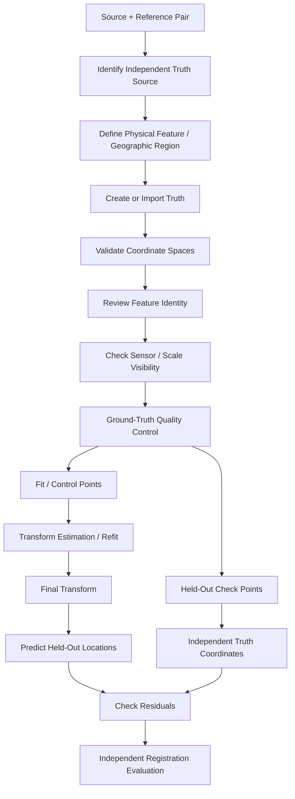
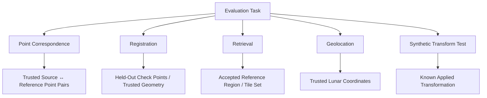
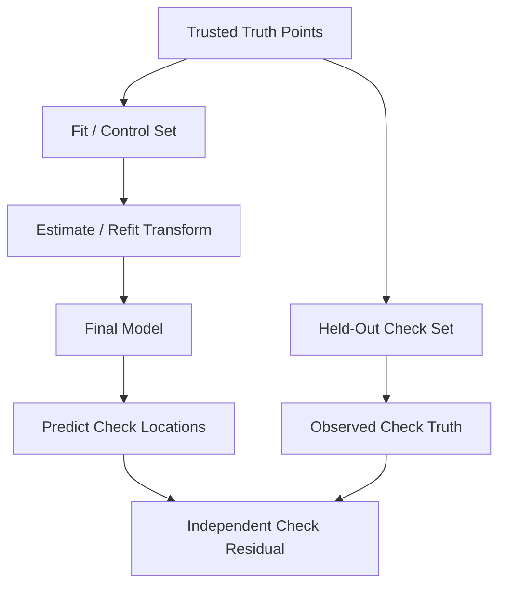

# Ground Truth

Ground truth is the independent reference evidence used to evaluate whether ChandraMap's correspondence, retrieval, registration, and geolocation outputs are correct.

It is not the output produced by ChandraMap itself.

> **Ground truth must be sufficiently independent from the algorithm being evaluated to provide meaningful evidence of correctness.**

Candidate matches, filtered matches, matcher confidence, RANSAC inliers, estimated transforms, refined correspondences, registered overlays, and mosaics are all algorithm outputs. They may support diagnosis, but they are not automatically independent truth.

> **Algorithm output is not automatically ground truth.**

Ground truth is also task-specific. A benchmark evaluating reference retrieval requires a different form of truth from one evaluating point correspondence or lunar geolocation.

> **Ground truth is task-specific.**

ChandraMap therefore distinguishes among:

- point-correspondence truth;
- registration truth;
- retrieval truth;
- geolocation truth;
- synthetic transformation truth.

Ground truth should also not be treated as infinitely precise.

> **Ground truth has uncertainty.**

Manual annotation, sensor resolution, reference geolocation, projection, terrain relief, and product-processing history can all limit the certainty of a truth record.

A further distinction is critical for registration evaluation:

> **Fit points and check points have different roles.**

Fit/control points participate in transformation estimation.

Held-out check/evaluation points remain outside the final fit and provide independent evidence of registration performance.

Most importantly:

> **RANSAC inliers are model-consistent algorithm outputs, not independent ground truth.**

This file defines **what counts as evaluation truth, when it is valid, and how it may be used**.

It intentionally does not duplicate the complete preparation and annotation workflow in [`../datasets/ground-truth-preparation.md`](../datasets/ground-truth-preparation.md).

The distinction is:

- [`../datasets/ground-truth-preparation.md`](../datasets/ground-truth-preparation.md) — how truth is created, reviewed, prepared, and stored;
- this file — what that truth means scientifically during evaluation.

---

## 1. Role of Ground Truth in ChandraMap

Ground truth enables ChandraMap to evaluate whether its outputs correspond to independently supported reality.

Depending on the task, truth may support:

- point-correspondence evaluation;
- transform evaluation;
- independent registration RMSE;
- residual analysis;
- geolocation evaluation;
- retrieval `Recall@K`;
- sub-pixel-refinement validation;
- regression benchmarking;
- model comparison;
- algorithm ablation;
- controlled synthetic validation.

Without independent truth, ChandraMap may still report diagnostics such as:

- candidate count;
- inlier count;
- fit residual;
- spatial coverage.

However, those diagnostics should not be presented as independent accuracy measurements.

---

## 2. What Ground Truth Is Not

The following are **not independent ground truth by themselves**:

- SIFT matches;
- ALIKED + LightGlue matches;
- LoFTR correspondences;
- RIFT/CFOG-style correspondence output;
- matcher confidence values;
- descriptor-distance thresholds;
- ratio-test survivors;
- cross-check survivors;
- RANSAC inliers;
- RANSAC-estimated transforms;
- refined algorithm coordinates;
- algorithm-generated registered rasters;
- visual overlays;
- mosaics;
- retrieval rankings.

They are outputs or intermediate products of the system being evaluated.

They can be compared **against** truth.

They should not silently become truth.

---

# Core Terminology

## 3. Ground Truth

**Ground truth** is independent or externally validated reference information used to evaluate algorithm output.

Its validity depends on:

- provenance;
- task;
- coordinate interpretation;
- quality;
- independence;
- uncertainty;
- benchmark protocol.

---

## 4. Truth Source

A **truth source** is the origin from which evaluation truth is derived.

Possible conceptual examples include:

- official task/reference truth;
- trusted geospatial control information;
- independently reviewed manual correspondences;
- controlled synthetic transformation truth.

Different truth sources support different scientific claims.

---

## 5. Annotation

An **annotation** is a human-created or tool-assisted reference label, point, region, or relationship.

Annotation does not automatically become reliable ground truth.

It requires suitable:

- provenance;
- coordinate context;
- quality control;
- review.

---

## 6. Truth Point

A **truth point** is a point correspondence or geospatial reference accepted for evaluation under a documented truth and benchmark protocol.

A truth point should be traceable to:

- source image;
- reference image or geospatial reference;
- coordinate spaces;
- truth version.

---

## 7. Fit Point

A **fit point** is a point used to estimate or refit a transformation.

Fit points may come from trusted truth or from algorithmically verified correspondences, depending on the experimental design.

Their defining property is:

> they influence the fitted model.

---

## 8. Control Point

In photogrammetric and registration contexts, a **control point** commonly refers to a known correspondence or ground-control relationship used to constrain or estimate geometry.

Within ChandraMap evaluation documentation, the term should be made explicit whenever used.

Prefer:

> **fit/control point**

when the point participates in transformation estimation.

Do not confuse it with an independent check point.

---

## 9. Check Point

A **check point** is trusted truth withheld from transformation fitting and used to evaluate the final model.

> **A point cannot be considered an independent held-out check point for a run if it influenced the final model for that run.**

---

## 10. Evaluation Point

An **evaluation point** is a general term for a point used to assess an algorithm result.

When independence matters, the more precise term:

> **held-out check point**

is preferred.

---

## 11. Source Point

A **source point** is a coordinate in the source image or source-derived representation.

---

## 12. Reference Point

A **reference point** is the corresponding coordinate in the reference image or reference-derived representation.

---

## 13. Point-Correspondence Truth

**Point-correspondence truth** defines a trusted relationship:

$$
p_s \leftrightarrow p_r
$$

where:

- \(p_s\) is a source coordinate;
- \(p_r\) is a reference coordinate;
- both represent the same physical lunar feature as reliably as the truth protocol can establish.

---

## 14. Registration Truth

**Registration truth** is trusted information that allows the geometric relationship between source and reference to be evaluated.

Possible forms include:

- held-out truth correspondences;
- trusted control-network relationships;
- authoritative geospatial references;
- known transformations in controlled synthetic experiments.

---

## 15. Retrieval Truth

**Retrieval truth** defines which reference regions, observations, or tiles are acceptable correct results for a retrieval query.

It may contain:

- one accepted reference;
- several overlapping accepted references;
- a geographic region;
- an accepted product set.

---

## 16. Geolocation Truth

**Geolocation truth** associates an image location with independently trusted lunar geographic coordinates or control information.

It requires explicit coordinate-system context.

---

## 17. Synthetic Truth

**Synthetic truth** is a transformation, coordinate relationship, or label known from controlled data generation.

Its mathematical relationship may be known exactly within the synthetic experiment.

That does not make the experiment fully representative of real lunar imaging.

---

## 18. Truth Uncertainty

**Truth uncertainty** describes uncertainty associated with a truth item.

Possible sources include:

- annotation localization;
- reference geolocation;
- sensor resolution;
- feature ambiguity;
- projection;
- terrain relief.

---

## 19. Truth Version

A **truth version** identifies one frozen definition of evaluation truth.

Truth versions should not silently change after benchmark use.

---

## 20. Annotation Provenance

**Annotation provenance** records how a truth item was produced.

It may include:

- source imagery;
- preparation method;
- annotation method;
- review process;
- truth version;
- supporting source information.

---

## 21. Adjudication

**Adjudication** is the reviewed resolution of disagreement between multiple annotations or reviewers.

Possible outcomes may include:

- accept;
- revise;
- reject;
- mark ambiguous.

Exact status values belong to repository contracts if implemented.

---

## 22. Ambiguous Point

An **ambiguous point** is a candidate truth feature whose physical identity cannot be established reliably enough for the intended evaluation.

Ambiguous points should not be treated as high-confidence evaluation truth merely to increase truth-point count.

---

# Ground-Truth Responsibilities

## 23. What May Qualify as Truth?

| Item                                         |   May Be Evaluation Ground Truth? | Notes                                                         |
| -------------------------------------------- | --------------------------------: | ------------------------------------------------------------- |
| Independently verified manual correspondence |              Yes, with provenance | Review and uncertainty should be recorded where possible      |
| Official task/reference truth                |             Yes, where applicable | Preserve source and version                                   |
| Trusted geospatial control point             |                   Yes, when valid | Coordinate system and provenance are required                 |
| Authoritative control-network information    |              Yes, when applicable | Reference quality still matters                               |
| Synthetic known transform                    | Yes, for the synthetic experiment | Does not prove real-data performance                          |
| Matcher output                               |                      No by itself | Algorithm prediction                                          |
| Filtered matcher output                      |                      No by itself | Still an algorithm prediction                                 |
| Matcher confidence                           |                                No | Method-specific score                                         |
| RANSAC inlier                                |                      No by itself | Model-consistent prediction                                   |
| Algorithm-estimated transform                |                                No | Algorithm output                                              |
| Refined prediction                           |                                No | Algorithm output                                              |
| Registered overlay                           |                                No | Visualization                                                 |
| Mosaic                                       |                                No | Downstream artifact                                           |
| Reference image alone                        |                 Not automatically | A reference image still requires a defined truth relationship |

---

# Task-Specific Truth

## 24. Different Tasks Require Different Truth

| Evaluation Task                | Truth Required                                                     |
| ------------------------------ | ------------------------------------------------------------------ |
| Point correspondence           | Trusted source ↔ reference point pairs                             |
| Registration                   | Held-out geometric check points or trusted transformation          |
| Retrieval                      | Acceptable reference region/tile set                               |
| Geolocation                    | Trusted lunar coordinates/control                                  |
| Synthetic transform validation | Known applied transformation                                       |
| End-to-end localization        | Retrieval truth plus registration/geolocation truth as appropriate |

> **Retrieval truth is not point-correspondence truth, point-correspondence truth is not automatically geolocation truth, and synthetic transform truth is not equivalent to real lunar geospatial truth.**

---

# Ground-Truth Source Hierarchy

## 25. Cautious Truth-Source Hierarchy

A useful conceptual hierarchy may include:

1. official or challenge truth specifically designed for the evaluation task;
2. authoritative geospatial/control information with documented provenance;
3. independently reviewed manual correspondences;
4. held-out manually annotated check points;
5. known transformations in controlled synthetic experiments.

This is not a rigid universal ranking.

A synthetic transformation can be mathematically exact while being less representative of real:

- sensor differences;
- illumination;
- terrain;
- modality.

A manually annotated point may be highly relevant to real data while containing localization uncertainty.

Truth quality must therefore be judged relative to the scientific question.

---

# Sensor Context

## 26. OHRC Truth Context

The Chandrayaan-2 **Orbiter High Resolution Camera (OHRC)** is a visible/panchromatic instrument.

Current project context commonly uses approximately:

> **~0.25–0.32 m/pixel**

depending on product/documentation.

Actual product metadata remains authoritative.

Truth implications include:

- fine terrain structures may be available for annotation;
- pixel-level localization may be comparatively precise;
- ground-level accuracy still depends on reference geometry, truth quality, and coordinate mapping.

See [`../sensors/ohrc.md`](../sensors/ohrc.md).

---

## 27. TMC-2 Truth Context

The Chandrayaan-2 **Terrain Mapping Camera-2 (TMC-2)** is commonly treated in project planning as approximately:

> **~5 m/pixel**

with actual product metadata authoritative.

Truth features should be visible at TMC-2's information scale.

Do not define truth using tiny reference-only structures that TMC-2 cannot meaningfully resolve.

See [`../sensors/tmc2.md`](../sensors/tmc2.md).

---

## 28. IIRS Truth Context

The Chandrayaan-2 **Imaging Infrared Spectrometer (IIRS)** is a hyperspectral/imaging-infrared instrument.

Current project context includes approximately:

- ~80 m/pixel;
- ~0.8–5.0 µm;
- roughly ~250–256 bands depending on product/documentation.

Actual product metadata remains authoritative.

IIRS requires a documented 2D registration representation.

Truth implications include:

- truth must identify the IIRS representation/grid;
- truth points must map correctly to the parent IIRS spatial domain;
- features should be physically meaningful at IIRS spatial scale;
- tiny structures visible only in fine NAC imagery should not be treated as precise IIRS correspondence truth.

See [`../sensors/iirs.md`](../sensors/iirs.md).

---

## 29. LRO NAC Truth Context

LROC **Narrow Angle Camera (NAC)** imagery provides fine lunar reference imagery.

Current project planning commonly uses approximately:

> **~0.5–2 m/pixel**

depending on product/acquisition geometry.

Actual product metadata remains authoritative.

> **NAC reference imagery is not automatically independent ground truth.**

A NAC image can serve as the reference raster while truth still requires:

- independently established point correspondence;
- trusted geographic mapping;
- or another suitable truth relationship.

See [`../sensors/lro-nac.md`](../sensors/lro-nac.md).

---

## 30. LRO WAC Truth Context

LROC **Wide Angle Camera (WAC)** provides broad/coarse lunar context.

Its effective scale is product/mode/processing dependent.

Do not assign one universal WAC GSD.

See [`../sensors/lro-wac.md`](../sensors/lro-wac.md).

---

# Point-Correspondence Truth

## 31. Correspondence Truth Definition

A truth correspondence should identify:

$$
p_s = (x_s, y_s)
$$

and:

$$
p_r = (x_r, y_r)
$$

where the two coordinates represent the same physical lunar feature as reliably as possible.

A point pair is incomplete without identifying:

- source asset;
- reference asset;
- source coordinate space;
- reference coordinate space;
- truth version.

---

## 32. Physical Feature Identity

The key question is not simply:

> do these two patches look similar?

The question is:

> do these coordinates correspond to the same physical lunar feature?

Potentially useful feature types may include, depending on visibility and scale:

- stable crater centers;
- well-defined crater-rim structures;
- ridge intersections;
- distinctive terrain junctions;
- other stable morphological landmarks.

No single feature type is universally preferred.

---

## 33. Feature Visibility in Both Sensors

A valid point-correspondence truth feature should be meaningfully observable in both evaluated representations.

Incorrect approach:

```text
Fine NAC feature
→ clearly visible in NAC
→ absent at source scale
→ still used as precise source truth
```

Preferred approach:

```text
Physical feature
→ observable in source
→ observable in reference
→ independently validated as same terrain structure
```

---

## 34. Coarse-Sensor Truth

For TMC-2 and especially IIRS, prefer broader structures that the source sensor can physically represent.

Do not force fine-reference detail into truth simply because the reference image contains it.

---

# Ambiguous Lunar Features

## 35. Repetitive Terrain

Lunar terrain may contain repeated structures such as:

- similar craters;
- adjacent crater rims;
- repeated ridge fragments.

These can create visually plausible but physically ambiguous correspondences.

An ambiguous feature should be:

- reviewed;
- rejected;
- or explicitly marked uncertain;

rather than forced into trusted truth.

---

## 36. Smooth Terrain

Featureless or weakly textured areas may not provide a sufficiently precise physical landmark.

Do not create a highly precise truth point where the feature itself is poorly localized.

---

## 37. Partially Hidden Features

Features that are:

- partly shadowed;
- cut by image boundaries;
- obscured by NoData;
- only partially visible;

require special caution.

---

# Shadows and Truth

## 38. Shadow Boundaries Are Not Stable Surface Points

Lunar shadow geometry changes with illumination.

A shadow boundary observed at one acquisition can move relative to the underlying terrain in another acquisition.

Therefore:

> **A shadow-edge pixel is not automatically a stable physical correspondence.**

---

## 39. Prefer Stable Terrain Geometry

Where possible, truth annotation should prefer physical terrain structures over illumination-dependent edges.

For example:

- stable crater morphology;
- ridges;
- terrain intersections;

may provide stronger physical identity than a moving shadow boundary.

See [`../algorithms/illumination-handling.md`](../algorithms/illumination-handling.md).

---

# Fit and Control Points

## 40. Fit Point Definition

Fit points participate in:

- initial transformation estimation;
- final transformation refitting;
- other benchmark-defined fitting stages.

Because they influence the model, residuals on those points are fitting diagnostics.

---

## 41. Control-Point Terminology

Photogrammetry often uses **control point** to describe a known point used to constrain geometric estimation.

Within ChandraMap, documentation should make the point role explicit.

Use terms such as:

- fit/control point;
- held-out check/evaluation point.

This avoids ambiguity.

---

## 42. Fit Points Are Not Independent Accuracy Evidence

A transformation is designed to explain its fitting data.

Therefore:

$$
\text{fit residual}
$$

is not equivalent to:

$$
\text{independent registration error}
$$

A low fit RMSE can coexist with poor generalization elsewhere.

---

# Check and Evaluation Points

## 43. Check Point Definition

A **check point** is trusted truth that remains outside the final model-fitting process for the evaluated run.

It is used to answer:

> how accurately does the final transformation predict locations it was not fitted on?

---

## 44. Independence Requirement

A check point used for final evaluation should not influence:

- RANSAC model fitting;
- final transform estimation;
- final transform refitting;
- sub-pixel fit refinement;
- parameter selection based on the final test benchmark.

---

## 45. Spatial Distribution

Check points should ideally span useful parts of the valid overlap.

A set concentrated around one crater may provide strong local evidence but weak scene-wide evidence.

---

## 46. No Universal Check-Point Count

ChandraMap does not define one universal required count.

The required number depends on:

- overlap size;
- terrain;
- sensor;
- truth availability;
- transform complexity;
- desired confidence.

The number actually used should always be reported.

---

## 47. Quality Over Artificial Density

Do not create weak or ambiguous check points simply to make the count larger.

> **A small set of reliable independent checks is more useful than a large set of uncertain pseudo-truth points.**

---

# Fit vs Check Comparison

## 48. Point-Role Table

| Property                               | Fit / Control Point | Check / Evaluation Point                |
| -------------------------------------- | ------------------- | --------------------------------------- |
| Used to estimate final transform       | Yes                 | No                                      |
| Used for fit residual                  | Yes                 | Not normally needed for fit diagnostics |
| Used for independent RMSE              | Not by itself       | Yes                                     |
| Should be spatially distributed        | Preferably          | Preferably                              |
| May come from same truth source        | Yes                 | Yes                                     |
| May share the same role during one run | No                  | No                                      |
| Can influence final model              | Yes                 | No                                      |
| Provides held-out evidence             | No                  | Yes                                     |

A single truth dataset may contain both roles.

The role assignment, rather than the physical source alone, determines independence for a particular run.

---

# RANSAC and Ground Truth

## 49. RANSAC Inliers Are Not Ground Truth

This distinction is fundamental to ChandraMap evaluation.

RANSAC conceptually performs:

```text
Candidate correspondences
→ geometric model hypothesis
→ consistency test
→ accepted inliers
→ rejected outliers
```

A RANSAC inlier means:

> the candidate is sufficiently consistent with the selected geometric model under the configured residual rule.

It does **not** independently establish:

- physical feature identity;
- geographic correctness;
- absolute lunar coordinates;
- final registration accuracy.

> **RANSAC inliers are model-consistent algorithm outputs, not independent ground truth.**

See [`../algorithms/ransac.md`](../algorithms/ransac.md).

---

## 50. False Geometric Consensus

Repeated lunar structures can occasionally support geometrically coherent but incorrect matches.

For example:

- repeated craters;
- similar rim structures;
- similar local terrain configurations;

may produce a false consensus.

This is another reason to separate:

- geometric verification;
- independent truth.

---

## 51. RANSAC Threshold Does Not Define Truth

Changing the RANSAC residual threshold can change which candidates become inliers.

Independent truth should not change merely because the algorithm threshold changed.

---

# Reference Imagery vs Ground Truth

## 52. Reference Image Is Not Automatically Truth

An image can be the registration reference without being independent evaluation truth.

For example:

```text
Source:
TMC-2 image

Reference:
LRO NAC raster
```

does not automatically imply:

```text
Every NAC pixel coordinate
=
perfect lunar truth
```

Truth still requires a documented relationship.

---

## 53. Reference-Image Uncertainty

Reference products may have uncertainty related to:

- geolocation;
- projection;
- calibration;
- processing;
- terrain;
- acquisition geometry.

Reference quality should therefore be considered when interpreting evaluation.

---

## 54. Reference and Truth Have Different Roles

Reference imagery provides:

> the image coordinate frame to which ChandraMap attempts to align.

Ground truth provides:

> independent evidence used to judge whether that alignment is correct.

---

# Registration Truth

## 55. Purpose of Registration Truth

Registration truth allows ChandraMap to evaluate how accurately the final source-to-reference relationship has been estimated.

Possible forms include:

- held-out point correspondences;
- trusted control-network information;
- authoritative geospatial references;
- controlled known synthetic transformations.

---

## 56. Held-Out Point Truth

For real lunar imagery, independent point correspondences are often a practical source of registration truth.

The algorithm predicts a location.

The truth point provides the independently defined expected location.

The difference produces:

- check residual;
- check RMSE;
- related metrics.

---

## 57. Known Transform Truth

In a controlled synthetic experiment, the intentionally applied transformation may be exactly known.

That applied transform can serve as synthetic registration truth.

---

## 58. Estimated Transform Is Not Truth

An affine matrix or homography estimated by ChandraMap is:

> the algorithm's prediction.

It does not become truth merely because:

- RANSAC accepted it;
- the overlay looks good;
- fit residual is small.

---

# Retrieval Ground Truth

## 59. Retrieval Truth Definition

For each retrieval query, define one or more acceptable correct reference regions.

The truth may identify:

- one tile;
- several tiles;
- one observation;
- several overlapping observations;
- a geographic region.

The exact truth representation belongs to the retrieval benchmark design.

---

## 60. Multiple Correct Tiles

Reference tiling can create several valid answers for the same source region.

For example:

```text
Reference Tile A
→ contains source footprint

Reference Tile B
→ overlaps same footprint
```

Both may be valid.

Do not force one arbitrary tile to be the only correct result when benchmark geometry supports several.

---

## 61. Retrieval Truth Should Be Independent

Do not define retrieval truth by running the retrieval system itself.

Invalid circular logic:

```text
Retriever ranks Tile A first
→ Tile A becomes truth
```

Preferred logic:

```text
Known footprint / independently validated region
→ acceptable reference set
→ evaluate retrieval ranking
```

---

## 62. Retrieval Truth Is Not Point Truth

A retrieved tile can be geographically correct while local registration still fails.

Therefore:

```text
Retrieval Truth
→ validates reference-region retrieval

Point / Registration Truth
→ validates geometric alignment
```

They must remain separate.

---

# Geolocation Ground Truth

## 63. Geolocation Truth Definition

Geolocation truth associates image points or regions with trusted lunar geographic coordinates.

It may come from:

- authoritative geospatial products;
- validated control networks;
- trusted map products;
- other independently supported lunar-control information.

---

## 64. Coordinate-System Context

A geolocation truth record should identify the relevant coordinate semantics, including where applicable:

- coordinate system;
- projection;
- lunar reference/datum convention;
- longitude convention;
- units;
- map grid.

Do not invent a universal convention when the repository has not yet established one.

---

## 65. Pixel-to-Ground Chain

A conceptual geolocation path is:

```text
Source Pixel
→ Registration Transform
→ Reference Pixel
→ Reference Geospatial Mapping
→ Lunar Geographic Coordinate
```

Each stage can contribute uncertainty.

A low image-space residual does not automatically prove equally low absolute lunar-coordinate error.

---

# Synthetic Ground Truth

## 66. Known Synthetic Transformation

A synthetic test may apply a known transformation such as:

- translation;
- rotation;
- scaling;
- projective mapping.

Because the transformation is deliberately generated, its parameters can serve as exact computational truth for that synthetic experiment.

---

## 67. Synthetic Truth Advantages

Synthetic truth is useful for:

- unit testing;
- coordinate-mapping validation;
- transformation recovery tests;
- metric validation;
- regression testing;
- controlled scale/rotation stress.

---

## 68. Synthetic Truth Limitations

Synthetic transformation does not automatically recreate:

- real lunar illumination;
- sensor noise;
- cross-spectral appearance;
- terrain relief;
- sensor point-spread behavior;
- real viewing geometry;
- projection errors.

> **Synthetic success does not prove real lunar registration performance.**

---

# Augmented Real Data

## 69. Augmented Real Imagery

A real mission image may be modified with a known synthetic transformation.

The resulting test contains:

- real lunar texture;
- known synthetic geometry.

Parent-product provenance should remain preserved.

---

## 70. Photometric Augmentation

Operations such as:

- brightness change;
- contrast change;
- gamma change;

can be useful controlled appearance perturbations.

They do not physically reproduce a new lunar Sun geometry.

Therefore photometric augmentation should not automatically be described as physical illumination truth.

---

# IIRS Ground Truth

## 71. IIRS Representation Identity Is Mandatory

IIRS scientific data are hyperspectral.

An evaluation truth record should identify the specific 2D registration representation used by the algorithm.

Possible conceptual representation types include:

- selected band;
- component-derived image;
- composite;
- structural representation.

---

## 72. Parent-Cube Mapping

A derived IIRS representation should remain traceable to:

- parent IIRS product;
- parent spatial grid;
- representation-generation process.

Truth coordinates should not become detached from the parent scientific observation.

---

## 73. Scale-Aware Truth

Truth features for IIRS should be meaningful at IIRS's spatial-information scale.

Incorrect approach:

```text
Tiny NAC crater detail
→ invisible in IIRS
→ assigned as precise IIRS truth point
```

Preferred approach:

```text
Broad physical terrain feature
→ identifiable in IIRS representation
→ identifiable in reference
→ independently reviewed
```

---

## 74. IIRS Floating Coordinates Do Not Imply Fine Physical Truth

An IIRS truth coordinate may be stored as floating-point values for computational precision.

That does not imply the physical feature is known at fine NAC-scale certainty.

---

# Coordinate Spaces

## 75. Coordinate Space Is Mandatory

A truth coordinate:

```text
(x, y)
```

is scientifically incomplete without identifying its coordinate space.

Possible spaces include:

- source full-product pixels;
- source crop pixels;
- prepared-source pixels;
- model-input pixels;
- IIRS-derived representation pixels;
- reference tile pixels;
- reference pyramid pixels;
- parent reference pixels;
- projected/map coordinates.

---

## 76. Source Coordinate Space

A source truth record should identify exactly where its coordinates live.

Examples include:

```text
OHRC full-product pixels
```

or:

```text
TMC-2 prepared crop pixels
```

or:

```text
IIRS registration-representation pixels
```

---

## 77. Reference Coordinate Space

Likewise, a reference coordinate may belong to:

- NAC native product;
- NAC tile;
- NAC pyramid level;
- WAC product;
- projected reference raster.

---

## 78. x/y vs Row/Column

Do not assume that:

```text
x = row
y = column
```

or the reverse.

The project coordinate convention should be defined in dataset/data-format documentation and preserved in every truth mapping.

See [`../datasets/data-format.md`](../datasets/data-format.md).

---

## 79. Pixel Origin

High-precision evaluation may depend on whether image indexing is interpreted as:

- zero-based;
- one-based.

The project's actual convention should be explicit.

This document does not invent it.

---

## 80. Pixel Center vs Pixel Corner

Sub-pixel coordinates also require a convention for whether integer coordinates refer to:

- pixel centers;
- pixel corners.

A mismatch can introduce systematic error.

---

# Crop, Tile, and Pyramid Mapping

## 81. Crop Coordinates

If truth is annotated in a crop, preserve enough information to map:

$$
p_{\text{crop}}
\rightarrow
p_{\text{parent}}
$$

For a simple untranslated crop this may conceptually involve:

$$
x_{\text{parent}}
=
x_{\text{crop}}
+
x_{\text{offset}}
$$

$$
y_{\text{parent}}
=
y_{\text{crop}}
+
y_{\text{offset}}
$$

More complex preprocessing may require additional transforms.

---

## 82. Tile Coordinates

Reference-tile truth should preserve:

- tile identity;
- parent product;
- tile origin;
- coordinate relationship to parent.

---

## 83. Pyramid-Level Coordinates

If truth is expressed at:

```text
NAC pyramid level L
```

that coordinate belongs to:

> **level L's grid.**

It must not silently be treated as a native/base-level NAC coordinate.

See [`../algorithms/scale-pyramid.md`](../algorithms/scale-pyramid.md).

---

## 84. Prefer Canonical Truth Plus Mapping

Where scientifically valid, prefer:

```text
canonical parent/base truth
+
deterministic coordinate mappings
```

over duplicating independently edited truth for every:

- crop;
- tile;
- pyramid level.

This reduces inconsistency risk.

---

# Ground-Truth Uncertainty

## 85. Ground Truth Is Not Infinitely Precise

Truth uncertainty may arise from:

- manual localization;
- coarse source sampling;
- uncertain crater-center definition;
- shadowing;
- sensor point-spread behavior;
- reference geolocation;
- projection;
- terrain relief.

---

## 86. Point-Level Uncertainty

Where useful and supported, a truth record may preserve:

- qualitative uncertainty;
- estimated localization uncertainty;
- annotation agreement;
- review state;
- ambiguity notes.

This file does not require one universal numeric uncertainty model.

---

## 87. Truth Precision vs Coordinate Precision

A coordinate can contain many decimal digits without possessing equivalent physical certainty.

For example:

```text
x = 123.417392
```

does not prove the physical lunar location is known to six decimal places of pixel accuracy.

---

## 88. Truth Uncertainty Limits Metric Interpretation

Suppose two algorithms differ only slightly in check RMSE.

If truth uncertainty is comparable to that difference, claiming definite superiority may not be scientifically justified.

Evaluation should avoid over-interpreting tiny numerical differences.

---

# Manual Annotation Quality

## 89. Manual Annotation

Manual annotation may be necessary where no authoritative correspondence truth exists.

It should use a documented preparation/review procedure.

See [`../datasets/ground-truth-preparation.md`](../datasets/ground-truth-preparation.md).

---

## 90. Multiple Annotators

Where practical, multiple independent annotations can help identify:

- coordinate disagreement;
- feature-identity ambiguity;
- difficult truth cases.

Multiple annotators are useful but not universally mandatory.

---

## 91. Annotation Agreement

Possible conceptual agreement diagnostics include:

- coordinate displacement;
- feature-identity agreement;
- disagreement notes.

No universal numeric agreement threshold is defined here.

---

## 92. Adjudication

Where annotations disagree, an adjudication process may determine whether to:

- accept one interpretation;
- revise the point;
- reject the point;
- classify it as ambiguous.

The process should remain traceable.

---

## 93. Personal Information

Truth provenance should preserve scientific process without unnecessarily exposing personal information about annotators.

Contributor identity requirements, if any, belong to project governance and annotation workflow documentation.

---

# Algorithm-Assisted Annotation

## 94. Algorithms May Suggest Candidates

A matcher may help an annotator locate potential correspondences.

This can improve annotation efficiency.

However:

> **An algorithm proposal does not become truth merely because a human sees it.**

---

## 95. Independent Review Is Required

Algorithm-assisted annotations should be independently reviewed or otherwise validated before being accepted as benchmark truth.

This is especially important if the same method will later be evaluated against that truth.

---

## 96. Circular Truth Must Be Avoided

Invalid process:

```text
Run ChandraMap
→ take RANSAC inliers
→ save as truth
→ evaluate ChandraMap against same inliers
```

This measures self-consistency, not independent accuracy.

---

# Truth Quality

## 97. Truth Quality Factors

If ChandraMap later introduces truth-quality classifications, possible factors may include:

- source authority;
- annotation independence;
- review level;
- feature ambiguity;
- localization uncertainty;
- geospatial uncertainty;
- cross-sensor visibility.

No current numeric grade or quality-score system is defined here.

---

## 98. Truth Quality Is Not Algorithm Performance

A truth-quality label should describe:

> confidence in the evaluation reference.

It should not describe:

> whether ChandraMap performs well on that case.

---

# Ground-Truth Quality Control

## 99. Point Validation

Truth-point QC should verify:

- finite coordinates;
- valid source asset;
- valid reference asset;
- correct pair;
- correct coordinate spaces;
- in-bounds coordinates;
- correct feature identity;
- scale compatibility;
- assigned point role;
- truth-version membership.

---

## 100. Duplicate-Point Review

Duplicate or near-duplicate truth points can overweight one local feature.

Potential duplicates should be detected and reviewed.

---

## 101. Spatial Coverage QC

Review whether:

- fit points;
- check points;

provide useful distribution across the valid overlap.

A spatially concentrated truth set should be documented as a limitation.

---

## 102. Scale-Compatibility QC

Verify that the physical feature used for truth is observable in:

- source;
- reference.

This is particularly important for:

- TMC-2;
- IIRS.

---

## 103. Projection and Mapping QC

Before benchmark release, verify:

- crop offsets;
- tile offsets;
- pyramid transforms;
- map coordinates;
- parent-product relationships.

A coordinate-mapping error can invalidate otherwise correct truth.

---

# Truth Provenance

## 104. Minimum Provenance Concepts

A truth definition should ideally preserve:

- truth identity;
- truth version;
- pair identity/version;
- source asset;
- reference asset;
- parent products;
- truth type;
- coordinate spaces;
- creation method;
- review method;
- provenance source;
- role;
- validity/status.

Exact software field names are not prescribed here.

---

## 105. Authoritative External Source

Where truth derives from official/control information, preserve the authoritative:

- product;
- control source;
- dataset/version;

where available.

---

## 106. Manual Truth Provenance

A manually generated truth set may preserve conceptually:

- annotation method;
- review process;
- annotation software/version where useful;
- revision/version information.

Do not fabricate annotator names, dates, or tools.

---

# Conceptual Point-Truth Record

## 107. Illustrative Structure

The following is an **illustrative conceptual structure — not an implemented schema**:

```yaml
truth_id: "PLACEHOLDER_TRUTH_ID"
truth_version: "PLACEHOLDER_VERSION"
pair_id: "PLACEHOLDER_PAIR_ID"

type: "point_correspondence"

source:
  asset_id: "PLACEHOLDER_SOURCE"
  coordinate_space: "PLACEHOLDER_SOURCE_SPACE"
  x: "PLACEHOLDER"
  y: "PLACEHOLDER"

reference:
  asset_id: "PLACEHOLDER_REFERENCE"
  coordinate_space: "PLACEHOLDER_REFERENCE_SPACE"
  x: "PLACEHOLDER"
  y: "PLACEHOLDER"

role: "PLACEHOLDER_FIT_OR_CHECK_ROLE"

provenance:
  method: "PLACEHOLDER_METHOD"
  review_status: "PLACEHOLDER_STATUS"

uncertainty:
  status: "PLACEHOLDER_UNCERTAINTY_DESCRIPTION"
```

No real truth measurements or exact repository schema are implied.

---

# Conceptual Retrieval-Truth Record

## 108. Illustrative Retrieval Structure

The following is also conceptual:

```yaml
query_id: "PLACEHOLDER_QUERY_ID"

acceptable_references:
  - "PLACEHOLDER_REFERENCE_TILE_A"
  - "PLACEHOLDER_REFERENCE_TILE_B"

truth_basis:
  type: "PLACEHOLDER_GEOGRAPHIC_OR_OVERLAP_BASIS"

truth_version: "PLACEHOLDER_VERSION"
```

Several acceptable reference tiles may be valid because lunar reference tiles can overlap.

---

# Truth Versioning

## 109. Truth Must Be Versioned

Material changes to truth include:

- coordinate changes;
- feature-identity changes;
- fit/check role changes;
- ambiguity status changes;
- reference changes;
- retrieval accepted-set changes;
- coordinate-convention changes.

These can alter benchmark results.

---

## 110. Published Truth Must Not Change Silently

When benchmark truth is corrected, the project should create or update an explicit truth version according to repository policy.

The correction should explain:

- what changed;
- why;
- which benchmark versions are affected.

---

## 111. Pair, Truth, and Benchmark Versions

Keep these concepts distinct:

| Version           | Meaning                                                   |
| ----------------- | --------------------------------------------------------- |
| Pair Version      | Defines the scientific source/reference relationship      |
| Truth Version     | Defines evaluation reference information                  |
| Benchmark Version | Freezes evaluated cases, truth use, protocol, and metrics |

Changing one does not automatically mean the others are unchanged.

---

# Invalid and Deprecated Truth

## 112. Invalid Truth Point

A truth point may later be found to be:

- wrong;
- ambiguous;
- duplicated;
- out of bounds;
- mapped to the wrong coordinate system;
- based on an incorrect feature identity.

Do not silently remove it from historical benchmark interpretation.

---

## 113. Deprecation

A truth version may retain a record that a point or truth set has been deprecated.

Exact repository status semantics, if implemented, belong to the data schema.

---

## 114. Replacement Truth

When a truth item is replaced, preserve lineage where practical so contributors can understand:

- which record replaced it;
- why.

---

# Ground-Truth Leakage

## 115. What Is Truth Leakage?

Truth leakage occurs when information intended for independent evaluation improperly influences:

- model training;
- threshold selection;
- configuration tuning;
- preprocessing choices;
- algorithm design decisions applied to the final test.

---

## 116. Threshold Tuning Leakage

Do not repeatedly tune:

- descriptor thresholds;
- ratio thresholds;
- RANSAC thresholds;
- refinement windows;

against final held-out test check points.

---

## 117. Model-Training Leakage

Do not use final benchmark truth to train a model and then claim the same truth remains independently held out for that model.

---

## 118. Geographic Leakage

Lunar products and tiles may overlap strongly.

A training and test split containing nearly identical terrain can overstate generalization.

See [`benchmark-protocol.md`](benchmark-protocol.md).

---

## 119. Parent-Product Leakage

Different crops from the same parent product may be strongly related.

This relationship should be considered when benchmark independence matters.

---

## 120. IIRS Representation Leakage

Different 2D representations from one IIRS observation share the same parent acquisition.

They are not automatically independent samples.

---

# Truth Across Development, Validation, and Test

## 121. Development Truth

Development truth may support:

- debugging;
- exploratory tuning;
- pipeline development.

---

## 122. Validation Truth

Validation truth may support:

- configuration selection;
- threshold tuning;
- model selection.

---

## 123. Test Truth

Final test truth should remain held out from tuning when it is intended to support independent benchmark claims.

---

# Ground Truth and Sub-Pixel Refinement

## 124. Algorithm Refinement vs Truth Refinement

These are separate processes.

### Algorithm Sub-Pixel Refinement

Changes:

> predicted algorithm correspondence coordinates.

### Ground-Truth Refinement

Changes:

> evaluation reference coordinates through annotation/review improvement.

Do not confuse them.

See [`../algorithms/subpixel-refinement.md`](../algorithms/subpixel-refinement.md).

---

## 125. Refined Check Points Remain Held Out

A check point may be re-reviewed or improved while remaining a check point.

Improving its annotation does not require using it for fitting.

---

## 126. Truth Refinement Requires Versioning

If a truth coordinate changes materially, preserve that revision through the truth-version process.

---

# Ground Truth and Residual Analysis

## 127. Check Residual

For a held-out source truth point \(p_s\) and trusted reference point \(p_r\), a final transform predicts:

$$
\hat{p}_r = T(p_s)
$$

A documented residual convention may then define:

$$
r = p_r - \hat{p}_r
$$

The residual is meaningful only because \(p_r\) is independently defined evaluation truth.

See [`../algorithms/residual-analysis.md`](../algorithms/residual-analysis.md).

---

## 128. Truth Uncertainty Limits Residual Interpretation

A very small numerical residual should not be interpreted beyond:

- truth precision;
- sensor information;
- reference quality.

---

# Ground Truth and Metrics

## 129. Metrics Depend on Truth Type

Examples include:

```text
Point-correspondence truth
→ check residual
→ check RMSE
```

```text
Retrieval truth
→ Recall@K
```

```text
Geolocation truth
→ lunar-coordinate / physical ground error
```

```text
Synthetic transform truth
→ known-transform recovery error
```

See [`metrics.md`](metrics.md).

---

## 130. No Truth Means No Independent Accuracy Metric

If independent check truth is unavailable:

do not fabricate:

- check RMSE;
- independent registration accuracy;
- geolocation error.

A valid report can instead state:

> fit diagnostics available; independent registration accuracy unavailable.

---

# Ground Truth and Benchmark Categories

## 131. Categories and Truth Are Different

See [`benchmark-categories.md`](benchmark-categories.md).

A benchmark category describes:

> the scientific challenge represented by the case.

Ground truth describes:

> the independent reference used to evaluate the result.

---

## 132. Poor Truth Quality Is Not a Difficulty Category

A benchmark case should not be called:

> hard

simply because its truth is uncertain.

That uncertainty is a limitation of evaluation evidence.

It is not necessarily a property of the underlying correspondence task.

---

# Ground Truth and Benchmark Protocol

## 133. Protocol Controls Truth Use

See [`benchmark-protocol.md`](benchmark-protocol.md).

The benchmark protocol determines:

- which truth version is frozen;
- which points are fit points;
- which points are check points;
- which split is being evaluated;
- which metrics consume which truth.

---

# Ground Truth and Registration

## 134. Registration Evaluation

The final transformation produced by [`../algorithms/registration.md`](../algorithms/registration.md) should be evaluated against independent truth where available.

---

## 135. Registered Preview Is Not Truth

A visually convincing registered overlay can be useful for diagnosis.

It does not replace:

- held-out check points;
- trusted geographic truth.

---

# Ground Truth and Transforms

## 136. Estimated Transform Is Prediction

See [`../algorithms/transforms.md`](../algorithms/transforms.md).

An affine transform, homography, or future geometric model estimated from ChandraMap correspondences is an algorithm output.

---

## 137. Synthetic Transform Exception

A transformation deliberately applied during controlled synthetic data generation may be known truth.

This should remain clearly distinguished from:

- algorithm-estimated transformation.

---

# Ground Truth and Retrieval

## 138. Geographic Retrieval Truth

Retrieval truth should be established from independent information such as:

- validated footprint overlap;
- geographic relationships;
- known source/reference relationships.

---

## 139. Retrieval Output Cannot Define Retrieval Truth

Avoid circular logic in which the retriever's own result becomes the benchmark answer.

---

# Ground Truth and Sensor Routing

## 140. Sensor Route Must Not Redefine Truth

See [`../algorithms/sensor-routing.md`](../algorithms/sensor-routing.md).

Different processing routes may use:

- different representations;
- different matchers;
- different reference levels.

Truth must remain consistently mapped to the scientific coordinate spaces relevant to each route.

---

# Ground Truth and Preprocessing

## 141. Preprocessing Can Change Coordinates

See [`../algorithms/preprocessing.md`](../algorithms/preprocessing.md).

Operations such as:

- cropping;
- resizing;
- resampling;
- reprojection;

can change coordinate grids.

Truth coordinates must be mapped appropriately.

---

## 142. Preserve Parent-Product Coordinates

Where practical, retain a canonical mapping back to:

- source parent product;
- reference parent product.

This makes truth reusable across preprocessing variants.

---

# Ground Truth and Scale Pyramid

## 143. Pyramid Mapping

See [`../algorithms/scale-pyramid.md`](../algorithms/scale-pyramid.md).

If a benchmark operates on a downsampled reference level, truth coordinates may need deterministic mapping to that level.

---

## 144. Canonical vs Derived Truth Coordinates

Prefer distinguishing:

- canonical truth coordinates;
- derived level-specific coordinates.

Do not manually create unrelated copies of the same truth for every pyramid level without need.

---

# Ground Truth and Matching

## 145. Matcher Independence

See [`../algorithms/matching.md`](../algorithms/matching.md).

Ground truth should ideally support fair comparison across applicable matchers such as:

- SIFT;
- ALIKED + LightGlue;
- LoFTR;
- remote-sensing methods.

Do not create separate truth simply because one matcher behaves differently, unless there is a scientifically justified representation/task difference.

---

# Ground Truth and Match Filtering

## 146. Filtered Candidates Are Still Predictions

See [`../algorithms/match-filtering.md`](../algorithms/match-filtering.md).

A candidate that survives:

- ratio filtering;
- mutual consistency;
- confidence filtering;

is still an algorithm-generated correspondence.

---

# Ground Truth and RANSAC

## 147. Keep Verification and Truth Separate

See [`../algorithms/ransac.md`](../algorithms/ransac.md).

The conceptual distinction is:

```text
RANSAC
→ Which algorithm candidates agree geometrically?

Ground Truth
→ What independent evidence says is correct?
```

These are not interchangeable.

---

# Multiple Annotators

## 148. Independent Annotation

Where practical, multiple annotators may independently identify the same physical lunar feature.

This can help reveal:

- localization disagreement;
- feature ambiguity;
- unstable truth.

---

## 149. Agreement Analysis

Possible conceptual agreement evidence includes:

- coordinate difference;
- feature-identity agreement;
- reviewer notes.

No fixed agreement threshold is defined here.

---

## 150. Adjudication Record

A final truth record may preserve that:

- disagreement existed;
- review resolved it.

Exact reviewer/status schemas belong to truth-preparation tooling if implemented.

---

# Annotation Bias

## 151. Blind Annotation

For high-quality benchmark truth, annotating without showing the evaluated algorithm's prediction may reduce bias.

This is recommended where practical.

---

## 152. Algorithm-Assisted Annotation Caveat

If algorithm suggestions are shown to annotators, record that process.

The resulting truth may still be usable after independent review, but it should not be described as fully blind annotation.

---

# Truth Coverage

## 153. Spatial Coverage

Truth should ideally sample useful portions of the valid overlap.

Check-point placement that covers only one local feature limits the strength of scene-wide claims.

---

## 154. Terrain Coverage

Where practical, avoid choosing truth exclusively from:

- easiest crater;
- strongest edge;
- highest-contrast terrain.

This may bias evaluation toward favorable regions.

---

## 155. Visibility Takes Priority Over Density

Do not force truth points into:

- unresolvable;
- ambiguous;
- shadow-dependent;

regions merely to increase spatial density.

---

# Truth Density Across Sensors

## 156. Equal Density Is Not Required

Fine OHRC imagery may support many reliable annotations.

Coarse IIRS imagery may support far fewer.

The benchmark should not force equal point density across sensors.

---

## 157. Sensor Context Determines Interpretability

A truth feature suitable for:

- OHRC ↔ NAC

may not be suitable for:

- IIRS ↔ NAC.

---

# Truth Quality and Metric Precision

## 158. Do Not Overstate Precision

If truth localization is approximately pixel-scale, very small sub-pixel differences between algorithms may not justify strong conclusions.

---

## 159. Significant Digits

Metric output should use precision consistent with:

- truth uncertainty;
- source/reference sampling;
- geometric model accuracy.

Avoid artificial numerical precision.

---

# Truth Failure States

## 160. Truth Unavailable

A valid benchmark metadata state may be:

> independent truth unavailable.

This is better than fabricating truth.

---

## 161. Truth Insufficient

Truth may exist but remain insufficient because of:

- too few check points;
- spatial clustering;
- unresolved ambiguity;
- unreliable coordinate mapping.

Document these limitations.

---

## 162. Truth QC Failure vs Algorithm Failure

A benchmark pair may be deferred before release because truth cannot be validated.

That is a:

> truth/dataset quality issue.

It is different from:

> an algorithm failure on a valid benchmark case.

---

# Ground-Truth Status

## 163. Conceptual Statuses

Possible conceptual states may include:

- draft;
- reviewed;
- validated;
- deprecated;
- invalid.

These are examples only.

Do not assume they are implemented enum values.

---

# Ground-Truth Change Control

## 164. Correction Workflow

A conceptual truth-correction process is:

```text
Issue Discovered
→ Review Evidence
→ Determine Correction
→ Create New Truth Version
→ Document Change
→ Update Affected Benchmark Definition Where Required
→ Preserve Historical Interpretation
```

---

# Benchmark Immutability

## 165. Frozen Benchmark Truth

Once a benchmark version is frozen, the truth associated with it should remain immutable for reproducible comparison.

A scientifically necessary correction should create a traceable new:

- truth version;
- benchmark version where required.

---

# Ground-Truth Tables

## 166. Point-Level Truth Template

| Truth ID | Pair | Role | Source Space | Reference Space | Truth Type | Review Status | Uncertainty | Version |
| -------- | ---- | ---- | ------------ | --------------- | ---------- | ------------- | ----------- | ------- |
| —        | —    | —    | —            | —               | —          | —             | —           | —       |

No real truth records are implied.

---

## 167. Truth-Source Comparison

| Truth Source                                 | Strength                                       | Limitation                                   | Suitable Use                             |
| -------------------------------------------- | ---------------------------------------------- | -------------------------------------------- | ---------------------------------------- |
| Official task/reference truth                | Independent and authoritative where applicable | May not exist for all ChandraMap tasks       | Benchmark evaluation                     |
| Trusted geospatial control                   | Provides geographic/control context            | Depends on reference/control quality         | Registration or geolocation              |
| Independently reviewed manual correspondence | Supports real cross-sensor imagery             | Annotation uncertainty and feature ambiguity | Check points / correspondence evaluation |
| Synthetic known transform                    | Transformation is known by construction        | Limited realism                              | Unit tests and controlled stress tests   |

No truth source is universally perfect.

---

# Ground-Truth QC Checklist

## 168. Truth Validation Checklist

Before using truth in an official benchmark, verify:

- [ ] Source asset identity is known.
- [ ] Reference asset identity is known.
- [ ] Pair ID/version is known.
- [ ] Truth type is known.
- [ ] Truth source/provenance is known.
- [ ] Source coordinate space is known.
- [ ] Reference coordinate space is known.
- [ ] x/y versus row/column convention is known.
- [ ] Pixel-origin convention is known.
- [ ] Pixel-center/corner convention is known where precision requires it.
- [ ] Crop offsets are known where applicable.
- [ ] Tile offsets are known where applicable.
- [ ] Pyramid level is known where applicable.
- [ ] Source coordinates are within bounds.
- [ ] Reference coordinates are within bounds.
- [ ] Feature identity is independently supported.
- [ ] Physical feature is visible in both sensor representations.
- [ ] Shadow-only ambiguous features have been avoided or explicitly justified.
- [ ] Duplicate points have been checked.
- [ ] Ambiguity status has been reviewed.
- [ ] Fit/check role is assigned.
- [ ] Check points remain outside final fitting.
- [ ] Check-point spatial distribution has been reviewed.
- [ ] IIRS representation is recorded where applicable.
- [ ] Parent IIRS mapping is preserved where applicable.
- [ ] Uncertainty or review status is recorded where practical.
- [ ] Truth version is recorded.
- [ ] Benchmark-version compatibility is verified.
- [ ] No algorithm output was accepted automatically as truth.

---

# Main Ground-Truth Flow

## 169. Ground-Truth Evaluation Flow



The independent check-point branch does not enter transformation fitting.

---

# Truth Types by Evaluation Task

## 170. Task-Specific Truth Flow



Different branches should not be treated as interchangeable truth types.

---

# Fit vs Check Flow

## 171. Independence Structure



---

# V1 Ground Truth

## 172. Small but Rigorous V1 Truth

V1 should prioritize trustworthiness over annotation volume.

A suitable conceptual V1 truth set may include:

- a small set of real known-overlap pairs;
- independently validated source/reference relationships;
- reviewed point correspondences where available;
- fit/control points;
- held-out check points;
- explicit pixel coordinate spaces;
- source-space evaluation;
- truth provenance;
- truth versioning.

The primary objective is:

> **one complete registration result whose accuracy can be evaluated against independent evidence.**

---

# V2 Ground Truth

## 173. Possible V2 Expansion

V2 may introduce:

- more truth points;
- broader spatial distribution;
- more review;
- illumination-stress truth;
- scale-stress truth;
- IIRS representation-specific truth;
- refinement before/after evaluation;
- stronger uncertainty documentation.

These are possible directions rather than implementation claims.

---

# V3 Ground Truth

## 174. Possible V3 Expansion

V3 may add:

- retrieval truth;
- multiple accepted reference tiles;
- WAC/NAC coarse-to-fine relationships;
- larger benchmark coverage;
- learned-matcher evaluation truth;
- standardized annotation tooling.

---

# V4 Ground Truth

## 175. Possible V4 Research Directions

V4 may explore:

- multi-mission truth;
- Kaguya/SELENE relationships;
- DEM-aware truth;
- terrain-conditioned truth;
- physical sensor-model control;
- uncertainty-aware ground truth;
- expert-reviewed cross-modality truth;
- physically grounded geolocation benchmarks.

These are research directions, not current implementation claims.

Authoritative project/version documentation remains definitive.

---

# Relationship to Evaluation Overview

## 176. [`README.md`](README.md)

The evaluation README defines:

- overall evaluation philosophy;
- metric families;
- benchmark principles.

This file defines:

> **the semantic requirements for independent evaluation truth.**

---

# Relationship to Benchmark Protocol

## 177. [`benchmark-protocol.md`](benchmark-protocol.md)

The distinction is:

```text
ground-truth.md
→ WHAT counts as valid independent truth?

benchmark-protocol.md
→ HOW is frozen truth used during official benchmark execution?
```

---

# Relationship to Benchmark Categories

## 178. [`benchmark-categories.md`](benchmark-categories.md)

Benchmark categories describe:

> what scientific challenge a case represents.

Ground truth defines:

> what independent evidence is used to evaluate it.

Do not merge these concepts.

---

# Relationship to Metrics

## 179. [`metrics.md`](metrics.md)

Metrics depend on truth type and point role.

Examples:

```text
Held-out check truth
→ check residual
→ check RMSE
```

```text
Retrieval truth
→ Recall@K
```

```text
Geolocation truth
→ ground-coordinate error
```

---

# Relationship to Dataset Ground-Truth Preparation

## 180. [`../datasets/ground-truth-preparation.md`](../datasets/ground-truth-preparation.md)

This relationship is especially important.

[`../datasets/ground-truth-preparation.md`](../datasets/ground-truth-preparation.md) defines:

- creation workflow;
- annotation workflow;
- review workflow;
- preparation;
- storage-oriented practices.

This file defines:

- independence;
- scientific validity;
- task-specific truth meaning;
- evaluation usage;
- truth governance.

---

# Relationship to Pair Definition

## 181. [`../datasets/pair-definition.md`](../datasets/pair-definition.md)

Ground truth should reference a specific source/reference pair and pair version.

The truth record should not unnecessarily duplicate large imagery.

---

# Relationship to Metadata

## 182. [`../datasets/metadata.md`](../datasets/metadata.md)

Truth interpretation relies on metadata including:

- product ID;
- sensor;
- GSD;
- projection;
- coordinate system;
- representation;
- pyramid level.

---

# Relationship to Data Format

## 183. [`../datasets/data-format.md`](../datasets/data-format.md)

Truth records should follow repository conventions for:

- coordinate representation;
- numeric values;
- identifiers;
- missing/invalid data.

---

# Relationship to Dataset Structure

## 184. [`../datasets/dataset-structure.md`](../datasets/dataset-structure.md)

Truth should remain logically separate from:

- immutable/raw mission data;
- algorithm predictions;
- generated result artifacts.

---

# Relationship to Matching

## 185. [`../algorithms/matching.md`](../algorithms/matching.md)

Matcher output is:

> prediction.

Ground truth is:

> independent evaluation evidence.

---

# Relationship to Match Filtering

## 186. [`../algorithms/match-filtering.md`](../algorithms/match-filtering.md)

Filtered matcher output remains:

> an algorithm prediction.

It does not become truth by passing a descriptor or confidence filter.

---

# Relationship to RANSAC

## 187. [`../algorithms/ransac.md`](../algorithms/ransac.md)

The distinction must remain explicit:

> **RANSAC inliers are not independent ground truth.**

RANSAC verifies model consistency.

Ground truth provides external evaluation evidence.

---

# Relationship to Transforms

## 188. [`../algorithms/transforms.md`](../algorithms/transforms.md)

An algorithm-estimated transform is a prediction.

A known transform is truth only when independently known, such as:

- controlled synthetic generation;
- authoritative external geometry.

---

# Relationship to Sub-Pixel Refinement

## 189. [`../algorithms/subpixel-refinement.md`](../algorithms/subpixel-refinement.md)

Algorithm refinement changes predicted correspondence positions.

Truth refinement changes evaluation annotations.

The two must remain separate.

---

# Relationship to Residual Analysis

## 190. [`../algorithms/residual-analysis.md`](../algorithms/residual-analysis.md)

Check residuals require valid independent truth.

Residual analysis can reveal:

- bias;
- spatial patterns;
- model limitations.

It should not redefine the truth after results are observed.

---

# Relationship to Registration

## 191. [`../algorithms/registration.md`](../algorithms/registration.md)

Registered images and transforms should be evaluated against independent truth where available.

The registered overlay itself is not truth.

---

# Relationship to Scale Pyramid

## 192. [`../algorithms/scale-pyramid.md`](../algorithms/scale-pyramid.md)

Truth coordinate mappings must respect:

- reference level;
- scale factor;
- parent reference coordinates.

---

# Relationship to Preprocessing

## 193. [`../algorithms/preprocessing.md`](../algorithms/preprocessing.md)

If preprocessing changes the image grid, corresponding truth coordinates must be transformed consistently.

---

# Relationship to Illumination Handling

## 194. [`../algorithms/illumination-handling.md`](../algorithms/illumination-handling.md)

Truth should preferentially describe stable physical terrain rather than illumination-dependent shadow boundaries.

---

# Relationship to Sensor Routing

## 195. [`../algorithms/sensor-routing.md`](../algorithms/sensor-routing.md)

Truth semantics should remain independent from the selected algorithm route.

Routing may change:

- representation;
- matcher;
- reference level.

The underlying physical truth relationship should remain traceable.

---

# Relationship to Sensor Documentation

## 196. Sensor References

Relevant documentation includes:

- [`../sensors/overview.md`](../sensors/overview.md)
- [`../sensors/ohrc.md`](../sensors/ohrc.md)
- [`../sensors/tmc2.md`](../sensors/tmc2.md)
- [`../sensors/iirs.md`](../sensors/iirs.md)
- [`../sensors/lro-nac.md`](../sensors/lro-nac.md)
- [`../sensors/lro-wac.md`](../sensors/lro-wac.md)

Sensor documentation defines what structures and spatial detail may realistically support truth.

---

# Relationship to Project Documentation

## 197. Project Scope

Related project paths to consult when present include:

- `../project/goals.md`
- `../project/non-goals.md`
- `../project/v1-scope.md`
- `../project/terminology.md`
- `../project/assumptions.md`
- `../project/limitations.md`

Authoritative scope/version documentation remains definitive.

---

# Relationship to Architecture

## 198. Architecture Documentation

Related architecture paths to consult when present include:

- `../architecture/system-overview.md`
- `../architecture/v1-pipeline.md`
- `../architecture/core-engine-architecture.md`
- `../architecture/module-map.md`
- `../architecture/data-flow.md`
- `../architecture/output-flow.md`

Architecture determines:

- where truth is loaded;
- how coordinate mappings are applied;
- how benchmark modules consume truth.

This file defines truth's scientific meaning.

---

# Repository-Level Benchmark Infrastructure

## 199. Root `benchmarks/`

If the repository uses a root-level `benchmarks/` directory, benchmark manifests should reference:

- frozen truth versions;
- truth roles;
- required evaluation definitions.

Truth should not be duplicated unnecessarily.

---

## 200. Root `experiments/`

If the repository uses `experiments/`, experimental configurations should consume truth according to the benchmark protocol.

Experiments should not silently rewrite truth.

---

## 201. Root `results/`

If the repository uses `results/`, those files contain:

> algorithm outputs and benchmark results.

They should not automatically flow back into truth.

Any conversion of an algorithm prediction into future truth requires a separate independent annotation/review process.

---

# Data Licensing

## 202. [`../data-licenses.md`](../data-licenses.md)

Truth annotations may be created by the ChandraMap project.

Underlying imagery may still remain subject to upstream provider terms.

Truth records should preserve:

- source provenance;
- product identity;

without assuming the associated mission imagery can always be redistributed freely.

---

# Ground-Truth Anti-Patterns

## 203. Do Not

Do not:

- call RANSAC inliers ground truth;
- call matcher output ground truth;
- call matcher confidence ground truth;
- call ratio-filter survivors ground truth;
- call an algorithm-estimated transform ground truth;
- use the same points for fitting and then claim independent evaluation;
- tune final thresholds on held-out test check points;
- automatically accept algorithm-proposed correspondences as truth;
- annotate tiny NAC-only features as precise IIRS truth;
- use moving shadow boundaries as stable terrain truth without justification;
- omit coordinate-space metadata;
- omit reference pyramid-level metadata;
- lose crop offsets;
- lose tile offsets;
- mix x/y and row/column conventions;
- silently change pixel-origin convention;
- silently edit truth coordinates;
- delete difficult truth points because they increase RMSE;
- redefine truth after seeing algorithm performance;
- hide known truth uncertainty;
- report excessive truth precision;
- assume reference imagery is perfect truth;
- assume synthetic truth proves real-world performance;
- treat retrieval truth as registration truth;
- treat geographic overlap as precise point-correspondence truth;
- leak test truth into training;
- leak test truth into configuration selection;
- duplicate different truth for every matcher without scientific justification;
- let algorithm results overwrite independent benchmark truth.

---

# Claims ChandraMap Should Avoid

## 204. Unsupported Truth Claims

Do not claim without evidence:

- "RANSAC gives ground truth."
- "LRO NAC is perfect ground truth."
- "Manual annotation is exact."
- "All truth points have zero uncertainty."
- "Sub-pixel annotation guarantees sub-pixel ground accuracy."
- "Synthetic truth perfectly represents real lunar imagery."
- "More truth points automatically means better truth."
- "One annotator is always sufficient."
- "Multiple annotators guarantee correctness."
- "A reference tile is correct because retrieval ranked it first."
- "Low check RMSE proves exact geolocation."
- "All truth coordinates can be converted accurately to metres."
- "Every feature visible in NAC can be used as IIRS truth."

---

# Ground-Truth Limitations

## 205. Independent Lunar Truth May Be Scarce

Reliable cross-sensor lunar correspondence truth can be expensive and difficult to create.

---

## 206. Manual Annotation Contains Uncertainty

Even careful reviewers may disagree about:

- crater center;
- rim location;
- diffuse terrain boundaries.

---

## 207. Fine Feature Identity Can Be Ambiguous

High-resolution imagery may contain many similar small lunar structures.

More visible detail does not always mean easier truth preparation.

---

## 208. Shadows Complicate Correspondence

Different illumination can alter:

- apparent edges;
- visible surfaces;
- crater-rim contrast.

---

## 209. Sensor Resolutions Differ Strongly

OHRC, TMC-2, and IIRS do not expose the same terrain detail.

Truth must respect those limits.

---

## 210. IIRS Limits Fine Spatial Truth

IIRS's coarse spatial information and cross-modality behavior limit which reference features can be meaningfully treated as correspondence truth.

---

## 211. Reference Imagery Has Uncertainty

Even high-quality LRO products may contain:

- product-specific geolocation uncertainty;
- projection effects;
- processing differences.

---

## 212. Terrain Relief Complicates Point Identity

Topography and viewing geometry can cause the apparent location of structures to vary between images.

---

## 213. Small Check Sets Limit Confidence

A very small set of check points may provide useful evidence without fully characterizing the entire overlap.

---

## 214. Clustered Truth Limits Scene-Wide Claims

Low check error in one local region does not necessarily imply low error across the full image.

---

## 215. Multiple Annotators May Not Always Be Available

Resource limits may require a smaller review process.

That limitation should be documented rather than hidden.

---

## 216. Synthetic Truth Has Limited Realism

Controlled transformations are valuable but cannot represent every property of real lunar imaging.

---

## 217. Retrieval Truth Depends on Reference Layout

Tile overlap, pyramid structure, product footprints, and retrieval-database design affect what constitutes an acceptable retrieval result.

---

## 218. Truth Maintenance Requires Governance

Ground truth is a versioned scientific asset.

It requires:

- review;
- provenance;
- change control.

---

## 219. No Truth Source Is Universally Perfect

Every truth source has limitations.

The appropriate source depends on:

- task;
- sensor;
- benchmark;
- required claim.

---

# Authoritative and Primary Reference Categories

## 220. Chandrayaan-2

Prefer authoritative sources including:

- ISRO Chandrayaan-2 documentation;
- ISRO / ISSDC / PRADAN;
- official OHRC documentation;
- official TMC-2 documentation;
- official IIRS documentation;
- actual mission-product metadata.

---

## 221. Lunar Reconnaissance Orbiter

Prefer:

- NASA Lunar Reconnaissance Orbiter documentation;
- LROC / Arizona State University;
- NASA Planetary Data System;
- official NAC/WAC product metadata.

---

## 222. Planetary and Geospatial Control

Relevant authoritative resource categories include:

- USGS ISIS;
- planetary control-network documentation;
- planetary cartography references;
- planetary photogrammetry references;
- lunar geodesy/geospatial resources where relevant.

---

## 223. Image Registration and Evaluation

Relevant resource categories include:

- robust geometric-registration literature;
- image-coregistration literature;
- correspondence-evaluation literature;
- OpenCV documentation where applicable.

Exact citations and links should be added only when verified.

---

# Ground-Truth Principles

## 224. Ground Truth Must Be Independent

The evaluation reference must remain sufficiently independent from the algorithm being evaluated.

---

## 225. Algorithm Output Is Not Automatically Truth

Prediction and truth must remain separate concepts.

---

## 226. RANSAC Inliers Are Not Ground Truth

They represent geometric consistency under a model.

They do not independently prove physical correctness.

---

## 227. Fit and Check Points Stay Separate

A point used to fit the model cannot simultaneously provide independent held-out evidence for that same model.

---

## 228. Reference Imagery Is Not Automatically Truth

Reference and truth are different roles.

---

## 229. Truth Is Task-Specific

Retrieval, correspondence, registration, geolocation, and synthetic validation require different truth semantics.

---

## 230. Coordinate Space Is Mandatory

A truth coordinate without its grid/context is incomplete.

---

## 231. Crop, Tile, and Pyramid Context Must Be Preserved

Coordinate mappings are part of truth provenance.

---

## 232. Sensor Information Limits Truth Precision

Especially for coarse or multimodal sensors such as:

- TMC-2;
- IIRS.

---

## 233. Prefer Stable Physical Features

Avoid illumination-dependent or ambiguous structures where possible.

---

## 234. IIRS Representation Must Be Recorded

Truth belongs to the evaluated IIRS spatial/derived representation.

---

## 235. Ground Truth Has Uncertainty

Do not imply infinite precision.

---

## 236. Algorithm-Assisted Truth Requires Review

Avoid circular self-evaluation.

---

## 237. Truth Must Be Versioned

Do not silently alter benchmark truth.

---

## 238. Corrections Require Change Control

Preserve scientific history and benchmark reproducibility.

---

## 239. Test Truth Must Not Leak Into Tuning

Protect final benchmark independence.

---

## 240. Synthetic Truth Applies to Its Synthetic Task

Do not overgeneralize synthetic results to real lunar imagery.

---

## 241. Retrieval May Have Multiple Correct Answers

Overlapping reference tiles should be handled by the retrieval truth definition.

---

## 242. No Truth Means No Independent Accuracy Metric

Do not fabricate independent RMSE when no independent check truth exists.

---

## 243. Quality Matters More Than Point Count

Do not force ambiguous truth to create a larger dataset.

---

## 244. Keep V1 Small but Trustworthy

A small set of defensible independent check points is more valuable than many algorithm-derived pseudo-labels.

> **Ground truth in ChandraMap is a versioned, traceable, task-specific source of independent evidence. It remains separate from algorithm predictions, respects sensor and coordinate limitations, acknowledges uncertainty, and provides the foundation on which correspondence, registration, retrieval, and geolocation claims can be evaluated scientifically.**

<!-- ChandraMap ground-truth documentation specification and supplied project context: :contentReference[oaicite:0]{index=0} -->
