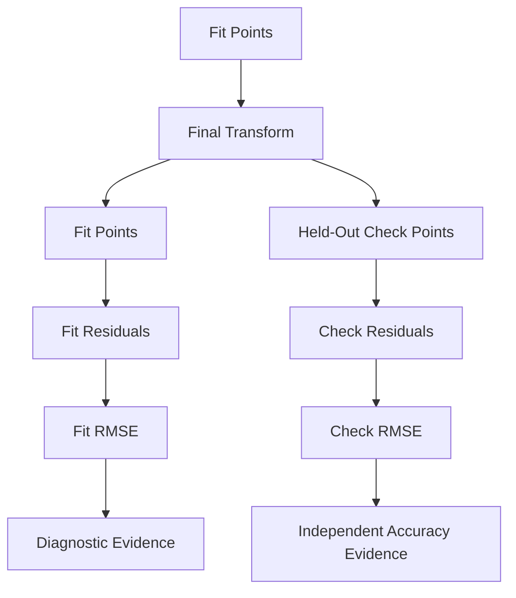

# Evaluation Metrics

ChandraMap uses multiple complementary metrics because lunar image retrieval, correspondence generation, geometric verification, registration accuracy, spatial support, computational cost, and failure behavior are different properties of the system.

This file defines the **authoritative scientific meaning of ChandraMap evaluation metrics**. It explains what each metric measures, which data population it uses, which coordinate space and units apply, how values may be aggregated, and which interpretations are invalid.

> **A metric is reproducible only when its quantity, population, coordinate system, units, and aggregation rule are defined.**

For example:

```text
RMSE = 0.8
```

is incomplete.

A scientifically meaningful result should instead establish concepts such as:

```text
Metric:
Independent check-point RMSE

Population:
Held-out check points

Transform:
Final fitted transform

Coordinate space:
Source-image coordinates

Units:
Source pixels

Benchmark:
Defined benchmark/version
```

ChandraMap therefore avoids reducing the entire project to one generic accuracy percentage.

> **ChandraMap reports several complementary metrics because retrieval, correspondence quality, geometric consistency, registration accuracy, coverage, runtime, and failure rate are different properties.**

A second core rule is:

> **Diagnostic metrics and accuracy metrics are not interchangeable.**

For example:

- candidate count is a matcher diagnostic;
- inlier count is a geometric-support diagnostic;
- inlier ratio is a geometric-consistency diagnostic;
- independent check-point error is an accuracy metric when valid truth exists.

A third rule is fundamental:

> **Fit residual is not independent registration accuracy.**

The points used to fit a transformation may be used for model diagnostics, but they should not be the only evidence used to claim final registration accuracy.

Retrieval evaluation is also distinct:

> **Retrieval metrics and registration metrics measure different tasks.**

`Recall@K` measures retrieval behavior.

Residual and RMSE metrics measure geometric registration behavior.

They must not be combined into one unlabeled accuracy value.

For geometric reporting:

> **Source-image pixel error should be reported before physical ground-distance error unless valid geospatial mapping supports the physical conversion.**

For robustness:

> **Failures must remain visible in metric reporting.**

Failed matching, retrieval, RANSAC, transform, or registration cases must not silently disappear from aggregate statistics.

Finally:

> **Never invent a universal ChandraMap "accuracy percentage."**

Different ChandraMap tasks require different quantitative evidence.

---

## 1. Metric Design Requirements

Every benchmark metric should define, explicitly or through a versioned metric specification:

| Property               | Requirement                                         |
| ---------------------- | --------------------------------------------------- |
| Name                   | Stable human-readable metric identity               |
| Purpose                | What scientific or engineering property is measured |
| Formula                | Mathematical or procedural definition               |
| Population             | Which points, pairs, queries, or runs are included  |
| Coordinate space       | Required for geometric metrics                      |
| Units                  | Count, ratio, pixels, metres, seconds, etc.         |
| Direction              | Higher/lower/context-dependent interpretation       |
| Valid use              | What conclusion the metric supports                 |
| Invalid interpretation | What the metric must not be used to claim           |
| Missing behavior       | Meaning when the metric cannot be computed          |
| Failure behavior       | How failed runs are represented                     |
| Aggregation            | Pair-level, pooled, mean, median, or other rule     |
| Version identity       | Required when semantics can evolve                  |

A metric name alone is not sufficient.

---

## 2. Metric Registry Overview

| Metric                    | Stage                  | Type                    | Unit                   | Better Direction                       | Primary Meaning                              |
| ------------------------- | ---------------------- | ----------------------- | ---------------------- | -------------------------------------- | -------------------------------------------- |
| Candidate Count           | Matching               | Diagnostic              | count                  | Context-dependent                      | Raw correspondence volume                    |
| Filtered Candidate Count  | Match filtering        | Diagnostic              | count                  | Context-dependent                      | Candidates retained before geometry          |
| Candidate Retention Ratio | Match filtering        | Diagnostic              | ratio                  | Context-dependent                      | Filtering aggressiveness                     |
| Verified Inlier Count     | Geometric verification | Diagnostic              | count                  | Context-dependent                      | Geometric support                            |
| Inlier Ratio              | Geometric verification | Diagnostic              | ratio                  | Usually higher, but insufficient alone | Fraction of geometric-consistent candidates  |
| Spatial Coverage          | Geometry               | Diagnostic / quality    | defined ratio          | Usually higher, but insufficient alone | Spatial distribution of support              |
| Fit RMSE                  | Transform fitting      | Diagnostic              | defined geometric unit | Lower                                  | Fit to points used by the model              |
| Check RMSE                | Evaluation             | Accuracy                | defined geometric unit | Lower                                  | Held-out registration error                  |
| Median Check Error        | Evaluation             | Accuracy / distribution | defined geometric unit | Lower                                  | Typical held-out residual magnitude          |
| Recall@1                  | Retrieval              | Retrieval accuracy      | ratio                  | Higher                                 | Correct reference at rank 1                  |
| Recall@K                  | Retrieval              | Retrieval accuracy      | ratio                  | Higher                                 | Correct reference present in Top-K           |
| Runtime                   | Execution              | Efficiency              | time                   | Lower under equal conditions           | Computational cost                           |
| Success Rate              | Benchmark              | Reliability             | ratio                  | Higher                                 | Fraction satisfying protocol-defined success |
| Failure Rate              | Benchmark              | Reliability             | ratio                  | Lower                                  | Fraction producing benchmark-defined failure |

The direction column is only a coarse interpretation.

For example:

- more inliers can be useful;
- more coverage can be useful;

but neither proves accurate registration by itself.

---

# Metric Terminology

## 3. Metric

A **metric** is a quantitatively defined measurement used to evaluate one property of an algorithm, result, benchmark case, or benchmark run.

---

## 4. Diagnostic Metric

A **diagnostic metric** helps explain algorithm behavior.

Examples include:

- candidate count;
- inlier count;
- retention ratio;
- refinement-offset magnitude.

A diagnostic metric is not necessarily an independent accuracy measurement.

---

## 5. Accuracy Metric

An **accuracy metric** measures agreement with independently defined evaluation truth.

Examples may include:

- held-out check-point RMSE;
- valid geographic ground error;
- `Recall@K` for a retrieval benchmark with well-defined retrieval truth.

---

## 6. Pair-Level Metric

A **pair-level metric** is computed for one source/reference benchmark pair.

Examples include:

- inlier count;
- coverage;
- check RMSE;
- pair runtime.

---

## 7. Run-Level Metric

A **run-level metric** describes one complete benchmark execution or configuration.

Examples may include:

- total runtime;
- total successful cases;
- total failed cases.

---

## 8. Aggregate Metric

An **aggregate metric** combines results across several:

- pairs;
- queries;
- runs.

Its aggregation population and weighting rule must be defined.

---

## 9. Fit Point

A **fit point** is a correspondence used to estimate or refit the transformation.

---

## 10. Check Point

A **check point** is a held-out correspondence used for independent evaluation.

A point that participates in fitting is not independent evaluation evidence for that same run.

---

## 11. Candidate Match

A **candidate match** is a matcher-proposed correspondence before geometric verification.

---

## 12. Filtered Candidate

A **filtered candidate** is a candidate that survives configured pre-geometric filtering.

It remains a candidate until geometric verification.

---

## 13. Verified Inlier

A **verified inlier** is a candidate accepted by geometric verification as consistent with the selected model.

A verified inlier is still not automatically independent ground truth.

---

## 14. Outlier

An **outlier** is a candidate rejected by geometric verification under the configured model and residual rule.

---

## 15. Residual

A **residual** is the difference between:

- observed correspondence location;
- model-predicted correspondence location.

Residuals must have a defined:

- sign convention;
- coordinate system;
- unit.

---

## 16. Fit Residual

A **fit residual** is computed on a point used to estimate the transformation.

It measures model fit.

It is not fully independent registration accuracy.

---

## 17. Check Residual

A **check residual** is computed on a held-out evaluation point.

When truth is valid, check residuals provide stronger registration-accuracy evidence.

---

## 18. RMSE

**Root Mean Square Error (RMSE)** is a summary of a clearly defined residual quantity.

The term `RMSE` must never be used without enough context to determine what was squared, averaged, and measured.

---

## 19. MAE

**Mean Absolute Error (MAE)** is potentially ambiguous in a two-dimensional registration setting.

It may refer to:

- mean absolute x-component error;
- mean absolute y-component error;
- another scalar error definition.

If ChandraMap reports `MAE`, its exact formula must be documented.

For Euclidean residual magnitudes, prefer the explicit term:

> mean residual magnitude

unless a metric specification defines otherwise.

---

## 20. Median Error

**Median error** is the median of a clearly defined residual quantity, typically residual magnitude.

---

## 21. Spatial Coverage

**Spatial coverage** describes how broadly eligible correspondences or check points occupy the usable overlap.

Coverage is separate from:

- count;
- correctness;
- RMSE.

---

## 22. Success Rate

**Success rate** is the fraction of benchmark cases satisfying the success definition established by the benchmark protocol.

---

## 23. Failure Rate

**Failure rate** is the fraction of benchmark cases producing a benchmark-defined failure.

---

## 24. Recall@K

**Recall@K** measures whether at least one benchmark-approved correct reference candidate appears among the first \(K\) retrieval results.

`K` is benchmark-defined.

---

## 25. Latency

**Latency** is the elapsed time required for one clearly defined online operation.

---

## 26. Throughput

**Throughput** is the number of clearly defined workload units processed per unit time.

Examples may include:

- queries per second;
- pairs per second;
- tiles per second.

The workload and hardware context must be stated.

---

# Sensor Context for Metric Interpretation

## 27. OHRC

The Chandrayaan-2 **Orbiter High Resolution Camera (OHRC)** is a visible/panchromatic instrument.

Current project context commonly uses approximately:

> **~0.25–0.32 m/pixel**

depending on product/documentation.

Actual product metadata is authoritative.

Metric implications:

- OHRC source-pixel errors should be identified as OHRC pixels;
- OHRC pixel errors are not physically equivalent to TMC-2 or IIRS pixel errors;
- physical conversion should use the actual product geometry where possible.

See [`../sensors/ohrc.md`](../sensors/ohrc.md).

---

## 28. TMC-2

The Chandrayaan-2 **Terrain Mapping Camera-2 (TMC-2)** is panchromatic terrain imagery.

Current project planning commonly uses approximately:

> **~5 m/pixel**

with actual product metadata authoritative.

A TMC-2-pixel RMSE should not be compared numerically with an OHRC-pixel RMSE as though the units represented the same ground distance.

See [`../sensors/tmc2.md`](../sensors/tmc2.md).

---

## 29. IIRS

The Chandrayaan-2 **Imaging Infrared Spectrometer (IIRS)** is a hyperspectral/imaging-infrared instrument.

Current project context includes approximately:

- ~80 m/pixel spatial sampling;
- ~0.8–5.0 µm spectral coverage;
- roughly ~250–256 bands depending on product/documentation.

Actual product metadata remains authoritative.

Metric interpretation requires the identity of the registration-friendly 2D representation used.

A very small residual measured on a fine NAC reference grid must not automatically be interpreted as equally fine physical IIRS localization accuracy.

See [`../sensors/iirs.md`](../sensors/iirs.md).

---

## 30. LRO NAC

LROC **Narrow Angle Camera (NAC)** imagery is used as a fine/local lunar reference.

Current project planning often uses approximately:

> **~0.5–2 m/pixel**

depending on product/acquisition geometry.

Reference-space metrics should preserve:

- product identity;
- pyramid level;
- effective GSD.

See [`../sensors/lro-nac.md`](../sensors/lro-nac.md).

---

## 31. LRO WAC

LROC **Wide Angle Camera (WAC)** provides broad/coarse/global lunar context.

Its effective scale is product/mode/processing dependent.

Do not assign one universal WAC pixel scale.

See [`../sensors/lro-wac.md`](../sensors/lro-wac.md).

---

# Metric Families

## 32. ChandraMap Metric Families

ChandraMap organizes evaluation into the following metric families:

1. input and benchmark context;
2. correspondence diagnostics;
3. geometric-verification diagnostics;
4. spatial-coverage metrics;
5. registration-error metrics;
6. residual-distribution metrics;
7. retrieval metrics;
8. runtime and resource metrics;
9. reliability and failure metrics;
10. aggregate benchmark metrics.

These families should remain separate rather than being collapsed into a generic `accuracy` field.

---

# Input and Benchmark Context

## 33. Why Context Values Matter

Several values are essential for metric interpretation even though they are not themselves performance metrics.

Examples include:

- source GSD;
- reference GSD;
- effective reference GSD;
- scale ratio;
- source dimensions;
- reference dimensions;
- pyramid level;
- overlap extent;
- source/reference representation IDs.

Without this context, the same numerical metric can have very different physical meaning.

---

## 34. Source GSD

Record actual source-product Ground Sampling Distance where valid.

Typical units:

$$
\text{metres/pixel}
$$

Product metadata should take precedence over generic mission-summary values.

Source GSD is context, not an accuracy metric.

---

## 35. Reference Effective GSD

When a reference pyramid is used, preserve the effective GSD of the selected reference level.

For a downsampled reference this may differ substantially from the original reference-product GSD.

See [`../algorithms/scale-pyramid.md`](../algorithms/scale-pyramid.md).

---

## 36. Scale Ratio

A scale ratio is meaningful only if its direction is explicitly defined.

Two possible conventions are:

$$
R_1 =
\frac{
\text{source GSD}
}{
\text{reference effective GSD}
}
$$

or:

$$
R_2 =
\frac{
\text{reference effective GSD}
}{
\text{source GSD}
}
$$

These are reciprocals.

ChandraMap must not report an unlabeled scalar such as:

```text
scale_ratio = 7.2
```

without stating which convention was used.

This document does not impose a repository-wide convention unless one is established by an authoritative schema or benchmark version.

---

# Correspondence Diagnostics

## 37. Raw Candidate Match Count

Let:

$$
N_{\text{candidate}}
$$

denote the number of correspondences output by the matcher before optional pre-geometric filtering.

Unit:

> count

This metric measures:

- matcher output volume.

It does not measure:

- correctness;
- registration accuracy.

More candidates do not automatically mean better registration.

---

## 38. Filtered Candidate Count

Let:

$$
N_{\text{filtered}}
$$

denote the number of candidates remaining after configured pre-geometric match filtering.

Unit:

> count

This measures the size of the candidate set passed to geometry when that is the configured pipeline.

---

## 39. Candidate Retention Ratio

When:

$$
N_{\text{candidate}} > 0
$$

define conceptually:

$$
\text{Retention Ratio}
=
\frac{
N_{\text{filtered}}
}{
N_{\text{candidate}}
}
$$

Unit:

> ratio

The metric describes filter aggressiveness.

High retention is not automatically good.

Low retention is not automatically good.

---

## 40. Rejected Candidate Count

Where filtering semantics support it:

$$
N_{\text{rejected}}
=
N_{\text{candidate}}
-
N_{\text{filtered}}
$$

This is a filtering diagnostic.

It should not be interpreted as the number of independently proven false correspondences.

---

## 41. Match-Score Statistics

Matcher-specific scores may optionally be summarized through:

- minimum;
- maximum;
- mean;
- median;
- percentile statistics.

These statistics retain matcher-specific semantics.

Do not directly compare:

- SIFT descriptor distances;
- LightGlue match scores;
- LoFTR confidence values;

as if they were one common calibrated metric.

See [`../algorithms/matching.md`](../algorithms/matching.md).

---

# Geometric Verification Metrics

## 42. Verified Inlier Count

Let:

$$
N_{\text{inlier}}
$$

denote the number of filtered candidates accepted by geometric verification.

Unit:

> count

It describes the amount of support for the selected geometric model.

It does not independently prove registration accuracy.

---

## 43. Outlier Count

If the complete filtered candidate set is passed into geometric verification:

$$
N_{\text{outlier}}
=
N_{\text{filtered}}
-
N_{\text{inlier}}
$$

This equation should only be used when the population definitions genuinely match.

---

## 44. Inlier Ratio

When RANSAC receives the filtered candidate set, the preferred conceptual definition is:

$$
\text{Inlier Ratio}
=
\frac{
N_{\text{inlier}}
}{
N_{\text{filtered}}
}
$$

The denominator must always be stated.

If another pipeline uses:

$$
\frac{
N_{\text{inlier}}
}{
N_{\text{candidate}}
}
$$

that value must be labeled with its actual denominator rather than silently calling both quantities the same metric.

---

## 45. Why High Inlier Ratio Is Not Enough

A high inlier ratio can still occur with weak registration evidence.

Examples include:

```text
few total matches
+
high ratio
```

or:

```text
many inliers
+
strong spatial clustering
```

or:

```text
coherent local false match
+
wrong geographic region
```

Interpret inlier ratio together with:

- inlier count;
- coverage;
- independent check error.

---

## 46. RANSAC Fit Residual

RANSAC may use residuals internally or expose residual diagnostics for its accepted inliers.

These values describe:

> agreement with the model used during geometric verification.

They do not automatically represent:

> final independent registration accuracy.

See [`../algorithms/ransac.md`](../algorithms/ransac.md).

---

# Spatial Coverage Metrics

## 47. Why Coverage Matters

Transformation estimation benefits from spatially distributed correspondence support.

Consider:

```text
many inliers
→ one small crater region
```

versus:

```text
fewer inliers
→ broad overlap distribution
```

The first has more points.

The second may provide stronger scene-wide geometric support.

Coverage captures this difference.

---

## 48. Grid Occupancy Coverage

A conceptual grid-coverage metric divides the defined valid evaluation area into cells.

Let:

- \(N\_{\text{occupied}}\) = cells containing at least one eligible point;
- \(N\_{\text{valid}}\) = cells considered valid for the defined overlap.

Then:

$$
C_{\text{grid}}
=
\frac{
N_{\text{occupied}}
}{
N_{\text{valid}}
}
$$

The metric specification must state:

- grid definition;
- image/coordinate space;
- valid-area definition;
- eligible point type.

No universal grid size is defined here.

---

## 49. Convex-Hull Coverage

For a set of eligible points \(P\), a conceptual convex-hull metric is:

$$
C_{\text{hull}}
=
\frac{
A(\operatorname{ConvHull}(P))
}{
A(\text{valid overlap})
}
$$

where \(A\) denotes area.

Potential advantages:

- compact indication of broad point spread.

Limitations include:

- unsupported interior space is included;
- a few extreme points can enlarge the hull;
- interior gaps are hidden.

---

## 50. Bounding-Box Coverage

A bounding-box coverage measure may be used as a simple diagnostic.

However, it can strongly overstate true spatial support because it fills the entire rectangle between extreme points.

It should not become the universal primary coverage metric without benchmark justification.

---

## 51. Coverage Point Population

Coverage must state which points are used.

Possible populations include:

- raw candidates;
- filtered candidates;
- verified inliers;
- fit points;
- check points.

For final geometric support, **verified-inlier coverage** is generally more informative than raw candidate coverage.

---

## 52. Coverage Is Not Accuracy

High coverage does not prove that the correspondences are correct.

Low residual error does not prove that support spans the whole overlap.

Therefore report:

> error + coverage

rather than treating either as a substitute for the other.

---

# Residual Metrics

## 53. Residual Vector

Assume a transform:

$$
T:
\text{source}
\rightarrow
\text{reference}
$$

For source point:

$$
p_s
$$

and observed reference point:

$$
p_r
$$

the predicted reference coordinate is:

$$
\hat{p}_r = T(p_s)
$$

Using the ChandraMap residual convention documented in residual-analysis guidance:

$$
r
=
p_r
-
\hat{p}_r
$$

That is:

> **observed − predicted**

If another implementation uses the opposite sign, the difference must be explicit and versioned.

See [`../algorithms/residual-analysis.md`](../algorithms/residual-analysis.md).

---

## 54. Residual Components

For:

$$
p_r = (x_r, y_r)
$$

and:

$$
\hat{p}_r = (\hat{x}_r, \hat{y}_r)
$$

define:

$$
r_x = x_r - \hat{x}_r
$$

$$
r_y = y_r - \hat{y}_r
$$

The units are inherited from the coordinate space in which the residual is measured.

---

## 55. Residual Magnitude

The Euclidean residual magnitude is:

$$
e_i
=
\sqrt{
r_{x,i}^{2}
+
r_{y,i}^{2}
}
$$

or:

$$
e_i
=
\lVert r_i \rVert_2
$$

Residual magnitude provides a scalar distance.

It does not preserve directional information.

---

# Fit vs Check Residuals

## 56. Fit Residual

A fit residual is computed from a point that contributed to:

- model estimation;
- final model refitting.

Use fit residuals for:

- model diagnostics;
- fitting-quality analysis;
- detecting unusual fitting points.

Do not describe them as fully independent registration accuracy.

---

## 57. Check Residual

A check residual is computed from a held-out point that did not contribute to final model fitting.

When reliable truth exists, check residuals are the preferred basis for final geometric accuracy evaluation.

---

## 58. Keep Names Separate

Use semantically distinct names such as:

```text
fit RMSE
```

and:

```text
check RMSE
```

rather than one ambiguous:

```text
RMSE
```

Exact machine-readable field names may differ.

---

# RMSE

## 59. Root Mean Square Error

For residual magnitudes:

$$
e_1,\ldots,e_N
$$

define:

$$
\mathrm{RMSE}
=
\sqrt{
\frac{1}{N}
\sum_{i=1}^{N}
e_i^2
}
$$

The metric must state what \(e_i\) represents.

Possible definitions include:

- 2D residual magnitude;
- x-component error;
- y-component error;
- source-space residual;
- reference-space residual;
- physical ground-distance residual.

---

## 60. RMSE Units

Possible valid metric units include:

- OHRC pixels;
- TMC-2 pixels;
- IIRS representation pixels;
- NAC base-level pixels;
- NAC pyramid-level pixels;
- WAC pixels;
- metres where geospatially valid.

An RMSE without its coordinate space and units is incomplete.

---

## 61. RMSE Interpretation

For the same:

- coordinate system;
- units;
- benchmark;
- truth;
- metric definition;

lower RMSE generally indicates lower residual error.

Do not directly compare:

```text
0.x OHRC pixels
```

and:

```text
0.x IIRS pixels
```

as though they represent the same physical lunar displacement.

---

## 62. RMSE Sensitivity

Because the error is squared before averaging, RMSE gives strong weight to large residuals.

This can be useful for exposing major errors.

It also means:

- one severe residual;
- one annotation problem;

can materially affect the metric.

Use distribution diagnostics alongside RMSE.

---

# Mean Error and MAE

## 63. Mean Residual Magnitude

If ChandraMap reports the average Euclidean residual magnitude:

$$
\bar{e}
=
\frac{1}{N}
\sum_{i=1}^{N}
e_i
$$

prefer the explicit term:

> mean residual magnitude

unless the metric registry formally names it otherwise.

---

## 64. MAE Terminology

`MAE` should not be used without a formula.

Possible meanings include:

$$
\frac{1}{N}
\sum_i |r_{x,i}|
$$

or:

$$
\frac{1}{N}
\sum_i |r_{y,i}|
$$

or another scalar quantity.

A two-dimensional Euclidean magnitude is already nonnegative, so describing its mean as `MAE` can be confusing.

---

# Median Error

## 65. Median Residual Magnitude

For residual magnitudes:

$$
e_1,\ldots,e_N
$$

the median error is:

$$
\operatorname{median}(e_1,\ldots,e_N)
$$

It provides a measure of typical residual magnitude that is less sensitive to extreme values than RMSE.

---

## 66. Median Limitations

Median error can hide rare severe failures.

It should be interpreted alongside:

- RMSE;
- high-percentile error where used;
- maximum error;
- per-case results.

---

# Percentile Error

## 67. Percentile Metrics

Optional percentile summaries may include concepts such as:

- P50;
- P90;
- P95.

The benchmark protocol determines whether specific percentiles are required.

Do not add them merely for appearance.

---

## 68. Why Percentiles Can Help

Percentiles can characterize:

- the central error distribution;
- upper-tail behavior;
- rare high-residual points.

They are especially useful when RMSE and median alone do not describe the distribution well.

---

# Maximum Error

## 69. Maximum Residual

Define:

$$
e_{\max}
=
\max_i(e_i)
$$

This identifies the worst residual within the evaluated point population.

---

## 70. Maximum Error Caution

The maximum is highly sensitive to:

- a single annotation error;
- ambiguous check points;
- local geometric failure.

Investigate unusual values.

Do not silently delete them only because they worsen the result.

---

# Directional Bias

## 71. Mean X Residual

For \(N\) residual vectors:

$$
\overline{r_x}
=
\frac{1}{N}
\sum_{i=1}^{N} r_{x,i}
$$

---

## 72. Mean Y Residual

Similarly:

$$
\overline{r_y}
=
\frac{1}{N}
\sum_{i=1}^{N} r_{y,i}
$$

---

## 73. Why Directional Bias Matters

Persistent directional bias may suggest:

- translation bias;
- crop/tile offset errors;
- coordinate-origin mismatch;
- model limitation;
- transform-composition issues.

These metrics are diagnostic.

They do not establish the root cause automatically.

---

# Source-Space Error

## 74. Why Source Space Matters

The source sensor defines the original observation being registered.

Source-space pixels therefore provide a natural first interpretation of registration error.

---

## 75. Source-Space RMSE

A source-space RMSE is valid only when residuals are genuinely computed or transformed into the source coordinate system.

Do not calculate error in a reference grid and relabel it:

> source pixels.

---

## 76. Sensor-Specific Source Units

Examples include:

```text
OHRC source
→ OHRC pixels
```

```text
TMC-2 source
→ TMC-2 pixels
```

```text
IIRS-derived source representation
→ IIRS representation pixels
```

The source representation should be identified.

---

# Reference-Space Error

## 77. Reference-Space RMSE

When the transformation naturally maps:

$$
\text{source}
\rightarrow
\text{reference}
$$

residuals may naturally be measured in reference coordinates.

This is scientifically valid when clearly labeled.

---

## 78. Reference Context

Reference-space error should identify:

- reference sensor/product;
- reference representation;
- pyramid level where applicable;
- effective GSD where available.

---

## 79. Reference-Pyramid Error

The label:

```text
NAC pixels
```

is insufficient when matching was performed on a downsampled NAC pyramid level.

Prefer context such as:

```text
NAC reference
pyramid level: defined level
coordinate units: pixels of selected level
```

---

# Physical Ground-Distance Error

## 80. Ground Error

Ground-distance error measures the physical lunar-surface displacement between:

- predicted location;
- trusted observed/reference location.

Possible units include:

- metres;
- kilometres.

Such metrics require valid geospatial geometry.

---

## 81. When Pixel-to-Ground Conversion Is Valid

Physical conversion requires the relevant combination of:

- known residual coordinate space;
- valid product metadata;
- correct GSD/effective scale;
- valid projection/geotransform;
- compatible truth;
- correct lunar coordinate convention where relevant.

---

## 82. Avoid Naive Conversion

Do not blindly compute:

$$
\text{pixel RMSE}
\times
\text{generic mission GSD}
$$

unless the residual actually belongs to that exact image grid and the approximation is scientifically justified.

---

## 83. Prefer Geospatial Distance Where Possible

Where trusted map coordinates exist, physical error should preferably be derived from the actual coordinate transformation rather than from generic mission-summary resolution.

The exact geospatial calculation belongs to the implementation and evaluation pipeline.

---

## 84. False Precision

Do not report excessive decimal precision.

For example, approximate sensor-resolution context does not justify extremely precise ground-distance reporting.

Metric precision should reflect:

- product metadata quality;
- truth precision;
- coordinate-model precision.

---

# Normalized Error Metrics

## 85. Sensor-Relative Normalization

Source-space pixel error already provides a useful sensor-relative quantity.

ChandraMap should not invent additional normalized scores without a clear scientific need.

---

## 86. Image-Dimension-Normalized Error

A metric such as:

$$
\frac{
\text{pixel error}
}{
\text{image width}
}
$$

may be useful in some generic computer-vision contexts.

For ChandraMap, physical sensor scale is usually more informative.

Such normalization should not become a primary metric without explicit justification.

---

# Point-Matching Precision and Recall

## 87. Correspondence Precision

Point-level precision is only valid when sufficiently reliable independent correspondence truth exists.

Conceptually:

$$
P
=
\frac{
N_{\text{correct accepted correspondences}}
}{
N_{\text{accepted correspondences}}
}
$$

The definition of a **correct correspondence** requires:

- independent ground truth;
- coordinate tolerance;
- matching protocol.

This document does not invent that tolerance.

---

## 88. Correspondence Recall

Conceptually:

$$
R
=
\frac{
N_{\text{correct recovered correspondences}}
}{
N_{\text{available ground-truth correspondences}}
}
$$

This requires sufficiently complete correspondence truth.

Incomplete truth can make the denominator misleading.

---

## 89. F1 Score

Where both point-level precision and recall are scientifically valid:

$$
F_1
=
2
\frac{
PR
}{
P+R
}
$$

F1 should not become a default registration metric.

It evaluates correspondence recovery, not final transformation accuracy.

---

## 90. Why Precision / Recall May Be Omitted

If ChandraMap has only sparse held-out control/check truth rather than a complete correspondence-truth set, point precision/recall can be misleading.

In that situation, prefer:

- candidate/inlier diagnostics;
- independent check-point registration error.

---

# Retrieval Metrics

## 91. Retrieval Task

Given a source query, retrieval returns a ranked sequence of candidate reference regions or tiles.

Retrieval metrics evaluate the ranking.

They do not measure geometric alignment accuracy.

---

## 92. Recall@1

For \(Q\) evaluated queries:

$$
\mathrm{Recall@1}
=
\frac{
\text{queries with an accepted correct reference at rank 1}
}{
Q
}
$$

---

## 93. Recall@K

For benchmark-defined \(K\):

$$
\mathrm{Recall@K}
=
\frac{
\text{queries with at least one accepted correct reference in Top-K}
}{
Q
}
$$

`K` must be documented.

This file does not prescribe a universal value.

---

## 94. Multiple Correct References

Reference tiles may overlap.

A retrieval query can therefore have several benchmark-approved correct answers.

`Recall@K` should use the accepted reference set defined by retrieval truth rather than forcing one arbitrary tile.

---

## 95. Retrieval Failure

Under `Recall@K`, a retrieval failure occurs when:

> no benchmark-approved correct reference appears among the evaluated Top-K candidates.

---

## 96. Precision@K

`Precision@K` may be useful when the benchmark defines meaningful relevance for multiple returned candidates.

Conceptually:

$$
\mathrm{Precision@K}
=
\frac{
\text{relevant results in Top-K}
}{
K
}
$$

It is optional because overlapping lunar tiling can complicate relevance definitions.

---

## 97. Mean Reciprocal Rank

MRR may be useful where:

- ranked relevance is clearly defined;
- the first correct result is meaningful.

Conceptually:

$$
\mathrm{MRR}
=
\frac{1}{Q}
\sum_{q=1}^{Q}
\frac{1}{\operatorname{rank}_q}
$$

Do not require it unless the retrieval benchmark adopts it.

---

## 98. Average Precision and mAP

Average Precision or mean Average Precision should only be introduced when:

- relevance labels are sufficiently complete;
- the benchmark defines the relevance semantics.

They are not automatically appropriate for overlapping lunar tiles.

---

## 99. Retrieval and Registration Metrics Are Different

A system can have:

```text
high Recall@K
+
poor local registration
```

or:

```text
lower-ranked correct candidate
+
excellent local registration once selected
```

Therefore:

> **Recall@K and check RMSE cannot replace one another.**

---

# End-to-End Metrics

## 100. Retrieval + Registration Success

A future end-to-end benchmark may define success requiring both:

- acceptable reference retrieval;
- valid local registration.

If it additionally requires an accuracy threshold, that threshold belongs to the benchmark protocol.

This document does not invent one.

---

## 101. Preserve Stage-Specific Success

Prefer reporting:

- retrieval success;
- conditional registration success;
- overall end-to-end success.

This is more diagnostic than one unlabeled end-to-end percentage.

---

# Success and Failure Metrics

## 102. Success Count

Let:

$$
N_{\text{success}}
$$

denote the number of cases satisfying the benchmark-defined success condition.

---

## 103. Failure Count

Let:

$$
N_{\text{failure}}
$$

denote the number of benchmark cases satisfying the defined failure condition.

---

## 104. Success Rate

For total evaluated population \(N\_{\text{total}}\):

$$
\text{Success Rate}
=
\frac{
N_{\text{success}}
}{
N_{\text{total}}
}
$$

The benchmark must define:

- what is included in \(N\_{\text{total}}\);
- what constitutes success.

---

## 105. Failure Rate

Conceptually:

$$
\text{Failure Rate}
=
\frac{
N_{\text{failure}}
}{
N_{\text{total}}
}
$$

If success/failure are exhaustive mutually exclusive states for the task:

$$
\text{Success Rate}
+
\text{Failure Rate}
=
1
$$

If other states such as invalid/unavailable cases exist, this identity may not hold and the population definition must be explicit.

---

## 106. Success Thresholds Are Benchmark-Defined

This file intentionally does not invent rules such as:

```text
RMSE < X
```

or:

```text
inliers > Y
```

Benchmark versions define any required thresholds.

See [`benchmark-protocol.md`](benchmark-protocol.md).

---

## 107. Failure-Stage Distribution

Failure counts may be grouped by observed stage such as:

- input;
- preprocessing;
- retrieval;
- matching;
- filtering;
- RANSAC;
- transform estimation;
- refinement;
- registration;
- evaluation.

This helps identify where the pipeline breaks.

---

## 108. Failure Stage vs Failure Cause

These are different concepts.

Failure stage answers:

> Where did the pipeline become unable to continue?

Failure cause asks:

> Why did that happen?

The latter may require deeper analysis.

---

# Runtime Metrics

## 109. Runtime

Runtime is the elapsed execution time for a precisely defined operation or workflow.

A value such as:

```text
runtime = X seconds
```

is incomplete unless the timed boundary is known.

---

## 110. Stage-Level Runtime

Potential stage-level timings include:

- preprocessing;
- feature extraction;
- descriptor generation;
- matching;
- match filtering;
- RANSAC;
- refinement;
- transform refit;
- raster warping;
- retrieval descriptor generation;
- vector search;
- complete online pipeline.

Only report stages that can be measured reliably.

---

## 111. Total Runtime

A total-runtime definition should specify whether it includes:

- input loading;
- model initialization;
- reference-index loading;
- preprocessing;
- matching;
- output serialization;
- visualization.

Different definitions should not share one unlabeled field.

---

## 112. Retrieval Offline Runtime

Offline retrieval cost may include:

- reference preparation;
- tiling;
- global descriptor generation;
- index construction.

These are not online query latency.

---

## 113. Retrieval Online Runtime

Online retrieval may include:

- query preprocessing;
- query descriptor generation;
- vector search;
- metadata filtering;
- candidate handoff.

---

## 114. Warm vs Cold Runtime

Runtime may differ substantially between:

- cold execution;
- warmed model/index execution;
- cached input execution.

When this materially affects results, record the timing state.

---

## 115. Hardware Context

Runtime comparisons should preserve relevant context such as:

- CPU;
- GPU;
- system memory;
- accelerator/backend;
- important software/library versions.

Do not fabricate missing hardware information.

---

# Resource Metrics

## 116. Peak Memory

Peak memory may be reported when measured reliably.

Specify:

- unit;
- measurement method;
- process scope.

Treat it as optional unless benchmark requirements make it mandatory.

---

## 117. GPU Memory

GPU-memory use may be relevant for learned matchers.

It remains optional and environment-dependent.

---

## 118. Reference Index Size

Retrieval-system storage may be measured as:

- bytes;
- MB;
- GB;

with clear scope.

Specify whether the figure includes:

- descriptors;
- vector index;
- metadata;
- auxiliary files.

---

## 119. Derived Storage Size

Storage size may also be useful for:

- reference pyramids;
- descriptor caches;
- registered outputs.

This remains secondary to scientific registration quality.

---

# Throughput Metrics

## 120. Throughput

Throughput is meaningful only when workload units are defined.

Examples include:

```text
queries / second
```

```text
pairs / second
```

```text
tiles / second
```

Report:

- hardware;
- batching;
- pipeline boundaries;

where relevant.

---

# Robustness Metrics

## 121. Category-Stratified Reliability

Using the taxonomy in [`benchmark-categories.md`](benchmark-categories.md), ChandraMap may report:

- success rate by scale category;
- failure rate by illumination category;
- check error by modality category;
- coverage by terrain category;
- runtime by sensor pair.

---

## 122. Category-Specific Error

Check RMSE or related error metrics may be stratified by:

- sensor pair;
- scale condition;
- illumination condition;
- modality;
- terrain;
- geometry.

Raw pixel units should not be pooled across incompatible sensor spaces without clear normalization.

---

## 123. Robustness Is Not One Score

Do not invent a metric such as:

```text
robustness = 0.91
```

without a formal benchmark-specific scientific definition.

Prefer category-stratified reporting.

---

# Pair-Level and Aggregate Metrics

## 124. Pair-Level Results Come First

Every aggregate should be traceable back to pair-level or query-level results.

Per-case records preserve:

- difficult examples;
- failure cases;
- unusual residual behavior.

Aggregates alone are insufficient.

---

## 125. Mean Across Pair-Level Metrics

Suppose each pair \(j\) has pair-level RMSE:

$$
R_j
$$

A macro-style mean pair RMSE is:

$$
\overline{R}_{\text{pair}}
=
\frac{1}{M}
\sum_{j=1}^{M}
R_j
$$

Each pair contributes equally.

---

## 126. Pooled Check-Point RMSE

Alternatively, all check-point residuals may be pooled before computing RMSE:

$$
R_{\text{pooled}}
=
\sqrt{
\frac{
\sum_{j}
\sum_{i}
e_{j,i}^{2}
}{
\sum_j N_j
}
}
$$

Pairs with more check points contribute more strongly.

---

## 127. Mean Pair RMSE and Pooled RMSE Are Different

Do not describe both as:

```text
average RMSE
```

without qualification.

One weights:

- pairs equally.

The other weights:

- individual check points equally.

---

## 128. Median Pair Metric

A median across pair-level metrics may be useful when aggregate results contain strong pair-level outliers.

It should not replace:

- failure reporting;
- per-pair visibility.

---

## 129. Weighted Aggregation

If a weighted aggregate is used:

$$
\bar{x}_w
=
\frac{
\sum_i w_i x_i
}{
\sum_i w_i
}
$$

the weights \(w_i\) must be explicitly defined and justified.

Avoid arbitrary weighting.

---

# Failures and Aggregation

## 130. Failed Runs Do Not Get Fake Zero Error

If registration fails and no valid check residual exists:

```text
check RMSE = 0
```

would incorrectly imply perfect registration.

Do not do this.

---

## 131. Avoid Fake Infinite Error

Similarly, avoid assigning:

```text
RMSE = infinity
```

unless a formal machine-readable metric convention explicitly requires it.

Prefer:

- unavailable metric;
- explicit failure status.

---

## 132. Success-Only Error Summary

It is valid to report an error summary over successful cases if clearly labeled.

For example:

> median check RMSE among successful registrations

Such reporting must be accompanied by:

- total case count;
- success count;
- failure count or rate.

---

## 133. Missing Values Must Stay Visible

Aggregation should distinguish among:

- valid value;
- unavailable value;
- not-applicable metric;
- benchmark failure;
- malformed/missing record.

Do not silently drop all missing values and present the remaining average without counts.

---

# Micro and Macro Aggregation

## 134. Macro-Style Aggregation

Macro-style aggregation gives each pair/query equal weight.

Example:

> mean of pair-level RMSE values.

---

## 135. Micro-Style Aggregation

Micro-style aggregation pools lower-level observations.

Example:

> one RMSE over every check point from every pair.

---

## 136. Aggregation Style Must Be Stated

A benchmark report should not say:

> average error

without explaining the population and weighting rule.

---

# Sensor-Stratified Metrics

## 137. OHRC Metrics

Where OHRC is the source, source-space metrics should be reported in:

> OHRC pixels

unless another explicitly defined unit is used.

---

## 138. TMC-2 Metrics

TMC-2 source-space errors should be reported separately in:

> TMC-2 pixels

when applicable.

---

## 139. IIRS Metrics

IIRS metrics should preserve:

- source-product identity;
- 2D registration-representation identity;
- source-grid definition.

---

## 140. Do Not Blindly Average Raw Sensor Pixel Errors

An aggregate such as:

$$
\operatorname{mean}
(
\text{OHRC pixel RMSE},
\text{IIRS pixel RMSE}
)
$$

has weak physical interpretation because those pixels represent very different spatial scales.

Prefer:

- sensor-stratified reporting;
- a scientifically valid common physical unit where supported.

---

# Reference-Stratified Metrics

## 141. NAC Results

Where NAC is the reference, preserve:

- product;
- pyramid level;
- effective scale.

---

## 142. WAC Results

WAC-based:

- retrieval;
- coarse localization;
- registration;

should remain distinguishable from NAC-based fine/local registration.

---

# Scale-Pyramid Metrics

## 143. Selected Pyramid Level

The selected reference level is context metadata.

It is not itself a performance metric.

---

## 144. Effective Reference GSD

Record the effective reference GSD used by the evaluated run where available.

---

## 145. Cross-Level Error Comparison

Do not treat:

```text
1 pixel at reference level A
```

and:

```text
1 pixel at reference level B
```

as physically equivalent unless their scale relationship is accounted for.

Prefer:

- source-space comparison;
- explicit coordinate conversion;
- valid physical-distance comparison.

---

# Sub-Pixel Refinement Metrics

## 146. Refinement Attempt Count

Let:

$$
N_{\text{attempted}}
$$

denote the number of verified inliers sent to the refinement stage.

---

## 147. Refinement Success Count

Let:

$$
N_{\text{refined}}
$$

denote the number accepted after configured refinement validation.

---

## 148. Refinement Success Ratio

When:

$$
N_{\text{attempted}} > 0
$$

define:

$$
\text{Refinement Success Ratio}
=
\frac{
N_{\text{refined}}
}{
N_{\text{attempted}}
}
$$

This is an operational diagnostic.

It is not registration accuracy.

---

## 149. Refinement Offset Magnitude

For initial point:

$$
p_{\text{initial}}
$$

and refined point:

$$
p_{\text{refined}}
$$

the local refinement offset magnitude is:

$$
d_{\text{refine}}
=
\lVert
p_{\text{refined}}
-
p_{\text{initial}}
\rVert_2
$$

Large or unusual offsets may be diagnostic.

No universal acceptable threshold is defined here.

---

## 150. Fit RMSE Before and After Refinement

Comparing fit RMSE before and after refinement can describe how well the fitted model explains its refined fitting points.

It is diagnostic only.

---

## 151. Check RMSE Before and After Refinement

The stronger test is:

```text
same independent check points
+
before-refinement transform
vs.
post-refinement/refit transform
```

This evaluates whether refinement improved independent registration performance.

See [`../algorithms/subpixel-refinement.md`](../algorithms/subpixel-refinement.md).

---

# Transform-Model Metrics

## 152. Model Type

Record whether the evaluated transform is:

- affine;
- homography;
- another defined model.

This is configuration/context rather than a scalar performance metric.

---

## 153. Model Failure Rate

Transform-family comparisons may report:

- success/failure count;
- model-specific failure rate.

This helps reveal robustness differences without relying only on successful-case RMSE.

---

## 154. Model Stability

Future evaluations may investigate sensitivity to:

- point perturbations;
- subsets;
- stochastic RANSAC samples.

Do not invent a universal stability score.

---

# Residual-Distribution Metrics

## 155. Residual Histogram

A histogram is a visualization rather than a single scalar metric.

It can reveal:

- heavy tails;
- multiple error modes;
- compact vs broad distributions.

---

## 156. Component Bias

Mean or median residual components can reveal directional error.

---

## 157. Residual Spread

Possible spread statistics include:

- standard deviation;
- robust spread measures.

The summarized quantity must be defined.

Do not add statistics merely because they are available.

---

# Uncertainty

## 158. Truth Uncertainty

Check-point truth can contain uncertainty from:

- manual annotation;
- reference geometry;
- sensor sampling;
- projection;
- terrain ambiguity.

A metric should not be interpreted with precision greater than the truth supports.

---

## 159. Confidence Intervals

Confidence intervals may be useful for aggregate metrics when:

- sample size is sufficient;
- statistical assumptions are appropriate.

They should not be mandatory for very small benchmark suites.

---

## 160. Repeated-Run Variability

For stochastic methods, multiple benchmark runs may support reporting:

- mean;
- standard deviation;
- range;
- other justified statistics.

Only report these when repeated runs actually exist.

---

# Metric Direction

## 161. Usually Higher Is Better

Examples include:

- `Recall@K`;
- success rate;
- coverage, with caveats;
- inlier ratio, with caveats.

These still require contextual interpretation.

---

## 162. Usually Lower Is Better

Examples include:

- check RMSE;
- median check residual;
- failure rate;
- runtime under equivalent accuracy/hardware conditions.

---

## 163. Context-Dependent Metrics

Examples include:

- candidate count;
- filtered count;
- refinement-offset magnitude;
- memory usage;
- index size.

These do not have a universal better direction.

---

# No Composite ChandraMap Score by Default

## 164. Preserve Separate Metrics

Do not combine:

- RMSE;
- `Recall@K`;
- runtime;
- coverage;
- inlier ratio;

into an arbitrary single score.

These quantities describe different scientific properties.

---

## 165. Future Composite Scores

If a benchmark later introduces a composite score, it should be:

- benchmark-specific;
- mathematically defined;
- scientifically motivated;
- versioned;
- reported alongside its component metrics.

This file defines no such score.

---

# Missing, Not Applicable, and Failure States

## 166. Not Available

Use conceptually when a meaningful metric cannot be computed.

Example:

> check RMSE unavailable because no independent check-point truth exists.

---

## 167. Not Applicable

Use when a metric does not apply to the task.

Example:

> `Recall@K` is not applicable to a fixed known-overlap local-registration benchmark.

---

## 168. Failure

Failure means that a required stage did not produce valid output according to the benchmark protocol.

This is different from:

- not available;
- not applicable.

---

# Metric Validation

## 169. Count Relationships

Where the pipeline definitions apply, validate:

$$
N_{\text{filtered}}
\le
N_{\text{candidate}}
$$

and:

$$
N_{\text{inlier}}
\le
N_{\text{filtered}}
$$

Violations may indicate:

- inconsistent populations;
- duplicate counting;
- implementation errors.

---

## 170. Ratio Validation

Ratios should normally lie in:

$$
[0,1]
$$

unless represented explicitly as percentages.

Do not mix:

```text
0.82
```

and:

```text
82
```

without declared units/format semantics.

---

## 171. Residual Validation

Residual data should be checked for:

- finite coordinates;
- correct point role;
- correct coordinate space;
- finite components;
- nonnegative magnitude;
- consistent transform direction.

---

## 172. Runtime Validation

Timing data should be checked for:

- nonnegative values;
- valid unit;
- defined timing scope.

---

# Metric Versioning

## 173. Why Metric Versioning Matters

Suppose `coverage` originally means:

> grid occupancy

and a later implementation changes it to:

> convex-hull area ratio.

Those values are not semantically equivalent.

Historical results must remain associated with the definition under which they were computed.

---

## 174. Metric Definition Version

A result should preserve enough information to identify the exact metric semantics.

The repository may later implement:

- registry IDs;
- metric-version fields;
- benchmark-owned metric definitions.

Exact field names are intentionally not prescribed here.

---

## 175. Benchmark Version vs Metric Version

These concepts are related but distinct.

### Benchmark Version

Defines:

- suite;
- truth;
- protocol;
- required outputs.

### Metric Definition Version

Defines:

- formula;
- population;
- coordinate semantics;
- aggregation semantics.

Both may be necessary for reproducibility.

---

# Metric Registry

## 176. Conceptual Metric Registry

| Metric                   | Formula / Definition                                            | Population                     | Coordinate Space               | Unit                   | Interpretation                    | Caveat                          |
| ------------------------ | --------------------------------------------------------------- | ------------------------------ | ------------------------------ | ---------------------- | --------------------------------- | ------------------------------- |
| Candidate Count          | Number of raw matcher correspondences                           | Raw candidates                 | N/A                            | count                  | Matcher output volume             | Not accuracy                    |
| Filtered Candidate Count | Number remaining after configured filtering                     | Filtered candidates            | N/A                            | count                  | Pre-geometric candidate volume    | Not correctness                 |
| Retention Ratio          | \(N*{\text{filtered}}/N*{\text{candidate}}\)                    | Candidate sets                 | N/A                            | ratio                  | Filtering aggressiveness          | Higher is not inherently better |
| Verified Inlier Count    | Number accepted by geometric verification                       | RANSAC input                   | Defined image coordinate space | count                  | Geometric support                 | Not independent truth           |
| Inlier Ratio             | \(N*{\text{inlier}}/N*{\text{filtered}}\) when defined that way | RANSAC input                   | Defined image coordinate space | ratio                  | Geometric consistency             | Denominator must be explicit    |
| Grid Coverage            | Occupied valid cells / total valid cells                        | Defined point population       | Defined overlap space          | ratio                  | Spatial distribution              | Grid definition required        |
| Convex-Hull Coverage     | Hull area / valid overlap area                                  | Defined point population       | Defined overlap space          | ratio                  | Broad spatial spread              | Can hide interior gaps          |
| Fit RMSE                 | RMSE of fit-point residuals                                     | Fit points                     | Defined source/reference space | pixels or defined unit | Model fit                         | Not independent accuracy        |
| Check RMSE               | RMSE of held-out residuals                                      | Check points                   | Defined evaluation space       | pixels or defined unit | Independent registration accuracy | Requires valid truth            |
| Median Check Error       | Median held-out residual magnitude                              | Check points                   | Defined evaluation space       | pixels or defined unit | Typical independent error         | Can hide rare failures          |
| Maximum Check Error      | Maximum held-out residual magnitude                             | Check points                   | Defined evaluation space       | pixels or defined unit | Worst observed check error        | Sensitive to annotation errors  |
| Mean X Residual          | Mean \(r_x\)                                                    | Defined point set              | Defined evaluation space       | coordinate unit        | Directional bias                  | Diagnostic                      |
| Mean Y Residual          | Mean \(r_y\)                                                    | Defined point set              | Defined evaluation space       | coordinate unit        | Directional bias                  | Diagnostic                      |
| Source-Space Pixel Error | Residual measured in source grid                                | Check points or defined points | Source image                   | source pixels          | Error relative to source sampling | Must actually be source-space   |
| Ground-Distance Error    | Physical distance between predicted and trusted location        | Valid geospatial truth         | Lunar map/ground space         | metres or defined unit | Physical registration error       | Requires valid geometry         |
| Recall@1                 | Correct reference at rank 1 / queries                           | Retrieval queries              | Retrieval index space          | ratio                  | Top-1 retrieval success           | Not registration accuracy       |
| Recall@K                 | Correct reference in Top-K / queries                            | Retrieval queries              | Retrieval index space          | ratio                  | Retrieval success                 | \(K\) and truth set required    |
| Success Rate             | Successful cases / evaluated cases                              | Benchmark cases                | N/A                            | ratio                  | Pipeline reliability              | Success definition required     |
| Failure Rate             | Failed cases / evaluated cases                                  | Benchmark cases                | N/A                            | ratio                  | Pipeline robustness               | Failure definition required     |
| Runtime                  | Elapsed time for a defined operation                            | Run/stage                      | N/A                            | time                   | Computational cost                | Scope/hardware required         |

This registry defines concepts, not current implementation field names.

---

# Conceptual Metric Result Record

## 177. Illustrative Structure

The following is an **illustrative conceptual structure — not an implemented schema**:

```yaml
run_id: "PLACEHOLDER_RUN_ID"
pair_id: "PLACEHOLDER_PAIR_ID"
benchmark_version: "PLACEHOLDER_BENCHMARK"

counts:
  candidates: "PLACEHOLDER_COUNT"
  filtered_candidates: "PLACEHOLDER_COUNT"
  verified_inliers: "PLACEHOLDER_COUNT"

ratios:
  inlier_ratio:
    value: "PLACEHOLDER_VALUE"
    denominator: "filtered_candidates"

coverage:
  metric: "PLACEHOLDER_COVERAGE_DEFINITION"
  value: "PLACEHOLDER_VALUE"

registration_error:
  metric: "check_rmse"
  value: "PLACEHOLDER_VALUE"
  coordinate_space: "PLACEHOLDER_SOURCE_SPACE"
  units: "pixels"

runtime:
  total: "PLACEHOLDER_VALUE"
  units: "PLACEHOLDER_TIME_UNIT"

status: "PLACEHOLDER_STATUS"
```

No real result values or exact repository field names are implied.

---

# Pair-Level Registration Table

## 178. Registration Metrics Template

| Pair      | Sensor Pair          | Candidates | Filtered | Inliers | Inlier Ratio | Coverage | Fit RMSE | Check RMSE | Median Check Error | Units | Runtime | Status |
| --------- | -------------------- | ---------: | -------: | ------: | -----------: | -------: | -------: | ---------: | -----------------: | ----- | ------: | ------ |
| `PAIR_ID` | `SOURCE → REFERENCE` |          — |        — |       — |            — |        — |        — |          — |                  — | —     |       — | —      |

Do not populate this table with invented benchmark values.

---

# Retrieval Table

## 179. Retrieval Metrics Template

| Query      | Source Sensor   | Reference Set   | Recall@1 | Recall@K | Retrieval Time | Local Registration Status |
| ---------- | --------------- | --------------- | -------: | -------: | -------------: | ------------------------- |
| `QUERY_ID` | `SOURCE_SENSOR` | `REFERENCE_SET` |        — |        — |              — | —                         |

`K` must be supplied by the applicable benchmark version.

---

# Aggregate Reporting Table

## 180. Aggregate Metrics Template

| Group   | Cases | Successes | Failures | Success Rate | Median Check RMSE | Mean Check RMSE | Median Runtime |
| ------- | ----: | --------: | -------: | -----------: | ----------------: | --------------: | -------------: |
| `GROUP` |     — |         — |        — |            — |                 — |               — |              — |

Error summaries should apply only to cases with valid error measurements and must be accompanied by success/failure counts.

---

# Sensor-Stratified Reporting

## 181. Sensor Reporting Template

| Source Sensor | Reference Sensor | Cases | Success Rate | Check Error Unit                  | Median Check Error | Coverage | Runtime |
| ------------- | ---------------- | ----: | -----------: | --------------------------------- | -----------------: | -------: | ------: |
| OHRC          | NAC              |     — |            — | OHRC pixels / defined unit        |                  — |        — |       — |
| TMC-2         | NAC              |     — |            — | TMC-2 pixels / defined unit       |                  — |        — |       — |
| IIRS          | NAC              |     — |            — | IIRS source pixels / defined unit |                  — |        — |       — |

The table uses no fabricated results.

---

# Category-Stratified Metrics

## 182. Relationship to Benchmark Categories

See [`benchmark-categories.md`](benchmark-categories.md).

Possible stratification axes include:

- scale stress;
- illumination stress;
- modality stress;
- repetitive terrain;
- low-feature terrain;
- geometry stress;
- sensor pair.

A category summary may report:

- number of cases;
- success/failure counts;
- independent error;
- coverage;
- runtime.

Category membership must not change the underlying metric definition silently.

---

# V1 Metrics

## 183. Minimum V1 Metric Set

V1 should remain small and rigorous.

### Context

Record where available:

- pair ID;
- source sensor;
- reference sensor/product;
- source GSD;
- reference/effective GSD;
- selected reference level.

### Correspondence

Record:

- candidate count;
- filtered candidate count;
- verified inlier count;
- inlier ratio with explicit denominator.

### Geometry

Record:

- verified-inlier spatial coverage;
- transform model.

### Accuracy

Record:

- fit residual for diagnostics;
- independent check-point RMSE where valid truth exists;
- source-image pixel error where correctly computable.

### Efficiency

Record:

- runtime under a defined scope.

### Reliability

Record:

- status;
- failure stage/reason where applicable.

Advanced metrics should not become mandatory merely to make V1 appear more sophisticated.

---

# V2 Metrics

## 184. Possible V2 Expansion

V2 may add:

- median check residual;
- selected percentile metrics;
- directional residual bias;
- stronger coverage metrics;
- before/after refinement evaluation;
- scale-category stratification;
- illumination-category stratification;
- IIRS representation-specific reporting;
- more detailed runtime breakdowns.

These additions remain dependent on actual V2 scope.

---

# V3 Metrics

## 185. Possible V3 Expansion

V3 may add retrieval-oriented metrics such as:

- `Recall@1`;
- `Recall@K`;
- retrieval latency;
- Top-K local-verification success;
- end-to-end retrieval + registration success;
- learned-matcher diagnostics;
- index/resource metrics where useful.

---

# V4 Metrics

## 186. Possible V4 Research Metrics

Future research may introduce:

- uncertainty-aware geometric error;
- terrain-conditioned residuals;
- DEM/geospatial residual analysis;
- cross-mission generalization metrics;
- calibrated correspondence-confidence metrics;
- repeated-run statistical summaries;
- model-stability analysis;
- physically grounded geolocation uncertainty.

These are research directions, not implementation-status claims.

Authoritative version documentation remains definitive.

---

# Metric Computation Flow

## 187. End-to-End Metric Flow

```mermaid
flowchart TD
    A[Benchmark Result] --> B[Correspondence Data]
    A --> C[Retrieval Data]

    B --> D[Candidate Count]
    B --> E[Filtered Candidate Count]
    B --> F[Verified Inlier Count / Ratio]

    C --> G[Recall@K]
    C --> H[Retrieval Runtime]

    D --> I[Geometry Data]
    E --> I
    F --> I

    I --> J[Spatial Coverage]
    I --> K[Final Transform]

    K --> L[Independent Check Points]
    L --> M[Residual Vectors]

    M --> N[Check RMSE]
    M --> O[Median / Percentile / Maximum]
    M --> P[Directional Bias]

    G --> Q[Pair / Query-Level Result]
    H --> Q
    J --> Q
    N --> Q
    O --> Q
    P --> Q

    Q --> R[Runtime / Status]
    R --> S[Category-Stratified / Aggregate Report]
```

---

# Fit vs Check Metric Flow

## 188. Fit and Independent Evaluation



Fit RMSE and check RMSE answer different questions.

---

# Retrieval vs Registration Metrics

## 189. Separate Metric Paths

```mermaid
flowchart TD
    A[Query] --> B[Retrieval]
    B --> C[Ranked Reference Candidates]

    C --> D[Retrieval Evaluation]
    D --> E[Recall@K]

    C --> F[Reference Candidate]
    F --> G[Local Registration]
    G --> H[Geometric Verification]
    H --> I[Final Transform]

    I --> J[Registration Evaluation]
    J --> K[Inliers / Coverage / Check RMSE]
```

`Recall@K` and check RMSE cannot replace one another.

---

# Metric Quality Control

## 190. QC Checklist

Before accepting a metric as benchmark-ready, verify:

- [ ] Metric name is defined.
- [ ] Formula or procedure is defined.
- [ ] Evaluation population is defined.
- [ ] Point role is defined where applicable.
- [ ] Coordinate space is defined.
- [ ] Units are defined.
- [ ] Denominator is defined for ratios.
- [ ] Transform direction is known.
- [ ] Fit/check roles remain separate.
- [ ] Pyramid level is known where relevant.
- [ ] Source/reference identity is known.
- [ ] Sensor context is retained.
- [ ] Missing-value semantics are defined.
- [ ] Failure semantics are defined.
- [ ] Aggregation rule is documented.
- [ ] Micro/macro weighting is known where relevant.
- [ ] Benchmark version is retained.
- [ ] Metric-definition version is retained where needed.
- [ ] No fake precision is reported.
- [ ] No silent unit conversion occurred.
- [ ] No failed case was silently removed.
- [ ] No fit metric is mislabeled as independent accuracy.
- [ ] No retrieval metric is mislabeled as registration accuracy.

---

# Metric Anti-Patterns

## 191. Do Not

Do not:

- report `accuracy = 95%` without a defined task and formula;
- report RMSE without units;
- report pixel error without coordinate space;
- report inlier ratio without its denominator;
- use candidate count as final accuracy;
- use inlier count as ground-truth accuracy;
- use RANSAC inliers as independent truth;
- report fit RMSE as check RMSE;
- evaluate registration only on fitting points and call it independent;
- average OHRC, TMC-2, and IIRS pixel errors blindly;
- compare pyramid-level pixels directly without scale context;
- convert pixel error to metres using generic approximate GSD blindly;
- report `Recall@K` as registration error;
- report RMSE as retrieval accuracy;
- compare matcher confidence values across unrelated methods directly;
- invent point precision/recall without sufficient correspondence truth;
- remove failed runs from aggregate counts silently;
- encode failure as zero error;
- silently discard unavailable metrics;
- report success-only averages without labeling them;
- confuse pooled-point RMSE with mean pair RMSE;
- omit runtime hardware context when it matters;
- combine offline index building and online retrieval time silently;
- create an arbitrary composite ChandraMap score;
- change metric formulas without versioning;
- report excessive decimal precision;
- compare incompatible benchmark versions without context.

---

# Claims ChandraMap Should Avoid

## 192. Unsupported Metric Claims

Do not claim without valid definition and evidence:

- "99% matching accuracy."
- "95% registration accuracy."
- "0.5-pixel accuracy" without naming the pixel space.
- "Sub-pixel accuracy" based only on fitting residuals.
- "Sub-metre accuracy" from generic GSD multiplication.
- "100 matches means strong registration."
- "90% inlier ratio proves correct alignment."
- "Higher coverage proves correct correspondence."
- "`Recall@1` proves accurate registration."
- "Lower matcher confidence means worse registration."
- "All sensor pixel errors are comparable."
- "Zero fit residual means perfect geolocation."
- "Lower runtime means a better method" without accuracy and hardware context.
- "One average metric summarizes the complete ChandraMap system."

---

# Relationship to Evaluation Overview

## 193. [`README.md`](README.md)

`docs/evaluation/README.md` defines:

- evaluation philosophy;
- independence principles;
- broad metric families;
- benchmark interpretation.

This file defines:

> **exact measurement semantics.**

---

# Relationship to Benchmark Protocol

## 194. [`benchmark-protocol.md`](benchmark-protocol.md)

The distinction is:

```text
metrics.md
→ WHAT does each number mean?

benchmark-protocol.md
→ WHEN and HOW is that number computed in an official benchmark?
```

Metric semantics must remain stable across comparable benchmark runs.

---

# Relationship to Benchmark Categories

## 195. [`benchmark-categories.md`](benchmark-categories.md)

Categories describe:

> what kind of benchmark case is being evaluated.

Metrics describe:

> how its result is measured.

A category must not silently redefine a metric formula.

---

# Relationship to Dataset Metadata

## 196. [`../datasets/metadata.md`](../datasets/metadata.md)

Metric interpretation depends on metadata such as:

- sensor identity;
- product identity;
- GSD;
- projection;
- coordinate system;
- derived representation;
- pyramid level.

---

# Relationship to Data Format

## 197. [`../datasets/data-format.md`](../datasets/data-format.md)

Machine-readable metric results should follow repository conventions for:

- numeric values;
- missing values;
- coordinate metadata;
- identifiers.

This file defines scientific semantics rather than serialization syntax.

---

# Relationship to Pair Definition

## 198. [`../datasets/pair-definition.md`](../datasets/pair-definition.md)

A metric result should identify the source/reference pair being measured.

Pair identity provides the scientific context required to interpret the number.

---

# Relationship to Ground Truth

## 199. [`../datasets/ground-truth-preparation.md`](../datasets/ground-truth-preparation.md)

This is a critical dependency.

Ground-truth documentation defines:

- fit/control points;
- held-out check points;
- truth coordinate spaces;
- truth provenance;
- truth uncertainty.

Metrics must preserve these roles.

---

# Relationship to Matching

## 200. [`../algorithms/matching.md`](../algorithms/matching.md)

Matching produces the candidate correspondences used by:

- candidate-count diagnostics;
- matcher-score diagnostics.

---

# Relationship to Match Filtering

## 201. [`../algorithms/match-filtering.md`](../algorithms/match-filtering.md)

Match filtering defines the filtered candidate population used by metrics such as:

- filtered count;
- candidate retention ratio;
- downstream inlier ratio.

---

# Relationship to RANSAC

## 202. [`../algorithms/ransac.md`](../algorithms/ransac.md)

RANSAC provides:

- verified inliers;
- geometric-verification diagnostics.

RANSAC inliers remain algorithm outputs rather than independent truth.

---

# Relationship to Transforms

## 203. [`../algorithms/transforms.md`](../algorithms/transforms.md)

Transform documentation defines:

- model type;
- transform direction;
- coordinate spaces.

These are required for correct residual semantics.

---

# Relationship to Residual Analysis

## 204. [`../algorithms/residual-analysis.md`](../algorithms/residual-analysis.md)

The distinction is:

```text
residual-analysis.md
→ explains residual behavior and spatial diagnosis

metrics.md
→ defines quantitative residual summaries
```

---

# Relationship to Sub-Pixel Refinement

## 205. [`../algorithms/subpixel-refinement.md`](../algorithms/subpixel-refinement.md)

Refinement evaluation should compare:

- pre-refinement metrics;
- post-refinement/refit metrics;

using the same independent check points.

---

# Relationship to Registration

## 206. [`../algorithms/registration.md`](../algorithms/registration.md)

Registration documentation defines the final aligned result being evaluated.

This file defines the metrics used to assess that result.

---

# Relationship to Scale Pyramid

## 207. [`../algorithms/scale-pyramid.md`](../algorithms/scale-pyramid.md)

Scale-pyramid documentation defines:

- selected reference level;
- effective reference GSD;
- coordinate-level mapping.

Those quantities are required to interpret reference-space error.

---

# Relationship to Illumination Handling

## 208. [`../algorithms/illumination-handling.md`](../algorithms/illumination-handling.md)

Illumination-handling experiments should use the same metric definitions across compared variants.

---

# Relationship to Preprocessing

## 209. [`../algorithms/preprocessing.md`](../algorithms/preprocessing.md)

Preprocessing ablations may change downstream performance.

They must not silently change metric semantics.

---

# Relationship to Sensor Routing

## 210. [`../algorithms/sensor-routing.md`](../algorithms/sensor-routing.md)

Metric results should preserve enough provenance to identify the:

- source route;
- representation;
- reference family;
- matcher route.

---

# Relationship to Sensor Documentation

## 211. Sensor Documentation

Relevant files include:

- [`../sensors/overview.md`](../sensors/overview.md)
- [`../sensors/ohrc.md`](../sensors/ohrc.md)
- [`../sensors/tmc2.md`](../sensors/tmc2.md)
- [`../sensors/iirs.md`](../sensors/iirs.md)
- [`../sensors/lro-nac.md`](../sensors/lro-nac.md)
- [`../sensors/lro-wac.md`](../sensors/lro-wac.md)

Sensor documentation is authoritative for physical interpretation of pixel-domain metrics.

---

# Relationship to Project Scope

## 212. Project Documentation

Related project paths to consult when present include:

- `../project/goals.md`
- `../project/non-goals.md`
- `../project/v1-scope.md`
- `../project/terminology.md`
- `../project/assumptions.md`
- `../project/limitations.md`

Actual project/version scope remains authoritative.

Do not make advanced V3/V4 metrics mandatory for earlier versions unless the authoritative scope requires them.

---

# Relationship to Architecture

## 213. Architecture Documentation

Related architecture paths to consult when present include:

- `../architecture/system-overview.md`
- `../architecture/v1-pipeline.md`
- `../architecture/core-engine-architecture.md`
- `../architecture/module-map.md`
- `../architecture/data-flow.md`
- `../architecture/output-flow.md`

Architecture determines:

- where metrics are computed;
- where they are serialized;
- how results flow through the system.

This file defines what those metrics mean scientifically.

---

# Repository-Level Benchmark Infrastructure

## 214. Root `benchmarks/`

If a root-level `benchmarks/` directory exists, benchmark definitions should identify:

- required metrics;
- metric semantics/version;
- coordinate requirements;
- aggregation rules.

---

## 215. Root `experiments/`

If a root-level `experiments/` directory exists, experiments may record additional diagnostic metrics.

They should not silently redefine core benchmark metrics.

---

## 216. Root `results/`

If a root-level `results/` directory exists, generated metric records should preserve:

- metric identity;
- value;
- units;
- coordinate context;
- benchmark/run identity;
- status.

Result files are downstream outputs and must not silently become new truth.

---

# Data Licensing

## 217. [`../data-licenses.md`](../data-licenses.md)

Metric values generated by ChandraMap may be project-generated metadata.

However, associated:

- registered images;
- previews;
- match visualizations;

may still contain or derive from externally governed mission imagery.

Benchmark reporting must continue to respect provider licensing and redistribution conditions.

---

# Metric Limitations

## 218. Truth Quality Limits Metric Quality

Accuracy metrics cannot be more trustworthy than the truth used to calculate them.

---

## 219. Sparse Check Points Limit Evaluation

A small or spatially clustered check-point set may not represent the complete overlap.

---

## 220. Sensor Pixels Have Different Physical Meaning

OHRC, TMC-2, IIRS, NAC, and WAC pixels should not be treated as interchangeable physical units.

---

## 221. GSD Can Be Product-Dependent

Mission-summary values are useful context but may not equal the exact product sampling.

---

## 222. Pyramid Levels Change Pixel Meaning

One pixel at a coarse reference level may correspond to a substantially different physical displacement than one pixel at the native level.

---

## 223. RMSE Can Be Dominated by Large Residuals

This may be desirable for detecting severe errors but can make RMSE sensitive to isolated problems.

---

## 224. Median Can Hide Severe Failures

A low median does not guarantee that all regions are well registered.

---

## 225. Coverage Does Not Prove Correctness

A broad distribution of wrong correspondences is still wrong.

---

## 226. Inlier Ratio Is Model-Dependent

Inlier count and ratio depend on:

- model type;
- robust-estimation configuration;
- coordinate scale;
- residual rule.

---

## 227. Retrieval Metrics Depend on Truth and Tiling

`Recall@K` depends on:

- reference database;
- tile overlaps;
- accepted-correct set;
- benchmark definition.

---

## 228. Runtime Is Environment-Dependent

Hardware, software versions, caching, storage, and acceleration can materially affect runtime.

---

## 229. Aggregate Statistics Can Hide Categories

A strong overall average may conceal poor performance on:

- IIRS;
- scale-stress cases;
- low-feature terrain;
- other difficult categories.

---

## 230. Ground-Distance Error May Be Unavailable

Not every benchmark pair will support scientifically justified metre-level conversion.

Pixel-domain reporting remains valid when clearly defined.

---

## 231. Uncertainty May Be Incompletely Modeled

Early project versions may not have a formal model for:

- truth uncertainty;
- sensor geolocation uncertainty;
- transform uncertainty.

Do not imply such uncertainty has been quantified unless it actually has.

---

## 232. No One Metric Captures ChandraMap

ChandraMap includes:

- retrieval;
- correspondence;
- geometry;
- registration;
- robustness;
- efficiency.

No single scalar can fully describe all of these properties.

---

# Authoritative and Primary Reference Categories

## 233. Scientific and Statistical Concepts

Use established scientific/statistical references for concepts including:

- RMSE;
- residual analysis;
- precision/recall where used;
- retrieval ranking metrics.

Exact sources should be added only when verified.

---

## 234. Computer Vision

Relevant authoritative and primary resources include:

- OpenCV documentation;
- primary RANSAC literature;
- image-registration literature;
- geometric computer-vision references.

---

## 235. Learned Matching

Relevant primary resources include:

- official LightGlue repository/documentation;
- ALIKED publication/repository;
- LoFTR publication/repository.

Matcher-specific scores should be interpreted according to their source method.

---

## 236. Remote Sensing

Relevant primary research categories include:

- RIFT literature;
- CFOG-related literature;
- multimodal remote-sensing image-registration literature.

---

## 237. Planetary and Geospatial Processing

Relevant resource categories include:

- USGS ISIS;
- planetary control-network/coregistration resources;
- planetary cartography references;
- planetary photogrammetry references;
- GDAL documentation where applicable.

---

## 238. Chandrayaan-2

Prefer authoritative sources such as:

- ISRO Chandrayaan-2 documentation;
- ISRO / ISSDC / PRADAN;
- official OHRC documentation;
- official TMC-2 documentation;
- official IIRS documentation;
- actual product metadata.

---

## 239. Lunar Reconnaissance Orbiter

Prefer:

- NASA Lunar Reconnaissance Orbiter documentation;
- LROC / Arizona State University;
- NASA Planetary Data System;
- official NAC/WAC product metadata.

---

# Metric Principles

## 240. Every Error Metric Needs a Coordinate Space

Never report ambiguous pixel error.

---

## 241. Every Metric Needs Units

Examples include:

- count;
- ratio;
- pixels;
- metres;
- seconds.

---

## 242. Every Ratio Needs a Denominator

Especially:

- inlier ratio;
- retention ratio;
- success rate;
- failure rate.

---

## 243. Fit RMSE Is Not Check RMSE

Keep diagnostic and independent evaluation metrics separate.

---

## 244. Check Points Must Remain Independent

Do not fit the model on the same points used to claim independent accuracy.

---

## 245. Source-Pixel Error Comes First

Physical ground-distance conversion is conditional.

---

## 246. Sensor Pixels Are Not Physically Equivalent

OHRC, TMC-2, and IIRS pixel metrics require sensor context.

---

## 247. Pyramid Pixels Are Level-Specific

Reference-level identity must remain attached to pixel errors.

---

## 248. Candidate Count Is Diagnostic

More matches do not automatically mean better registration.

---

## 249. Inlier Count Is Diagnostic

Verified inliers support geometry but do not replace independent truth.

---

## 250. Coverage Is Complementary

Coverage describes spatial support, not correspondence correctness.

---

## 251. Retrieval Recall and Registration RMSE Are Separate

They measure different tasks.

---

## 252. Failures Stay Visible

Do not improve averages by silently removing failed cases.

---

## 253. Failed Runs Do Not Receive Fake Perfect Error

A missing RMSE due to failure is not zero.

---

## 254. Aggregation Must Be Defined

Mean pair RMSE and pooled check-point RMSE are different quantities.

---

## 255. Matcher Scores Are Method-Specific

Do not create false cross-method confidence equivalence.

---

## 256. Ground Error Requires Valid Geometry

Approximate GSD multiplication is not automatically valid.

---

## 257. Metric Definitions Must Be Versioned

Semantic changes require traceable revisions.

---

## 258. No Arbitrary Composite Score

Preserve task-specific metrics.

---

## 259. Empty Tables Are Better Than Fake Numbers

Never fabricate ChandraMap performance.

> **When ChandraMap reports a number, that number is scientifically meaningful only when its metric definition identifies what was measured, which observations were included, where the measurement lives geometrically, which units it uses, how failures were handled, and how the value was aggregated.**

<!-- ChandraMap metrics documentation specification and supplied project context: :contentReference[oaicite:0]{index=0} -->
