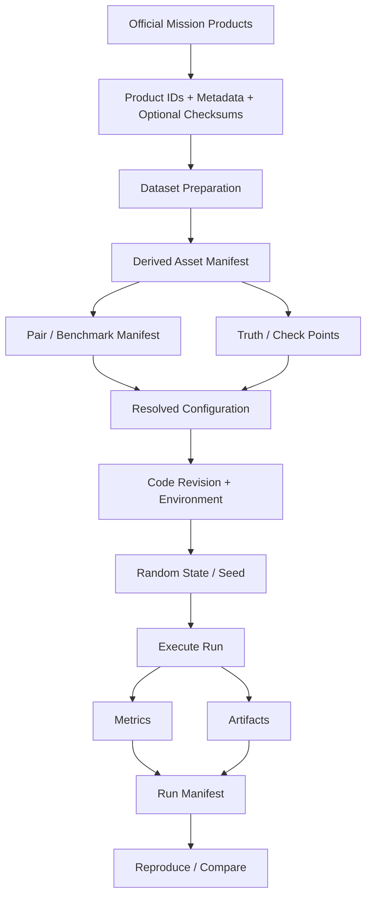
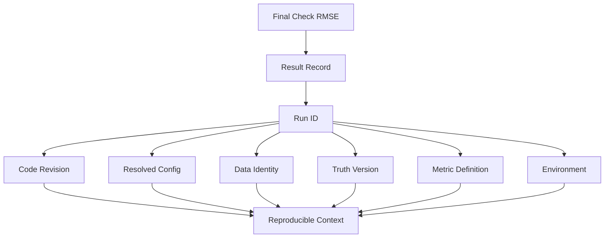
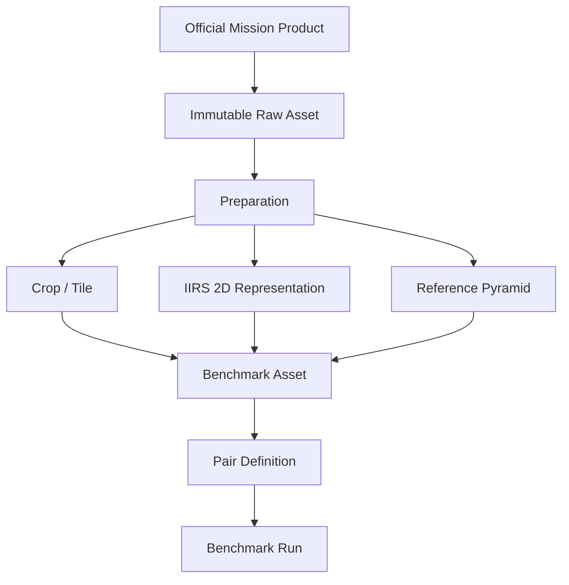

# Reproducibility

Reproducibility is a core requirement of ChandraMap's scientific evaluation process. A registration result is useful only when another contributor can determine which lunar products, derived assets, code revision, configuration, evaluation truth, metric definitions, and execution environment produced it.

Lunar image registration results depend on considerably more than the name of the matching algorithm. The same nominal pipeline can produce different outputs when any of the following change:

- source or reference product;
- processing state;
- crop or tile;
- reference pyramid level;
- IIRS representation;
- preprocessing;
- matcher configuration;
- match filtering;
- robust-estimation settings;
- transform model;
- sub-pixel refinement;
- random state;
- learned-model weights;
- software versions;
- hardware or accelerator behavior;
- benchmark truth;
- metric semantics.

> **A result is reproducible only when its inputs, code, configuration, evaluation truth, metric definitions, and execution context are traceable.**

> **A result file without provenance is incomplete scientific evidence.**

A record containing only:

```yaml
check_rmse: PLACEHOLDER_VALUE
```

is not sufficient. The value must remain interpretable in terms of its benchmark, pair, truth, coordinate system, units, data products, configuration, code revision, and metric definition.

> **Data identity is more important than local file path.**

A path such as `/home/user/data/image.tif` identifies where one contributor happened to store a file. It does not establish the scientific identity of the lunar product.

> **Generated data must remain traceable to its parent data and the process that created it.**

A reference pyramid tile, IIRS-derived raster, cropped OHRC image, or prepared TMC-2 benchmark asset is scientifically meaningful only when its lineage can be reconstructed.

> **Randomness must be controlled or recorded; determinism must never be assumed without verification.**

> **Exact numerical identity and scientifically equivalent reproduction are not always the same thing.**

> **Failed runs must be reproducible too.**

> **Reproducibility must not depend on undocumented manual actions.**

The goal is that a future contributor should be able to answer:

> **Can I determine exactly which data, code, configuration, truth, metric definitions, and environment produced this ChandraMap result?**

---

## 1. Reproducibility Goals

ChandraMap's reproducibility practices are intended to support:

- re-running a benchmark at a later date;
- reproducing a published result;
- comparing software versions fairly;
- comparing matching methods under controlled conditions;
- validating reported metrics;
- diagnosing regressions;
- reproducing failures;
- preserving scientific history;
- enabling external contributors to repeat experiments;
- supporting automated regression testing;
- separating code changes from data/configuration changes;
- preserving benchmark meaning as the project evolves.

A reproducible workflow should make it possible to move from:

```text
reported result
```

back through:

```text
run
configuration
code revision
benchmark
truth
derived data
mission products
```

without relying on undocumented memory.

---

# Reproducibility, Repeatability, and Replication

## 2. Terminology

Scientific communities use the terms **reproducibility**, **repeatability**, and **replicability** differently.

ChandraMap therefore uses the following working convention rather than claiming one universal terminology standard.

### Reproducibility

The ability to obtain the same or scientifically equivalent result using documented:

- data;
- code;
- configuration;
- benchmark;
- evaluation truth;
- environment.

### Repeatability

The ability to obtain consistent results when the same run is repeated under the same or closely controlled conditions.

### Replicability

The ability to obtain consistent scientific conclusions using an independent implementation, environment, or experimental realization.

These definitions are project conventions for clarity.

---

## 3. Exact Repeatability

Exact repeatability conceptually aims for:

```text
same code
+
same data
+
same configuration
+
same environment
+
same random state
```

to produce:

```text
identical or near-identical outputs
```

Exact equality may be realistic for some artifacts such as:

- manifests;
- immutable truth files;
- deterministic configuration files;
- frozen synthetic transformations.

It may be harder for:

- GPU-based learned models;
- parallel numerical routines;
- floating-point optimization;
- stochastic robust estimation.

---

## 4. Scientific Reproducibility

Scientific reproducibility accepts that small numerical changes may occur while the underlying scientific conclusion remains unchanged.

For example, compatible environments may produce slightly different floating-point results because of:

- BLAS implementation;
- GPU kernels;
- execution order;
- compiler;
- accelerator runtime;
- parallel scheduling.

A benchmark may therefore define tolerance-based reproduction where appropriate.

The tolerance must be benchmark-defined.

This document does not invent one.

---

# Reproducibility Levels

## 5. Data Reproducibility

A contributor can identify exactly which source and reference products were used and how benchmark-ready assets were derived.

---

## 6. Configuration Reproducibility

A contributor can determine the effective pipeline configuration used by the run.

---

## 7. Software Reproducibility

A contributor can identify:

- ChandraMap revision;
- relevant dependency versions;
- learned-model versions;
- runtime environment.

---

## 8. Execution Repeatability

The same run can be repeated under equivalent conditions with consistent results.

---

## 9. Metric Reproducibility

Reported metrics can be recomputed from the same:

- truth;
- point sets;
- coordinate spaces;
- definitions;
- aggregation rules.

---

## 10. Benchmark Reproducibility

A frozen benchmark can be executed again with the same:

- cases;
- pair definitions;
- truth;
- metrics;
- success rules;
- protocol.

---

## 11. Scientific Replication

An independent implementation or environment can reproduce the same scientific conclusions.

These are conceptual levels, not currently assumed software enum values.

---

# Reproducibility Contract

## 12. Minimum Run Identity

Every significant benchmark or research run should ideally be traceable to:

- run ID;
- task;
- execution time where repository policy records it;
- code revision;
- benchmark version;
- pair/query ID;
- source asset identity;
- reference asset identity;
- configuration identity;
- truth version;
- metric definition/version;
- success-criteria version where applicable;
- environment;
- status;
- output artifacts.

This document does not claim that every field is already implemented.

---

## 13. Minimum Scientific Context

Where applicable, also preserve:

- source sensor;
- reference sensor;
- coordinate space;
- units;
- source GSD;
- reference/effective GSD;
- crop/tile;
- projection state;
- pyramid level;
- IIRS representation;
- fit/check-point identity.

A metric is not fully interpretable without this context.

---

# Data Provenance

## 14. Mission Product Identity

Prefer stable scientific identity over local storage identity.

Where available, preserve concepts such as:

- data provider;
- mission;
- instrument;
- observation ID;
- product ID;
- product version;
- processing level/state;
- archive collection;
- product metadata.

For example:

```text
mission + instrument + product ID
```

is more useful scientifically than:

```text
image_01.tif
```

---

## 15. Local Filename Is Not Enough

A filename such as:

```text
reference.tif
```

does not reveal:

- which mission produced it;
- which instrument;
- which observation;
- whether it is raw or projected;
- whether it has been resampled;
- whether the file changed.

Local names may be retained for convenience, but they should not be the only scientific identifier.

---

## 16. Local Path Is Not Scientific Identity

Machine-specific paths such as:

```text
/home/user/Desktop/moon.tif
```

or:

```text
C:\Users\Name\Desktop\moon.tif
```

should never be the sole provenance record.

Use portable identities such as:

- product IDs;
- manifest asset keys;
- repository-relative paths;
- dataset-root-relative paths;
- checksums.

---

## 17. Original Mission Data Should Be Immutable

Original downloaded mission products should conceptually be treated as immutable inputs.

Do not preprocess by overwriting the original file.

Prefer:

```text
raw product
    |
    v
derived/prepared product
```

rather than:

```text
raw product
    |
    v
overwrite same file
```

See [dataset structure](../datasets/dataset-structure.md).

---

## 18. Derived Data

Every scientifically relevant derived asset should remain traceable to:

```text
parent data
+
processing operation
+
configuration
+
code version
```

Examples include:

- cropped source images;
- projected rasters;
- reference tiles;
- pyramid levels;
- masks;
- normalized imagery;
- IIRS 2D representations.

---

# Checksums and File Integrity

## 19. Why Checksums Help

A product identifier identifies the logical scientific product.

A checksum can additionally confirm that the exact file bytes used in a run have not changed.

Checksums are especially useful when:

- reprocessed products exist;
- files have been copied between systems;
- derived files are regenerated;
- externally downloaded weights are used.

---

## 20. What May Be Hashed

Potential candidates include:

- downloaded mission product;
- prepared raster;
- benchmark manifest;
- truth file;
- configuration file;
- model weights;
- retrieval index;
- result artifact.

Not every temporary file requires a checksum.

---

## 21. Hash Algorithm Policy

This document does not prescribe a specific hashing algorithm.

Use a stable cryptographic checksum according to repository policy.

The important requirements are:

- algorithm is identified;
- checksum is stored;
- checksum is compared consistently.

---

# External Mission Data

## 22. External Archives

ChandraMap may depend on external mission archives such as:

- ISRO / ISSDC / PRADAN;
- NASA Planetary Data System;
- LROC / Arizona State University;
- other authoritative planetary archives.

The repository does not need to redistribute every large upstream dataset.

---

## 23. Dataset Retrieval Records

A dataset manifest may preserve:

- provider;
- mission;
- instrument;
- product identifier;
- expected filename;
- product version;
- optional checksum;
- required metadata.

This document intentionally avoids fabricating download URLs.

---

## 24. Archive Interfaces Can Change

External providers may:

- restructure websites;
- change download interfaces;
- reprocess products;
- publish revised versions.

Stable scientific identifiers therefore matter more than a copied browser URL.

---

# Dataset Preparation Provenance

## 25. Preparation Pipeline

See [dataset preparation](../datasets/dataset-preparation.md).

A benchmark asset may conceptually follow:

```text
Official Mission Product
        |
        v
Input Validation
        |
        v
Calibration / Standardization
        |
        v
Projection / Representation
        |
        v
Crop / Tile / ROI
        |
        v
Scale Representation
        |
        v
Benchmark Asset
```

Every transformation should remain traceable.

---

## 26. Preparation Parameters

Relevant preparation parameters may include:

- crop bounds;
- ROI definition;
- projection;
- resampling;
- interpolation;
- nodata policy;
- mask generation;
- normalization;
- tile layout;
- pyramid level;
- IIRS representation method.

No values are prescribed here.

---

# Sensor-Specific Data Provenance

## 27. OHRC

The Orbiter High Resolution Camera is a Chandrayaan-2 visible/panchromatic instrument.

Project context commonly uses an approximate scale of:

```text
~0.25–0.32 m/pixel
```

depending on product/documentation.

Actual product metadata is authoritative.

For reproducibility, preserve where applicable:

- exact product identity;
- processing state;
- observation metadata;
- product dimensions;
- projection status;
- crop/ROI;
- derived representation;
- source GSD.

---

## 28. TMC-2

Terrain Mapping Camera-2 is Chandrayaan-2 panchromatic terrain imagery with project context around:

```text
~5 m/pixel
```

Preserve:

- product ID;
- product version;
- processing state;
- projection;
- crop/tile;
- effective source scale;
- reference relationship.

Do not assume every TMC-2 file has the same processing level or geometric state.

---

## 29. IIRS

The Imaging Infrared Spectrometer is a hyperspectral/imaging-infrared Chandrayaan-2 instrument.

Project context uses approximately:

- `~80 m/pixel`;
- `~0.8–5.0 µm`;
- roughly `~250–256` spectral bands depending on product/documentation.

IIRS requires additional provenance because a conventional image-registration pipeline generally operates on a derived two-dimensional representation.

Always preserve:

- parent cube/product identity;
- processing state;
- selected band/component;
- representation method;
- representation parameters;
- spatial mapping;
- derived asset identity.

A record containing only:

```text
iirs_image.png
```

is insufficient.

---

## 30. LRO NAC

LROC Narrow Angle Camera imagery serves as fine lunar reference data.

Project context often treats NAC imagery approximately as:

```text
~0.5–2 m/pixel
```

depending on product and geometry.

Actual product metadata is authoritative.

Preserve:

- product identity;
- product version;
- processing/map-projection state;
- tile identity;
- crop bounds;
- pyramid level;
- resampling;
- effective scale where applicable.

---

## 31. LRO WAC

LROC Wide Angle Camera provides broader/coarser lunar reference imagery.

Its scale is product- and mode-dependent.

Preserve:

- exact mosaic/product identity;
- projection;
- effective scale;
- ROI/tile;
- source version.

Do not encode WAC provenance using one assumed universal GSD.

---

# IIRS Representation Reproducibility

## 32. Parent Cube

Every IIRS-derived registration asset should identify the parent product.

Without the parent cube/product identity, the representation cannot be scientifically traced.

---

## 33. Representation Method

Possible conceptual methods include:

- selected band;
- selected spectral interval;
- PCA component;
- spectral composite;
- structural representation;
- another documented reduction.

The method must be named.

---

## 34. Representation Parameters

Preserve enough information to regenerate the 2D representation.

Examples may include:

- selected component;
- selected bands;
- normalization;
- projection;
- resampling;
- output extent.

---

## 35. Exported Raster Alone Is Insufficient

A derived TIFF or PNG is not a complete scientific record unless its lineage is available.

The reproducible identity is:

```text
parent IIRS product
+
representation method
+
parameters
+
code/config version
+
derived artifact identity
```

---

# Reference Preparation Reproducibility

## 36. NAC / WAC Preparation

Reference imagery may be:

- projected;
- cropped;
- tiled;
- resampled;
- pyramided;
- normalized.

Preserve the preparation path.

---

## 37. Reference Pyramid

See [scale pyramid](../algorithms/scale-pyramid.md).

Each pyramid level should remain traceable to:

```text
parent reference product
        |
        v
pyramid-generation method
        |
        v
level identity
```

A benchmark result must not refer only to:

```text
reference level 3
```

without identifying which reference pyramid it belongs to.

---

# Pair Reproducibility

## 38. Pair Identity

See [pair definition](../datasets/pair-definition.md).

A benchmark pair should preserve:

- pair ID;
- pair version;
- source asset;
- reference asset;
- expected overlap relationship;
- benchmark category where applicable;
- applicable truth.

Two filenames alone are insufficient.

---

## 39. Pair Versioning

Changing any of the following may materially change the pair:

- source crop;
- reference crop;
- reference tile;
- projection;
- derived representation;
- mask;
- overlap region.

Such changes should result in a new pair version or equivalent provenance update.

---

# Ground-Truth Reproducibility

## 40. Ground Truth

See [ground truth](ground-truth.md).

Preserve:

- truth version;
- point IDs;
- source coordinates;
- reference coordinates;
- coordinate spaces;
- units;
- review state;
- provenance;
- fit/check role where applicable.

---

## 41. Ground-Truth Preparation

See [ground-truth preparation](../datasets/ground-truth-preparation.md).

Truth-generation and review procedures should remain documented.

---

## 42. Do Not Silently Correct Ground Truth

If a truth point is corrected, removed, or reclassified:

- preserve the change;
- create/version the updated truth;
- retain historical linkage.

Historical benchmark results must remain associated with the truth version used at execution time.

---

# Control-Point Reproducibility

## 43. Control / Fit Points

See [control points](control-points.md).

Preserve:

- point-set version;
- point IDs;
- parent assets;
- coordinates;
- coordinate spaces;
- fit/control role;
- selection method.

---

## 44. Role Freeze

A benchmark is not reproduced if a point that was previously a check point becomes a fitting point without a version change.

Fit/check assignment is part of the benchmark state.

---

# Check-Point Reproducibility

## 45. Held-Out Check Set

See [check-point evaluation](checkpoint-evaluation.md).

Preserve the exact held-out set used to evaluate the transform.

---

## 46. Same Check Set for Controlled Comparisons

When comparing methods such as:

- SIFT;
- ALIKED + LightGlue;
- LoFTR;

the same applicable check truth should be used.

Changing check points confounds the comparison.

---

# Benchmark Reproducibility

## 47. Benchmark Version

See [benchmark protocol](benchmark-protocol.md).

A frozen benchmark version should identify:

- case list;
- pair/query versions;
- dataset split;
- truth;
- metrics;
- success criteria;
- categories;
- execution rules.

---

## 48. Category Version

See [benchmark categories](benchmark-categories.md).

Category definitions should remain stable within a benchmark version.

Changing which pairs belong to a category changes aggregate results.

---

# Metric Reproducibility

## 49. Metric Identity

See [metrics](metrics.md).

A stored metric should preserve at least:

- metric name;
- metric definition/version;
- point population where applicable;
- coordinate space;
- units;
- aggregation semantics.

---

## 50. Formula Changes Change Meaning

If the definition of RMSE, coverage, or another metric changes, the result cannot silently retain the same interpretation.

Examples include changes to:

- denominator;
- point population;
- coordinate conversion;
- masking;
- aggregation;
- valid-point filtering.

Metric definitions should be versioned.

---

# Spatial-Coverage Reproducibility

## 51. Coverage Configuration

See [spatial coverage](spatial-coverage.md).

A reproducible coverage record should identify:

- point population;
- coordinate space;
- valid region;
- mask;
- method;
- grid definition;
- grid origin where relevant;
- coverage version.

---

## 52. Grid Definition Matters

Coverage cannot be faithfully reproduced when the grid partition is unknown.

Changing:

- cell count;
- cell dimensions;
- origin;
- valid-cell policy;

may change the coverage value even for the same points.

---

# Success-Criteria Reproducibility

## 53. Rule-Set Version

See [success criteria](success-criteria.md).

The success/failure interpretation of a result depends on the rule set used.

Preserve the applicable criteria version.

---

## 54. Historical Interpretation

Do not silently reinterpret historical results using newer success criteria.

If re-evaluation is desired, report it explicitly as:

```text
historical measurements
evaluated under a newer rule set
```

rather than overwriting the original status.

---

# Failure Reproducibility

## 55. Failed Runs

See [failure cases](failure-cases.md).

A failed run should preserve enough information to be re-executed.

Useful context includes:

- pair/query;
- code revision;
- configuration;
- random state;
- failure stage;
- preceding metrics;
- logs;
- artifacts;
- error message where appropriate.

---

## 56. Reproduce Before Diagnosing

Before changing the algorithm, first attempt to reproduce the failure using the recorded run context.

This helps distinguish:

- deterministic bug;
- configuration mismatch;
- stale cache;
- data change;
- environment difference;
- stochastic behavior.

---

# Stress-Test Reproducibility

## 57. Stress Configuration

See [stress tests](stress-tests.md).

For every generated stress case, preserve:

- base asset;
- stress type;
- stress parameters;
- generator version;
- random seed where applicable;
- expected truth.

---

## 58. Synthetic Transform Truth

Do not record only:

```text
rotated test
```

Instead preserve conceptually:

```text
base image
+
transform family
+
exact transform parameters
+
photometric perturbations
+
random state
```

The applied transformation should remain separate from the transform estimated by ChandraMap.

---

# Pipeline Configuration

## 59. Configuration Is Part of the Result

Two runs using the same data and code may differ because of configuration.

Every significant result should therefore identify the effective configuration used.

---

## 60. Avoid Hidden Defaults

Hidden defaults are dangerous because they may change between software versions.

Important behavior should be:

- explicitly captured; or
- unambiguously tied to a specific software/configuration version.

---

## 61. Configuration Precedence

If configuration can originate from multiple places such as:

- file;
- CLI;
- environment;
- code default;

the repository should define one unambiguous resolution policy.

This document does not invent that precedence without implementation evidence.

---

# Resolved Configuration

## 62. Preserve Effective Values

The configuration that matters scientifically is the final resolved configuration actually used by the process.

For example:

```text
base config
+
command override
+
environment override
=
resolved run config
```

Preserving only the base file may not reproduce the run.

---

# Preprocessing Configuration

## 63. Preprocessing Provenance

See [preprocessing](../algorithms/preprocessing.md).

Preserve where applicable:

- sensor route;
- image representation;
- normalization;
- masking;
- crop/ROI;
- projection;
- denoising;
- structural representation;
- nodata handling.

---

# Illumination Configuration

## 64. Illumination Handling

See [illumination handling](../algorithms/illumination-handling.md).

Preserve:

- whether illumination handling was enabled;
- selected method;
- method parameters;
- representation produced.

This is particularly important for lunar imagery because Sun geometry can strongly alter appearance.

---

# Scale-Pyramid Configuration

## 65. Scale Context

See [scale pyramid](../algorithms/scale-pyramid.md).

Preserve where relevant:

- source GSD;
- reference GSD;
- selected pyramid level;
- effective GSD;
- level-generation method;
- resampling method;
- canonical/reference grid.

---

# Matcher Reproducibility

## 66. SIFT

Where SIFT is used, preserve conceptually:

- implementation/library;
- implementation version;
- explicit non-default configuration;
- descriptor matching method;
- filtering configuration.

Do not invent current parameter values.

---

## 67. ALIKED + LightGlue

Where used, preserve:

- feature-model identity;
- matcher identity;
- weights/version;
- preprocessing;
- image resizing;
- device;
- relevant inference configuration.

This does not imply current implementation.

---

## 68. LoFTR

Where used, preserve:

- model identity;
- weight version;
- implementation revision;
- preprocessing;
- device;
- inference configuration.

---

## 69. Remote-Sensing Matchers

Where RIFT-, CFOG-, or related methods are evaluated, preserve:

- implementation provenance;
- publication/reference;
- implementation version;
- configuration.

---

# Match-Filtering Reproducibility

## 70. Filter Configuration

See [match filtering](../algorithms/match-filtering.md).

Preserve:

- enabled filters;
- filter order;
- score/confidence rules;
- ratio settings where applicable;
- mutual/cross-check behavior;
- duplicate handling;
- rejection rules.

Do not rely on undocumented defaults.

---

# RANSAC Reproducibility

## 71. Robust-Estimation Configuration

See [RANSAC](../algorithms/ransac.md).

Relevant context may include:

- estimator;
- transform model;
- coordinate space;
- inlier threshold;
- iteration policy;
- confidence policy;
- random seed where controllable;
- implementation/library version.

No values are prescribed here.

---

# Transform Reproducibility

## 72. Transform Configuration

See [transforms](../algorithms/transforms.md).

Preserve:

- model type;
- transform direction;
- source coordinate space;
- destination coordinate space;
- initial-fit/refit relationship;
- inversion behavior where relevant.

A matrix without coordinate semantics is incomplete.

---

# Sub-Pixel Refinement Reproducibility

## 73. Refinement Configuration

See [sub-pixel refinement](../algorithms/subpixel-refinement.md).

Preserve conceptually:

- enabled/disabled;
- method;
- patch/search configuration;
- convergence or acceptance behavior;
- rejection rules;
- final-refit behavior.

No implementation defaults are assumed.

---

# Registration Output Reproducibility

## 74. Registration Configuration

See [registration](../algorithms/registration.md).

Preserve where applicable:

- final transform;
- transform direction;
- output grid;
- output projection;
- interpolation;
- resampling;
- border handling;
- mask handling;
- preview/scientific-product distinction.

---

# Retrieval Reproducibility

## 75. Offline Reference Index

Where retrieval is used, preserve:

- reference product set;
- tile list;
- tiling scheme;
- pyramid levels;
- descriptor model;
- descriptor preprocessing;
- vector-index configuration;
- reference metadata version;
- index version;
- checksum where practical.

---

## 76. Online Query

Preserve:

- query asset;
- query representation;
- descriptor model/version;
- similarity/distance semantics;
- requested Top-K;
- index identity.

---

## 77. FAISS Role

FAISS or another vector index is retrieval infrastructure.

Its results identify candidate reference regions.

The index is not registration ground truth.

---

# Learned Model Weights

## 78. Model Weights Are Experimental Inputs

If ChandraMap uses learned models, their weights are part of the experimental state.

Preserve:

- model name;
- weight identity;
- model version;
- provider/source;
- checksum where practical;
- license/reference where required.

---

## 79. Avoid "Latest"

A result that depends on:

```text
latest weights
```

cannot reliably reproduce a historical experiment.

Use a pinned/versioned model identity.

---

# Randomness

## 80. Possible Sources of Randomness

Randomness may enter through components such as:

- Python pseudo-random generators;
- NumPy;
- OpenCV robust estimation;
- PyTorch;
- GPU kernels;
- augmentation;
- synthetic stress generation;
- random data splitting;
- randomized sampling.

Not all of these are necessarily used in every pipeline.

---

## 81. Seed Recording

Where a pseudo-random process exposes controllable state, record the seed or equivalent random-state identity.

---

## 82. Multiple Random Generators

One seed field does not automatically control every library.

A pipeline may use independent random states for:

- Python;
- NumPy;
- OpenCV;
- PyTorch;
- custom augmentation.

The run manifest should capture relevant random state according to implementation.

---

## 83. Seeds Do Not Guarantee Determinism

A seed is necessary for some repeatability scenarios.

It is not sufficient evidence that the entire pipeline is deterministic.

---

# Determinism

## 84. Deterministic Modes

Some libraries provide deterministic execution settings.

These may improve repeatability but can:

- reduce performance;
- restrict algorithms;
- still leave unsupported nondeterministic operations.

Do not claim ChandraMap enables deterministic execution unless the implementation confirms it.

---

## 85. Verify Determinism Empirically

A pipeline should be considered deterministic only after repeated execution confirms expected consistency under the documented environment.

Conceptually:

```text
set seed
    |
    v
repeat run
    |
    v
compare outputs
    |
    v
verify determinism
```

---

# Software Versioning

## 86. Git Revision

Every scientifically important benchmark should preserve a code revision.

Prefer:

- exact Git commit identity; or
- release/tag together with commit identity.

A human-readable release name alone may not uniquely identify local modifications.

---

## 87. Dirty Working Tree

A run produced from uncommitted changes is harder to reproduce.

Where practical, record whether the repository had local modifications.

If exact local changes matter, preserve them through an appropriate patch, commit, or other repository-defined mechanism.

This document does not claim that such capture is currently automated.

---

## 88. Dependency Versions

Relevant packages may include, depending on the active pipeline:

- Python;
- NumPy;
- OpenCV;
- SciPy;
- PyTorch;
- FAISS;
- geospatial libraries;
- image-processing libraries.

Only dependencies actually used by the active run need to be scientifically relevant.

---

# Dependency Pinning and Environment Capture

## 89. Repository Dependency Definition

If `pyproject.toml` is present, it should serve as the primary repository-level Python project/dependency definition.

It should not automatically be assumed to pin every transitive dependency exactly.

---

## 90. Resolved Environment Snapshot

For formal benchmark publication, a resolved environment snapshot can strengthen reproducibility.

Examples conceptually include:

- lockfile;
- package freeze;
- container image;
- environment manifest.

Do not invent a dependency-lock mechanism that the repository does not use.

---

# Operating-System Context

## 91. OS and Architecture

Record operating-system context when it may affect:

- dependencies;
- numerical behavior;
- GPU tooling;
- runtime.

Possible context includes:

- OS family;
- OS version;
- processor architecture;
- relevant system libraries.

---

# Hardware Reproducibility

## 92. CPU Context

For runtime-sensitive experiments, record useful CPU context.

Hardware identity may be unnecessary for pure correctness evaluation but becomes important for efficiency comparisons.

---

## 93. GPU Context

For learned or accelerated pipelines, preserve where relevant:

- GPU model;
- accelerator availability;
- driver context;
- CUDA/toolkit/runtime context;
- relevant deep-learning backend.

Do not fabricate hardware information.

---

## 94. Hardware vs Accuracy

Hardware most obviously affects runtime, but it can also affect numerical behavior through:

- floating-point precision;
- kernel implementation;
- parallel ordering;
- accelerator libraries.

Do not assume all accuracy outputs are perfectly hardware-independent.

---

# Containers

## 95. Containerization

Containers may improve environment reproduction by capturing:

- base OS;
- packages;
- runtime tools;
- service dependencies.

Containers do not automatically freeze:

- external mission data;
- host GPU driver behavior;
- model weights;
- benchmark manifests;
- random state.

---

## 96. Container Identity

If containers become part of formal benchmarks, preserve the container identity such as:

- repository-defined image name;
- tag;
- digest where practical.

Do not claim a formal benchmark image currently exists unless repository evidence confirms it.

---

# Docker Compose

## 97. Service-Level Reproduction

If `docker-compose.yml` exists, it may help reproduce service-level architecture.

It must not automatically be treated as the scientific benchmark environment.

A compose file may describe:

- backend services;
- databases;
- UI components;
- auxiliary tools;

without capturing the precise scientific execution environment.

---

# Code and Configuration Snapshot

## 98. Both Are Required

Git revision alone is insufficient when runtime configuration differs.

Configuration alone is insufficient when the code implementation differs.

Conceptually:

```text
scientific run identity
=
code revision
+
resolved configuration
```

---

# Environment Variables and Secrets

## 99. Relevant Environment Variables

Environment variables that affect:

- algorithm behavior;
- threading;
- device selection;
- data location;
- runtime resources;

may need to be captured where scientifically relevant and safe.

---

## 100. Never Store Secrets

Reproducibility records must not contain:

- API keys;
- tokens;
- passwords;
- private credentials;
- secret environment values.

Security requirements still apply.

---

# Portable File References

## 101. Avoid Machine-Specific Paths

A manifest should not require one contributor's directory layout to understand the data.

Bad identity:

```text
/home/alice/Desktop/reference.tif
```

Better conceptual identity:

```text
asset_id: PLACEHOLDER_ASSET
product_id: PLACEHOLDER_PRODUCT
relative_path: PLACEHOLDER_REPOSITORY_OR_DATASET_RELATIVE_PATH
```

---

# Run Identity

## 102. Run IDs

Every significant run should have a stable unique identity.

The exact syntax may be:

- generated identifier;
- structured name;
- repository-defined key.

This document does not prescribe one.

---

## 103. Run ID Is Not Provenance by Itself

A run ID must point to a manifest or equivalent record.

This is incomplete:

```text
run_123
```

without information describing what `run_123` actually used.

---

# Experiment Identity

## 104. Experiments Group Runs

An experiment may consist of multiple runs designed to answer one question.

Example:

```text
Research question:
How does matcher choice affect known-overlap lunar registration?
```

Associated runs might vary:

- SIFT;
- ALIKED + LightGlue;
- LoFTR;

while keeping the benchmark and truth fixed.

An experiment record should preserve the intended changed variable.

---

# Conceptual Run Manifest

## 105. Illustrative Run Record

> **Illustrative conceptual structure — not an implemented schema.**

```yaml
run:
  id: PLACEHOLDER_RUN_ID
  task: local_registration
  status: PLACEHOLDER_STATUS

code:
  git_commit: PLACEHOLDER_COMMIT
  repository_version: PLACEHOLDER_VERSION
  working_tree_state: PLACEHOLDER_STATE

benchmark:
  version: PLACEHOLDER_BENCHMARK_VERSION
  pair_id: PLACEHOLDER_PAIR_ID
  truth_version: PLACEHOLDER_TRUTH_VERSION
  success_criteria_version: PLACEHOLDER_CRITERIA_VERSION

data:
  source:
    asset_id: PLACEHOLDER_SOURCE_ASSET
    product_id: PLACEHOLDER_PRODUCT_ID
    checksum: PLACEHOLDER_CHECKSUM

  reference:
    asset_id: PLACEHOLDER_REFERENCE_ASSET
    product_id: PLACEHOLDER_PRODUCT_ID
    pyramid_level: PLACEHOLDER_LEVEL
    checksum: PLACEHOLDER_CHECKSUM

configuration:
  sensor_route: PLACEHOLDER_ROUTE
  preprocessing: PLACEHOLDER_CONFIG
  matcher: PLACEHOLDER_MATCHER
  filtering: PLACEHOLDER_CONFIG
  ransac: PLACEHOLDER_CONFIG
  transform: PLACEHOLDER_MODEL
  refinement: PLACEHOLDER_CONFIG

randomness:
  seed: PLACEHOLDER_SEED
  deterministic_mode: PLACEHOLDER_BOOLEAN_OR_STATUS

environment:
  python: PLACEHOLDER_VERSION
  operating_system: PLACEHOLDER_OS
  cpu: PLACEHOLDER_CPU
  gpu: PLACEHOLDER_GPU
  dependencies: PLACEHOLDER_ENVIRONMENT_MANIFEST

outputs:
  result: PLACEHOLDER_RESULT_PATH
  transform: PLACEHOLDER_TRANSFORM_PATH
  diagnostics: PLACEHOLDER_DIAGNOSTIC_PATHS
```

No values above represent actual ChandraMap run metadata.

---

# Conceptual IIRS Provenance

## 106. IIRS-Derived Representation

> **Illustrative conceptual structure — not an implemented schema.**

```yaml
derived_representation:
  asset_id: PLACEHOLDER_DERIVED_ID

  parent:
    mission: Chandrayaan-2
    instrument: IIRS
    product_id: PLACEHOLDER_PRODUCT

  representation:
    method: PLACEHOLDER_METHOD
    parameters: PLACEHOLDER_PARAMETERS

  spatial_mapping:
    parent_grid: PLACEHOLDER_GRID
    output_grid: PLACEHOLDER_GRID

  checksum: PLACEHOLDER_CHECKSUM
```

---

# Conceptual Reference-Tile Provenance

## 107. LRO NAC Reference Tile

> **Illustrative conceptual structure — not an implemented schema.**

```yaml
reference_tile:
  tile_id: PLACEHOLDER_TILE_ID

  parent:
    mission: LRO
    instrument: LROC NAC
    product_id: PLACEHOLDER_PRODUCT

  preparation:
    projection: PLACEHOLDER_PROJECTION
    crop_or_tile_bounds: PLACEHOLDER_BOUNDS
    pyramid_level: PLACEHOLDER_LEVEL
    resampling: PLACEHOLDER_METHOD

  checksum: PLACEHOLDER_CHECKSUM
```

---

# Result Manifest

## 108. Result Record

A result should connect:

```text
run
+
metrics
+
artifacts
+
provenance
```

Conceptually:

> **Illustrative conceptual structure — not an implemented schema.**

```yaml
result:
  run_id: PLACEHOLDER_RUN
  benchmark_version: PLACEHOLDER_VERSION
  metric_version: PLACEHOLDER_VERSION

  metrics:
    check_rmse:
      value: PLACEHOLDER_VALUE
      units: PLACEHOLDER_UNIT
      coordinate_space: PLACEHOLDER_SPACE

    inlier_ratio: PLACEHOLDER_VALUE
    spatial_coverage: PLACEHOLDER_VALUE

  artifacts:
    transform: PLACEHOLDER_ARTIFACT
    registered_preview: PLACEHOLDER_ARTIFACT
    residuals: PLACEHOLDER_ARTIFACT
```

No performance numbers are implied.

---

# Artifact Provenance

## 109. Important Artifacts Must Point Back to a Run

Examples include:

- candidate-match file;
- verified-inlier file;
- transform;
- registered raster;
- registered preview;
- residual vectors;
- coverage visualization;
- retrieval ranking;
- evaluation report.

Each should remain linkable to the run that generated it.

---

## 110. Filename Alone Is Insufficient

A filename such as:

```text
transform.json
```

does not reveal which:

- run;
- pair;
- model;
- configuration;
- code version;

created it.

Use run metadata or manifests.

---

# Artifact Checksums

## 111. Optional Integrity Verification

Generated artifacts may also be hashed where exact byte identity matters.

This is useful for:

- frozen benchmark artifacts;
- released result packages;
- model weights;
- retrieval indexes;
- derived input assets.

Temporary visualizations need not necessarily be hashed.

---

# Logging

## 112. Useful Log Information

Logs may record:

- selected sensor route;
- selected pyramid level;
- candidate count;
- filtered count;
- inlier count;
- RANSAC status;
- transform status;
- refinement status;
- retrieval candidates;
- failure stage.

---

## 113. Logs Are Supporting Evidence

Logs should not be the sole machine-readable source of scientific provenance.

Log wording may change across releases.

Critical reproducibility fields belong in structured result/run records.

---

# Output Isolation

## 114. Prevent Silent Overwrite

Outputs from separate runs should not silently overwrite one another.

Conceptually, organize output by:

- run ID;
- experiment ID;
- versioned result directory;
- another stable repository-defined mechanism.

This document does not prescribe an exact directory layout.

---

# Raw, Derived, and Result Separation

## 115. Raw Data

Original or canonical upstream mission products.

---

## 116. Derived Data

Prepared inputs created from raw products.

Examples:

- tiles;
- pyramids;
- IIRS representations;
- masks;
- projected rasters.

---

## 117. Results

Outputs created by experiments and benchmarks.

Examples:

- transforms;
- metrics;
- registered images;
- diagnostic plots.

Keep these categories logically distinct.

See [dataset structure](../datasets/dataset-structure.md).

---

# Large Files and Git

## 118. Do Not Commit Everything Blindly

Mission data can be large.

Reproducibility does not require placing every upstream raster directly in Git.

---

## 119. Reproducibility Without Bundling Data

Use:

- product IDs;
- manifests;
- checksums;
- provenance;
- preparation scripts;
- configuration;

so that data can be obtained or regenerated where licensing and archive availability permit.

---

# Data Licensing

## 120. Reproducibility Does Not Override Licensing

See [data licenses](../data-licenses.md).

A reproducible benchmark may reference external mission data without redistributing files that the project does not own or should not republish.

---

## 121. Attribution and Source

Provenance should preserve enough upstream context to support:

- attribution;
- citation;
- provider requirements;
- scientific traceability.

---

# External Model and Data Downloads

## 122. Version External Dependencies

If a model or data asset is fetched externally, preserve:

- provider;
- asset identity;
- version;
- checksum where practical.

Avoid instructions such as:

```text
download latest
```

for historical reproduction.

---

# Cache Reproducibility

## 123. Caches Are Derived State

Potential caches include:

- descriptors;
- pyramid tiles;
- preprocessed arrays;
- learned embeddings;
- retrieval indexes.

Caches may improve performance.

They should not be the only copy of scientifically important state.

---

## 124. Cache Rebuildability

A cache should remain derivable from:

```text
canonical inputs
+
code
+
configuration
+
model/version
```

---

## 125. Cache Invalidation

A cache may become stale if any parent dependency changes.

Examples:

- product file;
- preprocessing;
- model weights;
- descriptor model;
- tile definition;
- software version.

This document does not prescribe the exact cache-key mechanism.

---

# Retrieval Index Reproducibility

## 126. Index as Derived Scientific Artifact

A FAISS or similar retrieval index should be traceable to:

- reference asset set;
- tile definitions;
- pyramid levels;
- descriptor model;
- preprocessing;
- index parameters;
- code revision.

---

## 127. Index Version

Changing any of these may alter retrieval ranking.

The retrieval index should therefore have a stable identity or reproducible derivation path.

---

# Train / Validation / Test Reproducibility

## 128. Split Identity

If learned methods are trained or fine-tuned, preserve:

- training split;
- validation split;
- test split;
- grouping rules;
- geographic separation rules where applicable.

---

## 129. Leakage Prevention

See:

- [ground truth](ground-truth.md)
- [benchmark protocol](benchmark-protocol.md)

Final benchmark truth must not silently influence:

- training;
- hyperparameter tuning;
- threshold selection;
- model selection.

---

# Geographic Leakage

## 130. Overlapping Lunar Regions

Different image files can still contain substantially the same lunar terrain.

Therefore:

```text
different filename
```

does not necessarily mean:

```text
independent geographic sample
```

Where learned evaluation depends on geographic independence, split methodology should account for spatial overlap.

---

# Random Splits

## 131. Preserve Split Seeds

If random splitting is used, preserve the seed and algorithm/configuration used.

---

## 132. Prefer Frozen Lists for Formal Benchmarks

A frozen explicit pair list is often easier to reproduce than rerunning a random split generator.

Formal benchmarks should favor stable manifests where practical.

---

# Synthetic Data Reproducibility

## 133. Synthetic Generation

Preserve:

- parent image;
- transformation family;
- transformation parameters;
- photometric perturbations;
- noise;
- augmentation;
- random seed;
- generator/software version.

---

## 134. Known Synthetic Truth

Keep the applied ground-truth transformation separate from the transformation estimated by the algorithm.

Conceptually:

```text
known applied transform
        !=
estimated transform
```

The difference is the evaluation target.

---

# Timing Reproducibility

## 135. Runtime Requires Context

See [metrics](metrics.md).

Runtime comparisons should document:

- hardware;
- software;
- input dimensions;
- included stages;
- device;
- cache state;
- batching where applicable;
- warm/cold state.

---

## 136. Unknown Hardware Prevents Fair Runtime Comparison

A lower runtime on different hardware does not by itself demonstrate an algorithmic speed improvement.

---

# Warm and Cold Runs

## 137. Cold Run

A cold run may include:

- process startup;
- model loading;
- index loading;
- cache construction;
- file initialization.

---

## 138. Warm Run

A warm run may reuse:

- loaded models;
- resident index;
- caches;
- memory allocation.

Benchmark documentation should specify which behavior is timed.

---

# Numerical Reproducibility

## 139. Floating-Point Variation

Small numerical variation may come from:

- CPU architecture;
- GPU architecture;
- BLAS libraries;
- parallelism;
- fused operations;
- kernel implementation;
- operation ordering.

---

## 140. Tolerance-Based Reproduction

A benchmark may accept scientifically equivalent results within documented tolerances rather than requiring exact equality.

The allowed tolerance must be justified and versioned.

No tolerance is defined here.

---

# Bitwise Reproducibility

## 141. Appropriate Uses

Exact byte identity is useful for frozen artifacts such as:

- truth files;
- manifests;
- configuration;
- deterministic derived assets;
- released reference indexes.

---

## 142. Not Universal for Numerical Algorithms

Bitwise equality is often unrealistic for:

- GPU inference;
- floating-point optimization;
- parallel CV algorithms.

Do not require bitwise equality universally.

---

# Statistical Reproducibility

## 143. Repeated Runs

Stochastic methods may need repeated runs to characterize variation.

Possible summaries include:

- mean;
- median;
- standard deviation;
- success rate;
- distribution of metrics.

This document does not define a mandatory repetition count.

---

# Non-Deterministic GPU Execution

## 144. Learned Pipelines

GPU-based execution may not be perfectly deterministic even when a seed is set.

A reproducibility report should document this limitation rather than asserting identical output everywhere.

---

# Failure Reproduction

## 145. Failure Bundle

A reproducible failure should ideally retain:

- pair/query ID;
- source/reference identities;
- code revision;
- resolved configuration;
- seed;
- environment;
- metrics up to failure;
- failure stage;
- logs;
- available artifacts.

---

## 146. Preserve Failure Before Fixing It

Do not modify:

- thresholds;
- candidate tile;
- transform;
- truth;
- configuration;

before saving the failing context.

First preserve the run.

Then debug.

See [failure cases](failure-cases.md).

---

# Regression Reproducibility

## 147. Controlled Code-Version Comparison

To test for regression, keep constant where possible:

- data;
- pair;
- truth;
- benchmark;
- metric definitions;
- success criteria;
- configuration.

Change:

```text
code version
```

This isolates software evolution.

---

## 148. Configuration Migration

If configuration schema changes over time, preserve how older configurations map to the new representation.

Do not silently reinterpret old configuration keys.

---

# CI and Automated Reproducibility

## 149. Continuous Integration

CI can help reproduce:

- unit tests;
- coordinate-transform tests;
- deterministic fixtures;
- small integration benchmarks;
- metric regression checks;
- failure-case regression tests.

---

## 150. CI Is Not Necessarily the Full Scientific Benchmark

Full lunar datasets or GPU-heavy methods may be unsuitable for standard CI.

Small fixtures can validate engineering behavior without pretending to represent full scientific benchmark performance.

---

# Test Fixtures

## 151. Small Frozen Fixtures

Useful test fixtures may validate:

- coordinate transformations;
- correspondence interfaces;
- synthetic registration;
- metric implementations;
- failure handling;
- manifest parsing.

Small fixtures should not be presented as evidence of large-scale lunar performance.

---

# Notebook Reproducibility

## 152. Notebooks for Exploration

Notebooks are useful for:

- research;
- inspection;
- plotting;
- debugging.

Formal benchmark execution should preferably rely on versioned code and configuration rather than undocumented notebook state.

---

## 153. Hidden Notebook State

If notebooks are used, avoid reliance on:

- out-of-order cells;
- stale variables;
- manual file selection;
- hidden local state.

Document:

- inputs;
- dependencies;
- configuration;
- execution order where necessary.

---

# Manual Steps

## 154. Manual Ground-Truth Annotation

Some truth preparation may require human annotation.

Preserve:

- annotation protocol;
- reviewer information according to repository policy;
- point identity;
- version history;
- review status.

---

## 155. Manual Benchmark Intervention

Formal benchmark execution should minimize per-run manual decisions.

If human intervention is necessary, record:

- what changed;
- why;
- who/what performed it according to repository policy;
- whether the run remains comparable.

---

# Visualization Reproducibility

## 156. Visual Outputs

Registered overlays, match plots, and residual diagrams should be generated from the same run data used for metrics.

Do not manually recreate a figure later using different points.

---

## 157. Visualization Settings

Record visualization settings when they affect scientific interpretation, such as:

- coordinate mapping;
- displayed point population;
- residual scale;
- mask;
- crop.

Purely cosmetic choices need not be over-recorded unless they influence interpretation.

---

# Results and Historical Preservation

## 158. Result Records

A result should never contain only final metric values.

Preserve:

```text
metrics
+
context
+
provenance
+
status
```

---

## 159. Historical Results

When code evolves, old benchmark results should remain associated with:

- original code revision;
- original benchmark version;
- original truth;
- original rule set.

Do not overwrite research history.

---

# Comparing Runs

## 160. Compatibility Checks

Before comparing two runs, verify compatibility of:

- benchmark version;
- pair/query version;
- truth version;
- metric version;
- coordinate space;
- success criteria;
- key configuration;
- hardware/environment for runtime comparison.

---

## 161. Comparable Runs

Example conceptual comparison:

```text
same pair
same truth
same preprocessing
same coverage definition
same transform model
different matcher
```

This can support conclusions about matcher differences.

---

## 162. Confounded Runs

Example:

```text
different matcher
+
different preprocessing
+
different truth
+
different pair set
+
different pyramid
```

A metric difference cannot safely be attributed to matcher choice alone.

---

# Minimum Run Manifest

## 163. Required Context Table

| Category      | Required Context                | Why It Matters                      |
| ------------- | ------------------------------- | ----------------------------------- |
| Code          | Git revision                    | Identifies implementation           |
| Data          | Product/asset IDs               | Identifies original inputs          |
| Derived Data  | Parent + preparation config     | Rebuilds prepared inputs            |
| Pair          | Pair/version                    | Identifies evaluated relationship   |
| Truth         | Truth/check-point version       | Reproduces evaluation               |
| Configuration | Resolved pipeline configuration | Reproduces algorithm behavior       |
| Randomness    | Seed/state where applicable     | Controls stochastic behavior        |
| Environment   | Software/dependencies           | Explains numerical differences      |
| Hardware      | CPU/GPU where relevant          | Gives runtime/accelerator context   |
| Metrics       | Metric definition/version       | Reproduces reported values          |
| Success Rules | Rule-set version                | Reproduces pass/fail interpretation |
| Results       | Run ID/artifacts                | Links evidence to execution         |

---

# Reproducibility Status Template

## 164. Run-Level Template

| Run | Code Revision | Data Frozen | Config Saved | Truth Version | Environment Captured | Seed Captured | Reproducibility Status |
| --- | ------------- | ----------- | ------------ | ------------- | -------------------- | ------------- | ---------------------- |
|     |               |             |              |               |                      |               |                        |

No current implementation status is implied.

---

# Benchmark Reproduction Template

## 165. Benchmark-Level Template

| Benchmark Version | Pair Set | Truth Version | Metric Version | Success Rules | Code Revision | Environment | Status |
| ----------------- | -------- | ------------- | -------------- | ------------- | ------------- | ----------- | ------ |
|                   |          |               |                |               |               |             |        |

---

# Reproduction Workflow

## 166. Conceptual Procedure

To reproduce a historical benchmark:

1. Check out the recorded ChandraMap code revision.
2. Recreate the documented software environment.
3. Obtain the exact external mission products.
4. Verify product identity and checksums where available.
5. Regenerate or load the exact derived assets.
6. Load the frozen benchmark/pair manifest.
7. Load the frozen truth/check-point version.
8. Load the recorded resolved pipeline configuration.
9. Restore random seeds and deterministic settings where applicable.
10. Execute the benchmark.
11. Compare generated metrics and artifacts with the historical result.
12. Document expected numerical variation.

The exact shell commands belong to implementation/setup documentation once established.

---

# Reproduction Verification

## 167. What to Compare

Depending on the task, reproduction may compare:

- overall status;
- candidate count;
- filtered-match count;
- inlier count;
- inlier ratio;
- transform;
- spatial coverage;
- check-point RMSE;
- retrieval rank;
- failure stage;
- artifact integrity.

---

## 168. Scientific Equivalence

Do not require every intermediate byte to match unless exact identity is scientifically or operationally necessary.

A learned/GPU pipeline may be reproducible even if very small floating-point changes occur, provided the benchmark's scientific equivalence criteria are satisfied.

---

# Reproducibility Failure Modes

## 169. Practical Failure Table

| Symptom                                   | Reproducibility Problem                              | Recommended Response                                |
| ----------------------------------------- | ---------------------------------------------------- | --------------------------------------------------- |
| Same filename, different result           | File content or product version changed              | Verify product identity and checksum                |
| Different matches after rerun             | Randomness or library variation                      | Record seeds, environment, and library versions     |
| RMSE differs slightly                     | Floating-point/environment variation                 | Check benchmark-defined scientific tolerance        |
| RMSE differs substantially                | Data/config/code mismatch                            | Compare complete run manifests                      |
| IIRS result cannot be rebuilt             | Representation lineage missing                       | Record parent cube, method, and parameters          |
| NAC result cannot be recreated            | Tile or pyramid identity missing                     | Record parent product, tile, level, and preparation |
| Runtime changes substantially             | Hardware/cache/warm state differs                    | Record execution context                            |
| Historical benchmark changes after update | Old results overwritten or silently re-evaluated     | Preserve versioned historical results               |
| Retrieval ranking changes                 | Descriptor/index/reference version changed           | Version retrieval index and descriptor pipeline     |
| Failure cannot be reproduced              | Code/config/seed/environment context missing         | Strengthen failure manifest                         |
| Coverage differs unexpectedly             | Grid or valid-region semantics changed               | Preserve coverage definition/version                |
| Transform differs despite same pair       | Model/configuration or stochastic estimation changed | Compare transform/RANSAC settings                   |

---

# Per-Run Reproducibility Checklist

## 170. Run QC

- [ ] Run ID is known.
- [ ] Task is known.
- [ ] Code revision is known.
- [ ] Working-tree state is known where relevant.
- [ ] Benchmark version is known.
- [ ] Pair/query ID is known.
- [ ] Pair version is known.
- [ ] Source product identity is known.
- [ ] Reference product identity is known.
- [ ] Parent data provenance is known.
- [ ] Derived-data provenance is known.
- [ ] Checksums are available where needed.
- [ ] Source processing state is known.
- [ ] Reference processing state is known.
- [ ] IIRS representation is known where applicable.
- [ ] NAC/WAC tile identity is known where applicable.
- [ ] Pyramid level is known where applicable.
- [ ] Crop/ROI identity is known.
- [ ] Resolved configuration is preserved.
- [ ] Preprocessing configuration is preserved.
- [ ] Matcher identity/configuration is preserved.
- [ ] Match-filtering configuration is preserved.
- [ ] RANSAC configuration is preserved.
- [ ] Transform model is preserved.
- [ ] Sub-pixel refinement configuration is preserved.
- [ ] Registration/warp configuration is preserved.
- [ ] Retrieval index identity is preserved where applicable.
- [ ] Learned-model weights are versioned where applicable.
- [ ] Random seeds/state are recorded where applicable.
- [ ] Determinism limitations are documented.
- [ ] Truth version is known.
- [ ] Fit/check roles are frozen.
- [ ] Exact check-point version is preserved.
- [ ] Metric definition/version is known.
- [ ] Coverage definition/version is known where applicable.
- [ ] Success-criteria version is known.
- [ ] Software versions are known.
- [ ] Hardware context is known for runtime/GPU experiments.
- [ ] Result artifacts point back to the run.
- [ ] Failure context is preserved for failed runs.
- [ ] No secrets are stored.
- [ ] No machine-specific absolute path is the sole data identity.

---

# Benchmark Release Checklist

## 171. Before Freezing a Benchmark

- [ ] Pair manifest is frozen.
- [ ] Input product IDs are frozen.
- [ ] Derived-data definitions are frozen.
- [ ] Truth version is frozen.
- [ ] Fit/check roles are frozen.
- [ ] Metric definitions are frozen.
- [ ] Spatial-coverage definition is frozen where used.
- [ ] Success criteria are frozen.
- [ ] Stress/category definitions are frozen.
- [ ] Configuration is frozen.
- [ ] Retrieval-index version is frozen where applicable.
- [ ] Learned-model weights are pinned where applicable.
- [ ] Code revision is tagged or recorded.
- [ ] Environment can be recreated.
- [ ] Reproduction test has been performed.
- [ ] External data requirements are documented.
- [ ] Licensing/attribution requirements are documented.
- [ ] No secrets are present in release artifacts.

---

# Reproducibility Flow

## 172. Main Traceability Flow



---

# Result Traceability

## 173. Metric-to-Provenance Flow



---

# Data Lineage

## 174. Parent-to-Derived Flow



---

# Conceptual Reproducibility Status

## 175. Possible States

Possible conceptual states include:

- complete;
- partial;
- environment missing;
- data missing;
- configuration missing;
- truth missing;
- non-deterministic;
- reproduction failed.

These are conceptual categories only.

Do not assume they are implemented enum values.

---

# Reproducibility Audit

## 176. Audit Questions

Ask:

- Can I identify the exact code revision?
- Can I identify the exact source product?
- Can I identify the exact reference product?
- Can I verify important file identities?
- Can I regenerate every derived input?
- Can I identify the pair/query?
- Can I identify the benchmark version?
- Can I identify the ground-truth version?
- Can I identify the exact held-out check set?
- Can I identify the fit/check roles?
- Can I identify the resolved configuration?
- Can I identify the matcher configuration?
- Can I identify the robust-estimation configuration?
- Can I identify the transform model?
- Can I identify the refinement configuration?
- Can I identify the retrieval index where applicable?
- Can I identify learned-model weights where applicable?
- Can I identify the random state?
- Can I recreate the environment?
- Can I identify the metric definition?
- Can I identify the coverage definition?
- Can I identify the success-rule version?
- Can I explain why the run succeeded or failed?
- Can I reproduce the result within the benchmark's expected numerical tolerance?

If several answers are **no**, the scientific result is not fully reproducible.

---

# Reproducibility Maturity by Version

## 177. V1

V1 reproducibility should be simple but mandatory.

Recommended conceptual V1 requirements:

- Git revision recorded;
- pair ID/version recorded;
- exact source/reference product identities recorded;
- prepared-data lineage recorded;
- resolved configuration saved;
- matcher configuration saved;
- filtering configuration saved;
- RANSAC configuration saved;
- transform configuration saved;
- truth/check-point version saved;
- coordinate context saved;
- random seed saved where applicable;
- run ID linked to result record;
- failure status preserved;
- Python/dependency context documented;
- reproduction procedure documented.

Primary V1 goal:

> **Another contributor should be able to reproduce the known-pair registration experiment using the same frozen data and configuration.**

---

## 178. V2

Possible V2 maturity additions:

- automatic run manifests;
- artifact checksums;
- stronger environment snapshots;
- sub-pixel refinement provenance;
- IIRS representation manifests;
- stronger reference-tile lineage;
- automated benchmark reproduction command;
- expanded deterministic CI fixtures.

These are possible future capabilities.

---

## 179. V3

Possible V3 additions:

- learned-weight versioning;
- GPU-environment capture;
- retrieval-index versioning;
- experiment tracking;
- reproducible NAC/WAC retrieval pipelines;
- repeated stochastic evaluations;
- containerized benchmark environments.

---

## 180. V4

Possible V4 research/engineering additions:

- full provenance graph;
- multi-mission manifests;
- DEM provenance;
- control-network provenance;
- uncertainty-model versioning;
- published frozen benchmark snapshots;
- archival environment/container images;
- automated reproducibility audits;
- independent replication packages.

Existing version specifications remain authoritative.

---

# Relationship to Evaluation Documentation

## 181. Evaluation Overview

See [evaluation README](README.md).

The relationship is:

```text
README.md
    -> overall evaluation philosophy

reproducibility.md
    -> how runs remain traceable and repeatable
```

---

## 182. Benchmark Protocol

See [benchmark protocol](benchmark-protocol.md).

```text
benchmark-protocol.md
    -> how a benchmark is executed

reproducibility.md
    -> what must be preserved to execute it again
```

---

## 183. Benchmark Categories

See [benchmark categories](benchmark-categories.md).

Category definitions and pair assignments should remain tied to the benchmark version.

---

## 184. Metrics

See [metrics](metrics.md).

A reproducible metric requires:

- definition;
- population;
- units;
- coordinate space;
- version.

---

## 185. Ground Truth

See [ground truth](ground-truth.md).

Truth identity, provenance, and version must be preserved.

---

## 186. Control Points

See [control points](control-points.md).

Fit/control point identity and role assignments must remain traceable.

---

## 187. Check-Point Evaluation

See [check-point evaluation](checkpoint-evaluation.md).

The exact held-out check set must be preserved.

---

## 188. Spatial Coverage

See [spatial coverage](spatial-coverage.md).

Coverage reproducibility requires the same:

- point population;
- valid region;
- grid;
- coordinate space;
- metric definition.

---

## 189. Stress Tests

See [stress tests](stress-tests.md).

Synthetic and real stress conditions must remain traceable.

---

## 190. Success Criteria

See [success criteria](success-criteria.md).

A success/failure label is reproducible only when the rule-set version is known.

---

## 191. Failure Cases

See [failure cases](failure-cases.md).

Failed runs require the same provenance quality as successful runs.

---

# Relationship to Dataset Documentation

## 192. Dataset README

See [datasets README](../datasets/README.md).

It defines overall dataset governance and organization.

---

## 193. Chandrayaan-2 Data

See [Chandrayaan-2 datasets](../datasets/chandrayaan-2.md).

Use official product identities and metadata where available.

---

## 194. LRO Data

See [LRO datasets](../datasets/lro.md).

Preserve NAC/WAC source, product, tile, and preparation identity.

---

## 195. Metadata

See [metadata](../datasets/metadata.md).

Metadata is a core component of scientific provenance.

---

## 196. Data Format

See [data format](../datasets/data-format.md).

Normalized/derived formats should remain traceable to original products.

---

## 197. Dataset Structure

See [dataset structure](../datasets/dataset-structure.md).

Maintain logical separation between:

```text
raw
derived
benchmark
results
```

---

## 198. Dataset Preparation

See [dataset preparation](../datasets/dataset-preparation.md).

Preparation steps and parameters should be reproducible.

---

## 199. Pair Definition

See [pair definition](../datasets/pair-definition.md).

Pair identity and version are required for benchmark reproduction.

---

## 200. Ground-Truth Preparation

See [ground-truth preparation](../datasets/ground-truth-preparation.md).

Truth creation and review should remain versioned.

---

# Relationship to Algorithm Documentation

## 201. Sensor Routing

See [sensor routing](../algorithms/sensor-routing.md).

Record which processing route was selected for the input sensor.

---

## 202. Preprocessing

See [preprocessing](../algorithms/preprocessing.md).

Preserve preprocessing configuration and derived-representation lineage.

---

## 203. Illumination Handling

See [illumination handling](../algorithms/illumination-handling.md).

Record selected illumination-handling strategy and parameters.

---

## 204. Scale Pyramid

See [scale pyramid](../algorithms/scale-pyramid.md).

Record pyramid construction and selected level.

---

## 205. Matching

See [matching](../algorithms/matching.md).

Preserve matcher, implementation/model version, and configuration.

---

## 206. Match Filtering

See [match filtering](../algorithms/match-filtering.md).

Preserve filter order and behavior.

---

## 207. RANSAC

See [RANSAC](../algorithms/ransac.md).

Preserve robust-estimation configuration and relevant random state.

---

## 208. Transforms

See [transforms](../algorithms/transforms.md).

Preserve model identity, direction, and coordinate systems.

---

## 209. Sub-Pixel Refinement

See [sub-pixel refinement](../algorithms/subpixel-refinement.md).

Preserve refinement method and configuration.

---

## 210. Residual Analysis

See [residual analysis](../algorithms/residual-analysis.md).

Residual statistics require reproducible point sets, units, and coordinate spaces.

---

## 211. Registration

See [registration](../algorithms/registration.md).

Preserve final warp/registration semantics.

---

# Relationship to Sensor Documentation

## 212. Sensor Documentation

Relevant sensor files include:

- [sensor overview](../sensors/overview.md)
- [OHRC](../sensors/ohrc.md)
- [TMC-2](../sensors/tmc2.md)
- [IIRS](../sensors/iirs.md)
- [LRO NAC](../sensors/lro-nac.md)
- [LRO WAC](../sensors/lro-wac.md)

Sensor documentation explains the physical meaning of the product metadata being preserved.

---

# Relationship to Project Documentation

## 213. Project Scope and Terminology

Relevant project files include:

- [goals](../project/goals.md)
- [non-goals](../project/non-goals.md)
- [V1 scope](../project/v1-scope.md)
- [terminology](../project/terminology.md)
- [assumptions](../project/assumptions.md)
- [limitations](../project/limitations.md)

Actual version scope remains authoritative.

---

# Relationship to Architecture

## 214. Architecture Documentation

Relevant architecture files include:

- [system overview](../architecture/system-overview.md)
- [V1 pipeline](../architecture/v1-pipeline.md)
- [core-engine architecture](../architecture/core-engine-architecture.md)
- [module map](../architecture/module-map.md)
- [data flow](../architecture/data-flow.md)
- [output flow](../architecture/output-flow.md)

Architecture defines where provenance and configuration move through the implementation.

This document defines what scientific context must remain traceable.

---

# Repository-Level Benchmarking Areas

## 215. Root `benchmarks/`

If present, benchmark definitions should remain sufficiently immutable and versioned to reproduce historical results.

Possible contents may include:

- pair manifests;
- case lists;
- configurations;
- truth references;
- metric definitions;
- success-rule references.

---

## 216. Root `experiments/`

If present, an experiment should preserve:

- research question;
- base configuration;
- changed variable;
- run IDs;
- result references.

Avoid undocumented manual changes between experiment runs.

---

## 217. Root `results/`

If present, generated results should retain historical identity.

Do not overwrite old benchmark results merely because a newer code revision exists.

---

## 218. Root `artifacts/`

If present, generated or large artifacts should remain linked to run provenance.

Not every large artifact needs to be committed to Git.

---

# Repository Configuration

## 219. `configs/`

If the repository uses a `configs/` area, those files should be treated as versioned experiment inputs.

When runtime overrides exist, preserve the final resolved configuration as well.

---

## 220. `pyproject.toml`

If present, `pyproject.toml` is the repository-level Python project/dependency definition.

It should not be treated as proof that every transitive dependency is fully pinned unless the repository's dependency workflow establishes that.

---

## 221. `docker-compose.yml`

If present, `docker-compose.yml` may assist service-level reproducibility.

It does not necessarily define the complete scientific benchmark environment.

---

## 222. `.env.example`

If present, `.env.example` may document required environment variables.

Real secrets must never be written into:

- benchmark manifests;
- experiment records;
- Git history;
- result files.

---

# CI and GitHub Actions

## 223. Continuous Integration

If repository workflows exist, they may support:

- unit testing;
- linting;
- deterministic regression fixtures;
- small benchmark tests;
- metric-validation tests.

Do not assume the complete lunar benchmark executes in CI unless repository configuration confirms it.

---

# Security

## 224. Secrets and Provenance

If `SECURITY.md` or other repository security guidance exists, reproducibility practices must remain compatible with it.

Never preserve reproducibility by leaking:

- credentials;
- API tokens;
- passwords;
- private secrets.

---

# Citation and Software Identity

## 225. Citation

If `CITATION.cff` or other citation guidance exists, publications and benchmark packages should identify the ChandraMap version/revision used.

Citation metadata complements, but does not replace, run-level provenance.

---

# Changelog and Release History

## 226. Historical Context

If `CHANGELOG.md` or release records exist, they can help explain changes such as:

- algorithm updates;
- configuration changes;
- metric changes;
- dependency updates.

Release history does not replace run manifests.

---

# Reproducibility Anti-Patterns

## 227. Do Not

Do **not**:

- publish only a screenshot;
- publish only a mosaic;
- publish only RMSE;
- publish only pass/fail;
- identify data only by filename;
- identify data only by absolute local path;
- use "latest data" for reproducible historical results;
- use "latest weights";
- use undocumented defaults;
- omit code revision;
- omit resolved configuration;
- omit truth version;
- omit metric version;
- omit coordinate units;
- omit reference pyramid level;
- omit IIRS representation method;
- overwrite raw mission data;
- overwrite historical results;
- overwrite benchmark truth;
- silently update pair definitions;
- silently change success criteria;
- silently change spatial-coverage definitions;
- reuse stale caches;
- manually alter transforms after benchmark execution;
- manually select a better retrieval tile after observing failure;
- change thresholds without recording them;
- assume one random seed guarantees global determinism;
- assume GPU operations are always deterministic;
- compare runtime without hardware context;
- commit secrets into manifests;
- rely on undocumented manual steps;
- discard failed-run manifests;
- depend on one contributor's machine paths;
- assume Docker alone guarantees complete reproducibility;
- assume a Git commit alone reproduces an experiment;
- assume configuration alone reproduces an experiment.

---

# Claims ChandraMap Should Avoid

## 228. Unsupported Reproducibility Claims

Do not claim without evidence:

- "fully reproducible everywhere";
- "100% reproducible";
- "bit-for-bit identical on all systems";
- "fully deterministic";
- "one seed guarantees identical GPU output";
- "Docker guarantees identical scientific results";
- "all mission products are immutable forever";
- "runtime is reproducible on any hardware";
- "dependency versions do not affect results";
- "model-weight version does not matter";
- "a filename is sufficient provenance";
- "the newest software reproduces every historical result";
- "the latest reference mosaic is equivalent to a historical one";
- "the same visual overlay proves the metrics were reproduced".

---

# Limitations

## 229. Reproducibility Limitations

ChandraMap reproducibility is subject to practical limitations.

These include:

- external archive availability may change;
- archive interfaces may move;
- upstream mission products may be reprocessed;
- large datasets may be impractical to store in Git;
- dependencies evolve;
- platform behavior differs;
- GPU pipelines may remain nondeterministic;
- floating-point results can vary;
- learned weights must remain available;
- third-party libraries may change;
- exact historical environments may become difficult to reconstruct;
- manual annotations cannot be regenerated without preserved annotation records;
- historical hardware may become unavailable;
- runtime is sensitive to hardware and system load;
- stochastic algorithms require random-state preservation;
- external services may change;
- container images do not capture every host dependency;
- scientific equivalence may be more realistic than bitwise identity.

Reproducibility is therefore an engineering and scientific process, not a property achieved by one manifest file or one container.

---

# Authoritative and Primary Reference Categories

## 230. Reproducible Research and Scientific Software

Prefer established guidance concerning:

- scientific reproducibility;
- experiment provenance;
- software versioning;
- research-software preservation;
- environment capture;
- scientific workflow provenance.

Exact references should be added only when verified.

---

## 231. Git and GitHub

Relevant authoritative categories include:

- Git documentation;
- GitHub documentation;
- GitHub Actions documentation where CI is used.

---

## 232. Python Packaging

Relevant authoritative sources include:

- Python documentation;
- Python Packaging Authority guidance;
- documentation for repository dependency tooling actually used by ChandraMap.

---

## 233. Containers

Use Docker or other container documentation where containerized benchmark workflows are implemented.

---

## 234. Computer Vision and Machine Learning

Relevant authoritative sources may include:

- OpenCV documentation;
- PyTorch documentation;
- LightGlue official documentation/repository;
- LoFTR primary publication/repository;
- ALIKED primary publication/repository;
- FAISS official documentation.

Only reference methods actually used or evaluated by the project.

---

## 235. Planetary and Geospatial

Relevant primary/authoritative resources include:

- USGS ISIS;
- GDAL documentation where used;
- NASA Planetary Data System;
- LROC / Arizona State University;
- ISRO / ISSDC / PRADAN.

Mission documentation and actual product metadata remain the primary authority for scientific product identity and sensor context.

---

# Summary

A ChandraMap result is not reproducible merely because the algorithm name is known.

The reproducible unit is closer to:

```text
data
+
derived-data lineage
+
pair/benchmark identity
+
truth
+
code revision
+
resolved configuration
+
model/weights
+
random state
+
environment
+
metric definitions
+
success rules
+
artifacts
```

The essential principles are:

1. Preserve data identity.
2. Prefer stable product identity over local path.
3. Preserve parent-to-derived lineage.
4. Keep original mission data immutable.
5. Preserve the code revision.
6. Preserve the resolved configuration.
7. Preserve truth and check-point versions.
8. Preserve metric definitions.
9. Preserve success-rule versions.
10. Record random state where possible.
11. Do not assume determinism.
12. Record software/environment context.
13. Record hardware for meaningful runtime comparisons.
14. Version learned-model weights.
15. Treat retrieval indexes as derived scientific artifacts.
16. Make caches rebuildable.
17. Preserve failed runs.
18. Separate exact equality from scientific equivalence.
19. Never store secrets in reproducibility records.
20. Make V1 reproducibility simple, explicit, and mandatory.

The target standard is straightforward:

> **A ChandraMap result should be traceable from final metric back to the exact data, code, configuration, and evaluation truth that produced it.**

If that trace cannot be reconstructed, the result may still be interesting, but its scientific reproducibility is incomplete.

<!-- Source specification: :contentReference[oaicite:0]{index=0} -->
