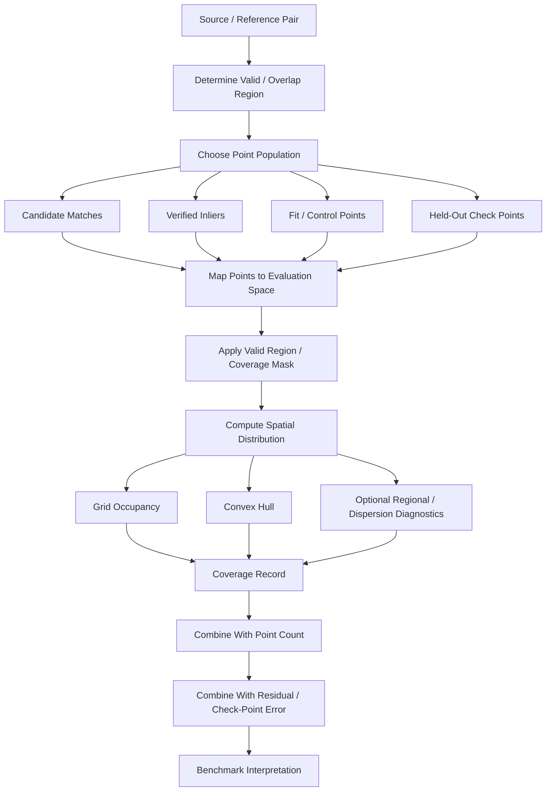
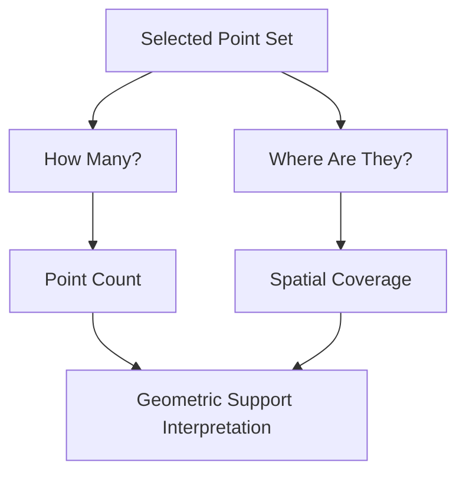
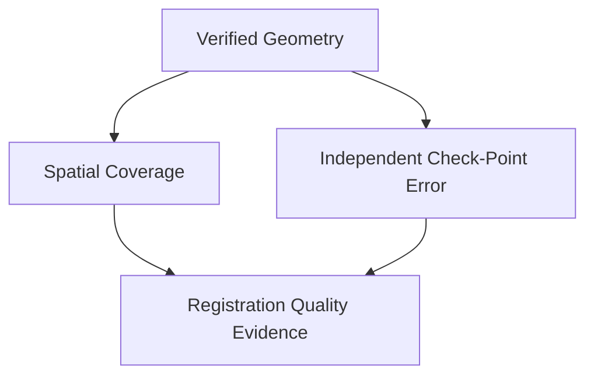

# Spatial Coverage

Spatial coverage describes **how broadly correspondence or evaluation points occupy a defined valid image region**. In ChandraMap, it is used to determine whether candidate matches, geometrically verified inliers, fitting/control points, or held-out check points support the registration across meaningful portions of the usable source/reference overlap.

A registration can contain many matches and still have weak spatial support if those matches are concentrated around one crater, ridge, shadow boundary, or textured patch. Conversely, a smaller set of reliable points may span a larger fraction of the useful overlap. Point count and spatial coverage therefore describe different properties.

> **A large number of matches is not strong geometric evidence if those matches are concentrated in one small part of the image.**

> **Spatial coverage complements geometric correctness; it does not prove that the points themselves are correct.**

Widely distributed wrong correspondences are still wrong. Coverage must therefore be interpreted together with geometric verification, residual analysis, and independent check-point error.

> **Spatial coverage must be measured relative to a clearly defined valid region.**

The valid region may be the valid source area, the source/reference overlap, a registered overlap mask, or a benchmark-defined region of interest. A full rectangular image must not automatically be used as the denominator when substantial parts of that rectangle contain nodata or fall outside the usable overlap.

> **Coverage depends on the point population being measured.**

Candidate-match coverage, filtered-match coverage, verified-inlier coverage, fit/control-point coverage, and check-point coverage answer different questions. A value such as `coverage = 0.72` is incomplete unless the point population and metric definition are identified.

> **Coverage must be interpreted in a known coordinate space and scale.**

Coverage measured in OHRC source coordinates is not automatically equivalent to coverage measured in an LRO NAC pyramid level or an IIRS-derived registration grid.

> **High coverage and low independent error are complementary evidence.**

A strong registration result ideally combines reliable verified correspondences, useful spatial support, and low independent evaluation error rather than optimizing only one statistic.

> **No universal spatial-coverage threshold should be invented for every ChandraMap sensor, transform, or benchmark task.**

Any pass/fail criterion belongs in a versioned benchmark protocol and must be justified for the sensor pair, overlap, transform model, terrain, available truth, and intended use.

> **Spatial coverage is about geometric support, not aesthetic point distribution.**

The goal is not to force correspondences into a visually perfect grid. The goal is to determine whether the geometry and evaluation are supported across enough of the usable region to make the result scientifically meaningful.

---

## 1. Why Spatial Coverage Matters

Image registration estimates a spatial relationship between two images from a finite collection of correspondence points. Where those points occur matters.

A transform estimated from a dense cluster of points around one local feature may describe that feature well while providing little evidence for the rest of the image. This becomes especially important for lunar imagery because matching quality can vary significantly across terrain due to:

- illumination and Sun-angle differences;
- shadows;
- terrain relief;
- sensor modality;
- local texture;
- repetitive crater patterns;
- cross-resolution information loss;
- projection distortion;
- viewing geometry;
- preprocessing effects.

Poor spatial coverage can contribute to:

- unstable extrapolation away from the fitted region;
- model behavior that is poorly constrained near image edges;
- overfitting to one terrain structure;
- misleadingly high inlier counts;
- misleadingly small local residuals;
- weak evidence for whole-overlap alignment;
- untested regions of the registration;
- misleading comparisons between matching methods.

ChandraMap therefore measures not only how many points survive geometric verification, but also whether those points support the registration across the usable region.

The project feedback that motivated the evaluation design explicitly identifies spatial distribution as a separate diagnostic from inlier count and RMSE, and recommends grid or convex-hull style coverage for determining whether good correspondences are spread through the overlap rather than clustered around a single feature.

---

## 2. What Spatial Coverage Does Not Measure

Spatial coverage is not a replacement for geometric accuracy.

It does **not directly measure**:

- correspondence correctness;
- reprojection error;
- registration RMSE;
- geolocation accuracy;
- transformation-model validity;
- physical feature quality;
- matcher confidence;
- photometric similarity;
- semantic terrain identity;
- independent truth quality.

A method can produce high coverage and high registration error. Another method can produce low coverage and excellent local accuracy.

These outcomes describe different properties.

For this reason, ChandraMap should report spatial coverage **with**, not instead of:

- point count;
- inlier ratio;
- residual diagnostics;
- check-point error;
- model status;
- failure status.

---

## 3. Terminology

### Spatial coverage

A quantitative or diagnostic description of how broadly a selected point set occupies a defined valid region.

### Valid region

The spatial area eligible for coverage measurement.

Examples include:

- valid source pixels;
- valid reference pixels;
- valid source/reference overlap;
- registered overlap;
- benchmark region of interest.

### Usable overlap

The region where both source and reference provide valid information relevant to the registration.

### Point population

The specific point set being evaluated.

Examples:

- raw candidate matches;
- filtered candidates;
- verified inliers;
- final fitting/control points;
- held-out check points.

### Grid occupancy

The fraction of eligible spatial cells containing at least one selected point.

### Convex hull

The smallest convex region containing the selected point set.

### Convex-hull coverage

The area of the point-set convex hull relative to a defined valid-region area.

### Bounding box

The smallest axis-aligned rectangle spanning the selected point set.

### Bounding-box coverage

The area of that bounding box relative to the valid region.

Bounding-box coverage must be interpreted cautiously because it can substantially overstate actual support.

### Regional coverage

A diagnostic indicating whether predefined spatial regions contain selected points.

### Point density

The number of points per unit image or ground area.

Density and coverage are not equivalent.

### Spatial clustering

Concentration of points into one or a small number of spatial regions.

### Spatial dispersion

The degree to which points are distributed throughout the valid region.

### Coverage mask

A mask defining pixels or cells that are eligible for inclusion in the coverage denominator.

### Occupied cell

A valid grid cell containing at least one selected point according to the metric definition.

### Valid cell

A grid cell accepted into the coverage denominator according to the valid-region and mask policy.

No universal minimum valid-area fraction is defined here.

---

## 4. Point Count Is Not Spatial Coverage

Consider two hypothetical registration results.

**Case A**

- 100 verified inliers;
- most lie around one crater complex.

**Case B**

- 30 verified inliers;
- distributed across much of the usable overlap.

Case A has more points.

Case B may provide broader spatial support.

This does **not** mean Case B is automatically better. Thirty points may still be insufficient for a particular geometry, or some may be incorrect. The important conclusion is narrower:

> **Point count and spatial coverage measure different properties.**

ChandraMap should therefore avoid using:

```text
number_of_matches
```

as a proxy for:

```text
spatial_support
```

---

## 5. Coverage Is Not Accuracy

A point set may cover most of the overlap while containing inaccurate correspondences.

Likewise, a transform may produce a very small error inside one local region while remaining poorly constrained elsewhere.

Examples:

| Situation                                      | Coverage | Independent Error | Interpretation                                              |
| ---------------------------------------------- | -------- | ----------------- | ----------------------------------------------------------- |
| Broad point distribution, inaccurate transform | High     | High              | Spatial support exists, but registration accuracy is poor   |
| Small local cluster, accurate local transform  | Low      | Low locally       | Good local result; weak evidence outside tested region      |
| Broad verified support, low check error        | High     | Low               | Stronger combined evidence, subject to truth/model validity |
| Sparse and inaccurate                          | Low      | High              | Weak spatial and geometric evidence                         |

Coverage must therefore remain a **complementary evaluation family**, not an accuracy score.

---

# Point Populations

## 6. Candidate-Match Coverage

Candidate-match coverage describes where a matcher proposes correspondences before final geometric verification.

It is useful for diagnosing:

- feature-detector bias;
- matcher behavior;
- texture sensitivity;
- illumination sensitivity;
- local-feature concentration;
- sensor-representation effects.

Candidate coverage can answer questions such as:

- Does the matcher propose correspondences throughout the image?
- Are nearly all proposals concentrated around a small crater field?
- Does preprocessing remove candidate support from certain regions?
- Does a learned matcher produce a different proposal distribution from SIFT?

Candidate coverage is **not** evidence that those correspondences are correct.

---

## 7. Filtered-Match Coverage

Filtered-match coverage evaluates the spatial distribution after pre-geometric filtering but before final geometric verification.

Filtering may include operations such as:

- descriptor ratio tests;
- mutual consistency checks;
- confidence filtering;
- duplicate removal;
- sensor-specific screening;
- geometric preconditions.

This metric helps detect whether a filtering strategy improves candidate quality by discarding weak matches while unintentionally removing complete image regions.

A filter should not be evaluated only by the number of rejected matches.

Its downstream effects on:

- verified inliers;
- coverage;
- check-point error;

also matter.

See [match filtering](../algorithms/match-filtering.md).

---

## 8. Verified-Inlier Coverage

Verified-inlier coverage measures the spatial distribution of correspondences accepted by geometric verification.

For transform support, this is usually more meaningful than raw candidate coverage because these points are the correspondences considered consistent with the estimated geometric model.

Typical flow:

```text
Candidate matches
      |
      v
Filtering
      |
      v
Geometric verification
      |
      v
Verified inliers
      |
      v
Verified-inlier coverage
```

A high inlier count or high inlier ratio does not imply good inlier coverage.

A RANSAC model may obtain a strong consensus from one localized terrain region while leaving the rest of the overlap weakly constrained.

See [RANSAC](../algorithms/ransac.md).

---

## 9. Fit / Control-Point Coverage

Fit coverage measures the spatial distribution of points actually used to estimate or refit the final registration model.

This distinction matters because the final fitting set may differ from the initial RANSAC inliers after:

- refinement;
- confidence filtering;
- duplicate handling;
- coordinate validation;
- model-specific rejection;
- control-point curation.

Two quantities should normally be retained separately:

```text
N_fit
fit_coverage
```

Point count must not be used as a proxy for distribution.

See [control points](control-points.md).

---

## 10. Check-Point Coverage

Check-point coverage measures the spatial distribution of independent evaluation points that were not used to fit the final transform.

It answers:

> How broadly does the independent evaluation sample the registration?

A small check RMSE computed from a tight cluster demonstrates accuracy mainly in the region sampled by that cluster.

A similar error computed from well-distributed check points usually provides broader evidence.

Check coverage is therefore particularly useful alongside:

- check-point count;
- check RMSE;
- check residual maps.

See [check-point evaluation](checkpoint-evaluation.md).

---

## 11. Do Not Mix Point Populations

Different point populations answer different questions.

| Coverage Type      | Point Population                             | Main Purpose                  |
| ------------------ | -------------------------------------------- | ----------------------------- |
| Candidate Coverage | Raw matcher proposals                        | Matcher behavior              |
| Filtered Coverage  | Candidates surviving pre-geometric filtering | Filtering diagnostics         |
| Inlier Coverage    | Geometrically verified correspondences       | Transform-support diagnostics |
| Fit Coverage       | Points used in final fitting/refitting       | Final model support           |
| Check Coverage     | Held-out independent truth                   | Evaluation representativeness |

A result should not report only:

```text
coverage: 0.72
```

without identifying at least:

- coverage metric;
- point population;
- coordinate space;
- valid region.

---

# Valid Region and Denominator

## 12. Define the Denominator

Every normalized coverage ratio requires a denominator.

Possible denominator regions include:

- full valid source image;
- full valid reference region;
- valid source/reference overlap;
- registered overlap;
- benchmark-defined region of interest;
- valid reference tile;
- source footprint after masking.

Coverage becomes ambiguous if the denominator is not recorded.

---

## 13. Prefer Usable Overlap Where Appropriate

For image-to-image registration, coverage relative to the usable source/reference overlap is often more meaningful than coverage relative to the entire reference image.

For example, if a source image occupies only a small part of a large NAC reference tile, dividing by the complete reference-tile area can produce a low coverage score even when the source overlap is well supported.

However, usable overlap is not a universal mandatory denominator. A benchmark may intentionally define another evaluation region.

The benchmark definition remains authoritative.

---

## 14. Validity Masks

Coverage calculations should account for invalid image areas where applicable.

Examples include:

- nodata;
- projection borders;
- missing sensor pixels;
- excluded artifacts;
- masked detector regions;
- areas outside the source/reference overlap;
- benchmark exclusions.

A coverage metric must not silently count these regions as eligible spatial support.

See:

- [registration](../algorithms/registration.md)
- [preprocessing](../algorithms/preprocessing.md)

---

## 15. Rectangular Image Bounds Are Not Necessarily the Valid Region

A map-projected, resampled, or warped raster may have irregular valid boundaries.

Therefore:

```text
valid_area != image_width * image_height
```

in many cases.

Using the entire raster rectangle as the denominator may substantially underestimate coverage when much of that rectangle is invalid.

Conversely, a poorly constructed mask may overestimate coverage by excluding difficult but legitimate overlap areas.

The denominator must therefore be documented and reproducible.

---

## 16. Reproducible Denominator Definition

A reproducible coverage result should make it possible to determine:

- which image or overlap defines the region;
- which mask was used;
- mask version or provenance where applicable;
- image dimensions;
- crop offsets;
- tile identity;
- pyramid level;
- projection or coordinate frame where relevant;
- valid-cell policy;
- nodata treatment.

Changing the denominator changes the metric.

---

# Source-Space and Reference-Space Coverage

## 17. Source-Space Coverage

Source-space coverage evaluates the point distribution in source-image coordinates.

This is often useful because ChandraMap evaluates registration for source sensors such as:

- OHRC;
- TMC-2;
- IIRS.

Source-space coverage can directly answer:

> How broadly do the correspondences support the source image that is being registered?

---

## 18. Reference-Space Coverage

Reference-space coverage evaluates correspondence locations in the selected reference representation.

Examples include:

- LRO NAC image coordinates;
- NAC pyramid coordinates;
- WAC image coordinates;
- reference map tile coordinates.

Reference-space reporting is useful when evaluating:

- tile support;
- pyramid matching;
- candidate-region geometry;
- reference-side concentration.

---

## 19. Source and Reference Coverage Need Not Be Identical

The same physical correspondences can have different spatial distributions when expressed in different coordinate systems.

Differences may arise from:

- scale;
- map projection;
- warping;
- perspective;
- image footprint shape;
- clipping;
- cropping;
- nonlinear mapping.

Therefore source-space and reference-space coverage values must not be assumed interchangeable.

---

## 20. Preferred Reporting Space

ChandraMap does not define one universal coverage space for every benchmark.

A practical convention is:

- use source-space coverage where the source sensor is the primary object of evaluation;
- add reference-space coverage when reference geometry or pyramid behavior matters;
- always label the coordinate space.

---

# Grid-Occupancy Coverage

## 21. Grid Concept

Grid occupancy divides the valid evaluation region into spatial cells.

A valid cell is considered occupied if it contains at least one point from the selected point population according to the metric definition.

Conceptually:

```text
valid region
+-----------------------+
|   | X |   | X |       |
|---+---+---+---+-------|
| X |   |   |   |       |
|---+---+---+---+-------|
|   |   | X |   | X     |
+-----------------------+
```

`X` indicates an occupied valid cell.

---

## 22. Grid-Coverage Formula

Conceptually:

$$
C_{\text{grid}}
=
\frac{N_{\text{occupied valid cells}}}
     {N_{\text{valid cells}}}
$$

provided:

$$
N_{\text{valid cells}} > 0
$$

When represented as a normalized ratio:

$$
0 \leq C_{\text{grid}} \leq 1
$$

---

## 23. Grid Resolution Matters

Grid occupancy is highly dependent on the selected partition.

A coarse grid may describe broad distribution while hiding local clustering.

A fine grid may expose clustering but become sensitive to small coordinate changes or sparse point populations.

Therefore every grid-coverage record should identify the grid definition.

ChandraMap does **not** define one universal grid size in this document.

A grid such as `2 × 2` and a much finer partition are different metrics, even when computed from the same correspondences.

---

## 24. Grid Origin Matters

Coverage can also change when the same grid dimensions are shifted relative to the image.

For method comparisons, the following should remain fixed:

- grid dimensions;
- grid origin;
- evaluation region;
- coordinate space;
- valid-cell policy.

Changing them between methods creates a confounded comparison.

---

## 25. Valid Grid Cells

A cell should contribute to the denominator only when it satisfies the metric's definition of a valid coverage region.

Cells completely outside the usable region should not normally be counted as eligible coverage.

For example:

```text
Source/reference overlap
        |
        v
Coverage mask
        |
        v
Grid cells
        |
        +--> invalid cells excluded
        |
        +--> valid cells become denominator
```

---

## 26. Partially Valid Cells

Some cells may intersect both valid and invalid regions.

Possible policies include:

- treat any cell intersecting valid area as valid;
- require a benchmark-defined minimum valid-area fraction;
- weight coverage by the valid area inside each cell.

No universal rule is prescribed here.

The selected policy must be documented and applied consistently.

---

## 27. Advantages of Grid Coverage

Grid occupancy is useful because it:

- is intuitive;
- detects large-scale clustering;
- normalizes across different point counts;
- supports simple visualization;
- can be computed from irregular masks;
- can be implemented transparently;
- is suitable for a simple V1 metric.

---

## 28. Limitations of Grid Coverage

Grid coverage:

- depends on grid resolution;
- depends on grid origin;
- may mark a large cell occupied from one point;
- does not measure within-cell spread;
- may hide local clustering with coarse partitions;
- can become unstable for sparse data and very fine partitions;
- requires careful valid-cell semantics.

It should not be treated as a complete description of spatial geometry.

---

# Multi-Resolution Grid Coverage

## 29. Optional Multi-Grid Evaluation

A more advanced evaluation may compute occupancy at several spatial resolutions.

This can reveal:

- broad image-wide support at coarse scale;
- local clustering at finer scale;
- sensitivity of the metric to partition choice.

Conceptually:

```text
Coarse grid
    |
    +--> broad support

Medium grid
    |
    +--> regional structure

Fine grid
    |
    +--> local clustering
```

Multi-resolution grid coverage is an optional future capability unless explicitly implemented by a versioned benchmark.

No fixed set of grid resolutions is defined here.

---

# Convex-Hull Coverage

## 30. Convex-Hull Concept

The convex hull of a point set is the smallest convex polygon containing all selected points.

For a distributed point set, the hull provides a simple estimate of the spatial extent spanned by the points.

---

## 31. Convex-Hull Formula

Conceptually:

$$
C_{\text{hull}}
=
\frac{A_{\text{hull}}}
     {A_{\text{valid}}}
$$

where:

- \(A\_{\text{hull}}\) is the point-set convex-hull area;
- \(A\_{\text{valid}}\) is the valid-region area;
- both are measured in the same coordinate space.

The exact interaction between the hull and irregular valid masks must be defined by the implementation or benchmark protocol.

---

## 32. Degenerate Hulls

A meaningful two-dimensional hull requires a non-degenerate point configuration.

Hull area may be unavailable or degenerate when points:

- are too few for a two-dimensional polygon;
- collapse to one location;
- lie on a line;
- become invalid after masking.

In such cases, ChandraMap should report an explicit degenerate or unavailable status according to the implementation policy rather than inventing a meaningful-looking number.

---

## 33. Advantages of Convex-Hull Coverage

Convex-hull coverage:

- captures the overall point-set extent;
- is independent of grid origin;
- can detect highly localized clusters;
- is easy to visualize;
- complements occupancy metrics.

---

## 34. Limitations of Convex-Hull Coverage

A convex hull does not show whether the interior is actually supported.

For example:

```text
X-----------------------X
|                       |
|                       |
|                       |
X-----------------------X
```

Only boundary points may exist, yet the hull covers the full interior.

Therefore a high convex-hull ratio can coexist with:

- large interior gaps;
- low grid occupancy;
- sparse point density;
- weak local redundancy.

Convex-hull coverage should not be treated as complete image support.

---

# Bounding-Box Coverage

## 35. Bounding-Box Concept

Bounding-box coverage uses the smallest axis-aligned rectangle containing the selected points.

Conceptually:

$$
C_{\text{bbox}}
=
\frac{A_{\text{bbox}}}
     {A_{\text{valid}}}
$$

subject to the implementation's valid-region and clipping semantics.

---

## 36. Bounding-Box Limitations

Bounding boxes can substantially overstate real support.

Two points in opposite corners can generate a very large bounding box even though almost all of the interior is unsupported.

Bounding-box coverage should therefore be used primarily as:

- a quick extent diagnostic;
- a debugging statistic;
- a complementary visualization aid.

It should not be treated as strong standalone evidence of registration support.

---

# Regional Coverage

## 37. Regional / Quadrant Coverage

An image or overlap may be divided into large named regions such as:

- top-left;
- top-right;
- bottom-left;
- bottom-right;

or into benchmark-defined spatial sectors.

Regional coverage can answer simple questions such as:

- Are all inliers in the left half?
- Are any check points present near the image edges?
- Did filtering eliminate one region entirely?

---

## 38. Limits of Fixed Quadrants

Hard-coded quadrants may not match the actual overlap geometry.

For an irregular valid region:

```text
full rectangular quadrant != valid spatial region
```

Regional coverage should therefore account for the valid mask and should not serve as the only coverage metric.

---

# Edge and Center Support

## 39. Edge Support

Correspondences near different parts of the usable overlap boundary may provide useful geometric leverage and help diagnose extrapolation behavior.

This does **not** mean ChandraMap should force unreliable edge correspondences into the model.

Point correctness remains more important than artificial distribution.

---

## 40. Center-Only Clustering

A transform estimated entirely from central points can have uncertain behavior near edges.

This risk can be investigated using:

- fit-point coverage;
- check-point coverage;
- edge-region residuals;
- residual-vector fields;
- registered-overlay inspection.

See [residual analysis](../algorithms/residual-analysis.md).

---

## 41. No Artificial Uniformity Requirement

Lunar terrain does not provide uniformly distributed distinctive features.

A perfectly uniform point pattern is not itself a scientific objective.

ChandraMap should prefer:

1. reliable physical correspondences;
2. geometrically useful spatial support;
3. independent validation;

over forcing an aesthetically uniform pattern.

---

# Point Density and Dispersion

## 42. Density Is Different From Coverage

Point density answers:

> How many points occur within a defined area?

Coverage answers:

> How much of the valid region is spatially represented?

A small crater may contain many hundreds of matches and therefore have high local density while the rest of the overlap remains unsupported.

---

## 43. Density Metrics

Density may be useful as an optional diagnostic for:

- feature-rich areas;
- matcher concentration;
- terrain-conditioned behavior;
- overproduction of redundant matches.

Raw density should not replace a spatial-support metric.

---

## 44. Nearest-Neighbor and Spacing Diagnostics

Optional spatial-dispersion statistics may examine the distance between neighboring points.

Examples include conceptual measures such as:

- nearest-neighbor distance;
- median local spacing;
- local point concentration;
- cluster size.

These diagnostics can help identify dense clusters that are not obvious from count alone.

---

## 45. Coordinate Dependence of Spacing

Spacing must be interpreted in a defined coordinate system.

For example:

```text
10 NAC pyramid pixels
```

is not physically equivalent to:

```text
10 IIRS pixels
```

without considering effective GSD and representation.

Therefore spacing metrics must record the relevant coordinate scale.

---

## 46. No Universal Spacing Threshold

ChandraMap does not define a universal rule such as:

```text
every point must be at least X pixels apart
```

Appropriate spacing depends on:

- sensor;
- resolution;
- overlap size;
- terrain;
- transform model;
- available reliable structures.

---

# Coverage and Geometric Verification

## 47. RANSAC Verifies Consistency, Not Distribution

RANSAC determines whether candidate correspondences agree with a geometric model under a defined residual criterion.

It does not inherently guarantee that the consensus is well distributed.

See [RANSAC](../algorithms/ransac.md).

---

## 48. High Inlier Ratio With Low Coverage

An important failure mode is:

```text
high inlier ratio
+
low verified-inlier coverage
```

For example, many mutually consistent correspondences may all lie around one crater complex.

The local consensus may be genuine, but evidence for image-wide transform behavior remains limited.

---

## 49. Coverage as Post-RANSAC Quality Control

Verified-inlier coverage is therefore useful after RANSAC as a diagnostic of model support.

A simplified evaluation path is:

```text
Candidate Matches
      |
      v
RANSAC
      |
      +--> Inlier Count
      |
      +--> Inlier Ratio
      |
      +--> Verified-Inlier Coverage
      |
      v
Residual / Transform Evaluation
```

Coverage does not independently prove that RANSAC selected the correct physical correspondences.

---

# Coverage and Transform Stability

## 50. Why Spatial Distribution Helps

Affine, homography, and related transform estimation generally benefit from geometrically informative points that span meaningful portions of the region.

A localized or nearly degenerate point configuration may make parameters poorly constrained outside the observed area.

---

## 51. Extrapolation Risk

A model estimated from a local cluster is partly extrapolating when applied far away from that cluster.

Coverage helps identify that risk.

It does not measure extrapolation error directly.

Independent check points are a better source of evidence about actual transform performance outside the fitting region.

---

## 52. Coverage Does Not Guarantee Stability

A widely distributed point set can still be:

- incorrect;
- geometrically degenerate;
- inconsistent with the selected transform family;
- affected by relief;
- biased by projection errors;
- unsuitable for one global transform.

See [transforms](../algorithms/transforms.md).

---

# Coverage and Control Points

## 53. Fit-Point Coverage

The final transformation should ideally be constrained by points distributed across meaningful parts of the valid overlap.

Fit coverage provides evidence about that support.

See [control points](control-points.md).

---

## 54. Count and Coverage Must Both Be Reported

For fitting points, retain both:

```text
fit_point_count
fit_point_coverage
```

A large fitting set may still be localized.

A widely distributed fitting set may still lack redundancy.

---

# Coverage and Check Points

## 55. Check-Point Coverage

Held-out check points independently evaluate the final transformation.

Check coverage describes where that independent evidence exists.

See [check-point evaluation](checkpoint-evaluation.md).

---

## 56. Check Coverage With Error

Where the benchmark supports it, report:

```text
check_point_count
check_point_coverage
check_point_rmse
```

rather than RMSE alone.

A low RMSE with poor check coverage should not be generalized beyond the region actually sampled.

---

## 57. Fit Coverage vs. Check Coverage

These metrics answer different questions.

**Fit coverage**

> How broadly is the model constrained?

**Check coverage**

> How broadly is the model independently tested?

Both are useful.

Neither replaces the other.

---

# Coverage and Residual Analysis

## 58. Coverage and the Residual Field

Residual analysis answers:

> How does the estimated geometry behave at observed points?

Coverage answers:

> Where do those observations exist?

Together, they provide a more informative picture than either alone.

See [residual analysis](../algorithms/residual-analysis.md).

---

## 59. Empty Regions

If no check points exist in a region, ChandraMap must not infer:

```text
error = 0
```

for that region.

The correct interpretation is that the region has not been directly evaluated by those check points.

Absence of evidence is not evidence of perfect alignment.

---

# Coverage and Sub-Pixel Refinement

## 60. Refinement May Change the Point Set

Sub-pixel refinement may:

- refine some points successfully;
- reject ambiguous points;
- fail near low-texture areas;
- fail where illumination changes are severe;
- remove geometrically inconsistent refinements.

Therefore refinement can change both count and spatial coverage.

---

## 61. Before/After Refinement Evaluation

Where relevant, compare:

- accepted point count;
- fit coverage;
- check-point coverage;
- check error;

before and after refinement.

A lower RMSE achieved only after discarding a large spatial region should not automatically be interpreted as a globally superior registration.

See [sub-pixel refinement](../algorithms/subpixel-refinement.md).

---

# Coverage and Match Filtering

## 62. Aggressive Filtering

Filtering can increase match reliability while reducing spatial support.

For example, confidence filtering may retain only high-contrast crater rims and discard weaker but valid correspondences elsewhere.

The effect should be visible in:

```text
candidate coverage
    ->
filtered coverage
    ->
verified-inlier coverage
```

---

## 63. Precision/Coverage Trade-Off

A useful filter should not be judged only by how many weak matches it removes.

Downstream evaluation should consider:

- verified inlier count;
- inlier coverage;
- fit coverage;
- independent check error.

See [match filtering](../algorithms/match-filtering.md).

---

# Coverage and Matching Methods

## 64. SIFT

SIFT may produce dense local correspondence clusters around:

- crater rims;
- ridges;
- textured ejecta;
- high-contrast edges.

Therefore raw SIFT match count should not be interpreted as broad support.

Coverage should be evaluated after geometric verification.

See [matching](../algorithms/matching.md).

---

## 65. ALIKED + LightGlue

A learned sparse pipeline can produce a spatial distribution different from classical features.

That difference must be measured rather than assumed.

ChandraMap should not claim that a learned matcher automatically produces better coverage than SIFT.

---

## 66. LoFTR

Detector-free matching may produce many correspondence estimates.

Large raw correspondence counts do not guarantee:

- correct matches;
- good distribution;
- transform stability;
- low check error.

Verified spatial support still needs to be measured.

---

## 67. Remote-Sensing Matching Methods

RIFT-, CFOG-, or related structure-oriented methods may produce different correspondence structures from natural-image matching pipelines.

Coverage definitions should remain as method-independent as possible so that matcher comparisons are not biased by incompatible evaluation semantics.

---

# Sensor-Aware Coverage Interpretation

## 68. OHRC

The Orbiter High Resolution Camera provides very fine visible/panchromatic lunar imagery, with project context commonly treating the resolution as approximately `0.25–0.32 m/pixel` depending on the product or official documentation used.

Coverage implications include:

- many local features may be detectable;
- high match counts may still cluster;
- crater edges and shadows may dominate proposals;
- image-space coverage and physical ground-area coverage are not identical;
- fine-scale redundancy does not guarantee broad support.

Use actual product metadata where available.

---

## 69. TMC-2

Terrain Mapping Camera-2 is panchromatic terrain imagery with project context around `~5 m/pixel`.

Compared with OHRC, fewer very small structures may be available.

Coverage evaluation should therefore focus on meaningful spatial support across the TMC-2 footprint rather than demanding OHRC-like local point density.

---

## 70. IIRS

The Imaging Infrared Spectrometer is a hyperspectral/imaging-infrared instrument rather than an ordinary panchromatic camera.

Project context places its spatial scale around `~80 m/pixel`, spectral coverage around `~0.8–5.0 µm`, and band count roughly in the `~250–256` range depending on product/documentation context.

IIRS requires a documented two-dimensional representation before standard 2D correspondence coverage can be interpreted.

Potential representations may include:

- a selected band;
- a composite;
- PCA-derived structure;
- another benchmark-defined structural representation.

Coverage implications are especially important:

- the spatial grid is much coarser than OHRC or NAC;
- fewer reliable correspondences may exist;
- demanding OHRC-like point density would be inappropriate;
- coverage should be interpreted relative to the usable IIRS overlap and information content;
- reference data should not be artificially upsampled/downsampled in a way that changes the physical meaning of the metric.

Low IIRS correspondence density is not automatically a failure.

---

## 71. LRO NAC

LROC NAC provides fine lunar reference imagery.

Within ChandraMap documentation, NAC is often treated approximately as `~0.5–2 m/pixel`, depending on product and acquisition geometry.

Actual product metadata remains authoritative.

When coverage is measured in NAC space, record at least the relevant:

- product;
- image/tile;
- pyramid level;
- coordinate representation.

---

## 72. LRO WAC

LROC WAC provides broader/coarser reference context.

Its product resolution is mode- and product-dependent.

This document intentionally does not define a universal WAC GSD.

Coverage measured in WAC space must not be interpreted as equivalent to NAC-space coverage.

---

# Illumination Effects

## 73. Sun Geometry Changes Match Distribution

Lunar illumination changes more than image brightness.

Different Sun geometry can change:

- shadow extent;
- shadow direction;
- crater-rim contrast;
- ridge visibility;
- local gradient structure.

As a result, correspondences may concentrate in illumination-stable or high-contrast regions.

---

## 74. Coverage as an Illumination Diagnostic

Suppose an illumination-normalization method increases candidate count but almost all verified points remain near the same shadow boundary.

Point count alone might suggest improvement.

Coverage may reveal that spatial support remains limited.

See [illumination handling](../algorithms/illumination-handling.md).

---

# Scale-Pyramid Effects

## 75. Coverage Depends on Pyramid Level

A reference pyramid changes the coordinate representation.

A point at NAC level 0 and the corresponding point at a coarser level may represent the same physical ground location but have different pixel coordinates and spacing.

Therefore the pyramid level must be recorded.

---

## 76. Compare Physical Support in a Common Space Where Possible

When evaluating different scale-search strategies, map point locations to a common canonical coordinate space when practical.

This avoids treating pyramid-coordinate differences as changes in physical spatial support.

---

## 77. Do Not Compare Incompatible Grid Occupancy

Grid occupancy values computed using different:

- pyramid levels;
- grid dimensions;
- grid origins;
- valid regions;

are not directly comparable unless explicitly normalized through a common definition.

See [scale pyramid](../algorithms/scale-pyramid.md).

---

# Coverage Masks and Irregular Overlap

## 78. Coverage Region Mask

A coverage metric may use a binary or weighted conceptual mask:

```text
1 = eligible region
0 = excluded region
```

The exact representation is implementation-specific.

---

## 79. Sources of Invalid Area

Typical causes include:

- nodata;
- projection borders;
- missing source pixels;
- reference gaps;
- sensor artifacts;
- areas outside overlap;
- benchmark exclusions;
- invalid warp regions.

---

## 80. Registered Overlap Mask

For registration evaluation, a useful overlap mask may conceptually be derived from:

```text
registered_source_validity
AND
reference_validity
```

subject to the benchmark's coordinate and mask definitions.

See [registration](../algorithms/registration.md).

---

## 81. Irregular Overlap

Map-projected and warped lunar imagery frequently produces non-rectangular valid footprints.

Coverage methods should therefore avoid assuming that:

```text
image rectangle = usable overlap
```

---

## 82. Area-Aware Coverage

Future or advanced evaluation may account explicitly for the amount of valid area within each cell.

This may be useful for highly irregular footprints.

Such area-weighted methods should remain optional until formally implemented and versioned.

---

# Comparing Coverage Metrics

## 83. Coverage-Metric Comparison

| Metric                   | Strength                         | Limitation                       | Typical Use             |
| ------------------------ | -------------------------------- | -------------------------------- | ----------------------- |
| Grid Occupancy           | Detects regional distribution    | Depends on grid design           | General coverage        |
| Convex Hull              | Captures global point-set extent | Can hide large interior gaps     | Extent diagnostic       |
| Bounding Box             | Very simple                      | Often overstates support         | Quick diagnostic        |
| Regional Occupancy       | Easy to interpret                | Coarse and region-dependent      | Debugging               |
| Point Density            | Shows concentration              | Does not measure occupied extent | Supplemental diagnostic |
| Nearest-Neighbor Spacing | Helps identify clustering        | Not a direct coverage measure    | Dispersion analysis     |

No metric in this table is universally best.

---

## 84. Recommended Complementary View

A useful evaluation can conceptually consider:

- verified-inlier count;
- verified-inlier grid coverage;
- convex-hull extent;
- fit coverage;
- check coverage;
- check-point RMSE.

V1 does not need to implement every diagnostic.

The initial implementation should prioritize one clearly defined and reproducible coverage metric rather than several poorly specified ones.

---

# Coverage Metric Formulas

## 85. Grid Occupancy

$$
C_{\text{grid}}
=
\frac{N_{\text{occupied valid cells}}}
     {N_{\text{valid cells}}}
$$

with:

$$
N_{\text{valid cells}} > 0
$$

and, for normalized ratios:

$$
0 \leq C_{\text{grid}} \leq 1
$$

---

## 86. Convex-Hull Coverage

$$
C_{\text{hull}}
=
\frac{A_{\text{hull}}}
     {A_{\text{valid}}}
$$

provided:

$$
A_{\text{valid}} > 0
$$

Both areas must refer to compatible coordinate-space units and valid-region semantics.

---

## 87. Bounding-Box Coverage

$$
C_{\text{bbox}}
=
\frac{A_{\text{bbox}}}
     {A_{\text{valid}}}
$$

The implementation must define whether the box is clipped against an irregular valid region and how such clipping affects the numerator.

---

## 88. Ratio vs. Percentage

The following representations are equivalent only when clearly labeled:

```text
coverage_ratio = 0.72
coverage_percent = 72%
```

Result schemas and benchmark tables must not mix ratio and percentage semantics.

---

# Coverage Metric Versioning

## 89. Why Coverage Definitions Must Be Versioned

Coverage semantics can change when any of the following change:

- point population;
- grid dimensions;
- grid origin;
- valid-region definition;
- coordinate space;
- pyramid level;
- mask policy;
- partial-cell policy;
- duplicate handling;
- coverage formula.

A coverage result should therefore remain traceable to its metric definition.

---

## 90. Same Name Must Not Hide Different Metrics

The following should not all be stored only as:

```text
coverage
```

without further identification:

- grid occupancy;
- convex-hull ratio;
- bounding-box ratio;
- fit-point grid coverage;
- check-point grid coverage.

Metric naming should preserve semantics.

---

# Coverage Configuration

## 91. Conceptual Configuration

A coverage computation may require information such as:

- method;
- point population;
- coordinate space;
- valid-region definition;
- grid partition where applicable;
- grid origin;
- mask policy;
- pyramid level;
- output representation.

This document does not define exact repository configuration keys.

---

# Conceptual Coverage Record

## 92. Illustrative Coverage Structure

> **Illustrative conceptual structure — not an implemented schema.**

```yaml
coverage:
  population: verified_inliers
  coordinate_space: PLACEHOLDER_SOURCE_SPACE
  valid_region: PLACEHOLDER_REGION

  grid:
    definition: PLACEHOLDER_GRID_DEFINITION
    occupied_cells: PLACEHOLDER_COUNT
    valid_cells: PLACEHOLDER_COUNT
    ratio: PLACEHOLDER_VALUE

  convex_hull:
    area: PLACEHOLDER_AREA
    valid_region_area: PLACEHOLDER_AREA
    ratio: PLACEHOLDER_VALUE

version: PLACEHOLDER_COVERAGE_VERSION
```

No values in this structure represent measured ChandraMap performance.

---

## 93. Pair-Level Conceptual Result

> **Illustrative conceptual structure — not an implemented schema.**

```yaml
pair_id: PLACEHOLDER_PAIR_ID
run_id: PLACEHOLDER_RUN_ID

coverage:
  candidates: PLACEHOLDER_VALUE
  filtered_candidates: PLACEHOLDER_VALUE
  verified_inliers: PLACEHOLDER_VALUE
  fit_points: PLACEHOLDER_VALUE
  check_points: PLACEHOLDER_VALUE

method: PLACEHOLDER_COVERAGE_METHOD
coordinate_space: PLACEHOLDER_SPACE
status: PLACEHOLDER_STATUS
```

If multiple point populations are evaluated, they should ideally use separately named fields rather than an unlabeled generic `coverage`.

---

# Reporting Tables

## 94. Pair-Level Spatial Coverage

| Pair | Point Population | Count | Grid Coverage | Hull Coverage | Coordinate Space | Valid Region | Status |
| ---- | ---------------- | ----: | ------------: | ------------: | ---------------- | ------------ | ------ |
|      |                  |       |               |               |                  |              |        |

---

## 95. Coverage With Registration Accuracy

| Pair | Inliers | Inlier Ratio | Inlier Coverage | Check Points | Check Coverage | Check RMSE | Units | Status |
| ---- | ------: | -----------: | --------------: | -----------: | -------------: | ---------: | ----- | ------ |
|      |         |              |                 |              |                |            |       |        |

This table intentionally reports spatial support and independent error together rather than collapsing them into one score.

---

## 96. Controlled Matcher Comparison

| Pair | Matcher | Verified Inliers | Inlier Coverage | Check RMSE | Check Coverage | Runtime | Status |
| ---- | ------- | ---------------: | --------------: | ---------: | -------------: | ------: | ------ |
|      |         |                  |                 |            |                |         |        |

All compared runs should use the same coverage definition unless the coverage method itself is the experimental variable.

---

# Interpreting Coverage Results

## 97. High Count, Low Coverage

Possible interpretation:

- many correspondences;
- strong spatial clustering;
- potentially weak image-wide geometric support.

Inspect:

- point overlay;
- residual field;
- transform behavior away from the cluster;
- check points outside the cluster.

---

## 98. Low Count, High Coverage

Possible interpretation:

- few points;
- broad point-set extent.

Potential strength:

- wide geometric support.

Potential concern:

- insufficient redundancy;
- sensitivity to individual outliers;
- inadequate support for the selected transform.

This result is not automatically good.

---

## 99. High Coverage, High RMSE

Possible interpretation:

- evaluation points or correspondences are broadly distributed;
- registration error remains large.

Further investigation may include:

- wrong correspondences;
- transform mismatch;
- relief effects;
- projection issues;
- sensor geometry;
- poor sub-pixel refinement;
- truth uncertainty.

---

## 100. Low Coverage, Low RMSE

Possible interpretation:

- good local accuracy;
- limited tested or fitted spatial region.

Do not generalize local performance to unsupported regions.

---

## 101. High Coverage, Low Check RMSE

This can provide comparatively strong evidence when also accompanied by:

- sufficient reliable correspondence count;
- valid independent truth;
- appropriate transform geometry;
- successful QC;
- clear coordinate semantics.

It still should not be described as proof of perfect registration.

---

# Failure Modes

## 102. Spatial-Coverage Failure Table

| Symptom                                             | Possible Cause                                        | Diagnostic / Response                          |
| --------------------------------------------------- | ----------------------------------------------------- | ---------------------------------------------- |
| Many inliers, low coverage                          | Matches clustered in one terrain region               | Inspect point overlay and regional occupancy   |
| High hull coverage, poor grid coverage              | Points span perimeter but leave interior gaps         | Use complementary grid/hull diagnostics        |
| Coverage changes unexpectedly across pyramid levels | Coordinate or grid mismatch                           | Transform points to a common evaluation space  |
| Coverage inflated near nodata borders               | Incorrect denominator or mask                         | Correct valid-region semantics                 |
| High candidate coverage, low inlier coverage        | Broad false candidates rejected by geometry           | Inspect filtering and RANSAC residuals         |
| Low fit coverage, high edge check errors            | Weak support outside fitting cluster                  | Inspect fit distribution and transform model   |
| High fit coverage, low check coverage               | Independent truth concentrated in one region          | Improve truth distribution where possible      |
| Low IIRS coverage                                   | Coarse spatial information or few reliable structures | Interpret using sensor-aware context           |
| Coverage improves while RMSE worsens                | More distributed but less accurate correspondences    | Report both; inspect match correctness         |
| Methods use different coverage grids                | Confounded evaluation                                 | Freeze metric definition before comparison     |
| High density but low coverage                       | Many redundant local matches                          | Consider spatial filtering/diagnostics         |
| Good inlier coverage but poor check coverage        | Model broadly fitted but sparsely tested              | Treat independent accuracy evidence cautiously |

No row implies a universal numeric failure threshold.

---

# Coverage Visualization

## 103. Point Overlay

A useful diagnostic visualization shows the valid overlap together with selected points.

Where useful, distinguish:

- candidate matches;
- rejected candidates;
- verified inliers;
- fit points;
- check points.

The visualization should identify the coordinate space and point population.

---

## 104. Grid-Occupancy Overlay

A grid diagnostic may display:

- valid cells;
- invalid cells;
- occupied cells;
- empty valid cells.

The legend and grid definition should be explicit.

---

## 105. Convex-Hull Overlay

A convex-hull visualization should show:

- selected points;
- hull polygon;
- valid-region boundary.

This is particularly useful for explaining why high hull extent can coexist with interior gaps.

---

## 106. Heatmaps and Density Plots

Density maps can help identify:

- local clusters;
- matcher concentration;
- terrain-dependent feature availability.

Unless formally specified and versioned, such plots should be treated as visual diagnostics rather than the primary reproducible coverage metric.

---

## 107. Visualization Is Not a Metric Substitute

A visually convincing scatter plot is not equivalent to a reproducible coverage calculation.

Quantitative evaluation requires:

- defined point population;
- defined denominator;
- defined coordinate space;
- defined metric semantics.

---

# Spatial Coverage Quality Control

## 108. Pre-Calculation QC

Before computing coverage, verify:

- pair identity is correct;
- run identity is correct;
- intended point population is loaded;
- coordinates are finite;
- coordinates use the expected source/reference convention;
- points fall within valid coordinate bounds;
- crop/tile offsets are correctly applied;
- pyramid level is known;
- valid-region mask is known;
- point/mask dimensions are compatible;
- duplicate handling is defined;
- invalid points are removed consistently.

---

## 109. Post-Calculation QC

After computation, verify:

- coverage value is finite where a numeric result is expected;
- normalized ratios fall within the expected normalized range;
- valid-cell count is non-zero for grid coverage;
- valid-region area is non-zero for area-based metrics;
- hull status is valid or explicitly degenerate;
- point count matches the evaluated population;
- metric method/version is retained;
- coordinate-space metadata remains attached;
- ratio/percentage semantics are unambiguous.

---

## 110. Spatial Coverage QC Checklist

- [ ] Pair ID is known.
- [ ] Run ID is known.
- [ ] Point population is explicitly named.
- [ ] Point-set version/provenance is known.
- [ ] Source/reference role is known.
- [ ] Coordinate space is known.
- [ ] Pyramid level is known where relevant.
- [ ] Crop/tile context is known.
- [ ] Valid region is defined.
- [ ] Overlap mask version/provenance is known where applicable.
- [ ] Nodata policy is defined.
- [ ] Grid definition is recorded where grid coverage is used.
- [ ] Grid origin is recorded where relevant.
- [ ] Occupied-cell rule is defined.
- [ ] Valid-cell rule is defined.
- [ ] Partial-cell policy is known where relevant.
- [ ] Point count is recorded.
- [ ] Duplicate-point policy is defined.
- [ ] Out-of-bounds coordinates are handled.
- [ ] Convex-hull degeneracy is handled.
- [ ] Ratio vs. percentage representation is clear.
- [ ] Coverage definition/version is recorded.
- [ ] Check coverage accompanies check error where useful.
- [ ] No universal pass/fail threshold is assumed.
- [ ] Undefined and unavailable metrics are explicit.
- [ ] Coverage comparison uses compatible definitions.

---

# Benchmark Use

## 111. Coverage in Official Benchmarks

See [benchmark protocol](benchmark-protocol.md).

A benchmark may define:

- required coverage metric;
- point population;
- valid region;
- grid definition;
- coordinate space;
- reporting format;
- optional acceptance criteria.

This document does not establish a universal pass/fail threshold.

---

## 112. Same Definition for Fair Method Comparisons

When comparing two methods, keep constant:

- point-population definition;
- valid-region mask;
- coordinate space;
- grid definition;
- grid origin;
- partial-cell semantics;
- coverage formula.

Only change these when the metric definition itself is the experimental variable.

---

# Coverage and Benchmark Categories

## 113. Category-Stratified Coverage

See [benchmark categories](benchmark-categories.md).

Coverage may be summarized separately for categories such as:

- sensor pair;
- scale stress;
- illumination stress;
- modality stress;
- low-feature terrain;
- repetitive terrain;
- geometry stress.

---

## 114. Category Interpretation

Suppose low coverage occurs frequently in low-feature terrain.

That is evidence of a correlation in the benchmark results.

It does not by itself prove that terrain category is the only cause.

Other contributing factors may include:

- illumination;
- scale;
- reference quality;
- preprocessing;
- transform choice;
- matcher characteristics.

---

# Coverage and Metrics

## 115. Metric Registry Relationship

See [metrics](metrics.md).

The intended relationship is:

```text
metrics.md
    |
    +--> general evaluation metric semantics
    |
    +--> spatial-coverage.md
             |
             +--> detailed spatial-support definitions
```

Spatial coverage should remain an explicitly named metric family.

---

## 116. Do Not Hide Coverage Inside an "Accuracy" Percentage

ChandraMap should report separate quantities such as:

```text
verified_inlier_coverage
check_rmse
```

rather than inventing a vague combined:

```text
accuracy_percentage
```

Coverage and error represent fundamentally different evidence.

---

# Coverage and Check-Point Evaluation

## 117. Check Coverage

See [check-point evaluation](checkpoint-evaluation.md).

Where benchmark truth permits, every check-RMSE result should be interpretable alongside:

- check-point count;
- check-point spatial coverage.

This makes it clearer how broadly the independent evaluation samples the transform.

---

# Coverage and Ground Truth

## 118. Ground-Truth Coverage

See [ground truth](ground-truth.md).

Ground truth should ideally sample meaningful parts of the overlap, but coverage must not be increased by accepting ambiguous or low-confidence truth points.

Correct truth is more important than artificial spatial uniformity.

---

# Coverage and Control Points

## 119. Fit-Point Coverage

See [control points](control-points.md).

Broad fitting-point distribution can improve geometric support, but fit coverage does not replace independent check-point evaluation.

---

# Coverage and Dataset Definitions

## 120. Pair Definition

See [pair definition](../datasets/pair-definition.md).

Each pair defines the relationship between:

- source;
- reference;
- overlap context;
- coordinate conventions;
- metadata.

Coverage results should remain tied to the specific pair/version from which they were computed.

---

## 121. Ground-Truth Preparation

See [ground-truth preparation](../datasets/ground-truth-preparation.md).

Truth preparation may consider spatial distribution, but point correctness and interpretability remain higher priorities than increasing coverage.

---

## 122. Metadata

See [dataset metadata](../datasets/metadata.md).

Coverage interpretation may depend on:

- image dimensions;
- sensor;
- GSD;
- projection;
- footprint;
- tile identity;
- crop;
- pyramid level;
- validity masks.

---

## 123. Data Format

See [data format](../datasets/data-format.md).

Coverage points, masks, and derived metrics should follow repository coordinate and serialization conventions.

---

# Coverage and Algorithm Documentation

## 124. Matching

See [matching](../algorithms/matching.md).

Candidate coverage describes where a matcher proposes correspondences.

It does not describe final verified geometric support.

---

## 125. Match Filtering

See [match filtering](../algorithms/match-filtering.md).

Filtering changes both:

- count;
- spatial distribution.

Both effects should be measured where relevant.

---

## 126. RANSAC

See [RANSAC](../algorithms/ransac.md).

RANSAC consensus verifies model consistency.

It does not measure distribution.

Verified-inlier coverage is therefore a useful post-RANSAC diagnostic.

---

## 127. Transforms

See [transforms](../algorithms/transforms.md).

Coverage indicates how broadly the transform is constrained.

It does not determine whether an affine transform, homography, or another model is physically appropriate.

---

## 128. Sub-Pixel Refinement

See [sub-pixel refinement](../algorithms/subpixel-refinement.md).

Refinement success/rejection may change the final fitting distribution.

Track fit coverage before/after refinement where it helps interpret the result.

---

## 129. Residual Analysis

See [residual analysis](../algorithms/residual-analysis.md).

Coverage shows where geometric evidence exists.

Residual analysis shows how the transform behaves at those observed locations.

---

## 130. Registration

See [registration](../algorithms/registration.md).

Registered validity and overlap masks can define the region used by spatial-support metrics.

---

## 131. Preprocessing

See [preprocessing](../algorithms/preprocessing.md).

Cropping, resizing, projection, and masking must remain geometrically consistent with the point coordinates passed to the coverage evaluator.

---

## 132. Scale Pyramid

See [scale pyramid](../algorithms/scale-pyramid.md).

Coverage comparisons across pyramid experiments require consistent physical or canonical evaluation space.

---

## 133. Illumination Handling

See [illumination handling](../algorithms/illumination-handling.md).

Coverage can reveal whether matches remain concentrated only in illumination-stable or high-contrast regions after preprocessing.

---

## 134. Sensor Routing

See [sensor routing](../algorithms/sensor-routing.md).

Coverage should be calculated in the correct routed 2D representation and coordinate system, particularly for IIRS.

---

# Relationship to Evaluation Documentation

## 135. Evaluation Overview

See [evaluation README](README.md).

The intended relationship is:

```text
README.md
    |
    +--> overall evaluation philosophy
    |
    +--> spatial-coverage.md
             |
             +--> detailed spatial-support semantics
```

---

# Relationship to Sensor Documentation

## 136. Sensor Context

Relevant sensor documentation includes:

- [sensor overview](../sensors/overview.md)
- [OHRC](../sensors/ohrc.md)
- [TMC-2](../sensors/tmc2.md)
- [IIRS](../sensors/iirs.md)
- [LRO NAC](../sensors/lro-nac.md)
- [LRO WAC](../sensors/lro-wac.md)

Sensor documentation provides the resolution, modality, acquisition, and physical context needed to interpret coverage correctly.

---

# Relationship to Project Documentation

## 137. Project Scope

Relevant project documentation includes:

- [goals](../project/goals.md)
- [non-goals](../project/non-goals.md)
- [V1 scope](../project/v1-scope.md)
- [terminology](../project/terminology.md)
- [assumptions](../project/assumptions.md)
- [limitations](../project/limitations.md)

Version and project scope remain authoritative over this general evaluation specification.

---

# Relationship to Architecture

## 138. Architecture Documents

Relevant architecture documentation includes:

- [system overview](../architecture/system-overview.md)
- [V1 pipeline](../architecture/v1-pipeline.md)
- [core-engine architecture](../architecture/core-engine-architecture.md)
- [module map](../architecture/module-map.md)
- [data flow](../architecture/data-flow.md)
- [output flow](../architecture/output-flow.md)

Architecture documentation determines where:

- point sets;
- masks;
- transforms;
- metrics;
- visual diagnostics;

are generated and stored.

This document defines their spatial-evaluation semantics.

---

# Benchmarks, Experiments, and Results

## 139. `benchmarks/`

If the repository's root `benchmarks/` directory is present, benchmark definitions should specify the coverage configuration required for reproducible evaluation.

Benchmark definitions must not depend on an undocumented default coverage meaning.

---

## 140. `experiments/`

Experiments may compare:

- matching algorithms;
- filtering strategies;
- illumination handling;
- scale handling;
- point-selection methods;
- refinement strategies.

Controlled comparisons should retain the same coverage definition unless the experiment is explicitly about coverage methodology.

---

## 141. `results/`

Result artifacts may include:

- pair-level coverage records;
- point-distribution overlays;
- grid-occupancy masks;
- hull visualizations;
- sensor-stratified summaries;
- category-stratified coverage summaries.

Result files must not silently redefine the underlying metric.

---

# Data Licensing

## 142. Coverage Artifacts

See [data licenses](../data-licenses.md).

Numeric coverage metrics produced by ChandraMap may be derived outputs, but visualizations that contain or reproduce mission imagery remain subject to the applicable upstream data-provider terms and attribution requirements.

---

# Coverage Versioning and Comparability

## 143. Coverage Definition Version

A reproducible coverage result should remain traceable to:

- coverage method;
- grid configuration;
- point population;
- valid-region definition;
- coordinate space;
- pyramid level;
- code/configuration version.

---

## 144. Changing Grid Resolution

Changing the grid partition changes occupancy semantics.

Old and new results may not be directly comparable.

The change must be documented and versioned.

---

## 145. Changing the Valid Region

Changing from:

```text
full valid source image
```

to:

```text
usable source/reference overlap
```

changes the denominator and therefore the metric meaning.

Such results must not be silently compared as if identical.

---

# Aggregating Coverage

## 146. Preserve Pair-Level Results First

Coverage should be retained for each image pair before calculating aggregate summaries.

Pair-level results make failure patterns visible and prevent difficult pairs from disappearing inside averages.

---

## 147. Mean Coverage Across Pairs

If a mean is reported, document whether:

- every pair contributes equally;
- weighting is used;
- failed/undefined pairs are included or excluded.

An average without aggregation semantics is ambiguous.

---

## 148. Sensor-Stratified Summaries

Coverage should often be summarized separately for:

- OHRC;
- TMC-2;
- IIRS;

rather than combining fundamentally different spatial-information regimes into one number.

---

## 149. Do Not Pool Incompatible Definitions

Do not average together results produced using different:

- grid resolutions;
- valid regions;
- coordinate spaces;
- point populations;
- metric formulas;

unless they are first harmonized or explicitly reported as separate groups.

---

# Undefined and Degenerate Cases

## 150. No Points

If:

$$
N_{\text{points}} = 0
$$

the metric may be represented as zero or unavailable depending on the implementation's formally documented semantics.

This document does not prescribe the convention before implementation.

The chosen behavior must be consistent and versioned.

---

## 151. Invalid Region

If:

$$
N_{\text{valid cells}} = 0
$$

or:

$$
A_{\text{valid}} = 0
$$

a normalized coverage metric is undefined.

It must not be presented as a normal numeric score.

---

## 152. Degenerate Convex Hull

If the selected point set cannot form a meaningful two-dimensional hull, report a degenerate/unavailable hull status according to the implementation policy.

Do not fabricate an extent value.

---

# Version Evolution

## 153. V1 Spatial Coverage

V1 should remain simple, explainable, and reproducible.

A practical conceptual V1 evaluation may include:

- known-overlap real lunar image pair;
- SIFT candidate correspondences;
- match filtering;
- RANSAC;
- verified-inlier count;
- one clearly defined verified-inlier spatial-coverage metric;
- fit/control-point coverage where appropriate;
- check-point coverage where independent truth exists;
- check RMSE;
- verified-point visualization.

A practical V1 implementation may use:

- one grid-occupancy metric;

and optionally:

- convex-hull coverage;

if the latter is robustly implemented.

Complex spatial-statistics machinery is not required.

---

## 154. V2 Spatial Coverage

Possible additions include:

- configurable grids;
- convex-hull coverage;
- fit vs. check coverage;
- before/after filtering coverage;
- before/after refinement coverage;
- stronger overlap masks;
- benchmark-category summaries.

These are possible evolution paths, not claims of current implementation.

---

## 155. V3 Spatial Coverage

Possible additions include:

- learned-matcher coverage comparisons;
- coarse-to-fine coverage tracking;
- retrieval-candidate registration coverage;
- multi-resolution occupancy;
- regional diagnostics;
- automated coverage visualization.

---

## 156. V4 Spatial Coverage

Possible research-level extensions include:

- uncertainty-aware spatial support;
- terrain-conditioned coverage;
- physical ground-area coverage;
- adaptive spatial partitioning;
- multi-mission comparisons;
- control-network coverage;
- advanced clustering/dispersion statistics.

Existing version specifications remain authoritative.

---

# Main Spatial-Coverage Flow

## 157. Evaluation Flow



---

# Point Count vs. Coverage

## 158. Complementary Evidence



Point count and coverage are complementary.

Neither replaces the other.

---

# Coverage and Accuracy

## 159. Registration Evidence



Neither branch alone is sufficient.

Coverage describes where evidence exists.

Independent error describes how accurately the transform performs at independently evaluated locations.

---

# Pipeline Coverage Stages

## 160. Coverage Through the Registration Pipeline

```text
Candidate Matches
      |
      +----> Candidate Coverage
      |
      v
Match Filtering
      |
      +----> Filtered Coverage
      |
      v
RANSAC / Geometric Verification
      |
      +----> Verified-Inlier Coverage
      |
      v
Optional Refinement
      |
      v
Final Fit Points
      |
      +----> Fit-Point Coverage
      |
      v
Final Transform
      |
      v
Held-Out Check Points
      |
      +----> Check-Point Coverage
      |
      v
Independent Evaluation
```

These metrics must not be treated as interchangeable.

---

# Spatial-Coverage Anti-Patterns

## 161. Do Not

Do **not**:

- treat match count as spatial coverage;
- treat inlier ratio as coverage;
- treat coverage as registration accuracy;
- treat broad distribution as proof of correctness;
- compute coverage without naming the point population;
- compute coverage without defining the coordinate space;
- compute coverage without defining the valid region;
- silently divide by the entire image rectangle when large areas are invalid;
- silently count nodata as eligible coverage;
- compare different grid sizes as if they represent the same metric;
- change grid origin between methods without documentation;
- treat convex-hull coverage as proof of complete interior support;
- use bounding-box coverage as strong standalone evidence;
- require exactly equal point counts in every region;
- reject valid lunar terrain because natural feature availability is nonuniform;
- force ambiguous matches solely to increase coverage;
- compare OHRC and IIRS point densities without sensor context;
- compare raw pyramid-coordinate coverage without a consistent evaluation space;
- interpret low IIRS point density as automatic failure;
- remove low-coverage pairs from reporting;
- hide coverage reductions after filtering;
- hide coverage reductions after refinement;
- invent universal coverage thresholds;
- combine coverage and RMSE into an arbitrary composite score;
- silently redefine coverage between benchmark versions.

---

# Claims to Avoid

## 162. Unsupported Claims

ChandraMap should avoid claims such as:

- "100 matches means good spatial coverage."
- "A 90% inlier ratio means the image is well covered."
- "High convex-hull coverage proves full-image support."
- "High spatial coverage proves correct registration."
- "Low coverage means the matcher is bad."
- "Every grid cell must contain a correspondence."
- "A fixed coverage percentage is always sufficient."
- "One universal coverage percentage is required for success."
- "OHRC should always produce higher coverage than IIRS."
- "LoFTR always provides better spatial coverage."
- "LightGlue always distributes correspondences better than SIFT."
- "Uniform correspondences guarantee a stable transformation."
- "Coverage alone proves geolocation accuracy."
- "A finer reference grid automatically means physically finer support."

Such statements require evidence and benchmark-specific definitions.

---

# Limitations

## 163. Spatial-Coverage Limitations

Spatial coverage has important limitations:

- coverage depends on its metric definition;
- grid occupancy depends on partition size;
- grid occupancy may depend on grid origin;
- convex hull can hide interior gaps;
- bounding boxes can strongly overstate support;
- coverage does not measure correspondence correctness;
- coverage does not measure residual error;
- valid-region definition may itself contain uncertainty;
- source-space and reference-space values may differ;
- irregular overlap complicates normalization;
- sparse/coarse sensors naturally produce fewer reliable points;
- IIRS requires sensor-aware interpretation;
- terrain can naturally produce nonuniform features;
- illumination can bias where correspondences are visible;
- coverage changes with coordinate scale and pyramid level;
- ground-truth scarcity may limit check-point coverage;
- one scalar cannot represent the complete spatial geometry of a point set.

Strong conclusions therefore require spatial coverage to be interpreted with:

- point count;
- geometric verification;
- transform diagnostics;
- residual analysis;
- independent error;
- sensor context.

---

# Authoritative and Primary Reference Categories

## 164. Computer Vision and Registration

Preferred reference categories include:

- OpenCV feature-matching documentation;
- OpenCV geometric-transformation documentation;
- original robust-estimation and RANSAC literature;
- established image-registration literature.

---

## 165. Spatial and Geometric Analysis

Where relevant, consult established computational-geometry and spatial-analysis references for:

- regular grid occupancy;
- convex hulls;
- spatial point distributions;
- clustering and dispersion;
- geometric conditioning.

No benchmark-specific threshold should be taken from unrelated spatial-analysis literature without justification.

---

## 166. Planetary and Remote-Sensing Registration

Preferred reference categories include:

- USGS ISIS coregistration resources;
- USGS ISIS control-network resources;
- planetary-image registration literature;
- planetary photogrammetry/cartography literature;
- remote-sensing image-registration literature.

The technical feedback used in the project specifically emphasizes that accurate and well-distributed control points matter for geometric refinement and that coverage should be reported alongside independent registration error.

---

## 167. Mission and Sensor Context

Prefer primary mission/data documentation from:

- ISRO Chandrayaan-2 documentation;
- ISRO / ISSDC / PRADAN;
- official OHRC documentation;
- official TMC-2 documentation;
- official IIRS documentation;
- NASA Lunar Reconnaissance Orbiter documentation;
- LROC / Arizona State University;
- NASA Planetary Data System.

Actual product metadata should override approximate project-level sensor values.

---

# Summary

Spatial coverage answers a specific question:

> **Are the correspondences or evaluation points distributed across the useful overlap, or are they concentrated in one small region?**

The core rules are:

1. Point count is not coverage.
2. Inlier ratio is not coverage.
3. Coverage is not accuracy.
4. The point population must be named.
5. The valid-region denominator must be defined.
6. Coordinate space and pyramid level must be known.
7. Masks and nodata must be handled explicitly.
8. Grid definitions must be reproducible.
9. Convex hulls can hide unsupported interiors.
10. Bounding boxes are weak approximations.
11. Verified-inlier coverage is more relevant to transform support than candidate coverage.
12. Fit coverage and check coverage answer different questions.
13. Coverage should be reported with point count.
14. Check coverage should accompany independent error where useful.
15. Sensor context matters.
16. Uniformity should not be forced.
17. Controlled comparisons must use the same metric definition.
18. Coverage semantics must be versioned.
19. Universal success thresholds should not be invented.
20. V1 should prioritize one simple, explainable, reproducible coverage metric.

A scientifically useful ChandraMap result therefore reports not only whether correspondences exist, but **where the evidence exists, how much of the valid region it supports, and how that support relates to independent registration accuracy**.
