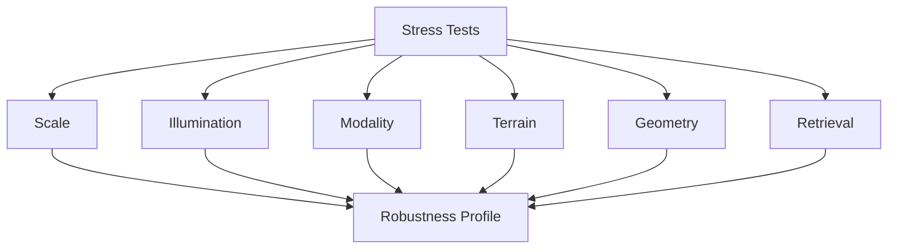
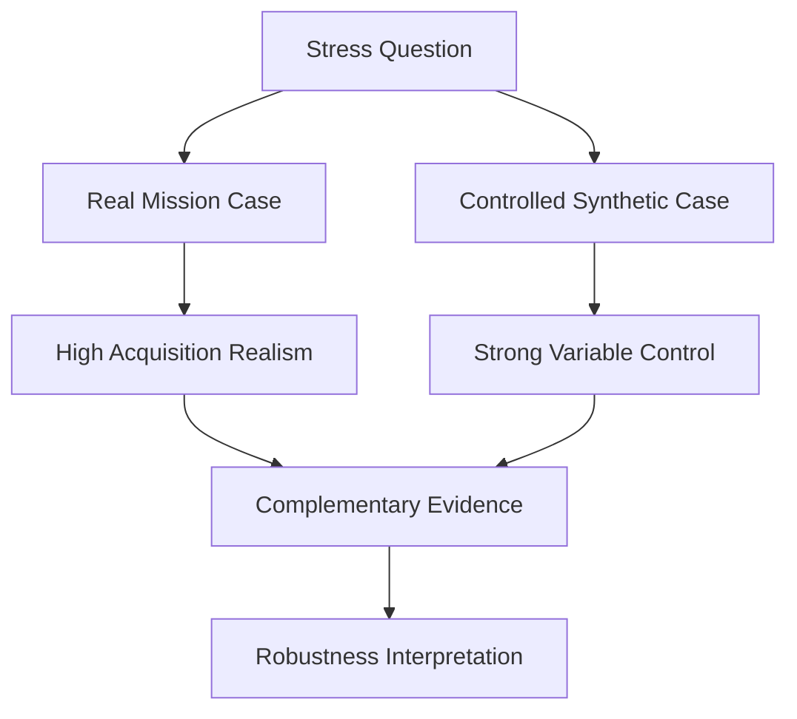

# Stress Tests

ChandraMap uses stress testing to measure how lunar correspondence, retrieval, geometric verification, and registration behave when scientifically meaningful conditions become more difficult.

Ordinary benchmark averages can show overall performance, but they may hide where a system begins to degrade. A method that works well on a small set of favorable image pairs has not demonstrated robustness to:

- large physical scale differences;
- illumination changes;
- shadow-geometry changes;
- cross-sensor appearance;
- hyperspectral-to-panchromatic modality differences;
- repetitive crater terrain;
- low-feature terrain;
- viewing-geometry differences;
- projection differences;
- terrain relief;
- reduced overlap;
- retrieval ambiguity.

> **A stress test should expose how performance changes under a defined challenge, not simply collect difficult-looking examples.**

Where practical, ChandraMap isolates the main condition being studied.

> **Change or select one primary stress factor at a time where possible.**

Real lunar data and synthetic perturbations serve different scientific purposes.

> **Real lunar stress cases and synthetic stress cases answer different questions.**

Real mission imagery contains authentic interactions between sensors, terrain, illumination, geometry, processing, and acquisition conditions.

Synthetic tests can provide much stronger control over one deliberately changed variable.

Neither replaces the other.

> **Stress-test difficulty should be described using measured or documented conditions, not subjective labels alone.**

Prefer evidence such as:

- source GSD;
- reference effective GSD;
- scale ratio;
- sensor pair;
- modality;
- illumination metadata;
- terrain category;
- pyramid level;
- viewing metadata;
- projection state;
- overlap information.

Avoid vague descriptions such as:

> very hard image

unless a benchmark version defines reproducible criteria for such terminology.

Stress testing must also preserve the same scientific evaluation discipline as ordinary benchmarks.

> **Stress testing must preserve independent evaluation.**

Held-out check points must remain outside:

- transformation fitting;
- final test threshold tuning;
- model selection;
- manual rescue.

Failures are especially important.

> **Failure is an expected and valuable stress-test result.**

A stress test is useful partly because it identifies:

- sensitivity;
- degradation;
- unstable behavior;
- failure regions;
- limits of the current method.

ChandraMap therefore does not reduce robustness to one arbitrary number.

> **Robustness is not one scalar score.**

Prefer transparent stress-specific results such as:

- scale-stress check RMSE;
- illumination-stress success rate;
- IIRS registration failure rate;
- repetitive-terrain inlier coverage;
- retrieval `Recall@K`;
- runtime under defined stress.

Finally:

> **Synthetic augmentation must not be confused with physical simulation.**

Brightness, contrast, gamma, blur, or generic noise perturbations may test appearance sensitivity, but they are not automatically physically correct simulations of lunar Sun-angle, sensor behavior, or viewing geometry.

---

## 1. Objectives

ChandraMap stress tests help determine:

- which conditions cause performance degradation;
- which sensors or sensor pairs are affected;
- which pipeline stages fail first;
- whether GSD-aware scale preparation improves robustness;
- whether illumination handling improves downstream registration;
- whether stronger local matchers improve difficult cases;
- whether transform models generalize under geometry stress;
- whether spatial coverage collapses before final failure;
- where global or regional retrieval becomes ambiguous;
- whether improvements persist across several stress categories;
- how failures change as stress increases.

The objective is not to manufacture impressive demonstrations.

It is to characterize system behavior under explicitly documented difficulty.

> **ChandraMap stress tests are designed to discover where registration begins to degrade, not merely to demonstrate where it already works.**

---

# Core Terminology

## 2. Stress Test

A **stress test** is a controlled or categorized evaluation designed to measure ChandraMap behavior under a specific difficult condition.

---

## 3. Robustness

**Robustness** is the ability of a method or pipeline to maintain useful performance across defined changes in data or task conditions.

Robustness is always relative to:

- the stress condition;
- benchmark data;
- metric;
- configuration;
- evaluation protocol.

---

## 4. Stress Factor

A **stress factor** is the primary challenge being varied or selected.

Examples include:

- physical scale mismatch;
- illumination difference;
- modality difference;
- terrain ambiguity;
- reduced overlap;
- projection difference.

---

## 5. Stress Level

A **stress level** is a benchmark-defined magnitude, category, or range for a stress factor.

No universal ChandraMap stress levels are defined here.

---

## 6. Nominal Case

A **nominal case** is a comparatively controlled reference condition for a particular benchmark.

Nominal does not mean:

- trivial;
- easy;
- guaranteed success.

---

## 7. Controlled Stress Test

A **controlled stress test** changes one primary stress factor while keeping other important variables as stable as practical.

---

## 8. Natural Stress Case

A **natural stress case** is a real mission-data pair that naturally exhibits a difficult condition.

Examples might include:

- large sensor-resolution difference;
- real illumination change;
- cross-modality matching.

Natural cases provide high realism but often include multiple confounding differences.

---

## 9. Synthetic Stress Case

A **synthetic stress case** applies a known controlled perturbation to data.

Examples may include:

- known translation;
- known rotation;
- controlled scale change;
- controlled blur;
- controlled photometric adjustment.

---

## 10. Compound Stress Case

A **compound stress case** contains several substantial challenges simultaneously.

For example:

- IIRS → NAC;
- large scale difference;
- modality difference;
- illumination difference.

Compound cases are realistic but harder to interpret causally.

---

## 11. Ablation

An **ablation** changes an algorithmic or system component.

Examples include:

- SIFT vs ALIKED + LightGlue;
- one preprocessing representation vs another;
- affine vs homography.

---

## 12. Failure Analysis

**Failure analysis** investigates why a particular run failed or produced poor output.

Stress testing and failure analysis are related but not identical.

A stress test creates or selects challenging conditions.

Failure analysis investigates the resulting behavior.

---

## 13. Failure Envelope

A **failure envelope** is a conceptual description of the conditions under which a system begins to fail or becomes unreliable.

A formal failure envelope requires sufficiently controlled experiments.

Treat it as future/research work unless supported by actual evidence.

---

## 14. Robustness Curve

A **robustness curve** plots a metric against an objectively defined stress magnitude.

Examples may include:

- check RMSE vs synthetic scale factor;
- success rate vs overlap reduction.

Do not create such curves from unrelated real cases simply because they appear qualitatively harder.

---

# Stress Tests vs Related Evaluation Concepts

## 15. Stress Test vs Benchmark Category

A benchmark category answers:

> What scientifically relevant condition does this pair represent?

A stress test asks:

> How does ChandraMap performance behave under that condition?

See [`benchmark-categories.md`](benchmark-categories.md).

For example:

**Category**

`scale stress`

**Stress-test use**

evaluate performance across one or more cases or controlled variants with increasing or contrasting scale mismatch.

---

## 16. Stress Test vs Ablation

An ablation changes the **method**.

A stress test changes or selects the **data/task condition**.

For example:

- SIFT vs LightGlue → method axis;
- modest vs large scale mismatch → stress axis.

An experiment can contain both.

Keep them separate in reporting.

---

## 17. Stress Test vs Failure Analysis

Stress testing deliberately exposes the system to a challenge.

Failure analysis examines:

- why matching failed;
- why geometry became unstable;
- why residuals increased;
- why retrieval selected a wrong region.

Do not interpret one as a substitute for the other.

---

# Sensor Context

## 18. OHRC

The Chandrayaan-2 **Orbiter High Resolution Camera (OHRC)** is a visible/panchromatic high-resolution instrument.

Current project context commonly uses approximately:

> **~0.25–0.32 m/pixel**

depending on product/documentation.

Actual product metadata remains authoritative.

Potential OHRC stress factors include:

- illumination variation;
- shadow differences;
- repetitive fine crater structure;
- reference-scale differences;
- terrain/viewing effects.

See [`../sensors/ohrc.md`](../sensors/ohrc.md).

---

## 19. TMC-2

The Chandrayaan-2 **Terrain Mapping Camera-2 (TMC-2)** provides panchromatic terrain imagery.

Current project planning commonly uses approximately:

> **~5 m/pixel**

with actual product metadata authoritative.

Potential stress factors include:

- scale mismatch against fine NAC data;
- reduced availability of fine features;
- larger-scale structural dependence;
- illumination differences;
- projection or viewing geometry.

See [`../sensors/tmc2.md`](../sensors/tmc2.md).

---

## 20. IIRS

The Chandrayaan-2 **Imaging Infrared Spectrometer (IIRS)** is a hyperspectral/imaging-infrared instrument.

Current project context includes approximately:

- ~80 m/pixel;
- ~0.8–5.0 µm;
- roughly ~250–256 bands depending on product/documentation.

Actual product metadata remains authoritative.

IIRS requires a documented registration-friendly 2D representation before ordinary two-dimensional correspondence algorithms are used.

Potential stress factors include:

- very large scale difference;
- cross-modality appearance;
- representation choice;
- relatively few shared fine structures;
- strong dependence on reference-scale selection.

> **Do not treat the full IIRS hyperspectral cube as an ordinary grayscale image.**

See [`../sensors/iirs.md`](../sensors/iirs.md).

---

## 21. LRO NAC

LROC **Narrow Angle Camera (NAC)** imagery provides fine/local lunar reference imagery.

Current project planning often treats NAC imagery as approximately:

> **~0.5–2 m/pixel**

depending on product/acquisition geometry.

Actual metadata remains authoritative.

NAC often creates an important reference-scale stress because fine reference imagery may contain terrain detail absent from a coarser source.

See [`../sensors/lro-nac.md`](../sensors/lro-nac.md).

---

## 22. LRO WAC

LROC **Wide Angle Camera (WAC)** provides broad/coarse lunar reference context.

Its effective scale is:

- product-dependent;
- mode-dependent;
- processing-dependent.

Do not assign one universal WAC GSD.

Potential future roles include:

- regional retrieval;
- broad localization;
- coarse registration;
- WAC → NAC coarse-to-fine workflows.

See [`../sensors/lro-wac.md`](../sensors/lro-wac.md).

---

# Stress-Test Families

## 23. Core Families

ChandraMap stress testing may be organized into:

1. scale stress;
2. illumination stress;
3. shadow-geometry stress;
4. sensor/modality stress;
5. terrain-feature stress;
6. repetitive-pattern stress;
7. geometry/viewpoint stress;
8. projection stress;
9. relief/topography stress;
10. low-overlap stress;
11. valid-data/mask stress;
12. retrieval-ambiguity stress;
13. reference-resolution stress;
14. synthetic geometric stress;
15. synthetic appearance stress;
16. compound stress;
17. future cross-mission stress.

Not every family belongs in every project version.

---

# Stress-Test Design

## 24. Controlled Design

A scientifically useful stress test should identify:

- primary stress factor;
- benchmark pair or base case;
- control/nominal condition where available;
- variables intentionally changed;
- variables intentionally held constant;
- benchmark version;
- truth version;
- method/configuration;
- metric definitions;
- failure semantics.

---

## 25. Control Condition

Where appropriate, define a nominal or reference condition against which stressed conditions are compared.

A valid experiment does not require an artificial "easy" baseline if no scientifically meaningful control exists.

---

## 26. Same-Truth Rule

For synthetic variants derived from the same base case, use:

- the same canonical truth;
- correctly transformed truth coordinates;

where mathematically valid.

For different real mission pairs, use each pair's own benchmark-defined truth.

Do not pretend unrelated real pairs share identical truth.

---

## 27. Same-Metric Rule

Metric definitions must remain stable across stress conditions.

See [`metrics.md`](metrics.md).

Do not change:

- RMSE coordinate space;
- coverage definition;
- inlier-ratio denominator;

between stress levels without explicitly defining a different metric.

---

## 28. Same-Method Rule

When measuring one method's sensitivity to a stress factor, keep the following fixed where possible:

- matcher;
- thresholds;
- transform model;
- refinement policy;
- scale-routing policy unless scale handling itself is under study.

---

## 29. Method-by-Stress Experiments

When comparing multiple methods across multiple stress conditions, report two independent axes:

- **method axis**;
- **stress axis**.

Do not attribute a method difference to stress or a stress difference to method without controlled evidence.

---

# Nominal Conditions

## 30. Nominal Benchmark Context

A nominal case may provide:

- known overlap;
- reliable truth;
- meaningful shared structure;
- a physically reasonable reference scale;
- valid imagery.

Nominal does not imply absence of all difficulty.

---

## 31. Sensor-Specific Nominal Conditions

There is no single universal nominal case for:

- OHRC;
- TMC-2;
- IIRS.

Each sensor has different physical sampling and modality constraints.

---

# Scale Stress

## 32. Why Scale Stress Matters

ChandraMap often compares sensors with very different GSDs.

Examples include:

- OHRC ↔ NAC;
- TMC-2 ↔ NAC;
- IIRS ↔ NAC.

The actual relationship depends on the products and selected reference level.

---

## 33. Physical Scale, Not Raster Dimensions

Scale stress should be described using:

- source GSD;
- reference GSD;
- effective reference-level GSD.

Do not infer physical scale solely from:

- width;
- height;
- model input dimensions.

See [`../algorithms/scale-pyramid.md`](../algorithms/scale-pyramid.md).

---

## 34. Scale Ratio

If a scale ratio is reported, its direction must be explicit.

Conceptually, one possible convention is:

$$
R =
\frac{
\text{reference effective GSD}
}{
\text{source GSD}
}
$$

Another convention could use the inverse.

Do not publish an unlabeled scale-ratio number.

---

## 35. Real Scale-Stress Cases

Real products provide realistic:

- sensor response;
- terrain appearance;
- noise;
- processing;
- acquisition conditions.

Their limitation is that other variables often change simultaneously.

---

## 36. Synthetic Scale Stress

A controlled synthetic test may:

- resample an image;
- apply a known scale transformation.

This is useful for:

- pipeline validation;
- sensitivity analysis;
- known-transform testing.

It does not reproduce every property of another real sensor.

---

## 37. Upsampling Does Not Add Resolution

> **Upsampling does not create missing lunar detail.**

An enlarged IIRS image remains physically limited by IIRS information content.

Do not describe upsampled coarse imagery as high-resolution data.

---

## 38. Reference-Pyramid Stress

A useful test can examine how registration changes when the selected reference level is:

- too fine;
- physically comparable;
- too coarse.

No fixed pyramid level should be assumed universally correct.

---

## 39. Scale-Stress Metrics

Useful measures include:

- raw candidate count;
- filtered candidate count;
- verified inlier count;
- inlier ratio;
- verified-inlier coverage;
- check RMSE;
- failure status;
- runtime.

---

# Illumination Stress

## 40. Lunar Illumination Is Geometric

Changes in solar geometry can alter:

- shadow direction;
- shadow length;
- visible crater walls;
- ridge appearance;
- local contrast;
- apparent morphology.

This is more than a simple brightness change.

---

## 41. Real Illumination Stress

Real illumination-stress pairs should be selected using available:

- mission metadata;
- acquisition context;
- independently reviewed evidence.

See [`../algorithms/illumination-handling.md`](../algorithms/illumination-handling.md).

---

## 42. Illumination Metadata

Where available, useful context may include:

- incidence angle;
- phase angle;
- solar direction;
- acquisition time/geometry.

Do not invent missing values.

---

## 43. Brightness Is Not Sun Angle

A bright image and a dark image do not automatically constitute a scientifically documented Sun-angle stress pair.

Intensity can differ because of many factors.

---

## 44. Synthetic Photometric Stress

Controlled appearance perturbations may include:

- brightness;
- contrast;
- gamma;
- local contrast.

These test **photometric sensitivity**.

They are not automatically physically accurate Sun-angle simulations.

---

## 45. Illumination-Stress Evaluation

Evaluate downstream behavior such as:

- verified matches;
- coverage;
- independent error;
- failure rate.

Do not judge robustness primarily by how visually pleasing a normalized image appears.

---

# Shadow-Geometry Stress

## 46. Why Shadow Stress Is Separate

A change in shadow geometry can move image intensity boundaries even though the underlying terrain has not moved.

---

## 47. Stable Terrain vs Shadow Edges

Held-out truth should preferably use stable physical terrain structures.

A moving shadow boundary should not automatically be used as a physical correspondence feature.

---

## 48. Interpreting Shadow-Related Failure

Under large shadow changes:

- descriptors may become unstable;
- matching may concentrate on shadow boundaries;
- geometric consistency may deteriorate.

Use:

- match visualization;
- coverage;
- residual fields;
- held-out check error;

to diagnose behavior.

---

# Sensor and Modality Stress

## 49. Cross-Sensor Panchromatic Matching

Examples include:

- OHRC ↔ NAC;
- TMC-2 ↔ NAC.

Even if both appear grayscale, they may differ in:

- spectral response;
- physical sampling;
- point-spread behavior;
- processing;
- acquisition geometry.

---

## 50. IIRS Cross-Modality Stress

IIRS ↔ NAC or WAC is an important multimodal case.

It may combine:

- infrared/hyperspectral-derived source;
- panchromatic/visible reference;
- large scale difference;
- different spectral response;
- representation dependence.

This is not equivalent to simple contrast change.

---

## 51. IIRS Representation Stress

Possible research/ablation variants include:

- selected band;
- PCA-derived representation;
- structural/gradient representation;
- future learned spectral-spatial representation.

When comparing representations, keep where possible:

- the parent IIRS observation;
- reference;
- truth;
- downstream evaluation protocol;

constant.

---

## 52. Modality Stress vs Representation Ablation

These are different:

**Modality stress**

→ difficulty inherent in cross-domain imagery.

**Representation ablation**

→ algorithmic choice for handling that imagery.

Keep both axes visible.

---

# Terrain-Feature Stress

## 53. Low-Feature Terrain

Low-feature terrain may contain comparatively few distinctive stable structures.

Possible effects include:

- few candidate matches;
- few verified inliers;
- weak geometric support;
- low spatial coverage;
- transform instability.

---

## 54. Feature-Rich Terrain

Feature-rich terrain may generate many candidates.

That does not guarantee easier registration because:

- local structures may repeat;
- illumination may differ;
- false correspondences may increase.

---

## 55. Terrain Classification

Terrain stress should use evidence-based categories from [`benchmark-categories.md`](benchmark-categories.md).

Do not define terrain class solely from one method's keypoint count.

---

# Repetitive-Pattern Stress

## 56. Repeated Craters and Similar Structures

Lunar terrain may contain many locally similar:

- craters;
- rims;
- ridges;
- small depressions.

These can increase correspondence ambiguity.

---

## 57. Candidate Volume Can Be Misleading

Repetitive terrain may produce:

- many plausible candidate matches;
- many incorrect nearest neighbors.

Therefore candidate count alone is weak evidence.

---

## 58. False Geometric Consensus

Incorrect correspondences can sometimes form a geometrically coherent group.

This reinforces a core ChandraMap principle:

> **RANSAC inliers are not independent ground truth.**

Held-out evaluation remains necessary.

---

# Geometry and Viewpoint Stress

## 59. Viewing Geometry

Different acquisition geometries can affect:

- apparent terrain shape;
- crater-wall visibility;
- local scale;
- perspective-like effects.

---

## 60. Geometry Metadata

Use real product/acquisition metadata where available.

Do not fabricate missing viewing angles.

---

## 61. Model Sensitivity

Stress tests may compare:

- translation;
- similarity;
- affine;
- homography;

where scientifically appropriate.

See [`../algorithms/transforms.md`](../algorithms/transforms.md).

---

## 62. Fit Error Is Not Enough

A more flexible model may reduce fitting residual while worsening held-out performance.

Use check-point evaluation for model comparison.

---

# Projection Stress

## 63. Projection Differences

Different map projections or grids can create systematic coordinate differences.

---

## 64. Reprojection Is Not Registration

A known CRS transformation is conceptually different from estimating an unknown image-to-image registration transform.

See [`../algorithms/registration.md`](../algorithms/registration.md).

---

## 65. Controlled Projection Tests

Where scientifically appropriate, experiments may compare:

- differently projected products;
- appropriately reprojected compatible products.

Do not prescribe one universal lunar projection.

---

# Relief and Topography Stress

## 66. The Moon Is Not a Flat Poster

Terrain is three-dimensional.

A global affine transform or homography may provide a useful local approximation, but terrain relief can create spatially varying displacement.

---

## 67. Relief-Sensitive Symptoms

Possible symptoms include:

- center aligns while edges diverge;
- residual vectors vary systematically;
- crater walls show larger local errors;
- one global model cannot explain the full overlap.

See [`../algorithms/residual-analysis.md`](../algorithms/residual-analysis.md).

---

## 68. Future DEM-Aware Stress

Future research may stratify cases by:

- elevation variation;
- slope;
- relief magnitude;

using trusted lunar DEM products.

This is not assumed to be implemented.

---

# Low-Overlap Stress

## 69. Reduced Overlap

Registration can become difficult when only a small portion of source and reference imagery overlaps.

---

## 70. Possible Effects

Reduced overlap may produce:

- fewer shared features;
- lower coverage;
- ambiguous geometric solutions;
- unstable transforms.

---

## 71. Controlled Overlap Tests

Synthetic overlap reduction can be useful when:

- the crop relationship is known;
- coordinate truth is transformed exactly.

No universal overlap threshold is defined here.

---

# Valid-Data and Mask Stress

## 72. Invalid Regions

Products may contain:

- NoData;
- projection borders;
- partial valid coverage;
- masked regions.

---

## 73. Stress-Test Requirements

Verify that:

- invalid pixels are excluded appropriately;
- matching does not treat invalid regions as lunar terrain;
- coverage metrics use the documented valid-area denominator;
- registration propagates masks appropriately.

Related spatial-coverage guidance should be consulted in `spatial-coverage.md` when present.

---

# Retrieval Stress

## 74. Retrieval Ambiguity

Global or regional retrieval may become difficult when geographically different lunar regions contain similar crater patterns.

---

## 75. Search-Scope Stress

Possible search contexts include:

- known local region;
- regional search;
- broad/global search.

Do not invent a fixed retrieval-database size.

---

## 76. Retrieval Metrics

Use retrieval metrics such as:

- `Recall@1`;
- benchmark-defined `Recall@K`.

Do not use check RMSE as retrieval accuracy.

See [`metrics.md`](metrics.md).

---

## 77. Wrong Region With Plausible Appearance

A wrong lunar region may appear locally similar.

This is why retrieval candidates should undergo downstream local geometric verification.

---

## 78. WAC → NAC Coarse-to-Fine Stress

An advanced/future workflow may evaluate:

`WAC coarse localization → NAC local registration`

This can test whether a hierarchical reference system survives both:

- broad retrieval ambiguity;
- fine local registration difficulty.

Treat this as V3/future unless implementation scope confirms otherwise.

---

# Reference-Resolution Stress

## 79. Reference Too Fine

Fine NAC imagery may contain many structures absent from:

- TMC-2;
- IIRS.

This can make local correspondence less reliable.

---

## 80. Reference Too Coarse

An excessively coarse reference may remove structures that the source could otherwise match.

---

## 81. Physically Meaningful Reference Level

Stress testing should examine whether GSD-aware level selection improves:

- candidate quality;
- geometric support;
- coverage;
- independent accuracy.

---

# Synthetic Geometric Stress

## 82. Controlled Translation

Known translation can test:

- coordinate conventions;
- matcher robustness;
- transform recovery;
- evaluation correctness.

---

## 83. Controlled Rotation

Known rotation can test orientation sensitivity.

---

## 84. Controlled Scale

Known scale transformation can test controlled scale sensitivity.

---

## 85. Controlled Affine Distortion

Synthetic affine transformations can support controlled validation of:

- geometric estimation;
- coordinate mappings.

---

## 86. Controlled Projective Distortion

Synthetic projective transformations can test:

- homography estimation;
- registration mechanics.

They do not reproduce every real lunar viewing-geometry effect.

---

## 87. Advantage of Synthetic Geometric Truth

The applied transformation is known by construction.

This can support precise engineering/unit tests.

---

## 88. Synthetic Geometry Limitation

A warped copy of one source image generally retains:

- the same sensor modality;
- similar texture statistics;
- the same underlying observation.

It does not recreate true cross-sensor or cross-mission imagery.

---

# Synthetic Appearance Stress

## 89. Photometric Perturbations

Possible benchmark-defined perturbations may include:

- brightness adjustment;
- contrast adjustment;
- gamma transformation;
- blur;
- noise.

---

## 90. Correct Terminology

Call these:

> synthetic appearance or photometric stress.

Do not call them:

> complete physical lunar illumination simulation.

---

## 91. Noise and Blur Configuration

Noise models, blur kernels, and parameter ranges must be benchmark-defined.

Do not invent one universal sensor-noise model.

---

# Real vs Synthetic Stress

## 92. Complementary Roles

| Property                   | Real Mission Stress                             | Synthetic Stress                                  |
| -------------------------- | ----------------------------------------------- | ------------------------------------------------- |
| Physical realism           | High for the actual acquisition                 | Limited by simulation assumptions                 |
| Control over one factor    | Often limited                                   | Usually stronger                                  |
| Known transformation truth | Usually unavailable                             | Often available for geometric perturbations       |
| Real sensor effects        | Present                                         | Often simplified or absent                        |
| Real illumination behavior | Present                                         | Only if physically modeled                        |
| Reproducibility            | Strong when products and preparation are frozen | Strong when configuration and seed are frozen     |
| Best use                   | Real-world robustness                           | Controlled sensitivity and engineering validation |

Neither form of evidence should replace the other.

---

# Compound Stress

## 93. Multiple Factors Often Coexist

A real IIRS → NAC case may simultaneously involve:

- modality difference;
- physical scale difference;
- illumination difference;
- viewing-geometry differences.

---

## 94. Avoid Unsupported Causal Attribution

If several major factors differ, report the case as compound stress.

Do not conclude:

> scale caused the failure

unless controlled evidence supports that conclusion.

---

## 95. Compound Stress Remains Valuable

Real-world systems must eventually handle multi-factor difficulty.

Compound cases are therefore important for later-stage robustness evaluation even though causal interpretation is weaker.

---

# Stress Magnitude and Levels

## 96. Numeric Stress

When a stress factor has an objective numeric definition, it may be treated continuously.

Examples include:

- synthetic rotation magnitude;
- synthetic scale factor;
- documented scale ratio;
- controlled overlap reduction.

---

## 97. Categorical Stress

Some factors are more naturally categorical, such as:

- cross-modality;
- repetitive terrain;
- low-feature terrain.

---

## 98. Avoid Arbitrary Difficulty Labels

Do not casually classify cases as:

- easy;
- medium;
- hard;
- extreme.

If such labels are ever introduced, they should have benchmark-defined reproducible criteria.

---

# Robustness Curves

## 99. When Curves Are Appropriate

A robustness curve may be useful when:

- stress magnitude is objectively defined;
- other variables remain sufficiently controlled;
- enough stress levels exist.

---

## 100. Example Metric Axes

Potential vertical-axis metrics include:

- success rate;
- check RMSE;
- inlier count;
- inlier ratio;
- coverage;
- runtime.

---

## 101. Avoid Misleading Curves

Do not draw a smooth robustness curve through a handful of unrelated real-world pairs with different:

- sensors;
- terrain;
- illumination;
- geometry.

---

# Stress-Test Metrics

## 102. Core Metrics

Depending on task and available truth, stress tests may track:

- candidate count;
- filtered candidate count;
- inlier count;
- inlier ratio;
- spatial coverage;
- check RMSE;
- median check error;
- source-space error;
- retrieval `Recall@K`;
- runtime;
- success rate;
- failure rate.

See [`metrics.md`](metrics.md).

---

## 103. No Composite Robustness Score

Do not invent an arbitrary formula that combines:

- RMSE;
- runtime;
- coverage;
- inlier ratio;
- retrieval recall.

These measure different system properties.

---

# Spatial Coverage Under Stress

## 104. Coverage May Degrade Before Total Failure

A stressed matcher may still produce many correspondences while valid geometric support becomes concentrated in one region.

For example:

- candidate count remains high;
- verified-inlier coverage collapses.

That can be an important early warning.

---

## 105. Coverage and Error Are Complementary

A useful stress report may include both:

- check error;
- verified-inlier coverage.

Neither replaces the other.

Related spatial-coverage documentation should be consulted in `spatial-coverage.md` when present.

---

# Held-Out Evaluation Under Stress

## 106. Preserve Independent Check Truth

See [`checkpoint-evaluation.md`](checkpoint-evaluation.md).

The same held-out truth should be reused where scientifically valid when comparing:

- methods;
- preprocessing;
- scale strategies;
- refinement;
- stress levels derived from the same base case.

---

## 107. Synthetic Truth Mapping

When a known geometric transformation creates a synthetic stress case, map truth coordinates using the exact known geometry.

Do not recreate them manually by approximation.

---

# Control Points Under Stress

## 108. Geometric Support May Collapse

Stress can cause:

- fewer verified fit points;
- increased clustering;
- weaker scene-wide support.

See [`control-points.md`](control-points.md).

---

## 109. Do Not Rescue a Stressed Run With Test Truth

Do not move difficult held-out check points into the fit set to obtain a transform.

That destroys independent evaluation.

---

# Sub-Pixel Refinement Under Stress

## 110. Refinement Robustness

Evaluate whether sub-pixel refinement improves independent accuracy under conditions such as:

- scale stress;
- illumination stress;
- modality stress.

See [`../algorithms/subpixel-refinement.md`](../algorithms/subpixel-refinement.md).

---

## 111. Do Not Assume Refinement Helps

Intensity-based or local-patch refinement may become unreliable when appearance differs strongly across modalities or illumination.

Use before/after held-out metrics.

---

# Matcher Stress Testing

## 112. SIFT

SIFT is ChandraMap's classical sparse baseline.

Stress testing should examine how its:

- candidate count;
- verified inliers;
- coverage;
- check error;
- failure behavior;

change under defined stress.

Do not describe SIFT as completely invariant to lunar scale or illumination changes.

---

## 113. ALIKED + LightGlue

Correct roles:

- **ALIKED** — learned sparse feature detection/description;
- **LightGlue** — matching compatible local features.

Stress tests should evaluate lunar-domain behavior rather than assuming robustness from general benchmark performance.

---

## 114. LoFTR

LoFTR is detector-free correspondence estimation.

Its output still requires:

- geometric verification;
- independent registration evaluation.

---

## 115. RIFT / CFOG-Style Methods

Remote-sensing methods such as RIFT/CFOG-style approaches may be relevant for multimodal stress research.

Do not claim they are superior for ChandraMap without measured evidence.

---

# Match Filtering Under Stress

## 116. Filter Sensitivity

A filter tuned for nominal data may become overly aggressive under:

- cross-modality;
- illumination change;
- scale stress.

---

## 117. Measure Downstream Effects

Do not judge a filtering rule only by how many candidates remain.

Evaluate:

- verified inliers;
- coverage;
- check error;
- failure rate.

See [`../algorithms/match-filtering.md`](../algorithms/match-filtering.md).

---

# RANSAC Under Stress

## 118. Candidate Quality

Stress can increase:

- false correspondence count;
- outlier fraction;
- local ambiguity.

---

## 119. Threshold Context

RANSAC thresholds depend on:

- coordinate space;
- pyramid level;
- scale.

A numerical threshold cannot be compared meaningfully without that context.

---

## 120. False Consensus

Repetitive lunar terrain may occasionally produce incorrect but coherent geometric consensus.

Held-out check truth remains necessary.

See [`../algorithms/ransac.md`](../algorithms/ransac.md).

---

# Transform Models Under Stress

## 121. Model Comparison

Geometry stress may compare:

- affine;
- homography;
- other explicitly scoped models.

---

## 122. Same Truth for Model Comparison

Use the same held-out evaluation truth where technically valid.

---

## 123. Flexibility Is Not Automatically Better

A more flexible model may lower fit residual without lowering check RMSE.

See [`../algorithms/transforms.md`](../algorithms/transforms.md).

---

# Residual Analysis Under Stress

## 124. Residual Patterns

Stress may produce:

- directional bias;
- edge-growing residuals;
- terrain-dependent residuals;
- local distortions.

See [`../algorithms/residual-analysis.md`](../algorithms/residual-analysis.md).

---

## 125. Residuals Diagnose, Not Prove Cause

An edge-growing residual pattern may be consistent with:

- projection mismatch;
- global-model limitation;
- terrain relief.

Additional evidence is required to identify the actual cause.

---

# Preprocessing Under Stress

## 126. Evaluate Downstream Registration

See [`../algorithms/preprocessing.md`](../algorithms/preprocessing.md).

A preprocessing method should be evaluated through downstream:

- matching;
- geometry;
- coverage;
- check error.

---

## 127. Visual Improvement Is Not Robustness Evidence

A representation can appear visually clearer without improving registration.

---

# Illumination Handling Under Stress

## 128. Controlled Representation Comparison

Possible experiments may compare:

- baseline intensity;
- normalized representation;
- structural/gradient representation;

on the same illumination-stress pairs.

---

## 129. Avoid Strong Invariance Claims

A small stress suite does not justify claims such as:

> Sun-angle invariant.

---

# Scale-Pyramid Handling Under Stress

## 130. GSD-Aware Comparison

See [`../algorithms/scale-pyramid.md`](../algorithms/scale-pyramid.md).

Useful experiments may compare:

- overly fine reference;
- physically appropriate selected level;
- coarse levels;
- multi-scale search.

---

## 131. Stop Refinement at Supported Information

Do not force correspondence refinement to native NAC detail when the source sensor cannot observe equivalent terrain structure.

---

# Registration Under Stress

## 132. Registered Previews

See [`../algorithms/registration.md`](../algorithms/registration.md).

Registered previews are useful for diagnosis.

They do not replace:

- check error;
- coverage;
- failure statistics.

---

## 133. Warping Does Not Increase Resolution

If coarse IIRS data are warped onto a fine NAC grid, the resulting raster still contains IIRS-level spatial information.

---

# Retrieval + Registration Stress

## 134. Keep Metrics Separate

For retrieval:

- `Recall@K`.

For local registration:

- check RMSE;
- coverage;
- failure status.

Do not collapse these into one unlabeled accuracy value.

---

## 135. End-to-End Stress

Advanced benchmarks may combine:

- retrieval ambiguity;
- local correspondence difficulty;
- geometric verification.

Stage-specific failures should remain visible.

---

# Failure Reporting

## 136. Failure Stages

Possible observed failure stages include:

- input validation;
- preprocessing;
- representation generation;
- scale selection;
- retrieval;
- matching;
- match filtering;
- RANSAC;
- transform estimation;
- refinement;
- registration warp;
- evaluation.

---

## 137. Record Where Failure Appears

Record the earliest useful observed failure stage.

Do not automatically infer the root cause from the stage alone.

---

## 138. Failure-Mode Table

| Stress Condition      | Possible Symptom                   | Possible Explanation                        | Diagnostic                                |
| --------------------- | ---------------------------------- | ------------------------------------------- | ----------------------------------------- |
| Large scale mismatch  | Few verified inliers               | Shared physical detail reduced              | Inspect reference-level choice            |
| Illumination change   | Candidates cluster around shadows  | Appearance geometry changed                 | Inspect coverage and residuals            |
| Repetitive terrain    | Many false candidates              | Descriptor ambiguity                        | Inspect RANSAC and held-out error         |
| Low-feature terrain   | Very few candidates                | Limited distinctive structure               | Report matching support/failure           |
| IIRS → NAC            | Poor local matching                | Modality and scale differences              | Review representation and scale           |
| Viewing/relief stress | Residuals grow spatially           | Global model may be inadequate              | Inspect residual vector field             |
| Retrieval ambiguity   | Incorrect region ranked highly     | Similar crater patterns                     | Use local geometric verification          |
| Small overlap         | Low coverage or unstable transform | Weak geometric support                      | Inspect overlap and point spread          |
| Heavy filtering       | Few surviving points               | Filtering may be too aggressive             | Compare downstream metrics                |
| Fine reference only   | Coarse source matches poorly       | Reference detail exceeds source information | Use a physically meaningful pyramid level |

These are hypotheses, not automatic causal conclusions.

---

# Stress Matrix

## 139. Conceptual Coverage Matrix

| Sensor Pair | Scale | Illumination | Modality | Low Feature | Repetitive Terrain | Geometry | Retrieval |
| ----------- | ----- | ------------ | -------- | ----------- | ------------------ | -------- | --------- |
| OHRC → NAC  | —     | —            | —        | —           | —                  | —        | —         |
| TMC-2 → NAC | —     | —            | —        | —           | —                  | —        | —         |
| IIRS → NAC  | —     | —            | —        | —           | —                  | —        | —         |

No counts or performance values are implied.

One pair may belong to several stress categories.

---

# Conceptual Stress-Test Record

## 140. Illustrative Structure

The following is an **illustrative conceptual structure — not an implemented schema**:

```yaml
stress_test_id: "PLACEHOLDER_STRESS_TEST"
benchmark_version: "PLACEHOLDER_BENCHMARK"

primary_stress:
  type: "PLACEHOLDER_STRESS_TYPE"
  level_or_value: "PLACEHOLDER_VALUE"

pair:
  pair_id: "PLACEHOLDER_PAIR_ID"
  source_sensor: "PLACEHOLDER_SOURCE"
  reference_sensor: "PLACEHOLDER_REFERENCE"

controlled_variables:
  matcher: "PLACEHOLDER_MATCHER"
  transform: "PLACEHOLDER_TRANSFORM"
  truth_version: "PLACEHOLDER_TRUTH"

metrics:
  check_rmse: "PLACEHOLDER_VALUE"
  inlier_ratio: "PLACEHOLDER_VALUE"
  spatial_coverage: "PLACEHOLDER_VALUE"
  runtime: "PLACEHOLDER_VALUE"

status: "PLACEHOLDER_STATUS"
```

No real benchmark values are implied.

---

# Conceptual Synthetic-Stress Configuration

## 141. Illustrative Structure

Actual perturbation ranges must be benchmark-defined.

```yaml
synthetic_stress:
  source_asset: "PLACEHOLDER_SOURCE"

  perturbation:
    type: "PLACEHOLDER_TRANSFORM_OR_PHOTOMETRIC_OPERATION"
    parameters: "PLACEHOLDER_PARAMETERS"

  random_seed: "PLACEHOLDER_SEED"

  truth:
    transformation_known: "PLACEHOLDER_BOOLEAN"
```

This is not an implemented schema.

---

# Stress-Test Result Templates

## 142. Per-Pair Results

| Pair | Stress Type | Stress Context | Matcher | Inliers | Coverage | Check RMSE | Units | Runtime | Status |
| ---- | ----------- | -------------- | ------- | ------: | -------: | ---------: | ----- | ------: | ------ |

Do not populate this table with fabricated results.

---

## 143. Controlled Method Comparison

| Stress Type | Pair | Method A | Method B | Same Truth? | Metric | Result A | Result B | Notes |
| ----------- | ---- | -------- | -------- | ----------- | ------ | -------: | -------: | ----- |

The table intentionally declares no winner.

---

## 144. Numeric Stress Series

| Stress Value | Candidates | Inliers | Coverage | Check RMSE | Success | Runtime |
| -----------: | ---------: | ------: | -------: | ---------: | ------- | ------: |

Use only measured benchmark-defined values.

---

# Reproducibility

## 145. Stress-Test Provenance

A stress result should remain traceable to:

- benchmark version;
- pair/source asset;
- reference asset;
- stress type;
- stress configuration;
- data representation;
- truth/check-point version;
- matcher/model version;
- matcher configuration;
- scale strategy;
- transform model;
- refinement configuration;
- synthetic random seed where applicable;
- code/software revision;
- runtime environment where relevant.

---

# Randomness

## 146. Synthetic Randomness

When random:

- noise;
- crop;
- perturbation;
- sampling;

is part of a stress test, record the seed where practical.

---

## 147. Repeated Runs

Stochastic stress tests may use repeated executions to measure variation.

No universal repeat count is defined here.

---

# Formal Stress-Test Freeze

## 148. Freeze Before Official Execution

Freeze:

- stress configuration;
- benchmark version;
- truth version;
- method configuration;
- metric definitions.

---

## 149. No Per-Case Manual Rescue

Do not manually:

- loosen a threshold;
- change matcher;
- choose a new reference level;
- switch transform model;

after viewing a stressed test result unless such behavior was already encoded as a predefined adaptive policy.

---

# Adaptive Pipelines

## 150. Adaptive Rules Are Allowed

A reproducible pipeline may use a rule such as:

> if a defined validation condition fails at the selected level, evaluate a configured neighboring level.

The rule must be:

- predefined;
- deterministic or otherwise reproducible;
- versioned.

---

## 151. Adaptation vs Manual Tuning

Automated predefined adaptation is compatible with benchmarking.

Human pair-specific rescue after inspecting the result is not equivalent to a formal benchmark run.

---

# Robustness Aggregation

## 152. Preserve Pair-Level Results

Every stress-case result should remain accessible before aggregation.

---

## 153. Stress-Specific Aggregates

Possible summaries include:

- success rate by stress type;
- median check error by stress category;
- failure stage by stress category;
- spatial coverage by stress type;
- runtime by sensor pair.

---

## 154. Do Not Average Incompatible Units

Do not directly average:

- OHRC-pixel error;
- IIRS-pixel error;

as though they have one physical interpretation.

Prefer:

- sensor-stratified reporting;
- scientifically valid common ground units where available.

---

# Compound-Stress Reporting

## 155. Record All Important Stress Factors

A compound case should retain all relevant stress categories.

For example:

- modality stress;
- scale stress;
- illumination stress.

---

## 156. Avoid Single-Cause Statements

Prefer:

> compound stress case failed during local matching

over:

> scale caused the failure

unless controlled evidence isolates scale.

---

# Stress-Test Visualizations

## 157. Useful Diagnostic Artifacts

Potential visualizations include:

- candidate-match plots;
- inlier/outlier plots;
- spatial coverage maps;
- residual-vector plots;
- registered overlays;
- robustness curves;
- retrieval Top-K previews.

---

## 158. Visuals Support Metrics

Do not use:

> looks robust

as a quantitative evaluation criterion.

---

# Quality Control

## 159. Pre-Test Checklist

Before a formal stress run, verify:

- [ ] Stress factor is explicitly defined.
- [ ] Benchmark version is known.
- [ ] Pair/source asset is known.
- [ ] Reference asset is known.
- [ ] Stress evidence is documented.
- [ ] Primary stress factor is identified.
- [ ] Important confounders are recorded.
- [ ] Truth version is frozen.
- [ ] Check-point roles are frozen.
- [ ] Method configuration is frozen.
- [ ] Scale strategy is frozen unless it is the tested variable.
- [ ] Transform configuration is frozen unless it is the tested variable.
- [ ] Metric definitions are frozen.
- [ ] Coordinate spaces are known.
- [ ] Units are known.
- [ ] Synthetic parameters are documented where applicable.
- [ ] Random seed is recorded where applicable.

---

## 160. Post-Test Checklist

After execution, verify:

- [ ] Every expected case produced a result or explicit failure.
- [ ] Failed cases remain in the result set.
- [ ] Metric units are correct.
- [ ] Check RMSE uses held-out truth.
- [ ] Spatial coverage uses a consistent definition.
- [ ] No pair-specific manual tuning occurred.
- [ ] Stress configuration is recorded.
- [ ] Runtime context is preserved where required.
- [ ] Output artifacts correspond to the correct run.
- [ ] Compound stress factors are recorded.
- [ ] Retrieval and registration metrics remain separate.
- [ ] Algorithm outputs were not promoted to truth automatically.

---

# Versioned Stress-Testing Strategy

## 161. V1

V1 should remain deliberately small and rigorous.

A conceptual V1 stress scope may include:

- known-overlap local registration;
- real OHRC and/or TMC-2 pairs where validated data exist;
- SIFT baseline;
- controlled scale mismatch;
- a small set of documented illumination-difference cases;
- nominal vs difficult terrain examples;
- candidate count;
- verified inlier count;
- inlier ratio;
- spatial coverage;
- independent check RMSE;
- source-space pixel error;
- runtime;
- explicit failure status.

Optional V1 engineering tests may include controlled:

- translation;
- rotation;
- scaling.

V1 does not need to require:

- global retrieval;
- learned matchers;
- a full IIRS benchmark;
- DEM-aware stress;
- broad multi-mission generalization.

---

## 162. V2

Possible V2 additions include:

- broader scale-stress suites;
- stronger illumination stress;
- shadow-geometry stress;
- IIRS-derived 2D representations;
- repetitive terrain;
- low-feature terrain;
- refinement stress;
- affine/homography stress comparisons;
- richer residual analysis;
- controlled synthetic photometric tests.

---

## 163. V3

Possible V3 additions include:

- regional/global retrieval stress;
- learned matcher robustness;
- ALIKED + LightGlue;
- LoFTR;
- Top-K local verification;
- WAC/NAC coarse-to-fine workflows;
- multi-scale registration stress;
- larger compound-stress suites;
- richer runtime/resource evaluation.

---

## 164. V4

Possible research directions include:

- RIFT/CFOG-style multimodal robustness;
- lunar-specific learned features;
- Kaguya/SELENE cross-mission tests;
- DEM-aware relief stress;
- physical sensor-model geometry;
- uncertainty-aware evaluation;
- multi-mission generalization;
- physically based illumination simulation;
- statistically larger robustness studies.

These are research directions, not implementation claims.

Authoritative version specifications remain definitive.

---

# Main Stress-Test Flow

## 165. Evaluation Workflow

```mermaid
flowchart TD
    A[Select Benchmark Pair or Base Case] --> B[Define Primary Stress Factor]
    B --> C[Identify Controlled Variables]
    C --> D[Freeze Truth and Method Configuration]
    D --> E[Apply or Select Stress Condition]
    E --> F[Run ChandraMap Pipeline]

    F --> G{Task Type}

    G -->|Local Registration| H[Candidate Matches]
    H --> I[Filtering and Geometric Verification]
    I --> J[Inliers and Spatial Coverage]
    J --> K[Final Transform]
    K --> L[Held-Out Check Evaluation]

    G -->|Retrieval| M[Ranked Reference Candidates]
    M --> N[Recall@K]
    M --> O[Optional Local Verification]
    O --> K

    L --> P[Check RMSE / Residuals / Failure]
    N --> Q[Stress-Test Result]
    P --> Q

    Q --> R[Compare With Nominal Condition or Other Stress Levels]
    R --> S[Robustness Interpretation]
```

---

# Stress Dimensions

## 166. Robustness Profile



A robustness profile preserves several dimensions rather than compressing them into one arbitrary score.

---

# Real and Synthetic Evidence

## 167. Complementary Flow



---

# Relationship to Evaluation Overview

## 168. [`README.md`](README.md)

`README.md` defines the broader ChandraMap evaluation philosophy.

This file defines:

> robustness evaluation under deliberately difficult conditions.

---

# Relationship to Benchmark Protocol

## 169. [`benchmark-protocol.md`](benchmark-protocol.md)

The distinction is:

- `benchmark-protocol.md` — how formal benchmark runs are executed;
- `stress-tests.md` — how difficult conditions are selected, constructed, controlled, and interpreted.

---

# Relationship to Benchmark Categories

## 170. [`benchmark-categories.md`](benchmark-categories.md)

This relationship is especially important:

- `benchmark-categories.md` describes which properties a pair has;
- `stress-tests.md` describes how those properties are used to evaluate robustness.

---

# Relationship to Metrics

## 171. [`metrics.md`](metrics.md)

Stress testing must preserve existing metric semantics.

It does not redefine:

- check RMSE;
- coverage;
- inlier ratio;
- `Recall@K`;
- runtime.

---

# Relationship to Ground Truth

## 172. [`ground-truth.md`](ground-truth.md)

Independent truth remains required for accuracy evaluation under stress.

Stress does not turn:

- matcher output;
- RANSAC inliers;

into ground truth.

---

# Relationship to Control Points

## 173. [`control-points.md`](control-points.md)

Stress may reduce:

- fit-point count;
- fit-point distribution;
- geometric support.

These are important diagnostics.

---

# Relationship to Check-Point Evaluation

## 174. [`checkpoint-evaluation.md`](checkpoint-evaluation.md)

Held-out check points provide independent final-registration accuracy under each stress condition.

Their role must remain frozen.

---

# Relationship to Spatial Coverage

## 175. Spatial Coverage

Related spatial-coverage documentation should be consulted in `spatial-coverage.md` when present.

Coverage is especially valuable under stress because geometric support can collapse before candidate count reaches zero.

---

# Relationship to Dataset Documentation

## 176. [`../datasets/README.md`](../datasets/README.md)

Stress-test data should follow the normal ChandraMap data-governance model.

---

## 177. [`../datasets/metadata.md`](../datasets/metadata.md)

Stress classification should use authoritative metadata whenever possible.

---

## 178. [`../datasets/dataset-preparation.md`](../datasets/dataset-preparation.md)

Formal stress tests should use reproducibly prepared assets.

---

## 179. [`../datasets/pair-definition.md`](../datasets/pair-definition.md)

Every real stress case should remain associated with a defined source/reference pair.

---

## 180. [`../datasets/ground-truth-preparation.md`](../datasets/ground-truth-preparation.md)

Independent truth and check points should be prepared separately from algorithm outputs.

---

# Relationship to Algorithm Documentation

## 181. [`../algorithms/sensor-routing.md`](../algorithms/sensor-routing.md)

Sensor routing determines which processing path is used for a given source/reference combination.

---

## 182. [`../algorithms/preprocessing.md`](../algorithms/preprocessing.md)

Stress tests evaluate preprocessing through downstream registration behavior, not visual appearance alone.

---

## 183. [`../algorithms/illumination-handling.md`](../algorithms/illumination-handling.md)

This is especially relevant for:

- illumination stress;
- shadow stress.

---

## 184. [`../algorithms/scale-pyramid.md`](../algorithms/scale-pyramid.md)

This is central to:

- scale stress;
- reference-resolution stress.

---

## 185. [`../algorithms/matching.md`](../algorithms/matching.md)

Stress testing observes how candidate correspondences change under defined challenges.

---

## 186. [`../algorithms/match-filtering.md`](../algorithms/match-filtering.md)

Filtering sensitivity may change significantly under:

- modality stress;
- illumination stress;
- scale stress.

---

## 187. [`../algorithms/ransac.md`](../algorithms/ransac.md)

Stress can change:

- outlier fraction;
- verified-inlier count;
- geometric consensus;
- failure rate.

---

## 188. [`../algorithms/transforms.md`](../algorithms/transforms.md)

Geometry stress can reveal the limitations of:

- affine;
- homography;
- other model families.

---

## 189. [`../algorithms/subpixel-refinement.md`](../algorithms/subpixel-refinement.md)

Refinement should be evaluated under stress using held-out metrics.

---

## 190. [`../algorithms/residual-analysis.md`](../algorithms/residual-analysis.md)

Residual-vector patterns help diagnose how registration degrades.

---

## 191. [`../algorithms/registration.md`](../algorithms/registration.md)

Stress-test accuracy applies to the final registered geometry.

A warped preview alone is not robustness evidence.

---

# Relationship to Sensor Documentation

## 192. Sensor References

Relevant documentation includes:

- [`../sensors/overview.md`](../sensors/overview.md)
- [`../sensors/ohrc.md`](../sensors/ohrc.md)
- [`../sensors/tmc2.md`](../sensors/tmc2.md)
- [`../sensors/iirs.md`](../sensors/iirs.md)
- [`../sensors/lro-nac.md`](../sensors/lro-nac.md)
- [`../sensors/lro-wac.md`](../sensors/lro-wac.md)

Sensor documentation defines which stress interpretations are physically meaningful.

---

# Relationship to Project Scope

## 193. Project Documentation

Related paths to consult when present include:

- `../project/goals.md`
- `../project/non-goals.md`
- `../project/v1-scope.md`
- `../project/terminology.md`
- `../project/assumptions.md`
- `../project/limitations.md`

Authoritative project/version scope remains definitive.

Advanced V3/V4 stress suites should not automatically become V1 requirements.

---

# Relationship to Architecture

## 194. Architecture Documentation

Related paths to consult when present include:

- `../architecture/system-overview.md`
- `../architecture/v1-pipeline.md`
- `../architecture/core-engine-architecture.md`
- `../architecture/module-map.md`
- `../architecture/data-flow.md`
- `../architecture/output-flow.md`

Architecture determines how:

- stress configurations;
- benchmark data;
- algorithm execution;
- results;

flow through the repository.

This document defines their scientific robustness-testing semantics.

---

# Repository-Level Infrastructure

## 195. Root `benchmarks/`

If a root-level `benchmarks/` directory exists, formal stress suites should be represented through frozen/versioned benchmark definitions.

---

## 196. Root `experiments/`

If `experiments/` exists, exploratory stress experiments may test:

- new perturbations;
- new matchers;
- new hypotheses.

They should not silently alter official benchmark truth.

---

## 197. Root `results/`

If `results/` exists, stress outputs may contain:

- per-case metrics;
- robustness curves;
- failure summaries;
- residual plots;
- coverage visualizations.

Results remain downstream artifacts.

---

# Data Licensing

## 198. [`../data-licenses.md`](../data-licenses.md)

Synthetic perturbations derived from mission imagery may still inherit upstream:

- licensing;
- attribution;
- redistribution;

requirements.

Transforming mission imagery does not automatically make it unrestricted for redistribution.

---

# Stress-Test Anti-Patterns

## 199. Do Not

Do not:

- call one difficult-looking image a robustness benchmark;
- call one successful example proof of invariance;
- change several uncontrolled variables and attribute the result to one;
- classify illumination stress from brightness alone;
- call photometric augmentation physical Sun-angle simulation;
- treat upsampling as increased source resolution;
- use raster dimensions instead of physical GSD for scale stress;
- hide failed stress cases;
- tune final-test thresholds per pair;
- switch matcher after failure without a predefined policy;
- remove difficult held-out check points;
- redefine truth between stress levels silently;
- compare inconsistent coverage definitions;
- report `Recall@K` as registration accuracy;
- report check RMSE as retrieval accuracy;
- average incompatible sensor-pixel errors blindly;
- use RANSAC inliers as independent truth;
- call fit RMSE robustness accuracy;
- infer a failure cause from residual patterns alone;
- invent arbitrary easy/medium/hard labels;
- invent universal stress thresholds;
- invent one composite robustness score;
- claim synthetic success proves real lunar robustness;
- attribute compound-stress failures to one factor without controlled evidence.

---

# Claims ChandraMap Should Avoid

## 200. Unsupported Robustness Claims

Do not claim without controlled evidence:

- "illumination invariant";
- "scale invariant";
- "rotation invariant";
- "modality invariant";
- "works under every Sun angle";
- "works at every resolution";
- "works on any lunar image";
- "LightGlue is more robust than SIFT";
- "LoFTR handles scale better";
- "RIFT is best for IIRS";
- "homography is more robust";
- "our system never fails";
- "95% robust";
- "synthetic brightness proves Sun-angle robustness";
- "high inlier count proves robustness";
- "high coverage proves robustness";
- "one IIRS pair proves multimodal generalization";
- "one lunar region proves Moon-wide generalization."

---

# Limitations

## 201. Real Stress Factors Often Coexist

Real lunar data rarely isolate one variable perfectly.

---

## 202. Controlled Real Pairs Can Be Difficult to Find

Suitable mission observations may differ in several acquisition properties simultaneously.

---

## 203. Metadata May Be Incomplete

Exact:

- viewing geometry;
- illumination geometry;
- product-scale context;

may not always be available.

Unknown values should remain unknown.

---

## 204. Synthetic Tests Simplify Real Sensor Behavior

Synthetic transformations generally do not reproduce:

- actual spectral response;
- point-spread function;
- sensor noise;
- acquisition geometry.

---

## 205. Synthetic Downsampling Is Not Another Sensor

Downsampling can simulate information loss but does not reproduce the full physical behavior of TMC-2, IIRS, NAC, or WAC.

---

## 206. Synthetic Photometric Stress Is Not Physical Illumination

Brightness or gamma changes do not recreate lunar shadow geometry.

---

## 207. Small Stress Suites Limit Generalization

A few cases cannot establish universal robustness.

---

## 208. Sensor Error Units Differ

OHRC, TMC-2, and IIRS source-pixel errors have very different physical meanings.

---

## 209. IIRS Combines Strong Stress Factors

IIRS introduces both:

- coarse spatial sampling;
- modality difference.

It can be difficult to isolate these effects using real data alone.

---

## 210. Retrieval Robustness Depends on Database Composition

Retrieval behavior depends on:

- reference coverage;
- tiling;
- overlap;
- scale hierarchy;
- database size and composition.

---

## 211. Terrain Categories May Require Review

Labels such as:

- repetitive terrain;
- low-feature terrain;

may require human/scientific review rather than purely automatic assignment.

---

## 212. DEM Stress Requires Reliable Elevation Data

Relief-conditioned experiments require trustworthy topography and mapping.

---

## 213. Failure Causes May Remain Ambiguous

One stressed run can fail for several interacting reasons.

---

## 214. Conclusions Are Version-Specific

Stress-test conclusions apply only to the documented:

- benchmark;
- stress configuration;
- data;
- algorithm;
- truth;
- metric definition.

---

# Authoritative and Primary Reference Categories

## 215. Mission and Sensor Sources

Prefer authoritative resources including:

- ISRO Chandrayaan-2 documentation;
- ISRO / ISSDC / PRADAN;
- official OHRC documentation;
- official TMC-2 documentation;
- official IIRS documentation;
- NASA Lunar Reconnaissance Orbiter documentation;
- LROC / Arizona State University;
- NASA Planetary Data System.

---

## 216. Computer Vision and Image Registration

Relevant primary or authoritative resources include:

- OpenCV documentation;
- primary SIFT literature;
- primary RANSAC literature;
- image-registration literature.

---

## 217. Learned Matching

Relevant primary resources include:

- ALIKED primary publication/repository;
- official LightGlue repository/documentation;
- LoFTR primary publication/repository.

These describe the methods.

They do not establish ChandraMap lunar robustness by themselves.

---

## 218. Remote Sensing

Relevant primary research categories include:

- RIFT literature;
- CFOG-related literature;
- multimodal remote-sensing registration literature.

---

## 219. Planetary and Geospatial Processing

Relevant resources include:

- USGS ISIS;
- planetary image-coregistration resources;
- planetary control-network resources;
- planetary photogrammetry/cartography literature;
- trusted lunar DEM/topography resources where relevant.

Do not fabricate:

- URLs;
- DOIs;
- stress thresholds;
- robustness scores;
- benchmark counts;
- synthetic parameter ranges;
- accuracy values.

---

# Stress-Test Principles

## 220. Define the Stress Factor

Avoid vague "hard image" terminology.

---

## 221. Control Important Variables

Especially when making causal interpretations.

---

## 222. Real and Synthetic Evidence Are Complementary

Neither replaces the other.

---

## 223. Photometric Augmentation Is Not Physical Illumination

Use precise terminology.

---

## 224. Scale Stress Uses Physical GSD

Do not use raster dimensions alone.

---

## 225. Upsampling Does Not Create Detail

Never interpret enlarged pixels as increased physical resolution.

---

## 226. IIRS Requires a Defined 2D Representation

Do not pass the full hyperspectral cube into ordinary 2D matching as though it were one grayscale image.

---

## 227. Compound Stress Requires Cautious Attribution

Several factors may contribute simultaneously.

---

## 228. Use the Same Truth for Fair Comparisons

Where scientifically possible.

---

## 229. Held-Out Check Points Remain Independent

Do not leak them into fitting or tuning.

---

## 230. Coverage Matters Under Stress

High candidate count can coexist with poor spatial support.

---

## 231. Retrieval and Registration Metrics Stay Separate

`Recall@K` and check RMSE answer different questions.

---

## 232. Failure Is a Valid Result

Do not remove failed stress cases.

---

## 233. Residual Patterns Are Diagnostic

They suggest hypotheses; they do not prove causes automatically.

---

## 234. Metric Definitions Stay Stable

Do not change metric meaning between stress conditions.

---

## 235. No Universal Stress Thresholds

Stress levels are benchmark-defined.

---

## 236. No Single Robustness Score

Report transparent task-specific metrics.

---

## 237. Formal Stress Tests Must Be Versioned

Configuration and provenance are part of the result.

---

## 238. Avoid Pair-Specific Manual Rescue

Adaptive strategies must be predefined and reproducible.

---

## 239. Keep V1 Focused

A small number of well-controlled stress conditions is more useful than a large unverified suite.

> **ChandraMap stress testing is a controlled scientific process for determining how correspondence, retrieval, geometric verification, and registration degrade under defined lunar imaging challenges. Robustness claims require explicit stress conditions, stable metrics, independent truth, visible failures, reproducible configuration, and careful separation between real mission evidence and synthetic perturbations.**

<!-- ChandraMap stress-tests documentation specification and supplied project context: :contentReference[oaicite:0]{index=0} -->
