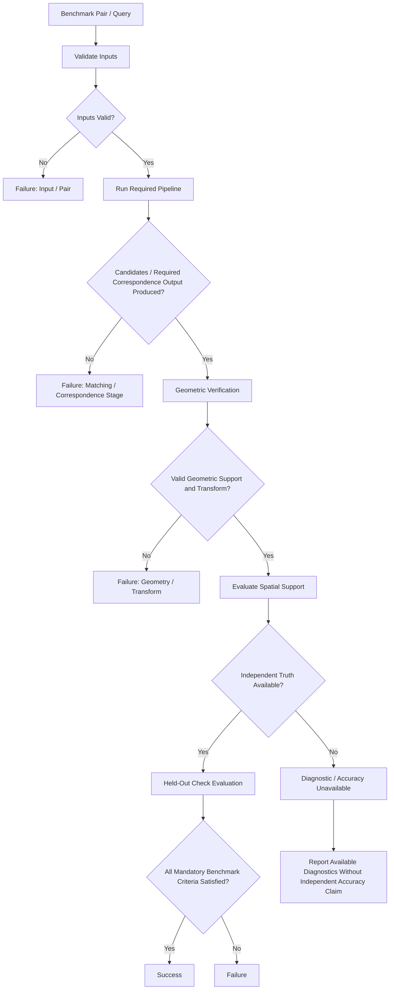
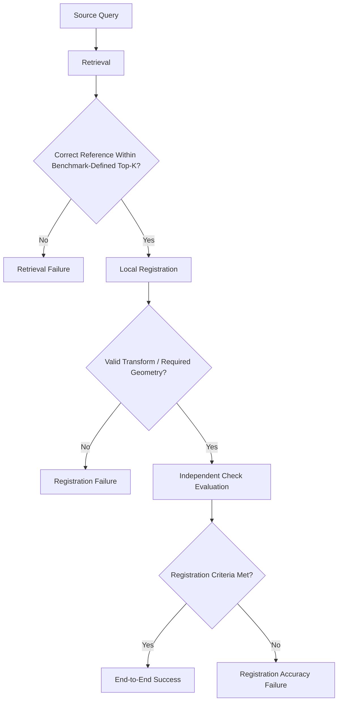
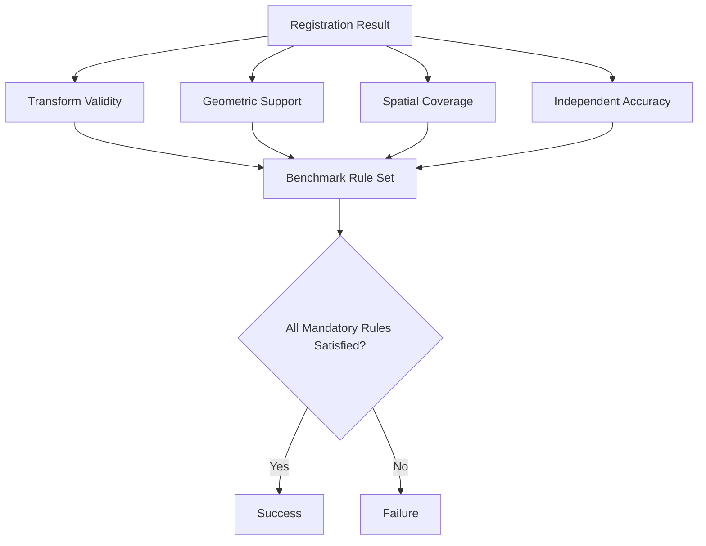

# Success Criteria

ChandraMap uses explicit, task-specific success criteria to determine whether a correspondence, retrieval, registration, or geolocation result satisfies the scientific requirements of a defined benchmark.

A visually convincing overlay, a large number of matches, a high inlier ratio, or the mere existence of a transformation matrix is not sufficient evidence of success. Formal success must be determined from a **pre-defined benchmark rule set**, applied consistently to all applicable cases, and supported by reproducible measurements.

> **Success is a benchmark-defined scientific condition, not a visual impression and not a single generic accuracy percentage.**

> **A ChandraMap result is successful only when it satisfies the pre-defined requirements of the task being evaluated.**

Different tasks require different evidence. A local-registration benchmark may require valid geometry and acceptable independent registration error. A retrieval benchmark asks whether an acceptable reference region appears within a benchmark-defined ranked candidate set. An end-to-end benchmark may require both retrieval and downstream registration to succeed.

> **Candidate count, inlier count, inlier ratio, spatial coverage, and check-point error are complementary signals; none should automatically be treated as the sole universal success criterion.**

Where held-out truth exists, points used to fit the transformation must not be the only evidence used to declare independent registration success.

> **Success thresholds must be frozen before formal test execution.**

The final benchmark must not be run first and followed by threshold selection designed to make the resulting system pass. Thresholds should instead come from scientific requirements, benchmark design, validation analysis, truth uncertainty, sensor context, or application requirements.

> **A failed case remains part of the benchmark.**

Difficult pairs, retrieval misses, low-coverage results, transform failures, and high-error cases must not be silently removed after results are observed.

> **Valid output and scientifically successful output are not always the same thing.**

A pipeline may successfully compute a matrix while that matrix remains unsupported, inaccurate, degenerate, or otherwise unsuitable for the benchmark task.

> **When independent truth is unavailable, ChandraMap may report diagnostics but must not silently promote those diagnostics into an independent success claim.**

---

## 1. Why Success Criteria Matter

Explicit success criteria make evaluation reproducible.

They support:

- fair comparison between algorithms;
- automated benchmark execution;
- regression detection;
- transparent failure reporting;
- release-quality validation;
- controlled method comparison;
- reproducible scientific claims;
- prevention of post-hoc result interpretation;
- separation of intermediate progress from final task completion.

Without defined success rules, the same result can be described differently depending on who inspects it.

For example, a run with:

- many RANSAC inliers;
- poor check-point accuracy;
- limited spatial coverage;

might look successful if evaluated only by inlier count, but unsuccessful if evaluated against independent registration accuracy.

Success criteria define **which evidence matters for the task before the result is observed**.

---

## 2. What Success Criteria Are Not

Success criteria are not:

- subjective visual impressions;
- leaderboard rankings;
- one universal accuracy percentage;
- candidate count alone;
- inlier count alone;
- inlier ratio alone;
- fitting residual alone;
- spatial coverage alone;
- mosaic appearance alone;
- confidence score alone;
- transform existence alone;
- per-pair rules manually changed after inspection.

This file defines acceptance semantics.

It does **not** define:

- the formulas of every metric;
- benchmark execution order in full;
- fixed universal thresholds;
- current benchmark results.

See:

- [metrics](metrics.md) for measurement definitions;
- [benchmark protocol](benchmark-protocol.md) for execution rules;
- [benchmark categories](benchmark-categories.md) for challenge categories.

---

# Core Terminology

## 3. Success Criterion

A **success criterion** is a measurable requirement that must be satisfied for a defined benchmark task or case to be considered successful.

Examples may include:

- a valid final transform exists;
- sufficient geometric support exists for the selected model;
- independent check-point error satisfies a benchmark-defined rule;
- a correct reference appears within a benchmark-defined retrieval rank.

The criterion itself must be reproducible.

---

## 4. Success Condition

A **success condition** is the logical combination of one or more criteria.

Conceptually:

$$
\text{success}
=
C_1 \land C_2 \land \dots \land C_n
$$

where each \(C_i\) is a mandatory criterion for the task.

The exact criteria depend on the benchmark.

---

## 5. Threshold

A **threshold** is a benchmark-defined numerical boundary used by a success criterion.

Examples might conceptually include:

- a maximum acceptable check error;
- a minimum required coverage;
- a minimum geometric-support condition;
- a maximum runtime.

This document intentionally does **not** define universal values.

---

## 6. Pass

A **pass** means that all mandatory criteria for the defined task are satisfied.

Passing one stage does not necessarily imply that the overall task passed.

---

## 7. Fail

A **fail** means that:

- at least one mandatory criterion is not satisfied; or
- a required stage cannot produce a valid output.

Failure should remain visible in benchmark results.

---

## 8. Partial Result

A **partial result** is scientifically useful output from a run that did not satisfy every mandatory condition for full task success.

Examples include:

- retrieval succeeded but local registration failed;
- candidate correspondences were generated but no valid transform was obtained;
- a valid transform was produced but independent evaluation was unavailable.

Partial does not mean full pass.

---

## 9. Diagnostic Result

A **diagnostic result** provides evidence useful for analysis but is insufficient to declare full benchmark success.

Examples include:

- fit residuals;
- inlier count;
- inlier ratio;
- candidate distribution;
- registered preview;
- spatial coverage without independent truth.

---

## 10. Valid Transform

A **valid transform** is a transformation satisfying the mathematical, structural, and task-specific validity checks required by the benchmark.

Transform existence alone does not imply transform validity.

---

## 11. Independent Accuracy

**Independent accuracy** is accuracy evaluated using truth that was not used to fit the transformation.

Where available, held-out check points are a primary mechanism for measuring this.

---

## 12. Geometric Support

**Geometric support** describes whether enough usable geometric evidence exists to estimate and justify a transformation.

Depending on the benchmark, it may consider:

- verified inlier count;
- inlier ratio;
- spatial distribution;
- model degeneracy;
- numerical stability;
- correspondence geometry.

No universal support threshold is defined here.

---

## 13. Spatial Coverage

**Spatial coverage** describes how broadly a selected set of points occupies the defined usable region.

See [spatial coverage](spatial-coverage.md).

Coverage is not a measure of correspondence correctness by itself.

---

## 14. Retrieval Success

**Retrieval success** means that at least one benchmark-approved correct reference candidate appears within the evaluated rank set.

The rank set must be benchmark-defined.

---

## 15. Registration Success

**Registration success** means that the final local registration satisfies the benchmark-defined geometric, validity, and independent-accuracy requirements.

---

## 16. End-to-End Success

**End-to-end success** means that all mandatory stages of a complete task satisfy their corresponding success conditions.

For a retrieval-plus-registration task this may conceptually require:

$$
\text{end-to-end success}
=
\text{retrieval success}
\land
\text{registration success}
$$

---

## 17. Success Rate

For a clearly defined benchmark population:

$$
\text{success rate}
=
\frac{N_{\text{success}}}
     {N_{\text{total}}}
$$

The denominator must be explicitly defined.

---

## 18. Failure Rate

For the same population:

$$
\text{failure rate}
=
\frac{N_{\text{failure}}}
     {N_{\text{total}}}
$$

The reporting policy must explain how unavailable or not-applicable cases are treated.

---

## 19. Abstention / No Result

A future system may deliberately decline to return a registration when confidence or validity checks are not satisfied.

This may be preferable to returning a misleading transform.

Abstention should be treated as a conceptual or future behavior unless the repository explicitly implements and versions it.

---

# Levels of Success

## 20. Stage-Level Success

A pipeline stage may successfully complete its own operation.

Examples:

```text
preprocessing completed
matcher produced candidates
RANSAC estimated a model
warp generation completed
```

Stage-level success is useful for diagnostics.

It does not automatically imply task-level success.

---

## 21. Task-Level Success

Task-level success asks whether the requested scientific task was completed.

Examples include:

- local-registration success;
- retrieval success;
- geolocation success;
- end-to-end retrieval-and-registration success.

Task success is the primary subject of this document.

---

## 22. Pair-Level Success

Pair-level success asks whether one benchmark source/reference pair satisfies all mandatory criteria for the task.

A pair should retain:

- measured metrics;
- criterion outcomes;
- overall status;
- earliest observed failure stage where relevant.

---

## 23. Benchmark-Level Success

Benchmark-level evaluation summarizes behavior over a frozen collection of cases.

It may report:

- success count;
- failure count;
- success rate;
- failure rate;
- category-stratified rates;
- sensor-stratified rates;
- successful-pair error distributions.

Benchmark-level success should not automatically mean that every individual case passed unless the benchmark explicitly defines that requirement.

---

## 24. Version-Level Completion

A repository version such as V1 may define a higher-level engineering or research completion goal.

For example:

> V1 demonstrates a reproducible known-overlap registration pipeline with independent error evaluation on controlled real lunar pairs.

That is different from pair-level success.

Version completion may depend on:

- implementation completeness;
- documentation;
- benchmark availability;
- repeatability;
- required experiments.

---

# Conceptual Status Model

## 25. Recommended Status Concepts

A benchmark may use conceptual states such as:

| Status         | Meaning                                                          |
| -------------- | ---------------------------------------------------------------- |
| Success        | All mandatory task criteria satisfied                            |
| Failure        | One or more mandatory criteria failed                            |
| Partial        | Useful stages completed, but full task requirements were not met |
| Unavailable    | Required evidence could not be evaluated                         |
| Not Applicable | Criterion does not apply to the task                             |

These are conceptual states.

They must not be treated as exact implementation enum values unless repository code defines them.

---

## 26. Success

A result is successful only when every mandatory condition for that task passes.

Informational metrics may still be poor or noteworthy, but they do not affect pass/fail unless the benchmark defines them as mandatory.

---

## 27. Failure

A failure occurs when:

- a mandatory stage fails;
- a mandatory output is invalid;
- a required criterion is not satisfied;
- required evaluation determines the result is outside the acceptable benchmark condition.

Failure should not be converted to partial success merely because some intermediate output exists.

---

## 28. Partial

Partial results preserve useful scientific information.

Examples:

```text
retrieval = success
registration = failure
overall = partial/failure according to task semantics
```

or:

```text
transform = valid
independent truth = unavailable
accuracy validation = unavailable
```

The benchmark must define how partial status affects aggregation.

---

## 29. Unavailable

A criterion may be unavailable when required evidence cannot be computed.

Examples include:

- check truth absent;
- required metadata missing;
- ground coordinate reference unavailable;
- evaluation artifact corrupted.

Unavailable is not equivalent to success.

---

## 30. Not Applicable

A criterion is not applicable when it does not belong to the task.

For example, `Recall@K` is not relevant to a known-overlap registration benchmark that does not perform global retrieval.

---

# Prerequisite Validity

## 31. Input Validity

Before algorithmic success can be evaluated, required inputs must be valid.

Input checks may include:

- product is readable;
- dimensions are valid;
- expected bands or representation exist;
- product identity is known;
- source/reference roles are known;
- required metadata is accessible where applicable;
- files correspond to the defined benchmark pair.

Invalid input should not be counted as algorithmic registration success.

---

## 32. Metadata Validity

Where criterion interpretation depends on metadata, the relevant metadata should be known.

Examples include:

- sensor identity;
- image dimensions;
- product identity;
- GSD or effective scale;
- map projection;
- coordinate representation;
- crop/tile identity;
- pyramid level;
- derived 2D representation.

Missing metadata may make some criteria unavailable.

---

## 33. Pair Validity

See [pair definition](../datasets/pair-definition.md).

A known-overlap benchmark requires a valid, versioned source/reference pair.

The pair definition should determine:

- which products belong together;
- which image is source;
- which is reference;
- overlap assumptions;
- applicable truth;
- coordinate conventions.

---

# Correspondence-Stage Criteria

## 34. Candidate Generation

Correspondence-based pipelines require candidate correspondences before geometric verification can proceed.

Candidate production may therefore be a required stage condition.

However:

> **Candidate count alone must never define final registration success.**

Many candidate matches can be wrong, duplicated, spatially clustered, or inconsistent with the actual lunar geometry.

---

## 35. Filtered Candidate Set

A pipeline may require that the filtered candidate set contains enough usable information for the selected geometric model.

The minimum necessary support depends on:

- transform family;
- filtering policy;
- degeneracy;
- coordinate representation;
- benchmark design.

No universal minimum is defined here.

---

## 36. Candidate Diagnostics

Useful diagnostics may include:

- raw candidate count;
- filtered candidate count;
- score distribution;
- correspondence confidence;
- spatial distribution;
- duplicate rate.

These help explain matcher behavior.

They do not independently establish registration accuracy.

---

# Geometric Verification Criteria

## 37. Verified Inliers

A successful geometric-verification stage requires usable support for the selected model.

A benchmark may define requirements concerning:

- number of verified correspondences;
- their spatial distribution;
- their geometry;
- model residual behavior.

No universal inlier minimum is defined.

---

## 38. Inlier Ratio

Conceptually:

$$
\text{inlier ratio}
=
\frac{N_{\text{verified inliers}}}
     {N_{\text{evaluated candidates}}}
$$

A high inlier ratio can be useful evidence of geometric consistency.

It does not prove:

- correct lunar region;
- broad spatial support;
- independent registration accuracy.

---

## 39. Non-Degenerate Geometry

The point configuration must support the chosen transform.

Potential degeneracy includes:

- duplicate correspondences;
- insufficient independent constraints;
- severe collinearity where inappropriate;
- nearly singular geometry;
- numerically unstable point configurations.

A transform should not be declared valid merely because a solver returned parameters.

See:

- [RANSAC](../algorithms/ransac.md)
- [transforms](../algorithms/transforms.md)

---

# Transform Validity Criteria

## 40. Transform Exists

If the task requires a final transformation, one must be produced.

This is necessary but not sufficient.

---

## 41. Finite Parameters

Transformation parameters should be numerically valid.

For example, a matrix should not contain:

- `NaN`;
- positive or negative infinity;
- uninitialized values.

---

## 42. Expected Model Structure

The returned representation should match the transform model expected by the task.

This may include checks for:

- matrix dimensions;
- parameter count;
- normalization conventions;
- coordinate direction.

Exact structural requirements belong to the selected transform implementation and benchmark.

---

## 43. Invertibility Where Required

Some operations require inverse mapping.

Where inversion is required, the model should be:

- mathematically invertible;
- numerically usable.

Invertibility should not be imposed on operations that do not require it.

---

## 44. Plausibility Checks

A benchmark may optionally reject transformations that are clearly inconsistent with expected task geometry.

Potential checks could concern:

- scale;
- translation;
- rotation;
- perspective;
- determinant behavior;
- warped footprint.

This document does **not** define universal limits.

Such constraints must be task-specific, justified, versioned, and declared before test execution.

---

## 45. Transform Existence Is Not Transform Success

The following is invalid reasoning:

```text
solver returned matrix
therefore registration succeeded
```

The matrix may still be:

- wrong;
- degenerate;
- supported by false correspondences;
- physically implausible;
- inaccurate on independent truth.

---

# Spatial Support Criteria

## 46. Why Spatial Support Matters

A transform estimated from a localized point cluster may not provide strong evidence for the rest of the overlap.

Spatial support may therefore contribute to registration-success rules.

See [spatial coverage](spatial-coverage.md).

---

## 47. Verified-Inlier Coverage

Verified-inlier coverage describes how broadly geometrically accepted correspondences support the usable region.

A benchmark may choose to make it:

- mandatory; or
- informational.

No universal coverage percentage is defined.

---

## 48. Fit-Point Coverage

Fit-point coverage indicates how broadly the final model is constrained by points actually used for estimation/refitting.

This is distinct from candidate coverage or check-point coverage.

---

## 49. Coverage Alone Is Insufficient

Widely distributed false correspondences remain false.

Coverage must therefore be interpreted with:

- geometric verification;
- transform validity;
- residual analysis;
- independent check error where available.

---

# Local Registration Success

## 50. Conceptual Definition

A local-registration benchmark may require all of the following:

- valid input products;
- valid correspondence processing;
- usable geometric support;
- successful geometric verification;
- valid final transform;
- adequate benchmark-defined spatial support;
- acceptable independent accuracy;
- no fatal required-stage failure.

Exact rules are benchmark-specific.

---

## 51. Conceptual Logical Structure

A local-registration decision may conceptually resemble:

```text
registration_success =
    valid_transform
    AND geometric_support_valid
    AND coverage_valid
    AND independent_accuracy_valid
```

when all four conditions are mandatory.

This is conceptual logic, not current implementation syntax.

Some benchmarks may:

- treat coverage as informational;
- omit independent error when the task is explicitly pipeline-completion-only;
- include additional requirements.

Those differences must be visible in the benchmark definition.

---

## 52. Valid Output vs Scientific Success

These two conditions must remain distinct.

Example:

```text
transform_generated = true
check_accuracy_valid = false
```

The pipeline produced valid output, but the scientific registration criterion failed.

Likewise:

```text
transform_generated = true
check_truth_available = false
```

may support a diagnostic result, not an independently validated accuracy claim.

---

# Independent Accuracy Criteria

## 53. Held-Out Check-Point Evaluation

See [check-point evaluation](checkpoint-evaluation.md).

Where independent truth exists, held-out check-point error should be the primary evidence for final registration accuracy.

The check points must not be used to fit the transform they evaluate.

---

## 54. Check RMSE

A benchmark may define a maximum acceptable check-point RMSE.

That threshold must specify:

- coordinate space;
- unit;
- truth version;
- applicable point population;
- threshold basis.

This document does not define the numerical value.

---

## 55. Check-Point Count

A check error should remain associated with the number of valid check points contributing to it.

A small RMSE based on very limited truth can provide weaker evidence than the same value over a broader independent set.

---

## 56. Check-Point Coverage

Check-point spatial coverage should be considered where useful.

Low error from a tightly clustered set of check points should not automatically be generalized to the complete overlap.

See [spatial coverage](spatial-coverage.md).

---

## 57. Fit RMSE Is Not Independent Test Accuracy

A transform optimized using a set of fitting points may naturally produce low error on those same points.

Therefore:

```text
fit RMSE
```

must not silently substitute for:

```text
held-out check RMSE
```

when independent accuracy is required.

---

# When Independent Truth Is Unavailable

## 58. Diagnostic-Only Evaluation

If held-out truth is unavailable, ChandraMap may still report:

- transform validity;
- verified inliers;
- inlier ratio;
- fit residuals;
- fit coverage;
- registered preview;
- transform diagnostics.

These are valuable.

They do not establish independent registration accuracy.

---

## 59. Explicit Success Semantics

A benchmark may intentionally define:

> **pipeline-completion success**

without claiming:

> **accuracy-validated registration success**

If both concepts are used, they must be named separately.

---

## 60. Do Not Upgrade Diagnostics Into Accuracy Claims

The following reasoning is invalid:

```text
no independent truth exists
fit RMSE is low
therefore registration accuracy is validated
```

When the evidence is unavailable, the correct state is unavailable or diagnostic-only according to the benchmark rules.

---

# Retrieval Success Criteria

## 61. Retrieval Task

Global or regional retrieval returns ranked reference candidates for a source query.

Typical evaluation compares that ranked list against benchmark-approved reference truth.

---

## 62. Top-1 Retrieval Success

For a benchmark explicitly evaluating Top-1 retrieval, success means that an approved correct reference is ranked first.

---

## 63. Recall@K Success

For a benchmark-defined \(K\):

$$
\text{retrieval success}
=
\begin{cases}
1, & \text{if at least one correct reference occurs in Top-}K \\
0, & \text{otherwise}
\end{cases}
$$

This document does not define \(K\).

---

## 64. Multiple Correct Reference Regions

A source image may overlap:

- multiple tiles;
- adjacent reference products;
- alternative benchmark-approved candidate regions.

The benchmark truth should therefore be capable of representing multiple valid references where appropriate.

Retrieval should not be incorrectly marked failed merely because it returned a different valid overlapping tile.

---

## 65. Retrieval Rank Does Not Prove Registration

A geographically correct candidate can still fail local registration because of:

- scale mismatch;
- insufficient common detail;
- illumination difference;
- geometry;
- modality;
- poor correspondence quality.

Therefore:

```text
retrieval success != registration success
```

---

# End-to-End Success

## 66. Retrieval Plus Registration

For a complete retrieval-and-registration task:

$$
\text{end-to-end success}
=
\text{retrieval success}
\land
\text{registration success}
$$

when both stages are mandatory.

---

## 67. Stage Failures Must Remain Visible

A result should distinguish:

```text
retrieval failed
```

from:

```text
retrieval succeeded
registration failed
```

Both may produce end-to-end failure, but they require different engineering responses.

---

## 68. Conditional Registration Success

An additional aggregate can examine registration success only among queries where a correct reference was successfully retrieved.

Conceptually:

$$
\text{conditional registration success rate}
=
\frac{N_{\text{registration success after valid retrieval}}}
     {N_{\text{valid retrieval cases}}}
$$

This should remain separate from overall end-to-end success.

---

# Geolocation Success

## 69. Registration Is Not Automatically Geolocation

An accurate source-to-reference image transformation does not automatically demonstrate accurate absolute lunar coordinates.

Absolute geolocation depends on additional factors such as:

- reference georeferencing;
- projection;
- control quality;
- planetary coordinate conventions;
- product geometry;
- terrain/DEM effects where relevant.

---

## 70. Geolocation Criteria

Where trusted geospatial truth exists, a dedicated geolocation benchmark may define criteria using:

- horizontal ground error;
- coordinate residual;
- control/check points;
- geodetic consistency.

See:

- [ground truth](ground-truth.md)
- [control points](control-points.md)

---

## 71. No Absolute Truth, No Absolute Accuracy Claim

ChandraMap should not claim:

- exact lunar coordinates;
- sub-metre geolocation;
- absolute positional accuracy;

from image-to-image registration alone.

Physical claims require appropriate geospatial truth.

---

# Synthetic-Test Success

## 72. Known-Transform Tests

Synthetic tests can apply a known transformation to an image and then test whether the pipeline recovers it.

Because the applied transformation is known, the benchmark can compare:

- estimated transform;
- recovered point locations;
- residual error;
- parameter error.

---

## 73. Purpose of Synthetic Tests

Synthetic tests are useful for:

- validating implementation correctness;
- regression testing;
- verifying metric computation;
- testing transform solvers;
- testing coordinate conversions;
- creating controlled stress conditions.

---

## 74. Synthetic Success Is Limited

Synthetic data does not fully reproduce:

- cross-sensor modality changes;
- real illumination geometry;
- instrument noise;
- calibration effects;
- map-projection uncertainty;
- natural lunar ambiguity.

Therefore:

> **Passing synthetic tests does not prove real lunar cross-sensor success.**

Synthetic and real-data results should be reported separately.

---

# Stress-Test Success

## 75. Stress Tests May Intentionally Fail

See [stress tests](stress-tests.md).

Stress tests may increase:

- scale difference;
- illumination difference;
- viewpoint difference;
- noise;
- modality difference;
- low-feature difficulty.

Their purpose may be to discover the system's failure boundary.

Failure under extreme stress can therefore be scientifically informative.

---

## 76. Stress-Level Success

A benchmark may define success as maintaining required registration performance under a particular stress level.

The stress level and threshold must be benchmark-defined.

This document does not define universal stress boundaries.

---

# Failure Criteria

## 77. Explicit Failure Conditions

Possible benchmark failures include:

- invalid input;
- required metadata unavailable;
- preprocessing failure;
- no usable candidate correspondences;
- insufficient geometric support;
- RANSAC failure;
- degenerate transform;
- invalid transform;
- mandatory refinement failure;
- mandatory warp failure;
- independent error outside criterion;
- retrieval miss;
- coordinate evaluation failure;
- required output generation failure.

Which failures are mandatory depends on the task.

---

## 78. Earliest Observed Failure Stage

Formal results should preserve the earliest stage at which failure became observable where possible.

Examples:

```text
failure_stage: retrieval
```

```text
failure_stage: geometric_verification
```

```text
failure_stage: check_evaluation
```

Exact field names are implementation-specific.

---

## 79. Failure Stage Is Not Proven Root Cause

If RANSAC fails, the observed stage is geometric verification.

That does not prove RANSAC itself caused the failure.

Possible upstream causes include:

- poor preprocessing;
- wrong retrieval candidate;
- scale mismatch;
- matcher failure;
- modality mismatch;
- insufficient shared structure.

Failure analysis should distinguish observation from causal diagnosis.

---

# Partial Results

## 80. Why Partial Results Matter

Scientific pipelines often produce useful intermediate evidence before overall failure.

Examples:

```text
retrieval = success
registration = failure
```

or:

```text
transform = valid
independent accuracy = unavailable
```

These results help identify where the system succeeds and where it breaks.

---

## 81. Partial Is Not Full Pass

Partial completion must not inflate success rate.

A benchmark task should only be counted as successful if all mandatory task requirements are satisfied.

---

# Optional Abstention and Safe Failure

## 82. Abstention Concept

A future system may choose not to emit a transform when validity checks indicate that the result is unreliable.

Possible reasons include:

- insufficient support;
- severe degeneracy;
- untrusted retrieval candidate;
- inconsistent residuals.

Returning no result may be scientifically safer than returning an unsupported registration.

---

## 83. Current-Implementation Caution

This document does not claim that ChandraMap currently implements abstention.

Any such behavior should be:

- explicitly implemented;
- benchmarked;
- versioned;
- reported separately.

---

# Success Criteria by Pipeline Stage

## 84. Stage-Level Requirements

| Stage             | Possible Requirement                          | Diagnostic             | Can This Alone Define Final Success?     |
| ----------------- | --------------------------------------------- | ---------------------- | ---------------------------------------- |
| Input             | Valid products and required metadata          | Validation status      | No                                       |
| Preprocessing     | Required representation produced              | Stage status           | No                                       |
| Matching          | Candidate correspondences produced            | Candidate count        | No                                       |
| Filtering         | Usable candidate set remains                  | Retention/count        | No                                       |
| RANSAC / Geometry | Valid model and geometric support             | Inliers, inlier ratio  | No                                       |
| Transform         | Valid finite model                            | Matrix/model checks    | No                                       |
| Coverage          | Useful spatial support                        | Coverage metric        | No                                       |
| Check Evaluation  | Acceptable independent error                  | Check RMSE / residuals | Major final criterion where truth exists |
| Retrieval         | Correct candidate appears in defined rank set | Recall@K / rank        | Retrieval task only                      |
| Geolocation       | Ground-coordinate criterion satisfied         | Ground error           | Geolocation task only                    |
| End-to-End        | All required stages satisfy task rules        | Stage statuses         | Yes, for the defined end-to-end task     |

---

# Multi-Criteria Success

## 85. Why Multiple Criteria Are Needed

No single metric captures all aspects of a reliable registration.

A method may have:

```text
many inliers
+
poor independent accuracy
```

Another may have:

```text
low check RMSE
+
very poor spatial support
```

Another may have:

```text
good coverage
+
incorrect correspondences
```

Multi-criteria rules prevent one metric from hiding another failure mode.

---

## 86. Mandatory vs Informational Criteria

A benchmark may classify criteria as:

### Mandatory

Required to determine pass/fail.

### Informational

Reported for interpretation but not used in final status.

The distinction should be explicit in the benchmark specification.

This document does not declare the same criteria mandatory for every version and task.

---

## 87. Avoid Arbitrary Weighted Composite Scores

A rule such as:

```text
score =
0.4 * inlier_ratio
+ 0.3 * coverage
+ 0.3 * rmse_component
```

should not be invented merely to produce one convenient number.

Weighted composite scores can obscure:

- units;
- failure modes;
- scientific meaning;
- trade-offs.

If a future benchmark uses a composite score, its design must be explicitly justified and versioned.

---

# Threshold Design

## 88. Thresholds Need a Scientific Basis

Thresholds may be based on:

- scientific requirements;
- sensor scale;
- application requirements;
- validation-set analysis;
- known truth uncertainty;
- transform-model requirements;
- expected operating conditions.

They should not be chosen simply because they generate a desirable pass rate.

---

## 89. Sensor-Aware Threshold Interpretation

A raw pixel error has different physical meaning for different instruments.

Approximate project context includes:

| Sensor  |                  Approximate Project Context | Success-Criteria Implication                                                                |
| ------- | -------------------------------------------: | ------------------------------------------------------------------------------------------- |
| OHRC    |                           ~0.25–0.32 m/pixel | Small pixel errors correspond to fine ground distances; actual product metadata is required |
| TMC-2   |                                   ~5 m/pixel | Same pixel residual represents substantially larger ground distance than OHRC               |
| IIRS    |                                  ~80 m/pixel | Coarse spatial information requires different physical interpretation                       |
| LRO NAC | ~0.5–2 m/pixel depending on product/geometry | Reference-space pixel thresholds depend on actual product and pyramid level                 |
| LRO WAC |                       Product/mode dependent | No universal WAC pixel-to-ground interpretation should be assumed                           |

Actual product metadata remains authoritative.

---

## 90. OHRC Context

OHRC is a visible/panchromatic Chandrayaan-2 imager with project context around `~0.25–0.32 m/pixel`, depending on documentation/product.

Success criteria should therefore avoid blindly copying thresholds from:

- TMC-2;
- IIRS;
- reference pyramid pixels.

Physical interpretation should use the actual product metadata.

---

## 91. TMC-2 Context

TMC-2 operates at approximately `~5 m/pixel` in the project context.

The same source-pixel RMSE has a different physical interpretation from OHRC.

Feature availability and spatial-support expectations may also differ.

---

## 92. IIRS Context

IIRS is an imaging-infrared/hyperspectral instrument with project context around:

- `~80 m/pixel`;
- `~0.8–5.0 µm`;
- roughly `~250–256` bands depending on product/documentation context.

It requires a documented registration-friendly 2D representation.

Success criteria must not assume:

- OHRC-like point density;
- fine NAC-grid residual implies fine IIRS ground accuracy;
- one generic visible-image threshold applies directly to IIRS.

Cross-modality and coarse spatial information must be considered explicitly.

---

## 93. LRO NAC Context

LROC NAC is fine lunar reference imagery.

ChandraMap often treats its project-scale context as approximately `~0.5–2 m/pixel`, depending on product and acquisition geometry.

Actual metadata wins.

If a criterion is defined in NAC pixels, it must record:

- selected product;
- coordinate representation;
- pyramid level where applicable.

---

## 94. LRO WAC Context

LROC WAC is broader/coarser lunar reference imagery.

Its effective scale depends on product and mode.

No universal WAC GSD or WAC-pixel success threshold is defined here.

---

## 95. Coordinate-Space Awareness

A criterion must specify the coordinate space of its measurement.

For example:

```text
check_rmse: source-image pixels
```

is not equivalent to:

```text
check_rmse: reference pyramid pixels
```

even if the numeric values happen to match.

---

## 96. Ground Error Requires Valid Mapping

A simple multiplication:

```text
pixel_error * approximate_GSD
```

may be insufficient for rigorous physical ground error when:

- scale varies;
- projection is nonlinear;
- terrain relief matters;
- product geometry changes across the image.

Physical error should be reported only when the mapping from image coordinates to ground coordinates is scientifically justified.

---

## 97. Truth-Uncertainty Awareness

A benchmark should not define an acceptance boundary at a precision much finer than the uncertainty of its reference truth.

If control or check-point coordinates themselves are uncertain, that uncertainty constrains the meaning of the evaluation.

---

# Threshold Freeze and Experimental Separation

## 98. Development Data

Development cases are used for:

- algorithm exploration;
- debugging;
- implementation changes;
- broad parameter tuning.

Results may be inspected freely.

---

## 99. Validation Data

Validation data can be used to choose:

- thresholds;
- configurations;
- model-selection rules;
- preprocessing variants;
- acceptance policies.

Decisions based on validation results should be documented.

---

## 100. Test Data

The final test set should be evaluated only after:

- metric definitions are frozen;
- success rules are frozen;
- thresholds are frozen;
- required stages are frozen;
- aggregation rules are frozen.

---

## 101. No Threshold Shopping

The following process is invalid:

```text
run final test
        |
        v
try many thresholds
        |
        v
choose threshold with best-looking success rate
        |
        v
report as if predefined
```

Formal criteria must be selected before final test reporting.

---

# Success-Criteria Versioning

## 102. Why Versioning Matters

Changing any of the following changes the meaning of success:

- independent RMSE requirement;
- required point support;
- spatial-coverage requirement;
- retrieval rank \(K\);
- mandatory stages;
- transform-validity rules;
- runtime constraints;
- applicable truth.

Success criteria therefore belong to a benchmark/rule version.

---

## 103. Benchmark Version Owns the Criteria

Formal benchmark reports should identify:

- benchmark version;
- criterion/rule version where separate;
- metric definitions;
- dataset version;
- truth version.

---

## 104. Historical Results Must Preserve Their Original Meaning

If criteria change, previous pass/fail results should remain interpreted using the rule set active at the time.

Do not silently recompute the meaning of published historical results without explicitly presenting a new evaluation.

---

# Conceptual Success-Criteria Record

## 105. Local-Registration Criteria

> **Illustrative conceptual structure — not an implemented schema.**

```yaml
success_criteria:
  task: local_registration
  benchmark_version: PLACEHOLDER_BENCHMARK_VERSION

  required:
    valid_transform: true

    geometric_support:
      rule: PLACEHOLDER_BENCHMARK_DEFINED_RULE

    spatial_coverage:
      metric: PLACEHOLDER_COVERAGE_METRIC
      rule: PLACEHOLDER_BENCHMARK_DEFINED_RULE

    independent_accuracy:
      metric: check_rmse
      coordinate_space: PLACEHOLDER_SPACE
      units: pixels
      rule: PLACEHOLDER_BENCHMARK_DEFINED_RULE
```

No numeric thresholds are implied by this example.

---

# Conceptual Run-Success Record

## 106. Pair Result

> **Illustrative conceptual structure — not an implemented schema.**

```yaml
run_id: PLACEHOLDER_RUN
pair_id: PLACEHOLDER_PAIR

task: local_registration

criteria:
  input_valid: PLACEHOLDER_BOOLEAN
  transform_valid: PLACEHOLDER_BOOLEAN
  geometric_support_valid: PLACEHOLDER_BOOLEAN
  coverage_valid: PLACEHOLDER_BOOLEAN
  independent_accuracy_valid: PLACEHOLDER_BOOLEAN

overall_status: PLACEHOLDER_STATUS
failure_stage: PLACEHOLDER_OPTIONAL_STAGE
```

---

# Retrieval Success Record

## 107. Conceptual Retrieval Result

> **Illustrative conceptual structure — not an implemented schema.**

```yaml
task: retrieval

criteria:
  correct_reference_within_top_k:
    k: PLACEHOLDER_K
    satisfied: PLACEHOLDER_BOOLEAN

status: PLACEHOLDER_STATUS
```

`PLACEHOLDER_K` must be supplied by the benchmark definition.

---

# End-to-End Success Record

## 108. Conceptual End-to-End Result

> **Illustrative conceptual structure — not an implemented schema.**

```yaml
task: retrieval_and_registration

stages:
  retrieval: PLACEHOLDER_STATUS
  local_registration: PLACEHOLDER_STATUS
  check_evaluation: PLACEHOLDER_STATUS

overall: PLACEHOLDER_STATUS
```

Stage-level and overall status should remain separately visible.

---

# Reporting Templates

## 109. Pair-Level Success Table

| Pair | Input Valid | Retrieval | Transform Valid | Geometric Support | Coverage | Check Accuracy | Overall Status | Failure Stage |
| ---- | ----------- | --------- | --------------- | ----------------- | -------- | -------------- | -------------- | ------------- |
|      |             |           |                 |                   |          |                |                |               |

---

## 110. Local Registration Table

| Pair | Inliers | Inlier Ratio | Inlier Coverage | Check Points | Check RMSE | Units | Transform Valid | Success |
| ---- | ------: | -----------: | --------------: | -----------: | ---------: | ----- | --------------- | ------- |
|      |         |              |                 |              |            |       |                 |         |

The numeric columns are evidence.

The benchmark-defined rule set determines the final `Success` status.

---

## 111. Retrieval and End-to-End Table

| Query | Correct Reference Set | Rank of First Valid Reference | Evaluated K | Retrieval Success | Registration Success | End-to-End Status |
| ----- | --------------------- | ----------------------------: | ----------: | ----------------- | -------------------- | ----------------- |
|       |                       |                               |             |                   |                      |                   |

---

# Aggregate Success Metrics

## 112. Success Count

$$
N_{\text{success}}
$$

is the number of applicable benchmark cases satisfying all mandatory criteria for the defined task.

---

## 113. Failure Count

$$
N_{\text{failure}}
$$

is the number of applicable benchmark cases failing one or more mandatory criteria according to the benchmark's status semantics.

---

## 114. Success Rate

$$
R_{\text{success}}
=
\frac{N_{\text{success}}}
     {N_{\text{total}}}
$$

---

## 115. Failure Rate

$$
R_{\text{failure}}
=
\frac{N_{\text{failure}}}
     {N_{\text{total}}}
$$

---

## 116. Denominator Must Be Explicit

`N_total` must be defined.

Possible benchmark semantics include:

- all frozen benchmark cases;
- all cases to which that task applies;
- all cases with valid required truth.

The selected policy must be known before results are summarized.

Unavailable cases should not be silently removed.

---

# Success-Only Error Summaries

## 117. Successful-Pair RMSE

A report may summarize check RMSE only for successful registrations.

This can be useful for understanding quality conditional on success.

It must be clearly labeled:

> **successful-pair check RMSE**

rather than presented as the error of the complete benchmark.

---

## 118. Always Pair Success-Only Accuracy With Reliability

A responsible summary should preserve:

```text
total cases
success count
failure count
success rate
successful-pair error distribution
```

A method with excellent RMSE on a small subset but many failures should not appear equivalent to a method that succeeds broadly.

---

# Sensor-Stratified Success

## 119. OHRC Results

OHRC results should be reported separately where sample size permits.

Its fine spatial scale makes raw pixel values physically different from TMC-2 and IIRS.

---

## 120. TMC-2 Results

TMC-2 success/failure should remain separable from OHRC where useful.

Different scale and feature availability can affect:

- correspondence support;
- residual magnitude;
- physical interpretation.

---

## 121. IIRS Results

IIRS should be stratified especially carefully because:

- its modality differs;
- its spatial scale is much coarser;
- its 2D registration representation must be documented;
- correspondence density may naturally be lower.

IIRS results should not disappear inside a single mixed global average.

---

## 122. Avoid Blind Cross-Sensor Pixel Aggregation

Do not average or compare raw pixel thresholds across sensors as though one pixel means the same physical distance.

Where sensor-specific rules are used, document them explicitly.

---

# Category-Stratified Success

## 123. Benchmark Categories

See [benchmark categories](benchmark-categories.md).

Success/failure may be summarized by:

- sensor pair;
- scale stress;
- illumination stress;
- modality stress;
- terrain category;
- geometry stress;
- retrieval context;
- low-feature terrain.

---

## 124. Category Performance Does Not Prove Cause

If one category has a higher failure rate, that does not prove the category label is the only cause.

For example, an illumination-stress pair may also differ in:

- scale;
- terrain;
- projection;
- sensor;
- reference quality.

Category analysis identifies patterns for investigation, not automatic causation.

---

# Success Under Stress

## 125. Robustness

A method may satisfy nominal benchmark criteria but fail under more difficult conditions.

Stress-specific evaluation should preserve the condition level or category.

See [stress tests](stress-tests.md).

---

## 126. Failure Boundary

Future research may estimate where a method ceases to satisfy its benchmark criteria as stress increases.

Such conclusions require enough controlled cases.

A universal robustness boundary should not be inferred from sparse examples.

---

# Relationship to Spatial Coverage

## 127. Coverage as a Criterion

See [spatial coverage](spatial-coverage.md).

Coverage may be:

- mandatory;
- informational;

depending on the benchmark.

This document does not define one universal pass percentage.

---

## 128. Low Coverage With Low RMSE

A result may show:

```text
low check RMSE
+
low coverage
```

This may demonstrate good local accuracy while providing limited evidence for the entire overlap.

Do not automatically classify it as full-image success unless the benchmark's scope and criteria support that interpretation.

---

# Relationship to Check-Point Evaluation

## 129. Held-Out Accuracy

See [check-point evaluation](checkpoint-evaluation.md).

When independent check truth exists, it provides the primary evidence for final registration accuracy.

---

## 130. Same Check Set for Comparison

Two methods should use the same held-out check points for a controlled comparison unless the experiment explicitly studies truth selection.

Changing the check set can change:

- RMSE;
- coverage;
- difficulty;
- pass/fail outcome.

---

# Relationship to Control Points

## 131. Fit / Control Points

See [control points](control-points.md).

Fit points are used to estimate the transformation.

They provide geometric support.

They must not be treated as the only independent evidence of final registration accuracy.

---

# Relationship to Ground Truth

## 132. Ground Truth

See [ground truth](ground-truth.md).

Success claims cannot be stronger than the truth supporting them.

Ground-truth quality affects:

- threshold interpretation;
- achievable precision;
- check-point confidence;
- geolocation claims.

---

## 133. Truth Uncertainty

If truth uncertainty is significant, the benchmark must avoid unrealistically precise acceptance criteria.

A reported numerical threshold should make sense relative to the uncertainty of the truth itself.

---

# Relationship to Metrics

## 134. Metrics vs Success Criteria

See [metrics](metrics.md).

The distinction is fundamental:

```text
metrics.md
    |
    +--> defines WHAT a measurement means

success-criteria.md
    |
    +--> defines WHICH measurements or conditions
         determine task success
```

For example:

`metrics.md` may define:

```text
check_rmse
```

while this document says that a benchmark may require that metric to satisfy a pre-defined rule.

Metric formulas should not be redefined here.

---

# Relationship to Benchmark Protocol

## 135. Protocol vs Criteria

See [benchmark protocol](benchmark-protocol.md).

The responsibilities differ:

```text
benchmark-protocol.md
    |
    +--> HOW the benchmark is executed

success-criteria.md
    |
    +--> WHAT conditions constitute success
```

The protocol should reference the applicable success-rule version.

---

# Invalid Success Shortcuts

## 136. More Matches

A rule such as:

```text
N_matches > arbitrary_value
```

is not a universal success definition.

Large match count can coexist with:

- false correspondences;
- clustering;
- wrong reference region;
- poor independent accuracy.

---

## 137. High Inlier Ratio

A high inlier ratio demonstrates model consistency among evaluated candidates.

It does not independently prove:

- the correct lunar region was selected;
- the transform is physically appropriate;
- independent accuracy is acceptable;
- the image is spatially well supported.

---

## 138. Low Fit Error

Low residual on fitting points is not independent test accuracy.

The model was optimized using those points.

---

## 139. Good Overlay

A registered overlay is valuable for human inspection.

It is not a reproducible primary success rule because visual interpretation is:

- subjective;
- resolution-dependent;
- display-dependent;
- difficult to automate;
- capable of hiding local errors.

---

## 140. Transform Matrix Exists

A solver returning a matrix proves only that it returned parameters.

It does not prove correct registration.

---

# Visual Success and Human Inspection

## 141. Registered Preview

A registered preview can reveal gross problems such as:

- obvious displacement;
- rotation error;
- incorrect candidate region;
- severe local warping;
- edge misalignment.

It is an important debugging artifact.

---

## 142. Visual QC as Supporting Evidence

Visual inspection may supplement numerical evaluation.

It should not replace:

- transform validity;
- geometric support;
- held-out check error;
- reproducible metrics.

---

# Confidence and Quality Scores

## 143. No Universal Confidence Percentage

ChandraMap should not invent a value such as:

```text
confidence = 94%
```

unless the quantity has a defined and calibrated meaning.

---

## 144. Matcher Confidence Is Model-Specific

A confidence score from:

- LightGlue;
- LoFTR;
- another matcher;

is not automatically a calibrated probability that the final lunar registration is correct.

Matcher confidence and registration-success probability are different quantities.

---

## 145. Future Confidence Calibration

Future research could investigate:

- calibrated success probability;
- reliability diagrams;
- confidence/error relationships;
- uncertainty-aware abstention.

These should not become success criteria until formally evaluated.

---

# Runtime Success Criteria

## 146. Accuracy and Efficiency Are Different Dimensions

Runtime may be reported as an informational metric while registration success remains based on scientific validity.

A scientific benchmark and an engineering deployment benchmark need not use identical criteria.

---

## 147. Runtime Budget

If a benchmark defines a mandatory time budget, it must specify:

- hardware;
- CPU/GPU environment;
- included pipeline stages;
- initialization policy;
- warm/cold timing policy where relevant;
- threshold.

This document does not invent a runtime budget.

---

# Resource Constraints

## 148. Memory and GPU Limits

Memory or GPU-resource constraints may matter for deployment or engineering evaluation.

They are not automatically part of scientific registration validity.

The benchmark should distinguish:

```text
scientific acceptance
```

from:

```text
engineering resource acceptance
```

where both are evaluated.

---

# Failure Reporting

## 149. Failure Is Valuable Data

Formal runs should preserve:

- overall status;
- earliest observed failure stage;
- warnings;
- partial metrics;
- available intermediate artifacts.

A failure row is part of the benchmark evidence.

---

## 150. Do Not Replace Failure With a Missing Row

Removing unsuccessful runs produces a biased view of system reliability.

A failed case should remain represented in:

- pair-level results;
- denominator calculations;
- failure analysis.

---

# Regression Testing

## 151. Success Criteria as Regression Guards

Stable criteria can detect regressions such as:

- new transform failures;
- reduced coverage;
- increased check error;
- new retrieval misses;
- increased pipeline failure rate.

---

## 152. Metric Improvement vs Pass/Fail

Pass/fail and continuous metrics provide different information.

Example:

```text
Version A check RMSE = better than Version B
but both remain within benchmark requirement
```

Both may pass.

Conversely:

```text
Version C improves substantially
but still fails the acceptance boundary
```

The improvement is real even though the binary status remains failure.

Retain both continuous metrics and structured status.

---

# Limits of Binary Pass/Fail

## 153. Pass/Fail Loses Information

Two successful runs may differ greatly in:

- RMSE;
- coverage;
- number of check points;
- runtime;
- inlier support.

Likewise, two failed runs may fail for completely different reasons.

---

## 154. Preserve Underlying Measurements

Do not store only:

```text
PASS
```

or:

```text
FAIL
```

Keep the metrics and criterion-level decisions that produced the outcome.

---

# Success Decision Trace

## 155. Explainability

A contributor should be able to determine why a result was classified as successful, failed, partial, or unavailable.

Conceptually, every mandatory criterion should expose:

```text
criterion
    |
    +--> observed measurement/state
    |
    +--> required benchmark rule
    |
    +--> pass/fail outcome
```

---

## 156. Criterion-Level Results

A decision trace may include:

- input validity;
- transform validity;
- support validity;
- coverage validity;
- independent-accuracy validity;
- retrieval validity;
- runtime validity where applicable.

Exact fields depend on the benchmark.

---

# Conceptual Decision Trace

## 157. Example

> **Illustrative conceptual structure — not an implemented schema.**

```yaml
criterion_results:
  transform_valid:
    observed: PLACEHOLDER
    required: PLACEHOLDER_RULE
    passed: PLACEHOLDER_BOOLEAN

  coverage:
    observed: PLACEHOLDER
    required: PLACEHOLDER_RULE
    passed: PLACEHOLDER_BOOLEAN

  check_rmse:
    observed: PLACEHOLDER
    units: PLACEHOLDER_UNITS
    required: PLACEHOLDER_RULE
    passed: PLACEHOLDER_BOOLEAN

overall_status: PLACEHOLDER_STATUS
```

---

# Success-Criteria Change Control

## 158. Criteria Changes Alter Benchmark Meaning

The same stored measurements can change from pass to fail, or vice versa, when acceptance rules change.

Therefore criteria modifications are scientifically significant.

---

## 159. Version the Rule Set

Do not silently modify:

- thresholds;
- mandatory criteria;
- retrieval rank;
- coverage requirement;
- transform checks;
- aggregation semantics.

---

## 160. Preserve Historical Interpretation

Historical results should remain associated with the benchmark/rule version used when they were generated or published.

New criteria require a new interpretation context.

---

# Version Evolution

## 161. V1 Success Criteria

V1 should remain simple, measurable, and scientifically defensible.

A conceptual V1 known-overlap registration evaluation should consider:

- valid real source/reference pair;
- valid sensor-appropriate preprocessing representation;
- sufficient usable geometric correspondences for the chosen model;
- valid RANSAC result;
- valid final affine or homography transform according to V1 scope;
- non-degenerate support;
- useful spatial distribution;
- registered preview where configured;
- held-out check-point evaluation where truth exists;
- source-image pixel error reporting;
- runtime and failure status.

No numeric pass threshold is defined here.

The main V1 scientific objective is:

> **The pipeline can produce a valid registration and independently measure its error on controlled real lunar pairs.**

V1 should not automatically require:

- global retrieval;
- advanced learned matching;
- DEM-aware geolocation;
- uncertainty models;
- control networks;

unless the authoritative V1 scope includes them.

---

## 162. V2 Success Criteria

Possible V2 additions include:

- stronger held-out evaluation;
- before/after refinement validation;
- scale-stress criteria;
- illumination-stress criteria;
- IIRS representation-specific evaluation;
- transform-model comparisons;
- stronger spatial-support diagnostics.

These are possible extensions, not claims of implementation.

---

## 163. V3 Success Criteria

Possible V3 additions include:

- retrieval Recall@K criteria;
- retrieval-plus-registration end-to-end criteria;
- learned-matcher evaluation;
- NAC/WAC coarse-to-fine workflows;
- larger benchmark reliability analysis;
- runtime/resource requirements where useful.

---

## 164. V4 Success Criteria

Possible research additions include:

- multi-mission criteria;
- DEM-aware geospatial evaluation;
- uncertainty-aware acceptance;
- calibrated confidence;
- abstention analysis;
- terrain-conditioned criteria;
- cross-mission generalization;
- control-network validation;
- stronger absolute geolocation evaluation.

Existing version specifications remain authoritative.

---

# Main Success-Decision Flow

## 165. Local Registration Decision

Exact criteria are benchmark-defined.



---

# Retrieval and Registration Flow

## 166. End-to-End Decision



Retrieval success and registration success remain separate stage outcomes even when combined into one end-to-end status.

---

# Multi-Criteria Registration Flow

## 167. Evidence Combination



No branch in this diagram is assumed universally mandatory; the benchmark defines the rule set.

---

# Success-Criteria Quality-Control Checklist

## 168. Before Benchmark Freeze

- [ ] Task is clearly defined.
- [ ] Benchmark version is defined.
- [ ] Dataset/pair version is fixed.
- [ ] Required outputs are defined.
- [ ] Mandatory and informational metrics are distinguished.
- [ ] Metric definitions are frozen.
- [ ] Coordinate spaces are defined.
- [ ] Units are defined.
- [ ] Truth/check-point version is fixed.
- [ ] Ground-truth uncertainty is understood where available.
- [ ] Threshold basis is documented.
- [ ] Sensor applicability is reviewed.
- [ ] Transform-validity rules are defined.
- [ ] Failure cases are defined.
- [ ] Partial-result semantics are defined.
- [ ] Unavailable semantics are defined.
- [ ] Not-applicable semantics are defined.
- [ ] Aggregation denominator is defined.
- [ ] Criteria were selected using scientific requirements or development/validation evidence.
- [ ] Final test results have not been used to choose pass thresholds.
- [ ] Rule-set version is identifiable.

---

## 169. During Benchmark Execution

- [ ] Same rule set is applied to all applicable cases.
- [ ] No pair-specific threshold changes are introduced.
- [ ] No manual rescue is performed unless explicitly part of the protocol.
- [ ] Check points remain held out from model fitting.
- [ ] No final-test threshold tuning occurs.
- [ ] Failed cases remain recorded.
- [ ] Partial outputs are preserved.
- [ ] Units and coordinate spaces remain attached to measurements.
- [ ] Failure stage is recorded where possible.
- [ ] Benchmark configuration remains reproducible.

---

## 170. After Benchmark Execution

- [ ] Every applicable case has an explicit status.
- [ ] Failed cases remain visible.
- [ ] Failure stage is retained where known.
- [ ] Criterion-level decision trace is available.
- [ ] Underlying continuous metrics are preserved.
- [ ] Missing failures were not removed from the denominator.
- [ ] Metric units are correct.
- [ ] Coordinate spaces are clear.
- [ ] Successful-pair error is labeled appropriately.
- [ ] Success-rate denominator matches benchmark semantics.
- [ ] Sensor/category stratification is preserved where useful.
- [ ] Benchmark/rule version is attached to results.
- [ ] No post-hoc criterion changes are hidden.

---

# Success-Criteria Failure Modes

## 171. Practical Failure Table

| Problem                                                           | Why It Is Invalid                                   | Correct Approach                                          |
| ----------------------------------------------------------------- | --------------------------------------------------- | --------------------------------------------------------- |
| `Success = high inlier percentage`                                | Ignores independent accuracy and spatial support    | Use benchmark-defined multi-criteria rules                |
| `Success = transform exists`                                      | Solvers can return incorrect or unstable transforms | Validate model, geometry, and independent error           |
| `Success = overlay looks good`                                    | Subjective and non-reproducible                     | Use quantitative evidence with visual QC as support       |
| Different RMSE rule chosen per pair after testing                 | Post-hoc tuning                                     | Freeze criteria before final test                         |
| Fit RMSE treated as test accuracy                                 | Fitting points are not independent                  | Use held-out check points where available                 |
| Failed pairs removed from summary                                 | Inflates reported reliability                       | Keep failures in denominator                              |
| OHRC and IIRS use identical raw pixel rule blindly                | Pixel scale and modality differ                     | Use task- and sensor-aware interpretation                 |
| Retrieval pass treated as registration pass                       | Different scientific tasks                          | Evaluate both stages independently                        |
| Synthetic pass presented as real-data proof                       | Synthetic data has limited realism                  | Report synthetic and real tests separately                |
| Large residual check point deleted after inspection               | Risks cherry-picking                                | Correct truth only through documented, versioned review   |
| High coverage treated as correctness                              | Wrong points can still be well distributed          | Combine coverage with geometry and independent error      |
| High matcher confidence treated as calibrated success probability | Matcher scores are model-specific                   | Validate/calibrate separately before using for acceptance |

---

# Relationships to Other Evaluation Documents

## 172. `README.md`

See [evaluation README](README.md).

The relationship is:

```text
README.md
    |
    +--> defines overall ChandraMap evaluation philosophy

success-criteria.md
    |
    +--> defines how task success/failure is determined
```

---

## 173. `benchmark-protocol.md`

See [benchmark protocol](benchmark-protocol.md).

```text
benchmark-protocol.md
    |
    +--> HOW official benchmark execution occurs

success-criteria.md
    |
    +--> WHAT conditions must be satisfied
```

---

## 174. `benchmark-categories.md`

See [benchmark categories](benchmark-categories.md).

Categories identify what kind of challenge a case represents.

Examples may include:

- scale stress;
- illumination stress;
- modality stress;
- geometry stress.

A category is not itself a pass/fail label.

---

## 175. `metrics.md`

See [metrics](metrics.md).

This distinction should remain explicit:

```text
metrics.md
    -> measurement semantics

success-criteria.md
    -> acceptance semantics
```

---

## 176. `ground-truth.md`

See [ground truth](ground-truth.md).

Independent success claims require truth appropriate to the claim being made.

---

## 177. `control-points.md`

See [control points](control-points.md).

Control/fit points constrain the model.

They do not independently validate the model by themselves.

---

## 178. `checkpoint-evaluation.md`

See [check-point evaluation](checkpoint-evaluation.md).

Held-out check points provide independent registration evidence where available.

---

## 179. `spatial-coverage.md`

See [spatial coverage](spatial-coverage.md).

Spatial coverage may contribute to geometric-support criteria.

No universal coverage threshold is defined here.

---

## 180. `stress-tests.md`

See [stress tests](stress-tests.md).

Stress tests evaluate whether success conditions continue to hold under difficult conditions.

A stress-test failure may reveal a useful system boundary rather than invalidating the entire project.

---

# Relationship to Dataset Documentation

## 181. Pair Definition

See [pair definition](../datasets/pair-definition.md).

The benchmark pair or query must be identifiable and versioned.

---

## 182. Ground-Truth Preparation

See [ground-truth preparation](../datasets/ground-truth-preparation.md).

Truth preparation determines the fit/check information available for acceptance criteria.

---

## 183. Metadata

See [metadata](../datasets/metadata.md).

Metadata such as:

- sensor;
- dimensions;
- GSD;
- projection;
- pyramid level;
- crop;
- representation;

can affect criterion interpretation.

---

## 184. Dataset Preparation

See [dataset preparation](../datasets/dataset-preparation.md).

Input validity depends on the data-preparation process.

---

# Relationship to Algorithm Documentation

## 185. Sensor Routing

See [sensor routing](../algorithms/sensor-routing.md).

OHRC, TMC-2, and IIRS may use different preparation or representation paths.

Success criteria should respect those task assumptions.

---

## 186. Preprocessing

See [preprocessing](../algorithms/preprocessing.md).

Successful preprocessing is only an intermediate stage.

It does not prove successful registration.

---

## 187. Illumination Handling

See [illumination handling](../algorithms/illumination-handling.md).

Illumination robustness must be measured.

It should not be assumed because normalization was applied.

---

## 188. Scale Pyramid

See [scale pyramid](../algorithms/scale-pyramid.md).

Scale compatibility can influence successful matching and retrieval.

Criterion units must remain tied to a known coordinate scale.

---

## 189. Matching

See [matching](../algorithms/matching.md).

Candidate correspondences are intermediate evidence.

Matcher output alone is not final scientific success.

---

## 190. Match Filtering

See [match filtering](../algorithms/match-filtering.md).

Filtered correspondences remain candidates until geometry and downstream evaluation support them.

---

## 191. RANSAC

See [RANSAC](../algorithms/ransac.md).

RANSAC inliers provide model-consistency evidence.

They are not independent ground truth.

---

## 192. Transforms

See [transforms](../algorithms/transforms.md).

Transform validity is one component of registration success.

---

## 193. Sub-Pixel Refinement

See [sub-pixel refinement](../algorithms/subpixel-refinement.md).

Refinement should be judged through its effect on independent downstream evaluation rather than assumed beneficial because a refinement step completed.

---

## 194. Residual Analysis

See [residual analysis](../algorithms/residual-analysis.md).

Residual fields can help diagnose why a success criterion failed.

They may reveal:

- systematic distortion;
- model mismatch;
- edge errors;
- local warping behavior.

---

## 195. Registration

See [registration](../algorithms/registration.md).

Final local registration is the primary task whose scientific success is being evaluated in local-registration benchmarks.

---

# Relationship to Sensor Documentation

## 196. Sensor References

Relevant sensor documentation includes:

- [sensor overview](../sensors/overview.md)
- [OHRC](../sensors/ohrc.md)
- [TMC-2](../sensors/tmc2.md)
- [IIRS](../sensors/iirs.md)
- [LRO NAC](../sensors/lro-nac.md)
- [LRO WAC](../sensors/lro-wac.md)

Sensor documentation provides the physical and modality context required to interpret criteria correctly.

---

# Relationship to Project Documentation

## 197. Project Scope

Relevant project documentation includes:

- [goals](../project/goals.md)
- [non-goals](../project/non-goals.md)
- [V1 scope](../project/v1-scope.md)
- [terminology](../project/terminology.md)
- [assumptions](../project/assumptions.md)
- [limitations](../project/limitations.md)

The authoritative project/version scope determines what each version is expected to accomplish.

Success criteria should not silently expand V1 beyond its defined scope.

---

# Relationship to Architecture

## 198. Architecture Documentation

Relevant architecture files include:

- [system overview](../architecture/system-overview.md)
- [V1 pipeline](../architecture/v1-pipeline.md)
- [core-engine architecture](../architecture/core-engine-architecture.md)
- [module map](../architecture/module-map.md)
- [data flow](../architecture/data-flow.md)
- [output flow](../architecture/output-flow.md)

Architecture determines how:

- stage statuses;
- transformations;
- metrics;
- evaluation records;
- artifacts;

are generated and stored.

This document defines their scientific acceptance meaning.

---

# Benchmarks, Experiments, and Results

## 199. Root `benchmarks/`

If present, formal benchmark definitions should identify the applicable success-rule version.

The benchmark should not rely on undocumented default thresholds.

---

## 200. Root `experiments/`

Experiments may explore:

- alternative thresholds;
- algorithm variants;
- support rules;
- validation-derived criteria;

using development or validation data.

Exploratory decisions must not silently redefine official final-test success.

---

## 201. Root `results/`

Results should retain:

- continuous measurements;
- criterion outcomes;
- overall status;
- failure stage;
- benchmark version;
- rule version.

Do not store only pass/fail.

---

# Data Licensing

## 202. Results vs Underlying Imagery

See [data licenses](../data-licenses.md).

ChandraMap may generate:

- benchmark metrics;
- status records;
- evaluation tables;
- derived transformations.

However, registered previews, overlays, or other outputs containing mission imagery may remain subject to external provider terms and attribution requirements.

---

# Success-Criteria Anti-Patterns

## 203. Do Not

Do **not**:

- define success as one arbitrary accuracy percentage;
- define success only by candidate count;
- define success only by inlier count;
- define success only by inlier ratio;
- define success only by spatial coverage;
- define success only by fit RMSE;
- declare success merely because a transform matrix exists;
- declare success because an overlay looks convincing;
- use RANSAC inliers as independent truth;
- use fit/control points as the only evaluation points;
- invent universal RMSE thresholds;
- invent universal inlier-count thresholds;
- invent universal inlier-ratio thresholds;
- invent universal coverage thresholds;
- invent one raw-pixel threshold for every sensor;
- compare sensor pixels without context;
- convert pixels to ground distance using approximate GSD blindly;
- choose acceptance thresholds after seeing final test results;
- alter success rules manually per pair;
- remove failures from the benchmark denominator;
- report partial completion as full success;
- treat retrieval success as registration success;
- treat synthetic success as real-data success;
- hide unavailable truth;
- classify diagnostic-only runs as independently validated;
- silently change success criteria between benchmark versions;
- publish only `PASS` or `FAIL` without the supporting measurements.

---

# Claims ChandraMap Should Avoid

## 204. Unsupported Success Claims

Do not claim without benchmark-defined evidence:

- "95% accurate";
- "99% matching accuracy";
- "registration succeeded because RANSAC returned a matrix";
- "registration succeeded because the inlier ratio is high";
- "registration succeeded because the overlay looks correct";
- "sub-pixel success" from fit residual alone;
- "sub-metre success" from generic GSD multiplication;
- "retrieval success proves registration";
- "one successful pair proves robustness";
- "all sensors should use the same threshold";
- "failure means the algorithm is bad";
- "stress-test failure makes the system invalid";
- "synthetic success proves lunar performance";
- "more matches means stronger success evidence."

---

# Limitations

## 205. Success-Criteria Limitations

Success criteria themselves have limitations.

Important limitations include:

- acceptance depends on benchmark purpose;
- thresholds require scientific justification;
- small benchmarks limit confidence in success-rate estimates;
- truth uncertainty limits meaningful precision;
- OHRC, TMC-2, and IIRS have very different spatial scales;
- IIRS requires different physical interpretation from visible imagery;
- spatial coverage does not prove correctness;
- RMSE does not describe every failure mode;
- binary status loses continuous information;
- reference imagery may itself contain uncertainty;
- geolocation requires stronger truth than relative registration;
- retrieval and registration require separate criteria;
- stress tests may intentionally exceed acceptance boundaries;
- criteria will evolve as ChandraMap matures;
- historical results remain tied to their benchmark/rule versions.

A formal status should therefore always be interpreted together with the underlying measurements and benchmark context.

---

# Authoritative and Primary Reference Categories

## 206. Evaluation and Registration

Prefer authoritative or established resources covering:

- image-registration evaluation;
- photogrammetric control and check points;
- geometric model validation;
- robust estimation;
- statistical evaluation of errors.

---

## 207. Computer Vision

Useful primary/authoritative categories include:

- OpenCV documentation;
- robust-estimation and RANSAC literature;
- feature-matching literature;
- geometric computer-vision references.

---

## 208. Planetary and Geospatial Evaluation

Prefer resources from:

- USGS ISIS;
- planetary control-network literature;
- planetary photogrammetry/cartography resources;
- lunar geodesy references where appropriate;
- remote-sensing registration literature.

---

## 209. Mission and Sensor Context

Prefer mission/data documentation from:

- ISRO Chandrayaan-2 documentation;
- ISRO / ISSDC / PRADAN;
- official OHRC documentation;
- official TMC-2 documentation;
- official IIRS documentation;
- NASA Lunar Reconnaissance Orbiter documentation;
- LROC / Arizona State University;
- NASA Planetary Data System.

Actual product metadata should override approximate project-level values.

---

# Summary

ChandraMap does not define success as:

```text
many matches
```

or:

```text
high inlier ratio
```

or:

```text
transform matrix exists
```

or:

```text
overlay looks good
```

A scientifically defensible success decision is task-specific, measurable, versioned, and frozen before final testing.

For a local registration task, strong evidence may conceptually combine:

```text
valid input
    +
valid transform
    +
valid geometric support
    +
appropriate spatial support
    +
held-out independent accuracy
```

For retrieval:

```text
approved reference appears within
the benchmark-defined rank set
```

For end-to-end evaluation:

```text
retrieval success
    AND
registration success
```

The essential principles are:

1. Success is task-specific.
2. Success criteria must be measurable.
3. Thresholds must be frozen before final testing.
4. Independent accuracy requires independent truth.
5. RANSAC inliers are not ground truth.
6. Transform existence is not enough.
7. Inlier count is not enough.
8. Inlier ratio is not enough.
9. Spatial coverage is not enough.
10. Check error requires units and coordinate space.
11. Sensor context matters.
12. Ground error requires valid geospatial mapping.
13. Retrieval and registration are separate tasks.
14. Partial output is not full success.
15. Failed cases stay in the benchmark.
16. Thresholds require a documented basis.
17. Criteria must be versioned.
18. Continuous measurements must be preserved.
19. Arbitrary composite scores should be avoided.
20. V1 criteria should remain simple, transparent, and scientifically defensible.

The purpose of the rule set is not to make ChandraMap appear successful. Its purpose is to make it **clear, reproducible, and scientifically defensible when the system succeeds, when it fails, what evidence supports that decision, and what remains unknown**.
