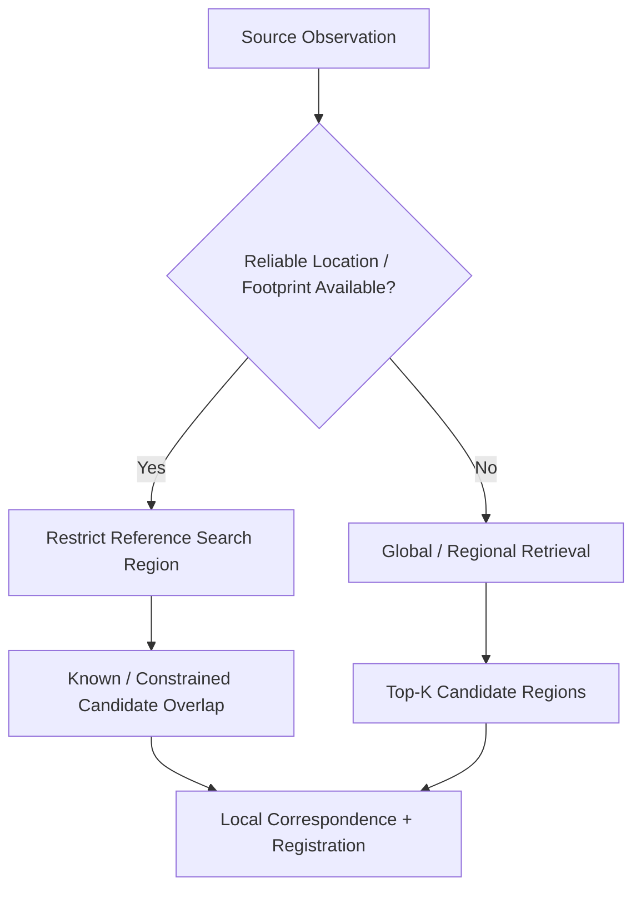
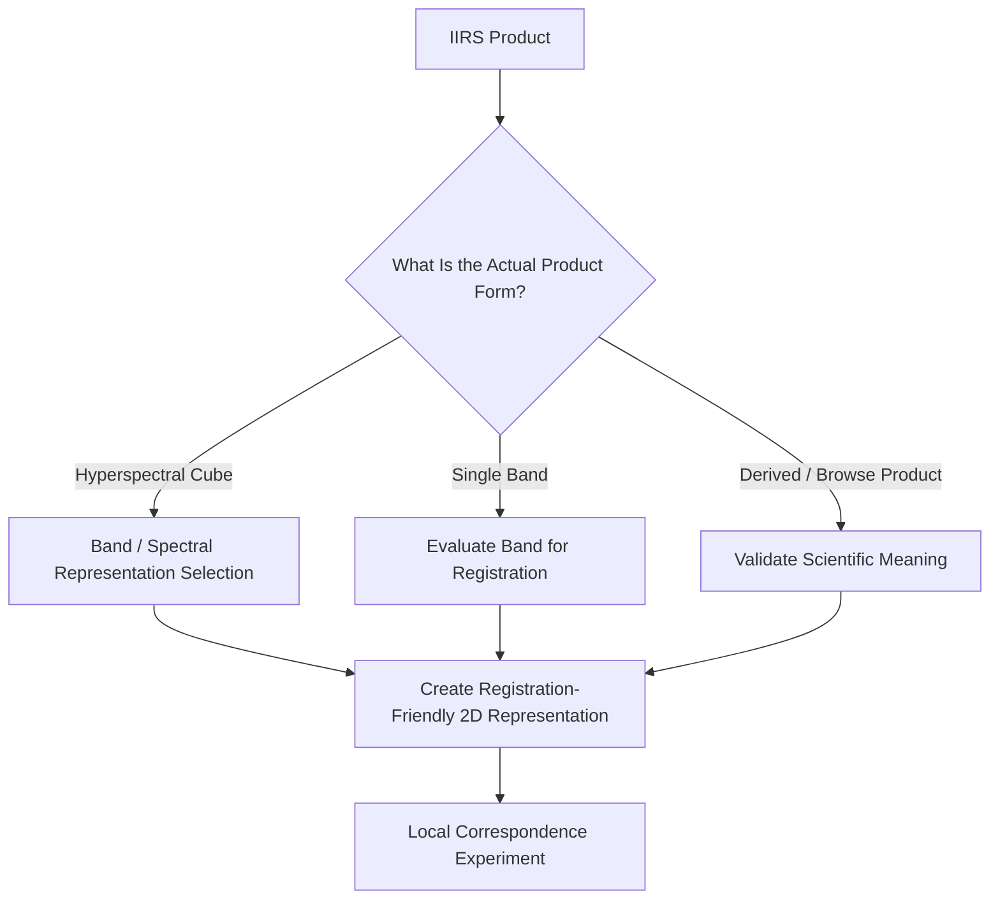
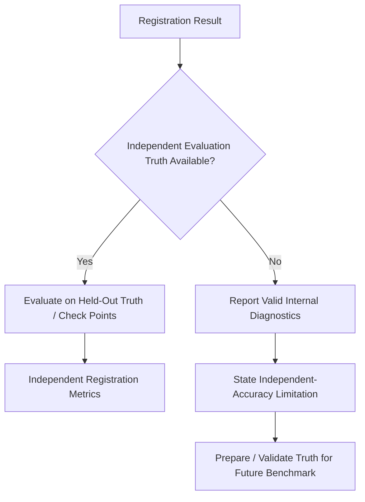
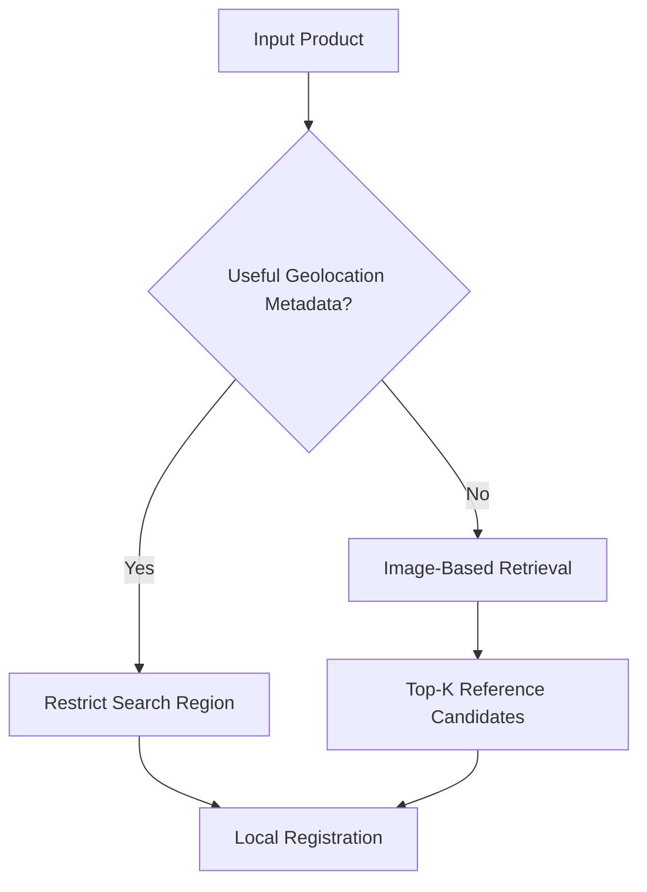
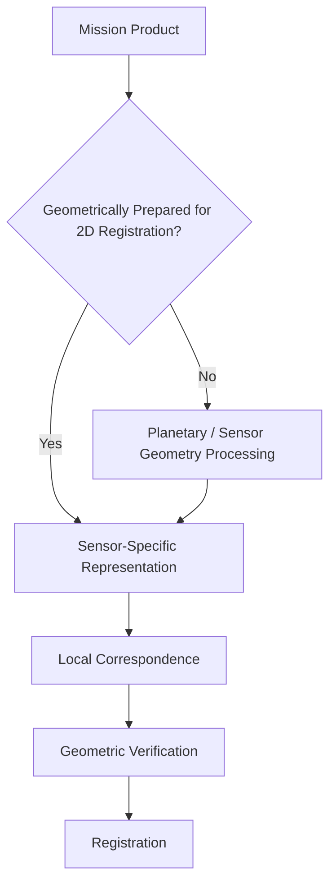
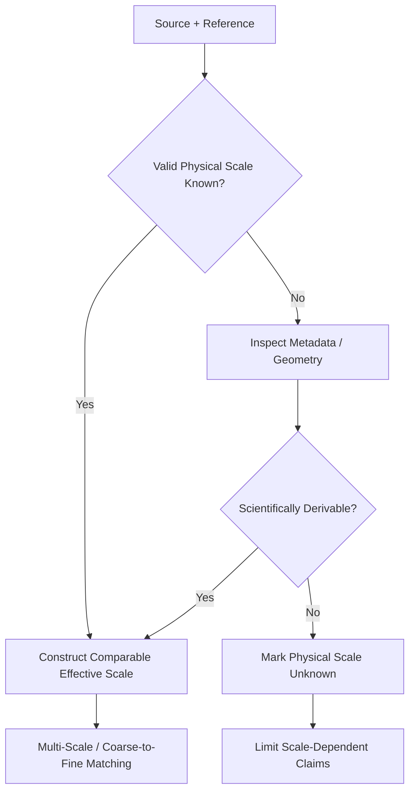
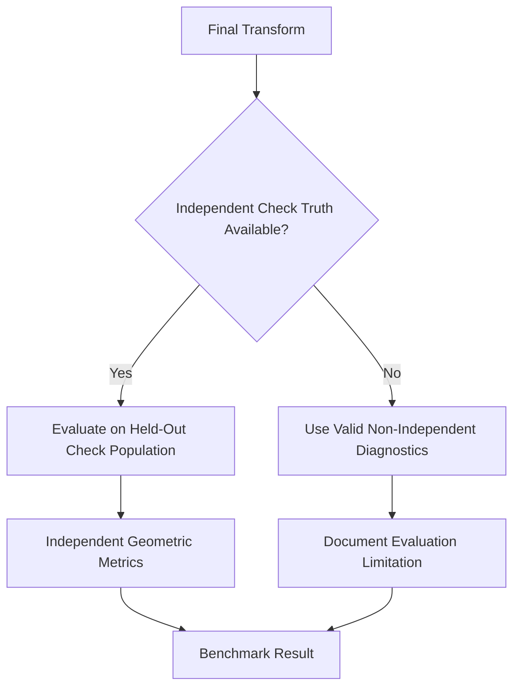
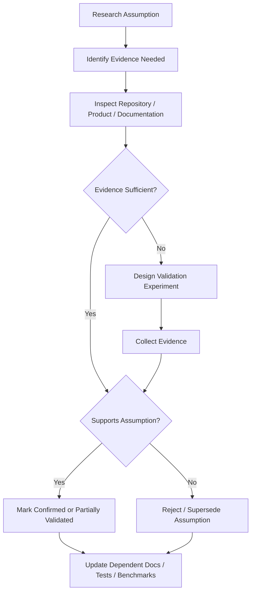

# Research Assumptions

ChandraMap is a research and engineering project for measurable lunar image correspondence, registration, multi-sensor matching, reproducible benchmarking, and failure analysis.

This document is the **research assumptions register** for ChandraMap. Its purpose is to make important assumptions visible before they become hidden dependencies inside algorithms, experiments, benchmarks, or architecture.

An assumption recorded here is not automatically a fact.

> **The purpose of an assumptions register is to expose uncertainty, not to make uncertain information look certain.**

> **If an assumption changes the scientific task, architecture, evaluation validity, or interpretation of results, it should be documented and tested explicitly.**

---

## 1. Purpose

This document records conditions currently accepted, provisionally accepted, or actively investigated while ChandraMap research proceeds.

It helps contributors understand:

- what the project currently assumes
- why an assumption exists
- what evidence supports it
- what remains unknown
- which parts of the system depend on it
- what could break if it is false
- how it can be validated
- what fallback exists
- whether the assumption is temporary or structural
- whether it affects benchmark comparability

Research assumptions may affect:

- dataset selection
- preprocessing
- sensor routing
- scale handling
- local matching
- global retrieval
- geometric verification
- transform selection
- sub-pixel refinement
- evaluation
- ground-truth preparation
- benchmark design
- runtime expectations
- reproducibility
- future multi-mission research

This document does not replace:

- the project scope
- the research questions
- the experiment methodology
- benchmark specifications
- sensor documentation
- dataset documentation
- evaluation definitions

Instead, it records the assumptions those areas depend on.

---

## 2. Fact, Assumption, Hypothesis, Constraint, and Unknown

These terms have different meanings and must not be used interchangeably.

| Term                        | Meaning                                                                                                                         |
| --------------------------- | ------------------------------------------------------------------------------------------------------------------------------- |
| **Fact**                    | A statement supported by authoritative documentation, repository evidence, or measured experimental results                     |
| **Assumption**              | A condition provisionally accepted so design, implementation, or evaluation can proceed, but which may still require validation |
| **Hypothesis**              | A testable research expectation that should be evaluated experimentally                                                         |
| **Constraint**              | A limitation or requirement imposed by the problem, data, hardware, software, evaluation protocol, or architecture              |
| **Unknown / Open Question** | Something for which ChandraMap currently lacks sufficient evidence                                                              |

### Example

**Fact**

IIRS is an imaging infrared spectrometer / hyperspectral instrument rather than an ordinary grayscale camera.

**Assumption**

The particular IIRS products selected for an early experiment can be converted into a useful 2D registration representation.

**Hypothesis**

A structural IIRS representation may produce more stable cross-modal correspondences than a simple intensity representation.

**Constraint**

IIRS spatial sampling limits which terrain structures can physically be resolved.

**Unknown**

Which IIRS representation performs best for ChandraMap registration.

---

## 3. Why Assumptions Matter

Incorrect assumptions can change the problem being solved.

For example:

- If approximate geolocation is assumed but unavailable, global retrieval becomes a major additional requirement.
- If imagery is assumed to be map-projected but raw sensor products are supplied, geometric preprocessing becomes substantially more complex.
- If IIRS is assumed to be a 2D image but the research data are hyperspectral cubes, the preprocessing architecture changes.
- If local overlap is assumed but the task requires whole-Moon localization, a retrieval system must precede local registration.
- If independent truth is assumed but unavailable, the interpretation of registration accuracy changes.
- If GSD is assumed known but missing, physically meaningful scale matching becomes harder.
- If a global homography is assumed sufficient but residuals vary spatially, the geometric model is incomplete.
- If benchmark failures are treated as bad data, scientific performance becomes artificially optimistic.

The correct response is not to hide the mismatch. The assumption should be:

1. identified
2. validated
3. revised if necessary
4. propagated to affected documentation, experiments, and benchmarks

---

# Assumption Governance

## 4. Assumption Identifiers

Important assumptions use stable identifiers:

```text
RA-001
RA-002
RA-003
...
```

where:

`RA` = **Research Assumption**

These identifiers may be referenced from:

- [research questions](research-questions.md)
- experiment reports
- benchmark specifications
- notebooks
- GitHub issues
- pull requests
- architecture decisions
- result reports
- code comments where genuinely useful

Once an assumption ID is established, do not casually renumber it.

If an assumption is retired, preserve its ID and change its status rather than reusing that number for an unrelated concept.

---

## 5. Status Vocabulary

Use the following status vocabulary conservatively.

| Status                  | Meaning                                                                                          |
| ----------------------- | ------------------------------------------------------------------------------------------------ |
| **Confirmed**           | Supported by authoritative documentation, repository evidence, or measured experimental evidence |
| **Working Assumption**  | Provisionally accepted so work can proceed                                                       |
| **Partially Validated** | Some evidence exists, but important conditions remain unresolved                                 |
| **Unverified**          | Not yet supported by sufficient evidence                                                         |
| **Under Investigation** | Currently being tested or examined                                                               |
| **Rejected**            | Evidence indicates the assumption should no longer be used                                       |
| **Superseded**          | Replaced by a newer, more precise assumption or documented condition                             |
| **Not Applicable**      | No longer relevant to the current scope                                                          |

Do not mark an assumption **Confirmed** merely because it is convenient or widely repeated.

---

## 6. Impact Vocabulary

Impact describes what happens if an assumption is wrong.

| Impact       | Meaning                                                                           |
| ------------ | --------------------------------------------------------------------------------- |
| **Critical** | Could invalidate the scientific task, benchmark, or major architecture            |
| **High**     | Requires substantial pipeline, evaluation, or data changes                        |
| **Medium**   | Affects one research path or subsystem but does not invalidate the entire project |
| **Low**      | Limited effect and relatively straightforward fallback                            |

Impact is qualitative.

Do not invent numerical risk scores.

---

## 7. Assumption Summary

| ID     | Assumption                                                                                          | Status             | Impact   | Area                     |
| ------ | --------------------------------------------------------------------------------------------------- | ------------------ | -------- | ------------------------ |
| RA-001 | Early local-registration research can begin with known or approximately constrained overlap         | Working Assumption | Critical | Scope / Registration     |
| RA-002 | Whole-Moon retrieval is conditional rather than mandatory                                           | Working Assumption | High     | Retrieval / Architecture |
| RA-003 | Useful metadata exists for at least some mission products                                           | Working Assumption | High     | Metadata                 |
| RA-004 | Early baselines can preferentially use geometrically usable/map-projected products                  | Working Assumption | High     | Product Geometry         |
| RA-005 | Suitable mission products can be accessed for controlled research                                   | Working Assumption | High     | Data                     |
| RA-006 | Early research should use a small controlled dataset before Moon-scale processing                   | Working Assumption | Medium   | Research Methodology     |
| RA-007 | Meaningful physical scale comparison requires valid GSD or equivalent spatial-scale information     | Working Assumption | High     | Scale                    |
| RA-008 | Fine registration claims must remain limited by source-sensor information content                   | Working Assumption | Critical | Scale / Evaluation       |
| RA-009 | IIRS input representation cannot be fixed until actual products are inspected                       | Unverified         | Critical | IIRS / Data              |
| RA-010 | Conventional 2D matchers require an explicit IIRS-derived 2D registration representation            | Working Assumption | High     | IIRS / Matching          |
| RA-011 | The reference product may vary and must be identified per experiment                                | Working Assumption | High     | Reference Data           |
| RA-012 | One source/reference pair at a time is an appropriate first registration baseline                   | Working Assumption | Medium   | Baseline                 |
| RA-013 | A SIFT-based pipeline is an appropriate classical baseline for controlled comparison                | Working Assumption | High     | Matching                 |
| RA-014 | Learned terrestrial matchers cannot be assumed to generalize to lunar data without evaluation       | Working Assumption | High     | Learned Matching         |
| RA-015 | Multimodal remote-sensing methods require evaluation and adaptation rather than assumed drop-in use | Working Assumption | Medium   | Cross-Modal Matching     |
| RA-016 | Matcher output should initially be treated as candidate correspondence                              | Working Assumption | Critical | Matching Semantics       |
| RA-017 | RANSAC-style robust geometric verification is a reasonable initial outlier-rejection approach       | Working Assumption | High     | Geometry                 |
| RA-018 | Affine/homography models may approximate some local prepared pairs but are not universally valid    | Working Assumption | Critical | Geometry                 |
| RA-019 | Flexible warping should only follow reliable and spatially distributed correspondence               | Working Assumption | High     | Geometry                 |
| RA-020 | Sub-pixel refinement should follow geometric verification and precede final model refitting         | Working Assumption | High     | Refinement               |
| RA-021 | Registration error should be reported in image-space units before any justified ground conversion   | Working Assumption | Critical | Evaluation               |
| RA-022 | "Well-distributed" correspondence must be measured rather than judged visually                      | Working Assumption | High     | Evaluation               |
| RA-023 | Raw match count alone is not a sufficient quality metric                                            | Working Assumption | High     | Evaluation               |
| RA-024 | Quantitative evaluation is required in addition to visual inspection                                | Working Assumption | Critical | Evaluation               |
| RA-025 | Independent evaluation truth may not always be available and must be verified                       | Unverified         | Critical | Ground Truth             |
| RA-026 | Fit/control points and independent check points should be separated where possible                  | Working Assumption | Critical | Evaluation               |
| RA-027 | RMSE is meaningful only when population, coordinate space, and units are defined                    | Working Assumption | Critical | Metrics                  |
| RA-028 | Retrieval and local registration require separate assumptions and metrics                           | Working Assumption | High     | Retrieval                |
| RA-029 | Fair comparisons require controlled benchmark conditions                                            | Working Assumption | Critical | Benchmarking             |
| RA-030 | Previous scientific versions should remain reproducible for future comparison                       | Working Assumption | High     | Versioning               |
| RA-031 | Major improvements should be isolated with ablations where practical                                | Working Assumption | High     | Methodology              |
| RA-032 | Runtime claims require documented hardware/environment context                                      | Working Assumption | High     | Performance              |
| RA-033 | Research claims require reproducible provenance                                                     | Working Assumption | Critical | Reproducibility          |
| RA-034 | Some valid image pairs will fail and failure must remain representable                              | Working Assumption | Critical | Reliability              |
| RA-035 | Unreliable registrations should be rejected or flagged rather than always forced to an output       | Working Assumption | High     | Reliability              |
| RA-036 | Success on one lunar region does not establish whole-Moon generalization                            | Working Assumption | Critical | Generalization           |
| RA-037 | Cross-mission performance must be evaluated separately                                              | Working Assumption | Medium   | Future Research          |

---

# Documented Scope Conditions

Some important conditions are already part of ChandraMap's documented research direction and should not be presented as uncertain merely for the sake of this register.

## Correspondence and Registration Are the Core Scientific Deliverables

ChandraMap's scientific focus is correspondence and registration rather than only mosaic generation.

Core outputs may include:

- candidate correspondences
- verified inliers
- transformation model
- registered product or preview
- localization/geospatial information where meaningful
- residual measurements
- evaluation metrics
- spatial coverage
- benchmark results

A lunar mosaic or map is a possible downstream visualization.

This is a **scope condition**, not a claim that every output above is already implemented.

See:

- [Research Overview](README.md)
- [Project Goals](../project/goals.md)
- [V1 Scope](../project/v1-scope.md)
- [Project Terminology](../project/terminology.md)

---

# Problem-Scope and Localization Assumptions

## RA-001 — Known or Approximately Constrained Overlap for Early Local Registration

**Status:** Working Assumption
**Impact:** Critical
**Area:** Scope / Registration

### Assumption

Initial local-registration experiments can begin with a source/reference pair whose overlap is known or approximately constrained.

### Why this assumption currently exists

This isolates the correspondence problem from the separate problem of finding the correct region on the Moon.

It allows early experiments to focus on:

- preprocessing
- scale handling
- local feature extraction
- correspondence generation
- RANSAC
- transformation estimation
- refinement
- evaluation

without first solving whole-Moon retrieval.

### What supports it

The current V1 direction is centered on a known-pair local-registration baseline.

See:

- [V1 Scope](../project/v1-scope.md)
- [V1 Pipeline](../architecture/v1-pipeline.md)
- [Baseline Research](baseline.md)

### What is still unknown

The exact overlap assumptions of every future benchmark or data source may differ.

### Risk if incorrect

If the actual task provides no usable location or overlap constraint, the architecture requires:

```text
Reference Corpus
→ Tiling / Multi-Scale Representation
→ Global Descriptor
→ Vector Search
→ Top-K Candidate Regions
→ Local Registration
```

### Validation method

Inspect the actual product metadata and benchmark definition for each research dataset.

### Fallback / response

Add a retrieval stage without redefining local registration itself.

### Related research questions

See [Research Questions](research-questions.md).

---

## RA-002 — Global Search Is Conditional

**Status:** Working Assumption
**Impact:** High
**Area:** Retrieval / Architecture

### Assumption

Whole-Moon image retrieval should not be mandatory when trustworthy metadata already restricts the possible reference location.

### Why this assumption currently exists

Mission products may contain useful geospatial information such as:

- approximate latitude/longitude
- footprint
- projection
- product geometry
- acquisition metadata

Using valid metadata is scientifically reasonable engineering. It avoids solving a harder retrieval problem when part of the localization problem is already constrained.

### What is still unknown

The reliability and availability of such metadata for all intended products.

### Risk if incorrect

If useful metadata is absent, retrieval becomes necessary before local registration.

### Validation method

Inspect actual mission products used in experiments.

### Fallback / response

Use image-based global/regional retrieval with a separately evaluated retrieval stage.

---

## Assumption Dependency — Location Knowledge



Retrieval and registration remain separate scientific tasks even when used in one end-to-end workflow.

---

# Metadata Assumptions

## RA-003 — Useful Product Metadata Is Available for at Least Some Inputs

**Status:** Working Assumption
**Impact:** High
**Area:** Metadata

### Assumption

At least some Chandrayaan-2 and LRO products used by ChandraMap will provide scientifically useful metadata.

Possible metadata includes:

- product identifier
- sensor/instrument
- acquisition time
- approximate location
- image footprint
- GSD/pixel scale
- map projection
- Sun azimuth
- Sun elevation
- incidence angle
- emission angle
- viewing geometry
- spacecraft geometry

### Important boundary

ChandraMap must **not** assume every product contains every field.

### Why this assumption currently exists

Several planned research decisions become easier and more physically meaningful when metadata exists.

Examples:

- scale comparison requires GSD or equivalent information
- geospatial search benefits from footprints
- illumination studies benefit from Sun geometry
- ground-space metrics depend on valid map/projection information

### What is still unknown

Which fields are consistently present in the exact product levels selected for research.

### Risk if incorrect

The system may require:

- image-only scale estimation
- image-only retrieval
- unknown illumination categories
- reduced geospatial evaluation
- additional planetary preprocessing

### Validation method

Inspect actual downloaded mission-product metadata rather than relying on generic sensor documentation.

### Fallback / response

Mark unavailable metadata explicitly and use only scientifically justified fallback estimation.

---

# Product Geometry Assumptions

## RA-004 — Early Experiments Can Prefer Geometrically Usable Products

**Status:** Working Assumption
**Impact:** High
**Area:** Product Geometry

### Assumption

Early correspondence experiments can preferentially use products that are map-projected, orthorectified, or otherwise sufficiently prepared for 2D registration.

### Why this assumption currently exists

The first baseline should isolate the correspondence problem rather than simultaneously solving:

- camera models
- spacecraft geometry
- raw sensor reconstruction
- photogrammetric orthorectification
- full planetary map projection

### What is still unknown

Research inputs may include:

- map-projected products
- calibrated but unprojected products
- raw sensor products
- mixed product levels

### Risk if incorrect

Classical 2D transform assumptions may fail for reasons unrelated to the matcher.

### Validation method

Inspect the product level, geometry metadata, projection, and processing state before the experiment.

### Fallback / response

Introduce a planetary preprocessing stage before local correspondence, potentially using appropriate mission/planetary tools.

---

# Data Assumptions

## RA-005 — Suitable Mission Data Can Be Obtained for Controlled Research

**Status:** Working Assumption
**Impact:** High
**Area:** Data Access

### Assumption

Public or research-accessible mission products can be obtained for enough valid ChandraMap experiments.

Potential sources include:

- ISRO / ISSDC / PRADAN for Chandrayaan-2
- LROC / PDS for LRO
- optional JAXA / SELENE sources for future research

### What is still unknown

Not every desired cross-sensor pair is guaranteed to exist with:

- useful overlap
- suitable illumination conditions
- compatible product levels
- complete metadata
- practical download size

### Risk if incorrect

Research may be constrained by data availability rather than algorithm capability.

### Validation method

Build a traceable dataset catalog from actual mission-product searches.

### Fallback / response

Reduce scope to available scientifically valid pairs and document the limitation rather than fabricating coverage.

---

## RA-006 — Early Research Uses a Small Controlled Dataset

**Status:** Working Assumption
**Impact:** Medium
**Area:** Research Methodology

### Assumption

Initial experiments should use a small, controlled set of real overlapping pairs rather than immediately processing the entire Moon.

### Why this assumption currently exists

Small controlled datasets support:

- manual inspection
- faster iteration
- reproducibility
- clearer failure diagnosis
- meaningful ablations
- easier truth preparation

### Risk if incorrect

Starting directly with a large corpus can obscure whether problems come from:

- retrieval
- preprocessing
- scale handling
- matching
- geometry
- evaluation

### Validation method

Increase dataset scope only after the pairwise pipeline produces interpretable outputs and failure records.

### Fallback / response

Expand progressively from local registration to larger retrieval/search datasets.

No fixed number of pairs is defined here.

---

# Sensor Assumptions

## Sensor Reality

OHRC, TMC-2, IIRS, NAC, and WAC must not be treated as equivalent imaging sources.

Approximate project-level context:

| Instrument  | Approximate Context                                                                                     | Important Assumption Boundary                        |
| ----------- | ------------------------------------------------------------------------------------------------------- | ---------------------------------------------------- |
| **OHRC**    | Very high-resolution panchromatic imagery; roughly 0.25–0.32 m/pixel depending on product/documentation | Product metadata overrides generic summary values    |
| **TMC-2**   | Panchromatic terrain imagery; roughly 5 m/pixel                                                         | Do not assume every product includes DEM information |
| **IIRS**    | Imaging infrared spectrometer / hyperspectral data; roughly 80 m/pixel and approximately 0.8–5.0 µm     | Do not treat it as an ordinary grayscale camera      |
| **LRO NAC** | High-resolution lunar imagery; often approximately 0.5–2 m/pixel depending on product/geometry          | Do not assign one universal GSD                      |
| **LRO WAC** | Broader lunar-scale context/reference imagery                                                           | Do not treat WAC as interchangeable with NAC         |

These values are approximate context only.

> **Specific product metadata should govern specific experiments.**

---

# Scale and GSD Assumptions

## RA-007 — Physical Scale Requires GSD or Equivalent Information

**Status:** Working Assumption
**Impact:** High
**Area:** Scale

### Assumption

Meaningful cross-resolution comparison requires known or scientifically estimable physical scale.

Ground Sample Distance (GSD) describes approximately how much lunar surface one image pixel represents.

### Important boundary

Image dimensions alone do not reveal physical ground scale.

### If GSD is unavailable

Prefer, in order:

1. authoritative product metadata
2. scientifically justified derivation from product geometry
3. explicit `unknown` scale state

Do not invent GSD from sensor summaries when the product-specific value is unknown.

---

## Physical Scale Handling Is a Design Principle

The following is stronger than a provisional assumption:

> **Upsampling increases pixel count but does not create missing lunar terrain information.**

Therefore scale handling should investigate methods such as:

- image pyramids
- reference pyramids
- downsampling the finer observation
- comparable effective GSD
- coarse-to-fine matching

This does not guarantee that any one method will solve the scale problem. It constrains what scientifically defensible scale processing should mean.

---

## RA-008 — Fine Registration Claims Are Limited by Source Information Content

**Status:** Working Assumption
**Impact:** Critical
**Area:** Scale / Evaluation

### Assumption

Fine registration is only scientifically meaningful when the source sensor contains enough terrain information to support that claim.

### Example

IIRS at roughly 80 m/pixel should not be expected to resolve the same small terrain structures visible in OHRC or high-resolution NAC imagery.

### Risk if ignored

A pipeline may produce numerically precise coordinates that imply unsupported physical accuracy.

### Validation method

Evaluate at scales physically supported by the source product and use independent truth where available.

### Fallback / response

Limit the registration claim to the source information scale.

---

# Illumination Assumptions

## Lunar Illumination Is Not a Simple Brightness Offset

This is treated as a physical research condition rather than a convenience assumption.

Changes in Sun geometry can alter:

- shadow direction
- shadow length
- crater appearance
- ridge appearance
- local gradients
- visible terrain structure

Therefore simple:

- histogram equalization
- contrast normalization
- brightness normalization

cannot be assumed to undo illumination geometry.

Illumination robustness must be measured experimentally.

---

## Structural Representation Is a Hypothesis, Not a Confirmed Assumption

ChandraMap may investigate:

- edges
- gradients
- phase-based information
- crater/ridge structure
- other structural representations

as potentially more stable than raw intensity under illumination changes.

This is a **hypothesis**.

It must not be upgraded to fact until experiments support it.

See:

- [Research Questions](research-questions.md)
- [Experiment Methodology](experiment-methodology.md)

---

# IIRS Assumptions

## RA-009 — Exact IIRS Input Form Must Be Verified

**Status:** Unverified
**Impact:** Critical
**Area:** IIRS / Product Format

### Assumption

The IIRS processing path cannot be finalized until actual research products are inspected.

Possible forms include:

- full hyperspectral cube
- individual spectral band
- derived product
- browse product
- PCA representation
- composite representation
- another derived structural product

### Why this matters

A full hyperspectral cube and a single browse image require very different preprocessing architectures.

### Risk if incorrect

A pipeline designed around a 2D image may be incompatible with the actual data.

### Validation method

Inspect actual IIRS files selected for experiments:

- dimensions
- bands
- metadata
- calibration state
- projection
- product level
- wavelength information

### Fallback / response

Introduce an explicit IIRS representation-generation stage.

---

## IIRS Dependency



---

## RA-010 — Conventional 2D Matchers Need an Explicit IIRS 2D Representation

**Status:** Working Assumption
**Impact:** High
**Area:** IIRS / Matching

### Assumption

A conventional 2D local matcher requires an explicitly defined registration-friendly representation before IIRS can be compared with conventional 2D imagery.

Candidate research representations may include:

- selected spectral band
- PCA component
- spectral composite
- gradient representation
- edge representation
- another structural projection

### What remains unknown

Which representation is most useful.

That is a research question, not an assumption to settle in advance.

### Related documentation

- [Research Questions](research-questions.md)
- [Baseline](baseline.md)

---

# Reference Data Assumptions

## RA-011 — Reference Product Must Be Identified Per Experiment

**Status:** Working Assumption
**Impact:** High
**Area:** Reference Data

### Assumption

ChandraMap should not assume every experiment uses one universal reference product.

Potential reference products may include:

- LRO NAC
- LRO WAC
- another scientifically suitable map-projected lunar product

### Required experiment context

Where available, record:

- product identifier
- instrument
- GSD
- projection
- processing level
- illumination conditions
- acquisition geometry

### Important boundary

Reference imagery is not automatically independent ground truth.

---

## LRO Resolution Is Product-Dependent

Do not assume one fixed NAC resolution.

NAC product scale depends on product and acquisition geometry.

Likewise:

- NAC and WAC are not interchangeable
- reference suitability depends on the task
- product metadata should be used for specific experiments

---

# Pairwise Baseline Assumptions

## RA-012 — Pairwise Registration Is the First Serious Baseline Unit

**Status:** Working Assumption
**Impact:** Medium
**Area:** Baseline

### Assumption

The first measurable registration system should operate on one known source/reference pair at a time.

### Purpose

This isolates:

- feature extraction
- descriptor generation
- correspondence
- filtering
- geometric verification
- transform estimation
- refinement
- evaluation

before adding:

- Moon-scale indexing
- retrieval
- mosaicking
- frontend visualization

### Validation method

Demonstrate an end-to-end pair producing either:

- a valid result with metrics
- a structured scientific failure

---

# Matching Assumptions

## RA-013 — SIFT Is an Appropriate Classical Research Baseline

**Status:** Working Assumption
**Impact:** High
**Area:** Matching

### Assumption

A classical SIFT-based pipeline provides a useful reference methodology for initial controlled experiments.

Conceptually:

```text
SIFT
→ Descriptor Matching
→ Match Filtering
→ RANSAC
→ Affine / Homography
→ Registration
→ Evaluation
```

### Why this assumption exists

The baseline is:

- explainable
- widely understood
- reproducible
- suitable for identifying which later component creates improvement

### Important boundary

This does **not** assume SIFT is sufficiently robust to:

- severe illumination change
- strong modality difference
- extreme GSD difference
- repetitive lunar terrain

Those are precisely the conditions the benchmark should test.

---

## RA-014 — Learned Matchers Require Lunar Validation

**Status:** Working Assumption
**Impact:** High
**Area:** Learned Matching

### Assumption

Pretrained learned correspondence methods cannot be assumed to generalize reliably to lunar imagery without controlled evaluation.

Candidate research methods may include:

- ALIKED + LightGlue
- LoFTR

### Risks

Potential failure sources include:

- terrestrial training-domain bias
- unfamiliar lunar textures
- strong shadows
- repeated crater structures
- extreme scale difference
- cross-modal appearance

### Validation method

Compare learned paths and the classical baseline on the same controlled pair population and evaluation protocol.

---

## RA-015 — Multimodal Remote-Sensing Methods Need Separate Evaluation

**Status:** Working Assumption
**Impact:** Medium
**Area:** Cross-Modal Matching

Methods such as:

- RIFT
- CFOG-like structural approaches

may be relevant to cross-modal lunar correspondence.

They should not be assumed to be:

- plug-and-play
- computationally cheap
- automatically superior
- guaranteed to work across all ChandraMap sensors

Their implementation cost and scientific benefit must both be evaluated.

---

## RA-016 — Matcher Output Is Candidate Correspondence

**Status:** Working Assumption
**Impact:** Critical
**Area:** Matching Semantics

### Assumption

Matcher output is initially treated as **candidate correspondence**.

A large matcher score does not by itself establish geometric correctness.

### Consequence

Candidate matches should normally proceed to geometric verification before being called verified inliers.

### Why this matters

Without this distinction:

- incorrect correspondences may be mislabeled as correct
- matcher confidence may be mistaken for registration accuracy
- benchmark metrics become scientifically ambiguous

See [Naming Conventions](../development/naming-conventions.md).

---

# Geometry Assumptions

## RA-017 — RANSAC Is a Reasonable Initial Robust Verification Method

**Status:** Working Assumption
**Impact:** High
**Area:** Geometry

### Assumption

RANSAC or an equivalent robust estimator is a reasonable starting method for rejecting geometric outliers.

### Important limitations

RANSAC:

- requires a geometric model
- depends on sufficient correct correspondences
- may fail under poor spatial distribution
- does not prove independent truth
- does not automatically establish final registration accuracy

A high inlier count alone is not enough.

---

## RA-018 — Affine/Homography May Approximate Some Local Pairs

**Status:** Working Assumption
**Impact:** Critical
**Area:** Geometry

### Assumption

A global affine transform or homography may be sufficient for some local, suitably prepared, map-projected image pairs.

### This is not universal

The model may fail because of:

- lunar relief
- sensor geometry
- large viewpoint differences
- non-planarity
- raw image geometry
- local distortion
- large spatial extent

### Validation method

Inspect residual vectors across the image.

Systematic spatial residual structure may indicate model inadequacy.

### Fallback / response

Investigate:

- local/piecewise refinement
- more appropriate map projection
- DEM/terrain-aware geometry
- sensor-model-based processing

without using flexibility merely to hide poor correspondence.

---

## RA-019 — Flexible Warping Requires Reliable Control

**Status:** Working Assumption
**Impact:** High
**Area:** Geometry

### Assumption

A more flexible warp is only scientifically useful when control points are:

- reliable
- sufficiently numerous
- spatially distributed

### Risk if ignored

A flexible warp can visually make an image appear aligned while fitting bad correspondences.

### Response

Validate correspondence quality and distribution before increasing transform flexibility.

---

# Refinement Assumptions

## RA-020 — Sub-Pixel Refinement Follows Geometric Verification

**Status:** Working Assumption
**Impact:** High
**Area:** Refinement

### Assumption

Sub-pixel refinement should be applied to reliable verified correspondences, not to arbitrary raw matcher output.

Preferred conceptual order:

```text
Candidate Matches
→ RANSAC / Initial Model
→ Verified Inliers
→ Local Sub-Pixel Refinement
→ Final Transform Refit
→ Registration
→ Evaluation
```

### Important boundary

Do not assume a matcher directly delivers final source-image sub-pixel registration accuracy.

---

# Evaluation Assumptions

## RA-021 — Report Image-Space Error Before Ground-Space Conversion

**Status:** Working Assumption
**Impact:** Critical
**Area:** Evaluation

### Assumption

Registration error should first be expressed in a clearly defined image coordinate space.

For example:

```text
source-image pixels
```

Conversion to metres should occur only when:

- product GSD is known
- projection/geometry supports the conversion
- reference truth is suitable

### Why this matters

For example:

```text
0.2 px on TMC-2
```

and:

```text
0.2 px on IIRS
```

do not represent the same ground distance.

Sub-pixel does not automatically mean sub-metre.

---

## RA-022 — Spatial Distribution Must Be Measurable

**Status:** Working Assumption
**Impact:** High
**Area:** Evaluation

### Assumption

"Well-distributed correspondences" should be evaluated quantitatively.

Possible concepts include:

- grid coverage
- convex-hull coverage
- overlap-area coverage
- another explicitly documented distribution metric

No threshold is defined here.

### Why this matters

A set of correspondences concentrated around one crater may produce a plausible local transform but provide weak support elsewhere in the overlap.

See [Benchmarking Guide](../development/benchmarking.md).

---

## RA-023 — More Matches Are Not Automatically Better

**Status:** Working Assumption
**Impact:** High
**Area:** Evaluation

### Assumption

Raw match count cannot serve as the sole correspondence-quality metric.

A smaller set of:

- accurate
- model-consistent
- spatially distributed

correspondences may be more useful than a much larger clustered or incorrect set.

---

## RA-024 — Quantitative Evaluation Is Required

**Status:** Working Assumption
**Impact:** Critical
**Area:** Evaluation

### Assumption

Visual inspection is useful but insufficient for scientific validation.

Useful metrics may include:

- candidate count
- verified inlier count
- inlier ratio
- fit residual
- held-out check-point RMSE
- spatial coverage
- ground-space error where valid
- success/failure rate
- runtime
- Recall@K when retrieval is evaluated

Do not invent a single overall accuracy score unless the project explicitly defines one.

---

# Ground-Truth Assumptions

## RA-025 — Ground-Truth Availability Must Be Verified

**Status:** Unverified
**Impact:** Critical
**Area:** Ground Truth

### Assumption

The exact form and availability of independent evaluation truth cannot be assumed in advance.

Possible cases include:

1. official correspondence truth exists
2. trustworthy map-projected/geospatial truth can be derived
3. manually verified control/check points are required
4. no sufficiently independent truth exists for the desired claim

### Why this matters

Ground-truth availability determines which accuracy claims are scientifically defensible.

### Risk if incorrect

The project may report fit quality as though it were independent evaluation.

### Validation method

Inspect:

- benchmark specification
- challenge/evaluation data
- product geometry
- available control networks
- independently verified points

### Fallback / response

If independent truth is unavailable:

- state the limitation
- report only metrics that remain valid
- avoid overstated accuracy claims
- develop a defensible truth-preparation method if needed

---

## Truth Dependency



---

## Reference Is Not Ground Truth Automatically

A registration reference image and an evaluation truth source play different roles.

LRO NAC or WAC imagery may serve as reference data without automatically becoming independent truth.

See:

- [Project Terminology](../project/terminology.md)
- [Naming Conventions](../development/naming-conventions.md)

---

## RA-026 — Fit and Check Populations Should Be Separate

**Status:** Working Assumption
**Impact:** Critical
**Area:** Evaluation

### Assumption

When possible, points used to estimate the transformation should not also be the only points used for final evaluation.

Preferred conceptual separation:

```text
Control / Fit Points
        ↓
Estimate Transform

Independent Check Points
        ↓
Evaluate Final Transform
```

### Why

Evaluating only on fitting points can underestimate generalization error.

### If independent check points are unavailable

State the limitation explicitly.

Do not rename fit residual as independent accuracy.

---

## RA-027 — RMSE Requires Full Context

**Status:** Working Assumption
**Impact:** Critical
**Area:** Metrics

### Assumption

RMSE is scientifically interpretable only when the following are defined:

- coordinate space
- units
- point population
- relationship to model fitting
- number of evaluated points
- truth source

Do not report an unqualified `RMSE` when it is unclear whether the value is in:

- source pixels
- reference pixels
- projected map units
- metres

or whether it uses:

- fit points
- check points
- another truth population

---

# Retrieval Assumptions

## RA-028 — Retrieval and Registration Are Separate Evaluation Problems

**Status:** Working Assumption
**Impact:** High
**Area:** Retrieval

### Assumption

If ChandraMap adds global or regional search, retrieval should be evaluated separately from local registration.

Conceptually:

```text
Reference Imagery
→ Tiles / Scales
→ Global Descriptor
→ Vector Index
→ Top-K Candidate Regions
→ Local Matching
→ Registration
```

FAISS, if used, searches vectors.

It does not:

- extract lunar features
- determine correspondences
- estimate transformations
- perform registration

The descriptor/embedding must be defined separately.

---

## Retrieval Metrics

If retrieval is implemented, suitable metrics may include:

- Recall@1
- Recall@5
- Recall@K

where defined by the benchmark.

Registration RMSE does not measure retrieval ranking quality.

Likewise, Recall@K does not measure geometric registration accuracy.

---

# Benchmark Assumptions

## RA-029 — Controlled Conditions Are Required for Fair Comparison

**Status:** Working Assumption
**Impact:** Critical
**Area:** Benchmarking

### Assumption

Fair comparison should preserve, where scientifically compatible:

- same image pairs
- same truth
- same held-out points
- same metric definitions
- same coordinate conventions
- same evaluation protocol
- same preprocessing when preprocessing is not the variable under test
- comparable hardware conditions for runtime comparisons

### Risk if incorrect

A measured difference may come from hidden benchmark changes rather than the algorithm.

See [Benchmarking Guide](../development/benchmarking.md).

---

## RA-030 — Previous Scientific Versions Should Remain Reproducible

**Status:** Working Assumption
**Impact:** High
**Area:** Scientific Versioning

### Assumption

Previous benchmarkable scientific versions should be preserved where practical.

### Why

This allows ChandraMap to:

- maintain a stable baseline
- identify regressions
- attribute improvements
- preserve research history
- rerun old methods on new compatible benchmark revisions

Do not continuously replace the previous baseline with the newest experiment.

---

## RA-031 — Major Changes Should Be Ablated Where Practical

**Status:** Working Assumption
**Impact:** High
**Area:** Experimental Methodology

A combined system improving does not prove every new component contributed.

Conceptual progression:

```text
Baseline
→ + Physical Scale Handling
→ + Sensor-Aware Preprocessing
→ + Stronger Matcher
→ + Refinement
→ Combined System
```

Where practical, test individual contributions.

See [Experiment Methodology](experiment-methodology.md).

---

# Runtime and Infrastructure Assumptions

## RA-032 — Runtime Requires Environment Context

**Status:** Working Assumption
**Impact:** High
**Area:** Performance / Infrastructure

### Assumption

Runtime comparisons are only meaningful when execution context is known.

Currently unresolved questions may include:

- CPU-only or GPU?
- accelerator model?
- memory limits?
- local workstation or server?
- batch or interactive execution?
- model initialization included or excluded?
- cache state?
- input dimensions?

No expected hardware configuration is defined here.

### Required response

Record relevant environment details whenever making performance claims.

---

# Reproducibility Assumptions

## RA-033 — Research Claims Require Traceable Provenance

**Status:** Working Assumption
**Impact:** Critical
**Area:** Reproducibility

### Assumption

A research result should preserve enough information for another contributor to understand and repeat the experiment.

Useful provenance may include:

- source product identifier
- reference product identifier
- sensor names
- GSD
- product level
- preprocessing
- registration representation
- scientific version
- algorithm
- parameters
- resolved configuration
- random seed where relevant
- dependency versions
- code revision
- hardware for performance comparison
- truth/check points
- output metrics
- failure notes
- artifacts

A screenshot without this context is not sufficient scientific provenance.

---

# Data Quality and Failure Assumptions

## RA-034 — Not Every Valid Pair Will Register Successfully

**Status:** Working Assumption
**Impact:** Critical
**Area:** Reliability

### Assumption

Some scientifically valid image pairs will fail registration.

Potential difficulties include:

- weak overlap
- missing metadata
- strong illumination difference
- low texture
- repetitive terrain
- extreme GSD difference
- sensor artifacts
- absent shared terrain detail
- incorrect retrieved candidate region

### Required behavior

A valid failure should be recorded as a failure rather than forced into a visually plausible output.

---

## RA-035 — Unreliable Results Should Be Rejected or Flagged

**Status:** Working Assumption
**Impact:** High
**Area:** Failure Detection

### Assumption

A useful scientific system should identify at least some unreliable registrations.

Potential warning signals may include:

- too few verified inliers
- poor spatial coverage
- high residuals
- unstable transformation
- failed independent check points
- inconsistent spatial residual patterns

No thresholds are defined here.

Thresholds must come from controlled evaluation and benchmark specifications.

---

# Generalization Assumptions

## RA-036 — One Region Does Not Establish Whole-Moon Robustness

**Status:** Working Assumption
**Impact:** Critical
**Area:** Generalization

### Assumption

Success on one lunar region cannot be assumed to generalize automatically across the Moon.

Terrain may differ in:

- crater density
- relief
- texture
- albedo
- illumination
- structural repetition
- feature richness

### Response

Evaluation should progressively include multiple representative conditions.

Do not describe whole-Moon robustness based on a small favorable subset.

---

## RA-037 — Cross-Mission Generalization Requires Separate Validation

**Status:** Working Assumption
**Impact:** Medium
**Area:** Future Research

### Assumption

A method validated on Chandrayaan-2 ↔ LRO imagery cannot automatically be assumed to work equally well on:

- Chandrayaan-2 ↔ Kaguya/SELENE
- other lunar missions
- unrelated planetary datasets

Optional future datasets should remain clearly labeled as future research unless formally incorporated.

---

# Assumptions ChandraMap Must Not Make

ChandraMap must not assume that:

- upsampling creates real terrain detail
- more matches always mean better registration
- high matcher confidence proves geometric correctness
- every input contains reliable geolocation metadata
- every source/reference pair contains useful overlap
- every product is already map-projected
- every product contains known GSD
- one generic instrument resolution applies to every product
- LRO NAC has one fixed GSD
- NAC and WAC are interchangeable
- IIRS is an ordinary grayscale camera
- every IIRS product is already a 2D registration image
- a pretrained terrestrial model is automatically lunar invariant
- SIFT is guaranteed to handle all lunar conditions
- RANSAC inliers are ground truth
- a high inlier count proves registration accuracy
- a homography always represents lunar geometry correctly
- a flexible warp fixes weak correspondence
- a visually good overlay proves accurate registration
- fit-point RMSE proves independent performance
- sub-pixel image-space error automatically means sub-metre ground error
- global retrieval is always necessary
- global retrieval is never necessary
- FAISS performs registration
- one successful pair proves whole-system robustness
- one failed pair proves a method is universally unsuitable
- every sensor should use identical preprocessing
- reference imagery is automatically ground truth
- failed benchmark cases should be discarded
- unavailable metrics should be encoded as zero
- newer methods are automatically better
- a combined pipeline improvement proves every component helped

---

# Assumption Dependencies

## Metadata and Retrieval



---

## Product Geometry and Registration



---

## GSD and Scale Handling



---

## Truth and Evaluation



---

# Hypotheses That Must Remain Hypotheses

The following ideas are plausible research directions but must not be silently upgraded into facts.

| Research Hypothesis                                                                           | Required Evidence                                        |
| --------------------------------------------------------------------------------------------- | -------------------------------------------------------- |
| Structural representations are more stable than raw intensity under lunar illumination change | Controlled illumination experiments                      |
| Sensor-aware preprocessing improves matching                                                  | Baseline comparison with preprocessing isolated          |
| Matching at comparable GSD improves correspondence over naïve resizing                        | Scale-stress benchmark                                   |
| Learned matchers outperform the classical baseline                                            | Same-pair controlled benchmark                           |
| RIFT/CFOG-like methods improve difficult cross-modal pairs                                    | Controlled modality experiments                          |
| Sub-pixel refinement reduces independent check-point error                                    | Before/after held-out evaluation                         |
| Local/piecewise refinement improves scenes with spatially varying residuals                   | Residual analysis + held-out evaluation                  |
| Metadata-assisted search improves retrieval efficiency                                        | Retrieval benchmark with controlled candidate population |
| One IIRS representation is more useful than others                                            | IIRS representation ablation                             |

These should be connected to [research questions](research-questions.md) and experimental evidence rather than treated as settled assumptions.

---

# Validation Priorities

Some assumptions carry enough architectural impact that they should be resolved early.

## Critical Validation Questions

1. What exact product levels will be used for OHRC, TMC-2, IIRS, NAC, and WAC?
2. Is approximate source/reference overlap available?
3. What geolocation metadata exists?
4. Are products map-projected or raw/calibrated?
5. What exact form does IIRS data take?
6. Is product-specific GSD available?
7. What reference imagery is authoritative for each experiment?
8. What independent evaluation truth exists?
9. Which points are fit/control points and which are held-out check points?
10. What runtime hardware/environment is relevant?
11. Does V1 evaluate local registration only?
12. Is retrieval an independent later task or part of a current benchmark?

---

# Assumption Validation Workflow



---

# Changing an Assumption

An assumption change can be scientifically significant.

Before changing a high-impact assumption:

1. identify the assumption ID
2. describe the new evidence
3. determine whether it is:
   - validated
   - rejected
   - superseded

4. identify affected:
   - research questions
   - architecture
   - experiments
   - benchmark definitions
   - result interpretation
   - documentation

5. determine whether historical benchmark results remain comparable
6. update the assumption without reusing its ID for another meaning

Do not rewrite historical assumptions in a way that hides why earlier experiments were designed differently.

---

# Assumption Review Checklist

## Definition

- [ ] Assumption has a stable RA identifier
- [ ] Statement is specific enough to test
- [ ] Fact and assumption are not conflated
- [ ] Hypothesis and assumption are not conflated
- [ ] Constraint and assumption are not conflated
- [ ] Status is conservative
- [ ] Impact reflects architecture/scientific consequence rather than preference

### Evidence

- [ ] Supporting documentation is identified
- [ ] Repository evidence is identified where available
- [ ] Product-specific evidence is preferred over generic sensor summaries
- [ ] Measured experiment evidence is linked where available
- [ ] Unsupported claims remain explicitly unverified

### Data

- [ ] Exact product form has been inspected where relevant
- [ ] Sensor identity is clear
- [ ] Product level is clear
- [ ] GSD is product-specific where needed
- [ ] Map-projection state is known where needed
- [ ] Metadata availability is verified rather than assumed globally
- [ ] IIRS input representation is explicit

### Registration

- [ ] Source/reference overlap assumption is clear
- [ ] Retrieval requirements are separated from local registration
- [ ] Candidate matches are not treated as truth
- [ ] Geometric model limitations are documented
- [ ] Sub-pixel refinement follows reliable inlier selection
- [ ] Flexible warping is not being used to hide weak control

### Evaluation

- [ ] Ground truth availability is verified
- [ ] Reference imagery is not automatically labeled truth
- [ ] Fit/control and check populations are distinguished
- [ ] RMSE coordinate space is defined
- [ ] RMSE units are defined
- [ ] Coverage is measurable
- [ ] Raw match count is not treated as accuracy
- [ ] Unavailable metrics are not interpreted as zero
- [ ] Valid failures remain in evaluation

### Benchmarking

- [ ] Same-pair comparison is used where scientifically possible
- [ ] Metric definitions remain fixed
- [ ] Truth version remains fixed
- [ ] Preprocessing changes are disclosed
- [ ] Runtime comparisons include environment context
- [ ] Previous baseline remains reproducible
- [ ] Combined-system improvement is not attributed to every component without ablation

### Reproducibility

- [ ] Data identifiers are recorded
- [ ] Scientific version is recorded
- [ ] Configuration is preserved
- [ ] Code revision is preserved
- [ ] Dependency/environment information is captured where relevant
- [ ] Random state is recorded where relevant
- [ ] Failures and limitations are documented

---

# Assumption Review Questions for Pull Requests

When a PR changes research behavior, reviewers should ask:

1. Does this change rely on a new assumption?
2. Is the assumption already recorded?
3. Is it actually a hypothesis?
4. Has it been validated?
5. Does it alter benchmark comparability?
6. Does it alter data or product requirements?
7. Does it alter source/reference semantics?
8. Does it change coordinate assumptions?
9. Does it change metric interpretation?
10. Does it require a new fallback?
11. Does it affect V1 reproducibility?
12. Does it invalidate any prior result?
13. Should documentation or experiment methodology change?
14. Should the assumption status be updated?

---

# Known Unknowns

The following areas should remain explicitly open until evidence resolves them:

- exact metadata availability across all intended mission products
- exact IIRS product form used in each experiment
- best IIRS registration representation
- availability and quality of independent evaluation truth
- global retrieval necessity for future tasks
- best global descriptor if retrieval is introduced
- which local matcher performs best by sensor pair
- where affine models become insufficient
- where homography becomes insufficient
- when piecewise/terrain-aware registration becomes necessary
- practical source-image sub-pixel limits by sensor
- useful failure thresholds
- runtime/hardware target
- whole-Moon generalization
- cross-mission generalization

An unknown is not a defect in the documentation.

Leaving it explicit is preferable to filling it with an unsupported assumption.

---

# Research Assumption Anti-Patterns

Avoid assumption records that are:

### Too vague

> The data should work.

Instead state which property is assumed and how it will be validated.

### Unfalsifiable

> The algorithm should be robust.

Define what condition and metric would test robustness.

### Disguised claims

> LightGlue is better for lunar imagery.

That is a hypothesis until measured.

### Implementation preferences presented as science

> Every sensor must use the same preprocessing pipeline.

That is not supported by the physical differences between the sensors.

### Hidden benchmark changes

> This difficult pair can be dropped because registration failed.

A valid failure is part of method behavior.

### Product summaries treated as exact metadata

> Every TMC-2 image is exactly 5 m/pixel.

Use product-specific metadata.

### Visual success treated as validation

> The overlay looks correct, so the registration is accurate.

Use quantitative evaluation where possible.

---

# Relationship to Research Questions

Assumptions and research questions serve different purposes.

An assumption allows work to proceed provisionally.

A research question identifies something the project intends to investigate.

For example:

**Assumption**

A known-overlap pair is sufficient for developing the first local-registration baseline.

**Research question**

How much performance changes when overlap must first be discovered through image retrieval.

Similarly:

**Assumption**

IIRS requires an explicit 2D registration representation for conventional image matching.

**Research question**

Which IIRS representation produces the strongest cross-modal correspondence.

See [Research Questions](research-questions.md).

---

# Relationship to Experiments

Experiments should test assumptions and hypotheses rather than merely produce attractive outputs.

See [Experiment Methodology](experiment-methodology.md).

A useful experiment should identify:

- assumption(s) involved
- hypothesis
- controlled data
- baseline
- changed variable
- metric
- failure condition
- result
- interpretation
- whether the assumption status should change

---

# Relationship to Benchmarking

See [Benchmarking Guide](../development/benchmarking.md).

Benchmark definitions should not silently depend on unrecorded assumptions.

Important benchmark assumptions include:

- pair validity
- source/reference identity
- truth independence
- fit/check separation
- metric definition
- coordinate convention
- scale/GSD interpretation
- failure treatment
- runtime context

If one of these changes, historical benchmark comparability may also change.

---

# Related Research Documentation

- [Research README](README.md) — entry point for the ChandraMap research documentation
- [Baseline](baseline.md) — baseline scientific methodology and comparison reference
- [Research Questions](research-questions.md) — research questions and investigation targets
- [Experiment Methodology](experiment-methodology.md) — controlled experiment design and execution guidance
- [Known Limitations](known-limitations.md) — documented scientific and engineering limitations
- [References](references.md) — research references and source documentation

---

# Related Project Documentation

- [Project Goals](../project/goals.md)
- [Project Non-Goals](../project/non-goals.md)
- [V1 Scope](../project/v1-scope.md)
- [Project Terminology](../project/terminology.md)
- [Project Assumptions](../project/assumptions.md)
- [Project Limitations](../project/limitations.md)

`docs/project/assumptions.md` and this file have different responsibilities:

- **project assumptions** describe broader product/project-level assumptions
- **research assumptions** describe conditions affecting research methodology, experimental validity, scientific interpretation, and benchmark design

---

# Related Architecture Documentation

- [System Overview](../architecture/system-overview.md)
- [V1 Pipeline](../architecture/v1-pipeline.md)
- [Core Engine Architecture](../architecture/core-engine-architecture.md)
- [Data Flow](../architecture/data-flow.md)
- [Output Flow](../architecture/output-flow.md)

Architecture should not silently turn a working research assumption into an immutable system requirement.

---

# Related Sensor Documentation

- [Sensors Overview](../sensors/overview.md)

Sensor-specific documents should remain authoritative for instrument terminology and product-level considerations where available.

---

# Related Development Documentation

- [Benchmarking](../development/benchmarking.md)
- [Naming Conventions](../development/naming-conventions.md)
- [Testing](../development/testing.md)
- [Coding Standards](../development/coding-standards.md)
- [Documentation Guide](../development/documentation-guide.md)

---

# Maintenance Policy

Update this document when:

- an assumption is experimentally validated
- an assumption is rejected
- product inspection resolves an unknown
- new benchmark evidence changes confidence
- new mission data changes data assumptions
- architecture starts depending on a new research assumption
- evaluation truth changes
- a new scientific version introduces new assumptions
- a previous assumption is superseded

Do not change assumption status merely because implementation currently depends on it.

Implementation dependency is not evidence.

---

# Final Principle

> **ChandraMap should prefer an explicit unknown over a hidden assumption, an explicit failure over a forced success, and measured evidence over architectural convenience.**

The assumptions in this register exist so that research decisions remain reviewable, falsifiable, and reproducible as ChandraMap evolves.

<!-- Source request: :contentReference[oaicite:0]{index=0} -->
