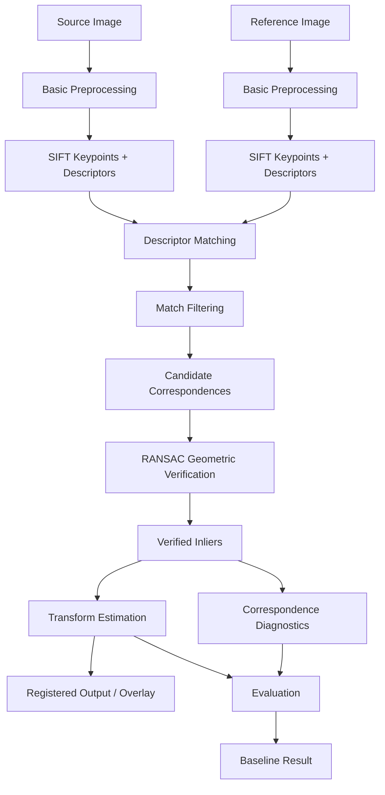
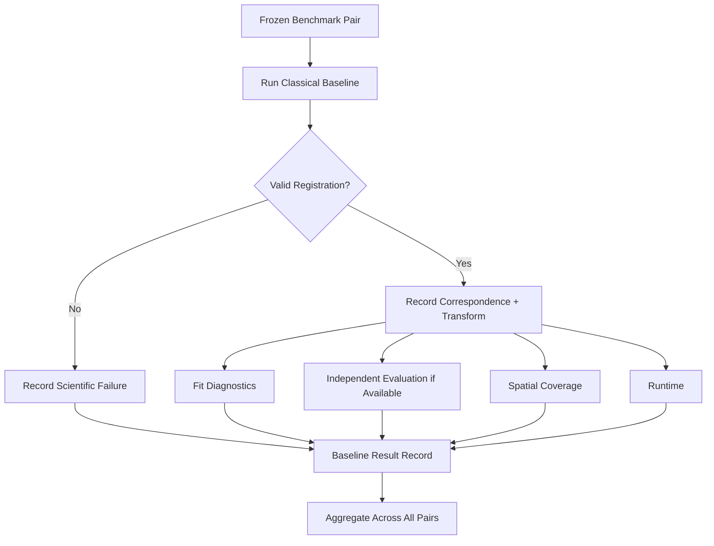
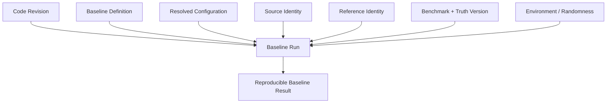

# Research Baseline

> **Document role:** Official ChandraMap research baseline definition
> **Scope:** Classical lunar image correspondence and registration baseline
> **Purpose:** Establish a simple, explainable, reproducible reference point against which later ChandraMap methods can be evaluated

---

## 1. Purpose

ChandraMap is a lunar image correspondence and registration research platform focused on aligning imagery of the same lunar region despite differences in:

- spatial resolution;
- illumination and Sun angle;
- viewing geometry;
- sensor characteristics;
- modality;
- product preparation;
- image scale.

This document defines the **official research baseline** used to answer a deliberately simple question:

> **What performance can a straightforward classical image-registration pipeline achieve before adding sensor-aware, learned, multi-scale, retrieval, or advanced refinement methods?**

The baseline exists to provide a stable reference point.

It is intentionally:

- simple;
- classical;
- explainable;
- reproducible;
- measurable;
- limited;
- easy to diagnose;
- easy to compare against.

It is **not** intended to represent the most capable ChandraMap method.

> **A stronger method is scientifically useful only if its improvement can be demonstrated against a clearly defined reference method.**

---

## 2. Baseline Principle

The primary baseline is a classical sparse local-feature registration pipeline based on:

1. a source image;
2. a known or externally supplied candidate reference image covering the same lunar region;
3. basic non-adaptive preprocessing;
4. SIFT feature detection and description;
5. descriptor matching;
6. deterministic match filtering;
7. RANSAC geometric verification;
8. affine or homography transform estimation according to frozen configuration;
9. image registration;
10. quantitative evaluation.

The conceptual pipeline is:

```text
Source Image
     +
Reference Image
     ↓
Basic Preprocessing
     ↓
SIFT Features
     ↓
Descriptor Matching
     ↓
Match Filtering
     ↓
Candidate Correspondences
     ↓
RANSAC Geometric Verification
     ↓
Verified Inliers
     ↓
Transform Estimation
     ↓
Registered Output
     ↓
Quantitative Evaluation
```

This baseline intentionally avoids solving every ChandraMap research problem at once.

---

## 3. Why ChandraMap Needs a Baseline

Without a stable baseline, an advanced method can appear better simply because multiple things changed simultaneously.

For example, a new experiment might add:

- different preprocessing;
- a different image scale;
- a learned matcher;
- different filtering;
- a more flexible transform;
- different evaluation data.

If all of those change together, it becomes difficult to determine what actually caused an improvement.

The baseline provides a fixed reference against which questions such as the following can be studied:

- Does sensor-aware preprocessing improve correspondence?
- Does physical scale handling improve matching?
- Does structural illumination handling improve difficult Sun-angle pairs?
- Does a learned matcher outperform SIFT?
- Does sub-pixel refinement improve held-out registration error?
- Does a more advanced geometric model reduce systematic residuals?
- Does global retrieval correctly find candidate regions?
- Does multimodal processing improve IIRS-to-visible registration?

The baseline therefore serves as an experimental control.

---

## 4. Baseline Is Not the Final System

The research baseline should not be confused with the complete ChandraMap architecture.

Later versions may introduce capabilities such as:

- sensor-aware preprocessing;
- explicit OHRC/TMC-2/IIRS routing;
- physical ground-scale matching;
- multi-resolution reference pyramids;
- illumination-aware structural representations;
- sub-pixel refinement;
- stronger local matchers;
- learned feature extraction;
- detector-free matching;
- multimodal matching;
- global lunar retrieval;
- uncertainty estimation;
- DEM-aware geometry;
- local or piecewise deformation models.

The baseline deliberately excludes these unless a future baseline revision explicitly incorporates them.

> **Baseline simplicity is a feature, not a deficiency.**

---

## 5. Relationship to Scientific Versions

The research baseline and ChandraMap scientific versions are related but not automatically identical concepts.

A **research baseline** answers:

> What simple reference method are later experiments compared against?

A **scientific version** defines:

> What methodology is officially implemented and benchmarked as that version?

The baseline may be used within version-level benchmarking, but the meaning of V1, V2, V3, or V4 must come from the authoritative version documentation.

See:

- [`../versions/README.md`](../versions/README.md)
- [`../versions/v1/README.md`](../versions/v1/README.md)
- [`../versions/v1/specification.md`](../versions/v1/specification.md)
- [`../versions/v1/pipeline.md`](../versions/v1/pipeline.md)
- [`../versions/v1/benchmark.md`](../versions/v1/benchmark.md)

> **Do not silently redefine a historical scientific version merely because the research baseline evolves.**

---

## 6. Research Baseline vs Benchmark

The baseline defines the **method**.

The benchmark defines the **evaluation contract**.

These are different.

| Concept            | Question                                                   |
| ------------------ | ---------------------------------------------------------- |
| Research baseline  | What reference method are we running?                      |
| Benchmark          | On which frozen data and rules do we evaluate it?          |
| Metric             | How is a particular quantity computed?                     |
| Experiment         | What happens when one controlled factor changes?           |
| Scientific version | Which methodology belongs to a defined ChandraMap version? |

A baseline without controlled evaluation is not enough to establish scientific performance.

See:

- [`../evaluation/README.md`](../evaluation/README.md)
- [`../evaluation/benchmark-protocol.md`](../evaluation/benchmark-protocol.md)
- [`../evaluation/metrics.md`](../evaluation/metrics.md)

---

# 7. Baseline Research Question

The primary research question is:

> **How far can conventional sparse feature matching and robust geometric verification go on lunar image registration without advanced ChandraMap-specific methods?**

Secondary questions include:

- Which lunar pairs are already easy for classical SIFT correspondence?
- Which pairs fail because of scale difference?
- Which pairs fail under strong illumination variation?
- Which pairs fail under cross-modality conditions?
- Which failures arise from insufficient features?
- Which failures arise from incorrect correspondences?
- Which failures arise after matching because the geometric model is insufficient?
- How spatially distributed are successful inliers?
- How much error remains on independent check points where such truth exists?

These questions establish the problem difficulty before more sophisticated solutions are introduced.

---

# 8. Baseline Hypothesis

The baseline starts from a conservative hypothesis:

> **Classical SIFT-based registration should provide a useful reference on sufficiently comparable lunar image pairs, but performance is expected to degrade when resolution, illumination, modality, or viewing geometry differ strongly.**

This is a research hypothesis, not a guaranteed outcome.

The benchmark determines whether and where it holds.

---

# 9. Baseline Goals

The baseline should:

- establish a reproducible minimum reference;
- expose difficult lunar correspondence cases;
- provide interpretable failure modes;
- support controlled comparisons;
- generate meaningful correspondences;
- estimate a geometric transformation where sufficient support exists;
- produce quantitative diagnostics;
- preserve source/reference roles;
- preserve coordinate-space semantics;
- remain simple enough to audit;
- avoid hidden adaptive behavior;
- remain available after advanced methods are introduced.

---

# 10. Baseline Non-Goals

The baseline is not expected to prove or provide:

- universal illumination invariance;
- full Sun-angle invariance;
- universal cross-sensor robustness;
- hyperspectral registration from raw IIRS cubes;
- global lunar localization;
- whole-Moon retrieval;
- learned correspondence;
- semantic crater understanding;
- DEM-aware registration;
- guaranteed sub-pixel accuracy;
- local deformation correction;
- uncertainty modeling;
- state-of-the-art performance;
- production-scale throughput.

Failures in these areas do not invalidate the baseline.

They identify where later research may be valuable.

---

# 11. Baseline Scope

The baseline assumes a local registration problem:

> A source image and a known or externally supplied candidate reference image are believed to contain overlapping lunar terrain.

The baseline then asks:

> Can classical local image correspondence estimate their geometric relationship?

Global reference discovery is intentionally outside this baseline.

---

# 12. Known-Overlap Assumption

The baseline should normally operate on a known or benchmark-defined source/reference pair.

Conceptually:

```text
Source Lunar Image
        +
Known/Candidate Overlapping Reference
        ↓
Local Correspondence
        ↓
Geometric Registration
```

The baseline therefore does **not** need to search the entire Moon.

This separation is important because:

> **Retrieval and registration are different scientific problems.**

If a later version adds global search, it should be evaluated separately.

---

# 13. Source and Reference Roles

Every baseline pair has ordered roles.

### Source

The image being aligned.

### Reference

The image or representation to whose coordinate system the source is being registered.

These roles must remain explicit throughout:

- matching;
- transform estimation;
- registration;
- metric computation;
- result serialization.

A pair should not be treated as unordered.

---

# 14. Baseline Transform Direction

Where the project defines source-to-reference registration, the baseline should preserve:

```text
source coordinates
        ↓
estimated transform
        ↓
reference coordinates
```

or:

$$
\mathbf{x}_{reference} = T(\mathbf{x}_{source})
$$

The transform direction must be recorded explicitly.

An inverse transform is not interchangeable with the forward transform merely because both matrices can be computed.

---

# 15. Baseline Architecture



---

# 16. Baseline Input Contract

A baseline run conceptually requires:

- one source image or registration-ready 2D representation;
- one reference image or registration-ready 2D representation;
- pair identity;
- enough metadata to interpret coordinate spaces;
- frozen baseline configuration;
- evaluation truth where independent evaluation is requested.

Inputs should be traceable to their parent data products.

---

# 17. Input Preconditions

Before baseline execution, inputs should satisfy relevant requirements such as:

- readable representation;
- valid dimensions;
- supported data type;
- known source/reference roles;
- valid pixel coordinate interpretation;
- no unresolved orientation ambiguity;
- valid mask information where masks are used.

The baseline should fail explicitly when essential assumptions are not satisfied.

---

# 18. Baseline 2D Representation Requirement

The classical SIFT baseline operates on a 2D registration representation.

For ordinary panchromatic imagery, the representation may naturally correspond to image intensity.

For multi-band or hyperspectral data, the baseline must not pretend that the original data are ordinary grayscale images.

> **The baseline must never silently reinterpret a hyperspectral cube as one normal 2D image.**

If a fixed derived representation is used, it must be:

- explicitly defined;
- reproducible;
- recorded;
- kept fixed during comparable benchmark runs.

Adaptive representation selection belongs to a more advanced experiment unless explicitly included in the baseline definition.

---

# 19. Sensor Neutrality

The minimal research baseline is intentionally not heavily sensor-aware.

It should avoid adaptive logic such as:

```text
if OHRC:
    use method A

if TMC-2:
    use method B

if IIRS:
    search representations C, D, E and choose the best
```

Such behavior can be valuable later, but it would already answer part of the sensor-aware research question.

Baseline input representations must therefore be defined before comparison rather than adaptively optimized per test pair.

---

# 20. OHRC Baseline Context

OHRC provides very high-detail panchromatic lunar imagery.

The baseline may process a valid 2D OHRC representation using the common SIFT pipeline.

However, the baseline should not introduce special high-resolution processing designed only for OHRC unless that behavior is part of the frozen baseline configuration.

---

# 21. TMC-2 Baseline Context

TMC-2 imagery can also be represented naturally as a 2D panchromatic image for the classical baseline.

It provides a useful source for determining how far conventional sparse matching works before more sophisticated scale handling is introduced.

---

# 22. IIRS Baseline Context

IIRS requires special caution.

IIRS is a hyperspectral imaging instrument rather than simply another grayscale camera.

The minimal SIFT baseline therefore does **not** define:

```text
full IIRS hyperspectral cube
→ SIFT
```

as valid generic behavior.

If IIRS is included in a baseline benchmark, the exact registration-compatible 2D representation must be defined and frozen.

Examples of representation families that may later be researched include:

- selected spectral bands;
- fixed composites;
- PCA-derived representations;
- structural representations.

This document does not prescribe which one must be used unless the benchmark/configuration defines it.

---

# 23. LRO Reference Context

LRO NAC or WAC may act as reference imagery depending on dataset and benchmark definition.

Reference status does not automatically make the image independent ground truth.

The reference image may be:

```text
registration target
```

while evaluation truth may come from:

```text
independent control/check information
```

Those roles must remain distinct.

---

# 24. Basic Preprocessing

The baseline should use only simple, frozen preprocessing necessary to make the classical pipeline operational.

Possible categories include:

- representation loading;
- valid-data handling;
- deterministic grayscale conversion where genuinely applicable;
- basic numerical normalization;
- optional simple contrast preparation if formally included in the baseline configuration.

The baseline should avoid adaptive, pair-specific preprocessing designed to maximize each result.

---

# 25. What Baseline Preprocessing Must Not Become

Baseline preprocessing should not silently become:

- sensor-specific optimization;
- Sun-angle correction;
- shadow modeling;
- learned enhancement;
- feature-aware image enhancement;
- adaptive representation search;
- physical-scale pyramid optimization;
- super-resolution;
- generated texture recovery.

If one of these is introduced, it should normally be evaluated as an enhancement relative to the baseline.

---

# 26. No Detail Fabrication

Upsampling may change pixel dimensions.

It does not recover spatial information absent from the original sensor measurement.

Therefore:

> **The baseline must never interpret image enlargement as physical detail recovery.**

Any resizing used for implementation convenience must remain distinguishable from claims about actual ground resolution.

---

# 27. SIFT Feature Detection

The baseline uses SIFT as its primary local feature method.

Conceptually, SIFT provides:

- local keypoint locations;
- characteristic scales;
- orientations;
- local descriptors.

SIFT is useful as a baseline because it is:

- classical;
- widely understood;
- local;
- sparse;
- scale-aware within practical limits;
- rotation-aware;
- interpretable relative to learned alternatives.

Its use does not imply strong invariance to all lunar conditions.

---

# 28. SIFT Limitations

The baseline should expect SIFT to struggle in cases involving:

- strong illumination differences;
- large modality differences;
- extreme scale mismatch;
- low-texture terrain;
- repeated crater patterns;
- insufficient common spatial detail;
- substantial viewpoint or terrain-induced distortion.

Those failures are scientifically useful baseline evidence.

---

# 29. Keypoints and Descriptors

The implementation should preserve the relationship between:

```text
keypoint i
↔
descriptor i
```

for both source and reference images.

Feature outputs should retain:

- image identity;
- coordinate-space identity;
- keypoint coordinates;
- descriptor association.

The baseline must not lose track of which image or coordinate system a feature belongs to.

---

# 30. Descriptor Matching

Descriptors from source and reference images are compared to form potential local correspondences.

Matcher output should be treated as:

> **candidate correspondence evidence**

not verified geometry.

Conceptually:

```text
Source Descriptor
        ↕
Reference Descriptor
        ↓
Potential Match
```

Descriptor similarity alone does not prove that two points represent the same lunar location.

---

# 31. Match Filtering

A deterministic match-filtering policy may remove weak or ambiguous descriptor matches.

The exact filter and parameters must come from the frozen baseline configuration.

They must not be adjusted independently for each benchmark pair after inspecting results.

Possible classical filtering strategies may be researched or configured, but baseline comparability requires the selected policy to remain stable.

---

# 32. Candidate Correspondences

After descriptor matching and filtering, the output population is:

> **candidate correspondences**

This terminology is mandatory for scientific clarity.

A candidate correspondence means:

> The descriptor stage considers these two local features plausible enough to submit for geometric verification.

It does **not** mean the match is correct.

---

# 33. Candidate ≠ Inlier

The baseline preserves the sequence:

```text
raw descriptor matches
        ↓
filtered candidate correspondences
        ↓
RANSAC geometric verification
        ↓
verified inliers
```

Do not collapse these populations into a generic `matches` concept when scientific interpretation matters.

---

# 34. RANSAC Geometric Verification

RANSAC is used to estimate geometric consistency while rejecting candidate correspondences that are incompatible with the selected transformation model.

Conceptually:

```text
Candidate Correspondences
        ↓
Robust Model Estimation
        ↓
Geometrically Consistent Subset
        ↓
Verified Inliers
```

RANSAC allows the baseline to tolerate some incorrect descriptor matches without treating all candidates as valid control points.

---

# 35. RANSAC Inlier ≠ Ground Truth

> **A RANSAC inlier is not independent ground truth.**

It means that the candidate correspondence is sufficiently consistent with the fitted model under the configured verification rule.

It may still be wrong in an absolute geospatial sense.

This distinction is especially important when computing accuracy metrics.

---

# 36. Transformation Model

The baseline may use an affine transform or homography where appropriate to the experimental definition.

The selected model must be explicit.

Do not silently choose the model that produces the most favorable result for each test pair.

A stable baseline can instead define:

- one fixed model; or
- clearly named baseline variants evaluated separately.

---

# 37. Affine Baseline Variant

An affine transformation can represent combinations of:

- translation;
- rotation;
- scale;
- shear.

It may be appropriate when the local pair is already geometrically well-behaved.

If affine registration is used, the baseline result must identify that model.

---

# 38. Homography Baseline Variant

A homography provides a more flexible projective transformation.

It may be useful for certain local registration conditions.

However:

> **The lunar surface is not globally planar, and a homography should not be interpreted as a complete physical model of lunar sensor geometry.**

A visually improved warp does not automatically imply scientifically correct correspondence.

---

# 39. Transform-Model Comparison

If affine and homography are both evaluated, treat them as explicit experimental variants.

For example:

```text
Baseline-Affine
Baseline-Homography
```

rather than:

```text
run both
→ keep whichever looks better
```

unless model selection itself is formally defined and frozen.

---

# 40. Transform Estimation

Once geometrically verified inliers are available, the baseline estimates the configured transformation.

The result should preserve:

- model type;
- matrix/model parameters;
- direction;
- source coordinate space;
- reference coordinate space;
- supporting inlier population;
- fitting status.

Invalid estimation must produce an explicit failure rather than an artificial identity transform.

---

# 41. No Hidden Identity Fallback

If valid transformation estimation fails:

```text
failure
```

is the correct result.

Do not return:

```text
identity transform
```

merely to keep downstream code running.

An identity transform is valid only if it was legitimately estimated or explicitly supplied under a documented contract.

---

# 42. Registered Output

When transform estimation succeeds, the source image may be warped or projected into the reference output space to create:

- registered imagery;
- overlay imagery;
- comparison visualization.

Registered images are useful diagnostic artifacts.

They are not the primary scientific evidence.

---

# 43. Visual Overlay Is Not Accuracy Evidence

A visually plausible overlay can hide:

- incorrect local correspondences;
- clustered inliers;
- wrong coordinate interpretation;
- incorrect transform direction;
- over-flexible geometry;
- evaluation leakage.

Therefore:

> **The baseline is judged by quantitative evidence and failure behavior, not by visual appearance alone.**

---

# 44. Baseline Outputs

A successful baseline run should preserve, where implemented:

- source identity;
- reference identity;
- pair identity;
- candidate correspondence count;
- candidate point coordinates;
- verified inlier count;
- verified inlier coordinates;
- transformation model;
- transformation parameters;
- transform direction;
- fit residual diagnostics;
- spatial coverage;
- independent evaluation metrics where available;
- runtime;
- registered artifact reference;
- success/failure state;
- provenance.

The exact result schema belongs to the implementation and output documentation.

---

# 45. Quantitative Evaluation

The baseline should be measurable.

Useful metric categories include:

- candidate count;
- inlier count;
- inlier ratio;
- spatial coverage;
- model-fit residual diagnostics;
- independent check-point error;
- ground-space error where valid;
- success/failure state;
- runtime.

Metric definitions must come from authoritative evaluation documentation.

See [`../evaluation/metrics.md`](../evaluation/metrics.md).

---

# 46. Candidate Count

Candidate count reports how many correspondences remain after the configured descriptor filtering stage.

It is not an accuracy metric.

A method producing more candidate correspondences is not necessarily better.

---

# 47. Inlier Count

Inlier count reports how many candidate correspondences survive geometric verification.

It is useful as a geometric-support diagnostic.

It should not be interpreted in isolation.

For example:

```text
many inliers concentrated in one small crater
```

may provide weaker registration support than:

```text
fewer inliers distributed across the overlap
```

depending on the geometry.

---

# 48. Inlier Ratio

Conceptually:

$$
\text{Inlier Ratio}
=
\frac{N_{\text{verified inliers}}}
     {N_{\text{candidate correspondences}}}
$$

The exact denominator must match the authoritative metric definition.

Inlier ratio measures geometric consistency of the candidate set.

It does not directly measure independent registration accuracy.

---

# 49. Spatial Coverage

Spatial coverage measures whether geometrically supported correspondences are distributed across the valid overlap region rather than concentrated in a small area.

See [`../evaluation/spatial-coverage.md`](../evaluation/spatial-coverage.md).

> **Coverage and accuracy are different quantities.**

A baseline should report both when the benchmark supports them.

---

# 50. Fit Residual

Residuals on points used to estimate the transformation are useful diagnostics.

However:

> **Fit residual is not independent registration error.**

The model has already been optimized using those points.

Reporting only fit-point error can make performance appear better than it generalizes.

---

# 51. Independent Check-Point Evaluation

Where suitable independent truth exists, a stronger evaluation uses check points excluded from fitting.

Conceptually:

```text
Fit Points
    ↓
Estimate Transform

Independent Check Points
    ↓
Apply Transform
    ↓
Compare Prediction vs Truth
    ↓
Registration Error
```

See [`../evaluation/checkpoint-evaluation.md`](../evaluation/checkpoint-evaluation.md).

---

# 52. Fit ≠ Check

> **Points used to fit the transform must not be presented as independent evidence of the transform's general registration accuracy.**

The baseline must preserve the difference between:

- fitting points;
- held-out check points.

This distinction is essential for scientifically meaningful comparison.

---

# 53. RMSE

Where RMSE is used, its result should identify:

- coordinate space;
- units;
- evaluated population;
- number of evaluated points;
- unavailable state when measurement could not be produced.

The baseline should not report a generic unqualified `RMSE` whose meaning cannot be reconstructed.

---

# 54. Ground-Space Error

Ground-space error should be reported only when the required geospatial context is valid.

Do not universally convert:

```text
pixel error × approximate sensor GSD
```

into authoritative metre-level registration accuracy.

Meaningful conversion depends on product geometry, projection, scale information, and the evaluation definition.

---

# 55. Runtime

Runtime may be recorded to establish computational cost.

Runtime comparison should preserve relevant execution context such as:

- software environment;
- hardware context where required;
- input dimensions;
- configuration.

Runtime is a system-performance metric, not a registration-accuracy metric.

---

# 56. Baseline Success

Scientific success must be determined by the benchmark's actual success criteria.

A successful software execution does not automatically equal successful scientific registration.

Conceptually:

```text
program ran correctly
≠
registration scientifically succeeded
```

See [`../evaluation/success-criteria.md`](../evaluation/success-criteria.md).

---

# 57. Baseline Failure

A baseline run may fail scientifically because of:

- insufficient valid features;
- insufficient descriptor matches;
- insufficient filtered candidates;
- geometrically inconsistent correspondences;
- degenerate geometry;
- transformation-estimation failure;
- registration failure;
- missing evaluation evidence.

These failures should be preserved.

Do not hide them to improve averages.

---

# 58. Failure Is Evidence

> **A baseline that fails honestly is more scientifically useful than a baseline that silently fabricates success.**

Baseline failure identifies what later ChandraMap methods must improve.

Examples:

```text
SIFT fails under major illumination difference
```

or:

```text
RANSAC cannot establish a stable transform at extreme scale mismatch
```

are useful research observations when produced by controlled evaluation.

---

# 59. Failure Retention

Every valid benchmark pair should remain accounted for.

Do not:

```text
run benchmark
→ discard failed pairs
→ average only successful cases
```

without explicitly defining and reporting that population.

Failure rate is part of baseline performance.

---

# 60. Missing Metric Semantics

If the baseline fails before a metric can be measured, that metric should remain unavailable.

Do not encode:

```text
missing RMSE = 0
```

Zero represents a measured numerical quantity.

Unavailable represents lack of evidence.

These states are not interchangeable.

---

# 61. Benchmark Categories

A useful controlled benchmark may include categories such as:

| Category             | Purpose                                              |
| -------------------- | ---------------------------------------------------- |
| Easy / known-overlap | Establish that the basic pipeline works              |
| Illumination stress  | Expose sensitivity to Sun-angle/shadow changes       |
| Scale stress         | Expose sensitivity to spatial-resolution differences |
| Modality stress      | Expose cross-sensor/cross-representation difficulty  |
| Geometry stress      | Expose limitations of the selected global transform  |
| Low-feature terrain  | Expose sparse or ambiguous terrain failure modes     |

The authoritative benchmark categories belong to evaluation documentation.

See [`../evaluation/benchmark-categories.md`](../evaluation/benchmark-categories.md).

---

# 62. Baseline Evaluation Flow



---

# 63. Baseline Comparison Policy

Advanced methods should be compared against the baseline under the same controlled conditions whenever possible.

Hold constant:

- pair definitions;
- truth data;
- benchmark categories;
- metric definitions;
- success criteria;
- evaluation populations;
- reporting rules.

Then change the method under investigation.

---

# 64. One Change at a Time

For research attribution, prefer experiments such as:

```text
Baseline
vs
Baseline + scale handling
```

then:

```text
Baseline + scale handling
vs
Baseline + scale handling + sensor-aware preprocessing
```

rather than changing every subsystem simultaneously.

This makes it possible to determine where improvement comes from.

---

# 65. Example Ablation Structure

A conceptual ablation sequence may be:

| Run | Method                          |
| --- | ------------------------------- |
| B0  | Classical SIFT baseline         |
| E1  | B0 + controlled scale handling  |
| E2  | E1 + sensor-aware preprocessing |
| E3  | E2 + alternative matcher        |
| E4  | E3 + refinement                 |

These labels are conceptual examples only.

The repository's formal experiment identifiers should come from actual research configuration.

---

# 66. Fair Comparison

A comparison is not fair if the advanced system receives information the baseline is denied unless that difference is the explicit object of study.

For example:

```text
advanced method receives exact location metadata
baseline searches blindly
```

does not isolate matcher quality.

Experimental design should make information availability explicit.

---

# 67. No Benchmark Tuning

The baseline configuration must not be repeatedly tuned on held-out benchmark truth until benchmark performance is maximized.

Use:

- development data;
- training/tuning sets where defined;
- documented preliminary experiments;

for method design.

Preserve held-out evaluation data for evaluation.

---

# 68. No Pair-Specific Tuning

Avoid changing baseline parameters independently for individual benchmark pairs.

For example:

```text
Pair A → filter setting 1
Pair B → filter setting 2
Pair C → hand-adjust until registration succeeds
```

would undermine reproducibility unless such adaptation is part of a documented algorithm.

---

# 69. Baseline Configuration

A baseline run should resolve a concrete configuration.

Scientifically meaningful configuration may include:

- preprocessing choice;
- SIFT settings;
- descriptor-matching policy;
- match-filtering policy;
- geometric model;
- robust-estimation settings;
- registration behavior;
- evaluation behavior.

Exact keys and values belong to repository configuration.

This document must not invent them.

---

# 70. Frozen Configuration

Formal baseline comparison requires a frozen configuration.

> **The same baseline name must not silently refer to changing parameters across experiments.**

If scientifically meaningful configuration changes, either:

- update the documented baseline revision; or
- create a clearly identified experimental variant.

---

# 71. Reproducibility Requirements

A formal baseline result should preserve enough information to reconstruct the run.

Relevant provenance may include:

- code revision;
- scientific version;
- baseline revision;
- configuration identity;
- source identity;
- reference identity;
- pair identity/version;
- benchmark version;
- truth version;
- environment;
- randomness context where relevant.

See [`../evaluation/reproducibility.md`](../evaluation/reproducibility.md).

---

# 72. Baseline Provenance Model



---

# 73. Randomness

Where robust estimation or another baseline operation is stochastic, reproducibility should preserve or control randomness according to actual implementation.

This document does not prescribe a universal random seed.

The important requirement is that formal comparisons do not depend unknowingly on one favorable random outcome.

---

# 74. Baseline Data

Formal baseline evaluation should use benchmark-defined data rather than ad hoc screenshots or hand-selected demonstrations.

Data should be:

- traceable;
- correctly paired;
- licensed appropriately;
- accompanied by sufficient metadata;
- versioned or identifiable;
- separated from evaluation truth where required.

See:

- [`../datasets/README.md`](../datasets/README.md)
- [`../datasets/pair-definition.md`](../datasets/pair-definition.md)
- [`../datasets/ground-truth-preparation.md`](../datasets/ground-truth-preparation.md)

---

# 75. Test Data vs Benchmark Data

Test fixtures and benchmark data have different roles.

### Test Fixtures

Used to verify implementation correctness.

### Benchmark Data

Used to evaluate scientific performance.

A tiny synthetic transform fixture may prove transform code works.

It does not establish real lunar registration performance.

See [`../development/testing.md`](../development/testing.md).

---

# 76. Synthetic Baseline Tests

Synthetic data are useful for verifying baseline implementation, including:

- known translation;
- rotation;
- affine transformation;
- homography;
- controlled outliers;
- transform direction;
- residual calculations.

Synthetic success should not be reported as lunar robustness.

---

# 77. Real Lunar Baseline Evaluation

Scientific baseline claims should ultimately be evaluated on appropriately prepared real lunar data.

Real pairs expose difficulties that synthetic tests cannot fully model, including:

- illumination differences;
- natural terrain repetition;
- varying resolution;
- modality differences;
- projection effects;
- terrain relief;
- sensor noise.

---

# 78. Baseline Stress Cases

The baseline is especially valuable on difficult categories.

A failure under:

- extreme scale difference;
- strong shadow change;
- cross-modality input;
- low-feature terrain;

provides the reference against which later methods can demonstrate measurable gains.

---

# 79. Baseline Reporting

A baseline report should make clear:

- baseline definition;
- configuration identity;
- evaluated dataset;
- successful pair count;
- failed pair count;
- metrics;
- metric availability;
- transform model;
- runtime context;
- benchmark version;
- provenance.

Do not publish only the best examples.

---

# 80. Per-Pair Reporting

Where practical, retain per-pair results instead of only aggregate statistics.

Per-pair results allow later diagnosis of:

- illumination failures;
- scale failures;
- sensor-specific problems;
- geometry failures;
- low-feature failures.

An aggregate average alone can hide important scientific structure.

---

# 81. Aggregate Reporting

Aggregate results should preserve the population over which they were computed.

For example, distinguish:

```text
metric over all valid benchmark pairs
```

from:

```text
metric over scientifically successful registrations only
```

Both may be useful, but they answer different questions.

---

# 82. Baseline Visualization

Useful baseline visualizations may include:

- source/reference pair;
- raw candidate correspondences;
- verified inliers;
- rejected candidates;
- spatial correspondence distribution;
- residual vectors;
- registered overlay.

Visualizations support interpretation.

They do not replace numerical evaluation.

---

# 83. Correspondence Visualization

Where possible, display candidate and verified correspondences differently.

The visualization should make the pipeline distinction visible:

```text
candidate
→ rejected or verified
```

A plot containing only successful inliers can conceal how difficult the matching stage actually was.

---

# 84. Residual Visualization

Residual-vector plots can help identify systematic spatial structure.

For example, increasing residual magnitude across one side of an image may suggest that a single global transformation does not fully model the registration geometry.

Such observations motivate later experiments.

They should not be automatically repaired inside the baseline.

---

# 85. Baseline Limitations Are Intentional

The baseline deliberately exposes limitations instead of masking them.

Important expected limitations include:

- weak robustness to major Sun-angle variation;
- limited tolerance to extreme spatial-scale mismatch;
- limited cross-modality invariance;
- dependence on repeatable local structures;
- sensitivity to repetitive terrain;
- dependence on a global geometric model;
- no global lunar retrieval;
- no advanced local refinement;
- no uncertainty model.

These limitations define research opportunities.

---

# 86. Illumination Limitation

SIFT is not a physical illumination model.

Basic intensity normalization may reduce radiometric differences, but it cannot necessarily compensate for shadows moving as solar geometry changes.

Therefore:

> **Baseline failure under strong Sun-angle differences should not be hidden by increasingly complex illumination processing.**

That enhancement belongs to a controlled experiment.

---

# 87. Scale Limitation

SIFT provides useful scale tolerance, but it should not be assumed to solve arbitrarily large physical resolution differences.

For very different ground sampling scales, images may not contain the same visible local detail.

Later ChandraMap methods may address this through physical scale handling or reference pyramids.

The baseline should expose the unmodified difficulty first.

---

# 88. Modality Limitation

Intensity patterns can differ substantially across sensing modalities.

The baseline should not be described as universally multimodal merely because SIFT can be run on two 2D arrays.

Actual cross-modality performance must be measured.

---

# 89. Geometry Limitation

Affine or homography models are useful engineering baselines, but they do not universally model lunar sensor geometry and terrain relief.

Systematic residuals should be measured and retained.

Later work may evaluate:

- local models;
- DEM-aware approaches;
- planetary sensor geometry;
- piecewise warping.

---

# 90. Baseline Does Not Include Global Retrieval

Global Moon search is outside the core baseline.

If the correct candidate reference is not known, candidate retrieval becomes an additional stage:

```text
Global Retrieval
        ↓
Candidate Reference
        ↓
Local Registration Baseline
```

The retrieval system should have its own evaluation, such as Recall@K where formally defined.

---

# 91. Retrieval Result ≠ Registration Result

A retrieved reference region is only a candidate.

The local baseline must still determine whether valid geometric correspondence exists.

Likewise:

> **A successful local registration does not prove that a global retrieval system could have found that reference.**

---

# 92. Baseline Does Not Include Learned Matchers

Methods such as learned sparse or detector-free matchers belong to advanced comparisons unless formally incorporated into a later baseline revision.

The classical baseline should remain available even after stronger learned systems are implemented.

This provides a stable measure of the value added by learning-based methods.

---

# 93. Baseline Does Not Include Advanced Refinement

The minimal baseline ends at robust classical transform estimation and registration.

Advanced sub-pixel refinement should normally be evaluated as a separate enhancement.

This makes it possible to measure whether refinement genuinely improves independent registration error.

---

# 94. Baseline vs Refined Pipeline

Conceptually:

```text
BASELINE
SIFT
→ Matching
→ Filtering
→ RANSAC
→ Transform

ENHANCED
SIFT / Alternative Matcher
→ Matching
→ Filtering
→ RANSAC
→ Verified Inliers
→ Sub-Pixel Refinement
→ Final Refit
```

Comparing these separately allows the contribution of refinement to be measured.

---

# 95. Verify → Refine → Refit in Enhanced Methods

If refinement is later added, it should preserve the scientifically correct ordering defined by ChandraMap:

```text
candidate correspondences
→ geometric verification
→ verified inliers
→ refinement
→ final transform refit
```

The minimal research baseline does not need to include this enhancement to remain useful as a reference.

---

# 96. Baseline Change Control

The baseline must remain stable enough for longitudinal comparison.

Do not change it merely because a stronger method becomes available.

A baseline revision may be appropriate when:

- an implementation bug is corrected;
- the previous definition was ambiguous;
- required reproducibility information was missing;
- benchmark governance formally adopts a new baseline.

Such changes should be documented explicitly.

---

# 97. Bug Fix vs Baseline Redefinition

Correcting an implementation error is different from improving the baseline algorithm.

Examples:

| Change                                 | Interpretation                                           |
| -------------------------------------- | -------------------------------------------------------- |
| Correct source/reference inversion     | Baseline bug fix                                         |
| Correct descriptor index alignment     | Baseline bug fix                                         |
| Replace SIFT with learned matcher      | Methodology change                                       |
| Add sensor-specific preprocessing      | Methodology enhancement                                  |
| Add global retrieval                   | New system capability                                    |
| Add independent check-point evaluation | Evaluation improvement, not necessarily algorithm change |

History should preserve the distinction.

---

# 98. Baseline Revision History

When baseline behavior changes materially, record:

- what changed;
- why;
- whether historical comparability changes;
- whether previous benchmark results remain comparable;
- whether rerunning the baseline is required.

Git history alone should not be relied upon to explain a major scientific redefinition.

---

# 99. Benchmark Comparability

Two baseline runs should not be described as directly comparable if they differ in uncontrolled ways such as:

- benchmark pairs;
- truth definition;
- preprocessing;
- transform model;
- filtering policy;
- evaluation population;
- metric definition.

Comparability requires both method and benchmark context.

---

# 100. Research Promotion Rule

A new method should not replace the baseline simply because it looks better on several examples.

Promotion to a versioned ChandraMap methodology should require:

1. explicit research motivation;
2. implementation;
3. tests;
4. controlled benchmark comparison;
5. failure analysis;
6. reproducibility;
7. documentation;
8. version-level design decision.

---

# 101. Minimum Evidence for an Improvement Claim

A statement that an enhanced method improves the baseline should identify:

- which baseline was used;
- which benchmark version was used;
- which metric improved;
- which pair population was evaluated;
- which failures changed;
- whether runtime or complexity changed;
- whether the benchmark definition remained unchanged.

Avoid unqualified statements such as:

> “Method X is more accurate.”

Prefer evidence-specific statements.

---

# 102. Baseline Failure Analysis

Failures should be categorized only when evidence supports the category.

Possible observed failure stages include:

- preprocessing;
- feature extraction;
- descriptor matching;
- match filtering;
- geometric verification;
- transform estimation;
- registration;
- evaluation.

Do not automatically infer root cause from the observed stage.

For example, RANSAC failure may originate from:

- poor descriptors;
- extreme scale mismatch;
- illumination;
- modality;
- incorrect candidate region;
- insufficient common detail.

---

# 103. Research Questions Enabled by the Baseline

The baseline supports research questions such as:

### Scale

Does explicit physical scale matching improve performance over raw SIFT scale tolerance?

### Illumination

Do structure-focused representations improve Sun-angle stress cases?

### Sensor Handling

Does separate preprocessing for OHRC, TMC-2, and IIRS improve reliability?

### Matching

Do learned or multimodal matchers improve difficult pairs relative to SIFT?

### Geometry

Does local or terrain-aware geometry reduce systematic registration residuals?

### Refinement

Does sub-pixel refinement improve independent check-point error?

### Retrieval

Can a global descriptor system reliably identify the correct lunar candidate before local registration?

---

# 104. Baseline Research Matrix

| Research Area   | Baseline                        | Enhancement Question                                                |
| --------------- | ------------------------------- | ------------------------------------------------------------------- |
| Features        | SIFT                            | Does another representation/matcher improve correspondence?         |
| Matching        | Classical descriptor matching   | Do learned or multimodal methods improve difficult cases?           |
| Scale           | SIFT's ordinary scale tolerance | Does physical multi-scale handling improve large GSD gaps?          |
| Illumination    | Basic fixed preprocessing       | Does lunar-aware structural preprocessing improve shadow variation? |
| Sensor handling | Common 2D baseline path         | Does sensor-specific routing improve results?                       |
| Geometry        | Fixed affine/homography variant | Is more advanced geometry justified?                                |
| Refinement      | No advanced refinement          | Does refinement improve held-out error?                             |
| Retrieval       | Known/candidate overlap         | Can global retrieval find the correct candidate reliably?           |

---

# 105. Baseline Anti-Patterns

Do **not**:

- tune the baseline independently for every pair;
- choose whichever transform gives the best post-hoc result;
- discard difficult failures;
- use benchmark truth for fitting;
- call candidate correspondences verified matches;
- call RANSAC inliers ground truth;
- report fit-point residual as independent accuracy;
- encode unavailable metrics as zero;
- claim Sun-angle invariance from one successful example;
- claim scale invariance from ordinary image resizing;
- treat upsampling as recovered information;
- feed a full hyperspectral cube into a 2D matcher without an explicit representation;
- interpret reference imagery automatically as independent truth;
- add advanced preprocessing to the baseline silently;
- add learned matching silently;
- add retrieval silently;
- change configuration without changing provenance;
- publish only visually successful pairs;
- compare methods on different pair sets and call the result a controlled comparison;
- use screenshots instead of quantitative benchmark evidence.

---

# 106. Claims the Baseline Must Not Make

Without controlled evidence, do not claim that the baseline is:

- Sun-angle invariant;
- illumination invariant;
- universally scale invariant;
- multimodal invariant;
- sensor invariant;
- sub-pixel accurate;
- metre-level accurate;
- robust across all lunar terrain;
- suitable for whole-Moon localization;
- superior to learned methods;
- production ready.

The baseline should report what happened, not what the method is hoped to achieve.

---

# 107. Research Baseline Checklist

## Definition

- [ ] Source/reference roles are explicit
- [ ] Baseline operates on known or supplied candidate overlap
- [ ] Preprocessing is fixed
- [ ] SIFT is the baseline local feature method
- [ ] Matching policy is fixed
- [ ] Filtering policy is fixed
- [ ] Candidate correspondences remain distinct from verified inliers
- [ ] RANSAC verification is explicit
- [ ] Transform model is explicit
- [ ] Transform direction is explicit

## Evaluation

- [ ] Benchmark pair set is identified
- [ ] Benchmark version is identified
- [ ] Truth version is identified where applicable
- [ ] Fit and check populations remain separate
- [ ] Failed pairs remain recorded
- [ ] Missing metrics remain unavailable
- [ ] Spatial coverage is not confused with accuracy
- [ ] Runtime is reported separately from accuracy

## Reproducibility

- [ ] Code revision is known
- [ ] Baseline definition/revision is known
- [ ] Configuration is resolved and traceable
- [ ] Source identity is known
- [ ] Reference identity is known
- [ ] Pair identity is known
- [ ] Environment is documented where required
- [ ] Randomness is controlled or recorded where required

## Scientific Integrity

- [ ] No benchmark truth leaks into fitting
- [ ] No per-pair post-hoc tuning is performed
- [ ] No failed pairs are silently removed
- [ ] No candidate matches are described as truth
- [ ] No fit residual is presented as held-out error
- [ ] No synthetic result is presented as real lunar robustness
- [ ] No visual overlay is used as sole accuracy evidence

## Comparison

- [ ] Advanced method uses the same evaluation contract
- [ ] Methodological difference is clearly identified
- [ ] Benchmark definition did not silently change
- [ ] Improvement claims name the relevant metric
- [ ] Runtime/complexity changes are acknowledged
- [ ] Regressions and failures are reported as well as improvements

---

# 108. Baseline Result Interpretation

A baseline result should answer at least four questions:

### 1. Did the pipeline establish a geometrically valid registration?

This is the scientific success/failure question.

### 2. What correspondence evidence supported it?

Report candidate and verified-inlier behavior.

### 3. How accurate was it under valid evaluation?

Use independent evidence where available.

### 4. Under what reproducible conditions was it produced?

Preserve configuration and provenance.

This combination is more useful than one unqualified score.

---

# 109. What Constitutes a Useful Baseline

The baseline is successful as a **research tool** even when its numerical performance is modest.

A useful baseline must primarily be:

- reproducible;
- understandable;
- stable;
- diagnosable;
- honestly evaluated.

An intentionally simple baseline that clearly fails on difficult scale or illumination cases can be more valuable than a complicated baseline whose behavior cannot be attributed.

---

# 110. Baseline Maintenance Principle

> **Do not continuously strengthen the baseline every time a new technique works.**

Otherwise the comparison target moves and historical research becomes difficult to interpret.

Instead:

```text
stable baseline
        ↓
controlled experiments
        ↓
validated improvement
        ↓
new scientific version or advanced method
```

The original baseline remains useful as a historical reference.

---

# 111. Related Research Documentation

The baseline should be read together with the rest of the research documentation, including where present:

- [`README.md`](README.md)
- [`research-questions.md`](research-questions.md)
- [`assumptions.md`](assumptions.md)
- [`experiment-methodology.md`](experiment-methodology.md)
- [`known-limitations.md`](known-limitations.md)
- [`references.md`](references.md)

Each has a different role:

- `baseline.md` defines the reference method;
- `research-questions.md` defines what is being investigated;
- `assumptions.md` records research assumptions;
- `experiment-methodology.md` defines how controlled experiments should be performed;
- `known-limitations.md` records current limitations;
- `references.md` maintains supporting literature and sources.

---

# 112. Related Project Documentation

- [`../project/goals.md`](../project/goals.md)
- [`../project/non-goals.md`](../project/non-goals.md)
- [`../project/v1-scope.md`](../project/v1-scope.md)
- [`../project/terminology.md`](../project/terminology.md)
- [`../project/assumptions.md`](../project/assumptions.md)
- [`../project/limitations.md`](../project/limitations.md)

---

# 113. Related Architecture Documentation

- [`../architecture/system-overview.md`](../architecture/system-overview.md)
- [`../architecture/v1-pipeline.md`](../architecture/v1-pipeline.md)
- [`../architecture/core-engine-architecture.md`](../architecture/core-engine-architecture.md)
- [`../architecture/data-flow.md`](../architecture/data-flow.md)
- [`../architecture/output-flow.md`](../architecture/output-flow.md)

---

# 114. Related Sensor Documentation

- [`../sensors/overview.md`](../sensors/overview.md)
- [`../sensors/ohrc.md`](../sensors/ohrc.md)
- [`../sensors/tmc2.md`](../sensors/tmc2.md)
- [`../sensors/iirs.md`](../sensors/iirs.md)
- [`../sensors/lro-nac.md`](../sensors/lro-nac.md)
- [`../sensors/lro-wac.md`](../sensors/lro-wac.md)

---

# 115. Related Dataset Documentation

- [`../datasets/README.md`](../datasets/README.md)
- [`../datasets/chandrayaan-2.md`](../datasets/chandrayaan-2.md)
- [`../datasets/lro.md`](../datasets/lro.md)
- [`../datasets/metadata.md`](../datasets/metadata.md)
- [`../datasets/data-format.md`](../datasets/data-format.md)
- [`../datasets/dataset-structure.md`](../datasets/dataset-structure.md)
- [`../datasets/dataset-preparation.md`](../datasets/dataset-preparation.md)
- [`../datasets/pair-definition.md`](../datasets/pair-definition.md)
- [`../datasets/ground-truth-preparation.md`](../datasets/ground-truth-preparation.md)
- [`../data-licenses.md`](../data-licenses.md)

---

# 116. Related Algorithm Documentation

- [`../algorithms/overview.md`](../algorithms/overview.md)
- [`../algorithms/preprocessing.md`](../algorithms/preprocessing.md)
- [`../algorithms/sift.md`](../algorithms/sift.md)
- [`../algorithms/matching.md`](../algorithms/matching.md)
- [`../algorithms/match-filtering.md`](../algorithms/match-filtering.md)
- [`../algorithms/ransac.md`](../algorithms/ransac.md)
- [`../algorithms/transforms.md`](../algorithms/transforms.md)
- [`../algorithms/registration.md`](../algorithms/registration.md)
- [`../algorithms/residual-analysis.md`](../algorithms/residual-analysis.md)

Advanced research comparisons may also relate to:

- [`../algorithms/sensor-routing.md`](../algorithms/sensor-routing.md)
- [`../algorithms/illumination-handling.md`](../algorithms/illumination-handling.md)
- [`../algorithms/scale-pyramid.md`](../algorithms/scale-pyramid.md)
- [`../algorithms/subpixel-refinement.md`](../algorithms/subpixel-refinement.md)

---

# 117. Related Evaluation Documentation

- [`../evaluation/README.md`](../evaluation/README.md)
- [`../evaluation/benchmark-protocol.md`](../evaluation/benchmark-protocol.md)
- [`../evaluation/benchmark-categories.md`](../evaluation/benchmark-categories.md)
- [`../evaluation/metrics.md`](../evaluation/metrics.md)
- [`../evaluation/ground-truth.md`](../evaluation/ground-truth.md)
- [`../evaluation/control-points.md`](../evaluation/control-points.md)
- [`../evaluation/checkpoint-evaluation.md`](../evaluation/checkpoint-evaluation.md)
- [`../evaluation/spatial-coverage.md`](../evaluation/spatial-coverage.md)
- [`../evaluation/stress-tests.md`](../evaluation/stress-tests.md)
- [`../evaluation/success-criteria.md`](../evaluation/success-criteria.md)
- [`../evaluation/failure-cases.md`](../evaluation/failure-cases.md)
- [`../evaluation/reproducibility.md`](../evaluation/reproducibility.md)

---

# 118. Related Development Documentation

- [`../development/testing.md`](../development/testing.md)
- [`../development/benchmarking.md`](../development/benchmarking.md)
- [`../development/documentation-guide.md`](../development/documentation-guide.md)
- [`../development/git-workflow.md`](../development/git-workflow.md)

Testing verifies that the baseline is implemented correctly.

Benchmarking measures how well the baseline performs.

Those responsibilities must remain separate.

---

# 119. Research Baseline Summary

The official ChandraMap research baseline can be summarized as:

```text
Known / Candidate Overlapping Lunar Pair
                 ↓
         Basic Fixed Preprocessing
                 ↓
             SIFT Features
                 ↓
         Descriptor Matching
                 ↓
          Match Filtering
                 ↓
     Candidate Correspondences
                 ↓
              RANSAC
                 ↓
         Verified Inliers
                 ↓
    Fixed Transform Model
                 ↓
        Registered Output
                 ↓
      Controlled Evaluation
```

The baseline deliberately does **not** attempt to solve every challenge in lunar correspondence.

Its role is to establish a scientifically useful reference against which more advanced ChandraMap research can be measured.

The central research progression is therefore:

```text
Simple Classical Baseline
            ↓
Measure Strengths and Failures
            ↓
Form Research Hypothesis
            ↓
Add One Controlled Improvement
            ↓
Evaluate on the Same Benchmark
            ↓
Measure Whether It Actually Helped
```

> **The baseline is not the method ChandraMap must eventually stop at. It is the method that allows ChandraMap to prove why moving beyond it is scientifically justified.**
