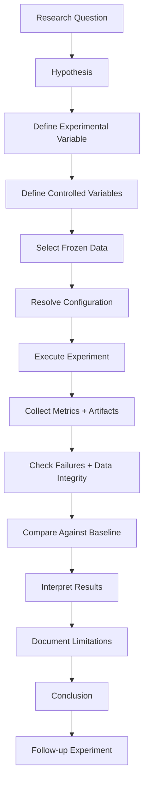
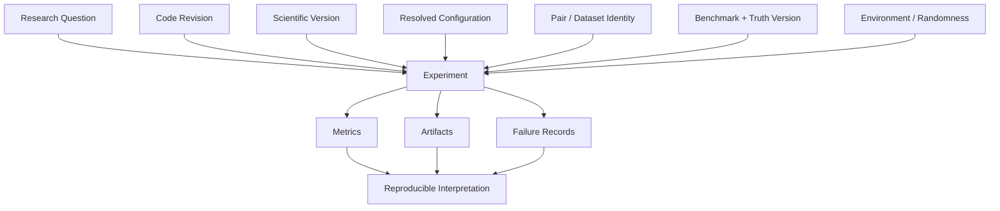
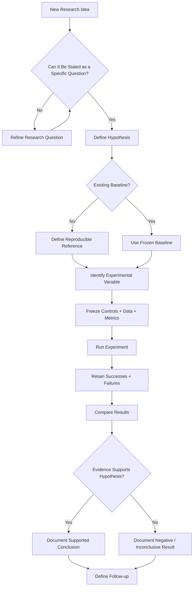

# Experiment Methodology

> **Document role:** ChandraMap research experiment design, execution, evaluation, comparison, and reproducibility methodology
> **Scope:** Scientific experiments for lunar image correspondence, registration, retrieval, sensor processing, geometry, refinement, and evaluation
> **Purpose:** Ensure that experimental conclusions remain controlled, traceable, comparable, reproducible, and scientifically defensible

---

## 1. Purpose

ChandraMap is a research and engineering project for lunar image correspondence and registration across imagery that may differ in:

- sensor;
- modality;
- spatial resolution;
- Sun angle;
- illumination;
- viewing geometry;
- map projection;
- processing level;
- image scale.

This document defines how ChandraMap research experiments should be:

- proposed;
- designed;
- executed;
- evaluated;
- recorded;
- compared;
- interpreted;
- reproduced.

The goal is not to maximize the number of experiments performed.

The goal is to ensure that each experiment answers a meaningful research question with enough control that its conclusion can be understood later.

> **ChandraMap research should prefer controlled experiments over large uncontrolled pipeline changes.**

> **Change one important factor at a time whenever practical.**

> **An experiment should make it possible to explain why a result changed, not merely show that it changed.**

> **A result without data identity, configuration, evaluation context, and provenance is not a reproducible scientific result.**

---

## 2. Methodology Goals

The experiment methodology should optimize for:

- scientific clarity;
- repeatability;
- comparability;
- traceability;
- controlled variables;
- realistic sensor assumptions;
- meaningful quantitative metrics;
- explicit failure reporting;
- reproducible execution;
- honest limitations;
- fair baseline comparison;
- version-aware interpretation.

The methodology should not optimize merely for:

- maximum match count;
- minimum visually estimated error;
- attractive overlays;
- pipeline complexity;
- number of algorithms tested;
- number of neural networks used;
- decorative confidence values;
- best-case screenshots;
- hiding difficult pairs;
- tuning until a benchmark looks favorable.

---

## 3. Core Experimental Principle

A poor experiment changes many factors simultaneously.

For example:

### Baseline

- SIFT;
- preprocessing A;
- scale policy A;
- affine transform;
- dataset A;
- metric definition A.

### Proposed Method

- learned matcher;
- preprocessing B;
- scale policy B;
- homography;
- dataset B;
- metric definition B.

If the second system performs better, the source of improvement is unclear.

A stronger experiment keeps the evaluation context fixed.

For example:

### Controlled Variables

- same image pairs;
- same preprocessing;
- same scale representation;
- same transform model;
- same geometric verification;
- same benchmark;
- same truth;
- same metrics.

### Experimental Variable

- matcher only.

Then separate experiments may study:

- preprocessing;
- physical scale handling;
- illumination representation;
- sensor routing;
- transform model;
- sub-pixel refinement;
- retrieval;
- learned matching.

Only after isolated effects are understood should successful components be combined.

---

## 4. Experimental Traceability

Every meaningful experiment should ideally be traceable through:

```text
Research Question
       ↓
Hypothesis
       ↓
Experiment Design
       ↓
Controlled Data
       ↓
Configuration
       ↓
Execution
       ↓
Artifacts + Metrics
       ↓
Analysis
       ↓
Conclusion
       ↓
Limitations
       ↓
Follow-up Question
```

A scientific result should not exist only as:

- a notebook cell;
- a screenshot;
- a terminal output;
- a chat message;
- an undocumented local file.

---

## 5. Research Experiment Lifecycle



---

# 6. Research Questions

Every experiment should begin with a research question.

A useful research question should be:

- specific;
- measurable;
- answerable with available data;
- connected to ChandraMap's scientific goals;
- narrow enough for controlled evaluation.

Poor question:

> Does advanced AI improve ChandraMap?

Better question:

> Does replacing classical SIFT correspondence with a specific learned local matcher reduce held-out registration error on the same known-overlap lunar pairs under otherwise unchanged preprocessing and geometry?

Another useful question:

> Does matching at more comparable effective ground scales improve geometric verification success on high scale-difference pairs?

---

# 7. Research Question Categories

ChandraMap research questions may fall into categories such as:

### Sensor Processing

- Does sensor-specific preprocessing improve correspondence?
- Which fixed 2D representation of IIRS is most suitable for registration?

### Scale

- Does explicit physical-scale handling improve large-GSD-gap registration?

### Illumination

- Do structure-focused representations improve matching under different Sun angles?

### Matching

- Does another local matcher outperform the classical baseline?

### Geometry

- Is affine geometry sufficient for a given benchmark category?
- Does a homography reduce systematic residual structure?

### Refinement

- Does sub-pixel refinement reduce independent check-point error?

### Retrieval

- Can a global descriptor retrieve the correct reference candidate?

### Evaluation

- How sensitive are conclusions to benchmark category or truth definition?

---

# 8. Hypotheses

A hypothesis should predict an observable outcome.

It should not merely state that a new technique is "better."

Example:

> **H1:** Matching source and reference representations at more comparable effective ground scales will increase geometric-verification success on scale-stress pairs relative to the classical baseline.

A stronger hypothesis may identify a metric:

> **H1:** Under the same pair set, preprocessing, matcher, and geometry, physical-scale matching will increase registration success rate and/or reduce held-out check-point error on the scale-stress category.

---

# 9. Null and Alternative Interpretation

Where useful, experiments may distinguish:

### Null expectation

The experimental change does not produce a meaningful difference under the tested conditions.

### Alternative expectation

The experimental change improves or otherwise changes the specified metric under the tested conditions.

ChandraMap does not require formal statistical hypothesis testing for every engineering experiment.

However, conclusions should still distinguish:

- clear measured differences;
- small uncertain differences;
- no observable difference;
- insufficient evidence.

---

# 10. Hypothesis Quality

A good hypothesis is:

- falsifiable;
- measurable;
- linked to defined metrics;
- limited to the evaluated population;
- independent of desired outcome.

Poor:

> LightGlue will solve lunar matching.

Better:

> On the defined modality-stress benchmark, the selected learned matcher will produce a higher successful-registration rate than the classical SIFT baseline under the same geometry and evaluation protocol.

---

# 11. Baseline Requirement

Most performance experiments should include an appropriate baseline.

The official research baseline is defined in:

- [`baseline.md`](baseline.md)

The baseline exists to answer:

> What can a simple classical method achieve before introducing the experimental enhancement?

An advanced method should not be evaluated only against itself.

---

# 12. Baseline Stability

Do not silently alter the baseline between comparisons.

A fair comparison requires the baseline definition to remain stable with respect to:

- preprocessing;
- input representation;
- feature extraction;
- matching;
- filtering;
- geometric verification;
- transform model;
- evaluation;
- configuration.

If the baseline changes, record the change explicitly.

---

# 13. Baseline vs Experimental Variant

A useful experiment can be represented as:

```text
Baseline B
+
One Controlled Change
=
Experimental Variant E
```

Example:

```text
B:
Basic preprocessing
→ SIFT
→ Descriptor Matching
→ Filtering
→ RANSAC
→ Affine

E:
Basic preprocessing
→ Learned Matcher
→ Filtering
→ RANSAC
→ Affine
```

The matcher changes.

The remaining major variables remain fixed.

---

# 14. Controlled Variables

Controlled variables are conditions intentionally kept unchanged so that the experimental variable can be interpreted.

Depending on the experiment, controls may include:

- image pair;
- source/reference roles;
- input representation;
- crop;
- scale;
- preprocessing;
- matcher;
- match filtering;
- transform model;
- RANSAC configuration;
- refinement behavior;
- evaluation truth;
- metric definitions;
- benchmark version;
- success criteria.

Not every experiment controls every variable.

The experiment definition should state what is held fixed.

---

# 15. Experimental Variable

The experimental variable is the intentional change being studied.

Examples include:

- matcher;
- preprocessing representation;
- pyramid-selection strategy;
- transform model;
- refinement method;
- global descriptor;
- IIRS 2D representation;
- illumination-handling technique.

Prefer one major experimental variable at a time when practical.

---

# 16. Confounding Variables

A confounding variable changes alongside the intended variable and may affect the result.

Example:

```text
Method A:
SIFT + affine

Method B:
LoFTR + homography
```

The result cannot cleanly identify whether improvement came from:

- LoFTR;
- homography;
- their interaction.

A better sequence is:

```text
SIFT + affine
vs
LoFTR + affine
```

followed by:

```text
LoFTR + affine
vs
LoFTR + homography
```

---

# 17. Ablation Experiments

Ablation experiments measure the contribution of individual components.

Conceptually:

| Experiment | Components                         |
| ---------- | ---------------------------------- |
| B0         | Classical baseline                 |
| E1         | B0 + physical scale handling       |
| E2         | E1 + sensor-specific preprocessing |
| E3         | E2 + alternative matcher           |
| E4         | E3 + sub-pixel refinement          |

The labels above are illustrative only.

Formal experiment identifiers should follow repository policy where defined.

---

# 18. Combination Experiments

After isolated improvements have evidence, they may be combined.

A complete pipeline experiment should answer:

> Do the individually useful components still improve the system when used together?

Component interactions may produce results different from isolated tests.

A combination experiment should therefore not replace individual ablations.

---

# 19. Experiment Scope

Before execution, define the experiment scope.

At minimum, document:

- question;
- hypothesis;
- baseline;
- experimental method;
- changed variable;
- controlled variables;
- data population;
- benchmark category;
- metrics;
- success/failure interpretation;
- expected artifacts.

A vague experiment such as:

> Try several matchers and see what works.

is exploratory work, not yet a controlled research experiment.

---

# 20. Exploratory vs Confirmatory Experiments

ChandraMap may use both.

## Exploratory

Used to discover:

- promising approaches;
- likely failure modes;
- useful parameter ranges;
- representation candidates.

Exploratory experiments may be flexible.

## Confirmatory

Used to evaluate a defined hypothesis under a frozen protocol.

Confirmatory experiments should avoid changing methodology after inspecting held-out results.

Do not present exploratory tuning results as if they came from a frozen evaluation protocol.

---

# 21. Development, Tuning, and Evaluation Data

Where data volume permits, distinguish among:

### Development Data

Used during implementation and debugging.

### Tuning Data

Used to select parameters or representations.

### Evaluation Data

Used for final controlled measurement.

Evaluation truth should not influence fitting or tuning when independence is required.

---

# 22. Truth Leakage

> **Evaluation truth must not be used to improve the method that it is intended to evaluate independently.**

Potential leakage includes using held-out truth for:

- parameter selection;
- transform fitting;
- representation selection;
- matcher selection on the same held-out set;
- refinement;
- stopping decisions;
- manual correspondence correction.

Truth leakage can create artificially strong results.

---

# 23. Image-Pair Selection

Image-pair selection must reflect the research question.

Pairs should not be selected only because the proposed method already succeeds on them.

A benchmark pair should ideally preserve:

- source identity;
- reference identity;
- overlap relationship;
- sensor identities;
- representation identities;
- relevant metadata;
- truth/check-point linkage;
- benchmark category.

See:

- [`../datasets/pair-definition.md`](../datasets/pair-definition.md)

---

# 24. Pair Selection Bias

Avoid reporting only:

- visually easy regions;
- pairs known to match;
- successful examples;
- favorable illumination;
- low scale difference.

A serious experiment should include failures where the benchmark defines them.

Do not drop a difficult pair simply because one method fails.

---

# 25. Fixed Pair Population

For direct comparison, run competing methods on the same valid pair population wherever practical.

Bad:

```text
Method A → 30 pairs
Method B → 18 easier pairs
```

followed by a direct average comparison.

Better:

```text
Method A → same frozen 30 pairs
Method B → same frozen 30 pairs
```

with failures retained.

---

# 26. Source and Reference Roles

Source/reference roles should remain fixed during a controlled experiment unless direction itself is being studied.

A pair should not silently reverse from:

```text
Chandrayaan source → LRO reference
```

to:

```text
LRO source → Chandrayaan reference
```

because that can change:

- transform direction;
- coordinate units;
- scale behavior;
- error interpretation.

---

# 27. Sensor-Aware Experimental Design

OHRC, TMC-2, and IIRS should not automatically be treated as equivalent image sources.

Experiments involving multiple sensors should distinguish:

- sensor;
- product type;
- representation;
- approximate/effective ground scale;
- modality;
- available metadata.

Do not interpret a mixed sensor average as sufficient evidence of performance on every sensor.

---

# 28. Sensor-Stratified Reporting

Where sample size permits, report results separately for relevant sensor groups.

For example:

| Group               | Purpose                                                |
| ------------------- | ------------------------------------------------------ |
| OHRC-related pairs  | High-detail visible-image behavior                     |
| TMC-2-related pairs | Medium-scale structural behavior                       |
| IIRS-derived pairs  | Cross-modality / hyperspectral representation behavior |

A single aggregate may hide severe sensor-specific failure.

---

# 29. OHRC Experiments

OHRC experiments may investigate:

- scale differences against reference imagery;
- fine terrain correspondence;
- illumination differences;
- transformation accuracy.

High spatial resolution does not automatically imply easy matching.

Large viewpoint, illumination, and scale differences may still dominate.

---

# 30. TMC-2 Experiments

TMC-2 can support experiments involving:

- structural matching;
- medium-scale registration;
- scale-gap analysis;
- illumination robustness.

Do not assume terrain or DEM information is present in every experimental product.

---

# 31. IIRS Experiments

IIRS experiments require explicit representation control.

A full hyperspectral source should not be silently converted into an unspecified 2D image.

Possible research variables may include:

- selected band;
- fixed composite;
- PCA representation;
- structural representation.

When comparing representations, keep downstream registration settings fixed where possible.

---

# 32. IIRS Representation Experiment

A controlled IIRS experiment could use:

### Same

- IIRS source product;
- reference image;
- crop;
- matcher;
- filtering;
- geometry;
- evaluation.

### Change

- registration-compatible IIRS representation.

Then compare:

- candidate count;
- inlier count;
- success rate;
- spatial coverage;
- held-out error.

This isolates the representation effect.

---

# 33. Reference Sensor Experiments

LRO NAC and WAC should remain distinguishable.

Do not combine them as a generic "LRO" category when sensor/reference characteristics matter to the research question.

Reference imagery should also not automatically be interpreted as independent truth.

---

# 34. Physical Scale Experiments

Scale experiments should study physical image information, not merely array dimensions.

A useful research question is:

> Does comparing source and reference imagery at more compatible effective ground scales improve registration?

The experiment should not interpret upsampling as recovered spatial detail.

---

# 35. Scale-Stress Categories

Scale-stress experiments may stratify pairs by increasing source/reference ground-scale difference where reliable scale metadata is available.

The exact categories should be defined by benchmark documentation rather than invented per experiment.

---

# 36. Scale Experiment Control

A scale-handling experiment should preferably keep constant:

- pair;
- preprocessing;
- matcher;
- geometry;
- filtering;
- evaluation.

Change only:

- scale-selection or pyramid policy.

This isolates the scale strategy.

---

# 37. Illumination Experiments

Illumination experiments should account for the fact that Sun angle affects shadow geometry, not only brightness.

A useful experiment may compare:

```text
raw/intensity representation
vs
structure-focused representation
```

under the same:

- pair set;
- matcher;
- scale;
- geometry;
- evaluation protocol.

---

# 38. Illumination Stress

Illumination stress cases should, where data permits, include:

- relatively similar lighting;
- increasingly different lighting;
- pronounced shadow differences.

The experiment should measure the degradation rather than assume illumination invariance.

---

# 39. Avoid Illumination Overclaims

A successful normalization operation does not establish:

- Sun-angle invariance;
- physical illumination correction;
- shadow invariance.

Those claims require benchmark evidence across appropriate conditions.

---

# 40. Modality-Stress Experiments

Cross-modality experiments should explicitly state:

- source modality;
- reference modality;
- derived representation;
- spatial-scale context.

Do not describe two arrays as "multimodal" evidence without preserving how they were produced.

---

# 41. Low-Feature Terrain Experiments

Low-feature or repetitive lunar terrain should be retained where it is part of the benchmark.

Such cases are useful for measuring:

- feature scarcity;
- false correspondence behavior;
- geometric verification failure;
- method confidence limitations.

Easy terrain alone provides an incomplete system picture.

---

# 42. Geometry Experiments

Geometry experiments should isolate transformation-model behavior.

Example:

### Same

- images;
- features;
- candidate correspondences;
- verification inputs;
- evaluation.

### Change

- affine;
- homography.

Evaluate whether the additional flexibility:

- improves held-out error;
- changes residual structure;
- increases unstable fitting;
- changes failure rate.

---

# 43. Geometry Complexity

A more flexible transformation is not automatically scientifically better.

A flexible model may:

- reduce fit residual;
- overfit sparse control;
- distort poorly supported regions;
- produce attractive overlays despite weak correspondences.

Prefer the simplest model that adequately represents the controlled case.

---

# 44. Residual Analysis

Residual vectors should be analyzed where available.

Useful questions include:

- Are errors randomly distributed?
- Are residuals larger near image edges?
- Is there a systematic direction?
- Does residual magnitude vary spatially?
- Does the pattern suggest a global model is insufficient?

Residual structure can guide later geometry experiments.

---

# 45. Sub-Pixel Refinement Experiments

Refinement experiments should preserve the correct scientific sequence:

```text
Candidate Correspondences
        ↓
RANSAC
        ↓
Verified Inliers
        ↓
Sub-Pixel Refinement
        ↓
Final Transform Refit
```

A refinement experiment should compare final evaluation before and after refinement using independent check points where available.

---

# 46. Refine Then Refit

Refining points without refitting the final transformation does not fully test refinement's effect on registration.

The experiment should evaluate the final transform estimated from the refined accepted points where that is the defined method.

---

# 47. Retrieval Experiments

If later ChandraMap versions introduce global retrieval, retrieval should be evaluated separately from registration.

Retrieval asks:

> Which reference candidate should be considered?

Registration asks:

> How do these two images geometrically align?

Do not combine the metrics.

---

# 48. Retrieval Metrics

Where formally defined, retrieval experiments may report metrics such as:

- Recall@1;
- Recall@K;
- ranking position;
- candidate-selection failure rate.

The exact metric definition belongs to evaluation documentation.

A retrieved candidate is not a verified registration.

---

# 49. Local Matcher Experiments

When comparing local matchers, keep downstream geometry and evaluation unchanged where practical.

Example:

```text
SIFT
vs
ALIKED + LightGlue
vs
LoFTR
```

should not simultaneously imply:

```text
different transform
different scale
different benchmark
different metric
```

unless those are separate experimental factors.

---

# 50. Learned Method Caution

Pretrained learned models should not automatically be assumed to be:

- lunar invariant;
- illumination invariant;
- scale invariant;
- cross-modality invariant.

Their actual performance must be measured.

Domain shift is part of the experiment.

---

# 51. Parameter Experiments

Parameter tuning should distinguish between:

- implementation correctness;
- exploratory sensitivity analysis;
- final frozen configuration.

Avoid selecting parameters by repeatedly inspecting held-out benchmark results.

---

# 52. Parameter Sweeps

When parameter sweeps are justified:

- define the search space before evaluating the final held-out benchmark where practical;
- record every tested configuration;
- avoid reporting only the winning run;
- document selection criterion;
- preserve the selected final configuration.

Do not create an invisible manual search process.

---

# 53. Hyperparameter Fairness

Comparing a heavily tuned proposed method against an untuned baseline may be unfair.

When tuning effort differs substantially, acknowledge it.

Where practical:

- use reasonable baseline defaults/frozen policy;
- tune both under comparable development conditions;
- evaluate both on the same held-out benchmark.

---

# 54. Experimental Data Integrity

Before execution, validate that:

- pair identities resolve;
- source/reference roles are correct;
- files correspond to expected products;
- coordinate metadata is consistent;
- truth/check points refer to the correct pair;
- no evaluation-only data have entered fitting inputs.

An experiment cannot correct an invalid dataset definition.

---

# 55. Dataset Preparation

Dataset preparation should remain reproducible.

See:

- [`../datasets/dataset-preparation.md`](../datasets/dataset-preparation.md)

Prepared representations should preserve lineage to original products.

Do not manually edit benchmark images in an undocumented way.

---

# 56. Raw Data Preservation

Raw mission inputs should not be modified in place.

Preparation should produce derived data while preserving original product identity.

This enables:

- rerunning preprocessing;
- testing alternative representations;
- auditing transformations;
- reproducing experiments.

---

# 57. Coordinate Spaces

Experiments should explicitly identify important coordinate spaces.

Examples may include:

- native source pixels;
- native reference pixels;
- crop coordinates;
- tile coordinates;
- pyramid-level coordinates;
- registered output coordinates;
- map/geospatial coordinates.

A result is difficult to interpret if its coordinate space is unknown.

---

# 58. x/y vs Row/Column

Computer-vision and array libraries may use different coordinate conventions.

Experiments should not silently mix:

```text
x, y
```

with:

```text
row, column
```

Coordinate-convention errors can produce plausible but incorrect results.

---

# 59. Transform Direction

The experiment record should identify transform direction.

For example:

```text
source → reference
```

if that is the project's defined direction.

Do not compare matrices from competing methods without confirming:

- same direction;
- same coordinate spaces;
- same normalization conventions.

---

# 60. Candidate and Inlier Terminology

Use consistent scientific stages:

```text
Candidate Correspondences
        ↓
Filtered Candidates
        ↓
Geometric Verification
        ↓
Verified Inliers
```

Do not label matcher output "correct matches" before geometric verification.

Do not label RANSAC inliers "ground truth."

---

# 61. Matching Evidence

Useful matching-stage measurements may include:

- candidate count;
- filtered-candidate count;
- inlier count;
- inlier ratio;
- spatial distribution.

More matches do not automatically imply better registration.

---

# 62. Spatial Coverage

Spatial coverage should measure correspondence support across the overlap region according to the authoritative metric definition.

Coverage should remain separate from accuracy.

Possible outcomes include:

```text
high accuracy + poor coverage
high coverage + poor accuracy
high accuracy + good coverage
```

These have different scientific interpretations.

---

# 63. Fit Residual vs Independent Error

> **Do not fit and evaluate the transformation on exactly the same points and call the resulting residual independent registration accuracy.**

Fit residual measures how well the fitted model explains the fitting population.

Independent check-point error measures how well the transformation predicts held-out truth.

Both can be reported, but they must remain distinguishable.

---

# 64. Check-Point Evaluation

See:

- [`../evaluation/checkpoint-evaluation.md`](../evaluation/checkpoint-evaluation.md)

Independent check points should remain excluded from transform fitting when the evaluation protocol defines them as held out.

Preserve:

- point identity;
- count;
- coordinate space;
- units;
- truth version.

---

# 65. RMSE

Where RMSE is reported, preserve its context.

A scientifically meaningful RMSE should identify:

- population;
- coordinate space;
- units;
- point count;
- availability status.

Avoid reporting only:

```text
RMSE = 0.42
```

without saying what the number measures.

---

# 66. Ground-Space Error

Metre-level or other physical error should only be reported where conversion is scientifically meaningful.

Do not assume:

```text
ground error = pixel error × approximate GSD
```

is universally valid.

Projection, local scale, image geometry, and truth definition may matter.

---

# 67. Success Rate

When an experiment contains multiple pairs, report scientific success/failure according to the authoritative success criteria.

Do not silently exclude failed pairs.

Failure rate is part of performance.

---

# 68. Runtime

Where runtime matters, record relevant execution context.

Runtime comparisons may depend on:

- hardware;
- input size;
- implementation;
- accelerator availability;
- software environment.

Avoid broad claims from uncontrolled machine comparisons.

---

# 69. Memory and Resource Measurements

Measure memory or accelerator usage only when the research question requires it and appropriate tooling exists.

Do not introduce arbitrary performance limits without a defined experimental need.

---

# 70. Metric Selection

Metrics should answer the research question.

Avoid collecting metrics merely because they are available.

Typical ChandraMap metric categories may include:

| Stage        | Example Question                                               |
| ------------ | -------------------------------------------------------------- |
| Retrieval    | Was the correct region retrieved?                              |
| Matching     | How many candidates survived verification?                     |
| Geometry     | Is support spatially distributed?                              |
| Registration | How accurate is the transform on independent checks?           |
| Geospatial   | What ground error is supported by valid context?               |
| System       | How often does the pipeline succeed and how long does it take? |

Exact definitions belong to evaluation documentation.

---

# 71. Metric Consistency

Do not change metric definitions midway through a comparison.

For controlled comparison, preserve:

- formula;
- population;
- units;
- coordinate space;
- missing-value behavior.

If the metric definition changes, treat it as an evaluation-protocol change.

---

# 72. Missing Metrics

Distinguish:

- measured zero;
- unavailable;
- not applicable;
- not evaluated;
- failed before evaluation.

Do not convert unavailable evidence into `0`.

This can incorrectly improve aggregate statistics.

---

# 73. Scientific Failure Records

A valid experiment run may produce a scientific failure.

Examples include:

- insufficient features;
- insufficient candidate matches;
- geometric verification failure;
- degenerate model;
- refinement failure;
- registration failure;
- unavailable independent evaluation.

A failure is part of the result.

---

# 74. Failure Retention

> **Difficult failures must remain in the experiment record.**

Do not calculate performance only from successful examples unless the reported population is explicitly restricted and the overall failure rate is separately preserved.

---

# 75. Failure-Stage Analysis

Record the earliest reliably observed failure stage where supported.

Conceptually:

```text
Input
↓
Preprocessing
↓
Features
↓
Matching
↓
Verification
↓
Transform
↓
Registration
↓
Evaluation
```

Do not automatically assign a deeper root cause without evidence.

---

# 76. Root Cause vs Observed Failure

Example:

```text
Observed:
RANSAC failed to establish a valid model.
```

Possible causes might include:

- poor candidates;
- scale mismatch;
- modality difference;
- wrong candidate region;
- insufficient overlap.

The experiment should distinguish observed fact from inferred explanation.

---

# 77. Partial Results

Failed runs may still provide useful evidence such as:

- feature count;
- candidate count;
- filtering count;
- inlier count;
- failure stage;
- runtime;
- diagnostic artifacts.

Preserve such evidence where the result schema permits it.

Do not promote partial results to success.

---

# 78. Artifacts

Research artifacts may include:

- match visualizations;
- rejected/accepted correspondence plots;
- overlays;
- residual-vector plots;
- registered previews;
- tables;
- logs;
- timing summaries.

Artifacts support interpretation.

They should not become the sole scientific record.

---

# 79. Result vs Artifact

A **result** is structured scientific information.

An **artifact** is a generated representation.

For example:

```text
Result:
checkpoint RMSE = defined value with population/units/provenance

Artifact:
PNG overlay illustrating alignment
```

Both may be useful.

They are not interchangeable.

---

# 80. Artifact Traceability

Where important, artifacts should be traceable to:

- experiment;
- run;
- pair;
- configuration;
- method;
- code state.

Avoid anonymous files such as:

```text
final.png
best_result.png
new_output.png
```

for formal research evidence.

---

# 81. Large Artifacts

Do not automatically commit large experiment artifacts into normal Git history.

Follow repository structure and data/artifact policy.

See:

- [`../development/repository-structure.md`](../development/repository-structure.md)
- [`../data-licenses.md`](../data-licenses.md)

---

# 82. Experiment Configuration

Every formal experiment should resolve to a reproducible configuration.

The configuration may contain scientifically significant choices such as:

- sensor representation;
- preprocessing;
- scale strategy;
- feature method;
- matcher;
- filtering;
- geometric model;
- refinement;
- evaluation settings.

Do not invent undocumented defaults inside experiment code.

---

# 83. Resolved Configuration

Where configuration layering exists, record the resolved effective configuration rather than only the source file names.

For example, a run may combine:

```text
base config
+
version config
+
experiment override
```

The scientifically relevant result is the resolved behavior.

---

# 84. Hidden Defaults

Scientifically important hidden defaults undermine reproducibility.

If a default affects:

- matching;
- filtering;
- geometry;
- refinement;
- evaluation;

it should be identifiable from code/configuration and ideally recorded in formal provenance.

---

# 85. Randomness

Stochastic components should use controlled or recorded randomness where the implementation permits.

Potential stochastic stages include:

- RANSAC;
- data sampling;
- learned model operations;
- future retrieval/training procedures.

Do not invent a universal project seed.

---

# 86. Repeated Runs

If stochastic variation is large enough to affect conclusions, use repeated runs where scientifically justified.

Report:

- repeated measurements;
- aggregate behavior;
- variation.

Do not report only the most favorable stochastic outcome.

---

# 87. Statistical Reporting

Statistical summaries should match the experimental question and sample size.

Possible summaries may include:

- median;
- mean;
- standard deviation;
- percentile ranges;
- confidence intervals.

No single statistical summary is universally required.

Do not imply statistical certainty that the experiment design cannot support.

---

# 88. Pairwise Comparison

When two methods are evaluated on the same pair set, paired analysis is often more informative than comparing only independent global averages.

For each pair, ask:

```text
Did method B improve, worsen, or fail differently from method A?
```

This exposes heterogeneous behavior.

---

# 89. Aggregate Improvement Can Hide Regressions

An average improvement may hide severe degradation on a specific sensor or benchmark category.

Therefore inspect:

- overall result;
- per-category result;
- per-sensor result;
- per-pair result;
- failure changes.

---

# 90. Outliers

Do not remove experimental outliers solely because they reduce reported performance.

Outlier exclusion must have an independently defensible reason, such as:

- corrupted source data;
- invalid pair definition;
- evaluation truth error.

If excluded, document the reason.

---

# 91. Invalid Data vs Scientific Failure

Distinguish:

### Invalid Experiment Input

The pair should not have been part of the evaluated population.

### Scientific Failure

The pair is valid, but the method fails.

Do not relabel difficult valid failures as invalid data.

---

# 92. Benchmark Categories

Controlled evaluation may separate pairs into categories such as:

- easy known-overlap;
- illumination stress;
- scale stress;
- modality stress;
- geometry stress;
- low-feature terrain.

Use the authoritative benchmark category definitions.

See:

- [`../evaluation/benchmark-categories.md`](../evaluation/benchmark-categories.md)

---

# 93. Benchmark Versioning

A benchmark version should identify a controlled evaluation contract where the repository defines such versioning.

Changes that may affect comparability include:

- pair population;
- truth;
- category membership;
- metric definitions;
- success criteria;
- failure accounting.

Do not compare across incompatible benchmark versions without explaining the difference.

---

# 94. Benchmark Protocol

All formal performance experiments should follow:

- [`../evaluation/benchmark-protocol.md`](../evaluation/benchmark-protocol.md)

This research methodology explains how to design experiments.

The benchmark protocol defines the controlled evaluation contract.

---

# 95. Experiment vs Benchmark

An experiment may ask:

> Does representation A outperform representation B?

A benchmark answers:

> How does a method perform under the frozen evaluation protocol?

The same infrastructure may support both, but the intent differs.

---

# 96. Experiment vs Software Test

Tests verify implementation behavior.

Experiments investigate scientific behavior.

Do not replace unit/component/regression tests with research experiments.

See:

- [`../development/testing.md`](../development/testing.md)

---

# 97. Synthetic Experiments

Synthetic data may be useful for studying:

- geometry;
- noise sensitivity;
- controlled outlier rates;
- scale transformations;
- coordinate behavior.

Synthetic experiments must be clearly labeled as synthetic.

They do not establish real lunar robustness.

---

# 98. Real Lunar Experiments

Real lunar experiments should be used for scientific claims about actual registration conditions.

Real imagery introduces:

- genuine terrain structure;
- shadows;
- sensor response;
- resolution differences;
- projection effects;
- modality differences;
- processing artifacts.

These cannot be fully represented by synthetic tests.

---

# 99. Synthetic Augmentation

Synthetic augmentation can be useful for controlled stress testing.

Possible transformations may include:

- rotation;
- translation;
- scale;
- contrast alteration.

However, artificial intensity transformation should not automatically be called realistic Sun-angle simulation.

Physical illumination changes may alter shadow geometry.

---

# 100. Experiment Interpretation

Interpretation should answer:

1. What changed?
2. What metric changed?
3. On which population?
4. By how much?
5. Which cases improved?
6. Which cases worsened?
7. Which cases failed?
8. Does evidence support the hypothesis?
9. What limitations remain?

Avoid conclusions broader than the evaluated data.

---

# 101. Descriptive vs Causal Claims

A controlled one-factor experiment supports stronger attribution than an uncontrolled comparison.

Example:

> Under fixed preprocessing, geometry, data, and evaluation, matcher B produced lower held-out error than matcher A on this benchmark.

This is stronger than:

> The new pipeline is better because it uses matcher B.

When multiple components change, causal attribution becomes weaker.

---

# 102. No Universal "Best Method"

Different methods may perform differently across:

- sensors;
- illumination;
- scale;
- modality;
- terrain;
- runtime constraints.

Avoid declaring a universal winner from limited evidence.

Prefer category-specific conclusions.

---

# 103. Negative Results

Negative results are useful when the experiment is well controlled.

Examples:

- a learned matcher does not improve the benchmark;
- a preprocessing step reduces candidate stability;
- a homography lowers fit residual but worsens held-out error;
- a refinement method increases failure rate.

Do not hide negative results merely because they do not support the original hypothesis.

---

# 104. Failed Hypotheses

A failed hypothesis should produce:

- recorded experiment;
- observed evidence;
- plausible limitations;
- follow-up question where appropriate.

Research quality depends on learning from failures, not only accumulating improvements.

---

# 105. Reproducibility

A result should be reproducible enough that a future contributor can determine what was run.

Relevant provenance may include:

- experiment identity;
- code revision;
- scientific version;
- baseline version;
- benchmark version;
- source/reference identity;
- pair identity;
- truth version;
- resolved configuration;
- environment;
- randomness context;
- execution timestamp where useful.

---

# 106. Reproducibility Model



---

# 107. Git Revision

A Git revision identifies code state.

It does not identify the entire experiment.

A commit hash cannot by itself recover:

- dataset;
- pair selection;
- truth;
- configuration;
- environment;
- randomness.

Git revision is one provenance dimension.

---

# 108. Dirty Working Tree

Formal experiments produced from uncommitted code can be harder to reproduce.

Exploratory runs may use local modifications.

Formal reported experiments should ideally map to an identifiable code state or preserve sufficient dirty-state information where tooling supports it.

---

# 109. Environment

Where environment differences may affect reproducibility, record relevant information such as:

- language/runtime version;
- significant library versions;
- CPU/GPU context where relevant;
- operating environment;
- optional model/dependency versions.

Do not record irrelevant machine-specific details merely for completeness.

---

# 110. Learned Model Provenance

If learned methods are used, record enough information to identify the actual model.

Relevant information may include:

- model architecture;
- checkpoint identity;
- source;
- version;
- preprocessing expectation;
- optional training/fine-tuning provenance.

Do not compare "the same model" if different checkpoints were actually used.

---

# 111. Data Provenance

Every formal pair should remain traceable to its underlying products.

Relevant information may include:

- mission;
- instrument;
- product identity;
- derived representation;
- processing lineage.

See:

- [`../datasets/metadata.md`](../datasets/metadata.md)

---

# 112. Experiment Record

A formal experiment record should contain enough information to understand the research decision without rerunning the code immediately.

A conceptual structure is:

```markdown
# Experiment: <descriptive title>

## Research Question

...

## Hypothesis

...

## Baseline

...

## Experimental Change

...

## Controlled Variables

...

## Dataset / Pair Set

...

## Configuration

...

## Metrics

...

## Results

...

## Failure Cases

...

## Interpretation

...

## Limitations

...

## Conclusion

...

## Follow-Up

...
```

This is a conceptual template, not an imposed repository file format unless formally adopted.

---

# 113. Experiment Identifiers

Experiment identifiers should be stable enough for results and artifacts to reference the same experiment.

Do not invent a universal identifier format in this document.

Use repository-defined conventions where they exist.

---

# 114. Run Identity

One experiment may contain multiple runs.

A run represents one concrete execution using a resolved combination of:

- method;
- configuration;
- data;
- code state;
- randomness context.

Do not confuse an experiment with a single execution.

---

# 115. Experiment vs Run

Conceptually:

```text
Experiment:
Does matcher B improve over matcher A?

Run 1:
matcher A + pair set + config + seed/context

Run 2:
matcher B + same pair set + config + seed/context
```

The experiment interprets relationships between runs.

---

# 116. Artifacts and Results Organization

Experiment outputs should follow repository structure.

See:

- [`../development/repository-structure.md`](../development/repository-structure.md)

Avoid storing experiment data in arbitrary locations that cannot later be associated with the run.

---

# 117. Notebook Role

Notebooks are useful for:

- exploration;
- visualization;
- interactive analysis.

They should not be the only implementation of a formal reproducible experiment when reusable pipeline code is appropriate.

Stable research logic should move into maintainable modules or scripts according to architecture.

---

# 118. Notebook Reproducibility

A notebook result is difficult to trust if it depends on:

- hidden execution order;
- manually modified state;
- missing data;
- unrecorded configuration.

Formal results should not depend on an unknown notebook state.

---

# 119. Experiment Automation

Repeated formal experiments should be automatable where practical.

Automation reduces:

- manual transcription;
- pair omission;
- parameter inconsistency;
- selective reporting.

Do not automate a poorly defined methodology merely for convenience.

---

# 120. Configuration-Driven Experiments

Prefer experiment changes expressed through explicit configuration where architecture supports it.

This can improve:

- reproducibility;
- comparison;
- batch execution;
- provenance.

However, configuration should not become an unstructured collection of undocumented scientific switches.

---

# 121. Version-Aware Research

Experiments should state which ChandraMap scientific version they relate to.

Examples:

- validate a V1 assumption;
- compare a proposed V2 enhancement against V1;
- evaluate retrieval proposed for V3;
- study DEM-aware geometry proposed for V4.

Do not silently change historical V1 behavior while experimenting with later methods.

---

# 122. V1 Experiment Policy

V1 should remain the stable classical known-overlap baseline according to its version specification.

Experiments may:

- analyze V1;
- reproduce V1;
- compare against V1;
- diagnose V1 failures.

Experimental improvements should not automatically become V1 behavior.

---

# 123. V2/V3/V4 Experiments

Later-version experiments should identify their intended version scope.

Possible examples include:

- stronger local registration;
- retrieval;
- multimodal methods;
- DEM-aware geometry;
- uncertainty.

Do not treat proposed future behavior as already implemented.

---

# 124. Version Promotion

A promising experimental component should not become an official scientific-version feature solely because it succeeds on selected examples.

Promotion should consider:

- controlled benchmark evidence;
- failure behavior;
- reproducibility;
- implementation quality;
- architecture;
- dependencies;
- documentation;
- version specification.

---

# 125. Experiment Review Before Execution

Before a significant experiment, review:

- Is the question specific?
- Is the hypothesis measurable?
- Is the baseline appropriate?
- Is only one major factor changing?
- Is the pair population fixed?
- Are metrics defined?
- Is truth leakage prevented?
- Are outputs reproducible?

This can prevent wasted runs.

---

# 126. Experiment Review After Execution

After execution, verify:

- Were all intended pairs processed?
- Were failed pairs retained?
- Did any input unexpectedly change?
- Did configuration remain fixed?
- Were metrics computed in the intended spaces?
- Were missing values represented correctly?
- Did any run silently fall back?
- Are artifacts traceable?

Only then interpret performance.

---

# 127. Fair Baseline Comparison Checklist

- [ ] Same pair population
- [ ] Same source/reference roles
- [ ] Same truth
- [ ] Same benchmark version
- [ ] Same metric definitions
- [ ] Same success criteria
- [ ] Same reporting population
- [ ] Same geometry unless geometry is the variable
- [ ] Same preprocessing unless preprocessing is the variable
- [ ] Same scale strategy unless scale is the variable
- [ ] Same matcher unless matcher is the variable
- [ ] Same refinement policy unless refinement is the variable
- [ ] Failures retained for both methods

---

# 128. Experiment Planning Checklist

## Research Question

- [ ] Question is specific
- [ ] Question is scientifically relevant
- [ ] Question can be measured
- [ ] Question is narrow enough for controlled evaluation

## Hypothesis

- [ ] Hypothesis predicts an observable outcome
- [ ] Hypothesis identifies the expected metric/category where useful
- [ ] Hypothesis can be rejected by evidence

## Experimental Design

- [ ] Primary experimental variable is identified
- [ ] Controlled variables are listed
- [ ] Potential confounders are considered
- [ ] Baseline is defined
- [ ] Experiment type is identified as exploratory or confirmatory

## Data

- [ ] Pair set is identified
- [ ] Pair selection is not based only on success
- [ ] Source/reference direction is fixed
- [ ] Sensor/product identities are known
- [ ] Data lineage is traceable
- [ ] Data licensing is understood

## Truth / Evaluation

- [ ] Evaluation truth is identified
- [ ] Held-out truth is separated from fitting
- [ ] Metric definitions are fixed
- [ ] Metric units are defined
- [ ] Missing metric behavior is defined
- [ ] Failure handling is defined

## Reproducibility

- [ ] Code state is identifiable
- [ ] Configuration is resolvable
- [ ] Benchmark version is known
- [ ] Truth version is known where relevant
- [ ] Randomness is controlled or recorded where needed
- [ ] Environment context is recorded where meaningful

---

# 129. Execution Checklist

- [ ] Input pair identities match the planned experiment
- [ ] No unintended dataset substitutions occurred
- [ ] Resolved configuration matches the experiment definition
- [ ] Source/reference roles are correct
- [ ] Coordinate spaces remain valid
- [ ] Candidate/inlier semantics remain correct
- [ ] No hidden fallback converted failure into success
- [ ] All valid pairs were attempted
- [ ] Runtime/errors were recorded where needed
- [ ] Outputs are associated with the correct run

---

# 130. Evaluation Checklist

- [ ] All valid failures are retained
- [ ] Fit residual and check error remain distinct
- [ ] RANSAC inliers are not treated as truth
- [ ] RMSE population is identified
- [ ] RMSE units are identified
- [ ] Spatial coverage is evaluated separately from accuracy
- [ ] Ground-space error is used only with valid geospatial context
- [ ] Missing metrics remain unavailable
- [ ] Aggregate statistics identify their population
- [ ] Per-category behavior is reviewed
- [ ] Per-sensor behavior is reviewed where relevant

---

# 131. Interpretation Checklist

- [ ] Conclusion directly answers the research question
- [ ] Conclusion does not exceed evaluated evidence
- [ ] Improvements and regressions are both reported
- [ ] Negative results are retained
- [ ] Failure modes are discussed
- [ ] Confounding factors are acknowledged
- [ ] Limitations are explicit
- [ ] Follow-up questions are identified
- [ ] Scientific claims distinguish observation from inference

---

# 132. Experiment Anti-Patterns

Do **not**:

- change several major variables and attribute improvement to one;
- tune using held-out benchmark truth;
- remove failed pairs;
- manually alter difficult images without documenting it;
- compare different pair populations as if they were equivalent;
- compare metrics with different definitions;
- call candidate matches correct correspondences;
- call RANSAC inliers ground truth;
- report fit residual as independent accuracy;
- encode unavailable metrics as zero;
- claim Sun-angle invariance from brightness normalization;
- claim recovered physical detail from upsampling;
- mix NAC and WAC without preserving identity;
- treat all Chandrayaan-2 sensors as equivalent;
- silently choose the best IIRS representation per evaluation pair;
- silently choose the best transform model per pair;
- report only successful visualizations;
- select only the best stochastic run;
- hide runtime or complexity costs;
- change benchmark definitions while claiming method improvement;
- overwrite V1 methodology during later-version research;
- treat synthetic tests as proof of real lunar performance;
- use screenshots as the primary evidence;
- declare a universal best method from a narrow benchmark.

---

# 133. Claims to Avoid

Do not claim without appropriate controlled evidence:

- “The method is Sun-angle invariant.”
- “The method is scale invariant.”
- “The method works across all Chandrayaan sensors.”
- “The learned matcher is better.”
- “Homography is more accurate.”
- “The method achieves sub-pixel accuracy.”
- “The method achieves metre-level accuracy.”
- “IIRS is successfully registered in general.”
- “The system is robust to illumination.”
- “The system generalizes across the Moon.”
- “The method is state of the art.”

Prefer claims bounded by:

- benchmark;
- sensor;
- metric;
- pair population;
- experimental conditions.

---

# 134. Example of a Strong Conclusion

A strong experimental conclusion might state:

> Under the frozen scale-stress pair set, with preprocessing, SIFT matching, geometric verification, transform model, and evaluation unchanged, the tested physical-scale strategy increased successful registrations relative to the classical baseline. The improvement was concentrated in the larger scale-gap subset; illumination-stress failures remained largely unchanged.

This conclusion identifies:

- what changed;
- what stayed controlled;
- what improved;
- where;
- what did not improve.

---

# 135. Example of a Weak Conclusion

Avoid conclusions such as:

> The new pipeline is much more robust and accurate.

This does not specify:

- compared with what;
- which metric;
- which data;
- which sensor;
- which stress condition;
- which failures;
- whether the benchmark changed.

---

# 136. Negative-Result Example

A useful negative result might state:

> The tested preprocessing representation increased the candidate-match count but did not improve held-out check-point error and reduced geometric-verification success on several low-feature pairs. The hypothesis that more candidate matches would translate into more reliable registration was not supported under this benchmark.

This is scientifically more useful than reporting only the increased match count.

---

# 137. Experiment Decision Flow



---

# 138. Experiment Responsibility Table

| Element               | Responsibility                            |
| --------------------- | ----------------------------------------- |
| Research Question     | Defines what is being investigated        |
| Hypothesis            | Predicts measurable behavior              |
| Baseline              | Provides reference method                 |
| Experimental Variable | Defines intentional methodological change |
| Controlled Variables  | Prevent alternative explanations          |
| Pair Set              | Defines evaluated data population         |
| Benchmark Version     | Defines evaluation contract               |
| Configuration         | Defines exact method behavior             |
| Metrics               | Quantify relevant outcomes                |
| Artifacts             | Support inspection and diagnosis          |
| Failure Records       | Preserve unsuccessful scientific outcomes |
| Provenance            | Enables reproducibility                   |
| Interpretation        | Connects measurements to the hypothesis   |
| Limitation            | Defines what cannot be concluded          |

---

# 139. Change-Type Experimental Guidance

| Change              | Recommended Experimental Approach                                     |
| ------------------- | --------------------------------------------------------------------- |
| New preprocessing   | Same pairs/matcher/geometry; change preprocessing only                |
| New matcher         | Same representations/geometry/evaluation; change matcher only         |
| Scale strategy      | Same images/matcher/evaluation; change scale handling                 |
| Transform model     | Reuse same correspondence population where scientifically appropriate |
| Refinement          | Compare verified-transform result before/after refine → refit         |
| IIRS representation | Same IIRS products and downstream pipeline; change representation     |
| Retrieval           | Evaluate candidate ranking separately from local registration         |
| Metric definition   | Treat as evaluation-methodology change, not algorithm improvement     |
| Pair-set change     | Treat as benchmark change                                             |
| Truth change        | Treat as benchmark/evaluation governance change                       |
| Scientific config   | Treat as behavioral change where it affects outputs                   |

---

# 140. Methodology Limitations

Even a carefully controlled ChandraMap experiment has limitations.

Potential limitations include:

- limited availability of independent ground truth;
- small benchmark populations;
- uneven sensor coverage;
- differences in product processing;
- uncertain or incomplete metadata;
- hardware-dependent runtime;
- domain shift in learned methods;
- limited IIRS registration representations;
- incomplete coverage of illumination geometry;
- synthetic stress tests that do not fully reproduce physical lunar conditions.

These limitations should constrain conclusions.

---

# 141. When to Repeat an Experiment

Repeat an experiment when a change affects:

- method implementation;
- scientific configuration;
- benchmark definition;
- truth;
- metric formula;
- relevant dependency behavior;
- stochastic reproducibility;
- dataset preparation.

Do not assume old measurements remain valid after meaningful methodological changes.

---

# 142. When Results Remain Comparable

Historical results may remain comparable when:

- method definition is unchanged;
- benchmark is unchanged;
- truth is unchanged;
- metrics are unchanged;
- scientific configuration is unchanged;
- implementation change is genuinely behavior-preserving.

If uncertain, rerun rather than assuming comparability.

---

# 143. Experiment Maintenance

Experiment documentation should be updated when:

- hypothesis changes before formal evaluation;
- pair set changes;
- configuration changes;
- benchmark version changes;
- metric definition changes;
- discovered data problems invalidate results;
- a conclusion is superseded by better evidence.

Do not silently rewrite historical experiment conclusions.

Preserve why the interpretation changed.

---

# 144. AI-Assisted Research

AI coding or research agents must follow the same methodology.

An AI agent should not:

- invent benchmark results;
- invent experiment runs;
- claim metrics that were not measured;
- silently change multiple variables;
- discard failures;
- infer scientific improvement from code changes alone;
- treat screenshots as quantitative evidence.

AI-generated experiment code and analysis require the same provenance and review as human-generated work.

---

# 145. Research Integrity Principle

> **ChandraMap should prefer an honest, reproducible negative result over an impressive but uncontrolled positive result.**

The project benefits more from understanding exactly where a method fails than from producing unsupported claims of robustness.

---

# 146. Related Research Documentation

Read this methodology together with:

- [`README.md`](README.md)
- [`baseline.md`](baseline.md)
- [`research-questions.md`](research-questions.md)
- [`assumptions.md`](assumptions.md)
- [`known-limitations.md`](known-limitations.md)
- [`references.md`](references.md)

Their responsibilities are distinct:

| Document                    | Responsibility                                     |
| --------------------------- | -------------------------------------------------- |
| `baseline.md`               | Defines the official research reference method     |
| `research-questions.md`     | Defines major scientific questions                 |
| `assumptions.md`            | Records assumptions behind research                |
| `experiment-methodology.md` | Defines how experiments are conducted              |
| `known-limitations.md`      | Records current scientific/engineering limitations |
| `references.md`             | Maintains supporting literature and sources        |

---

# 147. Related Project Documentation

- [`../project/goals.md`](../project/goals.md)
- [`../project/non-goals.md`](../project/non-goals.md)
- [`../project/v1-scope.md`](../project/v1-scope.md)
- [`../project/terminology.md`](../project/terminology.md)
- [`../project/assumptions.md`](../project/assumptions.md)
- [`../project/limitations.md`](../project/limitations.md)

---

# 148. Related Version Documentation

- [`../versions/README.md`](../versions/README.md)
- [`../versions/v1/README.md`](../versions/v1/README.md)
- [`../versions/v1/specification.md`](../versions/v1/specification.md)
- [`../versions/v1/requirements.md`](../versions/v1/requirements.md)
- [`../versions/v1/pipeline.md`](../versions/v1/pipeline.md)
- [`../versions/v1/benchmark.md`](../versions/v1/benchmark.md)
- [`../versions/v1/acceptance-criteria.md`](../versions/v1/acceptance-criteria.md)
- [`../versions/v1/limitations.md`](../versions/v1/limitations.md)

---

# 149. Related Sensor Documentation

- [`../sensors/overview.md`](../sensors/overview.md)
- [`../sensors/ohrc.md`](../sensors/ohrc.md)
- [`../sensors/tmc2.md`](../sensors/tmc2.md)
- [`../sensors/iirs.md`](../sensors/iirs.md)
- [`../sensors/lro-nac.md`](../sensors/lro-nac.md)
- [`../sensors/lro-wac.md`](../sensors/lro-wac.md)

---

# 150. Related Dataset Documentation

- [`../datasets/README.md`](../datasets/README.md)
- [`../datasets/chandrayaan-2.md`](../datasets/chandrayaan-2.md)
- [`../datasets/lro.md`](../datasets/lro.md)
- [`../datasets/metadata.md`](../datasets/metadata.md)
- [`../datasets/data-format.md`](../datasets/data-format.md)
- [`../datasets/dataset-structure.md`](../datasets/dataset-structure.md)
- [`../datasets/dataset-preparation.md`](../datasets/dataset-preparation.md)
- [`../datasets/pair-definition.md`](../datasets/pair-definition.md)
- [`../datasets/ground-truth-preparation.md`](../datasets/ground-truth-preparation.md)
- [`../data-licenses.md`](../data-licenses.md)

---

# 151. Related Algorithm Documentation

- [`../algorithms/overview.md`](../algorithms/overview.md)
- [`../algorithms/sensor-routing.md`](../algorithms/sensor-routing.md)
- [`../algorithms/preprocessing.md`](../algorithms/preprocessing.md)
- [`../algorithms/illumination-handling.md`](../algorithms/illumination-handling.md)
- [`../algorithms/scale-pyramid.md`](../algorithms/scale-pyramid.md)
- [`../algorithms/sift.md`](../algorithms/sift.md)
- [`../algorithms/matching.md`](../algorithms/matching.md)
- [`../algorithms/match-filtering.md`](../algorithms/match-filtering.md)
- [`../algorithms/ransac.md`](../algorithms/ransac.md)
- [`../algorithms/transforms.md`](../algorithms/transforms.md)
- [`../algorithms/residual-analysis.md`](../algorithms/residual-analysis.md)
- [`../algorithms/subpixel-refinement.md`](../algorithms/subpixel-refinement.md)
- [`../algorithms/registration.md`](../algorithms/registration.md)

---

# 152. Related Evaluation Documentation

- [`../evaluation/README.md`](../evaluation/README.md)
- [`../evaluation/benchmark-protocol.md`](../evaluation/benchmark-protocol.md)
- [`../evaluation/benchmark-categories.md`](../evaluation/benchmark-categories.md)
- [`../evaluation/metrics.md`](../evaluation/metrics.md)
- [`../evaluation/ground-truth.md`](../evaluation/ground-truth.md)
- [`../evaluation/control-points.md`](../evaluation/control-points.md)
- [`../evaluation/checkpoint-evaluation.md`](../evaluation/checkpoint-evaluation.md)
- [`../evaluation/spatial-coverage.md`](../evaluation/spatial-coverage.md)
- [`../evaluation/stress-tests.md`](../evaluation/stress-tests.md)
- [`../evaluation/success-criteria.md`](../evaluation/success-criteria.md)
- [`../evaluation/failure-cases.md`](../evaluation/failure-cases.md)
- [`../evaluation/reproducibility.md`](../evaluation/reproducibility.md)

---

# 153. Related Development Documentation

- [`../development/repository-structure.md`](../development/repository-structure.md)
- [`../development/testing.md`](../development/testing.md)
- [`../development/benchmarking.md`](../development/benchmarking.md)
- [`../development/documentation-guide.md`](../development/documentation-guide.md)
- [`../development/git-workflow.md`](../development/git-workflow.md)

---

# 154. Final Research Methodology

The ChandraMap research process can be summarized as:

```text
Define a Specific Research Question
                ↓
Write a Measurable Hypothesis
                ↓
Select the Appropriate Baseline
                ↓
Change One Important Factor
                ↓
Freeze Data, Truth, Metrics, and Controls
                ↓
Run Every Valid Evaluation Pair
                ↓
Preserve Successes and Failures
                ↓
Measure Quantitative Outcomes
                ↓
Inspect Per-Pair and Per-Category Behavior
                ↓
Interpret Without Overclaiming
                ↓
Record Provenance and Limitations
                ↓
Decide the Next Controlled Experiment
```

The central methodological rule is:

> **Do not ask whether a pipeline looks more advanced. Ask whether a clearly identified change produces a measurable improvement under the same controlled conditions.**

And the corresponding research standard is:

> **A ChandraMap experiment is useful when another contributor can determine what question was asked, what changed, what stayed fixed, which data were evaluated, which failures occurred, what was measured, and how the conclusion was reached.**
