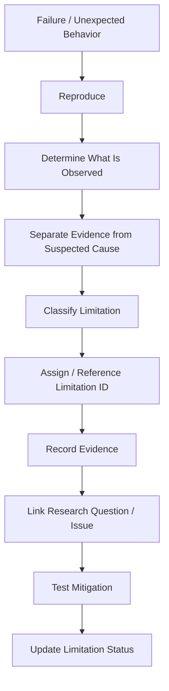

# Known Research Limitations

This document records the currently known, expected, unresolved, and research-relevant limitations that affect ChandraMap's lunar image correspondence, registration, benchmarking, and scientific interpretation.

The purpose of this document is not to make ChandraMap appear weaker. Its purpose is to define where the available evidence ends, which limitations arise from implementation choices, which arise from data or evaluation, and which are imposed by the underlying imaging physics.

ChandraMap is intended to produce reliable correspondences, transformations, registered imagery, and measurable registration evidence across lunar observations that may differ in sensor, scale, illumination, geometry, and modality. Those conditions create limitations that cannot be reduced to ordinary software bugs.

> **A scientifically credible registration system must state not only when it works, but also where its evidence becomes uncertain, incomplete, or invalid.**

> **A limitation is not automatically a bug. Some limitations arise from physics, missing information, data quality, or the assumptions of the chosen model.**

> **Software cannot recover lunar surface detail that the source sensor never captured.**

> **A visually convincing registration is not proof of quantitative accuracy.**

> **A limitation should not be marked as solved merely because a possible mitigation exists. Mitigation must itself be implemented and evaluated.**

---

## 1. Scope

This document focuses on research and scientific limitations involving:

- lunar image correspondence;
- multi-resolution matching;
- multi-sensor registration;
- illumination variation;
- sensor modality differences;
- physical information content;
- feature detection and matching;
- geometric verification;
- transformation models;
- sub-pixel refinement;
- spatial correspondence distribution;
- retrieval and localization;
- metadata;
- ground truth;
- metrics;
- benchmarks;
- generalization;
- runtime and scalability;
- reproducibility;
- implementation maturity.

Project-wide product, deployment, roadmap, or software-maturity limitations should remain primarily in [`../project/limitations.md`](../project/limitations.md).

---

# Limitation Terminology

## 2. Limitation Types

This document distinguishes the following concepts.

| Term                                  | Meaning                                                                                                       |
| ------------------------------------- | ------------------------------------------------------------------------------------------------------------- |
| **Known Limitation**                  | Restriction supported by physical reasoning, documentation, implementation evidence, or experimental evidence |
| **Current Implementation Limitation** | Capability that the current implementation does not support or supports only partially                        |
| **Experimental Limitation**           | Limitation discovered or suspected through research experimentation                                           |
| **Data Limitation**                   | Restriction caused by available imagery, metadata, coverage, resolution, or truth                             |
| **Method Limitation**                 | Restriction inherent in a selected algorithm, model, or representation                                        |
| **Evaluation Limitation**             | Condition that prevents complete or reliable measurement                                                      |
| **Open Risk**                         | Potential limitation not yet sufficiently evaluated                                                           |
| **Assumption**                        | Condition provisionally accepted for a current research design                                                |

Do not label every open research question as a confirmed limitation.

---

## 3. Limitation Identifiers

Important research limitations use stable identifiers of the form:

```text
RL-001
RL-002
RL-003
...
```

`RL` means **Research Limitation**.

These identifiers may be referenced from:

- research questions;
- experiment reports;
- benchmark reports;
- pull requests;
- issues;
- result records;
- architecture documentation;
- scientific-version documentation.

Once referenced externally, limitation identifiers should not be casually renumbered.

---

## 4. Limitation Status

The following status vocabulary may be used:

| Status                      | Meaning                                                                                             |
| --------------------------- | --------------------------------------------------------------------------------------------------- |
| **Confirmed**               | Limitation follows directly from established physical/data constraints or verified project behavior |
| **Observed**                | Limitation has been demonstrated by recorded project experiment evidence                            |
| **Expected**                | Limitation is scientifically plausible but not yet demonstrated in ChandraMap evaluation            |
| **Partially Characterized** | Evidence exists, but scope or severity is still incomplete                                          |
| **Under Investigation**     | Active experiments are investigating the limitation                                                 |
| **Mitigated**               | A verified mitigation reduces the limitation under defined conditions                               |
| **Superseded**              | Limitation description has been replaced by a more accurate record                                  |
| **Not Yet Evaluated**       | Relevant effect has not yet been measured                                                           |

Do not use **Observed**, **Mitigated**, or **Partially Characterized** without repository evidence.

---

## 5. Impact Classification

Impact classifications describe the potential consequence to scientific validity or system behavior.

| Impact       | Meaning                                                                                    |
| ------------ | ------------------------------------------------------------------------------------------ |
| **Critical** | Can invalidate scientific interpretation or make reliable registration impossible          |
| **High**     | Can substantially degrade correspondence, accuracy, benchmark validity, or reproducibility |
| **Medium**   | Can materially affect specific conditions or workflows                                     |
| **Low**      | Limited effect on core scientific interpretation                                           |

These are qualitative research-risk categories, not measured numeric scores.

Where severity has not yet been established, use **Unrated** rather than inventing precision.

---

# Limitation Summary

## 6. Current Limitation Register

| ID     | Limitation                                                            | Area                  | Impact   | Status            |
| ------ | --------------------------------------------------------------------- | --------------------- | -------- | ----------------- |
| RL-001 | Missing source information cannot be reconstructed                    | Physical imaging      | Critical | Confirmed         |
| RL-002 | Large GSD differences reduce shared terrain information               | Scale / sensor        | High     | Confirmed         |
| RL-003 | Extreme scale mismatch may defeat local feature matching              | Matching              | High     | Expected          |
| RL-004 | Illumination changes alter geometry of visible appearance             | Illumination          | High     | Confirmed         |
| RL-005 | Normalization cannot undo displaced shadows                           | Illumination          | High     | Confirmed         |
| RL-006 | Shadow occlusion can remove observable terrain information            | Illumination          | High     | Confirmed         |
| RL-007 | Different viewpoints create non-planar appearance changes             | Geometry              | High     | Confirmed         |
| RL-008 | One global planar transform may be insufficient                       | Geometry              | High     | Expected          |
| RL-009 | Flexible warping can hide poor correspondences                        | Geometry / evaluation | High     | Confirmed         |
| RL-010 | Sparse feature methods can fail on weak or ambiguous terrain          | Matching              | High     | Expected          |
| RL-011 | SIFT is not specifically lunar or multimodal invariant                | Matching              | Medium   | Confirmed         |
| RL-012 | Learned matchers may suffer lunar domain shift                        | Learned matching      | High     | Not Yet Evaluated |
| RL-013 | Repetitive lunar terrain can generate plausible false matches         | Matching              | High     | Expected          |
| RL-014 | Match confidence does not prove geometric correctness                 | Matching              | High     | Confirmed         |
| RL-015 | Raw match count does not measure registration quality                 | Evaluation            | High     | Confirmed         |
| RL-016 | Clustered inliers can weakly constrain image-wide registration        | Spatial support       | High     | Expected          |
| RL-017 | RANSAC depends on an appropriate model and usable candidates          | Geometry              | High     | Confirmed         |
| RL-018 | Sub-pixel refinement cannot exceed source information content         | Refinement            | High     | Confirmed         |
| RL-019 | Pixel error and ground-distance error are not interchangeable         | Evaluation            | Critical | Confirmed         |
| RL-020 | IIRS requires a scientifically defined 2D registration representation | IIRS / modality       | Critical | Confirmed         |
| RL-021 | IIRS representation selection can discard useful information          | IIRS / representation | High     | Expected          |
| RL-022 | Missing or uncertain metadata can limit scale/geospatial reasoning    | Metadata              | High     | Expected          |
| RL-023 | Product processing differences can confound algorithm comparison      | Data / products       | High     | Confirmed         |
| RL-024 | Known-overlap registration does not prove global localization         | Retrieval             | Critical | Confirmed         |
| RL-025 | Retrieval failure and local-registration failure are distinct         | Retrieval             | High     | Confirmed         |
| RL-026 | Independent ground truth may be incomplete or uncertain               | Evaluation            | Critical | Expected          |
| RL-027 | Fit-point RMSE can underestimate generalization error                 | Evaluation            | Critical | Confirmed         |
| RL-028 | Visual overlays are insufficient accuracy evidence                    | Evaluation            | Critical | Confirmed         |
| RL-029 | Small or biased benchmarks limit generalization claims                | Benchmarking          | High     | Confirmed         |
| RL-030 | Parameter tuning on evaluation pairs biases performance estimates     | Benchmarking          | Critical | Confirmed         |
| RL-031 | One aggregate score can hide sensor-specific failures                 | Benchmarking          | High     | Confirmed         |
| RL-032 | Success on one lunar region does not establish Moon-wide robustness   | Generalization        | High     | Confirmed         |
| RL-033 | Cross-mission generalization requires separate evidence               | Generalization        | High     | Confirmed         |
| RL-034 | Runtime and memory may increase substantially for advanced methods    | Efficiency            | Unrated  | Not Yet Evaluated |
| RL-035 | Whole-Moon operation is a separate scalability problem                | Scalability           | High     | Confirmed         |
| RL-036 | Incomplete provenance weakens reproducibility                         | Reproducibility       | High     | Confirmed         |
| RL-037 | External dependencies can introduce platform/numerical variability    | Software              | Medium   | Confirmed         |
| RL-038 | Failure detection itself requires benchmarked decision criteria       | Reliability           | High     | Not Yet Evaluated |

Statuses in this table are intentionally conservative. This document does not claim that ChandraMap has experimentally characterized every limitation listed here.

---

# Physical Imaging Limitations

## 7. RL-001 — Missing Physical Information Cannot Be Reconstructed

**Status:** Confirmed
**Impact:** Critical
**Area:** Physical imaging / sensor resolution

### Limitation

Software cannot recover lunar terrain detail that was never resolved by the source sensor.

Increasing array dimensions through interpolation creates additional image samples. It does not create new physical surface observations.

Therefore:

- enlarging IIRS does not make it OHRC-resolution imagery;
- resizing TMC-2 to NAC dimensions does not restore fine terrain features;
- using a high-resolution reference cannot create information missing from the source;
- sub-pixel localization cannot recover structures that were never resolved.

### Why It Exists

Every imaging instrument has finite spatial resolution and information bandwidth.

Features smaller than the effective resolving capability of the source product may not exist as recoverable structures in the observed image.

### Affected Components

- physical-scale handling;
- preprocessing;
- feature extraction;
- matching;
- refinement;
- accuracy interpretation.

### Affected Sensors / Data

Most important for large-resolution differences, especially involving coarse products such as IIRS.

### Practical Consequence

A matcher may fail because the corresponding fine-scale feature does not physically exist in both images.

### How It Should Be Measured

Scale-stress experiments should measure:

- verified inlier support;
- spatial coverage;
- independent error;
- failure rate;

as effective ground-scale separation increases.

### Current Mitigation

No current mitigation is asserted here.

### Possible Future Mitigation

Possible approaches include:

- matching at comparable effective scales;
- reference pyramids;
- coarse-to-fine methods;
- structural representations.

These strategies may reduce the mismatch but cannot reconstruct missing information.

### What Cannot Be Claimed

ChandraMap cannot claim that interpolation restores missing lunar terrain detail.

---

## 8. RL-002 — Ground Sample Distance Mismatch

**Status:** Confirmed
**Impact:** High
**Area:** Scale / sensor physics

### Limitation

ChandraMap must potentially compare imagery with substantially different Ground Sample Distance (GSD).

Project-level contextual values include approximately:

| Sensor  | Approximate Context                                   |
| ------- | ----------------------------------------------------- |
| OHRC    | ~0.25–0.32 m/pixel depending on product/documentation |
| TMC-2   | ~5 m/pixel                                            |
| IIRS    | ~80 m/pixel                                           |
| LRO NAC | often ~0.5–2 m/pixel depending on product/acquisition |
| LRO WAC | broader/coarser reference context                     |

> **Specific product metadata takes precedence over these approximate summaries.**

### Why It Exists

Large GSD ratios mean that fine-scale terrain structures may be represented by many pixels in one image but by only a few—or none—in another.

### Practical Consequence

Possible effects include:

- missing feature counterparts;
- inconsistent descriptors;
- weak candidate support;
- false correspondences;
- unstable refinement.

### Possible Future Mitigation

- reference pyramids;
- downsampling of the finer image;
- comparable effective-scale matching;
- coarse-to-fine correspondence.

These can reduce mismatch but do not remove the physical resolution limit.

---

## 9. RL-003 — Extreme Scale Mismatch Can Defeat Local Matching

**Status:** Expected
**Impact:** High
**Area:** Local correspondence

### Limitation

Local feature algorithms cannot be assumed to bridge arbitrarily large physical scale differences directly.

### Practical Consequence

Fine features may:

- disappear at coarse scale;
- merge into broader structures;
- change descriptor appearance;
- cease to provide repeatable keypoints.

### How It Should Be Measured

Compare correspondence and registration performance across increasing GSD-ratio categories while holding the matcher and evaluation protocol fixed.

### What Cannot Be Claimed

ChandraMap should not claim arbitrary scale invariance without benchmark evidence over the claimed range.

---

# Sensor-Specific Limitations

## 10. OHRC

OHRC provides very fine terrain detail, but high spatial resolution does not automatically make correspondence easy.

Expected concerns include:

- large illumination differences;
- highly local feature appearance;
- terrain-relief effects;
- viewing-geometry differences;
- many fine structures having no counterpart in coarser imagery;
- very large scale ratios against TMC-2 or IIRS.

High spatial resolution can increase available detail while also increasing the amount of detail that disappears when compared against a coarser sensor.

> **High resolution does not guarantee high registration accuracy.**

---

## 11. TMC-2

Expected TMC-2 research concerns include:

- substantially less fine detail than OHRC;
- scale differences relative to high-resolution NAC or OHRC products;
- repetitive crater structures;
- illumination-dependent terrain appearance;
- structural ambiguity at moderate resolution.

These are expected concerns unless experiments establish more specific conclusions.

Do not describe them as measured failure modes without evidence.

---

# IIRS Limitations

## 12. RL-020 — IIRS Is Not an Ordinary Grayscale Image

**Status:** Confirmed
**Impact:** Critical
**Area:** Cross-modal registration / representation

### Limitation

IIRS is an imaging infrared spectrometer / hyperspectral instrument, not simply a low-resolution grayscale camera.

Project-level context places IIRS at approximately:

- ~80 m/pixel spatial resolution;
- ~0.8–5.0 µm spectral range.

Exact product metadata remains authoritative.

### Why It Exists

A hyperspectral product contains a spectral dimension in addition to spatial dimensions.

A conventional 2D local matcher normally expects a 2D image-like representation, so a scientifically defined representation must be selected or derived first.

### Practical Consequence

Naïvely treating a full IIRS cube as ordinary grayscale can:

- collapse physically meaningful spectral structure arbitrarily;
- create unclear coordinate/representation semantics;
- make results difficult to reproduce;
- produce misleading comparisons with visible panchromatic imagery.

### How It Should Be Measured

IIRS experiments should record:

- parent product;
- selected bands/wavelengths/components;
- representation-generation method;
- spatial scale;
- reference product;
- registration metrics.

### Current Mitigation

No specific implemented representation is asserted here.

### Possible Future Mitigation

Candidate research representations may include:

- selected spectral bands;
- spectral composites;
- PCA components;
- gradient/edge representations;
- terrain-structure representations.

### What Cannot Be Claimed

ChandraMap should not claim automatic fine-resolution IIRS correspondence or ordinary grayscale equivalence without evidence.

---

## 13. RL-021 — IIRS Representation Selection Loses or Reweights Information

**Status:** Expected
**Impact:** High
**Area:** Representation design

### Limitation

Reducing an IIRS hyperspectral product to a 2D representation changes which information is retained.

Potential representations may emphasize different properties:

| Representation            | Possible Emphasis                         |
| ------------------------- | ----------------------------------------- |
| Selected band             | Spatial appearance at one spectral region |
| PCA component             | Dominant statistical variation            |
| Spectral composite        | Multi-band appearance                     |
| Gradient / edge map       | Spatial structure                         |
| Structural representation | Terrain morphology                        |

No representation should be called optimal until experiments support that claim.

### Practical Consequence

A representation suitable for registration may discard spectral information important for another scientific purpose.

Conversely, a spectrally meaningful representation may not provide the strongest terrain correspondence.

---

# Illumination Limitations

## 14. RL-004 — Sun-Angle Changes Alter Terrain Appearance

**Status:** Confirmed
**Impact:** High
**Area:** Illumination / correspondence

### Limitation

Lunar illumination variation is not simply a brightness-change problem.

Changes in Sun angle can alter:

- shadow direction;
- shadow length;
- crater-rim appearance;
- ridge visibility;
- local contrast;
- visible terrain structure.

### Why It Exists

Lunar topography produces strong illumination-dependent appearance because surface relief casts shadows whose geometry depends on lighting direction and elevation.

### Practical Consequence

A feature that appears distinctive under one illumination condition can look substantially different under another.

### How It Should Be Measured

Use dedicated Sun-angle stress experiments and compare:

- inlier count;
- inlier ratio;
- spatial coverage;
- check-point RMSE;
- success/failure rate.

### Possible Future Mitigation

Research directions may include:

- structural representations;
- shadow-aware processing;
- terrain-based features;
- illumination metadata;
- DEM-assisted methods.

### What Cannot Be Claimed

Brightness normalization alone does not demonstrate Sun-angle invariance.

---

## 15. RL-005 — Brightness Normalization Cannot Reposition Shadows

**Status:** Confirmed
**Impact:** High
**Area:** Preprocessing

Histogram equalization, local contrast enhancement, or intensity normalization may reduce radiometric differences.

They cannot move shadows back to the same spatial locations.

Therefore:

```text
normalized intensity
!=
identical illuminated terrain
```

Preprocessing may help some correspondence methods, but it cannot make two physically different illumination states geometrically identical.

---

## 16. RL-006 — Shadow Occlusion Removes Observable Information

**Status:** Confirmed
**Impact:** High
**Area:** Imaging physics

Deep shadow may hide terrain that is clearly visible in another observation.

If a terrain feature is completely unobserved in one image, a matcher cannot directly recover its appearance from that image alone.

Future approaches may use:

- terrain models;
- shadow masks;
- surrounding structure;
- illumination geometry;

but the underlying information loss remains physically relevant.

---

# Geometry Limitations

## 17. RL-007 — Viewpoint Differences Change Apparent Geometry

**Status:** Confirmed
**Impact:** High
**Area:** Viewing geometry

Different spacecraft viewing geometry can change:

- apparent terrain shape;
- foreshortening;
- crater geometry;
- relief displacement;
- local structure.

This limits the assumption that every pair differs only by a simple global 2D transform.

---

## 18. Terrain Relief

The lunar surface is three-dimensional.

Across relief-rich regions, local terrain height can cause different apparent displacement under different viewing geometries.

Consequences can include:

- spatially varying residuals;
- good alignment in one region but poor alignment elsewhere;
- systematic residual direction;
- inadequacy of a single transform.

---

## 19. RL-008 — Global Homography Limitation

**Status:** Expected
**Impact:** High
**Area:** Transformation model

### Limitation

A homography can be useful for local or compatible map-projected imagery but is not universally correct for lunar registration.

Potential violations include:

- significant terrain relief;
- raw sensor geometry;
- large viewpoint differences;
- projection differences;
- large image extent;
- locally varying distortion.

### How It Should Be Measured

Inspect:

- independent check-point residuals;
- spatial residual-vector patterns;
- residual trends across the overlap.

Systematic spatial patterns may indicate that the transformation model is insufficient.

### What Cannot Be Claimed

A successful local homography fit does not prove that one homography correctly models all lunar imagery.

---

## 20. Affine-Model Limitation

Affine registration may be too restrictive when:

- projective effects are significant;
- terrain relief creates local deformation;
- source/reference projection differs;
- raw sensor geometry remains.

However, a more flexible model is not automatically better.

Use the simplest model supported by independent residual evidence.

---

## 21. RL-009 — Flexible Warping Can Hide Bad Correspondences

**Status:** Confirmed
**Impact:** High
**Area:** Registration / evaluation

Flexible local or piecewise warping can create a visually smooth overlay even when correspondence quality is poor.

Therefore:

> **Accurate, geometrically defensible, spatially distributed correspondences should precede flexible visual warping.**

A warped image is not independent evidence that the control points were correct.

---

# Feature and Matcher Limitations

## 22. RL-010 — Sparse Feature Detection Can Fail

**Status:** Expected
**Impact:** High
**Area:** Feature extraction

Classical sparse feature detectors may struggle when:

- terrain is smooth;
- texture is weak;
- shadows alter local structure;
- resolution differences are extreme;
- the same physical structures are not resolved in both images.

Possible consequences include:

- too few repeatable keypoints;
- insufficient correspondence support;
- clustered keypoints;
- unstable transformation estimation;
- complete registration failure.

The correct behavior may be to report failure rather than fabricate a transform.

---

## 23. RL-011 — SIFT Is Not Lunar-Invariant

**Status:** Confirmed
**Impact:** Medium
**Area:** Classical matching

SIFT is useful as a classical baseline because it is:

- interpretable;
- widely studied;
- rotation-aware;
- scale-aware within limits;
- reproducible.

It was not designed specifically to solve lunar cross-sensor or hyperspectral-visible registration.

Potential weaknesses include:

- severe illumination variation;
- large modality differences;
- extreme physical scale ratios;
- low texture;
- repetitive terrain.

Do not describe SIFT as fully lunar-, modality-, or Sun-angle-invariant.

---

## 24. ORB as a Possible Speed Baseline

If ORB is used in ChandraMap, it may provide an efficient comparison point.

It should not automatically be treated as the primary high-accuracy baseline without benchmark evidence.

Possible trade-offs between speed and robustness must be measured rather than assumed.

---

# Learned and Multimodal Matcher Limitations

## 25. RL-012 — Learned Matcher Domain Shift

**Status:** Not Yet Evaluated
**Impact:** High
**Area:** Learned correspondence

Methods such as:

- ALIKED + LightGlue;
- LoFTR;

should not be assumed to transfer perfectly from terrestrial training data to lunar imagery.

Potential domain-shift factors include:

- crater repetition;
- lack of terrestrial semantic structure;
- extreme shadows;
- high-contrast illumination;
- sensor modality differences;
- unusual scale ratios;
- low-texture terrain.

Their value must be established on lunar benchmark data.

---

## 26. Training-Domain Limitation

A model trained mostly on terrestrial imagery may not have learned the invariances required for lunar observations.

This does not mean such models will necessarily fail.

It means:

> **Lunar robustness must be demonstrated, not inferred from terrestrial benchmark performance.**

---

## 27. Remote-Sensing Structural Methods

Methods such as:

- RIFT;
- CFOG-style approaches;

may provide useful multimodal or structural properties.

However:

- implementation quality matters;
- runtime may differ significantly;
- parameterization may differ from local-feature methods;
- they may require different preprocessing;
- they are not guaranteed drop-in replacements.

Performance must be measured on the same compatible benchmark conditions.

---

# Terrain Ambiguity Limitations

## 28. RL-013 — Repetitive Lunar Terrain

**Status:** Expected
**Impact:** High
**Area:** Matching ambiguity

Lunar imagery may contain repeated structures such as:

- similar craters;
- crater rims;
- ridges;
- repetitive textured terrain.

Descriptor similarity can therefore produce plausible but incorrect correspondence candidates.

Geometric verification and spatial consistency are necessary, but not infallible.

---

## 29. Low-Feature Terrain

Smooth or weakly textured lunar terrain may not provide enough distinctive local features.

Possible consequences include:

- insufficient keypoints;
- very few verified inliers;
- clustered support;
- unstable transformations;
- local-registration failure.

Failure on such terrain may reflect insufficient observable structure rather than an implementation defect.

---

# Match-Quality Limitations

## 30. RL-014 — Matcher Confidence Is Not Geometric Proof

**Status:** Confirmed
**Impact:** High
**Area:** Matching

A descriptor or neural matcher score may indicate similarity according to the matcher.

It does not establish that the correspondence is geometrically correct.

A high-scoring match can still be:

- spatially incorrect;
- caused by repetitive terrain;
- inconsistent with other correspondences;
- incompatible with the selected transform.

Keep:

```text
Candidate Matches
```

separate from:

```text
Geometrically Verified Inliers
```

---

## 31. RL-015 — Raw Match Count Is Not Registration Quality

**Status:** Confirmed
**Impact:** High
**Area:** Evaluation

More matches are not automatically better.

For example:

```text
100 matches clustered around one crater
```

may constrain the image-wide transformation less reliably than:

```text
30 accurate matches distributed across the overlap
```

Match count must not be used as the sole scientific quality measure.

---

# Spatial Support Limitations

## 32. RL-016 — Clustered Correspondences

**Status:** Expected
**Impact:** High
**Area:** Spatial support

Highly clustered inliers may weakly constrain transformation behavior outside the local cluster.

Potential risks include:

- unstable extrapolation;
- unconstrained distant regions;
- misleadingly small local residuals;
- hidden large-scale alignment errors.

Potential measures include:

- grid coverage;
- convex-hull coverage;
- overlap-area coverage;
- spatial dispersion.

No fixed acceptance threshold is defined here.

---

# RANSAC Limitations

## 33. RL-017 — RANSAC Depends on Candidates and Model Choice

**Status:** Confirmed
**Impact:** High
**Area:** Geometric verification

RANSAC can reject outliers only within the assumptions of the model being fitted.

It depends on:

- enough valid candidate correspondences;
- adequate inlier distribution;
- an appropriate transformation family;
- suitable thresholds;
- stable numerical estimation.

RANSAC cannot make a fundamentally inappropriate model physically correct.

It also does not prove independent registration accuracy.

> **RANSAC inliers are model-consistent correspondences, not ground truth.**

---

# Sub-Pixel Limitations

## 34. RL-018 — Sub-Pixel Refinement Has an Information Limit

**Status:** Confirmed
**Impact:** High
**Area:** Refinement

Sub-pixel refinement can improve localization of already valid image structures.

It cannot:

- restore unresolved terrain;
- rescue fundamentally false matches;
- compensate for a severely wrong transform model;
- justify ground-distance precision beyond the source information.

---

## 35. Refinement Ordering

The scientifically defensible conceptual order is:

```text
Candidate Matches
→ Geometric Verification
→ Verified Inliers
→ Sub-Pixel Refinement
→ Final Transform Refit
→ Evaluation
```

Refining all unverified candidates risks improving the coordinates of incorrect matches rather than improving the registration.

After point refinement, the final transformation must be refitted to the refined coordinates.

---

# Pixel and Ground Accuracy Limitations

## 36. RL-019 — Pixel Error Is Not Ground Error

**Status:** Confirmed
**Impact:** Critical
**Area:** Evaluation

A source-image error such as:

```text
0.2 pixels
```

has different physical meaning for sensors with very different GSD.

For example, `0.2` source pixels on OHRC and `0.2` source pixels on IIRS do not correspond to the same ground distance.

Ground-distance conversion requires appropriate:

- product-specific GSD;
- projection;
- coordinate system;
- local geometry;
- reference truth.

Do not automatically multiply a pixel error by a generic sensor-resolution number and call the result geospatial accuracy.

---

# Metadata Limitations

## 37. RL-022 — Metadata May Be Missing or Uncertain

**Status:** Expected
**Impact:** High
**Area:** Metadata / geospatial reasoning

Not every product should be assumed to contain every useful metadata field.

Potentially useful information includes:

- latitude/longitude;
- footprint;
- GSD;
- projection;
- acquisition geometry;
- Sun geometry;
- viewing geometry;
- product level.

Missing metadata may make:

- search harder;
- physical-scale matching uncertain;
- geolocation weaker;
- ground-distance conversion invalid;
- geometry handling more complex.

Do not invent absent metadata.

---

# Product and Processing Limitations

## 38. Map-Projection State

Raw, calibrated, map-projected, and orthorectified products are not interchangeable.

If data is not map-projected or geometrically corrected, simple 2D transform assumptions may be weaker.

Additional processing may require:

- sensor models;
- planetary map projection;
- DEM information;
- photogrammetric correction.

Do not assume every mission product is already geometrically compatible.

---

## 39. RL-023 — Product Inconsistency

**Status:** Confirmed
**Impact:** High
**Area:** Data / experiment validity

Mission products may differ in:

- calibration state;
- processing level;
- map projection;
- datatype;
- metadata;
- spatial resolution;
- footprint;
- illumination;
- preprocessing history.

These differences can influence matching independently of the algorithm under study.

Experiments should therefore preserve product provenance.

---

# Local Registration vs Global Localization

## 40. RL-024 — Known-Overlap Registration Is Not Global Localization

**Status:** Confirmed
**Impact:** Critical
**Area:** System scope

Early or baseline experiments may use known overlapping source/reference pairs.

This is useful for controlled local-registration research.

However:

> **Success on known-overlap pairs does not establish that ChandraMap can locate an unknown image anywhere on the Moon.**

Local registration and global retrieval/localization are different scientific tasks.

---

# Retrieval Limitations

## 41. Global Retrieval

If approximate source location is unknown, a retrieval stage may be required.

A possible conceptual workflow is:

```text
Reference Imagery
→ Tiles / Scales
→ Global Descriptor
→ Vector Search
→ Top-K Candidate Regions
→ Local Registration
```

Retrieval introduces distinct failure modes:

- correct region absent from Top-K;
- descriptor domain shift;
- scale mismatch;
- incorrect candidate ranking;
- reference tiling problems;
- index/storage cost;
- search latency.

---

## 42. FAISS Limitation

If FAISS is used in future ChandraMap versions:

> **FAISS indexes and searches vectors; it does not understand lunar imagery by itself.**

Retrieval quality depends on:

- descriptor quality;
- reference tiling;
- scale representation;
- metadata filtering;
- index design.

FAISS itself should not be described as the lunar recognition or registration model.

---

## 43. RL-025 — Retrieval Failure vs Registration Failure

**Status:** Confirmed
**Impact:** High
**Area:** Evaluation architecture

A local registration algorithm cannot match the correct region if retrieval never supplies that region as a candidate.

Therefore distinguish:

```text
Retrieval Failure
```

from:

```text
Local Registration Failure
```

Use separate metrics such as:

- Recall@K for retrieval;
- RMSE/inlier/coverage measures for registration.

---

# Ground-Truth and Evaluation Limitations

## 44. RL-026 — Independent Ground Truth May Be Limited

**Status:** Expected
**Impact:** Critical
**Area:** Evaluation

Strong independent ground truth may not be available for every pair.

Potential sources can include:

- challenge-provided correspondences;
- independently verified control/check points;
- trusted geospatial products;
- carefully validated projected reference information.

If independent truth is weak or unavailable, final accuracy claims must be correspondingly limited.

---

## 45. RL-027 — Fit-Point RMSE Can Be Optimistic

**Status:** Confirmed
**Impact:** Critical
**Area:** Evaluation methodology

If the same points are used to:

1. estimate the transformation; and
2. evaluate that transformation,

the resulting error can underestimate performance on unseen locations.

Therefore:

```text
Fit-Point RMSE
!=
Independent Registration Accuracy
```

Prefer independent check-point evaluation where possible.

---

## 46. Check-Point Quality

Independent check points improve evaluation but can themselves contain:

- annotation error;
- localization uncertainty;
- projection error;
- limited spatial coverage;
- sensor-resolution uncertainty.

The uncertainty of the truth source should be documented.

---

# Visual Evaluation Limitations

## 47. RL-028 — Registered Overlays Can Look Better Than They Measure

**Status:** Confirmed
**Impact:** Critical
**Area:** Result interpretation

A registered overlay may appear visually convincing while still containing quantitative errors.

Possible reasons include:

- low display resolution;
- human tolerance to small offsets;
- local alignment hiding distant errors;
- clustered correspondences;
- flexible warping.

> **Visual output is a diagnostic artifact, not the primary scientific accuracy measurement.**

---

# Benchmark Limitations

## 48. RL-029 — Small Benchmarks Limit Generalization

**Status:** Confirmed
**Impact:** High
**Area:** Benchmarking

A small benchmark may be valuable during development but cannot represent the full diversity of lunar imagery.

As the project matures, evaluation should seek diversity across:

- sensors;
- terrain conditions;
- illumination differences;
- GSD differences;
- geometry conditions;
- modality differences;
- failure cases.

This document does not define a required number of benchmark pairs.

---

## 49. Benchmark Selection Bias

Manually selected pairs may unintentionally favor:

- obvious overlap;
- strong crater features;
- similar illumination;
- visually distinctive terrain;
- successful examples.

Benchmark selection methods should therefore be documented.

Do not report only successful cases.

---

## 50. RL-030 — Parameter-Tuning Bias

**Status:** Confirmed
**Impact:** Critical
**Area:** Benchmark validity

If algorithm parameters are tuned repeatedly against the same pairs used for final evaluation, reported performance may be optimistic.

Where sufficient data exists, separate:

```text
Development / Tuning Data
```

from:

```text
Final Evaluation Data
```

If the dataset is too small for a clean separation, document that limitation explicitly.

---

## 51. RL-031 — Cross-Sensor Aggregation Can Hide Failures

**Status:** Confirmed
**Impact:** High
**Area:** Benchmark reporting

OHRC, TMC-2, and IIRS differ significantly in:

- resolution;
- modality;
- information content;
- expected failure behavior.

A single average metric can hide severe sensor-specific weaknesses.

Prefer sensor-stratified reporting before interpreting a combined aggregate.

---

# Generalization Limitations

## 52. RL-032 — One Region Does Not Establish Moon-Wide Robustness

**Status:** Confirmed
**Impact:** High
**Area:** Generalization

Success on one crater field or one geographic region does not prove robust behavior across the Moon.

Potential terrain differences include:

- heavily cratered regions;
- smoother plains;
- high-relief terrain;
- low-feature terrain;
- repetitive crater fields.

Generalization must be measured across a defined benchmark population.

---

## 53. RL-033 — Cross-Mission Generalization Requires Separate Validation

**Status:** Confirmed
**Impact:** High
**Area:** Generalization

A method that works on Chandrayaan-2 ↔ LRO imagery cannot automatically be assumed to work on:

- Kaguya / SELENE;
- other lunar missions;
- other planets;
- unrelated sensor modalities.

Cross-mission and cross-planet generalization require separate experiments.

---

# Runtime and Scalability Limitations

## 54. RL-034 — Advanced Methods May Increase Compute Cost

**Status:** Not Yet Evaluated
**Impact:** Unrated
**Area:** Runtime / efficiency

Advanced correspondence or retrieval methods may increase:

- preprocessing cost;
- feature-extraction time;
- matching time;
- GPU requirements;
- memory use;
- storage requirements;
- retrieval-index size.

Accuracy and runtime should therefore be reported independently.

No current runtime values are asserted here.

---

## 55. Hardware Dependency

Learned matchers and large retrieval systems may depend on GPU or accelerator resources.

Runtime reported on one machine cannot automatically be generalized to:

- laptops;
- CPU-only environments;
- servers;
- cloud systems;
- future benchmark/judge hardware.

Performance reports should record relevant environment details.

---

## 56. RL-035 — Whole-Moon Scalability Is a Separate Engineering Problem

**Status:** Confirmed
**Impact:** High
**Area:** Scalability

Success on a limited number of known pairs does not prove scalability to the entire lunar surface.

Whole-Moon operation introduces challenges involving:

- data volume;
- tiling;
- pyramid construction;
- indexing;
- descriptor storage;
- metadata management;
- search latency;
- candidate ranking;
- cache/storage design.

Global-scale operation should be benchmarked independently from local registration.

---

## 57. Storage

High-resolution lunar imagery, reference pyramids, descriptors, experiment results, diagnostics, and artifacts can consume substantial storage.

Large generated outputs should follow repository data/artifact policy rather than being committed to Git by default.

---

# Reproducibility Limitations

## 58. RL-036 — Missing Provenance Weakens Reproducibility

**Status:** Confirmed
**Impact:** High
**Area:** Reproducibility

Experiments become difficult to reproduce when they fail to record:

- source/reference identifiers;
- product metadata;
- scientific configuration;
- code revision;
- dependency versions;
- random seeds where relevant;
- hardware where relevant;
- preprocessing;
- benchmark version;
- truth version.

A metric value without this context may not be scientifically comparable later.

---

## 59. RL-037 — Dependency and Platform Variability

**Status:** Confirmed
**Impact:** Medium
**Area:** Software reproducibility

External numerical, image-processing, geospatial, and machine-learning libraries may introduce:

- version incompatibility;
- changed APIs;
- numerical differences;
- CPU/GPU differences;
- platform-specific behavior;
- nondeterministic execution.

Dependency/environment context should be preserved for meaningful benchmark runs.

---

# Implementation-Status Limitations

## 60. Specification Is Not Implementation

A ChandraMap document or architecture diagram can define intended behavior without proving that behavior has been implemented.

Keep these states separate:

```text
Specified
!=
Implemented
!=
Tested
!=
Benchmarked
!=
Scientifically Validated
```

Do not infer completion solely from documentation presence.

Likewise, the existence of source code does not by itself establish scientific performance.

---

## 61. Placeholder Metrics

Never present decorative values such as:

- `92% confidence`;
- `95% accuracy`;
- star ratings;
- arbitrary quality scores;

as scientific results unless the metric is formally defined and measured.

Prefer explicit metrics such as:

- verified inlier count;
- inlier ratio;
- spatial coverage;
- independent check-point RMSE;
- Recall@K;
- runtime.

---

# Versioned Benchmark Limitations

## 62. Comparability Across Versions

ChandraMap's versioned research approach depends on fair comparisons.

Version comparisons become difficult or invalid if they silently change:

- pair population;
- truth data;
- evaluation metrics;
- failure policy;
- thresholds;
- preprocessing;
- coordinate conventions.

Where possible, scientific versions should be evaluated under a shared compatible benchmark protocol.

The exact definitions of V1, V2, V3, and V4 belong to canonical version documentation, not this file.

---

# Failure-Detection Limitations

## 63. RL-038 — Failure Detection Requires Its Own Evidence

**Status:** Not Yet Evaluated
**Impact:** High
**Area:** Reliability

A system may produce a numerical transform even when the registration is scientifically unreliable.

Possible warning signals include:

- very few verified inliers;
- highly clustered support;
- large residuals;
- invalid/unstable transformation;
- poor independent check error;
- inconsistent local residual patterns.

However, rejection thresholds must be benchmarked.

Do not invent them.

A failure detector can itself produce:

- false acceptance;
- false rejection.

Its performance therefore needs independent evaluation.

---

# Uncertainty Reporting

## 64. Unknown Values Should Stay Unknown

If the project does not know the:

- exact overlap;
- exact GSD;
- projection;
- product level;
- ground-truth uncertainty;
- viewing geometry;
- illumination metadata;

state that uncertainty explicitly.

Do not silently substitute an estimate as though it were authoritative metadata.

If an estimate is scientifically necessary, document:

- how it was estimated;
- assumptions;
- expected uncertainty;
- downstream consequences.

---

# Mitigable vs Fundamental Limitations

## 65. Limitations That Research May Reduce

Some limitations can potentially be reduced through engineering or research.

Examples include:

- poor scale handling;
- generic preprocessing;
- weak retrieval;
- insufficient failure detection;
- limited benchmark coverage;
- weak provenance;
- inadequate local refinement;
- poorly chosen transformation models.

These should be treated as research opportunities.

They should not be described as solved until the mitigation is implemented and evaluated.

---

## 66. Limitations That Cannot Be Fully Removed

Some limitations arise from unavailable information or physical imaging constraints.

Examples include:

- unresolved source terrain detail;
- complete shadow occlusion;
- insufficient spatial resolution;
- missing overlap;
- absent metadata;
- absent independent ground truth.

Software may reduce their operational impact.

It cannot always eliminate the underlying limitation.

---

# Limitation Mitigation Matrix

## 67. Current and Potential Mitigations

The table intentionally avoids claiming implementation that is not established in this document.

| Limitation                     | Current Mitigation                             | Future Research Direction                   | Remaining Risk                                  |
| ------------------------------ | ---------------------------------------------- | ------------------------------------------- | ----------------------------------------------- |
| Missing fine-scale information | Physical limit; no software recovery claimed   | Comparable-scale matching                   | Fine detail remains absent                      |
| Large GSD difference           | Not asserted here                              | Pyramids, downsampling, coarse-to-fine      | Shared structure may still be insufficient      |
| Sun-angle variation            | Not asserted here                              | Structural / shadow-aware representations   | Occluded structures remain unavailable          |
| IIRS modality difference       | Dedicated representation required conceptually | Band/PCA/composite/structural experiments   | Cross-modal gap may remain large                |
| Repetitive terrain             | Geometric verification conceptually relevant   | Stronger spatial/geometric consistency      | False matches may still survive                 |
| Clustered correspondences      | Coverage should be measured                    | Coverage-aware acceptance/evaluation        | Threshold selection remains empirical           |
| Planar-model inadequacy        | Residual analysis                              | Local or sensor-aware geometry              | More flexible models can overfit                |
| Weak ground truth              | Independent checks where available             | Better control/check-point preparation      | Truth uncertainty cannot be ignored             |
| Retrieval failure              | Separate retrieval evaluation                  | Better descriptors/metadata-assisted search | Correct region may still be missed              |
| Benchmark bias                 | Explicit pair selection/protocol               | Broader stratified benchmarks               | Complete Moon diversity is difficult to capture |
| Reproducibility gaps           | Record provenance                              | Automated experiment tracking               | External dependencies/data can still change     |
| Failure detection              | Not yet established here                       | Benchmark rejection criteria                | False acceptance/rejection                      |

---

# Stress-Test Mapping

## 68. Limitations to Benchmark Stress Cases

| Limitation                  | Relevant Stress Test                     |
| --------------------------- | ---------------------------------------- |
| Illumination variation      | Sun-angle stress                         |
| Large GSD difference        | Scale stress                             |
| IIRS / visible modality gap | Modality stress                          |
| Local geometric distortion  | Geometry stress                          |
| Weak texture                | Low-feature terrain                      |
| Repetitive crater patterns  | Repetitive-terrain stress                |
| Unknown location            | Retrieval stress                         |
| Sensor-specific behavior    | Per-sensor benchmark breakdown           |
| Ground-truth uncertainty    | Independent-evaluation audit             |
| Failure detection           | Success/failure classification benchmark |

This table defines research directions only. It contains no benchmark results.

---

# Limitations and Assumptions

## 69. Limitation vs Assumption

Where present, see [`assumptions.md`](assumptions.md).

An **assumption** is a condition provisionally accepted for a particular research design.

A **limitation** is a boundary that restricts behavior, evidence, or interpretation.

Example:

**Assumption**

> Suitable GSD metadata is available.

**Limitation**

> When reliable GSD metadata is unavailable, scale-aware comparison and ground-distance interpretation become more uncertain.

An assumption can expose a limitation when it is violated.

---

# Limitations and Research Questions

## 70. Limitations Generate Research Questions

See [`research-questions.md`](research-questions.md).

A limitation often motivates one or more experiments.

Example:

```text
Limitation
Large Sun-angle differences alter crater and shadow appearance
        ↓
Research Question
Do structural representations improve correspondence under illumination stress?
```

The existence of a research question does not mean the limitation has been solved.

---

# Limitations and Experimental Methodology

## 71. Limitations Should Shape Experiments

See [`experiment-methodology.md`](experiment-methodology.md).

Examples:

| Limitation             | Experimental Response                  |
| ---------------------- | -------------------------------------- |
| Scale mismatch         | Scale-stress benchmark                 |
| Illumination variation | Sun-angle stress benchmark             |
| IIRS modality          | Representation experiments             |
| Geometry mismatch      | Residual/model comparison              |
| Fit-point bias         | Independent check-point evaluation     |
| Match clustering       | Spatial-coverage analysis              |
| Retrieval uncertainty  | Recall@K evaluation                    |
| Generalization risk    | Multi-region / multi-sensor evaluation |

Experiments should be designed to characterize limitations, not merely produce favorable outputs.

---

# Limitations and the Baseline

## 72. Baseline Role

Where present, `baseline.md` should define the controlled reference methodology used in research comparisons.

A baseline is intentionally limited.

Possible baseline constraints may include:

- classical sparse features;
- relatively simple preprocessing;
- a global transformation model;
- no advanced global retrieval;
- limited sensor-specific behavior;
- limited cross-modal robustness.

These limitations are useful because they create a stable reference against which later methods can be measured.

Do not silently improve the baseline between experiments without recording the change.

---

# Research vs Project Limitations

## 73. Documentation Boundary

Use [`../project/limitations.md`](../project/limitations.md) for project-level boundaries such as:

- project scope;
- product/deployment maturity;
- unsupported workflows;
- broader software constraints;
- roadmap boundaries.

Use this document for research limitations such as:

- sensor physics;
- correspondence failure;
- registration geometry;
- data limitations;
- benchmark validity;
- evaluation uncertainty;
- generalization.

Where one limitation affects both areas, link rather than duplicate large explanations.

---

# Prominent Research Limitations

## 74. Essential Interpretation Rules

Readers should keep the following limitations in mind when interpreting ChandraMap results:

1. **Upsampling does not recover missing terrain detail.**
2. **Extreme GSD differences can make fine-scale correspondence physically impossible.**
3. **Sun-angle differences change shadow geometry, not just brightness.**
4. **IIRS is hyperspectral/imaging-infrared data and requires an explicit registration representation.**
5. **Pretrained terrestrial matchers are not automatically lunar invariant.**
6. **Raw match count does not prove correspondence quality.**
7. **Clustered inliers can provide weak global geometric support.**
8. **RANSAC can only verify correspondences relative to the selected model.**
9. **One affine transform or homography may not explain all lunar geometry.**
10. **Flexible warping can visually hide poor correspondences.**
11. **Sub-pixel refinement cannot reconstruct missing physical information.**
12. **Pixel error and ground-distance error are different quantities.**
13. **Missing metadata can materially change the registration/search problem.**
14. **Known-overlap registration does not prove global lunar localization.**
15. **Retrieval and local registration require separate evaluation.**
16. **A visually good overlay does not establish scientific accuracy.**
17. **RMSE on transform-fitting points can be overly optimistic.**
18. **Independent check points are preferable where available.**
19. **One successful image pair does not establish Moon-wide robustness.**
20. **Results from one sensor should not automatically be generalized to another.**

---

# Capabilities That Must Not Be Claimed as Solved

## 75. Unsupported Completion Claims

Unless future repository evidence establishes otherwise, do not claim that ChandraMap has fully solved:

- arbitrary Sun-angle differences;
- arbitrary scale differences;
- arbitrary sensor-modality differences;
- whole-Moon retrieval;
- guaranteed sub-pixel accuracy;
- universal cross-sensor correspondence;
- universal global homography registration;
- complete automatic failure detection;
- Moon-wide generalization;
- automatic robust IIRS registration;
- cross-mission generalization;
- real-time performance;
- production-scale indexing;
- every lunar terrain type.

These remain research or validation problems until measured evidence supports stronger conclusions.

---

# Limitation Discovery Process

## 76. Recording New Limitations

When unexpected behavior reveals a possible limitation, use a process such as:



Do not jump directly from a failed run to a broad causal conclusion.

---

## 77. Observed Failure vs Root Cause

Prefer:

> Geometric verification could not establish a valid model.

over:

> Sun angle caused the registration to fail.

unless an experiment isolates illumination as the cause.

The failure stage is observed evidence.

The proposed cause may be a hypothesis.

---

## 78. When to Add a New Limitation

Create a new `RL-XXX` entry when:

- the limitation is distinct from existing records;
- it materially affects scientific interpretation or system behavior;
- it can be described precisely;
- there is a clear reason to track it across experiments or versions.

Do not create a limitation ID for:

- every bug;
- every failed experiment;
- every unanswered research question;
- temporary development mistakes.

---

## 79. When to Update an Existing Limitation

Update an existing limitation when:

- stronger evidence appears;
- impact becomes better understood;
- an experiment characterizes its conditions;
- a mitigation is implemented;
- a mitigation is benchmarked;
- the limitation is narrowed or broadened by evidence.

Do not rewrite historical meaning solely to make current results appear stronger.

---

# Limitation Status Changes

## 80. Evidence Required

A limitation may move from:

```text
Expected
→ Observed
```

only when project evidence demonstrates it.

It may move from:

```text
Observed
→ Partially Characterized
```

when experiments define where and how strongly it occurs.

It may move to:

```text
Mitigated
```

only when a verified change reduces the limitation under defined conditions.

> **Mitigated does not mean eliminated.**

---

# Benchmark Interpretation

## 81. Limitations Must Accompany Benchmark Claims

When reporting benchmark results, relevant limitations should be disclosed.

Examples:

- a benchmark dominated by OHRC should not be interpreted as proof of IIRS performance;
- known-overlap results should not imply whole-Moon retrieval;
- fit-point residuals should not imply independent accuracy;
- a small benchmark should not imply Moon-wide generalization;
- runtime values should not be generalized beyond the measured environment.

---

## 82. Failed Pairs Matter

A benchmark should preserve scientifically valid failures.

Removing difficult pairs after observing the outcome can create misleading performance claims.

Failure categories should be analyzed rather than hidden.

---

# Versioned Research Limitations

## 83. Limitations May Differ by Scientific Version

A limitation can apply differently to different ChandraMap scientific versions.

For example:

- an early baseline may have limited sensor-aware preprocessing;
- a later version may mitigate scale mismatch;
- a retrieval-enabled version may introduce retrieval-specific failure modes.

Do not rewrite historical V1 limitations merely because a later version reduces them.

Version-specific documentation should preserve the scientific meaning of each milestone.

---

# Reproducibility Requirements for Limitation Evidence

## 84. Evidence Provenance

An experiment used to confirm or mitigate a limitation should ideally preserve:

- limitation ID;
- research-question ID;
- scientific version;
- source/reference identity;
- benchmark pair;
- configuration;
- code revision;
- product metadata;
- metric definitions;
- results;
- environment where relevant;
- conclusion.

This makes later status changes auditable.

---

# Limitations Review Checklist

## 85. Before Adding or Updating a Limitation

### Classification

- [ ] Limitation is distinct from an assumption
- [ ] Limitation is distinct from a temporary bug
- [ ] Limitation is distinct from an unanswered research question
- [ ] Correct limitation category is identified

### Evidence

- [ ] Status matches available evidence
- [ ] Observed is used only when evidence exists
- [ ] Expected concerns are not presented as measured facts
- [ ] Suspected cause is separated from observed failure

### Scientific Meaning

- [ ] Sensor information is described accurately
- [ ] Product metadata takes precedence over approximate summaries
- [ ] Scale and resolution are not confused with array size
- [ ] Candidate matches are not called verified truth
- [ ] Fit points are not described as independent checks
- [ ] Pixel and ground error are distinguished
- [ ] Visual alignment is not presented as quantitative accuracy

### Scope

- [ ] Affected component is clear
- [ ] Affected sensor/data is clear where relevant
- [ ] Practical consequence is explained
- [ ] Limitation does not overgeneralize beyond evidence

### Mitigation

- [ ] Current mitigation is only claimed if implemented
- [ ] Proposed mitigation is labeled as future/experimental
- [ ] Mitigation is not described as elimination without evidence
- [ ] Remaining risk is stated

### Documentation

- [ ] Related research question is linked where appropriate
- [ ] Experiment methodology is considered
- [ ] Project-level limitations are not duplicated unnecessarily
- [ ] No unsupported benchmark result is introduced

---

# Research Limitation Anti-Patterns

## 86. Avoid These Practices

Do not:

- describe unresolved research questions as confirmed limitations;
- describe expected concerns as observed failures;
- mark mitigation as implemented without repository evidence;
- claim upsampling restores terrain detail;
- treat IIRS as ordinary grayscale imagery;
- assume high spatial resolution guarantees easy matching;
- describe SIFT as fully lunar invariant;
- assume learned terrestrial matchers generalize automatically;
- call matcher confidence geometric truth;
- call RANSAC inliers independent truth;
- treat match count as accuracy;
- ignore correspondence distribution;
- use one homography as a universal lunar model;
- use flexible warps to hide weak control points;
- claim sub-pixel refinement exceeds sensor information limits;
- convert pixel error to metres using an approximate generic GSD;
- call known-overlap registration global localization;
- confuse retrieval failure with registration failure;
- call Recall@K registration accuracy;
- evaluate only fitting points and call it independent accuracy;
- use visual overlays as the primary validation;
- generalize from one successful region to the whole Moon;
- combine sensor results in a way that hides major sensor failures;
- tune parameters on final evaluation pairs without disclosure;
- remove failed valid benchmark pairs;
- fabricate benchmark values;
- invent limitation severity scores;
- describe planned mitigations as solved behavior.

---

# Relationship to Research Documentation

## 87. Research Overview

See [`README.md`](README.md) for the research-documentation entry point where applicable.

This file focuses specifically on boundaries, failure modes, and interpretation limits.

---

## 88. Research Questions

See [`research-questions.md`](research-questions.md).

Research questions define what ChandraMap wants to learn.

Limitations define conditions that constrain performance, evidence, or interpretation.

A limitation may motivate a research question, but the question does not automatically resolve the limitation.

---

## 89. Assumptions

See [`assumptions.md`](assumptions.md).

Assumptions define provisional conditions under which research is conducted.

When an assumption fails, it may expose or amplify a limitation.

---

## 90. Experiment Methodology

See [`experiment-methodology.md`](experiment-methodology.md).

Experiments should deliberately stress relevant limitations and preserve enough evidence to characterize them.

---

# Relationship to Project and Engineering Documentation

## 91. Project Limitations

See [`../project/limitations.md`](../project/limitations.md).

Project limitations define broad scope or maturity boundaries.

This file concentrates on scientific and research limitations.

---

## 92. Project Assumptions

See [`../project/assumptions.md`](../project/assumptions.md).

Project-level assumptions should not be restated here unless necessary to explain a research limitation.

---

## 93. Architecture

Relevant architecture documentation includes:

- [`../architecture/system-overview.md`](../architecture/system-overview.md)
- [`../architecture/v1-pipeline.md`](../architecture/v1-pipeline.md)
- [`../architecture/core-engine-architecture.md`](../architecture/core-engine-architecture.md)
- [`../architecture/data-flow.md`](../architecture/data-flow.md)
- [`../architecture/output-flow.md`](../architecture/output-flow.md)

Architecture may provide mitigation boundaries, but architectural intent should not be interpreted as evidence that a limitation is solved.

---

## 94. Sensor Documentation

Sensor-specific technical context should remain primarily in the relevant sensor documentation, including where present:

- `../sensors/overview.md`
- `../sensors/ohrc.md`
- `../sensors/tmc2.md`
- `../sensors/iirs.md`
- `../sensors/lro-nac.md`
- `../sensors/lro-wac.md`

This document should reference sensor facts only to explain limitations.

---

## 95. Algorithm Documentation

Relevant algorithm documentation may include:

- `../algorithms/preprocessing.md`
- `../algorithms/illumination-handling.md`
- `../algorithms/scale-pyramid.md`
- `../algorithms/matching.md`
- `../algorithms/match-filtering.md`
- `../algorithms/ransac.md`
- `../algorithms/transforms.md`
- `../algorithms/residual-analysis.md`
- `../algorithms/subpixel-refinement.md`
- `../algorithms/registration.md`

Algorithm documentation explains how a method works.

This file explains where that method can become unreliable or insufficient.

---

## 96. Evaluation Documentation

Relevant evaluation documentation may include:

- `../evaluation/README.md`
- `../evaluation/benchmark-protocol.md`
- `../evaluation/metrics.md`
- `../evaluation/ground-truth.md`
- `../evaluation/control-points.md`
- `../evaluation/checkpoint-evaluation.md`
- `../evaluation/spatial-coverage.md`
- `../evaluation/stress-tests.md`
- `../evaluation/failure-cases.md`
- `../evaluation/reproducibility.md`

Evaluation documentation defines how limitation effects should be measured.

---

# Final Research Principles

## 97. Interpretation Rules

ChandraMap's known limitations can be summarized by several durable principles:

1. **Physical information limits cannot be solved by resizing.**
2. **Resolution, modality, illumination, and geometry are separate problems.**
3. **Product metadata is more authoritative than approximate sensor summaries.**
4. **IIRS requires explicit representation design.**
5. **Sun-angle differences alter shadows and terrain visibility, not just brightness.**
6. **Sparse feature methods require repeatable observable structure.**
7. **Learned matchers need lunar-specific evaluation.**
8. **Matcher scores do not prove geometric correctness.**
9. **RANSAC verifies consistency with a model, not absolute truth.**
10. **Spatially clustered correspondences can produce misleadingly strong local evidence.**
11. **One global affine transform or homography may be insufficient for complex lunar geometry.**
12. **Flexible warping is not a substitute for correct correspondences.**
13. **Sub-pixel refinement cannot reconstruct absent terrain information.**
14. **Pixel-space and ground-space accuracy must not be conflated.**
15. **Independent check points provide stronger evidence than fit-point residuals.**
16. **Registered previews are diagnostic artifacts, not benchmark results.**
17. **Known-overlap registration and global retrieval are different tasks.**
18. **Retrieval metrics and registration metrics must remain separate.**
19. **A small benchmark limits the strength of generalization claims.**
20. **Failures should remain visible and measurable.**
21. **A scientific baseline is useful partly because its limitations are explicit.**
22. **Mitigated does not mean eliminated.**
23. **Specified, implemented, tested, benchmarked, and validated are different states.**
24. **Research credibility increases when uncertainty is stated rather than hidden.**

The objective of ChandraMap research is therefore not to claim that every limitation has been eliminated. It is to characterize these boundaries systematically, determine which can be reduced through engineering or research, preserve the ones imposed by physics or data, and ensure that every scientific claim remains proportional to the available evidence.

<!-- Source request specification: :contentReference[oaicite:0]{index=0} -->
