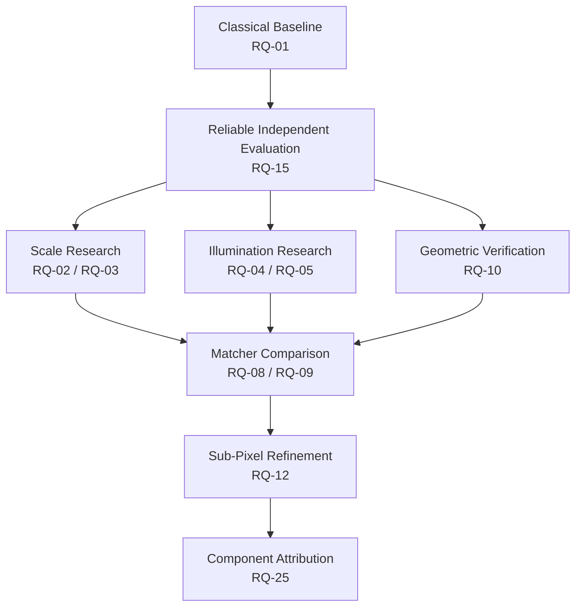
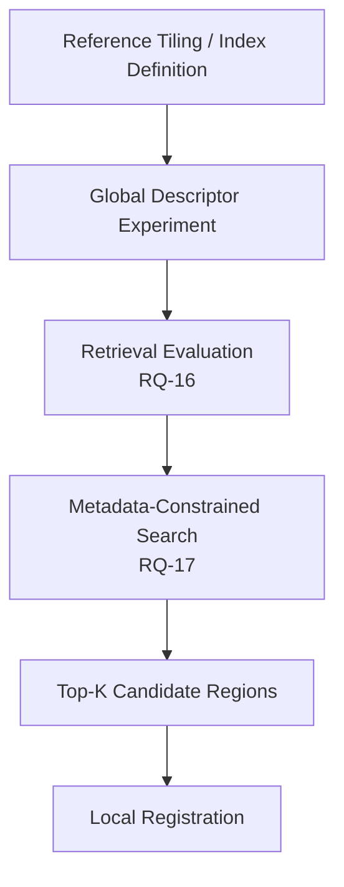
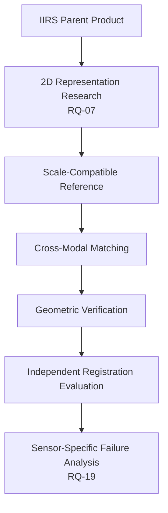
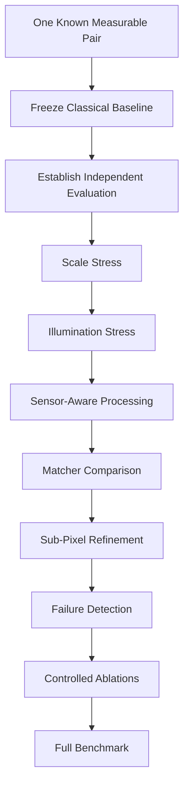

# Research Questions

This document defines the major research questions that guide ChandraMap's experiments, benchmarking, scientific development, and evidence collection.

ChandraMap investigates reliable lunar image correspondence and registration across differences in sensor, spatial resolution, ground sampling distance, illumination, viewing geometry, and modality. The purpose of this document is to convert broad goals such as _improve matching accuracy_ or _handle different sensors_ into questions that can be tested with controlled experiments.

The primary scientific objective is not merely to produce a visually attractive mosaic or overlay. ChandraMap should produce measurable evidence about:

- candidate correspondences;
- geometrically verified inliers;
- spatially distributed control support;
- transformation estimation;
- registered imagery;
- independent registration error where truth is available;
- localization where appropriate;
- failure detection;
- reproducibility;
- runtime and resource cost;
- scientifically attributable improvement over defined baselines.

> **A useful research question must be testable. It should identify what changes, what remains controlled, what is measured, and what evidence would support or challenge the hypothesis.**

> **Research questions are not conclusions. Hypotheses describe expectations that experiments may support, reject, or leave unresolved.**

> **More matches are not automatically better matches. Candidate count, geometric validity, spatial distribution, and independent registration accuracy answer different questions.**

> **Compare physical information, not pixel count. Upsampling creates additional samples, not missing lunar terrain detail.**

> **Failed experiments and failed image pairs are evidence. They should be retained and analyzed rather than hidden.**

---

## 1. Research Scope

ChandraMap studies correspondence between imagery of the same lunar region acquired under potentially different:

- instruments;
- missions;
- spatial resolutions;
- ground sampling distances;
- Sun angles;
- illumination conditions;
- viewing geometries;
- sensor modalities;
- processing states;
- terrain-detail levels.

Relevant project sensor contexts include:

| Sensor / Reference | Project-Level Context                                                                                         | Research Implication                                                                                                    |
| ------------------ | ------------------------------------------------------------------------------------------------------------- | ----------------------------------------------------------------------------------------------------------------------- |
| OHRC               | Very high-resolution panchromatic imagery; approximately 0.25–0.32 m/pixel depending on product/documentation | Supports fine terrain correspondence but can still be affected by illumination, viewpoint, and local-detail differences |
| TMC-2              | Panchromatic terrain imagery; approximately 5 m/pixel                                                         | Useful for regional structural correspondence and scale-robustness experiments                                          |
| IIRS               | Imaging infrared/hyperspectral spectrometer; approximately 80 m/pixel and approximately 0.8–5.0 µm            | Requires explicit investigation of registration-friendly 2D representations                                             |
| LRO NAC            | High-resolution lunar reference imagery; product scale varies and is often approximately 0.5–2 m/pixel        | Useful reference for fine/regional correspondence where appropriate                                                     |
| LRO WAC            | Broader-scale lunar reference/context imagery                                                                 | Relevant to regional or broader-scale experiments where scientifically appropriate                                      |

These are contextual summaries rather than universal product constants.

> **Product metadata is authoritative for the specific product used in an experiment.**

Optional future research may consider compatible lunar imagery from additional missions such as Kaguya/SELENE, but such data should not be described as integrated until the repository establishes that capability.

---

## 2. Scientific Outcome Hierarchy

ChandraMap research should preserve the distinction among different kinds of evidence.

```text
Candidate Correspondences
        ↓
Geometric Verification
        ↓
Verified / Model-Consistent Inliers
        ↓
Transformation Estimation
        ↓
Optional Local Refinement
        ↓
Final Transform
        ↓
Registered Product
        ↓
Independent Evaluation
```

The following are not equivalent:

```text
Candidate Match != Verified Inlier != Independent Ground Truth
```

```text
Fit Residual != Held-Out Check Error
```

```text
Spatial Coverage != Registration Accuracy
```

```text
Retrieval Success != Registration Accuracy
```

```text
Registered Preview != Quantitative Validation
```

---

# Research Methodology

## 3. Standard Research-Question Structure

Major ChandraMap research questions should generally define:

1. **Question** — what is being investigated?
2. **Why it matters** — why is the question scientifically or operationally important?
3. **Hypothesis** — what outcome is expected, without presenting it as fact?
4. **Independent variables** — what changes intentionally?
5. **Controlled variables** — what should remain consistent?
6. **Evaluation metrics** — what observations answer the question?
7. **Required data** — which image pairs, metadata, or truth are needed?
8. **Experimental design** — how will the comparison be conducted?
9. **Evidence supporting the hypothesis** — what result pattern would support it?
10. **Evidence challenging the hypothesis** — what result pattern would contradict it?
11. **Known limitations** — what confounders could affect interpretation?

Not every experiment requires formal statistical hypothesis testing, but each experiment should still permit a meaningful comparison.

---

## 4. Research Question Identifiers

Major questions use stable identifiers:

```text
RQ-01
RQ-02
RQ-03
...
```

These identifiers may be referenced from:

- experiment records;
- benchmark reports;
- issues;
- pull requests;
- notebooks;
- result metadata;
- research reports;
- future publications.

Once established and referenced externally, research-question IDs should not be renumbered casually.

If a question becomes obsolete, prefer marking its status rather than recycling its identifier for an unrelated question.

---

## 5. Research Question vs Hypothesis

A **research question** asks what happens.

Example:

> Does GSD-aware multi-scale matching improve correspondence quality when source and reference imagery have substantially different effective ground scales?

A **hypothesis** is a testable expectation.

Example:

> Matching the images at more comparable effective ground scales is expected to improve geometrically verified correspondence quality relative to naïvely enlarging the coarse image.

The hypothesis is not the conclusion.

Possible experiment outcomes include:

- evidence supports the hypothesis;
- evidence challenges the hypothesis;
- evidence is mixed;
- available data is insufficient;
- the experiment is confounded;
- the result is inconclusive.

---

## 6. Competing Hypotheses

Where useful, define a competing possibility.

Example:

**H1**

Sensor-aware preprocessing improves registration performance on cross-sensor pairs.

**Competing possibility**

Sensor-aware preprocessing does not materially improve the selected registration metrics relative to a common preprocessing baseline.

This structure discourages experiments designed only to confirm a preferred approach.

---

# Core Research Questions

## RQ-01 — Classical Baseline Performance

**Question**

How well can a straightforward classical feature-based registration pipeline perform on controlled lunar image pairs before lunar-specific improvements are introduced?

**Why it matters**

A stable baseline provides the reference against which later changes can be measured. Without it, an advanced method may appear successful while providing no demonstrated improvement over a simpler system.

The conceptual baseline is:

```text
Source + Known Reference
→ Basic Preprocessing
→ SIFT
→ Descriptor Matching
→ Match Filtering
→ RANSAC
→ Affine / Homography Candidate Model
→ Registration
→ Evaluation
```

**Hypothesis**

A classical feature-based pipeline is expected to register at least some controlled lunar pairs successfully while exposing limitations under larger scale, illumination, modality, and geometry differences.

**Independent variables**

For the baseline-establishment experiment, major algorithmic choices should be fixed rather than varied simultaneously.

Later experiments may vary:

- image-pair difficulty;
- sensor combination;
- illumination condition;
- scale difference.

**Controlled variables**

Where possible, hold constant:

- preprocessing;
- SIFT configuration;
- match filtering;
- geometric model;
- RANSAC configuration;
- evaluation procedure;
- truth/check-point definition.

**Required data**

Start with known-overlap source/reference pairs for which the relationship can be evaluated.

Include increasing difficulty only after one measurable end-to-end pair is working.

**Evaluation metrics**

Potential metrics include:

- candidate match count;
- verified inlier count;
- inlier ratio;
- spatial coverage;
- fit/reprojection residual;
- independent check-point RMSE where available;
- success/failure state;
- runtime.

**Experimental design**

Run the same baseline implementation across a controlled set of image pairs without pair-specific algorithm changes.

Preserve failures.

**Evidence that would support the hypothesis**

Evidence would include successful registration on simpler pairs together with measurable degradation or failure on known stress conditions.

**Evidence that would challenge the hypothesis**

If the baseline cannot produce scientifically useful correspondence even on carefully controlled known-overlap pairs, the assumed baseline configuration or data preparation may need reconsideration before advanced methods are compared.

**Known limitations**

A classical baseline is intended as a reference method. Poor performance under difficult multimodal or illumination conditions should not automatically be interpreted as an implementation defect.

---

## RQ-02 — Effect of Ground-Scale Difference

**Question**

How does correspondence quality change as the difference in effective ground sampling distance between source and reference imagery increases?

**Why it matters**

ChandraMap may compare sensors with very different physical resolutions. Matching images only by array dimensions can compare incompatible information content.

**Hypothesis**

Larger physical scale differences are expected to reduce repeatable fine-scale correspondence unless the finer representation is brought to a scale compatible with the source information content.

**Independent variables**

- source/reference GSD ratio;
- effective comparison scale.

**Controlled variables**

Where possible:

- image region;
- matcher;
- preprocessing;
- geometric verification;
- transformation model;
- evaluation protocol.

**Required data**

Pairs spanning:

- similar effective GSD;
- moderate GSD difference;
- large GSD difference;
- extreme cross-resolution cases where appropriate.

**Evaluation metrics**

- verified inlier count;
- inlier ratio;
- spatial coverage;
- check-point RMSE;
- registration success/failure rate.

**Experimental design**

Group pairs by effective scale relationship or construct controlled scale experiments from valid data.

Compare performance degradation as scale separation increases.

**Evidence that would support the hypothesis**

A systematic decrease in verified correspondence quality or independent registration performance as the scale ratio increases would support the hypothesis.

**Evidence that would challenge the hypothesis**

If performance remains similar across scale differences under controlled conditions, the selected method may already tolerate the investigated range or the stress range may be insufficient.

**Known limitations**

Resolution and terrain content are confounded: two sensors may differ not only in GSD but also modality, preprocessing, noise, and illumination.

> **Upsampling a lower-resolution image does not restore missing terrain detail.**

---

## RQ-03 — Multi-Scale Matching vs Naïve Resizing

**Question**

Does physically meaningful multi-scale matching outperform naïve resizing when source and reference imagery have substantially different GSD?

**Why it matters**

Simply enlarging a coarse source to match the dimensions of a fine reference can create an apparent geometric scale match without creating equivalent physical information.

**Hypothesis**

A reference pyramid or comparable-effective-ground-scale strategy is expected to provide more reliable correspondence than naïvely enlarging the lower-resolution image.

**Independent variables**

Scale-handling strategy:

- naïve resize;
- scale-aware pyramid/downsampling strategy.

**Controlled variables**

Keep constant where possible:

- same source/reference pairs;
- same preprocessing apart from required scale transformation;
- same local matcher;
- same filtering;
- same geometric verification;
- same transform model;
- same metrics.

**Required data**

Pairs with known overlap and substantial GSD difference.

**Evaluation metrics**

- candidate count;
- verified inlier count;
- inlier ratio;
- coverage;
- check-point RMSE;
- failure rate.

**Experimental design**

Run each pair through both scale-handling strategies while keeping downstream correspondence and geometry unchanged.

**Evidence that would support the hypothesis**

Consistent gains in verified correspondence quality, spatial support, or independent error under the scale-aware strategy.

**Evidence that would challenge the hypothesis**

No repeatable improvement, or worse performance, would indicate that the tested multi-scale design does not add useful value under the selected conditions.

**Known limitations**

The result can depend heavily on the chosen pyramid levels and source information content. Pyramid construction itself must remain traceable.

---

## RQ-04 — Sun-Angle and Illumination Robustness

**Question**

How much does correspondence performance degrade when the same lunar region is observed under substantially different illumination or Sun-angle conditions?

**Why it matters**

Lunar illumination differences alter far more than brightness. They can move shadows, alter crater-rim visibility, expose or hide terrain structure, and reverse local appearance cues.

**Hypothesis**

Increasing illumination-geometry difference is expected to reduce correspondence reliability for intensity-dependent methods.

**Independent variables**

Illumination difference between observations, using available and meaningful illumination metadata or controlled pair categories.

**Controlled variables**

Where practical:

- geographic region;
- source/reference sensors;
- physical comparison scale;
- matcher;
- geometric verification;
- evaluation protocol.

**Required data**

Pairs representing:

- similar illumination;
- moderate illumination difference;
- substantial illumination difference.

**Evaluation metrics**

- verified inlier count;
- inlier ratio;
- spatial coverage;
- check-point RMSE;
- success/failure rate;
- residual distribution.

**Experimental design**

Compare performance across illumination-difference groups while controlling other major variables as far as possible.

**Evidence that would support the hypothesis**

A repeatable degradation in verified correspondence or registration accuracy as illumination difference increases.

**Evidence that would challenge the hypothesis**

Stable performance across sufficiently different illumination conditions would challenge the expected sensitivity for the tested method.

**Known limitations**

Illumination differences may be correlated with viewpoint, sensor, acquisition date, and product-processing differences.

---

## RQ-05 — Structural Representations for Illumination Robustness

**Question**

Do structure-focused image representations improve correspondence under strong lunar illumination differences compared with raw grayscale intensity?

**Why it matters**

If illumination changes primarily disrupt intensity while some terrain structure remains stable, representations emphasizing structure may preserve more repeatable correspondence cues.

**Hypothesis**

At least some structure-focused representations may reduce sensitivity to strong intensity and shadow differences relative to raw grayscale matching.

**Independent variables**

Candidate representation, potentially including:

- raw grayscale;
- gradients;
- edges;
- phase-oriented representation;
- terrain/rim structure;
- another explicitly defined structural representation.

**Controlled variables**

Hold constant:

- image pairs;
- physical scale handling;
- local matcher where compatible;
- geometric verification;
- transform model;
- evaluation.

**Required data**

A controlled Sun-angle stress set with known overlap.

**Evaluation metrics**

- inlier count;
- inlier ratio;
- spatial coverage;
- check-point RMSE;
- failure rate.

**Experimental design**

Evaluate each representation on the same pairs using the same downstream methodology wherever the representation permits it.

**Evidence that would support the hypothesis**

A structural representation repeatedly improves independent registration evidence on high-illumination-difference pairs without materially degrading ordinary pairs.

**Evidence that would challenge the hypothesis**

No improvement, unstable improvement, or degradation relative to raw intensity would challenge the tested representation.

**Known limitations**

Different matchers may interact differently with different representations. A result for one matcher cannot automatically be generalized to all correspondence methods.

---

## RQ-06 — Sensor-Aware Preprocessing

**Question**

Does sensor-specific preprocessing improve registration compared with applying one identical preprocessing pipeline to all sensors?

**Why it matters**

OHRC, TMC-2, and IIRS do not produce physically equivalent image products. Treating them identically may discard useful information or violate modality assumptions.

**Hypothesis**

Sensor-aware preparation is expected to improve robustness on heterogeneous sensor pairs relative to a universal preprocessing path.

**Independent variables**

Preprocessing strategy:

- generic processing;
- sensor-aware processing.

**Controlled variables**

Where possible:

- source/reference pairs;
- local matcher;
- scale strategy;
- geometric verification;
- transform model;
- evaluation.

**Required data**

Representative pairs for relevant sensors, evaluated separately rather than only as one pooled average.

**Evaluation metrics**

- verified inlier count;
- inlier ratio;
- coverage;
- check-point RMSE;
- failure rate;
- preprocessing/runtime cost where relevant.

**Experimental design**

Compare common preprocessing with documented sensor-specific paths.

**Evidence that would support the hypothesis**

Repeatable gains in registration evidence for sensor-aware paths, especially on sensor combinations that differ strongly in modality or resolution.

**Evidence that would challenge the hypothesis**

Equivalent or worse performance would indicate that the additional sensor-specific processing has not demonstrated measurable value.

**Known limitations**

Different sensors may require different datasets and therefore may not permit perfectly paired comparisons across every experiment.

---

## RQ-07 — IIRS Registration Representation

**Question**

Which 2D representation of Chandrayaan-2 IIRS preserves the most useful terrain structure for registration against visible lunar reference imagery?

**Why it matters**

IIRS is hyperspectral/imaging-infrared data. A generic 2D matcher cannot be assumed to operate meaningfully on the full spectral cube.

**Hypothesis**

Some IIRS-derived 2D representations are expected to preserve terrain structure more suitable for cross-modal registration than arbitrary band selection or unexamined grayscale conversion.

**Independent variables**

Potential representation strategies may include:

- selected single band;
- selected wavelength range;
- PCA component;
- combination of PCA components;
- spectral composite;
- edge/gradient representation;
- structural representation;
- provided browse/derived representation where scientifically appropriate.

**Controlled variables**

Keep constant where possible:

- same parent IIRS products;
- same reference image;
- same scale-handling procedure;
- same matcher;
- same geometric verification;
- same evaluation.

**Required data**

IIRS products with corresponding reference coverage and enough metadata to identify the tested representation.

**Evaluation metrics**

- candidate count;
- verified inlier count;
- inlier ratio;
- spatial coverage;
- check-point RMSE where possible;
- success/failure rate.

**Experimental design**

Generate each representation from the same IIRS parent product and compare it against the same reference under a fixed local-registration pipeline.

Record:

- bands/wavelengths/components used;
- preprocessing;
- parent product;
- reference product;
- scale relationship;
- metric results.

**Evidence that would support the hypothesis**

One or more representations provide repeatably stronger verified registration evidence across multiple IIRS pairs.

**Evidence that would challenge the hypothesis**

No tested representation performs materially better than a simple baseline, or performance remains too unstable for reliable registration.

**Known limitations**

Spectral information and spatial structure serve different purposes. A representation useful for registration is not automatically the best representation for mineralogical analysis.

> **The full IIRS hyperspectral cube must not be silently treated as an ordinary grayscale image.**

---

## RQ-08 — Classical vs Learned Local Matching

**Question**

Do modern learned or multimodal correspondence methods outperform the classical SIFT baseline on difficult lunar image pairs?

**Why it matters**

More sophisticated correspondence methods may improve difficult cases, but added computational and dependency complexity is only justified if measurable benefit exists.

**Hypothesis**

Some learned or multimodal methods may outperform SIFT on specific lunar stress conditions, but the advantage is expected to depend on sensor, scale, illumination, and domain shift.

**Independent variables**

Matcher/correspondence method.

Candidate research directions may include:

- SIFT;
- RootSIFT;
- ALIKED + LightGlue;
- LoFTR;
- RIFT;
- CFOG-style structural methods.

These are experimental candidates, not assumed components of one combined pipeline.

**Controlled variables**

Use the same:

- benchmark pairs;
- preprocessing where method compatibility permits;
- scale handling;
- geometric verification;
- transform evaluation;
- truth/check data.

**Required data**

A benchmark containing both easy pairs and meaningful stress cases.

**Evaluation metrics**

- verified inlier count;
- inlier ratio;
- spatial coverage;
- independent check-point RMSE;
- success rate;
- runtime;
- memory use where practical.

**Experimental design**

Run each candidate method independently on the same compatible image pairs.

**Evidence that would support the hypothesis**

A method produces repeatable gains on defined difficult categories while maintaining acceptable failure behavior elsewhere.

**Evidence that would challenge the hypothesis**

The advanced method performs no better than the classical baseline, degrades important categories, or introduces disproportionate complexity without measurable benefit.

**Known limitations**

Pretrained terrestrial models are not automatically robust to lunar imagery.

ALIKED and LightGlue perform different roles: ALIKED provides sparse local features, while LightGlue matches compatible sparse features. LoFTR is detector-free and estimates correspondences directly.

---

## RQ-09 — Domain Shift of Learned Matchers

**Question**

How well do pretrained terrestrial image-matching models generalize to lunar terrain without lunar-specific training?

**Why it matters**

Many learned correspondence models are trained predominantly on terrestrial imagery. Lunar terrain differs in texture, illumination, repeated crater structure, color/spectral characteristics, and imaging geometry.

**Hypothesis**

Pretrained terrestrial models are expected to show non-uniform performance across lunar conditions rather than universal robustness.

**Independent variables**

Stress condition, potentially including:

- terrain type;
- sensor combination;
- scale difference;
- illumination difference;
- modality difference.

**Controlled variables**

For each model comparison, keep:

- benchmark pair;
- preprocessing policy;
- evaluation;
- geometric verification;

consistent where technically appropriate.

**Required data**

Representative lunar pairs covering multiple failure/stress categories.

**Evaluation metrics**

- verified inlier count;
- inlier ratio;
- coverage;
- check-point RMSE;
- failure rate;
- runtime.

**Experimental design**

Evaluate pretrained models without lunar-specific adaptation first, then separately investigate adaptation only if justified.

**Evidence that would support the hypothesis**

Strong performance on some categories combined with repeatable degradation on others would demonstrate domain-sensitive generalization.

**Evidence that would challenge the hypothesis**

Consistent robust performance across a sufficiently broad lunar benchmark would challenge the expected domain-shift concern.

**Known limitations**

Failure cannot automatically be attributed to domain shift if scale, preprocessing, or transform assumptions are also changing.

---

## RQ-10 — Value of Geometric Verification

**Question**

How much does robust geometric verification reduce false correspondences compared with relying on descriptor or matcher score alone?

**Why it matters**

A high matcher score does not prove that two points are geometrically consistent.

**Hypothesis**

Geometric verification is expected to reject a meaningful portion of false candidate matches and improve final transform reliability.

**Independent variables**

Correspondence selection:

- raw/filtered matcher candidates;
- geometrically verified inliers.

**Controlled variables**

- image pairs;
- feature/matching method;
- preprocessing;
- transform family;
- evaluation.

**Required data**

Pairs containing both straightforward and ambiguous terrain.

**Evaluation metrics**

- candidate count;
- verified inlier count;
- rejected-candidate count;
- independent registration error;
- spatial coverage;
- transform stability;
- failure rate.

**Experimental design**

Compare transformations estimated from candidate sets under clearly defined conditions with transformations produced after robust geometric verification.

**Evidence that would support the hypothesis**

Verification reduces false geometric support and improves independent transform evaluation.

**Evidence that would challenge the hypothesis**

If verification removes valid support without improving transform reliability, the chosen model or verification parameters may be inappropriate.

**Known limitations**

RANSAC inliers are model-consistent observations, not independent ground truth.

---

## RQ-11 — Transformation Model Selection

**Question**

Which transformation model is sufficient for different lunar registration conditions?

**Why it matters**

A model that is too simple may leave systematic residuals, while a highly flexible model may hide weak correspondence quality through overfitting.

**Hypothesis**

Simple global models may be sufficient for locally compatible or map-projected pairs, while stronger viewpoint, relief, or sensor-geometry effects may require more appropriate geometric treatment.

**Independent variables**

Potential transformation models may include:

- similarity;
- affine;
- homography;
- local/piecewise model;
- sensor-geometry-assisted approach.

**Controlled variables**

- correspondence set;
- pair;
- refinement policy;
- evaluation points;
- metric definitions.

**Required data**

Pairs spanning different geometry and terrain-relief conditions.

**Evaluation metrics**

- fit residual;
- independent check-point RMSE;
- residual-vector distribution;
- transform stability;
- failure rate.

**Experimental design**

Fit candidate models to equivalent correspondence support and examine both global error and spatial residual structure.

**Evidence that would support the hypothesis**

Simple models perform adequately on appropriate local cases while more complex geometry provides measurable improvement where systematic residual structure indicates model insufficiency.

**Evidence that would challenge the hypothesis**

Additional model complexity fails to improve independent evaluation or primarily improves only fit-point residuals.

**Known limitations**

A flexible warp can reduce visual misalignment without proving that correspondence points are accurate.

> **The Moon is not a flat poster. A single planar transform should not be presented as a universal lunar geometry model.**

---

## RQ-12 — Sub-Pixel Refinement

**Question**

Does local sub-pixel refinement of verified correspondences reduce independent registration error?

**Why it matters**

Initial feature locations may be limited by detector precision. Refining reliable tie points may improve the final transform, but only if refinement itself is stable and scientifically valid.

**Hypothesis**

Refining geometrically verified inliers is expected to reduce independent source-space registration error on suitable image pairs.

**Independent variables**

Refinement state:

- before sub-pixel refinement;
- after refinement and final transform refit.

**Controlled variables**

- same verified inlier population;
- same image pair;
- same transform family;
- same independent check points;
- same evaluation method.

**Required data**

Pairs with sufficient local structure and independent evaluation points where possible.

**Evaluation metrics**

- source-pixel check-point RMSE;
- residual distribution;
- transformation stability;
- refinement success/failure rate.

**Experimental design**

Preserve the order:

```text
Candidate Matches
→ RANSAC
→ Verified Inliers
→ Sub-Pixel Refinement
→ Final Transform Refit
→ Independent Evaluation
```

Compare evaluation before and after refinement.

**Evidence that would support the hypothesis**

Independent source-pixel error decreases consistently after refined coordinates are used to refit the transform.

**Evidence that would challenge the hypothesis**

Refinement does not improve independent error, destabilizes points, or improves only the fit residual.

**Known limitations**

Sub-pixel refinement cannot recover terrain information absent from the source sensor.

> **Refined points require a refitted final transform. Returning the original pre-refinement transform would invalidate the refinement claim.**

---

## RQ-13 — Spatial Distribution of Verified Matches

**Question**

How does the spatial distribution of verified correspondences affect registration reliability?

**Why it matters**

A large cluster of inliers around one local feature may constrain geometry less reliably than a smaller set distributed across the overlap.

**Hypothesis**

Better-distributed verified correspondences are expected to produce more stable and generalizable transformation estimates than highly clustered correspondences with similar point counts.

**Independent variables**

Spatial distribution of verified correspondence support.

**Controlled variables**

Where possible:

- pair;
- number of retained correspondences;
- transform family;
- evaluation points.

**Required data**

Pairs containing enough verified correspondences to construct different spatial-support subsets.

**Evaluation metrics**

Potential measures include:

- grid coverage;
- convex-hull coverage;
- overlap-area coverage;
- spatial dispersion;
- independent RMSE;
- transform sensitivity/stability.

**Experimental design**

Compare transformations estimated from correspondence subsets with similar counts but different spatial coverage.

**Evidence that would support the hypothesis**

Better-distributed support produces lower independent error or more stable transforms across perturbations.

**Evidence that would challenge the hypothesis**

No meaningful relationship exists between the tested coverage measures and transform reliability.

**Known limitations**

Coverage and point quality interact. Widely distributed incorrect correspondences are not useful.

---

## RQ-14 — Match Count vs Match Quality

**Question**

Is raw match count a reliable predictor of registration accuracy?

**Why it matters**

Systems can produce many weak, redundant, or clustered matches. Reporting only match count may therefore reward misleading behavior.

**Hypothesis**

Raw candidate count alone is expected to correlate poorly with independent registration quality compared with verified inlier quality and spatial distribution.

**Independent variables**

Observed match/inlier count and correspondence subset characteristics.

**Controlled variables**

When directly comparing configurations:

- benchmark pairs;
- evaluation points;
- transformation model;
- metric definitions.

**Required data**

Results across multiple methods, pairs, or configurations with independent evaluation.

**Evaluation metrics**

- candidate count;
- verified inlier count;
- inlier ratio;
- coverage;
- independent RMSE;
- transform stability.

**Experimental design**

Analyze whether increasing candidate/inlier counts corresponds consistently to improved independent registration metrics.

**Evidence that would support the hypothesis**

High match count sometimes coexists with poor coverage, poor independent RMSE, or unstable transforms.

**Evidence that would challenge the hypothesis**

If match count strongly and consistently predicts independent performance across the benchmark, it may be more informative than expected for that evaluation population.

**Known limitations**

Correlation does not establish causation.

---

## RQ-15 — Independent Evaluation Bias

**Question**

How different is registration error measured on transform-fitting points from error measured on independent check points?

**Why it matters**

Evaluating a transform only on the points used to estimate it can make accuracy appear better than performance on independent observations.

**Hypothesis**

Fit-point error is expected to be more optimistic than held-out check-point error, particularly for flexible models or weakly distributed control support.

**Independent variables**

Evaluation population:

- fit points;
- independent check points.

**Controlled variables**

- same final transform;
- same coordinate space;
- same metric definition;
- same pair.

**Required data**

Pairs with independent truth/check points where available.

**Evaluation metrics**

- fit-point RMSE;
- independent check-point RMSE;
- residual distribution.

**Experimental design**

Estimate the transform without check points, then evaluate both populations separately.

**Evidence that would support the hypothesis**

Check-point error is systematically larger or reveals failures not visible in fit-point residuals.

**Evidence that would challenge the hypothesis**

Fit and check errors remain close across sufficiently diverse data and models.

**Known limitations**

Independent evaluation requires trustworthy check data.

> **Fit points estimate the model; held-out check points evaluate it.**

---

# Retrieval and Localization Questions

## RQ-16 — Global Reference Retrieval

**Question**

When approximate lunar location is unknown, how reliably can ChandraMap retrieve the correct reference region before local registration?

**Why it matters**

Known-overlap registration and whole-region search are different problems. Global or regional retrieval may be necessary when metadata does not sufficiently constrain the location.

**Hypothesis**

A dedicated global representation and vector-retrieval stage may retrieve the true reference region within a small Top-K candidate set often enough to make downstream local registration practical.

**Independent variables**

Potential retrieval variables include:

- global descriptor;
- tile scale;
- number of reference scales;
- search-space size;
- candidate count K.

**Controlled variables**

For fair descriptor/index comparisons:

- reference database;
- tile definition;
- source query set;
- relevance/ground-truth definition.

**Required data**

A reference tile database with known correct query-to-region relationships.

**Evaluation metrics**

- Recall@1;
- Recall@5;
- Recall@K;
- correct-region rank;
- retrieval runtime;
- failure rate.

**Experimental design**

Conceptually:

```text
Reference Imagery
→ Tiles + Scales
→ Global Descriptors
→ Vector Index

Source Image
→ Same Descriptor Family
→ Top-K Candidate Search
```

Local registration should be evaluated separately after retrieval.

**Evidence that would support the hypothesis**

The correct region appears reliably within the selected Top-K candidate set under controlled retrieval evaluation.

**Evidence that would challenge the hypothesis**

True regions frequently fall outside practical candidate sets or retrieval cost is not useful compared with available metadata constraints.

**Known limitations**

Retrieval success does not prove local registration success.

---

## RQ-17 — Metadata-Assisted Search

**Question**

How much can available geospatial metadata reduce the search space and improve system efficiency without reducing correspondence reliability?

**Why it matters**

If location metadata already constrains the source image, solving unnecessary whole-Moon retrieval adds complexity and compute.

**Hypothesis**

Reliable geospatial metadata can reduce retrieval/search cost while preserving the correct reference region.

**Independent variables**

Search strategy:

- image-only broader search;
- metadata-constrained search.

Potential metadata includes:

- approximate latitude/longitude;
- footprint;
- map projection;
- pixel scale;
- acquisition geometry;
- illumination metadata.

**Controlled variables**

Where both strategies can be compared:

- source queries;
- reference database;
- local registration method;
- evaluation protocol.

**Required data**

Products containing trustworthy metadata and known corresponding reference regions.

**Evaluation metrics**

- search-space size;
- retrieval runtime;
- Recall@K where retrieval is required;
- local registration success;
- registration metrics after candidate selection.

**Experimental design**

Compare unconstrained or weakly constrained retrieval with search limited by valid metadata.

**Evidence that would support the hypothesis**

Metadata reduces candidate-search cost without excluding the correct region or degrading downstream registration.

**Evidence that would challenge the hypothesis**

Metadata constraints frequently remove the correct candidate because the metadata is inaccurate or incompatible.

**Known limitations**

Metadata availability and reliability can differ by product.

> **Using trustworthy metadata is sound engineering, not cheating.**

---

# Reliability Questions

## RQ-18 — Failure Detection

**Question**

Can ChandraMap identify unreliable registration attempts instead of always returning an apparently valid transform?

**Why it matters**

A system that returns a transform for every input can produce confident-looking but scientifically invalid outputs.

Reliable rejection may be more valuable than unconditional output.

**Hypothesis**

A combination of geometric and evaluation diagnostics can identify a substantial fraction of unreliable registrations.

**Independent variables**

Potential acceptance/rejection evidence may include:

- verified inlier count;
- inlier ratio;
- spatial coverage;
- residual distribution;
- transform validity/stability;
- local-region disagreement;
- independent check-point error where available;
- scale/geometry consistency.

**Controlled variables**

For signal evaluation:

- benchmark pair set;
- definition of registration success/failure;
- scientific method;
- truth/evaluation protocol.

**Required data**

A benchmark containing both successful and failed/difficult pairs.

**Evaluation metrics**

Depending on the formal failure-detection design:

- accepted/rejected counts;
- false acceptance;
- false rejection;
- failure rate;
- registration metrics of accepted outputs.

Do not invent classification thresholds before evidence exists.

**Experimental design**

Record diagnostic signals before knowing or applying independent evaluation outcomes, then analyze which signals distinguish reliable and unreliable results.

**Evidence that would support the hypothesis**

Poor registrations are rejected more consistently without discarding an unacceptable proportion of genuinely valid registrations.

**Evidence that would challenge the hypothesis**

Diagnostic signals fail to distinguish valid and invalid registrations reliably.

**Known limitations**

Failure-detection criteria can overfit the benchmark if tuned repeatedly against held-out outcomes.

---

## RQ-19 — Sensor-Specific Failure Modes

**Question**

Which failure modes dominate for OHRC, TMC-2, and IIRS respectively?

**Why it matters**

A single aggregate performance score can hide fundamentally different failure mechanisms across sensors.

**Hypothesis**

Different sensor characteristics are expected to produce different dominant difficulties.

Possible concerns include:

| Sensor | Expected Research Concerns — Not Measured Conclusions                                        |
| ------ | -------------------------------------------------------------------------------------------- |
| OHRC   | Fine local detail, illumination differences, viewpoint effects, highly local features        |
| TMC-2  | Moderate scale differences, terrain ambiguity, structural matching                           |
| IIRS   | Coarse spatial detail, cross-modal appearance, representation choice, missing fine structure |

**Independent variables**

Sensor/source category.

**Controlled variables**

Where possible:

- reference type;
- benchmark definition;
- metric definitions;
- scientific method being compared.

**Required data**

Multiple representative pairs for each sensor path.

**Evaluation metrics**

- failure rate by sensor;
- inlier statistics;
- coverage;
- independent RMSE;
- failure stage;
- diagnostic residuals.

**Experimental design**

Analyze performance and failure categories separately for each sensor rather than reporting only a pooled average.

**Evidence that would support the hypothesis**

Repeatable sensor-specific failure patterns emerge across multiple pairs.

**Evidence that would challenge the hypothesis**

Failure patterns are dominated by other variables such as terrain or illumination rather than sensor identity.

**Known limitations**

Sensor, resolution, modality, and dataset source are often correlated.

---

# Generalization Questions

## RQ-20 — Generalization Across Lunar Terrain

**Question**

Does a method that performs well in one lunar region remain reliable across different terrain conditions?

**Why it matters**

A system tuned to one crater field may not generalize to smoother or more repetitive terrain.

**Hypothesis**

Correspondence reliability is expected to vary with terrain structure and texture availability.

**Independent variables**

Terrain category according to repository-defined benchmark categories.

Potential descriptive categories, if later formalized, might include:

- densely cratered terrain;
- smooth plains;
- high-relief terrain;
- low-feature terrain;
- repetitive crater fields.

These should not become an official taxonomy unless the benchmark defines them.

**Controlled variables**

Within practical limits:

- scientific method;
- evaluation protocol;
- sensor pairing;
- scale category.

**Required data**

Geographically distinct image pairs spanning multiple terrain conditions.

**Evaluation metrics**

- success rate;
- inlier statistics;
- coverage;
- independent error;
- failure stage.

**Experimental design**

Evaluate the same fixed method across terrain groups without pair-specific tuning.

**Evidence that would support the hypothesis**

Performance differs systematically by terrain category.

**Evidence that would challenge the hypothesis**

Performance remains stable across a sufficiently varied terrain benchmark.

**Known limitations**

Terrain categories can be subjective unless formally defined.

---

## RQ-21 — Cross-Mission Generalization

**Question**

How well do correspondence methods developed for Chandrayaan-2 ↔ LRO imagery generalize to imagery from additional lunar missions?

**Why it matters**

Cross-mission robustness would test whether ChandraMap methods capture broadly useful lunar correspondence structure rather than assumptions tied only to one source/reference pairing.

**Status**

Future / optional research direction unless a canonical version specification brings it into scope.

**Hypothesis**

Methods relying on robust structural and geometric information may generalize better across missions than methods strongly tied to a specific sensor appearance.

**Independent variables**

Mission/sensor combination.

Potential future data may include compatible Kaguya/SELENE imagery or other public lunar products.

**Controlled variables**

Where possible:

- benchmark region;
- physical-scale handling;
- algorithm configuration;
- evaluation definitions.

**Required data**

Validated cross-mission overlapping products with compatible metadata and evaluation truth.

**Evaluation metrics**

- registration success;
- verified inlier statistics;
- coverage;
- independent error;
- failure rate.

**Experimental design**

First freeze a method using existing ChandraMap development data, then test it on additional mission data without pair-specific redesign.

**Evidence that would support the hypothesis**

The method maintains useful registration performance on previously unseen mission/sensor combinations.

**Evidence that would challenge the hypothesis**

Performance collapses without sensor-specific redesign or tuning.

**Known limitations**

Cross-mission differences may include not only sensor appearance but acquisition geometry, processing level, projection, and spatial resolution.

---

# Efficiency Questions

## RQ-22 — Runtime vs Registration Quality

**Question**

What registration-quality/runtime trade-offs exist between classical, learned, and coarse-to-fine correspondence approaches?

**Why it matters**

A scientifically stronger method may still be impractical if computational requirements increase disproportionately.

**Hypothesis**

Different correspondence paths are expected to occupy different points on the accuracy/robustness/runtime trade-off rather than one method dominating every dimension.

**Independent variables**

Algorithm/method configuration.

**Controlled variables**

- same compatible benchmark population;
- same hardware for direct timing comparison;
- same metric definitions;
- same output requirements.

**Required data**

Representative benchmark pairs and recorded execution environment.

**Evaluation metrics**

Potential timing/resource metrics include:

- preprocessing time;
- feature-extraction time;
- matching time;
- geometric-verification time;
- total runtime;
- peak/representative memory use where practical.

Scientific metrics should be reported separately:

- check-point RMSE;
- success rate;
- inlier statistics;
- coverage.

**Experimental design**

Benchmark methods under comparable hardware and input conditions.

**Evidence that would support the hypothesis**

Methods exhibit measurable trade-offs between compute cost and scientific performance.

**Evidence that would challenge the hypothesis**

One method consistently provides both lower cost and stronger scientific performance across the tested population.

**Known limitations**

Runtime values are hardware- and implementation-dependent.

---

## RQ-23 — Value of Coarse-to-Fine Processing

**Question**

Does coarse-to-fine search and registration improve robustness or efficiency compared with attempting fine correspondence directly?

**Why it matters**

Large scale differences or wide search regions can make direct high-detail matching unnecessarily difficult or expensive.

**Hypothesis**

A coarse-to-fine approach may improve candidate selection and reduce unnecessary fine-scale matching while preserving or improving registration quality.

**Independent variables**

Pipeline strategy:

- direct fine matching;
- coarse candidate/scale selection followed by fine registration.

**Controlled variables**

Where possible:

- source/reference population;
- local matcher;
- geometric verification;
- final evaluation.

**Required data**

Pairs or search cases where coarse-scale ambiguity and fine-scale matching cost are meaningful.

**Evaluation metrics**

- registration success;
- check-point RMSE;
- verified inlier statistics;
- runtime;
- number of fine-stage candidates processed;
- retrieval metrics where retrieval is involved.

**Experimental design**

Compare direct matching with a clearly defined coarse-to-fine configuration.

**Evidence that would support the hypothesis**

Coarse-to-fine processing improves robustness or reduces computational cost without degrading final registration evidence.

**Evidence that would challenge the hypothesis**

The extra coarse stage adds cost or causes candidate loss without useful registration benefit.

**Known limitations**

Coarse-to-fine localization and multi-scale local registration should not be conflated with whole-Moon retrieval unless the experiment explicitly includes retrieval.

---

# Metadata Research

## RQ-24 — Value of Sensor and Acquisition Metadata

**Question**

Which available metadata fields materially improve lunar correspondence, registration, or search?

**Why it matters**

Metadata may encode physical information that image-only algorithms would otherwise have to infer approximately.

**Hypothesis**

Some metadata fields, particularly physical scale and reliable location information, are expected to improve search efficiency or prevent inappropriate geometric/scale assumptions.

**Independent variables**

Metadata included in an ablation.

Potential fields include, where actually available:

- GSD;
- footprint;
- projection;
- approximate geolocation;
- acquisition geometry;
- Sun azimuth;
- Sun elevation;
- spacecraft viewing geometry.

**Controlled variables**

- image inputs;
- algorithm;
- benchmark;
- evaluation metrics.

**Required data**

Products containing validated metadata fields.

**Experimental design**

An ablation may conceptually compare:

```text
Imagery Only
vs
Imagery + Physical Scale Metadata
vs
Imagery + Geolocation Metadata
vs
Imagery + Illumination / Viewing Metadata
```

Only combinations supported by real product metadata should be evaluated.

**Evaluation metrics**

Depending on the metadata:

- retrieval/search runtime;
- Recall@K;
- registration success;
- check-point RMSE;
- inlier statistics;
- failure rate.

**Evidence that would support the hypothesis**

Adding specific metadata consistently improves search, reduces invalid configurations, or improves registration evidence.

**Evidence that would challenge the hypothesis**

The metadata adds no measurable value or introduces failure because it is too uncertain for the intended use.

**Known limitations**

Metadata quality, completeness, coordinate reference, and processing level can vary by product.

---

# System-Level Attribution

## RQ-25 — Contribution of Each Pipeline Component

**Question**

How much improvement comes from each major ChandraMap component, and how much comes from the complete pipeline?

**Why it matters**

An end-to-end system can improve without revealing which components actually created the benefit.

Component attribution helps prevent unnecessary complexity.

**Hypothesis**

Different lunar-specific components are expected to help different stress conditions rather than contribute equally everywhere.

**Independent variables**

Pipeline component enabled/disabled.

Conceptual comparisons may include:

1. classical baseline;
2. stronger matcher only;
3. baseline + multi-scale handling;
4. baseline + sensor-aware preprocessing;
5. baseline + refinement;
6. complete selected pipeline.

These are comparison concepts rather than official version definitions.

**Controlled variables**

Use the same:

- benchmark population;
- truth;
- metric definitions;
- downstream evaluation;
- compatible configuration.

**Required data**

A benchmark containing multiple stress categories.

**Evaluation metrics**

- check-point RMSE;
- verified inlier count;
- inlier ratio;
- spatial coverage;
- success/failure rate;
- runtime.

**Experimental design**

Use ablation studies to add or remove one major component at a time wherever technically meaningful.

**Evidence that would support the hypothesis**

Different components yield measurable, category-specific improvements, and the full pipeline's performance can be explained by those contributions.

**Evidence that would challenge the hypothesis**

Complex components provide little repeatable benefit, interact negatively, or only improve the data on which they were tuned.

**Known limitations**

Some components interact strongly, so fully independent attribution may not always be possible.

---

# Research Priority Groups

## 7. Core / Near-Term Questions

These questions establish the minimum evidence required for a serious measurable registration system:

- **RQ-01** — Classical Baseline Performance
- **RQ-02** — Effect of Ground-Scale Difference
- **RQ-03** — Multi-Scale Matching vs Naïve Resizing
- **RQ-04** — Sun-Angle and Illumination Robustness
- **RQ-10** — Value of Geometric Verification
- **RQ-13** — Spatial Distribution of Verified Matches
- **RQ-14** — Match Count vs Match Quality
- **RQ-15** — Independent Evaluation Bias
- **RQ-18** — Failure Detection

This grouping indicates research dependency and practical sequencing, not an immutable ranking of scientific importance.

---

## 8. Intermediate Questions

These questions extend the baseline after reliable evaluation exists:

- **RQ-05** — Structural Representations for Illumination Robustness
- **RQ-06** — Sensor-Aware Preprocessing
- **RQ-07** — IIRS Registration Representation
- **RQ-08** — Classical vs Learned Local Matching
- **RQ-09** — Domain Shift of Learned Matchers
- **RQ-11** — Transformation Model Selection
- **RQ-12** — Sub-Pixel Refinement
- **RQ-16** — Global Reference Retrieval
- **RQ-17** — Metadata-Assisted Search
- **RQ-23** — Value of Coarse-to-Fine Processing
- **RQ-24** — Value of Sensor and Acquisition Metadata

---

## 9. Advanced / Long-Term Questions

These questions depend on broader data, stronger baselines, or mature evaluation:

- **RQ-19** — Sensor-Specific Failure Modes
- **RQ-20** — Generalization Across Lunar Terrain
- **RQ-21** — Cross-Mission Generalization
- **RQ-22** — Runtime vs Registration Quality
- **RQ-25** — Contribution of Each Pipeline Component

Advanced status does not imply lower scientific value. It indicates that meaningful evaluation depends on earlier infrastructure or evidence.

---

# Research Question Status

## 10. Status Vocabulary

Research questions may use the following statuses:

| Status               | Meaning                                                                      |
| -------------------- | ---------------------------------------------------------------------------- |
| Proposed             | Question is defined but no experiment readiness or evidence is asserted      |
| Ready for Experiment | Required design/data/evaluation prerequisites have been established          |
| In Progress          | An active controlled experiment is being executed                            |
| Evaluated            | Evidence and results have been formally recorded                             |
| Inconclusive         | Experiment was completed but evidence does not support a reliable conclusion |
| Deferred             | Investigation is intentionally postponed                                     |

Status describes research progress, not implementation completion.

---

## 11. Current Conservative Status Register

No experimental evidence is established in this document itself, so the status register remains conservative.

| ID    | Research Question                       | Status   | Evidence / Experiment                                       |
| ----- | --------------------------------------- | -------- | ----------------------------------------------------------- |
| RQ-01 | Classical baseline performance          | Proposed | Not recorded here                                           |
| RQ-02 | Effect of ground-scale difference       | Proposed | Not recorded here                                           |
| RQ-03 | Multi-scale vs naïve resizing           | Proposed | Not recorded here                                           |
| RQ-04 | Sun-angle robustness                    | Proposed | Not recorded here                                           |
| RQ-05 | Structural illumination representations | Proposed | Not recorded here                                           |
| RQ-06 | Sensor-aware preprocessing              | Proposed | Not recorded here                                           |
| RQ-07 | IIRS representation                     | Proposed | Not recorded here                                           |
| RQ-08 | Classical vs learned local matching     | Proposed | Not recorded here                                           |
| RQ-09 | Learned-matcher domain shift            | Proposed | Not recorded here                                           |
| RQ-10 | Geometric verification                  | Proposed | Not recorded here                                           |
| RQ-11 | Transformation-model selection          | Proposed | Not recorded here                                           |
| RQ-12 | Sub-pixel refinement                    | Proposed | Not recorded here                                           |
| RQ-13 | Spatial distribution of matches         | Proposed | Not recorded here                                           |
| RQ-14 | Match count vs match quality            | Proposed | Not recorded here                                           |
| RQ-15 | Independent evaluation bias             | Proposed | Not recorded here                                           |
| RQ-16 | Global retrieval                        | Proposed | Not recorded here                                           |
| RQ-17 | Metadata-assisted search                | Proposed | Not recorded here                                           |
| RQ-18 | Failure detection                       | Proposed | Not recorded here                                           |
| RQ-19 | Sensor-specific failure modes           | Proposed | Not recorded here                                           |
| RQ-20 | Terrain generalization                  | Proposed | Not recorded here                                           |
| RQ-21 | Cross-mission generalization            | Deferred | Future/optional direction unless brought into version scope |
| RQ-22 | Runtime vs registration quality         | Proposed | Not recorded here                                           |
| RQ-23 | Coarse-to-fine pipeline value           | Proposed | Not recorded here                                           |
| RQ-24 | Value of metadata                       | Proposed | Not recorded here                                           |
| RQ-25 | End-to-end component contribution       | Proposed | Not recorded here                                           |

This table should be updated only when experiment records provide evidence for a status change.

---

# Controlled Experimental Design

## 12. Change One Major Factor at a Time

A strong experiment should change as few major factors as practical.

A poor comparison would be:

```text
SIFT Baseline
vs
Different Preprocessing
+ Different Scale Strategy
+ Different Matcher
+ Different Transform Model
+ Different Evaluation Population
```

Even if the second pipeline performs better, the experiment cannot identify what caused the change.

A more useful sequence is:

```text
Fixed Data
+ Fixed Preprocessing
+ Fixed Scale Strategy
+ Fixed Geometry
+ Fixed Metrics

Change Matcher Only
```

Then separately evaluate:

```text
Scale Strategy
```

then:

```text
Sensor-Aware Preprocessing
```

then:

```text
Refinement
```

and only later combine components whose contribution has been measured.

---

## 13. Avoid Pair-Specific Rescue

A method should not be manually modified after observing the answer for each final benchmark pair.

Examples of problematic behavior include:

- different thresholds selected manually for individual held-out pairs;
- excluding pairs after failure is observed;
- selecting transformation models based on independent test error;
- using held-out truth to tune acceptance rules.

If sensor- or category-specific routing is scientifically justified, define the rule before evaluating final held-out outcomes.

---

# Benchmark Stress Matrix

## 14. Conceptual Benchmark Categories

| Test Type           | Main Variable                  | Why It Matters                                              |
| ------------------- | ------------------------------ | ----------------------------------------------------------- |
| Easy Pair           | End-to-end functionality       | Establish that the pipeline can produce a measurable result |
| Sun-Angle Stress    | Illumination geometry          | Test robustness to shadow and lighting differences          |
| Scale Stress        | Effective GSD difference       | Test multi-resolution correspondence                        |
| Modality Stress     | Sensor / spectral modality     | Test cross-modal registration                               |
| Geometry Stress     | Viewpoint / relief             | Test transformation assumptions                             |
| Low-Feature Terrain | Texture/structure availability | Expose weak-feature failure                                 |
| Repetitive Terrain  | Ambiguous local structure      | Expose false-correspondence risk                            |
| Retrieval Stress    | Search-space size              | Test regional/global localization where retrieval is used   |

These are conceptual categories until the benchmark documentation defines their exact membership.

No numerical result is implied by this matrix.

---

# Research Metrics

## 15. Use Stage-Appropriate Metrics

Do not reduce the entire research program to one generic "accuracy" number.

### Retrieval

Potential metrics:

- Recall@1;
- Recall@K;
- correct candidate rank;
- retrieval runtime.

### Local Matching

Potential metrics:

- candidate match count;
- verified inlier count;
- inlier ratio.

### Spatial Distribution

Potential metrics:

- grid coverage;
- convex-hull coverage;
- overlap-region coverage;
- spatial dispersion.

### Registration

Potential metrics:

- fit/reprojection residual;
- independent check-point RMSE;
- source-image pixel error;
- residual-vector distribution;
- success/failure rate.

### Geospatial Evaluation

Potential metric:

- ground error in metres where scientifically justified by projection, product scale, and truth.

### System Performance

Potential metrics:

- runtime;
- stage runtime;
- memory use where practical;
- failure rate;
- success rate.

> **Do not combine unrelated metrics into an arbitrary composite score unless the project explicitly defines and scientifically justifies that score.**

---

# Source-Pixel Registration Accuracy

## 16. Report Source-Space Error First

Registration accuracy should generally be reported first in source-image pixels when that is the defined evaluation coordinate space.

A pixel error should not be converted automatically to metres.

Ground conversion requires appropriate:

- product-specific GSD;
- projection;
- coordinate context;
- reference truth;
- geospatial assumptions.

For example:

```text
0.2 source pixels on OHRC
```

and:

```text
0.2 source pixels on IIRS
```

do not represent the same physical ground distance because the source products have very different spatial scales.

Avoid implying otherwise.

---

# Independent Check Points

## 17. Separate Estimation from Evaluation

Conceptually:

```text
Fit / Control Points
        ↓
Estimate Transformation

Independent Check Points
        ↓
Evaluate Final Transformation
```

Independent evaluation helps detect overoptimistic results from measuring only the observations used to fit the model.

Where authoritative challenge or benchmark truth exists, use it according to the defined evaluation protocol.

> **Do not use check points to fit the transform and then call their residual independent accuracy.**

---

# Spatial Coverage as a Research Variable

## 18. Measure Distribution, Not Just Count

"Well-distributed correspondences" should be measurable rather than a subjective description.

Relevant research questions include:

- Does higher spatial coverage improve transform stability?
- Is grid coverage associated with lower independent registration error?
- Does convex-hull coverage reveal clustered-match failures?
- How does match count interact with match distribution?
- Can coverage help identify apparently strong but geometrically weak registrations?

No universal coverage threshold is defined here.

A large number of clustered correspondences may provide weaker geometric constraint than a smaller, well-distributed set.

---

# Research Question Dependencies

## 19. Main Experimental Dependency Chain

Several questions depend on earlier methodological work.



This diagram represents research dependency, not software execution order.

---

## 20. Retrieval Branch

Global retrieval forms a partly independent research branch:



Retrieval can be evaluated before the complete local-registration pipeline is integrated.

---

## 21. IIRS Branch

IIRS also requires its own staged research path:



This separation prevents IIRS-specific uncertainty from being hidden inside a generic "all sensors" result.

---

# Baseline Relationship

## 22. Research Baseline

Where present, [`baseline.md`](baseline.md) should define the controlled research baseline used for comparison.

This document defines questions.

The baseline document defines the reference method against which many of those questions are investigated.

The baseline should not silently change between experiments. If it changes, the change should be versioned or explicitly recorded so historical comparisons remain interpretable.

---

# Research Overview Relationship

## 23. Research README

Where present, [`README.md`](README.md) provides the research-area orientation and navigation.

This document has a narrower responsibility:

- precise research questions;
- hypotheses;
- experimental variables;
- comparison design;
- evidence requirements;
- dependencies;
- interpretation constraints.

Avoid duplicating the entire research overview here.

---

# Scientific Versions and Research Questions

## 24. Research Questions vs Scientific Versions

ChandraMap's scientific versions provide controlled methodological milestones that can be benchmarked independently.

Research questions and scientific versions serve different roles:

| Concept            | Role                                             |
| ------------------ | ------------------------------------------------ |
| Research Question  | Defines what the project wants to learn          |
| Hypothesis         | Defines a testable expectation                   |
| Experiment         | Tests one or more questions                      |
| Scientific Version | Defines a reproducible methodology milestone     |
| Benchmark          | Defines how versions/configurations are compared |
| Result             | Records measured evidence                        |
| Conclusion         | Interprets evidence for a research question      |

An earlier/simple version may establish baseline evidence.

Later versions may introduce one or more controlled research improvements.

The exact composition of V1, V2, V3, and V4 must come from their canonical version documentation, not from this research-question document.

---

## 25. Suggested Traceability Between Versions and Questions

When version specifications are established, they may reference research questions explicitly.

Conceptually:

```text
Scientific Version
→ Research Question(s) Addressed
→ Experiment(s)
→ Benchmark Evidence
```

Do not infer that every research question requires a separate scientific version.

Several experiments can exist within one version-development phase, and one version may address several related questions.

---

# Research Traceability

## 26. Traceability Chain

Every serious experiment should ideally be traceable through:

```text
Research Question
→ Hypothesis
→ Experiment
→ Configuration
→ Dataset / Pair Set
→ Metrics
→ Result
→ Conclusion
→ Follow-Up Question
```

This keeps experimental evidence connected to the question it was intended to answer.

---

## 27. Example Traceability Record

```text
RQ-04
  ↓
Hypothesis
  ↓
Experiment EXP-PLACEHOLDER
  ↓
Benchmark Pair Set
  ↓
Resolved Configuration
  ↓
Metrics
  ↓
Result Record
  ↓
Conclusion
  ↓
Follow-Up Research Question
```

`EXP-PLACEHOLDER` is illustrative. Experiment identifiers should follow the repository's actual experiment-documentation convention if one is established.

---

## 28. Minimum Experiment Record

A research experiment should preserve enough information to reconstruct the comparison.

Where applicable, record:

| Field                       | Purpose                                            |
| --------------------------- | -------------------------------------------------- |
| Research-question ID        | Identifies the question being tested               |
| Hypothesis                  | Records the expected outcome before interpretation |
| Scientific version/baseline | Identifies the methodology being evaluated         |
| Changed variable            | Makes the experimental intervention explicit       |
| Controlled variables        | Defines fairness of the comparison                 |
| Source/reference pair IDs   | Identifies the scientific inputs                   |
| Product metadata            | Preserves sensor/scale/context                     |
| Resolved configuration      | Records effective scientific settings              |
| Code revision               | Identifies implementation state                    |
| Metrics                     | Defines measured evidence                          |
| Results                     | Stores observations                                |
| Failure cases               | Preserves negative evidence                        |
| Conclusion                  | Interprets the result conservatively               |
| Follow-up                   | Records unresolved or newly exposed questions      |

---

# Evidence Standards

## 29. What Counts as Supporting Evidence?

Evidence supporting a hypothesis should generally show a repeatable pattern across an appropriate evaluation population.

Depending on the question, supporting evidence might include:

- lower independent check-point error;
- higher registration success rate;
- improved spatial coverage;
- stronger verified inlier support;
- better retrieval Recall@K;
- reduced runtime under comparable hardware;
- lower false-acceptance of failed registrations.

Evidence should use the metric appropriate to the research question.

---

## 30. What Does Not Count as Sufficient Evidence?

The following may be useful diagnostics but are insufficient by themselves for broad scientific claims:

- one attractive registered overlay;
- one successful pair;
- candidate match count alone;
- a matcher score alone;
- fit-point RMSE alone;
- one hand-selected favorable example;
- a qualitative impression that the result "looks better";
- performance reported without the tested population;
- runtime values measured on incomparable hardware;
- results after manually tuning each test pair.

---

## 31. Evidence That Challenges a Hypothesis

Negative evidence should be recorded explicitly.

A hypothesis may be challenged when:

- the proposed method provides no repeatable improvement;
- gains occur only on the development pairs used for tuning;
- improvement in one metric is offset by worse independent error;
- failure rate increases materially;
- runtime or memory cost overwhelms the benefit;
- performance differs only within measurement noise;
- the method helps one sensor but harms another;
- results cannot be reproduced.

A challenged hypothesis is a valid research outcome.

---

## 32. Inconclusive Evidence

Mark an experiment inconclusive rather than forcing a conclusion when:

- the dataset is too small;
- truth/check data is unreliable;
- several major factors changed simultaneously;
- configuration was not controlled;
- an implementation defect invalidated the run;
- the tested pairs do not stress the intended variable;
- the result depends on unresolved confounders.

---

# Failure Analysis

## 33. Preserve Failure as Data

A failed registration should record the observed stage and available diagnostics.

Potential observed stages include:

- input validation;
- representation construction;
- scale handling;
- feature/correspondence generation;
- match filtering;
- geometric verification;
- transform validation;
- refinement;
- evaluation.

Do not automatically infer a cause from the failure stage.

For example:

> RANSAC did not establish a valid model.

does not automatically mean:

> illumination caused the failure.

Scale, modality, low feature content, candidate quality, or transform assumptions may also be responsible.

---

## 34. Failure Taxonomy Should Emerge From Evidence

The project may eventually establish a formal failure taxonomy.

Until then, avoid inventing definitive categories or thresholds without experiment evidence.

Observed failure information is more reliable than speculative explanation.

---

# Ablation Studies

## 35. Why Ablations Matter

An ablation asks whether a specific component contributes measurable value.

For example:

```text
Baseline
vs
Baseline + Multi-Scale Handling
```

is more informative about scale handling than:

```text
SIFT Baseline
vs
New Preprocessing
+ New Matcher
+ New Geometry
+ New Evaluation
```

Ablation studies are especially important for **RQ-25**.

---

## 36. Ablation Rules

Where practical:

- change one major component;
- keep the same benchmark pairs;
- keep truth/check data unchanged;
- keep metric definitions unchanged;
- preserve failure cases;
- record configuration differences;
- avoid pair-specific rescue;
- repeat on more than one favorable example.

---

# Benchmark Fairness

## 37. Fair Comparisons

A scientific comparison is meaningful only when differences outside the research variable are understood.

Review:

- pair population;
- source/reference identities;
- truth/check data;
- preprocessing;
- physical scale handling;
- matcher;
- transform model;
- metric implementation;
- configuration;
- failure policy;
- hardware for runtime claims.

Not every item must remain identical for every experiment, but every relevant difference should be disclosed.

---

## 38. Do Not Remove Difficult Cases

A method's failure cases are part of its performance.

Do not remove valid benchmark pairs simply because:

- the new method fails;
- the baseline wins;
- the overlay looks poor;
- the pair reduces the average.

If a pair is invalid for a defined scientific reason, document the exclusion criteria independently of method outcome.

---

# Reproducibility

## 39. Reproducible Research Context

A meaningful result should ideally identify:

```text
Code Revision
+
Scientific Version
+
Resolved Configuration
+
Source / Reference Identity
+
Representation Provenance
+
Benchmark Version
+
Truth / Check Data
+
Environment Context
+
Randomness Context Where Relevant
```

A result without sufficient context can be difficult to compare later even if the metric value itself is correct.

---

## 40. Repeated Experiments

Where stochastic algorithms or hardware-dependent learned models are involved, consider whether repeated runs are needed to characterize variability.

Do not assume deterministic output unless the implementation establishes it.

---

# Research Interpretation Rules

## 41. Avoid Overclaiming

Do not conclude:

- "illumination invariant";
- "scale invariant";
- "universally robust";
- "best matcher";
- "sub-pixel accurate";
- "works on all lunar imagery";
- "solves multimodal matching";

from evidence that does not support the scope of the claim.

Prefer:

- "improved the tested Sun-angle stress pairs";
- "reduced check-point RMSE on the evaluated benchmark";
- "improved Recall@K for the tested retrieval set";
- "remained successful across the evaluated GSD range."

---

## 42. Distinguish Measurement From Interpretation

A research report should separate:

### Measurement

What was observed?

### Interpretation

What may explain the observation?

### Conclusion

What does the evidence support about the research question?

### Follow-Up

What remains unresolved?

This reduces causal overinterpretation.

---

# Research Progression

## 43. Recommended Evidence-First Build Sequence

A practical research progression is:



Global retrieval can be developed as a separate branch when location is not already sufficiently constrained.

---

# Research Question Summary

## 44. Research Question Index

| ID    | Research Question                                                  | Main Theme           |
| ----- | ------------------------------------------------------------------ | -------------------- |
| RQ-01 | How well does the classical baseline perform?                      | Baseline             |
| RQ-02 | How does GSD difference affect correspondence?                     | Scale                |
| RQ-03 | Does multi-scale handling outperform naïve resizing?               | Scale                |
| RQ-04 | How strongly does Sun-angle difference affect matching?            | Illumination         |
| RQ-05 | Do structural representations improve illumination robustness?     | Illumination         |
| RQ-06 | Does sensor-aware preprocessing outperform one generic path?       | Sensor processing    |
| RQ-07 | Which IIRS 2D representation is most useful for registration?      | Cross-modal / IIRS   |
| RQ-08 | Do advanced local matchers outperform SIFT?                        | Matching             |
| RQ-09 | How severe is lunar domain shift for pretrained matchers?          | Learned matching     |
| RQ-10 | How much value does geometric verification add?                    | Geometry             |
| RQ-11 | Which transformation model is sufficient under which conditions?   | Geometry             |
| RQ-12 | Does verified-point sub-pixel refinement reduce independent error? | Refinement           |
| RQ-13 | How does spatial correspondence distribution affect reliability?   | Coverage             |
| RQ-14 | Does match count predict registration quality?                     | Evaluation           |
| RQ-15 | How different are fit and independent check errors?                | Evaluation           |
| RQ-16 | How reliably can the correct reference region be retrieved?        | Retrieval            |
| RQ-17 | How much does valid metadata improve search efficiency?            | Metadata / retrieval |
| RQ-18 | Can unreliable registrations be detected automatically?            | Failure detection    |
| RQ-19 | Which failure modes dominate by sensor?                            | Failure analysis     |
| RQ-20 | Does performance generalize across lunar terrain?                  | Generalization       |
| RQ-21 | Does the method generalize across lunar missions?                  | Cross-mission        |
| RQ-22 | What runtime/quality trade-offs exist?                             | Efficiency           |
| RQ-23 | Does coarse-to-fine processing add measurable value?               | Pipeline design      |
| RQ-24 | Which metadata fields materially improve registration?             | Metadata             |
| RQ-25 | Which components actually create end-to-end improvement?           | Ablation / system    |

---

# Maintaining the Research Questions

## 45. Updating This Document

Update this document when:

- a new stable research question is defined;
- an existing question is clarified;
- experiment evidence changes question status;
- a question is deferred;
- version architecture introduces a new research objective;
- benchmark design materially changes what can be investigated.

Do not rewrite hypotheses after observing the result in a way that makes the original experiment appear predictively correct.

Preserve the historical meaning of established IDs.

---

## 46. Adding a New Research Question

Before adding another `RQ-XX`, verify that:

- the question is distinct from existing questions;
- it can be tested;
- relevant variables can be identified;
- suitable evidence can be defined;
- the question belongs to ChandraMap's research scope;
- it is substantial enough to deserve a stable identifier.

Do not create separate IDs for minor implementation tasks.

---

## 47. Closing Principle

ChandraMap's research program should answer increasingly precise questions rather than accumulate increasingly complicated algorithms.

A useful progression is:

```text
What fails?
→ Why might it fail?
→ What single change may address it?
→ How can that change be isolated experimentally?
→ Which metric tests the claim?
→ Does the evidence support it?
→ Does the improvement generalize?
→ What new question does the result expose?
```

The project's strongest research evidence will come not from the number of methods implemented, but from controlled comparisons showing **what helps, under which conditions, by how much, at what cost, and where it still fails**.

<!-- Source request specification: :contentReference[oaicite:0]{index=0} -->
