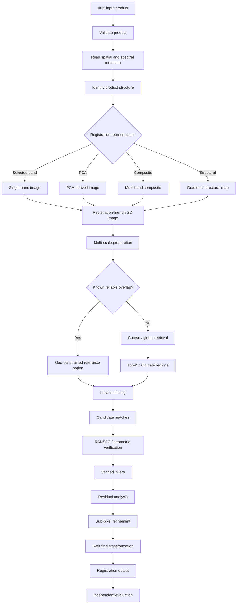

# Chandrayaan-2 IIRS

The **Imaging Infrared Spectrometer (IIRS)** is an imaging spectroscopy instrument aboard the **Chandrayaan-2 Orbiter**. Within ChandraMap, IIRS is one of the most technically distinct sensor paths because it does not simply provide another grayscale lunar image at a different resolution. It records spatial information together with measurements across many spectral wavelengths.

For image correspondence and registration, this difference is fundamental.

A conventional panchromatic image can often be represented approximately as:

```text
I(x, y)
```

where each spatial location contains one image intensity.

An IIRS hyperspectral product may instead be represented conceptually as:

```text
H(x, y, λ)
```

where `λ` represents wavelength or spectral channel.

This means that ChandraMap generally needs an explicit **spectral-to-spatial representation stage** before ordinary 2D image correspondence methods can be applied.

IIRS is also substantially coarser spatially than OHRC, TMC-2, and many LRO NAC products. Its approximate spatial scale is around **80 m/pixel**, so fine lunar structures visible in higher-resolution imagery may not physically exist as separately resolved structures in IIRS.

> **Core principle:** IIRS is a hyperspectral imaging instrument, not merely a low-resolution camera. ChandraMap must respect both its spectral information and its physical spatial-resolution limits.

| Property                   | Value / Description                                      |
| -------------------------- | -------------------------------------------------------- |
| Instrument                 | Imaging Infrared Spectrometer                            |
| Abbreviation               | IIRS                                                     |
| Mission                    | Chandrayaan-2 Orbiter                                    |
| Agency                     | ISRO                                                     |
| Instrument category        | Imaging infrared spectrometer                            |
| Data type                  | Hyperspectral / imaging spectroscopy                     |
| Approximate spatial scale  | ~80 m/pixel                                              |
| Approximate spectral range | ~0.8–5.0 µm                                              |
| Approximate band count     | Roughly 250–256 bands depending on product/documentation |
| ChandraMap role            | Cross-modality and coarse structural correspondence      |
| Primary challenge          | Spectral modality plus large GSD differences             |
| Processing requirement     | Derive a documented registration-friendly representation |
| Processing authority       | Actual product metadata                                  |

---

## 1. Instrument Overview

**IIRS** stands for **Imaging Infrared Spectrometer** and belongs to the Chandrayaan-2 Orbiter payload.

Unlike OHRC and TMC-2, which primarily provide panchromatic spatial imagery, IIRS measures the lunar surface across many wavelength channels.

At the project overview level, IIRS can be described approximately as:

- spatial scale: **~80 m/pixel**;
- spectral coverage: **~0.8–5.0 µm**;
- number of spectral channels: **roughly 250–256**, depending on the referenced documentation or product description.

These values should not be treated as hard-coded constants for every possible product.

The correct hierarchy for ChandraMap is:

```text
Actual product metadata
        ↓
Official product documentation
        ↓
Mission / instrument documentation
        ↓
Generic ChandraMap overview values
```

IIRS is relevant to ChandraMap because it creates a genuine **cross-modality registration problem**.

The system is not only matching:

```text
high resolution
vs.
low resolution
```

It may also be matching:

```text
hyperspectral / infrared-derived representation
vs.
visible / panchromatic imagery
```

This makes IIRS an important research sensor for testing whether ChandraMap can move beyond same-modality image matching.

---

## 2. What Hyperspectral Imaging Means

Hyperspectral imaging combines spatial imaging with spectral measurement.

### Conventional Grayscale Image

A conventional grayscale image can be thought of as:

```text
I(x, y)
```

Each spatial location `(x, y)` contains one intensity value.

Conceptually:

```text
width × height
```

### Hyperspectral Image

A hyperspectral product adds a spectral dimension:

```text
H(x, y, λ)
```

where `λ` represents wavelength.

Conceptually:

```text
width × height × spectral channels
```

Instead of one value at a spatial location, the product may contain a sequence of measurements across wavelengths.

A simplified conceptual example is:

```text
Spatial pixel
(x, y)
   |
   +--> λ1
   +--> λ2
   +--> λ3
   +--> ...
   +--> λB
```

where `B` is the number of spectral bands.

This three-dimensional representation is commonly called a **hyperspectral cube**.

> A distributed IIRS product should not automatically be assumed to be a raw full cube. Depending on the product source and processing level, ChandraMap may encounter a full cube, individual bands, browse products, calibrated products, map-projected products, or other derived representations.

The input must therefore be inspected before the registration pipeline is configured.

---

## 3. What IIRS Measures

IIRS measures the response of the lunar surface across multiple infrared and related spectral wavelengths.

At a high level, this kind of information can support analysis of:

- surface composition;
- mineralogical differences;
- wavelength-dependent reflectance;
- spectral signatures;
- material variation;
- hydration- or volatile-related spectral studies where appropriate.

For ChandraMap, however, the primary concern is not mineral interpretation itself.

The registration question is:

> **Which part of the IIRS information can be converted into a spatial representation that preserves terrain structure sufficiently well for reliable correspondence with another lunar image?**

This distinction is important.

IIRS may contain scientifically rich spectral information that is not directly useful to a conventional feature matcher.

ChandraMap therefore needs to preserve the original spectral product while deriving a separate representation specifically for registration.

---

## 4. Why IIRS Is Not an Ordinary Camera Image

OHRC and TMC-2 can usually be interpreted as conventional spatial intensity images after appropriate product preparation.

IIRS is different.

It contains:

- spatial information;
- spectral information.

The full data structure may therefore resemble:

```text
X × Y × B
```

rather than:

```text
X × Y
```

where `B` is the spectral dimension.

A standard 2D image-matching pipeline expects an image such as:

```text
height × width
```

or possibly a conventional small-channel image representation.

Passing an undefined hyperspectral cube directly into such a pipeline would leave several important questions unanswered:

- Which spectral bands are being used?
- How are the channels combined?
- Are all bands valid?
- Are wavelengths normalized?
- What physical information does the resulting matcher input represent?
- Can another researcher reproduce the same conversion?

Therefore ChandraMap should not document a pipeline such as:

```text
IIRS
→ SIFT
```

without an explicit representation step.

A technically meaningful version is:

```text
IIRS product
→ spectral / product interpretation
→ registration-friendly 2D representation
→ SIFT or another local matcher
```

---

## 5. IIRS Spatial Resolution

IIRS is approximately:

> **~80 m/pixel**

This should be treated as an approximate instrument/product scale.

Validated metadata from the actual product should take precedence.

For comparison:

| Sensor / Dataset |                             Approximate Scale |
| ---------------- | --------------------------------------------: |
| OHRC             |                               ~0.25–0.32 m/px |
| LRO NAC          | Often ~0.5–2 m/px, product/geometry-dependent |
| TMC-2            |                                       ~5 m/px |
| IIRS             |                                      ~80 m/px |

The physical scale difference is extremely important.

One IIRS pixel may correspond to an area containing a large number of pixels from a higher-resolution dataset.

Conceptually:

```text
High-resolution reference
many fine pixels
        ↓
same physical ground region
        ↓
one or a few IIRS spatial samples
```

Many fine terrain structures visible in OHRC or LRO NAC may therefore have no individually observable counterpart in IIRS.

This is a physical sensing limitation, not an algorithm problem.

---

## 6. Spatial Resolution vs Spectral Resolution

Spatial and spectral resolution describe different properties.

### Spatial Resolution

Spatial resolution describes how finely the lunar surface is sampled or resolved in physical space.

For ChandraMap, this affects questions such as:

- What crater sizes can be resolved?
- Which ridge structures are visible?
- What ground distance does one pixel represent?
- How fine can registration reasonably become?

### Spectral Resolution

Spectral resolution concerns how the instrument samples information across wavelength.

This affects questions such as:

- How many wavelength channels are available?
- How finely are spectral differences represented?
- Which spectral regions contain useful contrast?

These concepts must not be mixed.

A product can have:

```text
rich spectral information
+
coarse spatial information
```

at the same time.

Therefore:

> **More spectral bands do not mean finer lunar ground detail.**

An IIRS product may contain hundreds of spectral channels while still representing the surface at approximately tens of metres per spatial pixel.

This distinction is fundamental to ChandraMap's accuracy interpretation.

---

## 7. IIRS Data Representation

Before implementing an IIRS registration path, ChandraMap should determine exactly what form of data is available.

Possible product forms may include:

- full hyperspectral cube;
- individual spectral band;
- subset of bands;
- browse image;
- calibrated product;
- map-projected product;
- spectral composite;
- PCA-derived product;
- other derived image.

The repository should not assume one universal input layout unless the data contract explicitly defines it.

Before processing, inspect:

```text
Product type
    ↓
Spatial dimensions
    ↓
Spectral dimensions
    ↓
Band count
    ↓
Wavelength metadata
    ↓
Calibration / processing level
    ↓
Projection / geospatial metadata
```

The IIRS representation pipeline depends directly on these properties.

---

## 8. Hyperspectral Cube Structure

A conceptual hyperspectral cube can be represented as:

```text
X × Y × B
```

where:

- `X` = image width;
- `Y` = image height;
- `B` = number of spectral channels.

Another conceptual view is:

```text
                  Spectral dimension
                       λ
                       ↑
                       |
                +-------------+
               /|            /|
              / |           / |
             +-------------+  |
             |  |          |  |
             |  +----------|--+
             | /           | /
             |/            |/
             +-------------+
                X × Y
              spatial plane
```

ChandraMap may transform this cube into one or more spatial registration products by:

- selecting a band;
- combining several bands;
- applying dimensionality reduction;
- generating structural representations;
- deriving another validated spatial feature map.

The selected transformation should be explicit and reproducible.

---

## 9. Registration-Friendly IIRS Representations

Deriving a useful 2D IIRS representation is one of the central research problems in the IIRS sensor path.

Different representations may preserve different types of information.

No one representation should be treated as universally superior without controlled evaluation.

---

### 9.1 Single-Band Selection

The simplest approach is to select one spectral band and use its spatial plane as the registration image.

Conceptually:

```text
IIRS cube
    ↓
Select band k
    ↓
2D image
```

#### Advantages

- simple;
- transparent;
- easy to reproduce;
- preserves original spatial sampling;
- easy to compare across experiments.

#### Limitations

- one band may contain weak terrain contrast;
- performance may vary strongly with wavelength;
- noise or calibration quality may differ across bands;
- one selected band may not generalize across scenes.

The chosen band should therefore be recorded explicitly.

ChandraMap should not define an arbitrary universal "best IIRS band" without evidence.

---

### 9.2 Multi-Band Composite

Multiple spectral bands may be combined to produce a 2D or conventional multi-channel spatial representation.

Conceptually:

```text
Bands λa, λb, λc
        ↓
Combination / fusion
        ↓
Registration representation
```

Potential advantages include:

- combining useful contrast from several wavelengths;
- reducing dependence on one band;
- emphasizing spatial structures shared across bands.

Potential limitations include:

- representation design becomes more complex;
- poor combinations may suppress useful terrain information;
- spectral meaning may be altered;
- normalization choices affect reproducibility.

Any composite should document:

- selected bands;
- combination method;
- normalization;
- output channel structure.

---

### 9.3 PCA / Dimensionality Reduction

Principal Component Analysis or another dimensionality-reduction method may transform a hyperspectral cube into a smaller number of spatial component images.

Conceptually:

```text
Hyperspectral cube
        ↓
Dimensionality reduction
        ↓
PC1
PC2
PC3
...
```

A component can then be evaluated as a registration image.

Potential benefits include:

- reducing dimensionality;
- concentrating major variation;
- producing conventional 2D images;
- reducing redundancy between bands.

However:

> **The component with the largest variance is not automatically the component with the best geometric registration information.**

Large variance could be dominated by:

- spectral effects;
- illumination;
- broad radiometric changes;
- noise;
- material differences.

PCA components therefore need to be benchmarked rather than assumed to be optimal.

---

### 9.4 Gradient / Structural Representation

Another research direction is to derive representations emphasizing spatial structure instead of absolute radiometric values.

Possible representations include:

- gradient magnitude;
- gradient orientation;
- edge maps;
- large-scale terrain boundaries;
- crater/ridge structures;
- local phase or structural features.

Conceptually:

```text
IIRS-derived 2D image
        ↓
Spatial structure extraction
        ↓
Gradient / edge / structure map
        ↓
Cross-modal matching
```

This may be useful because visible and infrared products can have different intensities while still sharing some terrain geometry.

This remains a research hypothesis.

It should be tested rather than presented as guaranteed illumination or modality invariance.

---

### 9.5 Learned or Spectral-Spatial Representations

Advanced ChandraMap versions may investigate:

- spectral-spatial embeddings;
- learned dimensionality reduction;
- cross-modal representation learning;
- lunar-specific representation learning;
- feature fusion across selected spectral channels.

These are future research directions unless implementation is explicitly documented elsewhere.

They should not replace simpler baselines until they demonstrate measurable benefit.

---

## 10. Representation Selection as a Benchmark

Representation choice should itself be treated as an experimental variable.

For a controlled comparison, keep constant:

```text
same IIRS product
+
same reference image
+
same reference scale
+
same matcher
+
same geometry settings
+
same evaluation points
```

Change only:

```text
IIRS representation
```

For example:

| Experiment | IIRS Representation                  |
| ---------- | ------------------------------------ |
| A          | Selected spectral band               |
| B          | PCA component                        |
| C          | Multi-band composite                 |
| D          | Gradient / structural representation |

Then compare metrics such as:

- candidate match count;
- inlier count;
- inlier ratio;
- spatial coverage;
- independent check-point RMSE;
- registration success rate;
- runtime.

This allows ChandraMap to answer:

> Did the IIRS representation improve registration?

rather than confusing representation changes with matcher or dataset changes.

---

## 11. Information Loss During 2D Conversion

Reducing a hyperspectral cube to a single 2D registration image necessarily discards or compresses spectral information.

This is not automatically a problem.

The derived product is being created for a different task:

> **spatial registration**

rather than complete preservation of spectral science content.

However, ChandraMap should keep the distinction clear.

Recommended conceptual model:

```text
Original IIRS product
        |
        +--> preserved scientific source
        |
        +--> derived registration representation
```

The derived registration image should not replace the original hyperspectral product.

Representation metadata should preserve enough information to reconstruct how the registration input was generated.

---

## 12. IIRS and the Scale Gap

IIRS creates one of the largest physical scale differences in the ChandraMap sensor set.

Approximate scales are:

```text
OHRC
~0.25–0.32 m/px

LRO NAC
often ~0.5–2 m/px

TMC-2
~5 m/px

IIRS
~80 m/px
```

These are approximate and product-dependent.

The scale gap has a direct consequence:

> Features that occupy many pixels in OHRC, NAC, or TMC-2 may occupy less than one meaningful IIRS spatial sample.

Therefore a matcher cannot reasonably rely on all structures present in the high-resolution reference.

The high-resolution side must be prepared so that correspondence is attempted at a physically meaningful scale.

---

## 13. Why Upsampling Does Not Recover Detail

This is one of the most important physical constraints in the IIRS pipeline.

Suppose an IIRS product is approximately:

```text
80 m/px
```

and a reference product is substantially finer.

An incorrect strategy would be:

```text
IIRS
80 m/px
    ↓
resize 100× larger
    ↓
many more pixels
    ↓
claim high-resolution information
```

The output has more digital samples, but it does not contain newly measured terrain.

Upsampling can change:

- array dimensions;
- sampling grid;
- interpolation values;
- visual smoothness.

It cannot create:

- newly measured lunar detail;
- unresolved craters;
- new ridge information;
- OHRC-level terrain;
- NAC-level fine morphology.

> **Resampling changes the representation; it does not recover missing physical information.**

Interpolation estimates values between existing samples.

It cannot recover spatial structures that were never resolved by the instrument.

---

## 14. Correct Multi-Scale Strategy for IIRS

The correct approach is usually to reduce the information scale of the finer reference for coarse correspondence.

### Incorrect

```text
IIRS ~80 m/px
        ↓
enlarge to NAC dimensions
        ↓
pretend physical scales match
        ↓
fine correspondence
```

### Preferred

```text
High-resolution reference
        ↓
Build multi-resolution pyramid
        ↓
Select physically comparable effective scale
        ↓
Generate coarse structural correspondence
        ↓
Geometric verification
        ↓
Refine only where IIRS information supports it
```

> **Compare information, not pixel count.**

A multi-resolution reference pyramid can expose structures at multiple effective scales.

For IIRS, the selected scale should emphasize terrain structures that remain observable near the spatial information level of the IIRS product.

Fine reference data can remain useful later, but only where the source contains enough corresponding information to justify refinement.

---

## 15. What Features Can Realistically Match?

IIRS correspondence should focus on structures large enough to survive its spatial sampling.

Possible candidates may include:

- large crater boundaries;
- major crater rims;
- broad terrain transitions;
- large ridge structures;
- regional morphology;
- relative geometry between major terrain features.

These examples are not guarantees.

Visibility depends on:

- actual product GSD;
- terrain type;
- illumination;
- spectral channel;
- representation method;
- projection;
- acquisition geometry.

Fine structures such as:

- very small craters;
- small boulders;
- narrow ridges;
- subtle OHRC textures;

may simply not be spatially resolvable in IIRS.

A matcher should not be evaluated negatively for failing to match information the source physically does not contain.

---

## 16. Illumination and Sun-Angle Effects

IIRS remains affected by illumination even after conversion to a registration-friendly representation.

Possible differences include:

- displaced shadows;
- altered crater appearance;
- different illuminated slopes;
- brightness differences;
- contrast differences;
- wavelength-dependent radiometric behavior.

A simple intensity normalization may reduce some brightness variation.

It cannot generally correct geometric changes in shadow position.

Therefore:

```text
intensity normalization
        ≠
Sun-geometry correction
```

Potential research options include:

- gradient representations;
- edge maps;
- large-scale structural features;
- illumination-aware masks;
- terrain-shape representations.

These should be benchmarked as hypotheses.

ChandraMap should not claim full Sun-angle invariance without experimental evidence.

---

## 17. Cross-Modality Registration

IIRS creates a true cross-modality registration problem.

Consider:

```text
IIRS-derived infrared / spectral representation
            vs.
visible / panchromatic LRO reference
```

The two images may represent the same terrain with different radiometric responses.

A bright region in one modality may not have the same intensity relationship in the other.

This means raw pixel similarity may be less reliable than in same-modality image pairs.

Potentially more stable information may include:

- large terrain boundaries;
- crater geometry;
- edge structure;
- relative feature locations;
- gradient patterns.

However:

> Structural representations can reduce dependence on raw intensity, but they do not eliminate every cross-modality difference.

The modality gap should therefore be evaluated directly.

---

## 18. IIRS and OHRC

Approximate scales are:

```text
OHRC
~0.25–0.32 m/px

IIRS
~80 m/px
```

This is an extreme GSD difference.

OHRC can contain fine surface morphology that has no one-to-one observable counterpart in IIRS.

Therefore an OHRC ↔ IIRS experiment should not begin at native OHRC detail.

A defensible strategy is:

```text
OHRC
    ↓
Aggressive multi-resolution reduction
    ↓
Physically comparable coarse representation

IIRS
    ↓
Spectral-to-2D representation
    ↓
Physically comparable coarse representation

        ↓

Large-scale correspondence
```

The matcher should focus only on structures observable in both products.

ChandraMap should not claim IIRS provides OHRC-level spatial registration detail.

---

## 19. IIRS and TMC-2

Approximate scales are:

```text
TMC-2
~5 m/px
panchromatic

IIRS
~80 m/px
hyperspectral / IR
```

The scale gap remains significant, but it is less extreme than IIRS ↔ OHRC.

TMC-2 can provide useful intermediate terrain context for research.

Potential TMC-2 ↔ IIRS experiments may evaluate:

- scale reduction;
- structural correspondence;
- cross-modality matching;
- representation robustness.

A conceptual strategy is:

```text
TMC-2
    ↓
Reduce toward IIRS-comparable scale

IIRS
    ↓
Derive 2D registration representation

        ↓

Match large shared terrain structures
```

TMC-2 does not automatically solve the IIRS problem.

It remains a different sensor with finer spatial sampling and different radiometric characteristics.

---

## 20. IIRS and LRO NAC

LRO NAC is usually substantially finer spatially than IIRS.

Therefore native-resolution NAC should not ordinarily be used directly as if its small structures were observable in IIRS.

A more defensible flow is:

```text
LRO NAC
    ↓
Build reference pyramid
    ↓
Select IIRS-comparable effective scale

IIRS
    ↓
Derive 2D registration representation

        ↓

Candidate correspondence
        ↓
Geometric verification
```

NAC's high-resolution detail can assist later interpretation, but it should not be used to justify spatial accuracy beyond the information content of IIRS.

The actual NAC product scale and geometry should be read from the product metadata.

---

## 21. IIRS and LRO WAC

LRO WAC provides broader lunar context and may be useful for coarse IIRS workflows.

Potential roles include:

- global context;
- coarse localization;
- candidate-region retrieval;
- broad structural comparison;
- reference mosaics.

Whether WAC is an appropriate reference depends on:

- product scale;
- projection;
- illumination;
- coverage;
- IIRS representation;
- experiment objective.

No universal WAC GSD should be assumed.

An IIRS ↔ WAC experiment may be more naturally suited to regional or coarse structural registration than fine point-level alignment.

---

## 22. Sensor Metadata Important for IIRS

IIRS requires both spatial and spectral metadata.

| Metadata                     | Why It Matters                              |
| ---------------------------- | ------------------------------------------- |
| Instrument                   | Select IIRS processing route                |
| Mission/platform             | Provenance                                  |
| Product ID                   | Reproducibility                             |
| Product type                 | Interpret data structure                    |
| Product level                | Understand calibration assumptions          |
| Spatial dimensions           | Image processing                            |
| Spectral dimensions          | Cube interpretation                         |
| Number of bands              | Spectral handling                           |
| Band metadata                | Representation reproducibility              |
| Wavelength information       | Band selection and interpretation           |
| GSD / pixel scale            | Multi-scale comparison                      |
| Footprint                    | Restrict search region                      |
| Latitude / longitude         | Geospatial localization                     |
| Projection                   | Coordinate interpretation                   |
| Lunar CRS / reference system | Georeferencing                              |
| Acquisition time             | Provenance                                  |
| Sun geometry                 | Illumination analysis                       |
| Incidence angle              | Lighting interpretation                     |
| Emission angle               | Viewing geometry                            |
| Phase angle                  | Observation geometry                        |
| NoData / invalid values      | Data masking                                |
| Valid-band information       | Prevent unusable channels entering analysis |

Not every product will contain every field.

Missing metadata should be represented explicitly rather than invented.

---

## 23. Spectral Metadata

Spectral metadata deserves special treatment because representation generation depends on it.

Useful information may include:

- band index;
- wavelength associated with each band;
- wavelength range;
- valid/invalid-band information;
- calibration state;
- product-specific quality flags.

ChandraMap should not hard-code per-band wavelength assumptions when the actual product metadata provides authoritative values.

If an experiment uses particular bands, the benchmark record should identify them explicitly.

For example:

```text
representation_type: selected_band
band_index: <recorded value>
wavelength: <value from product metadata, if available>
```

Similarly, a composite should record all source bands.

Without this provenance, hyperspectral experiments may not be reproducible.

---

## 24. IIRS Preprocessing Strategy

A conceptual IIRS preparation sequence is:

```text
IIRS product
    ↓
Validate product
    ↓
Identify product type / dimensions
    ↓
Read spatial + spectral metadata
    ↓
Identify valid bands / pixels
    ↓
Interpret calibration state
    ↓
Mask invalid data
    ↓
Derive registration-friendly representation
    ↓
Optional radiometric normalization
    ↓
Multi-scale preparation
    ↓
Local matching
```

The critical architectural distinction is:

> **Spectral-to-spatial representation generation happens before conventional local image matching.**

This is what separates IIRS from the OHRC and TMC-2 paths.

---

## 25. Do Not Feed an Undefined Cube into a 2D Matcher

Algorithms such as:

- SIFT;
- conventional ORB;
- typical sparse LightGlue pipelines;
- ordinary LoFTR image-pair usage;

generally expect appropriately represented image inputs rather than an undefined hyperspectral cube.

Therefore:

```text
IIRS
→ SIFT
```

is technically incomplete.

Prefer:

```text
IIRS cube / product
        ↓
Select / derive registration representation
        ↓
2D registration image
        ↓
SIFT / ALIKED + LightGlue / LoFTR / another matcher
```

The representation stage should be documented as part of the experiment.

The same principle applies even if a learned method is capable of receiving multiple channels after modification: the input representation still needs an explicit definition.

---

## 26. Matching Approaches for IIRS-Derived Images

Once a suitable registration representation exists, ChandraMap can benchmark conventional and learned correspondence methods.

---

### 26.1 Classical Baseline

A simple baseline is:

```text
IIRS representation
        ↓
SIFT
        ↓
Descriptor matching
        ↓
Match filtering
        ↓
RANSAC
        ↓
Initial transform
```

Advantages:

- interpretable;
- reproducible;
- useful benchmark;
- provides a number to improve upon.

Potential limitation:

Cross-modality intensity differences may reduce descriptor repeatability.

---

### 26.2 Learned Sparse Matching

A possible learned sparse path is:

```text
IIRS representation
        ↓
ALIKED
        ↓
Sparse keypoints + descriptors
        ↓
LightGlue
        ↓
Candidate matches
```

Responsibilities should be described correctly:

- **ALIKED** extracts sparse local features;
- **LightGlue** matches compatible local features.

A pretrained terrestrial model is not automatically robust to lunar hyperspectral-visible correspondence.

Performance must be measured.

---

### 26.3 Detector-Free Matching

A detector-free path may use:

```text
IIRS representation
        ↓
LoFTR
        ↓
Candidate correspondences
```

LoFTR directly estimates correspondences without a conventional separate keypoint detector.

It may be useful where repeatable sparse features are weak.

However, it can still be affected by:

- domain shift;
- cross-modality appearance differences;
- large scale gaps;
- illumination changes.

It should not be described as a generic "feature extractor."

---

### 26.4 Remote-Sensing-Oriented Methods

Research comparisons may include:

- RIFT;
- CFOG-style structural approaches;
- other multimodal remote-sensing registration techniques.

These may be especially relevant to IIRS because cross-radiometric and cross-modal differences are central to the problem.

Their inclusion should be treated as:

- a benchmark direction;
- a research option;
- a future extension.

No method should be declared superior without experiments.

---

## 27. Candidate Matches vs Verified Inliers

A matcher outputs **candidate correspondences**.

These are hypotheses.

They become **verified inliers** only after geometric consistency is established.

The correct terminology is:

```text
Candidate matches
        ↓
Geometric verification
        ↓
Verified inliers
```

Matcher confidence is useful metadata but is not equivalent to geometric proof.

A high-scoring match can still be spatially incorrect.

---

## 28. Geometric Verification

A conceptual IIRS geometry flow is:

```text
IIRS-derived representation
        ↓
Candidate matches
        ↓
RANSAC
        ↓
Initial transform
        ↓
Inliers / outliers
        ↓
Residual analysis
```

Possible initial models include:

- affine transformation;
- homography.

The model should be selected according to:

- product projection;
- footprint size;
- terrain geometry;
- viewing differences;
- residual behavior.

One homography should not automatically be assumed to represent all lunar imaging geometry.

---

## 29. Geometry and Terrain Relief

The Moon is a three-dimensional terrain surface.

Even after IIRS is reduced to a 2D registration representation, the imaging geometry can still be affected by:

- terrain relief;
- viewing angle;
- projection;
- sensor geometry;
- acquisition configuration.

A global transform can be useful for:

- local regions;
- map-projected products;
- baseline experiments.

It may be insufficient for:

- large relief changes;
- raw geometry;
- larger footprints;
- strongly varying viewpoint.

Advanced ChandraMap research may investigate:

- physical sensor geometry;
- DEM-supported registration;
- local transforms;
- piecewise warping.

These should be introduced only when residual analysis shows that the simpler baseline is inadequate.

---

## 30. Sub-Pixel Refinement for IIRS

The correct refinement order is:

```text
Candidate matches
        ↓
RANSAC
        ↓
Verified inliers
        ↓
Sub-pixel coordinate refinement
        ↓
Refit final transform
        ↓
Evaluation
```

Possible local refinement approaches include:

- patch correlation;
- phase-based refinement;
- planetary coregistration tools.

Refining arbitrary candidates before outlier rejection is undesirable because false matches can be made more numerically precise without becoming correct.

### Physical Caution

Sub-pixel IIRS registration does **not** imply sub-metre ground accuracy.

If one IIRS source pixel represents approximately tens of metres of terrain, even a fractional-pixel residual corresponds to a much larger physical distance than the same fractional residual on OHRC.

---

## 31. Source-Pixel Accuracy

Registration accuracy should be reported first in:

> **IIRS source-image pixels**

For example:

```text
0.2 IIRS pixel
```

and:

```text
0.2 OHRC pixel
```

do not represent the same physical displacement.

Approximate nominal scales make the distinction clear:

```text
OHRC
~0.25–0.32 m/px

IIRS
~80 m/px
```

Therefore cross-sensor benchmark tables should not interpret fractional-pixel error as a directly comparable physical measure.

A fair report should distinguish:

- sensor-relative error in pixels;
- physical error in metres, where valid.

---

## 32. Ground Error in Metres

Pixel-domain error can be converted to physical ground distance only when the spatial relationship is sufficiently known.

Relevant requirements may include:

- validated product GSD;
- appropriate map projection;
- meaningful local image-to-ground relationship;
- trustworthy reference geometry or ground truth.

The conceptual process is:

```text
IIRS source-pixel error
        ↓
Validate GSD
        ↓
Validate projection / geometry
        ↓
Convert to physical distance if justified
```

A numerical error below one source pixel does not automatically justify fine metre-level accuracy claims.

---

## 33. Independent Evaluation

A common evaluation mistake is:

```text
Use tie points
        ↓
Fit transform
        ↓
Measure RMSE on same tie points
        ↓
Claim final registration accuracy
```

Because the transform was estimated from those points, the resulting error can be overly optimistic.

Preferred evaluation hierarchy:

1. official benchmark or challenge ground truth;
2. independent check points;
3. held-out manually verified correspondences.

Check points should not be used to fit the transformation whose accuracy they evaluate.

For IIRS, independent evaluation is particularly important because coarse resolution can make visually plausible alignments misleading.

---

## 34. Metrics for IIRS

| Metric                     | What It Measures                                  |
| -------------------------- | ------------------------------------------------- |
| Candidate match count      | Raw matcher proposals                             |
| Inlier count               | Matches surviving geometric verification          |
| Inlier ratio               | Fraction of candidates geometrically consistent   |
| Spatial coverage           | Distribution of verified correspondences          |
| Check-point RMSE           | Independent registration accuracy                 |
| Source-pixel error         | Sensor-relative registration quality              |
| Ground error               | Physical error when conversion is valid           |
| Success rate               | Fraction of test pairs meeting benchmark criteria |
| Runtime                    | Computational cost                                |
| Failure rate               | Reliability across test cases                     |
| Representation performance | Effect of IIRS representation choice              |

If global retrieval is included, also measure:

- Recall@1;
- Recall@5;
- Recall@K.

These are retrieval metrics.

They answer:

> Did the system find the correct lunar region?

They do not answer:

> Did the final local registration align the images accurately?

The two stages should be evaluated separately.

---

## 35. Spatial Coverage

Spatial coverage is important because a small number of correct correspondences concentrated around one major crater may not constrain the entire overlap.

For example:

```text
12 verified matches
all within one small region
```

may produce a locally plausible transform while leaving the rest of the image weakly constrained.

Possible coverage measures include:

- grid-cell coverage;
- convex-hull coverage;
- normalized spatial extent;
- distribution statistics.

Well-distributed inliers provide stronger evidence that the transformation applies across the overlapping region.

This is especially useful for coarse IIRS products, where the number of distinct large structures may be limited.

---

## 36. IIRS-Specific Benchmark Matrix

IIRS requires experiments that isolate both representation choice and cross-modality difficulty.

### 36.1 Representation Test

Compare:

- selected individual band;
- PCA component;
- spectral composite;
- gradient or structural representation.

**Purpose:** determine which derived 2D representation preserves useful spatial structure for registration.

---

### 36.2 Scale Stress Test

Compare IIRS against references with substantially different GSD.

**Purpose:** measure whether multi-resolution preparation improves physically meaningful correspondence.

---

### 36.3 Cross-Modality Stress Test

Compare an IIRS-derived representation against visible/panchromatic reference imagery.

**Purpose:** measure the impact of modality differences.

---

### 36.4 Sun-Angle Stress Test

Use overlapping terrain observed under substantially different illumination.

**Purpose:** measure sensitivity to shadows and illumination geometry.

---

### 36.5 Low-Feature Test

Use regions where few strong large-scale structures are visible.

**Purpose:** expose failure behavior rather than testing only easy crater-rich scenes.

---

### 36.6 Geometry Stress Test

Use terrain or observation conditions with stronger viewing/relief differences.

**Purpose:** evaluate whether the global geometric model remains adequate.

No expected benchmark scores should be assumed before measurement.

---

## 37. Recommended IIRS Experimental Progression

IIRS development should begin with understanding the actual product rather than immediately introducing complex learning methods.

### Stage A — Inspect the Actual Data

Record:

- product identity;
- product type;
- data dimensions;
- number of bands;
- wavelength metadata;
- GSD;
- projection;
- footprint;
- valid/invalid channels;
- product processing level;
- available viewing/illumination metadata.

This becomes the reproducible foundation for later experiments.

---

### Stage B — Build One Simple 2D Representation

Begin with the simplest defensible option.

Examples include:

- selected individual band;
- PCA component;
- simple documented composite.

Avoid beginning with a complicated learned hyperspectral architecture before a measurable baseline exists.

---

### Stage C — Known-Pair Baseline

Use a known overlapping image pair:

```text
IIRS representation
        ↓
Scale-compatible reference
        ↓
SIFT
        ↓
Candidate matches
        ↓
RANSAC
        ↓
Transform
        ↓
Registered preview
        ↓
Independent metrics
```

The goal is to prove end-to-end registration on real data.

---

### Stage D — Representation Benchmark

Run the same image pair through multiple IIRS representations.

Keep constant:

- reference;
- matcher;
- geometry model;
- thresholds;
- evaluation points.

Change only the representation.

This isolates representation quality.

---

### Stage E — Stronger Matcher

After one or more reasonable IIRS representations exist, compare:

- SIFT;
- ALIKED + LightGlue;
- LoFTR;
- remote-sensing-oriented methods where practical.

Use the same benchmark pairs.

---

### Stage F — Sub-Pixel Refinement

Refine only verified inlier coordinates.

Then:

```text
refined tie points
        ↓
refit final transform
        ↓
independent check-point evaluation
```

Compare before and after refinement.

---

### Stage G — Advanced Cross-Modal Research

Possible future areas include:

- learned spectral-spatial embeddings;
- cross-modal representation learning;
- lunar-specific feature training;
- DEM-assisted registration;
- sensor-geometry integration.

These should build on measurable baselines rather than replace them prematurely.

---

## 38. Representation Ablation Study

Because representation generation is central to IIRS registration, ChandraMap should support controlled ablation studies.

A useful experimental structure is:

```text
Same IIRS product
+
Same reference product
+
Same reference scale
+
Same local matcher
+
Same RANSAC settings
+
Same evaluation points
```

Change only:

```text
IIRS representation
```

For example:

```text
Band A
vs.
Band B
vs.
PCA component
vs.
Composite
vs.
Gradient representation
```

This helps determine whether an improvement came from:

- representation choice;

rather than from:

- a different matcher;
- another image pair;
- changed geometry thresholds;
- changed reference scale;
- changed evaluation protocol.

Controlled ablation is essential for making defensible research claims.

---

## 39. IIRS Failure Modes

| Failure Mode                                    | Possible Cause                                         | Useful Diagnostic                            |
| ----------------------------------------------- | ------------------------------------------------------ | -------------------------------------------- |
| No usable matches                               | Selected representation lacks stable spatial structure | Compare bands, PCA, composites, gradients    |
| Only very broad structures match                | Expected spatial-resolution limit                      | Compare source/reference GSD                 |
| Fine reference features fail                    | IIRS cannot resolve them                               | Downsample reference                         |
| Many false correspondences                      | Cross-modality intensity differences                   | Test structure-focused methods               |
| Results vary strongly between bands             | Spectral contrast dependency                           | Run band ablation                            |
| Strong match count but poor geometry            | Candidate matches are inconsistent                     | Inspect RANSAC inliers                       |
| Good fit error but poor image-wide registration | Weak spatial coverage                                  | Measure coverage                             |
| Visually good warp but poor check points        | Overfitting or weak geometry                           | Use independent evaluation                   |
| Matching fails with different illumination      | Shadow geometry                                        | Compare structural representations           |
| Residuals increase near image edges             | Model inadequacy / projection effects                  | Inspect residual vectors                     |
| Global retrieval fails across modalities        | Descriptor domain mismatch                             | Evaluate retrieval representation separately |
| Physical error claim is unreliable              | Missing GSD/projection/reference truth                 | Report source-pixel error only               |
| Representation cannot be reproduced             | Missing band/PCA/composite metadata                    | Improve experiment provenance                |

Failure cases should be retained and analyzed rather than removed from the benchmark.

---

## 40. Data Validation Before Processing

Before processing an IIRS product, ChandraMap should validate what the file actually contains.

Possible checks include:

- file readability;
- instrument identity;
- product identity;
- product processing level;
- data dimensions;
- spatial dimensions;
- spectral dimension;
- number of bands;
- pixel data type;
- invalid / NoData values;
- spectral metadata;
- valid/invalid-band metadata;
- GSD;
- footprint;
- projection;
- coordinate reference information;
- acquisition geometry;
- illumination metadata.

The pipeline should not silently assume:

- exactly 256 bands;
- exactly 80 m/pixel;
- one fixed cube layout;
- one fixed product level;
- one universal projection.

Read and validate the actual product.

---

## 41. Bad / Invalid Band Handling

Hyperspectral products may contain channels that should not automatically be treated as equally useful.

ChandraMap should support product-driven handling of:

- invalid bands;
- flagged bands;
- unusable channels;
- masked channels;
- incomplete spectral data.

The exact IIRS bands to exclude should **not** be hard-coded in this document.

Instead, the implementation should defer to:

- actual product metadata;
- official data documentation;
- experiment-specific quality checks.

A reproducible experiment should record:

```text
total bands
valid bands
excluded bands
reason for exclusion
```

where that information is available.

---

## 42. IIRS Sensor Routing in ChandraMap

A high-level IIRS processing route is:



The defining feature of this route is the explicit representation stage.

IIRS should not enter the common image-matching interface until a documented representation has been produced.

---

## 43. Known-Location vs Unknown-Location Mode

IIRS processing may operate differently depending on whether trustworthy geospatial metadata exists.

### Known Location

If metadata provides reliable:

- footprint;
- latitude/longitude;
- projection;
- approximate reference region;

ChandraMap should use that information to restrict the search.

Conceptually:

```text
IIRS metadata
    ↓
Reference overlap restriction
    ↓
Scale-compatible reference
    ↓
Local correspondence
```

This avoids solving a whole-Moon retrieval problem when metadata has already constrained the location.

### Unknown Location

If location information is unavailable or unreliable, use a retrieval stage:

```text
IIRS-derived retrieval representation
        ↓
Global descriptor
        ↓
Search reference index
        ↓
Top-K candidate regions
        ↓
Local registration
```

These are distinct operating modes.

---

## 44. Global Retrieval and IIRS

IIRS may create an additional challenge for global image retrieval.

A global descriptor that works well for visible imagery may not transfer automatically to:

```text
hyperspectral-derived IIRS representation
```

because modality differences may change the image statistics.

The retrieval representation should therefore be validated separately.

### Offline Reference Preparation

```text
Reference lunar imagery
        ↓
Tiles
        ↓
Multiple effective scales
        ↓
Global descriptor
        ↓
Searchable index + metadata
```

### Online IIRS Query

```text
IIRS product
        ↓
2D / retrieval representation
        ↓
Compatible global descriptor
        ↓
Vector search
        ↓
Top-K candidate tiles
```

Then:

```text
Candidate reference region
        ↓
Local correspondence pipeline
```

A descriptor should not be assumed to generalize across all sensor modalities without testing.

---

## 45. FAISS Role

FAISS can support vector similarity search in the retrieval stage.

FAISS does **not**:

- read an IIRS hyperspectral cube;
- select spectral bands;
- perform PCA;
- generate composites;
- extract lunar tie points;
- perform RANSAC;
- estimate a registration transform;
- refine image coordinates.

Its possible role is:

```text
Global descriptor vectors
        ↓
FAISS index
        ↓
Top-K candidate reference regions
```

This distinction should remain clear:

| Component                     | Role                                                        |
| ----------------------------- | ----------------------------------------------------------- |
| IIRS representation generator | Convert spectral product into usable spatial representation |
| Global descriptor             | Represent whole image/tile for retrieval                    |
| FAISS                         | Search descriptor vectors                                   |
| Local matcher                 | Generate point correspondences                              |
| RANSAC                        | Geometrically verify correspondences                        |
| Refinement                    | Improve verified tie-point locations                        |

---

## 46. IIRS Outputs

Depending on the experiment, the IIRS path may produce:

- selected registration representation;
- representation type;
- representation provenance;
- selected band indices;
- wavelengths used where available;
- PCA/component configuration;
- composite definition;
- candidate reference regions;
- candidate correspondences;
- verified inliers;
- rejected outliers;
- initial transform;
- refined transform;
- residual vectors;
- registered preview;
- inlier count;
- inlier ratio;
- spatial coverage;
- check-point RMSE;
- IIRS source-pixel error;
- physical ground error where justified;
- runtime;
- success/failure status;
- structured failure reason;
- geospatial localization where justified.

Exact filenames and serialization formats should be defined elsewhere by repository contracts.

---

## 47. Reproducibility Requirements

IIRS experiments require more provenance than ordinary single-band image registration because the registration image may itself be a derived artifact.

Where possible, record:

- product ID;
- product level;
- original data dimensions;
- GSD;
- number of bands;
- wavelength metadata;
- valid/invalid-band handling;
- selected band indices;
- wavelengths used;
- PCA configuration;
- number of PCA components;
- selected component;
- composite formula;
- normalization method;
- structural-processing parameters;
- reference product ID;
- reference effective scale;
- matcher;
- matcher configuration;
- geometric model;
- RANSAC settings;
- refinement method;
- evaluation split;
- check points.

Without these details, two experiments described simply as:

```text
IIRS + LightGlue
```

may represent completely different pipelines.

A reproducible experiment should instead make the full representation path explicit.

---

## 48. IIRS Limitations

IIRS has several important limitations for image registration.

### Spatial Resolution Is Coarse Relative to Other Core Sensors

IIRS contains far less fine spatial detail than OHRC, TMC-2, and typical LRO NAC products.

### Fine Terrain Cannot Be Reconstructed by Resizing

Interpolation does not recover unresolved lunar structures.

### Cross-Modality Differences Are Significant

Infrared/hyperspectral-derived representations may not resemble visible imagery radiometrically.

### Representation Selection Influences Results

Different bands or dimensionality-reduction methods can produce substantially different spatial contrast.

### One Band May Not Generalize

A band useful for one region or condition may not be optimal elsewhere.

### PCA Is Not Automatically the Best Registration Representation

High variance is not equivalent to high geometric usefulness.

### Sun-Angle Differences Remain Difficult

Structural and spectral preprocessing does not automatically correct shadow geometry.

### Pretrained Models May Experience Domain Shift

Terrestrial feature models are not automatically robust to lunar hyperspectral-visible matching.

### Global Geometry May Be Insufficient

Terrain relief, projection, and viewing geometry can produce local residual variation.

### Product Metadata May Vary

Band count, spatial scale, product structure, and calibration information should be read from the actual product.

### Sub-Pixel Error Does Not Mean Fine Physical Accuracy

A fractional IIRS pixel can still correspond to a substantial lunar ground distance.

### Real Lunar Evaluation Is Essential

Synthetic or derived tests cannot replace validation on real cross-sensor lunar image pairs.

---

## 49. Claims ChandraMap Should Avoid

ChandraMap should avoid unsupported statements such as:

> "IIRS is just a low-resolution camera."

IIRS is an imaging infrared spectrometer.

> "IIRS produces the same type of image as OHRC."

It does not.

> "Upscaling IIRS recovers OHRC or NAC detail."

Interpolation cannot recover unresolved physical information.

> "Every IIRS product has exactly 256 bands."

Use product/documentation-aware wording.

> "IIRS is exactly 80 m/pixel in every product."

Use actual product metadata.

> "PCA automatically solves hyperspectral registration."

PCA is one candidate representation technique.

> "The first PCA component is always best."

This requires experimental evidence.

> "One spectral band is universally optimal."

Band usefulness must be measured.

> "LightGlue automatically understands hyperspectral cubes."

A suitable representation and compatible local-feature pipeline are still required.

> "LoFTR automatically solves multimodal registration."

Domain shift and modality differences remain relevant.

> "Normalization solves cross-modality matching."

Radiometric normalization cannot remove every sensor difference.

> "Sub-pixel IIRS accuracy means sub-metre accuracy."

It does not.

> "More spectral bands mean higher spatial resolution."

Spectral and spatial resolution are different.

> "More matches automatically mean accurate registration."

Geometric validity and spatial distribution matter.

> "A visually aligned result proves quantitative correctness."

Independent metrics are required.

---

## 50. IIRS Within ChandraMap Versioning

The following is a reasonable conceptual progression for benchmarkable IIRS research.

Existing ChandraMap version specifications should remain authoritative if they define a different scope.

### V1 — Classical / Minimal Baseline

IIRS support may begin as a small controlled experiment.

Conceptually:

```text
IIRS-derived 2D representation
        ↓
Scale-compatible reference
        ↓
SIFT
        ↓
Candidate matches
        ↓
RANSAC
        ↓
Transform
        ↓
Measured outputs
```

The objective is a reproducible baseline, not sophisticated hyperspectral modeling.

---

### V2 — Sensor-Aware IIRS Processing

Possible additions include:

- explicit band selection;
- PCA experiments;
- composite representations;
- structural representations;
- reference pyramids;
- scale-aware comparison;
- illumination-oriented preprocessing.

---

### V3 — Advanced Cross-Modal Matching

Possible additions include:

- ALIKED + LightGlue;
- LoFTR;
- RIFT/CFOG-style approaches;
- global retrieval;
- representation benchmarking;
- larger modality-stress tests.

---

### V4 — Research-Grade Multimodal Registration

Possible research directions include:

- learned spectral-spatial representations;
- lunar-specific cross-modal feature learning;
- sensor-geometry integration;
- DEM-supported registration;
- advanced local refinement;
- larger controlled multi-sensor benchmarks.

These are research directions, not implementation-status claims.

---

## 51. Comparison with Other ChandraMap Sensors

| Instrument / Dataset |                    Approximate Scale | Modality                      | Relationship to IIRS                              |
| -------------------- | -----------------------------------: | ----------------------------- | ------------------------------------------------- |
| OHRC                 |                      ~0.25–0.32 m/px | Visible / panchromatic        | Extremely finer spatial imagery                   |
| TMC-2                |                              ~5 m/px | Panchromatic terrain imaging  | Finer structural terrain source                   |
| IIRS                 |                             ~80 m/px | Hyperspectral / imaging IR    | Spectral source requiring dedicated preprocessing |
| LRO NAC              | Often ~0.5–2 m/px, product-dependent | High-resolution lunar imaging | Much finer reference imagery                      |
| LRO WAC              |                    Product-dependent | Wide-angle lunar imaging      | Broad/global contextual reference                 |

The table describes registration relationships rather than sensor quality.

Each instrument measures different aspects of the lunar surface.

---

## 52. Why IIRS Should Remain a Separate Sensor Path

The ChandraMap architecture should preserve a distinct IIRS preprocessing route.

A good design is:

```text
OHRC
    ↓
OHRC-specific preparation
    ↓

TMC-2
    ↓
TMC-2-specific preparation
    ↓

IIRS
    ↓
Spectral-product interpretation
    ↓
Registration representation generation
    ↓

Common registration interface
```

A weaker design would be:

```text
OHRC / TMC-2 / IIRS
        ↓
identical grayscale preprocessing
        ↓
matcher
```

That approach ignores the meaning of the IIRS spectral dimension.

IIRS requires sensor-specific preparation before the data can enter a common matcher interface.

---

## 53. Common Representation vs Identical Preprocessing

These concepts should not be confused.

### Good Design

```text
Different sensor measurements
        ↓
Sensor-specific preparation
        ↓
Comparable registration representation
        ↓
Common matcher interface
```

This allows each sensor to be interpreted correctly before correspondence.

### Poor Design

```text
Different sensors
        ↓
Force identical preprocessing
        ↓
Assume comparability
```

A common downstream representation can be useful.

Identical upstream processing is not required and may be scientifically inappropriate.

The architectural goal is therefore:

> **Different preparation, common interface.**

---

## 54. Relationship to the ChandraMap Pipeline

IIRS affects several ChandraMap stages.

### 1. Input Validation

Determine the actual IIRS product structure.

### 2. Sensor Routing

Select the IIRS-specific branch.

### 3. Spectral Metadata Parsing

Read band and wavelength information.

### 4. Band Handling

Identify valid and experimentally relevant channels.

### 5. Representation Generation

Convert spectral data into a documented registration representation.

### 6. Spatial Normalization

Prepare the derived representation without inventing detail.

### 7. Multi-Scale Search

Select reference scales compatible with IIRS information content.

### 8. Global Retrieval

Use only where location is unknown and validate cross-modal retrieval behavior.

### 9. Local Matching

Generate candidate correspondences from the derived 2D image.

### 10. Geometric Verification

Reject spatially inconsistent matches.

### 11. Sub-Pixel Refinement

Refine verified tie points where appropriate.

### 12. Evaluation

Report source-pixel error, spatial coverage, and independent metrics.

### 13. Reproducibility

Store representation provenance.

The defining pipeline principle is:

> **The IIRS representation stage occurs before conventional image matching.**

Selecting SIFT, LightGlue, LoFTR, RIFT, or another matcher does not remove the need to interpret the hyperspectral source correctly.

---

## 55. Repository Documentation Relationships

This document focuses specifically on IIRS.

For broader ChandraMap context, see:

- [`overview.md`](overview.md) — sensor and reference-data overview
- [`ohrc.md`](ohrc.md) — dedicated OHRC documentation
- [`tmc2.md`](tmc2.md) — dedicated TMC-2 documentation
- [`../architecture/system-overview.md`](../architecture/system-overview.md) — system-level architecture
- [`../architecture/v1-pipeline.md`](../architecture/v1-pipeline.md) — V1 processing flow
- [`../architecture/core-engine-architecture.md`](../architecture/core-engine-architecture.md) — correspondence/registration engine architecture
- [`../architecture/data-flow.md`](../architecture/data-flow.md) — system data movement
- [`../architecture/output-flow.md`](../architecture/output-flow.md) — registration output flow
- [`../project/goals.md`](../project/goals.md) — project goals
- [`../project/non-goals.md`](../project/non-goals.md) — explicit project boundaries
- [`../project/v1-scope.md`](../project/v1-scope.md) — V1 scope
- [`../project/terminology.md`](../project/terminology.md) — shared project terminology
- [`../project/assumptions.md`](../project/assumptions.md) — project assumptions
- [`../project/limitations.md`](../project/limitations.md) — documented limitations

Potential future reference-specific documentation may include:

- `lro-nac.md`
- `lro-wac.md`

These should be treated as planned documentation unless their existence is established in the repository.

---

## 56. References and Authoritative Sources

IIRS processing should prioritize primary mission and product documentation.

Relevant source categories include:

### Chandrayaan-2 / IIRS

- ISRO Chandrayaan-2 payload documentation
- ISRO Chandrayaan-2 science documentation
- ISRO / ISSDC PRADAN
- official IIRS product documentation
- metadata distributed with individual IIRS products

### Lunar Reference Imagery

- Lunar Reconnaissance Orbiter Camera documentation
- LROC / Arizona State University documentation
- NASA Planetary Data System
- product metadata distributed with LRO datasets

### Planetary Image Processing

- USGS ISIS documentation
- USGS ISIS image coregistration documentation
- planetary geospatial and control-network documentation

### Matching and Registration

- OpenCV documentation
- official LightGlue repository/documentation
- LoFTR publication and reference implementation
- RIFT research literature
- CFOG and related multimodal remote-sensing registration literature

### Hyperspectral Processing

- hyperspectral image-processing literature
- dimensionality-reduction literature
- multimodal remote-sensing registration research

> **Product metadata is authoritative:** values delivered with the actual IIRS product should take precedence over generic overview values in this document for band count, wavelength information, GSD, dimensions, projection, calibration state, and valid/invalid channels.

Project-specific IIRS documentation requirements and supplied technical context are defined by the repository documentation brief.

---

## IIRS Processing Principles

The IIRS sensor path should consistently follow these principles.

### IIRS Is Hyperspectral

Do not reduce its identity to "low-resolution camera imagery."

### Inspect the Actual Product

Determine whether the input is a cube, band, browse product, or another derived form before designing the processing path.

### Product Metadata Comes First

Do not hard-code one band count, GSD, or cube layout as universally valid.

### Create an Explicit Registration Representation

A conventional matcher should receive a documented representation.

### Measure Representation Choice

Band selection, PCA, composites, and structural representations are benchmark variables.

### Preserve the Original Spectral Product

A derived 2D registration image should not replace the scientific hyperspectral source.

### Do Not Invent Spatial Detail

Upsampling IIRS cannot recover terrain structures that were never resolved.

### Compare Physical Information

Reduce higher-resolution references to meaningful effective scales.

### Respect the Physical Refinement Limit

Do not claim finer registration than the IIRS source information can support.

### Treat Cross-Modality as a Real Problem

Visible and infrared-derived intensity values are not automatically comparable.

### Verify Candidate Matches

Matcher confidence does not replace geometric verification.

### Refine Only Verified Inliers

Use:

```text
IIRS representation
        ↓
Multi-scale preparation
        ↓
Candidate matches
        ↓
RANSAC
        ↓
Verified inliers
        ↓
Sub-pixel refinement
        ↓
Refit final transform
        ↓
Independent evaluation
```

### Report Source-Pixel Error First

A fractional IIRS pixel has a very different physical meaning from a fractional OHRC pixel.

### Use Geospatial Metadata When Available

Known footprints and coordinates should constrain search rather than forcing unnecessary global retrieval.

### Keep Correspondence as the Core Output

Mosaics and map interfaces are downstream products.

---

## Summary

IIRS is one of the most important research sensors in ChandraMap because it forces the system to address both **spatial-scale differences** and **sensor-modality differences**.

At a high level, IIRS provides:

```text
approximately ~80 m/pixel spatial sampling
+
approximately ~0.8–5.0 µm spectral coverage
+
roughly ~250–256 spectral bands
depending on product/documentation
```

Its data should be conceptualized as:

```text
X × Y × λ
```

rather than simply:

```text
X × Y
```

A defensible IIRS registration workflow therefore follows:

```text
Validate IIRS product
        ↓
Read spatial + spectral metadata
        ↓
Identify valid data / bands
        ↓
Derive registration-friendly representation
        ↓
Preserve representation provenance
        ↓
Prepare physically comparable reference scale
        ↓
Generate candidate correspondences
        ↓
Perform geometric verification
        ↓
Inspect residuals
        ↓
Refine verified tie points
        ↓
Refit final transformation
        ↓
Evaluate independently
        ↓
Report sensor-aware metrics
```

The central IIRS rule is:

> **Do not force hyperspectral data into a conventional image-matching pipeline without first defining what spatial representation the matcher is actually seeing. Match only information that physically exists in both datasets, preserve the original spectral data, and report accuracy at a scale supported by the source sensor.**
