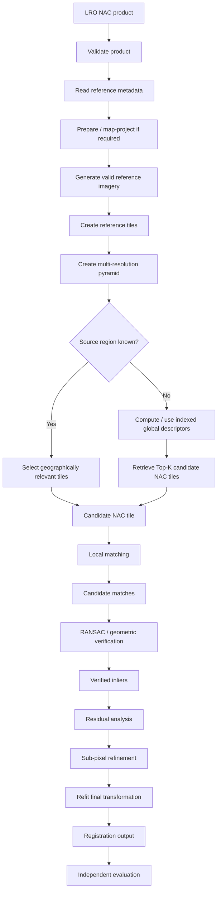

# LRO NAC Reference Imagery

**LRO NAC** refers to high-resolution lunar imagery acquired by the **Narrow Angle Camera (NAC)** of the **Lunar Reconnaissance Orbiter Camera (LROC)** system aboard NASA's **Lunar Reconnaissance Orbiter (LRO)**.

Within ChandraMap, LRO NAC is primarily treated as a **high-resolution lunar reference source**. Chandrayaan-2 imagery from OHRC, TMC-2, or an IIRS-derived registration representation can be compared against NAC imagery to estimate reliable correspondences, verify geometry, compute registration transforms, generate registered previews, and evaluate alignment quality.

The reference side of the system is as important as source-image preprocessing. A high-resolution NAC image should not automatically be used at its finest available scale. The appropriate reference scale depends on how much spatial information exists in the source sensor.

> **Core principle:** use the finest NAC reference scale that is physically justified by the information contained in the source image.

| Property                                | Value / Description                                                           |
| --------------------------------------- | ----------------------------------------------------------------------------- |
| Mission                                 | Lunar Reconnaissance Orbiter                                                  |
| Mission abbreviation                    | LRO                                                                           |
| Imaging system                          | Lunar Reconnaissance Orbiter Camera                                           |
| Imaging-system abbreviation             | LROC                                                                          |
| Camera                                  | Narrow Angle Camera                                                           |
| Camera abbreviation                     | NAC                                                                           |
| Agency                                  | NASA                                                                          |
| ChandraMap role                         | High-resolution lunar reference imagery                                       |
| Approximate ChandraMap scale assumption | Often ~0.5–2 m/px, product/acquisition-geometry dependent                     |
| Primary use                             | Reference registration, known-overlap benchmarks, reference tiles             |
| Main challenges                         | Scale differences, illumination, viewing geometry, terrain relief, projection |
| Processing authority                    | Actual NAC product metadata                                                   |

---

## 1. Mission and Instrument Context

The **Lunar Reconnaissance Orbiter (LRO)** is a NASA lunar-orbiting mission that provides multiple forms of lunar observation data.

For ChandraMap, the relevant imaging source is the **Lunar Reconnaissance Orbiter Camera (LROC)** system.

The **Narrow Angle Camera (NAC)** component provides detailed lunar surface imagery that can serve as a reference for correspondence and registration experiments.

ChandraMap uses NAC primarily because it can provide:

- detailed lunar morphology;
- crater and ridge structure;
- high-resolution local reference imagery;
- geographically meaningful products;
- independent cross-mission reference data.

The important point for the project is not the full LRO mission history. It is that NAC provides a suitable high-resolution reference dataset against which Chandrayaan-2 imagery can be compared.

---

## 2. LRO vs LROC vs NAC

These names should not be used interchangeably.

### LRO

**Lunar Reconnaissance Orbiter**

This refers to the spacecraft and mission.

### LROC

**Lunar Reconnaissance Orbiter Camera**

This refers to the camera system associated with LRO.

### NAC

**Narrow Angle Camera**

This refers to the high-resolution narrow-angle imaging component used within the LROC system.

Conceptually:

```text
LRO
│
└── LROC
    │
    ├── NAC
    └── WAC
```

Within ChandraMap, the phrase **LRO NAC** is convenient shorthand for NAC imagery associated with LROC aboard LRO.

It should not be interpreted as meaning:

- NAC is the entire mission;
- LROC and LRO are the same thing;
- NAC and WAC are interchangeable products.

---

## 3. Why ChandraMap Uses LRO NAC

LRO NAC is valuable because ChandraMap needs an independent lunar reference against which Chandrayaan-2 observations can be matched and registered.

Possible roles include:

- high-resolution reference imagery;
- known-overlap benchmark reference;
- local registration target;
- candidate-region confirmation;
- fine-registration reference;
- reference tile source;
- training or evaluation pair source;
- registration-overlay reference;
- control/check-point workflows where independently validated points exist.

Using reference imagery from a different mission is particularly valuable because it exposes the registration system to differences in:

- sensor characteristics;
- acquisition time;
- Sun geometry;
- viewing geometry;
- processing pipelines;
- image scale.

A method that works only on two products from the same imaging system is less informative than one that remains reliable across missions.

---

## 4. NAC Spatial Resolution and Product Dependence

ChandraMap technical planning treats LRO NAC imagery as often approximately:

> **~0.5–2 m/pixel, depending on the product and acquisition geometry.**

This range is an overview assumption, not a universal NAC constant.

The exact effective ground scale may depend on:

- observation geometry;
- spacecraft altitude;
- product type;
- acquisition configuration;
- processing;
- resampling;
- map projection.

Therefore ChandraMap should never hard-code:

```text
0.5 m/px
```

or:

```text
1 m/px
```

or:

```text
2 m/px
```

as though the same value applies to every NAC image.

The preferred information hierarchy is:

```text
Actual NAC product metadata
        ↓
Official product documentation
        ↓
LROC / mission documentation
        ↓
Generic ChandraMap assumptions
```

---

## 5. GSD vs Image Dimensions

Image dimensions and physical ground scale are different properties.

A NAC image may have dimensions such as:

```text
width × height
```

but those numbers alone do not indicate how much lunar terrain each pixel represents.

Important concepts include:

| Concept                  | Meaning                                                                  |
| ------------------------ | ------------------------------------------------------------------------ |
| Pixel dimensions         | Width and height of the digital image                                    |
| GSD                      | Approximate ground distance between adjacent image samples               |
| Spatial resolution       | Ability of the imaging product to represent spatial detail               |
| Ground footprint         | Lunar surface area covered                                               |
| Effective matching scale | Physical scale used when comparing source and reference                  |
| Pyramid level            | Resampled representation of the reference at a different effective scale |

Two images can have identical digital dimensions while representing very different physical regions.

Therefore scale-aware registration must use metadata and physical ground scale, not only width and height.

---

## 6. NAC as a Reference, Not a Universal Ground Truth

The term **reference image** does not mean **perfect ground truth**.

LRO NAC may serve as the reference coordinate/image domain for a registration experiment, but the reliability of the result still depends on:

- reference-product geometry;
- projection;
- metadata quality;
- terrain relief;
- acquisition geometry;
- illumination;
- correspondence quality;
- independent validation.

The concepts should remain separate:

```text
Reference image
≠
automatically perfect ground truth
```

For quantitative evaluation, ChandraMap should prefer:

1. official benchmark/challenge truth where available;
2. independently validated control or check points;
3. held-out manually verified correspondences.

A NAC pixel location should not automatically be treated as an independently verified geographic truth point for another sensor.

---

## 7. NAC Product Types and Processing State

Reference products may exist at different processing stages.

Conceptually, ChandraMap may encounter products such as:

- raw or relatively unprocessed imagery;
- calibrated imagery;
- map-projected imagery;
- derived products;
- mosaics;
- reference products created from other processing workflows.

The exact official product categories should be determined from authoritative LROC/PDS documentation rather than invented inside ChandraMap.

The important software rule is:

> **Determine the actual NAC product type before deciding how it should be processed.**

Processing assumptions that may be valid for a projected product may be incorrect for an unprojected image.

---

## 8. Map-Projected vs Unprojected NAC Imagery

Projection state has a major effect on registration strategy.

### Map-Projected NAC Imagery

Potential advantages include:

- easier geographic interpretation;
- known coordinate relationships;
- easier reference tiling;
- simpler footprint intersection;
- easier source/reference overlap selection;
- reduced burden on local computer-vision geometry.

A map-projected product can be a practical choice for a first measurable registration baseline.

### Unprojected / Sensor-Geometry Imagery

An unprojected image may require greater attention to:

- camera geometry;
- spacecraft position;
- viewing direction;
- lunar shape model;
- terrain elevation;
- geometric projection.

This does not mean every ChandraMap experiment must implement full physical camera modeling.

A reasonable early benchmark can use appropriately prepared or map-projected products before introducing raw sensor geometry.

---

## 9. NAC Metadata Important to ChandraMap

Reference metadata should be preserved as part of the registration record.

| Metadata                     | Why ChandraMap Needs It                 |
| ---------------------------- | --------------------------------------- |
| Mission                      | Provenance                              |
| Imaging system               | Reference-source identification         |
| Instrument / camera          | Correct reference routing               |
| Product ID                   | Reproducibility                         |
| Product type                 | Processing interpretation               |
| Processing level/state       | Determine preprocessing assumptions     |
| Image dimensions             | Image handling and tiling               |
| GSD / pixel scale            | Scale-aware matching                    |
| Ground footprint             | Candidate-region restriction            |
| Latitude/longitude bounds    | Geospatial search                       |
| Map projection               | Coordinate interpretation               |
| Lunar CRS / reference system | Georeferencing                          |
| Acquisition time             | Provenance                              |
| Sun geometry                 | Illumination comparison                 |
| Incidence angle              | Lighting interpretation where available |
| Emission angle               | Viewing geometry where available        |
| Phase angle                  | Observation geometry                    |
| Spacecraft geometry          | Physical imaging interpretation         |
| NoData / invalid values      | Valid-pixel masking                     |

Not every product exposes every field in the same form.

Actual product metadata and official product documentation remain authoritative.

---

## 10. LRO NAC in the ChandraMap Reference Pipeline

Unlike the Chandrayaan source path, much of the NAC reference preparation can happen before a source image is queried.

Conceptually:

```text
LRO NAC products
        ↓
Validate products
        ↓
Read metadata
        ↓
Prepare / calibrate where required
        ↓
Map-project where appropriate
        ↓
Mask invalid pixels
        ↓
Create reference tiles
        ↓
Build multi-resolution pyramids
        ↓
Compute global descriptors if retrieval is used
        ↓
Store geographic metadata
        ↓
Build searchable reference assets
```

These reference assets can then be reused across many source-image queries.

---

## 11. Offline Reference Preparation

Reference preparation should generally be separated from online registration.

Possible offline tasks include:

- product validation;
- metadata extraction;
- projection preparation;
- valid-pixel masking;
- tile generation;
- pyramid generation;
- global descriptor generation;
- geographic indexing;
- caching;
- provenance recording.

This separation has several advantages:

- reference processing does not need to be repeated for every source query;
- retrieval becomes faster;
- benchmark runs become more reproducible;
- scale levels remain consistent;
- metadata is indexed once.

Conceptually:

```text
OFFLINE

NAC archive
→ prepare
→ tile
→ pyramid
→ describe
→ index

ONLINE

source query
→ retrieve candidates
→ match
→ register
```

---

## 12. Reference Tiling

Large reference imagery may be easier to search when divided into manageable tiles.

Reference tiling can support:

- memory efficiency;
- parallel processing;
- geographic indexing;
- global retrieval;
- local matching;
- multi-resolution search.

Each tile should remain traceable to its parent reference product.

Conceptually, tile metadata should retain information such as:

- parent product;
- geographic footprint;
- reference scale;
- projection;
- pyramid level;
- pixel bounds.

Exact tile dimensions belong in configuration or implementation documentation rather than being hard-coded here.

---

## 13. Tile Overlap

Tiling introduces a boundary problem.

A useful terrain feature may cross from one tile into another.

Without overlap:

```text
Tile A | Tile B
       ^
       feature crosses boundary
```

the matcher may receive only part of a structure.

Overlapping tiles can reduce this problem.

Tile overlap should therefore be treated as a configurable design parameter influenced by:

- expected feature size;
- tile dimensions;
- retrieval strategy;
- runtime;
- storage requirements.

This document does not prescribe a fixed overlap percentage.

---

## 14. Multi-Resolution NAC Reference Pyramid

A multi-resolution reference pyramid is one of the most important components of the NAC reference strategy.

NAC may be substantially finer than the Chandrayaan source.

Conceptually:

```text
NAC original
Level 0
   ↓
Downsample
Level 1
   ↓
Downsample
Level 2
   ↓
Downsample
Level 3
   ↓
...
```

Each level represents approximately the same terrain with reduced spatial sampling.

The purpose is to provide reference imagery at multiple effective scales.

A source image can then be compared against the NAC level that most closely represents the physical information available in that source.

> **Compare at physically meaningful effective ground scales before asking a matcher to solve fine correspondence.**

---

## 15. Why Downsampling NAC Is Sometimes Correct

Using lower-resolution reference imagery may appear counterintuitive, but it can be more scientifically meaningful.

Consider:

```text
IIRS
~80 m/px

vs.

LRO NAC
~0.5–2 m/px
```

The native NAC image contains many fine terrain structures that IIRS cannot physically resolve.

A weak strategy would be:

```text
IIRS
    ↓
Upsample aggressively
    ↓
Same dimensions as NAC
    ↓
Assume equivalent detail
```

That does not recover information.

A better strategy is:

```text
NAC
    ↓
Downsample / select coarse pyramid level
    ↓
Expose structures visible near IIRS scale
```

> **Upsampling changes pixel count; it does not create missing measured terrain information.**

---

## 16. LRO NAC and OHRC

Approximate project-level values are:

```text
OHRC
~0.25–0.32 m/px

LRO NAC
often ~0.5–2 m/px
```

This can be one of the more natural high-detail cross-mission pairings in ChandraMap.

Potential mutually visible structures may include:

- crater rims;
- small-to-medium crater structure;
- ridges;
- local terrain morphology;
- larger surface-texture patterns.

However, the pairing is not automatically easy.

Important differences may include:

- nominal/effective GSD;
- Sun angle;
- shadow geometry;
- viewing geometry;
- camera characteristics;
- acquisition date;
- map projection;
- processing state.

Even when two products have similar nominal scale, illumination or viewing geometry can dominate the matching difficulty.

---

## 17. LRO NAC and TMC-2

Approximate values:

```text
TMC-2
~5 m/px

LRO NAC
often ~0.5–2 m/px
```

NAC will often contain finer structure than TMC-2.

A preferred strategy is:

```text
NAC reference
    ↓
Reference pyramid
    ↓
Select TMC-2-compatible scale
    ↓
Coarse/local matching
```

Potential shared structures include:

- medium and large crater rims;
- ridge geometry;
- broad terrain boundaries;
- larger surface morphology.

Fine NAC structures below the effective TMC-2 resolving scale should not dominate matching.

---

## 18. LRO NAC and IIRS

This is one of the most difficult ChandraMap pairings.

Approximate values:

```text
IIRS
~80 m/px
hyperspectral / imaging IR

LRO NAC
~0.5–2 m/px
high-resolution lunar imagery
```

The problem contains both:

- extreme scale difference;
- sensor-modality difference.

A defensible workflow is:

```text
IIRS product
    ↓
Derive registration-friendly 2D representation

NAC product
    ↓
Select strongly downsampled pyramid level

        ↓

Coarse structural correspondence
        ↓
Geometric verification
```

Fine NAC features should not be expected to exist in IIRS.

The final accuracy claim should remain limited by the information content of the IIRS source.

---

## 19. LRO NAC and LRO WAC

NAC and WAC serve different reference roles.

### NAC

Best suited conceptually to:

- higher-detail local reference imagery;
- local benchmark pairs;
- fine registration;
- detailed correspondence.

### WAC

Potentially suited to:

- broader lunar context;
- coarse localization;
- global/reference mosaics;
- candidate-region search;
- large-scale context and illumination studies.

WAC should not be described as merely an inferior NAC.

They serve different imaging and reference purposes.

---

## 20. Illumination Differences

A Chandrayaan source image and an NAC reference may cover the same lunar terrain while appearing very different.

Possible causes include:

- different Sun angle;
- acquisition at another time;
- different shadow direction;
- different shadow length;
- incidence-geometry differences;
- sensor-response differences.

For example, one observation may illuminate one side of a crater strongly while another emphasizes the opposite rim.

Radiometric normalization can help reduce:

- global brightness differences;
- contrast differences;
- dynamic-range differences.

It cannot geometrically move shadows.

Therefore:

```text
radiometric normalization
≠
illumination geometry correction
```

---

## 21. Stable Terrain Structure

To reduce dependence on raw brightness, ChandraMap may investigate structure-focused reference representations.

Possible research options include:

- gradients;
- edge maps;
- crater-rim geometry;
- ridge geometry;
- phase/structural representations;
- shadow masks where appropriate.

These methods may help under different illumination conditions because they emphasize spatial structure.

They should remain benchmark hypotheses until experimentally validated.

---

## 22. Viewing Geometry and Terrain Relief

NAC and Chandrayaan imagery may be acquired from different spacecraft positions and viewing directions.

Terrain relief can produce:

- local displacement;
- perspective differences;
- scale variation;
- spatially varying residuals;
- parallax-like effects.

This matters because a transformation that works well at the image center may perform poorly near the edges.

A global homography can be useful for:

- local regions;
- map-projected pairs;
- moderate geometry changes.

It should not be treated as a universal physical lunar geometry model.

---

## 23. Role of Lunar Terrain / DEM Information

Advanced versions of ChandraMap may use terrain information such as:

- lunar DEMs;
- elevation models;
- sensor geometry;
- orthorectification information.

Possible uses include:

- relief compensation;
- improved reprojection;
- physically informed residual interpretation;
- better local geometric modeling.

However, terrain-aware registration should extend rather than replace a simple measurable image-based baseline.

Unless a version specification explicitly requires a DEM, basic registration should not depend on one.

---

## 24. NAC Preprocessing Strategy

A conceptual NAC reference preparation path is:

```text
NAC product
    ↓
Product validation
    ↓
Metadata extraction
    ↓
Calibration / product preparation where required
    ↓
Map projection where appropriate
    ↓
Valid-data masking
    ↓
Reference tiling
    ↓
Multi-resolution pyramid generation
    ↓
Optional radiometric / structural representations
    ↓
Retrieval + matching assets
```

Every processing operation should be reproducible and associated with provenance.

---

## 25. Radiometric Normalization

Potential radiometric preparation may include:

- robust intensity scaling;
- histogram-based normalization;
- local contrast normalization.

These operations may help when products have different:

- dynamic ranges;
- exposures;
- contrast.

They should not be described as full illumination correction.

A different Sun direction can alter the spatial geometry of shadows in ways that intensity remapping cannot undo.

---

## 26. Reference Pyramid Selection

The source-image GSD can guide which NAC pyramid level is used first.

Conceptually:

```text
Source GSD
    ↓
Inspect NAC pyramid scales
    ↓
Select approximately compatible effective scale
    ↓
Perform coarse correspondence
```

The selected reference scale does not need to be numerically identical to the source GSD.

The goal is to avoid presenting the matcher with large amounts of detail that the source cannot physically observe.

Exact scale-ratio thresholds should be established experimentally rather than hard-coded here.

---

## 27. Coarse-to-Fine Registration with NAC

Once approximate correspondence is established at a coarse reference level, ChandraMap may progressively refine.

Conceptually:

```text
Coarse NAC level
        ↓
Approximate correspondence
        ↓
Geometric verification
        ↓
Finer NAC level
        ↓
Local matching
        ↓
Verified inliers
        ↓
Sub-pixel refinement where meaningful
```

The process should stop when further reference refinement exceeds the information supported by the source.

> **Higher reference resolution is useful only while the source still contains corresponding information.**

---

## 28. Global Search vs Known Overlap

Global lunar retrieval should be conditional.

### Known-Overlap Mode

If a source provides reliable:

- latitude/longitude;
- footprint;
- projection;
- approximate region;

ChandraMap should use that information to constrain the NAC reference set.

Conceptually:

```text
Source metadata
    ↓
Geographic overlap query
    ↓
Candidate NAC tile(s)
    ↓
Local matching
```

### Unknown-Location Mode

If location is unknown:

```text
NAC reference data
    ↓
Tiles + scales
    ↓
Global descriptors
    ↓
Searchable index

Source image
    ↓
Compatible descriptor
    ↓
Top-K candidate NAC regions
    ↓
Local registration
```

---

## 29. Using Metadata Is Not Cheating

Using valid product metadata to restrict search is correct engineering.

If reliable footprint or coordinate information already identifies the approximate lunar region, searching the entire Moon would solve a harder problem than necessary.

The registration task remains:

> identify reliable correspondences and estimate accurate alignment within the relevant overlap.

Global retrieval is useful when:

- location is unknown;
- metadata is incomplete;
- retrieval itself is being benchmarked.

Otherwise, geographic filtering should be used.

---

## 30. Global Retrieval Architecture

A conceptual retrieval design contains an offline reference side and an online source side.

### Offline Reference Side

```text
LRO NAC products
        ↓
Tile generation
        ↓
Multiple pyramid levels
        ↓
Global descriptor extraction
        ↓
Vector index
        +
Geographic metadata
```

### Online Source Side

```text
Chandrayaan source
        ↓
Compatible global representation
        ↓
Global descriptor
        ↓
Vector search
        ↓
Top-K NAC reference tiles
```

Then:

```text
Top-K reference candidates
        ↓
Local correspondence
        ↓
Geometric verification
        ↓
Registration
```

---

## 31. FAISS Role with NAC

FAISS may be used as a **vector similarity-search/indexing component**.

It does not itself:

- interpret lunar geography;
- tile NAC images;
- identify craters;
- extract local tie points;
- run SIFT;
- run LightGlue;
- perform RANSAC;
- estimate transformations;
- produce registered imagery.

Its possible role is:

```text
Reference global descriptors
        ↓
FAISS index
        ↓
Top-K candidate tiles
```

The distinction is important:

| Concept                   | Purpose                                   |
| ------------------------- | ----------------------------------------- |
| Global descriptor         | Represent entire tile/query for retrieval |
| FAISS                     | Search descriptor vectors                 |
| Local descriptor/features | Describe local image regions              |
| Local matcher             | Propose point correspondences             |
| RANSAC                    | Verify geometric consistency              |

---

## 32. Geographic Metadata Index

Each reference tile should remain connected to its lunar geography.

An intended metadata index may include fields such as:

- parent product ID;
- tile identifier;
- pixel bounds;
- geographic footprint;
- GSD;
- pyramid level;
- projection;
- acquisition metadata;
- descriptor/index identifier.

The exact schema belongs in repository contracts or implementation documentation.

The important architectural requirement is traceability:

```text
retrieval result
→ reference tile
→ parent NAC product
→ lunar location
```

---

## 33. Reference Database Reproducibility

A benchmark should be reproducible from the same NAC assets.

Useful provenance includes:

- source product ID;
- source archive;
- preprocessing version;
- projection configuration;
- tile configuration;
- tile-overlap configuration;
- pyramid-generation parameters;
- descriptor model/version;
- index-build configuration;
- geographic metadata version.

Without this information, two benchmark runs may use different effective references despite both being labeled "LRO NAC."

---

## 34. Matching Approaches Against NAC

Multiple local correspondence approaches can be benchmarked against NAC.

### Classical Baseline

A simple baseline is:

```text
Source image
    ↓
SIFT
    ↓
Local descriptors
    ↓
Descriptor matching
    ↓
Filtering
    ↓
RANSAC
```

This is useful because it is:

- interpretable;
- reproducible;
- established;
- suitable as a baseline.

It is not expected to solve every cross-sensor or illumination case.

---

### ALIKED + LightGlue

A learned sparse path may use:

```text
Source + NAC
    ↓
ALIKED
    ↓
Keypoints + descriptors
    ↓
LightGlue
    ↓
Candidate correspondences
```

Roles should be described accurately:

- ALIKED extracts local features;
- LightGlue matches compatible sparse features.

Pretrained terrestrial models should not be assumed to be lunar-invariant.

---

### LoFTR

LoFTR is a detector-free image matcher.

It estimates correspondences without requiring a conventional independent keypoint detector.

Potential advantages may appear in:

- weak-texture terrain;
- scenes where sparse keypoints are poorly repeatable.

Potential limitations include:

- domain shift;
- extreme GSD difference;
- illumination variation;
- cross-modality differences.

LoFTR should not be described merely as a feature extractor.

---

### Remote-Sensing Matching Approaches

Research candidates may include:

- RIFT;
- CFOG-style structural methods;
- other multimodal remote-sensing matching approaches.

These may be useful for difficult cross-sensor experiments.

They remain benchmark candidates rather than guaranteed improvements.

---

## 35. Candidate Matches vs Verified Inliers

Local matcher output should be called:

> **candidate correspondences**

until geometric consistency has been checked.

Conceptually:

```text
Candidate matches
        ↓
RANSAC / geometric verification
        ↓
Verified inliers
```

A matcher confidence value alone does not establish geometric correctness.

A high-confidence match may still connect unrelated crater structures.

---

## 36. Geometric Verification with NAC

A common verification path is:

```text
Source / NAC candidate matches
        ↓
RANSAC
        ↓
Initial geometric model
        ↓
Inlier / outlier classification
        ↓
Residual analysis
```

Possible baseline models include:

- affine transformation;
- homography.

Model selection should depend on:

- projection state;
- spatial extent;
- terrain;
- viewing geometry;
- residual behavior.

The simplest model that adequately explains the data is generally preferable to an unnecessarily flexible transform.

---

## 37. Why One Homography May Not Always Be Enough

A homography is useful for many local image-registration situations, but the Moon is not a flat plane.

A single projective transform may fail to model:

- significant terrain relief;
- strong viewpoint differences;
- raw camera geometry;
- large geographic extents;
- projection mismatch.

If residuals vary systematically across the image, investigate:

- projection consistency;
- local/piecewise transforms;
- sensor geometry;
- DEM-supported modeling.

A flexible warp should not be used merely to hide weak correspondences.

---

## 38. Residual Vector Analysis

After applying the estimated transformation, each validated point may still have a positional difference.

That difference is a residual.

Residual analysis should inspect:

- magnitude;
- direction;
- spatial position;
- systematic trends.

Examples:

```text
A few large residuals
→ possible remaining outliers

Residuals increasing toward one side
→ possible geometry/projection issue

Residual pattern follows terrain
→ possible relief effect
```

Residual vectors can help determine whether registration failure originates from:

- wrong correspondences;
- wrong transform;
- scale mismatch;
- projection issues;
- terrain effects.

---

## 39. Sub-Pixel Refinement

Sub-pixel refinement should occur after geometric verification.

Correct sequence:

```text
Candidate matches
        ↓
RANSAC
        ↓
Initial model
        ↓
Verified inliers
        ↓
Local sub-pixel refinement
        ↓
Refit final transformation
        ↓
Evaluation
```

Potential concepts include:

- patch correlation;
- phase-based methods;
- planetary image registration tools;
- USGS ISIS-style coregistration concepts.

Refining arbitrary candidate matches before outlier rejection risks making incorrect matches more precisely incorrect.

---

## 40. Which Image Defines the Error Unit?

ChandraMap should normally report registration error in the **source-image coordinate system first**.

For example:

```text
TMC-2 source
    ↓
registered against NAC
```

The primary image-domain error should be reported in:

> **TMC-2 pixels**

not automatically in NAC pixels.

Likewise:

| Source | Primary Error Unit  |
| ------ | ------------------- |
| OHRC   | OHRC source pixels  |
| TMC-2  | TMC-2 source pixels |
| IIRS   | IIRS source pixels  |

The reference image defines the registration target, but it does not automatically define the primary error unit.

---

## 41. NAC Pixel Error vs Source Pixel Error

Fractional-pixel values should not be compared without identifying the coordinate system.

For example:

```text
0.2 NAC px
```

is not equivalent to:

```text
0.2 TMC-2 px
```

and neither is equivalent to:

```text
0.2 IIRS px
```

because the physical scale represented by each pixel differs.

Every benchmark should clearly specify:

- source coordinate system;
- reference coordinate system;
- residual coordinate system;
- physical conversion assumptions.

---

## 42. Ground Error Conversion

Image-space residuals should be converted to physical ground distance only when the conversion is scientifically supported.

Useful requirements include:

- known product GSD;
- valid projection;
- trustworthy coordinate interpretation;
- appropriate ground/reference truth;
- correct residual coordinate system.

The weak approach is:

```text
pixel error
×
generic approximate sensor resolution
=
claimed physical accuracy
```

without validating the geometry.

ChandraMap should report physical accuracy only when the conversion is justified.

---

## 43. Reference Truth and Check Points

NAC may provide a reference image while independent check points provide evaluation truth.

The distinction is:

```text
Reference imagery
→ used for registration

Check points / ground truth
→ used for independent evaluation
```

Preferred evaluation sources include:

1. official benchmark/challenge truth;
2. independently validated check points;
3. held-out manually validated correspondences.

The evaluation points should not be used to estimate the transformation they are evaluating.

---

## 44. Do Not Fit and Judge on the Same Points

A weak evaluation pattern is:

```text
RANSAC inliers
        ↓
Fit final transform
        ↓
Calculate RMSE on same inliers
        ↓
Call it independent registration accuracy
```

Because the transform was fitted to those points, the residual can be overly optimistic.

Prefer:

```text
Fit/control points
        ↓
Estimate transform

Independent check points
        ↓
Evaluate transform
```

Fit-point residuals can still be reported as model diagnostics, but they should not be confused with independent registration accuracy.

---

## 45. Metrics for NAC-Based Registration

| Metric                | Purpose                                             |
| --------------------- | --------------------------------------------------- |
| Candidate match count | Volume of matcher proposals                         |
| Inlier count          | Number geometrically accepted                       |
| Inlier ratio          | Fraction surviving verification                     |
| Spatial coverage      | Distribution of reliable correspondences            |
| Check-point RMSE      | Independent registration accuracy                   |
| Source-pixel error    | Sensor-relative image-domain accuracy               |
| Ground error          | Physical error when conversion is valid             |
| Success rate          | Fraction of benchmark pairs successfully registered |
| Runtime               | Computational cost                                  |
| Failure rate          | Robustness across test cases                        |

If global retrieval is used:

| Retrieval Metric | Purpose                                             |
| ---------------- | --------------------------------------------------- |
| Recall@1         | Whether the correct NAC region is the top candidate |
| Recall@5         | Whether the correct region appears within Top-5     |
| Recall@K         | General candidate-retrieval performance             |

Retrieval and registration should remain separate benchmark stages.

---

## 46. Spatial Coverage

A large number of inliers may still provide weak geometric support when clustered in one region.

For example:

```text
50 inliers
all around one crater
```

may constrain only local geometry.

By contrast:

```text
20 reliable inliers
distributed across the overlap
```

may provide stronger evidence for image-wide alignment.

Possible measures include:

- grid-cell coverage;
- convex-hull coverage;
- normalized covered area;
- other spatial-distribution statistics.

No universal threshold should be introduced without benchmark evidence.

---

## 47. NAC-Based Stress Tests

### 47.1 Known-Overlap Easy Pair

**Purpose:** prove end-to-end registration.

Tests:

- product ingestion;
- matching;
- verification;
- transformation;
- registered output;
- metrics.

### 47.2 Sun-Angle Stress

**Purpose:** measure sensitivity to different illumination and shadow geometry.

### 47.3 Scale Stress

**Purpose:** measure the value of NAC pyramid selection.

### 47.4 Geometry Stress

**Purpose:** expose transform limitations under viewpoint or relief differences.

### 47.5 Low-Feature Terrain

**Purpose:** evaluate areas with weak distinctive structure.

### 47.6 Repetitive Crater Terrain

**Purpose:** test false-match resistance.

### 47.7 Modality Stress

**Purpose:** evaluate NAC against IIRS-derived imagery or another substantially different modality.

These tests should report measured results rather than assumed success.

---

## 48. Recommended Benchmark Progression

### Stage A — One Known Pair

Start with:

```text
Chandrayaan source
        +
Known-overlap NAC reference
        ↓
SIFT
        ↓
Candidate matches
        ↓
RANSAC
        ↓
Transform
        ↓
Registered overlay
        ↓
Independent metrics
```

Save:

- candidate matches;
- rejected matches;
- verified inliers;
- transform;
- registered overlay;
- check-point error;
- coverage;
- runtime.

### Stage B — NAC Reference Pyramid

Compare:

```text
Single native/full reference
```

against:

```text
Scale-aware NAC pyramid
```

using the same source/reference pairs.

### Stage C — Illumination Experiment

Compare:

- raw grayscale;
- contrast-normalized representation;
- gradient/structural representation.

### Stage D — Stronger Matcher

Compare on identical benchmark pairs:

- SIFT;
- ALIKED + LightGlue;
- LoFTR.

### Stage E — Sub-Pixel Refinement

Refine verified inliers, refit the transform, and evaluate with independent check points.

### Stage F — Larger Reference Database

Only after known-pair registration is stable:

- tile NAC imagery;
- compute global descriptors;
- build an index;
- retrieve Top-K;
- measure Recall@K.

---

## 49. NAC Reference Failure Modes

| Failure Mode                                     | Possible Cause                             | Useful Diagnostic                     |
| ------------------------------------------------ | ------------------------------------------ | ------------------------------------- |
| Very few matches                                 | Scale mismatch                             | Inspect NAC pyramid level             |
| Many fine NAC structures unmatched               | Source is physically coarser               | Downsample NAC                        |
| False crater correspondences                     | Repetitive terrain                         | Inspect RANSAC and coverage           |
| Matches clustered locally                        | Weak image-wide support                    | Measure spatial coverage              |
| Different shadows dominate                       | Sun-angle difference                       | Test structural representation        |
| Good fit-point RMSE but poor alignment elsewhere | Overfitting or model weakness              | Use check points                      |
| Residuals increase across image                  | Geometry/projection mismatch               | Inspect residual field                |
| Correct region not retrieved                     | Global-descriptor/index issue              | Measure Recall@K                      |
| Coarse match succeeds but fine refinement fails  | Source information limit                   | Stop at supported scale               |
| Geographic result is unreliable                  | Missing/incorrect metadata                 | Report image-domain registration only |
| Retrieval tile is adjacent to truth              | Tile-boundary/overlap issue                | Inspect tiling configuration          |
| Warp looks good but control geometry is weak     | Flexible transformation hiding bad matches | Inspect original tie points           |

---

## 50. Reference Product Validation

Before an NAC product is used, ChandraMap should conceptually validate:

- file readability;
- product ID;
- mission identification;
- LROC/NAC identification;
- product type;
- processing state;
- image dimensions;
- pixel type;
- valid/invalid regions;
- NoData values;
- GSD or pixel scale;
- geographic footprint;
- projection;
- lunar coordinate/reference system;
- acquisition metadata;
- illumination metadata;
- viewing geometry where available.

Missing metadata should be represented explicitly.

ChandraMap should not silently invent physical or geospatial values.

---

## 51. Reference Provenance

Every benchmark result should be traceable to the exact NAC source product and processing state.

Record where possible:

- product identifier;
- source archive;
- acquisition information;
- processing state;
- projection;
- GSD;
- crop or tile coordinates;
- tile identifier;
- pyramid level;
- preprocessing operations;
- benchmark pair identifier.

A result labeled merely:

```text
TMC-2 vs NAC
```

is not sufficiently reproducible if the exact NAC product and processing state are unknown.

---

## 52. LRO NAC Sensor/Reference Routing



This architecture keeps reference preparation separate from source-specific processing.

---

## 53. LRO NAC Reference Database

A searchable NAC reference database is an intended architectural concept for experiments requiring larger-area or global retrieval.

It may contain:

- reference tiles;
- multiple pyramid levels;
- global descriptors;
- geographic metadata;
- product metadata;
- projection information;
- parent-product references.

Conceptually:

```text
Reference database
├── tile imagery
├── pyramid levels
├── descriptors
├── geographic metadata
└── provenance
```

The presence of this design in documentation should not be interpreted as proof that the full reference database is already implemented.

Implementation status belongs in version or module-specific documentation.

---

## 54. Separation of Retrieval and Registration

Retrieval and registration solve different problems.

### Retrieval

Question:

> **Which lunar region is likely to correspond to the source image?**

Typical output:

```text
Top-K NAC candidate tiles
```

### Registration

Question:

> **Which precise points correspond, and what transformation aligns the source with the selected reference?**

Typical outputs include:

- tie points;
- verified inliers;
- transformation;
- residuals;
- registered preview;
- error metrics.

Successful retrieval does not prove successful registration.

Likewise, excellent local registration does not mean the global retrieval system can find the correct region.

---

## 55. LRO NAC Outputs in ChandraMap

Potential NAC-related outputs include:

- selected NAC product;
- selected reference tile;
- selected pyramid level;
- candidate lunar region;
- retrieval score where applicable;
- candidate local matches;
- verified inliers;
- rejected outliers;
- initial transformation;
- refined transformation;
- residual vectors;
- registered source/reference overlay;
- source-coordinate RMSE;
- spatial coverage;
- ground error where justified;
- geographic coordinates where valid;
- runtime;
- failure status.

Exact filenames and serialization contracts should be defined elsewhere in the repository.

---

## 56. Limitations of NAC as a Reference

### Product Resolution Varies

NAC should not be treated as having one universal GSD.

### Illumination May Differ Strongly

Lunar shadows may substantially alter feature appearance.

### Fine NAC Detail May Not Exist in the Source

Coarser sensors cannot reproduce all NAC structures.

### Projection Differences May Complicate Registration

Projected and unprojected products require different geometric assumptions.

### Terrain Relief May Violate Planar Models

A single affine transform or homography may be insufficient.

### Metadata Quality Matters

Poor or missing geospatial information reduces geographic reliability.

### Reference Imagery Is Not Automatically Ground Truth

Independent validation remains necessary.

### Feature Matchers Can Fail

High resolution does not guarantee robust correspondence.

### Repetitive Crater Terrain Creates Ambiguity

Many local regions may appear structurally similar.

### Visual Alignment Is Insufficient

Scientific registration requires measured evaluation.

---

## 57. Claims ChandraMap Should Avoid

ChandraMap should avoid unsupported statements such as:

> "All LRO NAC images are exactly 0.5 m/pixel."

Incorrect; scale is product/acquisition dependent.

> "NAC is always 1 m/pixel."

Do not use one universal value.

> "NAC is perfect ground truth."

A reference image is not automatically independent truth.

> "High-resolution NAC guarantees easy matching."

Illumination, scale, geometry, and terrain can still cause failure.

> "Upsampling TMC-2 or IIRS creates NAC-equivalent detail."

It does not.

> "All NAC images are already map-projected."

Product state must be inspected.

> "A homography always aligns lunar imagery."

Not for every geometry or terrain configuration.

> "More matches automatically mean better registration."

Correctness and distribution matter.

> "RANSAC proves scientific accuracy."

RANSAC verifies model consistency; it does not replace independent evaluation.

> "Sub-pixel accuracy is guaranteed."

It must be demonstrated.

> "A visual overlay is sufficient."

Quantitative metrics are required.

> "FAISS registers NAC images."

FAISS searches vectors.

> "LRO NAC and WAC are interchangeable."

They serve different roles.

---

## 58. LRO NAC Within ChandraMap Versioning

The following describes a conceptual benchmark progression. Existing ChandraMap version specifications remain authoritative.

### V1 — Known-Pair Classical Baseline

NAC acts as a known reference.

```text
Source image
    ↓
SIFT
    ↓
NAC candidate correspondences
    ↓
RANSAC
    ↓
Transform
    ↓
Registered overlay
    ↓
Metrics
```

Primary goal:

> Establish a simple measurable baseline.

### V2 — Scale / Illumination-Aware Reference

Possible additions:

- NAC reference pyramid;
- GSD-aware reference selection;
- structural representations;
- improved illumination handling.

### V3 — Retrieval + Advanced Matching

Possible additions:

- NAC tiling;
- global descriptors;
- vector retrieval;
- Top-K search;
- ALIKED + LightGlue;
- LoFTR;
- additional remote-sensing matchers.

### V4 — Research-Grade Lunar Geometry

Possible additions:

- DEM-aware processing;
- physical sensor geometry;
- local/piecewise transformations;
- advanced sub-pixel refinement;
- larger cross-sensor benchmark;
- lunar-specific representations.

These are conceptual roles, not claims that every capability is implemented.

---

## 59. Comparison with Other ChandraMap Data Sources

| Data Source |                    Approximate Scale | Type                          | Typical ChandraMap Role |
| ----------- | -----------------------------------: | ----------------------------- | ----------------------- |
| OHRC        |                      ~0.25–0.32 m/px | Panchromatic                  | Very-high-detail source |
| TMC-2       |                              ~5 m/px | Panchromatic terrain imagery  | Structural source       |
| IIRS        |                             ~80 m/px | Hyperspectral / imaging IR    | Cross-modality source   |
| LRO NAC     | Often ~0.5–2 m/px, product-dependent | High-resolution lunar imagery | Fine reference          |
| LRO WAC     |                    Product-dependent | Wide-angle lunar imagery      | Coarse/global reference |

These roles are experiment-dependent and should not be treated as immutable scientific classifications.

---

## 60. Why NAC Is Not Used at Full Resolution for Every Sensor

Using the highest available reference resolution is not automatically the best registration strategy.

### OHRC Source

Fine NAC levels may be useful because both datasets can contain detailed terrain structure.

### TMC-2 Source

A reduced NAC level may be more physically appropriate for initial matching.

### IIRS Source

Strong NAC downsampling may be necessary before meaningful coarse correspondence is possible.

Therefore:

```text
Highest available reference resolution
```

is not equivalent to:

```text
Best matching resolution
```

The correct principle is:

> **Use the finest NAC level justified by the spatial information contained in the source.**

---

## 61. Reference-Side vs Source-Side Responsibilities

A modular architecture should separate source preparation from reference preparation.

### Source-Side Responsibilities

- sensor-specific preprocessing;
- source metadata parsing;
- source GSD interpretation;
- source structural representation;
- query descriptor generation.

### NAC Reference-Side Responsibilities

- product preparation;
- geographic metadata extraction;
- projection handling;
- tiling;
- pyramid generation;
- global descriptor generation;
- search indexing;
- reference provenance.

### Shared Registration Responsibilities

- local matching;
- geometric verification;
- residual analysis;
- sub-pixel refinement;
- transformation estimation;
- evaluation.

This separation makes it possible to improve one side without tightly coupling every component.

---

## 62. Relationship to the ChandraMap Pipeline

LRO NAC influences several stages of ChandraMap:

1. reference-product ingestion;
2. reference metadata extraction;
3. projection preparation;
4. valid-area masking;
5. tiling;
6. pyramid generation;
7. retrieval indexing;
8. candidate-region selection;
9. local correspondence;
10. geometric verification;
11. residual analysis;
12. sub-pixel refinement;
13. georeferencing;
14. evaluation;
15. benchmark reproducibility.

The critical architectural distinction is:

> **Reference preparation and source-sensor preprocessing are separate concerns.**

---

## 63. Relationship to ChandraMap Architecture

LRO NAC belongs primarily to the **reference-data side** of ChandraMap.

Conceptually:

```text
OFFLINE REFERENCE SIDE

LRO NAC
    ↓
Validate
    ↓
Prepare / project
    ↓
Tile
    ↓
Build scale pyramid
    ↓
Generate descriptors
    ↓
Store metadata / index
```

During online processing:

```text
ONLINE SOURCE SIDE

Chandrayaan source
    ↓
Sensor-specific preparation
    ↓
Known-region selection or retrieval
    ↓
Candidate NAC tile
    ↓
Local correspondence
    ↓
Geometric verification
    ↓
Registration
    ↓
Evaluation
```

This separation supports:

- efficient reuse of reference data;
- reproducible benchmarks;
- scalable retrieval;
- independent source-sensor development.

---

## 64. Repository Documentation Relationships

This document focuses specifically on LRO NAC.

Related sensor documentation includes:

- [`overview.md`](overview.md) — sensor and reference-data overview
- [`ohrc.md`](ohrc.md) — Chandrayaan-2 OHRC
- [`tmc2.md`](tmc2.md) — Chandrayaan-2 TMC-2
- [`iirs.md`](iirs.md) — Chandrayaan-2 IIRS

Related architecture and project documentation includes:

- [`../architecture/system-overview.md`](../architecture/system-overview.md)
- [`../architecture/v1-pipeline.md`](../architecture/v1-pipeline.md)
- [`../architecture/core-engine-architecture.md`](../architecture/core-engine-architecture.md)
- [`../architecture/backend-architecture.md`](../architecture/backend-architecture.md)
- [`../architecture/module-map.md`](../architecture/module-map.md)
- [`../architecture/data-flow.md`](../architecture/data-flow.md)
- [`../architecture/output-flow.md`](../architecture/output-flow.md)
- [`../project/goals.md`](../project/goals.md)
- [`../project/non-goals.md`](../project/non-goals.md)
- [`../project/v1-scope.md`](../project/v1-scope.md)
- [`../project/terminology.md`](../project/terminology.md)
- [`../project/assumptions.md`](../project/assumptions.md)
- [`../project/limitations.md`](../project/limitations.md)

Planned or related sensor/reference documentation may include:

- `lro-wac.md` — planned dedicated LRO WAC reference documentation

---

## 65. References and Authoritative Sources

NAC handling should prioritize primary mission, archive, and planetary-processing documentation.

Relevant authoritative source categories include:

### LRO / LROC

- NASA Lunar Reconnaissance Orbiter documentation
- LROC / Arizona State University documentation
- LROC NAC processing documentation
- metadata distributed with individual LROC NAC products

### Planetary Data Archives

- NASA Planetary Data System
- LROC PDS archive/search documentation

### Planetary Image Processing

- USGS ISIS documentation
- USGS ISIS coregistration documentation
- USGS ISIS control-network documentation
- USGS ISIS warp / planetary image-processing documentation

### Chandrayaan-2 Source Data

- ISRO Chandrayaan-2 documentation
- ISRO Chandrayaan-2 payload/science documentation
- ISRO / ISSDC PRADAN

### Local Correspondence Methods

- OpenCV documentation
- official LightGlue repository/documentation
- LoFTR publication and reference implementation
- RIFT research literature
- CFOG and related remote-sensing registration research

> **Product metadata is authoritative:** metadata distributed with the actual LRO NAC product should take precedence over generic approximate values in this document.

This file follows the supplied ChandraMap LRO NAC documentation specification and project assumptions.

---

## LRO NAC Processing Principles

The NAC reference path should consistently follow these principles.

### Use Correct Terminology

Distinguish:

```text
LRO  = mission / spacecraft
LROC = imaging system
NAC  = narrow-angle high-resolution imaging component
```

### Treat Resolution as Product-Dependent

Do not hard-code one universal NAC GSD.

### Use Product Metadata

Validated product metadata should determine physical scale, projection, and provenance.

### Adapt the Reference to the Source

Do not force every source to match native/full-resolution NAC.

### Downsampling Can Be Scientifically Correct

A coarser source should generally begin against a reference representation with comparable information content.

### Do Not Invent Source Detail

Upsampling TMC-2 or IIRS cannot create NAC-level terrain measurements.

### Compare Physical Information

Pixel dimensions alone are not enough for scale selection.

### Use Metadata to Reduce Search

If reliable source geolocation exists, use it.

### Separate Retrieval from Registration

Global search finds candidate regions.

Local registration estimates precise correspondences and geometry.

### Treat Matcher Output as Candidate Evidence

Use geometric verification before accepting matches.

### Verify Before Refining

Use:

```text
Candidate matches
        ↓
RANSAC
        ↓
Verified inliers
        ↓
Sub-pixel refinement
        ↓
Refit final transform
```

### Inspect Residuals

Systematic residual patterns can reveal geometry, projection, or terrain problems.

### Evaluate Independently

Do not use only the points that fitted the transform to claim final registration accuracy.

### Report Source-Pixel Error First

The primary image-domain error unit should correspond to the source sensor.

### Convert to Ground Units Carefully

Physical error claims require valid spatial geometry and reference truth.

### Treat NAC as a Reference, Not Automatically as Ground Truth

Reference imagery and independent evaluation truth are distinct concepts.

### Preserve Reference Provenance

Every benchmark should be traceable to exact products, tiles, scales, and preprocessing.

### Keep Mosaics Downstream

Correspondence and registration quality remain the primary technical results.

---

## Summary

LRO NAC provides ChandraMap with an important source of detailed lunar reference imagery.

Its intended role is broader than simply being a high-resolution picture of the Moon.

Within ChandraMap, NAC can support:

- known-overlap registration;
- cross-mission correspondence;
- fine reference matching;
- reference tiling;
- multi-scale search;
- candidate-region verification;
- larger-area retrieval;
- reproducible benchmarks.

A defensible NAC reference workflow is:

```text
Validate NAC product
        ↓
Read authoritative metadata
        ↓
Prepare projection / valid data
        ↓
Tile reference imagery
        ↓
Build multi-resolution pyramid
        ↓
Use source metadata or retrieval to select candidates
        ↓
Choose physically meaningful reference scale
        ↓
Generate local candidate correspondences
        ↓
Perform geometric verification
        ↓
Inspect residuals
        ↓
Refine verified tie points
        ↓
Refit final transformation
        ↓
Evaluate independently
```

The central reference-side rule is:

> **Do not use NAC at its finest available resolution simply because that resolution exists. Use the finest reference information that the source sensor can physically support, preserve the reference geometry and provenance, and measure registration independently.**
