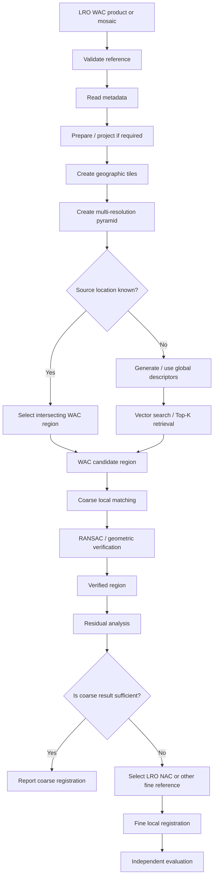

# LRO WAC Reference Imagery

**LRO WAC** refers to imagery and derived products from the **Wide Angle Camera (WAC)** component of the **Lunar Reconnaissance Orbiter Camera (LROC)** system aboard NASA's **Lunar Reconnaissance Orbiter (LRO)**.

Within ChandraMap, WAC is primarily treated as a **broad, contextual, and coarse lunar reference source**. Its value is different from that of LRO NAC. NAC is generally associated with detailed local reference imagery, while WAC is more useful for wide-area lunar context, candidate-region localization, global or regional retrieval, reference mosaics, coarse correspondence, and illumination/context experiments.

WAC should therefore not be described as simply a lower-quality NAC. The two reference sources serve different roles in a coarse-to-fine lunar correspondence system.

> **Core principle:** use WAC where broad geographic context and coarse localization are more important than fine local detail. Transition to NAC or another suitable high-resolution reference when the source data and experiment require finer registration.

| Property                    | Value / Description                                                      |
| --------------------------- | ------------------------------------------------------------------------ |
| Mission                     | Lunar Reconnaissance Orbiter                                             |
| Mission abbreviation        | LRO                                                                      |
| Imaging system              | Lunar Reconnaissance Orbiter Camera                                      |
| Imaging-system abbreviation | LROC                                                                     |
| Camera                      | Wide Angle Camera                                                        |
| Camera abbreviation         | WAC                                                                      |
| Agency                      | NASA                                                                     |
| ChandraMap role             | Broad/coarse/global lunar reference                                      |
| Spatial scale               | Product-, mode-, and processing-dependent; use product metadata          |
| Primary uses                | Context, candidate localization, retrieval, mosaics, coarse registration |
| Fine-reference counterpart  | LRO NAC                                                                  |
| Main challenges             | Scale variation, illumination, projection, product variation, geometry   |
| Processing authority        | Actual LROC/PDS product metadata                                         |

---

## 1. Mission and Instrument Context

The **Lunar Reconnaissance Orbiter (LRO)** is a NASA lunar-orbiting mission that provides multiple forms of lunar remote-sensing data.

For ChandraMap, the relevant imaging system is the **Lunar Reconnaissance Orbiter Camera (LROC)**.

LROC includes imaging capabilities with different reference roles. Within ChandraMap, two names are especially important:

- **NAC — Narrow Angle Camera**
- **WAC — Wide Angle Camera**

The Wide Angle Camera provides broader lunar context than the narrow-angle high-resolution reference path.

That broader spatial context can be useful when ChandraMap needs to answer questions such as:

- Which broad lunar region contains the source image?
- Which reference tiles should be searched?
- Which geographic region should be passed to a finer reference system?
- How does a source image relate to a wide-area lunar mosaic?
- How robust is retrieval under changes in scale or illumination?

This document focuses only on WAC's role in ChandraMap rather than the complete history or engineering design of LRO/LROC.

---

## 2. LRO vs LROC vs WAC

The terminology should remain precise.

### LRO

**Lunar Reconnaissance Orbiter**

This refers to the spacecraft and mission.

### LROC

**Lunar Reconnaissance Orbiter Camera**

This refers to the camera system/instrument carried aboard LRO.

### WAC

**Wide Angle Camera**

This refers to the wide-area imaging component associated with LROC.

### NAC

**Narrow Angle Camera**

This refers to the higher-detail narrow-angle imaging component used by ChandraMap primarily for finer local reference imagery.

Conceptually:

```text
LRO
│
└── LROC
    ├── WAC
    └── NAC
```

Within ChandraMap, **LRO WAC** and **LRO NAC** are convenient project terms for products from those respective LROC components.

They should not be treated as interchangeable.

---

## 3. WAC vs NAC

WAC and NAC serve different reference purposes.

| Aspect                  | LRO WAC                                     | LRO NAC                                 |
| ----------------------- | ------------------------------------------- | --------------------------------------- |
| Typical ChandraMap role | Broad/coarse/global reference               | Fine/local reference                    |
| Coverage emphasis       | Wider-area context                          | Narrower, higher-detail context         |
| Detail emphasis         | Lower relative spatial detail               | Higher relative spatial detail          |
| Retrieval role          | Strong candidate for regional/global search | More suitable after candidate narrowing |
| Registration role       | Coarse or contextual alignment              | Fine local registration                 |
| Typical pipeline stage  | Earlier/coarse stage                        | Later/fine stage                        |
| Mosaic/context use      | Strong                                      | More local                              |
| Best use                | Region identification and broad structure   | Detailed correspondence                 |

Neither is universally "better."

The correct reference depends on the task.

A high-detail local registration problem may favor NAC.

A broad candidate-region search may favor WAC.

---

## 4. Why ChandraMap Uses LRO WAC

WAC can provide a reference layer that is useful before fine local registration begins.

Potential ChandraMap uses include:

- coarse lunar localization;
- candidate-region retrieval;
- global or regional reference mosaics;
- broad structural comparison;
- geographic search-space reduction;
- context for reference selection;
- illumination experiments;
- wide-area reference indexing;
- retrieval benchmarking;
- WAC-to-NAC coarse-to-fine handoff.

WAC can help answer:

> **Which region of the Moon should ChandraMap search more carefully?**

That makes it useful for large-search-space problems.

If the source image already has trustworthy geospatial metadata, however, WAC-based global retrieval may be unnecessary.

---

## 5. WAC as a Coarse Reference Layer

A useful conceptual role for WAC is:

```text
Source lunar image
        ↓
Coarse / global WAC reference search
        ↓
Candidate lunar region
        ↓
Finer reference selection
        ↓
Local matching
        ↓
Fine registration
```

The finer reference may be:

- LRO NAC;
- another suitable high-resolution reference;
- a local WAC product if its detail is sufficient for the intended experiment.

This architecture is optional rather than mandatory.

If geographic metadata already provides the source region, ChandraMap can skip the global WAC search stage.

---

## 6. WAC Is Not Automatically a Fine Registration Target

A wide-area reference product may not contain enough detail to support the same fine correspondence target as a higher-resolution reference.

For example, OHRC can contain very fine terrain structures.

A WAC product may represent the same terrain more coarsely.

Therefore:

```text
OHRC fine detail
        ↓
may not exist as equivalent observable structure
        ↓
in WAC imagery
```

This does not mean WAC can never participate in local registration.

It means that the achievable registration detail is **product- and experiment-dependent**.

A common architecture is:

```text
WAC
→ coarse localization

NAC
→ fine registration
```

when finer reference imagery is available and justified.

---

## 7. Spatial Resolution and Product Dependence

ChandraMap should not assign one universal fixed GSD to LRO WAC.

The effective spatial characteristics of a WAC product may depend on:

- product type;
- imaging mode;
- observation geometry;
- processing;
- resampling;
- projection;
- mosaic generation;
- acquisition conditions.

Therefore this documentation intentionally avoids a single hard-coded WAC resolution.

The correct processing hierarchy is:

```text
Actual WAC product metadata
        ↓
Official LROC / PDS product documentation
        ↓
Mission/instrument documentation
        ↓
Generic ChandraMap assumptions
```

A wrong hard-coded scale could cause:

- selection of the wrong pyramid level;
- incorrect source/reference scale comparison;
- misleading ground-distance calculations;
- poor retrieval performance;
- invalid benchmark interpretation.

---

## 8. GSD vs Coverage vs Image Dimensions

Several spatial concepts should remain separate.

### Ground Sampling Distance

GSD describes the approximate ground spacing represented between image samples.

### Spatial Resolution

Spatial resolution relates to the ability of the sensor/product to distinguish spatial detail.

### Image Dimensions

Image dimensions describe the number of digital samples:

```text
width × height
```

### Ground Footprint

The footprint describes how much lunar terrain the image covers.

### Coverage

Coverage describes the geographic extent represented by the product, observation, or mosaic.

### Effective Matching Scale

The effective matching scale describes the physical terrain scale at which a source and reference are compared.

These quantities are related but not interchangeable.

> **A large image is not automatically a high-resolution image.**

Likewise:

> **Wide geographic coverage is not the same thing as fine spatial detail.**

---

## 9. WAC Product Types and Processing State

ChandraMap may encounter WAC-related reference data in different forms.

Conceptual examples include:

- individual observations;
- calibrated products;
- map-projected products;
- derived reference layers;
- regional mosaics;
- global mosaics;
- illumination/context products.

The exact official product categories should come from LROC/PDS documentation rather than being invented in ChandraMap.

The important rule is:

> **Identify the actual reference product before selecting the processing path.**

A mosaic should not be processed under the same assumptions as one individual observation.

Likewise, a projected product should not be handled as though it were an unprojected sensor image.

---

## 10. WAC Metadata Important to ChandraMap

Reference metadata should be retained wherever available.

| Metadata                     | Why It Matters                               |
| ---------------------------- | -------------------------------------------- |
| Mission                      | Provenance                                   |
| Imaging system               | Reference identification                     |
| Camera / instrument          | Select WAC-specific handling                 |
| Product ID                   | Reproducibility                              |
| Product type                 | Processing interpretation                    |
| Processing level/state       | Understand preparation already applied       |
| Image dimensions             | Tiling and image handling                    |
| GSD / pixel scale            | Multi-scale comparison                       |
| Geographic footprint         | Candidate search restriction                 |
| Latitude/longitude bounds    | Candidate localization                       |
| Map projection               | Coordinate interpretation                    |
| Lunar CRS / reference system | Georeferencing                               |
| Acquisition time             | Provenance and observation comparison        |
| Sun geometry                 | Illumination analysis                        |
| Incidence angle              | Lighting interpretation where available      |
| Emission angle               | Viewing geometry where available             |
| Phase angle                  | Observation geometry                         |
| NoData / invalid values      | Valid-pixel masking                          |
| Mosaic provenance            | Interpretation of derived reference products |

Not every WAC product exposes every field in the same form.

The actual product metadata remains authoritative.

---

## 11. Map Projection

Projection state strongly affects how WAC can be used.

### Map-Projected WAC

A map-projected product can simplify:

- geographic tiling;
- candidate-region lookup;
- reference mosaics;
- footprint intersection;
- geographic indexing;
- source/reference region selection;
- coarse image registration.

Conceptually:

```text
lunar coordinates
        ↕
map-projected WAC
```

provides a more direct geographic relationship than an unprojected image.

### Unprojected WAC

An unprojected product may require additional understanding of:

- camera geometry;
- observation geometry;
- projection;
- lunar shape model;
- terrain relief.

ChandraMap should not assume that every WAC product is already map-projected.

---

## 12. WAC in the Reference Architecture

A conceptual WAC reference preparation flow is:

```text
WAC product / mosaic
        ↓
Validate reference
        ↓
Read metadata
        ↓
Prepare / calibrate where required
        ↓
Project / normalize where appropriate
        ↓
Mask invalid regions
        ↓
Create geographic tiles
        ↓
Build scale pyramid
        ↓
Generate global descriptors if retrieval is enabled
        ↓
Attach geographic metadata
        ↓
Build reusable reference assets
```

This work can happen primarily on the **offline reference side** of ChandraMap.

That allows the same WAC reference infrastructure to serve many source-image queries.

---

## 13. Global Lunar Reference Layer

WAC can conceptually serve as a broad lunar reference layer.

Possible benefits include:

- large geographic coverage;
- candidate localization;
- reference-database organization;
- coarse structural comparison;
- map browsing;
- narrowing the expensive local-search space.

For an unknown source image, this enables a flow such as:

```text
Unknown source
        ↓
Global WAC search
        ↓
Top candidate regions
        ↓
Local verification
```

For a known-location source, this step may be unnecessary.

---

## 14. Reference Tiling

Large reference mosaics or products may be divided into smaller tiles.

This supports:

- efficient retrieval;
- memory management;
- parallel processing;
- geographic indexing;
- candidate generation;
- multi-scale search;
- easier local matching.

A reference tile should remain connected to its parent source.

Conceptually, retain:

- parent WAC product/mosaic;
- geographic bounds;
- pixel bounds;
- projection;
- scale;
- pyramid level;
- preprocessing provenance.

Exact tile dimensions should be defined by configuration or benchmark documentation rather than this sensor overview.

---

## 15. Tile Overlap

Reference tiling introduces boundary effects.

Consider:

```text
Tile A      Tile B
------|------
      ^
feature crosses boundary
```

A terrain structure near an edge may be divided between tiles.

Overlap between neighboring tiles can reduce this problem.

The amount of overlap should remain configurable because it affects:

- retrieval robustness;
- memory;
- storage;
- duplicate candidates;
- processing time;
- effective search coverage.

No universal overlap percentage is defined here.

---

## 16. Multi-Resolution WAC Reference Pyramid

WAC reference data may itself be prepared at several scales.

Conceptually:

```text
WAC level 0
    ↓
WAC level 1
    ↓
WAC level 2
    ↓
WAC level 3
    ↓
...
```

Each level represents the same broad terrain with different digital sampling.

The selected level should depend on:

- source GSD;
- source information content;
- retrieval task;
- correspondence stage.

> **Compare information, not pixel count.**

Equal image dimensions do not imply equal physical scales.

The system should choose a reference level that exposes terrain structures reasonably comparable to the source.

---

## 17. Coarse-to-Fine Role

WAC is particularly useful within a coarse-to-fine reference hierarchy.

One possible flow is:

```text
Unknown source
        ↓
WAC global/context search
        ↓
Broad candidate region
        ↓
WAC local confirmation
        or
NAC candidate selection
        ↓
Fine local matching
        ↓
Geometric verification
        ↓
Final registration
```

This architecture can reduce the number of high-resolution reference candidates that must be searched.

It is one valid operating mode, not a mandatory requirement.

---

## 18. Metadata-Constrained Search

Global retrieval should not be performed when trustworthy metadata has already constrained the location sufficiently.

If source metadata provides:

- latitude/longitude;
- footprint;
- map projection;
- approximate region;

ChandraMap should use it.

Conceptually:

```text
Source metadata
        ↓
Geographic intersection
        ↓
Relevant WAC / NAC region
        ↓
Local correspondence
```

This is correct engineering.

Using valid mission metadata is not cheating.

---

## 19. Known-Location vs Unknown-Location Modes

ChandraMap should support both operating modes conceptually.

### Known Location

```text
Source metadata
        ↓
Geographic intersection
        ↓
Candidate WAC / NAC reference
        ↓
Local matching
```

This minimizes unnecessary search.

### Unknown Location

```text
Source image
        ↓
Global representation
        ↓
Reference retrieval
        ↓
Top-K WAC candidate regions
        ↓
Local verification
```

These represent different problem settings and should be benchmarked separately.

---

## 20. Global Retrieval

Global retrieval answers:

> **Which region of the Moon most likely corresponds to this source image?**

A possible offline WAC retrieval pipeline is:

```text
WAC reference imagery
        ↓
Geographic tiles
        ↓
Scale levels
        ↓
Global descriptors
        ↓
Searchable vector index
```

The online query path is:

```text
Source image
        ↓
Compatible global representation
        ↓
Global descriptor
        ↓
Nearest-neighbor search
        ↓
Top-K WAC candidates
```

Then:

```text
Top-K candidates
        ↓
Local matching
        ↓
Geometric verification
```

Retrieval narrows the search.

It does not itself complete registration.

---

## 21. FAISS Role

FAISS may be used to search vector representations of reference tiles.

Its possible role is:

```text
Global reference descriptors
        ↓
FAISS index
        ↓
Top-K candidate tiles
```

FAISS does **not** directly:

- interpret lunar geography;
- detect craters;
- understand WAC images semantically;
- generate local tie points;
- perform SIFT;
- perform LightGlue matching;
- run RANSAC;
- estimate a transformation;
- warp imagery.

It is a vector-indexing and similarity-search component.

---

## 22. Global Descriptor vs Local Features

Global descriptors and local features solve different problems.

### Global Descriptor

Represents an image or tile as a compact vector for retrieval.

Used for:

```text
Where is this image likely to belong?
```

Typical output:

- Top-1 candidate;
- Top-5 candidates;
- Top-K candidates.

### Local Feature / Matcher

Produces specific point correspondences between a source and one selected candidate.

Used for:

```text
Which precise points correspond?
```

Typical output:

- candidate tie points.

Then:

```text
Candidate tie points
        ↓
Geometric verification
        ↓
Verified inliers
```

The two feature types should not be conflated.

---

## 23. WAC and OHRC

Current ChandraMap planning describes OHRC approximately as:

```text
~0.25–0.32 m/px
product-dependent
```

WAC spatial characteristics are product/mode dependent.

OHRC is a very-high-detail source.

WAC is generally more useful as a broad/contextual reference.

This creates an important information mismatch.

Many fine structures in OHRC may not be represented at equivalent detail in WAC.

A useful conceptual flow may be:

```text
OHRC
    ↓
Create coarse representation
    ↓

WAC
    ↓
Select appropriate contextual scale

    ↓

Coarse localization
    ↓
Candidate region
    ↓
NAC / other fine reference
    ↓
Fine registration
```

Direct WAC ↔ OHRC registration may still be useful in some products or experiments, but fine OHRC detail must not be assumed to exist in WAC.

---

## 24. WAC and TMC-2

TMC-2 is described in current ChandraMap planning at approximately:

```text
~5 m/px
```

with product metadata remaining authoritative.

WAC may support TMC-2 through:

- regional localization;
- structural comparison;
- reference mosaics;
- candidate-region retrieval;
- coarse correspondence.

Compatibility depends on the specific WAC reference product.

The system should not assume that TMC-2 and WAC automatically share one equivalent physical scale.

Instead:

```text
TMC-2 GSD
        ↓
Inspect WAC reference scale(s)
        ↓
Choose physically meaningful representation
        ↓
Coarse matching
```

---

## 25. WAC and IIRS

IIRS is approximately:

```text
~80 m/px
```

and provides hyperspectral / imaging infrared data.

A WAC ↔ IIRS experiment may therefore involve:

- scale differences;
- modality differences;
- illumination differences;
- different radiometric response.

IIRS should first be converted into a documented 2D registration representation.

Conceptually:

```text
IIRS spectral product
        ↓
Registration-friendly representation
        ↓

WAC reference
        ↓
Appropriate scale level

        ↓

Coarse structural correspondence
```

This pairing may be useful for broad localization because both can participate in larger-scale terrain-context experiments.

It should not be assumed to be easy.

---

## 26. WAC and NAC as a Hierarchical Reference Pair

WAC and NAC can form a useful reference hierarchy.

Conceptually:

```text
LEVEL 1
WAC
Broad / global context
        ↓
Candidate lunar region
        ↓
LEVEL 2
NAC
Local / high-detail reference
```

This architecture can avoid searching every fine-resolution NAC product during global localization.

Possible benefits include:

- lower search cost;
- smaller candidate set;
- better geographic organization;
- clear separation of coarse and fine tasks.

Actual implementation depends on:

- available products;
- geographic coverage;
- metadata;
- indexing design.

---

## 27. Reference Handoff from WAC to NAC

A coarse WAC stage can produce information that constrains a later NAC search.

Possible handoff information includes:

- candidate geographic region;
- latitude/longitude bounds;
- WAC tile identifier;
- retrieval score;
- approximate overlap;
- approximate transform;
- candidate search window;
- ranked regions.

The exact API or schema should be defined by repository contracts.

Conceptually:

```text
WAC candidate
        ↓
Geographic constraint
        ↓
Relevant NAC products / tiles
        ↓
Fine local matching
```

The handoff should reduce search without pretending that the coarse WAC transform already provides the final fine registration.

---

## 28. Illumination and WAC

WAC may also support broad illumination and context experiments.

This does not mean WAC automatically provides Sun-angle invariance.

Different observations may still contain:

- different shadow directions;
- different shadow lengths;
- different illuminated slopes;
- different incidence conditions;
- different contrast;
- different visibility of terrain.

WAC may be useful for evaluating how broad structural context changes under such conditions.

But illumination differences remain part of the registration problem.

---

## 29. Why Brightness Normalization Is Not Enough

Image normalization can change radiometric appearance.

For example:

- histogram-based normalization;
- contrast scaling;
- local contrast enhancement.

These operations may reduce intensity differences.

They cannot:

- move a shadow;
- reverse illumination geometry;
- expose terrain hidden in darkness;
- change physical Sun direction;
- reconstruct missing terrain information.

Therefore:

```text
brightness normalization
≠
illumination geometry normalization
```

Sun-angle robustness should be measured directly.

---

## 30. Structure-Focused Representations

WAC-based experiments may evaluate representations that reduce dependence on absolute brightness.

Possible research directions include:

- gradient magnitude;
- edge maps;
- large crater boundaries;
- ridge structure;
- phase-based representations;
- shadow masks;
- other structural descriptors.

Potential purpose:

```text
Raw radiometric appearance
        ↓
less emphasis
        ↓
Large stable terrain structure
```

No representation should be described as universally superior without benchmark evidence.

---

## 31. Illumination Stress Tests

A controlled illumination experiment can compare the same or overlapping lunar region under different lighting conditions.

Possible test groups:

### Similar Illumination

Purpose:

Establish a lower-stress baseline.

### Different Illumination

Purpose:

Measure degradation under larger shadow and lighting changes.

Possible metrics include:

- Recall@K for retrieval;
- candidate match count;
- inlier count;
- inlier ratio;
- spatial coverage;
- independent check-point error;
- runtime.

The benchmark should report how much performance changes rather than assume illumination invariance.

---

## 32. Viewing Geometry and Terrain Relief

Even at a coarse reference scale, geometry matters.

The same lunar region may appear differently because of:

- spacecraft position;
- viewing angle;
- local terrain slope;
- relief;
- projection;
- acquisition geometry.

A coarse WAC stage may tolerate more geometric variation than a final fine-registration stage, but candidate correspondences still require verification.

Systematic residuals may indicate:

- wrong candidate region;
- projection mismatch;
- scale error;
- terrain effects;
- insufficient geometric model.

---

## 33. WAC Preprocessing

A conceptual WAC preprocessing flow is:

```text
WAC product / mosaic
        ↓
Validate input
        ↓
Identify product type
        ↓
Read metadata
        ↓
Product / calibration handling where required
        ↓
Map projection where appropriate
        ↓
Mask invalid regions
        ↓
Optional radiometric normalization
        ↓
Tile reference
        ↓
Generate scale levels
        ↓
Generate retrieval / registration representations
```

Processing should be reproducible.

Every optional transformation should be recorded in reference provenance.

---

## 34. Radiometric Normalization

Potential WAC radiometric preparation may include:

- robust intensity scaling;
- contrast normalization;
- local contrast enhancement.

These operations may improve some same-region comparisons by reducing dynamic-range differences.

However:

> **Radiometric normalization does not guarantee illumination invariance.**

If improvement is claimed, it should be measured on controlled reference pairs.

---

## 35. Reference Mosaic Handling

WAC may sometimes be used through a derived regional or global mosaic.

A mosaic is not equivalent to one raw observation.

When a mosaic is used, ChandraMap should preserve where available:

- mosaic identifier;
- source archive;
- projection;
- scale;
- geographic extent;
- NoData regions;
- processing history;
- source-product lineage;
- mosaic version.

The mosaic itself becomes part of the benchmark provenance.

---

## 36. Mosaic vs Individual Observation

### Individual Observation

An individual WAC observation may retain more direct association with:

- acquisition time;
- illumination geometry;
- viewing geometry;
- spacecraft configuration.

### Mosaic

A mosaic may combine:

- multiple observations;
- different acquisition times;
- different illumination conditions;
- reprojection;
- seam selection;
- resampling;
- other processing decisions.

Therefore a mosaic should not automatically be interpreted using the geometry of one observation.

ChandraMap should record whether a benchmark uses:

```text
individual WAC observation
```

or:

```text
derived WAC mosaic
```

because the scientific interpretation differs.

---

## 37. Reference Provenance

Every reproducible WAC experiment should record the reference used.

Where available, retain:

- WAC product or mosaic ID;
- dataset/archive source;
- processing state;
- projection;
- effective scale/GSD;
- geographic extent;
- tile coordinates;
- tile identifier;
- pyramid level;
- preprocessing operations;
- descriptor version;
- benchmark-pair identifier.

For retrieval experiments, also record:

- tile-generation configuration;
- overlap configuration;
- descriptor model/version;
- index configuration.

Reference provenance is essential for fair benchmark comparison.

---

## 38. Matching Approaches with WAC

WAC can participate in both global retrieval and local/coarse correspondence.

Several local approaches may be benchmarked.

### Classical Baseline

```text
Source / WAC pair
        ↓
SIFT
        ↓
Descriptor matching
        ↓
Candidate correspondences
        ↓
RANSAC
```

This provides an interpretable baseline.

### Learned Sparse Matching

A possible path is:

```text
ALIKED
    ↓
Sparse keypoints + descriptors
    ↓
LightGlue
    ↓
Candidate matches
```

ALIKED extracts the sparse local features.

LightGlue matches compatible sparse features.

### Detector-Free Matching

LoFTR estimates correspondences without a conventional separate keypoint detector.

Potentially useful for:

- weak local texture;
- limited repeatable keypoints.

### Remote-Sensing-Oriented Methods

Potential research comparisons may include:

- RIFT;
- CFOG-style approaches;
- other cross-radiometric structural methods.

The useful method depends on:

- source sensor;
- WAC product;
- scale difference;
- modality;
- illumination;
- terrain.

No ranking should be assumed before measurement.

---

## 39. WAC Matching Should Not Be Overloaded

Good architecture should assign tasks according to the information a reference layer actually contains.

If WAC is functioning only as a broad localization reference, it should not be forced to solve a fine-registration problem requiring detail unavailable in that WAC product.

A cleaner architecture may be:

```text
WAC
→ broad candidate localization

NAC
→ fine correspondence

Registration engine
→ final geometric estimation
```

This prevents a coarse reference from becoming responsible for an unsupported precision target.

---

## 40. Candidate Matches vs Verified Inliers

Matcher output is provisional.

Use the terminology:

```text
Candidate matches
        ↓
Geometric verification
        ↓
Verified inliers
```

A descriptor similarity score or neural matcher confidence is not geometric proof.

Candidate matches may still correspond to:

- the wrong crater;
- repetitive structures;
- unrelated terrain patches.

Only geometric verification should promote them to verified inliers.

---

## 41. Geometric Verification

A conceptual local verification flow is:

```text
Source / WAC candidate
        ↓
Candidate matches
        ↓
RANSAC
        ↓
Initial model
        ↓
Inliers / outliers
        ↓
Residual analysis
```

Possible simple models include:

- affine transform;
- homography.

The appropriate model depends on:

- map projection;
- spatial extent;
- terrain relief;
- viewing geometry.

A homography should not be treated as universally correct for lunar imagery.

---

## 42. Geometry Caution

The Moon is not a flat poster.

Remaining errors can arise from:

- terrain relief;
- projection mismatch;
- sensor geometry;
- viewpoint differences;
- wrong scale;
- incorrect correspondences.

If the residual pattern is systematic, ChandraMap should investigate the cause rather than immediately applying a more flexible warp.

Possible responses include:

- use a more appropriate projection;
- select another reference scale;
- reject the candidate region;
- use DEM/sensor geometry in advanced versions;
- move to a better reference product.

---

## 43. Residual Analysis

Residual vectors describe the positional differences remaining after applying an estimated transformation.

Inspect:

- residual magnitude;
- residual direction;
- spatial pattern.

Examples:

```text
Large residuals everywhere
→ wrong region or wrong scale

Residuals grow toward image edge
→ model/projection mismatch

Residuals vary with terrain
→ possible relief effect

Only a few extreme residuals
→ remaining outliers
```

Residual analysis is especially valuable before passing a WAC candidate into a finer NAC stage.

A poor coarse candidate should not be promoted simply because the retrieval score is high.

---

## 44. Sub-Pixel Refinement

Sub-pixel refinement should occur only after correspondence and geometric verification are stable.

Correct order:

```text
Candidate matches
        ↓
RANSAC
        ↓
Verified inliers
        ↓
Sub-pixel refinement
        ↓
Refit final transform
```

However, a WAC coarse-localization stage may not require the same precision target as a final NAC registration stage.

The architecture should distinguish:

```text
coarse localization precision
```

from:

```text
final fine-registration precision
```

Sub-pixel refinement should therefore be used where it is scientifically and computationally meaningful.

---

## 45. Accuracy Units

Registration error should normally be reported in the **source-image coordinate system first**.

Examples:

```text
TMC-2 source
registered against WAC
→ TMC-2 pixel error
```

```text
IIRS source
registered against WAC
→ IIRS pixel error
```

```text
OHRC source
registered against WAC
→ OHRC pixel error
```

The reference dataset does not automatically define the primary error unit.

This keeps sensor-specific benchmark interpretation meaningful.

---

## 46. Ground Error

Converting image-space error into physical distance requires justified geometry.

Ground-error reporting should require:

- validated source GSD;
- valid projection;
- meaningful source-to-ground relationship;
- trustworthy reference truth.

The weak approach is:

```text
pixel error
×
generic approximate resolution
=
precise claimed ground error
```

without validating metadata.

ChandraMap should avoid such conversions.

---

## 47. Reference vs Ground Truth

LRO WAC is a reference source.

That does not automatically make every WAC pixel an independently known truth point.

The distinction is:

```text
Reference
→ used to align the source

Ground truth / check points
→ used to evaluate accuracy independently
```

Preferred evaluation sources include:

1. official benchmark/challenge ground truth;
2. independent control/check points;
3. held-out manually validated correspondences.

Points used to fit a transformation should not be the sole points used to claim independent accuracy.

---

## 48. Metrics for WAC-Based Retrieval and Registration

Retrieval and registration should be evaluated separately.

### Retrieval Metrics

| Metric            | Meaning                                             |
| ----------------- | --------------------------------------------------- |
| Recall@1          | Correct lunar region is the top retrieval candidate |
| Recall@5          | Correct region appears within Top-5                 |
| Recall@K          | Correct region appears within the selected Top-K    |
| Retrieval runtime | Computational cost of reference search              |

### Local Registration Metrics

| Metric                | Meaning                                         |
| --------------------- | ----------------------------------------------- |
| Candidate match count | Number of local matcher proposals               |
| Inlier count          | Matches surviving geometric verification        |
| Inlier ratio          | Fraction of candidates geometrically consistent |
| Spatial coverage      | Distribution of verified correspondences        |
| Check-point RMSE      | Independent registration error                  |
| Source-pixel error    | Accuracy relative to the source sensor          |
| Ground error          | Physical error when a valid conversion exists   |
| Registration runtime  | Cost of correspondence and registration         |
| Failure status        | Whether and why local registration failed       |

A high retrieval score does not prove geometric registration quality.

Likewise, excellent local registration does not establish that global retrieval is reliable.

---

## 49. Spatial Coverage

Even coarse registration benefits from well-distributed correspondences.

For example:

```text
40 inliers
all around one crater
```

may give weak evidence for broad image alignment.

Possible spatial-coverage measures include:

- grid-cell coverage;
- convex-hull coverage;
- normalized covered area;
- distribution statistics.

Distributed matches can better constrain:

- translation;
- rotation;
- scale;
- coarse projective relationships.

No universal acceptance threshold should be introduced without benchmark evidence.

---

## 50. WAC Benchmark Stress Tests

### 50.1 Global Retrieval Test

**Purpose:** determine whether the correct broad lunar region can be retrieved.

Metrics may include:

- Recall@1;
- Recall@5;
- Recall@K;
- retrieval runtime.

### 50.2 Scale Stress Test

**Purpose:** measure performance across source images with different physical GSDs.

### 50.3 Illumination Stress Test

**Purpose:** measure retrieval/registration degradation under different lighting and shadow geometry.

### 50.4 Modality Stress Test

**Purpose:** evaluate whether an IIRS-derived representation can be associated with the correct WAC reference region.

### 50.5 Low-Feature Terrain Test

**Purpose:** expose retrieval or correspondence weaknesses in broad smooth terrain.

### 50.6 Repetitive Crater Terrain Test

**Purpose:** measure false-region retrieval caused by visually similar crater fields.

### 50.7 WAC-to-NAC Handoff Test

**Purpose:** determine whether the coarse WAC stage correctly narrows the later fine-reference search.

No expected benchmark scores should be invented.

---

## 51. Recommended WAC Benchmark Progression

### Stage A — Known WAC Pair

Start with a known corresponding source/reference region.

```text
Known source
        +
Known WAC reference
        ↓
Scale preparation
        ↓
SIFT baseline
        ↓
RANSAC
        ↓
Coarse transform
        ↓
Independent metrics
```

Purpose:

> Establish basic WAC compatibility before building global retrieval.

---

### Stage B — WAC Tiling

Create a small controlled reference database.

Retain:

- tile ID;
- geographic bounds;
- parent reference;
- scale;
- projection.

This establishes reusable retrieval infrastructure.

---

### Stage C — Global Descriptor Retrieval

Offline:

```text
WAC tiles
→ global descriptors
→ vector index
```

Online:

```text
Source
→ global descriptor
→ Top-K candidates
```

Measure:

- Recall@1;
- Recall@5;
- retrieval runtime.

---

### Stage D — Scale Pyramid

Add multiple WAC effective scales.

Compare:

```text
single-scale retrieval
```

against:

```text
multi-scale retrieval
```

on the same benchmark set.

---

### Stage E — Illumination Experiment

Compare:

- raw grayscale;
- contrast-normalized input;
- structural/gradient representation.

Keep the reference regions and evaluation protocol fixed.

---

### Stage F — WAC-to-NAC Coarse-to-Fine Handoff

Use WAC to identify the candidate region.

Then:

```text
WAC candidate region
        ↓
NAC candidate selection
        ↓
Fine local registration
```

Measure:

- whether the correct region survives;
- whether fine registration succeeds;
- retrieval/runtime reduction;
- end-to-end failure rate.

---

## 52. WAC Failure Modes

| Failure Mode                                        | Possible Cause                                         | Useful Diagnostic                      |
| --------------------------------------------------- | ------------------------------------------------------ | -------------------------------------- |
| Correct region not retrieved                        | Weak global descriptor                                 | Measure Recall@K                       |
| Wrong crater field selected                         | Repetitive terrain                                     | Inspect Top-K candidates               |
| OHRC cannot fine-match WAC                          | Reference lacks sufficient detail                      | Use WAC primarily for localization     |
| IIRS/WAC matching fails                             | Cross-modality representation problem                  | Compare IIRS representations           |
| Retrieval breaks under new lighting                 | Illumination sensitivity                               | Test structural representation         |
| Candidate near tile edge fails                      | Tile-boundary effect                                   | Evaluate tile overlap                  |
| Coarse WAC result succeeds but NAC fine stage fails | Poor handoff or wrong fine reference                   | Inspect geographic candidate selection |
| Large geometric residuals                           | Projection/model mismatch                              | Inspect residual vectors               |
| Physical error looks unrealistic                    | Invalid GSD/geometry conversion                        | Verify source metadata                 |
| High retrieval score but RANSAC fails               | Visual/global similarity without geometric consistency | Inspect candidate matches              |
| One pyramid level fails consistently                | Scale mismatch                                         | Compare other scale levels             |
| Mosaic reference behaves inconsistently             | Mixed acquisition/provenance effects                   | Inspect mosaic lineage                 |

Failure cases should remain part of benchmark evidence.

---

## 53. Input / Reference Validation

Before using a WAC product or mosaic, ChandraMap should conceptually verify:

- file readability;
- mission identity;
- LROC/WAC identity;
- product or mosaic ID;
- product type;
- processing state;
- image dimensions;
- pixel data type;
- NoData/invalid regions;
- GSD or effective scale where available;
- geographic footprint;
- projection;
- lunar CRS/reference system;
- acquisition metadata where meaningful;
- illumination metadata where available;
- viewing metadata where applicable;
- mosaic lineage where relevant.

Missing metadata should be represented explicitly.

ChandraMap should not silently invent spatial or geometric values.

---

## 54. WAC Reference Routing



This flow keeps coarse WAC reference responsibilities separate from the optional fine-reference stage.

---

## 55. WAC Reference Database

A WAC reference database is an intended architectural concept for experiments requiring geographic or global search.

Potential stored assets include:

- WAC tiles;
- multiple scale levels;
- global descriptors;
- geographic metadata;
- projection information;
- parent-product references;
- mosaic lineage;
- index mappings.

Conceptually:

```text
WAC reference database
├── imagery / tiles
├── pyramid levels
├── global descriptors
├── geographic metadata
├── projection metadata
└── provenance
```

This document does not imply that every part of the reference database is currently implemented.

Implementation status belongs in version/module documentation.

---

## 56. WAC-to-NAC Reference Hierarchy

A useful reference hierarchy is:

```text
LEVEL 1
WAC
Broad/global lunar context
        ↓
Candidate geographic region
        ↓
LEVEL 2
NAC
Local/high-detail reference
```

This supports efficient coarse-to-fine search.

However, if accurate geolocation is already known:

```text
source metadata
        ↓
direct NAC selection
```

may be more appropriate.

The architecture should support both paths rather than requiring WAC for every request.

---

## 57. WAC Outputs in ChandraMap

Possible WAC-related outputs include:

- selected WAC product or mosaic;
- reference tile;
- pyramid level;
- candidate lunar region;
- geographic bounds;
- retrieval score;
- Top-K candidate list;
- local candidate correspondences;
- verified inliers;
- approximate/coarse transform;
- residual vectors;
- coarse registered preview;
- spatial coverage;
- source-coordinate RMSE;
- runtime;
- failure status;
- structured failure reason;
- fine-reference handoff information.

Exact filenames and API contracts should be defined elsewhere in the repository.

---

## 58. Reproducibility Requirements

WAC experiments should retain enough reference-database provenance to recreate the run.

Where possible, record:

- product/mosaic ID;
- archive or source;
- processing state;
- projection;
- effective GSD/scale;
- geographic extent;
- tiling configuration;
- tile overlap;
- pyramid configuration;
- descriptor model/version;
- index configuration;
- source product ID;
- matcher;
- geometric model;
- benchmark split;
- software/configuration version.

Without this information, two experiments labeled:

```text
WAC retrieval
```

may use substantially different reference databases.

---

## 59. Limitations

WAC has several important limitations within ChandraMap.

### It Is Primarily a Broad Reference

WAC generally serves a more contextual role than high-detail NAC reference imagery.

### Product Characteristics Vary

Scale, processing, and geometry should come from actual product metadata.

### Fine Source Detail May Not Exist in WAC

OHRC or other high-resolution source information may exceed what the WAC reference can represent.

### Illumination Differences Remain

Different Sun geometry can substantially change terrain appearance.

### Projection Can Affect Correspondence

Reference geometry must be interpreted correctly.

### Terrain Relief Still Matters

A coarse image does not eliminate three-dimensional terrain effects.

### Repetitive Lunar Terrain Can Confuse Retrieval

Crater fields may produce globally or locally similar patterns.

### Cross-Modal IIRS Registration Remains Difficult

A suitable IIRS representation is still required.

### WAC Is Not Automatically Ground Truth

Reference and independent truth are separate concepts.

### Coarse Localization and Fine Registration Are Different Accuracy Targets

A WAC result can be useful even when it is not the final precision result.

### Visual Plausibility Is Not Quantitative Proof

Candidate localization should be evaluated with retrieval and registration metrics.

---

## 60. Claims ChandraMap Should Avoid

Avoid unsupported statements such as:

> "LRO WAC has one exact resolution for every product."

Use product metadata.

> "WAC and NAC are interchangeable."

They serve different reference roles.

> "WAC is simply a worse NAC."

That ignores its broader contextual role.

> "WAC always contains enough detail for OHRC fine registration."

This is product- and task-dependent.

> "Global retrieval and local registration are the same task."

They are separate stages.

> "FAISS understands lunar images."

FAISS searches vectors.

> "Upscaling WAC creates NAC-level detail."

It does not.

> "Brightness normalization solves Sun-angle differences."

Shadow geometry remains.

> "The Top-1 retrieval result is automatically correct."

Retrieval output must be evaluated and locally verified.

> "A high similarity score proves geometric alignment."

It does not.

> "One homography always models lunar geometry."

Terrain/viewing effects may violate that assumption.

> "Sub-pixel accuracy is guaranteed."

It must be demonstrated.

> "WAC is perfect ground truth."

It is a reference source.

> "More matches always mean better registration."

Match correctness and spatial distribution matter.

---

## 61. WAC Within ChandraMap Versioning

The following describes a conceptual benchmark progression.

Existing version specifications should remain authoritative if they define different scopes.

### V1 — Classical Known-Pair Baseline

WAC may participate only in controlled known-region experiments.

Conceptually:

```text
Known source
        ↓
Known WAC region
        ↓
SIFT
        ↓
RANSAC
        ↓
Coarse transform
        ↓
Metrics
```

Global Moon retrieval does not need to be mandatory in V1.

### V2 — Multi-Scale / Illumination-Aware Reference

Possible additions:

- WAC scale pyramid;
- scale-aware reference selection;
- radiometric preparation;
- structural representations;
- illumination stress experiments.

### V3 — Global Retrieval

Possible additions:

- WAC geographic tiling;
- global descriptors;
- vector indexing;
- Top-K candidate search;
- WAC-to-NAC handoff;
- retrieval benchmarks.

### V4 — Research-Grade Reference Hierarchy

Possible research directions:

- lunar-specific retrieval embeddings;
- multi-reference fusion;
- illumination-aware retrieval;
- DEM/sensor geometry;
- advanced WAC/NAC hierarchy;
- larger global benchmarks.

These describe potential architecture, not guaranteed implementation status.

---

## 62. Comparison with Other ChandraMap Sensors and References

| Data Source |                                     Approximate / Relative Scale | Modality                      | Typical ChandraMap Role       |
| ----------- | ---------------------------------------------------------------: | ----------------------------- | ----------------------------- |
| OHRC        |                               ~0.25–0.32 m/px, product-dependent | Panchromatic                  | Very-high-detail source       |
| TMC-2       |                                                          ~5 m/px | Panchromatic terrain imagery  | Structural source             |
| IIRS        |                                                         ~80 m/px | Hyperspectral / imaging IR    | Cross-modal source            |
| LRO NAC     | Often ~0.5–2 m/px in current project planning, product-dependent | High-resolution lunar imagery | Fine/local reference          |
| LRO WAC     |                                           Product/mode dependent | Wide-angle lunar imagery      | Broad/coarse/global reference |

The table describes intended registration roles rather than a ranking of sensor quality.

---

## 63. Why WAC and NAC Should Both Exist in ChandraMap

WAC and NAC solve different reference problems.

### WAC

Best aligned with:

- wide-area context;
- global or regional search;
- candidate localization;
- reference mosaics;
- coarse structural matching.

### NAC

Best aligned with:

- local correspondence;
- detailed registration;
- fine benchmark pairs;
- high-resolution reference alignment.

Together they enable:

```text
WAC
→ coarse context
→ candidate region
→ NAC
→ fine local correspondence
```

This separation allows ChandraMap to use each reference source where it is most physically appropriate.

---

## 64. Source-Side vs WAC Reference-Side Responsibilities

A modular architecture should distinguish source preparation from reference preparation.

### Source Side

Responsibilities may include:

- sensor-specific preprocessing;
- source GSD interpretation;
- source metadata;
- sensor-specific representation;
- query descriptor generation.

### WAC Reference Side

Responsibilities may include:

- WAC ingestion;
- projection preparation;
- mosaic handling;
- geographic tiling;
- pyramid generation;
- global descriptors;
- geographic indexing;
- reference provenance.

### Shared Registration Layer

Responsibilities may include:

- candidate selection;
- local matching;
- RANSAC;
- residual analysis;
- transformation estimation;
- evaluation.

This separation reduces unnecessary coupling between sensors and reference infrastructure.

---

## 65. Relationship to the ChandraMap Pipeline

WAC may influence the following ChandraMap stages:

1. reference ingestion;
2. reference-product validation;
3. metadata parsing;
4. map projection;
5. mosaic handling;
6. geographic tiling;
7. reference-pyramid generation;
8. global descriptor generation;
9. candidate retrieval;
10. coarse matching;
11. geometric verification;
12. WAC-to-NAC handoff;
13. evaluation;
14. reference provenance.

The architectural emphasis is:

> **WAC belongs primarily to the broad reference/context side of ChandraMap.**

---

## 66. Relationship to ChandraMap Architecture

The reference side can be conceptualized as:

```text
OFFLINE REFERENCE SIDE

LRO WAC
    ↓
Validate
    ↓
Prepare / project
    ↓
Tile
    ↓
Build pyramid
    ↓
Generate global descriptors
    ↓
Build geographic/search index
```

A finer reference path may independently prepare NAC:

```text
LRO NAC
    ↓
Prepare
    ↓
Tile / pyramid
    ↓
Fine reference assets
```

The online source side is:

```text
OHRC / TMC-2 / IIRS
        ↓
Sensor-specific processing
        ↓
Known-location lookup
        OR
WAC retrieval
        ↓
Candidate region
        ↓
Fine-reference selection when required
        ↓
Local correspondence
        ↓
Registration
        ↓
Evaluation
```

This architecture supports both:

- direct metadata-constrained registration;
- retrieval-driven coarse-to-fine registration.

---

## 67. Repository Documentation Relationships

This document focuses specifically on LRO WAC.

Related sensor documentation includes:

- [`overview.md`](overview.md) — sensor and reference-data overview
- [`ohrc.md`](ohrc.md) — Chandrayaan-2 OHRC
- [`tmc2.md`](tmc2.md) — Chandrayaan-2 TMC-2
- [`iirs.md`](iirs.md) — Chandrayaan-2 IIRS
- [`lro-nac.md`](lro-nac.md) — LRO NAC fine-reference documentation

Related architecture and project documentation includes:

- [`../architecture/system-overview.md`](../architecture/system-overview.md)
- [`../architecture/v1-pipeline.md`](../architecture/v1-pipeline.md)
- [`../architecture/core-engine-architecture.md`](../architecture/core-engine-architecture.md)
- [`../architecture/backend-architecture.md`](../architecture/backend-architecture.md)
- [`../architecture/frontend-architecture.md`](../architecture/frontend-architecture.md)
- [`../architecture/module-map.md`](../architecture/module-map.md)
- [`../architecture/data-flow.md`](../architecture/data-flow.md)
- [`../architecture/output-flow.md`](../architecture/output-flow.md)
- [`../project/goals.md`](../project/goals.md)
- [`../project/non-goals.md`](../project/non-goals.md)
- [`../project/v1-scope.md`](../project/v1-scope.md)
- [`../project/terminology.md`](../project/terminology.md)
- [`../project/assumptions.md`](../project/assumptions.md)
- [`../project/limitations.md`](../project/limitations.md)

---

## 68. References and Authoritative Sources

WAC handling should prioritize official mission, archive, and planetary-processing documentation.

Relevant authoritative source categories include:

### LRO / LROC

- NASA Lunar Reconnaissance Orbiter documentation
- LROC / Arizona State University documentation
- official LROC WAC documentation
- metadata distributed with individual WAC products

### Planetary Data Archives

- NASA Planetary Data System
- LROC PDS archive/search documentation

### Planetary Geospatial Processing

- USGS ISIS documentation
- USGS lunar/cartographic processing documentation
- relevant lunar projection and planetary image-processing documentation

### Chandrayaan-2

- ISRO Chandrayaan-2 documentation
- ISRO Chandrayaan-2 payload/science documentation
- ISRO / ISSDC PRADAN

### Retrieval and Correspondence

- OpenCV documentation
- FAISS documentation
- official LightGlue repository/documentation
- LoFTR publication and reference implementation
- relevant planetary image-registration and remote-sensing literature

> **Product metadata is authoritative:** actual LROC WAC product metadata and official product documentation should take precedence over generic descriptions in this file.

This document follows the supplied ChandraMap LRO WAC documentation specification and project framing.

---

## LRO WAC Processing Principles

The WAC reference path should consistently follow these principles.

### Use Correct Terminology

Distinguish:

```text
LRO  = mission / spacecraft
LROC = camera system
WAC  = wide-angle imaging component
NAC  = narrow-angle higher-detail imaging component
```

### Treat WAC Primarily as a Broad Reference

Its strongest ChandraMap roles are contextual, geographic, and coarse.

### Do Not Invent a Universal GSD

Use the actual product metadata.

### WAC and NAC Have Different Jobs

WAC is generally more useful for:

- broad search;
- context;
- retrieval.

NAC is generally more useful for:

- local detailed registration.

### Use Metadata Before Global Search

If source geolocation is reliable, use it to restrict the reference set.

### Keep Global Retrieval Conditional

Do not search the whole Moon when the location is already known.

### Separate Retrieval From Registration

Top-K candidate search and point-level registration are different tasks.

### FAISS Searches Vectors

It is not an image-registration algorithm.

### Compare Physical Information

Do not infer scale compatibility from equal pixel dimensions.

### Do Not Invent Detail

Upsampling WAC or any coarse reference does not create higher-resolution terrain information.

### Respect Illumination Geometry

Brightness normalization cannot move shadows.

### Verify Candidate Matches

Matcher confidence alone is not enough.

### Use the Correct Refinement Order

Where fine refinement is justified:

```text
Candidate matches
        ↓
RANSAC
        ↓
Verified inliers
        ↓
Sub-pixel refinement
        ↓
Refit final transform
```

### Do Not Force Fine Precision Onto a Coarse Stage

A WAC localization result can be scientifically useful without being the final registration product.

### Report Source-Pixel Error First

The source sensor defines the primary image-space error unit.

### Convert to Ground Units Carefully

Physical error requires trustworthy GSD, projection, and reference truth.

### Preserve Reference Provenance

Every benchmark should be traceable to exact WAC products, mosaics, tiles, scales, and processing.

### Keep Correspondence as the Core Technical Output

Maps and lunar mosaics are downstream products.

---

## Summary

LRO WAC provides ChandraMap with a broad lunar reference layer that complements the finer local reference role of LRO NAC.

Its main value lies in:

- wide lunar context;
- geographic candidate localization;
- global and regional retrieval;
- reference mosaics;
- search-space reduction;
- coarse structural matching;
- illumination/context experiments;
- WAC-to-NAC coarse-to-fine handoff.

A defensible WAC reference workflow is:

```text
Validate WAC product or mosaic
        ↓
Read authoritative metadata
        ↓
Prepare projection / valid data
        ↓
Create geographic tiles
        ↓
Build multi-resolution reference levels
        ↓
Use source metadata or global retrieval
        ↓
Select candidate WAC region
        ↓
Perform coarse local matching
        ↓
Geometrically verify the region
        ↓
Inspect residuals
        ↓
Report coarse result
        OR
handoff to NAC / finer reference
        ↓
Fine registration where justified
```

The central WAC rule is:

> **Use WAC for the spatial context and reference scale it actually provides. Do not force it to behave like NAC, do not invent a universal WAC resolution, and do not confuse successful global retrieval with precise local registration.**
