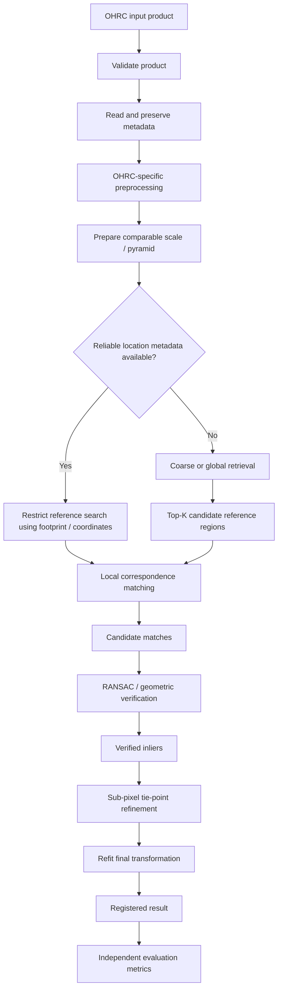

# Chandrayaan-2 OHRC

The **Orbiter High Resolution Camera (OHRC)** is a very-high-resolution visible/panchromatic imaging instrument aboard the **Chandrayaan-2 Orbiter**. Within ChandraMap, OHRC is primarily relevant as a high-detail lunar imaging source for fine image correspondence, local registration, geometric verification, illumination-robust matching experiments, and sub-pixel refinement research.

OHRC's very fine ground sampling provides access to lunar structures that may not be resolved by coarser instruments. That makes it valuable for detailed registration, but it does **not** make correspondence automatically easy. Differences in Sun angle, shadows, viewing geometry, projection, terrain relief, reference resolution, and acquisition conditions can still make two observations of the same location look substantially different.

> **Resolution note:** Official ISRO documentation reports OHRC spatial resolution around **0.25–0.32 m/pixel**, depending on the referenced product, payload description, and acquisition context. ChandraMap should treat metadata associated with the actual OHRC product as the authoritative value during processing.

| Property             | Value / Description                                                       |
| -------------------- | ------------------------------------------------------------------------- |
| Instrument           | Orbiter High Resolution Camera                                            |
| Abbreviation         | OHRC                                                                      |
| Mission              | Chandrayaan-2 Orbiter                                                     |
| Agency               | ISRO                                                                      |
| Sensor type          | Visible / panchromatic imaging                                            |
| Approximate GSD      | ~0.25–0.32 m/pixel, product/documentation-dependent                       |
| ChandraMap role      | High-detail source imagery and fine registration                          |
| Primary strengths    | Fine lunar morphology and local terrain detail                            |
| Primary challenges   | Scale difference, illumination, shadows, viewing geometry, terrain relief |
| Accuracy convention  | Report source-image pixel error first                                     |
| Processing authority | Actual product metadata                                                   |

---

## 1. Instrument Overview

**OHRC** stands for **Orbiter High Resolution Camera** and is part of the Chandrayaan-2 Orbiter payload.

For ChandraMap, the important characteristic of OHRC is not simply that it produces a large image. It produces lunar surface imagery at a very fine **physical ground scale**, allowing comparatively small terrain structures to contribute to correspondence and registration.

At a high level, OHRC is treated as a **visible/panchromatic imaging source**. Panchromatic imagery records image intensity over a broad visible-type spectral response rather than producing a hyperspectral cube such as IIRS.

OHRC can therefore provide strong spatial information about local lunar morphology, including terrain boundaries, crater geometry, ridges, local surface texture, and sharp illumination boundaries when those structures are resolved in the product.

Its primary relevance to ChandraMap is:

- fine lunar surface correspondence;
- high-resolution local registration;
- geometric verification experiments;
- fine transformation estimation;
- illumination-robust matching research;
- sub-pixel tie-point refinement;
- benchmarking the highest-detail Chandrayaan-2 source path.

This document focuses on OHRC as a registration data source rather than on the broader Chandrayaan-2 mission history.

---

## 2. Spatial Resolution and Ground Sampling Distance

### 2.1 Approximate OHRC Resolution

ChandraMap should describe OHRC spatial scale conservatively as:

> **Approximately 0.25–0.32 m/pixel, depending on the official documentation, product, and acquisition description.**

A single value should not be hard-coded as universally valid for all OHRC products.

Differences in reported values can arise from factors such as:

- the specific official document being referenced;
- product definition;
- acquisition geometry;
- processing level;
- resampling or map projection;
- how nominal or effective spatial resolution is reported.

The processing rule is therefore:

```text
Actual product metadata
        ↓
Official product documentation
        ↓
Mission / payload documentation
        ↓
Generic ChandraMap overview value
```

If the product provides a valid pixel scale or GSD, that value should control scale-aware processing.

### 2.2 Pixel Dimensions Are Not Ground Resolution

An image size such as:

```text
12000 × 5000 pixels
```

describes the digital array dimensions.

It does **not** tell us how much lunar ground each pixel represents.

Several concepts should remain separate.

| Concept                  | Meaning                                                             |
| ------------------------ | ------------------------------------------------------------------- |
| Pixel dimensions         | Width and height of the digital image                               |
| GSD                      | Approximate ground distance represented between neighboring samples |
| Ground footprint         | Lunar surface area covered by the product                           |
| Spatial resolution       | Ability of the imaging system/product to resolve spatial detail     |
| Effective matching scale | Physical terrain scale at which two products are compared           |

Two images can have identical width and height while representing completely different physical ground scales.

### 2.3 Effective Matching Scale

When OHRC is compared with a coarser reference, ChandraMap should normally compare them first at a scale where both contain meaningful terrain information.

For example:

```text
OHRC
~0.3 m/px

Reference
~5 m/px
```

The correct response is not simply to enlarge or shrink one image until both have the same pixel dimensions.

Instead, the higher-resolution representation should generally be reduced through an appropriate multi-resolution strategy so that comparable physical structures are presented to the matcher.

---

## 3. What OHRC Captures

OHRC can preserve very fine spatial variations in lunar terrain.

Depending on the specific region, acquisition geometry, illumination, processing level, and product GSD, visible structures may include:

- fine crater rims;
- small craters;
- ridge segments;
- local terrain boundaries;
- small-scale surface morphology;
- high-frequency texture;
- boulder-scale or other local features where actually resolved;
- sharp shadow boundaries;
- detailed ejecta or surface patterns where visible.

Not every OHRC image will contain all of these structures.

Feature visibility depends on:

- terrain type;
- Sun angle;
- shadowing;
- incidence geometry;
- viewing geometry;
- local slope;
- image quality;
- product processing;
- actual spatial scale.

A region with extremely fine GSD but smooth or repetitive terrain may still be difficult to register.

---

## 4. Role of OHRC in ChandraMap

OHRC is particularly useful for the parts of ChandraMap concerned with **fine spatial correspondence**.

Potential roles include:

- detailed source imagery;
- known-overlap benchmark input;
- local correspondence generation;
- fine registration after coarse localization;
- sub-pixel refinement experiments;
- geometric verification evaluation;
- illumination-stress experiments;
- cross-resolution matching research;
- high-resolution reference experiments where appropriate.

The role is experiment-dependent.

For one benchmark, OHRC may be the `source_image`.

For another experiment, it could theoretically serve as a high-resolution reference.

Instrument identity and experiment role should therefore remain separate concepts:

```text
Instrument:
OHRC

Experiment role:
source / reference / benchmark input
```

ChandraMap should not encode "OHRC always equals source image" as a scientific rule.

---

## 5. OHRC Registration Challenges

High spatial resolution gives ChandraMap more local information, but it also creates new difficulties.

### 5.1 Scale Difference

Typical approximate scales relevant to ChandraMap include:

| Data Source |                             Approximate Scale |
| ----------- | --------------------------------------------: |
| OHRC        |                               ~0.25–0.32 m/px |
| LRO NAC     | Often ~0.5–2 m/px, product/geometry-dependent |
| TMC-2       |                                       ~5 m/px |
| IIRS        |                                      ~80 m/px |

These values are overview figures, not universal product constants.

The difference between OHRC and TMC-2 can be large, while the difference between OHRC and IIRS can be extreme.

A feature visible across several OHRC pixels may occupy only a fraction of a coarser sensor sample.

Therefore:

> **A structure visible in OHRC is not automatically a structure that exists as resolved information in another sensor.**

Arbitrary image resizing cannot solve this physical mismatch.

---

### 5.2 Illumination and Sun Angle

Lunar appearance depends strongly on illumination geometry.

The same crater, ridge, or slope may appear substantially different when the Sun direction or elevation changes.

Possible effects include:

- shadow displacement;
- longer or shorter shadows;
- different crater-rim illumination;
- ridges changing from bright to dark;
- brightness variation;
- local contrast variation;
- terrain becoming hidden in shadow;
- an apparent reversal of bright/dark structure under substantially different illumination directions.

At OHRC scale, small terrain variations can generate strong local shadow patterns.

This means high resolution can sometimes **increase** sensitivity to illumination differences.

#### What Contrast Normalization Can Do

Contrast normalization can help reduce some radiometric differences.

Possible operations include:

- dynamic-range normalization;
- local contrast enhancement;
- histogram-based adjustment.

However:

> **Contrast normalization cannot geometrically move a terrain shadow back to the position it had under another Sun geometry.**

Brightness normalization and illumination-geometry correction are different problems.

---

### 5.3 Viewing Geometry

Images acquired from different spacecraft positions or viewing angles may represent terrain differently.

Possible differences include:

- perspective variation;
- relief displacement;
- local foreshortening;
- different visibility of slopes;
- sensor-related geometric distortion;
- projection differences.

At OHRC's fine spatial scale, these geometric effects may become visible at smaller terrain scales than they would in a coarser image.

This is one reason why a visually plausible global transformation may still leave systematic local residuals.

---

### 5.4 Repetitive Lunar Terrain

Lunar surfaces can contain repeated crater-like structures.

A descriptor may therefore find locally similar patterns at several unrelated locations.

Possible consequences include:

- false correspondences;
- descriptor ambiguity;
- clusters of incorrect matches;
- several matches concentrated around one crater;
- geometrically inconsistent candidate matches.

ChandraMap should therefore evaluate more than raw match count.

Important safeguards include:

- geometric verification;
- inlier ratio;
- residual analysis;
- spatial coverage;
- independent accuracy evaluation.

---

### 5.5 Low-Texture Terrain

High resolution does not guarantee strong feature content.

Some areas may contain:

- smooth regolith;
- weak texture;
- large shadowed regions;
- repetitive small structures;
- limited distinctive geometry.

A high-resolution image may therefore produce:

- few useful keypoints;
- unstable local descriptors;
- low correspondence repeatability;
- localized rather than image-wide matches.

> **Resolution describes sampling/detail capability; it does not guarantee uniqueness or matchability.**

---

## 6. OHRC Metadata Important to ChandraMap

ChandraMap should preserve OHRC metadata wherever it is available and trustworthy.

| Metadata                     | Why ChandraMap Needs It                           |
| ---------------------------- | ------------------------------------------------- |
| Instrument name              | Select the OHRC-specific processing route         |
| Mission/platform             | Product identification and provenance             |
| Product ID                   | Reproducibility and traceability                  |
| Product type / level         | Understand calibration and processing assumptions |
| Image dimensions             | Validation, tiling, and geometry calculations     |
| Pixel scale / GSD            | Physically meaningful multi-scale matching        |
| Ground footprint             | Restrict candidate reference regions              |
| Latitude / longitude         | Geospatial localization and overlap constraints   |
| Map projection               | Correct coordinate interpretation                 |
| CRS / lunar reference system | Georeferencing                                    |
| Acquisition time             | Provenance and cross-observation analysis         |
| Sun / illumination geometry  | Interpret shadow and brightness differences       |
| Incidence angle              | Illumination interpretation when available        |
| Emission angle               | Viewing geometry interpretation when available    |
| Phase angle                  | Observation/illumination relationship             |
| Spacecraft/viewing geometry  | Physically informed geometric processing          |
| NoData value                 | Prevent invalid pixels entering the matcher       |
| Valid-data mask              | Exclude missing or unusable regions               |

Exact metadata availability depends on the OHRC product.

ChandraMap should never fabricate missing values.

The ingestion layer should ideally distinguish:

- metadata present and validated;
- metadata optional but absent;
- metadata required for a particular operation but unavailable.

---

## 7. OHRC Preprocessing Strategy

OHRC preprocessing should preserve terrain information required for correspondence rather than apply transformations automatically because they are common in generic computer vision.

A conceptual OHRC path is:

```text
OHRC product
    ↓
Validate input
    ↓
Read and preserve metadata
    ↓
Interpret product / calibration state
    ↓
Projection handling where applicable
    ↓
Create valid-data mask
    ↓
Optional light denoising
    ↓
Optional radiometric / contrast normalization
    ↓
Optional structural representations
    ↓
Multi-scale preparation
    ↓
Local matching
```

Every optional preprocessing step should earn its place through measured improvement.

If an operation does not improve registration quality or robustness, it should not be retained merely because it makes the image look better.

---

### 7.1 Denoising

Light denoising may be useful when image noise materially affects descriptors or local refinement.

However, aggressive smoothing may remove:

- crater-rim edges;
- small ridge boundaries;
- fine local texture;
- sub-pixel correlation information.

Recommended research practice:

1. establish a no-denoising baseline;
2. test a light denoising configuration;
3. evaluate both on exactly the same image pairs;
4. retain denoising only if registration metrics improve.

Visual smoothness is not a sufficient reason to apply it.

---

### 7.2 Contrast Normalization

Possible OHRC radiometric preparation methods may include:

- intensity normalization;
- percentile-based scaling;
- local contrast enhancement;
- histogram-based processing.

Potential benefits include reducing differences caused by:

- dynamic range;
- exposure;
- local brightness variation.

But:

```text
contrast normalization
        ≠
Sun-geometry normalization
```

Histogram operations cannot reverse physically displaced shadows.

Illumination robustness therefore requires direct evaluation rather than assuming that normalized images are equivalent.

---

### 7.3 Structural Representations

OHRC experiments may compare conventional intensity imagery with more structure-focused representations.

Candidate research representations include:

- gradient magnitude;
- gradient orientation;
- edge maps;
- phase-based representations;
- locally normalized patches;
- crater-rim structure;
- ridge geometry;
- multi-scale structural filters.

These should be treated as hypotheses.

No representation should be declared the default lunar solution without benchmark evidence.

---

## 8. Scale Handling for OHRC

Scale handling is one of the most important OHRC design problems.

The goal is not to force two images to have equal digital dimensions.

The goal is to expose **terrain information that exists in both products**.

### Incorrect Concept

```text
Coarser reference
        ↓
arbitrary resize
        ↓
same dimensions as OHRC
        ↓
assume scale problem solved
```

This changes the number of pixels, not the information originally captured.

### Preferred Concept

```text
Reference imagery
        ↓
Build multi-resolution pyramid
        ↓
Select physically comparable level
        ↓
Coarse correspondence
        ↓
Geometric verification
        ↓
Progressive refinement
        ↓
OHRC-scale refinement only where supported
```

> **Compare information, not pixel count.**

This matters especially for OHRC because it may contain spatial structures that a coarser sensor never resolved.

For example, enlarging TMC-2 or IIRS cannot recreate small OHRC craters or other fine terrain structures absent from the original measurement.

### Refinement Limit

Fine registration should stop when further refinement would require information not present in the source/reference pair.

The most detailed member of the pair does not automatically define the valid registration scale.

The physically meaningful limit is determined by the information shared between the images and the geometry of the experiment.

---

## 9. OHRC and LRO NAC

LRO NAC is one of the most important high-resolution lunar reference sources for ChandraMap.

Both OHRC and LRO NAC can contain detailed lunar morphology, making the pairing attractive for fine registration research.

However, they are not interchangeable products.

### Relevant Similarities

Both may provide:

- detailed lunar terrain imagery;
- crater-rim structure;
- local morphology;
- relatively fine spatial sampling;
- useful local correspondence information.

### Relevant Differences

The pair may still differ in:

- GSD;
- acquisition time;
- Sun angle;
- shadow geometry;
- spacecraft viewing geometry;
- sensor characteristics;
- image processing;
- calibration;
- map projection;
- terrain visibility.

LRO NAC should therefore not be assigned one fixed project-wide resolution.

ChandraMap should use the actual NAC product scale wherever available.

### Conceptual Registration Strategy

```text
OHRC source
        +
LRO NAC reference
        ↓
Read product metadata
        ↓
Choose comparable effective scale
        ↓
Generate candidate correspondences
        ↓
Geometric verification
        ↓
Residual analysis
        ↓
Refine verified tie points
        ↓
Refit final transform
```

If LRO NAC is coarser than the OHRC product, the matcher should initially focus on terrain structures represented in both images.

OHRC-only detail should not be used as evidence that the NAC product contains the same fine information.

---

## 10. OHRC and LRO WAC

LRO WAC serves a different role from LRO NAC.

WAC provides broader contextual coverage with lower spatial detail than NAC.

Within an OHRC workflow, possible WAC roles include:

- coarse localization;
- broad regional context;
- global/reference mosaics;
- candidate-region retrieval;
- coarse reference indexing;
- lunar-scale geographic context.

A conceptual hierarchy may be:

```text
LRO WAC
    ↓
coarse/global localization
    ↓
higher-resolution reference candidate
    ↓
OHRC local registration
```

This hierarchy is experiment-dependent and should not be assumed for every pipeline.

WAC should not be treated as equivalent to OHRC for fine alignment when the WAC product lacks the necessary spatial detail.

If the final reference cannot physically resolve OHRC-scale structures, ChandraMap must not claim OHRC-scale registration evidence from those structures.

---

## 11. OHRC and TMC-2

OHRC and TMC-2 are both Chandrayaan-2 imaging instruments, but they operate at substantially different spatial scales.

Approximate overview values are:

```text
OHRC
~0.25–0.32 m/px

TMC-2
~5 m/px
```

The exact product metadata remains authoritative.

Many small structures visible in OHRC may not be independently resolvable in TMC-2.

Matching should therefore begin with terrain structures that can plausibly appear in both products.

Possible common structures include:

- larger crater rims;
- ridge geometry;
- broad terrain boundaries;
- larger ejecta patterns;
- medium-scale structural texture;
- relative geometry between prominent features.

The wrong interpretation is:

```text
TMC-2
    ↓
upsample to OHRC size
    ↓
OHRC-level detail recovered
```

That does not occur.

Upsampling creates interpolated pixels, not new physical terrain observations.

---

## 12. OHRC and IIRS

OHRC ↔ IIRS is a substantially more difficult relationship.

IIRS is an **imaging infrared spectrometer / hyperspectral instrument** and operates at a much coarser spatial scale.

Approximate project-level values are:

```text
OHRC
~0.25–0.32 m/px
visible / panchromatic

IIRS
~80 m/px
hyperspectral / imaging IR
```

This creates two problems simultaneously:

1. a very large spatial-resolution difference;
2. a sensor-modality difference.

Fine OHRC terrain structures should not be expected to appear individually in IIRS.

If an OHRC ↔ IIRS experiment is performed, the scientifically appropriate strategy is to:

- derive a registration-friendly 2D IIRS representation;
- work initially at a much coarser effective ground scale;
- emphasize structures physically visible in both datasets;
- use broad crater/ridge/terrain geometry where available;
- evaluate cross-modality robustness separately;
- avoid claiming fine OHRC-level correspondence from IIRS spatial information.

> **Upsampling IIRS cannot recover OHRC-level terrain detail.**

---

## 13. OHRC Matching Approaches

ChandraMap may evaluate several correspondence approaches rather than assuming one algorithm is universally best for OHRC.

### 13.1 Classical Baseline

A useful interpretable baseline is:

```text
SIFT
    ↓
Descriptor matching
    ↓
Ratio / cross-check filtering
    ↓
Candidate matches
    ↓
RANSAC
    ↓
Initial transform
```

SIFT is useful because it provides a conventional, explainable baseline against which stronger methods can be measured.

Possible limitations include:

- strong illumination variation;
- repeated crater structure;
- large scale gaps;
- substantial viewpoint variation.

The baseline is valuable even when it is not ultimately the strongest method.

---

### 13.2 Learned Sparse Matching

One research path is:

```text
ALIKED
    ↓
Sparse keypoints + descriptors
    ↓
LightGlue
    ↓
Candidate correspondences
```

The responsibilities should remain clear:

- **ALIKED** extracts local keypoints and descriptors;
- **LightGlue** matches compatible sparse local features.

LightGlue should not be described as if it independently performs every feature-extraction step in this configuration.

Pretrained learned models must be evaluated on lunar data.

Training or success on terrestrial images does not establish lunar invariance.

---

### 13.3 Detector-Free Matching

**LoFTR** is a detector-free correspondence method that directly estimates matches using a coarse-to-fine strategy rather than relying on a separate traditional keypoint detector.

It may be worth testing when:

- repeatable sparse keypoints are weak;
- texture is limited;
- conventional descriptors struggle.

However, detector-free matching does not remove:

- domain shift;
- scale mismatch;
- illumination differences;
- geometry requirements.

Its performance must be measured on the same OHRC benchmark pairs used for other methods.

---

### 13.4 Remote-Sensing-Oriented Research Methods

Additional research directions may include:

- RIFT;
- CFOG-style structural approaches;
- other multimodal remote-sensing correspondence methods.

These may be relevant because remote-sensing methods often emphasize structural relationships rather than identical intensity responses.

They should be treated as:

- benchmarks;
- research directions;
- experimental alternatives.

Their mention here does not imply that they are currently implemented.

---

## 14. Geometric Verification

Local matchers produce **candidate correspondences**.

A high descriptor similarity or neural confidence value does not prove that a correspondence is geometrically correct.

The conceptual OHRC verification path is:

```text
Candidate matches
        ↓
RANSAC
        ↓
Initial geometric model
        ↓
Verified inliers
        ↓
Residual analysis
```

### Initial Model Options

Depending on the data and local geometry, possible initial models may include:

- affine transformation;
- homography.

These can be useful for suitable local or map-projected image pairs.

They should not be treated as universal physical models of lunar imaging.

### The Moon Is Not a Flat Poster

A single homography may be insufficient when significant effects arise from:

- terrain relief;
- large viewing-angle differences;
- raw sensor geometry;
- large image footprints;
- spatially varying distortion.

Residual vectors should therefore be inspected across the image.

For example:

```text
similar residual direction everywhere
        ↓
possible global transform issue

residuals changing systematically across image
        ↓
possible model inadequacy / local geometry
```

Advanced experiments may later involve:

- local transformations;
- piecewise warping;
- DEM-aware geometry;
- physical sensor models.

---

## 15. Sub-Pixel Refinement

Sub-pixel refinement should occur **after** gross correspondence errors have been removed.

The correct conceptual order is:

```text
Candidate matches
        ↓
RANSAC
        ↓
Verified inliers
        ↓
Sub-pixel coordinate refinement
        ↓
Refit final transform
        ↓
Registered result
```

Refining arbitrary candidate matches before geometric verification can waste computation and refine outliers that should have been rejected.

Possible refinement concepts include:

- local patch correlation;
- phase-based refinement;
- planetary image coregistration tools;
- other validated local optimization methods.

No refinement method should be considered final without controlled evaluation.

### Why Refit the Transform?

Once inlier coordinates have been refined, the transformation should be estimated again from the refined points.

Otherwise, the final transform would still reflect the original lower-precision coordinates.

---

## 16. Accuracy Reporting for OHRC

OHRC registration accuracy should normally be reported first in:

> **source-image pixels**

For example:

```text
registration residual = 0.2 source pixels
```

is a valid pixel-domain statement when calculated appropriately.

Converting that result to a physical ground distance requires valid spatial information.

### Illustrative Conversion

Suppose, purely as an illustration, that an OHRC product has:

```text
GSD = 0.30 m/px
```

A residual of:

```text
0.2 px
```

would correspond under a simple local GSD interpretation to:

```text
0.2 × 0.30 m
```

This example demonstrates unit interpretation only. It is **not** a ChandraMap benchmark result.

A reliable physical conversion may additionally depend on:

- map projection;
- local geometry;
- reference truth;
- whether the reported GSD applies directly at the evaluated location.

Therefore ChandraMap should follow:

```text
Source-pixel error
        ↓
validate GSD / projection / reference geometry
        ↓
physical ground error, if justified
```

The same `0.2 px` value on OHRC, TMC-2, and IIRS does not represent the same physical ground error.

---

## 17. Do Not Fit and Evaluate on the Same Points

A major registration-evaluation mistake is to use one set of points to both:

1. estimate the transformation;
2. report the transformation's final accuracy.

This can produce overly optimistic results.

If a transformation is fitted specifically to minimize error on the fitting points, low residuals on those same points do not independently establish registration accuracy.

### Preferred Evaluation Hierarchy

When possible, use:

1. official or benchmark ground truth;
2. independent control/check points;
3. held-out manually verified tie points.

Check points used for evaluation should not also be used to fit the transformation they are evaluating.

Conceptually:

```text
Training / fitting tie points
        ↓
Estimate final transform

Independent check points
        ↓
Evaluate final transform
```

This separation is especially important when claiming sub-pixel registration quality.

---

## 18. Metrics for OHRC

ChandraMap should evaluate OHRC correspondence using interpretable metrics.

| Metric                | Meaning                                                           |
| --------------------- | ----------------------------------------------------------------- |
| Candidate match count | Number of raw proposed correspondences                            |
| Inlier count          | Candidate matches surviving geometric verification                |
| Inlier ratio          | Fraction of candidate matches geometrically consistent            |
| Check-point RMSE      | Registration error on independent evaluation points               |
| Spatial coverage      | How broadly reliable matches cover the overlap                    |
| Ground error          | Physical error when a valid conversion is available               |
| Success rate          | Fraction of benchmark pairs meeting the defined success criterion |
| Runtime               | Computational cost                                                |
| Failure status        | Whether and why registration failed                               |

### Spatial Coverage

A large number of matches does not guarantee strong registration.

For example:

```text
100 matches
all concentrated around one crater
```

may constrain only a small region of the image.

A better registration result generally requires reliable correspondences distributed across the overlapping region.

Possible coverage measures include:

- grid-cell coverage;
- convex-hull coverage;
- point-distribution statistics;
- other benchmark-defined spatial-distribution metrics.

The exact metric should be defined in the benchmark specification rather than inconsistently implemented per experiment.

---

## 19. OHRC Stress Tests

OHRC should be evaluated using different failure-oriented test categories.

### 19.1 Known-Overlap Test

**Purpose:** verify that the complete OHRC registration path works on a known corresponding region.

It tests basic system integration:

```text
input
→ matching
→ verification
→ transformation
→ registered output
→ metrics
```

---

### 19.2 Illumination Stress Test

**Purpose:** measure how correspondence changes when the same region is observed under substantially different illumination.

It helps evaluate:

- shadow sensitivity;
- gradient/structural representations;
- contrast normalization;
- illumination-aware matching.

The benchmark should measure the degradation rather than assume invariance.

---

### 19.3 Scale Stress Test

**Purpose:** measure robustness when OHRC and reference imagery have different GSD.

It can compare:

- direct/native-scale matching;
- multi-resolution reference matching;
- physically scale-aware preparation.

---

### 19.4 Geometry Stress Test

**Purpose:** evaluate correspondence under stronger viewing-geometry or terrain-relief differences.

It can reveal when:

- affine models fail;
- a homography becomes insufficient;
- spatially varying residuals appear.

---

### 19.5 Low-Feature Terrain Test

**Purpose:** expose behavior where strong keypoints or distinctive structures are limited.

This is important because benchmark datasets should not contain only visually convenient terrain.

---

### 19.6 Repetitive Terrain Test

**Purpose:** test robustness in crater-rich regions where several structures appear locally similar.

This evaluates:

- descriptor ambiguity;
- geometric verification;
- spatial coverage;
- false-positive rejection.

No expected score should be assumed before these experiments are run.

---

## 20. Recommended OHRC Benchmark Progression

A practical OHRC research program should progress from measurable simple cases to increasingly difficult conditions.

### Stage A — One Known OHRC Pair

Start with a known overlapping OHRC/reference pair.

```text
OHRC source
    ↓
Reference image
    ↓
SIFT baseline
    ↓
Candidate matches
    ↓
RANSAC
    ↓
Transform
    ↓
Registered overlay
    ↓
Independent metrics
```

Save:

- candidate-match visualization;
- verified-inlier visualization;
- rejected outliers;
- registered overlay;
- estimated transform;
- check-point error;
- spatial coverage;
- runtime;
- failure information if applicable.

The goal is an end-to-end measurable result, not merely a visually aligned image.

---

### Stage B — Multi-Scale Processing

Add:

- reference pyramids;
- GSD-aware pyramid-level selection;
- physically comparable scale search;
- before/after scale-handling evaluation.

The same image pairs should be used when comparing against the Stage A baseline.

---

### Stage C — Illumination Robustness

Evaluate representations such as:

```text
Raw grayscale

vs.

Normalized grayscale

vs.

Gradient / structural representation
```

Keep other experiment variables fixed where possible.

This isolates whether the preprocessing actually helps under different Sun conditions.

---

### Stage D — Stronger Matcher Comparison

Compare on the same OHRC/reference pairs:

- SIFT;
- ALIKED + LightGlue;
- LoFTR.

Where relevant, additional remote-sensing methods may be added later.

The comparison should use consistent:

- inputs;
- preprocessing;
- evaluation points;
- metrics.

---

### Stage E — Sub-Pixel Refinement

After stable verified correspondences exist:

```text
RANSAC inliers
    ↓
local refinement
    ↓
refit transform
    ↓
evaluate independent check points
```

Compare accuracy before and after refinement.

Sub-pixel performance should be treated as an experimentally measured result, not a pipeline promise.

---

## 21. OHRC Failure Modes

| Failure Mode                                       | Likely Cause                               | Useful Diagnostic                             |
| -------------------------------------------------- | ------------------------------------------ | --------------------------------------------- |
| Very few candidate matches                         | Large scale gap or illumination difference | Compare physically appropriate pyramid levels |
| Many candidate matches but few inliers             | Descriptor ambiguity or repeated terrain   | Inspect RANSAC rejection and match geometry   |
| Matches cluster around one crater                  | Poor spatial distribution                  | Calculate coverage                            |
| Good local alignment but poor image-wide alignment | Geometric model insufficient               | Inspect residual vectors across image         |
| Good-looking overlay but high independent error    | Warp/model overfitting                     | Evaluate held-out check points                |
| Fine terrain does not correspond                   | Reference lacks equivalent resolution      | Compare source/reference GSD                  |
| Matches change strongly after normalization        | Preprocessing unstable                     | Benchmark raw vs normalized imagery           |
| Different regions appear equally plausible         | Repetitive crater morphology               | Add geometric and contextual constraints      |
| Registration works only under similar lighting     | Illumination sensitivity                   | Run Sun-angle stress benchmark                |
| Physical error cannot be reported reliably         | Missing/invalid geospatial metadata        | Report source-pixel error only                |
| Fine transform becomes unstable                    | Too few well-distributed inliers           | Inspect count and spatial coverage            |
| Strong residual pattern across image               | Global transform does not model geometry   | Evaluate local/physical geometry alternatives |

Failure outputs should be retained as research evidence rather than discarded.

---

## 22. Data Validation Before Processing

Before matching an OHRC product, ChandraMap should validate as much of the following as the product format supports:

- file can be opened;
- image dimensions are valid;
- instrument identity is consistent with OHRC;
- product identifier is available when expected;
- data type / pixel type is supported;
- valid-data regions can be determined;
- NoData values are interpreted correctly;
- GSD or pixel scale is read when available;
- projection metadata is parsed when available;
- CRS / lunar coordinate system is understood when available;
- geographic footprint is extracted when available;
- acquisition geometry is retained when available;
- illumination metadata is retained when available.

Validation should distinguish between:

```text
missing optional metadata
```

and:

```text
metadata required for the requested operation
```

For example, purely image-domain known-pair correspondence may still be possible without complete geospatial metadata.

Reliable geographic coordinate output may not be.

The system should not silently substitute invented defaults for missing physical metadata.

---

## 23. OHRC Sensor Routing in ChandraMap

A high-level OHRC route can be represented as:



The key architectural rule is that global retrieval is conditional.

OHRC matching should not perform a whole-Moon search when trustworthy metadata already constrains the reference region.

---

## 24. Known-Location vs Global-Retrieval Mode

ChandraMap may support two conceptually different OHRC workflows.

### Known-Location Mode

If trustworthy metadata provides information such as:

- footprint;
- approximate coordinates;
- projection;
- known overlap;

that information should be used to reduce the search space.

Conceptually:

```text
OHRC metadata
    ↓
Reference overlap restriction
    ↓
Local candidate region
    ↓
Detailed correspondence
```

Using reliable metadata is appropriate scientific and software engineering practice.

It should not be treated as "cheating."

---

### Unknown-Location Mode

If the OHRC image location is unknown or cannot be trusted, a global or regional retrieval stage may be needed.

Conceptually:

```text
OHRC image
    ↓
Global descriptor
    ↓
Reference index search
    ↓
Top-K candidate regions
    ↓
Local feature correspondence
    ↓
Geometric verification
```

Global retrieval and local registration are separate problems and should be evaluated separately.

---

## 25. Relationship to FAISS / Retrieval

FAISS is relevant to a possible ChandraMap global-search component, but it should not be described as the image-registration algorithm.

FAISS searches **vectors**.

It requires reference descriptors to be computed before querying.

### Offline Reference Preparation

```text
Reference lunar imagery
        ↓
Tiles / scale levels
        ↓
Global descriptor extraction
        ↓
FAISS vector index
        +
Tile metadata
```

Metadata may associate indexed vectors with information such as:

- tile identity;
- location;
- scale level;
- geographic bounds;
- reference product.

### Online OHRC Retrieval

```text
OHRC query
        ↓
Compatible global descriptor
        ↓
FAISS search
        ↓
Top-K reference candidates
```

### Registration After Retrieval

Only after candidate reference regions are identified should local registration operate:

```text
Candidate reference tile
        +
OHRC image
        ↓
Local correspondence matcher
        ↓
Candidate tie points
        ↓
Geometric verification
        ↓
Final registration
```

The architectural distinction is:

| Stage                    | Purpose                                      |
| ------------------------ | -------------------------------------------- |
| Global descriptor        | Represent an image/tile for region retrieval |
| FAISS                    | Search similar descriptor vectors            |
| Local features / matcher | Generate point-level correspondences         |
| RANSAC / geometry        | Verify candidate correspondences             |
| Refinement               | Improve verified tie-point precision         |

A retrieval score should not be confused with registration accuracy.

---

## 26. OHRC Outputs

OHRC processing may produce the following conceptual outputs depending on the experiment:

- candidate correspondences;
- verified inliers;
- rejected outliers;
- refined tie points;
- final transformation model;
- registered OHRC/reference preview;
- residual vectors;
- inlier count;
- inlier ratio;
- spatial coverage;
- independent check-point RMSE;
- source-pixel registration error;
- physical ground error when scientifically valid;
- runtime;
- processing status;
- structured failure reason;
- geospatial coordinates when valid geometry permits them.

A downstream application may use the registered image to produce:

- mosaics;
- lunar map layers;
- visualization products.

These are downstream products.

The scientifically important result remains the measured correspondence and registration quality.

---

## 27. OHRC Limitations

OHRC has important limitations despite its very high spatial resolution.

### Resolution Does Not Remove Illumination Differences

Fine spatial sampling may make shadow differences more visible, not less.

### Large GSD Gaps Still Matter

Matching OHRC against TMC-2, WAC, IIRS, or another coarser product requires physically meaningful scale handling.

### Terrestrial Models May Experience Domain Shift

Feature models trained mainly on Earth imagery are not automatically robust to lunar imagery.

Their performance must be measured.

### Lunar Shadows Can Change Strongly

Sun-angle differences can alter the apparent local image structure.

### A Global Homography May Be Insufficient

Terrain relief and viewing geometry can produce spatially varying residuals.

### Missing Metadata Limits Geospatial Interpretation

Image registration may still be possible without full metadata, but confident georeferencing may not be.

### Resolution Is Product-Dependent

The generic `0.25–0.32 m/pixel` range should never replace actual product metadata.

### Visual Registration Is Not Quantitative Proof

An attractive overlay may hide weak or incorrectly distributed correspondences.

### Sub-Pixel Accuracy Must Be Demonstrated

Sub-pixel refinement is an algorithmic capability to evaluate, not a guaranteed result.

### OHRC Detail Does Not Exist in Every Reference

Fine terrain structures visible in OHRC cannot be assumed to exist in a coarser sensor product.

---

## 28. Claims ChandraMap Should Avoid

ChandraMap documentation, demos, and research reports should avoid unsupported statements such as:

> "OHRC is always exactly 25 cm/pixel."

Use product-aware wording instead.

> "Higher resolution makes image matching easy."

It does not.

> "Resizing makes all sensors equivalent."

It does not change the underlying physical information.

> "AI automatically handles Sun-angle differences."

This requires experimental evidence.

> "LightGlue is lunar invariant."

No such conclusion should be made without a lunar benchmark.

> "LoFTR is lunar invariant."

Likewise, this must be measured.

> "Every OHRC image can be matched."

Some products or terrain conditions may fail.

> "Sub-pixel accuracy is guaranteed."

Sub-pixel performance must be demonstrated with suitable ground truth or independent check points.

> "More matches always mean better registration."

Incorrect, clustered, or redundant matches can produce a large count without strong geometry.

> "The overlay looks aligned, therefore registration is accurate."

Visual inspection is not sufficient.

> "The registration is accurate to X metres."

Not unless the pixel-to-ground conversion is scientifically valid.

> "Upsampling TMC-2, IIRS, or WAC creates OHRC-level detail."

It does not.

---

## 29. OHRC Within ChandraMap Versioning

OHRC can support a benchmark-oriented progression from a classical baseline toward more advanced registration research.

The following describes a **conceptual progression** only. Repository version specifications remain authoritative if they define different scopes.

### V1 — Classical Baseline

Possible OHRC scope:

```text
Known OHRC/reference pair
        ↓
SIFT
        ↓
Descriptor matching
        ↓
RANSAC
        ↓
Transform
        ↓
Registered preview
        ↓
Measured outputs
```

The purpose is to establish a reproducible baseline.

---

### V2 — Scale and Illumination Improvements

Potential additions may include:

- multi-resolution reference pyramids;
- GSD-aware comparison;
- improved radiometric preparation;
- gradient/structural representations;
- illumination stress tests.

The goal is to identify whether sensor-aware preparation improves the baseline.

---

### V3 — Advanced Matching

Potential additions may include:

- learned sparse matching;
- detector-free correspondence;
- stronger global retrieval;
- more difficult OHRC reference pairs;
- expanded stress testing.

Advanced algorithms should be compared against earlier versions on consistent benchmark pairs.

---

### V4 — Research-Grade Refinement

Potential research directions may include:

- local or piecewise geometric models;
- DEM-aware registration;
- physical sensor geometry;
- improved sub-pixel techniques;
- robust large-scale retrieval;
- generalized cross-sensor registration.

These are architectural research directions, not claims of completed implementation.

---

## 30. Relationship to Other Sensors

| Sensor / Dataset |                                     Approximate Scale | Relationship to OHRC                                   |
| ---------------- | ----------------------------------------------------: | ------------------------------------------------------ |
| OHRC             |                    ~0.25–0.32 m/px, product-dependent | Fine-detail Chandrayaan-2 source                       |
| TMC-2            |                                               ~5 m/px | Coarser structural correspondence; substantial GSD gap |
| IIRS             |                                              ~80 m/px | Very large GSD gap plus modality difference            |
| LRO NAC          |                  Often ~0.5–2 m/px, product-dependent | Important high-resolution lunar reference              |
| LRO WAC          | Product-dependent; broader/lower-detail role than NAC | Coarse/global context and retrieval reference          |

The comparison should be interpreted as a registration relationship rather than a ranking of sensor quality.

Each instrument was designed for different measurement objectives.

---

## 31. Repository Documentation Relationships

This file focuses specifically on OHRC.

For broader ChandraMap context, see:

- [`overview.md`](overview.md) — sensor and reference-data overview
- [`../architecture/system-overview.md`](../architecture/system-overview.md) — system-level architecture
- [`../architecture/v1-pipeline.md`](../architecture/v1-pipeline.md) — V1 processing flow
- [`../architecture/core-engine-architecture.md`](../architecture/core-engine-architecture.md) — core registration engine architecture
- [`../architecture/data-flow.md`](../architecture/data-flow.md) — movement of data through ChandraMap
- [`../architecture/output-flow.md`](../architecture/output-flow.md) — correspondence and registration outputs
- [`../project/terminology.md`](../project/terminology.md) — shared project terminology
- [`../project/assumptions.md`](../project/assumptions.md) — architectural/research assumptions
- [`../project/limitations.md`](../project/limitations.md) — known limitations
- [`../project/v1-scope.md`](../project/v1-scope.md) — V1 scope and boundaries

Possible sensor-specific documents that may be added or maintained separately include:

- `tmc2.md`
- `iirs.md`
- `lro-nac.md`
- `lro-wac.md`

These names should be treated as planned/documentation relationships unless those files are present in the repository.

---

## 32. References and Authoritative Sources

OHRC implementation decisions should be based primarily on mission and product documentation rather than generic secondary descriptions.

Relevant authoritative source categories include:

### Chandrayaan-2 / OHRC

- ISRO Chandrayaan-2 mission documentation
- ISRO Chandrayaan-2 payload documentation
- ISRO Chandrayaan-2 science documentation
- ISRO / ISSDC PRADAN
- Chandrayaan-2 product documentation
- Metadata distributed with individual OHRC products

### Lunar Reference Data

- Lunar Reconnaissance Orbiter Camera documentation
- LROC / Arizona State University documentation
- NASA Planetary Data System
- Metadata supplied with LRO NAC and WAC products

### Planetary Image Processing

- USGS ISIS documentation
- USGS ISIS image coregistration documentation
- USGS planetary control-network documentation

### Correspondence Algorithms

- OpenCV documentation for SIFT, feature matching, and geometric estimation
- Official LightGlue repository and documentation
- LoFTR publication and reference implementation
- RIFT research literature
- CFOG and related remote-sensing registration literature

> **Processing authority:** If metadata delivered with a specific OHRC product differs from the approximate summary values in this document, the validated product metadata should control ChandraMap processing.

---

## OHRC Processing Principles

The OHRC path in ChandraMap should consistently follow these principles.

### Product Metadata Comes First

Do not hard-code a universal OHRC GSD.

Use validated product metadata whenever available.

### High Resolution Does Not Guarantee Easy Matching

Illumination, terrain, viewing geometry, reference scale, and repetitive morphology can dominate the registration problem.

### Compare Physical Information

Do not interpret equal image dimensions as equal physical resolution.

### Use Multi-Scale Processing Before Fine Matching

Bring reference information to a physically meaningful comparison scale before requiring fine correspondence.

### Never Invent Missing Detail

Upsampling a coarser sensor does not recreate OHRC-level terrain information.

### Treat Matcher Output as Candidate Evidence

Local feature correspondences require geometric verification.

### Verify Before Refining

Use the order:

```text
Candidate matches
    ↓
RANSAC
    ↓
Verified inliers
    ↓
Sub-pixel refinement
    ↓
Refit final transform
```

### Evaluate Independently

Do not use only the transformation-fitting points as proof of final registration accuracy.

### Report Source-Pixel Error First

Convert to physical units only when GSD, projection, and reference geometry justify that conversion.

### Keep Registration as the Core Result

The important OHRC outputs are reliable correspondences, verified geometry, measured error, spatial coverage, and interpretable registration quality.

A lunar mosaic is a downstream application of those results.

---

## Summary

OHRC provides ChandraMap with exceptionally detailed lunar imagery, approximately **0.25–0.32 m/pixel depending on the specific product and official description**. This fine scale makes OHRC an important source for detailed correspondence and registration experiments.

Its high resolution does not remove the core difficulties of lunar registration.

OHRC matching still has to account for:

- large cross-sensor scale differences;
- Sun-angle changes;
- shadow geometry;
- spacecraft viewing geometry;
- terrain relief;
- map projection;
- repetitive crater structures;
- low-feature regions;
- reference-product limitations.

A defensible OHRC workflow therefore follows the sequence:

```text
Validate OHRC product
        ↓
Preserve authoritative metadata
        ↓
Apply OHRC-aware preparation
        ↓
Compare at physically meaningful scales
        ↓
Generate candidate correspondences
        ↓
Perform geometric verification
        ↓
Refine verified tie points
        ↓
Refit the final transformation
        ↓
Evaluate on independent evidence
        ↓
Report source-pixel accuracy and interpretable metrics
```

The governing principle is:

> **Use OHRC's fine spatial information where it genuinely exists, but never infer matching detail that the corresponding reference sensor did not physically capture.**

<!-- Documentation request and supplied project context: :contentReference[oaicite:0]{index=0} -->
