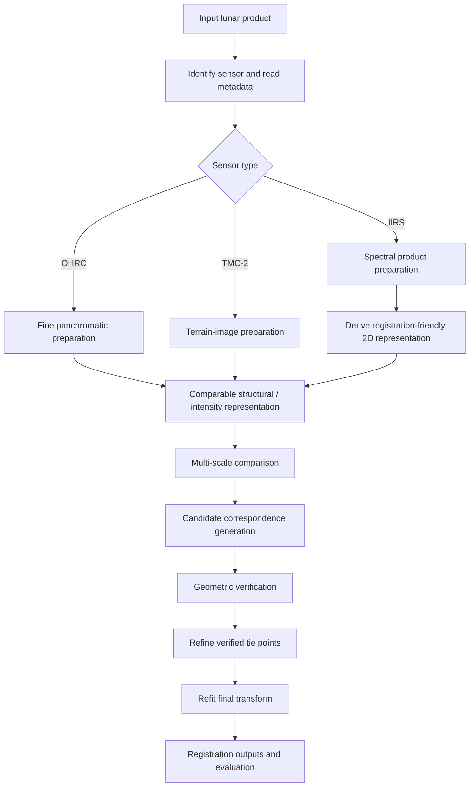

# Sensor and Reference Data Overview

ChandraMap is a multi-sensor lunar image correspondence and registration system. Its inputs may come from instruments with very different spatial resolutions, wavelength ranges, acquisition geometries, illumination conditions, and physical measurement principles.

The central rule of the sensor layer is:

> **The instruments used by ChandraMap do not produce interchangeable images.**

Chandrayaan-2 **OHRC**, **TMC-2**, and **IIRS** should not be treated as three resolutions of the same camera. OHRC and TMC-2 provide panchromatic imaging at different ground scales, while IIRS is an imaging infrared spectrometer whose data may contain many spectral bands rather than a single conventional grayscale image.

Sensor handling therefore occurs **before** the main correspondence algorithm:

```text
Sensor-specific preparation
        ↓
Comparable representation where appropriate
        ↓
Multi-scale comparison
        ↓
Candidate correspondence generation
        ↓
Geometric verification
        ↓
Refinement
        ↓
Registration and evaluation outputs
```

This document provides the conceptual sensor map for ChandraMap. Detailed preprocessing algorithms, benchmark definitions, and pipeline implementation belong in their respective architecture and benchmark documentation.

> **Important:** Resolution, spectral, and product characteristics in this document are approximate overview values. Metadata supplied with the actual product being processed is the authoritative source for processing parameters.

---

## 1. Why Sensor Awareness Matters

Lunar correspondence is not simply a problem of resizing two images until they have equal dimensions.

Two images covering the same lunar region may differ because of:

- ground sampling distance,
- sensor modality,
- wavelength range,
- Sun illumination geometry,
- shadow direction and length,
- spacecraft viewing geometry,
- terrain relief,
- radiometric calibration,
- image noise,
- contrast,
- product processing level,
- map projection,
- spatial coverage,
- spectral response,
- detector characteristics.

These differences affect what physical information exists in an image and which structures can reasonably be matched.

For example:

- an OHRC image may contain small crater rims or boulders that do not exist spatially in an IIRS pixel;
- an IIRS band may respond differently to surface composition than a visible panchromatic image;
- two images of the same crater under different Sun geometries may contain strongly displaced shadows;
- a map-projected product and a raw sensor product may represent the same terrain with different geometric distortion.

A scientifically defensible ChandraMap pipeline should therefore follow the principle:

```text
Sensor-specific preparation
        ↓
Common structural representation, where useful
        ↓
Matching
        ↓
Geometric verification
        ↓
Local refinement
```

The common representation should be created **after sensor-specific interpretation**, not before it.

A universal preprocessing function applied identically to every instrument would ignore meaningful differences in the measurements.

---

## 2. Sensor Landscape

The following table summarizes the primary and optional data sources relevant to ChandraMap.

| Instrument / Dataset           | Mission / Source             | Data Type                                 |                                   Approximate Scale | ChandraMap Role                                   |
| ------------------------------ | ---------------------------- | ----------------------------------------- | --------------------------------------------------: | ------------------------------------------------- |
| OHRC                           | Chandrayaan-2                | Very-high-resolution panchromatic imagery |  ~0.25–0.32 m/px depending on product/documentation | Source; fine correspondence and registration      |
| TMC-2                          | Chandrayaan-2                | Panchromatic terrain imagery              |                                             ~5 m/px | Source; terrain-structure correspondence          |
| IIRS                           | Chandrayaan-2                | Hyperspectral / imaging infrared data     |                                            ~80 m/px | Source; cross-modality registration research      |
| LRO NAC                        | Lunar Reconnaissance Orbiter | High-resolution lunar imagery             | Often ~0.5–2 m/px depending on product and geometry | Fine reference imagery                            |
| LRO WAC                        | Lunar Reconnaissance Orbiter | Wide-area lunar imagery                   |    Lower spatial detail than NAC; product-dependent | Coarse/global reference and contextual imagery    |
| Kaguya / SELENE Terrain Camera | SELENE / Kaguya              | Lunar terrain imagery                     |                                   Product-dependent | Optional future reference / independent benchmark |
| Synthetic lunar augmentation   | Generated experimental data  | Derived transformations / perturbations   |                            Derived from source data | Training and controlled robustness experiments    |

These are **conceptual roles**, not permanent scientific classifications.

For example, LRO NAC may normally act as a reference image, but an experiment could reverse the direction and treat an LRO product as the source. Similarly, WAC may be useful for global retrieval without being appropriate as the final fine-registration target.

Not every listed dataset is necessarily an active dependency of every ChandraMap version.

---

## 3. Chandrayaan-2 OHRC

### What OHRC Is

**OHRC — Orbiter High Resolution Camera** — is a Chandrayaan-2 Orbiter imaging instrument designed to provide very-high-resolution lunar surface imagery.

For ChandraMap, OHRC is treated primarily as a **visible/panchromatic high-detail imaging source**.

Published values differ across official descriptions and products. A conservative project-level description is:

> **OHRC provides approximately 0.25–0.32 m/pixel imagery depending on the official product and documentation.**

ChandraMap should not hard-code one of these numbers as universally correct. The GSD or equivalent spatial scale supplied with the actual product should take precedence.

### What OHRC Contributes

OHRC can provide strong information about fine lunar morphology, including:

- small crater structures,
- crater rims,
- local ridges,
- ejecta texture,
- boulder-scale or other small surface features when resolved,
- fine topographic appearance,
- detailed local terrain boundaries.

This makes OHRC an important input for fine correspondence experiments.

However, more detail does not automatically make correspondence easier.

### Registration Implications

OHRC introduces several important challenges.

#### Large Scale Differences

An OHRC image may be much finer than:

- TMC-2,
- IIRS,
- LRO WAC,
- some LRO NAC products.

A direct matcher may therefore be asked to compare structures at physically incompatible scales unless a multi-resolution strategy is used.

#### Illumination Sensitivity

At very high resolution, small relief elements generate visible shadows and local radiometric changes.

A crater rim that appears clearly under one Sun direction may have a substantially different intensity pattern under another.

#### Excess Fine Detail

Fine detail can sometimes reduce correspondence quality when the reference image cannot resolve the same structures.

If a reference pixel represents several metres of terrain, matching individual sub-metre structures in OHRC is not physically meaningful.

### Recommended Treatment

Conceptually, OHRC processing should consider:

1. reading product metadata before image operations;
2. retaining native GSD or pixel-scale information;
3. preserving footprint and coordinate metadata;
4. identifying whether the product is calibrated, map-projected, or otherwise processed;
5. performing only justified denoising or contrast enhancement;
6. testing structural representations such as gradients or edges where illumination differs strongly;
7. downsampling or pyramiding the higher-resolution side when required;
8. performing fine registration only after physically comparable scales have been established.

Contrast normalization should be treated as an experimentally evaluated preprocessing operation rather than an automatic requirement.

---

## 4. Chandrayaan-2 TMC-2

### What TMC-2 Is

**TMC-2 — Terrain Mapping Camera-2** — is a Chandrayaan-2 panchromatic terrain imaging instrument.

ChandraMap documentation should consistently use **TMC-2**, rather than shortening its name to "TMC" when referring specifically to the Chandrayaan-2 instrument.

Its spatial resolution is commonly described as approximately:

> **~5 m/pixel**

The exact product metadata remains authoritative.

### What TMC-2 Contributes

Compared with OHRC, TMC-2 provides broader terrain structure at a coarser ground scale.

Potentially useful structures include:

- medium-sized crater morphology,
- crater rims,
- ridges,
- valleys,
- terrain boundaries,
- larger ejecta patterns,
- broader surface texture.

TMC-2 can therefore act as a useful structural scale between extremely fine OHRC imagery and much coarser products.

### Registration Implications

Important TMC-2 considerations include:

- scale differences against LRO NAC,
- illumination changes,
- differences in orbital viewing geometry,
- terrain relief,
- projection differences,
- potential usefulness of terrain or elevation information,
- overlap between stereo/terrain mapping products and reference imagery.

A matcher should not assume that a five-metre-class source should be compared against a native high-resolution reference without scale preparation.

### Recommended Treatment

A TMC-2 registration workflow should conceptually:

- retain geometry and acquisition metadata;
- inspect the product projection;
- construct or select physically comparable reference scales;
- preserve meaningful terrain edges;
- test intensity and structural representations;
- perform candidate matching;
- geometrically verify correspondences;
- report registration error in TMC-2 source-image pixels before converting to physical units.

Where valid terrain models, map-projected products, or known spacecraft geometry exist, ChandraMap should use that information instead of forcing the image matcher to rediscover already-known geometry.

---

## 5. Chandrayaan-2 IIRS

### What IIRS Is

**IIRS — Imaging Infrared Spectrometer** — is fundamentally different from OHRC and TMC-2.

It is an **imaging infrared spectrometer / hyperspectral instrument**, not simply a lower-resolution conventional camera.

A project-level summary is:

- spatial scale: approximately **80 m/pixel**;
- spectral coverage: approximately **0.8–5.0 µm**;
- spectral sampling: roughly **250–256 bands**, depending on the product or documentation terminology.

These values are approximate. The actual spectral cube or product metadata should determine the exact band configuration used by ChandraMap.

### What IIRS Measures

IIRS records spectral information across many wavelengths.

This type of measurement is useful for studying properties such as:

- lunar surface composition,
- mineralogical characteristics,
- wavelength-dependent reflectance,
- hydration or volatile-related spectral signatures,
- spectral differences between surface materials.

Its primary scientific information is therefore not identical to the information in a panchromatic visible image.

### Why IIRS Is Different for Registration

A conventional local feature matcher generally expects something resembling a two-dimensional image.

An IIRS product may instead be represented conceptually as:

```text
x × y × wavelength
```

rather than:

```text
x × y
```

That creates an additional preprocessing problem:

> **Which two-dimensional representation preserves the most useful spatial structure for registration?**

There is also a major resolution difference.

A single IIRS pixel may correspond to approximately tens of metres of lunar terrain. Many structures visible in OHRC or LRO NAC therefore do not physically exist as individually resolved structures in IIRS data.

### Registration-Friendly Representations

Possible experimental 2D representations include:

- a carefully selected individual band;
- an average or combination of selected bands;
- a spectral composite;
- a PCA-derived component image;
- a gradient image derived from an appropriate representation;
- an edge or structural map;
- another validated dimensionality-reduction method.

No single representation should be declared the final solution without benchmark evidence.

A correct research question is:

> Which IIRS-derived representation preserves stable spatial terrain structure strongly enough for repeatable correspondence with the selected reference product?

### Important Limitation

> **Upsampling IIRS does not recover missing lunar surface detail.**

For example:

```text
IIRS image
80 m/px
        ↓
resize 16× larger
        ↓
more image pixels
```

does **not** become:

```text
5 m/px physical information
```

Interpolation estimates values between samples. It does not reconstruct terrain features that were never spatially resolved by the instrument.

Therefore:

> **Increasing image dimensions does not increase the physical spatial information captured by the sensor.**

Fine registration claims must remain limited by the information actually present in the source product.

---

## 6. LRO NAC

**LRO NAC — Lunar Reconnaissance Orbiter Narrow Angle Camera** — provides high-resolution lunar imagery and is an important potential reference source for ChandraMap.

The effective spatial scale varies with product and acquisition geometry. A conservative overview value is:

> **Often approximately 0.5–2 m/pixel depending on product and acquisition geometry.**

Actual product metadata should always override this generic range.

### ChandraMap Roles

LRO NAC may support:

- detailed reference imagery,
- known-overlap registration experiments,
- local correspondence benchmarks,
- control-point workflows,
- fine terrain comparison,
- reference imagery for registered previews.

### Scale Considerations

NAC may be reasonably close in scale to some high-resolution sources but much finer than others.

For example:

- NAC ↔ OHRC may involve a moderate scale difference;
- NAC ↔ TMC-2 may require stronger downsampling or pyramiding;
- NAC ↔ IIRS requires a very large reduction in effective reference detail.

For coarse-source registration, ChandraMap should normally bring NAC to a comparable effective ground scale rather than enlarging the source and pretending the physical resolutions match.

### Geometry Considerations

Product scale, projection, acquisition geometry, processing level, and available terrain geometry can affect how well NAC can function as a registration target.

The reference image should therefore be treated as a geospatial product, not merely as an arbitrary PNG-like image.

---

## 7. LRO WAC

**LRO WAC — Lunar Reconnaissance Orbiter Wide Angle Camera** — provides wider-area lunar observations with lower spatial detail than NAC.

Its role in ChandraMap differs from the typical role of NAC.

Potential uses include:

- broad regional context,
- coarse localization,
- candidate-region retrieval,
- global reference mosaics,
- lunar-scale indexing,
- contextual registration,
- illumination-related experiments,
- reference layers for visualization.

WAC should not automatically be treated as the final target for fine registration.

A common conceptual division is:

```text
LRO WAC
   ↓
broad / coarse / global context

LRO NAC
   ↓
local / high-detail reference
```

The exact relationship depends on the experiment and the available products.

---

## 8. Optional and Future Reference Sources

### Kaguya / SELENE Terrain Camera

The **Kaguya / SELENE Terrain Camera** may provide an independent lunar imaging source for future ChandraMap research.

Potential uses include:

- cross-mission matching,
- generalization testing,
- independent reference experiments,
- additional benchmark pairs,
- testing whether an approach transfers beyond Chandrayaan-2 ↔ LRO combinations.

Kaguya / SELENE support should be considered **optional or future scope** unless a specific implementation explicitly introduces it.

Its inclusion in this overview does not imply that current ChandraMap versions already download, preprocess, or benchmark these products.

### Synthetic Lunar Augmentation

Synthetic augmentation is not a sensor.

It is an experimental method for modifying real or simulated lunar data in controlled ways.

Useful augmentation dimensions may include:

- rotation,
- scale,
- translation,
- contrast,
- noise,
- blur,
- intensity variation,
- controlled illumination variation,
- simulated Sun-angle stress where scientifically meaningful.

Synthetic data can support:

- model training,
- regression testing,
- controlled ablation experiments,
- robustness analysis.

However:

> **Synthetic augmentation cannot replace evaluation on real cross-sensor lunar image pairs.**

Real mission imagery contains sensor physics, calibration effects, illumination geometry, noise, spectral behavior, projection differences, and terrain interactions that simple augmentations may not reproduce.

---

## 9. Source vs Reference Data

The following roles describe common ChandraMap experiment configurations.

| Data                   | Typical Role                                        |
| ---------------------- | --------------------------------------------------- |
| OHRC                   | Source / fine-detail registration input             |
| TMC-2                  | Source / terrain-structure registration input       |
| IIRS                   | Source / cross-modality and resolution-stress input |
| LRO NAC                | Fine local reference                                |
| LRO WAC                | Coarse or global reference                          |
| Kaguya / SELENE TC     | Optional independent reference or benchmark         |
| Synthetic augmentation | Training or controlled robustness utility           |

These labels are not scientific absolutes.

A benchmark may deliberately reverse the direction of registration or compare two nominal reference datasets.

The implementation should therefore distinguish:

```text
instrument identity
```

from:

```text
experiment role
```

A product can be identified as `LRO NAC` while independently being assigned the experiment role `source`, `reference`, or `validation`.

---

## 10. Resolution and Scale Differences

Resolution handling is one of the most important parts of ChandraMap.

Approximate overview values are:

| Instrument |                 Approximate Spatial Scale |
| ---------- | ----------------------------------------: |
| OHRC       |                           ~0.25–0.32 m/px |
| LRO NAC    | ~0.5–2 m/px depending on product/geometry |
| TMC-2      |                                   ~5 m/px |
| IIRS       |                                  ~80 m/px |

These numbers are intentionally approximate.

The actual products may differ, and metadata associated with each dataset should determine scale calculations.

### The Wrong Approach

Do not treat the scale problem as:

```text
IIRS
80 m/px
    ↓
resize image dimensions
    ↓
same width/height as NAC
    ↓
"resolution matched"
```

The physical ground information is still approximately 80 m per original source sample.

### The Correct Principle

A better conceptual strategy is:

```text
High-resolution reference
        ↓
Build multi-resolution pyramid
        ↓
Select physically comparable effective scale
        ↓
Perform coarse correspondence
        ↓
Geometrically verify
        ↓
Refine only where source information supports refinement
```

This can involve downsampling the higher-resolution reference instead of aggressively enlarging the low-resolution source.

> **Compare information, not pixel count.**

Equal image dimensions do not imply equal spatial resolution.

### Effective Matching Scale

Suppose one image contains 1 m/px information and another contains 5 m/px information.

A useful coarse comparison may operate near the 5 m/px information scale.

The finer image can be reduced to expose terrain structures that are physically visible in both products.

After correspondence is established, finer information can still contribute to refinement where scientifically justified.

---

## 11. Illumination and Sun-Angle Effects

Lunar image correspondence is strongly affected by illumination geometry.

The Moon does not have a terrestrial-style atmosphere that produces the same diffuse-light behavior seen in many Earth surface images. Local terrain shape and Sun direction can therefore produce strong shadow differences.

Changes may include:

- shadow displacement,
- different shadow lengths,
- apparent shadow reversal between acquisition conditions,
- changing crater-rim visibility,
- changes in ridge appearance,
- large brightness differences,
- changes in local contrast,
- terrain details appearing or disappearing inside shadowed areas.

### Why Histogram Normalization Is Not Enough

Histogram equalization, CLAHE, normalization, or similar operations can modify image brightness and contrast.

They cannot generally move a shadow into the position it would occupy under another Sun geometry.

Therefore:

```text
brightness normalization
≠
illumination geometry correction
```

### Structure-Focused Research Options

ChandraMap may evaluate representations such as:

- edges,
- image gradients,
- gradient orientation,
- phase-based representations,
- crater-rim structure,
- ridge geometry,
- local shape patterns,
- shadow masks where useful.

These are research options, not guaranteed solutions.

Their value should be measured on controlled image pairs.

A useful benchmark should include both:

- similar-illumination pairs;
- significantly different-illumination pairs.

---

## 12. Viewing Geometry and Terrain Relief

Two images of the same lunar region may differ geometrically even if illumination were identical.

Differences can arise from:

- spacecraft position,
- camera orientation,
- off-nadir viewing,
- terrain elevation,
- slope,
- orbital geometry,
- image projection,
- orthorectification status,
- sensor model.

### Terrain Is Not Flat

A homography treats the observed scene using a projective transformation that can be useful for approximately planar or already map-projected local regions.

The lunar surface contains substantial relief.

Therefore:

> **A single global homography is not a physical model of every lunar imaging situation.**

Affine or homography transformations may still be useful first models, especially for:

- local overlaps,
- modest geometry differences,
- map-projected products.

However, spatially varying residuals can indicate that the model is insufficient.

Possible advanced approaches may require:

- local transformations,
- piecewise warping,
- DEM-aware registration,
- spacecraft/sensor geometry,
- photogrammetric processing,
- planetary control networks.

### Map Projection

Map-projected or orthorectified products can simplify registration by removing part of the original imaging geometry.

ChandraMap should use this information when it is available rather than asking computer-vision algorithms to solve geometry already described by the product.

---

## 13. Metadata ChandraMap Should Preserve

Metadata is part of the registration problem, not disposable file decoration.

| Metadata                                | Why It Matters                                       |
| --------------------------------------- | ---------------------------------------------------- |
| Mission                                 | Identifies acquisition platform and product family   |
| Sensor / instrument                     | Selects the correct preprocessing route              |
| Product identifier                      | Supports provenance and reproducibility              |
| Product level / type                    | Determines calibration and geometry assumptions      |
| GSD / pixel scale                       | Enables physically meaningful multi-scale comparison |
| Image dimensions                        | Required for geometry and tiling                     |
| Footprint                               | Restricts reference search space                     |
| Latitude / longitude information        | Supports localization and overlap analysis           |
| CRS / lunar coordinate system           | Defines spatial coordinate interpretation            |
| Map projection                          | Enables correct image-to-map transformations         |
| Acquisition time                        | Supports provenance and observation comparison       |
| Sun geometry                            | Helps interpret illumination differences             |
| Incidence angle                         | Useful for illumination analysis when available      |
| Emission angle                          | Useful for viewing geometry interpretation           |
| Phase angle                             | Relevant to illumination/viewing relationships       |
| Solar azimuth / elevation or equivalent | Helps explain shadow direction where provided        |
| Spacecraft geometry                     | Can support physically based registration            |
| Band / wavelength information           | Essential for IIRS representation selection          |
| Calibration state                       | Determines radiometric interpretation                |
| NoData value                            | Prevents invalid areas from entering matching        |
| Valid-data mask                         | Helps exclude missing or unusable pixels             |

Not every product will contain every field.

The ingestion layer should therefore distinguish:

- required metadata,
- optional metadata,
- unavailable metadata.

Missing metadata should not be silently fabricated.

### Metadata Precedence

When values disagree, the preferred hierarchy is:

```text
Actual product metadata
        ↓
Official product documentation
        ↓
Mission/instrument documentation
        ↓
Generic overview values in ChandraMap documentation
```

---

## 14. Sensor-Aware Processing Strategy

The high-level sensor strategy is:



This architecture encodes several important principles:

1. sensor identification happens before generic preprocessing;
2. IIRS requires a distinct spectral interpretation path;
3. scale comparison occurs before fine matching;
4. matcher output contains candidate correspondences, not automatically trusted correspondences;
5. geometric verification determines verified inliers;
6. sub-pixel refinement should operate on verified tie points;
7. the final transform should be estimated from appropriately refined correspondences.

---

## 15. Sensor Compatibility Matrix

The table below describes conceptual registration relationships.

It does not assign arbitrary success scores because actual performance depends on:

- product selection,
- overlap,
- terrain,
- illumination,
- preprocessing,
- geometry,
- matcher,
- benchmark definition.

| Pair            | Main Difficulty                                                   | Realistic Correspondence Level                                                          | Required Preparation                                                                      |
| --------------- | ----------------------------------------------------------------- | --------------------------------------------------------------------------------------- | ----------------------------------------------------------------------------------------- |
| OHRC ↔ LRO NAC  | Resolution difference, illumination, viewing geometry             | Fine structural correspondence where overlapping terrain is resolved by both            | Comparable-scale pyramid, geometry-aware preprocessing, structural/intensity comparison   |
| OHRC ↔ LRO WAC  | Very large detail difference                                      | Primarily coarse or regional correspondence                                             | Strong scale reduction of OHRC or appropriate WAC pyramid level; broad terrain structures |
| TMC-2 ↔ LRO NAC | Multi-fold scale gap, Sun-angle variation                         | Terrain-structure correspondence with possible fine refinement                          | Downsample NAC, preserve terrain structure, multi-scale matching                          |
| TMC-2 ↔ LRO WAC | Product-dependent scale and illumination differences              | Coarse-to-medium terrain correspondence                                                 | Comparable ground scale, projection checks, structural features                           |
| IIRS ↔ LRO NAC  | Hyperspectral-to-visible modality gap plus extreme GSD difference | Coarse correspondence is generally more physically meaningful than fine-detail matching | IIRS 2D representation, aggressive reference scale reduction, structural comparison       |
| IIRS ↔ LRO WAC  | Cross-modality differences and product-dependent scale            | Broad structural / regional correspondence                                              | Valid IIRS representation, matched effective scale, illumination-aware evaluation         |

### Compatibility Does Not Mean Interchangeability

A pair being listed here means that it can be a scientifically interesting correspondence problem.

It does not mean the two products contain the same information.

For example, successful IIRS ↔ NAC registration would require identifying structures that remain observable at the much coarser IIRS spatial scale.

---

## 16. What Resolution Claims Mean

Several related terms must not be used interchangeably.

### Pixel Dimensions

Pixel dimensions describe the digital array size.

Example:

```text
4096 × 4096 pixels
```

This says nothing by itself about how much lunar ground one pixel represents.

### Spatial Resolution

Spatial resolution describes the ability of a sensor or product to distinguish spatial detail.

It is influenced by the complete imaging system and product generation process.

### Ground Sampling Distance

**GSD — Ground Sampling Distance** — approximates the ground distance represented by adjacent image samples.

Example:

```text
5 m/px
```

means adjacent samples correspond approximately to five metres on the ground under the applicable product geometry.

GSD and true resolving capability are related but not perfectly identical concepts.

### Effective Matching Scale

The effective matching scale is the physical scale at which two images are deliberately compared.

For a high-resolution and low-resolution pair, this will often be closer to the lower-resolution source's information scale during coarse correspondence.

### Registration Error in Pixels

Pixel-domain registration error describes residual displacement relative to the coordinate system of a specific image.

For example:

```text
0.2 source-image pixels
```

### Registration Error in Metres

Physical error can only be derived when the image-to-ground relationship is sufficiently known.

This may require:

- valid GSD,
- projection information,
- coordinate geometry,
- trustworthy reference truth.

### Why the Difference Matters

The following values represent very different physical distances:

```text
0.2 pixel on OHRC
0.2 pixel on TMC-2
0.2 pixel on IIRS
```

Using approximate nominal GSD values, the corresponding ground distances would differ substantially.

Therefore ChandraMap should normally:

1. report error in **source-image pixels**;
2. separately report ground error where the conversion is scientifically justified.

A pixel error should never be converted to metres solely to make the number appear more intuitive.

---

## 17. Common Mistakes to Avoid

### 1. Treating Every Sensor Identically

OHRC, TMC-2, and IIRS have different sensing characteristics.

A universal preprocessing recipe can discard important information or create invalid assumptions.

### 2. Calling IIRS a Low-Resolution Camera

IIRS is an imaging infrared spectrometer with spectral information.

Its registration path should explicitly account for this.

### 3. Using "TMC" Instead of TMC-2

Use the instrument name **TMC-2** consistently when referring to Chandrayaan-2.

### 4. Upsampling and Claiming Recovered Detail

Interpolation can increase pixel dimensions but cannot recreate unresolved lunar structures.

### 5. Assuming Higher Resolution Means Easier Matching

High resolution can introduce:

- details absent from the reference,
- stronger small-scale shadows,
- larger effective scale differences,
- increased sensitivity to viewing geometry.

### 6. Ignoring Map Projection Metadata

Two images may already contain useful geospatial information that should constrain the correspondence problem.

### 7. Ignoring Sun or Viewing Geometry

Intensity differences may originate from physical acquisition conditions rather than image noise.

### 8. Assuming a Pretrained Earth-Image Model Is Automatically Lunar-Invariant

Models trained primarily on terrestrial imagery should be evaluated on lunar data before claims about robustness are made.

### 9. Comparing at Physically Meaningless Scales

Equal image width and height do not imply comparable terrain information.

### 10. Mixing All Sensor Results Into One Average

An overall average can hide poor behavior on one sensor.

Results should normally be reported per sensor or per sensor pair.

### 11. Claiming Metre-Level Accuracy Without a Valid Conversion

A physical accuracy claim requires appropriate spatial metadata and reference truth.

### 12. Treating an Attractive Overlay as Proof of Registration

A visually plausible warp can still be generated from incorrect or poorly distributed control points.

Numerical evaluation is required.

---

## 18. Sensor-Specific Evaluation

Evaluation should separate sensor behavior instead of collapsing all experiments into one number.

### OHRC Evaluation

Useful test categories may include:

- fine-detail registration;
- scale stress;
- illumination stress;
- viewing-geometry stress;
- local geometric accuracy;
- correspondence spatial distribution.

### TMC-2 Evaluation

Useful categories may include:

- terrain-structure matching;
- moderate-to-large GSD differences;
- illumination variation;
- map-projected vs differently processed products;
- geometric verification stability.

### IIRS Evaluation

IIRS requires additional experiments around representation choice.

Useful categories include:

- selected-band comparison;
- PCA-based representation;
- spectral-composite representation;
- structural/gradient representation;
- cross-modality correspondence;
- coarse localization;
- resolution-limited registration.

The benchmark should answer both:

```text
Did registration work?
```

and:

```text
Which sensor representation made it work?
```

### Relevant Metrics

Depending on the stage, ChandraMap may measure:

| Stage                   | Possible Metric                                     |
| ----------------------- | --------------------------------------------------- |
| Candidate retrieval     | Recall@K                                            |
| Local matching          | Candidate match count                               |
| Geometric verification  | Inlier count                                        |
| Geometric verification  | Inlier ratio                                        |
| Match distribution      | Grid coverage or comparable spatial-coverage metric |
| Registration            | Independent check-point RMSE                        |
| Geospatial registration | Ground error when valid                             |
| System reliability      | Success / failure rate                              |
| Performance             | Runtime                                             |
| Experimental comparison | Before/after metric differences on identical pairs  |

Where possible, evaluation points used to measure final registration quality should be independent of the points used to estimate the transform.

Exact metric definitions belong in dedicated benchmark documentation.

---

## 19. Current Scope vs Future Scope

The following table describes **architectural intent**, not guaranteed implementation completion.

| Item                                    | Architectural Role / Intended Scope                        |
| --------------------------------------- | ---------------------------------------------------------- |
| OHRC                                    | Core Chandrayaan-2 source sensor                           |
| TMC-2                                   | Core Chandrayaan-2 source sensor                           |
| IIRS                                    | Core cross-modality research sensor                        |
| LRO NAC                                 | Core high-resolution reference source                      |
| LRO WAC                                 | Coarse/global reference role where applicable              |
| Kaguya / SELENE TC                      | Optional / future independent reference                    |
| Synthetic augmentation                  | Research and robustness-testing utility                    |
| Sensor-specific preprocessing           | Core architectural requirement                             |
| Multi-resolution reference pyramids     | Core scale-handling concept                                |
| DEM-aware registration                  | Advanced / future research direction                       |
| Sensor-model-aware geometry             | Advanced research direction                                |
| Additional lunar missions               | Future extensibility                                       |
| Mars / Venus or other planetary sensors | Outside current lunar core scope; possible future research |

Implementation status should be tracked separately from architectural scope.

Documentation should not use terms such as "supported" or "implemented" unless the repository actually contains a functioning and tested implementation.

---

## 20. Relationship to the ChandraMap Pipeline

Sensor handling affects nearly every later stage.

### 1. Input Validation

The system should determine:

- file type,
- product family,
- sensor identity,
- dimensions,
- band structure,
- metadata availability,
- NoData characteristics.

### 2. Sensor Routing

The product is routed through an appropriate sensor path.

Conceptually:

```text
OHRC  → panchromatic fine-detail route
TMC-2 → panchromatic terrain route
IIRS  → hyperspectral representation route
```

### 3. Preprocessing

Preprocessing should depend on the product.

Possible operations include:

- calibration-aware preparation,
- projection handling,
- contrast normalization,
- structural representation generation,
- masking invalid data.

### 4. Multi-Scale Search

Known GSD and reference scale should inform pyramid selection or downsampling.

### 5. Feature / Correspondence Generation

A correspondence algorithm then operates on representations that are already physically and geometrically sensible.

### 6. Geometric Verification

Candidate matches are tested against a geometric model.

Matcher confidence alone does not make a candidate a verified inlier.

### 7. Sub-Pixel Refinement

Verified points may be locally refined before estimating the final transform.

The scientifically meaningful refinement limit depends partly on the source sensor.

### 8. Evaluation

Metrics should be interpreted in the coordinate system and scale of the source product.

### 9. Georeferencing

Pixel coordinates can be converted into planetary coordinates only when the necessary reference geometry and metadata are valid.

### Sensor Handling Is Upstream of the Matcher

Choosing:

- SIFT,
- LightGlue,
- LoFTR,
- RIFT,
- CFOG,
- another classical or learned method

does not remove the need for correct sensor interpretation.

A sophisticated matcher cannot reconstruct missing spatial information or correct invalid physical assumptions in preprocessing.

---

## 21. Repository Documentation Map

This sensor overview is intended to be read together with the rest of the ChandraMap technical documentation.

### Architecture

- [`../architecture/system-overview.md`](../architecture/system-overview.md) — overall ChandraMap system architecture
- [`../architecture/v1-pipeline.md`](../architecture/v1-pipeline.md) — V1 processing sequence and boundaries
- [`../architecture/data-flow.md`](../architecture/data-flow.md) — data movement through the system
- [`../architecture/output-flow.md`](../architecture/output-flow.md) — correspondence and registration output handling

### Project Definitions and Constraints

- [`../project/terminology.md`](../project/terminology.md) — shared project terminology
- [`../project/assumptions.md`](../project/assumptions.md) — assumptions used throughout ChandraMap
- [`../project/limitations.md`](../project/limitations.md) — known limitations and non-guarantees

### Possible Future Sensor Documentation

The following are examples of sensor-specific documents that may be added later. They are listed as **planned documentation concepts**, not current links:

- `ohrc.md` — OHRC product characteristics and preprocessing notes
- `tmc2.md` — TMC-2 product characteristics and preprocessing notes
- `iirs.md` — IIRS spectral representation and registration notes
- `lro.md` — LRO NAC/WAC reference product and preparation notes
- `kaguya.md` — optional Kaguya / SELENE reference notes

Sensor-specific documents should extend this overview rather than duplicate pipeline and benchmark specifications.

---

## 22. References and Authoritative Sources

Mission and product documentation should take precedence over secondary summaries.

Relevant authoritative sources include:

### Chandrayaan-2

- ISRO Chandrayaan-2 payload documentation
- ISRO Chandrayaan-2 science documentation
- ISRO / ISSDC PRADAN Chandrayaan-2 science data documentation
- Product metadata distributed with individual Chandrayaan-2 datasets

### Lunar Reconnaissance Orbiter

- Lunar Reconnaissance Orbiter Camera documentation
- LROC / Arizona State University NAC and WAC documentation
- LROC product and processing documentation
- NASA Planetary Data System documentation and archived products
- Metadata distributed with individual LRO products

### Planetary Geospatial Processing

- USGS ISIS documentation
- USGS ISIS image coregistration documentation
- USGS ISIS control-network and planetary geometry documentation

### Kaguya / SELENE

- JAXA / SELENE mission documentation
- Official Terrain Camera product and archive documentation

---

## Sensor-Layer Principles

The ChandraMap sensor layer is governed by the following principles.

### Sensor Physics Comes First

OHRC, TMC-2, and IIRS represent different measurements.

Do not force them through one identical preprocessing path.

### Compare Physical Information, Not Dimensions

Matching should operate at meaningful effective ground scales.

Image resizing alone does not solve a GSD mismatch.

### IIRS Is Hyperspectral

IIRS should be treated as spectral imaging data requiring an appropriate registration representation.

### Product Metadata Is Authoritative

Generic values in documentation are approximate.

Actual product metadata determines processing parameters whenever available.

### High Resolution Does Not Guarantee Easy Matching

Nominal GSD is only one variable.

Illumination, modality, viewing geometry, overlap, terrain relief, projection, and noise may dominate a correspondence problem.

### Do Not Invent Detail

Upsampling can interpolate a digital image but cannot create lunar surface information that was never resolved by the sensor.

### Accuracy Must Use Meaningful Units

Report registration accuracy in source-image pixels first.

Convert to physical ground units only when product geometry, GSD, projection, and reference truth justify the conversion.

---

## Summary

ChandraMap treats lunar image registration as a **sensor-aware correspondence problem**, not as generic image alignment.

The primary data sources span very different physical regimes:

```text
OHRC
~0.25–0.32 m/px
very-high-resolution panchromatic imagery

LRO NAC
often ~0.5–2 m/px
high-resolution reference imagery

TMC-2
~5 m/px
panchromatic terrain imagery

IIRS
~80 m/px
hyperspectral / imaging infrared data
```

The system should therefore:

1. identify the sensor and product type;
2. preserve acquisition and geospatial metadata;
3. apply sensor-specific preparation;
4. derive a suitable 2D representation for IIRS;
5. compare source and reference data at physically meaningful scales;
6. generate candidate correspondences;
7. geometrically verify them;
8. refine verified tie points where justified;
9. estimate the final registration model;
10. report interpretable sensor-specific metrics.

The central design rule remains:

> **Make the measurements comparable without pretending they contain information that the sensor never captured.**
