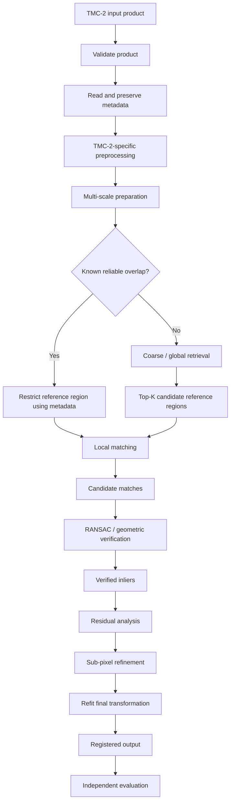

# Chandrayaan-2 TMC-2

The **Terrain Mapping Camera-2 (TMC-2)** is a panchromatic terrain-imaging instrument aboard the **Chandrayaan-2 Orbiter**. Within ChandraMap, TMC-2 is important because it captures lunar terrain at approximately **5 m/pixel**, providing substantially broader structural context than very-high-resolution OHRC imagery while preserving much more spatial detail than coarse instruments such as IIRS.

This makes TMC-2 particularly useful for correspondence based on medium-scale lunar morphology: crater geometry, ridge structure, terrain boundaries, relative feature layout, and other spatial patterns that may remain recognizable across missions and resolutions.

TMC-2 should not, however, be treated as an automatically easy registration source. Significant differences in illumination, Sun angle, viewing geometry, projection, terrain relief, product processing, and reference resolution can still produce difficult correspondence problems.

> **Resolution note:** TMC-2 is commonly described at approximately **5 m/pixel**. ChandraMap should treat validated metadata from the actual product as authoritative whenever a product-specific scale is available.

| Property             | Value / Description                                               |
| -------------------- | ----------------------------------------------------------------- |
| Instrument           | Terrain Mapping Camera-2                                          |
| Abbreviation         | TMC-2                                                             |
| Mission              | Chandrayaan-2 Orbiter                                             |
| Agency               | ISRO                                                              |
| Imaging type         | Panchromatic terrain imaging                                      |
| Approximate GSD      | ~5 m/pixel                                                        |
| ChandraMap role      | Structural source imagery / terrain registration                  |
| Main strengths       | Medium-scale lunar morphology and broader terrain context         |
| Main challenges      | Illumination, viewing geometry, scale differences, terrain relief |
| Accuracy convention  | Report source-image pixel error first                             |
| Processing authority | Actual product metadata                                           |

---

## 1. Instrument Overview

**TMC-2** stands for **Terrain Mapping Camera-2** and is part of the Chandrayaan-2 Orbiter payload.

For ChandraMap, TMC-2 is best understood as a **panchromatic terrain-imaging source** designed to capture lunar surface structure at a medium spatial scale relative to the other primary Chandrayaan-2 instruments used by the project.

Its approximate ground sampling scale is commonly described as:

> **~5 m/pixel**

This scale places TMC-2 between:

- **OHRC**, at approximately `0.25–0.32 m/pixel`; and
- **IIRS**, at approximately `80 m/pixel`.

That position is valuable for ChandraMap because TMC-2 can preserve medium-scale terrain morphology while covering broader spatial context than OHRC.

Relevant lunar structures may include:

- larger crater rims;
- medium and large crater shapes;
- ridges;
- broader terrain boundaries;
- relative geometry between prominent terrain features;
- regional morphology;
- large structural texture.

The presence and usefulness of these structures depend on the actual terrain, illumination, viewing geometry, and product characteristics.

This document focuses on TMC-2 as a correspondence and registration source rather than providing a complete Chandrayaan-2 mission description.

---

## 2. Why TMC-2 Matters to ChandraMap

TMC-2 is particularly useful because ChandraMap must operate across very different physical ground scales.

At one end, OHRC can contain extremely fine surface detail. At the other, IIRS represents much coarser spatial information and a different sensing modality.

TMC-2 occupies a useful intermediate scale.

Conceptually:

```text
OHRC
~0.25–0.32 m/px
very fine detail

        ↓

TMC-2
~5 m/px
medium-scale terrain structure

        ↓

IIRS
~80 m/px
coarse hyperspectral information
```

TMC-2 can therefore help ChandraMap evaluate whether a matching method relies on genuine terrain geometry rather than only on very fine local texture.

Important roles include:

- medium-scale lunar correspondence;
- terrain-structure registration;
- scale-stress benchmarking;
- illumination-stress benchmarking;
- cross-mission registration against LRO products;
- geometric verification research;
- terrain-aware refinement experiments;
- candidate-region confirmation after coarse retrieval.

TMC-2 may also be useful in workflows involving:

- terrain models;
- stereo-derived products;
- map projections;
- orthorectified imagery;
- external DEMs.

These should be treated as optional supporting information rather than assumptions about every TMC-2 product.

---

## 3. Spatial Resolution and GSD

### 3.1 Approximate TMC-2 Scale

TMC-2 is commonly described at approximately:

> **~5 m/pixel**

This value should be treated as a mission/instrument-level approximation.

The exact product may have its own effective scale depending on:

- acquisition geometry;
- processing level;
- projection;
- resampling;
- product generation workflow.

Therefore:

```text
Actual product metadata
        ↓
Official product documentation
        ↓
Mission / instrument documentation
        ↓
Generic ChandraMap overview values
```

If validated product metadata provides a pixel scale or GSD, that value should control scale-aware processing.

### 3.2 Pixel Dimensions vs Physical Scale

A digital array size such as:

```text
4096 × 4096 pixels
```

does not describe the physical size of the lunar region.

Important concepts should remain distinct.

| Concept                  | Meaning                                                      |
| ------------------------ | ------------------------------------------------------------ |
| Image dimensions         | Number of digital samples in width and height                |
| GSD                      | Approximate ground distance represented between samples      |
| Spatial resolution       | Ability of the product/system to resolve terrain detail      |
| Ground footprint         | Physical lunar surface area covered                          |
| Effective matching scale | Physical scale used when comparing two datasets              |
| Map scale                | Spatial relationship in a mapped or projected representation |

Two images with identical pixel dimensions may cover radically different ground areas.

### 3.3 Effective Matching Scale

Suppose TMC-2 is compared with a higher-resolution LRO NAC product.

The scientifically useful question is not:

> "How do we resize the images to the same width and height?"

The useful question is:

> "At what physical terrain scale do both products contain comparable information?"

This distinction drives the multi-resolution strategy used by ChandraMap.

---

## 4. TMC-2 as a Terrain Imaging Sensor

The phrase **terrain mapping** should not be interpreted to mean that every TMC-2 image automatically contains a DEM or elevation layer.

TMC-2 imagery provides spatial information useful for terrain interpretation.

Depending on the available product and associated processing, this may support analysis of:

- lunar surface morphology;
- crater shape;
- ridge geometry;
- terrain transitions;
- relative feature layout;
- regional structural patterns;
- stereo or terrain workflows where suitable data products exist.

ChandraMap should explicitly distinguish between:

| Product / Data Type        | Meaning                                                  |
| -------------------------- | -------------------------------------------------------- |
| Raw or lower-level imagery | Image data still tied strongly to sensor geometry        |
| Calibrated imagery         | Radiometrically or instrument-corrected image data       |
| Map-projected imagery      | Image transformed into a lunar map coordinate system     |
| Stereo imagery             | Multiple observations that may support 3D reconstruction |
| Derived elevation product  | DEM/DTM or related terrain representation                |
| External DEM               | Terrain model from another mission or processing source  |

A normal TMC-2 image should not be assumed to include elevation values.

Terrain information may assist registration, but basic image correspondence remains a separate problem.

---

## 5. TMC-2 Registration Challenges

TMC-2 occupies a useful physical scale, but several factors can make registration difficult.

### 5.1 Scale Differences

Approximate project-relevant scales include:

| Dataset |                             Approximate Scale |
| ------- | --------------------------------------------: |
| OHRC    |                               ~0.25–0.32 m/px |
| LRO NAC | Often ~0.5–2 m/px, product/geometry-dependent |
| TMC-2   |                                       ~5 m/px |
| IIRS    |                                      ~80 m/px |

These values are approximate and product-dependent.

TMC-2 may therefore be:

- much coarser than OHRC;
- somewhat coarser than many NAC products;
- much finer than IIRS.

A direct native-resolution comparison may expose the matcher to structures that are visible in one image but not physically resolved in the other.

Arbitrary resizing does not solve this.

---

### 5.2 Illumination and Sun Angle

The same lunar terrain can appear significantly different under different Sun geometry.

Possible changes include:

- crater-shadow displacement;
- ridge-shadow movement;
- different illuminated crater rims;
- different shadow lengths;
- local brightness changes;
- different contrast;
- previously visible structures becoming shadowed;
- dark/bright terrain relationships changing significantly.

TMC-2 may capture enough terrain detail for these illumination differences to substantially affect local descriptors.

Radiometric normalization may help reduce intensity differences, but:

> **Brightness normalization cannot geometrically reposition shadows caused by different illumination geometry.**

---

### 5.3 Viewing Geometry

Different acquisitions may also differ because of:

- spacecraft position;
- look angle;
- local surface slope;
- off-nadir acquisition;
- projection;
- camera geometry;
- terrain relief.

These effects can produce local displacement even when two products cover the same physical region.

At approximately five-metre-scale sampling, relief-related displacement may be important in rough or topographically complex terrain.

---

### 5.4 Terrain Relief

The lunar surface is three-dimensional.

It should not be modeled universally as one flat projective plane.

A global affine transformation or homography can be useful for:

- local regions;
- approximately compatible geometry;
- map-projected images;
- initial alignment.

However, a single global model may leave systematic residuals in terrain with significant relief.

Advanced versions of ChandraMap may therefore investigate:

- DEM-supported correction;
- sensor-geometry models;
- orthorectification;
- local transforms;
- piecewise warping;
- residual-based local refinement.

These are research tools, not mandatory requirements for every TMC-2 registration task.

---

### 5.5 Repetitive Lunar Structure

Crater-rich terrain can contain many locally similar structures.

Potential consequences include:

- descriptor ambiguity;
- false candidate matches;
- clusters of correspondences around incorrect locations;
- geometrically inconsistent match sets;
- incorrect transformation estimation.

A large number of candidate matches is therefore not enough.

ChandraMap should evaluate:

- geometric consistency;
- inlier ratio;
- spatial distribution;
- residuals;
- independent registration accuracy.

---

## 6. TMC-2 Metadata Important to ChandraMap

TMC-2 metadata should be retained whenever it is available and trustworthy.

| Metadata                     | Why It Matters                                    |
| ---------------------------- | ------------------------------------------------- |
| Sensor / instrument          | Select TMC-2-specific processing                  |
| Mission/platform             | Provenance                                        |
| Product ID                   | Reproducibility and traceability                  |
| Product type / level         | Understand calibration and processing assumptions |
| Image dimensions             | Validation and processing setup                   |
| GSD / pixel scale            | Multi-resolution comparison                       |
| Ground footprint             | Restrict candidate reference search               |
| Latitude / longitude         | Geospatial localization                           |
| Map projection               | Correct coordinate interpretation                 |
| Lunar CRS / reference system | Georeferencing                                    |
| Acquisition time             | Provenance and observation comparison             |
| Sun geometry                 | Illumination analysis                             |
| Incidence angle              | Lighting interpretation when available            |
| Emission angle               | Viewing geometry interpretation when available    |
| Phase angle                  | Observation geometry                              |
| Spacecraft geometry          | Sensor/view interpretation                        |
| NoData value                 | Prevent invalid pixels from entering matching     |
| Valid-data mask              | Exclude missing or unusable areas                 |

Not every TMC-2 product will contain every field.

ChandraMap should distinguish:

- available metadata;
- optional metadata;
- required-but-missing metadata.

Missing values should not be silently invented.

---

## 7. TMC-2 Preprocessing Strategy

TMC-2 preprocessing should preserve structural terrain information useful for correspondence.

A conceptual sequence is:

```text
TMC-2 product
    ↓
Validate input
    ↓
Identify product type
    ↓
Read and preserve metadata
    ↓
Interpret calibration / processing state
    ↓
Projection handling where applicable
    ↓
Create valid-area mask
    ↓
Optional light denoising
    ↓
Optional radiometric normalization
    ↓
Optional structural representation
    ↓
Multi-scale preparation
    ↓
Local matching
```

Every optional stage should be benchmarked.

A preprocessing operation should remain in the pipeline because it improves measured registration quality, not because it makes the image appear visually cleaner.

---

## 8. Denoising

TMC-2 correspondence depends heavily on terrain boundaries and morphology.

Excessive denoising can remove useful information such as:

- crater edges;
- ridge boundaries;
- small terrain discontinuities;
- local texture;
- patch structure useful for refinement.

A safer experimental strategy is:

```text
Raw TMC-2
    vs.
Lightly denoised TMC-2
```

using the exact same image pairs and evaluation protocol.

Light denoising may be useful where noise materially harms matching, but it should not be enabled automatically without evidence.

---

## 9. Contrast and Radiometric Normalization

Possible preprocessing options include:

- intensity normalization;
- robust dynamic-range scaling;
- histogram-based normalization;
- local contrast enhancement.

These techniques may reduce some radiometric differences.

They may be useful when two products differ because of:

- exposure;
- intensity range;
- contrast;
- processing pipelines.

However:

```text
radiometric normalization
        ≠
illumination geometry correction
```

If a crater shadow moves because the Sun geometry changes, histogram equalization cannot move that shadow back to its previous position.

ChandraMap should therefore describe illumination handling as an evaluated research problem rather than claim illumination invariance.

---

## 10. Structural Representations for TMC-2

Terrain geometry may remain more stable than raw brightness across some acquisition changes.

Potential experimental representations include:

- gradient magnitude;
- gradient orientation;
- edge maps;
- phase-based representations;
- local normalized patches;
- ridge/crater structural descriptors;
- multi-scale terrain filters;
- other structure-focused representations.

These representations may help emphasize shape over absolute intensity.

They should be treated as benchmark candidates rather than guaranteed improvements.

The correct research question is:

> Which representation preserves terrain structures consistently enough to improve correspondence across the intended TMC-2 stress cases?

---

## 11. Multi-Scale Handling

Multi-scale processing is central to TMC-2 correspondence.

The purpose is to compare information at physically meaningful ground scales.

### Incorrect Approach

```text
TMC-2 image
    +
Higher-resolution reference
        ↓
resize both to same pixel dimensions
        ↓
assume scale mismatch solved
```

Equal dimensions do not imply equal spatial information.

### Preferred Approach

```text
Higher-resolution reference
        ↓
Build multi-resolution pyramid
        ↓
Select level near TMC-2 effective scale
        ↓
Generate coarse correspondences
        ↓
Geometric verification
        ↓
Refine only where both images support it
```

> **Compare information, not pixel count.**

Resampling changes the digital representation.

It does not change the physical information captured by the original sensor.

### Refinement Boundary

A high-resolution reference may contain many structures below the TMC-2 resolving scale.

Those structures should not be treated as valid TMC-2 correspondence evidence.

Refinement should stop when finer claims would depend on spatial information that TMC-2 does not contain.

---

## 12. TMC-2 and OHRC

Approximate scales are:

```text
OHRC
~0.25–0.32 m/px

TMC-2
~5 m/px
```

OHRC is much finer.

It may contain:

- small crater details;
- local surface texture;
- small ridge fragments;
- fine shadow boundaries;

that are not independently represented in TMC-2.

A physically meaningful OHRC ↔ TMC-2 comparison should therefore emphasize structures visible in both products.

Possible common structures include:

- larger crater rims;
- broad crater geometry;
- ridge systems;
- major terrain boundaries;
- large structural texture;
- relative positions between larger landmarks.

The wrong interpretation is:

```text
TMC-2
    ↓
upsample to OHRC dimensions
    ↓
OHRC detail recovered
```

Upsampling does not create missing physical terrain information.

---

## 13. TMC-2 and IIRS

Approximate scales are:

```text
TMC-2
~5 m/px
panchromatic terrain imagery

IIRS
~80 m/px
hyperspectral / imaging infrared
```

The difference is not only spatial.

The sensor modality is also different.

IIRS should not be treated as a lower-resolution version of TMC-2.

A TMC-2 ↔ IIRS experiment may require:

1. selection or derivation of a registration-friendly 2D IIRS representation;
2. reduction of TMC-2 to a physically comparable effective scale;
3. matching of broad structures visible in both datasets;
4. explicit cross-modality evaluation.

Fine TMC-2 detail cannot be assumed to exist spatially in IIRS.

Therefore ChandraMap should not claim fine TMC-2-level localization from IIRS information without independent evidence.

---

## 14. TMC-2 and LRO NAC

LRO NAC is an important high-resolution reference source.

The pair is useful because both may preserve recognizable visible terrain structures, but the reference may be considerably finer than TMC-2.

Important differences include:

- GSD;
- Sun angle;
- viewing geometry;
- sensor characteristics;
- processing level;
- map projection;
- acquisition conditions.

LRO NAC should not be assigned one universal scale.

A typical conceptual flow is:

```text
LRO NAC
    ↓
Build reference pyramid
    ↓
Choose level comparable to TMC-2
    ↓
Local correspondence generation
    ↓
RANSAC / geometric verification
    ↓
Residual analysis
    ↓
Local refinement where valid
```

The purpose of downsampling or pyramiding NAC is not to discard information unnecessarily.

It is to expose structures that exist at a scale comparable with TMC-2 before asking the matcher to perform fine alignment.

---

## 15. TMC-2 and LRO WAC

LRO WAC provides broader lunar context and lower spatial detail than NAC.

Potential TMC-2 ↔ WAC uses include:

- coarse localization;
- broad contextual matching;
- regional retrieval;
- global reference mosaics;
- candidate-region generation;
- large-area structural comparison.

The exact WAC scale is product-dependent and should not be represented by one hard-coded value here.

TMC-2 ↔ WAC registration is generally more naturally interpreted as:

- coarse;
- regional;
- structural;

rather than fine-detail correspondence.

If WAC lacks the spatial information needed for fine registration, ChandraMap should state that limitation rather than infer accuracy from interpolation.

---

## 16. TMC-2 and Terrain / DEM Information

Terrain information can support TMC-2 registration, but image registration and terrain modeling are different tasks.

Potential supporting data may include:

- elevation;
- slope;
- DEM/DTM information;
- stereo-derived terrain;
- map projection;
- orthorectification;
- external lunar terrain models.

Possible advanced uses include:

- relief compensation;
- better geometric interpretation;
- terrain-aware reprojection;
- identification of physically implausible transforms;
- analysis of systematic residuals;
- local correction of topographic displacement.

However:

> **A DEM should not be assumed to exist for every TMC-2 product.**

A basic V1 registration pipeline should not require DEM information unless the authoritative V1 specification explicitly defines it.

A useful architectural separation is:

```text
Image correspondence baseline
        ↓
works from imagery + basic metadata

Terrain-aware extension
        ↓
adds DEM / stereo / sensor geometry where available
```

---

## 17. Matching Approaches

ChandraMap may compare multiple correspondence strategies for TMC-2.

No algorithm should be treated as universally superior without controlled benchmark evidence.

### 17.1 Classical Baseline

A useful baseline is:

```text
SIFT
    ↓
Descriptor matching
    ↓
Match filtering
    ↓
RANSAC
    ↓
Affine / homography
    ↓
Residual evaluation
```

SIFT is useful because it is:

- interpretable;
- established;
- scale-aware;
- rotation-aware;
- suitable as a reproducible baseline.

It may still struggle under:

- large illumination differences;
- strong sensor-domain differences;
- repetitive crater terrain;
- large resolution differences.

The point of the baseline is to create a measurable reference, not to assume it is the final method.

---

### 17.2 Learned Sparse Matching

A possible learned sparse path is:

```text
ALIKED
    ↓
Sparse keypoints + descriptors
    ↓
LightGlue
    ↓
Candidate correspondences
```

Responsibilities should be described correctly:

- **ALIKED** detects/describes sparse local features;
- **LightGlue** matches compatible local features.

Pretrained terrestrial models should not be assumed to be lunar-invariant.

Their performance must be measured directly on TMC-2 lunar data.

---

### 17.3 Detector-Free Matching

**LoFTR** estimates image correspondences without relying on a traditional separate keypoint detector.

Potential advantages may include:

- correspondence in weakly textured areas;
- operation where repeatable keypoints are limited;
- coarse-to-fine local matching.

However, it can still be affected by:

- domain shift;
- illumination differences;
- large GSD mismatches;
- repeated lunar morphology.

Its usefulness should therefore be determined experimentally.

---

### 17.4 Remote-Sensing-Oriented Approaches

Research comparisons may include methods such as:

- RIFT;
- CFOG-style matching;
- other multimodal/structural remote-sensing approaches.

These are relevant because some remote-sensing methods emphasize structural similarity rather than identical pixel intensities.

They should be treated as:

- research directions;
- optional benchmarks;
- future alternatives.

Their inclusion here does not imply current implementation.

---

## 18. Candidate Matches vs Verified Inliers

Terminology should remain precise.

A local matcher produces:

> **candidate correspondences**

These are hypotheses.

They are not automatically valid geographic or geometric correspondences.

The correct conceptual transition is:

```text
Candidate matches
        ↓
Geometric verification
        ↓
Verified inliers
```

A confidence score from a matcher may help rank candidate matches, but it does not replace geometric verification.

Only after consistency with the chosen geometric model should a candidate be treated as a verified inlier.

---

## 19. Geometric Verification

A typical verification path is:

```text
Local matches
    ↓
RANSAC
    ↓
Initial geometric model
    ↓
Inliers + outliers
    ↓
Residual inspection
```

Possible models include:

- affine transformation;
- homography.

The model should be chosen according to:

- image geometry;
- overlap size;
- projection state;
- viewing differences;
- residual behavior.

### Use the Simplest Sufficient Model

More flexible geometry is not automatically better.

A model with too much flexibility can hide weak correspondences.

ChandraMap should begin with the simplest reasonable transform and only add geometric complexity when residual analysis demonstrates a need.

### Homography Caution

A homography can be useful for:

- local regions;
- projected products;
- approximately planar relationships.

But:

> **The lunar surface is not a flat poster.**

Terrain relief and sensor/viewing geometry may cause deviations from a single global projective model.

---

## 20. Residual Analysis

Residuals describe how far transformed source points remain from their corresponding reference positions.

For a correspondence pair:

```text
predicted reference location
        vs.
observed reference location
```

the difference is a residual vector.

Important properties include:

- magnitude;
- direction;
- spatial location;
- systematic pattern.

### Interpreting Residual Patterns

Random, small residuals across the overlap may indicate that the chosen global model is adequate.

Systematic residuals may indicate:

- terrain relief;
- projection mismatch;
- sensor geometry;
- unmodeled local distortion;
- incorrect transform type;
- residual false matches.

Examples:

```text
Residual vectors increase toward one edge
        ↓
possible model/projection problem

Residual direction changes with terrain
        ↓
possible relief-related geometry

A few very large residuals
        ↓
possible remaining outliers
```

Residual inspection should therefore be part of registration diagnosis, not merely an internal debugging step.

---

## 21. Sub-Pixel Refinement

Sub-pixel refinement should operate on geometrically verified correspondences.

The correct order is:

```text
Candidate matches
        ↓
RANSAC
        ↓
Initial transform
        ↓
Verified inliers
        ↓
Sub-pixel refinement
        ↓
Refit final transform
        ↓
Evaluate
```

Sub-pixel refinement before outlier rejection would waste effort on incorrect matches and may make bad candidate positions appear artificially precise.

Potential refinement concepts include:

- patch correlation;
- phase-based correlation;
- planetary registration utilities;
- local image alignment methods.

No single technique should be treated as the permanent solution without benchmark evidence.

### Refit After Refinement

Once the inlier coordinates have been refined, the final transformation should be estimated again.

Otherwise, the transform would still reflect the original lower-precision tie-point coordinates.

---

## 22. Registration Error for TMC-2

Registration error should be reported first in **TMC-2 source-image pixels**.

For example:

```text
0.2 TMC-2 source pixels
```

is not physically equivalent to:

```text
0.2 OHRC source pixels
```

because the underlying GSDs differ.

Using approximate nominal scales only for illustration:

```text
OHRC
~0.3 m/px

TMC-2
~5 m/px
```

the same fractional pixel residual represents very different ground distances.

Therefore ChandraMap should use:

```text
source-pixel error
        ↓
validate GSD + projection + reference geometry
        ↓
convert to ground units only if justified
```

Do not report metre-level accuracy solely because an approximate nominal GSD is known.

A valid conversion may depend on:

- actual product GSD;
- projection;
- local geometry;
- ground/reference truth.

---

## 23. Independent Evaluation

A transformation should not be considered independently validated merely because it has low residual error on the same points used to fit it.

The weak evaluation pattern is:

```text
tie points
    ↓
fit transform
    ↓
measure RMSE on same tie points
    ↓
claim final registration accuracy
```

This can underestimate the true generalization error.

A better hierarchy is:

1. official benchmark or challenge ground truth;
2. independent check points;
3. held-out manually verified tie points.

Independent check points should not participate in estimating the transform whose accuracy they evaluate.

Conceptually:

```text
Fit points
    ↓
Transformation estimation

Independent check points
    ↓
Accuracy evaluation
```

This distinction becomes especially important when claiming sub-pixel performance.

---

## 24. Metrics for TMC-2

| Metric                | Purpose                                              |
| --------------------- | ---------------------------------------------------- |
| Candidate match count | Number of raw matcher proposals                      |
| Inlier count          | Number surviving geometric verification              |
| Inlier ratio          | Fraction of candidates consistent with geometry      |
| Check-point RMSE      | Independent registration accuracy                    |
| Spatial coverage      | Distribution of verified correspondences             |
| Ground error          | Physical error where conversion is valid             |
| Success rate          | Fraction of benchmark pairs meeting success criteria |
| Runtime               | Computational cost                                   |
| Failure rate          | System reliability across benchmark pairs            |
| Failure reason        | Diagnostic explanation of unsuccessful registration  |

If global retrieval is used, separate retrieval metrics should include:

- Recall@1;
- Recall@5;
- Recall@K.

These answer a different question from registration metrics.

```text
Retrieval metric:
Did we find the correct region?

Registration metric:
Did we align the region accurately?
```

The two should not be combined into one undifferentiated score.

---

## 25. Spatial Coverage

A high inlier count is not sufficient if the inliers are poorly distributed.

For example:

```text
60 verified matches
all near one crater
```

may constrain local alignment but provide weak evidence for image-wide registration.

Useful coverage measures may include:

- grid-cell occupancy;
- convex-hull coverage;
- normalized covered area;
- spatial-distribution statistics.

Good coverage helps because matches distributed across the image better constrain:

- translation;
- rotation;
- scale;
- projective terms;
- local geometric consistency.

The exact coverage formula should be defined centrally in benchmark documentation.

---

## 26. TMC-2 Benchmark Stress Tests

TMC-2 should be evaluated using deliberately varied conditions.

### 26.1 Easy / Known-Overlap Pair

**Purpose:** verify end-to-end functionality.

Tests:

- image ingestion;
- matching;
- geometric verification;
- transform estimation;
- output generation;
- metrics.

---

### 26.2 Illumination Stress

**Purpose:** measure robustness to significantly different Sun-angle and shadow conditions.

Useful for evaluating:

- contrast normalization;
- gradients;
- edge-based representations;
- structural matching.

---

### 26.3 Scale Stress

**Purpose:** evaluate matching when the reference GSD differs substantially from TMC-2.

Useful for testing:

- multi-resolution pyramids;
- scale-aware reference selection;
- physically meaningful resampling.

---

### 26.4 Geometry Stress

**Purpose:** test stronger viewing-angle, relief, or projection differences.

Useful for identifying when:

- affine models are insufficient;
- homographies are insufficient;
- local residual correction may be needed.

---

### 26.5 Low-Texture Terrain

**Purpose:** evaluate regions containing limited distinctive local structure.

This exposes dependence on convenient crater-rich scenes.

---

### 26.6 Repetitive Crater Terrain

**Purpose:** measure robustness against many visually similar local structures.

This tests:

- descriptor ambiguity;
- false-match rejection;
- geometric verification;
- coverage analysis.

---

### 26.7 Cross-Sensor Stress

**Purpose:** evaluate TMC-2 against imagery from another sensor or mission.

Examples may include:

- TMC-2 ↔ LRO NAC;
- TMC-2 ↔ LRO WAC;
- TMC-2 ↔ OHRC;
- TMC-2 ↔ derived IIRS representation.

No expected benchmark score should be assumed before measurement.

---

## 27. Recommended TMC-2 Benchmark Progression

A practical development path is to establish a measurable classical baseline before adding complexity.

### Stage A — Known Pair Baseline

```text
TMC-2 source
    ↓
Known reference
    ↓
SIFT
    ↓
Candidate matches
    ↓
RANSAC
    ↓
Transform
    ↓
Registered overlay
    ↓
Independent evaluation
```

Save:

- candidate match visualization;
- accepted inliers;
- rejected outliers;
- transform;
- registered preview;
- check-point error;
- inlier statistics;
- spatial coverage;
- runtime.

---

### Stage B — Scale-Aware Processing

Add:

- reference pyramid;
- GSD-aware level selection;
- multi-scale matching;
- scale-stress benchmark pairs.

Measure whether this improves the same baseline pairs.

---

### Stage C — Illumination Handling

Compare:

```text
Raw grayscale

vs.

Contrast-normalized input

vs.

Gradient / structural representation
```

Use the same source/reference pairs.

This isolates preprocessing effects.

---

### Stage D — Stronger Local Matching

Compare on identical benchmark pairs:

- SIFT;
- ALIKED + LightGlue;
- LoFTR.

Do not claim a method is stronger merely because it is newer or learned.

---

### Stage E — Sub-Pixel Refinement

Use:

```text
Verified inliers
    ↓
Local coordinate refinement
    ↓
Refit final transform
    ↓
Evaluate independent check points
```

Report before/after results.

---

### Stage F — Terrain-Aware Research

Only after the global baseline is stable, investigate:

- DEM support;
- sensor geometry;
- local/piecewise transformations;
- terrain-aware correction;
- more advanced planetary registration methods.

This keeps the research progression measurable.

---

## 28. TMC-2 Failure Modes

| Failure Mode                                        | Possible Cause                                      | Useful Diagnostic                            |
| --------------------------------------------------- | --------------------------------------------------- | -------------------------------------------- |
| Very few matches                                    | GSD mismatch                                        | Inspect selected pyramid levels              |
| Many false matches                                  | Repetitive crater terrain                           | Inspect RANSAC rejection and coverage        |
| Matches fail under different illumination           | Shadow geometry                                     | Compare raw vs structural representations    |
| Inliers cluster in one region                       | Limited unique structure                            | Inspect spatial distribution                 |
| Good center alignment but poor edge alignment       | Global model insufficient                           | Inspect residual vectors                     |
| Fine reference structures cannot be matched         | Reference contains detail below TMC-2 scale         | Downsample reference                         |
| Low fit-point RMSE but poor image-wide registration | Overfitting / weak evaluation                       | Use independent check points                 |
| Visually good warp but poor tie-point accuracy      | Flexible transform hiding weak matches              | Inspect verified control points              |
| Residuals vary with terrain                         | Relief-related geometry                             | Compare against DEM/projection information   |
| No reliable geospatial output                       | Missing coordinate/projection metadata              | Report image-domain registration only        |
| Retrieval returns wrong region                      | Global descriptor ambiguity                         | Inspect Top-K results and retrieval Recall@K |
| Matcher confidence is high but RANSAC fails         | Descriptor similarity without geometric consistency | Inspect candidate geometry                   |

Failures should be retained as benchmark evidence rather than removed from evaluation.

---

## 29. TMC-2 Input Validation

Before correspondence processing begins, ChandraMap should validate what the product actually contains.

Useful checks include:

- file readability;
- TMC-2 instrument identity;
- mission/product identity;
- image dimensions;
- pixel data type;
- product level where available;
- NoData information;
- valid-data mask;
- GSD or pixel scale;
- footprint;
- projection;
- lunar coordinate reference information;
- acquisition time;
- illumination geometry;
- viewing geometry;
- associated terrain information where present.

Validation should distinguish:

```text
optional metadata missing
```

from:

```text
metadata required for requested output missing
```

For example, image-domain registration may be possible without latitude/longitude metadata.

Reliable geographic coordinates may not be.

Missing metadata should be represented explicitly in logs or structured results rather than filled with invented defaults.

---

## 30. TMC-2 Sensor Routing

A high-level TMC-2 processing path is:



The diagram shows an important architectural principle:

> **Whole-Moon retrieval is conditional, not mandatory.**

If trustworthy geospatial metadata already restricts the overlap, ChandraMap should use it.

---

## 31. Known-Location vs Unknown-Location Processing

TMC-2 can operate in at least two different search modes.

### 31.1 Known Location

If reliable product metadata provides:

- coordinates;
- footprint;
- map projection;
- approximate overlap;

the reference search should be restricted accordingly.

Conceptually:

```text
TMC-2 metadata
    ↓
Reference-region restriction
    ↓
Local matching
```

This reduces unnecessary computation and false candidates.

Using trustworthy metadata is good scientific and engineering practice.

---

### 31.2 Unknown Location

If the lunar location is unknown or metadata cannot be trusted, a retrieval stage may be needed.

Conceptually:

```text
TMC-2 image
    ↓
Global descriptor
    ↓
Reference vector search
    ↓
Top-K candidate regions
    ↓
Local correspondence
    ↓
Geometric verification
```

These are two distinct operating modes.

ChandraMap should not force every image through global retrieval if the location is already known.

---

## 32. Global Retrieval vs Local Registration

Global retrieval and local registration solve different problems.

### Global Retrieval

Answers:

> **Where on the Moon is this image likely to belong?**

Typical architecture:

```text
Reference lunar imagery
        ↓
Tiles
        ↓
Scale levels
        ↓
Global descriptors
        ↓
Vector index + metadata
```

Online:

```text
TMC-2 query
        ↓
Global descriptor
        ↓
Nearest-neighbor search
        ↓
Top-K candidate tiles
```

### Local Registration

Answers:

> **Which exact points correspond, and what geometric transformation aligns the images?**

Typical architecture:

```text
TMC-2
    +
Candidate reference tile
        ↓
Local matcher
        ↓
Candidate correspondences
        ↓
RANSAC
        ↓
Verified inliers
        ↓
Final registration
```

Retrieval quality and registration quality should be benchmarked separately.

---

## 33. FAISS Role

FAISS can be useful for indexing and searching reference descriptors.

It is a **vector similarity search/indexing system**.

FAISS does not directly:

- detect crater features;
- extract local keypoints;
- produce image correspondences;
- perform RANSAC;
- estimate an affine transformation;
- estimate a homography;
- register TMC-2 to a reference.

Its possible ChandraMap role is:

```text
Global descriptors
        ↓
FAISS index
        ↓
Top-K candidate lunar regions
```

After retrieval, local image registration still needs to occur.

### Global vs Local Descriptors

These should remain separate concepts.

| Representation           | Purpose                               |
| ------------------------ | ------------------------------------- |
| Global descriptor        | Find likely lunar regions             |
| Local feature descriptor | Describe individual image locations   |
| Local matcher            | Generate point correspondences        |
| Geometric verification   | Reject inconsistent candidate matches |

Using one term such as "features" for all four can make the architecture ambiguous.

---

## 34. TMC-2 Outputs

Depending on the experiment, TMC-2 processing may produce:

- candidate reference region(s);
- retrieval rankings;
- candidate correspondences;
- verified inlier coordinates;
- rejected outliers;
- initial transformation;
- refined transformation;
- residual vectors;
- registered preview;
- check-point RMSE;
- source-pixel error;
- ground error when valid;
- inlier count;
- inlier ratio;
- spatial coverage;
- runtime;
- success/failure status;
- structured failure reason;
- geospatial location when justified.

The core result is correspondence plus measured registration quality.

A mosaic or map interface is a downstream use of those outputs.

---

## 35. Limitations

TMC-2 has several important limitations within ChandraMap.

### It Does Not Contain OHRC-Level Detail

Features below the TMC-2 resolving scale cannot be reconstructed simply by upsampling.

### Scale Mismatch Remains Important

LRO NAC, OHRC, IIRS, and WAC may operate at substantially different effective scales.

### Illumination Differences Remain Difficult

Crater and ridge shadows may shift geometrically under different Sun conditions.

### Projection Differences Matter

Different map projections or raw sensor geometries may create additional geometric differences.

### Terrain Relief Can Break Simple Models

A single global affine transform or homography may not explain all local displacement.

### Terrestrial Models May Experience Domain Shift

Pretrained feature models are not guaranteed to generalize to lunar terrain.

### Repetitive Terrain Can Produce False Matches

Large crater fields may contain many locally similar structures.

### Metadata May Be Incomplete

Some products may lack information required for precise georeferencing or terrain-aware correction.

### Sub-Pixel Accuracy Must Be Demonstrated

A pipeline containing a refinement stage does not guarantee sub-pixel performance.

### A Good Overlay Is Not Sufficient Evidence

Quantitative registration requires independent evaluation.

---

## 36. Claims ChandraMap Should Avoid

ChandraMap should avoid unsupported statements such as:

> "TMC-2 and OHRC can be matched directly just by resizing."

Resizing does not make their physical spatial information equivalent.

> "TMC-2 is detailed enough to see everything OHRC sees."

It is not.

> "TMC-2 is exactly 5 m/pixel in every possible product."

Use product-aware wording.

> "Histogram equalization removes Sun-angle differences."

It cannot reverse geometric shadow changes.

> "A pretrained matcher is lunar-invariant."

This requires benchmark evidence.

> "More matches always mean better registration."

Match correctness and distribution matter.

> "RANSAC proves registration accuracy."

RANSAC identifies geometrically consistent candidate matches under a model; independent accuracy evaluation is still required.

> "A homography always models lunar geometry."

Terrain relief and sensor geometry can violate that assumption.

> "Sub-pixel accuracy is guaranteed."

It must be experimentally demonstrated.

> "Pixel error automatically equals metre error."

The conversion requires valid ground geometry.

> "A good-looking mosaic proves correct correspondence."

Visual quality and quantitative registration accuracy are different things.

---

## 37. TMC-2 Within ChandraMap Versioning

The following structure describes a reasonable benchmark-oriented progression.

Existing ChandraMap version specifications should take precedence if they define a different scope.

### V1 — Classical Baseline

Conceptual TMC-2 path:

```text
Known TMC-2 / reference pair
        ↓
SIFT
        ↓
Descriptor matching
        ↓
RANSAC
        ↓
Affine / homography
        ↓
Registered preview
        ↓
Measured metrics
```

Primary objective:

> Establish a reproducible baseline.

---

### V2 — Scale and Illumination Improvements

Possible additions:

- multi-resolution reference pyramids;
- physically meaningful scale selection;
- improved contrast handling;
- structural representations;
- illumination stress evaluation.

---

### V3 — Advanced Local Matching / Retrieval

Possible additions:

- learned local matchers;
- detector-free matching;
- global retrieval;
- Top-K candidate search;
- stronger candidate filtering.

---

### V4 — Research-Grade Registration

Possible research directions:

- DEM-aware registration;
- local/piecewise transforms;
- physical sensor geometry;
- advanced sub-pixel refinement;
- lunar-specific representations;
- stronger cross-sensor methods.

These stages describe possible architectural progression, not implementation-completion claims.

---

## 38. Comparison with Other ChandraMap Sensors

| Instrument / Dataset |                    Approximate Scale | Modality                      | Relationship to TMC-2               |
| -------------------- | -----------------------------------: | ----------------------------- | ----------------------------------- |
| OHRC                 |                      ~0.25–0.32 m/px | Panchromatic                  | Much finer Chandrayaan-2 imagery    |
| TMC-2                |                              ~5 m/px | Panchromatic terrain imaging  | Medium-scale terrain source         |
| IIRS                 |                             ~80 m/px | Hyperspectral / imaging IR    | Much coarser and different modality |
| LRO NAC              | Often ~0.5–2 m/px, product-dependent | High-resolution lunar imaging | Frequently finer reference          |
| LRO WAC              |                    Product-dependent | Wide-angle lunar imaging      | Broad/coarse contextual reference   |

These relationships describe registration context rather than sensor quality rankings.

Each instrument was designed for different scientific objectives.

---

## 39. Why TMC-2 Is a Useful Structural Bridge

One of TMC-2's most useful roles in ChandraMap is as an intermediate spatial scale.

OHRC may contain extremely fine detail.

IIRS contains much coarser spatial information and a fundamentally different spectral modality.

TMC-2 sits between them.

Conceptually:

```text
Fine detail
OHRC
~0.25–0.32 m/px
        ↓

Medium structural scale
TMC-2
~5 m/px
        ↓

Coarse spectral-spatial scale
IIRS
~80 m/px
```

This makes TMC-2 useful for testing whether a correspondence method can follow terrain structure across changing scales.

Examples include:

- matching large crater geometry visible in both TMC-2 and OHRC;
- matching terrain structure against downsampled NAC imagery;
- studying which TMC-2 features survive when reduced toward IIRS scale;
- comparing texture-dependent and structure-dependent correspondence methods.

The term **structural bridge** should not be interpreted as meaning that TMC-2 mathematically converts OHRC into IIRS or solves all cross-sensor correspondence.

It means that its intermediate spatial scale is useful for systematic multi-resolution research.

---

## 40. Relationship to the ChandraMap Pipeline

TMC-2 influences multiple stages of ChandraMap.

### 1. Input Validation

Confirm that the input is readable and correctly identified.

### 2. Sensor Routing

Select TMC-2-specific preparation rather than OHRC or IIRS logic.

### 3. Metadata Parsing

Preserve geometry, scale, projection, and illumination information.

### 4. Preprocessing

Apply only validated denoising, normalization, masking, or structural transformations.

### 5. Scale Selection

Use physical GSD relationships to choose compatible reference pyramid levels.

### 6. Global Retrieval

Use only when location is unknown or insufficiently constrained.

### 7. Local Matching

Generate candidate correspondences.

### 8. Geometric Verification

Convert candidate matches into verified inliers.

### 9. Residual Analysis

Determine whether the geometric model is adequate.

### 10. Sub-Pixel Refinement

Improve verified tie-point coordinates.

### 11. Georeferencing

Convert image coordinates into lunar spatial coordinates only where metadata permits.

### 12. Evaluation

Measure independent registration quality.

The important architectural principle is:

> **Sensor handling occurs before final matcher selection.**

Choosing SIFT, LightGlue, LoFTR, RIFT, or another method does not remove the need for correct TMC-2 scale, geometry, and metadata handling.

---

## 41. Repository Documentation Relationships

This file focuses specifically on TMC-2.

For broader ChandraMap context, see:

- [`overview.md`](overview.md) — overall sensor and reference-data overview
- [`ohrc.md`](ohrc.md) — dedicated OHRC documentation
- [`../architecture/system-overview.md`](../architecture/system-overview.md) — overall system architecture
- [`../architecture/v1-pipeline.md`](../architecture/v1-pipeline.md) — V1 processing flow
- [`../architecture/core-engine-architecture.md`](../architecture/core-engine-architecture.md) — core correspondence/registration engine
- [`../architecture/data-flow.md`](../architecture/data-flow.md) — system data movement
- [`../architecture/output-flow.md`](../architecture/output-flow.md) — registration output flow
- [`../project/goals.md`](../project/goals.md) — project goals
- [`../project/non-goals.md`](../project/non-goals.md) — explicit project boundaries
- [`../project/v1-scope.md`](../project/v1-scope.md) — V1 scope
- [`../project/terminology.md`](../project/terminology.md) — shared terminology
- [`../project/assumptions.md`](../project/assumptions.md) — project assumptions
- [`../project/limitations.md`](../project/limitations.md) — documented limitations

Possible future sensor-specific documentation may include:

- `iirs.md`
- `lro-nac.md`
- `lro-wac.md`

These names should be treated as planned documentation where their existence has not yet been established.

---

## 42. References and Authoritative Sources

Implementation and scientific interpretation should prioritize primary mission and product documentation.

Relevant authoritative source categories include:

### Chandrayaan-2 / TMC-2

- ISRO Chandrayaan-2 payload documentation
- ISRO Chandrayaan-2 science documentation
- ISRO / ISSDC PRADAN
- Chandrayaan-2 product documentation
- Metadata distributed with individual TMC-2 products

### Lunar Reference Imagery

- Lunar Reconnaissance Orbiter Camera documentation
- LROC / Arizona State University documentation
- NASA Planetary Data System
- Metadata distributed with individual LRO products

### Planetary Geospatial Processing

- USGS ISIS documentation
- USGS ISIS coregistration documentation
- USGS planetary control-network documentation
- Relevant planetary photogrammetry and terrain-processing documentation

### Correspondence and Matching

- OpenCV SIFT and geometric-estimation documentation
- Official LightGlue repository/documentation
- LoFTR publication and reference implementation
- RIFT research literature
- CFOG and related remote-sensing registration literature

> **Processing authority:** Validated metadata delivered with a specific TMC-2 product should take precedence over generic approximate values in this document.

---

## TMC-2 Processing Principles

The TMC-2 path in ChandraMap should consistently follow the principles below.

### Use the Correct Instrument Identity

Use:

> **Terrain Mapping Camera-2 (TMC-2)**

rather than casually shortening the instrument to "TMC."

### Treat ~5 m/pixel as Approximate

Actual product metadata should control scale-aware processing.

### Preserve Terrain Structure

Preprocessing should not erase crater, ridge, or terrain-boundary information required for correspondence.

### Compare Physical Information

Equal image dimensions do not imply equal ground resolution.

### Use Multi-Scale Processing

Bring higher-resolution references to an effective scale compatible with TMC-2 before requiring fine correspondence.

### Do Not Invent Detail

Upsampling does not create missing lunar terrain information.

### Respect Illumination Geometry

Intensity normalization cannot undo geometric shadow displacement.

### Distinguish Candidates From Inliers

Matcher output is provisional until geometric verification succeeds.

### Verify Before Refining

Use:

```text
Candidate matches
    ↓
RANSAC
    ↓
Initial model
    ↓
Verified inliers
    ↓
Sub-pixel refinement
    ↓
Refit final transform
```

### Inspect Residuals

Systematic residual patterns can reveal inadequate geometry models.

### Evaluate Independently

Fit points should not be the sole evidence used to claim final registration accuracy.

### Report Source-Pixel Error First

Ground-unit conversions require valid GSD, geometry, and reference truth.

### Use Metadata When Available

Reliable footprint or projection information should constrain the search instead of forcing unnecessary whole-Moon retrieval.

### Keep Correspondence as the Core Result

The primary output is measured image correspondence and registration quality.

A lunar mosaic is downstream.

---

## Summary

TMC-2 provides ChandraMap with approximately **5 m/pixel panchromatic terrain imagery** from the Chandrayaan-2 Orbiter.

Its intermediate scale makes it especially useful for medium-scale lunar correspondence.

It can preserve terrain structures such as:

- larger crater geometry;
- ridges;
- broad terrain boundaries;
- regional morphology;
- spatial relationships between significant features.

At the same time, TMC-2 registration remains challenging because of:

- scale differences;
- Sun-angle variation;
- shadow geometry;
- viewing geometry;
- terrain relief;
- repetitive crater fields;
- projection differences;
- reference-product characteristics.

A defensible TMC-2 processing strategy therefore follows:

```text
Validate TMC-2 product
        ↓
Read authoritative metadata
        ↓
Apply sensor-aware preprocessing
        ↓
Prepare physically comparable scales
        ↓
Generate candidate correspondences
        ↓
Perform geometric verification
        ↓
Inspect residuals
        ↓
Refine verified tie points
        ↓
Refit final transformation
        ↓
Evaluate on independent evidence
        ↓
Report interpretable metrics
```

The central rule is:

> **Use TMC-2 as a medium-scale terrain measurement, not as a resized substitute for OHRC, IIRS, or LRO imagery. Match structures that physically exist in both datasets, verify them geometrically, and report accuracy only at scales supported by the data.**

<!-- Documentation request and supplied project context: :contentReference[oaicite:0]{index=0} -->
