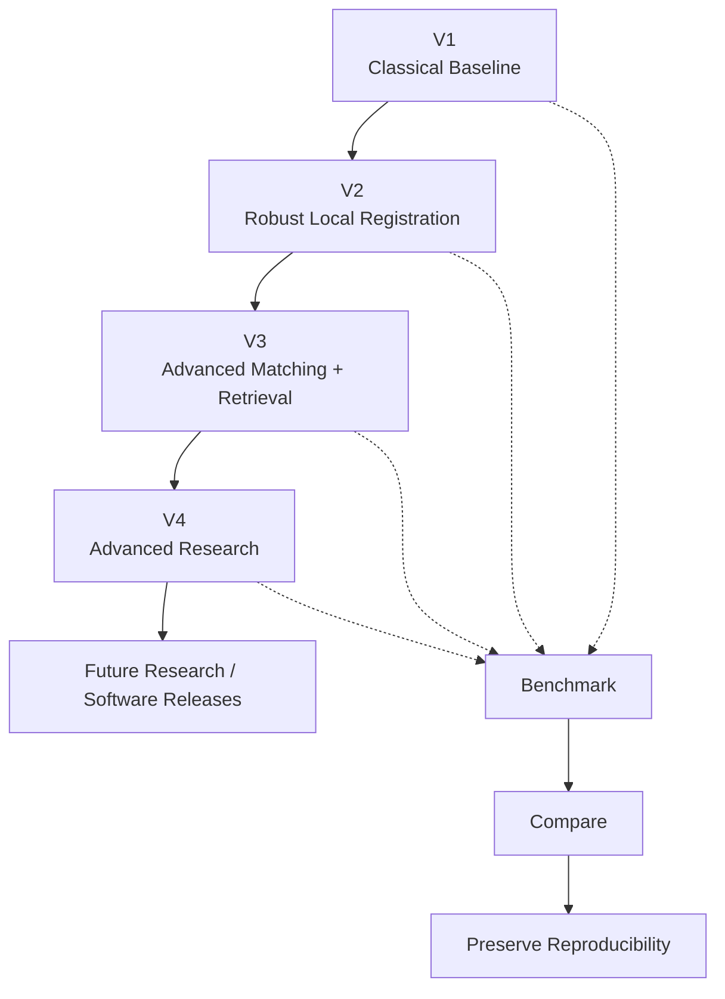
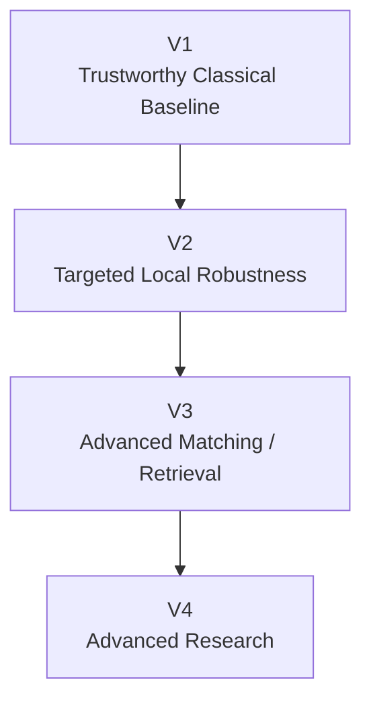
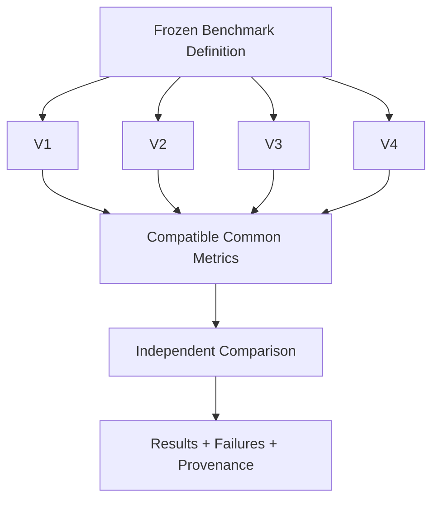
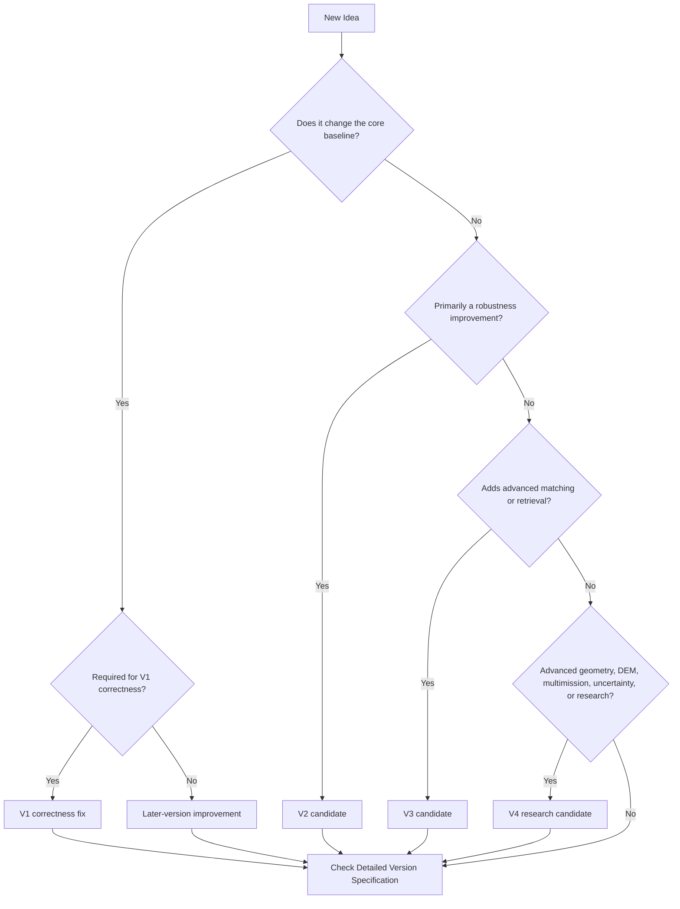

# ChandraMap Versions

`docs/versions/` is the central documentation area for ChandraMap's research-version architecture.

ChandraMap is intentionally divided into **four progressive, independently benchmarkable versions — V1, V2, V3, and V4**. The purpose of this separation is not to create marketing tiers or to replace older implementations whenever a newer one appears. The purpose is to preserve a measurable research progression from a trustworthy classical baseline toward increasingly capable lunar image correspondence and registration systems.

> **Each ChandraMap version is a benchmarkable research milestone, not merely a software release number.**

> **Later versions should be compared against earlier versions on frozen, compatible benchmark data whenever scientifically possible.**

> **V1 establishes the trustworthy baseline; later versions earn their complexity by demonstrating measurable improvement.**

> **A new feature belongs in a later version only when its effect can be evaluated rather than merely demonstrated visually.**

> **Version scope, benchmark scope, and implementation status must not be confused.**

> **Existing detailed version specification documents are authoritative. This README is an index, overview, and navigation document; it does not replace those specifications.**

ChandraMap's core technical objective is reliable **lunar image correspondence and registration** across differences in sensor, resolution, scale, illumination, viewing geometry, modality, projection, and acquisition conditions. The central outputs remain matched points, verified geometry, registration models, independent accuracy measurements, spatial coverage, failure information, and reproducible benchmark results. Mosaics and interactive maps are downstream demonstrations rather than substitutes for correspondence quality.

---

## Contents

- [1. Why ChandraMap Uses Versioned Research Pipelines](#1-why-chandramap-uses-versioned-research-pipelines)
- [2. Version Philosophy](#2-version-philosophy)
- [3. V1 — Classical Baseline](#3-v1--classical-baseline)
- [4. V2 — Robust Local Registration](#4-v2--robust-local-registration)
- [5. V3 — Advanced Matching and Retrieval](#5-v3--advanced-matching-and-retrieval)
- [6. V4 — Advanced Research and Maximum-Accuracy Direction](#6-v4--advanced-research-and-maximum-accuracy-direction)
- [7. Version Capability Matrix](#7-version-capability-matrix)
- [8. Version Dependency and Isolation Model](#8-version-dependency-and-isolation-model)
- [9. Backward Benchmark Comparability](#9-backward-benchmark-comparability)
- [10. Version, Benchmark, Experiment, Release, and Roadmap](#10-version-benchmark-experiment-release-and-roadmap)
- [11. Version Output and Evaluation Continuity](#11-version-output-and-evaluation-continuity)
- [12. Version Specification Navigation](#12-version-specification-navigation)
- [13. Related Documentation](#13-related-documentation)
- [14. Version Transition Guidance](#14-version-transition-guidance)
- [15. Version Completion Checklist](#15-version-completion-checklist)
- [16. Contributor Guidance](#16-contributor-guidance)
- [17. Version Specification Expectations](#17-version-specification-expectations)
- [18. Versioning Anti-Patterns and Unsupported Claims](#18-versioning-anti-patterns-and-unsupported-claims)
- [19. Versioning Limitations](#19-versioning-limitations)
- [20. Summary](#20-summary)

---

## 1. Why ChandraMap Uses Versioned Research Pipelines

ChandraMap combines several difficult problems:

- large Ground Sampling Distance (GSD) differences;
- cross-resolution correspondence;
- cross-sensor matching;
- Sun-angle and shadow differences;
- viewing-geometry differences;
- cross-modality matching;
- hyperspectral-to-structural registration;
- geometric verification;
- sub-pixel refinement;
- geospatial localization;
- optional reference retrieval;
- benchmark design;
- reproducibility.

Trying to solve all of these simultaneously would make it difficult to determine why a result improved or failed.

The version architecture separates research complexity into measurable stages.

The main benefits are:

- **Baseline preservation** — V1 remains available as a reference instead of disappearing when newer approaches are introduced.
- **Controlled progress** — each version introduces a bounded increase in capability.
- **Fair benchmarking** — compatible versions can be evaluated using the same image pairs, ground truth, metrics, and evaluation rules.
- **Research traceability** — improvements can be connected to specific algorithmic changes.
- **Ablation** — individual additions can be tested rather than hidden inside a large pipeline.
- **Failure analysis** — regressions can be traced to specific changes.
- **Reduced over-engineering** — advanced methods are not introduced until the simpler system has measurable limitations.
- **Reproducibility** — earlier methods and benchmark definitions remain recoverable.
- **Contribution planning** — contributors can determine whether a change belongs to the baseline, a robustness stage, a retrieval stage, or an advanced research path.
- **Scientific discipline** — visual improvement alone is not sufficient evidence of registration improvement.

The project therefore follows a simple rule:

> **Build the smallest measurable system first, preserve it, and increase complexity only when the increase can be evaluated.**

---

## 2. Version Philosophy

The four versions represent increasing research and engineering scope.

| Version | Primary Role                    | Main Research Question                                                                                                               | Relative Complexity |
| ------- | ------------------------------- | ------------------------------------------------------------------------------------------------------------------------------------ | ------------------- |
| **V1**  | Classical registration baseline | Can ChandraMap produce reliable, measurable registration for a known lunar image pair?                                               | Foundational        |
| **V2**  | Robust local registration       | Which targeted changes improve robustness relative to the V1 baseline?                                                               | Moderate            |
| **V3**  | Advanced matching and retrieval | Can ChandraMap expand from local known-pair registration toward advanced matching and larger reference-search workflows?             | High                |
| **V4**  | Advanced research direction     | Which advanced multimodal, geometric, learned, and multi-mission approaches can improve capability beyond the established baselines? | Research            |

This table describes the intended progression only. Detailed version specifications define the actual scope of each version.

### 2.1 Version Benchmark Questions

| Version | Main Benchmark Question                                                                               |
| ------- | ----------------------------------------------------------------------------------------------------- |
| **V1**  | Can a reproducible classical pipeline produce measurable lunar registration?                          |
| **V2**  | Which targeted improvements increase local-registration robustness?                                   |
| **V3**  | Can advanced matching and retrieval expand the operating scope while preserving registration quality? |
| **V4**  | Which advanced research methods improve multimodal, geometric, and cross-mission capability?          |

### 2.2 High-Level Progression



### 2.3 Versions Are Not Marketing Tiers

A higher version number does not mean that every result from that version must outperform every result from an earlier version.

V1 is not a deliberately weak implementation.

V4 is not automatically the strongest method on every lunar image pair.

A simpler classical method can remain competitive or even perform better on certain sensor combinations, terrain types, illumination conditions, or benchmark categories.

Version numbers describe **research scope and system capability**, not guaranteed performance.

### 2.4 Why Not Build Everything in V1?

Combining SIFT, LightGlue, LoFTR, FAISS, DEM-aware geometry, global retrieval, hyperspectral processing, multi-mission support, learned lunar descriptors, and advanced warping inside the first implementation would make evaluation ambiguous.

If the system improved, it would be difficult to determine which component caused the improvement.

If it failed, it would be difficult to identify the failure source.

V1 therefore exists to establish a measured foundation before advanced components are introduced.

### 2.5 Terminology

| Term                       | Meaning in ChandraMap                                                                                                                          |
| -------------------------- | ---------------------------------------------------------------------------------------------------------------------------------------------- |
| **Version**                | A benchmarkable stage of ChandraMap development with defined scope, capabilities, exclusions, and evaluation expectations.                     |
| **Version specification**  | The authoritative document describing a version's goals, inclusions, exclusions, benchmark expectations, outputs, and completion conditions.   |
| **Baseline**               | A simple, reproducible method against which later changes are compared.                                                                        |
| **Benchmark**              | A controlled evaluation protocol used to compare methods or versions.                                                                          |
| **Milestone**              | A defined engineering or research objective within or between versions.                                                                        |
| **Version gate**           | A conceptual set of conditions that should be satisfied before a version is considered sufficiently complete for its intended benchmark.       |
| **Backward comparability** | The ability to evaluate newer versions using compatible definitions and benchmark data from earlier versions.                                  |
| **Research feature**       | Experimental functionality that may not yet belong to a stable benchmark path.                                                                 |
| **Production path**        | The intended stable and reproducible execution path for a version. This term does not imply that ChandraMap is externally production-deployed. |

---

## 3. V1 — Classical Baseline

### 3.1 Primary Question

> **Can ChandraMap reliably register a known lunar image pair and prove the result numerically?**

V1 is the smallest rigorous ChandraMap pipeline intended to establish trustworthy baseline behavior.

Its purpose is not to maximize sophistication.

Its purpose is to answer whether a classical, understandable, reproducible registration pipeline works, where it works, where it fails, and how accurately it performs.

### 3.2 Conceptual V1 Pipeline

```text
Source Image
    ↓
Sensor Routing
    ↓
Sensor-Aware Preprocessing
    ↓
Physical Scale Handling
    ↓
SIFT Feature Detection + Description
    ↓
Descriptor Matching
    ↓
Match Filtering
    ↓
RANSAC Geometric Verification
    ↓
Verified Inliers
    ↓
Initial Affine / Homography Model
    ↓
Optional Verified-Point Refinement
    ↓
Final Model Refit
    ↓
Registered Preview
    ↓
Independent Evaluation
```

The detailed V1 specification determines which optional stages are part of the actual benchmark path.

### 3.3 Expected V1 Characteristics

At a high level, V1 is centered on:

- known or explicitly defined source/reference overlap;
- sensor-aware preprocessing;
- physically meaningful scale handling;
- classical local correspondence;
- SIFT as the principal baseline;
- descriptor matching;
- match filtering;
- RANSAC geometric verification;
- affine or homography models where scientifically justified;
- residual analysis;
- optional simple refinement when included by the specification;
- final transformation estimation;
- registered output or preview;
- independent held-out evaluation;
- spatial-distribution measurement;
- reproducible metrics;
- explicit failure reporting.

The core output is correspondence and registration evidence, not merely a visually aligned image.

### 3.4 Sensor Reality in V1

OHRC, TMC-2, and IIRS must not be treated as interchangeable grayscale images.

OHRC and TMC-2 are suitable for intensity and terrain-structure workflows after appropriate preparation.

IIRS requires a different route because it is hyperspectral/infrared data rather than an ordinary panchromatic camera product. A registration-friendly representation may involve selected bands, derived structural information, PCA/composite representations, or another method defined by the version specification.

Sensor handling must remain physically meaningful.

### 3.5 Scale Handling

Scale differences must not be treated as a simple resize problem.

Upsampling a coarse source image increases the number of pixels but does **not** create missing physical surface information.

V1 should therefore compare source and reference information at sensible effective ground scales, for example through a reference pyramid or controlled downsampling of the finer side.

Fine refinement should not claim spatial detail that the source sensor cannot physically resolve.

### 3.6 Geometry

RANSAC is used to distinguish geometrically consistent correspondences from candidate matches.

A typical ordering is:

1. generate candidate correspondences;
2. estimate an initial model with RANSAC;
3. identify verified inliers;
4. optionally refine verified tie-point coordinates;
5. refit the final transformation from the refined verified points;
6. evaluate the resulting transform independently.

Matcher confidence is not equivalent to geometric correctness.

### 3.7 Evaluation

Fit points should not be the only evidence used to judge registration accuracy.

Where ground truth permits, V1 should preserve independent check points or equivalent validation information that is not used to fit the final transformation.

Evaluation may include:

- check-point RMSE;
- inlier count;
- inlier ratio;
- residual distribution;
- spatial coverage;
- runtime;
- failure status;
- reproducibility metadata.

Ground error in metres should only be reported when projection, GSD, and reference truth make that conversion scientifically meaningful.

### 3.8 V1 Non-Goals

Unless explicitly added by the authoritative V1 specification, V1 should not be expanded merely to include:

- global whole-Moon retrieval;
- a large learned-model stack;
- advanced lunar-specific learned descriptors;
- full DEM-aware registration;
- complex terrain-dependent warping;
- multi-mission registration;
- planetary-scale control-network construction;
- large reference-vector infrastructure;
- production-scale interactive mapping;
- every available matching algorithm.

These may belong to later versions or research experiments.

### 3.9 V1 Completion Philosophy

V1 is conceptually mature enough for benchmarking when its defined workflow can produce reproducible evidence rather than only a pipeline diagram.

Examples of required evidence include:

- at least one valid benchmark path runs end-to-end;
- configuration and input provenance are known;
- successful runs produce a final transform;
- failed runs terminate explicitly rather than silently producing misleading output;
- benchmark metrics are recorded;
- independent evaluation is available when suitable truth exists;
- outputs can be reproduced from the documented inputs and configuration.

No numerical completion threshold is defined here.

See [evaluation success criteria](../evaluation/success-criteria.md) and the authoritative V1 specification for formal requirements.

---

## 4. V2 — Robust Local Registration

### 4.1 Primary Question

> **Which targeted improvements make local lunar registration more reliable than the V1 baseline?**

V2 builds on the existence of a measurable classical baseline.

Its role is not simply to add algorithms. Its role is to investigate whether carefully selected improvements increase robustness on difficult local-registration cases.

Depending on the authoritative V2 specification, investigation areas may include:

- improved preprocessing;
- stronger illumination handling;
- better scale-search strategies;
- stronger match filtering;
- more systematic local refinement;
- broader stress testing;
- expanded sensor handling;
- alternative local matchers;
- improved residual analysis;
- stronger evaluation protocols.

### 4.2 V2 Benchmark Philosophy

Whenever scientifically compatible, V1 and V2 should be evaluated on the same frozen benchmark definitions.

Comparison may include:

- held-out check-point RMSE;
- inlier count;
- inlier ratio;
- spatial coverage;
- runtime;
- failure rate;
- performance across stress categories.

V2 should not be described as more accurate merely because it contains more sophisticated components.

The relevant claim is whether a specific V2 configuration demonstrates measurable improvement under a defined benchmark.

### 4.3 Targeted Improvement Instead of Pipeline Expansion

A useful V2 experiment should answer a narrow question.

Examples include:

- Does structure-focused preprocessing reduce failure under large Sun-angle differences?
- Does a different scale-selection strategy improve correspondence reliability?
- Does a refinement stage reduce independent check-point error?
- Does an alternative local matcher improve specific difficult sensor combinations?

The goal is to isolate the effect of each improvement.

---

## 5. V3 — Advanced Matching and Retrieval

### 5.1 Primary Question

> **Can ChandraMap move beyond known-pair local registration toward a larger reference-search and advanced matching workflow?**

V3 may expand the system from direct local registration into reference retrieval and end-to-end correspondence when the correct reference region is not already supplied.

Potential V3 research areas, where defined by the detailed version specification, may include:

- global image descriptors;
- reference-vector indexing;
- Top-K candidate retrieval;
- FAISS-based vector search;
- local geometric verification of retrieved candidates;
- learned local matching;
- ALIKED + LightGlue;
- LoFTR;
- coarse-to-fine reference workflows;
- WAC-to-NAC search strategies;
- larger benchmark suites;
- end-to-end retrieval plus registration evaluation.

### 5.2 Retrieval Is Not Registration

FAISS is retrieval infrastructure.

Its job is conceptually:

```text
Query Descriptor
      ↓
Vector Similarity Search
      ↓
Top-K Candidate Reference Regions
```

It does not by itself:

- produce geometrically verified image correspondences;
- estimate a registration transform;
- demonstrate geographic correctness;
- compute a valid registered lunar product.

A retrieved candidate must still pass local matching and geometric verification.

Similarly, learned matchers produce correspondence candidates or matched structures. Geometric consistency must still be evaluated.

### 5.3 Global and Local Features Solve Different Problems

A global representation may answer:

> Which reference regions look most similar to this query?

A local correspondence method answers:

> Which locations inside the selected source/reference pair correspond geometrically?

These are separate tasks and should remain separable in the architecture and evaluation.

### 5.4 Known Location vs Unknown Location

Global retrieval should be conditional rather than mandatory.

If reliable metadata already provides:

- latitude/longitude;
- image footprint;
- map projection;
- approximate acquisition location;
- valid spatial bounds;

then ChandraMap should first constrain the reference search geographically.

Forcing a whole-Moon retrieval stage when metadata already identifies the search region increases complexity without necessarily improving the scientific task.

If location is absent, unreliable, or intentionally withheld for an image-retrieval benchmark, global retrieval becomes more relevant.

### 5.5 Retrieval Evaluation and Registration Evaluation

Retrieval and registration metrics must remain separate.

| Stage                    | Example Metric              | Question Answered                                                        |
| ------------------------ | --------------------------- | ------------------------------------------------------------------------ |
| **Reference retrieval**  | Recall@K                    | Did the correct region appear among the retrieved candidates?            |
| **Local correspondence** | Inlier count / inlier ratio | Did candidate matching produce geometrically consistent correspondences? |
| **Spatial distribution** | Coverage                    | Are verified points distributed across the overlap?                      |
| **Registration**         | Held-out check-point RMSE   | Does the final transformation accurately align independent truth?        |
| **System**               | Runtime / failure rate      | Does the complete workflow execute reliably?                             |

A successful retrieval is not automatically a successful registration.

A successful registration on one retrieved candidate is not automatically evidence that the retrieval system is reliable globally.

---

## 6. V4 — Advanced Research and Maximum-Accuracy Direction

### 6.1 Primary Question

> **Which advanced research approaches can improve ChandraMap beyond the earlier benchmarked pipelines?**

V4 represents the research frontier of the version architecture rather than a claim of completed capability.

Potential research directions may include:

- advanced multimodal correspondence;
- RIFT-style approaches;
- CFOG-style structural remote-sensing matching;
- lunar-specific learned features;
- lunar-specific matcher training;
- DEM-aware geometry;
- terrain-aware transformations;
- piecewise or locally varying registration models;
- sensor-model integration;
- geospatial refinement;
- uncertainty-aware registration;
- multi-mission correspondence;
- Kaguya/SELENE experimentation;
- additional lunar mission datasets;
- advanced domain adaptation;
- research toward higher robustness and generalization.

These capabilities must not be described as implemented unless repository evidence demonstrates that status.

### 6.2 V4 Is Not "Use Everything"

V4 should not become a pipeline containing every algorithm available to the project.

Advanced components should be evaluated individually and in justified combinations.

For example:

```text
Established Baseline
      ↓
Add One Research Component
      ↓
Run Controlled Benchmark
      ↓
Measure Improvement / Regression
      ↓
Analyze Failure Cases
      ↓
Retain, Modify, or Reject
```

A complicated model that cannot demonstrate measurable value should not be assumed superior to a simpler baseline.

---

## 7. Version Capability Matrix

The following matrix is a **high-level architectural guide**, not an implementation-status table.

Detailed version specifications override this matrix wherever they define more precise scope.

| Capability                       | V1                                   | V2                      | V3                       | V4                         |
| -------------------------------- | ------------------------------------ | ----------------------- | ------------------------ | -------------------------- |
| Known-overlap local registration | **Core**                             | Expanded                | Retained                 | Retained                   |
| Classical SIFT baseline          | **Core**                             | Retained for comparison | Retained for comparison  | Retained for comparison    |
| Sensor routing                   | **Core**                             | Expanded                | Expanded                 | Advanced                   |
| Sensor-aware preprocessing       | **Core**                             | Expanded                | Expanded                 | Advanced research          |
| Illumination handling            | Basic / benchmark-defined            | Expanded                | Expanded                 | Research                   |
| Physical scale handling          | **Core**                             | Expanded                | Expanded                 | Advanced                   |
| Reference pyramid                | Core or specification-defined        | Expanded                | Expanded                 | Available where useful     |
| Match filtering                  | **Core**                             | Expanded                | Expanded                 | Advanced                   |
| RANSAC verification              | **Core**                             | Retained                | Retained                 | Retained or extended       |
| Affine / homography models       | **Core where justified**             | Expanded                | Expanded                 | Extended geometry research |
| Sub-pixel refinement             | Specification-defined                | Expanded                | Expanded                 | Advanced                   |
| Held-out evaluation              | **Core where truth exists**          | **Core**                | **Core**                 | **Core**                   |
| Spatial-coverage evaluation      | **Core**                             | Expanded                | Expanded                 | Expanded                   |
| Stress testing                   | Foundational                         | Expanded                | Larger suite             | Research-grade             |
| Learned local matching           | Specification-defined / experimental | Specification-defined   | Expanded research path   | Advanced research          |
| ALIKED + LightGlue               | Version-spec-defined                 | Version-spec-defined    | Research candidate       | Advanced research          |
| LoFTR                            | Version-spec-defined                 | Version-spec-defined    | Research candidate       | Advanced research          |
| IIRS-specific multimodal work    | Limited / foundational               | Expanded                | Expanded                 | Advanced research          |
| Global retrieval                 | Usually out of baseline scope        | Specification-defined   | Expanded                 | Advanced                   |
| FAISS/reference indexing         | Out of baseline scope                | Specification-defined   | Retrieval infrastructure | Advanced                   |
| Top-K candidate verification     | Out of baseline scope                | Optional/spec-defined   | Expanded                 | Advanced                   |
| Coarse-to-fine global search     | Out of baseline scope                | Research/spec-defined   | Expanded                 | Advanced                   |
| DEM-aware geometry               | Future/research                      | Usually research        | Possible research        | Advanced research          |
| Terrain-aware local warping      | Out of baseline scope                | Research                | Possible                 | Advanced research          |
| Multi-mission support            | Future                               | Future/spec-defined     | Possible                 | Research                   |
| Kaguya/SELENE experiments        | Out of baseline scope                | Future                  | Possible research        | Research                   |
| Uncertainty-aware evaluation     | Basic diagnostics                    | Expanded diagnostics    | Possible                 | Advanced research          |
| Runtime diagnostics              | **Core**                             | **Core**                | **Core**                 | **Core**                   |
| Failure reporting                | **Core**                             | **Core**                | **Core**                 | **Core**                   |
| Reproducibility                  | **Core**                             | **Core**                | **Core**                 | **Core**                   |

The labels describe intended research positioning, not current implementation status.

---

## 8. Version Dependency and Isolation Model

The versions form a conceptual progression:



This progression does **not** mean that every version requires a completely duplicated implementation.

Stable shared components should be reused where architecture permits.

Possible shared components include:

- data loading;
- metadata parsing;
- coordinate utilities;
- sensor metadata models;
- preprocessing primitives;
- scale utilities;
- transformation models;
- metric implementations;
- result schemas;
- evaluation utilities;
- benchmark loaders;
- visualization helpers;
- provenance utilities;
- runtime instrumentation.

Version-specific behavior should preferably be expressed through clear module composition, configuration, adapters, or version-specific orchestration rather than unnecessary duplication.

### 8.1 Version Isolation

Each version should remain independently understandable and runnable enough to answer:

1. What pipeline belongs to this version?
2. What configuration belongs to this version?
3. What inputs are expected?
4. What benchmark evaluates it?
5. What outputs are produced?
6. What failure conditions are recorded?
7. What result did it produce?
8. How does it compare with previous versions?

Independent benchmarkability is more important than forcing complete codebase duplication.

---

## 9. Backward Benchmark Comparability

Backward comparability is one of the central reasons for maintaining version boundaries.

Whenever scientifically possible:

- V2 should remain runnable on V1 benchmark pairs.
- V3 should preserve a path for evaluating its local-registration components on earlier benchmark pairs.
- V4 research should retain earlier methods as comparison baselines.
- Published or frozen benchmark truth should not be modified merely to improve newer-version results.

### 9.1 Fair Comparison Rules

For a direct version comparison, keep the following constant where scientifically possible:

| Comparison Element          | Expected Treatment            |
| --------------------------- | ----------------------------- |
| Source image                | Same input                    |
| Reference image             | Same reference                |
| Pair identity               | Same benchmark pair           |
| Ground truth                | Same frozen truth             |
| Held-out check points       | Same check-point definition   |
| Metric formulas             | Same definitions              |
| Coordinate system           | Same convention               |
| Error units                 | Same interpretation           |
| Spatial-coverage definition | Same definition               |
| Benchmark category          | Same category                 |
| Evaluation code             | Prefer shared implementation  |
| Runtime hardware            | Same or explicitly documented |
| Runtime environment         | Same or explicitly documented |

When one of these must change because the newer version performs a genuinely different task, the change must be documented clearly.

### 9.2 What May Change Between Versions

Legitimate version changes may include:

- preprocessing method;
- illumination representation;
- matcher;
- descriptor;
- filtering strategy;
- scale-search method;
- refinement method;
- transform strategy;
- retrieval stage;
- reference indexing strategy;
- sensor support;
- learned-model integration;
- geometry model;
- uncertainty model.

These changes must remain explicit and versioned.

### 9.3 What Must Not Change Silently

The following should not be changed silently while presenting a V1-vs-V2 or equivalent comparison:

- benchmark truth;
- image-pair identity;
- check-point sets;
- metric formulas;
- coordinate conventions;
- success definitions;
- benchmark categories;
- error units;
- failure definitions;
- preprocessing performed outside the documented pipeline.

Changing the evaluation until a newer method looks better destroys the meaning of the benchmark.

### 9.4 Failed Cases Remain Part of the Comparison

Version comparisons must not consider successful pairs only.

A method that produces excellent accuracy on a small subset but fails frequently may be less useful than a more stable method.

Failure rate is therefore part of the research evidence.

### 9.5 Benchmark Comparison Flow



Not every V3 or V4 task will be directly comparable with V1. For example, global retrieval introduces a different task definition. In those cases, the overlapping local-registration portions should still preserve compatible evaluation where possible.

---

## 10. Version, Benchmark, Experiment, Release, and Roadmap

These concepts must remain separate.

### 10.1 Version vs Software Release

A ChandraMap research version defines a benchmarkable capability stage.

A GitHub software release represents a packaged software state.

The two numbering systems do not have to be identical.

A future software release may contain maintenance changes affecting more than one research version without changing the conceptual V1–V4 architecture.

No specific software release-numbering scheme is defined here.

### 10.2 Version vs Experiment

A version defines a stable research scope.

An experiment is a controlled test conducted within or around that scope.

For example:

```text
V2
└── Experiment:
    Compare baseline SIFT with a learned local matcher
    using the same benchmark pairs.
```

A new parameter value or matcher experiment does not automatically justify creating a new ChandraMap version.

### 10.3 Version vs Benchmark

A version answers:

> What capability does this research stage contain?

A benchmark answers:

> How will that capability be evaluated?

One version may be evaluated using several benchmark subsets, such as:

- easy known-overlap pairs;
- Sun-angle stress cases;
- scale-stress pairs;
- modality-stress pairs;
- geometry-stress cases;
- low-feature terrain;
- sensor-specific subsets.

### 10.4 Version vs Roadmap

The [project roadmap](../../ROADMAP.md) describes the broader future direction of ChandraMap.

Version specifications define the bounded scope of individual benchmark milestones.

This README connects those versions but does not replace either the roadmap or individual version specifications.

### 10.5 Scope vs Implementation Status

Documented scope does not prove implementation.

A feature may be:

- planned;
- in development;
- experimental;
- benchmark-ready;

without those states being interchangeable.

This README intentionally does not assign current implementation states to V1, V2, V3, or V4 unless repository evidence establishes them.

Statements such as:

> "Global retrieval belongs to the intended V3 research scope."

must not be interpreted as:

> "Global retrieval is already implemented and benchmark-ready."

---

## 11. Version Output and Evaluation Continuity

One important architectural goal is to preserve the scientific outputs of correspondence and registration as the system grows.

Later versions should not hide these outputs behind a map interface, a single confidence number, or an end-to-end retrieval score.

### 11.1 Core Outputs

Where applicable, a version should preserve outputs such as:

| Output                     | Purpose                                        |
| -------------------------- | ---------------------------------------------- |
| Pair/query identifier      | Identifies the evaluated input                 |
| Source/reference metadata  | Preserves data provenance                      |
| Candidate-match count      | Records initial correspondence volume          |
| Verified inlier count      | Records geometrically accepted matches         |
| Inlier ratio               | Measures geometric consistency of candidates   |
| Correspondence coordinates | Preserves actual tie points                    |
| Transformation model       | Records the estimated registration mapping     |
| Transformation parameters  | Enables reproducibility and inspection         |
| Residuals                  | Supports geometric-error analysis              |
| Spatial coverage           | Measures distribution of valid correspondences |
| Check-point error          | Measures independent registration quality      |
| Registered preview         | Provides interpretable visual inspection       |
| Runtime                    | Measures computational cost                    |
| Failure status             | Records unsuccessful cases explicitly          |
| Failure reason             | Supports diagnosis                             |
| Configuration              | Records algorithm parameters                   |
| Software/model provenance  | Records implementation and dependency context  |

Later versions may additionally produce:

- Top-K retrieval rankings;
- retrieval scores;
- Recall@K;
- descriptor/index metadata;
- model identifiers;
- model-weight provenance;
- uncertainty estimates;
- advanced geospatial metrics;
- sensor-model diagnostics.

### 11.2 Metric Semantics Must Remain Distinct

Different metrics answer different questions.

**Inlier count** does not mean registration accuracy.

**Inlier ratio** does not prove spatial distribution.

**Fit RMSE** does not automatically prove independent accuracy.

**Recall@K** measures retrieval, not geometric registration.

**Runtime** cannot be compared meaningfully without hardware and environment context.

**Visual alignment** cannot replace numerical evaluation.

### 11.3 Core Output Continuity

The project should always retain access to the core correspondence evidence:

```text
Candidate Matches
      ↓
Verified Inliers
      ↓
Spatial Distribution
      ↓
Transformation
      ↓
Residuals
      ↓
Independent Accuracy
      ↓
Registered Output
```

A downstream lunar mosaic or map may consume these outputs, but should not replace them.

---

## 12. Version Specification Navigation

Detailed version documentation is authoritative.

### V1 — Classical Baseline

Known V1 documentation includes:

- [V1 Specification](./v1/specification.md)
- [V1 Scope](./v1/scope.md)
- [V1 Requirements](./v1/requirements.md)
- [V1 Architecture](./v1/architecture.md)
- [V1 Pipeline](./v1/pipeline.md)
- [V1 Inputs](./v1/inputs.md)

These documents define V1 more precisely than this README.

### V2 — Robust Local Registration

See the corresponding V2 specification documents in `docs/versions/`.

The exact specification path is intentionally not invented here.

### V3 — Advanced Matching and Retrieval

See the corresponding V3 specification documents in `docs/versions/`.

The exact specification path is intentionally not invented here.

### V4 — Advanced Research

See the corresponding V4 specification documents in `docs/versions/`.

The exact specification path is intentionally not invented here.

> If a high-level statement in this README conflicts with an authoritative version specification, the detailed version specification takes precedence.

---

## 13. Related Documentation

The version architecture depends on project-wide definitions from other documentation areas.

### 13.1 Project Documentation

Project-wide purpose, boundaries, assumptions, and terminology are defined in:

- [Project Goals](../project/goals.md)
- [Project Non-Goals](../project/non-goals.md)
- [V1 Project Scope](../project/v1-scope.md)
- [Terminology](../project/terminology.md)
- [Assumptions](../project/assumptions.md)
- [Limitations](../project/limitations.md)

Project documentation answers:

> What is ChandraMap trying to accomplish overall?

Version documentation answers:

> What subset of that project belongs to this benchmark milestone?

### 13.2 Architecture Documentation

System structure and execution relationships are documented in:

- [System Overview](../architecture/system-overview.md)
- [V1 Pipeline](../architecture/v1-pipeline.md)
- [Core Engine Architecture](../architecture/core-engine-architecture.md)
- [Backend Architecture](../architecture/backend-architecture.md)
- [Frontend Architecture](../architecture/frontend-architecture.md)
- [Module Map](../architecture/module-map.md)
- [Data Flow](../architecture/data-flow.md)
- [Output Flow](../architecture/output-flow.md)

Architecture documentation explains how the system is organized.

Version documentation explains which architecture paths and configurations belong to each research milestone.

### 13.3 Sensor Documentation

Sensor characteristics constrain what registration methods and accuracy claims are physically meaningful.

See:

- [Sensor Overview](../sensors/overview.md)
- [OHRC](../sensors/ohrc.md)
- [TMC-2](../sensors/tmc2.md)
- [IIRS](../sensors/iirs.md)
- [LRO NAC](../sensors/lro-nac.md)
- [LRO WAC](../sensors/lro-wac.md)

The version architecture must respect sensor differences rather than forcing all imagery through one identical preprocessing path.

IIRS in particular requires sensor-specific handling because its modality and spatial resolution differ substantially from ordinary panchromatic imagery. Project feedback likewise emphasizes sensor routing, physical scale handling, and separate treatment of IIRS rather than treating all inputs as equivalent images.

### 13.4 Dataset Documentation

Dataset semantics should remain stable across versions.

See:

- [Dataset Documentation](../datasets/README.md)
- [Chandrayaan-2 Data](../datasets/chandrayaan-2.md)
- [LRO Data](../datasets/lro.md)
- [Metadata](../datasets/metadata.md)
- [Data Format](../datasets/data-format.md)
- [Dataset Structure](../datasets/dataset-structure.md)
- [Dataset Preparation](../datasets/dataset-preparation.md)
- [Pair Definition](../datasets/pair-definition.md)
- [Ground-Truth Preparation](../datasets/ground-truth-preparation.md)

Version specifications should not silently redefine pair identity, coordinate conventions, truth semantics, or dataset preparation.

### 13.5 Algorithm Documentation

Algorithm-level behavior is documented separately from version ownership.

See:

- [Algorithm Overview](../algorithms/overview.md)
- [Sensor Routing](../algorithms/sensor-routing.md)
- [Preprocessing](../algorithms/preprocessing.md)
- [Illumination Handling](../algorithms/illumination-handling.md)
- [Scale Pyramid](../algorithms/scale-pyramid.md)
- [Matching](../algorithms/matching.md)
- [Match Filtering](../algorithms/match-filtering.md)
- [RANSAC](../algorithms/ransac.md)
- [Transforms](../algorithms/transforms.md)
- [Residual Analysis](../algorithms/residual-analysis.md)
- [Sub-Pixel Refinement](../algorithms/subpixel-refinement.md)
- [Registration](../algorithms/registration.md)

Algorithm documentation answers:

> How does this method work?

Version documentation answers:

> In which benchmarkable system stage is this method included?

### 13.6 Evaluation Documentation

Version progression is meaningful only when evaluation remains rigorous.

See:

- [Evaluation Overview](../evaluation/README.md)
- [Benchmark Protocol](../evaluation/benchmark-protocol.md)
- [Benchmark Categories](../evaluation/benchmark-categories.md)
- [Metrics](../evaluation/metrics.md)
- [Ground Truth](../evaluation/ground-truth.md)
- [Control Points](../evaluation/control-points.md)
- [Check-Point Evaluation](../evaluation/checkpoint-evaluation.md)
- [Spatial Coverage](../evaluation/spatial-coverage.md)
- [Stress Tests](../evaluation/stress-tests.md)
- [Success Criteria](../evaluation/success-criteria.md)
- [Failure Cases](../evaluation/failure-cases.md)
- [Reproducibility](../evaluation/reproducibility.md)

Independent evaluation is especially important because evaluating a fitted transformation only on the points used to estimate it can understate the real registration error. Project technical feedback therefore recommends held-out check points or equivalent independent truth where available.

### 13.7 Benchmarks, Experiments, and Results

Repository-level research artifacts serve different roles:

- [`benchmarks/`](../../benchmarks/) contains frozen or controlled comparison definitions.
- [`experiments/`](../../experiments/) contains exploratory and controlled research runs.
- [`results/`](../../results/) contains generated measurements, outputs, and comparison artifacts.

These directories should remain conceptually separate.

A benchmark defines the test.

An experiment runs a question against that test.

A result records what happened.

---

## 14. Version Transition Guidance

Version transitions should follow evidence rather than calendar dates.

### 14.1 V1 → V2

Work is ready to move from baseline construction toward systematic robustness research when:

- the baseline pipeline is sufficiently stable to run repeatably;
- its outputs and failures are understood;
- benchmark inputs and truth are defined;
- evaluation metrics are available;
- improvements can be compared against the baseline.

V1 does not need to solve every difficult case before V2 research begins.

It does need to provide a credible reference point.

### 14.2 V2 → V3

The transition toward V3 becomes meaningful when local-registration evaluation is established enough that larger-search and advanced matching work can be judged without confusing retrieval errors with registration errors.

V3 research should be able to answer separately:

```text
Did we retrieve the correct region?
              ↓
Did local matching work?
              ↓
Did geometric verification succeed?
              ↓
Was the final registration accurate?
```

### 14.3 V3 → V4

V4 research becomes useful when advanced methods can be compared against established local and end-to-end baselines.

Advanced research should inherit the evaluation discipline of earlier versions rather than abandoning it.

No formal numerical transition threshold is defined in this README.

---

## 15. Version Completion Checklist

A version should not be considered benchmark-ready merely because its main algorithm executes.

A general completion review should verify:

- [ ] Goal is documented.
- [ ] Scope is documented.
- [ ] Included capabilities are documented.
- [ ] Explicit exclusions are documented.
- [ ] Supported data and sensors are defined.
- [ ] Input requirements are defined.
- [ ] Pipeline path is defined.
- [ ] Output contract is defined.
- [ ] Benchmark is defined.
- [ ] Benchmark categories are defined where applicable.
- [ ] Ground truth is defined.
- [ ] Check-point or independent evaluation strategy is defined where applicable.
- [ ] Metrics are defined.
- [ ] Metric units and semantics are documented.
- [ ] Success criteria are defined.
- [ ] Failure behavior is defined.
- [ ] Failure cases are preserved.
- [ ] Reproducibility requirements are documented.
- [ ] Configuration is preserved with results.
- [ ] Runtime context is documented when runtime is compared.
- [ ] Benchmark results are preserved.
- [ ] Comparison with the previous version is completed where scientifically applicable.
- [ ] Benchmark truth has not been changed silently.
- [ ] Unsupported capability claims are absent.
- [ ] Documentation reflects the actual benchmark path.

---

## 16. Contributor Guidance

### 16.1 Where Does My Change Belong?

A change should be assigned according to the research question it affects, not simply according to how new or complicated it appears.

| Example Change                           | Likely Location                                                             |
| ---------------------------------------- | --------------------------------------------------------------------------- |
| Bug fix in a shared coordinate transform | Shared/core implementation; not automatically a new version                 |
| Correction to metric implementation      | Shared evaluation infrastructure, followed by documented benchmark impact   |
| New SIFT filtering experiment            | V1 or V2 experiment depending on authoritative scope                        |
| New illumination preprocessing method    | Likely V2 robustness research                                               |
| Learned local matcher                    | Version defined by the detailed specification                               |
| ALIKED + LightGlue experiment            | Version-specific learned-matching research                                  |
| LoFTR experiment                         | Version-specific advanced matching research                                 |
| FAISS reference retrieval                | Later-version retrieval work where defined                                  |
| New Top-K verification stage             | Retrieval-enabled version work                                              |
| DEM-aware local geometry                 | Advanced/later-version research                                             |
| Lunar-specific learned descriptor        | Advanced research                                                           |
| Kaguya/SELENE experiment                 | Multi-mission/later-version research                                        |
| Map-UI improvement                       | Downstream application/UI work, not automatically a research-version change |

### 16.2 New Feature Decision Flow



This flow is guidance only.

The detailed version specifications remain authoritative.

### 16.3 Bug Fix vs Version Feature

Correcting a defect does not automatically create a new research version.

For example, fixing:

- an incorrect coordinate conversion;
- broken RANSAC input ordering;
- invalid RMSE computation;
- metadata parsing;
- result serialization;

is normally a correctness or shared-engineering change.

However, if the correction alters previously published benchmark results, the affected results and benchmark provenance should be documented clearly.

---

## 17. Version Specification Expectations

Each detailed version specification should ideally answer the following questions:

1. What is the version's primary goal?
2. What research or engineering problem does it solve?
3. What is included?
4. What is explicitly excluded?
5. Which sensors and products are supported?
6. What input assumptions are permitted?
7. Which algorithm path is used?
8. Which preprocessing path is used for each sensor?
9. How is scale handled?
10. How is geometry verified?
11. Which transformation models are allowed?
12. What outputs must be produced?
13. Which benchmark evaluates the version?
14. Which benchmark categories apply?
15. Which ground truth is used?
16. Which metrics are required?
17. What constitutes success?
18. How are failures represented?
19. What reproducibility information is required?
20. How is this version compared with the previous version?

This README intentionally does not duplicate all of those answers.

---

## 18. Versioning Anti-Patterns and Unsupported Claims

### 18.1 Versioning Anti-Patterns

Do not:

- call every experiment a new version;
- delete older versions after introducing a newer pipeline;
- replace V1 with the current "best" method;
- compare versions using different truth without disclosure;
- change metric definitions silently;
- change check-point sets silently;
- remove difficult cases from a later benchmark;
- add every advanced component directly to V1;
- assume a higher version number means higher measured accuracy;
- rank versions using stars or arbitrary scores;
- hide failed cases from later-version comparisons;
- describe planned capabilities as implemented;
- mix research-version numbering with software-release numbering;
- modify frozen benchmark truth to improve newer results;
- tune ground truth to match algorithm output;
- compare runtime without hardware and software context;
- claim improvement using visual overlays alone;
- compare versions using match count alone;
- compare versions using inlier ratio alone;
- use fitted-point RMSE as the only registration evidence;
- treat retrieval success as registration success;
- describe FAISS as an image-registration algorithm;
- assume learned matching is automatically superior to classical matching;
- treat IIRS as an ordinary low-resolution grayscale camera;
- claim that upsampling recovers missing spatial information;
- report ground accuracy at a precision unsupported by the source data;
- use flexible warping to hide weak correspondences.

### 18.2 Claims to Avoid Without Benchmark Evidence

Avoid unsupported statements such as:

> "V2 is better than V1."

> "V3 is more accurate than V2."

> "V4 is the best version."

> "LightGlue beats SIFT."

> "LoFTR solves illumination variation."

> "FAISS solves lunar registration."

> "V4 is production ready."

> "V1 is obsolete."

> "Learned methods guarantee better lunar matching."

> "DEM-aware methods guarantee perfect registration."

> "The final version solves all scale and Sun-angle differences."

Prefer evidence-based wording such as:

- designed to evaluate;
- intended to investigate;
- expands the operating scope;
- research direction;
- benchmark candidate;
- experimental;
- measured on the defined benchmark;
- subject to independent evaluation.

---

## 19. Versioning Limitations

The version architecture itself has limitations.

### 19.1 Version Boundaries Are Engineering Decisions

The separation between V1, V2, V3, and V4 is designed to make research measurable. It is not a claim that every algorithm naturally belongs to exactly one stage.

As evidence develops, some features may move between versions.

Such changes should be documented rather than silently changing the meaning of a version.

### 19.2 Sensors Have Different Difficulty Profiles

A method that works well for OHRC-to-NAC correspondence may not behave similarly for TMC-2 or IIRS.

Sensor-specific results should therefore remain visible instead of being hidden inside one aggregate number.

### 19.3 IIRS Requires Different Reasoning

IIRS may require spectral-to-structural conversion before ordinary 2D correspondence methods are meaningful.

It should not be treated as merely a blurrier panchromatic image.

### 19.4 Retrieval Is Not Always Necessary

If source metadata already gives reliable spatial location, a global reference search can be unnecessary.

Adding retrieval in that situation may increase system complexity without testing the intended correspondence problem.

### 19.5 Advanced Models Add Cost

Learned matchers, global embeddings, DEM processing, local warping, and multi-mission models introduce additional:

- dependencies;
- compute cost;
- model provenance;
- reproducibility requirements;
- failure modes;
- domain-shift risk.

Their inclusion must therefore be justified by measurement.

### 19.6 Newer Does Not Guarantee Better

A newer version may improve some benchmark categories while regressing on others.

Results should preserve category-level behavior rather than reporting only one aggregate number.

### 19.7 Benchmark Compatibility Has Limits

Some later-version tasks may not have a direct V1 equivalent.

For example:

- V1 may evaluate known-overlap registration.
- V3 may additionally evaluate unknown-location reference retrieval.

Those tasks should not be collapsed into one vague "accuracy" metric.

Common stages should be compared where possible, while new stages receive their own metrics.

### 19.8 Scientific Claims Require Results

Version labels do not prove:

- robustness;
- accuracy;
- generalization;
- multimodal invariance;
- Sun-angle invariance;
- scale invariance;
- geospatial correctness.

Those claims require benchmark evidence.

---

## 20. Summary

The four-version architecture gives ChandraMap a controlled path from a simple measurable registration pipeline toward advanced lunar image correspondence research.

| Version | High-Level Purpose                                                                               |
| ------- | ------------------------------------------------------------------------------------------------ |
| **V1**  | Build and preserve the trustworthy classical baseline.                                           |
| **V2**  | Investigate targeted improvements to local-registration robustness.                              |
| **V3**  | Expand into advanced matching, candidate retrieval, and larger-search workflows where justified. |
| **V4**  | Investigate advanced multimodal, geometric, learned, and multi-mission research directions.      |

The guiding principle across every stage remains:

```text
Define
  ↓
Implement
  ↓
Benchmark
  ↓
Measure
  ↓
Compare
  ↓
Analyze Failures
  ↓
Preserve Reproducibility
  ↓
Then Add Complexity
```

ChandraMap should therefore preserve V1 rather than replace it, compare later versions against earlier versions wherever the task remains compatible, keep retrieval separate from registration, respect the physical limits of each sensor, retain independent evaluation, and make failures part of the benchmark record.

> **The purpose of a new ChandraMap version is not to contain more algorithms. Its purpose is to answer a new research question with measurable evidence.**
