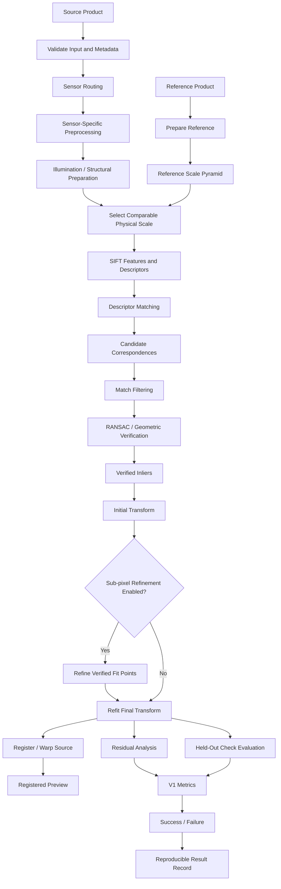
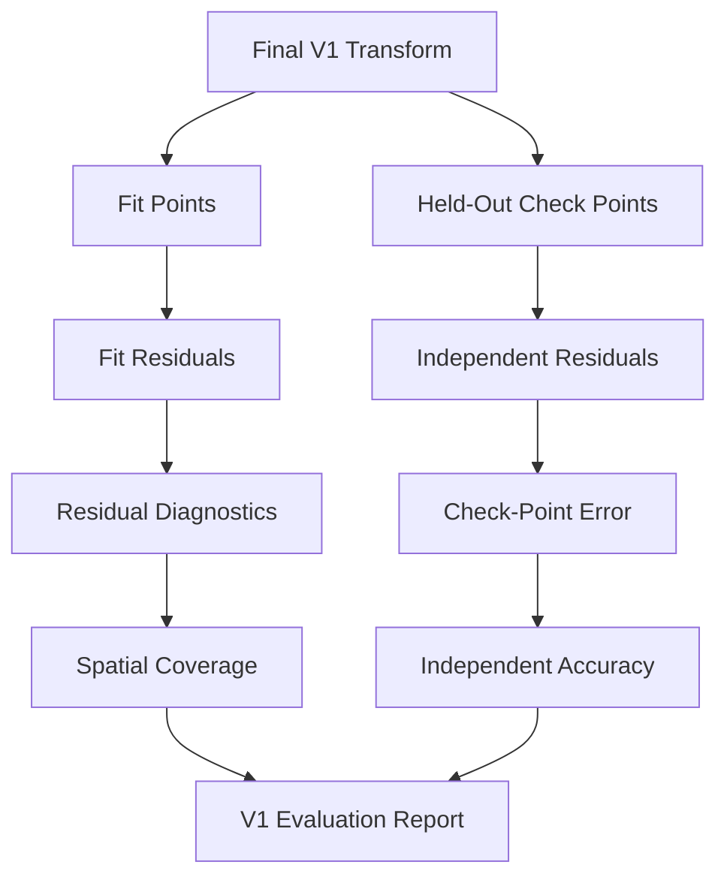
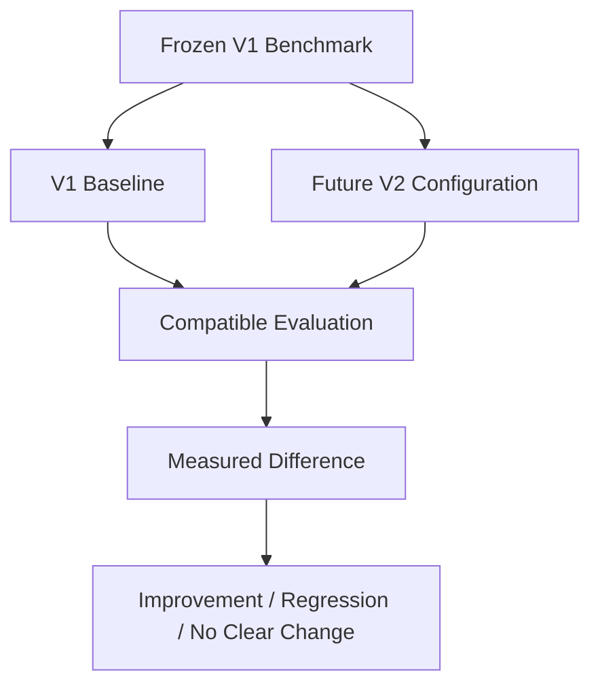

# ChandraMap V1 — Classical Registration Baseline

ChandraMap V1 is the first benchmarkable research pipeline in the ChandraMap version architecture. It intentionally focuses on the smallest scientifically defensible problem: **registering a known lunar source image against a valid reference image and measuring whether the registration is actually correct**.

> **V1 is ChandraMap's smallest rigorous, reproducible, and benchmarkable lunar image-registration pipeline.**

> **V1 optimizes for correctness, measurability, and reproducibility before algorithmic complexity.**

> **V1 establishes the classical baseline against which later ChandraMap versions are compared.**

> **A visually convincing overlay is not enough; V1 must produce measurable correspondence and registration evidence.**

V1 is not intended to solve every problem in lunar image correspondence. It establishes the baseline needed to answer a more important question first:

> **Can a simple classical pipeline register a known lunar source image against a valid reference image and prove the result numerically?**

Only after this baseline is measurable does it become meaningful to ask whether learned matchers, retrieval systems, advanced multimodal methods, DEM-aware geometry, or other later-version techniques improve the result.

---

## Contents

- [1. V1 at a Glance](#1-v1-at-a-glance)
- [2. Why V1 Exists](#2-why-v1-exists)
- [3. V1 Scope](#3-v1-scope)
- [4. V1 Inputs](#4-v1-inputs)
- [5. Sensor and Reference Context](#5-sensor-and-reference-context)
- [6. V1 Pipeline](#6-v1-pipeline)
- [7. Sensor Routing and Preprocessing](#7-sensor-routing-and-preprocessing)
- [8. Illumination and Structural Preparation](#8-illumination-and-structural-preparation)
- [9. Physical Scale Handling](#9-physical-scale-handling)
- [10. SIFT Baseline](#10-sift-baseline)
- [11. Descriptor Matching](#11-descriptor-matching)
- [12. Match Filtering](#12-match-filtering)
- [13. RANSAC and Geometric Verification](#13-ransac-and-geometric-verification)
- [14. Transform Models](#14-transform-models)
- [15. Residual Analysis](#15-residual-analysis)
- [16. Optional Sub-Pixel Refinement](#16-optional-sub-pixel-refinement)
- [17. Final Transform and Registration](#17-final-transform-and-registration)
- [18. V1 Core Outputs](#18-v1-core-outputs)
- [19. V1 Evaluation](#19-v1-evaluation)
- [20. Success and Failure](#20-success-and-failure)
- [21. V1 Benchmark Protocol](#21-v1-benchmark-protocol)
- [22. V1 Reproducibility](#22-v1-reproducibility)
- [23. Result and Artifact Structure](#23-result-and-artifact-structure)
- [24. V1 Configuration Philosophy](#24-v1-configuration-philosophy)
- [25. V1 Data Principles](#25-v1-data-principles)
- [26. V1 Non-Goals](#26-v1-non-goals)
- [27. Retrieval and Learned-Method Boundaries](#27-retrieval-and-learned-method-boundaries)
- [28. V1 Development Priorities](#28-v1-development-priorities)
- [29. V1 Testing Strategy](#29-v1-testing-strategy)
- [30. V1 as the Benchmark Anchor](#30-v1-as-the-benchmark-anchor)
- [31. V1 Limitations](#31-v1-limitations)
- [32. V1 Anti-Patterns](#32-v1-anti-patterns)
- [33. Claims to Avoid](#33-claims-to-avoid)
- [34. Related Documentation](#34-related-documentation)
- [35. Summary](#35-summary)

---

## 1. V1 at a Glance

| Area                       | V1 Position                                                      |
| -------------------------- | ---------------------------------------------------------------- |
| Primary task               | Known-pair/local lunar image registration                        |
| Main research question     | Can a simple classical pipeline produce measurable registration? |
| Baseline feature method    | SIFT                                                             |
| Matching                   | Descriptor-based candidate correspondence                        |
| Geometric verification     | RANSAC                                                           |
| Transform models           | Affine and/or homography where justified                         |
| Scale strategy             | Physical GSD-aware comparison                                    |
| Sensor handling            | Sensor-specific routing before common matching                   |
| Refinement                 | Optional/configurable according to V1 specification              |
| Evaluation                 | Independent metrics where truth exists                           |
| Retrieval                  | Not core V1                                                      |
| Learned matcher stack      | Not core V1                                                      |
| DEM-aware geometry         | Not core V1                                                      |
| Multi-mission registration | Not core V1                                                      |
| Primary purpose            | Establish a reproducible baseline for later versions             |

The detailed project-level V1 scope is defined by [`../../project/v1-scope.md`](../../project/v1-scope.md). This README summarizes V1 and provides navigation; it must not silently override that document or the detailed V1 specification files in this directory.

---

## 2. Why V1 Exists

ChandraMap's long-term problem is difficult because images of the same lunar region may differ in:

- Ground Sampling Distance (GSD);
- spatial resolution;
- sensor modality;
- spectral response;
- image scale;
- Sun angle;
- illumination;
- shadow geometry;
- viewing geometry;
- terrain relief;
- projection;
- coordinate system;
- product processing level;
- contrast;
- noise;
- acquisition geometry.

It would be possible to immediately combine classical methods, learned matchers, global retrieval, vector indexing, DEM-aware geometry, local warping, hyperspectral processing, and multi-mission support.

That would make the system more complicated, but not necessarily more scientifically useful.

Without a baseline, ChandraMap could not answer:

- Which component improved the result?
- Which component caused a regression?
- Did preprocessing help?
- Did scale handling help?
- Did the matcher help?
- Did refinement improve independent error?
- Did a more flexible transform merely reduce fit error?
- Did the system become more robust or only more complex?

V1 exists to establish a controlled reference point.

### Baseline-first principle

The conceptual V1 baseline is:

```text
SIFT
  ↓
Descriptor Matching
  ↓
Candidate Filtering
  ↓
RANSAC
  ↓
Affine / Homography
  ↓
Residual Analysis
  ↓
Registration
  ↓
Independent Evaluation
```

V1 should be simple enough to understand, reproduce, debug, and measure.

It does **not** need to be the most accurate possible future ChandraMap configuration.

---

## 3. V1 Scope

V1 focuses on **local registration where the source/reference relationship or approximate overlap is already known**.

This isolates the image-registration problem from the separate problem of whole-Moon reference retrieval.

### 3.1 Core V1 concerns

V1 emphasizes:

- deterministic source/reference pair definition;
- input and metadata validation;
- sensor-aware routing;
- conservative sensor-specific preprocessing;
- physically meaningful scale comparison;
- SIFT feature detection and description;
- descriptor-based candidate matching;
- configurable candidate filtering;
- RANSAC geometric verification;
- affine and/or homography estimation where justified;
- residual diagnostics;
- optional verified-point refinement when enabled;
- final transform estimation;
- registered visualization;
- spatial coverage;
- held-out evaluation where suitable truth exists;
- explicit success/failure reporting;
- reproducible result records.

### 3.2 Known-overlap first

V1 primarily assumes that a source/reference pair or approximate region has already been selected.

This is deliberate.

A failed global search and a failed local registration are different failure modes.

By starting from known overlap, V1 can answer:

> Did correspondence and geometric registration work?

without also having to answer:

> Did the system retrieve the correct region from the entire Moon?

Those problems may be combined in later versions, but they should first be benchmarked separately.

### 3.3 V1 scientific question

The central V1 question remains:

> **Can ChandraMap take a known lunar source/reference pair, produce geometrically verified correspondences, estimate a defensible transform, and demonstrate the registration numerically?**

---

## 4. V1 Inputs

V1 operates on a controlled source/reference pair plus the metadata and evaluation information needed to interpret it.

### 4.1 Source product

A source input is one validated Chandrayaan-2 observation or a documented representation derived from one.

Depending on V1 scope and data availability, this may involve:

- OHRC;
- TMC-2;
- an IIRS-derived registration representation.

The source should retain enough provenance to identify:

- mission;
- instrument;
- source product;
- processing state;
- dimensions;
- GSD where available;
- projection or coordinate system where available;
- footprint or geolocation where available;
- nodata/mask information where applicable.

### 4.2 Reference product

A reference input is one valid lunar reference product, tile, crop, or region associated with the source pair.

Important ChandraMap reference products include:

- LRO NAC;
- LRO WAC where relevant to the selected V1 workflow.

V1 should not assume that every reference has identical spatial resolution or processing characteristics.

### 4.3 Metadata

Metadata may include:

- sensor name;
- product identifier;
- width and height;
- physical pixel scale/GSD;
- projection;
- coordinate system;
- image footprint;
- processing level;
- acquisition information;
- illumination or viewing metadata where available.

Missing metadata should not be silently invented.

### 4.4 Pair definition

Each benchmark case should define an explicit source/reference relationship.

A pair definition should make clear:

- which source asset is used;
- which reference asset is used;
- what overlap is expected;
- which representation of each asset is used;
- which truth/check-point definition applies.

See [`../../datasets/pair-definition.md`](../../datasets/pair-definition.md).

### 4.5 Ground truth and check points

Where suitable truth exists, V1 should preserve an independent evaluation set.

Ground truth may include manually or externally validated control/check points, geospatial truth, or another benchmark-defined representation.

RANSAC inliers are **not** ground truth.

See:

- [`../../evaluation/ground-truth.md`](../../evaluation/ground-truth.md)
- [`../../datasets/ground-truth-preparation.md`](../../datasets/ground-truth-preparation.md)
- [`../../evaluation/control-points.md`](../../evaluation/control-points.md)
- [`../../evaluation/checkpoint-evaluation.md`](../../evaluation/checkpoint-evaluation.md)

---

## 5. Sensor and Reference Context

V1 is sensor-aware because OHRC, TMC-2, and IIRS do not represent the lunar surface in the same way.

Actual product metadata takes precedence over approximate instrument-level values.

### 5.1 OHRC

**Orbiter High Resolution Camera**

- Mission: Chandrayaan-2
- Modality: visible/panchromatic imaging
- Approximate spatial context: roughly `0.25–0.32 m/pixel`, depending on product and documentation

#### V1 implications

OHRC provides very fine spatial detail, but high spatial resolution does not automatically make registration easy.

Difficulty can still arise from:

- different Sun angles;
- shadow displacement;
- viewpoint differences;
- repeated crater structures;
- scale mismatch with the reference;
- geometric distortion;
- low overlap;
- product-processing differences.

Fine source resolution only helps if corresponding physical structure is also represented meaningfully in the reference.

See [`../../sensors/ohrc.md`](../../sensors/ohrc.md).

---

### 5.2 TMC-2

**Terrain Mapping Camera-2**

- Mission: Chandrayaan-2
- Modality: panchromatic terrain imagery
- Approximate scale: around `5 m/pixel`

#### V1 implications

TMC-2 can provide strong terrain structure for registration, but its physical information content differs significantly from very-high-resolution products.

V1 should therefore avoid matching TMC-2 blindly against full-resolution NAC data when many NAC-scale details cannot exist in the TMC-2 source.

Reference-scale selection is important.

See [`../../sensors/tmc2.md`](../../sensors/tmc2.md).

---

### 5.3 IIRS

**Imaging Infrared Spectrometer**

- Mission: Chandrayaan-2
- Modality: hyperspectral / imaging infrared
- Approximate spatial scale: around `80 m/pixel`
- Approximate spectral range: roughly `0.8–5.0 µm`
- Spectral sampling/band count: product/documentation dependent, commonly described around the `~250–256` range

IIRS must not be treated as an ordinary grayscale camera.

Before a conventional 2D image matcher is applied, an IIRS product requires a documented registration-friendly representation.

Conceptual options may include:

- selected spectral band;
- derived component;
- PCA-style representation;
- structural image derived from spectral data.

V1 should not invent one universal IIRS conversion unless the project specification defines it.

If complete IIRS registration is outside the currently benchmarked V1 scope, it should remain documented as limited or experimental rather than being implied as solved.

See [`../../sensors/iirs.md`](../../sensors/iirs.md).

---

### 5.4 LRO NAC

**Lunar Reconnaissance Orbiter Camera — Narrow Angle Camera**

NAC provides high-resolution lunar reference imagery.

Project context may involve products in approximately the sub-metre to few-metre-per-pixel range, depending on the specific observation and processing.

Actual product metadata wins.

For a substantially coarser source sensor, V1 should select or derive a reference representation at a comparable effective physical scale before attempting correspondence.

See [`../../sensors/lro-nac.md`](../../sensors/lro-nac.md).

---

### 5.5 LRO WAC

**Lunar Reconnaissance Orbiter Camera — Wide Angle Camera**

WAC provides broad lunar context and can be useful for:

- coarse reference context;
- larger-area comparison;
- future retrieval workflows;
- coarse-to-fine localization.

V1 should not assume one universal WAC GSD across all products.

Whether WAC participates in the core V1 benchmark depends on the detailed V1 scope.

See [`../../sensors/lro-wac.md`](../../sensors/lro-wac.md).

---

## 6. V1 Pipeline

The conceptual V1 pipeline is:



### 6.1 Correct refinement order

If sub-pixel refinement is enabled, the intended order is:

```text
Candidate Matches
      ↓
Match Filtering
      ↓
RANSAC
      ↓
Verified Inliers
      ↓
Initial Transform
      ↓
Sub-Pixel Refinement of Verified Fit Points
      ↓
Final Transform Refit
      ↓
Independent Evaluation
```

> **Verify first, refine second.**

Refining large numbers of unverified candidate matches before geometric verification wastes computation and risks refining incorrect correspondences.

### 6.2 Refit after refinement

If verified fit-point coordinates are changed during refinement, the final transform should be re-estimated from the refined coordinates.

A transform fitted to the original coordinates is no longer the fully refined transform.

---

## 7. Sensor Routing and Preprocessing

V1 should not send OHRC, TMC-2, and IIRS through one identical preprocessing path.

Conceptually:

```text
OHRC
  → high-resolution optical preparation

TMC-2
  → medium-resolution structural optical preparation

IIRS
  → spectral/hyperspectral preparation
  → registration-friendly 2D representation
```

Only after sensor-specific preparation should different products be brought toward a common correspondence representation.

See [`../../algorithms/sensor-routing.md`](../../algorithms/sensor-routing.md).

### 7.1 Input validation

V1 preprocessing may include:

- numeric-type validation;
- finite-value checks;
- nodata/mask handling;
- dimensions and metadata checks;
- grayscale or structural representation preparation;
- coordinate bookkeeping;
- reference preparation.

### 7.2 Conservative preprocessing

Preprocessing should exist to improve correspondence or make data comparable.

It should not be a collection of transformations added because they look visually useful.

Potential V1 operations may include:

- conservative contrast normalization;
- local intensity normalization;
- masking invalid regions;
- mild denoising where validated;
- sensor-specific representation conversion.

See [`../../algorithms/preprocessing.md`](../../algorithms/preprocessing.md).

---

## 8. Illumination and Structural Preparation

Sun-angle differences are not simply brightness differences.

Changing illumination can alter:

- crater-shadow direction;
- shadow length;
- ridge visibility;
- local contrast;
- apparent feature boundaries;
- the intensity ordering of nearby terrain.

Therefore:

> Contrast normalization can make intensities easier to compare, but it does not make lunar terrain physically illumination-invariant.

V1 may investigate limited, conservative preparation such as:

- normalized intensity representations;
- gradients;
- edge information;
- structure-focused representations.

Such processing should remain benchmarked rather than assumed to help universally.

See [`../../algorithms/illumination-handling.md`](../../algorithms/illumination-handling.md).

---

## 9. Physical Scale Handling

> **Compare information, not pixel count.**

Scale handling is one of the central V1 design rules.

A source image and reference image can have the same pixel dimensions while representing very different ground areas and spatial frequencies.

Likewise, simply resizing an image does not change its original physical information content.

### 9.1 Upsampling does not create lunar detail

If an `~80 m/pixel` representation is enlarged until it has as many pixels as a much finer reference image, the enlarged image still does not contain the missing fine terrain information.

Upsampling can help algorithms operate on compatible array sizes, but it cannot recover spatial features that were never sampled.

### 9.2 Preferred V1 approach

Where physical GSD information is available:

1. read source/reference spatial scale;
2. construct or access reference pyramid levels;
3. choose a reference level with comparable effective ground information;
4. perform coarse correspondence at that scale;
5. refine only where the source contains sufficient physical detail.

See [`../../algorithms/scale-pyramid.md`](../../algorithms/scale-pyramid.md).

---

### 9.3 Reference pyramid

Conceptually:

```text
High-Resolution LRO Reference
          |
          +---- Level 0
          |
          +---- Level 1
          |
          +---- Level 2
          |
          +---- ...
```

The selected level should be derived from:

- source GSD;
- reference GSD;
- pyramid geometry;
- benchmark configuration;
- data availability.

V1 should record at least enough information to reconstruct the scale relationship, such as:

- selected pyramid level;
- effective scale;
- mapping back to the reference coordinate system.

No universal pyramid level is defined in this README.

---

## 10. SIFT Baseline

SIFT is V1's classical reference method.

It is selected because it provides a well-understood, reproducible feature pipeline that can establish a meaningful baseline before more advanced techniques are introduced.

SIFT is **not** being treated as a claim of optimal lunar matching.

It does not guarantee robustness to:

- arbitrary Sun-angle differences;
- extreme cross-modality;
- large physical information loss;
- severe terrain-dependent distortion;
- all sensor combinations.

Its purpose is to provide a reproducible method that later versions can compare against.

### 10.1 Terminology

#### Keypoint

A keypoint is a detected local image feature with attributes such as:

- image location;
- characteristic scale;
- orientation.

#### Descriptor

A descriptor is a numerical representation of the local image neighborhood around a detected feature.

#### Match

A descriptor match is an association between a source descriptor and a reference descriptor.

#### Candidate correspondence

A candidate correspondence is a matcher-proposed source/reference point relationship.

It has **not yet been proven geometrically consistent**.

#### Verified inlier

A verified inlier is a candidate correspondence that is consistent with the selected robust geometric model according to the configured verification procedure.

It is still not independent ground truth.

> **Matcher output contains candidate correspondences. RANSAC/geometric verification determines which candidates are geometrically consistent inliers.**

If a dedicated SIFT algorithm document exists in the repository, it should provide the implementation-level details for this stage.

---

## 11. Descriptor Matching

After feature extraction, source and reference descriptors are compared.

Conceptually:

```text
Source Descriptors
        +
Reference Descriptors
        |
        v
Descriptor Search
        |
        v
Candidate Correspondences
```

Matching may use nearest-neighbor or k-nearest-neighbor search according to the resolved V1 configuration.

Potential filtering rules may include:

- descriptor-distance constraints;
- ratio testing;
- mutual/cross-check consistency.

V1 should not define a universal ratio-test threshold inside this README.

Thresholds belong in configuration and benchmark specifications.

See [`../../algorithms/matching.md`](../../algorithms/matching.md).

---

## 12. Match Filtering

Candidate filtering reduces obviously weak, duplicate, or ambiguous associations before robust geometric verification.

Potential concerns include:

- one source feature matching multiple reference features;
- duplicate target assignments;
- weak descriptor separation;
- implausible scale/orientation relationships;
- spatially clustered candidates;
- insufficient correspondence count.

Even after descriptor filtering, the remaining points are still **candidate correspondences**.

They should not be called correct matches merely because they pass a descriptor-level test.

See [`../../algorithms/match-filtering.md`](../../algorithms/match-filtering.md).

---

## 13. RANSAC and Geometric Verification

RANSAC is the primary robust geometric verification stage in the V1 baseline.

It attempts to identify a transformation model supported by a geometrically consistent subset of the candidate correspondences.

Conceptually:

```text
Filtered Candidate Correspondences
                ↓
              RANSAC
                ↓
       Initial Geometric Model
                +
          Inlier / Outlier Mask
```

Potential outputs include:

- estimated initial transform;
- inlier mask;
- verified inlier coordinates;
- residuals;
- verification status.

### 13.1 What RANSAC tells us

RANSAC can tell us that a group of candidate correspondences agrees with the selected transform model.

### 13.2 What RANSAC does not tell us

RANSAC does **not** prove that:

- the image pair is geographically correct;
- every inlier is physically correct;
- the transform generalizes to the complete overlap;
- the registration is independently accurate;
- the inliers are ground truth.

> **RANSAC verifies consistency with the chosen model; it does not create independent ground truth.**

See [`../../algorithms/ransac.md`](../../algorithms/ransac.md).

---

## 14. Transform Models

V1 may use an affine transform or homography depending on pair geometry and benchmark configuration.

### 14.1 Affine transform

An affine transform can represent combinations of:

- translation;
- rotation;
- scaling;
- shear.

It preserves parallel lines.

For suitably prepared local products with moderate geometric differences, an affine model may be sufficient.

### 14.2 Homography

A homography provides a more flexible projective mapping.

It can model local planar perspective relationships that an affine transform cannot.

However:

> **More transform parameters do not automatically mean a more accurate physical registration.**

A homography may reduce fit residuals simply because it is more flexible.

The relevant question is whether it improves **independent** registration quality.

### 14.3 Lunar geometry caution

The Moon is not a flat poster.

A single affine transform or homography may be a useful approximation for a local, suitably projected region, but it is not a universal physical model for:

- strong terrain relief;
- large-area geometry;
- raw sensor geometry;
- strongly different viewing configurations.

Later research may investigate terrain-aware or sensor-model geometry.

V1 should keep its transform assumptions explicit.

See [`../../algorithms/transforms.md`](../../algorithms/transforms.md).

---

## 15. Residual Analysis

Residuals measure disagreement between observed point coordinates and coordinates predicted by the transformation.

They are useful for:

- detecting poor model fit;
- identifying spatial trends;
- finding local geometric problems;
- comparing transform choices;
- diagnosing outliers;
- evaluating independent check points.

See [`../../algorithms/residual-analysis.md`](../../algorithms/residual-analysis.md).

### 15.1 Fit residual

A fit residual is measured on a correspondence used to estimate the model.

Fit residuals tell us how well the model explains the data used to build it.

They are useful diagnostics.

They are not fully independent accuracy evidence.

### 15.2 Check residual

A check residual is measured on a point that was **not** used to estimate the final transform for that run.

It provides stronger evidence about how accurately the transformation predicts unseen truth.

> **The final transform should not be evaluated only on the points used to fit it.**

---

## 16. Optional Sub-Pixel Refinement

Sub-pixel refinement may be included as an optional/configurable V1 stage where the detailed V1 specification permits it.

Its purpose is to refine the coordinates of already verified tie points to positions between integer pixel centers.

### 16.1 Correct order

```text
Candidate Correspondences
        ↓
RANSAC Verification
        ↓
Verified Inliers
        ↓
Optional Local Refinement
        ↓
Final Transform Refit
```

Sub-pixel refinement should not be the first mechanism used to determine whether a correspondence is geometrically valid.

### 16.2 What sub-pixel refinement means

A refined coordinate such as:

```text
x = 123.4
y = 87.7
```

means that the algorithm estimated the local image alignment between integer pixel centers.

It does **not** mean that the sensor suddenly acquired additional physical spatial resolution.

> **Sub-pixel localization is a coordinate-estimation concept, not resolution creation.**

See [`../../algorithms/subpixel-refinement.md`](../../algorithms/subpixel-refinement.md).

---

## 17. Final Transform and Registration

After verification and optional point refinement, V1 estimates the final source-to-reference transform.

That transform may be used to produce:

- registered source image;
- reference-aligned preview;
- overlay visualization;
- validity mask;
- transformation record;
- mapped correspondence coordinates.

See [`../../algorithms/registration.md`](../../algorithms/registration.md).

### 17.1 Visual output is supporting evidence

A registered preview is useful because it allows a human to inspect:

- crater alignment;
- ridge consistency;
- edge agreement;
- obvious local warping;
- gross transform failure.

However:

> **A visually convincing overlay is not sufficient evidence that registration is correct.**

A flexible transform can make an image appear well aligned while hiding poor or clustered control points.

Numerical evaluation remains required.

---

## 18. V1 Core Outputs

| Output                        | Purpose                                                          |
| ----------------------------- | ---------------------------------------------------------------- |
| **Candidate correspondences** | Raw/local matcher proposals before geometric verification        |
| **Filtered candidates**       | Candidate matches remaining after descriptor-level filtering     |
| **Verified inliers**          | Correspondences consistent with the chosen geometric model       |
| **Initial transform**         | Robust model estimated during geometric verification             |
| **Final transform**           | Source-to-reference transform after any enabled refinement/refit |
| **Residuals**                 | Diagnostics describing model disagreement                        |
| **Spatial coverage**          | Measures how geometric support is distributed across the overlap |
| **Registered preview**        | Human-readable visual inspection of alignment                    |
| **Check-point metrics**       | Independent accuracy evidence where valid truth exists           |
| **Runtime**                   | Engineering performance diagnostic                               |
| **Status**                    | Explicit success or failure state                                |
| **Failure stage**             | Last failed pipeline stage for reproducible diagnosis            |
| **Run provenance**            | Data, code, configuration, truth, and environment information    |

No fake values or fixed performance expectations belong in this table.

---

## 19. V1 Evaluation

Evaluation is what turns V1 from an image-processing demonstration into a scientific baseline.

See [`../../evaluation/README.md`](../../evaluation/README.md).

V1 evaluation may include:

- candidate count;
- verified inlier count;
- inlier ratio;
- residual diagnostics;
- spatial coverage;
- held-out check-point RMSE where valid truth exists;
- runtime;
- success/failure;
- failure stage;
- provenance.

### 19.1 Evaluation flow



> **Fit residual is not the same as independent accuracy.**

---

### 19.2 Candidate count

Candidate count measures how many tentative correspondences reach a particular matching stage.

It is useful diagnostically.

It does not measure registration correctness.

A pipeline can produce many wrong candidate matches.

---

### 19.3 Inlier count

Inlier count measures how many evaluated candidate correspondences are consistent with the fitted geometric model.

It indicates geometric support for the transform.

However, a large inlier count can still be problematic if the inliers are:

- tightly clustered;
- associated with the wrong repeated structure;
- biased to one image region;
- consistent with an inappropriate transform.

---

### 19.4 Inlier ratio

Conceptually:

```text
inlier ratio = verified inliers / evaluated candidate correspondences
```

The exact definition must remain consistent with the evaluation implementation.

> **Inlier ratio is not registration accuracy.**

A high inlier ratio may occur with very few points or with an incorrect but internally consistent match configuration.

See [`../../evaluation/metrics.md`](../../evaluation/metrics.md).

---

### 19.5 Spatial coverage

Spatial coverage measures whether verified geometric support is distributed across the overlap rather than concentrated in one small region.

For example, many correspondences clustered around a single crater may provide weaker support for an image-wide transform than fewer but well-distributed correspondences.

V1 should report a documented coverage metric rather than relying on visual judgment alone.

No universal V1 coverage threshold is defined here.

See [`../../evaluation/spatial-coverage.md`](../../evaluation/spatial-coverage.md).

---

### 19.6 Fit/control points

Fit points are correspondences used to estimate the transform.

They constrain the solution.

They should not automatically be treated as independent evidence of final accuracy.

See [`../../evaluation/control-points.md`](../../evaluation/control-points.md).

---

### 19.7 Held-out check points

> **A point used to fit the final transform is not an independent check point for that same run.**

Where suitable truth exists, V1 should preserve check points that are not used for transform fitting.

Those points can then measure:

- residual vectors;
- RMSE;
- directional bias;
- spatially varying error.

See [`../../evaluation/checkpoint-evaluation.md`](../../evaluation/checkpoint-evaluation.md).

---

### 19.8 Ground truth

Ground truth must have a defined origin and preparation process.

RANSAC inliers are not ground truth.

A reference image is also not automatically independent ground truth merely because it is treated as the target image.

Truth semantics should be explicit and versioned.

See:

- [`../../evaluation/ground-truth.md`](../../evaluation/ground-truth.md)
- [`../../datasets/ground-truth-preparation.md`](../../datasets/ground-truth-preparation.md)

---

### 19.9 Source-pixel error

Where possible, registration error should first be reported in a clearly defined image coordinate system, typically source-image pixels when that is the benchmark convention.

Physical ground error should only be reported when:

- valid product GSD is known;
- coordinate mapping is valid;
- projection/geospatial context permits the conversion;
- the benchmark truth supports a physical interpretation.

Do not blindly compute:

```text
pixel RMSE × approximate sensor GSD
```

and call the result geospatial accuracy when the underlying mapping does not support that claim.

---

### 19.10 Runtime

Runtime is an engineering metric.

Meaningful comparisons should record relevant context such as:

- hardware;
- software environment;
- image dimensions;
- scale levels used;
- algorithm configuration;
- acceleration backend where applicable.

Runtime values from different environments should not be treated as directly comparable without disclosure.

---

## 20. Success and Failure

V1 should produce one of two scientifically useful outcomes:

1. a measurable registration result; or
2. a reproducible failure record.

> **V1 should fail clearly when reliable registration cannot be established.**

A plausible-looking transform is worse than an explicit failure if the geometric evidence is inadequate.

### 20.1 Conceptual success requirements

A successful V1 run should conceptually include:

- valid source/reference input;
- valid pair definition;
- sufficient usable geometric evidence for the selected model;
- valid transform estimation;
- meaningful spatial support;
- registration output where applicable;
- independent evaluation where suitable truth exists;
- benchmark-defined success criteria satisfied;
- reproducible result provenance.

No numeric success thresholds are defined in this README.

See [`../../evaluation/success-criteria.md`](../../evaluation/success-criteria.md).

### 20.2 Failure stages

Potential observed failure stages include:

- invalid input;
- missing required metadata;
- preprocessing failure;
- no usable source representation;
- insufficient features;
- insufficient candidate correspondences;
- filtering removes required support;
- RANSAC/model-estimation failure;
- degenerate geometry;
- invalid transform;
- refinement failure;
- warp/registration failure;
- evaluation failure.

The recorded failure stage identifies where execution stopped.

It does **not** automatically prove the underlying physical root cause.

See [`../../evaluation/failure-cases.md`](../../evaluation/failure-cases.md).

### 20.3 Failure is benchmark evidence

> **Every V1 benchmark pair should produce either a measurable registration result or a reproducible failure record.**

Failed cases must not be silently removed from later comparisons.

---

## 21. V1 Benchmark Protocol

See [`../../evaluation/benchmark-protocol.md`](../../evaluation/benchmark-protocol.md).

A conceptual V1 benchmark procedure is:

1. freeze or version the benchmark definition;
2. freeze the source/reference pair;
3. freeze truth/check-point definitions;
4. freeze the V1 configuration;
5. execute the pipeline;
6. preserve success or failure;
7. compute metrics;
8. preserve artifacts and provenance;
9. retain the result for later-version comparison.

### 21.1 Benchmark categories

Where defined by the benchmark documentation, V1 cases may be grouped by properties such as:

- source sensor;
- physical scale difference;
- illumination difference;
- terrain type;
- geometric difficulty;
- feature density.

Avoid informal labels such as `easy`, `medium`, or `hard` unless reproducible definitions exist.

See [`../../evaluation/benchmark-categories.md`](../../evaluation/benchmark-categories.md).

---

### 21.2 Stress tests

V1 stress testing should remain limited and interpretable.

Potential controlled cases include:

- scale mismatch;
- illumination difference;
- low-feature terrain;
- repetitive terrain;
- known synthetic translation;
- known synthetic rotation;
- known synthetic scale;
- known affine perturbation.

The goal is not to create an enormous robustness suite in V1.

The goal is to expose important baseline limitations in a controlled way.

See [`../../evaluation/stress-tests.md`](../../evaluation/stress-tests.md).

---

## 22. V1 Reproducibility

Reproducibility is a core requirement of V1.

A benchmark result has limited value if the project cannot later determine which data, code, configuration, and truth produced it.

See [`../../evaluation/reproducibility.md`](../../evaluation/reproducibility.md).

### 22.1 Recommended provenance

A meaningful V1 run should ideally preserve:

- run ID;
- pair ID;
- benchmark version;
- source product identity;
- reference product identity;
- source/reference metadata;
- code revision;
- resolved configuration;
- preprocessing configuration;
- structural/illumination configuration;
- selected scale/pyramid level;
- SIFT configuration;
- matcher configuration;
- filtering configuration;
- RANSAC configuration;
- transform model;
- optional refinement configuration;
- ground-truth version;
- check-point set/version;
- metric-definition version;
- success-rule version;
- random seed where applicable;
- runtime environment where relevant;
- final metrics;
- generated artifacts;
- success/failure status;
- failure stage.

### 22.2 Why provenance matters

Without provenance, two outputs that look similar may have been produced by different:

- data products;
- image crops;
- preprocessing settings;
- thresholds;
- truth versions;
- software revisions.

That prevents reliable comparison.

---

## 23. Result and Artifact Structure

### 23.1 Conceptual result manifest

The following is an **illustrative conceptual structure**, not an implemented schema:

```yaml
run:
  id: PLACEHOLDER_RUN_ID
  version: v1
  status: PLACEHOLDER_STATUS

benchmark:
  version: PLACEHOLDER_BENCHMARK_VERSION
  pair_id: PLACEHOLDER_PAIR_ID
  truth_version: PLACEHOLDER_TRUTH_VERSION

data:
  source:
    sensor: PLACEHOLDER_SOURCE_SENSOR
    asset_id: PLACEHOLDER_SOURCE_ASSET

  reference:
    sensor: PLACEHOLDER_REFERENCE_SENSOR
    asset_id: PLACEHOLDER_REFERENCE_ASSET
    pyramid_level: PLACEHOLDER_LEVEL

pipeline:
  preprocessing: PLACEHOLDER_CONFIG
  scale_strategy: PLACEHOLDER_CONFIG
  matcher: sift
  filtering: PLACEHOLDER_CONFIG
  robust_estimation: PLACEHOLDER_CONFIG
  transform: PLACEHOLDER_MODEL
  refinement: PLACEHOLDER_OPTIONAL_CONFIG

evaluation:
  candidate_count: PLACEHOLDER_VALUE
  inlier_count: PLACEHOLDER_VALUE
  inlier_ratio: PLACEHOLDER_VALUE
  spatial_coverage: PLACEHOLDER_VALUE
  check_rmse: PLACEHOLDER_VALUE_OR_UNAVAILABLE
  units: PLACEHOLDER_UNITS

reproducibility:
  git_revision: PLACEHOLDER_REVISION
  config_id: PLACEHOLDER_CONFIG_ID
```

The example intentionally contains no fake:

- performance values;
- thresholds;
- commit hashes;
- configuration values;
- paths;
- result IDs.

---

### 23.2 Benchmark table template

| Pair | Source Sensor | Reference | Candidates | Inliers | Inlier Ratio | Coverage | Check RMSE | Units | Runtime | Status |
| ---- | ------------- | --------- | ---------: | ------: | -----------: | -------: | ---------: | ----- | ------: | ------ |

This table is intentionally empty until real benchmark evidence exists.

---

### 23.3 Failure table template

| Pair | Failure Stage | Last Valid Stage | Candidates | Inliers | Coverage | Check RMSE | Diagnostic Note |
| ---- | ------------- | ---------------- | ---------: | ------: | -------: | ---------: | --------------- |

Failed pairs should remain part of benchmark reporting.

---

### 23.4 Potential artifacts

Depending on implementation maturity, a V1 run may produce:

- source visualization;
- reference visualization;
- candidate-match visualization;
- filtered candidate visualization;
- RANSAC inlier/outlier visualization;
- transformation record;
- registered preview;
- residual-vector plot;
- control/check-point visualization;
- spatial-coverage visualization;
- point-level evaluation output;
- result manifest;
- execution logs;
- failure diagnostics.

Not every conceptual artifact is necessarily implemented at the same time.

### 23.5 Visualization rule

Visualizations support diagnosis and interpretation.

They do not replace numerical evidence.

---

## 24. V1 Configuration Philosophy

V1 configuration should favor:

- explicit values;
- versioned configuration;
- reproducible defaults;
- small numbers of execution branches;
- sensor-aware parameters;
- deterministic behavior where practical.

Avoid:

- hidden per-image tuning;
- post-hoc threshold changes;
- manual transform corrections;
- manually removing difficult benchmark points;
- hand-selecting parameters after inspecting final test error;
- pair-specific rescue logic that is not documented.

### 24.1 Adaptive logic

Adaptive behavior may be appropriate if it is predefined and reproducible.

For example:

```text
Physically selected reference level
            ↓
Documented validity test fails
            ↓
Try predefined neighboring level
```

This is different from manually viewing the result and selecting whichever level produces the lowest final benchmark error.

---

## 25. V1 Data Principles

See:

- [`../../datasets/README.md`](../../datasets/README.md)
- [`../../datasets/chandrayaan-2.md`](../../datasets/chandrayaan-2.md)
- [`../../datasets/lro.md`](../../datasets/lro.md)
- [`../../datasets/metadata.md`](../../datasets/metadata.md)
- [`../../datasets/data-format.md`](../../datasets/data-format.md)
- [`../../datasets/dataset-structure.md`](../../datasets/dataset-structure.md)
- [`../../datasets/dataset-preparation.md`](../../datasets/dataset-preparation.md)
- [`../../datasets/pair-definition.md`](../../datasets/pair-definition.md)
- [`../../datasets/ground-truth-preparation.md`](../../datasets/ground-truth-preparation.md)

### 25.1 Raw mission data

Raw or provider-issued mission products should remain traceable and should not be destructively modified as part of routine experiment preparation.

### 25.2 Derived data

Derived products should retain provenance describing:

- source product;
- transformation/preparation method;
- relevant configuration;
- output identity.

### 25.3 Pair definitions

Benchmark pair relationships must be explicit.

The project should not rely on an undocumented assumption that two arbitrary files correspond.

### 25.4 Truth versioning

Ground truth can evolve as errors are discovered or annotation improves.

If it changes, the truth version must also change so historical results remain interpretable.

### 25.5 Metadata authority

Instrument-level approximate numbers are useful for planning.

For a real run, valid product metadata should take precedence.

---

### 25.6 Data licensing and redistribution

Reproducibility does not mean committing every large mission product directly into the repository.

Where applicable, V1 should preserve:

- provider/product identifiers;
- source provenance;
- checksums;
- preparation instructions;
- retrieval instructions permitted by the provider.

Data handling must respect source-provider licensing and redistribution terms.

See [`../../data-licenses.md`](../../data-licenses.md).

---

## 26. V1 Non-Goals

V1 is deliberately narrow.

Unless the authoritative V1 specifications state otherwise, V1 should not attempt to become:

- a complete global lunar retrieval system;
- a whole-Moon visual search engine;
- an advanced FAISS retrieval system;
- a large learned-matcher stack;
- a lunar-specific deep feature network;
- a complete physical illumination model;
- a DEM-aware registration engine;
- a large planetary control-network system;
- a bundle-adjustment framework;
- a complete sensor-model photogrammetry system;
- a multi-mission registration platform;
- a Mars/Venus mapping framework;
- a production planetary GIS;
- a final global mosaic-generation system;
- a large interactive lunar-map application.

These capabilities may be valuable later.

They are intentionally not required to prove the V1 research question.

If a detailed V1 specification includes any capability listed above, that specification takes precedence over this general non-goal list.

---

## 27. Retrieval and Learned-Method Boundaries

### 27.1 Why global retrieval is not core V1

V1 should first prove local registration.

If approximate source geolocation or footprint metadata already identifies the relevant lunar region, it is good engineering to use that information to constrain reference selection.

Adding global retrieval before local registration works would combine two difficult problems:

1. finding the correct region;
2. registering the source to that region.

Later versions can evaluate both stages independently and then together.

---

### 27.2 FAISS caution

FAISS performs vector similarity search.

A conceptual retrieval path is:

```text
Query Embedding
      ↓
FAISS Index Search
      ↓
Top-K Candidate References
```

FAISS does **not** itself:

- detect pixel correspondences;
- estimate transforms;
- perform RANSAC;
- prove geographic correctness;
- register two images;
- provide independent geolocation evidence.

It may support later retrieval-enabled versions of ChandraMap.

It is not the V1 registration algorithm.

---

### 27.3 Learned local matchers

V1 retains SIFT as the classical benchmark baseline.

Later versions or experiments may compare methods such as:

- ALIKED + LightGlue;
- LoFTR.

These methods should be benchmarked rather than assumed superior.

### 27.4 ALIKED and LightGlue terminology

**ALIKED** provides sparse learned local features.

**LightGlue** matches local features.

LightGlue should not be described as the detector when paired with ALIKED.

### 27.5 LoFTR terminology

LoFTR is a detector-free local correspondence method.

Its correspondences still require:

- geometric verification;
- model estimation;
- independent evaluation.

### 27.6 Remote-sensing methods

RIFT/CFOG-style approaches may be relevant future candidates for difficult multimodal remote-sensing registration.

They should not be silently inserted into the V1 baseline unless the authoritative V1 scope explicitly includes them.

---

## 28. V1 Development Priorities

The recommended conceptual build order is:

1. validate one known source/reference pair;
2. implement deterministic input and metadata handling;
3. implement sensor-specific preprocessing;
4. implement physical scale compatibility;
5. implement the SIFT baseline;
6. implement candidate descriptor matching;
7. implement candidate filtering;
8. implement RANSAC geometric verification;
9. estimate a valid transform;
10. generate a registered preview;
11. add residual diagnostics;
12. add held-out check-point evaluation;
13. add spatial-coverage evaluation;
14. add optional sub-pixel refinement if required;
15. freeze a reproducible V1 benchmark;
16. expand pair coverage.

This is a development order, not a claim that every step is currently implemented.

### 28.1 First meaningful V1 milestone

> **Known lunar pair → candidate correspondences → verified inliers → final transform → registered overlay → independent numerical error.**

That milestone demonstrates actual registration rather than only a pipeline diagram.

### 28.2 Engineering priorities

V1 engineering should prioritize:

1. correct coordinate handling;
2. reproducible data preparation;
3. clear interfaces;
4. explicit failures;
5. reliable metrics;
6. deterministic/configurable execution;
7. tests;
8. algorithmic complexity only after the above are trustworthy.

### 28.3 Scientific priorities

V1 scientific work should prioritize:

1. physically meaningful scale comparison;
2. correct candidate/inlier terminology;
3. robust geometric verification;
4. independent evaluation;
5. spatial support;
6. sensor-aware interpretation;
7. honest limitations.

---

## 29. V1 Testing Strategy

V1 requires several different layers of testing.

### 29.1 Unit tests

Potential unit-test targets include:

- coordinate transformations;
- pixel-coordinate conversion;
- reference-pyramid mappings;
- residual formulas;
- RMSE calculations;
- coverage calculations;
- transform utilities;
- inlier-mask handling;
- configuration parsing.

### 29.2 Synthetic registration tests

Synthetic tests provide known transformations.

Useful cases include:

- known translation;
- known rotation;
- known scale change;
- known affine transformation.

Because the expected transformation is known, these tests are useful for detecting implementation errors independently of lunar-data difficulty.

### 29.3 Real lunar tests

Real-data testing should evaluate the sensor/reference combinations that are actually included by the V1 specification.

Potential source classes include:

- OHRC;
- TMC-2;
- IIRS-derived representations where V1 scope permits them.

Potential reference products include:

- LRO NAC;
- LRO WAC where appropriate.

### 29.4 Benchmark tests

Formal benchmark tests combine:

```text
Frozen Pair
    +
Frozen Truth
    +
Frozen Metric Definitions
    +
Frozen/Versioned Configuration
    =
Comparable V1 Result
```

### 29.5 CI

Small deterministic unit and integration tests may be appropriate for repository CI.

The project should not claim that full lunar datasets, large benchmarks, or GPU-dependent experiments run in CI unless the repository actually implements that workflow.

---

## 30. V1 as the Benchmark Anchor

> **V1 is valuable even after later versions exist because it provides the reference point needed to measure improvement.**

Later versions should not erase V1.

They should compare against it.

### 30.1 V1 vs V2

V1 asks:

> Can the baseline produce measurable registration?

V2 should ask a different question:

> Can targeted improvements increase robustness or independent registration quality relative to V1?

That distinction is only meaningful if the V1 baseline remains reproducible.

### 30.2 Comparison flow



### 30.3 Conceptual V1 → V2 readiness

Movement toward V2 research becomes meaningful when:

- the V1 pipeline is runnable;
- the V1 benchmark is stable enough for comparison;
- metric definitions are documented;
- relevant independent evaluation exists;
- failures are recorded;
- result provenance is available;
- baseline results are preserved.

No numerical completion threshold is defined here.

---

## 31. V1 Limitations

V1 is intentionally limited.

### 31.1 SIFT limitations

Classical SIFT may struggle under:

- strong cross-modality;
- extreme illumination change;
- weak local texture;
- repeated terrain;
- large physical scale differences.

### 31.2 Physical information limits

When one sensor is substantially coarser than another, fine reference structure may simply not exist in the source.

No feature matcher can reliably recover lunar details that were never spatially resolved.

### 31.3 Illumination limitations

Sun-angle changes can move or reverse shadows.

Brightness and contrast normalization cannot reconstruct identical illumination geometry.

### 31.4 Repetitive lunar terrain

Similar craters and repeated terrain patterns can produce plausible but incorrect correspondences.

This is one reason geometric verification and spatial evaluation are required.

### 31.5 Low-feature terrain

Smooth or visually repetitive regions may not provide enough stable local evidence for SIFT-based registration.

V1 should report this as a failure condition rather than fabricate a transform.

### 31.6 Transform limitations

A global affine transform or homography may fail to describe:

- strong terrain relief;
- larger-area geometric distortion;
- raw sensor geometry;
- substantial viewpoint variation.

### 31.7 IIRS limitations

IIRS has substantially coarser spatial information and a different modality from high-resolution optical reference imagery.

It may require a dedicated representation and may not support the same fine-scale claims as OHRC or TMC-2.

### 31.8 Truth limitations

Independent check-point truth may be difficult or expensive to prepare.

When suitable truth is unavailable, the resulting limitation must be stated.

### 31.9 Pixel error vs ground error

Pixel-coordinate accuracy does not automatically translate into geospatial ground accuracy.

Projection, mapping, sensor geometry, and product GSD must support the conversion.

### 31.10 Known-pair limitation

V1 does not primarily test whether ChandraMap can search the entire Moon for the correct reference region.

That is a different research problem.

### 31.11 No universal invariance claim

V1 does not establish universal:

- scale invariance;
- illumination invariance;
- Sun-angle invariance;
- sensor invariance;
- modality invariance.

Its conclusions apply to the benchmark cases actually tested.

---

## 32. V1 Anti-Patterns

Do **not**:

- add every research idea directly into V1;
- call matcher candidates verified matches;
- call RANSAC inliers ground truth;
- evaluate only on fitting points;
- judge success from an overlay alone;
- judge success from match count alone;
- judge success from inlier ratio alone;
- report decorative accuracy percentages;
- use stars to rank methods;
- claim SIFT is fully invariant to physical sensor GSD;
- claim contrast normalization solves Sun-angle differences;
- upsample IIRS and claim fine-resolution information was recovered;
- force full-resolution NAC against a coarse source without scale reasoning;
- treat FAISS as image registration;
- add global retrieval when metadata already constrains the search without a research reason;
- assume a homography is a universal lunar geometry model;
- hide failed benchmark pairs;
- manually tune final test pairs;
- move held-out check points into the transform-fitting set;
- multiply pixel error by an approximate GSD and automatically call it ground accuracy;
- overwrite historical V1 results when V2 is created;
- silently modify benchmark truth;
- silently change metric definitions;
- claim planned functionality is implemented.

---

## 33. Claims to Avoid

Without measured evidence, avoid claims such as:

> "V1 is highly accurate."

> "V1 solves scale invariance."

> "V1 solves Sun-angle variation."

> "V1 works on every lunar image."

> "V1 achieves sub-pixel lunar accuracy."

> "V1 achieves sub-metre geolocation."

> "SIFT is sufficient for every sensor."

> "Homography perfectly maps lunar terrain."

> "A high inlier ratio proves correct registration."

> "High coverage proves the registration is accurate."

> "Visual alignment proves success."

> "IIRS can be registered at NAC spatial resolution."

> "V1 is production-ready."

> "Every documented V1 component is already implemented."

Prefer wording such as:

- V1 is designed to evaluate;
- V1 provides a baseline;
- the method is benchmarked on;
- the result was measured using;
- the component is optional/configurable;
- the feature is planned;
- the feature is experimental;
- the claim is limited to the tested benchmark cases.

---

## 34. Related Documentation

V1 should be read together with the wider ChandraMap documentation hierarchy.

### 34.1 Parent version architecture

- [ChandraMap Version Architecture](../README.md)

`../README.md` describes the overall V1–V4 benchmark architecture.

This file describes V1 specifically.

---

### 34.2 V1 specification documents

The detailed V1 specification files are authoritative for exact V1 scope and behavior.

Known V1 documentation includes:

- [V1 Specification](./specification.md)
- [V1 Scope](./scope.md)
- [V1 Requirements](./requirements.md)
- [V1 Architecture](./architecture.md)
- [V1 Pipeline](./pipeline.md)
- [V1 Inputs](./inputs.md)

If any high-level statement in this README conflicts with a detailed V1 specification, the detailed V1 document takes precedence.

---

### 34.3 Project documentation

Project-wide purpose and constraints are documented in:

- [Project Goals](../../project/goals.md)
- [Project Non-Goals](../../project/non-goals.md)
- [Project-Level V1 Scope](../../project/v1-scope.md)
- [Terminology](../../project/terminology.md)
- [Assumptions](../../project/assumptions.md)
- [Limitations](../../project/limitations.md)

`../../project/v1-scope.md` is particularly important because it defines the project-level V1 scope that this README must not silently expand.

---

### 34.4 Architecture documentation

For system structure and execution flow, see:

- [System Overview](../../architecture/system-overview.md)
- [V1 Pipeline Architecture](../../architecture/v1-pipeline.md)
- [Core Engine Architecture](../../architecture/core-engine-architecture.md)
- [Backend Architecture](../../architecture/backend-architecture.md)
- [Frontend Architecture](../../architecture/frontend-architecture.md)
- [Module Map](../../architecture/module-map.md)
- [Data Flow](../../architecture/data-flow.md)
- [Output Flow](../../architecture/output-flow.md)

`../../architecture/v1-pipeline.md` is the primary architecture-level companion to this README for detailed V1 execution flow.

---

### 34.5 Sensor documentation

Sensor-specific physical and product context is documented in:

- [Sensor Overview](../../sensors/overview.md)
- [OHRC](../../sensors/ohrc.md)
- [TMC-2](../../sensors/tmc2.md)
- [IIRS](../../sensors/iirs.md)
- [LRO NAC](../../sensors/lro-nac.md)
- [LRO WAC](../../sensors/lro-wac.md)

This README intentionally summarizes only the registration-relevant implications.

---

### 34.6 Dataset documentation

For data definitions and preparation, see:

- [Dataset Overview](../../datasets/README.md)
- [Chandrayaan-2 Dataset](../../datasets/chandrayaan-2.md)
- [LRO Dataset](../../datasets/lro.md)
- [Metadata](../../datasets/metadata.md)
- [Data Formats](../../datasets/data-format.md)
- [Dataset Structure](../../datasets/dataset-structure.md)
- [Dataset Preparation](../../datasets/dataset-preparation.md)
- [Pair Definition](../../datasets/pair-definition.md)
- [Ground-Truth Preparation](../../datasets/ground-truth-preparation.md)

---

### 34.7 Algorithm documentation

Known algorithm documentation includes:

- [Algorithm Overview](../../algorithms/overview.md)
- [Sensor Routing](../../algorithms/sensor-routing.md)
- [Preprocessing](../../algorithms/preprocessing.md)
- [Illumination Handling](../../algorithms/illumination-handling.md)
- [Scale Pyramid](../../algorithms/scale-pyramid.md)
- [Matching](../../algorithms/matching.md)
- [Match Filtering](../../algorithms/match-filtering.md)
- [RANSAC](../../algorithms/ransac.md)
- [Transforms](../../algorithms/transforms.md)
- [Residual Analysis](../../algorithms/residual-analysis.md)
- [Sub-Pixel Refinement](../../algorithms/subpixel-refinement.md)
- [Registration](../../algorithms/registration.md)

If a dedicated `sift.md` document exists, it should be treated as the detailed algorithm reference for the V1 feature baseline.

---

### 34.8 Evaluation documentation

For benchmark and metric definitions, see:

- [Evaluation Overview](../../evaluation/README.md)
- [Benchmark Protocol](../../evaluation/benchmark-protocol.md)
- [Benchmark Categories](../../evaluation/benchmark-categories.md)
- [Metrics](../../evaluation/metrics.md)
- [Ground Truth](../../evaluation/ground-truth.md)
- [Control Points](../../evaluation/control-points.md)
- [Check-Point Evaluation](../../evaluation/checkpoint-evaluation.md)
- [Spatial Coverage](../../evaluation/spatial-coverage.md)
- [Stress Tests](../../evaluation/stress-tests.md)
- [Success Criteria](../../evaluation/success-criteria.md)
- [Failure Cases](../../evaluation/failure-cases.md)
- [Reproducibility](../../evaluation/reproducibility.md)

V1 is only useful as a baseline if these evaluation definitions remain rigorous and stable enough for later comparison.

---

### 34.9 Repository-level research directories

Where present, the repository-level research directories serve distinct purposes:

- [`../../../benchmarks/`](../../../benchmarks/) — controlled/frozen benchmark definitions;
- [`../../../experiments/`](../../../experiments/) — exploratory and controlled research runs;
- [`../../../results/`](../../../results/) — generated benchmark outputs and historical result records.

An experiment does not automatically become the official V1 benchmark.

Historical V1 results should be preserved rather than overwritten when later versions are evaluated.

---

### 34.10 Root repository documents

Relevant repository-level documents include:

- [Repository README](../../../README.md)
- [Roadmap](../../../ROADMAP.md)
- [Changelog](../../../CHANGELOG.md)
- [Contributing Guide](../../../CONTRIBUTING.md)
- [Security Policy](../../../SECURITY.md)
- [Citation Metadata](../../../CITATION.cff)

---

## 35. Summary

ChandraMap V1 exists to establish a trustworthy starting point.

Its central workflow is intentionally classical:

```text
Known Source + Reference Pair
          ↓
Validate Inputs and Metadata
          ↓
Sensor-Specific Preparation
          ↓
Physical Scale Compatibility
          ↓
SIFT Features
          ↓
Descriptor Matching
          ↓
Candidate Correspondences
          ↓
Filtering
          ↓
RANSAC Verification
          ↓
Verified Inliers
          ↓
Initial Transform
          ↓
Optional Verified-Point Refinement
          ↓
Final Transform Refit
          ↓
Registration
          ↓
Residual + Coverage + Check-Point Evaluation
          ↓
Reproducible Success or Failure Record
```

V1 deliberately separates local image registration from whole-Moon retrieval.

It treats:

- SIFT as a baseline rather than a final answer;
- matcher output as candidate correspondence rather than truth;
- RANSAC inliers as model-consistent support rather than ground truth;
- affine/homography as local approximation models rather than universal lunar geometry;
- sub-pixel refinement as coordinate refinement rather than creation of new sensor resolution;
- visual overlays as supporting evidence rather than proof;
- failures as benchmark results rather than cases to hide.

The most important evaluation principle is:

> **A final transform should not be judged only on the points used to estimate it.**

The most important physical-scale principle is:

> **Compare information, not pixel count.**

The most important engineering principle is:

> **V1 should fail clearly when reliable registration cannot be established.**

And the reason V1 remains important after V2, V3, and V4 exist is simple:

> **V1 is the preserved benchmark anchor that allows ChandraMap to measure whether additional complexity actually improves lunar image correspondence and registration.**

<!-- Source requirements: :contentReference[oaicite:0]{index=0} -->
