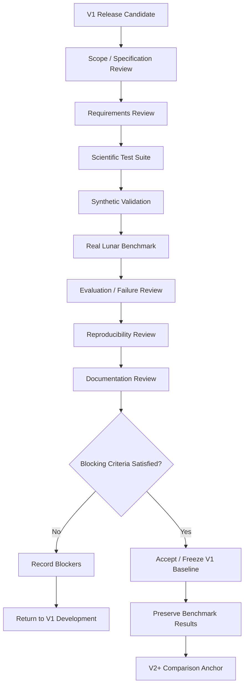
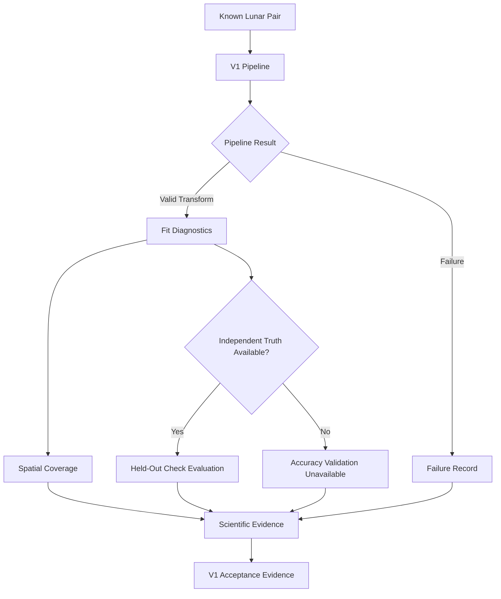
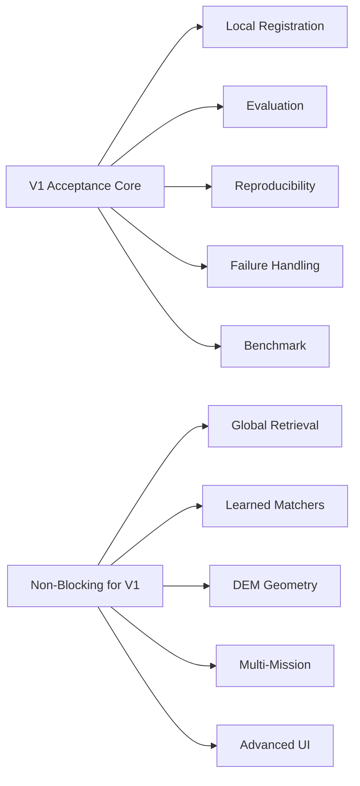

# ChandraMap V1 Acceptance Criteria

> **Document role:** Authoritative V1 version-level acceptance contract
> **Version:** V1
> **Version role:** Classical Baseline / Registration Foundation
> **Primary task:** Known-overlap local lunar image registration
> **Acceptance scope:** Scientific readiness, engineering readiness, benchmark readiness, reproducibility, testing, documentation, and baseline freeze conditions
> **Current acceptance status:** Not asserted by this document

This document defines the evidence-based conditions under which **ChandraMap V1** can be accepted and frozen as the project's first trustworthy classical lunar image correspondence and registration baseline.

V1 acceptance is a **version-level decision**.

It is not the same as deciding whether one image pair registered successfully.

The distinction is fundamental:

> [`../../evaluation/success-criteria.md`](../../evaluation/success-criteria.md) answers: **Did a particular benchmark run or pair satisfy the defined scientific success rules?**

> **`acceptance-criteria.md` answers: Is ChandraMap V1 as a version sufficiently implemented, tested, benchmarkable, reproducible, documented, and stable to be accepted as the project's classical baseline?**

A benchmark pair may legitimately fail while V1 itself remains scientifically acceptable if that failure is:

- detected correctly;
- represented explicitly;
- preserved in benchmark results;
- included in evaluation;
- reproducible;
- not disguised as success.

Likewise, one visually impressive registration does not establish V1 readiness.

> **V1 is accepted when it provides a trustworthy, reproducible, testable, and measurable baseline—not when it appears visually impressive.**

> **V1 acceptance depends on scientific correctness and reproducibility, not on every benchmark pair succeeding.**

> **A correctly reported failure is evidence of a functioning scientific pipeline; a silent or fabricated success is not.**

> **Acceptance requires evidence.**

> **V1 acceptance criteria must not be weakened after benchmark results are known merely to make V1 appear successful.**

> **Acceptance should freeze V1's historical meaning so that later versions can be compared against it fairly.**

> **V1 does not need to solve every ChandraMap research challenge before it can be accepted.**

> **No fabricated numeric acceptance threshold should be introduced simply to make the checklist appear precise.**

> **V1 acceptance freezes a trustworthy scientific baseline. It does not certify perfect registration performance.**

---

# 1. Relationship to Other V1 Documents

The V1 documentation set has distinct responsibilities.

| Document                                 | Responsibility                                                                                |
| ---------------------------------------- | --------------------------------------------------------------------------------------------- |
| [`README.md`](./README.md)               | V1 overview and navigation                                                                    |
| [`scope.md`](./scope.md)                 | Defines what belongs inside and outside V1                                                    |
| [`specification.md`](./specification.md) | Defines the V1 technical and scientific contract                                              |
| [`requirements.md`](./requirements.md)   | Defines individually verifiable V1 requirements                                               |
| [`architecture.md`](./architecture.md)   | Defines V1 architectural responsibilities and boundaries                                      |
| `pipeline.md`                            | Defines the ordered V1 execution flow when present                                            |
| `inputs.md`                              | Defines V1 input contracts when present                                                       |
| [`outputs.md`](./outputs.md)             | Defines V1 scientific, diagnostic, failure, artifact, and provenance outputs                  |
| `benchmark.md`                           | Defines the frozen V1 benchmark when present                                                  |
| **`acceptance-criteria.md`**             | Determines whether V1 as a whole is ready to be accepted and frozen as the classical baseline |

This document should not duplicate those files.

It consumes their contracts and asks:

> **Is the resulting V1 system trustworthy enough to become the historical baseline?**

---

# 2. What “V1 Accepted” Means

Conceptually, **V1 accepted** means that:

- the V1 scientific task is explicit;
- the V1 scope is stable enough to freeze;
- the classical baseline pipeline is runnable;
- required input and output semantics are defined;
- SIFT-based local correspondence is available as the classical baseline;
- physical scale handling is scientifically meaningful;
- candidate correspondences are geometrically verified;
- transformation semantics are explicit;
- invalid geometry is rejected;
- optional refinement follows the correct order;
- quantitative evaluation exists;
- held-out evaluation exists where valid truth supports it;
- failed runs are explicit and retained;
- metrics are documented and testable;
- coordinate handling is verified;
- benchmark configuration is reproducible;
- benchmark results can be tied to code, data, configuration, and truth;
- real lunar evidence exists;
- core documentation is mutually consistent;
- known limitations are explicit;
- historical V1 evidence can be preserved;
- later versions can compare against the accepted baseline.

V1 acceptance does **not** mean:

- every benchmark pair succeeds;
- V1 has reached the maximum achievable registration accuracy;
- V1 is production-ready;
- global lunar retrieval is solved;
- learned matching is required;
- DEM-aware terrain registration is solved;
- every Chandrayaan-2 product is supported;
- every LRO product is supported;
- every future sensor is supported;
- every advanced research idea has been implemented.

---

# 3. Acceptance Classification

Acceptance criteria use the following classifications.

| Classification   | Meaning                                                                                                 |
| ---------------- | ------------------------------------------------------------------------------------------------------- |
| **MANDATORY**    | Must be satisfied before V1 can be accepted                                                             |
| **CONDITIONAL**  | Mandatory only when the corresponding capability is included in the accepted V1 benchmark/configuration |
| **RECOMMENDED**  | Strongly desirable but not inherently blocking unless promoted by an authoritative specification        |
| **NON-BLOCKING** | Useful improvement that should not prevent V1 baseline acceptance                                       |
| **OUT OF SCOPE** | Explicitly not required for V1 acceptance                                                               |

These classifications describe acceptance requirements.

They do **not** indicate current repository status.

This document intentionally does not mark criteria as:

- passed;
- failed;
- complete;
- implemented;

without reviewed evidence.

---

# 4. Acceptance at a Glance

| Acceptance Area         | Classification               | Core Question                                                          |
| ----------------------- | ---------------------------- | ---------------------------------------------------------------------- |
| Scope                   | **Mandatory**                | Is V1's scientific boundary explicit and stable?                       |
| Specification           | **Mandatory**                | Is intended scientific behavior defined consistently?                  |
| Requirements            | **Mandatory**                | Are critical requirements identifiable and verifiable?                 |
| Data / Inputs           | **Mandatory**                | Are source/reference inputs scientifically identifiable and traceable? |
| Sensor Handling         | **Mandatory / Conditional**  | Are included sensor paths interpreted correctly?                       |
| Pipeline                | **Mandatory**                | Can the V1 baseline execute coherently end-to-end?                     |
| Physical Scale          | **Mandatory**                | Are cross-resolution comparisons physically meaningful?                |
| Matching                | **Mandatory**                | Does the SIFT baseline generate traceable candidate correspondences?   |
| Geometry                | **Mandatory**                | Are correspondences robustly verified and transforms valid?            |
| Refinement              | **Conditional**              | If enabled, is verify → refine → refit preserved?                      |
| Registration            | **Mandatory / Configured**   | Can the final transform produce interpretable aligned output?          |
| Evaluation              | **Mandatory**                | Are results quantitatively evaluated correctly?                        |
| Failure Handling        | **Mandatory**                | Are failures explicit and preserved?                                   |
| Benchmark               | **Mandatory**                | Is a frozen/reproducible V1 benchmark defined?                         |
| Reproducibility         | **Mandatory**                | Can formal runs be reconstructed and audited?                          |
| Testing                 | **Mandatory**                | Are critical scientific behaviors verified?                            |
| Documentation           | **Mandatory**                | Can another contributor understand and reproduce V1?                   |
| Repository Quality      | **Mandatory where relevant** | Is the repository sufficiently trustworthy for scientific reuse?       |
| UI / Demo               | **Non-blocking**             | Is visualization available where useful?                               |
| Global Retrieval        | **Out of Scope**             | Not required for known-overlap V1                                      |
| Learned Matching        | **Out of Core V1**           | Not required for classical baseline acceptance                         |
| DEM-Aware Geometry      | **Out of Scope**             | Deferred to advanced research                                          |
| Multi-Mission Expansion | **Out of Scope**             | Deferred                                                               |

---

# 5. Acceptance Evidence

Acceptance must be based on evidence.

Useful evidence types include:

- automated unit tests;
- component tests;
- integration tests;
- synthetic transformation tests;
- real lunar benchmark runs;
- benchmark manifests;
- failure-path results;
- machine-readable result records;
- configuration records;
- output artifacts;
- transform records;
- point-level evaluation records;
- reproducibility manifests;
- rerun/reproduction evidence;
- code inspection;
- repository inspection;
- documentation review.

A screenshot alone is not sufficient acceptance evidence.

Neither are statements such as:

> "It works."

> "The overlay looks aligned."

> "Many matches were found."

Evidence should connect the claim to:

```text
Requirement
    ↓
Implementation
    ↓
Verification
    ↓
Artifact / Test / Benchmark Evidence
```

---

# 6. Scope Acceptance

See [`scope.md`](./scope.md).

V1 scope acceptance is **MANDATORY**.

The accepted baseline must have an explicit scientific boundary.

Acceptance requires that:

- known-overlap local lunar image registration remains V1's primary task;
- required capabilities are distinguishable from optional capabilities;
- conditional capabilities are identified;
- deferred capabilities are identified;
- non-goals are explicit;
- global retrieval is not accidentally required;
- learned matching is not accidentally required;
- DEM-aware geometry is not accidentally required;
- multi-mission expansion is not accidentally required;
- mosaic/UI functionality does not redefine scientific success;
- V1 scope remains materially consistent with [`../../project/v1-scope.md`](../../project/v1-scope.md).

## Scope Acceptance Checklist

- [ ] V1 primary task is documented
- [ ] V1 core capabilities are documented
- [ ] V1 optional capabilities are documented
- [ ] V1 conditional capabilities are documented
- [ ] V1 deferred capabilities are documented
- [ ] V1 non-goals are documented
- [ ] V1 scope is consistent with project-level V1 scope
- [ ] V1 does not silently include later-version research
- [ ] Scientific success is not defined by UI or mosaic quality
- [ ] Scope is stable enough to serve as a historical baseline

---

# 7. Specification Acceptance

See [`specification.md`](./specification.md).

Specification acceptance requires that V1 behavior be sufficiently well defined to implement, verify, and reproduce.

Mandatory conceptual criteria include:

- ordered scientific stages are defined;
- source/reference semantics are explicit;
- sensor-routing expectations are explicit;
- physical-scale behavior is defined;
- candidate/inlier terminology is defined;
- geometric verification behavior is defined;
- transform direction is defined;
- transform coordinate spaces are defined;
- optional refinement ordering is correct;
- final transform refitting is required after fitting-coordinate refinement;
- evaluation semantics are defined;
- fit/check separation is explicit;
- failure behavior is defined;
- output semantics are defined;
- reproducibility expectations are defined;
- later-version boundaries remain explicit.

Acceptance should be blocked if the specification materially contradicts V1 scope.

---

# 8. Requirements Acceptance

See [`requirements.md`](./requirements.md).

Requirements acceptance is concerned with whether V1 obligations are sufficiently clear and verifiable.

Acceptance requires that:

- important requirements have stable identifiers;
- mandatory scientific requirements can be traced to evidence;
- requirements are reasonably testable;
- `MUST`, `SHOULD`, and `MAY` semantics are used consistently;
- conditional requirements are identifiable;
- requirements do not fabricate current implementation status;
- requirements do not contain arbitrary performance values merely for appearance of precision;
- traceability from requirements to tests, benchmark results, inspection, or reproducibility evidence is possible.

A `SHOULD` recommendation does not automatically become a version-level blocker.

A `MUST` requirement generally does unless the authoritative scope is deliberately revised.

---

# 9. Input Acceptance

When `inputs.md` is present, it should define the detailed input contract.

Version acceptance conceptually requires that formal V1 runs preserve:

- explicit source role;
- explicit reference role;
- source asset identity;
- reference asset identity;
- pair identity;
- sensor identity;
- processing-state context where relevant;
- coordinate-space context;
- physical scale/GSD where required;
- valid-region or nodata semantics where applicable;
- derived-data lineage;
- benchmark input versioning.

The accepted benchmark must not depend on undocumented assumptions about which images correspond.

---

# 10. Sensor Acceptance

Actual product metadata is authoritative.

Instrument-level approximate values are planning context only.

| Instrument | Approximate Context                                                                       | V1 Acceptance Implication                                                                                |
| ---------- | ----------------------------------------------------------------------------------------- | -------------------------------------------------------------------------------------------------------- |
| OHRC       | `~0.25–0.32 m/pixel`, product/documentation dependent                                     | Included products must preserve actual metadata and scale context                                        |
| TMC-2      | `~5 m/pixel`                                                                              | Reference scale handling must respect its coarser sampling                                               |
| IIRS       | `~80 m/pixel`, `~0.8–5.0 µm`, roughly `~250–256` bands depending on product/documentation | Requires hyperspectral-aware interpretation and a documented 2D representation if matched conventionally |
| LRO NAC    | Fine reference, often roughly `~0.5–2 m/pixel` depending on product/context               | May require pyramid/downsampled comparison                                                               |
| LRO WAC    | Broader/coarser reference context                                                         | Exact role is pair/configuration dependent                                                               |

V1 acceptance does not require every product from every listed instrument.

The accepted benchmark should explicitly identify which sensor/product paths are actually included.

> **Product metadata wins over approximate summary values.**

---

# 11. IIRS Conditional Acceptance

IIRS acceptance is **CONDITIONAL** unless authoritative V1 scope makes it mandatory.

If IIRS is part of the accepted V1 benchmark:

- a documented registration-friendly 2D representation must exist;
- the representation must remain traceable to the parent IIRS product;
- derivation/configuration must be reproducible;
- the full hyperspectral cube must not simply be treated as ordinary grayscale;
- spatial-scale limitations must be documented;
- benchmark results must identify the actual representation used.

If IIRS is excluded from the accepted V1 benchmark, its absence should not by itself block V1 acceptance unless V1 scope explicitly requires IIRS support.

---

# 12. Data Provenance Acceptance

Relevant dataset documentation includes:

- [Dataset Overview](../../datasets/README.md)
- [Chandrayaan-2 Data](../../datasets/chandrayaan-2.md)
- [LRO Data](../../datasets/lro.md)
- [Metadata](../../datasets/metadata.md)
- [Dataset Preparation](../../datasets/dataset-preparation.md)
- [Pair Definition](../../datasets/pair-definition.md)
- [Ground-Truth Preparation](../../datasets/ground-truth-preparation.md)

Mandatory acceptance concepts include:

- mission/provider identity is preserved;
- product/asset identity is preserved;
- derived assets remain traceable;
- benchmark pair versions are identifiable;
- raw mission products are not silently overwritten;
- large mission datasets do not need to be committed directly to Git;
- data retrieval/preparation can be reconstructed where practical;
- provider and licensing considerations are documented.

See [Data Licenses](../../data-licenses.md).

---

# 13. Pipeline Acceptance

When `pipeline.md` is present, it should define the exact V1 execution ordering.

At the version level, V1 must be able to support the conceptual end-to-end path:

```text
Known Source / Reference Pair
        ↓
Validation
        ↓
Sensor Routing
        ↓
Preprocessing
        ↓
Physical Scale Handling
        ↓
SIFT
        ↓
Descriptor Matching
        ↓
Candidate Filtering
        ↓
RANSAC / Geometric Verification
        ↓
Local Transform
        ↓
Optional Sub-Pixel Refinement
        ↓
Final Transform Refit
        ↓
Registration
        ↓
Evaluation
        ↓
Reproducible Result or Failure
```

V1 acceptance requires evidence that the pipeline can execute meaningfully on real V1 benchmark data.

---

# 14. Pipeline Stage Acceptance Matrix

| Stage                        | Acceptance Classification              | Expected Evidence                                                  |
| ---------------------------- | -------------------------------------- | ------------------------------------------------------------------ |
| Input validation             | **Mandatory**                          | Valid/invalid input tests                                          |
| Metadata resolution          | **Mandatory / Conditional**            | Metadata validation evidence                                       |
| Sensor routing               | **Mandatory**                          | Sensor-route evidence                                              |
| Preprocessing                | **Mandatory**                          | Reproducible prepared representation                               |
| Physical scale handling      | **Mandatory**                          | Scale/pyramid tests and run evidence                               |
| SIFT extraction              | **Mandatory**                          | Feature/descriptor output                                          |
| Descriptor matching          | **Mandatory**                          | Candidate correspondence records                                   |
| Match filtering              | **Mandatory**                          | Pre/post filtering evidence                                        |
| RANSAC / robust verification | **Mandatory**                          | Verified inlier/model evidence                                     |
| Transform validation         | **Mandatory**                          | Valid model/direction/space evidence                               |
| Sub-pixel refinement         | **Conditional**                        | Required only if enabled                                           |
| Final refit                  | **Mandatory after refinement**         | Final transform differs from stale initial model where appropriate |
| Registration / warp          | **Mandatory / Configured**             | Transform application/aligned output                               |
| Fit residuals                | **Mandatory where transform exists**   | Metric evidence                                                    |
| Spatial coverage             | **Mandatory / Benchmark-defined**      | Coverage result                                                    |
| Held-out evaluation          | **Mandatory where valid truth exists** | Independent metrics                                                |
| Failure record               | **Mandatory**                          | Failure-path evidence                                              |
| Provenance persistence       | **Mandatory**                          | Result/config/data/code traceability                               |

---

# 15. Physical Scale Acceptance

See [Scale Pyramid](../../algorithms/scale-pyramid.md).

Physical scale handling is a **MANDATORY** scientific acceptance area.

> **Compare information, not pixel count.**

Acceptance requires evidence that:

- material source/reference scale differences are recognized;
- physical/effective sampling information is used where required;
- reference pyramid/downsampling decisions are traceable;
- selected reference levels remain mappable to parent coordinates;
- source upsampling is not interpreted as creation of new physical information;
- product metadata overrides generic sensor summaries.

A pipeline that compares arrays only because they have similar image dimensions does not satisfy the intended V1 physical-scale requirement.

---

# 16. Matching Acceptance

SIFT is the V1 classical baseline.

Acceptance evidence should demonstrate that:

- a valid prepared source can produce local features/descriptors;
- a valid prepared reference can produce local features/descriptors;
- descriptor matching can produce candidate correspondences;
- candidate coordinates retain source/reference coordinate meaning;
- matcher outputs are not mislabeled as verified truth;
- matching configuration can be reproduced.

No universal minimum feature count or match count is defined here.

Those values belong to benchmark-specific definitions where applicable.

---

# 17. Filtering Acceptance

See [Match Filtering](../../algorithms/match-filtering.md).

Acceptance requires that:

- configured candidate filtering is reproducible;
- the candidate population before filtering can be identified;
- the population after filtering can be identified;
- filtered candidates remain classified as candidates;
- filter configuration is preserved;
- filtering does not silently use held-out evaluation truth;
- rejection does not destroy the ability to audit the resulting population where such audit is required.

A filtered match is not automatically a geometrically verified match.

---

# 18. Geometric Verification Acceptance

See [RANSAC](../../algorithms/ransac.md).

Geometric verification is **MANDATORY**.

Acceptance requires that:

- filtered candidate correspondences enter robust verification;
- RANSAC or the defined robust estimator is actually applied;
- verified inliers are distinguishable from raw candidates;
- verified inliers are distinguishable from filtered candidates;
- the candidate population used for inlier-ratio calculation is known;
- invalid or insufficient model support produces an explicit non-success outcome;
- degenerate geometry is rejected;
- the resulting initial transform has known semantics;
- RANSAC inliers are not presented as independent ground truth.

> **Candidate correspondence ≠ verified inlier.**

> **RANSAC inlier ≠ independent ground truth.**

---

# 19. Transform Acceptance

See [Transforms](../../algorithms/transforms.md).

A scientifically acceptable final transform must preserve:

- model type;
- scientific direction;
- source coordinate space;
- reference coordinate space;
- model parameters;
- fitting-population identity/status;
- validity/status.

The recommended scientific semantic direction is:

```text
source → reference
```

Acceptance must not rely on a bare transform matrix whose direction or coordinate spaces are unknown.

Internal inverse mapping used by a raster-warp library must not obscure the stored scientific direction.

---

# 20. Geometric Model Limitation Acceptance

Affine and homography models are useful local approximations.

> **The Moon is not a flat poster.**

Acceptance documentation must acknowledge that a local affine transform or homography does not automatically model:

- strong lunar relief;
- wide-area planetary curvature;
- complete raw sensor geometry;
- large viewing-angle differences.

V1 acceptance does not require DEM-aware terrain modeling.

It does require that V1 avoid claiming that its local transform is universally physically complete.

---

# 21. Sub-Pixel Refinement Acceptance

See [Sub-Pixel Refinement](../../algorithms/subpixel-refinement.md).

Refinement is **CONDITIONAL**.

If refinement is enabled in the accepted V1 configuration:

- geometric verification must occur first;
- verified fitting points should enter refinement;
- invalid refinements must be handled;
- final transform must be refit from the final fitting coordinates;
- final evaluation must use the final refitted transform;
- output records must identify whether refinement was used.

> **Verify first, refine second.**

Acceptance should be blocked for the intended refined V1 path if fitting coordinates are refined but the final transformation is not refit.

Sub-pixel coordinate refinement must not be described as increasing physical sensor resolution.

---

# 22. Registration Acceptance

See [Registration](../../algorithms/registration.md).

Acceptance evidence should demonstrate that:

- the final transform can be applied correctly;
- the output/reference frame is interpretable;
- masks/nodata are handled appropriately where relevant;
- a registered raster, registered preview, or equivalent transform-derived artifact can be produced according to V1 configuration;
- the final transform is preserved separately from visualization output.

A visually aligned preview alone is insufficient.

---

# 23. Output Acceptance

See [`outputs.md`](./outputs.md).

Successful formal V1 runs should conceptually preserve:

- run identity/status;
- pair identity;
- candidate count;
- filtered count where filtering occurs;
- verified inlier count;
- inlier-ratio context;
- final transform;
- transform direction;
- coordinate spaces;
- fit residual diagnostics;
- spatial coverage;
- held-out evaluation where available;
- runtime where measured;
- artifacts;
- provenance.

Failed runs should preserve:

- final failure/non-success state;
- observed failure stage;
- last meaningful stage;
- partial scientific evidence where useful;
- provenance.

> **Failure is a valid scientific output.**

---

# 24. Coordinate Acceptance

Coordinate correctness is one of the strongest V1 acceptance requirements.

Acceptance evidence must demonstrate correct handling of relevant:

- x/y convention;
- row/column convention;
- image origin;
- pixel-center semantics where relevant;
- crop offsets;
- tile offsets;
- pyramid scale factors;
- source/reference transform direction;
- prepared/native coordinate mappings;
- derived-parent coordinate relationships;
- projected/map coordinates where applicable.

> **A coordinate bug can create a visually plausible but scientifically invalid result.**

A final V1 baseline should not be accepted while critical coordinate semantics remain ambiguous.

---

# 25. Coordinate Test Acceptance

Recommended evidence includes:

- unit tests for coordinate conversions;
- known-transform synthetic tests;
- crop-offset tests;
- tile-offset tests;
- pyramid mapping tests;
- transform-direction tests;
- transform application tests;
- inverse-mapping tests where applicable.

This document does not prescribe exact test filenames.

The important requirement is that coordinate correctness is actively verified rather than assumed.

---

# 26. Evaluation Acceptance

See [Evaluation Overview](../../evaluation/README.md).

V1 acceptance requires quantitative evaluation capability.

Conceptually, evaluation should support:

- correspondence diagnostics;
- geometric diagnostics;
- fit residuals;
- spatial coverage;
- held-out check evaluation where truth exists;
- explicit success/failure interpretation;
- engineering/runtime context.

A screenshot-only result does not satisfy this requirement.

---

# 27. Fit vs Check Acceptance

See:

- [Control Points](../../evaluation/control-points.md)
- [Check-Point Evaluation](../../evaluation/checkpoint-evaluation.md)

This rule is mandatory:

> **A point used to fit the final transform cannot also be presented as an independent held-out check for that same run.**

Version acceptance should be blocked if formal benchmark reporting systematically evaluates only the points used to determine the transform while claiming independent registration accuracy.

Fit residuals remain useful.

They simply answer a different question.

---

# 28. Ground-Truth Acceptance

See [Ground Truth](../../evaluation/ground-truth.md).

Acceptance requires that:

- evaluation truth is identifiable;
- truth version is traceable;
- coordinate spaces are defined;
- truth provenance is documented;
- algorithm outputs are not silently promoted to ground truth;
- RANSAC inliers are not relabeled as truth;
- truth changes create traceable revisions rather than silently changing historical results.

A reference raster itself is not automatically independent ground truth merely because it is the registration target.

---

# 29. Metric Acceptance

See [Metrics](../../evaluation/metrics.md).

Every formal scientific metric should have enough context to identify:

- metric name;
- definition/semantics;
- evaluated population;
- coordinate space;
- units;
- count where relevant;
- aggregation context.

Acceptance should reject ambiguous outputs such as:

```text
accuracy = 95%
```

unless an explicitly defined benchmark metric genuinely has that meaning.

---

# 30. Candidate / Inlier Metric Acceptance

The following must remain distinct:

```text
candidate count
≠
filtered count
≠
verified inlier count
```

Inlier ratio also requires denominator semantics.

Conceptually:

$$
\text{Inlier Ratio}
=
\frac{N_{\text{verified inliers}}}
{N_{\text{candidates used for geometric verification}}}
$$

The inlier ratio must not be presented as overall registration accuracy.

---

# 31. Residual Acceptance

See [Residual Analysis](../../algorithms/residual-analysis.md).

Acceptance requires that residual outputs identify:

- point population;
- transform direction;
- coordinate space;
- units.

Fit residuals are model-fit diagnostics.

Held-out check residuals provide independent evaluation evidence.

> **Fit residual ≠ independent registration error.**

Formal V1 acceptance should be blocked if fit RMSE is systematically presented as independent accuracy.

---

# 32. Check-RMSE Acceptance

Conceptually:

$$
RMSE =
\sqrt{
\frac{1}{N}
\sum_{i=1}^{N} e_i^2
}
$$

A valid reported held-out check RMSE should preserve:

- \(N\);
- check-point population;
- coordinate space;
- units;
- truth version.

A bare numerical RMSE is insufficient evidence.

---

# 33. Source-Pixel Acceptance

Source-image pixel error is useful where scientifically valid.

However, if residuals naturally exist in reference space, V1 must not simply rename them:

```text
source pixel error
```

without a valid conversion.

Source and reference pixels represent different coordinate systems and may have different physical scale.

---

# 34. Ground-Error Acceptance

Ground-space/metre error is **CONDITIONAL**.

It may be accepted where:

- valid geospatial context exists;
- coordinate transformation is valid;
- the relevant physical scale is meaningful;
- units are explicit.

Ground-space error is not mandatory for every V1 pair.

Do not accept blind:

```text
pixel_error × approximate_GSD
```

as absolute lunar geolocation accuracy.

---

# 35. Spatial-Coverage Acceptance

See [Spatial Coverage](../../evaluation/spatial-coverage.md).

Acceptance requires that coverage output identify:

- point population;
- valid evaluation region;
- coordinate space;
- coverage method;
- relevant configuration.

Match count must not substitute for spatial coverage.

No universal V1 coverage threshold is defined here.

> **Spatial coverage measures support distribution; it does not prove correctness.**

A result with low geometric error and useful spatial support generally provides stronger evidence than either metric considered alone.

---

# 36. Success-Criteria Acceptance

See [Success Criteria](../../evaluation/success-criteria.md).

Before formal V1 freeze, benchmark-level pair/run success criteria should be:

- defined;
- measurable;
- versioned;
- frozen for the accepted benchmark.

This document intentionally does not define numeric thresholds.

> **Acceptance criteria must not be weakened after final benchmark outcomes are known simply to make V1 appear successful.**

---

# 37. Version Acceptance vs Pair Success

| Concept                    | Question                                                                        |
| -------------------------- | ------------------------------------------------------------------------------- |
| **Pipeline completion**    | Did this execution reach the intended end of its processing path?               |
| **Pair success**           | Did one benchmark pair satisfy its scientific success criteria?                 |
| **Requirement compliance** | Is a specific V1 requirement satisfied by evidence?                             |
| **Benchmark readiness**    | Is the benchmark sufficiently frozen, reproducible, and interpretable?          |
| **V1 acceptance**          | Is the complete version trustworthy enough to freeze as the classical baseline? |

A failed pair does not automatically imply V1 rejection.

A pipeline that hides failed pairs may.

Likewise:

```text
one successful pair
≠
V1 accepted
```

and:

```text
one correctly reported failed pair
≠
V1 rejected
```

---

# 38. Failure-Handling Acceptance

See [Failure Cases](../../evaluation/failure-cases.md).

Failure handling is **MANDATORY**.

Acceptance requires that:

- failure is explicitly represented;
- observed failure stage is preserved;
- useful partial outputs remain available where practical;
- unavailable metrics are not encoded as zero;
- an invalid transform does not become success;
- an identity transform is not silently substituted;
- failed valid benchmark pairs remain part of reporting;
- provenance remains available for failed runs.

> **A correctly reported failure is evidence of a functioning scientific pipeline; a silent or fabricated success is not.**

---

# 39. Failure-Path Testing

Acceptance evidence should deliberately include failure behavior.

Useful conceptual cases include:

- invalid input;
- unreadable or unusable image;
- missing required metadata;
- insufficient features;
- insufficient candidate correspondences;
- filtering removes usable support;
- RANSAC cannot estimate a model;
- degenerate transform support;
- invalid/non-finite transform;
- missing independent check truth.

The purpose is to verify that V1 responds:

- explicitly;
- safely;
- reproducibly;
- without fabricating success.

---

# 40. Failure Stage vs Root Cause

Acceptance documentation and result semantics should distinguish:

```text
observed failure stage
```

from:

```text
suspected root cause
```

For example:

```text
Observed stage:
geometric verification

Possible cause:
physical scale mismatch
```

does not prove that the geometry algorithm itself is the fundamental cause.

Perfect automated root-cause diagnosis is not required for V1 acceptance.

Honest failure-stage reporting is.

---

# 41. Benchmark Acceptance

When `benchmark.md` is present, it should define the detailed V1 benchmark.

Version acceptance requires the benchmark to be sufficiently defined and reproducible.

Conceptually, evidence should include:

- benchmark identity/version;
- source/reference pair definitions;
- benchmark categories where used;
- truth version;
- fit/check role definitions;
- frozen V1 configuration;
- metric definitions;
- success criteria;
- output/result recording;
- failure inclusion;
- provenance.

---

# 42. Benchmark Data Freeze

V1 should not be accepted as a stable comparison baseline if benchmark data can silently change.

Changes to:

- source assets;
- reference assets;
- pair definitions;
- truth;
- fit/check assignments;

should be versioned or otherwise explicitly traceable.

---

# 43. Benchmark Configuration Freeze

The formal V1 configuration should be:

- resolved;
- recorded;
- reproducible;
- frozen sufficiently for future comparison.

Acceptance should reject undocumented pair-specific manual tuning as the official baseline procedure.

Examples of problematic behavior include:

```text
if pair == difficult_pair:
    manually choose a different threshold
```

after final benchmark inspection.

---

# 44. Benchmark Fairness Acceptance

Acceptance requires that:

- final held-out truth is not used for model tuning;
- failed valid pairs are not deleted;
- metric definitions remain consistent across comparable runs;
- pair-specific manual rescue is not part of the official baseline;
- benchmark tables preserve failures;
- success-only summaries are clearly labeled;
- configuration is frozen before final evaluation.

---

# 45. Benchmark Result Acceptance

V1 acceptance does not require fabricated or arbitrary performance targets.

Instead, there must be enough **real measured benchmark evidence** to demonstrate that:

- the pipeline executes;
- outputs are scientifically interpretable;
- metrics are calculated correctly;
- successful and failed cases are represented;
- provenance is preserved;
- baseline runs can be reproduced;
- future comparison is possible.

This document intentionally contains no benchmark values.

---

# 46. Real Lunar Evidence

Real lunar evidence is **MANDATORY** for acceptance of the scientific baseline.

Synthetic testing alone cannot establish real:

- cross-sensor behavior;
- illumination robustness;
- terrain ambiguity handling;
- physical scale behavior.

The benchmark should therefore contain real mission imagery according to the accepted V1 scope.

This document does not invent a minimum pair count.

---

# 47. Synthetic Evidence

Synthetic tests remain important because they can validate known geometry.

Useful synthetic evidence may cover:

- translation;
- rotation;
- scale change;
- affine transformations;
- projective transforms where supported;
- coordinate conversions;
- transform application;
- residual calculations;
- RMSE calculations.

Synthetic correctness verifies mathematical and implementation mechanics.

It does not prove real cross-sensor lunar robustness.

---

# 48. Stress-Test Acceptance

See [Stress Tests](../../evaluation/stress-tests.md).

V1 acceptance may use a modest, controlled stress suite.

Potential conditions include:

- physical scale mismatch;
- illumination difference;
- low-feature terrain;
- repetitive terrain;
- controlled synthetic translation;
- controlled rotation;
- controlled scale change.

V1 does not need V2/V3/V4-level robustness coverage before acceptance.

The purpose is to characterize baseline behavior and limitations.

---

# 49. Reproducibility Acceptance

See [Reproducibility](../../evaluation/reproducibility.md).

Reproducibility is **MANDATORY**.

Formal V1 benchmark results should preserve enough information to identify or reconstruct:

- ChandraMap version;
- code revision;
- benchmark version;
- pair ID/version;
- source asset;
- reference asset;
- derived representation;
- truth version;
- resolved configuration;
- preprocessing configuration;
- selected scale/pyramid level;
- SIFT settings;
- filtering settings;
- RANSAC settings;
- transform model;
- refinement state;
- metric definition/version;
- success-criteria version;
- random state where relevant;
- environment context where relevant;
- final status.

> **A result that cannot be tied back to its code, data, configuration, and truth is incomplete acceptance evidence.**

---

# 50. Reproducibility Rerun Acceptance

Where practical, V1 acceptance should include at least one independent rerun or reproduction review.

The goal is not necessarily bit-for-bit identity.

The goal is to demonstrate that another controlled execution can reconstruct the same scientific experiment and produce scientifically consistent, interpretable behavior.

This document does not invent a numerical reproduction tolerance.

If such a tolerance becomes necessary, it should be benchmark-defined.

---

# 51. Randomness Acceptance

If RANSAC or another V1 stage is stochastic:

- random seed/state should be controllable where the implementation supports it;
- random state should be recorded for formal runs where relevant;
- benchmark results should not depend on undocumented interactive randomness;
- known reproducibility limitations should be documented.

A fixed seed does not guarantee bitwise-identical behavior across every:

- operating system;
- hardware configuration;
- library version;
- numerical backend.

---

# 52. Configuration Acceptance

Scientifically meaningful configuration should be:

- explicit;
- resolved;
- inspectable;
- reproducible;
- associated with the result.

Acceptance should reject hidden per-pair defaults that materially alter benchmark behavior without being recorded.

Configuration is part of the scientific experiment.

---

# 53. Testing Acceptance

Scientific testing is **MANDATORY**.

V1 acceptance should include evidence across multiple testing levels.

## Unit-Level Scientific Tests

Conceptually:

- coordinate conversion;
- transform application;
- transform inversion where applicable;
- residual calculation;
- RMSE calculation;
- inlier-ratio calculation;
- pyramid mapping;
- crop/tile mapping;
- spatial-coverage calculation;
- mask/nodata handling.

## Component Tests

Conceptually:

- preprocessing;
- sensor routing;
- SIFT extraction;
- matching;
- filtering;
- RANSAC;
- transform estimation;
- refinement where enabled;
- registration.

## Integration Tests

Conceptually:

```text
prepared source/reference
→ correspondences
→ geometry
→ final transform
```

and:

```text
final transform
→ evaluation result
```

as well as failure paths.

## Synthetic End-to-End Tests

Use known mathematical transformations.

## Real Lunar Benchmark Tests

Use actual source/reference mission pairs from the accepted V1 benchmark.

> **Passing only UI or smoke tests is insufficient for scientific V1 acceptance.**

---

# 54. Regression Acceptance

Critical known defects affecting scientific correctness should receive regression tests where practical.

High-priority examples include defects involving:

- coordinate mapping;
- transform direction;
- metric calculation;
- fit/check leakage;
- scale mapping;
- failure-state handling.

This document does not assert that any such bugs currently exist.

---

# 55. CI Acceptance

If CI is part of the repository workflow, deterministic and reasonably sized core tests should run automatically where practical.

CI acceptance does not require:

- entire mission archives;
- huge benchmarks;
- GPU-heavy experiments;
- all research notebooks.

The relevant question is whether CI meaningfully protects core scientific logic rather than only formatting or frontend behavior.

---

# 56. Runtime Acceptance

Runtime is an engineering metric.

V1 acceptance does not require a universal latency target unless an authoritative benchmark defines one.

Acceptance should require only that runtime can be:

- measured;
- reported;
- interpreted with relevant hardware/software context;

when runtime is part of formal benchmarking.

---

# 57. Performance Acceptance

A scientifically correct and reproducible baseline should not be rejected solely because a later optimized method may be faster.

For V1, the priority order is approximately:

```text
Scientific Correctness
        ↓
Reproducibility
        ↓
Benchmarkability
        ↓
Performance Optimization
```

Performance remains useful, but it must not displace correctness.

---

# 58. Resource Acceptance

V1 acceptance does not inherently require:

- a specific GPU;
- a large cluster;
- distributed processing;
- specialized cloud infrastructure.

Where practical, the classical V1 baseline should remain reproducible on documented hardware.

Actual implementation dependencies should be documented rather than invented here.

---

# 59. Core Engine Acceptance

See:

- [`architecture.md`](./architecture.md)
- [Core Engine Architecture](../../architecture/core-engine-architecture.md)

Scientific pipeline behavior should not depend on frontend presentation.

The same scientific logic should be reusable where appropriate by:

- tests;
- scripts/CLI;
- backend services;
- notebooks;
- benchmark runners.

V1 acceptance does not require every interface to exist.

It requires that presentation layers not become the authoritative scientific implementation.

---

# 60. Backend Acceptance

Backend/API completeness is **CONDITIONAL / NON-BLOCKING** unless V1 scope explicitly requires it.

A polished REST API is not a scientific acceptance criterion.

If a backend exists, it should invoke the common scientific core rather than independently reimplementing:

- matching;
- RANSAC;
- transform mathematics;
- evaluation metrics.

---

# 61. Frontend Acceptance

Frontend/UI quality is **NON-BLOCKING** for scientific V1 acceptance unless authoritative scope explicitly states otherwise.

A frontend may display:

- source/reference imagery;
- candidate correspondences;
- verified inliers;
- registered preview;
- metrics;
- status.

But:

- animations;
- advanced map styling;
- 3D graphics;
- dashboard polish;

must not substitute for scientific evidence.

---

# 62. Registered Preview Acceptance

A registered preview is useful for human review.

It may help identify:

- obvious misalignment;
- local geometric issues;
- interpolation artifacts;
- transform-direction mistakes.

But:

> **A visually convincing overlay is supporting evidence, not sufficient acceptance evidence.**

V1 must preserve the underlying transformation and evaluation record.

---

# 63. Mosaic Acceptance

Mosaic generation is **OUT OF CORE V1 ACCEPTANCE**.

A mosaic may exist as a downstream demonstration.

Mosaic quality must not become the version-level acceptance criterion for the correspondence/registration baseline.

---

# 64. Documentation Acceptance

V1 documentation is part of scientific readiness.

Another contributor should be able to understand:

- project purpose;
- V1 scope;
- technical specification;
- requirements;
- architecture;
- pipeline;
- inputs;
- outputs;
- benchmark;
- acceptance process;
- sensor assumptions;
- dataset semantics;
- algorithms;
- evaluation;
- limitations;
- reproducibility.

A file existing does not prove that its contents are complete or correct.

---

# 65. Required V1 Documentation Set

Where part of the planned V1 documentation structure, acceptance review should consider consistency among:

- [`README.md`](./README.md)
- [`specification.md`](./specification.md)
- [`scope.md`](./scope.md)
- [`requirements.md`](./requirements.md)
- [`architecture.md`](./architecture.md)
- `pipeline.md`
- `inputs.md`
- [`outputs.md`](./outputs.md)
- `benchmark.md`
- `acceptance-criteria.md`

Documents that are required by the accepted repository structure should exist and be reviewable before V1 freeze.

---

# 66. Documentation Consistency Acceptance

Acceptance should be blocked if major V1 documents materially disagree about:

- primary task;
- known-overlap assumption;
- SIFT baseline;
- retrieval scope;
- transform direction;
- transform coordinate spaces;
- refinement ordering;
- metric semantics;
- fit/check separation;
- failure behavior;
- V1 non-goals.

Conflicting documentation undermines reproducibility even when code executes.

---

# 67. Scientific Terminology Acceptance

V1 documentation and outputs should consistently distinguish:

- keypoint;
- candidate correspondence;
- filtered candidate;
- verified inlier;
- fit/control point;
- held-out check point;
- transform;
- registration;
- residual;
- spatial coverage;
- ground truth.

Avoid vague or misleading terminology such as calling every matcher proposal:

```text
correct match
```

before geometric or independent validation.

---

# 68. Repository Quality Acceptance

Professional repository quality supports V1 acceptance but does not replace scientific correctness.

Where applicable, review should confirm:

- repository purpose is documented;
- setup is reproducible enough to run V1;
- `.gitignore` prevents common generated junk/secrets;
- example environment configuration contains no real credentials;
- tests exist;
- CI exists where appropriate;
- source structure is understandable;
- license choice is intentional;
- security guidance exists;
- generated data/artifacts are handled intentionally.

A beautifully organized repository with invalid scientific evaluation is not acceptable.

---

# 69. Data-License Acceptance

See [Data Licenses](../../data-licenses.md).

Before V1 acceptance:

- upstream mission/provider provenance should be preserved;
- unsupported redistribution assumptions should be avoided;
- external data should be reconstructable through stable identifiers/instructions where possible;
- derived outputs should preserve attribution where appropriate.

Reproducibility does not require committing every large mission product directly into Git.

---

# 70. Security Acceptance

See [Security Policy](../../../SECURITY.md).

V1 acceptance should be blocked by committed sensitive credentials such as:

- passwords;
- private tokens;
- API keys;
- other secrets.

Result manifests, configuration examples, benchmark files, and documentation should not contain secret environment values.

---

# 71. Acceptance Blockers

The following conditions should generally block V1 acceptance until resolved.

- Primary V1 scientific task remains ambiguous.
- Scope and specification materially contradict each other.
- The core V1 pipeline cannot execute end-to-end at all.
- Source/reference transform direction is unknown.
- Important coordinate spaces are ambiguous.
- Candidate correspondences are treated as verified truth.
- RANSAC inliers are treated as independent ground truth.
- Physical source/reference scale differences are ignored.
- Final transform fitting is evaluated only on the same points while being presented as independent accuracy.
- Refinement is enabled but the final transform is not refit from refined fitting coordinates.
- Invalid transforms can silently become successful runs.
- Identity transforms are silently substituted after failure.
- Failed valid benchmark pairs disappear from benchmark reporting.
- Missing RMSE or coverage is encoded as numerical zero.
- Benchmark data, truth, or configuration cannot be identified.
- Final benchmark configuration was manually tuned pair by pair using held-out outcomes.
- Result records cannot be tied to code, data, and configuration.
- No real lunar benchmark evidence exists.
- Critical coordinate or metric calculations are known to be incorrect.
- Independent evaluation claims rely on leaked fitting truth.
- Reproducibility metadata is absent.
- Documentation contains unsupported scientific claims.
- Secrets are committed into repository/config/result artifacts.

---

# 72. Non-Blocking Improvements

The following should generally **not** block V1 acceptance unless authoritative V1 scope explicitly promotes them to mandatory:

- advanced frontend polish;
- 3D Moon visualization;
- global lunar retrieval;
- FAISS integration;
- learned matcher integration;
- a much larger benchmark beyond the initial frozen V1 benchmark;
- DEM-aware registration;
- uncertainty-aware modeling;
- full multi-mission support;
- production deployment;
- GPU optimization;
- distributed processing;
- cloud orchestration;
- advanced statistical analysis;
- large final lunar mosaics;
- Mars or Venus support.

These may be valuable future work.

They are not prerequisites for establishing a classical V1 baseline.

---

# 73. Conditional Acceptance Matrix

| Capability               | Required for V1 Acceptance?    | Condition                                                 |
| ------------------------ | ------------------------------ | --------------------------------------------------------- |
| OHRC local registration  | Scope/benchmark dependent      | Required if OHRC is part of accepted baseline suite       |
| TMC-2 local registration | Scope/benchmark dependent      | Required if TMC-2 is part of accepted baseline suite      |
| IIRS registration        | **Conditional**                | Required only if IIRS is formally included in accepted V1 |
| LRO WAC reference path   | **Conditional**                | Required only if accepted V1 pairs use WAC                |
| Sub-pixel refinement     | **Conditional**                | Required only if official V1 configuration enables it     |
| Ground-space error       | **Conditional**                | Only where valid geospatial conversion exists             |
| Geolocation output       | **Conditional**                | Only where trusted projection/spatial context exists      |
| Registered preview       | **Recommended**                | Supporting human evidence                                 |
| Backend API              | **Non-blocking / Conditional** | Depends on accepted repository V1 scope                   |
| Frontend                 | **Non-blocking**               | Not part of core scientific acceptance                    |
| Global retrieval         | **No**                         | Later-version concern                                     |
| Learned matcher          | **No**                         | Later/experimental concern                                |
| DEM-aware geometry       | **No**                         | Later research                                            |

---

# 74. Version-Level Acceptance Matrix

| Area               | Acceptance Requirement                           | Evidence Type               | Blocking?         |
| ------------------ | ------------------------------------------------ | --------------------------- | ----------------- |
| Scope              | V1 boundary documented and stable                | Documentation review        | Yes               |
| Specification      | Scientific behavior is internally consistent     | Documentation review        | Yes               |
| Requirements       | Mandatory requirements are traceable/verifiable  | Traceability review         | Yes               |
| Input              | Source/reference identities traceable            | Manifest/result evidence    | Yes               |
| Sensors            | Included sensor routes are interpreted correctly | Tests + documentation       | Yes               |
| Scale              | Physical scale handling exists                   | Test + run evidence         | Yes               |
| Matching           | SIFT candidate generation works                  | Integration evidence        | Yes               |
| Filtering          | Filter behavior is reproducible                  | Integration/config evidence | Yes               |
| Geometry           | Robust verification works                        | Synthetic + real evidence   | Yes               |
| Transform          | Direction and coordinate spaces preserved        | Test + result record        | Yes               |
| Refinement         | Correct verify→refine→refit order                | Test when enabled           | Conditional       |
| Registration       | Final transform produces aligned output          | Integration evidence        | Yes               |
| Evaluation         | Quantitative evaluation works                    | Benchmark evidence          | Yes               |
| Coverage           | Spatial-support metric available                 | Metric evidence             | Benchmark-defined |
| Failure            | Failures explicit and preserved                  | Failure-path tests          | Yes               |
| Benchmark          | Frozen/versioned V1 benchmark exists             | Benchmark docs/manifest     | Yes               |
| Reproducibility    | Runs trace to code/data/config/truth             | Manifest + rerun            | Yes               |
| Testing            | Critical scientific behavior is verified         | Test suite                  | Yes               |
| Documentation      | Major V1 docs are consistent                     | Documentation review        | Yes               |
| Repository Quality | Scientific workflow can be maintained/reproduced | Repository review           | Yes               |
| UI                 | Visual interface available                       | Manual inspection           | No                |
| Retrieval          | Whole-Moon/global retrieval                      | N/A                         | No                |
| Advanced Geometry  | DEM/piecewise modeling                           | N/A                         | No                |

---

# 75. Conceptual Acceptance Evidence Record

The following is an **illustrative conceptual acceptance-review structure — not an implemented schema**.

```yaml
acceptance_review:
  chandramap_version: v1

  scope:
    status: PLACEHOLDER
    evidence: PLACEHOLDER

  pipeline:
    status: PLACEHOLDER
    evidence: PLACEHOLDER

  benchmark:
    version: PLACEHOLDER
    status: PLACEHOLDER
    evidence: PLACEHOLDER

  evaluation:
    status: PLACEHOLDER
    evidence: PLACEHOLDER

  reproducibility:
    status: PLACEHOLDER
    evidence: PLACEHOLDER

  testing:
    status: PLACEHOLDER
    evidence: PLACEHOLDER

  documentation:
    status: PLACEHOLDER
    evidence: PLACEHOLDER

  blockers:
    - PLACEHOLDER

  accepted:
    value: PLACEHOLDER_BOOLEAN_OR_UNDECIDED
```

No fake evidence, status, benchmark version, or acceptance decision is implied by this example.

---

# 76. Acceptance Traceability

| Acceptance Criterion | Related Requirement | Evidence    | Result       |
| -------------------- | ------------------- | ----------- | ------------ |
| PLACEHOLDER          | `V1-REQ-...`        | PLACEHOLDER | Not assessed |

The table should be populated only from actual reviewed evidence.

Requirements should use identifiers defined in [`requirements.md`](./requirements.md).

Do not fabricate new requirement IDs solely for this table.

---

# 77. Acceptance Review Process

A conceptual V1 acceptance review should proceed as follows:

1. Freeze the candidate V1 scope.
2. Review the V1 specification.
3. Review requirement traceability.
4. Review benchmark definitions and truth roles.
5. Run the scientific test suite.
6. Run synthetic validation.
7. Run the frozen real lunar benchmark.
8. Preserve both successful and failed cases.
9. Verify critical metrics.
10. Verify coordinate semantics.
11. Verify result and provenance records.
12. Perform a reproduction/rerun review where practical.
13. Review documentation consistency.
14. Review data-license/security concerns.
15. Review unresolved blockers.
16. Accept V1 only when mandatory blockers are resolved.
17. Preserve the accepted benchmark configuration/results.
18. Use V1 as the comparison anchor for later versions.

---

# 78. Acceptance Flow



---

# 79. Scientific Acceptance Flow



One pair's status is only one component of version-level acceptance evidence.

---

# 80. Acceptance vs Future Features



Later capabilities may improve ChandraMap without being required to validate the V1 baseline.

---

# 81. Acceptance Checklist

The following checklist is intentionally unchecked.

## Scope and Specification

- [ ] V1 primary scientific task is explicit
- [ ] Known-overlap local registration remains the core task
- [ ] V1 non-goals are explicit
- [ ] V1 scope is stable enough to freeze
- [ ] V1 specification matches scope
- [ ] Later-version features are not accidentally required
- [ ] Scientific behavior is defined without fake performance claims

## Inputs and Data

- [ ] Source/reference roles are explicit
- [ ] Pair identity is versioned or otherwise traceable
- [ ] Source asset identity is preserved
- [ ] Reference asset identity is preserved
- [ ] Sensor metadata is preserved
- [ ] Required scale metadata is available
- [ ] Coordinate spaces are known
- [ ] Masks/nodata are handled where applicable
- [ ] Derived data preserve parent provenance
- [ ] Formal benchmark inputs are frozen/versioned
- [ ] Data-license considerations are documented

## Pipeline

- [ ] Input validation works
- [ ] Metadata validation works where required
- [ ] Sensor routing works
- [ ] Preprocessing is reproducible
- [ ] Physical scale handling works
- [ ] Reference pyramid mappings are preserved where used
- [ ] SIFT baseline produces features/descriptors
- [ ] Descriptor matching produces candidate correspondences
- [ ] Match filtering is reproducible
- [ ] RANSAC/geometric verification works
- [ ] Invalid/degenerate geometry is rejected
- [ ] Candidate and inlier semantics remain distinct
- [ ] Final transform model is preserved
- [ ] Final transform direction is explicit
- [ ] Source/reference transform spaces are explicit
- [ ] Optional refinement follows verify → refine → refit
- [ ] Registration/warp uses the final transform
- [ ] Pipeline can produce a formal result or formal failure record

## Evaluation

- [ ] Candidate/filtered/inlier counts remain distinct
- [ ] Inlier-ratio denominator is defined
- [ ] Fit residuals are available where applicable
- [ ] Fit residuals are not mislabeled independent accuracy
- [ ] Spatial coverage is available according to benchmark definition
- [ ] Coverage point population is explicit
- [ ] Held-out check points remain independent
- [ ] Check RMSE includes units
- [ ] Check RMSE includes coordinate space
- [ ] Check RMSE includes evaluated count
- [ ] Truth version is preserved
- [ ] Missing truth is reported honestly
- [ ] Source/reference pixels are not confused
- [ ] Ground error is reported only where scientifically valid
- [ ] Success criteria are versioned/frozen

## Failure Handling

- [ ] Failure state is explicit
- [ ] Failure stage is preserved
- [ ] Last successful stage is preserved where useful
- [ ] Partial outputs are retained where useful
- [ ] Invalid transforms do not become success
- [ ] Identity transforms are not silently substituted
- [ ] Missing metrics are not encoded as zero
- [ ] Failed valid benchmark pairs remain visible
- [ ] Failure stage remains distinct from root-cause hypothesis

## Benchmark

- [ ] V1 benchmark definition is frozen/versioned
- [ ] Pair manifest is frozen/versioned
- [ ] Truth version is frozen
- [ ] Fit/check roles are frozen
- [ ] Formal V1 configuration is frozen
- [ ] Metric definitions are frozen/versioned
- [ ] Success criteria are frozen/versioned
- [ ] No pair-specific manual rescue is used in formal runs
- [ ] Final held-out truth is not used for tuning
- [ ] Real lunar benchmark evidence exists
- [ ] Synthetic validation exists
- [ ] Failed pairs remain part of aggregate reporting

## Reproducibility

- [ ] ChandraMap version is preserved
- [ ] Code revision is preserved
- [ ] Data/pair versions are preserved
- [ ] Resolved configuration is preserved
- [ ] Truth version is preserved
- [ ] Selected scale/pyramid level is preserved
- [ ] Matcher/filter/RANSAC configuration is preserved
- [ ] Refinement state is preserved
- [ ] Metric/success-rule versions are preserved
- [ ] Random state is recorded where relevant
- [ ] Environment context is available where necessary
- [ ] Result artifacts link to run identity
- [ ] Another controlled run can reconstruct the experiment

## Testing

- [ ] Coordinate conversion tests exist
- [ ] Crop/tile/pyramid mapping tests exist
- [ ] Transform-direction tests exist
- [ ] Transform application tests exist
- [ ] Residual/RMSE tests exist
- [ ] Inlier-ratio tests exist
- [ ] Spatial-coverage tests exist
- [ ] Mask/nodata tests exist where applicable
- [ ] Failure-path tests exist
- [ ] Synthetic geometry tests exist
- [ ] Real lunar integration/benchmark tests exist
- [ ] Critical known bugs have regression tests where practical

## Documentation

- [ ] V1 README is consistent
- [ ] V1 scope is consistent
- [ ] V1 specification is consistent
- [ ] V1 requirements are traceable
- [ ] V1 architecture matches intended behavior
- [ ] V1 pipeline is documented where required
- [ ] V1 inputs are documented where required
- [ ] V1 outputs are documented
- [ ] V1 benchmark is documented where required
- [ ] V1 limitations are explicit
- [ ] Sensor documentation is available
- [ ] Dataset documentation is available
- [ ] Evaluation semantics are documented
- [ ] Links are valid
- [ ] Unsupported accuracy/invariance claims have been removed

## Repository Quality

- [ ] No secrets are committed
- [ ] Repository setup is reproducible enough for V1
- [ ] Scientific tests can be executed through documented workflows
- [ ] CI covers appropriate deterministic checks where available
- [ ] Data/artifact boundaries are documented
- [ ] Historical V1 results can be preserved
- [ ] Licensing/security documentation is available where applicable

---

# 82. Acceptance Blocker Table

| Blocker                                     | Why It Blocks V1 Acceptance                    | Required Resolution                                                |
| ------------------------------------------- | ---------------------------------------------- | ------------------------------------------------------------------ |
| Transform direction unknown                 | Scientific mapping cannot be interpreted       | Define and test source→reference semantics                         |
| Transform coordinate spaces unknown         | Matrix parameters are ambiguous                | Preserve source/reference spaces                                   |
| Fit points reused as held-out checks        | Accuracy evidence becomes circular             | Prepare independent check set                                      |
| Failed pairs silently removed               | Benchmark becomes biased                       | Preserve failure results                                           |
| IIRS raw cube treated as ordinary grayscale | Sensor assumption is scientifically invalid    | Derive/document 2D representation or exclude IIRS from accepted V1 |
| Physical scale ignored                      | Cross-resolution comparison is unreliable      | Add traceable physical-scale handling                              |
| RANSAC inliers treated as truth             | Evaluation semantics are invalid               | Separate model-consistent output from ground truth                 |
| Missing metrics encoded as zero             | Results become misleading                      | Use unavailable/not-evaluated semantics                            |
| Final transform not refit after refinement  | Final geometry does not represent final points | Refit using refined fitting coordinates                            |
| Benchmark tuned using final checks          | Evaluation leakage invalidates evidence        | Freeze configuration before final evaluation                       |
| Result lacks data/config/code identity      | Baseline cannot be reproduced                  | Preserve provenance                                                |
| Critical coordinate calculations wrong      | Registration/evaluation may be invalid         | Correct and test mappings                                          |
| Failure silently becomes identity transform | Scientific result is fabricated                | Return explicit failure                                            |
| No real lunar evidence                      | Scientific baseline not demonstrated           | Run accepted benchmark on real lunar data                          |

---

# 83. Non-Blocker Table

| Missing Capability     | Why It Does Not Block V1                                 |
| ---------------------- | -------------------------------------------------------- |
| FAISS retrieval        | V1 uses known/constrained reference pairs                |
| LightGlue / LoFTR      | V1 baseline is classical SIFT                            |
| DEM-aware registration | Advanced geometry belongs to later research              |
| Kaguya integration     | Multi-mission support is later scope                     |
| Full Moon mosaic       | Downstream visualization, not core registration evidence |
| Advanced frontend      | Scientific engine/evaluation define acceptance           |
| GPU acceleration       | Performance optimization, not baseline correctness       |
| Cloud deployment       | Not required for research-baseline validity              |
| Distributed computing  | Not necessary for V1 scientific correctness              |
| Planetary expansion    | Outside the V1 lunar baseline                            |

---

# 84. Acceptance of Known Limitations

V1 may be accepted with known limitations if those limitations are:

- explicitly documented;
- scientifically understood;
- not hidden;
- not contradictions of mandatory requirements;
- reflected in benchmark interpretation;
- preserved as later improvement targets.

Examples of potentially acceptable limitations include:

- SIFT weakness under severe modality change;
- strong Sun-angle differences;
- repeated crater ambiguity;
- limited local transform expressiveness;
- sparse independent truth;
- modest initial benchmark breadth;
- conditional or deferred IIRS support;
- absence of global retrieval.

An honest limitation does not automatically make a baseline scientifically invalid.

---

# 85. Unacceptable “Limitations”

Scientific correctness defects must not be reclassified as harmless limitations.

Examples include:

- wrong coordinate conversion;
- unknown transform direction;
- circular fit/check evaluation;
- fake or algorithm-derived ground truth;
- metric calculation bugs;
- silent failure;
- fabricated success;
- unreproducible benchmark configuration;
- final-check leakage into tuning.

These are acceptance blockers, not merely limitations.

---

# 86. V1 Acceptance Does Not Require Perfect Accuracy

> **V1 should be accepted for being a trustworthy baseline, not for reaching the final accuracy target of the entire ChandraMap research program.**

A baseline can be scientifically valuable even when later versions are expected to improve:

- robustness;
- coverage;
- accuracy;
- modality handling;
- retrieval;
- geometric modeling.

The point of V1 is to make those improvements measurable.

---

# 87. V1 Acceptance Does Not Require Zero Failures

> **A baseline with documented failures is scientifically more useful than a baseline that hides them.**

Failures can reveal:

- weak terrain conditions;
- scale limitations;
- illumination limitations;
- model limitations;
- sensor-specific limitations.

Acceptance depends on failure integrity, not a fabricated zero-failure record.

---

# 88. Acceptance and Benchmark Results

This file intentionally contains no:

- RMSE values;
- benchmark success rates;
- pair counts;
- inlier thresholds;
- coverage thresholds;
- runtime targets.

Actual acceptance evidence should reference real benchmark/result artifacts when those exist.

The acceptance contract defines what evidence must demonstrate.

It does not invent the evidence.

---

# 89. Acceptance Result Template

| Acceptance Area  | Required? | Evidence | Status       | Blocking Issues |
| ---------------- | --------- | -------- | ------------ | --------------- |
| Scope            | Yes       | TBD      | Not assessed | TBD             |
| Pipeline         | Yes       | TBD      | Not assessed | TBD             |
| Evaluation       | Yes       | TBD      | Not assessed | TBD             |
| Benchmark        | Yes       | TBD      | Not assessed | TBD             |
| Failure Handling | Yes       | TBD      | Not assessed | TBD             |
| Reproducibility  | Yes       | TBD      | Not assessed | TBD             |
| Testing          | Yes       | TBD      | Not assessed | TBD             |
| Documentation    | Yes       | TBD      | Not assessed | TBD             |

This template must not be marked `Accepted`, `Passed`, or `Complete` without reviewed evidence.

---

# 90. Final Acceptance Decision

V1 may be formally accepted when:

1. mandatory acceptance conditions are satisfied;
2. acceptance blockers are resolved;
3. real scientific evidence demonstrates a functioning baseline;
4. benchmark semantics are frozen sufficiently for future comparison;
5. evaluation is scientifically defensible;
6. failures are represented honestly;
7. outputs remain traceable;
8. reproducibility evidence is adequate;
9. documentation is internally consistent;
10. known limitations are explicitly recorded.

The decision should be:

- evidence-driven;
- criteria-driven;
- reviewable.

---

# 91. No Acceptance Score

Do not create a weighted acceptance score such as:

- `87/100`;
- `A grade`;
- `Gold/Silver/Bronze`;
- stars;
- arbitrary traffic-light scoring.

These can conceal critical scientific blockers behind unrelated strengths.

For example:

```text
excellent documentation
+
broken coordinate mapping
```

must not average out to an acceptable score.

Version acceptance is based on mandatory criteria and evidence.

---

# 92. Post-Acceptance Actions

After V1 is accepted conceptually:

1. Preserve the accepted V1 scope.
2. Preserve the accepted V1 configuration.
3. Preserve the benchmark version.
4. Preserve source/reference pair definitions.
5. Preserve truth and fit/check role versions.
6. Preserve metric and success-criteria definitions.
7. Preserve V1 benchmark results.
8. Record important limitations.
9. Tag/release according to repository process if applicable.
10. Prevent silent changes to baseline scientific semantics.
11. Use accepted V1 as the comparison anchor for V2 and later versions.
12. Continue maintenance without rewriting historical benchmark meaning.

This document does not define a release tag or date.

---

# 93. Changes After Acceptance

Post-acceptance changes should distinguish:

## Bug Fix

Corrects unintended behavior without intentionally redefining baseline scientific semantics.

Examples may include:

- correcting an implementation defect;
- fixing a serialization bug;
- correcting an incorrect coordinate conversion.

## Baseline Change

Changes behavior that can materially affect comparability.

Examples may include:

- changing baseline matcher;
- changing reference-scale strategy;
- changing truth;
- changing fit/check assignments;
- changing metrics;
- changing success criteria;
- changing transform semantics.

Material baseline changes may require:

- documented revision;
- preserved previous evidence;
- updated benchmark revision;
- potentially a later ChandraMap version depending on significance.

Historical evidence should not be silently overwritten.

---

# 94. Acceptance Change Control

If these acceptance criteria themselves materially change after V1 freeze, document:

- what changed;
- why it changed;
- whether old evidence still satisfies the new rule;
- compatibility implications;
- whether historical V1 requires reassessment.

Acceptance criteria must not be modified retroactively simply to improve the appearance of V1 benchmark results.

---

# 95. V1 → V2 Handoff

V1 acceptance enables V2 to ask:

> **Did the new method measurably improve the classical baseline under compatible evaluation conditions?**

Where scientifically compatible, V2 should be able to reuse:

- pair definitions;
- truth;
- metric definitions;
- evaluation code;
- output contracts;
- failure semantics;
- reproducibility structure.

V2 earns additional complexity by demonstrating measurable value relative to V1.

---

# 96. V1 → V3 Handoff

V3 may introduce capabilities such as:

- regional/global retrieval;
- global descriptors;
- vector indexing;
- FAISS;
- Top-K candidate retrieval;
- learned local matching;
- retrieval + registration evaluation.

The accepted V1 local-registration baseline should remain available for compatible comparison.

Retrieval performance should remain separate from registration performance.

---

# 97. V1 → V4 Handoff

V4 may investigate:

- advanced multimodal methods;
- RIFT/CFOG-style approaches;
- DEM-aware geometry;
- terrain-dependent transformations;
- sensor models;
- uncertainty;
- multi-mission registration;
- advanced geospatial refinement.

Those additions should not erase or retroactively redefine the accepted V1 baseline.

---

# 98. Acceptance Anti-Patterns

Do **not**:

- accept V1 because one overlay looks good;
- accept V1 because many matches were found;
- use candidate count as an accuracy measure;
- use inlier ratio as an overall acceptance score;
- treat fit RMSE as independent validation;
- silently reuse fitting points as check points;
- call RANSAC inliers ground truth;
- hide failed benchmark pairs;
- delete difficult pairs after seeing results;
- manually rescue final benchmark pairs;
- define success thresholds after seeing final outcomes;
- encode missing RMSE as zero;
- encode missing coverage as zero;
- ignore coordinate-space provenance;
- accept transform matrices with unknown direction;
- accept transforms with unknown source/reference spaces;
- accept refinement without final refitting;
- blindly convert pixel error to metres;
- treat an IIRS hyperspectral cube as ordinary grayscale;
- require FAISS merely to make V1 look advanced;
- require learned matching before the classical baseline is frozen;
- require DEM-aware geometry for V1 acceptance;
- require advanced UI polish;
- require a global mosaic;
- mark checklists complete without evidence;
- equate documentation existence with implementation completion;
- claim production readiness because V1 is accepted;
- silently change the V1 baseline after acceptance;
- overwrite historical benchmark evidence;
- use a weighted acceptance score;
- lower standards after benchmark failures are observed;
- hide known scientific limitations.

---

# 99. Claims to Avoid

V1 acceptance does **not** justify statements such as:

> "ChandraMap solves lunar registration."

> "V1 is highly accurate."

> "V1 is scale invariant."

> "V1 is Sun-angle invariant."

> "V1 works for every Chandrayaan-2 image."

> "V1 supports all LRO data."

> "V1 is production-ready."

> "V1 achieves sub-pixel physical accuracy."

> "V1 achieves sub-metre geolocation."

> "V1 is better than every existing method."

> "V1 never fails."

> "V2 will definitely improve accuracy."

Acceptance means **baseline readiness**, not universal scientific success.

---

# 100. Acceptance Limitations

V1 acceptance must be interpreted with known limitations.

## Benchmark breadth

The initial frozen benchmark may cover only a limited part of the full lunar registration problem.

## Sensor coverage

Some sensor paths may remain conditional.

## IIRS

IIRS may remain outside the initial accepted benchmark unless V1 scope explicitly requires it.

## Independent truth

Valid held-out truth may not exist for every pair.

## Geometry

Affine/homography models remain local approximations and may not capture strong terrain-relief effects.

## Runtime

Performance observations depend on hardware and software environment.

## Visualization

Visual outputs remain partly subjective and cannot replace quantitative evidence.

## Generalization

Successful V1 acceptance does not prove universal performance across:

- all lunar regions;
- all illumination conditions;
- all sensor products;
- all scales;
- all modalities.

## External data

Reproduction may depend on continued access to mission/provider datasets.

## Future versions

Later versions intentionally address capabilities outside V1's accepted boundary.

---

# 101. Related Documentation

## Same-Directory V1 Documents

- [V1 README](./README.md) — V1 overview and navigation.
- [V1 Specification](./specification.md) — detailed technical and scientific contract.
- [V1 Scope](./scope.md) — defines V1 inclusion and exclusion boundaries.
- [V1 Requirements](./requirements.md) — individually verifiable requirements.
- [V1 Architecture](./architecture.md) — component/layer responsibility boundaries.
- `pipeline.md` — defines ordered execution when present.
- `inputs.md` — defines input contracts when present.
- [V1 Outputs](./outputs.md) — defines scientific, diagnostic, evaluation, failure, and provenance outputs.
- `benchmark.md` — defines the V1 frozen benchmark when present.

This document determines whether those pieces collectively form an acceptable V1 baseline.

---

## Parent Version Documentation

- [ChandraMap Version Architecture](../README.md)

The parent document explains how V1 functions as the first benchmark anchor in the V1–V4 research architecture.

---

## Project Documentation

- [Project Goals](../../project/goals.md)
- [Project Non-Goals](../../project/non-goals.md)
- [Project-Level V1 Scope](../../project/v1-scope.md)
- [Terminology](../../project/terminology.md)
- [Assumptions](../../project/assumptions.md)
- [Limitations](../../project/limitations.md)

Acceptance must remain consistent with [`../../project/v1-scope.md`](../../project/v1-scope.md).

---

## Project-Wide Architecture Documentation

- [System Overview](../../architecture/system-overview.md)
- [V1 Pipeline Architecture](../../architecture/v1-pipeline.md)
- [Core Engine Architecture](../../architecture/core-engine-architecture.md)
- [Backend Architecture](../../architecture/backend-architecture.md)
- [Frontend Architecture](../../architecture/frontend-architecture.md)
- [Module Map](../../architecture/module-map.md)
- [Data Flow](../../architecture/data-flow.md)
- [Output Flow](../../architecture/output-flow.md)

These documents provide architecture-level context for evaluating whether V1 implementation responsibilities are correctly separated.

---

## Sensor Documentation

- [Sensor Overview](../../sensors/overview.md)
- [OHRC](../../sensors/ohrc.md)
- [TMC-2](../../sensors/tmc2.md)
- [IIRS](../../sensors/iirs.md)
- [LRO NAC](../../sensors/lro-nac.md)
- [LRO WAC](../../sensors/lro-wac.md)

Sensor documentation is important when reviewing accepted source/reference paths and scale assumptions.

---

## Dataset Documentation

- [Dataset Overview](../../datasets/README.md)
- [Chandrayaan-2 Data](../../datasets/chandrayaan-2.md)
- [LRO Data](../../datasets/lro.md)
- [Metadata](../../datasets/metadata.md)
- [Data Format](../../datasets/data-format.md)
- [Dataset Structure](../../datasets/dataset-structure.md)
- [Dataset Preparation](../../datasets/dataset-preparation.md)
- [Pair Definition](../../datasets/pair-definition.md)
- [Ground-Truth Preparation](../../datasets/ground-truth-preparation.md)

---

## Algorithm Documentation

Known algorithm documentation includes:

- [Algorithm Overview](../../algorithms/overview.md)
- [Sensor Routing](../../algorithms/sensor-routing.md)
- [Preprocessing](../../algorithms/preprocessing.md)
- [Illumination Handling](../../algorithms/illumination-handling.md)
- [Scale Pyramid](../../algorithms/scale-pyramid.md)
- [Matching](../../algorithms/matching.md)
- [Match Filtering](../../algorithms/match-filtering.md)
- [RANSAC](../../algorithms/ransac.md)
- [Transforms](../../algorithms/transforms.md)
- [Residual Analysis](../../algorithms/residual-analysis.md)
- [Sub-Pixel Refinement](../../algorithms/subpixel-refinement.md)
- [Registration](../../algorithms/registration.md)

If `../../algorithms/sift.md` exists in the repository, it should provide the detailed method-level reference for the V1 SIFT baseline.

---

## Evaluation Documentation

Evaluation documentation is central to V1 acceptance:

- [Evaluation Overview](../../evaluation/README.md)
- [Benchmark Protocol](../../evaluation/benchmark-protocol.md)
- [Benchmark Categories](../../evaluation/benchmark-categories.md)
- [Metrics](../../evaluation/metrics.md)
- [Ground Truth](../../evaluation/ground-truth.md)
- [Control Points](../../evaluation/control-points.md)
- [Check-Point Evaluation](../../evaluation/checkpoint-evaluation.md)
- [Spatial Coverage](../../evaluation/spatial-coverage.md)
- [Stress Tests](../../evaluation/stress-tests.md)
- [Success Criteria](../../evaluation/success-criteria.md)
- [Failure Cases](../../evaluation/failure-cases.md)
- [Reproducibility](../../evaluation/reproducibility.md)

The most important distinction is:

```text
../../evaluation/success-criteria.md
→ Did this pair/run satisfy scientific success rules?

acceptance-criteria.md
→ Is V1 as a complete version ready to freeze as the baseline?
```

---

## Data Licensing

- [Data Licenses](../../data-licenses.md)

V1 acceptance should preserve appropriate data provenance and respect upstream provider terms.

---

## Root Repository Documentation

Where present, relevant repository-level documents include:

- [Repository README](../../../README.md)
- [Roadmap](../../../ROADMAP.md)
- [Changelog](../../../CHANGELOG.md)
- [Contributing Guide](../../../CONTRIBUTING.md)
- [Security Policy](../../../SECURITY.md)
- [Citation Metadata](../../../CITATION.cff)

---

## Benchmark, Configuration, Test, Experiment, Result, and Artifact Areas

Where present, the following repository areas have conceptually distinct roles:

- `../../../benchmarks/` — frozen scientific evaluation definitions;
- `../../../configs/` — versioned/resolved pipeline configurations;
- `../../../tests/` — verification and regression evidence;
- `../../../experiments/` — exploratory or controlled research runs;
- `../../../results/` — formal measured outputs and result records;
- `../../../artifacts/` — larger scientific and visual generated files.

This acceptance document does not prescribe their internal filenames or layouts.

---

# 102. Final V1 Acceptance Contract

V1 acceptance can be summarized as:

```text
Stable V1 Scope
      +
Defined Scientific Specification
      +
Traceable Requirements
      +
Valid Inputs / Provenance
      +
Sensor-Aware Preparation
      +
Physical Scale Handling
      +
SIFT Baseline
      +
Candidate Filtering
      +
RANSAC Verification
      +
Valid Source→Reference Transform
      +
Optional Verify→Refine→Refit
      +
Registration
      +
Fit Diagnostics
      +
Spatial Coverage
      +
Independent Check Evaluation Where Available
      +
Explicit Failure Handling
      +
Frozen Benchmark
      +
Real Lunar Evidence
      +
Synthetic Validation
      +
Reproducibility
      +
Scientific Tests
      +
Consistent Documentation
      ↓
Accepted V1 Classical Baseline
```

The defining acceptance principles are:

> **V1 is accepted for being trustworthy, measurable, reproducible, and testable—not for appearing visually impressive.**

> **Version acceptance is different from pair success.**

> **A failed pair can remain part of an accepted baseline when the failure is correctly detected and preserved.**

> **Scientific correctness is mandatory; perfect benchmark success is not.**

> **Candidate correspondences are not verified inliers.**

> **RANSAC inliers are not independent ground truth.**

> **Physical scale handling is mandatory. Compare information, not pixel count.**

> **The final transform must preserve its model, direction, and coordinate spaces.**

> **The Moon is not a flat poster; affine and homography models have explicit limits.**

> **If refinement is enabled: verify first, refine second, then refit.**

> **Fit residual is not independent error.**

> **Held-out check points must remain independent.**

> **Missing evaluation is not zero error.**

> **Failure is valid scientific evidence.**

> **Real lunar evidence and synthetic validation serve different purposes, and both matter.**

> **Reproducibility is part of scientific acceptance, not an optional extra.**

> **Acceptance criteria are not adjusted after final results merely to improve apparent success.**

> **V1 acceptance freezes a historical scientific meaning that later versions must preserve when making comparisons.**

V1 does not need to become the final ChandraMap system before it can be accepted.

It needs to become a **scientifically defensible, reproducible, benchmarkable, failure-aware classical baseline** against which later improvements can be measured fairly.

<!-- Source request/context: :contentReference[oaicite:0]{index=0} -->
