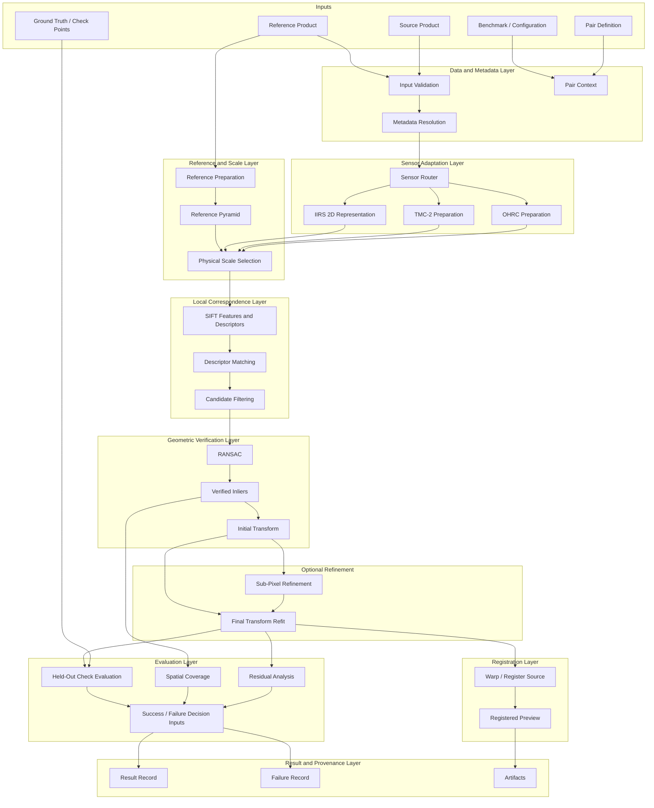
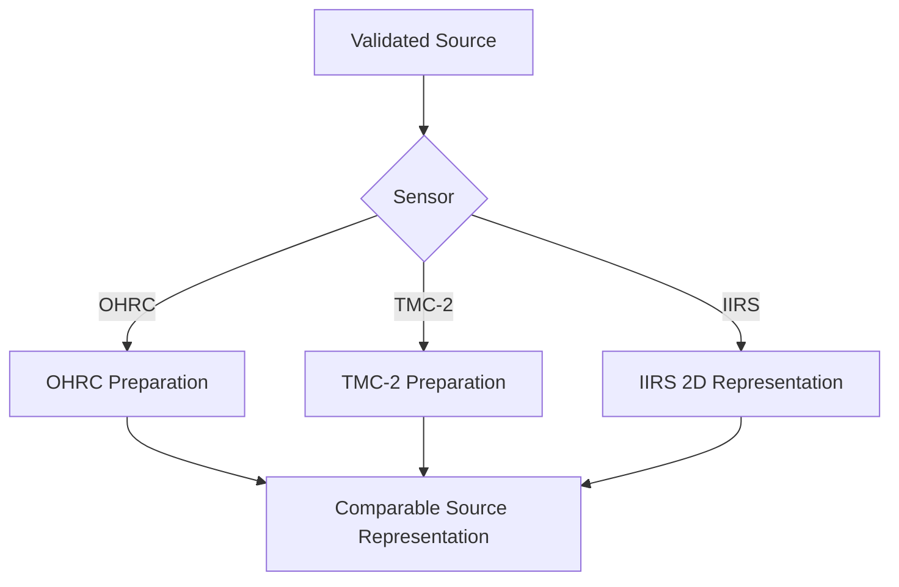
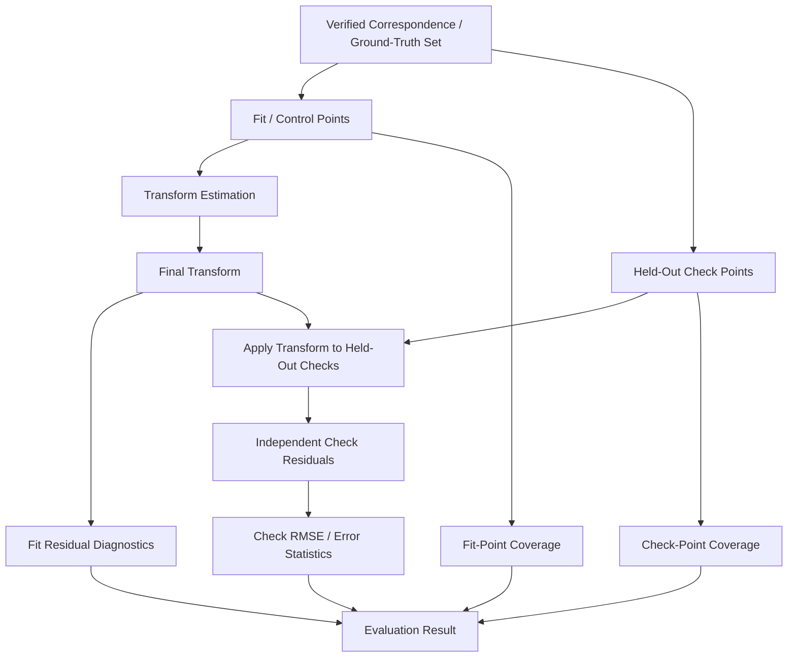
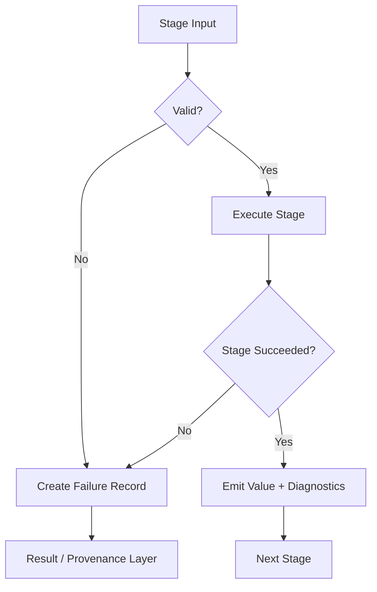
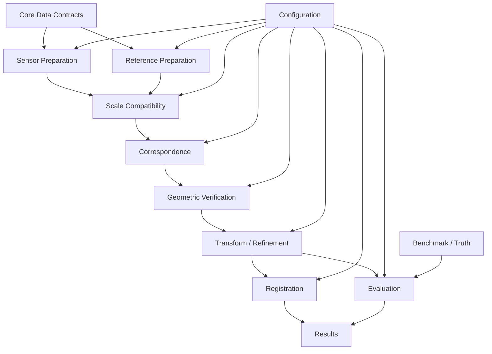
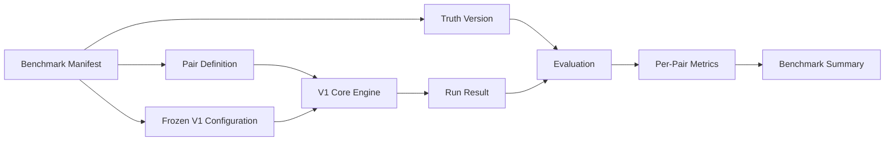

# ChandraMap V1 Architecture

> **Document role:** Version-specific architecture for ChandraMap V1
> **Version:** V1
> **Version role:** Classical Baseline / Registration Foundation
> **Primary task:** Known-overlap local lunar image registration
> **Architecture style:** Modular pipeline / layered scientific engine
> **Implementation status:** This document defines the intended V1 architecture; it does not assert that every component is currently implemented.

This document defines how the capabilities scoped for **ChandraMap V1** are composed into a coherent scientific-software architecture.

V1 receives a known or constrained lunar source/reference pair and converts it into:

- validated scientific inputs;
- comparable image representations;
- candidate local correspondences;
- geometrically verified inliers;
- a source-to-reference transformation;
- an optional registered raster/preview;
- independent evaluation where suitable truth exists;
- an explicit success or failure result;
- reproducibility and provenance records.

> **V1 is architected as a small scientific registration pipeline whose stages are independently testable, whose coordinates remain traceable, and whose outputs remain benchmarkable.**

> **V1 architecture should separate scientific responsibilities so that each stage can be tested, benchmarked, replaced, and diagnosed independently.**

> **Sensor-specific preparation should happen before the common correspondence and geometry pipeline.**

> **Scale compatibility is an architectural responsibility separate from feature matching.**

> **Candidate matching, geometric verification, transformation fitting, registration, and evaluation are separate architectural stages.**

> **The evaluation path must remain logically separate from the fitting path.**

> **Coordinates are data.**

> **Failure is a first-class architectural output.**

> **Reproducibility metadata should flow with the scientific result, not be reconstructed manually after execution.**

> **V1 architecture should remain simple enough to serve as the stable baseline for V2, V3, and V4.**

---

## 1. Relationship to Other V1 Documents

The V1 documentation set has separate responsibilities.

| Document                                 | Responsibility                                                              |
| ---------------------------------------- | --------------------------------------------------------------------------- |
| [`README.md`](./README.md)               | V1 overview, purpose, and navigation                                        |
| [`scope.md`](./scope.md)                 | Defines what belongs inside and outside V1                                  |
| [`specification.md`](./specification.md) | Defines the detailed V1 technical contract and processing rules             |
| [`requirements.md`](./requirements.md)   | Defines verifiable V1 requirements                                          |
| **`architecture.md`**                    | Defines how V1 capabilities are decomposed, connected, isolated, and tested |

The architecture should realize:

```text
Scope
  +
Specification
  +
Requirements
  ↓
V1 Technical Composition
```

It must not silently expand V1 beyond the authoritative scope.

---

## 2. Relationship to Project-Wide Architecture

This file is **version-specific**.

Project-wide architecture documents describe ChandraMap across versions and applications:

- [System Overview](../../architecture/system-overview.md)
- [V1 Pipeline](../../architecture/v1-pipeline.md)
- [Core Engine Architecture](../../architecture/core-engine-architecture.md)
- [Backend Architecture](../../architecture/backend-architecture.md)
- [Frontend Architecture](../../architecture/frontend-architecture.md)
- [Module Map](../../architecture/module-map.md)
- [Data Flow](../../architecture/data-flow.md)
- [Output Flow](../../architecture/output-flow.md)

This document specializes those architectural concepts for the **V1 classical baseline**.

In particular:

> [`../../architecture/v1-pipeline.md`](../../architecture/v1-pipeline.md) describes the dedicated V1 processing flow, while this document focuses on V1 architectural decomposition, ownership, boundaries, data contracts, dependency direction, failure propagation, and extension points.

If this document and the project-wide V1 pipeline documentation diverge, they should be reconciled explicitly.

---

# 3. Architecture Context

V1 begins with a **known source/reference pair**.

The architectural problem is therefore not:

> Search the entire Moon for the correct reference.

It is:

> Given a known or constrained source/reference pair, can ChandraMap prepare the data correctly, establish reliable local correspondence, estimate defensible geometry, register the source, and measure the result?

Conceptually:

```text
Source Product
      +
Reference Product
      +
Pair / Benchmark Context
      ↓
Validation
      ↓
Sensor-Specific Preparation
      ↓
Comparable Physical Scale
      ↓
Local Correspondence
      ↓
Geometric Verification
      ↓
Transformation
      ↓
Optional Refinement
      ↓
Registration
      ↓
Evaluation
      ↓
Result + Provenance
```

The architectural output is not merely an aligned image.

It is **registration evidence**.

---

# 4. Architecture Goals

The V1 architecture is designed around the following goals.

### Scientific correctness

Image representations, coordinates, transform semantics, and evaluation roles must remain scientifically interpretable.

### Modularity

Each major responsibility should have a clear conceptual owner.

### Sensor awareness

OHRC, TMC-2, and IIRS must not be treated as identical image types.

### Physical-scale awareness

Ground sampling differences should be handled before feature matching whenever relevant.

### Coordinate safety

Every transformation of an image representation must preserve enough bookkeeping to recover the correct coordinate relationship.

### Testability

Scientific components should be verifiable independently where practical.

### Benchmarkability

The architecture must expose the scientific outputs required for controlled evaluation.

### Failure visibility

Invalid state should terminate or downgrade the affected path explicitly rather than silently propagating.

### Reproducibility

The final result should carry enough provenance to reconstruct how it was produced.

### Minimal baseline complexity

V1 should not contain architecture that exists only for future research features.

### Extensibility

Later versions should be able to replace or augment components without changing the historical meaning of V1.

### Presentation separation

CLI, backend, frontend, notebooks, and visualizations should consume the scientific engine rather than redefine it.

---

# 5. Architecture Non-Goals

Unless authoritative V1 scope is deliberately revised, V1 architecture does **not** require:

- full-Moon global retrieval;
- FAISS-based reference search;
- learned global descriptors;
- mandatory learned local matching;
- large neural-network training infrastructure;
- DEM-aware terrain registration;
- piecewise terrain warping;
- bundle adjustment;
- planetary control-network optimization;
- complete sensor-model photogrammetry;
- multi-mission orchestration;
- distributed GPU inference;
- cloud-scale microservices;
- Kubernetes;
- advanced GIS architecture;
- production planetary map infrastructure;
- large mosaic-generation systems;
- 3D Moon visualization engines.

These may belong to later versions or separate product/demo layers.

---

# 6. V1 System Boundary

## Inside the V1 scientific core

The V1 core architecture contains or conceptually owns:

- input validation;
- metadata interpretation;
- pair context;
- sensor routing;
- sensor-aware preprocessing;
- representation preparation;
- physical scale handling;
- reference-pyramid handling where needed;
- SIFT feature extraction;
- descriptor matching;
- candidate filtering;
- RANSAC-based geometric verification;
- affine/homography fitting where configured;
- transform validation;
- optional verified-point refinement;
- final transform refitting;
- registration/warping;
- residual analysis;
- spatial coverage;
- held-out check-point evaluation where truth exists;
- success/failure decision inputs;
- result assembly;
- provenance;
- failure reporting.

## Outside the core V1 scientific boundary

The following remain external, optional wrappers, deferred capabilities, or later-version concerns:

- global retrieval;
- learned matcher orchestration as the V1 baseline;
- global reference vector indices;
- DEM-aware geometry;
- advanced multi-mission routing;
- large-scale planetary visualization;
- production web deployment;
- sophisticated frontend workflows;
- distributed compute orchestration.

---

# 7. External Inputs and Systems

V1 may consume data originating from external mission archives and repository-managed scientific resources.

Conceptual external sources include:

- Chandrayaan-2 mission products;
- ISRO / ISSDC / PRADAN data sources;
- LRO mission products;
- NASA PDS;
- LROC/ASU data products;
- benchmark manifests;
- pair definitions;
- ground-truth/control/check-point datasets;
- V1 configuration;
- repository documentation.

This architecture does not define:

- external provider APIs;
- download endpoints;
- credentials;
- provider-specific service contracts.

Those concerns are outside the scientific architecture unless separately documented.

---

# 8. Architectural Style

V1 is best understood as a:

> **Modular pipeline implemented as a layered scientific engine.**

The logical layers are:

1. Data & Metadata Layer
2. Sensor Adaptation Layer
3. Representation & Scale Layer
4. Local Correspondence Layer
5. Match-Filtering Layer
6. Geometric Verification Layer
7. Transform & Refinement Layer
8. Registration Layer
9. Evaluation Layer
10. Result & Provenance Layer
11. Optional Interface Layer

These are **architectural responsibilities**, not claims about current class or package names.

---

# 9. Layered Architecture

## 9.1 Data & Metadata Layer

### Responsibilities

- source/reference asset identity;
- mission identity;
- instrument identity;
- metadata parsing and normalization;
- pair definition;
- valid-data/mask context;
- processing-state context;
- provenance;
- coordinate metadata;
- benchmark linkage.

### Inputs

- mission products;
- derived products;
- pair definitions;
- benchmark metadata;
- configuration.

### Outputs

- validated asset records;
- resolved metadata context;
- pair context;
- scientific provenance context.

### Must not own

- SIFT;
- descriptor matching;
- RANSAC;
- transform fitting;
- evaluation thresholds.

The data layer establishes what the assets **are**, not how correspondence is estimated.

---

## 9.2 Sensor Adaptation Layer

This layer converts sensor-specific data into representations suitable for the common V1 pipeline.

### Responsibilities

- identify source instrument;
- route OHRC;
- route TMC-2;
- route IIRS;
- perform sensor-appropriate preparation;
- derive a registration-friendly 2D representation where required;
- preserve representation lineage.

Conceptually:

```text
OHRC
  → optical prepared representation

TMC-2
  → terrain / panchromatic prepared representation

IIRS
  → hyperspectral preparation
  → registration-friendly 2D representation
```

The downstream matcher should consume a **defined image representation**, not need to understand the full details of each mission instrument.

---

## 9.3 Representation & Scale Layer

> **Compare information, not pixel count.**

This layer isolates physical-scale reasoning from feature matching.

### Responsibilities

- source/reference physical-scale comparison;
- representation compatibility;
- reference-pyramid creation or access;
- reference-level selection;
- reference downsampling;
- crop/tile mapping;
- pyramid-level mapping;
- effective-scale metadata;
- coordinate transformation bookkeeping.

The layer must not treat source upsampling as physical detail recovery.

Its job is to produce source and reference representations that are meaningfully comparable before SIFT is asked to detect local structure.

---

## 9.4 Local Correspondence Layer

V1 uses **SIFT** as the classical local-feature baseline.

### Responsibilities

- source keypoint detection;
- source descriptor extraction;
- reference keypoint detection;
- reference descriptor extraction;
- descriptor search;
- candidate correspondence generation;
- matcher-specific diagnostics.

### Output

**Candidate correspondences.**

These are not yet geometrically verified.

This layer must not declare candidate matches to be independent truth.

---

## 9.5 Match-Filtering Layer

Matching and filtering are separate logical responsibilities.

### Responsibilities

Potential filtering operations may include:

- candidate validity checks;
- duplicate handling;
- descriptor ratio filtering;
- mutual/cross-check filtering;
- matcher-specific filtering;
- rejection diagnostics.

### Input

Candidate correspondence set.

### Output

Filtered candidate correspondence set.

Filtered candidates are still not geometrically verified.

---

## 9.6 Geometric Verification Layer

RANSAC-based verification is the central robust geometry stage in V1.

### Responsibilities

- consume filtered candidate correspondences;
- estimate the configured local geometric model;
- identify model-consistent inliers;
- identify outliers;
- detect insufficient or degenerate support;
- produce an initial transform;
- preserve model-support diagnostics.

### Outputs

- inlier set/mask;
- outlier information where retained;
- initial transformation;
- geometry status;
- initial residual information where applicable.

> **RANSAC inlier ≠ independent ground truth.**

RANSAC establishes consistency with the selected model.

It does not establish external geographic truth.

---

## 9.7 Transform & Refinement Layer

Transform fitting is logically distinct from correspondence verification.

This distinction becomes important when fit-point coordinates change.

### Responsibilities

- fit the configured transformation;
- preserve model identity;
- preserve transform direction;
- preserve coordinate-space semantics;
- reject invalid geometry;
- optionally refine verified fit points;
- refit the final model after refinement.

### Required order when refinement is enabled

```text
Geometric Verification
        ↓
Verified Fit Points
        ↓
Sub-Pixel Refinement
        ↓
Final Transform Refit
```

> **Verify first, refine second.**

> **Refit after refinement.**

---

## 9.8 Registration Layer

Transformation estimation and raster registration are separate responsibilities.

### Transform estimation

Produces the scientific mapping.

### Registration / warp

Uses the mapping to resample the source into a configured output/reference frame.

### Responsibilities

- consume final transform;
- define output/reference grid where required;
- warp/resample source;
- propagate masks/validity;
- generate registered raster where configured;
- generate diagnostic preview/overlay.

The registrar should not re-estimate correspondence.

A registered raster should not replace the preserved transform.

---

## 9.9 Evaluation Layer

The evaluation layer consumes scientific outputs but should not influence the fitting path through held-out truth.

### Responsibilities

- candidate count;
- filtered count;
- inlier count;
- inlier ratio;
- fit residual diagnostics;
- held-out check residuals;
- check RMSE where truth exists;
- spatial coverage;
- runtime diagnostics;
- metric units;
- coordinate-space tracking;
- benchmark criteria inputs.

> **The evaluation path must remain logically separate from the fitting path.**

Held-out check truth must not silently participate in transform estimation.

---

## 9.10 Result & Provenance Layer

This layer turns pipeline state into a reproducible scientific record.

### Responsibilities

- run identity;
- pair identity;
- source identity;
- reference identity;
- representation identity;
- transform record;
- correspondence summaries;
- evaluation metrics;
- run status;
- failure stage;
- warnings;
- resolved configuration identity;
- benchmark version;
- truth version;
- code revision;
- environment context where relevant;
- artifact references.

This layer should assemble scientific state generated elsewhere.

It should not re-run scientific algorithms.

---

## 9.11 Optional Interface Layer

Architectural wrappers may include:

- CLI;
- Python-facing interface;
- backend service;
- frontend workflow;
- notebooks;
- experiment runners.

All such wrappers should ideally invoke the same core V1 scientific engine.

They should not independently reimplement:

- SIFT logic;
- RANSAC;
- transform mathematics;
- metric calculations;
- benchmark success semantics.

---

# 10. High-Level Component Map

These are conceptual architectural components, not asserted implementation class names.

| Component          | Responsibility                                   | Consumes                       | Produces                            |
| ------------------ | ------------------------------------------------ | ------------------------------ | ----------------------------------- |
| Input Validator    | Validate scientific inputs                       | Raw/source/reference assets    | Validated assets or failure         |
| Metadata Resolver  | Resolve sensor, GSD, coordinate, product context | Assets + metadata              | Scientific context                  |
| Pair Context       | Preserve source/reference relationship           | Pair definition                | Pair identity/context               |
| Sensor Router      | Select source preparation route                  | Validated source               | Sensor-specific path                |
| Source Preparer    | Produce matcher-ready source representation      | Source + sensor context        | Prepared source                     |
| Reference Preparer | Prepare NAC/WAC or permitted reference           | Reference asset                | Prepared reference                  |
| Scale Manager      | Establish comparable physical scale              | Source/ref metadata            | Selected reference scale + mappings |
| SIFT Extractor     | Detect and describe local features               | Prepared images                | Keypoints + descriptors             |
| Descriptor Matcher | Form candidate matches                           | Descriptor sets                | Candidate correspondences           |
| Match Filter       | Remove invalid/weak/duplicate candidates         | Candidates                     | Filtered candidates                 |
| Geometry Verifier  | Robust model consistency check                   | Filtered candidates            | Inliers + initial transform         |
| Point Refiner      | Optional local coordinate refinement             | Verified fit points            | Refined fit points                  |
| Transform Fitter   | Estimate/refit final model                       | Designated fit points          | Final transform                     |
| Registrar          | Warp/register source                             | Final transform                | Registered output/preview           |
| Evaluator          | Compute scientific metrics                       | Transform + truth + point sets | Evaluation result                   |
| Result Assembler   | Preserve scientific evidence                     | Stage outputs                  | Result/provenance record            |

---

# 11. Core V1 Pipeline

The source and reference follow partially independent preparation paths before joining.

```text
Source Asset
    ↓
Validation
    ↓
Sensor Adapter
    ↓
Prepared Source
    ↓
Physical Scale Analysis
                 ↘
                  Comparable Pair
                 ↗
Reference Asset
    ↓
Validation
    ↓
Reference Preparation
    ↓
Reference Pyramid
    ↓
Scale Selection

Comparable Pair
    ↓
SIFT
    ↓
Descriptor Matching
    ↓
Candidate Filtering
    ↓
RANSAC
    ↓
Verified Inliers
    ↓
Initial Transform
    ↓
Optional Refinement
    ↓
Final Transform Refit
    ↓
Registration
    ↓
Evaluation
    ↓
Result / Failure + Provenance
```

---

# 12. Main V1 Architecture



The exact implementation may package these responsibilities differently.

The architectural separation is what matters.

---

# 13. Sensor Routing Architecture

See [Sensor Routing](../../algorithms/sensor-routing.md).

The source path should resolve sensor differences before entering the common local-correspondence pipeline.



The exact preprocessing algorithm can differ for each route.

The downstream contract should remain common enough to provide:

- matcher-ready 2D representation;
- valid-data context;
- coordinate mapping;
- representation provenance;
- effective scale context.

---

# 14. OHRC Architecture

OHRC enters V1 through an optical-image preparation path.

Conceptually:

```text
OHRC Product
    ↓
Validation
    ↓
Metadata Resolution
    ↓
Optical Preparation
    ↓
Prepared OHRC Representation
    ↓
Scale Compatibility
    ↓
Common V1 Matching Pipeline
```

The OHRC adapter should not attempt to solve:

- global retrieval;
- geometric verification;
- evaluation.

Its responsibility is to produce a scientifically interpretable source representation for the common pipeline.

---

# 15. TMC-2 Architecture

TMC-2 enters through a medium-resolution terrain/panchromatic path.

Conceptually:

```text
TMC-2 Product
    ↓
Validation
    ↓
Metadata Resolution
    ↓
Terrain / Panchromatic Preparation
    ↓
Prepared TMC-2 Representation
    ↓
Physical Scale Matching
    ↓
Common V1 Matching Pipeline
```

Because TMC-2 is substantially coarser than high-resolution NAC imagery, its path depends strongly on the scale-management layer.

---

# 16. IIRS Architecture

IIRS requires a different architectural contract.

The V1 architecture must not assume:

```text
Full Hyperspectral Cube
    ↓
Ordinary Grayscale SIFT
```

Instead:

```text
IIRS Parent Product
    ↓
Hyperspectral-Aware Preparation
    ↓
2D Registration Representation
    ↓
Coordinate + Provenance Mapping
    ↓
Scale Compatibility
    ↓
Common V1 Matching Pipeline
```

Potential representation families may include a documented:

- selected band;
- derived component;
- structural representation;
- other V1-approved 2D representation.

The architecture should preserve:

- parent product identity;
- representation method;
- relevant parameters;
- spatial mapping;
- effective scale context.

The exact IIRS representation is configuration/specification-defined rather than hard-coded by this architecture document.

---

# 17. Reference Architecture

LRO reference products follow a distinct preparation path.

Conceptually:

```text
LRO Reference Product
        ↓
Validation
        ↓
Reference Metadata / Map Context
        ↓
Valid Mask / ROI Preparation
        ↓
Reference Pyramid
        ↓
Comparable Level Selection
        ↓
Local Reference Representation
```

### LRO NAC

NAC is the primary fine-reference context where defined by V1 scope.

Its native detail may exceed the information content of TMC-2 or IIRS-derived representations.

The reference architecture must therefore permit downsampling or pyramid selection.

### LRO WAC

WAC may provide broader or coarser reference context where permitted.

Its exact role is conditional on V1 pair definitions.

The architecture must not assume one universal WAC GSD.

---

# 18. Scale-Management Architecture

See [Scale Pyramid](../../algorithms/scale-pyramid.md).

Scale management is logically separate from SIFT.

### Inputs

- source effective GSD/scale where available;
- reference effective GSD/scale;
- reference pyramid;
- crop/tile context;
- benchmark/configuration rules.

### Outputs

- selected reference representation;
- selected pyramid level where applicable;
- effective source/reference scale relation;
- mapping to parent reference coordinates.

> **Scale compatibility should be established before local feature matching rather than delegated blindly to the matcher.**

### Architectural rule

```text
Upsampling
    ≠
new physical information
```

Source upsampling may still be used as an implementation operation where justified, but it must not be treated as recovery of unsampled lunar detail.

---

# 19. Coordinate Architecture

Coordinate handling is one of the highest-risk parts of V1.

> **Coordinates are data.**

> **A correspondence is incomplete unless the coordinate space of both endpoints is known.**

Conceptual coordinate spaces may include:

- source-native pixel coordinates;
- source-prepared coordinates;
- source-crop coordinates;
- source-matching coordinates;
- reference-native pixel coordinates;
- reference-tile/ROI coordinates;
- reference-pyramid coordinates;
- reference-matching coordinates;
- registered-output coordinates;
- geospatial coordinates where valid.

Not every pair needs every coordinate space.

The architecture must preserve the mappings required by the actual path.

---

# 20. Coordinate Chain

Conceptually:

```text
Source Native
    ↓
Source Prepared
    ↓
Source Crop / Matching Space

Reference Native
    ↓
Reference Tile / ROI
    ↓
Reference Pyramid Level
    ↓
Reference Matching Space

Source Matching Space
    ↓
Estimated Source-to-Reference Transform
    ↓
Reference Parent Space
    ↓
Optional Geospatial Space
```

This does not imply that every source and reference product is map-projected.

Geospatial mapping is conditional on valid product metadata and reference context.

---

# 21. Coordinate Flow


Each edge represents explicit coordinate bookkeeping.

It should not be inferred later only from visual appearance.

---

# 22. Coordinate Mapping Responsibilities

Whenever a stage performs one of the following:

- crop;
- tile extraction;
- downsampling;
- pyramid transformation;
- resampling;
- refinement;
- projection;
- output warping;

the resulting representation must preserve enough context to recover its scientific coordinate meaning.

A stage should not emit anonymous `(x, y)` coordinates with no indication of their space.

---

# 23. Correspondence Data Contract

The following is an **illustrative conceptual architecture contract**, not an implemented schema.

```yaml
correspondence:
  source:
    x: PLACEHOLDER
    y: PLACEHOLDER
    space: PLACEHOLDER_SOURCE_SPACE

  reference:
    x: PLACEHOLDER
    y: PLACEHOLDER
    space: PLACEHOLDER_REFERENCE_SPACE

  matcher:
    name: sift
    score: PLACEHOLDER
    score_semantics: PLACEHOLDER

  state:
    candidate: true
    filtered: PLACEHOLDER_BOOLEAN
    inlier: PLACEHOLDER_BOOLEAN

  refinement:
    enabled: PLACEHOLDER_BOOLEAN
    refined_source: PLACEHOLDER
    refined_reference: PLACEHOLDER
```

A real implementation may serialize this differently.

The architectural requirements are that correspondence identity, coordinate spaces, matcher semantics, and processing state remain recoverable where needed.

---

# 24. Transform Data Contract

The following is also conceptual.

```yaml
transform:
  model: PLACEHOLDER_MODEL
  direction: source_to_reference

  source_space: PLACEHOLDER_SOURCE_SPACE
  reference_space: PLACEHOLDER_REFERENCE_SPACE

  parameters: PLACEHOLDER_PARAMETERS

  fit:
    correspondence_set: PLACEHOLDER_SET
    refined: PLACEHOLDER_BOOLEAN

  status: PLACEHOLDER_STATUS
```

The key architectural requirements are:

- model identity;
- explicit direction;
- defined source/reference spaces;
- parameters;
- fitting provenance;
- validity/status.

The recommended scientific direction is:

```text
source → reference
```

An image-warp implementation may internally sample with the inverse transform.

That implementation detail must not reverse the scientific meaning of the stored model.

---

# 25. Result Contract

The following is an **illustrative conceptual V1 result**, not an implemented schema.

```yaml
result:
  run_id: PLACEHOLDER_RUN_ID
  pair_id: PLACEHOLDER_PAIR_ID
  status: PLACEHOLDER_STATUS

  correspondence:
    candidate_count: PLACEHOLDER
    filtered_count: PLACEHOLDER
    inlier_count: PLACEHOLDER

  geometry:
    transform: PLACEHOLDER_TRANSFORM
    model: PLACEHOLDER_MODEL

  evaluation:
    inlier_ratio: PLACEHOLDER
    spatial_coverage: PLACEHOLDER
    check_rmse: PLACEHOLDER_OR_UNAVAILABLE
    units: PLACEHOLDER_UNITS

  artifacts:
    registered_preview: PLACEHOLDER
    match_visualization: PLACEHOLDER
    residual_visualization: PLACEHOLDER

  provenance:
    benchmark_version: PLACEHOLDER
    truth_version: PLACEHOLDER
    config_id: PLACEHOLDER
    git_revision: PLACEHOLDER
```

The architecture does not require this exact serialization.

It requires equivalent scientific meaning to remain representable.

---

# 26. Matching Architecture

See [Matching](../../algorithms/matching.md).

V1 should separate:

```text
Feature Extraction
      ↓
Descriptor Matching
      ↓
Candidate Correspondence Records
```

### Feature extraction owns

- keypoint detection;
- descriptor calculation;
- keypoint scale/orientation information where provided by the method.

### Descriptor matching owns

- descriptor comparison;
- candidate association;
- matcher-specific scores.

This separation makes it possible for future versions to replace correspondence methods while preserving:

- geometric verification;
- transforms;
- evaluation;
- result contracts.

---

# 27. Match-Filtering Architecture

See [Match Filtering](../../algorithms/match-filtering.md).

Conceptually:

```text
Candidate Set
      ↓
Filter Pipeline
      ↓
Filtered Candidate Set
```

Potential filters may include:

- invalid-coordinate rejection;
- duplicate handling;
- descriptor-ratio filtering;
- mutual/cross-check filtering.

The filter architecture should permit:

- accepted candidates;
- rejected candidates where useful;
- rejection reason/diagnostics where practical.

It should not hard-code benchmark success criteria.

---

# 28. Geometric Verification Architecture

See [RANSAC](../../algorithms/ransac.md).

### Input

Filtered candidate correspondence set.

### Output

- verified inlier set;
- outlier mask/set where retained;
- initial model;
- model-support diagnostics;
- geometry status.

The geometry verifier should not:

- rewrite benchmark truth;
- classify inliers as independent truth;
- perform held-out accuracy evaluation;
- generate final benchmark success thresholds.

---

# 29. Transform Fitting Architecture

See [Transforms](../../algorithms/transforms.md).

Geometric verification and transform fitting are related but conceptually separable.

### Geometric verification

Answers:

> Which candidate correspondences are consistent with the configured model?

### Transform fitting

Answers:

> Given the designated fitting correspondences, what transformation maps the source coordinate space to the reference coordinate space?

This distinction becomes critical when verified point coordinates are refined.

---

# 30. Transform Model Boundary

V1 may use:

- affine;
- homography;

according to pair assumptions and benchmark configuration.

These are local approximation models.

> **The Moon is not a flat poster.**

A single homography should not be interpreted as a complete physical model for:

- large relief;
- raw sensor geometry;
- large-area lunar shape;
- substantial viewpoint variation.

More advanced geometry belongs to later research unless authoritative V1 scope changes.

---

# 31. Refinement Architecture

See [Sub-Pixel Refinement](../../algorithms/subpixel-refinement.md).

Refinement is optional/conditional in V1.

### Input

Verified fit correspondences.

### Responsibilities

- refine eligible source/reference coordinates;
- reject invalid refinement results;
- preserve original coordinates where useful;
- produce refined fitting coordinates;
- trigger final transform refit.

### Output

Refined fit-point set plus status.

Correct flow:

```text
Filtered Candidates
      ↓
RANSAC
      ↓
Verified Fit Points
      ↓
Optional Refinement
      ↓
Final Transform Refit
```

Refinement must not become the mechanism that turns arbitrary candidate matches into trusted geometry.

---

# 32. Registration / Warp Architecture

See [Registration](../../algorithms/registration.md).

The architecture separates:

```text
TRANSFORM ESTIMATION
        ↓
Final Scientific Mapping
```

from:

```text
RASTER WARPING
        ↓
Registered Representation
```

The registrar may own:

- interpolation;
- output grid selection;
- validity mask propagation;
- transformed raster generation;
- registered preview generation.

The final transform remains a first-class scientific output even when a registered raster is generated.

---

# 33. Evaluation Architecture

See [Evaluation Overview](../../evaluation/README.md).

Evaluation is divided into several logically distinct groups.

## Correspondence diagnostics

- candidate count;
- filtered candidate count;
- inlier count;
- inlier ratio.

## Geometric diagnostics

- fit residuals;
- residual vectors;
- transform validity;
- spatial distribution of fit support.

## Independent registration evaluation

- held-out check points;
- independent residuals;
- check RMSE;
- additional error statistics where defined.

## Spatial support

- benchmark-defined coverage.

## Engineering diagnostics

- runtime;
- stage timing;
- warnings;
- failure stage.

These metrics answer different questions and must not be collapsed into one vague score.

---

# 34. Fitting Path vs Evaluation Path

This is a critical V1 architecture boundary.

```text
Verified Fit Correspondences
          ↓
       Fit Set
          ↓
  Final Transform
          ↓
   +------+------------------+
   |                         |
   v                         v
Fit Residuals        Held-Out Check Set
                              ↓
                   Independent Evaluation
```

Held-out check points must not flow upstream into final fitting.

The evaluation layer may consume:

- final transform;
- check truth;
- fit data;
- coverage definitions;

but it must not silently alter the final transformation using held-out truth.

---

# 35. Evaluation Flow



Actual benchmark truth may be structured differently.

The architectural rule is that evaluation roles remain explicit.

---

# 36. Ground-Truth Architecture

See:

- [Ground Truth](../../evaluation/ground-truth.md)
- [Ground-Truth Preparation](../../datasets/ground-truth-preparation.md)

Ground truth belongs to the evaluation and benchmark domain.

It must not be generated implicitly from the current algorithm output.

Conceptually:

```text
RANSAC Inlier
    =
model-consistent algorithm output

Ground Truth
    =
independently prepared evaluation evidence
```

A reference image is also not automatically independent truth merely because it is the registration target.

---

# 37. Control / Check Point Architecture

See:

- [Control Points](../../evaluation/control-points.md)
- [Check-Point Evaluation](../../evaluation/checkpoint-evaluation.md)

Architecturally:

### Fit / control points

May flow into:

```text
Transform Fitting
```

### Held-out check points

Flow into:

```text
Evaluation Only
```

Point records should preserve, where applicable:

- role;
- point ID;
- source coordinate;
- reference coordinate;
- coordinate-space semantics;
- truth version.

---

# 38. Spatial Coverage Architecture

See [Spatial Coverage](../../evaluation/spatial-coverage.md).

The coverage component should consume an explicitly identified point population such as:

- verified fit inliers;
- held-out checks;
- another benchmark-defined point set.

It should also know:

- coordinate space;
- valid region;
- metric configuration.

Coverage answers:

> How broadly is geometric support distributed?

It does not answer:

> Is the registration correct?

---

# 39. Success / Failure Architecture

See:

- [Success Criteria](../../evaluation/success-criteria.md)
- [Failure Cases](../../evaluation/failure-cases.md)

Scientific metrics and status decisions are distinct.

Conceptually:

```text
Metrics
    +
Benchmark Criteria
    ↓
Run Status
```

Low-level algorithm modules should not embed arbitrary benchmark thresholds that belong to the evaluation definition.

For example:

- matcher should not decide final benchmark success;
- RANSAC should not encode final scientific RMSE criteria;
- frontend should not invent success from visual appearance.

---

# 40. Failure Propagation

Failure must be treated as data rather than an exceptional afterthought.

Conceptually, each major stage should be able to produce:

```text
valid value + diagnostics
```

or:

```text
failure stage + context + diagnostics
```

This does not prescribe a programming-language type system.

It defines architectural behavior.

### Examples

```text
Input invalid
→ stop scientific processing
```

```text
Preprocessing failed
→ do not attempt SIFT on invalid representation
```

```text
Insufficient candidates
→ do not force invalid RANSAC
```

```text
RANSAC failed
→ do not fabricate a transform
```

```text
Transform invalid
→ do not warp and report success
```

```text
Check truth unavailable
→ report evaluation unavailable
→ do not publish fake RMSE
```

---

# 41. Failure Flow



A failed stage should prevent invalid scientific state from being interpreted as valid downstream evidence.

---

# 42. Failure Stage vs Root Cause

Architectural diagnostics should distinguish:

- **observed failure stage**;
- **suspected cause**;
- **confirmed cause**, if independently established.

For example:

```text
Observed failure stage:
geometric verification

Possible upstream cause:
reference scale mismatch
```

This is better than automatically recording:

```text
Root cause:
RANSAC
```

merely because RANSAC was the stage where the problem became visible.

---

# 43. Reproducibility Architecture

See [Reproducibility](../../evaluation/reproducibility.md).

Reproducibility context should accumulate throughout execution.

Conceptually:

```text
Input Identity
      +
Pair Identity
      +
Resolved Configuration
      +
Processing Decisions
      +
Benchmark / Truth Context
      +
Code Revision
      ↓
Run Provenance
```

Relevant context may include:

- run ID;
- ChandraMap version;
- code revision;
- source identity;
- reference identity;
- pair version;
- representation identity;
- benchmark version;
- truth version;
- resolved preprocessing configuration;
- selected sensor route;
- scale strategy;
- selected reference level;
- SIFT settings;
- match-filter settings;
- geometry settings;
- transform model;
- refinement settings;
- evaluation metric definitions;
- success-criteria version;
- random state where relevant;
- environment information where useful.

> **Reproducibility metadata should flow with the scientific result, not be reconstructed manually after execution.**

---

# 44. Configuration Architecture

Scientific experiment behavior should be driven through explicit, resolved configuration rather than hidden mutable state.

Conceptual configuration categories may include:

```yaml
config:
  preprocessing: PLACEHOLDER

  illumination: PLACEHOLDER

  scale: PLACEHOLDER

  matching: PLACEHOLDER

  filtering: PLACEHOLDER

  geometry: PLACEHOLDER

  refinement: PLACEHOLDER

  registration: PLACEHOLDER

  evaluation: PLACEHOLDER
```

This is illustrative only.

It does not define actual configuration keys.

---

# 45. Configuration Boundaries

The configuration layer should:

- centralize scientific parameters;
- make formal runs reproducible;
- expose the values that affect interpretation;
- reduce hidden defaults;
- permit controlled benchmark freezing.

It should not permit undocumented manual per-pair changes during a formal benchmark.

A deterministic adaptive rule may be valid if it is:

- defined before benchmark execution;
- reproducible;
- recorded.

---

# 46. Module Dependency Direction

A preferred conceptual dependency direction is:

```text
Core Data Contracts
        ↓
Sensor / Reference Preparation
        ↓
Scale Compatibility
        ↓
Correspondence
        ↓
Geometric Verification
        ↓
Transform / Refinement
        ↓
Registration
        ↓
Evaluation
        ↓
Results
```

Configuration influences stages.

Benchmark truth primarily enters evaluation.

Presentation layers consume outputs.

Avoid circular relationships such as:

```text
Evaluation
→ modifies matcher thresholds during final benchmark
```

or:

```text
Frontend
→ independently implements authoritative transform math
```

---

# 47. Dependency Diagram



The exact source-code dependency graph may differ, but scientific responsibilities should remain similarly directed.

---

# 48. Core Engine Boundary

See [Core Engine Architecture](../../architecture/core-engine-architecture.md).

The V1 core engine should conceptually contain:

- scientific data preparation;
- scale handling;
- correspondence;
- geometry;
- transform fitting;
- optional refinement;
- registration;
- evaluation;
- result generation.

The core engine should not inherently require:

- browser rendering;
- HTTP;
- frontend state;
- a specific database;
- a particular deployment environment;

unless project-wide architecture later establishes such a dependency.

This permits the same scientific behavior to be reused by:

- tests;
- notebooks;
- CLI;
- backend services;
- benchmark runners.

---

# 49. Backend Integration

See [Backend Architecture](../../architecture/backend-architecture.md).

If a backend service exists, its architectural responsibilities may include:

- resolving input requests;
- invoking the V1 core engine;
- tracking execution;
- preserving result references;
- returning status;
- exposing artifacts.

The backend should not duplicate authoritative implementations of:

- SIFT;
- RANSAC;
- transform fitting;
- residual computation;
- coverage metrics.

No API endpoints are defined by this document.

---

# 50. Frontend Integration

See [Frontend Architecture](../../architecture/frontend-architecture.md).

If a frontend exists, it may:

- select or upload source/reference assets;
- display execution status;
- visualize correspondences;
- show inliers;
- show registered preview;
- display scientific metrics;
- display failure information.

The frontend should not independently compute the authoritative benchmark result.

UI state must not replace persisted scientific result state.

---

# 51. Notebook and Experiment Integration

Notebooks and research experiments may call:

- individual components;
- the full V1 engine;
- benchmark utilities;
- visualization utilities.

Formal benchmark behavior should not depend on:

- hidden notebook variables;
- manual execution order;
- state from previous cells;
- unrecorded interactive changes.

Notebook experimentation may be flexible.

Formal benchmark execution must remain reproducible.

---

# 52. Benchmark Architecture

See [Benchmark Protocol](../../evaluation/benchmark-protocol.md).

Conceptually:

```text
Benchmark Definition
        ↓
Pair + Truth
        ↓
Frozen V1 Configuration
        ↓
V1 Core Engine
        ↓
Run Result
        ↓
Evaluation / Aggregation
        ↓
Benchmark Summary
```

Benchmark definitions should remain outside low-level algorithms.

SIFT should not know which benchmark category is being reported.

RANSAC should not know the final benchmark leaderboard or summary.

---

# 53. Benchmark Flow



---

# 54. Testing Architecture

V1 should expose clear testing seams at several levels.

## Unit tests

Suitable for:

- coordinate transformations;
- crop/tile mappings;
- pyramid mappings;
- transformation application;
- residual formulas;
- RMSE calculations;
- spatial-coverage calculations;
- status/result validation.

## Component tests

Suitable for:

- sensor preprocessing;
- SIFT extraction;
- descriptor matching;
- filtering;
- RANSAC;
- transform fitting;
- refinement;
- registration.

## Integration tests

Suitable for:

```text
known source/reference pair
→ final result/failure
```

## Synthetic geometry tests

Suitable for known:

- translation;
- rotation;
- scale;
- affine transformation;
- projective transformation where applicable.

## Real lunar benchmark tests

Suitable for frozen source/reference mission pairs.

---

# 55. Testability by Architecture

A useful V1 architecture should make it possible to test:

```text
Matcher
without
frontend
```

```text
RANSAC
without
backend
```

```text
Metric calculation
without
running SIFT
```

```text
Registration warp
using
a known synthetic transform
```

```text
Coordinate mapping
without
running the complete pipeline
```

This separation improves diagnosis and prevents one large end-to-end test from becoming the only evidence of correctness.

---

# 56. Data Flow Architecture

See [Data Flow](../../architecture/data-flow.md).

Conceptually:

```text
Raw Asset
    ↓
Validated Asset
    ↓
Prepared Representation
    ↓
Feature Data
    ↓
Candidate Correspondence Data
    ↓
Verified Geometry Data
    ↓
Transform Data
    ↓
Registration Data
    ↓
Evaluation Data
    ↓
Result
```

Each stage should retain or reference the provenance required to understand its inputs.

---

# 57. Output Flow Architecture

See [Output Flow](../../architecture/output-flow.md).

Conceptually:

```text
Pipeline
    ↓
Run Result
    ↓
Scientific Artifacts
    ↓
Evaluation Summary
    ↓
Benchmark Result
    ↓
Optional UI / API Presentation
```

The UI must not become the only persistent location of:

- transform;
- metrics;
- failure state;
- provenance.

Scientific state should exist independently of presentation.

---

# 58. Data Contract Table

| Data Object             | Created By         | Consumed By                  | Key Context                                               |
| ----------------------- | ------------------ | ---------------------------- | --------------------------------------------------------- |
| Validated Asset         | Data/Input Layer   | Sensor/Reference Preparation | Asset ID, sensor, dimensions, validity                    |
| Pair Context            | Data Layer         | Pipeline/Benchmark           | Source identity, reference identity, pair version         |
| Prepared Representation | Sensor Preparation | Scale/Matching               | Parent asset, representation identity, coordinate mapping |
| Reference Pyramid Level | Scale Layer        | Matching                     | Parent reference, level identity, effective scale         |
| Keypoint Set            | SIFT Extraction    | Matcher                      | Coordinates, descriptors, keypoint metadata               |
| Candidate Set           | Descriptor Matcher | Match Filter                 | Source/ref coordinates, score semantics                   |
| Filtered Candidate Set  | Match Filter       | Geometry Verifier            | Candidate identity, filter outcome                        |
| Inlier Set              | Geometry Verifier  | Transform/Refinement         | Verified model support                                    |
| Initial Transform       | Geometry Layer     | Refiner/Fitter               | Model, direction, coordinate spaces                       |
| Refined Fit Set         | Refinement Layer   | Final Transform Fitter       | Original/refined point relationship                       |
| Final Transform         | Transform Fitter   | Registrar/Evaluator          | Model, direction, spaces, fitting provenance              |
| Registered Raster       | Registrar          | Artifacts/UI                 | Grid, validity, interpolation context                     |
| Evaluation Result       | Evaluator          | Result Layer                 | Metric names, units, populations                          |
| Run Result              | Result Layer       | Benchmark/UI/Archive         | Status, metrics, provenance, artifacts                    |

---

# 59. Status and Error Contract

Every major stage should conceptually support:

- success;
- failure;
- warning/diagnostic where useful.

The following is illustrative only:

```yaml
status:
  stage: PLACEHOLDER
  state: PLACEHOLDER
  message: PLACEHOLDER
  diagnostics: PLACEHOLDER
```

This document does not prescribe:

- an exception hierarchy;
- status enum names;
- serialization format.

The architectural requirement is that failure state be machine-readable enough to avoid relying only on free-form logs.

---

# 60. Logging and Diagnostics

Useful diagnostics may include:

- selected sensor route;
- selected representation;
- selected reference pyramid level;
- effective scale relationship;
- source keypoint count;
- reference keypoint count;
- candidate count;
- filtered count;
- inlier count;
- geometry status;
- transform status;
- refinement status;
- registration status;
- evaluation availability;
- runtime;
- warnings;
- failure stage.

Logs are useful for humans.

They should not become the only place where scientific state exists.

---

# 61. Artifact Architecture

Potential V1 artifacts may include:

- candidate-match visualization;
- inlier/outlier visualization;
- registered preview;
- overlay;
- transform record;
- residual-vector plot;
- coverage visualization;
- result manifest;
- failure diagnostic artifact.

Artifacts should reference a run identity or equivalent scientific context.

Artifacts are supporting evidence.

The authoritative result should remain reconstructable without relying solely on screenshots.

---

# 62. File and Storage Architecture

Exact storage implementation is outside this document.

Conceptually, V1 should keep separate categories such as:

```text
Raw Data
Derived Data
Benchmark Definitions
Experiment Outputs
Results
Artifacts
```

See [Dataset Structure](../../datasets/dataset-structure.md).

This separation helps preserve:

- raw-data integrity;
- benchmark identity;
- result reproducibility;
- artifact cleanup;
- provenance.

---

# 63. Large-Data Principle

Mission imagery may be large.

V1 architecture should not require all source data to be committed directly to Git.

Reproducibility can instead use:

- provider/product identities;
- manifests;
- checksums where repository conventions permit;
- preparation instructions;
- configuration;
- provenance.

See [Data Licenses](../../data-licenses.md).

---

# 64. Immutability Principle

Raw mission products should remain immutable during routine V1 execution.

Conceptually:

```text
Raw Mission Product
      ↓
Derived Representation
```

not:

```text
Raw Mission Product
      ↓
Overwrite Original File
```

Derived products should preserve lineage to the raw input.

---

# 65. Data License Boundary

V1 architecture should preserve mission/provider provenance.

It should not assume:

```text
publicly accessible
=
unrestricted redistribution
```

Storage and distribution choices must remain compatible with project data-license documentation.

See [Data Licenses](../../data-licenses.md).

---

# 66. Security Boundary

See [Security Policy](../../../SECURITY.md).

Scientific result records should not require:

- passwords;
- private API tokens;
- access keys;
- credentials.

Configuration/provenance may record that an external source or service was used without storing private authentication material.

Scientific reproducibility metadata and secrets should remain separate concerns.

---

# 67. Extension Points

V1 should expose architectural seams that later versions can reuse without redefining V1.

> **An extension point should allow later versions to replace or augment a component without changing the historical meaning of V1.**

## Matcher extension point

### V1

SIFT-based local correspondence.

### Later research may introduce

- ALIKED + LightGlue;
- LoFTR;
- RIFT;
- CFOG-style approaches;
- lunar-specific learned features.

These should plug into correspondence interfaces without forcing evaluation or geometry logic to be rewritten unnecessarily.

---

## Retrieval extension point

### V1

Known/constrained reference pair.

### Later versions may add

```text
Query
  ↓
Global Descriptor
  ↓
Reference Index
  ↓
Top-K Candidates
  ↓
Local Registration
```

Potential infrastructure may include FAISS or another vector-search mechanism.

This layer belongs before local registration and is not part of core V1.

---

## Geometry extension point

### V1

- affine;
- homography.

### Later research may add

- piecewise transforms;
- local warping;
- DEM-aware transforms;
- sensor-model geometry;
- bundle adjustment;
- control-network optimization.

---

## Sensor extension point

### V1

Chandrayaan-2 ↔ LRO baseline.

### Later versions may add

- Kaguya / SELENE;
- additional lunar missions;
- additional planetary missions.

Sensor extension should occur through clearly defined adapters rather than embedding mission-specific logic throughout geometry/evaluation layers.

---

# 68. V1 vs V2 Architecture

V2 may reuse stable V1 components such as:

- core data contracts;
- pair definitions;
- coordinate conventions;
- result records;
- failure semantics;
- benchmark interfaces;
- evaluation layer.

It may experiment with or improve:

- preprocessing;
- illumination handling;
- scale strategies;
- matching alternatives;
- refinement.

The actual V2 specification determines those changes.

V1 itself should remain reproducible.

---

# 69. V1 vs V3 Architecture

V3 may introduce a new retrieval stage before local registration.

Conceptually:

```text
Source
  ↓
Global / Regional Representation
  ↓
Reference Search
  ↓
Top-K Candidate Regions
  ↓
Local Registration Pipeline
```

The local registration portion may reuse V1 concepts, but retrieval must remain independently measurable.

Retrieval is not silently added inside V1.

---

# 70. V1 vs V4 Architecture

V4 may introduce research architecture around:

- advanced multimodal correspondence;
- lunar-specific learned representations;
- DEM-aware geometry;
- terrain-conditioned transformations;
- uncertainty modeling;
- sensor-model integration;
- multi-mission registration;
- control-network research.

These capabilities may reuse V1 contracts while remaining outside the stable V1 baseline.

---

# 71. Architecture Decision Guidelines

Before adding a V1 module or dependency, ask:

1. Which architectural layer owns this responsibility?
2. Is it part of the V1 scientific core or only presentation?
3. Does another component already own it?
4. Does it change V1 scope?
5. Does it change coordinate semantics?
6. Does it change benchmark semantics?
7. Can it be tested independently?
8. Does it preserve provenance?
9. Does it introduce hidden mutable state?
10. Does it create an unnecessary circular dependency?
11. Does it add a new scientific problem rather than solve the V1 baseline?
12. Does it belong more naturally to V2, V3, V4, or research?

If architectural ownership is unclear, the design likely needs further decomposition.

---

# 72. Architecture Anti-Patterns

V1 should avoid the following patterns.

Do **not**:

- put the complete pipeline in one giant function;
- combine sensor preprocessing with RANSAC;
- combine matching and evaluation into one opaque stage;
- let frontend code compute authoritative scientific metrics;
- let backend code duplicate transform mathematics;
- allow evaluation truth to flow into final fitting silently;
- treat RANSAC inliers as ground truth;
- lose crop offsets;
- lose tile offsets;
- lose pyramid-level mappings;
- lose refined-to-original coordinate relationships;
- infer physical GSD from image dimensions alone;
- upsample coarse source imagery and declare scale solved;
- route the full IIRS cube directly into ordinary grayscale SIFT;
- refine arbitrary unverified candidate matches as the normal V1 path;
- forget to refit the transform after point refinement;
- make the registered preview the only preserved geometry result;
- return an identity transform silently when registration fails;
- hide failure stages;
- bury benchmark success thresholds inside matcher code;
- rely on absolute local paths as scientific identities;
- store secrets in result manifests;
- make V1 depend on FAISS;
- make V1 depend on a learned matcher;
- make V1 depend on DEM geometry;
- duplicate the scientific engine separately in CLI/backend/frontend;
- create circular dependencies between fitting and evaluation;
- overwrite historical V1 result evidence when later versions are introduced.

---

# 73. Architecture Risks

| Risk                   | Architectural Cause                           | Consequence                               | Mitigation Direction                     |
| ---------------------- | --------------------------------------------- | ----------------------------------------- | ---------------------------------------- |
| Coordinate drift       | Missing crop/tile/pyramid mapping             | Wrong transform or evaluation             | Explicit coordinate contracts            |
| Sensor confusion       | Shared preprocessing without sensor semantics | Invalid source representation             | Sensor adaptation layer                  |
| Scale mismatch         | Matching arbitrary array scales               | Weak or false correspondence              | Dedicated physical-scale layer           |
| Truth leakage          | Check points accessible to final fitting      | Optimistically biased evaluation          | Separate fitting/evaluation paths        |
| Silent failure         | Invalid stage output propagates               | Plausible but scientifically wrong result | Structured status/failure outputs        |
| V1 scope creep         | Advanced research inside baseline             | Poor historical comparability             | Clear V1 boundaries and extension points |
| UI coupling            | Science implemented in frontend               | Non-reproducible or duplicated logic      | Core-engine separation                   |
| Backend duplication    | Geometry reimplemented in service layer       | Divergent results                         | Shared scientific engine                 |
| Result loss            | Metrics stored only in logs                   | Weak provenance                           | Result/provenance layer                  |
| IIRS misuse            | Cube treated as ordinary grayscale            | Invalid modality assumptions              | Dedicated 2D representation path         |
| Stale transform        | Refinement without final refit                | Geometry does not match refined points    | Explicit refit stage                     |
| Hidden configuration   | Unrecorded defaults or pair hacks             | Irreproducible benchmark                  | Resolved configuration record            |
| Over-flexible geometry | Complex warp hides weak matches               | Misleading visual alignment               | Keep V1 model family bounded             |
| Reference uncertainty  | Reference treated as perfect absolute truth   | Overstated geolocation claims             | Preserve truth/reference semantics       |

---

# 74. Performance Architecture

V1 should prioritize:

1. correctness;
2. reproducibility;
3. scientific traceability;
4. then performance optimization.

Reasonable architectural optimizations may include:

- image pyramids;
- caching prepared imagery;
- caching reference pyramid levels;
- avoiding repeated descriptor extraction;
- avoiding repeated resampling;
- stage timing;
- reusing immutable intermediate results.

Distributed systems should not be introduced merely because they are technically possible.

---

# 75. Cache Architecture

Caches may be useful for:

- preprocessed imagery;
- reference-pyramid levels;
- feature descriptors;
- derived IIRS representations;
- other expensive deterministic intermediate outputs.

Caches should be:

- rebuildable;
- identifiable by relevant input/configuration context;
- invalidatable when scientific inputs change.

A cache should not become the only copy of scientific state.

---

# 76. Determinism Architecture

Potential V1 stochastic behavior may include robust estimation such as RANSAC.

Where implementation supports it, architecture should allow:

- random seed configuration;
- seed recording;
- repeatability checks.

A recorded seed does not guarantee bit-for-bit identical results across every:

- hardware platform;
- numerical backend;
- dependency version;
- operating system.

V1 should describe reproducibility conservatively.

---

# 77. Observability Architecture

Useful V1 observability includes:

- stage start/end state;
- stage timing;
- selected source route;
- selected representation;
- selected scale;
- keypoint counts;
- candidate counts;
- filtered counts;
- inlier counts;
- transform status;
- refinement status;
- evaluation status;
- warnings;
- failure stage.

V1 does not require a production telemetry platform to support these diagnostics.

---

# 78. Configuration vs Code

Scientific experiment choices should preferably be expressed through configuration rather than pair-specific code branches.

Avoid architecture that depends on logic such as:

```text
if pair_id == SOME_SPECIAL_PAIR:
    use special parameters
```

for formal benchmark execution.

Such behavior makes comparisons difficult to reproduce and interpret.

If adaptive behavior is necessary, it should be:

- predefined;
- general;
- reproducible;
- recorded.

---

# 79. Pair-Specific Rescue

Formal V1 benchmarking must not rely on undocumented manual rescue.

Examples include:

- changing thresholds after inspecting a pair;
- manually selecting only the best reference level;
- deleting difficult correspondences by hand;
- changing transform type after viewing held-out check error;
- manually correcting the final transform.

Research exploration may involve manual analysis.

Formal benchmark execution should not.

---

# 80. Architecture-to-Requirements Traceability

See [`requirements.md`](./requirements.md).

| Architecture Area      | Related Requirement Categories          |
| ---------------------- | --------------------------------------- |
| Data & Metadata Layer  | Input, metadata, provenance             |
| Sensor Adaptation      | Sensor, routing, preprocessing          |
| Representation & Scale | Scale, coordinate mapping               |
| Local Correspondence   | SIFT, matching                          |
| Match Filtering        | Candidate filtering                     |
| Geometric Verification | RANSAC, model support                   |
| Transform / Refinement | Transform, refinement, coordinates      |
| Registration Layer     | Registration and output                 |
| Evaluation Layer       | Metrics, ground truth, checks, coverage |
| Result Layer           | Failure, provenance, reproducibility    |
| Configuration          | Reproducibility, benchmark consistency  |
| Testing Interfaces     | Testing and verification                |

This table maps responsibilities to requirement families.

It does not assert implementation status.

---

# 81. Architecture-to-Scope Traceability

See [`scope.md`](./scope.md).

Every core V1 architecture layer should correspond to an in-scope V1 capability.

For example:

```text
Physical Scale Handling
→ in V1 scope
→ therefore represented as a core architecture layer
```

By contrast:

```text
Global Retrieval
→ outside core V1 scope
→ therefore not a required V1 architecture layer
```

An implementation should not introduce a large new architectural subsystem merely because a future research feature is interesting.

---

# 82. Architecture-to-Specification Traceability

See [`specification.md`](./specification.md).

The specification answers:

> What scientific behavior and processing order must V1 preserve?

The architecture answers:

> Which responsibilities own that behavior, how do they connect, and which boundaries prevent scientific concerns from being mixed?

For example:

```text
Specification:
Verify before refinement.

Architecture:
RANSAC layer
→ verified fit-point contract
→ refinement layer
→ final transform fitter
```

---

# 83. Architecture Validation

The V1 architecture is conceptually valid when it can support:

```text
Known Pair
    ↓
Validated Assets
    ↓
Sensor-Appropriate Representations
    ↓
Comparable Physical Scale
    ↓
Candidate Correspondences
    ↓
Verified Inliers
    ↓
Valid Final Transform
    ↓
Registered Result
    ↓
Independent Evaluation Where Available
    ↓
Explicit Success or Failure
    ↓
Reproducible Result Record
```

This is an architecture validation concept.

It does not imply current implementation completion.

---

# 84. Architecture Completion Checklist

The checklist is intentionally unchecked.

- [ ] V1 system boundary is defined
- [ ] Core scientific-engine boundary is defined
- [ ] Data/metadata layer is defined
- [ ] Pair-context responsibility is defined
- [ ] Sensor-routing layer is defined
- [ ] OHRC route is represented
- [ ] TMC-2 route is represented
- [ ] IIRS 2D-representation route is represented
- [ ] Reference-preparation layer is defined
- [ ] Scale/pyramid layer is defined
- [ ] Coordinate mappings are preserved conceptually
- [ ] SIFT correspondence layer is defined
- [ ] Descriptor matching is separate from feature extraction
- [ ] Candidate-filtering layer is defined
- [ ] RANSAC geometry layer is defined
- [ ] Candidate and inlier semantics are separated
- [ ] Transform fitting responsibilities are defined
- [ ] Optional refinement layer is isolated
- [ ] Final transform refit is represented
- [ ] Registration/warp layer is defined
- [ ] Evaluation layer is separate from fitting
- [ ] Fit/control and check paths are separated
- [ ] Spatial-coverage path is defined
- [ ] Result/provenance layer is defined
- [ ] Failure propagation is defined
- [ ] Failure stage and root cause are distinguished
- [ ] Configuration flow is defined
- [ ] Reproducibility context flows with results
- [ ] Core engine is separable from backend/frontend
- [ ] Notebook/experiment integration does not redefine scientific behavior
- [ ] Benchmark invocation is separated from low-level algorithms
- [ ] Testing seams are identified
- [ ] Artifacts remain linked to run identity
- [ ] Extension points are identified
- [ ] V1 remains isolated from retrieval/DEM/multi-mission requirements
- [ ] Architecture remains consistent with scope/specification/requirements

---

# 85. Related Documentation

## Same-Directory V1 Documents

- [V1 README](./README.md) — overview and navigation.
- [V1 Scope](./scope.md) — inclusion/exclusion boundary.
- [V1 Specification](./specification.md) — technical V1 behavior and processing contract.
- [V1 Requirements](./requirements.md) — individually verifiable requirements.
- **V1 Architecture** — modular composition and technical boundaries.

---

## Parent Version Documentation

- [Version Architecture](../README.md)

This document describes the V1–V4 research-version model.

---

## Project Documentation

- [Project Goals](../../project/goals.md)
- [Project Non-Goals](../../project/non-goals.md)
- [Project-Level V1 Scope](../../project/v1-scope.md)
- [Terminology](../../project/terminology.md)
- [Assumptions](../../project/assumptions.md)
- [Limitations](../../project/limitations.md)

The V1 architecture must remain consistent with [`../../project/v1-scope.md`](../../project/v1-scope.md).

---

## Project-Wide Architecture Documentation

- [System Overview](../../architecture/system-overview.md)
- [V1 Pipeline](../../architecture/v1-pipeline.md)
- [Core Engine Architecture](../../architecture/core-engine-architecture.md)
- [Backend Architecture](../../architecture/backend-architecture.md)
- [Frontend Architecture](../../architecture/frontend-architecture.md)
- [Module Map](../../architecture/module-map.md)
- [Data Flow](../../architecture/data-flow.md)
- [Output Flow](../../architecture/output-flow.md)

These documents describe architecture across the larger ChandraMap repository.

This file specializes that architecture for V1.

---

## Sensor Documentation

- [Sensor Overview](../../sensors/overview.md)
- [OHRC](../../sensors/ohrc.md)
- [TMC-2](../../sensors/tmc2.md)
- [IIRS](../../sensors/iirs.md)
- [LRO NAC](../../sensors/lro-nac.md)
- [LRO WAC](../../sensors/lro-wac.md)

---

## Dataset Documentation

- [Dataset Overview](../../datasets/README.md)
- [Chandrayaan-2 Data](../../datasets/chandrayaan-2.md)
- [LRO Data](../../datasets/lro.md)
- [Metadata](../../datasets/metadata.md)
- [Data Format](../../datasets/data-format.md)
- [Dataset Structure](../../datasets/dataset-structure.md)
- [Dataset Preparation](../../datasets/dataset-preparation.md)
- [Pair Definition](../../datasets/pair-definition.md)
- [Ground-Truth Preparation](../../datasets/ground-truth-preparation.md)

---

## Algorithm Documentation

Known algorithm documentation includes:

- [Algorithm Overview](../../algorithms/overview.md)
- [Sensor Routing](../../algorithms/sensor-routing.md)
- [Preprocessing](../../algorithms/preprocessing.md)
- [Illumination Handling](../../algorithms/illumination-handling.md)
- [Scale Pyramid](../../algorithms/scale-pyramid.md)
- [Matching](../../algorithms/matching.md)
- [Match Filtering](../../algorithms/match-filtering.md)
- [RANSAC](../../algorithms/ransac.md)
- [Transforms](../../algorithms/transforms.md)
- [Residual Analysis](../../algorithms/residual-analysis.md)
- [Sub-Pixel Refinement](../../algorithms/subpixel-refinement.md)
- [Registration](../../algorithms/registration.md)

A dedicated SIFT document may be linked separately if that file exists in the repository.

---

## Evaluation Documentation

- [Evaluation Overview](../../evaluation/README.md)
- [Benchmark Protocol](../../evaluation/benchmark-protocol.md)
- [Benchmark Categories](../../evaluation/benchmark-categories.md)
- [Metrics](../../evaluation/metrics.md)
- [Ground Truth](../../evaluation/ground-truth.md)
- [Control Points](../../evaluation/control-points.md)
- [Check-Point Evaluation](../../evaluation/checkpoint-evaluation.md)
- [Spatial Coverage](../../evaluation/spatial-coverage.md)
- [Stress Tests](../../evaluation/stress-tests.md)
- [Success Criteria](../../evaluation/success-criteria.md)
- [Failure Cases](../../evaluation/failure-cases.md)
- [Reproducibility](../../evaluation/reproducibility.md)

---

## Data Licensing

- [Data Licenses](../../data-licenses.md)

Architecture should preserve sufficient source identity and provenance to support licensing and attribution requirements.

---

## Root Repository Documentation

- [Repository README](../../../README.md)
- [Roadmap](../../../ROADMAP.md)
- [Changelog](../../../CHANGELOG.md)
- [Contributing Guide](../../../CONTRIBUTING.md)
- [Security Policy](../../../SECURITY.md)
- [Citation Metadata](../../../CITATION.cff)

---

## Research and Result Directories

Where applicable:

- [`../../../benchmarks/`](../../../benchmarks/) — frozen benchmark definitions;
- [`../../../experiments/`](../../../experiments/) — controlled and exploratory research;
- [`../../../results/`](../../../results/) — measured outputs and benchmark result records;
- [`../../../artifacts/`](../../../artifacts/) — generated scientific and visual artifacts.

These directories serve different purposes and should remain conceptually distinct.

---

# 86. Implementation Status Caution

This document defines the **target V1 architecture**.

It does not establish that:

- every layer already exists;
- every sensor route is implemented;
- every metric is implemented;
- all interfaces are available;
- a particular class/package structure already exists;
- a production backend exists;
- a production frontend exists;
- a particular database is used;
- a particular deployment system is used;
- GPU acceleration exists.

Terms such as:

- architectural role;
- conceptual component;
- intended responsibility;
- recommended boundary;
- if implemented;
- if enabled;
- configuration-defined;
- benchmark-defined;

are used deliberately where implementation evidence is not established.

---

# 87. Architecture Claims to Avoid

Without repository evidence, do not state that:

- V1 uses microservices;
- V1 is fully asynchronous;
- V1 is distributed;
- V1 uses a particular database;
- V1 has a production API;
- V1 uses GPU acceleration;
- all V1 modules are implemented;
- V1 architecture is production ready;
- V1 supports every Chandrayaan-2 product;
- V1 supports every LRO product;
- SIFT is perfectly invariant;
- homography fully models lunar terrain;
- the frontend validates registration;
- the backend guarantees scientific correctness;
- containerization makes every scientific result identical;
- one exact result schema is already implemented.

Architecture describes intended composition.

Implementation evidence determines actual system state.

---

# 88. Architecture Limitations

V1 architecture deliberately accepts several limitations.

### Known-overlap focus

V1 does not include whole-Moon retrieval as part of its core architecture.

### Classical matching limitations

SIFT may struggle with severe:

- cross-modality differences;
- illumination differences;
- low-texture terrain;
- repeated crater structures.

### Physical information limits

Large GSD differences reduce common information.

Architecture can select more meaningful scales, but it cannot create information not measured by the sensor.

### Illumination limits

Sun-angle changes alter shadow geometry, not only image brightness.

V1 preprocessing cannot guarantee physical illumination invariance.

### Transform-model limits

A single affine transform or homography may not describe:

- large relief;
- wide-area curvature;
- complex raw sensor geometry;
- large viewpoint differences.

### IIRS limitations

IIRS requires a derived 2D registration representation for the ordinary V1 matching path.

The optimal representation is not defined universally here.

### Evaluation limitations

Independent truth may not be available for every pair.

In such cases V1 can preserve diagnostic evidence without claiming independently validated accuracy.

### Reference uncertainty

Reference imagery may contain geolocation, projection, or processing uncertainty.

Image-to-image registration quality and absolute lunar geolocation are not always the same claim.

### Interface evolution

Backend, frontend, storage, and execution interfaces may evolve without changing V1 scientific semantics.

### Future layers

Later versions may add retrieval, learned matching, DEM geometry, uncertainty, and multi-mission architecture.

Those additions should not alter the historical V1 baseline.

---

# 89. Final V1 Architecture Contract

The architecture can be summarized as:

```text
Known Source / Reference Pair
          ↓
Data + Metadata Validation
          ↓
Sensor-Specific Preparation
          ↓
Representation + Physical Scale Handling
          ↓
SIFT Feature Extraction
          ↓
Descriptor Matching
          ↓
Candidate Filtering
          ↓
RANSAC Geometric Verification
          ↓
Verified Inliers
          ↓
Initial Transform
          ↓
Optional Verified-Point Refinement
          ↓
Final Transform Refit
          ↓
Registration / Warp
          ↓
Residual + Coverage + Held-Out Evaluation
          ↓
Explicit Success / Failure
          ↓
Result + Provenance + Artifacts
```

The defining architectural rules are:

> **Scientific responsibilities remain separated.**

> **Sensor-specific preparation occurs before the common matching pipeline.**

> **Scale compatibility is handled explicitly before correspondence.**

> **Matcher output is candidate correspondence, not truth.**

> **RANSAC verifies geometric consistency; it does not create ground truth.**

> **Transform fitting, refinement, raster warping, and evaluation remain distinct responsibilities.**

> **Coordinates and coordinate mappings are first-class scientific state.**

> **The fitting path and held-out evaluation path remain separated.**

> **Failure is preserved rather than hidden.**

> **Provenance flows with the result.**

> **CLI, backend, frontend, notebooks, and benchmark runners should reuse the same scientific core.**

> **Extension points exist for later versions without redefining V1.**

The purpose of this architecture is not to maximize system complexity.

It is to provide a **small, modular, traceable, testable, reproducible scientific foundation** for ChandraMap's first benchmarkable lunar image correspondence and registration baseline.

<!-- Source request/context: :contentReference[oaicite:0]{index=0} -->
