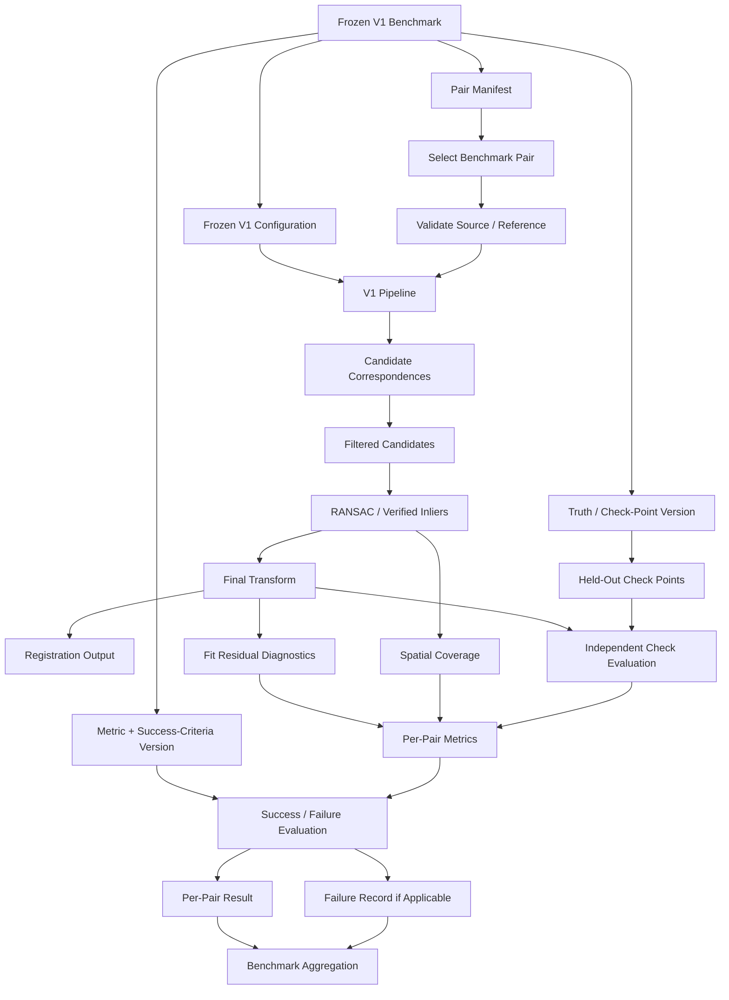
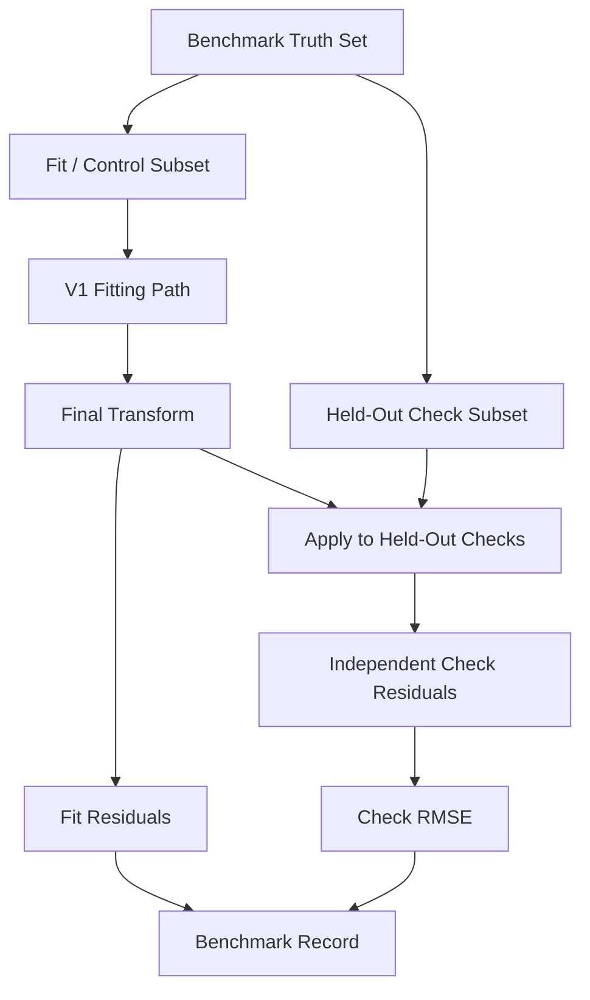
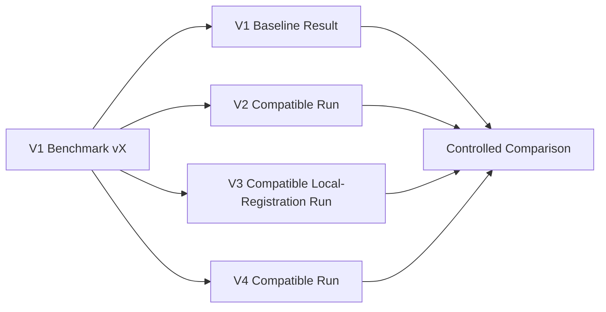

# V1 Benchmark

> **ChandraMap V1 — Version-Specific Benchmark Definition**
> **Version role:** Classical baseline / registration foundation
> **Primary benchmark task:** Known-overlap local lunar image registration

ChandraMap V1 requires a controlled benchmark because a registration pipeline cannot be evaluated scientifically from a successful-looking overlay, a large number of matches, or one carefully selected example. The benchmark defines the frozen source/reference cases, truth, configuration, metrics, failure semantics, and reproducibility information used to characterize the V1 classical baseline.

The primary benchmark question is:

> **How reliably can the ChandraMap V1 classical pipeline register a known lunar source/reference pair under controlled, reproducible benchmark conditions?**

The second purpose is long-term comparison:

> **What measurable baseline does V1 establish so that improvements in V2, V3, and V4 can be demonstrated rather than assumed?**

V1 is intentionally a **known-overlap local-registration benchmark**. It does not require whole-Moon retrieval, a global vector index, or learned retrieval models before registration.

> **V1 is a baseline benchmark, not a competition to maximize a single score.**

The V1 benchmark evaluates a classical registration path built around sensor-aware preparation, physical-scale handling, SIFT-based local correspondence, geometric verification, local transformation estimation, optional configured refinement, registration, and independent evaluation.

> **V1 establishes the measurement floor for ChandraMap: later methods should earn additional complexity by demonstrating measurable improvement on compatible frozen benchmark conditions.**

This document defines the benchmark. It does **not** contain benchmark results, rankings, leaderboards, or fabricated measurements.

---

## Relationship to Other V1 Documents

The V1 documentation set separates the scientific system from the benchmark used to evaluate it.

| Document           | Responsibility                                                              |
| ------------------ | --------------------------------------------------------------------------- |
| `README.md`        | V1 overview and navigation                                                  |
| `scope.md`         | Defines what belongs inside and outside V1                                  |
| `specification.md` | Defines normative V1 scientific and engineering behavior                    |
| `requirements.md`  | Defines verifiable V1 requirements                                          |
| `architecture.md`  | Defines V1 components and responsibility boundaries                         |
| `pipeline.md`      | Defines ordered execution of one V1 run                                     |
| `inputs.md`        | Defines data, metadata, truth, configuration, and provenance entering a run |
| `outputs.md`       | Defines the result and artifact contract                                    |
| **`benchmark.md`** | Defines how the V1 baseline is evaluated fairly and reproducibly            |

The benchmark does not redefine the pipeline. It freezes a controlled use of that pipeline and determines how its evidence is measured.

---

## Relationship to Project-Wide Evaluation Documentation

This file is version-specific. It instantiates the project-wide evaluation system for V1 rather than creating a second evaluation framework.

Relevant project-wide documents include:

- `../../evaluation/README.md`
- `../../evaluation/benchmark-protocol.md`
- `../../evaluation/benchmark-categories.md`
- `../../evaluation/metrics.md`
- `../../evaluation/ground-truth.md`
- `../../evaluation/control-points.md`
- `../../evaluation/checkpoint-evaluation.md`
- `../../evaluation/spatial-coverage.md`
- `../../evaluation/stress-tests.md`
- `../../evaluation/success-criteria.md`
- `../../evaluation/failure-cases.md`
- `../../evaluation/reproducibility.md`

The distinction is:

- `../../evaluation/benchmark-protocol.md` defines project-wide rules for conducting fair benchmarks.
- `docs/versions/v1/benchmark.md` defines how those rules apply to the V1 classical baseline.

Where both exist, they must remain consistent.

---

# 1. Benchmark Objectives

The V1 benchmark should answer the following questions:

- Can V1 generate usable candidate correspondences?
- Can filtered candidates produce a valid geometric consensus?
- Can V1 estimate a scientifically valid local source→reference transformation?
- How well does that transformation generalize to held-out check points where independent truth exists?
- Are the verified correspondences spatially distributed across the usable region?
- Which benchmark categories expose V1 failure?
- Where in the pipeline do failures become observable?
- How much runtime does V1 require in a documented execution environment?
- Can another contributor reproduce the result from the recorded data, truth, configuration, and code context?
- Can V2 or another later version improve on the same frozen local-registration task?

The benchmark is intended to characterize V1, including its limitations.

> **Failure is part of the benchmark.**

---

# 2. What V1 Is Not Trying to Prove

The V1 benchmark does not establish:

- universal lunar image registration;
- universal scale invariance;
- universal Sun-angle invariance;
- whole-Moon localization;
- global reference retrieval;
- universal multimodal robustness;
- universal IIRS registration performance;
- multi-mission generalization;
- production readiness;
- superiority over every alternative image-matching method.

Its conclusions apply only to the benchmark pairs, sensor combinations, categories, truth, configuration, and evaluation rules actually used.

> **V1 does not need the highest possible lunar registration accuracy; it needs a trustworthy reference point from which later improvement can be measured.**

---

# 3. Benchmark Terminology

| Term                    | Meaning                                                                            |
| ----------------------- | ---------------------------------------------------------------------------------- |
| **Benchmark**           | Controlled data, truth, configuration, metrics, and rules used to measure V1       |
| **Benchmark Version**   | Frozen revision of the benchmark definition                                        |
| **Benchmark Pair**      | One source/reference local-registration case                                       |
| **Benchmark Suite**     | Collection of benchmark pairs                                                      |
| **Benchmark Category**  | Objective descriptive condition associated with a benchmark pair                   |
| **Baseline**            | Frozen V1 classical method/configuration used as a comparison anchor               |
| **Run**                 | One execution of a pipeline/configuration on one pair                              |
| **Result**              | Recorded scientific outcome of a run                                               |
| **Fit / Control Point** | Point permitted to influence transformation estimation                             |
| **Check Point**         | Held-out point used for independent evaluation                                     |
| **Ground Truth**        | Independently prepared or known evaluation information                             |
| **Failure**             | Run unable to satisfy required execution or evaluation conditions                  |
| **Stress Case**         | Controlled benchmark condition representing a defined challenge                    |
| **Ablation**            | Controlled system/configuration change used to study contribution of one component |

A stress case changes or selects the **data condition**.

An ablation changes the **method/configuration**.

These must not be confused.

---

# 4. Benchmark Scope

The core V1 benchmark evaluates:

> **Known-overlap local lunar image registration.**

Conceptually:

```text
Defined Source
        +
Defined Reference
        +
Frozen Pair Definition
        +
Frozen Truth
        +
Frozen V1 Configuration
        ↓
V1 Pipeline
        ↓
Per-Pair Result
        ↓
Metrics + Failure Evidence
```

## In Scope

The V1 benchmark may evaluate:

- known source/reference pairs;
- Chandrayaan-2 source imagery;
- approved LRO reference imagery;
- sensor-aware source preparation;
- reference preparation;
- physical-scale handling;
- SIFT feature extraction;
- descriptor matching;
- candidate filtering;
- RANSAC/geometric verification;
- configured affine or homography models;
- optional sub-pixel refinement if frozen into the baseline;
- final transformation refit;
- registration output;
- fit residual diagnostics;
- spatial coverage;
- held-out check-point evaluation;
- runtime;
- explicit failure reporting;
- reproducibility;
- limited controlled stress categories.

## Out of Scope

Unless the authoritative V1 scope says otherwise, the benchmark does not require:

- global full-Moon retrieval;
- FAISS indexing;
- Recall@K retrieval benchmarking;
- learned global descriptors;
- Top-K global reference search;
- ALIKED + LightGlue as the mandatory V1 baseline;
- LoFTR as the mandatory V1 baseline;
- broad advanced-multimodal matcher benchmarking;
- DEM-aware geometry;
- terrain-mesh registration;
- multi-mission registration;
- planetary expansion;
- full global mosaicking evaluation;
- frontend usability testing;
- production-deployment benchmarking.

These belong to later versions or separate engineering/research evaluations.

---

# 5. Benchmark Task Definition

For each V1 benchmark case, the task is:

### Given

- a known source asset;
- a known reference asset or selected reference region;
- an explicit source/reference pair relationship;
- required scientific metadata;
- a frozen V1 configuration;
- benchmark truth where available;

### Estimate

a local transformation:

$$
T:\text{source}\rightarrow\text{reference}
$$

### Produce and Evaluate

- candidate correspondences;
- filtered correspondences;
- geometrically verified inliers;
- final transformation;
- registered result;
- fit residuals;
- spatial coverage;
- held-out check-point error where truth exists;
- runtime;
- status/failure;
- provenance.

The benchmark measures the registration system, not global lunar search.

---

# 6. Formal Benchmark Inputs

See `inputs.md`.

A formal benchmark run conceptually consumes:

- benchmark version;
- pair definition;
- source asset;
- reference asset;
- scientific metadata;
- source/reference representation identities;
- truth version;
- fit/check assignment where applicable;
- frozen resolved V1 configuration;
- metric definition/version;
- success-criteria version;
- code revision;
- environment context where relevant.

Benchmark inputs should remain traceable independently of local machine paths.

---

# 7. Formal Benchmark Outputs

See `outputs.md`.

A formal benchmark result conceptually includes:

- run/pair identity;
- candidate count;
- filtered candidate count;
- verified inlier count;
- inlier ratio;
- final transformation;
- fit residual diagnostics;
- spatial coverage;
- held-out check metrics where available;
- registration artifact references;
- runtime;
- status;
- failure stage where applicable;
- warnings;
- provenance.

These outputs must distinguish scientific metrics from visual artifacts.

---

# 8. V1 Baseline Definition

The official conceptual V1 baseline is:

```text
Source / Reference Pair
        ↓
Sensor-Aware Preparation
        ↓
Physical Scale Compatibility
        ↓
SIFT
        ↓
Descriptor Matching
        ↓
Candidate Filtering
        ↓
RANSAC / Geometric Verification
        ↓
Local Transform
        ↓
Optional Refinement if Frozen into Baseline
        ↓
Final Refit
        ↓
Registration
        ↓
Independent Evaluation
```

The detailed execution semantics remain governed by `pipeline.md`, `specification.md`, and the frozen benchmark configuration.

> **The official baseline must not silently change between benchmark runs.**

Changing the matcher, transformation family, representation strategy, scale strategy, filtering policy, refinement state, or other scientifically relevant behavior may create a different baseline configuration.

---

# 9. Why SIFT Is the V1 Baseline

SIFT provides a useful first benchmark because it is:

- classical;
- interpretable;
- widely understood;
- non-neural;
- suitable for reproducible local-feature experiments;
- capable of producing explicit keypoints and descriptors;
- useful as a stable reference for later methods.

SIFT is not assumed to be optimal.

The benchmark must not claim that SIFT provides complete invariance to:

- extreme physical cross-resolution differences;
- lunar illumination changes;
- sensor-modality differences;
- large non-planar geometry changes.

Its value is as a measurable classical reference point.

---

# 10. Baseline Configuration Freeze

Before formal V1 evaluation, the baseline configuration should freeze all scientifically important behavior, including as applicable:

- source preprocessing path;
- sensor-specific representation;
- IIRS 2D representation if included;
- illumination/structural preparation;
- source/reference physical-scale strategy;
- reference-pyramid selection policy;
- SIFT configuration;
- descriptor-matching configuration;
- candidate-filtering configuration;
- RANSAC configuration;
- transform family;
- optional refinement state and configuration;
- final-refit behavior;
- registration behavior;
- metric definitions;
- spatial-coverage definition;
- success criteria.

This document intentionally does not define numerical values.

> **Benchmark conditions must be frozen before final evaluation.**

---

# 11. Benchmark Pair Definition

See `../../datasets/pair-definition.md`.

Each benchmark pair should conceptually preserve:

- pair ID;
- pair version;
- source asset identity;
- reference asset identity;
- source sensor;
- reference sensor;
- source representation;
- reference representation;
- expected overlap/task relationship;
- benchmark categories;
- truth version;
- fit/check assignments where applicable;
- provenance.

The pair is part of the benchmark definition and should remain stable during formal evaluation.

---

# 12. Pair Eligibility

A benchmark pair should ideally provide:

- traceable source data;
- traceable reference data;
- scientifically meaningful same-region overlap;
- valid input preparation;
- supported V1 sensor/representation semantics;
- enough metadata to execute the configured V1 path;
- valid coordinate relationships;
- independent truth where an independent accuracy claim is expected.

This document does not impose universal:

- minimum image size;
- minimum overlap percentage;
- minimum candidate count;
- minimum truth-point count.

Such requirements, if needed, belong to versioned benchmark rules.

---

# 13. Pair Exclusion

A pair should not be excluded merely because V1 performs poorly.

Legitimate benchmark exclusion may involve issues such as:

- corrupt benchmark data;
- incorrect source/reference pairing;
- invalid or corrupted truth;
- duplicated benchmark case;
- invalid coordinate mapping;
- unresolved provenance/licensing issue;
- benchmark-definition mistake.

Exclusion must be documented and versioned.

> **A scientifically valid benchmark pair on which V1 fails remains a benchmark result; it should not be reclassified as invalid merely because the method performed poorly.**

This distinction is essential for honest failure-rate reporting.

---

# 14. Real Lunar Benchmark Data

Primary scientific evidence for V1 should come from real lunar imagery where suitable data and truth are available.

Potential source/reference contexts include:

- OHRC ↔ LRO NAC;
- TMC-2 ↔ LRO NAC;
- other explicitly approved V1 source/reference combinations;
- IIRS-derived 2D representation ↔ suitable LRO reference where V1 scope and representation maturity permit.

No fixed sensor-pair list is imposed here if the authoritative scope defines a narrower set.

---

# 15. OHRC Benchmark Context

OHRC is a high-resolution Chandrayaan-2 optical source.

Approximate project context:

**~0.25–0.32 m/pixel**, depending on product/documentation.

Actual product metadata is authoritative.

Potential benchmark factors include:

- very fine terrain structure;
- illumination differences;
- scale relationship to the selected reference;
- repetitive small craters or terrain features;
- viewpoint/projection differences.

High spatial resolution should not automatically be classified as an easy case.

---

# 16. TMC-2 Benchmark Context

TMC-2 provides medium-resolution panchromatic lunar terrain imagery.

Approximate project context:

**~5 m/pixel**.

Potential benchmark considerations include:

- structural correspondence at coarser scale;
- appropriate reference-pyramid level selection;
- reduced visibility of fine NAC terrain details;
- physical scale mismatch;
- illumination differences.

The benchmark should measure whether the configured scale strategy creates a physically meaningful comparison.

---

# 17. IIRS Benchmark Context

IIRS is hyperspectral/imaging-infrared data.

Approximate project context:

- spatial sampling around **~80 m/pixel**;
- spectral range around **~0.8–5.0 µm**;
- roughly **~250–256 bands**, depending on product/documentation.

Actual metadata remains authoritative.

If IIRS is included in a V1 benchmark:

> The benchmark evaluates the declared 2D registration representation, not the full hyperspectral cube treated as ordinary grayscale.

The representation identity and version are therefore part of the frozen benchmark/configuration.

IIRS evaluation may remain conditional if the V1 representation strategy has not yet been frozen.

---

# 18. LRO NAC Benchmark Context

LRO NAC may serve as a high-resolution lunar reference.

Current project context often treats NAC imagery around approximately:

**~0.5–2 m/pixel**, depending on product and acquisition geometry.

Actual product metadata is authoritative.

The finest available NAC representation is not automatically the correct matching representation.

Where the source is substantially coarser, the benchmark should preserve the configured reference-pyramid/scale-selection strategy.

---

# 19. LRO WAC Benchmark Context

LRO WAC may be used as broader/coarser lunar context when explicitly allowed by V1 scope.

No universal WAC GSD is defined here.

The benchmark must not automatically add:

```text
WAC retrieval
    ↓
NAC retrieval
    ↓
local registration
```

to V1.

Such retrieval behavior changes the task and belongs outside the core known-pair benchmark unless explicitly versioned into another benchmark.

---

# 20. Benchmark Categories

See `../../evaluation/benchmark-categories.md`.

Benchmark categories describe objective properties of the pair or controlled condition.

Potential category axes include:

- source sensor;
- reference sensor;
- physical-scale condition;
- illumination condition;
- terrain characteristics;
- repetitive-pattern condition;
- geometry/projection context;
- modality relationship;
- real vs. synthetic;
- nominal vs. controlled stress.

Categories should be attached using:

- metadata;
- documented product characteristics;
- curated benchmark annotation;
- known synthetic transformations.

> **Benchmark categories describe the data or condition, not how well V1 performed.**

Do not define a category such as "hard" solely because V1 failed.

---

# 21. Multi-Label Category Principle

A pair may belong to multiple categories simultaneously.

For example, one case may be:

```text
OHRC
+
large physical-scale difference
+
illumination mismatch
+
repetitive terrain
```

The benchmark should not artificially force every pair into exactly one category.

Multi-label categories allow later analysis of interacting conditions.

---

# 22. Benchmark Suite Structure

A compact V1 suite may conceptually contain:

```text
V1 Benchmark
│
├── Nominal Real Lunar Registration Cases
│
├── Scale-Stress Cases
│
├── Illumination-Difference Cases
│
├── Terrain / Repetitive-Pattern Cases
│
└── Optional Synthetic Validation Cases
```

The suite should be:

- small enough to inspect and understand;
- large/diverse enough to expose obvious baseline weaknesses;
- stable enough to support later comparison.

V1 does not need to become an exhaustive lunar-robustness benchmark.

---

# 23. Nominal Cases

Nominal cases establish that the frozen V1 baseline can execute end-to-end under representative controlled conditions.

They should exercise:

- source/reference preparation;
- physical scale handling;
- SIFT correspondence;
- geometric verification;
- transform estimation;
- registration;
- evaluation.

"Nominal" should not be used as a synonym for "easy."

The category should describe benchmark properties rather than expected performance.

---

# 24. Scale-Stress Cases

See `../../evaluation/stress-tests.md`.

Scale stress should be defined using physical or effective sampling relationships where possible.

Relevant evidence may include:

- source GSD;
- reference GSD;
- selected reference-pyramid level;
- configured scale strategy.

> **Scale stress is a physical-information problem, not merely an image-dimension problem.**

Upsampling a coarse source does not eliminate scale stress.

---

# 25. Illumination-Stress Cases

Real illumination-difference cases should be preferred when valid data and acquisition context are available.

Potential supporting metadata may include:

- acquisition geometry;
- illumination context;
- Sun-angle information where available.

Synthetic contrast or brightness perturbations may be used as controlled appearance tests.

However:

> Brightness or contrast augmentation must not be described as a physical Sun-angle simulation.

Real Sun-angle differences can alter shadow geometry rather than merely global intensity.

---

# 26. Terrain-Stress Cases

Potential terrain-related categories include:

- low-feature terrain;
- feature-rich terrain;
- repetitive crater fields;
- structurally ambiguous regions.

These labels should describe observable data characteristics.

Do not assume:

- feature-rich terrain always produces successful registration;
- low-feature terrain always fails.

The benchmark should determine performance empirically.

---

# 27. Synthetic Validation Cases

Synthetic cases are useful for testing controlled geometry and evaluation correctness.

Potential known transformations include:

- translation;
- rotation;
- scale;
- affine transformation;
- projective transformation where appropriate.

Synthetic cases can validate:

- coordinate convention;
- transformation direction;
- model recovery;
- residual calculations;
- registration implementation;
- check-point evaluation;
- pipeline failure logic.

They do not reproduce the complete cross-sensor lunar-domain problem.

---

# 28. Real vs. Synthetic Benchmark Cases

| Benchmark Type                | What It Tests                                                | Strength                                | Limitation                                              |
| ----------------------------- | ------------------------------------------------------------ | --------------------------------------- | ------------------------------------------------------- |
| Real lunar pair               | Real sensor, terrain, illumination, and geometry differences | High scientific realism                 | Independent truth may be difficult to obtain            |
| Synthetic geometry            | Transform recovery and evaluation correctness                | Exact known geometric truth             | Does not represent real cross-sensor domain differences |
| Synthetic appearance          | Controlled robustness to selected perturbations              | Repeatable and reproducible             | Not a complete physical illumination/sensor simulation  |
| Controlled real stress subset | Behavior under documented real challenges                    | Combines realism with category analysis | Multiple factors may co-vary                            |

Synthetic tests should supplement, not replace, real lunar benchmark evidence.

---

# 29. Ground-Truth Design

See `../../evaluation/ground-truth.md`.

Benchmark truth should be:

- independently established;
- traceable;
- versioned;
- separated from matcher output.

Potential truth forms include:

- manually verified correspondences;
- trusted geospatial control;
- synthetic known transformation;
- externally validated registration information.

> **Reference imagery by itself is not automatically independent ground truth.**

The reference provides the target coordinate frame, while truth defines independently validated evaluation information.

---

# 30. Fit / Check Split

See:

- `../../evaluation/control-points.md`
- `../../evaluation/checkpoint-evaluation.md`

Where independent accuracy is evaluated, relevant truth/control points should be separated into:

### Fit / Control Set

Points allowed to influence the final transformation.

### Held-Out Check Set

Points reserved for independent evaluation.

Conceptually:

```text
Truth / Control Population
        ├── Fit / Control Points
        │       ↓
        │   Transform Estimation
        │
        └── Held-Out Check Points
                ↓
          Independent Evaluation
```

> **The transformation must not be judged only on the points used to fit it.**

---

# 31. Fit / Check Independence Principle

> **A point cannot serve as an independent held-out check if it influenced the final transform for that same run.**

The benchmark must prevent check-point leakage through:

- direct transform fitting;
- refinement;
- transform-model selection;
- scale selection using final check error;
- threshold tuning;
- manual pair rescue.

Independent evaluation is meaningful only if the independence is preserved.

---

# 32. RANSAC Inliers and Ground Truth

> **RANSAC inliers are not ground truth.**

RANSAC inliers are algorithmic outputs that are consistent with the configured geometric model.

They may provide fitting support.

They do not become independent benchmark truth simply because they passed RANSAC.

The following is therefore scientifically weak:

```text
Generate matches
→ RANSAC
→ Fit transform on inliers
→ Evaluate "accuracy" only on same inliers
```

That measures model fit, not independent registration accuracy.

---

# 33. Truth Versioning

Every result using benchmark truth should preserve the truth version.

If the truth is later:

- corrected;
- reviewed;
- expanded;
- re-annotated;
- assigned different fit/check roles;

the benchmark/truth must be versioned accordingly.

Historical measurements should not be silently overwritten.

> **Benchmark data, benchmark truth, benchmark configuration, and benchmark results are different artifacts and must remain separately versioned.**

---

# 34. Primary V1 Metrics

See `../../evaluation/metrics.md`.

Core V1 evidence should conceptually include:

| Metric / Evidence        | Primary Meaning                                                   |
| ------------------------ | ----------------------------------------------------------------- |
| Candidate count          | Number of descriptor-based correspondence hypotheses              |
| Filtered count           | Candidate hypotheses remaining after filtering                    |
| Verified inlier count    | Model-consistent correspondence support                           |
| Inlier ratio             | Fraction of geometric-verification candidates accepted as inliers |
| Fit residual diagnostics | Agreement between fitted model and fit/support points             |
| Spatial coverage         | Distribution of correspondence support                            |
| Held-out check RMSE      | Independent transformation error where valid truth exists         |
| Runtime                  | Engineering execution cost                                        |
| Success/failure          | Whether benchmark-defined required conditions were satisfied      |
| Failure stage            | Stage where valid execution stopped                               |

> **No single metric is sufficient to summarize registration quality.**

The benchmark must not invent one arbitrary "ChandraMap accuracy score."

---

# 35. Candidate Count

Candidate count measures how many potential correspondence relationships were generated before robust geometric verification.

It answers:

> How many hypotheses did the matcher propose?

It does not answer:

> How many correspondences are scientifically correct?

Candidate count is therefore a diagnostic metric.

---

# 36. Filtered Candidate Count

Filtered count measures how many candidates remain after configured pre-geometry screening.

It can help diagnose:

- over-permissive matching;
- over-aggressive filtering;
- correspondence attrition.

Filtered candidates remain hypotheses.

> **Filtering does not turn candidates into ground truth.**

---

# 37. Verified Inlier Count

Inlier count measures how many input correspondences support the selected geometric model under the configured robust-verification procedure.

It is:

- algorithm-dependent;
- model-dependent;
- threshold/configuration-dependent.

It should not be interpreted without context.

---

# 38. Inlier Ratio

Conceptually:

$$
\text{inlier ratio}
=
\frac{N_{\text{verified inliers}}}
     {N_{\text{candidates passed to geometric verification}}}
$$

The denominator must remain explicit.

For example, a ratio based on post-filter candidates is not numerically equivalent to one based on all raw matcher outputs.

> **Inlier ratio is not registration accuracy.**

A small, clustered correspondence set can have a high inlier ratio while still providing weak geometric evidence.

---

# 39. Fit Residuals

Where present, see `../../algorithms/residual-analysis.md`.

For a fit point:

$$
\mathbf{r}_i
=
\mathbf{p}_{reference,i}
-
T(\mathbf{p}_{source,i})
$$

and:

$$
e_i=\|\mathbf{r}_i\|
$$

Fit residuals describe agreement between:

- the transformation;
- the points supporting/fitting that transformation.

They are useful diagnostics for:

- model consistency;
- systematic residual structure;
- fitting quality.

They are not independent accuracy when computed on the same observations used to fit the model.

---

# 40. Held-Out Check RMSE

Held-out check RMSE is the principal independent error measure where valid check truth exists.

For a held-out source check point:

$$
\mathbf{r}_i
=
\mathbf{p}_{truth,i}
-
T_{final}(\mathbf{p}_{source,i})
$$

with:

$$
e_i=\|\mathbf{r}_i\|
$$

For \(N\) valid held-out checks:

$$
RMSE
=
\sqrt{
\frac{1}{N}
\sum_{i=1}^{N} e_i^2
}
$$

Every reported check RMSE should identify:

- \(N\);
- coordinate space;
- units;
- truth version;
- transform direction where necessary.

> **Do not report bare RMSE values without their coordinate and unit semantics.**

---

# 41. Source-Pixel Error

Where scientifically and mathematically defined, V1 should support reporting error in source-image pixels.

This is especially useful when comparing performance relative to the source sensor's sampling.

However, a residual measured naturally in reference coordinates cannot simply be renamed "source pixels."

A valid mapping into source space is required.

---

# 42. Reference-Space Error

Reference-space error may also be reported.

Its context should include:

- reference product;
- reference representation;
- tile or ROI where applicable;
- pyramid level where applicable;
- coordinate space;
- units.

For example, a residual expressed in a downsampled reference level must not be reported ambiguously as native NAC pixels.

---

# 43. Ground-Space Error

Ground-space error may be expressed in metres only where valid geospatial interpretation supports that conversion.

Relevant requirements may include:

- valid projection/map context;
- meaningful coordinate mapping;
- suitable reference truth;
- appropriate product metadata.

Do not automatically compute:

```text
pixel RMSE × approximate sensor GSD
```

and call the result absolute lunar accuracy.

Approximate mission-level GSD is not necessarily sufficient for a valid geospatial conversion.

---

# 44. Spatial Coverage

See `../../evaluation/spatial-coverage.md`.

Spatial coverage measures how broadly a defined point population supports the usable registration area.

Possible benchmark-defined approaches include:

- grid occupancy;
- convex-hull support;
- another explicitly versioned coverage method.

No universal coverage threshold is defined here.

> **More matches do not automatically mean better registration.**

Many matches concentrated around one small crater may provide poorer transformation support than fewer points distributed across the overlap.

---

# 45. Coverage Population

A coverage value must identify which point population it describes.

Examples include:

- candidate coverage;
- filtered-candidate coverage;
- verified-inlier coverage;
- fit/control coverage;
- check-point coverage.

These quantities are different.

A report should not simply say:

```text
coverage = PLACEHOLDER
```

without identifying the measured population and region.

---

# 46. Coverage Is Not Accuracy

> **High spatial coverage can strengthen geometric support, but it does not prove correspondence correctness or low registration error.**

Coverage answers:

> Are the points spatially distributed?

Held-out error answers:

> Does the transformation predict independent truth accurately?

Both may be needed.

---

# 47. Runtime

Runtime is an engineering metric rather than a direct registration-accuracy measure.

Where runtime is reported, preserve enough context to interpret it, such as:

- hardware;
- operating environment;
- relevant library/software versions;
- included pipeline stages;
- source/reference dimensions or representation context where useful;
- cache state where relevant.

V1 does not define a universal runtime target in this document.

---

# 48. Optional Resource Metrics

Additional engineering metrics may include:

- memory usage;
- CPU utilization;
- GPU utilization;
- peak memory;
- per-stage timing.

They are optional unless the benchmark protocol specifically requires them.

Scientific correctness remains the primary V1 concern.

---

# 49. Success Criteria

See `../../evaluation/success-criteria.md`.

Benchmark success criteria should be:

- predefined;
- measurable;
- versioned;
- frozen before final evaluation.

Depending on the project-wide definition, they may consider:

- completion of required stages;
- valid geometric support;
- valid final transformation;
- benchmark-defined spatial support;
- independent error where truth exists;
- absence of a fatal pipeline failure.

This file intentionally does not define arbitrary numeric thresholds.

---

# 50. No Universal Success Threshold

This benchmark definition does not invent requirements such as:

- a fixed minimum match count;
- a fixed inlier-ratio percentage;
- RMSE below a specific pixel value;
- a fixed spatial-coverage percentage.

If numerical thresholds are required, they must come from the versioned success-criteria/benchmark configuration.

> **Success rules must not be selected after inspecting final benchmark results.**

---

# 51. Success Without Independent Check Truth

A pair may complete the registration pipeline without having held-out truth.

Such a result may report:

- valid transformation;
- registration completion;
- fit diagnostics;
- inlier evidence;
- coverage;
- runtime.

It must not claim independently validated accuracy.

The benchmark should therefore distinguish:

```text
Registration completed
```

from:

```text
Independent accuracy validated
```

Missing independent truth is not zero error.

---

# 52. Failure Semantics

See `../../evaluation/failure-cases.md`.

Potential observed failure stages include:

- input;
- metadata;
- preprocessing;
- representation;
- scale selection;
- feature extraction;
- descriptor matching;
- filtering;
- candidate-support validation;
- RANSAC/geometric verification;
- transform estimation;
- refinement;
- final transform validation;
- registration;
- evaluation;
- result persistence.

> **Failed pairs remain part of benchmark reporting.**

---

# 53. Failure Stage vs. Root Cause

The stage where failure is observed is not always the underlying cause.

For example:

```text
Scale incompatibility
        ↓
Weak correspondence candidates
        ↓
RANSAC fails
```

The observed failure stage may be RANSAC even though the deeper cause relates to scale or representation.

Benchmark records should therefore distinguish:

- observed failure stage;
- diagnostic evidence;
- root-cause hypothesis where investigated.

A hypothesis must not be recorded as established fact without evidence.

---

# 54. Failure Rate

Conceptually:

$$
\text{failure rate}
=
\frac{N_{\text{failed valid runs}}}
     {N_{\text{valid benchmark runs}}}
$$

The denominator must be explicit.

Benchmark-invalid cases should be treated separately rather than silently mixed with method failures.

> **Do not remove failed cases before calculating benchmark success or failure rates.**

---

# 55. Invalid Benchmark Case vs. Method Failure

These are different conditions.

### Method Failure

The pair is scientifically valid, but V1 fails to register or evaluate it successfully.

The failure remains a legitimate V1 benchmark outcome.

### Benchmark Invalidity

The benchmark case itself is unusable because of conditions such as:

- corrupt frozen data;
- invalid truth;
- incorrect pair definition;
- duplicated case;
- invalid coordinate mapping;
- benchmark-governance issue.

Invalid cases should be documented and handled through benchmark versioning/change control.

---

# 56. Conceptual Result Status Model

A benchmark implementation may distinguish concepts such as:

- successful registration;
- pipeline failure;
- independent evaluation unavailable;
- benchmark-invalid case.

These are conceptual states only.

This document does not define actual implementation enum names.

---

# 57. Reproducibility

See `../../evaluation/reproducibility.md`.

A formal V1 benchmark result should preserve enough information to determine:

- benchmark version;
- pair ID/version;
- source identity;
- reference identity;
- source representation;
- reference representation/pyramid context;
- truth version;
- fit/check roles;
- resolved V1 configuration;
- metric version;
- success-criteria version;
- code revision;
- relevant environment context;
- random seed/state where applicable;
- metrics;
- status;
- failure stage;
- artifact references.

> **A benchmark result without sufficient provenance is incomplete scientific evidence.**

---

# 58. Conceptual Benchmark Manifest

> **Illustrative conceptual benchmark manifest — not an implemented schema.**

```yaml
benchmark:
  id: PLACEHOLDER_BENCHMARK_ID
  version: PLACEHOLDER_BENCHMARK_VERSION

  chandramap_version: v1

  task:
    type: local_registration
    reference_selection: known_pair

  baseline:
    feature_extractor: sift
    matcher: PLACEHOLDER_MATCHING_CONFIGURATION
    filtering: PLACEHOLDER_FILTER_CONFIGURATION
    robust_estimator: PLACEHOLDER_RANSAC_CONFIGURATION
    transform_model: PLACEHOLDER_MODEL
    refinement: PLACEHOLDER_OPTIONAL_CONFIGURATION

  dataset:
    pair_manifest: PLACEHOLDER_PAIR_MANIFEST
    truth_version: PLACEHOLDER_TRUTH_VERSION

  evaluation:
    metric_version: PLACEHOLDER_METRIC_VERSION
    success_criteria_version: PLACEHOLDER_CRITERIA_VERSION
    coverage_definition: PLACEHOLDER_COVERAGE_DEFINITION

  reproducibility:
    code_revision: PLACEHOLDER_REVISION
    configuration_id: PLACEHOLDER_CONFIG
    environment: PLACEHOLDER_ENVIRONMENT
```

---

# 59. Conceptual Per-Pair Run Record

> **Illustrative conceptual structure — not an implemented schema.**

```yaml
run:
  benchmark_version: PLACEHOLDER
  pair_id: PLACEHOLDER
  status: PLACEHOLDER

  source:
    sensor: PLACEHOLDER
    asset_id: PLACEHOLDER

  reference:
    sensor: PLACEHOLDER
    asset_id: PLACEHOLDER
    pyramid_level: PLACEHOLDER

  correspondence:
    candidate_count: PLACEHOLDER
    filtered_count: PLACEHOLDER
    inlier_count: PLACEHOLDER
    inlier_ratio: PLACEHOLDER

  evaluation:
    coverage: PLACEHOLDER
    check_rmse: PLACEHOLDER_OR_UNAVAILABLE
    coordinate_space: PLACEHOLDER
    units: PLACEHOLDER

  engineering:
    runtime: PLACEHOLDER

  failure:
    stage: PLACEHOLDER_OR_NULL
```

---

# 60. V1 Benchmark Result Template

This table intentionally contains no measurements.

| Pair | Source Sensor | Reference | Category | Candidates | Filtered | Inliers | Inlier Ratio | Coverage | Check RMSE | Units | Runtime | Status |
| ---- | ------------- | --------- | -------- | ---------: | -------: | ------: | -----------: | -------: | ---------: | ----- | ------: | ------ |

> **This document defines the benchmark; it does not contain fabricated benchmark measurements.**

---

# 61. Failure Result Template

| Pair | Category | Last Successful Stage | Failure Stage | Candidates | Inliers | Coverage | Check RMSE | Diagnostic |
| ---- | -------- | --------------------- | ------------- | ---------: | ------: | -------: | ---------: | ---------- |

Failed runs should appear in benchmark reporting rather than disappearing from the dataset.

---

# 62. Category Summary Template

| Category | Pair Count | Successful Runs | Failed Runs | Check RMSE Summary | Coverage Summary | Runtime Summary |
| -------- | ---------: | --------------: | ----------: | ------------------ | ---------------- | --------------- |

No pair counts or metric values are implied by this empty template.

---

# 63. Benchmark Execution Flow

A formal benchmark execution conceptually follows:

```text
Freeze Benchmark
        ↓
Validate Pair
        ↓
Resolve Frozen V1 Configuration
        ↓
Execute V1 Pipeline
        ↓
Preserve Success or Failure
        ↓
Compute Available Metrics
        ↓
Persist Per-Pair Result
        ↓
Repeat for Frozen Pair Set
        ↓
Aggregate After All Runs
```

Pair-level evidence must be retained before aggregation.

---

# 64. Main Benchmark Flow



---

# 65. Fit / Check Benchmark Flow



The separation between `B` and `C` is central to independent evaluation.

---

# 66. Benchmark Version Comparison Flow



Later versions may introduce additional benchmarks for new tasks, but compatible local-registration evaluation should preserve the V1 benchmark where scientifically meaningful.

---

# 67. Benchmark Freeze

Before final evaluation, freeze as appropriate:

- benchmark pair set;
- source asset versions;
- reference asset versions;
- derived representation versions;
- truth version;
- fit/check assignments;
- categories;
- metric definitions;
- spatial-coverage definition;
- success criteria;
- baseline configuration;
- code revision or release candidate where applicable.

> **Benchmark data, truth, configuration, and success rules must not be changed after viewing final results without creating a new benchmark version.**

---

# 68. Benchmark Change Control

Changes that may require a new benchmark version include:

- adding a pair;
- removing a pair;
- replacing a source/reference asset;
- changing a crop or tile;
- correcting truth;
- changing fit/check assignments;
- changing an IIRS representation;
- changing reference preparation;
- changing metric formulas;
- changing coverage definitions;
- changing success criteria;
- changing the official baseline configuration;
- changing benchmark categories in a scientifically meaningful way.

Historical benchmark semantics must not be silently mutated.

---

# 69. Benchmark Version History Template

| Benchmark Version | Change      | Compatibility Note |
| ----------------- | ----------- | ------------------ |
| PLACEHOLDER       | PLACEHOLDER | PLACEHOLDER        |

Real benchmark versions and dates should only be added when formally established.

---

# 70. Pair-Specific Tuning

Formal V1 benchmark runs must not rely on manual pair-specific rescue.

Examples of invalid final-evaluation behavior include:

- visually choosing a RANSAC threshold separately for each final pair;
- changing scale after viewing held-out RMSE;
- manually deleting difficult matches;
- manually choosing a different transform model after seeing the final result;
- modifying preprocessing for one failing pair;
- changing the success threshold because a particular pair failed.

Such behavior converts the benchmark into an interactive experiment rather than a reproducible evaluation.

---

# 71. Predefined Adaptive Rules

Adaptive behavior can be benchmark-valid if the rule is:

- defined before final evaluation;
- bounded;
- deterministic or reproducible;
- applied consistently;
- recorded in the result.

For example, the baseline could define a controlled rule that checks a neighboring reference-pyramid level when a predefined internal validity condition fails.

The benchmark must not choose the best scale using held-out check truth.

---

# 72. Data Leakage

Benchmark leakage occurs when final evaluation information influences the system being evaluated.

Potential leakage paths include:

- using held-out check points in transform fitting;
- choosing parameters using final check RMSE;
- changing preprocessing after inspecting final benchmark outcomes;
- choosing success thresholds to make final results pass;
- manually editing candidate correspondences using truth;
- selecting the final transformation model based on held-out error;
- changing benchmark categories according to performance.

> **Held-out check truth must not tune the final V1 configuration.**

---

# 73. Development, Validation, and Final Benchmark Data

Conceptually distinguish three roles.

### Development Data

Used for:

- implementation;
- debugging;
- pipeline design;
- visual inspection;
- early failure analysis.

### Validation Data

May be used for:

- selecting fixed configuration;
- choosing between predefined alternatives;
- tuning scientifically justified parameters.

### Final Benchmark

Frozen evaluation data used for formal reporting and future comparison.

Exact split percentages are not specified here.

If the available V1 dataset is too small for a statistically strong development/validation/final split, document that limitation instead of implying a large independent dataset.

---

# 74. Benchmark Reuse

Where task compatibility exists, the same frozen benchmark should be reused for later versions.

For example:

```text
V1 Classical Local Registration
            vs.
V2 Improved Local Registration
```

should preferably be evaluated on:

- the same pair;
- the same truth;
- the same fit/check split;
- the same metric definition;
- the same success criteria.

This allows measured improvement rather than anecdotal comparison.

---

# 75. Fair Comparison Rules

When comparing V1 against another method or version, hold constant where scientifically possible:

- source/reference pair;
- source representation;
- reference representation;
- pair definition;
- truth;
- fit/check split;
- metric definitions;
- success criteria;
- coordinate conventions;
- error units;
- benchmark categories;
- output interpretation;
- hardware/runtime context where runtime is compared.

If any of these differ, the comparison should disclose the difference explicitly.

> **The same benchmark pair, truth, metric definitions, and success rules should be reused across method/version comparisons wherever scientifically compatible.**

---

# 76. Matcher Comparison

A later experiment may compare methods such as:

- SIFT;
- ALIKED + LightGlue;
- LoFTR;
- another documented local matcher.

Their native score semantics may differ.

Therefore, do not directly equate:

- SIFT descriptor distance;
- LightGlue confidence;
- LoFTR confidence;

as though they measure the same thing.

Where possible, compare matcher pipelines through common downstream measures such as:

- verified inlier support;
- spatial coverage;
- held-out registration error;
- failure rate;
- runtime.

---

# 77. Transform Comparison

Affine and homography may be compared experimentally where scientifically valid.

A fair comparison should preserve:

- pair;
- correspondence/truth setup;
- evaluation points;
- metrics.

Do not choose a transformation merely because it has the lowest fitting residual.

A more flexible model may fit training/control observations better while generalizing worse to held-out points.

Held-out evaluation is therefore important.

---

# 78. Refinement Ablation

An optional V1 ablation may compare:

```text
Refinement Disabled
```

with:

```text
Refinement Enabled
```

A controlled comparison should preserve:

- pair;
- verified-support strategy;
- truth;
- fit/check split;
- metric definitions;
- transformation model.

When refinement modifies fit coordinates, the final transformation must be refit before evaluation.

---

# 79. Scale-Strategy Ablation

A research experiment may compare multiple predefined reference-scale strategies.

Such an experiment should use:

- the same pair;
- the same truth;
- the same evaluation metrics;
- the same downstream baseline where possible.

The selected scale strategy must not be chosen using final held-out check truth.

---

# 80. Ablation vs. Official Baseline

An experiment does not automatically redefine the official V1 baseline.

For example:

```text
V1 Baseline
+
Experimental Refinement Ablation
```

does not mean the experimentally better configuration becomes historical V1 automatically.

Changing the official baseline requires explicit configuration/benchmark versioning.

---

# 81. Repeated Runs and Stochasticity

RANSAC and other operations may contain stochastic behavior.

Where randomness is controllable:

- preserve the seed/state;
- record stochastic configuration;
- repeat runs if a specific benchmark analysis requires variability measurement.

No universal number of repeated runs is defined here.

If only one deterministic seeded run is used, that fact should be reproducible.

---

# 82. Reproducibility Environment

When runtime or exact execution behavior is compared, preserve enough environment context to make the measurement interpretable.

Possible context includes:

- operating system/environment;
- language/runtime version;
- relevant computer-vision/scientific library versions;
- CPU;
- GPU where used;
- code revision;
- cache state;
- concurrency settings where relevant.

The V1 benchmark does not require one universal physical machine unless explicitly defined by the benchmark protocol.

---

# 83. Cold vs. Warm Cache

Caching can materially alter runtime.

Where caching is used, runtime reports should distinguish conditions such as:

- cold cache;
- warm cache;
- prepared-reference cache;
- descriptor cache;

where scientifically relevant.

Do not compare cached and uncached timing without disclosure.

---

# 84. Result Aggregation

Per-pair results should be preserved before summary statistics are calculated.

Avoid pooling every correspondence from every image pair into one global population and treating them as independent equivalent samples.

Different pairs may differ substantially in:

- source sensor;
- physical scale;
- number of correspondences;
- terrain;
- illumination;
- truth density.

> **Pair-level results come first. Aggregate second.**

---

# 85. Pair-First Aggregation

Where appropriate, calculate metrics at the pair level first.

Possible later summaries may include:

- mean;
- median;
- percentiles;
- distribution plots;
- category-specific summaries.

This document does not mandate one universal statistical summary.

The aggregation method should be defined by the project-wide metric/benchmark protocol.

---

# 86. Failure-Aware Aggregation

Aggregate benchmark reports should distinguish:

- successful runs;
- failed valid runs;
- invalid benchmark cases;
- independent-evaluation-unavailable cases.

Metric summaries must clearly state which population they describe.

For example:

> Mean check RMSE over successful independently evaluated pairs

is different from:

> Overall benchmark performance.

Do not silently summarize only successful pairs and present the value as though failures did not occur.

---

# 87. Sensor-Stratified Aggregation

Where sample size supports it, report benchmark evidence separately for:

- OHRC;
- TMC-2;
- IIRS-derived representation;

and/or specific source/reference combinations.

A single unexplained mean across substantially different sensor regimes may hide important behavior.

Sample counts should accompany sensor-stratified summaries.

---

# 88. Category-Stratified Aggregation

See `../../evaluation/benchmark-categories.md`.

Possible category-level summaries include:

- physical-scale condition;
- illumination condition;
- terrain condition;
- modality;
- geometry/projection context;
- real vs. synthetic.

Category summaries should report the number of applicable pairs/runs.

A category with very few cases should not be presented as broadly representative.

---

# 89. Missing Metrics

Unavailable values must remain unavailable.

Do not substitute `0` for:

- unavailable check RMSE;
- unavailable ground-space error;
- unavailable coverage;
- unavailable runtime;
- missing truth.

Use repository conventions such as:

- unavailable;
- not evaluated;
- not applicable;

with clear semantics.

Zero is a measurement and must not mean "missing."

---

# 90. Benchmark Success Is Not Every Pair Succeeding

The benchmark exists to characterize the V1 baseline, not to prove perfection.

Some scientifically valid cases may fail.

That is useful evidence.

The benchmark should reveal:

- where V1 works;
- where V1 fails;
- where evaluation is unavailable;
- what later versions improve.

> **A benchmark that hides all failure cases cannot provide a trustworthy baseline.**

---

# 91. Benchmark Definition Is Not Benchmark Results

> **This document defines the benchmark; it does not contain fabricated benchmark measurements.**

Until formal results exist:

- result tables remain empty;
- metric fields use placeholders in conceptual schemas;
- no accuracy claims are made;
- no arbitrary confidence percentages are inserted;
- no fake runtime values are reported.

Actual benchmark outputs belong in controlled results artifacts, not in the benchmark definition.

---

# 92. Benchmark Artifacts

Potential per-run artifacts may include:

- candidate-match visualization;
- filtered-match visualization;
- RANSAC inlier/outlier visualization;
- registered preview;
- residual-vector visualization;
- spatial-coverage visualization;
- point-level check evaluation;
- result manifest;
- failure diagnostics.

These artifacts support interpretation.

They do not replace:

- explicit metrics;
- pair identity;
- truth;
- failure status;
- reproducibility information.

---

# 93. Repository Benchmark Relationships

Where the corresponding root directories exist, responsibilities should remain separated.

### `../../../benchmarks/`

Conceptual role:

- frozen machine-readable benchmark definitions;
- pair manifests;
- benchmark configuration references;
- versioned benchmark metadata.

This document defines the scientific V1 benchmark contract and does not prescribe exact filenames.

### `../../../configs/`

Conceptual role:

- versioned scientific configuration;
- frozen benchmark configuration;
- experiment configuration.

### `../../../experiments/`

Conceptual role:

- ablations;
- exploratory parameter studies;
- alternative matcher research;
- scale-strategy comparisons;
- non-official investigations.

An experiment is not automatically the official V1 benchmark.

### `../../../results/`

Conceptual role:

- formal run results;
- benchmark summaries;
- historical measurements.

Historical formal results should not be overwritten silently.

### `../../../artifacts/`

Conceptual role:

- larger generated scientific outputs;
- visual diagnostics;
- registered previews;
- plots;
- other run-linked artifacts.

Artifacts should remain attributable to run identities.

---

# 94. Benchmark Structural Readiness

This document does not impose numerical performance targets.

A V1 benchmark can be considered structurally ready when:

- its scientific objective is defined;
- the V1 baseline is defined;
- pair definitions are frozen;
- data provenance is valid;
- truth is prepared/versioned;
- fit/check separation is defined;
- baseline configuration is frozen;
- metrics are defined;
- coverage semantics are defined;
- success criteria are defined;
- failure semantics are defined;
- runtime methodology is documented;
- reproducibility context is defined;
- formal runs can be persisted;
- failed cases remain visible;
- results can later be compared with V2+.

Structural readiness is not the same as benchmark success.

---

# 95. Benchmark Readiness Checklist

- [ ] V1 benchmark objective is defined
- [ ] V1 baseline pipeline is defined
- [ ] Benchmark task is known-overlap local registration
- [ ] Pair manifest is defined
- [ ] Source/reference data identities are frozen
- [ ] Sensor categories are documented
- [ ] Benchmark categories are versioned
- [ ] Ground truth is prepared/versioned
- [ ] Fit/control points are identified where applicable
- [ ] Held-out check points are independent
- [ ] V1 preprocessing configuration is frozen
- [ ] Sensor representation strategy is frozen
- [ ] Scale strategy is frozen
- [ ] SIFT configuration is frozen
- [ ] Match-filter configuration is frozen
- [ ] RANSAC configuration is frozen
- [ ] Transform model configuration is frozen
- [ ] Refinement state/configuration is frozen
- [ ] Metric definitions are frozen
- [ ] Spatial-coverage definition is frozen
- [ ] Success criteria are frozen
- [ ] Failure semantics are defined
- [ ] Runtime methodology is documented
- [ ] Randomness/seed handling is documented
- [ ] Result manifest is defined conceptually or implemented as appropriate
- [ ] Failed runs remain in reporting
- [ ] Invalid benchmark cases are distinguished from method failures
- [ ] No pair-specific manual rescue is allowed
- [ ] No final check truth is used for tuning
- [ ] Benchmark versioning/change control is documented
- [ ] V1 results can be reused for V2–V4 comparison

---

# 96. Benchmark Anti-Patterns

Do **not**:

- benchmark only one cherry-picked pair and generalize broadly;
- remove valid pairs because V1 failed;
- call RANSAC inliers ground truth;
- evaluate transformation accuracy only on points used for fitting;
- select held-out check points after observing residuals;
- tune RANSAC using final check RMSE;
- tune reference scale using final benchmark truth;
- choose success thresholds after seeing final results;
- silently change truth between methods;
- silently change pair crops between methods;
- silently change source/reference representations;
- silently change metric definitions;
- silently change coordinate conventions;
- compare different sensor subsets without disclosure;
- use candidate count as the primary accuracy metric;
- use inlier ratio as registration accuracy;
- use fitting RMSE as independent accuracy;
- use a visual overlay as benchmark proof;
- report a generic "accuracy %";
- blindly convert pixel residuals to metres;
- hide failed runs;
- assign failed runs `RMSE = 0`;
- calculate success-only averages without labeling their population;
- combine source-pixel errors from different sensors without context;
- use retrieval Recall@K as a V1 local-registration metric;
- insert FAISS into the benchmark unnecessarily;
- invent a composite "ChandraMap accuracy score";
- rank methods using an arbitrary composite score;
- assume learned matchers are superior before measurement;
- report runtime without environment context;
- manually repair final benchmark pairs;
- modify historical V1 solely to improve comparisons after later versions exist;
- overwrite historical benchmark outputs.

---

# 97. Claims to Avoid

Without real benchmark evidence, do not claim:

- "V1 achieves X% accuracy."
- "V1 is highly accurate."
- "V1 solves lunar registration."
- "V1 is scale invariant."
- "V1 is Sun-angle invariant."
- "V1 always succeeds."
- "SIFT is the best matcher."
- "Homography is the best transform."
- "Sub-pixel refinement always improves results."
- "OHRC performs better than TMC-2."
- "IIRS is impossible to match."
- "V1 is production ready."
- "V2 will definitely outperform V1."
- "Learned matching will definitely improve accuracy."
- "High inlier ratio proves correctness."
- "Low fitting RMSE proves accurate registration."
- "A visually aligned image proves registration quality."

Benchmark conclusions must follow measurements rather than precede them.

---

# 98. Benchmark Limitations

## Known-Overlap Task

V1 benchmarks local registration when the source/reference relationship is already defined.

It does not measure global lunar retrieval.

## Limited Pair Population

The initial benchmark may contain a limited number of scientifically usable pairs.

Any conclusions should be scoped to the actual population.

## Sparse Independent Truth

Held-out check truth may not exist for every pair.

This limits independent accuracy evaluation.

## Sensor Coverage

Different source/reference combinations may have unequal representation in the suite.

Cross-sensor averages should therefore be interpreted cautiously.

## Illumination Metadata

Illumination/acquisition metadata may be incomplete for some products, limiting precise category assignment.

## Product-Specific Physical Scale

Physical sampling varies by product and must rely on actual metadata where available.

## Reference Uncertainty

LRO reference imagery and associated geospatial products may have their own uncertainties.

Reference imagery must not automatically be treated as perfect absolute truth.

## Local Geometry Approximation

Affine and homography models are local image-registration approximations.

Terrain relief, projection differences, and viewpoint geometry may create residual structure they cannot fully model.

## IIRS Representation Dependence

IIRS performance depends on the chosen 2D registration representation.

Results should therefore preserve representation identity/version.

## Synthetic-Test Limitations

Synthetic transformations provide exact geometry but do not reproduce the complete sensor, illumination, terrain, and modality differences present in real lunar data.

## Runtime Dependence

Runtime depends on:

- hardware;
- libraries;
- cache state;
- configuration;
- representation size.

It must not be generalized without context.

## Scope of Conclusions

A successful V1 benchmark characterizes the tested benchmark conditions.

It does not establish universal lunar-registration performance.

---

# 99. V1 Benchmark vs. V2

Where scientifically compatible, V2 should preferably run the frozen V1 benchmark in addition to V2-specific cases.

Conceptually:

```text
Frozen V1 Benchmark
      ├── V1 Baseline
      └── V2 Improved Local Registration
```

This enables direct evidence of whether V2 improves:

- held-out accuracy;
- geometric support;
- coverage;
- failure rate;
- runtime;

under the same local-registration task.

---

# 100. V1 Benchmark vs. V3

V3 may introduce global retrieval.

That requires additional metrics such as retrieval success and possibly Recall@K.

Those metrics must remain separate from the original local-registration metrics.

Conceptually:

```text
V3 Retrieval Benchmark
    → evaluates finding reference candidates

V1-Compatible Registration Benchmark
    → evaluates registering a known reference pair
```

If V3 receives the same known source/reference pair, its local-registration component may still be evaluated against the frozen V1 benchmark.

---

# 101. V1 Benchmark vs. V4

V4 may introduce capabilities such as:

- DEM-aware geometry;
- terrain-conditioned registration;
- uncertainty estimation;
- advanced multimodal registration;
- multi-mission evaluation.

V4 may require additional benchmark suites.

Where its task remains scientifically compatible, historical V1 benchmark cases should still be preserved for comparison.

---

# 102. Benchmark Evolution Principle

> **Later benchmarks may expand the task, but they should not erase the original V1 question.**

The historical V1 baseline should remain identifiable so that later improvements have a stable point of comparison.

---

# 103. Benchmark Flow Summary

A formal V1 benchmark conceptually consists of:

```text
Frozen Benchmark Definition
        +
Frozen Source / Reference Pairs
        +
Frozen Truth
        +
Frozen V1 Configuration
        +
Frozen Metric Definitions
        +
Frozen Success Criteria
        ↓
V1 Benchmark Runs
        ↓
Per-Pair Results
        ↓
Failures Preserved
        ↓
Pair / Sensor / Category Aggregation
        ↓
Reproducible V1 Baseline
```

The scientific purpose is not to make V1 look successful.

The purpose is to make V1 measurable.

A trustworthy V1 baseline establishes:

- what works;
- what fails;
- under which conditions;
- with what geometric evidence;
- with what independent error where available;
- with what spatial support;
- with what runtime;
- under what exact benchmark context.

That record becomes the controlled comparison anchor for future ChandraMap versions.

---

# 104. Related Documentation

## Same-Directory V1 Documents

- [`README.md`](README.md) — V1 overview and navigation.
- [`specification.md`](specification.md) — normative V1 technical and scientific behavior.
- [`scope.md`](scope.md) — V1 boundaries and exclusions.
- [`requirements.md`](requirements.md) — verifiable requirements.
- [`architecture.md`](architecture.md) — component/layer organization.
- [`pipeline.md`](pipeline.md) — ordered V1 execution flow.
- [`inputs.md`](inputs.md) — scientific run and benchmark inputs.
- `outputs.md` — result/output contract where present.
- **`benchmark.md`** — controlled V1 evaluation definition.

## Parent Version Documentation

- [`../README.md`](../README.md) — version architecture and relationship between V1–V4.

## Project Documentation

Relevant project documents include:

- `../../project/goals.md`
- `../../project/non-goals.md`
- `../../project/v1-scope.md`
- `../../project/terminology.md`
- `../../project/assumptions.md`
- `../../project/limitations.md`

`../../project/v1-scope.md` is especially important for preventing the benchmark from expanding into later-version capabilities.

## Project-Wide Architecture Documentation

Relevant architecture documents include:

- `../../architecture/system-overview.md`
- `../../architecture/v1-pipeline.md`
- `../../architecture/core-engine-architecture.md`
- `../../architecture/backend-architecture.md`
- `../../architecture/frontend-architecture.md`
- `../../architecture/module-map.md`
- `../../architecture/data-flow.md`
- `../../architecture/output-flow.md`

## Sensor Documentation

Where present:

- `../../sensors/overview.md`
- `../../sensors/ohrc.md`
- `../../sensors/tmc2.md`
- `../../sensors/iirs.md`
- `../../sensors/lro-nac.md`
- `../../sensors/lro-wac.md`

These documents provide sensor-specific context. Product metadata remains authoritative during benchmarking.

## Dataset Documentation

Relevant dataset documentation includes:

- `../../datasets/README.md`
- `../../datasets/chandrayaan-2.md`
- `../../datasets/lro.md`
- `../../datasets/metadata.md`
- `../../datasets/data-format.md`
- `../../datasets/dataset-structure.md`
- `../../datasets/dataset-preparation.md`
- `../../datasets/pair-definition.md`
- `../../datasets/ground-truth-preparation.md`

Dataset preparation and pair/truth governance should remain separate from benchmark result generation.

## Algorithm Documentation

Where the corresponding documents exist:

- `../../algorithms/overview.md`
- `../../algorithms/sensor-routing.md`
- `../../algorithms/preprocessing.md`
- `../../algorithms/illumination-handling.md`
- `../../algorithms/scale-pyramid.md`
- `../../algorithms/sift.md`
- `../../algorithms/matching.md`
- `../../algorithms/match-filtering.md`
- `../../algorithms/ransac.md`
- `../../algorithms/transforms.md`
- `../../algorithms/residual-analysis.md`
- `../../algorithms/subpixel-refinement.md`
- `../../algorithms/registration.md`

These paths should only become active links where the files actually exist.

## Evaluation Documentation

The V1 benchmark relies on the project-wide evaluation system, particularly:

- `../../evaluation/README.md`
- `../../evaluation/benchmark-protocol.md`
- `../../evaluation/benchmark-categories.md`
- `../../evaluation/metrics.md`
- `../../evaluation/ground-truth.md`
- `../../evaluation/control-points.md`
- `../../evaluation/checkpoint-evaluation.md`
- `../../evaluation/spatial-coverage.md`
- `../../evaluation/stress-tests.md`
- `../../evaluation/success-criteria.md`
- `../../evaluation/failure-cases.md`
- `../../evaluation/reproducibility.md`

The V1 benchmark instantiates these rules rather than replacing them.

## Data Licenses

- `../../data-licenses.md`

Benchmark reproducibility must preserve mission/provider provenance while respecting data licensing and redistribution constraints.

## Root Documentation

Where present:

- [`../../../README.md`](../../../README.md)
- [`../../../ROADMAP.md`](../../../ROADMAP.md)
- [`../../../CHANGELOG.md`](../../../CHANGELOG.md)
- [`../../../CONTRIBUTING.md`](../../../CONTRIBUTING.md)
- [`../../../SECURITY.md`](../../../SECURITY.md)
- [`../../../CITATION.cff`](../../../CITATION.cff)

## Root Benchmark and Research Areas

Where present:

- `../../../benchmarks/` — frozen machine-readable benchmark definitions.
- `../../../configs/` — versioned configurations.
- `../../../experiments/` — exploratory research and ablations.
- `../../../results/` — formal scientific results.
- `../../../artifacts/` — generated visual/scientific artifacts.

Exact internal filenames are intentionally not defined here.

---

# 105. V1 Benchmark Contract Summary

The V1 benchmark is governed by the following principles:

1. **The benchmark measures known-overlap local registration.**
2. **V1 remains the classical SIFT-centered baseline.**
3. **Benchmark data must be frozen.**
4. **Benchmark truth must be independent and versioned.**
5. **Fit points and held-out check points remain separate.**
6. **RANSAC inliers are algorithm outputs, not ground truth.**
7. **Candidate count is diagnostic, not accuracy.**
8. **Filtered count is diagnostic, not accuracy.**
9. **Inlier count describes geometric support.**
10. **Inlier ratio is not registration accuracy.**
11. **Fit residuals are not independent check error.**
12. **Held-out check RMSE requires explicit coordinate space, units, and population.**
13. **Source, reference, and ground-space errors must not be confused.**
14. **Ground error requires valid geospatial interpretation.**
15. **Spatial coverage complements error metrics but does not prove correctness.**
16. **No single metric summarizes registration quality completely.**
17. **Success criteria are frozen before final evaluation.**
18. **Failed valid pairs remain benchmark results.**
19. **Benchmark-invalid cases are distinct from method failures.**
20. **Failure stage is distinct from root cause.**
21. **Unavailable metrics must not be encoded as zero.**
22. **Pair-specific manual rescue is prohibited in formal evaluation.**
23. **Predefined adaptive behavior must be bounded and reproducible.**
24. **Final check truth must not tune the baseline.**
25. **Real and synthetic cases answer different scientific questions.**
26. **Categories describe benchmark conditions rather than method performance.**
27. **Runtime requires environment and cache context.**
28. **Pair-level results precede aggregation.**
29. **Failures remain visible in aggregate summaries.**
30. **Benchmark changes require explicit versioning.**
31. **Historical V1 results remain preserved as the future comparison anchor.**
32. **Later versions should reuse compatible frozen V1 conditions where scientifically valid.**
33. **Retrieval metrics remain separate from V1 registration metrics.**
34. **Ablation results do not automatically redefine the official baseline.**
35. **This file defines benchmark semantics, not fabricated benchmark results.**

<!-- Benchmark definition request source: :contentReference[oaicite:0]{index=0} -->
