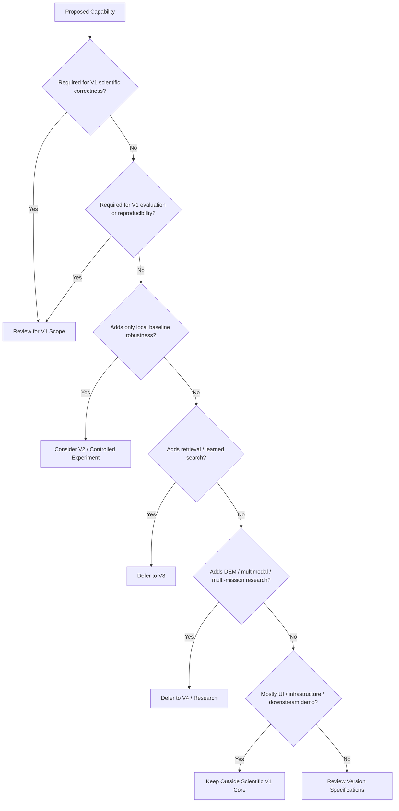
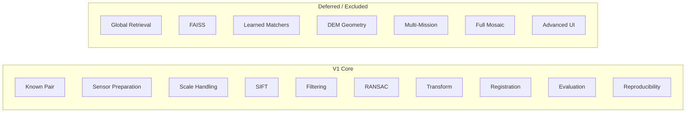
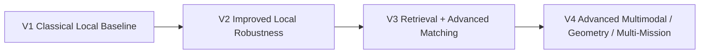

# V1 Exclusions

> **ChandraMap V1 — Authoritative Exclusions and Non-Goals**
> **Version role:** Classical baseline / registration foundation
> **Primary task:** Known-overlap local lunar image registration

ChandraMap V1 is intentionally constrained. Its purpose is to establish a clear, reproducible, scientifically defensible classical baseline for lunar image correspondence and registration—not to contain every capability that may eventually belong in ChandraMap.

The canonical V1 problem remains:

```text
Known Source / Reference Pair
        ↓
Sensor-Aware Preparation
        ↓
Physical Scale Handling
        ↓
SIFT
        ↓
Candidate Matching
        ↓
Match Filtering
        ↓
RANSAC / Geometric Verification
        ↓
Local Transform
        ↓
Optional Refinement
        ↓
Final Refit
        ↓
Registration
        ↓
Evaluation
        ↓
Reproducible Result or Failure
```

Anything not necessary to establish, execute, evaluate, or reproduce this baseline should not automatically become part of V1.

> **V1 is intentionally incomplete by design: its purpose is to establish a trustworthy baseline, not to contain the full future ChandraMap research program.**

> **Excluded does not mean unimportant.**

A capability may be scientifically valuable, planned, research-worthy, or important to a later ChandraMap version while still being inappropriate as a V1 requirement.

> **A future feature should not be pulled into V1 merely because it could improve accuracy.**

Controlled version boundaries are necessary for honest benchmarking. If V1 continuously absorbs every promising technique, later improvements cannot be measured against a stable baseline.

> **V1 should remain simpler than later versions so that improvements can be measured rather than hidden inside an ever-changing baseline.**

> **Experimental work may exist outside the official V1 baseline without becoming a V1 requirement.**

> **V1 acceptance must not be blocked by capabilities explicitly listed as non-goals.**

---

## Relationship to Other V1 Documents

The V1 documentation set separates positive scope from explicit exclusions.

| Document                               | Responsibility                                                                     |
| -------------------------------------- | ---------------------------------------------------------------------------------- |
| [`README.md`](README.md)               | V1 overview and navigation                                                         |
| [`scope.md`](scope.md)                 | Complete V1 boundary: included, optional, conditional, deferred, and excluded work |
| [`specification.md`](specification.md) | V1 scientific and technical contract                                               |
| [`requirements.md`](requirements.md)   | Verifiable V1 requirements                                                         |
| [`architecture.md`](architecture.md)   | V1 component and layer organization                                                |
| [`pipeline.md`](pipeline.md)           | V1 execution order                                                                 |
| [`inputs.md`](inputs.md)               | Inputs and scientific context consumed by V1                                       |
| `outputs.md`                           | Outputs produced by V1 where that document exists                                  |
| [`benchmark.md`](benchmark.md)         | Controlled V1 benchmark definition                                                 |
| `acceptance-criteria.md`               | Conditions for freezing/accepting V1 where that document exists                    |
| **`exclusions.md`**                    | Capabilities V1 intentionally does not attempt, require, claim, or include         |

`scope.md` defines the overall boundary.

This document specializes the negative side of that boundary:

> **What must not be treated as necessary V1 work?**

It must not become a replacement for `scope.md`.

---

## Relationship to Project-Level Non-Goals

Project-wide non-goals and V1-specific exclusions are different.

`../../project/non-goals.md` defines constraints that apply more broadly across ChandraMap.

[`../../project/v1-scope.md`](../../project/v1-scope.md) defines the authoritative project-level V1 boundary.

This file defines exclusions specific to the first version.

Conceptually:

```text
Project-Wide Non-Goals
        ↓
Apply Across ChandraMap

V1 Exclusions
        ↓
Apply Specifically to Version 1
```

A capability excluded from V1 may still be appropriate for V2, V3, V4, or separate research.

A project-wide non-goal is broader and should not be overridden here.

---

# 1. Exclusion Classification

V1 uses the following scope-governance classifications.

| Classification                  | Meaning                                                        |
| ------------------------------- | -------------------------------------------------------------- |
| **Out of Scope**                | Intentionally not part of V1                                   |
| **Deferred**                    | Valid capability intentionally assigned to a later version     |
| **Research-Only**               | Exploratory direction not part of stable V1                    |
| **Optional Experiment**         | May be tested without modifying the official V1 baseline       |
| **Downstream Demo**             | Uses V1 outputs but is not part of scientific V1 completion    |
| **Not Required for Acceptance** | May exist, but its absence must not block V1                   |
| **Project-Wide Non-Goal**       | Excluded more broadly according to project-level documentation |

These classifications are not implementation-status labels.

---

# 2. Excluded vs. Unimplemented

This distinction is fundamental.

### Excluded

The capability is intentionally not required by V1.

Example:

```text
Global Moon Retrieval
```

may be deferred because V1 assumes a known source/reference relationship.

### Unimplemented

The capability belongs to V1 but has not yet been built.

Example:

```text
RANSAC / Geometric Verification
```

is part of the V1 baseline. If absent, that is unfinished V1 work—not an exclusion.

> **Excluded does not mean unimplemented, and unimplemented does not mean excluded.**

`exclusions.md` must never become a convenient backlog where unfinished core requirements are reclassified as non-goals.

---

# 3. Exclusions at a Glance

| Capability                               | V1 Classification              | Why Excluded                                     | Likely Destination     |
| ---------------------------------------- | ------------------------------ | ------------------------------------------------ | ---------------------- |
| Global lunar retrieval                   | Deferred                       | Adds a separate retrieval problem                | Candidate V3           |
| FAISS indexing/search                    | Deferred                       | Retrieval infrastructure, not local registration | Candidate V3           |
| Learned global descriptors               | Deferred                       | Adds model/retrieval subsystem                   | Candidate V3           |
| Top-K candidate search                   | Deferred                       | Unknown-location retrieval is not core V1        | Candidate V3           |
| ALIKED + LightGlue as mandatory baseline | Deferred / Optional Experiment | V1 preserves classical SIFT baseline             | Later version/research |
| LoFTR as mandatory baseline              | Deferred / Optional Experiment | Learned detector-free matcher changes baseline   | Later version/research |
| RIFT/CFOG as mandatory path              | Research-Only                  | Advanced multimodal remote-sensing methods       | Candidate V4/research  |
| Neural lunar descriptors                 | Research-Only                  | Adds learned-model training/inference            | Later research         |
| Large ML training system                 | Out of Scope                   | V1 baseline is classical                         | Later research         |
| Full hyperspectral cube matching         | Deferred                       | Ordinary V1 matcher is 2D                        | Candidate V4/research  |
| Advanced IIRS spectral matching          | Research-Only                  | Expands into multimodal spectral registration    | Candidate V4/research  |
| DEM-aware registration                   | Deferred                       | Adds terrain/elevation geometry                  | Candidate V4/research  |
| Piecewise/mesh warping                   | Deferred                       | Adds advanced local deformation modeling         | Candidate V4/research  |
| Bundle adjustment                        | Out of Scope                   | Multi-image geometry beyond pairwise V1          | Future                 |
| Global lunar control network             | Out of Scope                   | Large geodetic optimization problem              | Future                 |
| Rigorous sensor-model photogrammetry     | Deferred                       | Significant geometry expansion                   | Candidate V4/research  |
| Universal absolute geolocation           | Conditional / Not Required     | V1 is primarily image-to-image registration      | Later/conditional      |
| Full lunar mosaic                        | Downstream Demo                | Not core correspondence evidence                 | Demo/future            |
| Complete full-Moon map                   | Downstream Demo                | Large downstream mapping task                    | Future                 |
| Interactive lunar GIS                    | Downstream Demo                | Presentation/application layer                   | Future/UI              |
| 3D Moon globe                            | Downstream Demo                | Visualization rather than core registration      | Future/UI              |
| Multi-mission support                    | Deferred                       | V1 first establishes Chandrayaan-2↔LRO baseline  | Candidate V4           |
| Kaguya/SELENE integration                | Deferred                       | Adds another mission and validation surface      | Later version          |
| Mars support                             | Out of Scope                   | Planetary expansion                              | Future                 |
| Venus support                            | Out of Scope                   | Planetary expansion                              | Future                 |
| Crater classification                    | Out of Scope                   | Separate semantic-analysis problem               | Research/future        |
| Semantic segmentation                    | Out of Scope                   | Separate perception problem                      | Research/future        |
| Production cloud platform                | Out of Scope                   | Engineering complexity unrelated to V1 proof     | Future engineering     |
| Microservices                            | Not Required                   | Not necessary for scientific baseline            | Future engineering     |
| Distributed GPU inference                | Out of Scope                   | Classical baseline does not require it           | Future engineering     |
| Production SLA/SLO system                | Out of Scope                   | Product operations problem                       | Future engineering     |
| Leaderboard                              | Out of Scope                   | Benchmark measures behavior rather than ranking  | Not part of V1         |
| Composite "accuracy score"               | Out of Scope                   | Collapses distinct scientific metrics            | Avoid                  |
| Unsupported universal accuracy claims    | Prohibited                     | Not justified by V1 benchmark evidence           | Never without evidence |

---

# 4. Global Retrieval Is Excluded

V1 solves **known-overlap local registration**.

The source/reference relationship is already defined by the pair or benchmark.

Therefore V1 does not require:

- full-Moon image search;
- unknown-region localization;
- retrieval across a global lunar tile database;
- Top-K reference candidate discovery;
- retrieval ranking;
- query-to-global-map search;
- global candidate region generation.

Conceptually, V1 starts here:

```text
Known Source
    +
Known / Selected Reference
        ↓
Local Registration
```

not here:

```text
Unknown Query
    ↓
Search Entire Moon
    ↓
Find Candidate Region
    ↓
Local Registration
```

Retrieval introduces an additional scientific problem and an additional failure mode.

Keeping it outside V1 allows the benchmark to isolate local-registration performance.

---

# 5. FAISS Is Excluded from Core V1

FAISS is vector-similarity search/index infrastructure.

It can be useful for future reference retrieval.

It is not itself:

- keypoint detection;
- local descriptor extraction;
- point matching;
- RANSAC;
- transformation estimation;
- image warping;
- sub-pixel refinement;
- registration evaluation;
- ground truth.

Therefore FAISS is not required for the V1 local-registration baseline.

A later retrieval-enabled flow may conceptually use:

```text
Reference Tiles
    ↓
Global Descriptors
    ↓
FAISS Index
    ↓
Top-K Candidate Regions
    ↓
Local Registration
```

The FAISS portion belongs to the retrieval problem, not the core V1 registration problem.

---

# 6. Retrieval Metrics Are Excluded

Because global retrieval is outside core V1, V1 does not require retrieval metrics such as:

- Recall@1;
- Recall@5;
- Recall@K;
- mean reciprocal rank;
- retrieval precision;
- global ranking accuracy;
- Top-K reference success.

Those metrics become relevant only when retrieval is introduced.

They must not be confused with registration metrics such as:

- geometric inlier support;
- spatial coverage;
- fit residuals;
- held-out check error.

---

# 7. Learned Global Descriptors Are Excluded

V1 does not require:

- training a lunar global-descriptor model;
- fine-tuning retrieval embeddings;
- learning tile embeddings;
- maintaining a learned reference embedding database;
- neural global image retrieval;
- retrieval-model checkpoint management.

These capabilities create a separate ML and retrieval subsystem.

They may be scientifically useful later.

They are not necessary to establish the V1 classical local-registration baseline.

---

# 8. Learned Local Matchers Are Not Core V1

The official V1 baseline remains SIFT-centered.

Therefore the following are not mandatory V1 requirements:

- ALIKED + LightGlue;
- LoFTR;
- SuperPoint-based matching;
- other learned sparse matchers;
- learned detector-free matchers;
- lunar-trained neural local descriptors.

Such methods may be evaluated as:

- optional experiments;
- V2/V3/V4 candidates;
- research comparisons.

They must not silently replace the frozen V1 baseline.

---

# 9. ALIKED + LightGlue

ALIKED and LightGlue perform different roles.

**ALIKED** provides learned sparse keypoints/descriptors.

**LightGlue** matches sparse local features.

A later path may conceptually be:

```text
Image
  ↓
ALIKED
  ↓
Sparse Features
  ↓
LightGlue
  ↓
Candidate Correspondences
```

This may be useful research, but V1 must not require:

- ALIKED weights;
- LightGlue weights;
- GPU inference;
- neural training;
- model checkpoint distribution.

The classical V1 baseline should remain executable without learned-model artifacts.

---

# 10. LoFTR

LoFTR is a learned detector-free correspondence method.

It does not belong in a "feature extractor" box in the same sense as SIFT or ALIKED.

It may provide useful correspondence performance in difficult cases, but making it mandatory would change the character of the V1 baseline.

LoFTR therefore remains:

- deferred;
- experimental;
- or later-version functionality,

unless authoritative version documentation is deliberately revised.

---

# 11. RIFT / CFOG-Style Methods

RIFT and CFOG-style approaches are relevant research directions for multimodal remote-sensing matching because they emphasize structural relationships rather than simple raw-intensity similarity.

They may be particularly relevant to difficult cross-sensor cases.

However, they are not required to establish the first classical V1 benchmark.

Their proper status is:

**research-only or later-version candidate**, subject to the appropriate future specification.

---

# 12. ML Training Is Excluded

V1 should not require a full machine-learning training program.

Not required:

- neural-network training;
- large labeled training datasets;
- large GPU training;
- learned-model hyperparameter search;
- checkpoint lifecycle management;
- training-data version pipelines;
- distributed training;
- experiment-tracking infrastructure for large training campaigns;
- model registries.

The V1 baseline is intentionally classical and interpretable.

---

# 13. Learned Weight Files Are Not Required

The core V1 pipeline should not depend on neural model weights.

A contributor should be able to reproduce the classical baseline without downloading a learned matching model merely to satisfy V1 requirements.

Optional experiments may use model weights, but those weights become experiment inputs—not core V1 inputs.

---

# 14. Complete Sun-Angle Invariance Is Excluded

V1 may include basic illumination-aware or structural preprocessing.

It does not claim or require complete physical Sun-angle invariance.

Changes in illumination can alter:

- shadow direction;
- shadow length;
- feature visibility;
- apparent crater structure;
- local gradients;
- visible terrain texture.

Contrast normalization can adjust intensity distributions.

It cannot move physically displaced shadows back into the same geometry.

Therefore:

> **V1 may improve robustness to illumination differences without claiming complete Sun-angle invariance.**

---

# 15. Physically Based Photometric Modeling Is Deferred

V1 does not require:

- physical reflectance modeling;
- terrain illumination simulation;
- shadow prediction;
- photometric stereo;
- inverse rendering;
- physically based relighting;
- detailed BRDF modeling;
- rigorous illumination reconstruction.

These are substantial research topics and may be explored in future versions.

---

# 16. Arbitrary Scale Invariance Is Excluded

Physical scale handling remains core V1.

What is excluded is the claim that the baseline can solve arbitrary or unlimited resolution differences automatically.

V1 should use:

- metadata-aware scale reasoning;
- physically meaningful reference scaling;
- reference pyramids where appropriate.

It should not claim:

> SIFT plus resizing solves every physical resolution gap.

---

# 17. Source Upsampling as Detail Recovery Is Prohibited

> **Upsampling changes sampling density; it does not create missing lunar surface information.**

Therefore V1 must not:

- enlarge TMC-2 and describe the result as OHRC-like detail;
- enlarge IIRS and describe the result as NAC-resolution information;
- convert interpolated pixels into claims of recovered physical features.

Upsampling may sometimes be an implementation operation.

It is not information recovery.

---

# 18. Full Hyperspectral Cube Matching Is Excluded from the Normal V1 Flow

IIRS is hyperspectral / imaging-infrared data.

The ordinary V1 2D matcher should not consume a full spectral cube as if it were a grayscale camera image.

The V1-compatible path, where IIRS is included, is:

```text
IIRS Parent Product
        ↓
Documented 2D Registration Representation
        ↓
V1 Local Matching
```

Full spectral-spatial correspondence belongs to advanced research.

---

# 19. Advanced IIRS Spectral Matching Is Deferred

Core V1 does not require:

- joint spectral-spatial descriptors;
- hyperspectral correspondence networks;
- band-attention matching;
- learned IIRS↔visible domain adaptation;
- spectral registration neural networks;
- end-to-end hyperspectral local matching;
- mineral-conditioned correspondence.

These are potential advanced multimodal research directions.

---

# 20. DEM-Aware Registration Is Excluded

V1 does not require a DEM as a mandatory input for local registration.

Not required:

- relief-displacement modeling;
- height-conditioned reprojection;
- DEM-aware warping;
- terrain-aware correspondence prediction;
- terrain-mesh registration;
- DEM-conditioned transform estimation.

A later version may use topography to model non-planar lunar geometry more accurately.

The absence of DEM processing must not block V1 acceptance.

---

# 21. Piecewise / Local Mesh Transforms Are Deferred

The V1 baseline may use local affine or homography models according to its specification/configuration.

V1 does not require:

- mesh warping;
- piecewise homography;
- spline deformation;
- dense displacement fields;
- optical-flow deformation;
- locally varying transformation meshes.

These methods can increase geometric flexibility but also add complexity and risk masking weak correspondences.

---

# 22. Bundle Adjustment Is Excluded

Bundle adjustment addresses joint multi-image geometric optimization.

V1 primarily evaluates pairwise known-overlap registration.

Therefore multi-image joint bundle optimization is outside core V1.

It may become relevant if ChandraMap later develops:

- multi-image mosaicking;
- control networks;
- mission-wide geometry;
- global map adjustment.

---

# 23. Lunar Control Networks Are Excluded

V1 does not require:

- mission-scale tie-point networks;
- global lunar control networks;
- network adjustment;
- global control-point optimization;
- planet-wide geodetic consistency.

These are substantially larger photogrammetric/geodetic problems than V1 pairwise correspondence.

---

# 24. Full Sensor-Model Photogrammetry Is Deferred

V1 does not require:

- detailed spacecraft ephemeris optimization;
- rigorous line-of-sight camera reconstruction;
- physical sensor-model adjustment;
- mission-specific camera-model optimization;
- full photogrammetric bundle reconstruction.

Such capabilities may become relevant in later geometry-focused research.

---

# 25. Perfect Physical Lunar Geometry Is Not a V1 Goal

> **The Moon is not a flat poster, but V1 intentionally uses simpler local models to establish a baseline.**

Affine or homography models are approximations.

They must not be described as physically complete models of lunar terrain.

At the same time, V1 must not be forced to implement full terrain geometry before a meaningful classical registration baseline can exist.

---

# 26. Absolute Geolocation Is Not Universally Required

V1 is primarily an image-to-image registration baseline.

Absolute latitude/longitude output is conditional on suitable:

- projected/georeferenced reference data;
- coordinate transformations;
- metadata;
- reference truth.

A valid local registration may exist even when absolute lunar geolocation is unavailable.

Therefore universal geolocation is not a V1 acceptance requirement.

---

# 27. Universal Metre-Level Error Is Not Required

V1 should report metrics in scientifically valid coordinate spaces.

That may mean:

- source pixels;
- reference pixels;
- projected units;
- metres where valid.

It is not necessary for every pair to produce metre-level error.

A product without sufficient projection/geospatial information can still support local pixel-space evaluation.

---

# 28. Unsupported Sub-Metre Physical Accuracy Claims Are Excluded

Sub-pixel coordinate refinement may improve coordinate localization.

It does not automatically imply:

- sub-metre absolute lunar accuracy;
- sensor-resolution improvement;
- physically recovered sub-pixel terrain detail.

Any physical accuracy claim requires independent evidence and correct coordinate interpretation.

---

# 29. Global Mosaicking Is Excluded from Core V1

Large-scale mosaic generation is downstream from registration.

A mosaic may be useful as:

- a visual demonstration;
- a future application;
- an integration experiment.

It is not the primary scientific evidence for V1.

> **V1 completion must not depend on producing an attractive lunar mosaic.**

The primary evidence remains correspondence, geometry, registration, metrics, failure behavior, and reproducibility.

---

# 30. A Final Full-Moon Map Is Excluded

V1 does not require generation of a complete lunar map.

Its scientific deliverable is local registration:

```text
Correspondences
+
Verified Geometry
+
Transform
+
Registered Pair
+
Metrics
```

A full-Moon map is a substantially larger downstream mapping problem.

---

# 31. Advanced GIS Is Excluded

V1 does not require a complete GIS application.

Not required:

- large map-layer manager;
- geospatial query engine;
- map-tile service;
- production spatial database;
- complex measurement interface;
- advanced geospatial editing;
- GIS export ecosystem.

Useful geospatial metadata and coordinate handling remain core where required.

A full GIS product does not.

---

# 32. 3D Moon Globe Is Excluded

A 3D Moon globe may be useful for demonstration or future exploration.

It is not required to establish the scientific registration baseline.

3D visualization should remain downstream of correspondence and registration outputs.

---

# 33. Frontend Polish Is Not Required

V1 may expose basic visualizations.

It does not require:

- production-grade responsive UI;
- sophisticated dashboards;
- complex animations;
- advanced component/design systems;
- mobile-first interface;
- interactive 3D transitions;
- final product-quality lunar explorer.

Frontend absence or simplicity must not invalidate correct scientific V1 behavior.

---

# 34. UI Is Not the Scientific Result

> **V1 must remain scientifically valid without relying on a frontend.**

The scientific core should be capable of producing and evaluating results independently of presentation.

A visually attractive interface cannot substitute for:

- correct correspondences;
- valid transformations;
- independent evaluation;
- reproducible artifacts.

---

# 35. Production API Completeness Is Excluded

An API may exist as engineering support.

V1 does not require:

- extensive REST surface;
- public developer API;
- API gateway;
- authentication ecosystem;
- rate limiting;
- versioned external API contract;
- developer portal.

Core scientific validation should not depend on production API completeness.

---

# 36. Microservices Are Excluded as a Requirement

V1 does not require a microservice architecture.

A small scientific system should not be fragmented into distributed services solely to appear production-grade.

Future deployment architecture may evolve independently from V1 scientific correctness.

---

# 37. Cloud-Scale Deployment Is Excluded

Not required for V1:

- Kubernetes;
- autoscaling;
- distributed task workers;
- serverless architecture;
- multi-region deployment;
- high-availability clusters;
- production orchestration.

These may become valid engineering concerns later.

They do not establish correspondence correctness.

---

# 38. Distributed GPU Inference Is Excluded

The classical V1 SIFT baseline should not require distributed GPU infrastructure.

A baseline that depends on specialized cluster hardware would weaken reproducibility without being necessary for the V1 scientific question.

Later learned methods may have different infrastructure needs.

---

# 39. Production SLO / SLA Targets Are Excluded

V1 does not define mandatory:

- latency SLA;
- uptime SLA;
- request-throughput target;
- availability guarantee;
- concurrency requirement;
- production incident target.

Runtime may still be measured in benchmarks.

That does not turn V1 into a production service-level benchmark.

---

# 40. Database Dependency Is Not Required

The V1 scientific baseline does not inherently require:

- PostgreSQL;
- PostGIS;
- MongoDB;
- Redis;
- another database platform.

A repository implementation may use one for valid architectural reasons.

It must not become a scientific prerequisite merely because future versions might need persistence or retrieval.

---

# 41. Message Queues Are Not Required

V1 does not require:

- Kafka;
- RabbitMQ;
- Celery;
- distributed event buses;
- production job queues.

Simple local or scripted execution can be scientifically sufficient for a baseline.

---

# 42. Full MLOps Platform Is Excluded

Not required:

- model registry;
- feature store;
- distributed training orchestration;
- deployment model monitoring;
- large experiment-tracking platform;
- production model lifecycle system.

V1 still requires reproducible scientific configuration and provenance.

That is different from requiring a full MLOps platform.

---

# 43. Global Data Warehouse Is Excluded

A centralized mission-scale data warehouse is not required before V1 can operate.

Scientific data may remain:

- externally stored;
- referenced through manifests;
- locally prepared;
- versioned through metadata/provenance.

---

# 44. Committing All Mission Data to Git Is Excluded

Large mission products should not be required to live directly in the source repository.

Examples include:

- OHRC products;
- TMC-2 products;
- IIRS products;
- LRO NAC products;
- LRO WAC products.

Instead, the project should preserve as appropriate:

- product identities;
- provider/source;
- manifests;
- preparation instructions;
- lineage;
- checksums where applicable.

---

# 45. Supporting Every Native Product Format Is Excluded

V1 does not need universal mission-file ingestion before registration can work.

It may use a clearly documented supported/prepared data path.

The project should not delay V1 indefinitely to support every:

- historical format;
- product revision;
- archive packaging format;
- browse format;
- provider-specific representation.

---

# 46. Universal Sensor Support Is Excluded

V1 does not need every Chandrayaan-2 and LRO product type.

It needs a scientifically controlled, benchmarkable subset consistent with the V1 specification.

Supporting more data products is valuable.

It is not automatically a V1 acceptance requirement.

---

# 47. Kaguya / SELENE Support Is Deferred

Kaguya/SELENE Terrain Camera data may become useful for:

- cross-mission generalization;
- additional lunar references;
- later research benchmarks.

It is not required for V1 acceptance.

---

# 48. Other Lunar Missions Are Deferred

V1 does not need support for every historical or contemporary lunar mission.

Multi-mission generalization adds:

- new data formats;
- new sensors;
- new scale regimes;
- new metadata;
- new validation requirements;
- new benchmark combinations.

Those should be introduced deliberately in later specifications.

---

# 49. Mars Support Is Excluded

Mars image correspondence may be an interesting future planetary extension.

It is not part of the V1 lunar registration baseline.

Mars data must not become a V1 dependency or acceptance condition.

---

# 50. Venus Support Is Excluded

Future Venus or Shukrayaan-related research may be interesting.

It does not belong in V1.

Planetary expansion should occur only after the lunar baseline is stable and according to future project scope.

---

# 51. A Planetary-General Framework Is Not Required

V1 does not need to become a universal registration framework for:

- Moon;
- Mars;
- Venus;
- Mercury;
- asteroids;
- arbitrary planetary bodies.

The V1 problem remains lunar.

---

# 52. Automatic Crater Classification Is Excluded

Crater detection, classification, level assignment, or semantic categorization may be valuable lunar-analysis features.

They are separate from the minimum local-registration baseline.

V1 should not require an explicit crater classifier before SIFT/local matching can operate.

---

# 53. Crater Detection Is Not a Prerequisite

Correspondence may arise from:

- crater rims;
- ridges;
- corners;
- gradients;
- other stable terrain structure.

V1 does not require an explicit crater detector as an upstream stage.

Crater-aware approaches may be investigated separately.

---

# 54. Crater Level / Class Systems Are Not Core V1

Ideas involving:

- crater levels;
- crater classes;
- terrain-semantic classes;
- morphology labels;

should remain separate unless adopted by a later version specification.

They are not needed to establish the V1 classical local feature baseline.

---

# 55. Large Semantic Segmentation Models Are Excluded

V1 does not require learned segmentation of:

- craters;
- shadows;
- boulders;
- terrain units;
- geological structures.

Segmentation may later provide useful priors.

It is not a V1 prerequisite.

---

# 56. End-to-End Deep Registration Is Excluded

V1 does not require a neural network that directly predicts:

- correspondences;
- transformation parameters;
- registered output;

from raw image pairs.

V1 intentionally preserves interpretable stages so later systems can be compared against a clear baseline.

---

# 57. Complete Automatic Sensor Discovery Is Not Required

Sensor identity should come from:

- input metadata;
- manifest information;
- explicit run context.

V1 does not need an AI model that guesses the instrument from image appearance.

Sensor inference from file names alone is also insufficient scientific practice.

---

# 58. Benchmark Leaderboard Is Excluded

The V1 benchmark is designed to characterize methods.

It is not a leaderboard.

V1 does not require:

- rankings;
- medals;
- tiers;
- winner labels;
- overall method ordering.

Comparisons should present scientifically meaningful metrics rather than competitive branding.

---

# 59. Composite Accuracy Score Is Excluded

V1 should not combine:

- RMSE;
- inlier ratio;
- coverage;
- runtime;
- match count;

into one arbitrary weighted number.

These metrics describe different properties.

> **No scientifically unsupported composite "ChandraMap score" should replace the underlying evidence.**

---

# 60. Generic Accuracy Percentage Is Excluded

Avoid statements such as:

```text
V1 is 95% accurate.
```

unless a precise, justified metric defines what that percentage means.

Registration is better represented through explicit metrics with:

- coordinate space;
- units;
- population;
- truth context.

---

# 61. Fit RMSE as Final Accuracy Is Excluded

Error measured only on points used to estimate the transformation is not independent validation.

Fit residuals remain valuable.

They must not be mislabeled as held-out accuracy.

Where independent truth exists, check points should provide independent evaluation.

---

# 62. Match Count as Success Is Excluded

Large match count alone does not establish correct registration.

Matches may be:

- false;
- duplicated;
- clustered;
- geometrically degenerate;
- concentrated in a small area.

V1 success must not reduce to:

```text
many matches = successful registration
```

---

# 63. Inlier Ratio as Complete Success Is Excluded

A high inlier ratio is useful geometric evidence.

It is not complete proof of registration quality.

Interpret it alongside:

- inlier count;
- spatial coverage;
- residuals;
- held-out error where available;
- valid transform status.

---

# 64. Visual Alignment as the Only Evaluation Is Excluded

Registered overlays are useful diagnostics.

Human inspection alone cannot establish quantitative registration accuracy.

The benchmark must retain numerical and reproducible evidence.

---

# 65. Evaluation Using Only Fit Points Is Excluded

Points used to fit the transformation should not be the sole evidence used for claims of independent accuracy.

The benchmark should preserve held-out evaluation where independent truth exists.

---

# 66. Ground Truth from RANSAC Is Excluded

> **Algorithm output cannot become independent truth merely because RANSAC accepted it.**

RANSAC inliers are model-consistent algorithm outputs.

They are not independently prepared benchmark truth.

---

# 67. Silent Failure Is Excluded

A failed run must not be converted into apparent success through:

- identity-transform fallback;
- fabricated transform;
- fake RMSE;
- fake registered image;
- fabricated confidence;
- swallowed exceptions with success status.

Failure should remain explicit and diagnosable.

---

# 68. Hiding Failed Benchmark Pairs Is Excluded

A valid benchmark pair remains in the benchmark even when V1 fails.

Difficult cases must not be removed merely because they reduce apparent performance.

Failure evidence is part of the scientific baseline.

---

# 69. Pair-Specific Final Tuning Is Excluded

Formal final benchmark execution must not manually adjust:

- scale level;
- preprocessing;
- matcher settings;
- ratio/filtering threshold;
- RANSAC threshold;
- transform model;
- refinement behavior;

for each pair after inspecting its final truth or result.

That would compromise comparability.

---

# 70. Post-Hoc Success Thresholds Are Excluded

Success criteria must not be selected after final results are visible.

For example, do not:

1. run the benchmark;
2. inspect all RMSE values;
3. choose a threshold that makes most runs pass;
4. present it as a predefined criterion.

Thresholds must be versioned and predefined according to benchmark governance.

---

# 71. Benchmark Data Leakage Is Prohibited

Held-out truth must not influence:

- final transformation fitting;
- preprocessing selection;
- scale selection;
- threshold tuning;
- matcher selection;
- transform-model selection;
- final success-rule tuning.

Evaluation data must remain evaluation data.

---

# 72. Undocumented Manual Rescue Is Excluded

Formal V1 runs must not depend on a person manually fixing difficult cases.

If adaptive behavior exists, it must be:

- predefined;
- bounded;
- reproducible;
- applied consistently;
- recorded.

Manual experimentation may happen during development.

It must not silently become part of formal benchmark execution.

---

# 73. Unversioned Benchmark Changes Are Excluded

Do not silently change:

- pair set;
- source crop;
- reference crop;
- truth;
- fit/check assignment;
- preprocessing;
- metrics;
- coverage definition;
- categories;
- configuration;
- success criteria;

while continuing to call the benchmark identical.

Scientifically meaningful changes require versioning.

---

# 74. Overwriting Historical Results Is Excluded

Historical V1 benchmark outputs should be preserved.

Later improvements should produce new results rather than rewriting V1 history.

V1 exists partly to serve as a stable comparison anchor for later versions.

---

# 75. Perfect Determinism Is Not Guaranteed

V1 should aim for reproducible science.

It does not automatically promise bit-for-bit identical floating-point outputs across:

- CPU architectures;
- operating systems;
- compiler/library versions;
- hardware backends.

Where randomness is used, seeds/state should be controlled when practical.

Scientific equivalence may be a more realistic requirement than universal byte-level identity.

---

# 76. One Fixed Hardware Platform Is Not Required

V1 should not depend on one developer's specific computer.

Runtime results should preserve environment context.

Scientific registration behavior should remain portable where practical.

---

# 77. Perfect Cross-Platform Numerical Identity Is Not Required

Small numerical differences may arise from:

- floating-point implementation;
- linear algebra backend;
- library versions;
- architecture.

The project should avoid overclaiming deterministic numerical identity that has not been demonstrated.

---

# 78. Advanced Statistical Analysis Is Not a V1 Blocker

V1 benchmark analysis may begin with straightforward pair-level measurements.

It does not initially require:

- confidence intervals for every metric;
- bootstrap analysis;
- significance testing;
- hierarchical statistical models;
- Bayesian uncertainty analysis.

These may be added later when sample size and research questions justify them.

---

# 79. Academic-Paper-Level Methodology Is Not Required for Initial V1

V1 should still be:

- scientifically cautious;
- reproducible;
- honest about limitations;
- measurable.

It does not need to immediately satisfy every methodological expectation of a future peer-reviewed publication.

This is not permission to make unsupported claims.

---

# 80. Complete Uncertainty Modeling Is Deferred

V1 does not require:

- calibrated correspondence uncertainty;
- covariance propagation;
- probabilistic transform distributions;
- uncertainty-aware registration models;
- confidence intervals per correspondence.

These are potential advanced research topics.

---

# 81. Confidence Calibration Is Excluded

Raw algorithm scores should not automatically be treated as calibrated probabilities.

For example:

```text
matcher confidence = 0.92
```

must not automatically be interpreted as:

```text
92% probability that the match is correct
```

unless a calibration procedure establishes that interpretation.

Full confidence calibration is not core V1.

---

# 82. Online / Real-Time Processing Is Not Required

V1 does not require real-time registration.

Runtime should be measured where useful.

Scientific acceptance should not depend on meeting an undefined real-time latency target.

---

# 83. Mobile / Edge Execution Is Excluded

Not required:

- smartphone execution;
- embedded deployment;
- mobile inference;
- edge accelerator support;
- low-power onboard deployment.

These may be separate future engineering directions.

---

# 84. Production User Management Is Excluded

V1 does not require:

- user accounts;
- authentication;
- authorization roles;
- billing;
- subscriptions;
- organization management.

Those are product/platform concerns.

---

# 85. Collaborative Annotation Platform Is Excluded

Ground-truth preparation may involve manual annotation or review.

V1 does not require building a production collaborative annotation web application.

Simple controlled scientific preparation workflows may be sufficient.

---

# 86. Automatic Ground-Truth Creation Is Excluded

Independent truth cannot be created simply by reusing the same algorithm being evaluated.

V1 does not require a fully automatic truth-generation system.

Human review, trusted external control, or synthetic known transformations may be used according to benchmark governance.

---

# 87. Perfect Ground Truth for Every Pair Is Not Required

Some pairs may lack independent held-out truth.

Those cases may still provide:

- pipeline diagnostics;
- geometry evidence;
- coverage;
- fit residuals.

They must not produce fabricated independent accuracy.

Absence of perfect truth is a benchmark limitation, not a reason to invent measurements.

---

# 88. Universal Georeferencing Is Excluded

V1 does not require every input product to be perfectly georeferenced.

Pixel-space local registration may still be scientifically useful.

Geospatial claims should only be made when the necessary reference and metadata support them.

---

# 89. Full Orthorectification Pipeline Is Excluded

V1 does not require a universal orthorectification system.

Orthorectification may involve:

- sensor models;
- DEMs;
- spacecraft geometry;
- rigorous map projection.

That is a larger preprocessing/geometry problem.

---

# 90. Automatic Global Projection Harmonization Is Excluded

V1 does not need a universal projection-conversion framework for every possible lunar product.

Projection information should still be preserved and interpreted correctly.

The exclusion is universal automatic harmonization—not coordinate discipline.

---

# 91. Complete Radiometric Calibration Framework Is Not Required

V1 may use calibrated or prepared products where appropriate.

It does not need to reimplement every mission's complete radiometric calibration pipeline.

Sensor-aware preprocessing remains important.

Mission-science calibration infrastructure is a separate problem.

---

# 92. Sensor Science Pipeline Reimplementation Is Excluded

V1 should not attempt to recreate complete official processing systems from:

- ISRO;
- NASA;
- LROC;
- PDS;
- other scientific providers.

Where scientifically appropriate, use authoritative or prepared products rather than recreating entire upstream mission pipelines.

---

# 93. Downstream Science Products Are Excluded

V1 registration does not need to generate:

- mineral maps;
- geological classifications;
- crater-age estimates;
- compositional maps;
- mineral abundance;
- landing-site science products;
- terrain-science interpretations.

These may consume registered data later.

They are not the correspondence task.

---

# 94. Mineralogical Analysis Is Excluded

IIRS contains important spectral information.

That does not make mineralogical interpretation part of V1 registration.

V1 may derive a 2D registration representation from IIRS where permitted.

It does not need to perform mineral detection or composition analysis.

---

# 95. Full Hyperspectral Science Pipeline Is Excluded

V1 must not expand into an end-to-end hyperspectral planetary-science platform.

Spectral science and image registration are related but distinct tasks.

IIRS enters V1 only through the registration role defined by V1 scope.

---

# 96. External Mission Data Automation Is Not Required

V1 does not require automated download tooling for every ISRO/NASA data archive.

A reproducible documented acquisition/preparation procedure may be sufficient.

Data acquisition automation can be added later where useful.

---

# 97. Web Scraping Mission Archives Is Excluded

Scraping scientific archive websites should not become a core V1 dependency.

Where data acquisition is automated, official and documented mechanisms should be preferred where available.

---

# 98. Repository Size Maximization Is Not a Goal

A professional repository is not defined by having the most:

- directories;
- modules;
- services;
- abstractions;
- files.

V1 should not accumulate architecture merely for appearance.

Every core component should justify its scientific or engineering role.

---

# 99. "AI Everywhere" Is Not a Goal

ChandraMap includes AI/ML research directions.

That does not mean every component must use machine learning.

> **Use the simplest scientifically justified method capable of answering the current version's question.**

For V1, classical methods are a deliberate design choice.

---

# 100. "Advanced" Does Not Automatically Mean Better

A more complex matcher, model, or infrastructure stack should not be added simply because it sounds more sophisticated.

Later versions should earn added complexity through controlled measurement.

A method is useful because it improves a defined task under evidence—not because it is newer.

---

# 101. Common Scope-Creep Examples

| Proposed Addition                 | Why It Is Scope Creep in V1           | Recommended Action                 |
| --------------------------------- | ------------------------------------- | ---------------------------------- |
| FAISS lunar index                 | Introduces global retrieval subsystem | Candidate V3                       |
| Global descriptor model           | Adds learned retrieval problem        | Candidate V3/research              |
| LoFTR baseline replacement        | Changes classical baseline            | Experiment/later version           |
| ALIKED + LightGlue mandatory path | Adds learned dependencies             | Experiment/later version           |
| RIFT/CFOG mandatory matching      | Adds advanced multimodal research     | Candidate V4/research              |
| DEM-aware warp                    | Introduces terrain geometry           | Candidate V4/research              |
| Piecewise mesh transform          | Changes baseline geometry model       | Later geometry research            |
| Kaguya support                    | Expands mission/data scope            | Later version                      |
| Mars registration                 | Expands planetary domain              | Future                             |
| Venus registration                | Expands planetary domain              | Future                             |
| Full Moon mosaic                  | Large downstream product              | Demo/future                        |
| Interactive 3D Moon globe         | Presentation/application layer        | Separate UI/future                 |
| Neural IIRS matcher               | Adds multimodal ML subsystem          | Candidate V4/research              |
| Crater classifier                 | Adds semantic-analysis problem        | Separate research                  |
| Kubernetes deployment             | Adds infrastructure complexity        | Future engineering                 |
| Model registry                    | Adds MLOps platform dependency        | Later if learned models warrant it |

---

# 102. Exclusion Decision Questions

Before adding a capability to V1, contributors should ask:

1. Is it necessary for the classical known-overlap registration baseline?
2. Is it required for scientific correctness?
3. Is it required for reproducible evaluation?
4. Is it explicitly required by the V1 specification?
5. Is it explicitly required by V1 requirements?
6. Does it introduce a different scientific task?
7. Does it introduce unknown-location/global retrieval?
8. Does it add learned-model dependencies?
9. Does it add a new mission or planetary body?
10. Does it require DEM/terrain geometry?
11. Is it mainly a presentation or downstream-product feature?
12. Could it be evaluated as an experiment without changing official V1?
13. Would adding it make V1 less comparable with later versions?
14. Is it better assigned to V2, V3, V4, or research?
15. Would excluding it prevent the existing V1 baseline from being scientifically correct?

When the primary justification is future sophistication rather than baseline necessity, the capability should generally remain outside V1.

---

# 103. Exclusion Decision Flow



The diagram is conceptual. Actual version assignments remain subject to authoritative version specifications.

---

# 104. V1 Core vs. Deferred Capabilities



The left side represents the baseline scientific question.

The right side contains capabilities that may become valuable later without being necessary to define V1.

---

# 105. Version-Boundary View



This is a conceptual progression only.

Actual V2, V3, and V4 specifications remain authoritative and may evolve independently.

---

# 106. Optional Experiments

An excluded capability may still be researched without becoming part of the official V1 baseline.

Suitable locations may include controlled work under:

- `../../../experiments/`
- `../../../research/`

where those directories exist.

Potential optional experiments include:

- LoFTR comparison;
- ALIKED + LightGlue comparison;
- alternative preprocessing;
- different local transform model;
- different scale strategy;
- IIRS representation experiments;
- RIFT/CFOG research;
- refinement ablations.

Such work should be clearly labeled experimental.

> **Experimental success does not silently redefine official V1.**

Promotion into a formal version should happen through explicit scope and benchmark governance.

---

# 107. Experimental Work vs. Official V1

| Question                                 | Official V1                      | Experimental Work                   |
| ---------------------------------------- | -------------------------------- | ----------------------------------- |
| Included in frozen benchmark baseline?   | Yes                              | No unless formally promoted         |
| Required for V1 acceptance?              | Yes for core requirements        | No                                  |
| Historical comparability required?       | Yes                              | Depends on experiment               |
| Must preserve V1 scope?                  | Yes                              | May investigate later-version ideas |
| May use learned/future methods?          | Only if V1 specification permits | Yes                                 |
| May later become V2/V3/V4 functionality? | Not applicable                   | Yes                                 |
| May silently replace V1?                 | No                               | No                                  |

---

# 108. Exclusions and Acceptance

Where present, see `acceptance-criteria.md`.

An explicitly excluded, deferred, optional-experiment, or downstream capability must not block V1 acceptance.

For example, the absence of:

- FAISS;
- LoFTR;
- ALIKED + LightGlue;
- DEM-aware warping;
- Kaguya;
- 3D Moon visualization;
- full lunar mosaic;
- Kubernetes;

does not make V1 incomplete.

Acceptance should evaluate the actual V1 scientific contract.

---

# 109. Exclusions and Requirements

See [`requirements.md`](requirements.md).

An excluded capability must not accidentally appear as a mandatory V1 requirement.

If documentation conflicts, reconcile:

```text
scope.md
+
specification.md
+
requirements.md
+
exclusions.md
+
benchmark.md
+
acceptance-criteria.md
```

before freezing V1.

Do not resolve conflict by quietly weakening a core requirement.

---

# 110. Exclusions and Architecture

See [`architecture.md`](architecture.md).

V1 architecture should focus on modules necessary for the baseline.

It should not contain large mandatory subsystems whose only purpose is excluded functionality such as:

- global retrieval;
- distributed inference;
- DEM geometry;
- multi-mission routing;
- production cloud orchestration.

Extension points may be reasonable.

Future architecture should not dominate V1 architecture.

---

# 111. Exclusions and Pipeline

See [`pipeline.md`](pipeline.md).

The official V1 execution path should not require:

```text
Global Retrieval
→ Learned Search
→ DEM Processing
→ Multi-Mission Reasoning
```

before local registration.

Those stages change the V1 scientific question.

The V1 pipeline should remain aligned with known-pair classical registration.

---

# 112. Exclusions and Inputs

See [`inputs.md`](inputs.md).

Core V1 should not require inputs such as:

- FAISS index;
- global descriptor database;
- query embedding;
- learned matcher weights;
- DEM;
- Kaguya product;
- Mars imagery;
- Venus imagery;
- full control network.

The absence of those inputs must not prevent the core V1 baseline from running.

---

# 113. Exclusions and Outputs

Where present, see `outputs.md`.

V1 should not require outputs such as:

- Top-K global retrieval candidates;
- Recall@K;
- global descriptor ranking;
- DEM deformation field;
- full lunar mosaic;
- interactive 3D Moon;
- mineral maps;
- global multi-mission control network;
- production dashboard.

These may be downstream or later-version outputs.

---

# 114. Exclusions and Benchmark

See [`benchmark.md`](benchmark.md).

The V1 benchmark should evaluate V1 itself.

Excluded capabilities must not become hidden mandatory benchmark stages.

For example, V1 benchmark success should not depend on retrieval Recall@K if retrieval is excluded.

---

# 115. Exclusions and Success Criteria

Where present, see `../../evaluation/success-criteria.md`.

Success criteria must measure required V1 behavior.

They should not require:

- retrieval;
- learned inference;
- DEM geometry;
- global mosaicking;
- multi-mission support;
- advanced UI.

An excluded feature cannot logically be both "not required" and a mandatory pass condition.

---

# 116. Exclusions and Reproducibility

Where present, see `../../evaluation/reproducibility.md`.

Excluding infrastructure complexity does **not** exclude reproducibility.

V1 still needs disciplined:

- data identity;
- configuration capture;
- code revision tracking;
- truth versioning;
- benchmark versioning;
- result persistence;
- failure recording.

> **Simpler architecture must not mean weaker scientific provenance.**

---

# 117. Temporary Version Exclusions vs. Project-Wide Non-Goals

These categories must remain separate.

### Temporary Version Exclusion

Not part of V1, but potentially useful later.

Examples:

- global retrieval;
- learned matchers;
- DEM-aware geometry;
- multi-mission support.

### Project-Wide Non-Goal

Not intended for the broader project under current project strategy.

Project-wide non-goals are governed by `../../project/non-goals.md`.

Do not label every V1 exclusion as a permanent ChandraMap rejection.

---

# 118. Exclusion Review Process

A proposed change to this document should be reviewed against:

- `scope.md`;
- `specification.md`;
- `requirements.md`;
- `architecture.md`;
- `pipeline.md`;
- `inputs.md`;
- `benchmark.md`;
- `acceptance-criteria.md` where present;
- `../../project/v1-scope.md`;
- parent V1–V4 version documentation;
- benchmark comparability requirements.

Removing an exclusion may alter V1 meaning substantially.

Such changes should not be casual.

---

# 119. Promoting an Excluded Feature into V1

Before promoting a capability into official V1, ask:

- Why is the feature now necessary?
- Which V1 requirement cannot be satisfied without it?
- Does it alter the scientific task?
- Which new inputs become mandatory?
- Which new pipeline stages appear?
- Which architecture components become necessary?
- Which output contract changes?
- Which benchmark conditions change?
- Does the change require new truth or metrics?
- Does historical V1 comparability change?
- Would assigning the capability to a later version be cleaner?

If the promotion changes the meaning of V1 materially, a later version is usually the safer place.

---

# 120. Exclusion Change Control

A significant change to V1 exclusions may require coordinated updates to:

- `scope.md`;
- `specification.md`;
- `requirements.md`;
- `architecture.md`;
- `pipeline.md`;
- `inputs.md`;
- `outputs.md` where present;
- `benchmark.md`;
- `acceptance-criteria.md` where present;
- `../README.md`;
- project-level V1 scope;
- roadmap/changelog where appropriate.

Version documentation must move together.

---

# 121. Exclusions Checklist

## Retrieval

- [ ] Global lunar retrieval is not required
- [ ] FAISS is not required
- [ ] Top-K retrieval is not required
- [ ] Recall@K is not used as a local-registration metric
- [ ] Learned global descriptors are not required

## Learned Matching

- [ ] SIFT remains the official V1 baseline
- [ ] ALIKED + LightGlue are not mandatory
- [ ] LoFTR is not mandatory
- [ ] RIFT/CFOG are research-only or later-version candidates
- [ ] Neural training infrastructure is not required
- [ ] Learned weight files are not required for core V1

## Sensor / Modality

- [ ] Full hyperspectral cube matching is not required
- [ ] Advanced IIRS spectral matching is deferred
- [ ] Kaguya/SELENE is not required
- [ ] Other lunar missions are not required
- [ ] Mars support is excluded
- [ ] Venus support is excluded
- [ ] Universal planetary support is excluded

## Geometry

- [ ] DEM-aware geometry is not required
- [ ] Piecewise mesh warping is not required
- [ ] Bundle adjustment is not required
- [ ] Lunar control networks are not required
- [ ] Full sensor-model photogrammetry is not required
- [ ] Universal absolute geolocation is not required
- [ ] Orthorectification is not a prerequisite

## Evaluation Claims

- [ ] Candidate count is not used as accuracy
- [ ] Inlier ratio is not used as complete accuracy
- [ ] Fit RMSE is not presented as independent accuracy
- [ ] RANSAC inliers are not treated as ground truth
- [ ] Visual overlay is not the sole evaluation
- [ ] Missing metrics are not encoded as zero
- [ ] No undefined generic accuracy percentage is used
- [ ] No arbitrary composite score is used

## Product / UI

- [ ] Full-Moon mosaic is not core V1
- [ ] Interactive GIS is not core V1
- [ ] 3D Moon globe is not core V1
- [ ] Advanced frontend polish is non-blocking
- [ ] Crater classifier is not required
- [ ] Mineralogical analysis is not required

## Infrastructure

- [ ] Microservices are not required
- [ ] Kubernetes is not required
- [ ] Cloud autoscaling is not required
- [ ] Distributed GPU inference is not required
- [ ] Production database is not required
- [ ] Message queue is not required
- [ ] Full MLOps platform is not required
- [ ] Production SLOs are not required

## Benchmark Governance

- [ ] Failed valid pairs are not excluded
- [ ] Pair-specific final tuning is not allowed
- [ ] Final check truth is not used for tuning
- [ ] Benchmark changes are versioned
- [ ] Historical V1 results are not overwritten
- [ ] Excluded capabilities do not block V1 acceptance

---

# 122. Exclusion Risk Table

| Scope-Creep Risk             | What It Would Add                 | Why V1 Should Resist It                    |
| ---------------------------- | --------------------------------- | ------------------------------------------ |
| Add FAISS now                | Global retrieval subsystem        | Confounds local-registration benchmark     |
| Add several learned matchers | Model/dependency complexity       | Makes baseline identity unclear            |
| Add DEM warping              | Terrain-aware geometry            | Changes the scientific problem             |
| Add Kaguya                   | New mission/data validation scope | Expands V1 before baseline is stable       |
| Add global mosaic            | Large downstream product          | Distracts from correspondence quality      |
| Add advanced UI              | Presentation complexity           | Does not improve core scientific validity  |
| Add cloud microservices      | Infrastructure complexity         | Unnecessary for local scientific baseline  |
| Add neural IIRS model        | Multimodal ML research            | Better suited to advanced version/research |
| Add crater semantics         | Additional perception task        | Not required for feature registration      |
| Add planetary-general API    | Major domain expansion            | Weakens V1 focus                           |

---

# 123. Exclusion Anti-Patterns

Do **not**:

- treat exclusions as software bugs;
- treat every V1 exclusion as a permanent project ban;
- add future features simply because they sound impressive;
- add AI merely to make V1 appear advanced;
- include every planned algorithm in the baseline;
- move V2/V3/V4 capabilities into V1 without a scientific reason;
- require retrieval for a known-reference pair;
- require FAISS when the reference is already known;
- require a GPU because later learned models may use one;
- require DEM processing merely because lunar terrain has relief;
- require every lunar mission;
- require Mars/Venus support;
- turn IIRS registration into mineralogical-analysis scope;
- turn V1 into a GIS application;
- turn V1 into a cloud-deployment project;
- turn V1 into a crater-detection project;
- turn V1 into a mosaic-only project;
- hide scientific limitations behind interface polish;
- treat deferred items as acceptance blockers;
- classify unfinished core requirements as exclusions to avoid implementation;
- silently promote experimental features into official V1;
- change exclusions after benchmark results merely to improve presentation;
- rewrite historical V1 after later versions exist.

---

# 124. Claims to Avoid

Do not say:

- "V1 does not need retrieval because retrieval is useless."
- "Learned matchers are worse."
- "DEM-aware geometry is unnecessary."
- "Multi-mission support has no scientific value."
- "IIRS is not useful."
- "Mosaics are pointless."
- "Frontend work is unnecessary."
- "Classical methods are superior because learned methods are excluded."
- "V1 is complete merely because advanced work is excluded."

Prefer the scientifically accurate framing:

> These capabilities may be valuable, but they are outside the intentionally limited V1 baseline.

---

# 125. Exclusions Do Not Reduce Scientific Rigor

V1 excludes **complexity**, not scientific discipline.

V1 still requires rigorous handling of:

- source/reference identity;
- input validation;
- sensor-aware preparation;
- physical-scale reasoning;
- coordinate spaces;
- candidate-vs-inlier semantics;
- robust geometric verification;
- valid transformation semantics;
- registration;
- fit diagnostics;
- independent evaluation where truth exists;
- spatial coverage;
- failure reporting;
- provenance;
- reproducibility;
- benchmark governance.

A simpler baseline can be more scientifically useful than a complicated system if the simpler baseline is transparent and measurable.

---

# 126. What Must Not Be Excluded

Contributors must not use this document to remove responsibilities that belong to the authoritative V1 baseline.

Core responsibilities include:

- input validation;
- explicit source/reference identity;
- known pair definition;
- sensor awareness;
- physical scale handling;
- valid 2D IIRS representation where IIRS is included;
- SIFT baseline;
- candidate matching;
- match filtering as defined;
- RANSAC/geometric verification;
- final transformation estimation;
- explicit transform direction;
- coordinate-space tracking;
- transform validation;
- registration;
- failure handling;
- evaluation;
- independent check evaluation where valid truth exists;
- spatial coverage where required;
- provenance/reproducibility;
- benchmark-result preservation.

> **A hard requirement does not become an exclusion merely because it is difficult to implement.**

---

# 127. Exclusion vs. Missing Core Work

| Example                                              | Exclusion?         | Reason                                |
| ---------------------------------------------------- | ------------------ | ------------------------------------- |
| FAISS not present                                    | Yes / Deferred     | Not core V1                           |
| LoFTR not present                                    | Yes / Deferred     | Learned matcher not the V1 baseline   |
| LightGlue not present                                | Yes / Deferred     | Not mandatory V1 dependency           |
| DEM not present                                      | Yes / Deferred     | Advanced geometry                     |
| 3D Moon UI absent                                    | Yes / Non-blocking | Not scientific core                   |
| Kaguya support absent                                | Yes / Deferred     | Additional mission support            |
| RANSAC absent                                        | **No**             | Missing core V1 functionality         |
| Physical scale handling absent                       | **No**             | Missing core scientific requirement   |
| Final transform not preserved                        | **No**             | Missing core result                   |
| Coordinate spaces not tracked                        | **No**             | Missing scientific correctness        |
| Failure handling absent                              | **No**             | Missing benchmark/scientific behavior |
| Held-out checks absent where benchmark requires them | **No**             | Missing evaluation requirement        |
| Reproducibility context absent                       | **No**             | Missing core scientific evidence      |

---

# 128. Exclusion Review Checklist

For any proposed exclusion, verify:

- [ ] Is the capability currently core/required in `scope.md`?
- [ ] Is it required by `requirements.md`?
- [ ] Does `specification.md` require it?
- [ ] Does `pipeline.md` depend on it?
- [ ] Does `benchmark.md` rely on it?
- [ ] Does `acceptance-criteria.md` treat it as a blocker where that file exists?
- [ ] Would removing it invalidate the V1 scientific task?
- [ ] Is it actually unfinished core work rather than an exclusion?
- [ ] Is it already assigned conceptually to a later version?
- [ ] Would excluding it preserve or weaken benchmark integrity?
- [ ] Does the project-level V1 scope agree?
- [ ] Does the project-wide non-goal policy permit the proposed classification?

---

# 129. Version Boundaries

The following boundaries are conceptual and remain subject to each version's authoritative specification.

## V1

Primary focus:

> Classical known-overlap local lunar registration baseline.

Typical identity:

```text
Sensor-Aware Preparation
→ Scale Handling
→ SIFT
→ Filtering
→ RANSAC
→ Local Transform
→ Registration
→ Evaluation
```

## V2

Potential direction:

> Stronger local robustness while retaining comparable local-registration evaluation.

Candidate areas may include:

- stronger preprocessing;
- improved illumination handling;
- improved local scale strategy;
- stronger filtering;
- improved refinement;
- additional local matcher experiments.

## V3

Potential direction:

> Retrieval plus more advanced matching.

Candidate areas may include:

- global descriptors;
- FAISS;
- Top-K candidate retrieval;
- coarse-to-fine WAC/NAC search;
- learned matching as a major option;
- retrieval→registration integration.

## V4

Potential direction:

> Advanced multimodal, geometry-aware, terrain-aware, and multi-mission research.

Candidate areas may include:

- RIFT/CFOG research;
- DEM-aware geometry;
- local/piecewise transformations;
- advanced IIRS multimodal matching;
- uncertainty;
- multi-mission generalization;
- rigorous sensor-model geometry.

These assignments are not guarantees.

Actual version specifications remain authoritative.

---

# 130. Candidate V1 → V2 Deferrals

Potential V2 candidates include:

- stronger structure-focused preprocessing;
- improved illumination robustness;
- better local scale strategy;
- refined filtering;
- more systematic sub-pixel refinement;
- alternative local matcher comparisons;
- improved local failure recovery.

This document does not define full V2 scope.

---

# 131. Candidate V1 → V3 Deferrals

Potential V3 directions include:

- global query descriptors;
- searchable reference database;
- FAISS or equivalent vector retrieval;
- Top-K candidate-region search;
- broad coarse-to-fine retrieval;
- WAC→NAC reference hierarchy;
- learned matching as an integrated option;
- retrieval + registration benchmarking.

These remain subject to the eventual V3 specification.

---

# 132. Candidate V1 → V4 Deferrals

Potential V4/research directions include:

- RIFT/CFOG-style multimodal matching;
- DEM-aware registration;
- terrain-conditioned geometry;
- mesh/piecewise refinement;
- rigorous photogrammetric geometry;
- advanced IIRS registration;
- uncertainty estimation;
- multi-mission lunar registration;
- expanded planetary research.

These remain research directions until formally specified.

---

# 133. Exclusions Summary

V1 intentionally excludes major complexity from:

```text
Global Retrieval
+
Advanced Learned Matching
+
Advanced Hyperspectral Matching
+
Terrain / DEM Geometry
+
Mission-Scale Photogrammetry
+
Multi-Mission Expansion
+
Planetary Expansion
+
Large Downstream Mapping Products
+
Advanced UI
+
Production Infrastructure
```

It deliberately retains the smallest scientifically rigorous baseline needed to study:

```text
Known Lunar Pair
        ↓
Local Correspondence
        ↓
Verified Geometry
        ↓
Registration
        ↓
Independent Evaluation
        ↓
Reproducible Result or Failure
```

> **V1 stays useful by staying bounded. Features that introduce a new scientific problem should generally move to a later version instead of expanding the baseline indefinitely.**

---

# 134. Related Documentation

## Same-Directory V1 Documentation

- [`README.md`](README.md) — high-level V1 identity and navigation.
- [`specification.md`](specification.md) — normative V1 technical behavior.
- [`scope.md`](scope.md) — complete V1 inclusion/exclusion boundary.
- [`requirements.md`](requirements.md) — mandatory verifiable V1 requirements.
- [`architecture.md`](architecture.md) — component and layer organization.
- [`pipeline.md`](pipeline.md) — authoritative V1 execution sequence.
- [`inputs.md`](inputs.md) — scientific inputs and provenance.
- `outputs.md` — V1 result contract where present.
- [`benchmark.md`](benchmark.md) — controlled V1 benchmark definition.
- `acceptance-criteria.md` — release/freeze conditions where present.
- **`exclusions.md`** — deliberate V1 non-goals and deferred capabilities.

## Parent Version Documentation

- [`../README.md`](../README.md) — overall V1–V4 version architecture.

## Project Documentation

Relevant project-level documentation includes:

- `../../project/goals.md`
- `../../project/non-goals.md`
- [`../../project/v1-scope.md`](../../project/v1-scope.md)
- `../../project/terminology.md`
- `../../project/assumptions.md`
- `../../project/limitations.md`

Two documents are especially important:

- `../../project/non-goals.md` — broader project-level non-goals.
- `../../project/v1-scope.md` — project-level definition of the V1 boundary.

This document must remain consistent with both.

## Project-Wide Architecture Documentation

Relevant architecture documents include:

- `../../architecture/system-overview.md`
- `../../architecture/v1-pipeline.md`
- `../../architecture/core-engine-architecture.md`
- `../../architecture/backend-architecture.md`
- `../../architecture/frontend-architecture.md`
- `../../architecture/module-map.md`
- `../../architecture/data-flow.md`
- `../../architecture/output-flow.md`

Architecture should not make excluded functionality mandatory for core V1.

## Sensor Documentation

Where present:

- `../../sensors/overview.md`
- `../../sensors/ohrc.md`
- `../../sensors/tmc2.md`
- `../../sensors/iirs.md`
- `../../sensors/lro-nac.md`
- `../../sensors/lro-wac.md`

These documents provide sensor-specific context without expanding V1 scope automatically.

## Dataset Documentation

Relevant project-wide data documents include:

- `../../datasets/README.md`
- `../../datasets/chandrayaan-2.md`
- `../../datasets/lro.md`
- `../../datasets/metadata.md`
- `../../datasets/data-format.md`
- `../../datasets/dataset-structure.md`
- `../../datasets/dataset-preparation.md`
- `../../datasets/pair-definition.md`
- `../../datasets/ground-truth-preparation.md`

Supporting additional products in dataset documentation does not automatically make those products mandatory V1 inputs.

## Algorithm Documentation

Where the corresponding files exist, relevant algorithm documentation may include:

- `../../algorithms/overview.md`
- `../../algorithms/sensor-routing.md`
- `../../algorithms/preprocessing.md`
- `../../algorithms/illumination-handling.md`
- `../../algorithms/scale-pyramid.md`
- `../../algorithms/sift.md`
- `../../algorithms/matching.md`
- `../../algorithms/match-filtering.md`
- `../../algorithms/ransac.md`
- `../../algorithms/transforms.md`
- `../../algorithms/residual-analysis.md`
- `../../algorithms/subpixel-refinement.md`
- `../../algorithms/registration.md`

A documented algorithm does not automatically become a mandatory V1 algorithm.

Version scope remains authoritative.

## Evaluation Documentation

Where present:

- `../../evaluation/README.md`
- `../../evaluation/benchmark-protocol.md`
- `../../evaluation/benchmark-categories.md`
- `../../evaluation/metrics.md`
- `../../evaluation/ground-truth.md`
- `../../evaluation/control-points.md`
- `../../evaluation/checkpoint-evaluation.md`
- `../../evaluation/spatial-coverage.md`
- `../../evaluation/stress-tests.md`
- `../../evaluation/success-criteria.md`
- `../../evaluation/failure-cases.md`
- `../../evaluation/reproducibility.md`

Evaluation, reproducibility, and failure reporting are **not** exclusions. They remain part of rigorous V1.

## Data Licenses

Where present:

`../../data-licenses.md`

V1 exclusions do not remove obligations related to provider attribution, provenance, or redistribution constraints.

## Root Documentation

Where present:

- [`../../../README.md`](../../../README.md)
- [`../../../ROADMAP.md`](../../../ROADMAP.md)
- [`../../../CHANGELOG.md`](../../../CHANGELOG.md)
- [`../../../CONTRIBUTING.md`](../../../CONTRIBUTING.md)
- [`../../../SECURITY.md`](../../../SECURITY.md)
- [`../../../CITATION.cff`](../../../CITATION.cff)

## Root Research and Evaluation Areas

Where present:

- `../../../research/` — future/exploratory scientific work.
- `../../../experiments/` — controlled non-baseline experiments and ablations.
- `../../../benchmarks/` — frozen formal benchmark definitions.
- `../../../results/` — measured run and benchmark outputs.
- `../../../artifacts/` — generated scientific and visualization artifacts.

Excluded V1 capabilities may be explored in research or experiments without changing the official V1 baseline.

---

# 135. V1 Exclusion Contract

The V1 exclusion contract can be summarized as follows:

1. **Excluded does not mean unimportant.**
2. **Excluded does not mean unfinished.**
3. **Core unfinished work must not be hidden as an exclusion.**
4. **V1 remains a classical known-overlap local-registration baseline.**
5. **Global retrieval is deferred.**
6. **FAISS is retrieval infrastructure, not core registration.**
7. **Retrieval metrics are outside core V1.**
8. **Learned global descriptors are deferred.**
9. **Learned local matchers are optional research/later-version methods.**
10. **SIFT remains the baseline.**
11. **Advanced IIRS spectral matching is deferred.**
12. **Full hyperspectral cube matching is not the normal V1 path.**
13. **Physical scale handling remains core and must not be excluded.**
14. **Upsampling is not detail recovery.**
15. **Complete Sun-angle invariance is not claimed.**
16. **Physically based illumination modeling is deferred.**
17. **DEM-aware geometry is deferred.**
18. **Piecewise/mesh geometry is deferred.**
19. **Bundle adjustment and control networks are outside V1.**
20. **Rigorous sensor-model photogrammetry is deferred.**
21. **Affine/homography remain valid baseline approximations when used appropriately.**
22. **Universal absolute geolocation is not required.**
23. **Universal metre-level reporting is not required.**
24. **Unsupported sub-metre physical claims are prohibited.**
25. **Global mosaicking is downstream.**
26. **A full-Moon map is not required.**
27. **GIS and 3D visualization are downstream.**
28. **Frontend polish is non-blocking.**
29. **Production APIs and infrastructure are non-blocking.**
30. **Microservices and cloud orchestration are not V1 scientific requirements.**
31. **Distributed GPU inference is not required.**
32. **Full MLOps infrastructure is not required.**
33. **Mission data need not be committed to Git.**
34. **Universal native-format support is not required.**
35. **Universal sensor support is not required.**
36. **Kaguya/SELENE and other missions are deferred.**
37. **Mars and Venus support are outside V1.**
38. **Crater classification and semantic segmentation are separate research tasks.**
39. **End-to-end neural registration is outside the classical baseline.**
40. **Leaderboards and arbitrary composite scores are excluded.**
41. **Candidate count is not accuracy.**
42. **Inlier ratio is not complete registration accuracy.**
43. **Fit RMSE is not independent evaluation.**
44. **RANSAC inliers are not ground truth.**
45. **Visual alignment alone is insufficient.**
46. **Silent failure is prohibited.**
47. **Valid failed benchmark pairs remain visible.**
48. **Pair-specific final tuning is prohibited.**
49. **Post-hoc success thresholds are prohibited.**
50. **Benchmark truth leakage is prohibited.**
51. **Undocumented manual rescue is prohibited.**
52. **Unversioned benchmark mutation is prohibited.**
53. **Historical V1 results must be preserved.**
54. **Perfect cross-platform bitwise determinism is not promised.**
55. **Advanced statistics are not an initial V1 blocker.**
56. **Complete uncertainty modeling is deferred.**
57. **Real-time/mobile deployment is not required.**
58. **Product/user-management functionality is excluded.**
59. **Downstream mineralogical science is excluded.**
60. **Reproducibility, evaluation, physical-scale handling, failure reporting, and benchmark governance remain core V1 responsibilities.**
61. **Experiments may explore excluded capabilities without silently changing official V1.**
62. **V1 acceptance must not depend on explicitly excluded features.**
63. **Version boundaries exist to protect scientific comparability.**
64. **Later versions may expand ChandraMap without rewriting what V1 originally meant.**

<!-- Source request: :contentReference[oaicite:0]{index=0} -->
