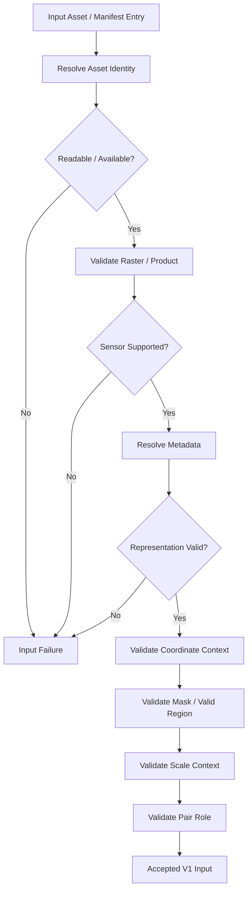
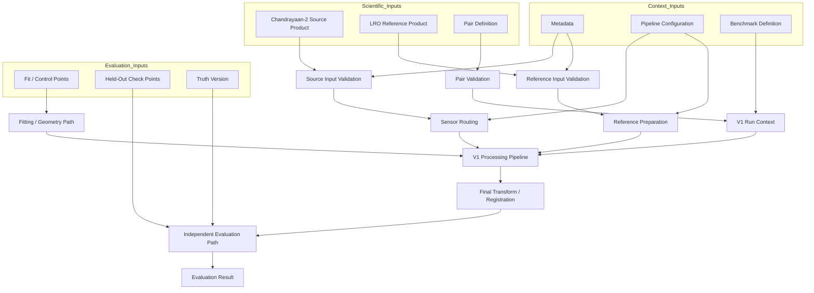

# V1 Inputs

> **ChandraMap V1 — Authoritative Input Contract**
> **Version role:** Classical baseline / registration foundation
> **Primary task:** Known-overlap local lunar image registration

ChandraMap V1 consumes scientifically identified source and reference data together with the metadata, coordinate context, physical-scale information, configuration, benchmark context, provenance, and—where available—independent evaluation truth required to interpret a registration run correctly.

An image file by itself is not a complete scientific input. Two raster files may contain valid pixel arrays while still being unusable for reproducible registration if their sensor identities, coordinate spaces, physical sampling, processing states, or lineage are unknown.

> **V1 consumes scientifically identified source and reference assets, not anonymous images: sensor identity, scale, coordinate context, and provenance are part of the input contract.**

V1 operates primarily on **known-overlap source/reference pairs**. The source asset is the observation or derived representation that ChandraMap attempts to align. The reference asset defines the target image or coordinate frame. These roles are explicit and must remain explicit throughout the run.

Evaluation truth is a separate input class. Held-out check points, benchmark truth, and success criteria are not ordinary matcher inputs and must not be silently allowed to influence transformation fitting.

> **Ground truth is evaluation input, not matcher input.**

This document defines the scientific meaning and validation rules of V1 inputs. It does not define the execution order of the pipeline, module architecture, benchmark results, mission-data download procedures, or output schemas.

## Relationship to Other V1 Documents

The V1 documentation set separates responsibilities:

| Document                               | Responsibility                                                                                   |
| -------------------------------------- | ------------------------------------------------------------------------------------------------ |
| [`README.md`](README.md)               | High-level V1 overview and navigation                                                            |
| [`scope.md`](scope.md)                 | Defines what belongs inside and outside V1                                                       |
| [`specification.md`](specification.md) | Defines normative V1 scientific and engineering behavior                                         |
| [`requirements.md`](requirements.md)   | Defines verifiable V1 requirements                                                               |
| [`architecture.md`](architecture.md)   | Defines V1 components, layers, and responsibilities                                              |
| [`pipeline.md`](pipeline.md)           | Defines the ordered execution of a V1 run                                                        |
| **`inputs.md`**                        | Defines the data, metadata, truth, configuration, and provenance allowed to enter that execution |

The distinction is important:

- `pipeline.md` describes **when** an input is consumed.
- `inputs.md` describes **what the input means**, what context must accompany it, and how it is validated.

## Relationship to Dataset Documentation

Project-wide dataset documentation governs data acquisition, organization, preparation, formatting, metadata, pair definitions, and ground-truth preparation.

Relevant project-wide documentation includes:

- `../../datasets/README.md`
- `../../datasets/chandrayaan-2.md`
- `../../datasets/lro.md`
- `../../datasets/metadata.md`
- `../../datasets/data-format.md`
- `../../datasets/dataset-structure.md`
- `../../datasets/dataset-preparation.md`
- `../../datasets/pair-definition.md`
- `../../datasets/ground-truth-preparation.md`

The distinction is:

> **Dataset documentation defines project-wide data governance and preparation. This document defines which prepared, raw, derived, truth, configuration, and provenance inputs V1 is allowed or required to consume.**

This file must not silently redefine project-wide dataset semantics.

---

## 1. Inputs at a Glance

| Input                     | Classification                               | Used By                           | Purpose                                                         |
| ------------------------- | -------------------------------------------- | --------------------------------- | --------------------------------------------------------------- |
| Source asset              | Required                                     | Processing pipeline               | Lunar observation or representation being registered            |
| Reference asset           | Required                                     | Processing pipeline               | Target image/reference coordinate frame                         |
| Pair definition           | Required                                     | Run initialization                | Defines the controlled source/reference relationship            |
| Sensor identity           | Required                                     | Routing/preprocessing             | Determines source-specific handling                             |
| Product/asset identity    | Required for formal benchmark                | Provenance/reproducibility        | Identifies scientific data independently of local path          |
| Processing state          | Required/Recommended                         | Input interpretation              | Distinguishes raw, prepared, derived, tiled, projected, etc.    |
| GSD/effective scale       | Conditional / required for scale-aware paths | Scale handling                    | Supports physically meaningful reference selection              |
| Coordinate-space context  | Required                                     | Geometry/evaluation               | Defines meaning of spatial coordinates                          |
| Projection context        | Conditional                                  | Geospatial processing/evaluation  | Supports map/geographic interpretation                          |
| Valid-data mask           | Conditional                                  | Preprocessing/matching/evaluation | Excludes invalid or unusable pixels                             |
| IIRS 2D representation    | Conditional                                  | IIRS route                        | Converts hyperspectral product to registration-friendly 2D data |
| Pair truth/control points | Optional/benchmark-defined                   | Geometry/evaluation               | Benchmark-defined correspondence information                    |
| Held-out check points     | Evaluation-only                              | Evaluator                         | Independent registration accuracy                               |
| Benchmark definition      | Required for formal benchmark                | Benchmark runner                  | Freezes benchmark identity and conditions                       |
| Run configuration         | Required                                     | Processing pipeline               | Defines resolved scientific behavior                            |
| Code/data provenance      | Required for formal benchmark                | Result/provenance                 | Recreates and audits the run                                    |
| Random seed/state         | Conditional                                  | Stochastic stages                 | Supports reproducibility where randomness exists                |

---

## 2. Input Classification Model

V1 uses explicit input classifications.

### Required

The V1 core task cannot execute scientifically without this input.

Examples include:

- source asset;
- reference asset;
- source/reference role;
- pair relationship;
- supported sensor identity;
- sufficient coordinate context.

### Required for Formal Benchmark

An exploratory local run may technically execute without the item, but a formal benchmark run requires it for reproducibility or controlled comparison.

Examples may include:

- benchmark version;
- frozen configuration;
- product/asset identity;
- code revision;
- truth version where truth is part of the benchmark.

### Conditional

Required only when a particular sensor, path, metric, or capability uses it.

Examples:

- IIRS-derived 2D representation;
- projection metadata for geospatial error;
- pyramid metadata when a pyramid representation is used;
- mask input when validity information is external;
- physical-scale metadata for configured scale-aware matching.

### Optional

May improve diagnostics or analysis but is not universally required.

Examples may include:

- illumination metadata;
- viewing geometry;
- additional descriptive acquisition context.

### Evaluation-Only

Consumed by the evaluation path rather than by transformation fitting.

Examples:

- held-out check points;
- independent truth coordinates;
- evaluation truth version.

### Reproducibility-Only

Used to identify and reconstruct the run rather than directly participate in image registration.

Examples:

- code revision;
- benchmark revision;
- environment description;
- data checksum where used.

### Derived

Generated from another scientific asset and required to preserve parent lineage.

Examples:

- IIRS registration representation;
- NAC crop;
- reference tile;
- reference pyramid level;
- normalized source representation.

These classifications describe scientific roles. They do not imply whether a feature is currently implemented.

---

## 3. Top-Level V1 Input Groups

V1 inputs are organized conceptually into the following groups:

1. Source image/product input
2. Reference image/product input
3. Pair-definition input
4. Scientific metadata input
5. Sensor-specific representation input
6. Validity/mask input
7. Coordinate/projection context
8. Scale/GSD context
9. Ground-truth/control/check-point input
10. Benchmark definition/context
11. Pipeline configuration
12. Reproducibility/environment context

> **Raw mission data, prepared data, derived representations, benchmark definitions, and evaluation truth are different input classes.**

They must not be collapsed into one undifferentiated "dataset" concept.

---

## 4. Core Input Principles

### Scientific Identity Is More Than a File

> **A V1 input is not just an image file; it is an image or derived representation together with enough identity, sensor, scale, coordinate, and provenance context to interpret it scientifically.**

### Local Paths Are Not Scientific Identities

> **Local file paths are locations, not scientific identities.**

A path such as:

```text
/home/user/moon/image.tif
```

may tell software where a file exists on one computer. It does not establish what observation the file represents.

Scientific identity should instead be traceable through concepts such as:

- mission;
- instrument;
- product or observation identity;
- project asset identity;
- product version;
- provider/source;
- parent-derived lineage;
- checksum where applicable.

### Source and Reference Are Explicit Roles

> **Source and reference are explicit roles.**

The pipeline must know:

- which asset is being transformed;
- which asset defines the target reference frame.

Scientific records should not reduce this distinction to anonymous labels such as `image_a` and `image_b` without role semantics.

### Product Metadata Wins

> **Product metadata wins over approximate summary values.**

Approximate sensor values in project documentation are useful for describing likely scale relationships. They must never override authoritative product-level metadata.

### Missing Required Context Is Not Invented

> **V1 should reject missing scientific context when that context is required for a requested operation rather than silently inventing it.**

For example, if scale-aware reference selection requires physical sampling information, V1 must not fabricate a GSD merely to continue.

### Validate Before Processing

> **Input validation happens before scientific processing.**

Unreadable, corrupt, unsupported, or scientifically ambiguous inputs should fail before expensive image processing begins.

### Logical Identity Must Survive Relocation

> **The same logical input should remain identifiable across different machines and directory layouts.**

Moving a dataset from one disk or project directory to another must not create a new scientific identity by itself.

---

# 5. Source Input

The **source** is the lunar observation or derived registration representation that ChandraMap intends to align to the reference.

The source role must be explicit.

Potential V1 source families include:

- Chandrayaan-2 OHRC;
- Chandrayaan-2 TMC-2;
- Chandrayaan-2 IIRS-derived 2D representations where permitted by V1 scope.

A source input should conceptually preserve:

- role;
- mission;
- instrument;
- product identity;
- project asset identity where used;
- processing state;
- representation identity;
- raster dimensions;
- numerical/raster interpretation;
- coordinate space;
- validity information;
- physical scale/GSD where available or required;
- projection context where applicable;
- parent lineage where derived;
- provenance.

The source does not need to be the raw mission product used directly by SIFT. It may be a prepared or derived representation as long as the lineage to the original scientific product remains traceable.

---

## 6. Reference Input

The **reference** is the image, product, tile, region, or prepared representation whose coordinate frame is the target of V1 local registration.

Potential references include:

- LRO NAC;
- LRO WAC where explicitly permitted by V1 scope or benchmark definition.

Reference context may conceptually include:

- role;
- mission;
- instrument;
- product or asset identity;
- product version;
- processing state;
- parent mosaic/product where applicable;
- tile or ROI identity;
- crop context;
- coordinate/projection context;
- effective scale/GSD;
- dimensions;
- validity mask;
- pyramid level where applicable;
- mapping back to parent reference coordinates;
- provenance.

### Source vs. Reference

The scientific distinction is:

| Role      | Meaning                                                 |
| --------- | ------------------------------------------------------- |
| Source    | Observation/representation being transformed or aligned |
| Reference | Observation/representation defining the target frame    |

Transform direction should normally remain consistent with the V1 convention documented elsewhere, typically source → reference.

---

## 7. Known-Pair Input

V1 is built around **known-overlap local registration**.

See `../../datasets/pair-definition.md`.

A V1 run therefore requires an explicit source/reference pair definition or an equivalent controlled relationship.

Conceptually, the pair may identify:

- pair ID;
- pair version;
- source asset ID;
- reference asset ID;
- expected overlap relationship;
- task type;
- benchmark category;
- associated truth-set reference;
- pair-specific scientific notes where applicable.

The exact pair schema is implementation-defined.

> **V1 does not require rediscovering a reference region that the benchmark already defines.**

A global retrieval system should not be inserted merely to locate a reference that the V1 pair definition already supplies.

### Conceptual Pair Definition

> **Illustrative conceptual structure — not an implemented schema.**

```yaml
pair:
  id: PLACEHOLDER_PAIR_ID
  version: PLACEHOLDER_VERSION

  source:
    asset_id: PLACEHOLDER_SOURCE_ASSET

  reference:
    asset_id: PLACEHOLDER_REFERENCE_ASSET

  task: local_registration

  overlap:
    status: PLACEHOLDER_KNOWN_OVERLAP_STATUS

  truth:
    point_set_id: PLACEHOLDER_TRUTH_SET
```

---

# 8. Chandrayaan-2 Source Inputs

## 8.1 OHRC

**Instrument:** Orbiter High Resolution Camera
**Mission:** Chandrayaan-2
**General type:** Visible/panchromatic high-resolution imagery

Current project context commonly describes OHRC at approximately:

**~0.25–0.32 m/pixel**

depending on product and documentation.

These values are contextual only.

> **Actual product metadata wins.**

Potential OHRC input context includes:

- source product identity;
- provider/source identity;
- processing state;
- raster dimensions;
- data representation;
- valid-data region;
- GSD/effective sampling;
- coordinate context;
- map projection where available;
- acquisition metadata where scientifically useful;
- parent-derived lineage if prepared.

V1 must not assume every OHRC product has identical:

- GSD;
- dimensions;
- projection;
- processing level;
- radiometric characteristics.

---

## 8.2 TMC-2

**Instrument:** Terrain Mapping Camera-2
**Mission:** Chandrayaan-2
**General type:** Panchromatic terrain imagery

Current project context commonly uses approximately:

**~5 m/pixel**

for TMC-2.

The product-specific metadata remains authoritative.

Potential TMC-2 input context includes:

- product identity;
- provider/source;
- processing state;
- dimensions;
- valid-data region;
- physical sampling;
- projection or map context where available;
- representation identity;
- parent lineage where derived.

### TMC-2 Imagery Is Not Automatically a DEM

TMC-2 imagery may contribute to terrain mapping and stereo-derived products, but V1 must not assume that every TMC-2 image product includes elevation data.

The input contract distinguishes:

- TMC-2 imagery;
- stereo or terrain-derived products;
- DEM/elevation data.

A DEM is not a mandatory V1 input.

---

## 8.3 IIRS

**Instrument:** Imaging Infrared Spectrometer
**Mission:** Chandrayaan-2
**General type:** Hyperspectral / imaging infrared data

Current project context commonly describes IIRS approximately as:

- spatial sampling around **~80 m/pixel**;
- spectral range around **~0.8–5.0 µm**;
- roughly **~250–256 bands**, depending on product/documentation.

Actual product documentation and metadata remain authoritative.

> **IIRS is not an ordinary grayscale camera input.**

A parent IIRS input may be a hyperspectral cube or another multi-band product.

The ordinary 2D V1 local-registration pipeline should receive a documented **2D registration representation**, not an unexplained hyperspectral tensor treated as a grayscale image.

---

# 9. IIRS Input Contract

IIRS requires dedicated input semantics.

Conceptual flow:

```text
IIRS Parent Product
        ↓
Validate Spectral + Spatial Metadata
        ↓
Select / Derive Registration Representation
        ↓
Produce 2D Registration-Friendly Raster
        ↓
Preserve Parent → Derived Lineage
        ↓
Enter V1 Local Registration
```

Potential representation categories may include:

- selected spectral band;
- projection across a selected spectral range;
- PCA-derived component;
- composite representation;
- structure-focused representation.

This document does not prescribe one universal IIRS representation.

The selected method must be:

- documented;
- reproducible;
- traceable to the parent product;
- scientifically interpretable;
- suitable for the V1 2D matching path.

## 9.1 IIRS Required Provenance

A derived IIRS registration input should conceptually preserve:

- parent mission;
- parent instrument;
- parent product identity;
- project asset identity where used;
- representation-generation method;
- selected band/component/range where applicable;
- derivation parameters;
- output dimensions;
- output coordinate space;
- parent→derived coordinate mapping;
- effective spatial sampling;
- derivation/version information.

An anonymous filename such as:

```text
iirs.png
```

is not sufficient scientific provenance.

## 9.2 Conceptual IIRS Input

> **Illustrative conceptual input structure — not an implemented schema.**

```yaml
source:
  mission: Chandrayaan-2
  instrument: IIRS

  parent_product:
    product_id: PLACEHOLDER_PRODUCT_ID
    asset_id: PLACEHOLDER_ASSET_ID

  registration_representation:
    asset_id: PLACEHOLDER_DERIVED_ASSET
    method: PLACEHOLDER_METHOD
    parameters: PLACEHOLDER_PARAMETERS
    coordinate_space: PLACEHOLDER_SPACE
    gsd: PLACEHOLDER_OR_METADATA_DERIVED
```

---

# 10. LRO Reference Inputs

## 10.1 LRO NAC

**Instrument:** LROC Narrow Angle Camera
**Mission:** Lunar Reconnaissance Orbiter
**V1 role:** Fine lunar reference imagery

Current ChandraMap project context commonly treats NAC products as being roughly:

**~0.5–2 m/pixel**

depending on product and acquisition geometry.

This is contextual, not a fixed product-level input constant.

> **Actual metadata wins.**

Potential NAC input context includes:

- product ID;
- product version;
- processing state;
- parent product or mosaic where applicable;
- ROI/tile identity;
- projection;
- coordinate-space context;
- GSD/effective sampling;
- raster dimensions;
- valid-data mask;
- pyramid availability;
- lineage for any prepared representations.

---

## 10.2 Full-Resolution NAC Is Not Always the Matching Input

A Chandrayaan-2 source may contain much coarser physical information than the finest available NAC representation.

Therefore:

```text
Fine NAC Product
      ↓
Parent Reference
      ↓
Reference Pyramid / Downsampled Representation
      ↓
Comparable Matching Representation
```

The fine NAC product may remain the scientific parent reference while the actual local matcher consumes a coarser pyramid level.

Where present, scale-handling behavior is documented in:

`../../algorithms/scale-pyramid.md`

> Matching against a derived NAC pyramid level does not change the identity of the underlying lunar reference product.

---

## 10.3 LRO WAC

**Instrument:** LROC Wide Angle Camera
**Mission:** Lunar Reconnaissance Orbiter
**Potential role:** Broad/coarser lunar reference or contextual reference

WAC use in V1 is conditional on actual scope, pair definition, and benchmark requirements.

Its product/mode characteristics vary.

This input contract does not assign one universal WAC GSD.

If WAC is used, its product-specific scale, projection, processing state, and role must be explicit.

---

# 11. Reference Tile / ROI Input

A V1 run may use a prepared reference tile or region of interest rather than a complete parent product.

A tile/ROI should preserve:

- tile identity;
- parent reference identity;
- crop/tile bounds;
- local dimensions;
- local coordinate space;
- local→parent coordinate mapping;
- projection where applicable;
- effective GSD;
- validity mask;
- preparation provenance.

> A tile is a derived view of a parent scientific reference, not an unrelated independent image.

Discarding tile offsets or parent identity makes it difficult or impossible to map correspondences back to the parent reference correctly.

---

# 12. Reference Pyramid Input

A V1 run may:

- consume a precomputed reference pyramid; or
- construct/access one during execution.

If a particular pyramid level enters matching, the representation should preserve:

- parent reference asset;
- pyramid level;
- dimensions;
- effective scale/GSD;
- local coordinate space;
- transform/mapping back to parent coordinates;
- resampling/preparation provenance.

> **A reference pyramid changes the sampling representation, not the identity of the lunar reference product.**

A point expressed in pyramid-level coordinates must not be treated as native reference coordinates without the appropriate mapping.

---

# 13. Processing-State Requirements

V1 may encounter assets in different processing states, including:

- raw/native mission product;
- calibrated product;
- map-projected product;
- validated/prepared raster;
- normalized representation;
- derived representation;
- crop/ROI;
- tile;
- pyramid level.

The input contract does not assume one universal mission-processing level.

Every input must identify its processing state sufficiently for:

- correct interpretation;
- reproducibility;
- coordinate mapping;
- provenance.

---

# 14. Raw vs. Prepared vs. Derived Inputs

| Input Class     | Meaning                                                      | Example Role                                |
| --------------- | ------------------------------------------------------------ | ------------------------------------------- |
| Raw / Original  | Provider mission product as obtained                         | Immutable provenance source                 |
| Prepared        | Validated/standardized representation for runtime processing | Source/reference preprocessing              |
| Derived         | New representation generated from a parent                   | IIRS 2D representation, crop, pyramid level |
| Benchmark Asset | Frozen scientific input selected for benchmark use           | Formal V1 source/reference                  |
| Truth Asset     | Independent scientific information used for evaluation       | Held-out check points                       |

These classes should not be silently mixed.

For example:

```text
Raw IIRS Product
      ↓
Prepared IIRS Product
      ↓
Derived 2D Registration Representation
```

represents three different scientific states even when all belong to the same observation lineage.

Raw mission products should not be modified in place.

---

# 15. Data Format Inputs

See `../../datasets/data-format.md`.

V1 must not assume that:

- all Chandrayaan-2 products are GeoTIFF;
- all LRO products are GeoTIFF;
- all products are PNG/JPEG;
- all products use one native scientific format;
- all prepared inputs use the same file extension.

Native mission format and internal prepared representation are distinct concepts.

V1 should consume assets only through readers or prepared representations supported by the repository implementation.

The input contract defines scientific semantics, not a universal file-format promise.

---

# 16. Raster Value Requirements

Raster validation should consider, where applicable:

- numeric data type;
- finite values;
- nodata interpretation;
- valid ranges where authoritative metadata defines them;
- dimensions;
- number of channels/bands;
- mask compatibility;
- consistency between raster representation and metadata.

V1 does not define universal sensor-specific radiometric ranges in this document.

A raster can be structurally readable while still being scientifically unusable.

---

# 17. Masks and Valid Regions

Masks may identify:

- nodata;
- invalid borders;
- missing pixels;
- padding;
- unusable acquisition regions;
- preprocessing exclusions;
- invalid projected regions.

A mask may be:

- embedded in the raster/product representation; or
- supplied as a separate aligned asset.

The mask must remain spatially aligned with the exact raster representation it describes.

> **Invalid pixels should not silently participate in feature extraction, matching, or evaluation.**

Mask dimensions and coordinate mappings must remain compatible with the corresponding raster.

---

# 18. Coordinate-Space Input

Coordinate space is part of every spatial input contract.

Potential spaces include:

- source-native pixels;
- source-prepared pixels;
- source crop/ROI pixels;
- IIRS-derived representation pixels;
- reference-native pixels;
- reference tile pixels;
- reference pyramid pixels;
- map/projected coordinates;
- lunar geographic coordinates where valid.

> **Pixel coordinates from different representations are not automatically interchangeable.**

A coordinate such as:

```text
(x = 120.4, y = 355.7)
```

is scientifically incomplete unless the representation and coordinate space are known.

---

## 18.1 X/Y vs. Row/Column

Image arrays commonly use:

```text
row, column
```

while geometric image coordinates often use:

```text
x, y
```

These conventions are related but not interchangeable without an explicit definition.

The input contract must document or preserve the convention used.

Do not silently interpret:

```text
(row, column)
```

as:

```text
(x, y)
```

or vice versa.

---

## 18.2 Pixel Origin and Pixel Center

High-precision correspondence and evaluation may depend on coordinate convention.

Possible conventions include:

- zero-based indexing;
- one-based external annotation;
- pixel-center coordinates;
- pixel-corner coordinates.

V1 does not prescribe a universal convention here unless another authoritative repository document does so.

It requires that the convention be **consistent and documented**.

---

# 19. Crop / ROI Context

If an input is cropped, preserve:

- parent asset;
- crop bounds;
- local dimensions;
- local coordinate system;
- local→parent coordinate mapping.

Conceptually:

```text
Parent Asset
    ↓
Crop Bounds
    ↓
Local Raster
    ↓
Local Coordinates
    ↓
Mapping Back to Parent
```

Without crop context, local correspondences cannot reliably be converted back to parent-image coordinates.

---

# 20. Tile Context

A reference tile should retain:

- tile identity;
- parent reference identity;
- tile bounds or index;
- local coordinates;
- parent-coordinate mapping;
- scale;
- projection context where applicable;
- preparation provenance.

Tile identity should not depend solely on an arbitrary local filename.

---

# 21. Pyramid Context

For a pyramid-level representation, preserve:

- parent asset;
- level identity;
- level dimensions;
- scale relation to parent;
- coordinate mapping;
- resampling provenance;
- effective GSD.

A point at:

```text
reference pyramid level N
```

must not be interpreted as:

```text
native/reference level 0
```

coordinates.

---

# 22. Projection Input

Where imagery is map-projected, preserve enough context to interpret projected coordinates scientifically.

Potential information may include:

- projection identity;
- lunar body/reference context;
- coordinate units;
- map/geotransform information;
- extent;
- pixel-to-map transformation.

V1 does not impose one universal lunar projection.

> Projection metadata is conditional: it is required when the requested operation or output depends on projected/geographic interpretation.

---

# 23. Unprojected Input

V1 must not assume that every source or reference product is already map-projected.

Unprojected imagery may still support local image registration in pixel space.

However, if projection/geospatial context is unavailable:

- absolute geographic coordinates may be unavailable;
- metre-based ground error may be unavailable;
- absolute lunar geolocation claims may be invalid.

Local registration and absolute geolocation are different scientific claims.

---

# 24. GSD / Physical Scale Input

Ground Sampling Distance or another valid physical sampling description is important for cross-resolution registration.

Potential sources include:

- product-specific metadata;
- authoritative provider metadata;
- documented prepared-product metadata;
- a benchmark-defined alternative scale relationship.

> **GSD is scientific context; image width and height are not substitutes for physical sampling information.**

Two images with identical raster dimensions may represent completely different physical areas and sampling scales.

Conversely, images with different dimensions may still represent comparable physical information.

---

## 24.1 Missing GSD

If physical scale is required by the configured scale-selection path and no valid scale information exists, V1 should:

- report the limitation;
- require an explicit scientifically validated alternative scale relation; or
- stop the scale-dependent path.

V1 must not silently invent a GSD.

Not every missing-GSD case necessarily causes complete input failure. A benchmark may provide another scientifically valid and documented scale relationship.

---

## 24.2 Approximate Sensor Values

Approximate project context:

| Sensor              | Approximate Context                               |
| ------------------- | ------------------------------------------------- |
| Chandrayaan-2 OHRC  | ~0.25–0.32 m/pixel                                |
| Chandrayaan-2 TMC-2 | ~5 m/pixel                                        |
| Chandrayaan-2 IIRS  | ~80 m/pixel                                       |
| LRO NAC             | Often roughly ~0.5–2 m/pixel depending on product |

These values provide context only.

They are **not fixed product-level constants**.

No universal WAC GSD is defined by this V1 input contract.

---

# 25. Metadata Input Contract

See `../../datasets/metadata.md`.

Not every metadata field is mandatory for every run.

| Metadata Field            | Classification                               | Why It Matters                        |
| ------------------------- | -------------------------------------------- | ------------------------------------- |
| Mission                   | Required/Recommended                         | Scientific identity and provenance    |
| Instrument                | Required                                     | Sensor routing and interpretation     |
| Product/asset ID          | Required for formal runs                     | Reproducibility and stable identity   |
| Dimensions                | Required                                     | Raster validation                     |
| Processing state          | Required/Recommended                         | Correct scientific interpretation     |
| Representation identity   | Required for prepared/derived assets         | Defines what is actually matched      |
| GSD/effective scale       | Conditional / required for scale-aware path  | Physical-scale handling               |
| Projection                | Conditional                                  | Map/geographic interpretation         |
| Coordinate space          | Required                                     | Point and transform interpretation    |
| Acquisition context       | Optional/Conditional                         | Diagnostics and stress categorization |
| Sun/illumination geometry | Optional/Conditional                         | Illumination analysis                 |
| Viewing geometry          | Optional/Conditional                         | Geometry diagnostics                  |
| Parent asset              | Required for derived inputs                  | Lineage                               |
| Pyramid level             | Conditional                                  | Reference coordinate mapping          |
| Crop/tile context         | Conditional                                  | Parent coordinate recovery            |
| Mask identity             | Conditional                                  | Validity handling                     |
| Provider/source           | Recommended / required for formal provenance | External-data traceability            |

---

# 26. Acquisition and Illumination Metadata

Where available, useful acquisition metadata may include:

- acquisition time;
- illumination geometry;
- Sun-angle information;
- viewing geometry;
- observation context.

These inputs may support:

- diagnostics;
- benchmark categories;
- stress-test analysis;
- illumination experiments;
- interpretation of failure modes.

However, V1 should not fail every local-registration run merely because optional illumination metadata is unavailable.

Requiredness depends on the configured scientific operation.

---

# 27. Representation Identity

Every prepared input should identify **what representation is actually being matched**.

Examples conceptually include:

- OHRC intensity representation;
- OHRC structural representation;
- TMC-2 prepared panchromatic raster;
- IIRS PCA-derived component;
- IIRS selected-band representation;
- NAC native reference;
- NAC tile;
- NAC pyramid level.

Representation identity matters because one parent product may generate multiple valid scientific representations.

For example:

```text
One IIRS Parent Cube
        ├── Representation A
        ├── Representation B
        └── Representation C
```

These representations should not all share an indistinguishable derived-asset identity.

---

# 28. Pipeline Configuration Input

A V1 run requires a resolved scientific configuration or equivalent documented settings.

Configuration may control:

- preprocessing;
- validity handling;
- illumination/structural preparation;
- scale strategy;
- SIFT behavior;
- descriptor matching;
- match filtering;
- RANSAC;
- transform model;
- optional sub-pixel refinement;
- registration/warp behavior;
- evaluation;
- artifact generation;
- output behavior.

This document does not define actual configuration keys.

> **A formal V1 input is the resolved configuration actually used, not merely the name of a default config file.**

If settings can be overridden through:

- CLI arguments;
- environment;
- runtime parameters;
- code;
- experiment wrappers;

then the final resolved scientific values affecting the run should remain traceable.

---

# 29. Benchmark Input

See `../../evaluation/benchmark-protocol.md`.

For a formal benchmark, benchmark context may provide:

- benchmark version;
- pair list;
- benchmark categories;
- truth version;
- metric definitions;
- success criteria;
- frozen configuration;
- controlled stress conditions.

The benchmark definition is an execution input, but it is not image content.

Conceptually:

```text
Scientific Assets
      +
Pair Definition
      +
Benchmark Definition
      ↓
Controlled V1 Run
```

---

# 30. Ground-Truth Input

See:

- `../../evaluation/ground-truth.md`
- `../../datasets/ground-truth-preparation.md`

Ground truth is independently established information used to evaluate or constrain a benchmark according to its declared protocol.

It may include:

- manually reviewed correspondences;
- trusted registration points;
- synthetic known truth;
- geospatial truth where scientifically valid.

> **RANSAC inliers are not ground truth.**

RANSAC operates on algorithm-generated candidate correspondences and identifies a model-consistent subset. That is not equivalent to independent truth.

---

# 31. Fit / Control Point Input

See `../../evaluation/control-points.md`.

Where a benchmark explicitly supplies control or fit points, preserve conceptually:

- point ID;
- role;
- source coordinate;
- reference coordinate;
- source coordinate space;
- reference coordinate space;
- truth/control version;
- uncertainty where available.

Control/fit points may influence transformation estimation only when the benchmark defines that role.

---

# 32. Held-Out Check-Point Input

See `../../evaluation/checkpoint-evaluation.md`.

Held-out check points are **evaluation-only** inputs.

They exist to measure how well the final transformation performs on data that did not participate in fitting.

> **Check-point input belongs to the evaluation branch, not the registration-fitting branch.**

A check point used to estimate the final transformation is no longer an independent held-out check point for that run.

---

# 33. Control / Check Separation

| Point Input                | May Fit Transform?                                | May Evaluate Independently?                     |
| -------------------------- | ------------------------------------------------- | ----------------------------------------------- |
| Algorithm candidate match  | No, until geometrically verified/accepted for fit | No                                              |
| RANSAC verified fit inlier | Yes                                               | Not independently for the same fitted transform |
| Prepared control/fit point | Yes, if benchmark defines that role               | No if used in fitting                           |
| Held-out check point       | No                                                | Yes                                             |
| Synthetic known truth      | Depends on benchmark role                         | Yes when held out from fitting                  |

This separation must remain explicit in formal benchmark inputs.

---

# 34. Spatial-Coverage Input

See `../../evaluation/spatial-coverage.md`.

Coverage evaluation may require:

- defined point population;
- valid-region mask;
- coordinate space;
- overlap/image bounds;
- coverage method/configuration.

The coverage metric is an evaluation output.

Coverage configuration and the spatial region against which it is measured are inputs to the coverage evaluator.

Coverage values themselves are not matcher inputs.

---

# 35. Success-Criteria Input

See `../../evaluation/success-criteria.md`.

Formal benchmark interpretation may use a versioned success-criteria definition.

Success criteria may define how evidence such as:

- geometry status;
- spatial coverage;
- held-out error;
- failure status;
- benchmark metrics;

is interpreted.

Success thresholds do not belong inside source/reference asset records.

---

# 36. Stress-Test Input

See `../../evaluation/stress-tests.md`.

A stress-test run may add controlled scientific context such as:

- stress category;
- perturbation/condition identity;
- synthetic transformation;
- random seed;
- parent asset identity;
- stress-generation parameters.

A stressed image remains a derived asset and must preserve lineage back to its parent.

---

# 37. Synthetic Inputs

Synthetic data may support tests involving:

- translation;
- rotation;
- scale;
- affine transformation;
- projective transformation;
- controlled appearance perturbation.

A synthetic derived input should preserve:

- parent asset;
- transformation/perturbation definition;
- parameters;
- random seed where relevant;
- known truth;
- coordinate mapping.

A simple brightness or contrast adjustment should not be described as a physically complete Sun-angle simulation.

Synthetic tests support controlled verification but do not replace real lunar-data evaluation.

---

# 38. File Path Input

Local paths may be required operationally.

Conceptually:

```yaml
asset_id: PLACEHOLDER_ASSET
path: PLACEHOLDER_LOCAL_OR_RELATIVE_PATH
```

The path answers:

> Where can this machine find the file?

The asset identity answers:

> What scientific data is this?

Changing the path should not require changing the scientific identity.

---

# 39. Checksum Input

Checksums may be used to verify exact file identity and detect unintended data changes.

Checksums can complement:

- mission/product identity;
- asset metadata;
- benchmark manifests;
- versioned prepared assets.

V1 does not mandate one hashing algorithm unless repository policy defines it.

A checksum is useful evidence of byte-level identity but does not replace scientific metadata.

---

# 40. External Mission Data Input

Large mission products may be stored outside the Git repository.

V1 should be able to identify and resolve them using repository-defined mechanisms such as:

- configurable data roots;
- manifests;
- product IDs;
- asset IDs;
- metadata records;
- externally managed data locations.

Exact mechanisms are implementation-defined.

> Large lunar mission products do not need to be committed to Git to remain reproducible scientific inputs.

The repository should preserve enough metadata to identify or reacquire/reconstruct the expected asset where licensing and provider infrastructure permit.

---

# 41. Data-License Input Constraints

See `../../data-licenses.md`.

Input provenance should preserve:

- provider/source;
- external dataset identity;
- applicable preparation lineage;
- redistribution considerations where relevant.

Publicly accessible scientific data must not automatically be assumed to permit unrestricted redistribution in every form.

Repository data organization should respect upstream terms and project licensing policy.

---

# 42. Input Configuration Security

Where present, repository security guidance should be followed through:

[`../../../SECURITY.md`](../../../SECURITY.md)

Scientific input manifests and benchmark configuration must not require committing:

- passwords;
- API keys;
- access tokens;
- private credentials;
- secret archive credentials.

> **Secrets are not scientific reproducibility inputs.**

Where credentials are operationally required to access an external system, they should remain separate from shareable scientific manifests.

---

# 43. Environment Variables

Environment variables may provide operational context such as:

- data locations;
- runtime configuration;
- external archive settings;
- infrastructure-specific paths.

The exact environment variable names are implementation-defined.

Environment variables containing secret values must not be persisted as scientific benchmark artifacts.

Scientific settings that affect results should be captured through safe, resolved run configuration rather than depending only on undocumented environment state.

---

# 44. Input Validation Pipeline

Input validation occurs before scientific image processing.

Conceptual sequence:

```text
Input Reference
      ↓
Resolve Asset
      ↓
Validate File / Product
      ↓
Validate Metadata
      ↓
Validate Sensor Support
      ↓
Validate Representation
      ↓
Validate Coordinate Context
      ↓
Validate Mask
      ↓
Validate Scale Context
      ↓
Validate Pair Roles
      ↓
Accepted V1 Input
```

Validation should distinguish:

- fatal scientific input failures;
- unsupported capabilities;
- missing optional context;
- reduced-evaluation capability.

---

## 44.1 Input Validation Flow



---

# 45. Full V1 Input Flow



Held-out check points flow only into the independent evaluation branch. They must not leak into final transform fitting.

---

# 46. Required vs. Optional Input Matrix

| Input                    | Core Run                             | Formal Benchmark                                   | Condition                    |
| ------------------------ | ------------------------------------ | -------------------------------------------------- | ---------------------------- |
| Source asset             | Required                             | Required                                           | Always                       |
| Reference asset          | Required                             | Required                                           | Always                       |
| Pair definition          | Required                             | Required                                           | Known-pair V1                |
| Source/reference role    | Required                             | Required                                           | Always                       |
| Sensor identity          | Required                             | Required                                           | Always                       |
| Product/asset ID         | Strongly recommended                 | Required                                           | Reproducibility              |
| Processing state         | Required/Recommended                 | Required                                           | Scientific interpretation    |
| Representation identity  | Required for prepared/derived assets | Required                                           | Reproducibility              |
| Coordinate-space context | Required                             | Required                                           | Always                       |
| GSD/effective scale      | Conditional                          | Required where scale-aware benchmark depends on it | Cross-resolution handling    |
| Projection metadata      | Conditional                          | Conditional                                        | Geospatial output/evaluation |
| Valid-data mask          | Conditional                          | Conditional                                        | Product-dependent            |
| Crop/tile mapping        | Conditional                          | Required if crop/tile enters benchmark             | Derived reference/source     |
| Pyramid mapping          | Conditional                          | Required if pyramid level enters benchmark         | Scale handling               |
| IIRS 2D representation   | Conditional                          | Conditional                                        | IIRS route                   |
| IIRS parent lineage      | Conditional                          | Required for formal IIRS benchmark                 | Derived IIRS input           |
| Fit/control truth        | Optional/Benchmark-defined           | Conditional                                        | Benchmark-dependent          |
| Held-out check truth     | Optional for exploratory run         | Required where independent accuracy is claimed     | Evaluation                   |
| Benchmark version        | Optional                             | Required                                           | Formal benchmark             |
| Frozen/resolved config   | Recommended                          | Required                                           | Formal benchmark             |
| Truth version            | Optional without truth               | Required where benchmark uses truth                | Evaluation                   |
| Code revision            | Recommended                          | Required                                           | Reproducibility              |
| Random seed/state        | Conditional                          | Required where applicable                          | Stochastic behavior          |
| Checksum                 | Optional                             | Benchmark/repository-defined                       | Exact file verification      |

---

# 47. Input Validation Table

| Validation                         | Applies To               | Failure / Response                              |
| ---------------------------------- | ------------------------ | ----------------------------------------------- |
| Asset available/readable           | Source/reference         | Stop affected input path                        |
| Non-empty dimensions               | Raster                   | Reject invalid asset                            |
| Usable valid pixels                | Raster                   | Reject or flag scientifically unusable input    |
| Supported sensor                   | Source/reference         | Reject or explicitly route if supported         |
| Supported representation           | Prepared/derived input   | Reject unsupported representation               |
| Required metadata present          | Metadata-dependent stage | Stop or reduce affected capability              |
| Coordinate context interpretable   | Spatial input            | Reject ambiguous geometry                       |
| Crop mapping valid                 | Cropped input            | Reject ambiguous derived input                  |
| Tile mapping valid                 | Reference tile           | Reject ambiguous geometry                       |
| Pyramid mapping valid              | Pyramid level            | Reject ambiguous scale/coordinates              |
| Mask dimensions compatible         | Raster + mask            | Reject invalid mask relationship                |
| Parent lineage present             | Derived asset            | Mark provenance incomplete or reject formal run |
| Pair roles valid                   | Pair definition          | Reject pair                                     |
| Truth roles valid                  | Evaluation input         | Reject invalid evaluation setup                 |
| Check points isolated from fitting | Evaluation data          | Reject invalid independent-evaluation setup     |
| Configuration resolvable           | Run configuration        | Reject formal run                               |
| Benchmark identity resolvable      | Formal benchmark         | Reject formal benchmark run                     |

No specific implementation error codes are defined here.

---

# 48. Input Failure vs. Evaluation Limitation

Not every missing input has the same scientific consequence.

| Condition                                                    | Interpretation                                                                     |
| ------------------------------------------------------------ | ---------------------------------------------------------------------------------- |
| Missing source raster                                        | Fatal input failure                                                                |
| Missing reference raster                                     | Fatal input failure                                                                |
| Corrupt/unreadable source                                    | Fatal input failure                                                                |
| Unsupported sensor                                           | Unsupported input failure                                                          |
| Invalid pair role                                            | Fatal pair-definition failure                                                      |
| Missing required GSD for configured physical-scale selection | Scale/input-context failure unless a validated alternative exists                  |
| Missing parent mapping for required pyramid input            | Geometry/input-context failure                                                     |
| Missing optional Sun-angle metadata                          | Reduced illumination diagnostics; registration may still proceed                   |
| Missing projection                                           | Local pixel registration may proceed; geospatial interpretation may be unavailable |
| Missing held-out check truth                                 | Registration may proceed; independent accuracy cannot be claimed                   |
| Missing optional checksum                                    | Reproducibility may be weaker; scientific execution need not necessarily fail      |
| Missing required benchmark config                            | Formal benchmark cannot proceed validly                                            |

This distinction prevents both over-strict and scientifically unsafe behavior.

---

# 49. Unsupported Input

Unsupported products must be reported explicitly.

V1 must not silently reinterpret:

- an unsupported hyperspectral cube;
- an unknown multi-band product;
- an unknown mission format;
- a product with ambiguous coordinate semantics;

as ordinary grayscale data merely to continue.

Unsupported input is different from a valid input that happens to produce poor matching performance.

---

# 50. Corrupt Input

A corrupt or unreadable asset should fail early.

The pipeline must not silently replace a corrupt input with:

- an empty array;
- zeros;
- fabricated image content;
- placeholder data.

A reproducible failure record is preferable to plausible-looking downstream output generated from invalid input.

---

# 51. Empty, Constant, or Low-Information Input

An asset can be technically readable yet scientifically unusable.

Potential validation may identify:

- zero valid pixels;
- empty valid region;
- constant image values;
- severely limited usable content.

No universal texture threshold is defined here.

Low-feature but valid terrain should not automatically be classified as corrupt input. It may instead become a legitimate difficult case that fails later during feature extraction or matching.

---

# 52. Dimensionality

V1 must not assume every data array is two-dimensional.

### 2D Inputs

Prepared optical or panchromatic source/reference representations may enter the local matching path.

### Hyperspectral Inputs

A full IIRS cube requires a representation stage before entering ordinary 2D SIFT matching.

> **A multi-dimensional scientific product must not be silently collapsed without a documented representation rule.**

---

# 53. Multi-Band Input

If a multi-band non-IIRS product appears in V1, the repository or configuration must define how it becomes the registration representation.

Do not silently select:

- the first channel;
- an arbitrary channel;
- an undocumented average;

unless that operation is explicitly defined.

Representation choice is part of scientific provenance.

---

# 54. Data Type and Numerical Precision

Input readers and preprocessing may convert:

- integer raster types;
- floating-point raster types;
- other supported numerical representations;

into the algorithm's internal working representation.

The conversion must preserve scientifically important behavior such as:

- nodata;
- mask semantics;
- useful numeric range;
- coordinate identity.

V1 does not claim one fixed internal dtype unless implementation documentation explicitly defines it.

---

# 55. Source / Reference Orientation

V1 must not assume source and reference images are already:

- north-up;
- identically rotated;
- identically projected;
- identically scaled;
- identically oriented.

The local correspondence and geometry stages exist partly because the two images may differ in these respects.

Metadata may provide orientation information, but orientation equality must not be assumed implicitly.

---

# 56. Input Scale Does Not Come from Upsampling

If a TMC-2 or IIRS representation is enlarged until it has the same raster width and height as NAC, its physical spatial information has not become equivalent to NAC.

Conceptually:

```text
80 m/pixel information
      ↓
Upsample
      ↓
More samples
      ≠
More captured lunar detail
```

The original/effective physical sampling context must remain attached to the representation.

> **Upsampling changes sampling density, not sensor-resolved information.**

---

# 57. Derived Input Lineage

Every derived scientific input should conceptually preserve:

```text
Parent
  ↓
Operation
  ↓
Parameters / Configuration
  ↓
Derived Asset Identity
```

Examples:

```text
NAC Product
    ↓
Crop
    ↓
Reference Tile
```

```text
NAC Tile
    ↓
Downsampling
    ↓
Pyramid Level
```

```text
IIRS Cube
    ↓
Representation Derivation
    ↓
2D Registration Raster
```

Derived inputs without parent lineage weaken reproducibility and should not be treated as equivalent to fully documented benchmark assets.

---

# 58. Conceptual Source Input Record

> **Illustrative conceptual structure — not an implemented schema.**

```yaml
source:
  asset_id: PLACEHOLDER_SOURCE_ASSET
  role: source

  mission: Chandrayaan-2
  instrument: PLACEHOLDER_INSTRUMENT
  product_id: PLACEHOLDER_PRODUCT_ID

  processing:
    state: PLACEHOLDER_PROCESSING_STATE
    representation: PLACEHOLDER_REPRESENTATION

  raster:
    dimensions: PLACEHOLDER_DIMENSIONS
    coordinate_space: PLACEHOLDER_COORDINATE_SPACE
    gsd: PLACEHOLDER_GSD_OR_UNKNOWN

  validity:
    mask: PLACEHOLDER_MASK_REFERENCE

  provenance:
    parent_asset: PLACEHOLDER_OR_NULL
```

---

# 59. Conceptual Reference Input Record

> **Illustrative conceptual structure — not an implemented schema.**

```yaml
reference:
  asset_id: PLACEHOLDER_REFERENCE_ASSET
  role: reference

  mission: LRO
  instrument: PLACEHOLDER_NAC_OR_WAC
  product_id: PLACEHOLDER_PRODUCT_ID

  processing:
    state: PLACEHOLDER_PROCESSING_STATE
    projection: PLACEHOLDER_PROJECTION_OR_UNKNOWN

  raster:
    dimensions: PLACEHOLDER_DIMENSIONS
    gsd: PLACEHOLDER_GSD
    coordinate_space: PLACEHOLDER_SPACE

  region:
    tile_id: PLACEHOLDER_OR_NULL
    crop_bounds: PLACEHOLDER_OR_NULL
    pyramid_level: PLACEHOLDER_OR_NULL

  provenance:
    parent_asset: PLACEHOLDER_OR_NULL
```

---

# 60. Conceptual Run Input Manifest

> **Illustrative conceptual structure — not an implemented schema.**

```yaml
run_input:
  chandramap_version: v1

  pair:
    id: PLACEHOLDER_PAIR_ID
    version: PLACEHOLDER_PAIR_VERSION

  source:
    asset_id: PLACEHOLDER_SOURCE_ASSET
    sensor: PLACEHOLDER_SENSOR

  reference:
    asset_id: PLACEHOLDER_REFERENCE_ASSET
    sensor: PLACEHOLDER_REFERENCE_SENSOR

  benchmark:
    version: PLACEHOLDER_BENCHMARK_VERSION

  truth:
    version: PLACEHOLDER_TRUTH_VERSION
    fit_set: PLACEHOLDER_FIT_SET
    check_set: PLACEHOLDER_CHECK_SET

  configuration:
    id: PLACEHOLDER_CONFIG_ID
    resolved_config: PLACEHOLDER_REFERENCE

  reproducibility:
    code_revision: PLACEHOLDER_REVISION
    random_seed: PLACEHOLDER_OPTIONAL
```

This example expresses scientific relationships only. It does not define an implemented manifest schema.

---

# 61. Input Immutability

Formal benchmark inputs should be frozen or immutable enough to preserve historical reproducibility.

Raw mission products should not be modified in place.

A safer conceptual model is:

```text
Canonical / Raw Asset
        ↓
Immutable Parent
        ↓
Prepared / Derived Version
```

When a preparation procedure changes materially, a new derived asset identity or version should normally be created rather than silently overwriting the historical representation.

---

# 62. Input Versioning

Changes that may require a new scientific asset, pair, truth, or benchmark version include:

- different crop;
- different reference tile;
- changed IIRS representation;
- changed truth points;
- changed processing procedure;
- changed coordinate mapping;
- changed prepared raster;
- changed mask;
- changed benchmark role;
- changed parent association.

Do not silently replace scientific content while preserving an identity that implies the old content.

---

# 63. Benchmark Input Freeze

See `../../evaluation/benchmark-protocol.md`.

A formal V1 benchmark should freeze, as applicable:

- source asset/version;
- reference asset/version;
- pair definition;
- truth version;
- resolved configuration;
- metric definition/version;
- success criteria;
- benchmark categories.

This freeze enables meaningful future comparison between V1 and later versions.

---

# 64. Input Reproducibility

See `../../evaluation/reproducibility.md`.

Another contributor should be able to determine:

- what source asset was used;
- what reference asset was used;
- what source representation was used;
- what reference level/representation was used;
- what pair definition was used;
- what truth was used;
- what configuration was used;
- what benchmark context applied;
- what code revision produced the run.

This information should not depend on one developer remembering how a local folder was arranged.

---

# 65. Dataset Preparation vs. Runtime Input

See `../../datasets/dataset-preparation.md`.

These are distinct stages.

### Dataset Preparation

Creates reusable, traceable assets by activities such as:

- validating mission products;
- converting supported representations;
- preparing derived assets;
- creating masks;
- preparing benchmark crops;
- preparing truth data.

### V1 Runtime Input

Consumes already identified:

- asset;
- pair;
- configuration;
- benchmark context;
- truth.

Formal benchmark execution should avoid untracked one-off manual preparation that changes the scientific input identity during the run.

---

# 66. Inputs and Sensor Routing

Where present, see:

`../../algorithms/sensor-routing.md`

Sensor identity is an input to routing.

Routing should rely on explicit metadata or asset identity rather than inferring the sensor merely from:

- filename;
- extension;
- directory name.

For example, an IIRS-derived PNG remains scientifically an IIRS-derived representation even if its file extension looks identical to an OHRC browse image.

---

# 67. Inputs and Preprocessing

Where present, see:

`../../algorithms/preprocessing.md`

Preprocessing consumes validated source/reference inputs and should preserve:

- scientific identity;
- coordinate context;
- parent lineage;
- configuration;
- validity information.

Preprocessing should create a new prepared/derived representation when the scientific representation changes materially.

---

# 68. Inputs and Scale Handling

Where present, see:

`../../algorithms/scale-pyramid.md`

Scale handling consumes context such as:

- source physical sampling;
- reference physical sampling;
- reference pyramid metadata;
- coordinate mappings.

Its purpose is to produce or select a comparable source/reference representation without pretending that resizing creates missing spatial information.

---

# 69. Inputs and Matching

Where present, see:

`../../algorithms/matching.md`

The matcher should consume validated, prepared, comparable 2D representations.

It should not receive arbitrary mission data with unknown:

- sensor semantics;
- dimensions;
- coordinate context;
- scale;
- representation identity.

Pipeline-level source/reference inputs therefore become more specific stage-level inputs before matching.

---

# 70. Inputs and RANSAC

Where present, see:

`../../algorithms/ransac.md`

RANSAC does not consume the original raster directly.

Its immediate inputs are candidate point correspondences generated by earlier pipeline stages.

This illustrates an important distinction:

> Top-level V1 inputs are transformed into stage-specific inputs as the pipeline executes.

Candidate correspondences are runtime-derived data, not independent benchmark truth.

---

# 71. Inputs and Registration

Where present, see:

`../../algorithms/registration.md`

Registration/warping consumes stage-specific inputs such as:

- source raster or selected source representation;
- final transformation;
- reference/output grid;
- validity mask;
- resampling configuration.

The original source asset remains the scientific input identity even though registration creates a transformed output.

---

# 72. Inputs and Residual Analysis

Where present, see:

`../../algorithms/residual-analysis.md`

Residual analysis consumes:

- transformation;
- observed point coordinates;
- truth/check coordinates where applicable;
- coordinate-space semantics;
- units.

It does not evaluate registration accuracy solely from an image overlay.

---

# 73. Inputs and Spatial Coverage

See `../../evaluation/spatial-coverage.md`.

Coverage analysis requires context such as:

- point population;
- valid region;
- coordinate system;
- image or overlap bounds;
- coverage configuration.

Without a defined spatial region and coordinate system, a coverage number may be scientifically ambiguous.

---

# 74. Inputs and Failure Analysis

See `../../evaluation/failure-cases.md`.

Input-related failure records should preserve where available:

- asset identity;
- observed stage;
- observed problem;
- metadata;
- configuration;
- provenance.

A later matching failure must not automatically be labeled an input failure.

For example, a valid low-feature lunar image may legitimately pass input validation and then fail to produce sufficient SIFT support.

---

# 75. Inputs and Success Criteria

See `../../evaluation/success-criteria.md`.

Input validation answers:

> Can this scientific task execute with valid inputs?

Success criteria answer:

> Did the completed result satisfy the benchmark-defined requirements?

These are different questions.

A valid input can still produce a failed registration.

An invalid input should not be converted into a successful scientific run merely because downstream code returns something.

---

# 76. Inputs and Stress Tests

See `../../evaluation/stress-tests.md`.

Stress-test input should preserve:

```text
Base Asset
    +
Stress Transformation / Condition
    ↓
Derived Stress Asset
```

The stressed input must remain traceable to its parent.

Controlled stress parameters should be recorded where applicable.

---

# 77. Inputs and Data Licenses

See `../../data-licenses.md`.

The input contract should support reproducibility without assuming that all externally provided data may be redistributed directly inside the repository.

A contributor should ideally be able to understand:

- what external asset is required;
- who provides it;
- how the project identifies it;
- how derived representations relate to it;

while still respecting upstream licensing and redistribution requirements.

---

# 78. Inputs and Architecture

See [`architecture.md`](architecture.md).

`architecture.md` defines:

- components;
- layers;
- ownership of responsibilities.

`inputs.md` defines:

- what those components receive scientifically;
- what context must accompany each input;
- what input relationships are valid.

---

# 79. Inputs and Pipeline

See [`pipeline.md`](pipeline.md).

`pipeline.md` answers:

> When is each input consumed?

`inputs.md` answers:

> What does each input mean and what must accompany it?

The two documents should remain consistent.

---

# 80. Inputs and Requirements

See [`requirements.md`](requirements.md).

Input requirements should trace to V1 requirement areas such as:

- data;
- metadata;
- sensor handling;
- physical scale;
- coordinate integrity;
- provenance;
- benchmark control;
- truth/evaluation.

This document does not claim requirement compliance status.

---

# 81. Inputs and Scope

See:

- [`scope.md`](scope.md)
- [`../../project/v1-scope.md`](../../project/v1-scope.md)

Input requirements must remain inside V1 scope.

Do not silently add mandatory inputs for:

- global retrieval;
- DEM-aware geometry;
- multi-mission support;
- learned training pipelines;
- whole-Moon search;

unless V1 scope is explicitly revised.

---

# 82. Inputs and Specification

See [`specification.md`](specification.md).

The specification defines which scientific capabilities and behaviors V1 requires.

This document defines the accepted scientific input context needed to support those behaviors.

---

# 83. Inputs and V1 README

See [`README.md`](README.md).

The V1 README provides overview and navigation.

This document provides the detailed input contract for contributors implementing or reviewing V1.

---

# 84. V1 Input Non-Goals

Core V1 input requirements do **not** require:

- full lunar reference database;
- whole-Moon image index;
- global descriptor database;
- FAISS vector index;
- Top-K retrieval candidates;
- learned-model training datasets;
- neural matcher weight files as a baseline requirement;
- DEM as a mandatory input;
- planetary control network;
- full multi-mission archive;
- Kaguya/SELENE as a core source;
- Mars imagery;
- Venus imagery;
- production database;
- cloud object store;
- interactive map tiles;
- global mosaic as the primary source/reference input.

These may belong to later versions, experiments, or future research.

---

# 85. Global Retrieval Inputs

V1's core known-pair path should not require:

- global query descriptor;
- vector-search index;
- global-reference database;
- Top-K candidate list.

The reference pair is already known or selected.

A retrieval subsystem that determines where on the Moon an unknown query belongs is a different problem and belongs to a later version unless the V1 specification is explicitly changed.

---

# 86. Learned Matcher Inputs

The V1 classical baseline should not require neural-network model weights such as:

- ALIKED weights;
- LightGlue weights;
- LoFTR weights;

unless a formally defined V1 comparison experiment explicitly uses them.

The baseline SIFT path should remain capable of running without learned-model weight inputs.

---

# 87. DEM Input

A DEM/elevation model may become useful for:

- terrain-aware geometry;
- relief correction;
- advanced planetary registration;
- local non-planar warping.

It is not a mandatory V1 input.

TMC-2 imagery must not be treated as automatically containing a DEM.

DEM-aware geometry belongs to later-version or research scope unless explicitly added elsewhere.

---

# 88. Geolocation Input

Absolute geolocation may require:

- trusted projected reference data;
- valid projection metadata;
- geospatial transforms;
- reference truth.

If these inputs are unavailable, V1 may still perform and evaluate local pixel registration.

It must not claim absolute lunar geolocation accuracy without the required geospatial context.

---

# 89. Input Validation Testing

Input handling should be tested independently from the complete registration pipeline.

## 89.1 Valid Inputs

Tests should cover cases such as:

- valid source/reference pair;
- supported sensor;
- valid metadata;
- valid mask;
- valid crop mapping;
- valid tile mapping;
- valid pyramid mapping;
- valid derived-asset lineage;
- valid held-out truth roles.

## 89.2 Invalid Inputs

Tests should cover:

- missing source raster;
- missing reference raster;
- corrupt raster;
- empty raster;
- unsupported sensor;
- unsupported representation;
- mask-size mismatch;
- invalid pair roles;
- missing parent lineage for a formal derived asset;
- invalid crop mapping;
- invalid pyramid mapping;
- malformed truth role;
- unresolved formal configuration.

## 89.3 Conditional Inputs

Tests should verify reduced-capability behavior for cases such as:

- missing held-out check truth;
- missing projection;
- missing optional illumination metadata;
- unavailable geospatial context.

The test suite should distinguish:

- fatal input failure;
- unsupported operation;
- reduced evaluation capability;
- optional metadata absence.

---

# 90. Input Test Matrix

| Test Case   | Source  | Reference | Metadata                       | Truth                   | Expected Input Validation                                           |
| ----------- | ------- | --------- | ------------------------------ | ----------------------- | ------------------------------------------------------------------- |
| PLACEHOLDER | Valid   | Valid     | Complete                       | Available               | Accept                                                              |
| PLACEHOLDER | Missing | Valid     | —                              | —                       | Reject                                                              |
| PLACEHOLDER | Valid   | Missing   | —                              | —                       | Reject                                                              |
| PLACEHOLDER | Valid   | Valid     | Required scale context missing | Available               | Benchmark/config-dependent failure                                  |
| PLACEHOLDER | Valid   | Valid     | Complete                       | Check truth unavailable | Accept registration; mark independent evaluation unavailable        |
| PLACEHOLDER | Valid   | Valid     | Projection unavailable         | Available               | Accept pixel registration; geospatial capability may be unavailable |

The table is conceptual and does not represent repository test IDs.

---

# 91. Input Quality Checklist

- [ ] Source role is explicit
- [ ] Reference role is explicit
- [ ] Pair ID/version is available
- [ ] Source mission/instrument are known
- [ ] Reference mission/instrument are known
- [ ] Product/asset identities are preserved
- [ ] Processing state is documented
- [ ] Representation identity is documented
- [ ] Source dimensions are valid
- [ ] Reference dimensions are valid
- [ ] Valid-data context is available
- [ ] Required masks align with rasters
- [ ] GSD/effective scale is available where required
- [ ] Coordinate spaces are documented
- [ ] X/Y and row/column conventions are understood
- [ ] Crop/ROI mappings are preserved
- [ ] Tile mappings are preserved
- [ ] Pyramid-level mappings are preserved
- [ ] IIRS representation lineage is preserved where applicable
- [ ] Projection metadata is available where geospatial output requires it
- [ ] Ground truth has an explicit version
- [ ] Fit/check roles are separate
- [ ] Held-out checks are excluded from fitting
- [ ] Benchmark version is known for formal runs
- [ ] Resolved configuration is traceable
- [ ] Code revision is traceable for formal runs
- [ ] Random seed/state is recorded where applicable
- [ ] No secrets are embedded in manifests
- [ ] Derived inputs remain traceable to parents
- [ ] External data provenance is preserved
- [ ] Data-license constraints are acknowledged

---

# 92. Input Anti-Patterns

Do **not**:

- identify an input only by local filename;
- identify an input only by absolute path;
- assume every image has the same GSD;
- infer the sensor from filename alone;
- infer physical resolution from image width or height;
- treat IIRS as an ordinary grayscale camera;
- feed the complete IIRS cube directly into standard grayscale SIFT;
- silently choose an IIRS band;
- silently select the first channel of multi-band data;
- assume every product is GeoTIFF;
- assume every product is PNG/JPEG;
- assume every mission product is map-projected;
- assume every TMC-2 product includes DEM/elevation;
- force full-resolution NAC against a physically coarse source;
- lose pyramid-level metadata;
- lose crop offsets;
- lose tile mappings;
- discard parent lineage;
- ignore masks/nodata;
- silently mix x/y with row/column;
- silently mix pixel coordinates from different pyramid levels;
- use RANSAC inliers as ground-truth input;
- allow held-out check points into transformation fitting;
- overwrite raw mission data;
- create an orphaned derived input with no parent identity;
- silently change a benchmark asset while preserving its old scientific identity;
- store secrets in scientific manifests;
- require all external lunar products to be committed to Git;
- use approximate project GSD values as exact product metadata;
- introduce global retrieval inputs into core V1 unnecessarily;
- require learned weights for the classical SIFT baseline.

---

# 93. Claims to Avoid

Without product-specific or repository evidence, do not claim:

- "All OHRC images are exactly 0.25 m/pixel."
- "All TMC-2 images are exactly 5 m/pixel."
- "All IIRS products contain exactly 256 bands."
- "All NAC imagery is exactly 0.5 m/pixel."
- "All WAC imagery has one fixed resolution."
- "Every mission product is map-projected."
- "Every product contains complete metadata."
- "Every TMC-2 image includes elevation data."
- "IIRS can be treated as a grayscale image."
- "Upsampled IIRS has NAC-level detail."
- "Reference imagery is automatically ground truth."
- "A product filename uniquely identifies a scientific input."
- "A local path is sufficient provenance."
- "Every listed native format is currently supported."
- "All listed input paths are currently implemented."

---

# 94. Input Limitations

## 94.1 Product Variability

Provider products may differ in:

- format;
- metadata completeness;
- processing level;
- projection;
- dimensions;
- physical sampling.

The input system must therefore remain metadata-aware rather than relying only on sensor-level assumptions.

## 94.2 Product-Specific GSD

GSD may vary between products.

Nominal instrument values cannot replace product-level context when more precise information is available.

## 94.3 Incomplete Metadata

Some products may lack metadata required by particular V1 operations.

Missing metadata can therefore reduce available capability or prevent certain scale/geospatial operations.

## 94.4 Projection Availability

Not all inputs may be projected.

Pixel-space registration may remain possible even when geographic interpretation is not.

## 94.5 IIRS Representation Design

The preferred IIRS 2D representation may remain an experimental research choice and may evolve as benchmark evidence improves.

Any change should be versioned and reproducible.

## 94.6 Limited Independent Truth

Held-out ground truth may not exist for every pair.

Where truth is absent, independent accuracy cannot be fabricated.

## 94.7 Large Mission Data

Large products may remain outside Git and depend on external archives or local data storage.

## 94.8 External Archive Changes

Provider archive interfaces and availability may change independently of ChandraMap.

Stable scientific asset identifiers and manifests help reduce dependence on one local access method.

## 94.9 Coordinate Convention Risk

Differences in:

- x/y vs. row/column;
- local vs. parent coordinates;
- pyramid vs. native coordinates;
- projected vs. pixel coordinates;

can produce subtle but serious errors if not preserved explicitly.

## 94.10 Prepared-Data Version Dependence

Prepared assets depend on the preprocessing and representation procedure used to create them.

Changing that procedure may create a scientifically different input.

## 94.11 Benchmark Stability

Benchmark inputs must remain controlled/frozen for fair version-to-version comparisons.

## 94.12 V1 Scope

V1 input scope is intentionally narrower than the full long-term ChandraMap project.

---

# 95. V1 Input Boundary vs. Later Versions

## V1

Conceptually:

```text
Known Pair
    +
Local Source Asset
    +
Local Reference Asset
    +
Required Metadata
    +
Resolved Configuration
    +
Benchmark Context
    +
Independent Truth Where Available
```

This supports local correspondence, geometric verification, registration, and evaluation.

## V2

V2 may introduce more sophisticated input representations or preprocessing choices, subject to its actual specification.

Potential changes may include:

- additional structural representations;
- refined illumination-related context;
- alternative local matcher configuration.

## V3

A later retrieval-oriented version may add inputs such as:

- unknown-location query image;
- global descriptor model;
- reference descriptor database;
- vector-search index;
- Top-K reference candidates;
- learned local-matcher weights.

These are not core V1 inputs.

## V4

A later advanced-geometry/multimodal version may add inputs such as:

- DEM/elevation;
- sensor-model parameters;
- terrain models;
- uncertainty models;
- advanced control data;
- multi-mission imagery.

Actual V4 inputs must be defined by the V4 specification rather than retroactively inserted into V1.

---

# 96. Input Flow Summary

A formal V1 run can be summarized conceptually as:

```text
Scientific Assets
        +
Pair Definition
        +
Required Metadata
        +
Resolved Configuration
        +
Benchmark Context
        +
Independent Truth Where Available
        +
Reproducibility Context
        ↓
Validated V1 Inputs
        ↓
V1 Known-Overlap Registration Pipeline
```

The central separation must remain intact:

```text
Scientific Processing Inputs
        ↓
Registration / Transform Fitting
```

while:

```text
Held-Out Evaluation Truth
        ↓
Independent Evaluation
```

Held-out evaluation truth must not silently enter the transformation-fitting branch.

---

# 97. Related Documentation

## Same-Directory V1 Documents

- [`README.md`](README.md) — high-level V1 overview and navigation.
- [`specification.md`](specification.md) — normative V1 behavior and scientific contract.
- [`scope.md`](scope.md) — V1 inclusions, exclusions, and boundaries.
- [`requirements.md`](requirements.md) — verifiable V1 requirements.
- [`architecture.md`](architecture.md) — V1 module/component organization.
- [`pipeline.md`](pipeline.md) — ordered execution of V1 inputs through registration and evaluation.
- **`inputs.md`** — scientific input semantics, classifications, validation, and provenance.

## Parent Version Documentation

- [`../README.md`](../README.md) — explains the V1–V4 version architecture and benchmarking strategy.

## Project Documentation

- [`../../project/goals.md`](../../project/goals.md)
- [`../../project/non-goals.md`](../../project/non-goals.md)
- [`../../project/v1-scope.md`](../../project/v1-scope.md)
- [`../../project/terminology.md`](../../project/terminology.md)
- [`../../project/assumptions.md`](../../project/assumptions.md)
- [`../../project/limitations.md`](../../project/limitations.md)

`../../project/v1-scope.md` is particularly important for preventing input requirements from expanding beyond historical V1 boundaries.

## Project-Wide Architecture Documentation

- [`../../architecture/system-overview.md`](../../architecture/system-overview.md)
- [`../../architecture/v1-pipeline.md`](../../architecture/v1-pipeline.md)
- [`../../architecture/core-engine-architecture.md`](../../architecture/core-engine-architecture.md)
- [`../../architecture/backend-architecture.md`](../../architecture/backend-architecture.md)
- [`../../architecture/frontend-architecture.md`](../../architecture/frontend-architecture.md)
- [`../../architecture/module-map.md`](../../architecture/module-map.md)
- [`../../architecture/data-flow.md`](../../architecture/data-flow.md)
- [`../../architecture/output-flow.md`](../../architecture/output-flow.md)

## Sensor Documentation

Known sensor documentation should be consulted where present:

- [`../../sensors/overview.md`](../../sensors/overview.md)
- `../../sensors/ohrc.md`
- `../../sensors/tmc2.md`
- `../../sensors/iirs.md`
- `../../sensors/lro-nac.md`
- `../../sensors/lro-wac.md`

Sensor-specific links should only be made active when those files exist in the repository.

## Dataset Documentation

The following dataset documentation is directly relevant to this input contract:

- `../../datasets/README.md`
- `../../datasets/chandrayaan-2.md`
- `../../datasets/lro.md`
- `../../datasets/metadata.md`
- `../../datasets/data-format.md`
- `../../datasets/dataset-structure.md`
- `../../datasets/dataset-preparation.md`
- `../../datasets/pair-definition.md`
- `../../datasets/ground-truth-preparation.md`

These documents govern project-wide data preparation and should remain the primary source for detailed dataset semantics.

## Algorithm Documentation

Where the corresponding files exist, relevant algorithm documentation may include:

- `../../algorithms/overview.md`
- `../../algorithms/sensor-routing.md`
- `../../algorithms/preprocessing.md`
- `../../algorithms/illumination-handling.md`
- `../../algorithms/scale-pyramid.md`
- `../../algorithms/sift.md`
- `../../algorithms/matching.md`
- `../../algorithms/match-filtering.md`
- `../../algorithms/ransac.md`
- `../../algorithms/transforms.md`
- `../../algorithms/residual-analysis.md`
- `../../algorithms/subpixel-refinement.md`
- `../../algorithms/registration.md`

These paths describe expected documentation relationships. They should only be converted into active links when the corresponding files are present.

## Evaluation Documentation

Where present:

- `../../evaluation/README.md`
- `../../evaluation/benchmark-protocol.md`
- `../../evaluation/benchmark-categories.md`
- `../../evaluation/metrics.md`
- `../../evaluation/ground-truth.md`
- `../../evaluation/control-points.md`
- `../../evaluation/checkpoint-evaluation.md`
- `../../evaluation/spatial-coverage.md`
- `../../evaluation/stress-tests.md`
- `../../evaluation/success-criteria.md`
- `../../evaluation/failure-cases.md`
- `../../evaluation/reproducibility.md`

These documents define how truth, metrics, stress conditions, reproducibility, and benchmark interpretation interact with V1 inputs.

## Data Licenses

- `../../data-licenses.md`

This document should govern external provider identity, data-use constraints, and redistribution considerations.

## Root Documentation

Where present:

- [`../../../README.md`](../../../README.md)
- [`../../../ROADMAP.md`](../../../ROADMAP.md)
- [`../../../CHANGELOG.md`](../../../CHANGELOG.md)
- [`../../../CONTRIBUTING.md`](../../../CONTRIBUTING.md)
- [`../../../SECURITY.md`](../../../SECURITY.md)
- [`../../../CITATION.cff`](../../../CITATION.cff)

## Root Data and Benchmark Areas

Where present, related repository areas may include:

- `../../../data/` — project data roots, manifests, or prepared data organization.
- `../../../benchmarks/` — frozen benchmark definitions.
- `../../../configs/` — versioned scientific configurations.
- `../../../experiments/` — controlled research experiments.
- `../../../results/` — measured run and benchmark results.
- `../../../artifacts/` — generated scientific or visual artifacts.

This document does not prescribe their exact internal layouts.

---

# 98. V1 Input Contract Summary

The V1 input contract is governed by the following rules:

1. **Source and reference roles are explicit.**
2. **Scientific identity is more than a file path.**
3. **Product metadata overrides approximate project summary values.**
4. **Sensor identity drives routing and interpretation.**
5. **OHRC, TMC-2, and IIRS are not interchangeable inputs.**
6. **IIRS requires a documented 2D registration representation for ordinary local matching.**
7. **Derived inputs preserve parent→derived lineage.**
8. **Physical-scale context is distinct from raster dimensions.**
9. **Upsampling does not create physical detail.**
10. **Coordinate space is part of every spatial input.**
11. **Crop, tile, and pyramid mappings must be preserved.**
12. **Projection is conditional rather than universally assumed.**
13. **Raw, prepared, derived, benchmark, and truth assets remain distinct.**
14. **Masks must correspond to the representation they describe.**
15. **The pair definition is a formal V1 input.**
16. **V1 is known-overlap registration rather than whole-Moon retrieval.**
17. **Ground truth is independent of matcher output.**
18. **RANSAC inliers are not truth inputs.**
19. **Held-out check points remain evaluation-only.**
20. **The resolved scientific configuration is part of a reproducible run.**
21. **Formal benchmark identity and truth versions are input context.**
22. **Large external mission products do not need to live in Git.**
23. **Secrets never become scientific input metadata.**
24. **Missing required context fails explicitly rather than being invented.**
25. **Missing optional context may reduce capability without invalidating every run.**
26. **Formal benchmark inputs should be frozen/versioned.**
27. **The classical V1 baseline does not require retrieval indices or learned matcher weights.**
28. **DEM is not a mandatory V1 input.**
29. **Input validation occurs before scientific processing.**
30. **V1 input semantics must remain consistent with project-wide dataset governance and V1 scope.**

A scientifically valid ChandraMap V1 run therefore begins not with anonymous image bytes, but with traceable, role-aware, sensor-aware, scale-aware, coordinate-aware, and reproducible scientific inputs.
