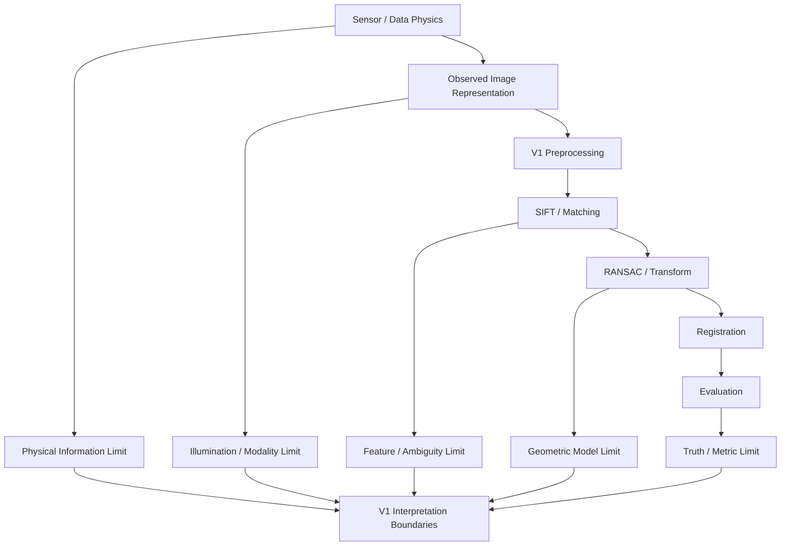
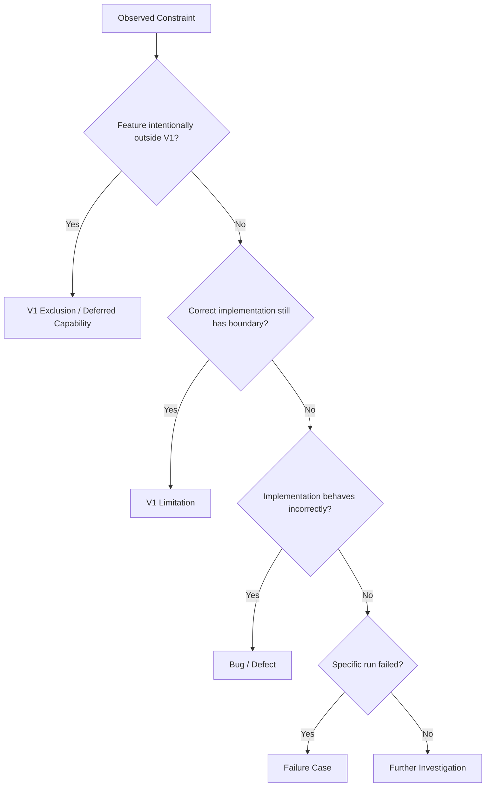
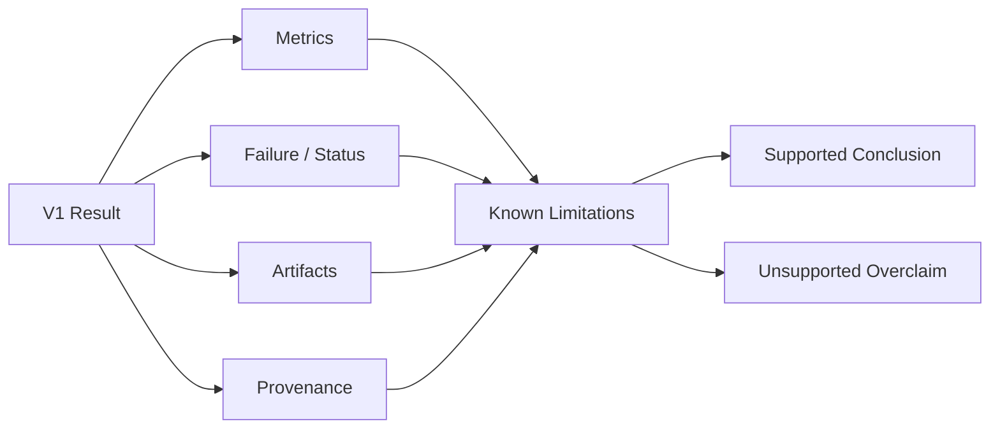

# ChandraMap V1 Limitations

> **Document role:** Authoritative V1 limitations and scientific interpretation guide
> **Version:** V1
> **Version role:** Classical Baseline / Registration Foundation
> **Primary task:** Known-overlap local lunar image registration
> **Limitation scope:** Scientific, sensor, algorithmic, geometric, evaluation, benchmark, reproducibility, and engineering boundaries
> **Implementation status:** This document defines known and expected V1 limitations; it does not claim that every limitation has been quantitatively measured.

This document defines the scientific and technical boundaries within which **ChandraMap V1** results should be interpreted.

V1 is intentionally designed as a classical, measurable baseline built around:

```text
Sensor-Aware Preparation
        ↓
Physical Scale Handling
        ↓
SIFT
        ↓
Descriptor Matching
        ↓
Match Filtering
        ↓
RANSAC
        ↓
Affine / Homography
        ↓
Optional Sub-Pixel Refinement
        ↓
Final Transform Refit
        ↓
Registration
        ↓
Quantitative Evaluation
        ↓
Reproducible Result or Failure
```

The limitations described here are not an apology for V1.

They define the conditions under which V1 evidence is scientifically meaningful.

> **V1 is intentionally a baseline, so its limitations are part of what makes later improvement measurable.**

> **A known limitation should be documented, measured where possible, and never hidden behind a visually convincing registration.**

> **Limitation does not mean invalid.**

> **Reported performance applies to the tested data, task, coordinate space, and benchmark conditions—not automatically to every lunar image.**

> **Sensor information cannot be recovered merely by resizing pixels.**

> **Illumination differences change geometry of shadows and feature visibility, not only brightness.**

> **A local affine or homography model is an approximation, not a complete physical model of the lunar surface.**

> **Evaluation quality is limited by the quality, independence, spatial distribution, and uncertainty of the available truth.**

> **Lower numerical residual does not automatically mean better physical registration if the metric, coordinate space, or truth is inappropriate.**

> **Limitations should guide interpretation and future research, not be silently treated as solved.**

> **V1 is useful precisely because its behavior is measurable and its limitations are explicit. Later versions should address those limitations without rewriting the historical baseline.**

---

## 1. What Counts as a V1 Limitation?

A V1 limitation is a known boundary, weakness, assumption, or interpretation constraint that may remain **even when V1 is implemented correctly and behaves exactly as designed**.

Examples include:

- a coarse sensor lacking fine terrain detail;
- SIFT struggling under severe modality differences;
- repetitive crater fields creating descriptor ambiguity;
- affine geometry failing to represent spatially varying terrain effects;
- limited independent control/check truth;
- benchmark results covering only the tested lunar regions.

These are different from exclusions, failures, and bugs.

---

## 2. Limitation vs Exclusion

This distinction is fundamental.

`exclusions.md` answers:

> **What does V1 intentionally not include?**

This document answers:

> **Even when V1 works correctly, what scientific or technical boundaries remain?**

Examples:

| Situation                                                       | Classification                  | Why                                                                  |
| --------------------------------------------------------------- | ------------------------------- | -------------------------------------------------------------------- |
| Global retrieval is absent from V1                              | Exclusion / deferred capability | The capability is intentionally outside the V1 baseline              |
| SIFT becomes unreliable under severe illumination change        | Limitation                      | The baseline algorithm has a known robustness boundary               |
| DEM-aware geometry is not implemented in V1                     | Exclusion / deferred capability | Advanced terrain modeling is outside V1 scope                        |
| A homography cannot model strong lunar relief perfectly         | Limitation                      | The chosen V1 transform has a geometric boundary                     |
| Full hyperspectral matching is not part of V1                   | Exclusion / deferred capability | V1 uses a reduced registration representation where IIRS is included |
| Reducing IIRS to a 2D representation loses spectral information | Limitation                      | Information is intentionally collapsed for ordinary 2D matching      |

A capability being excluded does not automatically mean the capabilities remaining inside V1 are defective.

---

## 3. Limitation vs Failure Case

See [Failure Cases](../../evaluation/failure-cases.md).

A **limitation** describes a broader boundary or weakness.

A **failure case** describes a specific run where the system did not satisfy required conditions.

For example:

```text
Limitation:
SIFT may produce few stable features on low-texture lunar terrain.

Failure case:
A particular benchmark pair produced insufficient verified support for
a valid transformation.
```

This document does not catalog individual failed benchmark pairs.

Those belong in benchmark/result/failure reporting.

---

## 4. Limitation vs Bug

A bug is incorrect implementation behavior.

A limitation is a scientifically understood boundary that can remain even when the implementation is correct.

| Example                                                    | Correct Classification                |
| ---------------------------------------------------------- | ------------------------------------- |
| Wrong x/y coordinate conversion                            | Bug / correctness defect              |
| Missing transform direction                                | Bug / design defect                   |
| Incorrect RMSE formula                                     | Bug                                   |
| Silent identity-transform fallback                         | Bug / failure-handling defect         |
| Affine model cannot express nonlinear terrain displacement | Limitation                            |
| Coarse source imagery lacks fine NAC-scale detail          | Physical limitation                   |
| SIFT descriptors are ambiguous in repetitive crater fields | Algorithmic/data-dependent limitation |

> **Correctness defects must never be hidden by calling them limitations.**

---

## 5. Relationship to Other V1 Documents

The V1 documentation set serves different purposes.

| Document                                           | Role                                                                                   |
| -------------------------------------------------- | -------------------------------------------------------------------------------------- |
| [V1 README](./README.md)                           | Overview and navigation                                                                |
| [V1 Scope](./scope.md)                             | Defines what belongs inside and outside V1                                             |
| [V1 Specification](./specification.md)             | Defines intended V1 scientific behavior                                                |
| [V1 Requirements](./requirements.md)               | Defines individually verifiable requirements                                           |
| [V1 Architecture](./architecture.md)               | Defines component and responsibility boundaries                                        |
| `pipeline.md`                                      | Defines ordered V1 execution when present                                              |
| `inputs.md`                                        | Defines V1 input contracts when present                                                |
| [V1 Outputs](./outputs.md)                         | Defines output semantics                                                               |
| `benchmark.md`                                     | Defines the V1 benchmark when present                                                  |
| [V1 Acceptance Criteria](./acceptance-criteria.md) | Defines when V1 can be accepted/frozen                                                 |
| `exclusions.md`                                    | Defines intentionally omitted V1 capabilities when present                             |
| **`limitations.md`**                               | Defines scientific and technical boundaries that remain even when V1 behaves correctly |

---

## 6. Relationship to Project-Level Limitations

See:

- [Project Limitations](../../project/limitations.md)
- [Project Assumptions](../../project/assumptions.md)
- [Project-Level V1 Scope](../../project/v1-scope.md)

The distinction is:

```text
../../project/limitations.md
→ broad ChandraMap project-level limitations

docs/versions/v1/limitations.md
→ limitations specifically associated with the V1 classical baseline
```

This document must remain consistent with project-level assumptions and limitations.

---

## 7. Limitation Classification

V1 limitations are classified conceptually as follows.

| Classification          | Meaning                                                                        |
| ----------------------- | ------------------------------------------------------------------------------ |
| **Inherent / Physical** | Caused by sensing physics, missing information, or physical observation limits |
| **Algorithmic**         | Caused by limitations of the selected V1 algorithms                            |
| **Geometric**           | Caused by transformation/model assumptions                                     |
| **Data-Dependent**      | Depends on terrain, image quality, metadata, overlap, scale, or modality       |
| **Evaluation**          | Limits confidence in measured performance                                      |
| **Benchmark**           | Limits conclusions that can be drawn from the benchmark population             |
| **Reproducibility**     | Limits exact or cross-platform replication                                     |
| **Engineering**         | Runtime, resource, implementation, or infrastructure constraints               |
| **Interpretation**      | Limits what claims may be supported by outputs                                 |

No numeric severity ranking is defined.

---

# 8. Limitations at a Glance

| Limitation                            | Category                     | Impact                                                                 | Interpretation                                             |
| ------------------------------------- | ---------------------------- | ---------------------------------------------------------------------- | ---------------------------------------------------------- |
| Severe cross-resolution mismatch      | Physical / Data-dependent    | Reduces common observable structure                                    | Use physical-scale handling; resizing cannot create detail |
| Missing fine-scale source information | Physical                     | Limits recoverable correspondence precision                            | Sensor information is a hard information boundary          |
| Strong Sun-angle change               | Physical / Appearance        | Moves shadows and changes visible features                             | Contrast normalization cannot fully correct it             |
| SIFT modality sensitivity             | Algorithmic                  | May reduce reliable correspondences                                    | Treat SIFT as a classical baseline, not universal matcher  |
| Low-texture terrain                   | Data-dependent               | May produce too few stable features                                    | Explicit failure can be scientifically correct             |
| Repetitive crater terrain             | Algorithmic / Data-dependent | Can produce ambiguous local descriptors                                | Geometry and independent evaluation remain necessary       |
| Matcher-score ambiguity               | Interpretation               | Score is not calibrated correctness probability                        | Do not treat descriptor distance as absolute confidence    |
| Filtering trade-off                   | Algorithmic                  | Strict filtering loses valid matches; loose filtering retains outliers | Thresholds are configuration-dependent                     |
| RANSAC model dependence               | Algorithmic / Geometric      | Consensus depends on transform family and threshold                    | Model consistency is not physical truth                    |
| RANSAC stochasticity                  | Reproducibility              | Exact inlier/model output may vary                                     | Record seed/configuration where practical                  |
| Affine model limitation               | Geometric                    | Cannot represent general projective or nonlinear terrain effects       | Interpret as local approximation                           |
| Homography limitation                 | Geometric                    | May not model relief or large-area variation                           | Lower fit residual does not guarantee physical correctness |
| Sub-pixel refinement limitation       | Algorithmic / Physical       | Improves localization, not sensor resolution                           | Evaluate with independent checks                           |
| Warping/interpolation                 | Engineering / Interpretation | Alters sampling and may smooth data                                    | Registered raster is resampled data                        |
| Limited independent truth             | Evaluation                   | Restricts strong accuracy claims                                       | Separate fitting diagnostics from held-out evidence        |
| Reference uncertainty                 | Evaluation / Data            | Reference is not perfect truth                                         | Avoid unsupported absolute geolocation claims              |
| Sparse check distribution             | Evaluation                   | Weak image-wide evidence                                               | Report check-point count and coverage                      |
| Coverage-method dependence            | Evaluation                   | Coverage value depends on definition                                   | Preserve method/configuration                              |
| IIRS 2D reduction                     | Physical / Modality          | Discards spectral information                                          | Representation choice is part of the experiment            |
| Benchmark breadth                     | Benchmark                    | Limits generalization                                                  | Conclusions apply to tested populations                    |
| Runtime environment dependence        | Engineering                  | Speed varies across systems                                            | Preserve hardware/software context                         |
| External data dependency              | Reproducibility              | Provider archives may change                                           | Preserve stable product IDs and provenance                 |

---

# 9. Sensor Resolution Limitations

Approximate project context is:

| Sensor  | Approximate Spatial Context                                                              |
| ------- | ---------------------------------------------------------------------------------------- |
| OHRC    | `~0.25–0.32 m/pixel`, product/documentation dependent                                    |
| TMC-2   | `~5 m/pixel`                                                                             |
| IIRS    | `~80 m/pixel`                                                                            |
| LRO NAC | Often roughly `~0.5–2 m/pixel` in current project context, product/acquisition dependent |
| LRO WAC | Broader/coarser reference context; product/mode dependent                                |

Actual product metadata is authoritative.

These sensors do not observe the lunar surface at the same spatial information scale.

A crater rim visible in OHRC or high-resolution NAC imagery may:

- occupy only a fraction of one TMC-2 pixel;
- disappear entirely in IIRS spatial sampling;
- be altered substantially by reference downsampling.

Therefore cross-resolution registration is fundamentally an **information-overlap problem**, not merely an image-resizing problem.

---

# 10. Physical Information Limit

> **Once fine-scale information was never captured by the coarse sensor, image resampling cannot reconstruct it reliably.**

This affects comparisons such as:

```text
TMC-2
→ fine NAC
```

and especially:

```text
IIRS
→ fine NAC
```

The coarse source does not contain every surface detail visible in the finer reference.

Consequently:

- descriptor similarity may decrease;
- repeatable keypoints may be fewer;
- correspondence precision may be limited;
- apparent fine-detail agreement can become dominated by interpolation rather than measured information.

This is an inherent sensing limitation.

---

# 11. Upsampling Limitation

Upsampling can:

- increase raster dimensions;
- interpolate values between samples;
- produce a numerically denser grid;
- simplify some implementation interfaces.

Upsampling cannot:

- create craters that were not spatially resolved;
- reconstruct fine edges never observed;
- restore spatial-frequency content above the original sensing limit;
- convert an `~80 m/pixel` observation into true sub-metre imagery.

> **Upsampling changes representation density, not physical information content.**

V1 should not describe ordinary interpolation as **resolution enhancement**.

---

# 12. Downsampling and Pyramid Limitations

See [Scale Pyramid](../../algorithms/scale-pyramid.md).

Downsampling a fine reference can improve comparability with a coarser source.

However, it also:

- removes fine detail;
- changes edge sharpness;
- may change keypoint location;
- alters descriptor appearance;
- changes the coordinate scale at which residuals are measured;
- can introduce filtering/interpolation effects.

A chosen pyramid level is therefore part of the scientific experiment.

Results must preserve enough information to identify:

- selected level;
- effective reference scale;
- mapping back to parent-reference coordinates.

---

# 13. Scale-Selection Limitation

Matching source and reference imagery at similar nominal GSD does not guarantee optimal correspondence.

Other factors matter, including:

- optical point-spread/modulation behavior;
- sensor noise;
- blur;
- wavelength sensitivity;
- acquisition geometry;
- illumination;
- image processing history;
- interpolation;
- projection/resampling history.

> **GSD is important context, not a complete definition of image comparability.**

---

# 14. Sensor Modality Limitations

OHRC and TMC-2 primarily provide optical/panchromatic structural imagery.

IIRS provides hyperspectral/imaging-infrared observations.

Different sensors may respond differently to the same terrain because of:

- spectral response;
- illumination sensitivity;
- detector properties;
- processing pipelines;
- spatial sampling.

Therefore a physically matched spatial scale does not guarantee matching appearance.

---

# 15. IIRS Modality Limitation

IIRS is approximately characterized in project context by:

- `~80 m/pixel`;
- `~0.8–5.0 µm`;
- roughly `~250–256` bands depending on product/documentation.

It is not an ordinary grayscale imager.

If IIRS is used in V1, ordinary 2D SIFT matching requires a derived registration-friendly representation.

This introduces an important limitation:

> **The 2D image is a selected representation of the hyperspectral product, not the complete spectral observation.**

Registration behavior may therefore depend strongly on how that representation is constructed.

---

# 16. IIRS Representation Limitations

Potential IIRS representation limitations include:

- a selected band may not resemble visible/panchromatic reference imagery;
- a derived component may emphasize structures different from optical albedo;
- spectral contrast may not correspond to visible brightness;
- coarse sampling may remove small terrain structures;
- preprocessing may alter local intensity relationships;
- different representation strategies may generate different SIFT features.

No universal V1 IIRS representation is assumed to be optimal.

Representation choice should remain:

- documented;
- reproducible;
- benchmark-visible.

---

# 17. IIRS Interpretation Limit

Successful registration of one derived IIRS 2D representation does not automatically establish that:

- all spectral bands align perfectly;
- every wavelength has identical spatial behavior;
- the complete cube is spectrally and geometrically validated;
- sub-pixel precision in the derived representation equals fine-scale physical terrain accuracy.

Any propagation of a 2D registration to the full hyperspectral product must preserve correct spatial relationships.

---

# 18. Illumination Limitations

Lunar appearance can vary strongly with:

- Sun elevation;
- Sun azimuth;
- local slope;
- terrain relief;
- viewing geometry.

These factors affect:

- shadow direction;
- shadow length;
- crater-rim visibility;
- illuminated-versus-shadowed terrain;
- apparent edge positions;
- local gradients;
- local contrast.

> **Illumination differences change feature geometry, not only brightness.**

This is particularly important on airless lunar terrain where cast shadows can dominate local appearance.

---

# 19. Contrast-Normalization Limitation

See [Illumination Handling](../../algorithms/illumination-handling.md).

Operations such as:

- histogram normalization;
- local contrast enhancement;
- CLAHE-style processing;
- intensity normalization;

may reduce some appearance differences.

They cannot:

- move a shadow boundary to where it appeared under another Sun angle;
- reveal terrain that is hidden by shadow;
- reconstruct physically equivalent illumination;
- restore identical local gradients across acquisition geometries.

Therefore such processing must not be described as complete **Sun-angle invariance**.

---

# 20. Shadow-Feature Limitations

SIFT may detect shadow boundaries because they generate strong local gradients.

A shadow boundary, however, is not necessarily a stable physical surface boundary.

As illumination changes:

```text
same terrain
→ different shadow extent
→ different local gradient geometry
```

A visually strong keypoint may therefore be:

- repeatable under one illumination pairing;
- unstable under another.

This can reduce descriptor repeatability and geometric reliability.

---

# 21. Extreme Illumination Limitation

Low or extreme Sun-angle conditions may produce:

- very long shadows;
- terrain occlusion;
- large dark regions;
- high local contrast;
- strongly changed crater appearance.

V1 may fail or degrade under such conditions.

This behavior should be:

- measured;
- recorded;
- interpreted;

rather than hidden behind preprocessing.

---

# 22. SIFT Limitations

SIFT is the V1 classical local-feature baseline.

Relevant limitations include:

- dependence on local gradient/intensity structure;
- weaker behavior in low-texture areas;
- descriptor ambiguity in repetitive terrain;
- limited robustness across severe modality changes;
- practical limits under extreme physical-scale differences;
- sensitivity to blur/resampling;
- no lunar-specific semantic understanding;
- no guarantee of invariance across every Sun-angle/viewing condition.

If a dedicated SIFT algorithm document exists, it should provide deeper method-specific detail.

> **SIFT is a benchmark baseline, not a claim of universal optimality.**

---

# 23. Local Scale-Invariance Limit

SIFT's scale-space construction provides useful local scale robustness.

It does **not** imply arbitrary physical-scale invariance.

For example:

```text
0.3 m/pixel
↔
80 m/pixel
```

may differ so substantially that many physical structures visible in the fine image do not exist as independently sampled features in the coarse image.

Algorithmic scale invariance cannot overcome missing sensor information.

---

# 24. Orientation-Invariance Limit

SIFT can compensate for local image rotation to an extent.

It is not completely invariant to:

- viewpoint changes;
- projection distortion;
- relief displacement;
- strong non-affine deformation;
- sensor-geometry differences.

A rotated local pattern and a geometrically deformed terrain patch are not equivalent problems.

---

# 25. Low-Texture Terrain Limitation

Smooth or poorly textured terrain may provide relatively few stable local extrema and descriptors.

Consequences may include:

- few detected keypoints;
- few candidate matches;
- weak geometric support;
- unstable transformation fitting;
- explicit pipeline failure.

A correctly reported failure in such a region can be the scientifically appropriate V1 result.

---

# 26. Repetitive Terrain Limitation

Lunar imagery may contain many visually similar:

- small craters;
- crater rims;
- depressions;
- ridges;
- repeated local texture patterns.

This can produce:

- descriptor ambiguity;
- repeated-pattern matching;
- multiple plausible candidate correspondences;
- false local consensus.

RANSAC reduces geometric inconsistency.

It cannot guarantee semantic correctness if the wrong repeated region also supports a consistent geometric model.

---

# 27. Matcher-Score Limitation

A descriptor distance or matcher score is generally a matcher-specific measure.

It is not automatically:

```text
P(match is physically correct)
```

unless a method explicitly defines and validates such probabilistic semantics.

V1 should therefore interpret matcher scores as:

- ranking/filtering signals;
- diagnostics;

rather than universal confidence probabilities.

---

# 28. Match-Filtering Limitations

See [Match Filtering](../../algorithms/match-filtering.md).

Filtering introduces a precision/recall trade-off.

A strict filter may:

- remove ambiguous candidates;
- reduce outliers;
- also discard valid correspondences.

A loose filter may:

- preserve more valid correspondences;
- also pass more outliers into geometric verification.

No one filter configuration is expected to be universally optimal across:

- OHRC;
- TMC-2;
- IIRS-derived representations;
- terrain types;
- illumination conditions;
- scale relationships.

---

# 29. Ratio-Test Limitation

If a nearest-neighbor ratio test is used, its behavior may depend on:

- descriptor ambiguity;
- repeated terrain;
- modality;
- physical scale;
- image quality;
- blur;
- preprocessing.

One ratio threshold should not be treated as a universal scientific constant.

Threshold interpretation belongs to the configured benchmark/matcher context.

---

# 30. Cross-Check Limitation

Mutual/cross-check filtering can improve correspondence consistency.

It can also reject potentially valid asymmetric matches when:

- descriptor neighborhoods differ;
- one image contains more local detail;
- modality changes alter nearest-neighbor structure.

Cross-checking is therefore a configurable filtering choice, not an absolute correctness test.

---

# 31. RANSAC Limitations

See [RANSAC](../../algorithms/ransac.md).

RANSAC estimates a model supported by a consensus subset of candidate correspondences.

Its behavior depends on:

- candidate quality;
- inlier proportion;
- transform family;
- residual threshold;
- sampling process;
- available point geometry.

RANSAC may fail when:

- too few valid candidates exist;
- outlier rate is very high;
- points are geometrically degenerate;
- the configured model is inappropriate.

It may also find a mathematically consistent but physically wrong solution in repetitive terrain.

---

# 32. RANSAC Consensus Limitation

> **Geometric consistency is necessary evidence, but not independent proof of physical correctness.**

A repeated terrain patch may theoretically support:

- descriptor similarity;
- consistent relative geometry;

while still referring to the wrong physical location.

Independent truth, known pair context, coverage, and residual interpretation remain important.

---

# 33. RANSAC Threshold Limitation

A RANSAC residual threshold has meaning only within a coordinate space.

For example:

```text
2 reference-pyramid pixels
```

is not automatically equivalent to:

```text
2 native-reference pixels
```

or:

```text
2 source pixels
```

Threshold values should not be compared or reused blindly across different scale representations.

---

# 34. RANSAC Stochasticity

RANSAC implementations may use random sampling.

Consequently, exact selected samples, consensus sets, or final fitted models may vary under some conditions.

Recording a seed can improve repeatability.

It does not guarantee bitwise-identical behavior across every:

- library version;
- platform;
- numerical backend;
- hardware environment.

---

# 35. Inlier-Ratio Limitation

A high inlier ratio can still be misleading.

Examples include:

- very low candidate count;
- strong spatial clustering;
- repetitive-region false consensus;
- overly flexible geometric model.

Therefore inlier ratio should be interpreted together with:

- inlier count;
- candidate denominator;
- spatial coverage;
- residuals;
- independent evaluation where available.

---

# 36. Transform-Model Limitations

See [Transforms](../../algorithms/transforms.md).

V1 may use:

- affine transformation;
- homography;

according to configuration.

These transformations model 2D coordinate relationships.

They are not complete physical sensor or lunar-terrain models.

---

# 37. Affine Limitations

An affine transform can model combinations of:

- translation;
- rotation;
- scale;
- shear.

It cannot represent:

- general projective effects;
- arbitrary perspective distortion;
- spatially varying terrain displacement;
- complex relief/parallax effects.

Affine geometry is therefore most appropriate when the local relationship is sufficiently close to an affine approximation.

---

# 38. Homography Limitations

A homography is more flexible than an affine transform.

However, it assumes a projective relationship compatible with a planar or approximately planar mapping.

Lunar terrain has relief.

A single homography may become insufficient when:

- the region is large;
- terrain relief is strong;
- viewing geometry differs significantly;
- projection differences vary spatially.

A lower fit residual from homography does not automatically mean a more physically correct registration.

---

# 39. The Moon Is Not a Flat Poster

> **A single 2D transform is a local approximation. Lunar relief can make residuals vary spatially even when the fitted transform is mathematically valid.**

This principle limits how far a V1 local transform should be extrapolated.

It also motivates later research into terrain-aware geometry without making such methods part of the classical V1 baseline.

---

# 40. Local-Area Limitation

A transform estimated from one local overlap may:

- align the fitting region well;
- degrade near image boundaries;
- extrapolate poorly outside the support region.

Therefore:

```text
successful local registration
≠
validated Moon-wide alignment
```

V1's known-overlap task should remain interpreted locally.

---

# 41. Model-Selection Limitation

Choosing between affine and homography is itself a modeling decision.

A more flexible model can reduce training/fit residual while:

- overfitting limited correspondences;
- increasing extrapolation instability;
- worsening held-out error.

Model selection should therefore not be based solely on:

```text
lowest fit RMSE
```

Independent evaluation should be used where possible.

---

# 42. Degenerate Geometry Limitation

A large match count does not guarantee a well-constrained transformation.

Correspondences may be:

- nearly collinear;
- tightly clustered;
- duplicated;
- concentrated in one terrain feature.

Such support can produce unstable model estimation.

This is another reason why point count and spatial distribution must be considered separately.

---

# 43. Sub-Pixel Refinement Limitations

See [Sub-Pixel Refinement](../../algorithms/subpixel-refinement.md).

Sub-pixel refinement may improve localization of an already plausible correspondence.

It cannot:

- create missing physical information;
- recover terrain that was never resolved;
- convert a wrong correspondence into a correct one automatically;
- guarantee lower held-out error;
- guarantee finer physical ground accuracy than the sensing information supports.

> **Sub-pixel localization is an image-coordinate estimate, not an increase in sensor resolution.**

---

# 44. Refining Wrong Matches

> **Refinement can make the location of a wrong correspondence more precise without making the correspondence correct.**

This is why the intended V1 ordering is:

```text
candidate
→ geometric verification
→ verified fit point
→ refinement
```

not:

```text
all candidates
→ refinement
→ assume correctness
```

---

# 45. Refinement-Window Limitation

Local refinement may be affected by:

- changed shadows;
- blur;
- cross-modality differences;
- repetitive texture;
- window size;
- local transform error;
- masks;
- image boundaries;
- interpolation.

No one local refinement configuration is expected to work uniformly across every V1 sensor pair.

---

# 46. Refinement Improvement Is Not Guaranteed

Refinement may reduce fit residual while:

- leaving check error unchanged;
- worsening held-out error;
- changing only a small cluster of points.

Therefore the effect of refinement should be evaluated using independent evidence where available.

---

# 47. Registration and Warping Limitations

See [Registration](../../algorithms/registration.md).

Warping changes the sampling grid of measured data.

Potential effects include:

- interpolation;
- smoothing;
- edge artifacts;
- nodata regions;
- reduced valid overlap;
- repeated-resampling degradation.

> **Registration resamples existing measurements into another grid; it does not increase the sensor's physical resolution.**

---

# 48. Interpolation Limitation

Different interpolation strategies can produce different:

- pixel values;
- smoothness;
- visual sharpness;
- edge behavior.

Therefore downstream scientific analysis of registered rasters should preserve the relevant resampling context.

A visually sharper interpolation is not automatically more scientifically accurate.

---

# 49. Registered-Preview Limitation

A preview can appear convincing even when measurable residuals remain.

Visual inspection may hide errors because:

- transparency blends shifted edges;
- low zoom suppresses small offsets;
- display normalization changes contrast;
- a few prominent features dominate perception.

> **Visual alignment is qualitative evidence, not a substitute for quantitative evaluation.**

---

# 50. Residual-Analysis Limitations

See [Residual Analysis](../../algorithms/residual-analysis.md).

Residual values depend on:

- point population;
- transform model;
- coordinate space;
- truth quality;
- measurement uncertainty.

A residual statistic without this context is incomplete.

---

# 51. Fit-Residual Limitation

Fit residuals are measured on points that contributed to model estimation.

They therefore describe:

```text
how well the chosen model fits its fitting support
```

not necessarily:

```text
how accurately the model generalizes independently
```

Fit residuals are generally expected to provide more optimistic evidence than genuinely held-out checks.

> **Fit RMSE must not be presented as independent registration RMSE.**

---

# 52. RMSE Limitations

RMSE is useful but incomplete.

It:

- emphasizes larger errors;
- hides error direction;
- does not show spatial distribution;
- may be influenced by a few large errors;
- may look strong even when check points are clustered.

Where useful, RMSE can be interpreted alongside:

- check count;
- spatial coverage;
- residual vectors;
- median;
- percentiles;
- failure context.

No one summary statistic captures all registration behavior.

---

# 53. Median and Percentile Limitations

Median and percentile statistics can reduce sensitivity to extreme errors.

However:

- median may hide rare but severe failures;
- percentiles require adequate sample size;
- neither describes spatial structure;
- neither replaces truth-quality assessment.

They supplement RMSE rather than universally replacing it.

---

# 54. Coordinate-Space Limitations

Residuals may be expressed in:

- source-native pixels;
- source-prepared coordinates;
- reference-native pixels;
- reference-tile coordinates;
- reference-pyramid pixels;
- projected/map coordinates;
- lunar ground distance where valid.

These spaces are not numerically interchangeable.

> **A pixel is meaningful only together with its coordinate space.**

---

# 55. Source-Pixel vs Reference-Pixel Limitation

One pixel in:

- OHRC;
- TMC-2;
- IIRS;
- native NAC;
- a downsampled NAC pyramid;

can correspond to very different lunar ground distances.

Therefore:

```text
1 pixel error
```

does not have a universal physical meaning.

Pixel errors from different spaces should not be blindly pooled or compared without appropriate interpretation.

---

# 56. Ground-Space Conversion Limitations

A simple conversion such as:

```text
ground_error = pixel_error × approximate_GSD
```

may be scientifically invalid because:

- GSD may vary;
- error may be measured in another coordinate space;
- map-projection scale may vary;
- source and reference sampling differ;
- local geometric mapping may be nonlinear;
- terrain and reference geometry may matter.

Metre-level reporting should be used only when the coordinate mapping supports it.

---

# 57. Absolute Geolocation Limitations

Image-to-image registration against LRO imagery does not automatically establish absolute lunar-coordinate accuracy.

Absolute geolocation can depend on:

- reference geolocation quality;
- map projection;
- reference processing history;
- control-network quality;
- product uncertainty;
- source/reference geometry.

Therefore:

```text
accurate image registration
≠
automatically validated absolute geolocation
```

---

# 58. Reference-Image Limitations

LRO products provide valuable reference imagery.

They are not automatically perfect truth.

Potential reference limitations include:

- geolocation uncertainty;
- projection/resampling history;
- illumination mismatch;
- coverage gaps;
- local artifacts;
- product-dependent spatial scale;
- mosaic seam effects where mosaics are used.

Evaluation should distinguish:

```text
registration relative to reference imagery
```

from:

```text
absolute physical truth
```

when those are not equivalent.

---

# 59. NAC Limitations

NAC provides high-resolution imagery, but native NAC detail may greatly exceed the information content of a coarse source.

Matching a coarse source directly against extremely fine NAC detail can create an information mismatch.

Reference pyramids can improve physical comparability.

They do not remove the fundamental spatial information limit of the source sensor.

---

# 60. WAC Limitations

WAC offers broader/coarser lunar context and has a different role from NAC.

It should not be assumed to provide the same fine local-registration precision as an appropriately matched high-resolution NAC product.

No universal WAC GSD is assumed in this document.

Product metadata and the actual benchmark configuration are authoritative.

---

# 61. Reference-Pyramid Limitations

A downsampled reference can improve matching while simultaneously discarding fine geometric information.

This creates a trade-off between:

```text
cross-resolution comparability
```

and:

```text
reference detail
```

The selected representation must therefore remain part of result provenance.

---

# 62. Ground-Truth Limitations

See [Ground Truth](../../evaluation/ground-truth.md).

Ground truth may itself contain uncertainty from:

- manual annotation;
- feature ambiguity;
- projection;
- coordinate conversion;
- sensor resolution;
- illumination differences;
- reference uncertainty.

Therefore a measured check residual can contain contributions from:

```text
algorithm error
+
truth uncertainty
+
reference uncertainty
```

rather than algorithm error alone.

---

# 63. Manual-Point Limitations

Manual correspondences may be affected by:

- annotator precision;
- ambiguous feature centers;
- shadow-boundary ambiguity;
- sensor scale;
- different feature appearance;
- pixel-center interpretation.

Where practical, truth preparation should document annotation methodology and uncertainty.

---

# 64. Check-Point Count Limitation

A small check-point set may provide incomplete or statistically unstable evidence.

This document does not define a universal minimum number.

Instead, reported evaluation should preserve the actual number \(N\).

A metric with unknown \(N\) is harder to interpret.

---

# 65. Check-Point Distribution Limitation

A low RMSE calculated from check points concentrated in one corner does not prove similar accuracy elsewhere.

Therefore evaluation should consider the spatial distribution of check points where meaningful.

> **Independent error and independent spatial support are complementary evidence.**

---

# 66. Control / Check Split Limitations

See:

- [Control Points](../../evaluation/control-points.md)
- [Check-Point Evaluation](../../evaluation/checkpoint-evaluation.md)

Separating fitting and check points improves independence.

However, when truth is limited, splitting the available points creates a trade-off:

```text
more points for fitting
vs
more points for independent evaluation
```

This trade-off should be documented rather than hidden.

---

# 67. Truth-Leakage Limitation

If held-out truth influences:

- preprocessing selection;
- scale selection;
- matcher thresholds;
- model selection;
- filtering choices;

then the resulting evaluation becomes less independent.

Benchmark governance should minimize such leakage.

The final test/check truth should not become an informal tuning tool.

---

# 68. Spatial-Coverage Limitations

See [Spatial Coverage](../../evaluation/spatial-coverage.md).

Coverage values depend on:

- evaluated point population;
- valid-region definition;
- coordinate space;
- grid resolution;
- hull method;
- other method parameters.

Coverage values produced by different definitions should not be compared blindly.

---

# 69. Grid-Coverage Limitation

Grid occupancy is sensitive to:

- number of grid cells;
- grid alignment;
- valid-image mask;
- overlap definition.

A very coarse grid may overstate distribution.

A very fine grid may make otherwise useful support appear sparse.

Coverage configuration must therefore remain part of interpretation.

---

# 70. Convex-Hull Limitation

A convex hull can cover a large area even when correspondences exist mainly along its boundary.

Therefore hull area does not fully capture:

- interior density;
- regional gaps;
- local clustering.

Hull-based coverage should not be treated as a complete support-distribution description.

---

# 71. Coverage Does Not Prove Correctness

> **Coverage measures where support exists, not whether the support is correct.**

A widely distributed wrong correspondence set can still be wrong.

Coverage should complement:

- residuals;
- model validity;
- independent checks.

---

# 72. Benchmark Limitations

See [Benchmark Protocol](../../evaluation/benchmark-protocol.md).

A benchmark supports conclusions only about the data and conditions it actually evaluates.

> **Reported benchmark performance must not automatically be generalized to the entire Moon.**

Benchmark evidence is bounded by:

- sensor combinations;
- terrain;
- illumination;
- resolution;
- product types;
- reference sources;
- truth quality.

---

# 73. Benchmark-Size Limitation

An initial research baseline may contain a limited number of image pairs.

Consequences may include:

- limited statistical power;
- limited terrain coverage;
- limited sensor diversity;
- unstable aggregate statistics;
- greater sensitivity to individual pairs.

V1 should report the actual benchmark population rather than inventing a large sample size.

---

# 74. Benchmark Representativeness Limitation

The accepted benchmark may not represent:

- every lunar region;
- every terrain type;
- every Sun angle;
- every scale ratio;
- every source product;
- every reference product;
- every processing condition.

Therefore benchmark interpretation should remain category-aware.

---

# 75. Benchmark Selection Bias

If benchmark pairs are selected mainly because they are easy to register, measured performance will likely be optimistic.

Benchmark governance should preserve:

- pair-selection rationale;
- difficult valid cases;
- failed valid pairs.

Cherry-picked success should not be mistaken for robust baseline performance.

---

# 76. Benchmark-Category Limitations

See [Benchmark Categories](../../evaluation/benchmark-categories.md).

Categories such as:

- scale mismatch;
- illumination condition;
- terrain type;
- modality;

may themselves be approximate.

Real lunar pairs often vary along several dimensions simultaneously.

Therefore a category label should not be interpreted as a perfectly controlled experiment unless the benchmark actually supports that interpretation.

---

# 77. Stress-Test Limitations

See [Stress Tests](../../evaluation/stress-tests.md).

Stress tests can isolate useful behaviors.

However, synthetic or controlled perturbations may not reproduce all real sensing effects.

A stress test should therefore be interpreted as:

```text
controlled evidence about one behavior
```

not:

```text
complete model of real lunar acquisition
```

---

# 78. Synthetic-Data Limitations

Synthetic transformations provide exact geometric truth.

That makes them excellent for testing:

- transform implementation;
- coordinate conventions;
- residual calculations.

But they may not model:

- optical blur;
- real sensor noise;
- spectral response;
- physical illumination change;
- terrain occlusion;
- real projection differences.

> **Synthetic success does not prove real cross-sensor robustness.**

---

# 79. Synthetic-Illumination Limitation

Brightness, gamma, histogram, or contrast perturbations are useful appearance tests.

They are not full physical simulations of:

- changed Sun azimuth;
- changed Sun elevation;
- terrain-dependent shadow movement.

Synthetic appearance robustness should therefore not be reported as complete Sun-angle robustness.

---

# 80. Generalization Limitations

Performance on one source/reference pair does not guarantee performance on another.

Generalization may vary with:

- sensor pairing;
- lunar location;
- terrain;
- illumination;
- physical scale;
- source processing;
- reference product;
- overlap;
- transform complexity.

V1 conclusions should remain tied to documented benchmark conditions.

---

# 81. Sensor-Generalization Limitation

Success on:

```text
OHRC ↔ NAC
```

does not automatically establish equivalent performance on:

```text
TMC-2 ↔ NAC
```

or:

```text
IIRS-derived representation ↔ NAC
```

Different sensor pairs should be evaluated independently.

---

# 82. Region-Generalization Limitation

Feature-rich cratered terrain may behave very differently from:

- smoother plains;
- repetitive small-crater fields;
- low-contrast terrain.

A successful result in one geological/visual regime should not be extrapolated automatically to the whole Moon.

---

# 83. Mission-Generalization Limitation

V1 evidence for:

```text
Chandrayaan-2 ↔ LRO
```

does not automatically generalize to:

- Kaguya / SELENE;
- other lunar missions;
- Mars;
- Venus;
- other planetary bodies.

Additional sensors may differ in:

- optics;
- wavelength;
- GSD;
- processing;
- projection;
- noise;
- geometry.

---

# 84. Multi-Mission Limitation

Multi-mission support is primarily a later-scope concern.

Even when another mission produces apparently similar imagery, V1 assumptions may not transfer directly.

Mission generalization requires new benchmark evidence.

---

# 85. Reproducibility Limitations

See [Reproducibility](../../evaluation/reproducibility.md).

Reproducibility may be affected by:

- library versions;
- OpenCV behavior;
- numerical backends;
- random sampling;
- operating system;
- CPU architecture;
- floating-point differences;
- threading;
- external data availability;
- preprocessing revisions.

The goal is therefore traceable scientific reproducibility rather than unsupported claims of universal bitwise identity.

---

# 86. Exact Reproduction vs Scientific Reproduction

Two useful concepts should remain distinct.

## Bitwise Repeatability

The same process produces exactly identical:

- bytes;
- arrays;
- numeric outputs.

## Scientific Reproducibility

A controlled rerun reconstructs the same:

- data;
- method;
- configuration;
- evaluation;

and produces scientifically consistent behavior and conclusions.

V1 should strive for strong traceability and repeatability where practical without assuming every platform will produce identical bytes.

---

# 87. Randomness Limitation

Recording a random seed can reduce stochastic variability.

However, a single seed does not guarantee identical execution across:

- different RANSAC implementations;
- dependency versions;
- numerical backends;
- hardware.

Random state is reproducibility context, not a universal determinism guarantee.

---

# 88. External Data Availability Limitation

ChandraMap depends on mission datasets that may be hosted externally.

External archives may change:

- URLs;
- interfaces;
- download procedures;
- authentication requirements;
- archive organization.

Large scientific assets may also be impractical to store directly in Git.

Reproducibility should therefore prioritize:

- stable product identifiers;
- mission/provider provenance;
- checksums where appropriate;
- preparation instructions.

---

# 89. Data Licensing and Redistribution Limitation

See [Data Licenses](../../data-licenses.md).

Public availability does not automatically imply unrestricted redistribution.

This may limit the project's ability to bundle exact mission products directly in the repository.

Reproduction may therefore require users to retrieve source data from the official or permitted provider.

---

# 90. Environment Limitations

Different environments may influence:

- image decoding;
- feature extraction;
- floating-point results;
- threading;
- runtime;
- memory use.

Formal benchmark interpretation should preserve environment context where it materially affects reproducibility or performance.

---

# 91. Runtime Limitations

Runtime may depend strongly on:

- source/reference dimensions;
- pyramid levels;
- detected keypoint count;
- candidate count;
- CPU performance;
- memory;
- storage speed;
- dependency versions;
- cache state.

A runtime value without this context is difficult to compare fairly.

---

# 92. Performance vs Accuracy Trade-Off

Configuration may trade execution cost against:

- feature density;
- candidate density;
- transform robustness;
- refinement cost.

However:

```text
faster
≠
necessarily worse
```

and:

```text
slower
≠
necessarily better
```

Runtime and scientific performance should be measured separately.

---

# 93. Cache Limitations

Caching can reduce repeated computation.

Poor cache identity can also introduce reproducibility problems if cached outputs are reused after changes to:

- source data;
- preprocessing;
- scale configuration;
- algorithm parameters.

Caches should therefore be:

- rebuildable;
- correctly keyed;
- treated as derived data.

---

# 94. Memory Limitations

Large lunar rasters and hyperspectral products may require substantial memory.

Possible engineering mitigations include:

- crops;
- tiles;
- pyramids;
- staged processing.

This document does not define a universal RAM requirement because actual usage is implementation- and data-dependent.

---

# 95. Implementation-Dependent Limitations

Not every V1 limitation is fundamental science.

Some may reflect current implementation choices, such as:

- supported file formats;
- CLI ergonomics;
- cache implementation;
- visualization tools;
- parallelization;
- current I/O paths.

These should not be presented as unavoidable properties of lunar registration itself.

---

# 96. Visualization Limitations

Visual artifacts may be affected by:

- contrast stretching;
- color maps;
- alpha blending;
- rescaling;
- display zoom;
- downsampling.

Therefore visual inspection should support, not replace, quantitative evidence.

---

# 97. Output-Interpretation Limitations

See [V1 Outputs](./outputs.md).

Scientific outputs must be interpreted together with their:

- coordinate spaces;
- units;
- point populations;
- truth versions;
- transform semantics.

A bare numerical metric is often insufficient.

---

# 98. Candidate-Count Limitation

Candidate count measures correspondence proposals.

It does not directly measure registration accuracy.

A high candidate count may include many outliers.

A low candidate count may still be sufficient if the points are accurate, well distributed, and geometrically valid.

---

# 99. Inlier-Count Limitation

Many inliers can still be:

- clustered;
- concentrated around one crater;
- generated by repeated-pattern consensus.

Therefore inlier count should be interpreted with:

- coverage;
- residuals;
- independent truth where available.

---

# 100. Inlier-Ratio Limitation

An inlier ratio is meaningful only with its denominator.

For example:

```text
4 / 5
```

and:

```text
80 / 100
```

both produce the same ratio while providing very different geometric support.

The ratio alone does not capture correspondence count or distribution.

---

# 101. Success-Criteria Limitations

See [Success Criteria](../../evaluation/success-criteria.md).

Binary success/failure decisions simplify continuous scientific evidence.

Two results immediately above and below a threshold may be scientifically similar.

Therefore the underlying metrics should remain preserved.

The binary status is useful for benchmark reporting.

It should not replace detailed interpretation.

---

# 102. Threshold Limitations

Thresholds depend on:

- task;
- sensor;
- coordinate space;
- truth quality;
- benchmark objective.

A threshold suitable for one configuration is not automatically universal.

This document therefore does not define arbitrary numeric limits.

---

# 103. Acceptance-Criteria Limitations

See [V1 Acceptance Criteria](./acceptance-criteria.md).

V1 acceptance means that the version is sufficiently:

- scientifically defensible;
- reproducible;
- benchmarkable;
- testable;

to serve as the classical baseline.

It does not imply:

- universal robustness;
- final research maturity;
- production readiness;
- absence of known limitations.

---

# 104. Exclusion / Limitation Interaction

Some V1 limitations remain intentionally because more advanced mechanisms are outside the baseline.

For example:

```text
Limitation:
a single homography cannot model severe relief perfectly

Related deferred capability:
DEM-aware or terrain-dependent geometry
```

Another example:

```text
Limitation:
known-pair registration does not evaluate unknown-location search

Related exclusion:
global retrieval
```

The limitation documents the baseline boundary.

The exclusion explains why a broader mechanism is not part of V1.

---

# 105. Limitations That Should Not Block V1 Acceptance

Provided they are honestly documented and do not violate mandatory V1 correctness requirements, limitations such as the following can remain:

- SIFT weakness under severe modality change;
- difficulty under extreme illumination differences;
- local homography relief limitations;
- limited benchmark breadth;
- conditional IIRS handling;
- incomplete independent truth for some pairs;
- non-optimized runtime;
- simple visualization;
- absence of global retrieval.

These are legitimate baseline boundaries.

---

# 106. Issues That Should Block V1 Acceptance

The following are not acceptable limitations:

- incorrect metric calculation;
- wrong transform direction;
- unknown coordinate spaces;
- fit/check leakage;
- RANSAC inliers treated as ground truth;
- silent failure;
- missing metrics encoded as zero;
- stale final transform after point refinement;
- final benchmark tuned using held-out truth;
- unreproducible baseline configuration;
- unsupported scientific claims presented as facts.

These are correctness or governance defects.

---

# 107. Limitations and Failure Handling

A limitation can increase the probability of a pipeline failure.

For example:

```text
low-texture terrain limitation
→ too few usable matches
→ geometric verification failure
```

The fact that the limitation is known does not justify hiding the failure.

The correct behavior is to:

- report the observed failure;
- preserve diagnostic evidence;
- include it in benchmark interpretation.

---

# 108. Limitations and Benchmark Interpretation

Strong performance on one benchmark category does not imply performance in an untested category.

For example:

```text
good OHRC ↔ NAC performance
```

does not establish:

```text
robust IIRS multimodal registration
```

unless IIRS-specific evidence exists.

Benchmark conclusions should therefore always remain tied to:

- sensors;
- conditions;
- truth;
- categories;
- sample population.

---

# 109. Limitations and Future Research

V1 limitations can motivate future investigation without becoming promises.

| V1 Limitation                    | Possible Research Direction                     |
| -------------------------------- | ----------------------------------------------- |
| Severe modality gap              | Learned or multimodal correspondence methods    |
| Strong illumination change       | Illumination-aware structural representations   |
| Local homography limitation      | Terrain-aware / DEM-aware geometry              |
| Unknown reference location       | Retrieval layer                                 |
| Repetitive terrain ambiguity     | Combined global/local contextual reasoning      |
| IIRS 2D information loss         | Spectral-spatial correspondence                 |
| Limited benchmark breadth        | Broader lunar and multi-mission benchmarking    |
| Uncertainty in truth             | Uncertainty-aware evaluation                    |
| Limited local-feature robustness | Alternative classical or learned local features |

These are research candidates, not guaranteed V2/V3/V4 commitments.

---

# 110. Possible V2 Limitation Targets

Subject to the actual V2 specification, possible V2 research may investigate:

- stronger local preprocessing;
- improved illumination handling;
- stronger filtering;
- improved scale strategy;
- stronger refinement;
- greater local-registration robustness.

V1 should remain preserved so any improvement can be measured against it.

---

# 111. Possible V3 Limitation Targets

Subject to the actual V3 specification, possible V3 directions may include:

- unknown-reference search;
- global descriptors;
- retrieval;
- vector indexing;
- FAISS;
- learned local matching;
- retrieval plus local verification.

These capabilities should not retroactively redefine V1.

---

# 112. Possible V4 Limitation Targets

Subject to the actual V4 specification, advanced research may investigate:

- severe multimodal correspondence;
- spectral-spatial IIRS methods;
- RIFT/CFOG-style remote-sensing approaches;
- DEM-aware geometry;
- terrain-aware warping;
- uncertainty modeling;
- sensor models;
- multi-mission generalization.

Again, these are possible research directions rather than guaranteed implementation commitments.

---

# 113. Limitation Traceability

| Limitation                     | Affected Stage           | Related Documentation                                                          | Evidence / Measurement              |
| ------------------------------ | ------------------------ | ------------------------------------------------------------------------------ | ----------------------------------- |
| Severe scale mismatch          | Scale + Matching         | [Scale Pyramid](../../algorithms/scale-pyramid.md)                             | Benchmark categories / stress tests |
| Illumination differences       | Preprocessing + Matching | [Illumination Handling](../../algorithms/illumination-handling.md)             | Illumination-category evaluation    |
| Classical feature modality gap | Matching                 | [Matching](../../algorithms/matching.md)                                       | Sensor-stratified benchmark         |
| Repetitive terrain ambiguity   | Matching + Geometry      | [Matching](../../algorithms/matching.md), [RANSAC](../../algorithms/ransac.md) | Inlier patterns / failures / checks |
| Homography relief error        | Geometry                 | [Transforms](../../algorithms/transforms.md)                                   | Spatial residual patterns           |
| Sparse checks                  | Evaluation               | [Check-Point Evaluation](../../evaluation/checkpoint-evaluation.md)            | Check count + coverage              |
| Coverage-method dependence     | Evaluation               | [Spatial Coverage](../../evaluation/spatial-coverage.md)                       | Coverage ablation/config comparison |
| Reproducibility variation      | Execution environment    | [Reproducibility](../../evaluation/reproducibility.md)                         | Controlled repeated runs            |
| Runtime variation              | Engineering              | [Metrics](../../evaluation/metrics.md)                                         | Hardware/environment-aware timing   |
| Truth uncertainty              | Evaluation               | [Ground Truth](../../evaluation/ground-truth.md)                               | Truth review / annotation evidence  |

No numerical results are implied by this table.

---

# 114. Limitation Observation vs Cause

Observed behavior should be interpreted through a disciplined reasoning chain:

```text
Observation
    ↓
Evidence
    ↓
Hypothesis
    ↓
Controlled Test
    ↓
Confirmed or Suspected Limitation
```

Example:

```text
Observation:
RANSAC fails

Possible causes:
- wrong reference region
- insufficient shared detail
- poor scale selection
- repetitive terrain
- weak candidate matches
- unsuitable geometric model
```

The stage where failure becomes visible is not automatically the underlying limitation.

---

# 115. Limitation Evidence

Useful evidence for characterizing V1 limitations may include:

- benchmark category breakdowns;
- stress-test results;
- residual vector fields;
- spatial-coverage maps;
- ablation studies;
- sensor-stratified evaluation;
- repeated runs;
- truth-uncertainty analysis;
- fit-vs-check comparison;
- model-comparison experiments.

This document does not fabricate those results.

---

# 116. Limitation Causal Context



---

# 117. Limitation vs Exclusion vs Bug vs Failure



---

# 118. Limitation-Aware Interpretation



Limitations help define the boundary between:

```text
what the evidence supports
```

and:

```text
what the evidence cannot justify
```

---

# 119. Limitation Checklist

The checklist is intentionally unchecked.

## Sensor / Scale

- [ ] Product-specific GSD variation is documented
- [ ] Cross-resolution information loss is acknowledged
- [ ] Upsampling is not presented as detail recovery
- [ ] Pyramid/downsampling trade-offs are documented
- [ ] Scale selection is not treated as perfect comparability
- [ ] Product metadata remains authoritative

## Modality / IIRS

- [ ] IIRS hyperspectral nature is documented
- [ ] 2D representation information loss is acknowledged
- [ ] Representation dependence is documented
- [ ] IIRS is not assumed equivalent to optical imagery
- [ ] Successful 2D registration is not overgeneralized to all spectral behavior

## Illumination

- [ ] Sun-angle and shadow-geometry limitations are documented
- [ ] Contrast-normalization limitations are documented
- [ ] Shadow features are interpreted cautiously
- [ ] Extreme illumination difficulty is acknowledged

## Matching

- [ ] SIFT limitations are documented
- [ ] Local scale invariance is not overclaimed
- [ ] Viewpoint invariance is not overclaimed
- [ ] Low-texture limitations are documented
- [ ] Repetitive-terrain ambiguity is documented
- [ ] Matcher score is not treated as calibrated correctness probability

## Filtering / RANSAC

- [ ] Filtering precision/recall trade-off is documented
- [ ] Ratio-test limitations are documented where relevant
- [ ] Cross-check limitations are documented where relevant
- [ ] RANSAC limitations are documented
- [ ] RANSAC consensus is not independent truth
- [ ] Threshold coordinate-space dependence is documented
- [ ] RANSAC stochasticity is acknowledged
- [ ] Inlier-ratio limitations are documented

## Geometry

- [ ] Affine limitations are documented
- [ ] Homography limitations are documented
- [ ] Lunar relief limitations are documented
- [ ] Local-to-global generalization limits are documented
- [ ] Model-selection limitations are documented
- [ ] Degenerate-support limitations are documented

## Refinement / Registration

- [ ] Sub-pixel physical-resolution limitation is documented
- [ ] Wrong-match refinement limitation is documented
- [ ] Refinement improvement is not guaranteed
- [ ] Warping/interpolation limitations are documented
- [ ] Registered-preview limitations are documented

## Evaluation

- [ ] Fit-residual limitation is documented
- [ ] RMSE limitations are documented
- [ ] Coordinate-space limitations are documented
- [ ] Ground-conversion limitations are documented
- [ ] Absolute-geolocation limitations are documented
- [ ] Reference uncertainty is documented
- [ ] Ground-truth uncertainty is documented
- [ ] Manual-point uncertainty is acknowledged
- [ ] Check-point count limitations are documented
- [ ] Check-point distribution limitations are documented
- [ ] Coverage limitations are documented
- [ ] Coverage is not presented as correctness

## Benchmark / Generalization

- [ ] Benchmark breadth limitations are documented
- [ ] Benchmark representativeness limitations are documented
- [ ] Benchmark selection bias is acknowledged
- [ ] Synthetic-data limitations are documented
- [ ] Synthetic illumination is not presented as physical simulation
- [ ] Sensor-generalization limits are documented
- [ ] Region-generalization limits are documented
- [ ] Mission-generalization limits are documented

## Reproducibility / Engineering

- [ ] Bitwise vs scientific reproduction is distinguished
- [ ] Randomness limitations are documented
- [ ] External data availability limitations are documented
- [ ] Data redistribution limitations are documented
- [ ] Runtime hardware dependence is documented
- [ ] Cache limitations are documented
- [ ] Memory/large-data limitations are documented
- [ ] Implementation-dependent limitations are separated from scientific ones

---

# 120. Limitation Anti-Patterns

Do **not**:

- call an exclusion a limitation;
- call an unfinished mandatory component a limitation;
- call a bug an acceptable limitation;
- use limitations to excuse scientifically incorrect behavior;
- claim upsampling recovers missing terrain detail;
- claim SIFT is fully scale invariant;
- claim SIFT is fully illumination invariant;
- claim SIFT is fully viewpoint invariant;
- claim contrast normalization removes Sun-angle effects;
- claim RANSAC proves physical correctness;
- call RANSAC inliers ground truth;
- claim homography fully models lunar terrain;
- claim sub-pixel localization increases physical sensor resolution;
- claim sub-pixel image residual equals sub-metre ground accuracy;
- claim low fit RMSE is independent accuracy;
- assume one pixel has the same physical meaning across sensors;
- call reference imagery perfect ground truth;
- hide reference uncertainty;
- hide truth uncertainty;
- hide sparse check-point distribution;
- aggregate sensor regimes without context;
- generalize one benchmark to the entire Moon;
- generalize synthetic success to real multimodal robustness;
- claim exact reproducibility across every platform;
- compare runtime without environment context;
- describe every failure as an algorithm limitation;
- describe every limitation as a future-version commitment;
- use vague statements such as "accuracy may vary" without explaining why;
- assign unsupported severity scores;
- invent measured limitation magnitudes;
- present limitations as proof that V1 is unusable.

---

# 121. Claims to Avoid

Do not claim merely from the V1 design that:

> "V1 is fully scale invariant."

> "V1 is Sun-angle invariant."

> "SIFT handles every physical resolution difference."

> "RANSAC guarantees correct matches."

> "A homography perfectly aligns lunar terrain."

> "Sub-pixel refinement increases physical resolution."

> "NAC is perfect ground truth."

> "Pixel RMSE directly equals lunar metre error."

> "Low RMSE proves global image-wide accuracy."

> "High coverage proves correctness."

> "High inlier ratio proves correctness."

> "The V1 benchmark represents the entire Moon."

> "Synthetic validation proves real multimodal performance."

> "V1 results generalize to every mission."

> "Exact reproducibility is guaranteed across all systems."

> "Every V1 limitation will definitely be solved by V2, V3, or V4."

---

# 122. Limitations Expected in a Classical Baseline

The following are examples of limitations that may legitimately remain in an accepted V1 baseline:

- SIFT may fail on severe multimodal cases;
- large scale mismatch may reduce common observable structure;
- illumination differences may alter descriptors;
- local affine/homography geometry may not model terrain relief fully;
- independent truth may be limited;
- IIRS 2D representations may discard spectral information;
- runtime may not be optimized;
- benchmark breadth may initially be limited.

These should be:

- documented;
- measured where possible;
- preserved historically;
- used to motivate controlled future comparisons.

---

# 123. Limitations Requiring Further Research

Possible future research topics include:

- stronger classical local descriptors;
- learned feature matching;
- multimodal remote-sensing correspondence;
- illumination-aware representations;
- DEM-aware geometry;
- uncertainty-aware registration;
- global/reference retrieval;
- multi-mission benchmarking;
- spectral-spatial IIRS methods.

This is not a committed roadmap.

Future versions should be driven by measured evidence.

---

# 124. Limitations and Scientific Claims

| Evidence Available                   | Supported Claim                                                             | Claim to Avoid                        |
| ------------------------------------ | --------------------------------------------------------------------------- | ------------------------------------- |
| Fit residual only                    | The model fits its selected fitting support to the reported degree          | Independent registration accuracy     |
| Held-out check RMSE + check coverage | Accuracy on the documented held-out checks                                  | Moon-wide universal accuracy          |
| OHRC↔NAC benchmark results           | Performance on tested OHRC↔NAC cases                                        | TMC-2 or IIRS performance             |
| Synthetic transform recovery         | Transform implementation behaves correctly on the controlled synthetic case | Real cross-sensor robustness          |
| Successful overlay                   | Qualitative visual consistency                                              | Quantified physical accuracy          |
| Reference-space residual             | Error in the stated reference coordinate space                              | Source-pixel error without conversion |
| Valid ground-space checks            | Accuracy under the documented geospatial/truth context                      | Universal absolute geolocation        |
| High inlier ratio                    | Strong model consensus relative to the defined candidate population         | Independent registration correctness  |

---

# 125. Limitation Reporting Guidelines

When a V1 limitation is documented from actual evidence, a useful report should identify:

- limitation name;
- affected pipeline stage;
- affected sensor/data condition;
- evidence source;
- scientific impact;
- affected metrics;
- supported conclusion;
- unsupported claim;
- possible mitigation or research direction;
- whether mitigation would alter V1 scope.

This keeps limitations tied to evidence rather than intuition.

---

# 126. Conceptual Limitation Record

The following is an **illustrative conceptual structure — not an implemented schema**.

```yaml
limitation:
  id: PLACEHOLDER_LIMITATION_ID
  title: PLACEHOLDER_TITLE

  category: PLACEHOLDER_CATEGORY
  affected_stage: PLACEHOLDER_STAGE

  applies_to:
    sensors: PLACEHOLDER_SENSOR_SET
    benchmark_categories: PLACEHOLDER_CATEGORIES

  evidence:
    type: PLACEHOLDER
    reference: PLACEHOLDER

  impact:
    scientific: PLACEHOLDER_DESCRIPTION
    metrics: PLACEHOLDER_DESCRIPTION

  interpretation:
    supported_conclusion: PLACEHOLDER
    unsupported_claim: PLACEHOLDER

  possible_future_direction:
    value: PLACEHOLDER
    status: research_candidate
```

No actual limitation ID, measurement, or result is implied by this example.

---

# 127. Limitation Change Control

Limitations may be refined as:

- better benchmark evidence becomes available;
- truth improves;
- a bug is corrected;
- the benchmark expands;
- a later version changes the method.

Changes should remain traceable.

If a supposed limitation disappears after fixing a correctness defect, the historical documentation should make clear that the issue was a bug rather than an inherent V1 scientific limitation.

---

# 128. Historical Baseline Principle

> **V1 limitations should remain documented even after V2–V4 improve on them, because those limitations explain why later versions exist.**

Later-version improvement should not erase historical interpretation.

---

# 129. Limitations and Version Comparison

A later ChandraMap version should ideally demonstrate:

```text
which V1 limitation is being targeted
        ↓
what method changes
        ↓
what benchmark remains compatible
        ↓
what evidence improved
```

Statements such as:

```text
V2 is better
```

are weaker than controlled comparisons using shared:

- pairs;
- truth;
- metrics;
- failure definitions.

---

# 130. Limitations Summary

V1 is expected to be bounded by:

```text
Sensor Information Differences
        +
Illumination Variability
        +
Classical Local-Feature Robustness
        +
Filtering / Consensus Assumptions
        +
Local Geometric-Model Assumptions
        +
Truth Availability and Uncertainty
        +
Benchmark Breadth
        +
Runtime / Environment Variability
```

These limitations do not invalidate V1.

They define the scientific boundary of the classical baseline.

That boundary is valuable because it creates measurable targets for later research.

---

# 131. Related Documentation

## Same-Directory V1 Documentation

- [V1 README](./README.md) — introduces the V1 baseline and navigation.
- [V1 Specification](./specification.md) — defines intended V1 technical behavior.
- [V1 Scope](./scope.md) — defines what belongs inside and outside V1.
- [V1 Requirements](./requirements.md) — defines verifiable obligations.
- [V1 Architecture](./architecture.md) — defines architectural responsibilities.
- `pipeline.md` — defines execution order when present.
- `inputs.md` — defines V1 input contracts when present.
- [V1 Outputs](./outputs.md) — defines output and metric semantics.
- `benchmark.md` — defines the frozen benchmark when present.
- [V1 Acceptance Criteria](./acceptance-criteria.md) — defines when known limitations can coexist with an accepted baseline.
- `exclusions.md` — defines intentionally omitted capabilities when present.

The most important distinction is:

```text
exclusions.md
→ what V1 intentionally does not include

limitations.md
→ what boundaries remain even when V1 works as designed
```

---

## Parent Version Documentation

- [ChandraMap Version Architecture](../README.md)

The parent document describes how V1 serves as the classical benchmark anchor for later versions.

---

## Project Documentation

- [Project Goals](../../project/goals.md)
- [Project Non-Goals](../../project/non-goals.md)
- [Project-Level V1 Scope](../../project/v1-scope.md)
- [Terminology](../../project/terminology.md)
- [Assumptions](../../project/assumptions.md)
- [Project Limitations](../../project/limitations.md)

[Project Limitations](../../project/limitations.md) defines broader ChandraMap limitations.

This document narrows those concerns to the V1 classical baseline.

---

## Project-Wide Architecture Documentation

- [System Overview](../../architecture/system-overview.md)
- [V1 Pipeline Architecture](../../architecture/v1-pipeline.md)
- [Core Engine Architecture](../../architecture/core-engine-architecture.md)
- [Backend Architecture](../../architecture/backend-architecture.md)
- [Frontend Architecture](../../architecture/frontend-architecture.md)
- [Module Map](../../architecture/module-map.md)
- [Data Flow](../../architecture/data-flow.md)
- [Output Flow](../../architecture/output-flow.md)

---

## Sensor Documentation

- [Sensor Overview](../../sensors/overview.md)
- [OHRC](../../sensors/ohrc.md)
- [TMC-2](../../sensors/tmc2.md)
- [IIRS](../../sensors/iirs.md)
- [LRO NAC](../../sensors/lro-nac.md)
- [LRO WAC](../../sensors/lro-wac.md)

These documents provide product/sensor context needed to interpret many V1 limitations.

---

## Dataset Documentation

- [Dataset Overview](../../datasets/README.md)
- [Chandrayaan-2 Data](../../datasets/chandrayaan-2.md)
- [LRO Data](../../datasets/lro.md)
- [Metadata](../../datasets/metadata.md)
- [Data Format](../../datasets/data-format.md)
- [Dataset Structure](../../datasets/dataset-structure.md)
- [Dataset Preparation](../../datasets/dataset-preparation.md)
- [Pair Definition](../../datasets/pair-definition.md)
- [Ground-Truth Preparation](../../datasets/ground-truth-preparation.md)

---

## Algorithm Documentation

Known algorithm documentation includes:

- [Algorithm Overview](../../algorithms/overview.md)
- [Sensor Routing](../../algorithms/sensor-routing.md)
- [Preprocessing](../../algorithms/preprocessing.md)
- [Illumination Handling](../../algorithms/illumination-handling.md)
- [Scale Pyramid](../../algorithms/scale-pyramid.md)
- [Matching](../../algorithms/matching.md)
- [Match Filtering](../../algorithms/match-filtering.md)
- [RANSAC](../../algorithms/ransac.md)
- [Transforms](../../algorithms/transforms.md)
- [Residual Analysis](../../algorithms/residual-analysis.md)
- [Sub-Pixel Refinement](../../algorithms/subpixel-refinement.md)
- [Registration](../../algorithms/registration.md)

If `../../algorithms/sift.md` exists, it should provide the dedicated method-level SIFT documentation.

---

## Evaluation Documentation

Evaluation documentation is especially important for interpreting limitations:

- [Evaluation Overview](../../evaluation/README.md)
- [Benchmark Protocol](../../evaluation/benchmark-protocol.md)
- [Benchmark Categories](../../evaluation/benchmark-categories.md)
- [Metrics](../../evaluation/metrics.md)
- [Ground Truth](../../evaluation/ground-truth.md)
- [Control Points](../../evaluation/control-points.md)
- [Check-Point Evaluation](../../evaluation/checkpoint-evaluation.md)
- [Spatial Coverage](../../evaluation/spatial-coverage.md)
- [Stress Tests](../../evaluation/stress-tests.md)
- [Success Criteria](../../evaluation/success-criteria.md)
- [Failure Cases](../../evaluation/failure-cases.md)
- [Reproducibility](../../evaluation/reproducibility.md)

Many V1 limitations are fundamentally limitations of:

- measurement;
- truth;
- spatial support;
- benchmark coverage;
- failure interpretation;
- reproducibility.

---

## Data Licensing

- [Data Licenses](../../data-licenses.md)

Data-access and redistribution constraints may affect how easily benchmark inputs can be packaged directly with the repository.

---

## Root Repository Documentation

Where present, repository-level documentation may include:

- `../../../README.md`
- `../../../ROADMAP.md`
- `../../../CHANGELOG.md`
- `../../../CONTRIBUTING.md`
- `../../../SECURITY.md`
- `../../../CITATION.cff`

These files should only be linked directly when their repository presence is confirmed.

---

## Benchmark, Experiment, Result, Artifact, and Research Areas

Where present, repository areas may conceptually serve these roles:

- `../../../benchmarks/` — evidence used to measure V1 behavior and limitations;
- `../../../experiments/` — controlled experiments and ablations;
- `../../../results/` — measured outcomes;
- `../../../artifacts/` — scientific and visual evidence;
- `../../../research/` — exploratory work investigating later approaches.

Exact internal filenames are outside this document.

---

# 132. Final V1 Limitations Contract

The central interpretation chain for V1 is:

```text
Sensor Physics
      ↓
Available Information
      ↓
Prepared Representation
      ↓
Classical Local Features
      ↓
Candidate Correspondence
      ↓
Robust Geometric Consensus
      ↓
Local Approximate Transform
      ↓
Registered Representation
      ↓
Evaluation Against Available Truth
      ↓
Evidence Interpreted Within Known Limitations
```

The defining V1 limitation principles are:

> **Limitation is not the same as exclusion, failure, or bug.**

> **Physical information absent from the source cannot be recovered by resizing.**

> **GSD is important but does not fully define image comparability.**

> **IIRS introduces a genuine modality and spatial-information gap.**

> **Sun-angle differences change shadows geometrically, not merely photometrically.**

> **SIFT is a classical baseline, not a universal lunar matcher.**

> **Descriptor filtering trades rejected outliers against lost valid matches.**

> **RANSAC finds model consensus, not independent truth.**

> **Affine and homography models are local approximations.**

> **The Moon is not a flat poster.**

> **Sub-pixel localization does not increase physical sensor resolution.**

> **Image warping resamples existing measurements rather than creating new information.**

> **Fit residuals are not independent registration accuracy.**

> **RMSE requires population, coordinate-space, unit, and truth context.**

> **Source pixels, reference pixels, and ground distances are different measurement spaces.**

> **Reference imagery and manually prepared truth carry their own uncertainty.**

> **Coverage describes distribution of evidence, not correctness.**

> **Benchmark conclusions apply to the benchmark population, not automatically to the entire Moon.**

> **Synthetic validation tests implementation mechanics but cannot substitute for real lunar evidence.**

> **Scientific reproducibility does not always require universal bitwise identity.**

> **Runtime claims require hardware and environment context.**

> **Known V1 limitations may remain after acceptance if they do not violate scientific correctness.**

> **Historical V1 limitations should remain visible after later versions improve on them.**

ChandraMap V1 should therefore be interpreted as a **controlled classical baseline with explicit scientific boundaries**.

Its limitations are not something to hide.

They are the reference points that make future improvement measurable.

<!-- Source requirements: :contentReference[oaicite:0]{index=0} -->
