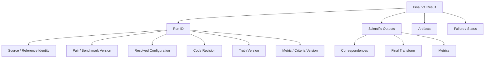
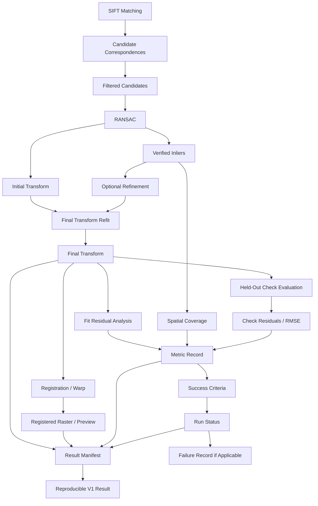
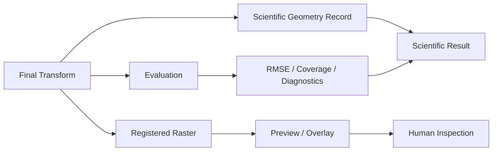
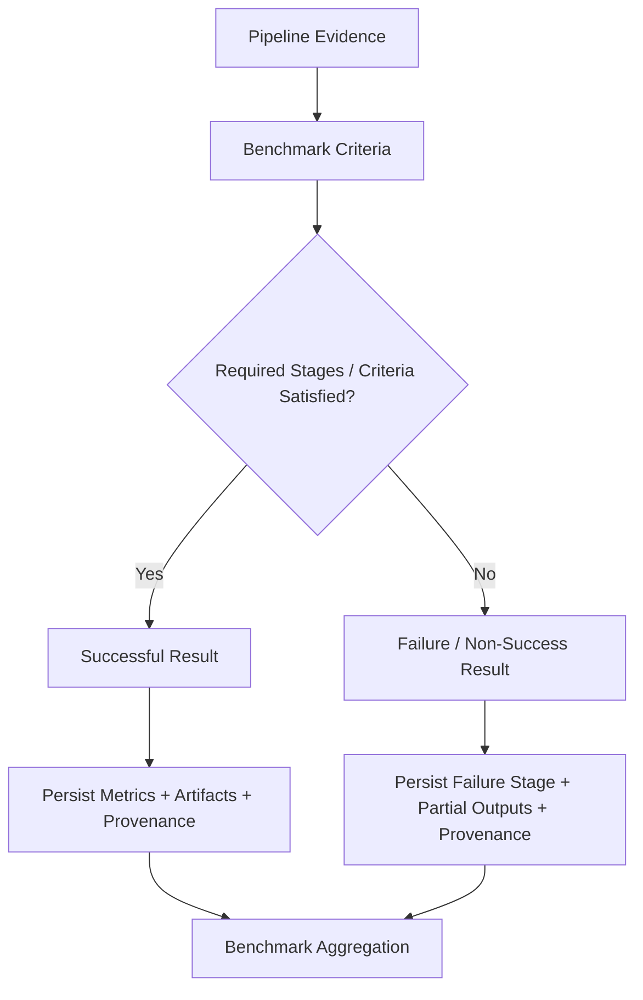

# ChandraMap V1 Outputs

> **Document role:** Authoritative V1 output contract
> **Version:** V1
> **Version role:** Classical Baseline / Registration Foundation
> **Primary task:** Known-overlap local lunar image registration
> **Output scope:** Scientific results, diagnostics, evaluation evidence, failures, artifacts, and reproducibility metadata
> **Implementation status:** This document defines V1 output semantics; it does not assert that every output is currently implemented.

This document defines the scientifically meaningful outputs produced by a **ChandraMap V1** run.

V1 output is not limited to an aligned image. A scientifically useful registration result must preserve enough evidence to determine:

- what source/reference pair was processed;
- what correspondences were proposed;
- which correspondences survived filtering;
- which correspondences were geometrically verified;
- what transformation was estimated;
- what coordinate spaces that transformation connects;
- whether refinement changed the fitting coordinates;
- what final transform was used;
- how the result was evaluated;
- whether independent truth was available;
- why the run succeeded or failed;
- which artifacts were generated;
- how the result can be reproduced.

> **The core V1 output is registration evidence, not merely a registered image.**

> **A pretty overlay is a visualization; a scientifically useful V1 result also preserves correspondences, geometry, metrics, status, and provenance.**

> **Candidate correspondences and verified inliers are different output classes.**

> **The final transform is incomplete unless its model, direction, source coordinate space, and reference coordinate space are known.**

> **Fit residuals describe agreement with the fitted model; held-out check residuals provide independent evaluation evidence.**

> **Failure is a valid scientific output.**

> **Unavailable evaluation is not zero error.**

> **Output units and coordinate spaces are part of every geometric metric's meaning.**

> **A result without provenance is incomplete scientific evidence.**

> **V1 outputs must remain interpretable after V2, V3, and V4 exist so the classical baseline can still be compared fairly.**

> **V1 outputs should let another contributor inspect what matched, what geometry was estimated, how the result was evaluated, why it passed or failed, and how the result can be reproduced.**

---

## 1. Relationship to Other V1 Documents

The V1 documentation set has distinct responsibilities.

| Document                                 | Responsibility                                                                                                    |
| ---------------------------------------- | ----------------------------------------------------------------------------------------------------------------- |
| [`README.md`](./README.md)               | V1 overview and navigation                                                                                        |
| [`scope.md`](./scope.md)                 | Defines what belongs inside and outside V1                                                                        |
| [`specification.md`](./specification.md) | Defines V1 scientific and engineering behavior                                                                    |
| [`requirements.md`](./requirements.md)   | Defines verifiable V1 requirements                                                                                |
| [`architecture.md`](./architecture.md)   | Defines architectural responsibilities and component boundaries                                                   |
| [`pipeline.md`](./pipeline.md)           | Defines V1 execution order                                                                                        |
| [`inputs.md`](./inputs.md)               | Defines data and context entering the V1 pipeline                                                                 |
| **`outputs.md`**                         | Defines scientific, diagnostic, evaluation, failure, artifact, and provenance information leaving the V1 pipeline |

This file defines **what V1 outputs mean**.

It does not redefine:

- V1 scope;
- pipeline ordering;
- algorithm internals;
- benchmark thresholds;
- storage implementation;
- frontend presentation.

---

## 2. Relationship to Project-Wide Output Flow

The project-wide architecture documents describe how information moves across ChandraMap as a whole.

Especially relevant are:

- [Data Flow](../../architecture/data-flow.md)
- [Output Flow](../../architecture/output-flow.md)

The distinction is:

```text
../../architecture/data-flow.md
→ describes the upstream scientific data flow

../../architecture/output-flow.md
→ describes project-wide movement and consumption of outputs

docs/versions/v1/outputs.md
→ defines V1-specific output semantics and scientific contracts
```

This file must remain consistent with those architecture documents.

---

# 3. Output Classification Model

Not every object generated during execution has the same scientific role.

## Core Scientific Output

Required to describe the registration result itself.

Examples:

- verified correspondences;
- final transform;
- run status.

## Conditional Scientific Output

Required only when the corresponding stage or data exists.

Examples:

- refinement output;
- geolocation output;
- held-out check metrics.

## Evaluation Output

Produced by evaluation logic.

Examples:

- fit residuals;
- check RMSE;
- spatial coverage;
- success-criteria result.

## Diagnostic Output

Useful for understanding or debugging execution.

Examples:

- keypoint counts;
- candidate counts;
- filter diagnostics;
- stage timing.

## Visual Artifact

Human-readable visualization.

Examples:

- match visualization;
- inlier overlay;
- registered preview;
- residual plot.

## Reproducibility Output

Context required to reconstruct or audit a result.

Examples:

- code revision;
- pair version;
- resolved configuration;
- truth version.

## Failure Output

Structured evidence describing unsuccessful execution.

## Benchmark Aggregate

Derived from multiple V1 runs.

A benchmark aggregate is not a direct single-run registration output.

## Temporary / Intermediate Output

Implementation data that does not automatically become part of the formal scientific result.

Temporary intermediates may be useful for debugging, but V1 does not require every intermediate array to be persisted.

---

# 4. Outputs at a Glance

| Output                    | Classification                         | Purpose                                                 |
| ------------------------- | -------------------------------------- | ------------------------------------------------------- |
| Run status                | Core scientific                        | Identifies final run state                              |
| Run identity              | Core / reproducibility                 | Identifies the exact execution                          |
| Pair identity             | Core                                   | Identifies the source/reference pair                    |
| Candidate correspondences | Core scientific/diagnostic             | Matcher-proposed relationships                          |
| Filtered correspondences  | Core diagnostic                        | Candidate subset entering geometry                      |
| Verified inliers          | Core scientific                        | Model-consistent geometric support                      |
| Initial transform         | Conditional scientific                 | Geometry before optional refinement/refit               |
| Final transform           | Core scientific on successful geometry | Final source-to-reference mapping                       |
| Refinement record         | Conditional                            | Records optional coordinate refinement                  |
| Registered raster         | Conditional scientific                 | Source resampled into configured reference/output frame |
| Registered preview        | Visual artifact                        | Human inspection                                        |
| Fit residuals             | Evaluation/diagnostic                  | Agreement with fitting points                           |
| Spatial coverage          | Evaluation                             | Distribution of geometric support                       |
| Check-point metrics       | Conditional evaluation                 | Independent registration evidence                       |
| Runtime                   | Engineering diagnostic                 | Execution-cost context                                  |
| Warnings                  | Diagnostic                             | Non-fatal conditions affecting interpretation           |
| Failure record            | Core on failure                        | Preserves unsuccessful execution                        |
| Result manifest           | Core / reproducibility                 | Connects outputs and provenance                         |
| Visualizations            | Optional diagnostic                    | Human-readable interpretation                           |
| Benchmark summary         | Benchmark aggregate                    | Multi-run comparison                                    |

---

# 5. Top-Level V1 Output Groups

A formal V1 result may conceptually contain:

1. Run identity and status
2. Source/reference context
3. Candidate correspondence outputs
4. Filtered correspondence outputs
5. Geometric verification outputs
6. Transformation outputs
7. Refinement outputs
8. Registration outputs
9. Residual outputs
10. Spatial-coverage outputs
11. Held-out evaluation outputs
12. Runtime and engineering outputs
13. Warning and failure outputs
14. Visualization and artifact outputs
15. Reproducibility/provenance outputs
16. Benchmark-summary outputs

These groups describe scientific meaning, not an exact implementation schema.

---

# 6. Run Status

Every formal V1 run should terminate with a clearly interpretable state.

Possible conceptual states may include:

- successful;
- failed;
- completed with limited evaluation;
- diagnostic/partial completion.

These are examples of semantics, not required enum names.

The implementation may represent states differently.

## Status requirements

The final state should be:

- machine-readable;
- human-interpretable;
- attached to the run identity;
- suitable for benchmark aggregation.

> Failure must not be represented only by a missing output directory, disappearing exception, or absent row in benchmark reporting.

---

# 7. Run Identity Output

A formal V1 result should preserve or reference enough information to uniquely identify the execution.

Conceptually this includes:

- run ID;
- ChandraMap research version;
- benchmark version where applicable;
- pair ID/version;
- source asset identity;
- reference asset identity;
- configuration identity;
- truth version where applicable;
- code revision.

Together these define the identity of the scientific result.

A machine-local filename alone is not sufficient scientific identity.

---

# 8. Source and Reference Context Output

Although source/reference information originates as input, the final result should preserve enough context to identify what was actually processed.

## Source context

May include or reference:

- mission;
- instrument;
- asset/product ID;
- representation identity;
- source coordinate space;
- relevant crop/prepared representation context.

## Reference context

May include or reference:

- mission;
- instrument;
- asset/product ID;
- reference tile/ROI;
- reference pyramid level;
- effective scale;
- reference coordinate space.

The result does not need to duplicate the entire input manifest.

Stable identifiers and references are preferable where suitable.

---

# 9. Candidate Correspondence Output

The local matcher produces **candidate correspondences**.

> **Candidate correspondence means proposed match, not verified truth.**

A candidate correspondence conceptually preserves:

- source coordinate;
- reference coordinate;
- source coordinate space;
- reference coordinate space;
- matcher identity;
- matcher-specific score where available;
- candidate identity where the implementation uses one.

Candidate correspondences are algorithm proposals.

They have not yet passed geometric verification.

---

# 10. Conceptual Candidate Record

The following is an **illustrative conceptual output structure — not an implemented schema**.

```yaml
candidate:
  id: PLACEHOLDER_CANDIDATE_ID

  source:
    x: PLACEHOLDER
    y: PLACEHOLDER
    coordinate_space: PLACEHOLDER_SOURCE_SPACE

  reference:
    x: PLACEHOLDER
    y: PLACEHOLDER
    coordinate_space: PLACEHOLDER_REFERENCE_SPACE

  matcher:
    method: sift
    score: PLACEHOLDER
    score_semantics: PLACEHOLDER
```

A matcher score must retain its matcher-specific meaning.

It must not automatically be interpreted as a universal probability of correctness.

---

# 11. Filtered Correspondence Output

See [Match Filtering](../../algorithms/match-filtering.md).

After candidate filtering, V1 may preserve:

- candidate count before filtering;
- filtered candidate count;
- filtered candidate set;
- filter configuration identity;
- optional rejection diagnostics.

Potential filtering may involve:

- validity checks;
- duplicate handling;
- descriptor-ratio rules;
- mutual/cross-check consistency.

> **Filtered correspondence ≠ verified inlier.**

Passing descriptor-level filters does not prove geometric correctness.

---

# 12. Match-Count Outputs

Useful count outputs may include:

- source keypoint count;
- reference keypoint count;
- candidate correspondence count;
- filtered candidate count;
- verified inlier count;
- outlier count where retained.

These values are useful diagnostics.

They are not accuracy percentages.

For example:

```text
many candidate matches
≠
accurate registration
```

and:

```text
many inliers
≠
independently validated geometry
```

---

# 13. Geometric Verification Output

See [RANSAC](../../algorithms/ransac.md).

Geometric verification may conceptually produce:

- verified inlier set/mask;
- outlier set/mask where retained;
- initial model;
- model type;
- fitting status;
- model residual information;
- candidate population used for verification;
- geometry diagnostics.

> **RANSAC inliers are model-consistent candidates. They are not independent ground truth.**

This distinction must remain visible in output terminology.

---

# 14. Verified Inlier Output

Each verified inlier should conceptually preserve enough information to reconstruct its geometric role.

Potential information includes:

- source coordinates;
- reference coordinates;
- source coordinate space;
- reference coordinate space;
- relationship to original candidate;
- model-consistent state;
- residual under the estimated model where useful;
- original and refined coordinates where refinement is enabled.

A verified inlier is evidence supporting the model.

It remains algorithm output rather than externally validated truth.

---

# 15. Inlier Ratio Output

See [Metrics](../../evaluation/metrics.md).

Conceptually:

$$
\text{Inlier Ratio}
=
\frac{N_{\text{verified inliers}}}
{N_{\text{candidates used for geometric verification}}}
$$

A reported inlier ratio should preserve enough context to identify the denominator.

A bare statement such as:

```text
inlier ratio = 0.X
```

is incomplete if it is unclear whether the denominator is:

- all matcher candidates;
- filtered candidates;
- candidates actually supplied to RANSAC;
- another population.

---

# 16. Inlier Ratio Is Not Accuracy

A high inlier ratio may still occur when:

- very few candidates exist;
- correspondences are clustered;
- terrain is repetitive;
- the wrong region produces a consistent local model;
- the transform does not generalize across the overlap.

Therefore:

> **Inlier ratio is a geometric-support diagnostic, not overall registration accuracy.**

---

# 17. Initial Transform

The **initial transform** is the geometric model produced by robust verification before optional refinement and final refitting.

Conceptually it should preserve:

- model type;
- transform direction;
- source coordinate space;
- reference coordinate space;
- model parameters;
- fit-point population;
- estimation stage;
- validity/status.

The initial transform becomes especially important when V1 performs sub-pixel refinement.

---

# 18. Final Transform

The final transform is one of the most important V1 outputs.

> **The final transform is incomplete unless its model, direction, source coordinate space, and reference coordinate space are known.**

The final transform should conceptually identify:

- model type;
- scientific direction;
- source coordinate space;
- reference coordinate space;
- parameters;
- fitting population;
- whether refined coordinates were used;
- final estimation/refit stage;
- validity/status.

The recommended scientific convention is:

```text
source → reference
```

This convention should remain independent of internal raster-warp sampling direction.

---

# 19. Conceptual Transform Record

The following is **conceptual only**.

```yaml
transform:
  stage: final
  model: PLACEHOLDER_MODEL
  direction: source_to_reference

  source_space: PLACEHOLDER_SOURCE_SPACE
  reference_space: PLACEHOLDER_REFERENCE_SPACE

  parameters: PLACEHOLDER_PARAMETERS

  fitting:
    point_set: PLACEHOLDER_POINT_SET
    refined_coordinates: PLACEHOLDER_BOOLEAN

  status: PLACEHOLDER_STATUS
```

This document does not prescribe JSON, YAML, NumPy, or any other storage format.

---

# 20. Affine / Homography Output Context

See [Transforms](../../algorithms/transforms.md).

V1 may produce an affine or homography transform according to benchmark/configuration rules.

Their parameterizations differ.

Therefore:

- do not compare their parameter arrays as though they had identical meanings;
- do not assume a homography is better solely because it is more flexible;
- do not claim a homography is a complete physical model of lunar terrain.

Affine and homography are local approximation models.

---

# 21. Transform Validity Output

A result should distinguish:

```text
transform estimated
```

from:

```text
transform usable/valid for configured task
```

Potential conceptual validity information may include:

- finite parameters;
- model estimation succeeded;
- geometry non-degenerate;
- invertibility where required;
- coordinate spaces known;
- fitting population valid;
- final status.

No universal transform-quality threshold is defined here.

---

# 22. Refinement Output

See [Sub-Pixel Refinement](../../algorithms/subpixel-refinement.md).

If refinement is enabled, V1 should conceptually preserve:

- whether refinement was enabled;
- refinement method/config identity;
- original fit coordinates;
- refined fit coordinates;
- refinement success/rejection state;
- final transform refit state.

> **Refinement changes coordinate estimates, not the physical resolution of the source sensor.**

A coordinate such as:

```text
x = 123.4
y = 87.7
```

does not imply that the source instrument acquired new physical detail between pixels.

---

# 23. Before / After Refinement Output

Where benchmark or ablation analysis requires it, V1 may preserve enough information to compare:

- initial transform;
- final transform;
- pre-refinement fit residual;
- post-refinement fit residual;
- pre-refinement independent check error;
- post-refinement independent check error.

This comparison is useful for determining whether refinement actually improves independent geometry.

It is not necessary for every minimal V1 run unless the benchmark requires it.

---

# 24. Registration Output

See [Registration](../../algorithms/registration.md).

Registration outputs may include:

- aligned/warped source raster;
- output-grid metadata;
- valid-overlap region;
- validity mask;
- registered preview;
- interpolation/resampling context.

The registered raster is derived from the final transform.

> **The registered raster does not replace the final transform record.**

Preserving only the raster would lose important geometric information.

---

# 25. Scientific Raster vs Registered Preview

These outputs have different roles.

## Scientific registered raster

May preserve:

- scientific pixel values;
- defined output grid;
- mask/nodata semantics;
- numerical precision;
- coordinate context.

## Registered preview

Designed primarily for human inspection.

It may involve:

- display normalization;
- contrast adjustment;
- visualization compositing;
- downsampling.

A display-normalized image must not automatically be treated as equivalent to the scientific registered raster.

---

# 26. Warp Metadata Output

Where a registered raster is generated, enough context should be retained to understand:

- source asset;
- final transform;
- source coordinate space;
- output/reference coordinate space;
- output grid;
- interpolation/resampling method where relevant;
- mask/nodata behavior.

This document does not define one universal interpolation algorithm.

---

# 27. Overlay and Visual Output

Possible visual artifacts may include:

- transparency overlay;
- checkerboard comparison;
- side-by-side comparison;
- edge/contour overlay;
- difference-style visualization where meaningful.

No single visualization style is required.

> **Visualization helps humans inspect a result; it does not replace quantitative geometric evaluation.**

---

# 28. Residual Output

See [Residual Analysis](../../algorithms/residual-analysis.md).

Conceptually, for point \(i\):

$$
\mathbf{r}_i
=
\mathbf{p}^{observed}_i
-
T(\mathbf{p}^{source}_i)
$$

and residual magnitude may be written as:

$$
e_i = \lVert \mathbf{r}_i \rVert
$$

Residual outputs should preserve enough context to identify:

- point population;
- coordinate space;
- transform direction;
- sign convention;
- units;
- number of observations;
- summary statistics;
- point-level residuals where required.

---

# 29. Fit Residual Output

Fit residuals are computed using points that contributed to model fitting.

Possible summaries may include, where benchmark/configuration requires:

- RMSE;
- mean residual;
- median residual;
- percentiles;
- x/y bias;
- maximum residual.

Not every statistic is mandatory.

> **Low fit residual does not by itself demonstrate independent registration accuracy because the same points helped determine the transform.**

---

# 30. Held-Out Check Output

See [Check-Point Evaluation](../../evaluation/checkpoint-evaluation.md).

Where valid independent truth exists, check-point outputs should conceptually preserve:

- check-point set/version;
- valid check count;
- source coordinates;
- predicted reference coordinates;
- truth reference coordinates;
- residual vectors;
- error magnitudes;
- check RMSE;
- coordinate spaces;
- units;
- check-point coverage where defined.

Held-out check points must remain independent of final transform fitting.

---

# 31. Conceptual Check-Point Record

The following is **conceptual only**.

```yaml
check_point_result:
  point_id: PLACEHOLDER_POINT_ID

  source:
    x: PLACEHOLDER
    y: PLACEHOLDER
    coordinate_space: PLACEHOLDER_SOURCE_SPACE

  predicted_reference:
    x: PLACEHOLDER
    y: PLACEHOLDER
    coordinate_space: PLACEHOLDER_REFERENCE_SPACE

  truth_reference:
    x: PLACEHOLDER
    y: PLACEHOLDER
    coordinate_space: PLACEHOLDER_REFERENCE_SPACE

  residual:
    dx: PLACEHOLDER
    dy: PLACEHOLDER
    magnitude: PLACEHOLDER
    units: PLACEHOLDER_UNITS
```

---

# 32. Check RMSE Output

See [Metrics](../../evaluation/metrics.md).

Conceptually:

$$
RMSE =
\sqrt{
\frac{1}{N}
\sum_{i=1}^{N}
e_i^2
}
$$

A check RMSE result should preserve:

- metric identity;
- check-point population;
- \(N\);
- coordinate space;
- units;
- truth version;
- aggregation semantics.

A bare RMSE number is incomplete.

For example:

```text
RMSE = 1.2
```

has little scientific meaning unless it is known whether `1.2` means:

- source pixels;
- reference pixels;
- pyramid-level pixels;
- metres;
- another coordinate-space unit.

---

# 33. Source-Space Error Output

V1 should report source-image pixel error where scientifically defined.

This is useful because source instruments such as:

- OHRC;
- TMC-2;
- IIRS-derived representations;

have very different physical scales.

However, if residuals are measured in reference coordinates, source-space error requires a valid conversion or inverse mapping.

> Reference pixels must not simply be relabeled as source pixels.

---

# 34. Reference-Space Error Output

Reference-space error may also be reported.

If it is reported, preserve enough context to identify:

- reference asset;
- reference tile/ROI;
- reference pyramid level;
- effective reference scale;
- coordinate space;
- units.

A pyramid-level pixel is not automatically equivalent to a native-reference pixel.

---

# 35. Ground-Space / Metre Error Output

Physical lunar-ground error may be reported only when the conversion is scientifically valid.

Relevant conditions may include:

- valid spatial metadata;
- valid coordinate mapping;
- appropriate reference projection/geospatial context;
- meaningful local scale;
- correct metric units.

Do not blindly calculate:

```text
pixel_error × approximate_sensor_GSD
```

and call the result:

```text
absolute lunar geolocation error
```

without validating what coordinate space the original pixel error belongs to.

---

# 36. Geolocation Output

Geolocation is conditional.

If a trusted geospatial reference and valid lunar spatial metadata are available, V1 may output:

- reference-linked projected coordinates;
- lunar geographic coordinates;
- other geospatial coordinates defined by the data.

However:

```text
successful image-to-image registration
≠
independently validated absolute geolocation
```

Registration and geolocation must remain conceptually separate claims.

---

# 37. Spatial-Coverage Output

See [Spatial Coverage](../../evaluation/spatial-coverage.md).

A coverage result should preserve:

- point population;
- valid region;
- coordinate space;
- method;
- method/configuration version;
- resulting statistic(s).

Possible methods may include:

- grid occupancy;
- convex-hull support;
- regional/quadrant distribution;
- another benchmark-defined strategy.

No universal V1 coverage threshold is defined here.

> **Spatial coverage measures distribution of support; it does not prove that the support is correct.**

A result can have high coverage and still be geometrically inaccurate.

---

# 38. Coverage Visualization Output

Possible supporting artifacts include:

- occupied-grid visualization;
- point-distribution overlay;
- convex-hull visualization;
- region-density diagnostic.

Coverage visualizations should label the point population they represent.

For example:

```text
verified-inlier coverage
```

and:

```text
held-out-check coverage
```

must not be confused.

---

# 39. Success-Criteria Output

See [Success Criteria](../../evaluation/success-criteria.md).

V1 should separate:

```text
metric calculation
```

from:

```text
success/failure interpretation
```

Conceptually:

```text
Metrics
  +
Benchmark Criteria Version
  ↓
Final Benchmark Status
```

A formal result may preserve:

- criteria/rule-set identity;
- final status;
- failed criterion/reason where useful.

Arbitrary thresholds must not be hidden inside unrelated algorithm outputs.

---

# 40. Successful Result Output

A successful V1 result should conceptually contain enough evidence to identify:

- valid final transform;
- correspondence evidence;
- geometric support;
- applicable evaluation metrics;
- success status;
- provenance;
- relevant artifacts.

Success must not be defined simply as:

```text
registered image exists
```

---

# 41. Failure Output

See [Failure Cases](../../evaluation/failure-cases.md).

A failed V1 run is still a formal scientific result.

A failure record should conceptually preserve:

- run ID;
- pair ID;
- final state;
- observed failure stage;
- last successful stage;
- diagnostic context;
- partial outputs;
- counts/metrics available before failure;
- warnings;
- configuration/provenance;
- diagnostic artifacts where useful.

> **Failure stage is an observation; root cause may require later diagnosis.**

---

# 42. Failure Stage vs Root Cause

Example:

```text
Observed failure stage:
RANSAC / geometric verification

Possible upstream cause:
physical scale mismatch
```

This is not equivalent to:

```text
Confirmed root cause:
RANSAC
```

The stage where execution fails is not automatically the underlying scientific cause.

Possible upstream causes may include:

- wrong reference;
- poor preprocessing;
- low common information;
- severe scale mismatch;
- repetitive terrain;
- insufficient spatial support.

Root-cause claims should remain evidence-based.

---

# 43. Conceptual Failure Record

The following is **conceptual only**.

```yaml
failure:
  run_id: PLACEHOLDER_RUN_ID
  pair_id: PLACEHOLDER_PAIR_ID

  observed_stage: PLACEHOLDER_STAGE
  last_successful_stage: PLACEHOLDER_STAGE

  status: PLACEHOLDER_STATUS
  diagnostic: PLACEHOLDER_MESSAGE_OR_CODE

  partial_results:
    candidate_count: PLACEHOLDER_OR_UNAVAILABLE
    filtered_count: PLACEHOLDER_OR_UNAVAILABLE
    inlier_count: PLACEHOLDER_OR_UNAVAILABLE

  suspected_cause:
    value: PLACEHOLDER_OR_UNKNOWN
    confidence: PLACEHOLDER_OR_NOT_ASSESSED
```

No actual status code or diagnosis format is prescribed here.

---

# 44. Unavailable Is Not Zero

> **Unavailable evaluation is not zero error.**

Do not encode:

```text
missing RMSE = 0
```

unless zero was genuinely measured.

Likewise, do not encode:

```text
missing coverage = 0
```

unless the metric was evaluated and the scientific result is actually zero.

Conceptual availability states may include:

- unavailable;
- not applicable;
- not evaluated.

Exact serialization is implementation-defined.

---

# 45. Partial Outputs

A run may fail after scientifically useful evidence has already been generated.

Example:

```text
SIFT completed
→ matching completed
→ filtering completed
→ RANSAC failed
```

Useful retained evidence may include:

- source/reference keypoint counts;
- candidate count;
- filtered candidate count;
- candidate visualizations;
- filter diagnostics;
- provenance;
- failure stage.

Partial outputs should not be discarded simply because the final transform could not be established.

---

# 46. Warning Output

Warnings represent non-fatal conditions that affect interpretation.

Possible warning categories may include:

- missing optional metadata;
- limited truth;
- weak geometric support;
- incomplete geospatial context;
- evaluation unavailable;
- environment/reproducibility limitation.

This document does not define warning codes.

Warnings should remain distinct from fatal failure states.

---

# 47. Runtime Output

See [Metrics](../../evaluation/metrics.md).

Runtime may be reported as:

- total execution time;
- per-stage timing where supported.

Runtime should be interpreted together with relevant context such as:

- hardware;
- software environment;
- input dimensions;
- enabled stages;
- acceleration backend where applicable.

A runtime number with no environment context should not be used as a strong comparative speed claim.

---

# 48. Resource Output

Optional engineering diagnostics may include:

- memory usage;
- CPU use;
- GPU use;
- other resource measurements.

These are not mandatory for the minimal scientific V1 baseline.

No specific telemetry platform is required.

---

# 49. Keypoint and Match Visualization Output

Possible diagnostic artifacts include:

- source keypoints;
- reference keypoints;
- candidate-match lines;
- filtered candidate matches;
- verified inlier matches;
- inlier/outlier distinctions.

Every visualization should identify which stage it represents.

For example:

```text
Candidate Matches
```

should not be labeled:

```text
Verified Matches
```

unless geometric verification has actually occurred.

---

# 50. Residual Visualization Output

Potential visual artifacts include:

- residual vectors;
- residual histograms;
- residual cumulative distributions;
- spatial residual maps.

Visualizations should use the same:

- units;
- coordinate spaces;
- point populations;

as the machine-readable metric records.

---

# 51. Registered Preview Output

A registered preview may show the source aligned with the reference.

It should be linkable to:

- run ID;
- final transform;
- reference/output space.

A manually produced preview with no known run or transform provenance is weaker scientific evidence than a run-linked artifact.

---

# 52. Transform Artifact Output

The final transform may be persisted in any suitable machine-readable format chosen by the implementation.

This document does not require:

- JSON;
- YAML;
- NumPy;
- CSV;
- another exact format.

Scientifically important content includes:

- model;
- parameters;
- direction;
- source coordinate space;
- reference coordinate space;
- fitting provenance;
- run provenance.

---

# 53. Correspondence Artifact Output

Machine-readable correspondence output may contain:

- candidates;
- filtered candidates;
- inliers;
- source/reference coordinates;
- matcher scores;
- stage/state;
- refinement information;
- coordinate-space identifiers.

No particular file format is mandated.

---

# 54. Point-Level Evaluation Output

Point-level held-out evaluation records may be preserved in addition to aggregate metrics such as RMSE.

This supports:

- residual visualization;
- metric re-computation;
- error-distribution analysis;
- quality auditing;
- later scientific re-analysis.

Point-level data must still respect relevant source-data licensing and redistribution constraints.

---

# 55. Result Manifest

A formal V1 result should conceptually tie together:

```text
Run Identity
    +
Data Identity
    +
Configuration
    +
Correspondence Evidence
    +
Geometry
    +
Evaluation
    +
Status
    +
Artifacts
    +
Provenance
```

The result manifest is the conceptual anchor connecting scientific output to its context.

---

# 56. Conceptual V1 Result Manifest

The following is an **illustrative conceptual structure — not an implemented schema**.

```yaml
result:
  run:
    id: PLACEHOLDER_RUN_ID
    chandramap_version: v1
    status: PLACEHOLDER_STATUS

  benchmark:
    version: PLACEHOLDER_BENCHMARK_VERSION
    pair_id: PLACEHOLDER_PAIR_ID
    truth_version: PLACEHOLDER_TRUTH_VERSION
    success_criteria_version: PLACEHOLDER_CRITERIA_VERSION

  source:
    asset_id: PLACEHOLDER_SOURCE_ASSET
    sensor: PLACEHOLDER_SOURCE_SENSOR

  reference:
    asset_id: PLACEHOLDER_REFERENCE_ASSET
    sensor: PLACEHOLDER_REFERENCE_SENSOR
    pyramid_level: PLACEHOLDER_LEVEL

  correspondence:
    candidate_count: PLACEHOLDER_VALUE
    filtered_count: PLACEHOLDER_VALUE
    inlier_count: PLACEHOLDER_VALUE
    inlier_ratio: PLACEHOLDER_VALUE

  geometry:
    model: PLACEHOLDER_MODEL
    direction: source_to_reference
    initial_transform: PLACEHOLDER_OR_REFERENCE
    final_transform: PLACEHOLDER_OR_REFERENCE
    refinement_enabled: PLACEHOLDER_BOOLEAN

  evaluation:
    fit_residual:
      rmse: PLACEHOLDER_VALUE_OR_UNAVAILABLE
      coordinate_space: PLACEHOLDER_SPACE
      units: PLACEHOLDER_UNITS

    spatial_coverage:
      value: PLACEHOLDER_VALUE_OR_UNAVAILABLE
      method: PLACEHOLDER_METHOD

    check:
      count: PLACEHOLDER_VALUE_OR_UNAVAILABLE
      rmse: PLACEHOLDER_VALUE_OR_UNAVAILABLE
      coordinate_space: PLACEHOLDER_SPACE
      units: PLACEHOLDER_UNITS

  engineering:
    runtime: PLACEHOLDER_VALUE_OR_UNAVAILABLE

  failure:
    stage: PLACEHOLDER_OR_NULL
    diagnostic: PLACEHOLDER_OR_NULL

  artifacts:
    registered_preview: PLACEHOLDER_OR_NULL
    correspondence_visualization: PLACEHOLDER_OR_NULL
    residual_visualization: PLACEHOLDER_OR_NULL
    coverage_visualization: PLACEHOLDER_OR_NULL

  reproducibility:
    code_revision: PLACEHOLDER_REVISION
    config_id: PLACEHOLDER_CONFIG_ID
    environment: PLACEHOLDER_ENVIRONMENT_REFERENCE
```

The structure intentionally contains no fake:

- result IDs;
- metric values;
- paths;
- thresholds;
- transform matrices;
- benchmark versions.

---

# 57. Result Summary Output

A human-readable result summary may include:

- pair identity;
- source/reference sensors;
- final status;
- candidate count;
- filtered count;
- inlier count;
- inlier ratio;
- spatial coverage;
- check RMSE where available;
- units;
- runtime;
- failure stage where applicable.

The summary should reference or remain traceable to the complete result/provenance record.

---

# 58. Per-Run Output Table Template

| Pair | Source | Reference | Candidates | Filtered | Inliers | Inlier Ratio | Coverage | Check RMSE | Units | Runtime | Status |
| ---- | ------ | --------- | ---------: | -------: | ------: | -----------: | -------: | ---------: | ----- | ------: | ------ |

This table is intentionally empty.

No benchmark values should be inserted until actual measurements exist.

---

# 59. Failure Table Template

| Pair | Last Successful Stage | Failure Stage | Candidates | Filtered | Inliers | Check RMSE | Diagnostic |
| ---- | --------------------- | ------------- | ---------: | -------: | ------: | ---------: | ---------- |

Failed pairs should remain visible in formal reporting.

---

# 60. Output Directory Principles

This document does not define an exact output directory layout.

Conceptually, outputs may be grouped by:

- run;
- experiment;
- benchmark;
- ChandraMap version.

The important requirements are:

- separate runs must not silently overwrite one another;
- artifacts must remain traceable to a run;
- scientific identity must not depend solely on a filename.

---

# 61. Result Immutability

Formal benchmark evidence should remain preserved sufficiently for later comparison.

Once V1 baseline results are used as historical benchmark evidence, later V2/V3/V4 work should not silently overwrite them.

A later re-run may produce a new result.

It should not erase the historical result without traceability.

---

# 62. Output File Naming

This document does not prescribe exact filenames.

Where files are persisted, useful naming properties include:

- deterministic where appropriate;
- run-linked;
- artifact-type identifiable;
- path-portable;
- free of machine-specific assumptions.

Filename alone must not serve as the only scientific identity.

---

# 63. Artifact Identity

Important persisted artifacts should conceptually remain linked to:

- run ID;
- artifact role;
- scientific result;
- provenance.

Examples include:

- final transform;
- registered preview;
- point-level residual output;
- correspondence visualization;
- coverage visualization.

---

# 64. Artifact Checksums

Checksums may be recorded for important artifacts where exact byte identity matters.

They are not required for every temporary visualization.

This document does not prescribe a checksum algorithm.

---

# 65. Log Output

Logs may contain useful execution context such as:

- stage starts/stops;
- selected sensor route;
- selected scale;
- keypoint counts;
- candidate counts;
- inlier counts;
- transform status;
- failure diagnostics.

Logs must not become the only location containing critical scientific state.

A metric that matters to benchmarking should not exist only as a line of console text.

---

# 66. Machine-Readable vs Human-Readable Output

## Machine-readable output

Supports:

- benchmark aggregation;
- automated comparison;
- tests;
- reproducibility;
- downstream analysis.

Important scientific state should preferably be machine-readable.

## Human-readable output

Supports:

- inspection;
- debugging;
- documentation;
- scientific interpretation;
- visualization.

Examples include:

- Markdown summaries;
- plots;
- overlays;
- previews.

Both are valuable, but human-readable output should not replace the machine-readable scientific record.

---

# 67. Output Units

Every quantitative spatial result should identify its units.

Possible units include:

- source-native pixels;
- source-prepared pixels;
- reference-native pixels;
- reference-pyramid pixels;
- metres where scientifically valid;
- dimensionless ratios;
- seconds for runtime.

Avoid reporting simply:

```text
error = X pixels
```

without identifying **which pixel coordinate space**.

---

# 68. Output Coordinate Spaces

Potential V1 coordinate spaces include:

- source-native;
- source-prepared;
- source-crop;
- source-matching;
- reference-native;
- reference-tile;
- reference-pyramid;
- reference-matching;
- registered-output;
- projected map space;
- lunar geographic space where valid.

> **A numerical coordinate without its coordinate space is incomplete.**

Point, transform, and error outputs should identify the relevant coordinate spaces.

---

# 69. Coordinate Mapping Output

If an output is expressed in:

- crop coordinates;
- tile coordinates;
- pyramid coordinates;

the result should preserve enough mapping information to recover the parent asset coordinate space.

For example:

```text
reference-pyramid coordinate
→ parent reference coordinate
```

must remain reconstructable where scientific interpretation requires it.

---

# 70. Source-to-Reference Transform Direction

The scientific transform direction should be recorded independently from raster-warp implementation direction.

Recommended semantic output:

```text
source → reference
```

A raster library may internally require inverse sampling.

That does not change the scientific meaning of the stored transform.

---

# 71. Metric Output Contract

See [Metrics](../../evaluation/metrics.md).

A numeric metric should conceptually preserve:

- metric name;
- metric-definition/version;
- value;
- availability state;
- units;
- coordinate space;
- evaluated population;
- count where relevant;
- aggregation semantics.

Without these fields, a numeric value may be scientifically ambiguous.

---

# 72. Conceptual Metric Record

The following is **conceptual only**.

```yaml
metric:
  name: check_rmse
  value: PLACEHOLDER_VALUE
  units: PLACEHOLDER_UNITS
  coordinate_space: PLACEHOLDER_SPACE
  population: PLACEHOLDER_CHECK_SET
  count: PLACEHOLDER_N
  definition_version: PLACEHOLDER_VERSION
```

---

# 73. Metrics That Must Remain Distinct

Do not combine the following into one vague `accuracy score`:

- candidate count;
- filtered count;
- inlier count;
- inlier ratio;
- fit RMSE;
- check RMSE;
- spatial coverage;
- runtime.

If later versions add retrieval, also keep retrieval metrics such as `Recall@K` separate from registration metrics.

---

# 74. Generic Accuracy Percentage

Avoid output such as:

```text
accuracy = 95%
```

unless a precisely defined metric genuinely has that meaning.

Image registration quality is better described using explicitly defined:

- geometric residuals;
- RMSE;
- success/failure rate;
- spatial coverage;
- other benchmark-defined measures.

---

# 75. Benchmark Output

See [Benchmark Protocol](../../evaluation/benchmark-protocol.md).

A **per-run result** and a **benchmark summary** are different outputs.

```text
Single V1 Run
→ Per-Pair Scientific Result

Multiple V1 Runs
→ Benchmark Aggregate
```

Benchmark aggregates should not replace preservation of the per-run evidence.

---

# 76. Benchmark Aggregate Output

A benchmark aggregate may conceptually contain:

- total evaluated pairs;
- successful pair count;
- failed pair count;
- success/failure rate where defined;
- per-pair metrics;
- pair-level aggregate statistics;
- sensor-stratified summaries;
- benchmark-category summaries;
- runtime summaries.

No values are defined here.

---

# 77. Successful-Pair-Only Aggregation

If a statistic is calculated only over successful pairs, label that clearly.

For example:

```text
median check RMSE over successful registrations
```

is different from:

```text
overall V1 benchmark performance
```

Failures must not silently disappear from reporting.

---

# 78. Pair-First Aggregation

When aggregating geometric metrics, per-pair interpretation should generally occur before pooling all control/check points across the entire benchmark.

Otherwise, a pair containing many points may dominate a pair containing fewer points.

Aggregation rules should therefore be explicit.

---

# 79. Sensor-Stratified Output

Benchmark summaries may be stratified by:

- OHRC;
- TMC-2;
- IIRS-derived representation;
- LRO reference type;
- sensor pairing.

This is useful because different sensors operate at very different physical scales and modalities.

Do not collapse fundamentally different sensor conditions into one unqualified value without explanation.

---

# 80. Category-Stratified Output

See [Benchmark Categories](../../evaluation/benchmark-categories.md).

Results may be grouped by defined categories such as:

- scale condition;
- illumination condition;
- terrain type;
- sensor pair;
- modality;
- geometry condition.

Avoid undefined labels such as:

- easy;
- medium;
- hard;

unless those categories have reproducible definitions.

---

# 81. Stress-Test Output

See [Stress Tests](../../evaluation/stress-tests.md).

A stress-test result should preserve:

- base pair;
- stress condition;
- stress parameters;
- resulting metrics;
- failure status;
- run provenance.

Do not collapse all stress behavior into an undefined single `robustness score`.

---

# 82. Synthetic-Test Output

Synthetic geometry tests may compare:

```text
known transformation
vs
estimated transformation
```

Useful outputs may include:

- synthetic truth transform;
- estimated transform;
- parameter/geometric error;
- point residuals;
- seed/configuration.

Synthetic performance does not prove real cross-sensor lunar robustness.

---

# 83. Reproducibility Output

See [Reproducibility](../../evaluation/reproducibility.md).

Formal V1 result provenance should preserve or reference enough information to identify:

- source asset;
- reference asset;
- pair version;
- benchmark version;
- truth version;
- code revision;
- resolved configuration;
- preprocessing settings;
- representation identity;
- selected reference scale/level;
- SIFT settings;
- filtering settings;
- robust-estimation settings;
- transform model;
- refinement settings;
- metric definitions;
- success-rule version;
- environment context where relevant.

---

# 84. Result-to-Provenance Trace



A run ID is useful only when it leads back to the context that produced the scientific evidence.

---

# 85. V1 Output Flow



---

# 86. Scientific vs Visual Output



Visual inspection supports scientific interpretation.

It does not replace:

- geometry;
- residuals;
- independent checks;
- provenance.

---

# 87. Success / Failure Output Flow



Failures remain part of benchmark evidence.

---

# 88. Outputs and Inputs

See [`inputs.md`](./inputs.md).

The relationship is:

```text
Inputs
→ identify what the run consumed

Outputs
→ identify what the run produced
```

Formal provenance should connect the two.

A result should be traceable back to the exact source/reference and scientific context that generated it.

---

# 89. Outputs and Pipeline

See [`pipeline.md`](./pipeline.md).

The pipeline document defines:

> where and in what order outputs are produced.

This document defines:

> what those outputs mean scientifically.

---

# 90. Outputs and Architecture

See [`architecture.md`](./architecture.md).

Architecture defines:

- which component owns each responsibility;
- which stage produces each output.

This document defines:

- output semantics;
- scientific interpretation;
- output contracts.

---

# 91. Outputs and Requirements

See [`requirements.md`](./requirements.md).

Output semantics should trace to requirement categories including:

- correspondence requirements;
- transform requirements;
- registration requirements;
- metric requirements;
- failure requirements;
- reproducibility requirements.

This document does not assert current compliance status.

---

# 92. Outputs and Specification

See [`specification.md`](./specification.md).

The specification defines required V1 behavior.

This document defines the resulting scientific evidence and data products.

---

# 93. Outputs and Scope

See [`scope.md`](./scope.md).

The V1 output contract must not silently expand the version to require later-version outputs such as:

- FAISS retrieval rankings;
- global-descriptor embeddings;
- learned-model internal tensors;
- DEM products;
- global lunar retrieval output;
- multi-mission control networks.

Those outputs require a corresponding scope change or later-version specification.

---

# 94. Outputs and V1 README

See [`README.md`](./README.md).

The README gives a high-level description of what V1 produces.

This document defines the detailed semantics.

---

# 95. Outputs and Residual Analysis

See [Residual Analysis](../../algorithms/residual-analysis.md).

Residual outputs must remain explicit about:

- point population;
- transformation direction;
- coordinate space;
- units.

Residual vectors with unknown coordinate semantics are incomplete.

---

# 96. Outputs and Registration

See [Registration](../../algorithms/registration.md).

Registered raster outputs should remain traceable to the final transform that generated them.

Do not preserve only:

```text
registered image
```

while losing:

```text
final geometry
```

---

# 97. Outputs and Sub-Pixel Refinement

See [Sub-Pixel Refinement](../../algorithms/subpixel-refinement.md).

If refinement is enabled, the output should preserve whether reported final metrics correspond to:

- pre-refinement geometry;
- post-refinement final geometry.

The primary final result should correspond to the final refitted transform.

---

# 98. Outputs and Spatial Coverage

See [Spatial Coverage](../../evaluation/spatial-coverage.md).

Coverage output must identify its point population.

For example:

```text
candidate coverage
```

and:

```text
verified-inlier coverage
```

are different measurements.

They must not be compared or reported as though they mean the same thing.

---

# 99. Outputs and Check-Point Evaluation

See [Check-Point Evaluation](../../evaluation/checkpoint-evaluation.md).

Held-out check metrics must be computed on points excluded from final fitting.

Fit-point residuals must not be relabeled as check-point RMSE.

---

# 100. Outputs and Ground Truth

See [Ground Truth](../../evaluation/ground-truth.md).

Evaluation outputs should remain attached to the truth definition/version used.

If truth changes:

```text
old metric
```

should not silently be overwritten by:

```text
new metric under revised truth
```

without traceability.

---

# 101. Outputs and Control Points

See [Control Points](../../evaluation/control-points.md).

Outputs should distinguish:

- fitting/control-point metrics;
- held-out check-point metrics.

Their scientific roles are different.

---

# 102. Outputs and Failure Cases

See [Failure Cases](../../evaluation/failure-cases.md).

Failure records should remain detailed enough for later diagnosis.

A failed run should not discard partial evidence merely because the final transform could not be produced.

---

# 103. Outputs and Success Criteria

See [Success Criteria](../../evaluation/success-criteria.md).

The result should preserve or reference the rule-set/version used to translate:

```text
metrics
→
status
```

This is important for future comparability.

---

# 104. Outputs and Reproducibility

See [Reproducibility](../../evaluation/reproducibility.md).

Outputs should remain interpretable even after:

- code changes;
- configuration changes;
- truth updates;
- later ChandraMap versions.

This is why output records must carry provenance.

---

# 105. Outputs and Data Licensing

See [Data Licenses](../../data-licenses.md).

Some generated outputs may contain or derive from mission imagery.

Output redistribution may therefore depend on:

- upstream provider terms;
- attribution requirements;
- redistribution permissions.

Public availability of source data must not automatically be interpreted as unrestricted redistribution permission for every derived artifact.

---

# 106. Outputs and Security

See [Security Policy](../../../SECURITY.md).

Result, configuration, and provenance records must not require storing:

- passwords;
- access tokens;
- API keys;
- private credentials;
- secret environment variables.

Scientific reproducibility and secret management are separate concerns.

---

# 107. V1 Output Non-Goals

Core V1 outputs do not require:

- global retrieval Top-K ranking;
- FAISS similarity output;
- global descriptor embeddings;
- learned matcher attention maps;
- deep feature tensors;
- DEM/elevation model outputs;
- terrain deformation fields;
- bundle-adjustment results;
- multi-mission control networks;
- production GIS layers;
- planet-wide map tiles;
- global Moon mosaics;
- 3D globe products;
- production dashboard analytics;
- Mars/Venus registration outputs.

These may belong to later versions or downstream demonstrations.

---

# 108. Retrieval Outputs

V1 primarily uses a known or selected reference pair.

Therefore core V1 does not require:

- Recall@K;
- Top-K tile rankings;
- vector-retrieval scores;
- FAISS neighbor lists.

If retrieval is introduced in a later version, its outputs should remain distinct from registration outputs.

Conceptually:

```text
retrieval score
≠
registration accuracy
```

---

# 109. Learned-Matcher Outputs

V1's classical SIFT baseline does not require:

- learned confidence tensors;
- neural attention maps;
- training metadata;
- model checkpoint metadata.

If learned methods are tested experimentally, their candidate correspondences should map into the same general downstream contracts where scientifically appropriate:

```text
candidate
→ geometry
→ transform
→ evaluation
```

---

# 110. DEM and Advanced-Geometry Outputs

The minimum V1 output contract does not require:

- DEM-conditioned transformations;
- terrain-deformation models;
- piecewise meshes;
- full sensor-model solutions;
- bundle-adjustment products.

These are later-version or research concerns.

---

# 111. Mosaic Output

A mosaic may be generated as a downstream demonstration.

It is not the primary V1 scientific output.

The core V1 result remains:

```text
Correspondence
    +
Geometry
    +
Registration
    +
Evaluation
    +
Provenance
```

A visually good mosaic must not hide weak local registration evidence.

---

# 112. UI Output

A frontend may display:

- source/reference imagery;
- matches;
- inliers;
- transform summary;
- registered preview;
- evaluation metrics;
- status.

The UI must not become the authoritative storage location for scientific results.

A page disappearing must not mean the scientific result disappears.

---

# 113. Output Validation Testing

V1 output semantics should be testable.

## Correspondence output tests

Potential checks include:

- source/reference coordinates are valid;
- coordinate spaces are preserved;
- candidate/inlier distinction is correct;
- counts match the actual records.

## Transform output tests

Potential checks include:

- expected model representation;
- finite parameters;
- explicit transform direction;
- explicit source/reference spaces;
- transform application behaves correctly.

## Metric output tests

Potential checks include:

- correct point population;
- correct count;
- correct coordinate space;
- correct units;
- correct RMSE calculation;
- correct inlier-ratio denominator.

## Failure output tests

Potential checks include:

- failure stage preserved;
- partial outputs retained;
- unavailable metrics not encoded as zero.

## Provenance tests

Potential checks include:

- run identity present;
- pair identity present;
- configuration identity present;
- truth version connected;
- code revision connected where required.

---

# 114. Output Validation Table

| Output            | Validation Question                                   | Invalid Example                     |
| ----------------- | ----------------------------------------------------- | ----------------------------------- |
| Candidate set     | Are source/reference coordinates and spaces known?    | Coordinates with no space           |
| Filtered set      | Is filtering state distinguishable from verification? | Filtered candidate labeled verified |
| Inlier set        | Is each inlier linked to geometric verification?      | Raw matcher output labeled inlier   |
| Transform         | Are model, direction, and spaces known?               | Matrix with unknown direction       |
| Fit RMSE          | Is fitting population explicit?                       | Number labeled generic accuracy     |
| Check RMSE        | Are population, count, units, and truth known?        | Bare numeric value                  |
| Coverage          | Are point population and method known?                | Unlabeled percentage                |
| Registered raster | Is final transform/context known?                     | Orphaned image                      |
| Failure record    | Is observed failure stage preserved?                  | Exception text only                 |
| Result manifest   | Is provenance connected?                              | Metrics with no pair/config context |

---

# 115. Output Quality Checklist

The checklist is intentionally unchecked.

- [ ] Final run status is preserved
- [ ] Run identity is preserved
- [ ] ChandraMap version is preserved
- [ ] Benchmark version is preserved where applicable
- [ ] Pair identity is preserved
- [ ] Source asset identity is preserved
- [ ] Reference asset identity is preserved
- [ ] Candidate count is available
- [ ] Filtered count is available where filtering occurs
- [ ] Candidate coordinates preserve coordinate spaces
- [ ] Verified inliers are distinguishable from candidates
- [ ] Inlier count is available
- [ ] Inlier-ratio denominator is defined
- [ ] Initial transform is distinguishable from final transform
- [ ] Final transform model is identified
- [ ] Transform direction is explicit
- [ ] Transform source coordinate space is explicit
- [ ] Transform reference coordinate space is explicit
- [ ] Transform fitting population is traceable
- [ ] Refinement status is preserved where used
- [ ] Final transform reflects refined coordinates where refinement is enabled
- [ ] Registered raster/preview is linked to the final transform
- [ ] Fit residual semantics are explicit
- [ ] Fit residual is not labeled independent accuracy
- [ ] Spatial coverage identifies its point population
- [ ] Spatial-coverage method/context is preserved
- [ ] Held-out check metrics remain independent
- [ ] Check RMSE preserves count
- [ ] Check RMSE preserves units
- [ ] Check RMSE preserves coordinate space
- [ ] Truth version is linked to evaluation
- [ ] Source/reference pixel metrics are not confused
- [ ] Ground-space error is reported only when scientifically valid
- [ ] Missing evaluation is not encoded as zero
- [ ] Failure output preserves partial evidence
- [ ] Failure stage is distinct from root-cause hypothesis
- [ ] Runtime context is preserved where runtime is reported
- [ ] Critical scientific outputs are machine-readable where practical
- [ ] Visual outputs are treated as supporting evidence
- [ ] Artifacts remain linked to run identity
- [ ] Result manifest preserves provenance
- [ ] No secrets are stored in result records
- [ ] Historical V1 benchmark results are not silently overwritten

---

# 116. Output Anti-Patterns

Do **not**:

- make the registered preview the only result;
- output only a mosaic;
- call SIFT keypoints matches;
- call candidate correspondences verified inliers;
- call filtered candidates correct matches;
- call RANSAC inliers ground truth;
- call inlier ratio accuracy;
- call match count accuracy;
- call fit RMSE independent accuracy;
- silently reuse fitting points as held-out checks;
- output a transform without model identity;
- output a transform without direction;
- output a transform without coordinate spaces;
- lose crop context;
- lose tile context;
- lose reference-pyramid level;
- output bare pixel error without identifying the pixel space;
- call reference-space pixels source-space pixels;
- blindly convert approximate GSD into metres;
- encode missing RMSE as zero;
- encode missing coverage as zero;
- discard failed runs;
- discard partial evidence after failure;
- overwrite historical V1 benchmark outputs;
- preserve only human-readable logs;
- preserve only screenshots;
- keep visualization while losing numerical evidence;
- keep registered raster while losing final transform;
- report generic undefined `accuracy %`;
- mix retrieval and registration metrics;
- hide unsuccessful pairs from benchmark aggregates;
- aggregate successful runs only without saying so;
- compare outputs across different truth versions silently;
- compare metrics across changed definitions silently;
- place credentials in output manifests;
- report precision beyond what the source/reference information supports;
- imply sub-pixel coordinate localization is equivalent to sub-pixel physical lunar accuracy.

---

# 117. Claims to Avoid

V1 outputs alone do not justify statements such as:

> "The registration is correct because the overlay looks aligned."

> "High inlier ratio means high accuracy."

> "Many matches prove accurate registration."

> "Low fit RMSE proves general accuracy."

> "Sub-pixel residual means sub-pixel physical resolution."

> "Pixel RMSE directly equals ground error."

> "V1 achieves sub-metre accuracy."

> "V1 provides absolute geolocation for every pair."

> "The LRO reference is perfect independent ground truth."

> "Every output documented here is already implemented."

> "Every run produces every visualization."

> "V1 already has one fixed implemented result schema."

> "V1 is production-ready."

> "V1 solves all lunar image registration."

Claims must follow measured evidence and documented metric semantics.

---

# 118. Output Limitations

V1 output interpretation has several important limitations.

## Independent truth may be unavailable

Some runs may not have valid held-out truth.

Check RMSE should then be reported as unavailable rather than fabricated.

## Fit residuals are not independent validation

A transform can fit its fitting points well without generalizing perfectly.

## Reference uncertainty exists

Reference imagery may contain its own:

- geolocation uncertainty;
- processing uncertainty;
- projection uncertainty.

## Physical ground error may be invalid

Not every image-space error can be converted defensibly into metres.

## IIRS precision is information-limited

An IIRS-derived representation cannot support fine spatial precision that the source did not physically resolve.

## Coverage is not correctness

Distributed support can still support an incorrect model.

## Visual previews can mislead

A flexible transformation or display normalization can make an overlay appear convincing.

## Local transform models are limited

Affine/homography models may not capture strong terrain-relief or sensor-geometry differences.

## Diagnostic output may evolve

Optional artifact sets and diagnostic summaries may change as implementation matures.

## Output formats may evolve

The scientific semantics should remain stable even if serialization formats change.

## V1 output scope is intentionally narrow

Later versions may add retrieval, uncertainty, DEM-aware geometry, or multi-mission outputs.

---

# 119. V1 Outputs vs Later Versions

V1 establishes the stable output foundation:

- candidate correspondences;
- filtered candidates;
- robustly verified inliers;
- transform;
- registration;
- residuals;
- coverage;
- independent evaluation where available;
- status/failure;
- provenance.

## V2 may add

Subject to the V2 specification:

- stronger local-method diagnostics;
- richer illumination/scale ablations;
- additional refinement comparisons;
- stronger local robustness summaries.

## V3 may add

Subject to the V3 specification:

- retrieval rankings;
- Recall@K;
- Top-K reference candidates;
- global-descriptor metadata;
- learned matcher/model metadata;
- retrieval-stage failure;
- end-to-end retrieval + registration status.

## V4 may add

Subject to the V4 specification:

- DEM-aware geometry outputs;
- uncertainty estimates;
- local/piecewise geometry;
- sensor-model diagnostics;
- multi-mission outputs;
- advanced multimodal evidence.

Later-version output expansion should not change the historical meaning of the V1 baseline.

---

# 120. Output Flow Summary

A formal V1 result conceptually contains:

```text
Run Identity
      +
Source / Reference Context
      +
Candidate Correspondence Evidence
      +
Filtered Correspondence Evidence
      +
Verified Geometric Support
      +
Initial / Final Transform
      +
Registered Output
      +
Residual Diagnostics
      +
Spatial Coverage
      +
Independent Evaluation Where Available
      +
Status / Failure
      +
Artifacts
      +
Provenance
```

The core scientific result is:

```text
Correspondence
      +
Transformation
      +
Independent Evaluation Where Available
```

The core V1 principles are therefore:

> **The output is scientific evidence, not merely a picture.**

> **Candidates and inliers remain different output classes.**

> **RANSAC inliers are not ground truth.**

> **The final transform remains a first-class result.**

> **Transform direction and coordinate spaces must be explicit.**

> **Initial and final transforms remain distinguishable when refinement is used.**

> **Registered rasters remain traceable to their final transform.**

> **Fit residual and independent check error remain separate metrics.**

> **Every spatial metric carries units and coordinate-space meaning.**

> **Coverage describes distribution, not correctness.**

> **Unavailable metrics are not represented as zero.**

> **Failure remains part of benchmark evidence.**

> **Partial outputs remain useful for diagnosis.**

> **Critical scientific state should remain machine-readable.**

> **Every important artifact should remain traceable to a run.**

> **Historical V1 evidence should remain preserved so later versions can be compared fairly.**

---

# 121. Related Documentation

## Same-Directory V1 Documents

- [V1 README](./README.md) — overview and navigation.
- [V1 Specification](./specification.md) — scientific and engineering behavior.
- [V1 Scope](./scope.md) — V1 inclusion/exclusion boundary.
- [V1 Requirements](./requirements.md) — verifiable requirements.
- [V1 Architecture](./architecture.md) — component responsibilities and technical boundaries.
- [V1 Pipeline](./pipeline.md) — execution order and stage flow.
- [V1 Inputs](./inputs.md) — scientific input contract.

This document defines the corresponding V1 output contract.

---

## Parent Version Documentation

- [ChandraMap Version Architecture](../README.md)

This describes the complete V1–V4 benchmark-oriented research-version architecture.

---

## Project Documentation

- [Project Goals](../../project/goals.md)
- [Project Non-Goals](../../project/non-goals.md)
- [Project-Level V1 Scope](../../project/v1-scope.md)
- [Terminology](../../project/terminology.md)
- [Assumptions](../../project/assumptions.md)
- [Limitations](../../project/limitations.md)

Output semantics must remain consistent with the project-level V1 scope.

---

## Project-Wide Architecture Documentation

- [System Overview](../../architecture/system-overview.md)
- [V1 Pipeline](../../architecture/v1-pipeline.md)
- [Core Engine Architecture](../../architecture/core-engine-architecture.md)
- [Backend Architecture](../../architecture/backend-architecture.md)
- [Frontend Architecture](../../architecture/frontend-architecture.md)
- [Module Map](../../architecture/module-map.md)
- [Data Flow](../../architecture/data-flow.md)
- [Output Flow](../../architecture/output-flow.md)

[`../../architecture/output-flow.md`](../../architecture/output-flow.md) is the primary project-wide companion to this V1-specific output contract.

---

## Sensor Documentation

- [Sensor Overview](../../sensors/overview.md)
- [OHRC](../../sensors/ohrc.md)
- [TMC-2](../../sensors/tmc2.md)
- [IIRS](../../sensors/iirs.md)
- [LRO NAC](../../sensors/lro-nac.md)
- [LRO WAC](../../sensors/lro-wac.md)

Sensor documentation is important when interpreting output coordinate spaces, physical scales, and ground-distance claims.

---

## Dataset Documentation

- [Dataset Overview](../../datasets/README.md)
- [Chandrayaan-2 Data](../../datasets/chandrayaan-2.md)
- [LRO Data](../../datasets/lro.md)
- [Metadata](../../datasets/metadata.md)
- [Data Format](../../datasets/data-format.md)
- [Dataset Structure](../../datasets/dataset-structure.md)
- [Dataset Preparation](../../datasets/dataset-preparation.md)
- [Pair Definition](../../datasets/pair-definition.md)
- [Ground-Truth Preparation](../../datasets/ground-truth-preparation.md)

---

## Algorithm Documentation

Known algorithm documentation includes:

- [Algorithm Overview](../../algorithms/overview.md)
- [Sensor Routing](../../algorithms/sensor-routing.md)
- [Preprocessing](../../algorithms/preprocessing.md)
- [Illumination Handling](../../algorithms/illumination-handling.md)
- [Scale Pyramid](../../algorithms/scale-pyramid.md)
- [Matching](../../algorithms/matching.md)
- [Match Filtering](../../algorithms/match-filtering.md)
- [RANSAC](../../algorithms/ransac.md)
- [Transforms](../../algorithms/transforms.md)
- [Residual Analysis](../../algorithms/residual-analysis.md)
- [Sub-Pixel Refinement](../../algorithms/subpixel-refinement.md)
- [Registration](../../algorithms/registration.md)

If a dedicated `../../algorithms/sift.md` file exists, it should serve as the detailed algorithm reference for the V1 SIFT baseline.

---

## Evaluation Documentation

- [Evaluation Overview](../../evaluation/README.md)
- [Benchmark Protocol](../../evaluation/benchmark-protocol.md)
- [Benchmark Categories](../../evaluation/benchmark-categories.md)
- [Metrics](../../evaluation/metrics.md)
- [Ground Truth](../../evaluation/ground-truth.md)
- [Control Points](../../evaluation/control-points.md)
- [Check-Point Evaluation](../../evaluation/checkpoint-evaluation.md)
- [Spatial Coverage](../../evaluation/spatial-coverage.md)
- [Stress Tests](../../evaluation/stress-tests.md)
- [Success Criteria](../../evaluation/success-criteria.md)
- [Failure Cases](../../evaluation/failure-cases.md)
- [Reproducibility](../../evaluation/reproducibility.md)

These documents are especially important because most V1 output semantics are meaningful only when their evaluation definitions are explicit.

---

## Data Licensing

- [Data Licenses](../../data-licenses.md)

Mission-derived outputs may remain subject to provider attribution, redistribution, or usage obligations.

---

## Root Repository Documentation

Relevant repository-level documents include:

- [Repository README](../../../README.md)
- [Roadmap](../../../ROADMAP.md)
- [Changelog](../../../CHANGELOG.md)
- [Contributing Guide](../../../CONTRIBUTING.md)
- [Security Policy](../../../SECURITY.md)
- [Citation Metadata](../../../CITATION.cff)

---

## Benchmark, Experiment, Result, and Artifact Areas

Where applicable, repository-level research areas serve conceptually distinct purposes:

- [`../../../benchmarks/`](../../../benchmarks/) — frozen evaluation definitions;
- [`../../../experiments/`](../../../experiments/) — controlled or exploratory research runs;
- [`../../../results/`](../../../results/) — formal run and benchmark result records;
- [`../../../artifacts/`](../../../artifacts/) — generated scientific and visual artifacts.

Exact internal layouts and output filenames are intentionally not defined by this document.

---

# 122. Final V1 Output Contract

A complete V1 result should make it possible to answer:

```text
What was processed?
        ↓
Which correspondences were proposed?
        ↓
Which candidates survived filtering?
        ↓
Which candidates were geometrically verified?
        ↓
What transformation was estimated?
        ↓
Which coordinate spaces does it connect?
        ↓
Was refinement performed?
        ↓
What final transformation was used?
        ↓
What registered product was derived?
        ↓
How well did the model fit?
        ↓
How broadly was support distributed?
        ↓
What did held-out checks show?
        ↓
Did the run satisfy benchmark criteria?
        ↓
If not, where did it fail?
        ↓
Which artifacts were produced?
        ↓
Can the complete result be reproduced?
```

The V1 output contract therefore exists to ensure that ChandraMap preserves not just the **appearance** of registration, but the scientific evidence required to inspect, evaluate, reproduce, and compare it.

That evidence is what allows V1 to remain useful after more advanced ChandraMap versions exist.

<!-- Source request/context: :contentReference[oaicite:0]{index=0} -->
