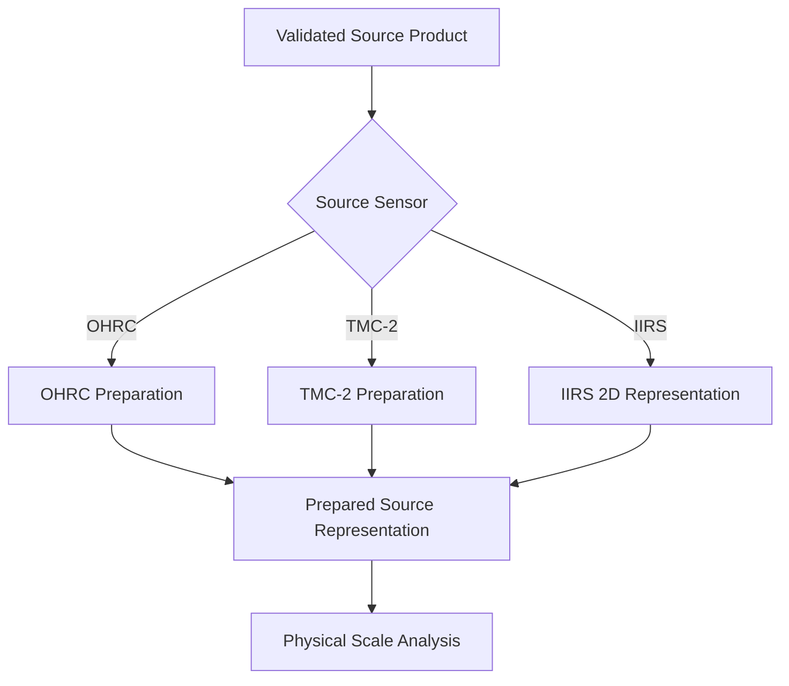
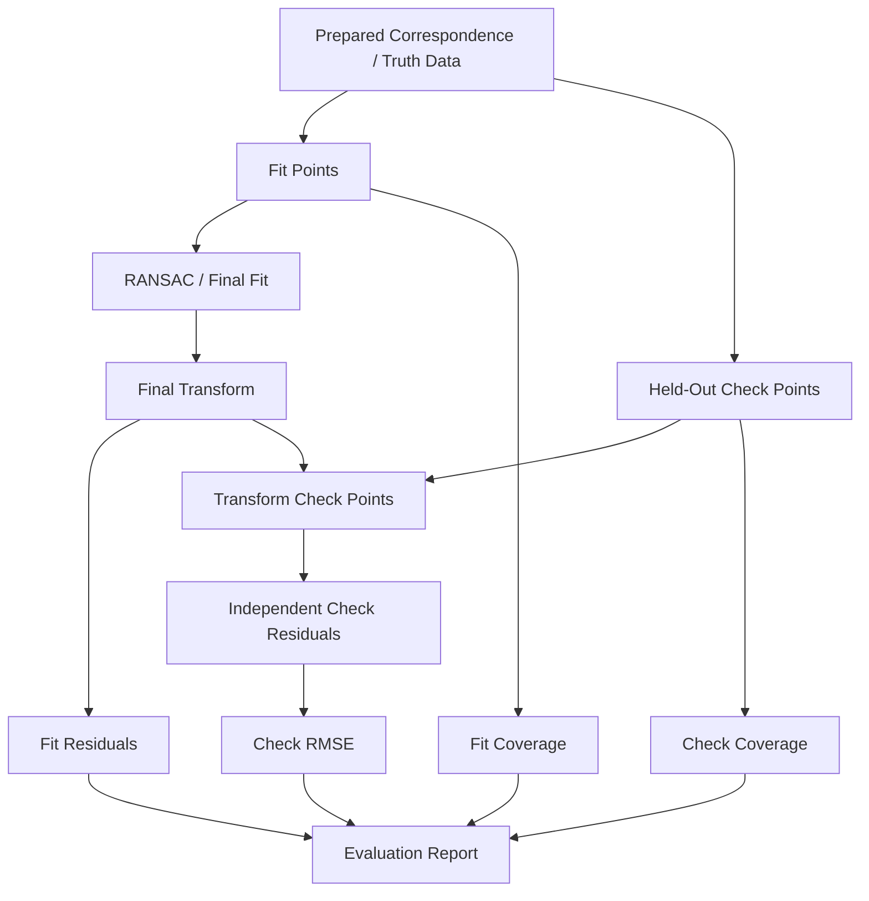
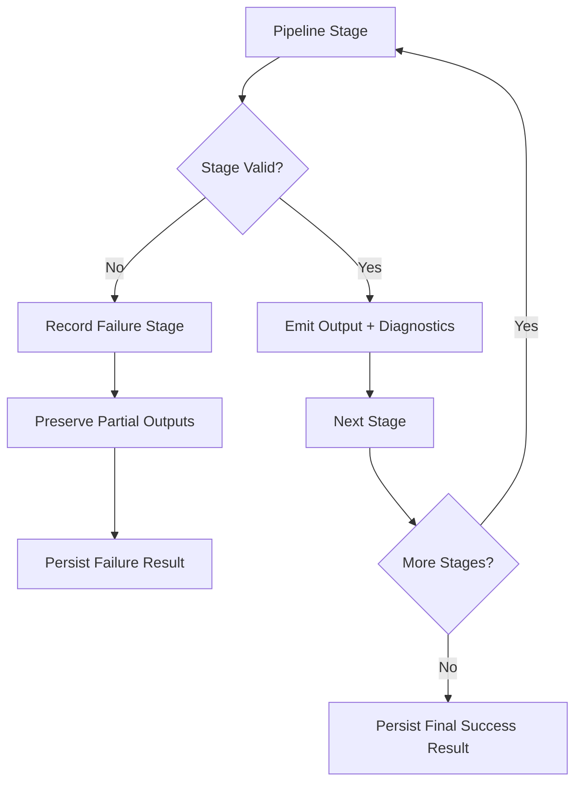
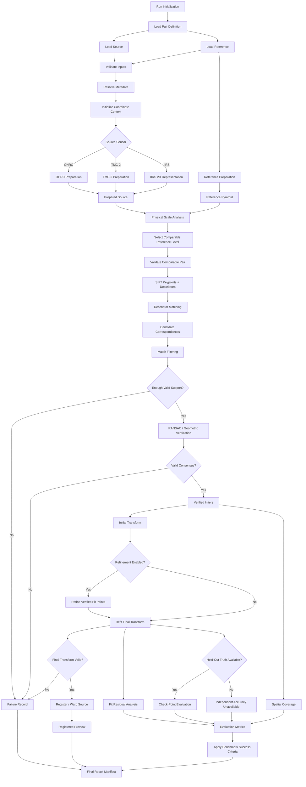

# V1 Pipeline

> **ChandraMap V1 — Authoritative Version-Specific Execution Pipeline**
> **Role:** Classical baseline / registration foundation
> **Primary task:** Known-overlap local lunar image registration

ChandraMap V1 defines a staged scientific execution pipeline for registering a known Chandrayaan-2 source image or source-derived representation against a known or selected LRO reference region.

The pipeline begins with an explicit source/reference pair and ends with either:

- candidate, filtered, and geometrically verified correspondences;
- a validated final transformation;
- a registered output or diagnostic preview;
- fit-residual and spatial-support diagnostics;
- held-out check-point accuracy where independent truth exists;
- runtime, warnings, artifacts, and provenance;
- a reproducible success/failure result;

or an explicit, reproducible failure record describing where execution stopped and what evidence was available before the failure.

> The V1 pipeline establishes a reproducible classical registration baseline by separating sensor preparation, correspondence, geometry, refinement, registration, and independent evaluation.

> **V1 is a staged scientific pipeline: every transformation of the data must preserve enough context for the next stage and for final evaluation.**

V1 is intentionally limited to **known-overlap local registration**. It is not a whole-Moon retrieval system, a learned matching stack, a DEM-aware planetary geometry engine, or a production GIS platform.

The execution order matters because later stages depend scientifically on the validity of earlier stages. A plausible-looking registered image does not repair incorrect metadata, incompatible physical scale, weak correspondences, degenerate geometry, or invalid evaluation.

## Relationship to Other V1 Documents

The V1 documentation set separates different responsibilities:

| Document                               | Responsibility                                         |
| -------------------------------------- | ------------------------------------------------------ |
| [`README.md`](README.md)               | High-level V1 overview and navigation                  |
| [`scope.md`](scope.md)                 | Defines what belongs inside and outside V1             |
| [`specification.md`](specification.md) | Defines normative V1 technical behavior and contracts  |
| [`requirements.md`](requirements.md)   | Defines testable and verifiable V1 requirements        |
| [`architecture.md`](architecture.md)   | Defines V1 modules, layers, and responsibilities       |
| **`pipeline.md`**                      | Defines the ordered scientific execution of one V1 run |

The project also maintains a project-wide V1 architecture view at [`../../architecture/v1-pipeline.md`](../../architecture/v1-pipeline.md).

The distinction is:

- `../../architecture/v1-pipeline.md` describes the project architecture view of V1 flow.
- `pipeline.md` defines the version-governed, stage-by-stage execution semantics of one V1 run.

This document must remain consistent with the architecture-level pipeline while adding the execution order, stage contracts, benchmark handoffs, failure semantics, data handoffs, and reproducibility expectations required for V1.

---

## 1. Pipeline at a Glance

The canonical V1 flow is:

**Known Pair**
→ **Validate**
→ **Resolve Metadata**
→ **Initialize Coordinate Context**
→ **Route Sensor**
→ **Sensor-Specific Preprocessing**
→ **Prepare Reference**
→ **Match Physical Scale**
→ **Select Reference Pyramid Level**
→ **Validate Comparable Representations**
→ **SIFT**
→ **Candidate Matching**
→ **Filter**
→ **RANSAC**
→ **Verified Inliers**
→ **Initial Transform**
→ **Optional Refinement**
→ **Final Refit**
→ **Transform Validation**
→ **Registration**
→ **Residual Analysis**
→ **Spatial Coverage**
→ **Held-Out Evaluation**
→ **Success/Failure Evaluation**
→ **Reproducible Result**

Several principles govern the complete flow.

> **Sensor-specific preparation happens before the common correspondence pipeline.**

OHRC, TMC-2, and IIRS are not equivalent image inputs and must not be forced through identical preprocessing.

> **Compare information, not pixel count.**

Increasing the pixel dimensions of a coarse source image does not make its physical information equivalent to a finer sensor.

> **Matcher output contains candidate correspondences; RANSAC converts a geometrically consistent subset into verified inliers.**

A raw or filtered descriptor match is not yet a geometrically verified correspondence.

> **Verify first, refine second.**

The V1 refinement order is:

**Candidates → Filtering → RANSAC → Verified Inliers → Initial Transform → Optional Sub-pixel Refinement → Final Refit → Evaluation**

> **Fit points and held-out check points follow different paths.**

Fit points estimate the transformation. Check points evaluate it independently.

> **A failed stage must stop or redirect the pipeline explicitly; it must not silently generate plausible-looking downstream output.**

> **The registered preview is an output of the pipeline, not proof that the pipeline succeeded scientifically.**

> **Every formal V1 run should end with a reproducible result record, whether the run succeeds or fails.**

---

## 2. Inputs

A V1 execution consumes a defined scientific input context rather than an arbitrary image file alone.

### 2.1 Source Asset

The source is one defined Chandrayaan-2 product or an explicitly derived registration representation associated with that product.

Supported source families within V1 scope may include:

- **OHRC** — Orbiter High Resolution Camera;
- **TMC-2** — Terrain Mapping Camera-2;
- **IIRS** — Imaging Infrared Spectrometer, where the V1 specification and benchmark permit an appropriate derived 2D registration representation.

The source identity must remain traceable after preprocessing, cropping, resampling, or representation generation.

### 2.2 Reference Asset

The reference is a known or selected LRO product or reference region corresponding to the expected overlap.

Potential reference sources include:

- **LRO NAC** for fine lunar reference imagery;
- **LRO WAC** where a benchmark explicitly uses a coarser reference or broader contextual product.

V1 does not assume that every source must use the same reference sensor or physical reference scale.

### 2.3 Pair Definition

V1 operates on an explicit source/reference relationship.

See [`../../datasets/pair-definition.md`](../../datasets/pair-definition.md).

The pair definition establishes enough context to identify:

- source asset;
- reference asset;
- pair identity;
- pair version;
- expected relationship or overlap;
- benchmark category where applicable;
- evaluation truth associated with the pair, where available.

V1 does **not** require searching the entire Moon to discover the reference region.

### 2.4 Metadata

Scientific metadata may include:

- mission;
- instrument;
- product identifier;
- image dimensions;
- processing state;
- GSD or another meaningful effective scale;
- projection information;
- coordinate context;
- footprint information;
- acquisition context;
- viewing or illumination metadata where available;
- derived-representation identity.

Product metadata is authoritative whenever available.

### 2.5 Configuration

The run consumes a resolved V1 pipeline configuration specifying applicable processing choices.

Scientifically important configuration must not exist only as undocumented runtime defaults.

### 2.6 Evaluation Truth

Where the benchmark provides independent truth, the run may additionally receive:

- held-out check points;
- manually or externally verified reference coordinates;
- truth version;
- role labels separating fit/control points from check points;
- coordinate-space and unit definitions.

Missing independent truth is not equivalent to zero error.

---

## 3. Outputs

A completed V1 run should conceptually preserve the following output classes where applicable:

- run status;
- source identifier;
- reference identifier;
- source registration representation;
- selected reference representation or pyramid level;
- candidate correspondence set;
- filtered correspondence set;
- verified RANSAC inlier set;
- rejected/outlier set where retained;
- initial transformation;
- refined fit coordinates when refinement is enabled;
- final transformation;
- fit residual diagnostics;
- spatial-coverage diagnostics;
- held-out check-point metrics where truth exists;
- registered raster or registered preview;
- overlap or validity masks where generated;
- runtime information;
- failure stage where applicable;
- warnings and limitations;
- provenance information;
- artifact references;
- resolved configuration context.

Outputs from intermediate stages may be retained even if a later stage fails.

---

## 4. Canonical V1 Execution Order

The authoritative logical execution order is:

1. Run initialization
2. Load pair definition
3. Load source product
4. Load reference product
5. Validate source/reference inputs
6. Resolve metadata
7. Establish coordinate contexts
8. Route source by sensor
9. Perform sensor-specific preprocessing
10. Build/select source registration representation
11. Prepare reference product
12. Analyze physical source/reference scale
13. Build/access reference pyramid
14. Select comparable reference scale
15. Validate comparable representations
16. Extract SIFT keypoints/descriptors
17. Perform descriptor matching
18. Create candidate correspondence set
19. Apply match filtering
20. Validate candidate population
21. Run RANSAC/geometric verification
22. Obtain verified inliers
23. Validate geometric support/degeneracy
24. Estimate initial transformation
25. Optionally refine verified fit coordinates
26. Refit final transformation
27. Validate final transformation
28. Register/warp source to reference
29. Generate registered preview/artifacts
30. Compute fit residual diagnostics
31. Compute spatial coverage
32. Load held-out check truth where available
33. Apply final transform to check points
34. Compute independent check residuals/RMSE
35. Apply benchmark-defined success criteria
36. Record success/failure
37. Persist metrics/artifacts/provenance
38. Return final V1 result

These are **logical scientific stages**, not claims about current function names, classes, package paths, or implementation status.

---

## 5. Pipeline Stage Summary

| Stage                 | Input                             | Main Responsibility                                       | Output                     | Failure Outcome                           |
| --------------------- | --------------------------------- | --------------------------------------------------------- | -------------------------- | ----------------------------------------- |
| Initialization        | Configuration + benchmark context | Establish run identity and execution context              | Run context                | Configuration failure                     |
| Pair Definition       | Pair specification                | Resolve known source/reference relationship               | Pair context               | Pair-definition failure                   |
| Validation            | Source + reference                | Verify usable inputs                                      | Validated assets           | Input failure                             |
| Metadata              | Validated assets                  | Resolve sensor, scale, projection, and scientific context | Metadata context           | Metadata limitation/failure               |
| Coordinate Context    | Assets + metadata                 | Establish coordinate-space bookkeeping                    | Coordinate context         | Coordinate-context failure                |
| Sensor Routing        | Source + metadata                 | Select sensor-specific preparation path                   | Source route               | Unsupported route                         |
| Source Preprocessing  | Routed source                     | Prepare registration representation                       | Prepared source            | Preprocessing/representation failure      |
| Reference Preparation | Reference + metadata              | Prepare reference while preserving mappings               | Prepared reference         | Reference failure                         |
| Scale Selection       | Prepared pair                     | Select physically meaningful comparable scale             | Comparable pair            | Scale-selection failure                   |
| Pre-Match Validation  | Comparable pair                   | Validate representations before extraction                | Match-ready pair           | Representation failure                    |
| SIFT                  | Comparable pair                   | Extract local keypoints/descriptors                       | Feature sets               | Feature failure                           |
| Matching              | Feature sets                      | Generate descriptor-based candidates                      | Candidate set              | Matching failure                          |
| Filtering             | Candidates                        | Remove weak/invalid candidate relationships               | Filtered candidates        | Insufficient support                      |
| Candidate Validation  | Filtered candidates               | Check model-support prerequisites                         | Valid candidate population | Insufficient geometric support            |
| RANSAC                | Filtered candidates               | Verify geometric consistency                              | Inliers + robust model     | Geometry failure                          |
| Geometry Validation   | Inliers + model                   | Detect weak/degenerate support                            | Valid geometric support    | Degeneracy failure                        |
| Initial Transform     | Verified fit points               | Define initial source→reference model                     | Initial transform          | Transform failure                         |
| Refinement            | Verified fit points               | Improve coordinate localization                           | Refined points             | Refinement failure or configured fallback |
| Final Refit           | Fit coordinates                   | Estimate transformation from final fitting coordinates    | Final transform            | Transform failure                         |
| Transform Validation  | Final transform                   | Verify model form, direction, spaces, and validity        | Validated transform        | Transform-validation failure              |
| Registration          | Source + transform                | Warp/align raster onto defined reference/output grid      | Registered output          | Registration failure                      |
| Fit Evaluation        | Fit points + transform            | Measure model agreement                                   | Fit diagnostics            | Diagnostic limitation                     |
| Coverage              | Verified support                  | Measure spatial distribution                              | Coverage metric            | Coverage unavailable/failure              |
| Check Evaluation      | Final transform + truth           | Measure independent registration error                    | Check metrics              | Truth unavailable/evaluation failure      |
| Criteria              | Evidence                          | Apply benchmark-defined interpretation                    | Benchmark status           | Evaluation failure                        |
| Result Assembly       | All available outputs             | Persist run evidence and provenance                       | Result record              | Persistence/reporting issue               |

---

## 6. Stage 0 — Run Initialization

Before image processing begins, V1 resolves the identity and scientific context of the run.

The run context may include:

- ChandraMap version;
- benchmark version;
- pair identifier;
- resolved configuration;
- truth version;
- source and reference identities;
- code revision;
- run identifier;
- reproducibility context.

The exact storage schema is implementation-defined.

The scientific requirement is simpler:

> Every later artifact and metric must be attributable to the same run identity.

Initialization should happen before expensive processing so that partial outputs and failures can also be associated with a reproducible run.

---

## 7. Stage 1 — Pair Definition

See [`../../datasets/pair-definition.md`](../../datasets/pair-definition.md).

V1 begins with a **known source/reference relationship**.

The pair-definition stage establishes:

- source asset identity;
- reference asset identity;
- expected registration task;
- pair version;
- overlap or relationship context;
- benchmark category where applicable;
- truth association where applicable.

A pair definition is part of the benchmark identity. Runtime processing must not silently replace one source or reference product with another and still report the result under the original pair identity.

### V1 Boundary

V1 does not require:

- whole-Moon image retrieval;
- global descriptor indexing;
- FAISS-based reference search;
- Top-K global candidate discovery.

Those may become parts of later versions.

---

## 8. Stage 2 — Input Validation

Validation occurs before scientific processing.

Conceptually verify that:

- the source asset is available and readable;
- the reference asset is available and readable;
- raster dimensions are valid;
- usable pixels exist;
- nodata or invalid regions are interpretable where relevant;
- source and reference representations are supported;
- pair context exists;
- required scientific context needed by later stages is obtainable.

The pipeline must not synthesize placeholder/default imagery to hide a missing or unreadable product.

If a mandatory input is invalid, the formal run should stop with an explicit input failure and persist the available run context.

---

## 9. Stage 3 — Metadata Resolution

See [`../../datasets/metadata.md`](../../datasets/metadata.md).

Metadata resolution supplies the scientific information needed for:

- sensor routing;
- physical scale comparison;
- projection and coordinate bookkeeping;
- source/reference provenance;
- transformation interpretation;
- metric interpretation;
- geospatial evaluation where valid.

Potential metadata includes:

- mission;
- instrument;
- product ID;
- product type;
- processing state;
- raster dimensions;
- pixel scale/GSD;
- projection;
- footprint;
- acquisition geometry;
- viewing geometry;
- illumination context.

Product metadata is the authoritative source when available.

The pipeline must not silently invent a missing GSD, projection, or coordinate interpretation merely to continue execution.

If metadata is unavailable but the configured V1 operation can remain scientifically valid without it, the limitation should be explicitly recorded. Otherwise, the required stage fails.

---

## 10. Stage 4 — Coordinate Context Initialization

Coordinate bookkeeping begins before cropping, resampling, pyramid construction, matching, or warping.

Possible coordinate spaces include:

- source native;
- source prepared;
- source crop;
- source-derived 2D representation;
- reference native;
- reference tile;
- reference pyramid;
- matching space;
- registered-output space;
- geospatial space where valid.

> **Coordinates without their space are incomplete scientific data.**

A point such as `(x, y)` is not sufficient by itself. The pipeline must preserve enough mapping information to understand what raster or derived representation that coordinate belongs to and how it relates to parent spaces.

This matters particularly for:

- crops;
- tiles;
- downsampling;
- image pyramids;
- IIRS-derived representations;
- sub-pixel refinement;
- final transform interpretation;
- checkpoint evaluation.

Loss of coordinate-space mappings can produce numerically valid but scientifically meaningless error measurements.

---

## 11. Stage 5 — Sensor Routing

Validated source data is routed according to its instrument and representation.

See [`../../algorithms/sensor-routing.md`](../../algorithms/sensor-routing.md) where that documentation is present in the repository.

Conceptually:

```text
Validated Source
        |
        v
   Sensor Router
   /     |      \
OHRC   TMC-2    IIRS
 |       |       |
 v       v       v
Sensor-Specific Preparation
        |
        v
Common Registration Pipeline
```

The shared correspondence pipeline begins **after** sensor-specific preparation.

> **Do not force OHRC, TMC-2, and IIRS through identical preprocessing.**

### Sensor Routing



---

## 12. OHRC Pipeline Branch

OHRC is the Chandrayaan-2 **Orbiter High Resolution Camera**.

Within current project documentation, OHRC is treated approximately around **0.25–0.32 m/pixel**, depending on product/documentation. The actual product metadata must take precedence over a generic nominal value.

Conceptual branch:

```text
OHRC Product
    ↓
Validation
    ↓
High-Resolution Optical Preparation
    ↓
Mask / Nodata Handling
    ↓
Configured Intensity or Structural Preparation
    ↓
Physical Scale Analysis
    ↓
Common Matching Pipeline
```

OHRC may contain very fine terrain detail, but high nominal resolution does not automatically make correspondence easy.

Registration can still be affected by:

- lighting differences;
- shadow movement;
- viewpoint variation;
- projection differences;
- repetitive cratered terrain;
- weak shared structure at the chosen reference scale.

The reference representation still needs to be physically meaningful relative to the OHRC product.

---

## 13. TMC-2 Pipeline Branch

TMC-2 is the Chandrayaan-2 **Terrain Mapping Camera-2**.

The project context treats TMC-2 at approximately **5 m/pixel**, subject to authoritative product metadata.

Conceptual branch:

```text
TMC-2 Product
    ↓
Validation
    ↓
Panchromatic / Terrain Preparation
    ↓
Mask / Nodata Handling
    ↓
Configured Structural or Intensity Preparation
    ↓
Physical Scale Analysis
    ↓
Common Matching Pipeline
```

TMC-2 provides a medium-resolution structural view of lunar terrain.

A major V1 requirement is that TMC-2 should not be compared blindly against the finest available NAC imagery merely because both are raster images.

The reference should be brought to a meaningful comparable effective scale before the local matcher is asked to solve registration.

---

## 14. IIRS Pipeline Branch

IIRS is the Chandrayaan-2 **Imaging Infrared Spectrometer**.

Current project context treats IIRS approximately as:

- spatial scale around **80 m/pixel**;
- spectral coverage approximately **0.8–5.0 µm**;
- roughly **250–256 spectral bands**, depending on product/documentation.

Actual product documentation and metadata remain authoritative.

Unlike OHRC or TMC-2, IIRS must not be treated simply as another ordinary grayscale camera image.

### Conceptual IIRS Flow

```text
IIRS Parent Cube
    ↓
Validate Cube and Metadata
    ↓
Select or Derive Registration Representation
    ↓
Produce 2D Registration-Friendly Raster
    ↓
Preserve Parent → Derived Mapping
    ↓
Physical Scale Analysis
    ↓
Common Matching Pipeline
```

The derived 2D representation may be configuration-defined or benchmark-defined.

V1 does not prescribe one universal IIRS band or one universally correct spectral transformation unless another authoritative V1 document explicitly establishes it.

Potential representations may be investigated separately, but the execution contract is:

> **IIRS must first become a documented registration-friendly 2D representation before entering the ordinary 2D SIFT pipeline.**

Do not feed a full hyperspectral cube directly into an ordinary grayscale SIFT path and treat that as equivalent to OHRC or TMC-2 processing.

The parent-product identity and mapping between the IIRS cube and the derived 2D registration representation must remain traceable.

---

## 15. Stage 6 — Sensor-Specific Preprocessing

Preprocessing is configuration-driven and sensor-aware.

See [`../../algorithms/preprocessing.md`](../../algorithms/preprocessing.md) where present.

Conceptual operations may include:

- numeric conversion;
- nodata interpretation;
- validity-mask handling;
- conservative noise handling;
- intensity normalization;
- local contrast preparation;
- structural/gradient representation generation;
- representation validity checks.

V1 must preserve the preprocessing configuration associated with the run.

There is no scientific basis for assuming that one normalization or denoising configuration is optimal for all three Chandrayaan-2 instruments.

---

## 16. Stage 7 — Illumination and Structural Preparation

Lunar surface appearance changes significantly with illumination geometry.

A difference in Sun angle can alter:

- shadow direction;
- shadow length;
- visible relief;
- apparent crater-rim structure;
- local contrast;
- which terrain details dominate the image.

Configured V1 experiments may use simple operations such as:

- conservative contrast normalization;
- local normalization;
- edge/gradient representations;
- other simple structure-focused representations.

These operations must not be described as producing complete illumination invariance.

> Contrast normalization may modify brightness distributions; it cannot guarantee that terrain under different shadow geometry becomes equivalent.

The V1 objective is not to claim complete Sun-angle invariance. It is to establish a measurable baseline and retain enough structure to test whether simple preprocessing improves matching.

---

## 17. Stage 8 — Reference Preparation

The reference product is independently validated and prepared.

Conceptually:

```text
LRO Reference
    ↓
Validation
    ↓
Raster Preparation
    ↓
Mask / Validity Handling
    ↓
Coordinate Preservation
    ↓
Reference Pyramid / Scale Manager
```

Reference preparation must preserve:

- parent reference identity;
- coordinate context;
- crop/tile relationship;
- validity masks;
- physical scale information where available.

### 17.1 LRO NAC Reference Path

LRO NAC provides fine lunar reference imagery.

The project commonly treats NAC products as being approximately in the **0.5–2 m/pixel** range depending on product and acquisition geometry. Actual product metadata is authoritative.

Conceptual path:

```text
NAC Product
    ↓
Preparation
    ↓
Region / Tile
    ↓
Reference Pyramid
    ↓
Comparable Pyramid Level
```

The finest native NAC level is not automatically the correct level for every source sensor.

### 17.2 LRO WAC Reference Path

LRO WAC provides broader/coarser lunar reference imagery.

If WAC is used in V1, its purpose must be explicitly defined by the pair or benchmark.

V1 does not assume one fixed WAC resolution.

V1 also does not automatically introduce a global WAC→NAC retrieval hierarchy. Global or coarse-to-fine reference retrieval is a later-version capability unless explicitly brought into a V1 benchmark.

---

## 18. Stage 9 — Physical Scale Analysis

Physical scale analysis is a major V1 stage.

Conceptual inputs:

```text
Source Effective GSD / Scale
            +
Reference Effective GSD / Scale
            ↓
Physical Scale Relationship
```

> **Compare information, not pixel count.**

Image width, height, or resized pixel dimensions do not establish physical compatibility.

For example, enlarging a coarse IIRS-derived raster to match the pixel dimensions of NAC does not create terrain information that the IIRS sensor never resolved.

The purpose of scale analysis is to decide which reference representation can reasonably be compared with the physical information contained in the source.

---

## 19. Stage 10 — Reference Pyramid

A reference pyramid provides progressively coarser representations of a finer reference.

Conceptually:

```text
Fine Reference
      ↓
Reference Level 0
      ↓
Reference Level 1
      ↓
Reference Level 2
      ↓
...
```

The exact number of levels and level-generation factor are configuration-defined or implementation-defined.

Every level should preserve enough information to recover:

- level identity;
- parent reference identity;
- effective scale;
- mapping to parent-reference coordinates.

A match measured in a pyramid-level coordinate system must not later be interpreted as a native-reference coordinate without applying the corresponding mapping.

---

## 20. Stage 11 — Comparable Scale Selection

The scale manager selects a reference representation whose spatial information is meaningful relative to the prepared source.

The correct level depends on the source product and benchmark pair.

Examples conceptually include:

- **OHRC:** may use a relatively fine reference representation;
- **TMC-2:** will often require a coarser reference representation than the finest NAC product;
- **IIRS:** may require a substantially coarser or more structural reference representation.

These are not fixed universal rules.

The actual choice depends on:

- source effective scale;
- reference effective scale;
- product quality;
- representation type;
- overlap;
- configured V1 strategy.

### Scale-Selection Failure

If required physical-scale metadata is missing and no scientifically valid alternative has been defined, or if no meaningful comparable reference representation exists, the pipeline should report the limitation or failure.

It must not silently resize imagery until array dimensions happen to match and claim that the scale problem has been solved.

---

## 21. Stage 12 — Pre-Match Validation

Before feature extraction, validate the final comparable source/reference representations.

Potential checks include:

- finite non-zero dimensions;
- non-empty valid region;
- usable pixel mask;
- valid representation identity;
- known coordinate spaces;
- valid parent mappings;
- valid scale mapping;
- supported numeric representation.

This stage protects the feature extractor from receiving scientifically invalid or structurally unusable inputs.

---

## 22. Stage 13 — SIFT Extraction

The V1 classical local-feature baseline is **SIFT**.

Where available, see `../../algorithms/sift.md`.

SIFT operates independently on the source and reference representations.

### Source Output

- source keypoints;
- source descriptors.

### Reference Output

- reference keypoints;
- reference descriptors.

A **keypoint** is a detected local feature location.

A **descriptor** is a numeric representation of the local neighborhood around a feature.

Neither a keypoint nor a descriptor is itself a correspondence.

> SIFT extraction produces features. Descriptor matching produces candidate relationships between those features.

### SIFT Limitations

V1 must not claim that SIFT provides:

- arbitrary physical-scale invariance across extreme sensor GSD differences;
- complete Sun-angle invariance;
- complete cross-modality invariance;
- universal robustness on lunar imagery.

SIFT is the classical V1 baseline against which later approaches can be compared.

---

## 23. Stage 14 — Descriptor Matching

Where available, see `../../algorithms/matching.md`.

Descriptor matching takes:

```text
Source Descriptors
        +
Reference Descriptors
        ↓
Nearest-Neighbor / k-NN Relationships
        ↓
Candidate Correspondences
```

The matching algorithm may associate scores or distances with these relationships.

These are **candidate correspondences**.

They are not yet:

- geometrically verified inliers;
- ground truth;
- proof of correct registration.

---

## 24. Candidate Correspondence Contract

Every candidate correspondence should conceptually preserve enough context to identify both sides of the relationship and the coordinate systems involved.

Illustrative conceptual structure — **not an implemented schema**:

```yaml
candidate:
  source:
    x: PLACEHOLDER
    y: PLACEHOLDER
    space: PLACEHOLDER_SOURCE_SPACE

  reference:
    x: PLACEHOLDER
    y: PLACEHOLDER
    space: PLACEHOLDER_REFERENCE_SPACE

  matching:
    method: sift
    score: PLACEHOLDER
    score_semantics: PLACEHOLDER

  status:
    value: PLACEHOLDER_CANDIDATE_STATUS
```

The essential scientific requirement is that candidate coordinates remain interpretable after cropping, scale selection, and pyramid construction.

---

## 25. Stage 15 — Match Filtering

Where available, see `../../algorithms/match-filtering.md`.

Configured filtering may include:

- candidate-validity checks;
- descriptor-distance screening;
- ratio testing;
- mutual/cross-check consistency;
- duplicate removal;
- one-to-one enforcement.

Thresholds are defined outside this document by configuration, specification, or benchmark policy.

Filtering produces a **filtered candidate set**.

> **Filtered candidate ≠ verified inlier.**

Filtering improves candidate quality, but it does not independently establish geometric correctness.

### Filtering Diagnostics

Where useful and supported, retain:

- candidate count before filtering;
- candidate count after filtering;
- rejection categories;
- spatial distribution;
- score distributions.

The pipeline does not require a detailed individual explanation for every rejected candidate unless the implementation provides that level of diagnostics.

---

## 26. Stage 16 — Candidate Population Validation

Before RANSAC, confirm that the filtered candidate population can mathematically support the configured geometric model.

The exact required number of correspondences depends on the model and implementation.

This document therefore does not define one universal minimum.

Validation should consider whether there is enough independent information to attempt a meaningful model fit.

If not, stop before geometric estimation and record an **insufficient geometric support** failure.

---

## 27. Stage 17 — RANSAC / Geometric Verification

Where available, see `../../algorithms/ransac.md`.

RANSAC consumes filtered candidate correspondences and evaluates whether a subset is geometrically consistent with the configured model.

Conceptual outputs include:

- model-consistent inlier set;
- outlier mask or rejected set;
- initial robust model;
- residual information;
- status.

> **RANSAC determines consistency with the chosen geometric model; it does not establish independent truth.**

A RANSAC inlier is better described as a **verified model-consistent correspondence**, not as ground truth.

### RANSAC Flow


---

## 28. Stage 18 — Geometric Support Validation

A successful RANSAC call is not by itself sufficient evidence of reliable registration.

The resulting geometry should be checked conceptually using evidence such as:

- inlier count;
- inlier ratio;
- spatial support;
- degeneracy;
- transform validity;
- numerical stability.

A high inlier ratio can still be weak evidence when it arises from very few candidates or highly clustered points.

### Degenerate Geometry

Potential degeneracy includes:

- duplicated or near-duplicated points;
- nearly collinear support;
- strongly clustered support;
- insufficient independent constraints;
- unstable model estimation;
- numerically invalid parameters.

If the configured model cannot be supported reliably, fail explicitly.

---

## 29. Stage 19 — Initial Transform

The initial transform represents the robust model estimated from geometrically verified fitting correspondences.

It should preserve sufficient context to identify:

- model type;
- source coordinate space;
- reference coordinate space;
- transform direction;
- fitting correspondence population;
- estimation configuration.

The preferred scientific convention is:

> **source → reference**

The direction must remain explicit in both artifacts and metrics.

---

## 30. Transform Model

Where available, see `../../algorithms/transforms.md`.

V1 may use models such as:

- affine transformation;
- homography;

according to benchmark and configuration.

V1 does not define homography as universally superior.

> **The Moon is not a flat poster.**

Affine transformations and homographies are local image-registration approximations.

Their validity may degrade under:

- large spatial extent;
- significant relief;
- viewpoint changes;
- projection mismatch;
- non-planar terrain;
- sensor geometry effects.

More advanced geometry belongs to later versions or dedicated research.

---

## 31. Stage 20 — Optional Sub-Pixel Refinement

Where available, see `../../algorithms/subpixel-refinement.md`.

Sub-pixel refinement is **optional/conditional** unless another authoritative V1 document makes it mandatory for a specific benchmark.

The input is the **verified fitting correspondence set**, not every raw candidate.

Conceptually:

```text
Verified Inliers
      ↓
Local Coordinate Refinement
      ↓
Refined Fit Coordinates
```

The exact refinement algorithm is configuration-defined.

### Verify First, Refine Second

> **Candidates → Filter → RANSAC → Verified Inliers → Refine → Refit**

This is the normal V1 ordering.

The following is not the standard V1 flow:

```text
Candidates
    ↓
Refine Every Candidate
    ↓
RANSAC
```

Refining unverified candidates can spend computation improving the localization of outliers that should have been rejected first.

### Refinement Does Not Add Resolution

> **Sub-pixel refinement estimates coordinates between pixel centers; it does not create new physical sensor detail.**

A refined coordinate should not be interpreted as evidence that a coarse sensor now contains high-resolution lunar information.

---

## 32. Stage 21 — Final Transform Refit

When refinement changes fitting coordinates, the transform must be estimated again from the refined fit set.

Conceptually:

```text
Initial Transform
       +
Verified Fit Points
       ↓
Optional Coordinate Refinement
       ↓
Refined Fit Points
       ↓
Final Transform Refit
```

> A stale pre-refinement transform must not be reported as the final refined transform.

If refinement is disabled, the valid robust model may proceed as the final model according to V1 configuration.

---

## 33. Stage 22 — Final Transform Validation

Before raster registration or formal evaluation, validate the final model conceptually for:

- finite parameters;
- expected matrix/model form;
- explicit source→reference direction;
- required invertibility where applicable;
- coordinate-space consistency;
- adequate model support;
- numerical validity;
- benchmark-defined plausibility checks where defined.

This document does not impose universal translation, rotation, scale, or projective limits.

Such criteria belong in benchmark/configuration documentation if required.

---

## 34. Stage 23 — Registration / Warp

Where available, see `../../algorithms/registration.md`.

Registration is separate from transformation estimation.

Inputs may include:

- source raster or prepared source representation;
- final transformation;
- reference/output grid;
- resampling configuration;
- masks.

Outputs may include:

- registered raster;
- registered preview;
- overlap/validity mask;
- transformation artifact.

### Warping Principle

Warping changes the **sampling/grid alignment** of the source.

It does not increase its physical resolving power.

Repeated resampling should be minimized where practical because each resampling operation can alter the image representation.

---

## 35. Stage 24 — Registered Preview

A registered visualization may be produced for human inspection.

Possible forms include:

- source/reference overlay;
- transparency overlay;
- checkerboard view;
- side-by-side comparison;
- difference visualization where scientifically interpretable.

No single visualization style is mandated by V1.

> **A registered preview is supporting evidence, not the primary scientific accuracy measure.**

A flexible warp can produce a visually convincing image even when the underlying correspondence evidence is weak. Formal V1 evaluation therefore remains tied to correspondence geometry, residuals, spatial support, and held-out truth where available.

---

## 36. Stage 25 — Fit Residual Analysis

Where available, see `../../algorithms/residual-analysis.md`.

For fit correspondences, model agreement may be represented as:

$$
\mathbf{r}_i =
\mathbf{p}_{reference,i}
-
T(\mathbf{p}_{source,i})
$$

with residual magnitude:

$$
e_i = \|\mathbf{r}_i\|
$$

The sign convention, coordinate space, transform direction, and units must be stated.

Possible configured statistics include:

- RMSE;
- median error;
- x/y bias;
- percentiles;
- maximum error.

### Fit Residual Is Not Independent Accuracy

> **Residuals measured on points used to estimate the transform describe model fit, not independent registration accuracy.**

The same points should not simultaneously be treated as both fitting evidence and independent validation evidence.

---

## 37. Stage 26 — Spatial Coverage

See [`../../evaluation/spatial-coverage.md`](../../evaluation/spatial-coverage.md).

Spatial coverage measures how broadly the relevant correspondence support spans the usable overlap region.

Possible formally defined methods include:

- grid occupancy;
- convex-hull support;
- other benchmark-defined spatial-support measures.

The exact grid dimensions, coverage formula, and pass/fail threshold are not specified here.

### High Count vs. High Coverage

A large number of matches may still provide poor geometric support if they all cluster around one crater or one small portion of the overlap.

For example:

```text
200 matches around one crater
```

and:

```text
40 matches distributed across the overlap
```

represent very different spatial-support conditions.

Therefore:

> **Match count and spatial coverage must remain distinct diagnostics.**

---

## 38. Stage 27 — Held-Out Check-Point Loading

Independent evaluation truth is loaded where available.

Related documentation includes:

- [`../../evaluation/ground-truth.md`](../../evaluation/ground-truth.md)
- [`../../evaluation/control-points.md`](../../evaluation/control-points.md)
- [`../../evaluation/checkpoint-evaluation.md`](../../evaluation/checkpoint-evaluation.md)

Each held-out check point should preserve sufficient context such as:

- point identity;
- source coordinate;
- reference truth coordinate;
- source coordinate space;
- reference coordinate space;
- truth version;
- evaluation role.

### Fit / Check Separation

> **A point used to fit the final transform is not an independent check point for the same run.**

The pipeline must preserve the distinction between:

- fitting/control correspondences;
- held-out check correspondences.

Check points must not influence the fitted transform if they are intended to provide independent accuracy evidence.

---

## 39. Stage 28 — Check-Point Prediction

For each held-out source check point, apply the final transformation:

$$
\hat{\mathbf{p}}_{reference,i}
=
T_{final}(\mathbf{p}_{source,i})
$$

The predicted reference coordinate is compared with the independently established truth coordinate.

This path remains separate from final fitting.

---

## 40. Stage 29 — Independent Error

A reference-space check residual may be defined conceptually as:

$$
\mathbf{r}_i =
\mathbf{p}_{truth,i}
-
T_{final}(\mathbf{p}_{source,i})
$$

with magnitude:

$$
e_i = \|\mathbf{r}_i\|
$$

For \(N\) held-out check points:

$$
RMSE =
\sqrt{
\frac{1}{N}
\sum_{i=1}^{N}
e_i^2
}
$$

Any reported RMSE must identify:

- \(N\);
- coordinate space;
- units;
- transform direction;
- truth population/version where applicable.

### Source-Pixel Error

Where V1 requires error in source-image pixels, the conversion must be geometrically valid.

If the natural residual is measured in reference or reference-pyramid coordinates, source-space error may require:

- applying a valid inverse transformation;
- transforming both prediction and truth into a common source coordinate space;
- another formally defined symmetric or source-space evaluation procedure.

Do not relabel reference-pyramid pixels as source pixels.

### Ground-Distance Error

Convert error to metres only when supported by:

- valid geospatial mapping;
- appropriate product metadata;
- valid coordinate transformation;
- suitable reference truth.

Do not blindly compute:

```text
pixel RMSE × approximate GSD
```

and report the result as ground accuracy when the residuals are not defined in the corresponding physical image space.

### No Independent Truth

If independent check truth is unavailable, the pipeline may still produce:

- candidate/verified correspondences;
- final transformation;
- fit diagnostics;
- coverage;
- registered preview.

However, the result should state that **independent accuracy validation is unavailable**.

It must not fabricate check RMSE.

---

## 41. Fit / Check Data Flow



---

## 42. Stage 30 — Success / Failure Evaluation

See [`../../evaluation/success-criteria.md`](../../evaluation/success-criteria.md).

The pipeline produces scientific evidence.

The benchmark success criteria interpret that evidence.

Inputs may include:

- mandatory-stage status;
- geometric support;
- final-transform validity;
- spatial coverage;
- independent check error where available;
- benchmark-defined metrics;
- benchmark-defined thresholds.

This document intentionally does not define arbitrary universal pass/fail thresholds.

> **Benchmark thresholds must not be buried inside unrelated low-level stages such as SIFT or RANSAC.**

---

## 43. Failure Conditions

See [`../../evaluation/failure-cases.md`](../../evaluation/failure-cases.md).

Failures may be observed at stages including:

- input validation;
- metadata resolution;
- coordinate initialization;
- preprocessing;
- representation generation;
- scale selection;
- feature extraction;
- matching;
- filtering;
- candidate-support validation;
- geometric verification;
- geometry validation;
- transform estimation;
- refinement;
- final-transform validation;
- registration;
- evaluation;
- persistence.

The recorded **failure stage** identifies where the pipeline detected that execution could no longer continue validly.

It does not necessarily prove the underlying root cause.

For example, RANSAC may observe failure even though the underlying reason was poor illumination compatibility or scale mismatch.

### No Silent Fallback

> If RANSAC cannot produce a valid transformation, V1 must not silently substitute an identity matrix and report successful registration.

Invalid downstream processing must stop.

### Partial Results

A failed run may retain useful intermediate evidence.

Example:

```text
Candidate correspondences generated
        ↓
Filtered candidate set generated
        ↓
RANSAC failed
```

The result may preserve:

- candidate data;
- filtered candidates;
- diagnostic plots;
- candidate counts;
- failure stage;
- configuration;
- provenance.

It must not be relabeled as a successful registration.

---

## 44. Pipeline Termination Rules

A mandatory prerequisite failure stops the dependent scientific path.

| Condition                               | Required Behavior                                                                 |
| --------------------------------------- | --------------------------------------------------------------------------------- |
| Invalid source/reference input          | Stop before processing                                                            |
| Required metadata unavailable           | Stop or record explicit limitation according to the V1 specification              |
| Invalid source representation           | Stop before matching                                                              |
| No meaningful comparable scale          | Stop before feature extraction                                                    |
| No usable features/candidates           | Stop before geometric fitting                                                     |
| Insufficient geometric support          | Stop before invalid RANSAC/model fitting                                          |
| RANSAC cannot establish valid consensus | Stop before registration                                                          |
| Degenerate/invalid final transform      | Stop before raster warp                                                           |
| Registration operation fails            | Preserve transform/evaluation evidence where still valid                          |
| Held-out truth unavailable              | Continue registration if otherwise valid; mark independent evaluation unavailable |
| Result persistence fails                | Report persistence/reporting failure without pretending the formal run completed  |

Missing independent truth is therefore different from missing data required for registration.

---

## 45. Failure Flow



---

## 46. Stage 31 — Result Assembly

The final V1 result assembles available evidence from the run.

Conceptually include:

- run identity;
- pair identity;
- source/reference identities;
- preparation context;
- source representation;
- reference level/representation;
- scale-selection context;
- candidate count;
- filtered count;
- verified inlier count;
- inlier ratio;
- transformation;
- fit diagnostics;
- spatial coverage;
- independent check metrics where available;
- benchmark status;
- warnings;
- failure stage where applicable;
- artifact references;
- provenance.

The exact storage schema is implementation-defined.

---

## 47. Conceptual Result Manifest

The following structure is illustrative only.

> **Illustrative conceptual structure — not an implemented schema.**

```yaml
run:
  id: PLACEHOLDER_RUN_ID
  chandramap_version: v1
  status: PLACEHOLDER_STATUS

benchmark:
  version: PLACEHOLDER_BENCHMARK_VERSION
  pair_id: PLACEHOLDER_PAIR
  truth_version: PLACEHOLDER_TRUTH_VERSION

source:
  mission: Chandrayaan-2
  sensor: PLACEHOLDER_SENSOR
  asset_id: PLACEHOLDER_ASSET
  representation: PLACEHOLDER_REPRESENTATION

reference:
  mission: LRO
  sensor: PLACEHOLDER_REFERENCE_SENSOR
  asset_id: PLACEHOLDER_ASSET
  pyramid_level: PLACEHOLDER_LEVEL

pipeline:
  preprocessing: PLACEHOLDER_CONFIG
  illumination: PLACEHOLDER_CONFIG
  scale: PLACEHOLDER_CONFIG
  feature_extractor: sift
  matching: PLACEHOLDER_CONFIG
  filtering: PLACEHOLDER_CONFIG
  geometry: PLACEHOLDER_CONFIG
  transform_model: PLACEHOLDER_MODEL
  refinement: PLACEHOLDER_OPTIONAL_CONFIG

metrics:
  candidate_count: PLACEHOLDER
  filtered_count: PLACEHOLDER
  inlier_count: PLACEHOLDER
  inlier_ratio: PLACEHOLDER
  spatial_coverage: PLACEHOLDER
  check_rmse: PLACEHOLDER_OR_UNAVAILABLE
  coordinate_space: PLACEHOLDER_SPACE
  units: PLACEHOLDER_UNITS

failure:
  stage: PLACEHOLDER_OR_NULL
  diagnostic: PLACEHOLDER

reproducibility:
  git_revision: PLACEHOLDER
  config_id: PLACEHOLDER
  random_seed: PLACEHOLDER_OPTIONAL
```

No performance values, benchmark IDs, thresholds, or implementation-specific field names are implied by this example.

---

## 48. Stage 32 — Artifact Generation

Potential V1 artifacts include:

- candidate-match visualization;
- filtered-match visualization;
- RANSAC inlier/outlier visualization;
- transformation record;
- registered raster;
- registered preview;
- overlap mask;
- residual-vector plot;
- spatial-coverage visualization;
- point-level evaluation output;
- result manifest;
- execution logs.

Not every artifact is mandatory for every run.

Artifact requirements should follow the benchmark, test, or configured execution mode.

A visualization must not substitute for numerical scientific evidence.

---

## 49. Stage 33 — Provenance Persistence

See [`../../evaluation/reproducibility.md`](../../evaluation/reproducibility.md).

A formal run should preserve enough context to trace:

- input data;
- pair definition;
- preprocessing and registration configuration;
- reference selection;
- truth version;
- code revision;
- metrics;
- result identity.

An absolute local filesystem path should not be the sole identity of a scientific input because that path may differ across machines.

### Randomness and RANSAC

If RANSAC or another stage uses random sampling, the seed or random state should be preserved where controllable.

The pipeline should aim for reproducibility without claiming perfect bitwise repeatability across every platform, dependency version, hardware architecture, or numerical backend.

### Runtime

Pipeline and/or stage runtime may be recorded where useful.

Runtime comparisons require corresponding environment context.

V1 does not define an arbitrary performance SLA in this document.

---

## 50. Main V1 Pipeline



---

## 51. Pipeline State Transitions

The following is a conceptual state model and does not define implemented enum values.

| State                | Meaning                                      | Allowed Next Step       |
| -------------------- | -------------------------------------------- | ----------------------- |
| Initialized          | Run context resolved                         | Load pair/data          |
| Validated            | Inputs and required metadata are usable      | Sensor preparation      |
| Prepared             | Source/reference representations available   | Scale selection         |
| Scale-Compatible     | Comparable source/reference pair ready       | Feature extraction      |
| Candidates Available | Matcher generated candidate correspondences  | Filtering/validation    |
| Geometry Verified    | Valid model-consistent inlier support exists | Transform/refinement    |
| Transform Finalized  | Final model validated                        | Registration/evaluation |
| Evaluated            | Metrics and evaluation status available      | Persist result          |
| Failed               | A mandatory stage failed                     | Persist diagnostics     |
| Complete             | Result and provenance persisted              | End                     |

A run must not skip directly from an invalid state to a downstream success state.

---

## 52. Data Handoffs

| From                  | To                  | Data Passed                     | Required Context               |
| --------------------- | ------------------- | ------------------------------- | ------------------------------ |
| Pair Loader           | Input Loader        | Source/reference identities     | Pair ID/version                |
| Input Loader          | Validator           | Raster/product                  | Asset identity                 |
| Validator             | Metadata Resolver   | Valid assets                    | Product identity               |
| Metadata Resolver     | Coordinate Manager  | Metadata                        | Projection/scale context       |
| Validator             | Sensor Router       | Valid source                    | Sensor metadata                |
| Sensor Router         | Preprocessor        | Routed source                   | Sensor identity                |
| Source Preprocessor   | Scale Manager       | Prepared source                 | GSD + coordinate mapping       |
| Reference Preparation | Scale Manager       | Prepared reference              | GSD + coordinate mapping       |
| Scale Manager         | SIFT                | Comparable images               | Level mappings                 |
| SIFT                  | Matcher             | Keypoints/descriptors           | Coordinate spaces              |
| Matcher               | Filter              | Candidate matches               | Scores + feature IDs           |
| Filter                | Candidate Validator | Filtered candidates             | Coordinate spaces              |
| Candidate Validator   | RANSAC              | Model-usable candidates         | Model context                  |
| RANSAC                | Geometry Validator  | Verified inliers + robust model | Residual/model context         |
| Geometry Validator    | Initial Transform   | Valid fit support               | Transform direction            |
| Initial Transform     | Refiner             | Verified fit points             | Original coordinates           |
| Refiner               | Final Fit           | Refined fit points              | Original + refined coordinates |
| Final Fit             | Registrar           | Final transform                 | Direction + spaces             |
| Final Fit             | Evaluator           | Final transform                 | Truth version + spaces         |
| Inliers               | Coverage Evaluator  | Verified support                | Usable-region definition       |
| Evaluator             | Result Writer       | Metrics/status                  | Units + population             |
| All Stages            | Result Writer       | Diagnostics/provenance          | Run identity                   |

Data passed between stages must retain enough metadata to remain scientifically interpretable.

---

## 53. Pipeline Configuration

Pipeline behavior is configuration-defined rather than embedded as undocumented assumptions.

A conceptual organization may be:

```yaml
pipeline:
  input: PLACEHOLDER
  preprocessing: PLACEHOLDER
  illumination: PLACEHOLDER
  scale: PLACEHOLDER
  features: PLACEHOLDER
  matching: PLACEHOLDER
  filtering: PLACEHOLDER
  geometry: PLACEHOLDER
  refinement: PLACEHOLDER
  registration: PLACEHOLDER
  evaluation: PLACEHOLDER
  output: PLACEHOLDER
```

This is a conceptual grouping, not a declaration of real configuration keys.

### Hidden Defaults

Formal V1 benchmark runs should minimize scientifically important hidden defaults.

Resolved settings affecting results should be persisted with the run.

### Adaptive Behavior

Adaptive behavior may be useful, for example trying an adjacent reference-pyramid representation after a predefined failure condition.

However, such behavior should be:

- predefined;
- bounded;
- reproducible;
- recorded;
- deterministic where practical.

Manual rescue of individual final benchmark pairs undermines comparability and should not be part of formal V1 evaluation.

---

## 54. Required, Core, and Conditional Stages

| Stage                         | V1 Classification                         | Notes                                          |
| ----------------------------- | ----------------------------------------- | ---------------------------------------------- |
| Run initialization            | Required                                  | Establishes run identity                       |
| Pair loading                  | Required                                  | V1 operates on a known pair                    |
| Input validation              | Required                                  | Always precedes processing                     |
| Metadata resolution           | Required where needed                     | Sensor/scale/coordinate dependent              |
| Coordinate initialization     | Required                                  | Needed for scientifically meaningful handoffs  |
| Sensor routing                | Required                                  | Source-aware                                   |
| Sensor-specific preprocessing | Required                                  | Path differs by instrument                     |
| IIRS 2D representation        | Required for IIRS path                    | Full cube is not ordinary grayscale SIFT input |
| Reference preparation         | Required                                  | Reference-aware                                |
| Physical scale handling       | Required                                  | Cross-resolution baseline                      |
| Reference pyramid             | Required/Conditional                      | Needed when comparable scale requires it       |
| SIFT extraction               | Core                                      | Classical V1 baseline                          |
| Descriptor matching           | Core                                      | Candidate generation                           |
| Match filtering               | Required                                  | Pre-geometry                                   |
| Candidate validation          | Required                                  | Prevent invalid model estimation               |
| RANSAC                        | Core                                      | Geometric verification                         |
| Geometric-support validation  | Required                                  | Detects weak/degenerate solutions              |
| Transform estimation          | Required                                  | Necessary for successful registration          |
| Sub-pixel refinement          | Optional/Conditional                      | If enabled by V1 configuration                 |
| Final refit                   | Required if refinement changes fit points | Prevents stale transformation                  |
| Final-transform validation    | Required                                  | Protects warp/evaluation                       |
| Registration                  | Required for registered product           | Uses validated final transform                 |
| Registered preview            | Recommended/Conditional                   | Human diagnostic                               |
| Fit residuals                 | Required where transform exists           | Model-fit diagnostics                          |
| Spatial coverage              | Required/benchmark-defined                | Spatial support diagnostic                     |
| Check evaluation              | Required where independent truth exists   | Independent accuracy                           |
| Result persistence            | Required                                  | Success and failure runs                       |

---

## 55. Pipeline Success Path

A normal successful V1 execution follows:

```text
Valid Pair
    ↓
Valid Source / Reference
    ↓
Resolved Scientific Context
    ↓
Sensor-Appropriate Preparation
    ↓
Physically Meaningful Comparable Scale
    ↓
SIFT Features
    ↓
Candidate Correspondences
    ↓
Filtered Candidates
    ↓
Valid RANSAC Consensus
    ↓
Verified Inliers
    ↓
Valid Initial Transform
    ↓
Optional Verified-Point Refinement
    ↓
Final Refit
    ↓
Valid Final Transform
    ↓
Registration
    ↓
Fit + Coverage + Independent Evaluation
    ↓
Benchmark Criteria
    ↓
Persisted Result
```

Scientific success is therefore not equivalent to merely generating an image file.

---

## 56. Pipeline Failure Path

A scientifically useful failure record should preserve, where available:

- run ID;
- pair ID;
- source/reference IDs;
- last successful stage;
- observed failure stage;
- available feature/correspondence counts;
- available metrics;
- configuration;
- warnings;
- partial artifacts;
- provenance.

A benchmark failure should not be represented only by an unstructured exception string.

Exceptions may be captured, but the benchmark record should still identify the scientific stage and execution context.

---

## 57. Pipeline and Benchmarks

See [`../../evaluation/benchmark-protocol.md`](../../evaluation/benchmark-protocol.md).

A formal V1 benchmark conceptually follows:

```text
Frozen Pair
    +
Frozen Truth
    +
Frozen V1 Configuration
    ↓
V1 Pipeline
    ↓
Per-Run Result
    ↓
Metrics
    ↓
Aggregate Benchmark
```

The pipeline should not be manually modified pair-by-pair during final benchmark evaluation.

Benchmarking is meaningful only when the same declared pipeline logic is applied consistently.

---

## 58. Pipeline and Metrics

See [`../../evaluation/metrics.md`](../../evaluation/metrics.md).

Metrics arise from different stages and should retain their interpretation.

| Stage              | Example Evidence                 |
| ------------------ | -------------------------------- |
| Feature extraction | Keypoint/descriptor availability |
| Matching           | Candidate count                  |
| Filtering          | Filtered candidate count         |
| Geometry           | Inlier count and inlier ratio    |
| Transform fit      | Fit residuals                    |
| Spatial support    | Coverage                         |
| Check evaluation   | Held-out check RMSE              |
| Engineering        | Runtime and failure status       |

These metrics answer different questions.

A strong value for one metric does not automatically imply strong performance on another.

---

## 59. Pipeline and Success Criteria

See [`../../evaluation/success-criteria.md`](../../evaluation/success-criteria.md).

The pipeline produces evidence such as:

- stage validity;
- correspondence statistics;
- geometry evidence;
- transform validity;
- fit residuals;
- spatial coverage;
- independent check metrics;
- runtime/failure evidence.

Success criteria consume that evidence and interpret whether a benchmark run satisfies its declared requirements.

Pass/fail semantics should not be duplicated independently inside feature extraction, matching, or RANSAC.

---

## 60. Pipeline and Failure Cases

See [`../../evaluation/failure-cases.md`](../../evaluation/failure-cases.md).

A useful failure record should make it possible to answer:

- Where did execution stop?
- What stages had already succeeded?
- What scientific evidence existed before failure?
- Which stage observed the failure?
- Is the root cause established or only suspected?
- Which artifacts can be inspected for diagnosis?

Failure analysis is part of benchmarking, not something to be discarded.

---

## 61. Pipeline and Reproducibility

See [`../../evaluation/reproducibility.md`](../../evaluation/reproducibility.md).

A V1 run should be traceable through:

- data identity;
- pair version;
- configuration;
- truth version;
- code revision;
- run identity;
- relevant software/environment context.

The goal is to make it possible to understand what produced a result without relying on hidden notebook state or manual recollection.

---

## 62. Pipeline and Stress Tests

See [`../../evaluation/stress-tests.md`](../../evaluation/stress-tests.md).

Stress tests should invoke the **same V1 pipeline** under controlled benchmark conditions.

Examples may include:

- similar-illumination pair;
- strong Sun-angle difference;
- large physical-scale gap;
- IIRS-derived modality case;
- difficult geometry;
- low-feature or repetitive terrain.

A stress test should not secretly use a different scientific pipeline merely to make one category succeed.

---

## 63. Pipeline and Datasets

Relevant dataset documentation includes:

- [`../../datasets/README.md`](../../datasets/README.md)
- [`../../datasets/chandrayaan-2.md`](../../datasets/chandrayaan-2.md)
- [`../../datasets/lro.md`](../../datasets/lro.md)
- [`../../datasets/metadata.md`](../../datasets/metadata.md)
- [`../../datasets/data-format.md`](../../datasets/data-format.md)
- [`../../datasets/dataset-structure.md`](../../datasets/dataset-structure.md)
- [`../../datasets/dataset-preparation.md`](../../datasets/dataset-preparation.md)
- [`../../datasets/pair-definition.md`](../../datasets/pair-definition.md)
- [`../../datasets/ground-truth-preparation.md`](../../datasets/ground-truth-preparation.md)

Dataset preparation occurs before or around runtime pipeline execution.

Runtime preprocessing must not silently redefine the identity of frozen benchmark data.

Derived representations should remain connected to their canonical parent products and preparation configuration.

---

## 64. Pipeline and Architecture

[`architecture.md`](architecture.md) defines modular decomposition and responsibility boundaries.

This document defines ordered scientific execution.

The project-wide architecture view is documented in [`../../architecture/v1-pipeline.md`](../../architecture/v1-pipeline.md).

The two views must remain consistent:

```text
Architecture
    → what components/layers are responsible for

Pipeline
    → in what scientific order those responsibilities execute
```

---

## 65. Pipeline and Requirements

See [`requirements.md`](requirements.md).

Required pipeline behavior should trace to one or more V1 requirements.

This document must not claim that a requirement is implemented, passing, or compliant unless verified elsewhere.

Pipeline documentation describes the required/conceptual execution semantics.

---

## 66. Pipeline and Scope

See [`scope.md`](scope.md) and [`../../project/v1-scope.md`](../../project/v1-scope.md).

The pipeline must remain inside V1 boundaries.

Useful future techniques should not be inserted into historical V1 merely because they could improve accuracy.

In particular, core V1 does not automatically gain:

- global retrieval;
- learned correspondence stacks;
- DEM-aware geometry;
- multi-mission search;
- advanced multimodal matching.

---

## 67. Pipeline and Specification

See [`specification.md`](specification.md).

The specification defines normative V1 behavior and contracts.

The pipeline defines how those behaviors are ordered during one execution.

Where wording differs, the authoritative specification and version-governance documents should be reconciled rather than silently creating two incompatible V1 definitions.

---

## 68. Pipeline Testing

The V1 pipeline should be testable at multiple levels.

### 68.1 Stage Tests

Individual stage tests should cover scientific logic such as:

- input validation;
- metadata handling;
- coordinate mapping;
- sensor routing;
- preprocessing;
- scale mapping;
- reference-pyramid mapping;
- SIFT extraction;
- matching;
- filtering;
- RANSAC;
- transform estimation;
- refinement;
- registration;
- metric calculations.

### 68.2 Integration Tests

Important integration boundaries include:

- source preparation → physical-scale selection;
- reference pyramid → comparable-scale selection;
- comparable pair → feature extraction;
- SIFT → matching;
- matching → filtering;
- filtering → RANSAC;
- RANSAC → refinement/refit;
- final transform → registration;
- final transform → held-out evaluation;
- metrics → result assembly.

### 68.3 Synthetic End-to-End Tests

Synthetic tests can use a known transformation to verify:

- coordinate direction;
- transformation recovery;
- coordinate-space mappings;
- residual calculations;
- fit/check separation;
- failure semantics.

Synthetic tests do not replace evaluation on real lunar imagery.

### 68.4 Real Lunar End-to-End Tests

Frozen source/reference benchmark pairs should exercise:

```text
Input
→ Preparation
→ Scale Selection
→ Matching
→ Geometry
→ Transform
→ Registration
→ Evaluation
→ Result
```

without manual pair-specific rescue.

### 68.5 Failure-Path Tests

Explicitly test cases such as:

- missing/invalid input;
- invalid metadata;
- unusable representation;
- no detected features;
- no candidates;
- insufficient filtered support;
- RANSAC failure;
- degenerate geometry;
- invalid transform;
- registration failure;
- missing independent truth;
- result persistence failure.

> **A pipeline stage should be testable without requiring unrelated presentation or infrastructure components.**

For example, RANSAC should be testable using synthetic correspondence arrays without requiring a frontend or map UI.

---

## 69. Pipeline Observability

Useful stage diagnostics may include:

- stage start;
- stage completion;
- stage status;
- elapsed time;
- input count;
- output count;
- sensor route;
- selected source representation;
- selected reference level;
- warnings;
- failure context.

V1 does not require a production monitoring platform.

The goal is scientific debuggability and benchmark traceability.

---

## 70. Pipeline Performance

Performance improvements may include:

- caching prepared reference representations;
- caching reference pyramid levels;
- caching descriptors;
- avoiding unnecessary repeated raster conversion;
- minimizing repeated resampling.

However:

> **Correctness and reproducibility take priority over premature optimization.**

### Cache Caution

Caches must be rebuildable from canonical data and declared configuration.

Cache identity should reflect the inputs and settings that materially affect the cached output.

A stale cache must not silently change benchmark results.

---

## 71. V1 Pipeline Non-Goals

The core V1 pipeline does **not** require:

- full-Moon retrieval;
- FAISS;
- global image descriptors;
- learned retrieval embeddings;
- ALIKED + LightGlue;
- LoFTR;
- RIFT;
- CFOG;
- DEM-aware warping;
- terrain-mesh registration;
- planetary control networks;
- multi-mission reference search;
- Kaguya/SELENE integration;
- neural-network training;
- confidence calibration;
- full global lunar mosaic generation;
- production GIS infrastructure;
- distributed inference;
- advanced interactive lunar map interfaces.

These capabilities may be evaluated in later versions without rewriting V1 history.

---

## 72. V1 → V2 Pipeline Evolution

V2 may preserve the same broad execution structure while improving local registration components such as:

- preprocessing;
- illumination handling;
- scale selection;
- match filtering;
- refinement;
- alternative local matchers.

Any such changes should be governed by the actual V2 specification.

V2 should remain benchmark-comparable with the frozen V1 baseline.

---

## 73. V1 → V3 Pipeline Evolution

V3 may introduce global reference retrieval before local registration.

Conceptually:

```text
Query Representation
        ↓
Global Descriptor
        ↓
Reference Retrieval
        ↓
Top-K Candidate References
        ↓
Local Registration Pipeline
```

This retrieval stage is **not core V1 behavior**.

The V1 known-overlap registration pipeline may still form the local-registration engine used after retrieval.

---

## 74. V1 → V4 Pipeline Evolution

Later research-oriented versions may introduce capabilities such as:

- DEM-aware geometry;
- terrain-conditioned registration;
- local/non-planar warping;
- uncertainty estimation;
- advanced multimodal methods;
- multi-mission processing;
- broader planetary registration.

These capabilities sit outside historical V1 semantics.

V1 should remain stable so later benchmark improvements have a meaningful baseline.

---

## 75. Pipeline Anti-Patterns

Do **not**:

- treat every sensor identically;
- send a full IIRS hyperspectral cube directly into ordinary grayscale SIFT;
- ignore physical GSD/effective scale;
- resize images until array dimensions match and declare the scale problem solved;
- upsample coarse imagery and claim physical detail was created;
- call SIFT keypoints correspondences;
- call raw descriptor matches verified matches;
- call filtered candidates inliers;
- call RANSAC inliers ground truth;
- refine all candidates before geometric verification by default;
- forget the final transform refit after fit-point refinement;
- evaluate registration only on the same points used to fit it;
- allow held-out check points to influence the final transform;
- treat high match count as sufficient success evidence;
- treat high inlier ratio as sufficient success evidence;
- treat low fit RMSE as independent registration accuracy;
- treat a registered preview as proof of correctness;
- multiply arbitrary pixel error by an approximate GSD and call it ground accuracy;
- silently substitute an identity transform after geometry failure;
- silently skip failed benchmark pairs;
- manually tune thresholds for individual final-test pairs;
- add whole-Moon retrieval to V1 unnecessarily;
- treat FAISS or another retrieval index as an image-registration algorithm;
- bury benchmark thresholds inside SIFT or RANSAC;
- lose crop/tile/pyramid coordinate mappings;
- overwrite canonical/raw mission data;
- depend on hidden notebook state;
- report metrics without provenance;
- overwrite historical V1 benchmark results.

---

## 76. Claims to Avoid

Without benchmark evidence, V1 documentation and result reports should not claim:

- “V1 is scale invariant.”
- “V1 is Sun-angle invariant.”
- “V1 is fully multimodal.”
- “SIFT solves lunar registration.”
- “RANSAC proves matches are correct.”
- “Homography perfectly models the lunar surface.”
- “Sub-pixel refinement creates higher resolution.”
- “V1 achieves sub-metre registration.”
- “V1 always succeeds.”
- “High inlier ratio proves accurate registration.”
- “Visual alignment proves registration.”
- “IIRS can match at NAC resolution.”
- “All pipeline stages are currently implemented.”
- “V1 is production ready.”

The purpose of V1 is to create a measurable, reproducible baseline, not to overstate capabilities.

---

## 77. Pipeline Limitations

V1 has deliberate and unavoidable limitations.

### Known-Overlap Scope

The core V1 task assumes a defined source/reference relationship. It does not solve global lunar retrieval.

### Classical SIFT Baseline

SIFT provides a useful classical baseline but may fail under:

- large modality changes;
- extreme illumination differences;
- very weak texture;
- repetitive lunar terrain;
- extreme physical-scale gaps.

### Cross-Resolution Limits

Reference-pyramid handling can improve physical comparability, but it cannot recover source details that the sensor did not capture.

### Illumination and Shadow Differences

Simple normalization does not undo illumination geometry.

Shadow movement can alter apparent lunar structure substantially.

### Repetitive Terrain

Cratered regions may contain locally similar structures capable of generating false or ambiguous candidate matches.

### Low-Feature Terrain

Smooth or weakly textured areas may provide too few reliable local features.

### IIRS Modality Gap

IIRS is fundamentally different from visible panchromatic imagery.

A useful 2D registration representation does not eliminate all cross-modality differences.

### Local Affine/Homography Approximation

Affine and homography models are approximations that may not model:

- strong terrain relief;
- broad spatial extent;
- perspective/viewpoint differences;
- projection mismatch;
- sensor-specific geometry.

### Ground-Truth Limitations

Independent truth may be sparse, imperfect, or unavailable for some pairs.

### Reference Uncertainty

The reference itself may contain projection, localization, or product uncertainty.

### Absolute Geolocation

Successful image-to-image registration does not automatically guarantee absolute planetary geolocation accuracy.

### Limited Generalization

Conclusions drawn from V1 apply to the tested pairs, sensors, stress categories, and benchmark conditions.

They should not be generalized to every lunar image combination without evidence.

---

## 78. Pipeline Completion Checklist

- [ ] Run initialization is defined
- [ ] Pair loading is defined
- [ ] Source/reference validation is defined
- [ ] Metadata resolution is defined
- [ ] Coordinate context is initialized
- [ ] Sensor routing is defined
- [ ] OHRC path is defined
- [ ] TMC-2 path is defined
- [ ] IIRS 2D representation path is defined
- [ ] Reference preparation is defined
- [ ] Physical scale analysis is defined
- [ ] Reference pyramid selection is defined
- [ ] Pre-match validation is defined
- [ ] SIFT extraction is defined
- [ ] Descriptor matching is defined
- [ ] Candidate contract is defined
- [ ] Match filtering is defined
- [ ] Candidate support validation is defined
- [ ] RANSAC is defined
- [ ] Inlier semantics are defined
- [ ] Geometric-support validation is defined
- [ ] Initial transform is defined
- [ ] Optional sub-pixel refinement is positioned correctly
- [ ] Final transform refit is defined
- [ ] Final transform validation is defined
- [ ] Registration/warp is defined
- [ ] Registered preview is defined as supporting output
- [ ] Fit residual analysis is defined
- [ ] Spatial coverage is defined
- [ ] Fit/check separation is defined
- [ ] Held-out check evaluation is defined
- [ ] Source/reference error spaces are distinguished
- [ ] Success-criteria handoff is defined
- [ ] Failure handling is defined
- [ ] Result assembly is defined
- [ ] Provenance persistence is defined
- [ ] Pipeline artifacts are defined
- [ ] Testing paths are defined
- [ ] V1 later-version boundaries are preserved

---

## 79. Related Documentation

### Same-Directory V1 Documentation

- [`README.md`](README.md) — V1 overview and navigation.
- [`specification.md`](specification.md) — normative V1 technical behavior.
- [`scope.md`](scope.md) — V1 inclusions, exclusions, and boundaries.
- [`requirements.md`](requirements.md) — verifiable V1 requirements.
- [`architecture.md`](architecture.md) — V1 module and layer decomposition.
- `pipeline.md` — ordered execution semantics for a V1 run.

### Parent Version Index

- [`../README.md`](../README.md) — project version architecture and V1–V4 organization.

### Project Documentation

- [`../../project/goals.md`](../../project/goals.md)
- [`../../project/non-goals.md`](../../project/non-goals.md)
- [`../../project/v1-scope.md`](../../project/v1-scope.md)
- [`../../project/terminology.md`](../../project/terminology.md)
- [`../../project/assumptions.md`](../../project/assumptions.md)
- [`../../project/limitations.md`](../../project/limitations.md)

`../../project/v1-scope.md` is especially important for keeping the pipeline inside the intended first-version boundary.

### Project-Wide Architecture Documentation

- [`../../architecture/system-overview.md`](../../architecture/system-overview.md)
- [`../../architecture/v1-pipeline.md`](../../architecture/v1-pipeline.md)
- [`../../architecture/core-engine-architecture.md`](../../architecture/core-engine-architecture.md)
- [`../../architecture/backend-architecture.md`](../../architecture/backend-architecture.md)
- [`../../architecture/frontend-architecture.md`](../../architecture/frontend-architecture.md)
- [`../../architecture/module-map.md`](../../architecture/module-map.md)
- [`../../architecture/data-flow.md`](../../architecture/data-flow.md)
- [`../../architecture/output-flow.md`](../../architecture/output-flow.md)

`../../architecture/v1-pipeline.md` provides the project-wide architectural view. This file specializes that flow for version governance, execution semantics, benchmark handoffs, and failure handling.

### Sensor Documentation

- [`../../sensors/overview.md`](../../sensors/overview.md)
- [`../../sensors/ohrc.md`](../../sensors/ohrc.md)
- [`../../sensors/tmc2.md`](../../sensors/tmc2.md)
- [`../../sensors/iirs.md`](../../sensors/iirs.md)
- [`../../sensors/lro-nac.md`](../../sensors/lro-nac.md)
- [`../../sensors/lro-wac.md`](../../sensors/lro-wac.md)

### Dataset Documentation

- [`../../datasets/README.md`](../../datasets/README.md)
- [`../../datasets/chandrayaan-2.md`](../../datasets/chandrayaan-2.md)
- [`../../datasets/lro.md`](../../datasets/lro.md)
- [`../../datasets/metadata.md`](../../datasets/metadata.md)
- [`../../datasets/data-format.md`](../../datasets/data-format.md)
- [`../../datasets/dataset-structure.md`](../../datasets/dataset-structure.md)
- [`../../datasets/dataset-preparation.md`](../../datasets/dataset-preparation.md)
- [`../../datasets/pair-definition.md`](../../datasets/pair-definition.md)
- [`../../datasets/ground-truth-preparation.md`](../../datasets/ground-truth-preparation.md)

### Algorithm Documentation

Algorithm-specific documentation should be used where the corresponding files exist in the repository.

Expected algorithm topics include:

- `../../algorithms/overview.md`
- `../../algorithms/sensor-routing.md`
- `../../algorithms/preprocessing.md`
- `../../algorithms/illumination-handling.md`
- `../../algorithms/scale-pyramid.md`
- `../../algorithms/sift.md`
- `../../algorithms/matching.md`
- `../../algorithms/match-filtering.md`
- `../../algorithms/ransac.md`
- `../../algorithms/transforms.md`
- `../../algorithms/residual-analysis.md`
- `../../algorithms/subpixel-refinement.md`
- `../../algorithms/registration.md`

These paths are listed as documentation relationships and should only be converted to active repository links when the corresponding files exist.

### Evaluation Documentation

- [`../../evaluation/README.md`](../../evaluation/README.md)
- [`../../evaluation/benchmark-protocol.md`](../../evaluation/benchmark-protocol.md)
- [`../../evaluation/benchmark-categories.md`](../../evaluation/benchmark-categories.md)
- [`../../evaluation/metrics.md`](../../evaluation/metrics.md)
- [`../../evaluation/ground-truth.md`](../../evaluation/ground-truth.md)
- [`../../evaluation/control-points.md`](../../evaluation/control-points.md)
- [`../../evaluation/checkpoint-evaluation.md`](../../evaluation/checkpoint-evaluation.md)
- [`../../evaluation/spatial-coverage.md`](../../evaluation/spatial-coverage.md)
- [`../../evaluation/stress-tests.md`](../../evaluation/stress-tests.md)
- [`../../evaluation/success-criteria.md`](../../evaluation/success-criteria.md)
- [`../../evaluation/failure-cases.md`](../../evaluation/failure-cases.md)
- [`../../evaluation/reproducibility.md`](../../evaluation/reproducibility.md)

### Data Licenses

- [`../../data-licenses.md`](../../data-licenses.md)

Pipeline provenance must retain external data identity and source information without assuming that mission data may be redistributed without restriction.

### Root Documentation

Where present in the repository:

- [`../../../README.md`](../../../README.md)
- [`../../../ROADMAP.md`](../../../ROADMAP.md)
- [`../../../CHANGELOG.md`](../../../CHANGELOG.md)
- [`../../../CONTRIBUTING.md`](../../../CONTRIBUTING.md)
- [`../../../SECURITY.md`](../../../SECURITY.md)
- [`../../../CITATION.cff`](../../../CITATION.cff)

### Benchmark, Experiment, Result, and Artifact Areas

Where present:

- `../../../benchmarks/` — frozen benchmark definitions and benchmark-specific resources.
- `../../../experiments/` — controlled research runs and experimental comparisons.
- `../../../results/` — scientific run and benchmark results.
- `../../../artifacts/` — generated scientific or visualization artifacts.

Exact internal file layouts are defined elsewhere and are not prescribed by this pipeline document.

---

## 80. V1 Scientific Execution Principles

The following rules summarize the pipeline contract.

1. **V1 is known-overlap registration.** Global retrieval is not part of the core path.
2. **Validate before processing.** Invalid inputs fail early.
3. **Sensor routing precedes common matching.** OHRC, TMC-2, and IIRS require different preparation.
4. **IIRS requires a 2D registration representation.** A hyperspectral cube is not ordinary grayscale input.
5. **Physical scale is handled before matching.** Compare physical information, not pixel dimensions.
6. **Reference-pyramid mappings are preserved.** Coordinates must map back to the parent reference.
7. **SIFT extracts keypoints and descriptors.** It does not create correspondences by itself.
8. **Descriptor matching creates candidates.** Candidates are unverified.
9. **Filtering does not create truth.** Filtered matches remain candidates.
10. **RANSAC performs geometric verification.** Inliers are model-consistent, not independent truth.
11. **Geometry must be validated.** Degenerate solutions are rejected.
12. **Transform direction must be explicit.** Source→reference semantics are preferred.
13. **Affine/homography are local approximations.** Lunar terrain is not planar in general.
14. **Verify first, refine second.**
15. **Refit after refinement.** The final transform must use final fitting coordinates.
16. **Transformation estimation and raster registration are separate stages.**
17. **Fit residual is not independent accuracy.**
18. **Spatial coverage is distinct from match count.**
19. **Source and reference error spaces must not be confused.**
20. **Ground-distance error is conditional on valid geospatial interpretation.**
21. **Missing independent truth is not zero error.**
22. **Mandatory-stage failure stops invalid downstream processing.**
23. **Partial outputs should be preserved for diagnostics.**
24. **Every formal run ends in a success or failure result record.**
25. **Data, configuration, code, and truth provenance must be retained.**
26. **Benchmark thresholds remain outside unrelated low-level algorithm stages.**
27. **Formal evaluation does not use pair-specific manual rescue.**
28. **Registered previews are supporting evidence rather than proof of accuracy.**
29. **Historical V1 behavior should remain stable for future benchmark comparison.**
30. **Documentation must not imply implementation status that has not been verified.**

---

## 81. Final Execution Contract

A valid ChandraMap V1 run is therefore not merely:

```text
image → matcher → aligned image
```

It is:

```text
Known Source/Reference Pair
        ↓
Validated Inputs and Metadata
        ↓
Explicit Coordinate Context
        ↓
Sensor-Specific Source Preparation
        ↓
Reference Preparation
        ↓
Physical Scale Comparison
        ↓
Comparable Reference Representation
        ↓
SIFT Features and Descriptors
        ↓
Candidate Correspondences
        ↓
Candidate Filtering
        ↓
Geometric Verification
        ↓
Verified Inlier Support
        ↓
Initial Transformation
        ↓
Optional Verified-Point Refinement
        ↓
Final Transformation Refit
        ↓
Final-Transform Validation
        ↓
Registration
        ↓
Fit Residuals + Spatial Coverage
        ↓
Independent Check Evaluation Where Available
        ↓
Benchmark Interpretation
        ↓
Reproducible Success or Failure Record
```

The registered product is useful, but the scientific value of V1 comes from preserving and reporting the evidence that produced it.

The V1 baseline is successful as a research foundation when future versions can be run on the same controlled data and compared against the same clearly defined correspondence, geometry, coverage, accuracy, runtime, and failure evidence.
