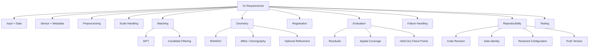
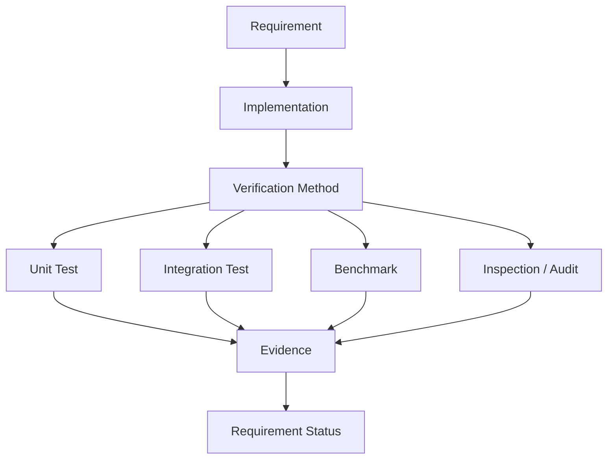

# ChandraMap V1 Requirements

> **Document role:** Authoritative V1 requirements specification
> **Version:** V1
> **Version role:** Classical Baseline / Registration Foundation
> **Primary task:** Known-overlap local lunar image registration
> **Requirement status:** This document defines expected behavior; it does not assert current implementation completion.

This document defines the verifiable scientific and engineering requirements for **ChandraMap V1**.

It translates the V1 scope and technical specification into individual requirements that can be implemented, tested, audited, and traced.

The V1 document set has four distinct roles:

| Document                                 | Role                                            |
| ---------------------------------------- | ----------------------------------------------- |
| [`README.md`](./README.md)               | V1 overview and navigation                      |
| [`scope.md`](./scope.md)                 | Defines what belongs inside and outside V1      |
| [`specification.md`](./specification.md) | Defines the detailed V1 technical contract      |
| **`requirements.md`**                    | Defines individually verifiable V1 requirements |

> **Every V1 requirement should be specific enough to verify and broad enough to avoid hard-coding implementation details that have not been established.**

> **Requirements define expected behavior, not current implementation status.**

> **Scientific correctness requirements take priority over visual presentation requirements.**

> **V1 requirements must preserve a classical baseline that remains comparable with later ChandraMap versions.**

> **Requirements must not invent numerical thresholds that have not been established by a benchmark protocol.**

> **Where independent truth exists, V1 must distinguish model-fitting points from held-out evaluation points.**

> **V1 must fail explicitly rather than silently manufacture a plausible registration.**

> **Compare information, not pixel count.**

---

## 1. Normative Terminology

The following terms are normative throughout this document.

| Term           | Meaning                                                          |
| -------------- | ---------------------------------------------------------------- |
| **MUST**       | Mandatory for V1 compliance or scientific correctness            |
| **MUST NOT**   | Prohibited V1 behavior                                           |
| **SHOULD**     | Strong recommendation; deviation should have a documented reason |
| **SHOULD NOT** | Strongly discouraged behavior                                    |
| **MAY**        | Optional behavior allowed within V1                              |

Normative language should be interpreted together with the conditions attached to a requirement.

For example, a requirement applying to IIRS is conditional on IIRS being included in the active V1 benchmark path.

---

## 2. Requirement Identifier Scheme

Formal V1 requirements use stable identifiers of the form:

```text
V1-REQ-<CATEGORY>-<NUMBER>
```

Examples:

```text
V1-REQ-GEN-001
V1-REQ-DATA-001
V1-REQ-SENSOR-001
V1-REQ-META-001
V1-REQ-PREP-001
V1-REQ-SCALE-001
V1-REQ-MATCH-001
V1-REQ-GEO-001
V1-REQ-REG-001
V1-REQ-EVAL-001
V1-REQ-FAIL-001
V1-REQ-REPRO-001
V1-REQ-TEST-001
V1-REQ-DOC-001
```

Requirement IDs should remain stable after they are referenced by:

- tests;
- issues;
- pull requests;
- benchmark evidence;
- research reports.

If a requirement changes materially, the change should be traceable rather than silently reusing the identifier for a different meaning.

---

## 3. Requirement Verification Methods

The following verification categories are used throughout this document.

| Verification Method       | Meaning                                                                              |
| ------------------------- | ------------------------------------------------------------------------------------ |
| **Inspection**            | Review documentation, configuration, metadata, manifests, or output structure        |
| **Unit Test**             | Test one isolated function, algorithmic rule, or data transformation                 |
| **Integration Test**      | Verify multiple connected pipeline stages                                            |
| **Synthetic Test**        | Evaluate behavior using a known mathematical transformation                          |
| **Benchmark**             | Run the frozen real lunar benchmark protocol                                         |
| **Reproducibility Audit** | Verify data, code, configuration, truth, and environment provenance                  |
| **Manual Review**         | Human validation where scientifically necessary, such as truth annotation inspection |

A requirement may use more than one verification method.

---

# 4. General Requirements

### V1-REQ-GEN-001 — Primary V1 Task

**Requirement:**
V1 MUST support **known-overlap local lunar image registration** between a defined source asset and a defined reference asset or region.

**Rationale:**
V1 exists to establish local correspondence and registration before adding global retrieval.

**Verification:**
Integration Test + Benchmark.

**Related documentation:**
[`scope.md`](./scope.md), [`specification.md`](./specification.md).

---

### V1-REQ-GEN-002 — Classical Baseline

**Requirement:**
V1 MUST preserve a SIFT-based local correspondence path as its classical baseline unless the authoritative V1 scope is deliberately revised.

**Rationale:**
Later ChandraMap versions require a stable classical comparison point.

**Verification:**
Inspection + Integration Test.

---

### V1-REQ-GEN-003 — Benchmarkable Outputs

**Requirement:**
V1 MUST produce outputs sufficient for quantitative benchmark evaluation rather than only visual registration.

**Required evidence SHOULD include, where applicable:**

- correspondence counts;
- verified inliers;
- transformation;
- residual diagnostics;
- spatial coverage;
- independent check metrics where truth exists;
- status/failure information.

**Verification:**
Inspection + Benchmark.

---

### V1-REQ-GEN-004 — Reproducibility

**Requirement:**
Formal V1 runs MUST preserve sufficient provenance to identify the data, configuration, code, truth, and evaluation context used to produce the result.

**Verification:**
Reproducibility Audit.

---

### V1-REQ-GEN-005 — Explicit Failure

**Requirement:**
V1 MUST explicitly report failure when required registration evidence or a valid transformation cannot be established.

**V1 MUST NOT:**

- silently return an identity transform;
- fabricate a transform;
- hide failed benchmark cases;
- report success solely because a preview can be rendered.

**Verification:**
Failure-path Integration Tests.

---

### V1-REQ-GEN-006 — Scope Control

**Requirement:**
Core V1 compliance MUST NOT depend on:

- global retrieval;
- FAISS indexing;
- learned local matchers;
- DEM-aware geometry;
- multi-mission support;
- production GIS features;

unless the authoritative V1 scope is explicitly revised.

**Verification:**
Inspection.

---

### V1-REQ-GEN-007 — Scientific Evidence over Appearance

**Requirement:**
V1 MUST NOT treat visual overlay quality alone as sufficient scientific validation.

**Verification:**
Inspection + Benchmark output review.

---

### V1-REQ-GEN-008 — Future Comparability

**Requirement:**
V1 result semantics SHOULD remain stable enough that compatible V2, V3, and V4 configurations can later be evaluated against the V1 baseline.

**Verification:**
Inspection + Reproducibility Audit.

---

# 5. Input Requirements

### V1-REQ-DATA-001 — Readable Source Asset

**Requirement:**
V1 MUST validate that the required source input can be read and interpreted by the selected sensor path.

**Verification:**
Unit Test + Integration Test.

---

### V1-REQ-DATA-002 — Readable Reference Asset

**Requirement:**
V1 MUST validate that the reference input or prepared reference region can be read before correspondence processing begins.

**Verification:**
Integration Test.

---

### V1-REQ-DATA-003 — Non-Empty Usable Data

**Requirement:**
V1 MUST reject or explicitly fail on empty, invalid, or unusable raster inputs.

**Verification:**
Failure-path Unit/Integration Test.

---

### V1-REQ-DATA-004 — Explicit Source and Reference Roles

**Requirement:**
V1 MUST unambiguously identify which asset is the **source** and which asset is the **reference**.

**Rationale:**
Transform direction, error interpretation, and coordinate semantics depend on this distinction.

**Verification:**
Inspection + Unit Test.

---

### V1-REQ-DATA-005 — Explicit Pair Identity

**Requirement:**
Formal V1 runs MUST preserve an explicit source/reference pair identifier or equivalent pair definition.

**Verification:**
Manifest Inspection.

**Related documentation:**
[`../../datasets/pair-definition.md`](../../datasets/pair-definition.md).

---

### V1-REQ-DATA-006 — No Silent Input Substitution

**Requirement:**
V1 MUST NOT replace a missing or invalid input with unrelated imagery or placeholder data and continue as a valid benchmark run.

**Verification:**
Failure-path Test.

---

### V1-REQ-DATA-007 — Supported Data Dimensionality

**Requirement:**
Each active sensor path MUST validate that the input dimensionality is compatible with that processing route.

**Applicability:**
Conditional on sensor/product type.

**Verification:**
Unit Test.

---

# 6. Sensor Requirements

Actual product metadata takes precedence over approximate instrument-level values.

Approximate project context:

| Instrument | Context                                                                                                 |
| ---------- | ------------------------------------------------------------------------------------------------------- |
| OHRC       | approximately `~0.25–0.32 m/pixel`, product/documentation dependent                                     |
| TMC-2      | approximately `~5 m/pixel`                                                                              |
| IIRS       | approximately `~80 m/pixel`, `~0.8–5.0 µm`, roughly `~250–256` bands depending on product/documentation |
| LRO NAC    | high-resolution reference; project context often approximately `~0.5–2 m/pixel`, product-dependent      |
| LRO WAC    | broader/coarser reference; product and mode dependent                                                   |

### V1-REQ-SENSOR-001 — Product Metadata Authority

**Requirement:**
V1 MUST NOT assume that one fixed instrument-level GSD applies to every product.

**Verification:**
Inspection + sensor metadata tests.

---

### V1-REQ-SENSOR-002 — Sensor-Aware Interpretation

**Requirement:**
V1 MUST distinguish relevant physical and modality differences among OHRC, TMC-2, and IIRS rather than treating all inputs as equivalent grayscale images.

**Verification:**
Inspection + Sensor-path Integration Tests.

---

### V1-REQ-SENSOR-003 — OHRC Handling

**Requirement:**
Where OHRC is included in the active V1 scope, V1 MUST support a documented optical-image preparation path suitable for local registration.

**Verification:**
Integration Test on a defined OHRC pair.

---

### V1-REQ-SENSOR-004 — TMC-2 Handling

**Requirement:**
Where TMC-2 is included, V1 MUST account for its substantially coarser spatial sampling relative to fine reference imagery.

**Verification:**
Scale-handling Integration Test.

---

### V1-REQ-SENSOR-005 — IIRS Modality

**Requirement:**
V1 MUST treat IIRS as hyperspectral/imaging-infrared data rather than as an ordinary grayscale camera product.

**Verification:**
Inspection.

---

### V1-REQ-SENSOR-006 — IIRS 2D Registration Representation

**Requirement:**
If IIRS participates in conventional local 2D matching, V1 MUST receive or derive a documented registration-friendly 2D representation before SIFT-style processing.

**Applicability:**
Conditional on IIRS use.

**Verification:**
Inspection + Integration Test.

---

### V1-REQ-SENSOR-007 — IIRS Representation Lineage

**Requirement:**
A derived IIRS registration representation MUST remain traceable to its parent product and preparation method.

**Applicability:**
Conditional on derived IIRS data.

**Verification:**
Provenance Inspection.

---

### V1-REQ-SENSOR-008 — Reference Identity

**Requirement:**
V1 MUST preserve whether the reference is NAC, WAC, or another explicitly permitted reference product.

**Verification:**
Manifest Inspection.

---

# 7. Metadata Requirements

See [`../../datasets/metadata.md`](../../datasets/metadata.md).

Metadata requirements are path-dependent. Not every field is mandatory for every run.

### V1-REQ-META-001 — Instrument Identity

**Requirement:**
The active processing path MUST have sufficient information to determine the source instrument where sensor-specific behavior depends on it.

**Verification:**
Inspection + Unit Test.

---

### V1-REQ-META-002 — Product Identity

**Requirement:**
Formal benchmark runs MUST preserve source and reference product identity independently of machine-local filenames.

**Verification:**
Reproducibility Audit.

---

### V1-REQ-META-003 — Dimensions

**Requirement:**
V1 MUST know or determine valid raster dimensions before coordinate processing.

**Verification:**
Unit Test.

---

### V1-REQ-META-004 — Scale Metadata

**Requirement:**
Where physical scale selection depends on GSD or equivalent scale information, V1 MUST obtain that information from valid product/benchmark metadata or a documented derivation.

**Verification:**
Inspection + Integration Test.

---

### V1-REQ-META-005 — No Invented Scale

**Requirement:**
V1 MUST NOT silently invent a physical resolution value when required scale metadata is unavailable.

**Verification:**
Failure-path Test.

---

### V1-REQ-META-006 — Coordinate Context

**Requirement:**
Where geospatial transformation or physical-error conversion is performed, V1 MUST preserve sufficient coordinate/projection context to interpret the result.

**Applicability:**
Conditional on geospatial output.

**Verification:**
Inspection.

---

### V1-REQ-META-007 — Derived Representation Identity

**Requirement:**
Any derived input representation used for formal evaluation SHOULD have an explicit identity or configuration record.

**Verification:**
Manifest Inspection.

---

### V1-REQ-META-008 — Crop, Tile, and Pyramid Context

**Requirement:**
When an image is cropped, tiled, or rescaled, V1 MUST preserve enough metadata to map processed coordinates back to the declared parent coordinate system.

**Verification:**
Coordinate Integration Test.

---

# 8. Data and Provenance Requirements

See:

- [`../../datasets/README.md`](../../datasets/README.md)
- [`../../datasets/dataset-structure.md`](../../datasets/dataset-structure.md)
- [`../../datasets/dataset-preparation.md`](../../datasets/dataset-preparation.md)
- [`../../datasets/pair-definition.md`](../../datasets/pair-definition.md)

### V1-REQ-PROV-001 — Raw Data Preservation

**Requirement:**
Raw or provider-issued mission products SHOULD remain immutable under normal ChandraMap processing.

**Verification:**
Inspection.

---

### V1-REQ-PROV-002 — Derived Asset Traceability

**Requirement:**
Derived benchmark assets MUST remain traceable to their parent source/reference products.

**Verification:**
Reproducibility Audit.

---

### V1-REQ-PROV-003 — Versioned Pair Definitions

**Requirement:**
Formal benchmark pair definitions MUST be explicit and SHOULD be versioned when their semantics change.

**Verification:**
Inspection.

---

### V1-REQ-PROV-004 — Machine-Independent Identity

**Requirement:**
Scientific asset identity MUST NOT depend solely on one developer's absolute filesystem path.

**Verification:**
Manifest Inspection.

---

### V1-REQ-PROV-005 — Checksums

**Requirement:**
V1 MAY preserve checksums for externally managed or derived data according to repository conventions.

**Verification:**
Inspection.

---

# 9. Sensor Routing Requirements

See [`../../algorithms/sensor-routing.md`](../../algorithms/sensor-routing.md).

### V1-REQ-ROUTE-001 — Sensor-Aware Routing

**Requirement:**
V1 MUST select preprocessing behavior using relevant sensor characteristics instead of assuming identical input semantics.

**Verification:**
Sensor-path Integration Tests.

---

### V1-REQ-ROUTE-002 — Shared Utilities Allowed

**Requirement:**
Sensor routing MUST NOT require unnecessary code duplication; shared utilities MAY be used when their semantics are valid for multiple sensors.

**Verification:**
Architecture Inspection.

---

### V1-REQ-ROUTE-003 — Route Traceability

**Requirement:**
Formal V1 runs SHOULD record the processing route selected for the source product.

**Verification:**
Manifest Inspection.

---

# 10. Preprocessing Requirements

See [`../../algorithms/preprocessing.md`](../../algorithms/preprocessing.md).

### V1-REQ-PREP-001 — Numeric Validity

**Requirement:**
V1 MUST convert or validate input data into a numeric form suitable for downstream processing.

**Verification:**
Unit Test.

---

### V1-REQ-PREP-002 — Nodata and Mask Handling

**Requirement:**
V1 MUST handle known invalid/nodata regions consistently enough that they are not treated as valid correspondence evidence.

**Verification:**
Unit + Integration Test.

---

### V1-REQ-PREP-003 — Coordinate Preservation

**Requirement:**
Preprocessing MUST preserve sufficient mapping information to express detected and matched coordinates in their declared source/reference spaces.

**Verification:**
Coordinate Test.

---

### V1-REQ-PREP-004 — Reproducible Preprocessing

**Requirement:**
Preprocessing applied during formal benchmarks MUST be reproducible from recorded configuration.

**Verification:**
Reproducibility Audit.

---

### V1-REQ-PREP-005 — Sensor-Aware Preparation

**Requirement:**
Preprocessing MUST respect the selected source sensor route.

**Verification:**
Integration Test.

---

### V1-REQ-PREP-006 — No Destructive Raw Modification

**Requirement:**
The benchmark pipeline SHOULD generate derived data rather than destructively altering original mission products.

**Verification:**
Inspection.

---

# 11. Illumination Requirements

See [`../../algorithms/illumination-handling.md`](../../algorithms/illumination-handling.md).

### V1-REQ-ILLUM-001 — Conservative Normalization

**Requirement:**
V1 SHOULD support reproducible conservative appearance normalization where benchmark evidence or sensor conditions justify it.

**Verification:**
Integration Test.

---

### V1-REQ-ILLUM-002 — No False Invariance Claim

**Requirement:**
V1 MUST NOT describe generic brightness, histogram, or contrast normalization as complete physical Sun-angle correction.

**Rationale:**
Sun-angle changes modify shadow geometry, not only brightness.

**Verification:**
Documentation Inspection.

---

### V1-REQ-ILLUM-003 — Representation Identity

**Requirement:**
Where raw and structurally processed representations differ, V1 SHOULD preserve which representation entered the matching stage.

**Verification:**
Manifest Inspection.

---

### V1-REQ-ILLUM-004 — Reproducible Configuration

**Requirement:**
Illumination-handling settings used in formal benchmark runs MUST be reproducible.

**Verification:**
Reproducibility Audit.

---

# 12. Scale Requirements

See [`../../algorithms/scale-pyramid.md`](../../algorithms/scale-pyramid.md).

> **Compare information, not pixel count.**

### V1-REQ-SCALE-001 — Physical Scale Compatibility

**Requirement:**
V1 MUST account for material differences in source/reference physical sampling when establishing the matching representation.

**Rationale:**
Two arrays of similar dimensions may represent very different ground information.

**Verification:**
Integration Test using a pair with documented scale difference.

---

### V1-REQ-SCALE-002 — Reference Pyramid / Downsampling

**Requirement:**
Where a reference is substantially finer than the source, V1 SHOULD select or derive a physically meaningful reference representation rather than assuming full-resolution matching is appropriate.

**Verification:**
Integration Test.

---

### V1-REQ-SCALE-003 — No Detail Creation Claim

**Requirement:**
V1 MUST NOT treat source upsampling as physical detail recovery.

**Verification:**
Documentation Inspection.

---

### V1-REQ-SCALE-004 — Pyramid Coordinate Mapping

**Requirement:**
When a reference pyramid is used, V1 MUST preserve the mapping between the active level and the parent reference coordinate system.

**Verification:**
Coordinate Unit/Integration Test.

---

### V1-REQ-SCALE-005 — Level Provenance

**Requirement:**
Formal benchmark runs using a pyramid MUST record the selected level or equivalent effective-scale representation.

**Verification:**
Manifest Inspection.

---

### V1-REQ-SCALE-006 — Dimensions Are Not GSD

**Requirement:**
V1 MUST NOT infer physical ground resolution solely from array width or height.

**Verification:**
Unit Test + Inspection.

---

# 13. SIFT Feature Requirements

SIFT is the V1 classical baseline.

### V1-REQ-SIFT-001 — Source Features

**Requirement:**
The V1 SIFT path MUST be capable of producing source keypoints and descriptors from a valid prepared source representation.

**Verification:**
Unit/Integration Test.

---

### V1-REQ-SIFT-002 — Reference Features

**Requirement:**
The V1 SIFT path MUST be capable of producing reference keypoints and descriptors from the prepared reference representation.

**Verification:**
Unit/Integration Test.

---

### V1-REQ-SIFT-003 — Keypoint/Match Distinction

**Requirement:**
V1 MUST distinguish detected keypoints from matched correspondences.

**Verification:**
Output Inspection.

---

### V1-REQ-SIFT-004 — Extraction Configuration

**Requirement:**
Formal benchmark runs MUST preserve enough SIFT configuration to reproduce feature extraction according to repository conventions.

**Verification:**
Reproducibility Audit.

---

### V1-REQ-SIFT-005 — No Universal Invariance Claim

**Requirement:**
V1 MUST NOT claim that SIFT guarantees correspondence under arbitrary GSD, modality, or illumination differences.

**Verification:**
Documentation Inspection.

---

# 14. Matching Requirements

See [`../../algorithms/matching.md`](../../algorithms/matching.md).

### V1-REQ-MATCH-001 — Candidate Correspondence Generation

**Requirement:**
V1 MUST generate candidate source/reference correspondence relationships from the selected local-feature representation.

**Verification:**
Integration Test.

---

### V1-REQ-MATCH-002 — Coordinate Preservation

**Requirement:**
Candidate correspondences MUST retain sufficient information to identify source and reference coordinates and their coordinate spaces.

**Verification:**
Output Inspection.

---

### V1-REQ-MATCH-003 — Candidate Terminology

**Requirement:**
Matcher output MUST be treated as candidate correspondence rather than independent truth or verified correctness.

**Verification:**
Documentation + Output Inspection.

---

### V1-REQ-MATCH-004 — Matcher Score Semantics

**Requirement:**
Where matcher-specific scores are preserved, their semantics SHOULD remain documented or attributable to the matcher implementation.

**Verification:**
Inspection.

---

### V1-REQ-MATCH-005 — No Universal Probability Interpretation

**Requirement:**
V1 MUST NOT interpret an arbitrary matcher score as a universal probability of correspondence correctness unless such semantics are explicitly defined and validated.

**Verification:**
Inspection.

---

# 15. Match-Filtering Requirements

See [`../../algorithms/match-filtering.md`](../../algorithms/match-filtering.md).

### V1-REQ-FILTER-001 — Configurable Filtering

**Requirement:**
V1 MUST support the benchmark-defined candidate filtering strategy.

**Verification:**
Integration Test.

---

### V1-REQ-FILTER-002 — Reproducible Filtering

**Requirement:**
Formal benchmark filtering configuration MUST be reproducible.

**Verification:**
Reproducibility Audit.

---

### V1-REQ-FILTER-003 — Invalid Candidate Handling

**Requirement:**
V1 SHOULD reject invalid correspondence records before geometric verification.

**Verification:**
Unit Test.

---

### V1-REQ-FILTER-004 — Duplicate Handling

**Requirement:**
V1 SHOULD define consistent handling for duplicate or conflicting candidate correspondences.

**Verification:**
Unit Test.

---

### V1-REQ-FILTER-005 — Optional Ratio / Cross-Check

**Requirement:**
V1 MAY support ratio-test, mutual/cross-check, or equivalent descriptor-level filtering according to configuration.

**Verification:**
Unit/Integration Test.

---

### V1-REQ-FILTER-006 — Filtered Candidates Remain Candidates

**Requirement:**
Filtered correspondences MUST remain classified as candidate correspondences until geometric verification.

**Verification:**
Output Inspection.

---

# 16. Geometric Verification Requirements

See [`../../algorithms/ransac.md`](../../algorithms/ransac.md).

### V1-REQ-GEO-001 — Robust Verification

**Requirement:**
V1 MUST perform robust geometric verification before accepting candidate correspondences as model-consistent inliers.

**Verification:**
Synthetic Test + Real-pair Integration Test.

---

### V1-REQ-GEO-002 — Inlier Set

**Requirement:**
When geometric verification succeeds, V1 MUST preserve the model-consistent inlier set or mask.

**Verification:**
Output Inspection.

---

### V1-REQ-GEO-003 — Candidate Population

**Requirement:**
V1 MUST preserve or derive the number of candidates used by geometric verification.

**Rationale:**
Required for interpretable inlier-ratio calculation.

**Verification:**
Output Inspection.

---

### V1-REQ-GEO-004 — Initial Model Status

**Requirement:**
V1 MUST record whether robust model estimation succeeded or failed.

**Verification:**
Integration Test.

---

### V1-REQ-GEO-005 — Candidate/Inlier Distinction

**Requirement:**
V1 MUST distinguish candidate count from verified inlier count.

**Verification:**
Metric Inspection.

---

### V1-REQ-GEO-006 — Inliers Are Not Truth

**Requirement:**
V1 MUST NOT use geometric inliers as independent ground truth solely because they passed RANSAC.

**Verification:**
Documentation + Evaluation Audit.

---

### V1-REQ-GEO-007 — Explicit Geometry Failure

**Requirement:**
V1 MUST explicitly fail the registration path when required model support cannot be established.

**Verification:**
Failure-path Test.

---

# 17. Transformation Requirements

See [`../../algorithms/transforms.md`](../../algorithms/transforms.md).

### V1-REQ-TRANS-001 — Supported Model Family

**Requirement:**
V1 MAY use affine and/or homography models according to the benchmark configuration and pair assumptions.

**Verification:**
Inspection.

---

### V1-REQ-TRANS-002 — Model Identity

**Requirement:**
Every successful transformation result MUST identify its transform model type.

**Verification:**
Output Inspection.

---

### V1-REQ-TRANS-003 — Explicit Transform Direction

**Requirement:**
The scientific transformation direction MUST be explicit.

The preferred semantic convention is:

```text
source coordinates → reference coordinates
```

**Verification:**
Inspection + Coordinate Test.

---

### V1-REQ-TRANS-004 — Coordinate Spaces

**Requirement:**
The source and reference coordinate spaces associated with the transformation MUST be known or recoverable.

**Verification:**
Output Inspection.

---

### V1-REQ-TRANS-005 — Finite Parameters

**Requirement:**
Successful transformation parameters MUST be finite and numerically valid.

**Verification:**
Unit Test.

---

### V1-REQ-TRANS-006 — Degeneracy Rejection

**Requirement:**
V1 MUST NOT silently accept a transformation produced from geometrically degenerate or invalid fitting support.

**Verification:**
Synthetic Degeneracy Tests.

---

### V1-REQ-TRANS-007 — Inverse Validation

**Requirement:**
If inverse transformation is required for image warping, V1 MUST validate that the configured model can be inverted sufficiently for that operation.

**Applicability:**
Conditional on inverse-map usage.

**Verification:**
Unit Test.

---

### V1-REQ-TRANS-008 — Fit-Set Traceability

**Requirement:**
The final transform SHOULD remain traceable to the fitting-point population from which it was estimated.

**Verification:**
Result Inspection.

---

# 18. Transform-Model Limitation Requirements

> **The Moon is not a flat poster.**

### V1-REQ-MODEL-001 — Local Approximation

**Requirement:**
V1 documentation MUST treat affine and homography models as local geometric approximations rather than complete physical models of lunar terrain.

**Verification:**
Documentation Inspection.

---

### V1-REQ-MODEL-002 — Homography Is Not Automatically Superior

**Requirement:**
V1 MUST NOT assume that a homography is more accurate solely because it is more flexible.

**Verification:**
Documentation Inspection + Benchmark Comparison where applicable.

---

### V1-REQ-MODEL-003 — Spatially Varying Error Visibility

**Requirement:**
Where residual analysis indicates spatially varying errors, V1 SHOULD preserve those diagnostics rather than hiding them behind a visually plausible warp.

**Verification:**
Benchmark/Artifact Inspection.

---

### V1-REQ-MODEL-004 — Advanced Geometry Not Required

**Requirement:**
Core V1 compliance MUST NOT depend on DEM-aware, piecewise, bundle-adjustment, or control-network geometry.

**Verification:**
Scope Inspection.

---

# 19. Sub-Pixel Refinement Requirements

See [`../../algorithms/subpixel-refinement.md`](../../algorithms/subpixel-refinement.md).

Sub-pixel refinement is **OPTIONAL / CONDITIONAL** unless the authoritative V1 scope makes it mandatory.

> **Verify first, refine second.**

### V1-REQ-REFINE-001 — Verification Before Refinement

**Requirement:**
If refinement is enabled, V1 MUST geometrically verify candidate correspondences before applying refinement to the fitting points used by the normal V1 path.

**Verification:**
Pipeline-order Integration Test.

---

### V1-REQ-REFINE-002 — Verified Fit-Point Refinement

**Requirement:**
Refinement SHOULD operate on verified fitting correspondences rather than raw unverified candidate matches.

**Verification:**
Inspection + Integration Test.

---

### V1-REQ-REFINE-003 — Invalid Refinement Handling

**Requirement:**
V1 MUST reject or appropriately flag unusable refinement results rather than silently inserting invalid refined coordinates.

**Verification:**
Failure-path Test.

---

### V1-REQ-REFINE-004 — Final Transform Refit

**Requirement:**
When fitting coordinates change during refinement, V1 MUST refit the final transformation from the refined fitting coordinates.

**Verification:**
Integration Test.

---

### V1-REQ-REFINE-005 — Final Evaluation After Refit

**Requirement:**
Where refinement is enabled, final evaluation MUST use the final refitted transform rather than the stale pre-refinement transform.

**Verification:**
Integration Test.

---

### V1-REQ-REFINE-006 — No Resolution-Creation Claim

**Requirement:**
V1 MUST NOT claim that sub-pixel coordinate localization increases the physical spatial resolution of the source instrument.

**Verification:**
Documentation Inspection.

---

# 20. Registration Requirements

See [`../../algorithms/registration.md`](../../algorithms/registration.md).

### V1-REQ-REG-001 — Final Transform Record

**Requirement:**
Every successful V1 registration MUST produce or preserve a final transform record.

**Verification:**
Output Inspection.

---

### V1-REQ-REG-002 — Registered Preview

**Requirement:**
V1 SHOULD support a registered image, overlay, or preview suitable for diagnostic visual inspection.

**Verification:**
Integration Test.

---

### V1-REQ-REG-003 — Output Grid Semantics

**Requirement:**
Where a registered raster is produced, the output grid/reference frame SHOULD be defined or recoverable.

**Verification:**
Output Inspection.

---

### V1-REQ-REG-004 — Nodata/Validity Semantics

**Requirement:**
Warped output SHOULD preserve valid-region or nodata semantics where applicable.

**Verification:**
Integration Test.

---

### V1-REQ-REG-005 — Minimize Unnecessary Resampling

**Requirement:**
V1 SHOULD minimize repeated resampling where practical.

**Verification:**
Pipeline Inspection.

---

### V1-REQ-REG-006 — Preview Is Not Validation

**Requirement:**
A registered preview MUST NOT be the sole scientific evidence of success.

**Verification:**
Benchmark Output Inspection.

---

# 21. Output Requirements

A successful V1 run should preserve the following as applicable.

### V1-REQ-OUT-001 — Run Status

**Requirement:**
Every formal V1 run MUST preserve an explicit run status.

---

### V1-REQ-OUT-002 — Pair Identity

**Requirement:**
Every formal V1 run MUST preserve its pair identity.

---

### V1-REQ-OUT-003 — Asset Identity

**Requirement:**
Every formal V1 run MUST preserve source and reference identity.

---

### V1-REQ-OUT-004 — Candidate Correspondences

**Requirement:**
A successful matching stage MUST make candidate correspondence information available for downstream verification or diagnostics.

---

### V1-REQ-OUT-005 — Filtered Candidate Information

**Requirement:**
Where candidate filtering is enabled, V1 SHOULD preserve enough information to identify the post-filtering candidate population.

---

### V1-REQ-OUT-006 — Verified Inliers

**Requirement:**
Successful geometric verification MUST preserve verified inlier information.

---

### V1-REQ-OUT-007 — Transform Semantics

**Requirement:**
Successful registration MUST preserve:

- transform model;
- transform direction;
- transformation parameters;
- associated coordinate spaces.

---

### V1-REQ-OUT-008 — Residual Metrics

**Requirement:**
Where a transform is available, V1 MUST preserve benchmark-required residual diagnostics.

---

### V1-REQ-OUT-009 — Spatial Coverage

**Requirement:**
Formal V1 benchmark results MUST preserve the benchmark-defined spatial-support metric where required.

---

### V1-REQ-OUT-010 — Independent Check Metrics

**Requirement:**
Where independent truth exists, V1 MUST preserve benchmark-defined held-out evaluation results.

---

### V1-REQ-OUT-011 — Runtime

**Requirement:**
Formal V1 runs SHOULD preserve runtime according to benchmark conventions.

---

### V1-REQ-OUT-012 — Warnings

**Requirement:**
V1 SHOULD preserve meaningful non-fatal warnings that affect interpretation.

---

### V1-REQ-OUT-013 — Failure Output

**Requirement:**
A failed run MUST preserve:

- failure status;
- observed failure stage;
- available preceding diagnostics;
- provenance sufficient to reproduce or investigate the failure.

---

# 22. Correspondence Record Requirements

An exact serialization schema is not mandated here.

Conceptually, correspondence records SHOULD preserve:

- source x/y;
- reference x/y;
- source coordinate space;
- reference coordinate space;
- candidate state;
- filtered state where applicable;
- inlier state where applicable;
- matcher-specific score where retained;
- refined coordinates/status where applicable.

### V1-REQ-CORR-001 — Coordinate Pair Integrity

**Requirement:**
Each correspondence MUST unambiguously associate one source coordinate with one reference coordinate.

### V1-REQ-CORR-002 — Role Traceability

**Requirement:**
The correspondence state SHOULD make it possible to distinguish candidate, filtered, and inlier roles.

### V1-REQ-CORR-003 — Refined Coordinate Identity

**Requirement:**
Where coordinates are refined, V1 SHOULD preserve enough information to distinguish original and refined coordinates.

---

# 23. Residual Analysis Requirements

See [`../../algorithms/residual-analysis.md`](../../algorithms/residual-analysis.md).

### V1-REQ-RESID-001 — Defined Coordinate Space

**Requirement:**
Every reported residual/error metric MUST identify or inherit a clearly defined coordinate space.

**Verification:**
Metric Inspection.

---

### V1-REQ-RESID-002 — Explicit Units

**Requirement:**
Residual units MUST be explicit or unambiguous from the metric definition.

**Verification:**
Inspection.

---

### V1-REQ-RESID-003 — Fit vs Check Separation

**Requirement:**
V1 MUST distinguish fit residuals from independent check residuals.

**Verification:**
Evaluation Audit.

---

### V1-REQ-RESID-004 — Source-Space Error

**Requirement:**
V1 SHOULD report source-image pixel error where that coordinate representation is valid and scientifically meaningful.

**Verification:**
Benchmark Inspection.

---

### V1-REQ-RESID-005 — Ground Error Restrictions

**Requirement:**
V1 MUST NOT report physical ground-distance accuracy without sufficient geospatial information to support the conversion.

**Verification:**
Evaluation Audit.

---

### V1-REQ-RESID-006 — Optional Statistics

**Requirement:**
V1 MAY report additional statistics such as median, percentile, or directional bias according to benchmark requirements.

---

# 24. Ground-Truth Requirements

See:

- [`../../evaluation/ground-truth.md`](../../evaluation/ground-truth.md)
- [`../../datasets/ground-truth-preparation.md`](../../datasets/ground-truth-preparation.md)

### V1-REQ-TRUTH-001 — Truth Traceability

**Requirement:**
Truth used for formal evaluation MUST be traceable and SHOULD be versioned.

**Verification:**
Reproducibility Audit.

---

### V1-REQ-TRUTH-002 — Truth Coordinate Space

**Requirement:**
The coordinate spaces associated with benchmark truth MUST be defined.

**Verification:**
Inspection.

---

### V1-REQ-TRUTH-003 — Algorithm Output Is Not Truth

**Requirement:**
Algorithm-generated correspondences, including RANSAC inliers, MUST NOT automatically be promoted to independent ground truth.

**Verification:**
Evaluation Audit.

---

### V1-REQ-TRUTH-004 — Reference Image Is Not Automatically Independent Truth

**Requirement:**
A reference image MUST NOT automatically be described as independent ground truth merely because it is the registration target.

**Verification:**
Documentation Inspection.

---

### V1-REQ-TRUTH-005 — Truth Uncertainty

**Requirement:**
Where truth uncertainty is available, V1 SHOULD preserve or reference that information.

**Verification:**
Inspection.

---

# 25. Control / Fit-Point Requirements

See [`../../evaluation/control-points.md`](../../evaluation/control-points.md).

### V1-REQ-FIT-001 — Explicit Fitting Role

**Requirement:**
Points used for final transformation estimation MUST have an explicit or recoverable fitting role.

---

### V1-REQ-FIT-002 — Coordinate Preservation

**Requirement:**
Fit points MUST preserve source and reference coordinates.

---

### V1-REQ-FIT-003 — Distribution Assessment

**Requirement:**
Fit-point or inlier distribution SHOULD be evaluated where required by the benchmark.

---

### V1-REQ-FIT-004 — No Automatic Check Reuse

**Requirement:**
Fit points MUST NOT automatically be reused as independent check points for the same final transform.

---

# 26. Check-Point Requirements

See [`../../evaluation/checkpoint-evaluation.md`](../../evaluation/checkpoint-evaluation.md).

### V1-REQ-CHECK-001 — Independence

**Requirement:**
A point reported as an independent held-out check point MUST NOT contribute to final transform fitting for that run.

**Verification:**
Benchmark Audit.

---

### V1-REQ-CHECK-002 — Check Identity

**Requirement:**
Check-point identity or role MUST be traceable.

**Verification:**
Manifest Inspection.

---

### V1-REQ-CHECK-003 — Correct Transform Application

**Requirement:**
The final transform MUST be applied to check points using the correct coordinate mappings.

**Verification:**
Coordinate Integration Test.

---

### V1-REQ-CHECK-004 — Defined Units

**Requirement:**
Check residuals MUST use explicitly defined units and coordinate spaces.

---

### V1-REQ-CHECK-005 — Unavailable Truth

**Requirement:**
Where independent truth is unavailable, V1 MUST report that limitation rather than fabricate a check metric.

---

# 27. Spatial-Coverage Requirements

See [`../../evaluation/spatial-coverage.md`](../../evaluation/spatial-coverage.md).

### V1-REQ-COV-001 — Spatial-Support Metric

**Requirement:**
Formal V1 benchmarks MUST or SHOULD report the benchmark-defined spatial-support diagnostic according to the evaluation protocol.

**Verification:**
Metric Test.

---

### V1-REQ-COV-002 — Point Population Definition

**Requirement:**
The point population used to compute coverage MUST be defined.

---

### V1-REQ-COV-003 — Region Definition

**Requirement:**
The valid image/overlap region against which coverage is measured MUST be defined or recoverable.

---

### V1-REQ-COV-004 — Coordinate Space

**Requirement:**
Coverage evaluation MUST identify the coordinate space in which support is measured.

---

### V1-REQ-COV-005 — Configuration Traceability

**Requirement:**
If grid, hull, or another configurable coverage method is used, the relevant configuration MUST be traceable.

---

### V1-REQ-COV-006 — Count Is Not Coverage

**Requirement:**
V1 MUST NOT treat correspondence count alone as spatial coverage.

---

### V1-REQ-COV-007 — Coverage Is Not Correctness

**Requirement:**
V1 MUST NOT treat high spatial coverage alone as proof of accurate registration.

---

# 28. Metric Requirements

See [`../../evaluation/metrics.md`](../../evaluation/metrics.md).

### V1-REQ-METRIC-001 — Metric Identity

**Requirement:**
Every formal numeric metric SHOULD preserve a stable name and definition/version.

---

### V1-REQ-METRIC-002 — Metric Population

**Requirement:**
Metrics whose value depends on a point population MUST define that population.

---

### V1-REQ-METRIC-003 — Metric Coordinate Space

**Requirement:**
Spatial error metrics MUST identify their coordinate space.

---

### V1-REQ-METRIC-004 — Metric Units

**Requirement:**
Spatial or runtime metrics MUST identify their units.

---

### V1-REQ-METRIC-005 — Aggregation Semantics

**Requirement:**
Aggregated metrics SHOULD preserve sufficient semantics to determine how values were combined.

---

### V1-REQ-METRIC-006 — Core Metric Set

**Requirement:**
The core V1 benchmark SHOULD conceptually preserve, where applicable:

- candidate count;
- inlier count;
- inlier ratio;
- spatial coverage;
- held-out check RMSE;
- runtime;
- success/failure.

Filtered count and additional residual statistics MAY also be reported.

---

# 29. Inlier-Ratio Requirements

### V1-REQ-RATIO-001 — Defined Denominator

**Requirement:**
An inlier-ratio result MUST identify or inherit the candidate population used as its denominator.

Conceptually:

$$
\text{Inlier Ratio}
=
\frac{N_{\text{verified inliers}}}
{N_{\text{candidates used for geometric verification}}}
$$

**Verification:**
Metric Unit Test.

---

### V1-REQ-RATIO-002 — No Accuracy Equivalence

**Requirement:**
V1 MUST NOT describe inlier ratio as equivalent to registration accuracy.

---

# 30. RMSE Requirements

Where RMSE is used:

$$
RMSE =
\sqrt{
\frac{1}{N}
\sum_{i=1}^{N}
e_i^2
}
$$

where \(e_i\) is the benchmark-defined error magnitude.

### V1-REQ-RMSE-001 — Evaluation Count

**Requirement:**
The number of observations \(N\) contributing to a reported RMSE MUST be known or recoverable.

---

### V1-REQ-RMSE-002 — Coordinate Space

**Requirement:**
RMSE MUST identify the coordinate space in which \(e_i\) is measured.

---

### V1-REQ-RMSE-003 — Units

**Requirement:**
RMSE units MUST be explicit.

---

### V1-REQ-RMSE-004 — Fit vs Check Label

**Requirement:**
Fit-point RMSE MUST NOT be mislabeled as independent check-point RMSE.

---

# 31. Source-Pixel and Physical-Error Requirements

### V1-REQ-ERROR-001 — Source-Pixel Reporting

**Requirement:**
V1 SHOULD report registration error in source-image pixels where the benchmark defines that coordinate space appropriately.

**Rationale:**
OHRC, TMC-2, and IIRS have substantially different physical sampling.

---

### V1-REQ-ERROR-002 — Conditional Ground Conversion

**Requirement:**
V1 MAY report metres or another lunar-ground distance only when valid geospatial information supports that conversion.

---

### V1-REQ-ERROR-003 — No Blind GSD Multiplication

**Requirement:**
V1 MUST NOT blindly compute:

```text
pixel_error × approximate_GSD
```

and report the result as absolute lunar ground accuracy without validating the error coordinate space and mapping.

---

# 32. Success-Criteria Requirements

See [`../../evaluation/success-criteria.md`](../../evaluation/success-criteria.md).

### V1-REQ-SUCCESS-001 — Predefined Criteria

**Requirement:**
Formal V1 benchmark success criteria MUST be defined before final benchmark evaluation.

---

### V1-REQ-SUCCESS-002 — Versioned Criteria

**Requirement:**
Success-criteria changes SHOULD be versioned or otherwise traceable.

---

### V1-REQ-SUCCESS-003 — Measurable Criteria

**Requirement:**
Formal pass/fail criteria MUST be measurable from available benchmark evidence.

---

### V1-REQ-SUCCESS-004 — Consistent Application

**Requirement:**
The same benchmark-defined success rules MUST be applied consistently to comparable V1 pairs.

---

### V1-REQ-SUCCESS-005 — No Post-Hoc Threshold Selection

**Requirement:**
V1 MUST NOT select final pass/fail thresholds after viewing final benchmark outcomes in order to improve apparent performance.

---

# 33. Failure Requirements

See [`../../evaluation/failure-cases.md`](../../evaluation/failure-cases.md).

### V1-REQ-FAIL-001 — Explicit Failure State

**Requirement:**
A failed V1 run MUST have an explicit failure state.

---

### V1-REQ-FAIL-002 — Failure Stage

**Requirement:**
A failed formal run SHOULD preserve the observed pipeline stage at which failure became apparent.

Potential stages include:

- input;
- metadata;
- preprocessing;
- representation;
- scale selection;
- matching;
- filtering;
- geometric verification;
- transform fitting;
- refinement;
- registration;
- evaluation.

Exact implementation enum names are not mandated here.

---

### V1-REQ-FAIL-003 — No Identity Success Fallback

**Requirement:**
V1 MUST NOT silently return an identity transform and report success when registration cannot be established.

---

### V1-REQ-FAIL-004 — Missing Metric Semantics

**Requirement:**
An unavailable metric MUST NOT be encoded as a numeric zero unless zero is genuinely the measured value.

For example:

```text
check_rmse = unavailable
```

is semantically different from:

```text
check_rmse = 0
```

---

### V1-REQ-FAIL-005 — Preserve Preceding Diagnostics

**Requirement:**
Where practical, failed runs SHOULD preserve diagnostics from the last valid processing stages.

---

### V1-REQ-FAIL-006 — Preserve Failed Benchmark Cases

**Requirement:**
Failed benchmark pairs MUST NOT be silently removed from formal V1 reporting.

---

# 34. Failure Stage vs Root Cause

### V1-REQ-DIAG-001 — Observed Stage and Cause Separation

**Requirement:**
V1 diagnostics SHOULD distinguish the observed failure stage from a suspected or confirmed root cause.

For example:

```text
Observed stage: geometric verification
Possible cause: scale mismatch
```

is different from:

```text
Root cause: RANSAC
```

**Verification:**
Failure Record Inspection.

---

# 35. Reproducibility Requirements

See [`../../evaluation/reproducibility.md`](../../evaluation/reproducibility.md).

Formal V1 runs should preserve the following as applicable.

### V1-REQ-REPRO-001 — Run Identity

V1 MUST preserve a run identifier or equivalent unique execution identity for formal benchmark runs.

### V1-REQ-REPRO-002 — ChandraMap Version

V1 formal results MUST identify the ChandraMap research version.

### V1-REQ-REPRO-003 — Code Revision

Formal benchmark results SHOULD preserve the relevant code revision.

### V1-REQ-REPRO-004 — Benchmark Version

Formal results MUST identify the benchmark definition/version used.

### V1-REQ-REPRO-005 — Pair Version

Formal results MUST identify the pair definition/version.

### V1-REQ-REPRO-006 — Source Product Identity

Formal results MUST identify the source asset independently of local filesystem location.

### V1-REQ-REPRO-007 — Reference Product Identity

Formal results MUST identify the reference asset independently of local filesystem location.

### V1-REQ-REPRO-008 — Truth Version

Where truth is used, formal results MUST identify the truth version or equivalent provenance.

### V1-REQ-REPRO-009 — Resolved Configuration

Formal results MUST preserve or reference the effective pipeline configuration.

### V1-REQ-REPRO-010 — Sensor Route

Formal results SHOULD identify the selected sensor route.

### V1-REQ-REPRO-011 — Preprocessing Configuration

Formal results MUST preserve or reference relevant preprocessing settings.

### V1-REQ-REPRO-012 — Scale Configuration

Formal results MUST preserve the scale strategy and selected reference scale where relevant.

### V1-REQ-REPRO-013 — Matching Configuration

Formal results MUST preserve or reference the SIFT and matching configuration.

### V1-REQ-REPRO-014 — Filtering Configuration

Formal results MUST preserve candidate-filter configuration.

### V1-REQ-REPRO-015 — Geometric Verification Configuration

Formal results MUST preserve robust-estimation configuration relevant to interpretation/reproduction.

### V1-REQ-REPRO-016 — Transform Model

Formal results MUST identify the configured final transform family.

### V1-REQ-REPRO-017 — Refinement Configuration

Where refinement is used, its configuration MUST be preserved.

### V1-REQ-REPRO-018 — Metric Definition

Formal results SHOULD preserve or reference metric-definition versions.

### V1-REQ-REPRO-019 — Success-Rule Version

Formal benchmark results SHOULD preserve the success-criteria version.

### V1-REQ-REPRO-020 — Random State

Where controllable stochastic behavior exists, relevant random state SHOULD be recorded.

### V1-REQ-REPRO-021 — Environment Context

Formal runs SHOULD preserve relevant environment context where it affects reproducibility or runtime comparison.

### V1-REQ-REPRO-022 — Result References

Formal runs SHOULD preserve references to generated artifacts/results needed for audit.

---

# 36. Randomness Requirements

### V1-REQ-RAND-001 — Controllable Seeds

**Requirement:**
Where stochastic components expose controllable seeds, formal benchmark runs SHOULD record them.

Potential stochastic stages include:

- RANSAC;
- synthetic stress generation;
- future experimental components.

---

### V1-REQ-RAND-002 — No False Determinism Claim

**Requirement:**
V1 MUST NOT claim complete cross-platform determinism merely because one random seed is fixed.

---

### V1-REQ-RAND-003 — Repeatability Testing

**Requirement:**
Repeated execution MAY be used to assess repeatability where stochastic behavior materially affects outcomes.

---

# 37. Runtime Requirements

### V1-REQ-RUNTIME-001 — Runtime Availability

**Requirement:**
Formal V1 benchmark runs SHOULD make runtime reportable as an engineering metric.

---

### V1-REQ-RUNTIME-002 — Runtime Context

**Requirement:**
Runtime comparisons SHOULD identify relevant:

- hardware;
- software environment;
- included pipeline stages.

---

### V1-REQ-RUNTIME-003 — No Universal SLA

**Requirement:**
V1 MUST NOT invent a universal runtime SLA unless the benchmark explicitly defines one.

---

# 38. Testing and Verification Requirements

## Unit Tests

### V1-REQ-TEST-001 — Coordinate Mapping Tests

V1 SHOULD include tests for coordinate conversions and mappings.

### V1-REQ-TEST-002 — Transform Application Tests

V1 SHOULD include tests for transformation application and inversion where applicable.

### V1-REQ-TEST-003 — Residual Formula Tests

V1 SHOULD include tests validating residual/error calculations.

### V1-REQ-TEST-004 — Coverage Metric Tests

V1 SHOULD include tests validating coverage calculations.

### V1-REQ-TEST-005 — Pair Parsing Tests

V1 SHOULD include tests for benchmark pair interpretation.

### V1-REQ-TEST-006 — Mask/Nodata Tests

V1 SHOULD include tests for invalid-region handling.

### V1-REQ-TEST-007 — Pyramid Mapping Tests

V1 SHOULD test mappings between pyramid-level and parent-reference coordinates.

---

## Synthetic Geometry Tests

### V1-REQ-TEST-008 — Known Translation

V1 SHOULD include synthetic tests with known translation.

### V1-REQ-TEST-009 — Known Rotation

V1 SHOULD include synthetic tests with known rotation where supported.

### V1-REQ-TEST-010 — Known Scale Change

V1 SHOULD include synthetic scale tests.

### V1-REQ-TEST-011 — Affine / Projective Cases

V1 MAY include known affine or projective synthetic cases according to the supported transform family.

> Synthetic correctness does not prove real cross-sensor lunar robustness.

---

## Real Pair Tests

### V1-REQ-TEST-012 — Defined Lunar Pair

**Requirement:**
V1 SHOULD include end-to-end tests using explicitly defined lunar source/reference pairs within the V1 scope.

---

## Regression Tests

### V1-REQ-TEST-013 — Confirmed Bug Regression

**Requirement:**
Confirmed coordinate, geometry, metric, or scientific-processing bugs SHOULD receive regression tests where practical.

---

# 39. Coordinate Requirements

Coordinate handling is a critical scientific requirement area.

### V1-REQ-COORD-001 — X/Y Convention

V1 MUST define or preserve the x/y convention used in correspondence records.

### V1-REQ-COORD-002 — Row/Column Convention

Where row/column indexing is used internally, its relationship to x/y coordinates MUST be unambiguous.

### V1-REQ-COORD-003 — Pixel-Origin Convention

Where relevant, V1 MUST preserve the pixel-origin convention.

### V1-REQ-COORD-004 — Pixel-Center Semantics

Where sub-pixel or geospatial mapping requires it, V1 MUST define pixel-center/corner semantics sufficiently to avoid systematic offsets.

### V1-REQ-COORD-005 — Crop Offsets

Coordinates generated from cropped imagery MUST remain mappable to the parent image coordinates.

### V1-REQ-COORD-006 — Tile Offsets

Coordinates generated from reference tiles MUST remain mappable to the parent reference.

### V1-REQ-COORD-007 — Pyramid Mapping

Coordinates generated at a reference-pyramid level MUST remain mappable to the parent reference coordinate system.

### V1-REQ-COORD-008 — Transform Direction

Source-to-reference scientific transform direction MUST remain explicit.

### V1-REQ-COORD-009 — Derived Representation Mapping

Coordinates from derived representations MUST remain interpretable with respect to their parent image when such mapping is scientifically required.

---

# 40. Benchmark Requirements

See [`../../evaluation/benchmark-protocol.md`](../../evaluation/benchmark-protocol.md).

### V1-REQ-BENCH-001 — Benchmark Version

Formal V1 benchmark runs MUST identify the benchmark version.

### V1-REQ-BENCH-002 — Frozen Pair Set

Formal comparison runs MUST use the benchmark-defined pair set.

### V1-REQ-BENCH-003 — Frozen Truth Roles

Fit/check roles and truth definitions MUST remain fixed for a benchmark version.

### V1-REQ-BENCH-004 — Stable Metric Semantics

Metric definitions MUST remain fixed or versioned for a benchmark comparison.

### V1-REQ-BENCH-005 — Stable Success Criteria

Success rules MUST remain fixed or versioned for a benchmark comparison.

### V1-REQ-BENCH-006 — Reproducible Configuration

Formal benchmark runs MUST use a defined reproducible configuration.

### V1-REQ-BENCH-007 — No Manual Pair Rescue

Manual pair-specific rescue MUST NOT be used during formal benchmark execution unless the intervention is part of a deterministic rule frozen before evaluation.

---

# 41. Benchmark-Category Requirements

See [`../../evaluation/benchmark-categories.md`](../../evaluation/benchmark-categories.md).

### V1-REQ-CAT-001 — Optional Categorization

Benchmark pairs MAY be categorized by properties such as:

- sensor pairing;
- scale difference;
- illumination stress;
- modality;
- terrain;
- geometry.

### V1-REQ-CAT-002 — Reproducible Category Definition

Categories used for formal reporting SHOULD have reproducible definitions.

### V1-REQ-CAT-003 — No Undefined Difficulty Labels

V1 SHOULD NOT report categories such as `easy`, `medium`, or `hard` unless those labels have explicit reproducible definitions.

---

# 42. Stress-Test Requirements

See [`../../evaluation/stress-tests.md`](../../evaluation/stress-tests.md).

### V1-REQ-STRESS-001 — Limited Controlled Stress Testing

V1 MAY include a limited controlled stress suite.

Possible cases include:

- physical scale mismatch;
- illumination difference;
- low-feature terrain;
- repetitive terrain;
- synthetic translation;
- synthetic rotation;
- synthetic scale change.

---

### V1-REQ-STRESS-002 — Preserve Failures

Stress-test failures MUST remain visible in results.

---

### V1-REQ-STRESS-003 — Synthetic Illumination Caution

Synthetic appearance perturbations MUST NOT be described as complete physical simulation of lunar Sun-angle changes unless the simulation actually supports that claim.

---

# 43. Data and Licensing Requirements

See [`../../data-licenses.md`](../../data-licenses.md).

### V1-REQ-LICENSE-001 — Upstream Provenance

V1 MUST preserve upstream mission/provider data provenance.

### V1-REQ-LICENSE-002 — No Redistribution Assumption

V1 MUST NOT assume that publicly accessible mission data is automatically unrestricted for all forms of redistribution.

### V1-REQ-LICENSE-003 — Git Independence

V1 reproducibility MUST NOT require committing all large mission imagery directly into Git.

### V1-REQ-LICENSE-004 — Derived Artifact Attribution

Derived artifacts containing or substantially reproducing mission data SHOULD preserve appropriate provenance/attribution according to repository and provider requirements.

---

# 44. Security Requirements

See [`../../../SECURITY.md`](../../../SECURITY.md).

This section intentionally covers only security concerns relevant to V1 scientific execution and reproducibility.

### V1-REQ-SEC-001 — No Credentials in Manifests

V1 result manifests and benchmark records MUST NOT contain passwords, private tokens, or credentials.

### V1-REQ-SEC-002 — No Secret Commit

Secrets from `.env` or equivalent private configuration MUST NOT be committed to the repository.

### V1-REQ-SEC-003 — Reproducibility Metadata Excludes Secrets

Reproducibility records MUST preserve configuration semantics without exposing private credentials.

---

# 45. Documentation Requirements

### V1-REQ-DOC-001 — V1 Task Documentation

V1 documentation SHOULD allow a contributor to understand the known-overlap registration task.

### V1-REQ-DOC-002 — Scope Documentation

V1 scope MUST remain documented in [`scope.md`](./scope.md).

### V1-REQ-DOC-003 — Specification Documentation

The detailed V1 technical contract MUST remain documented in [`specification.md`](./specification.md).

### V1-REQ-DOC-004 — Requirements Consistency

This requirements document MUST remain materially consistent with the authoritative V1 scope and specification.

### V1-REQ-DOC-005 — Sensor Documentation

V1 documentation SHOULD make sensor-specific assumptions discoverable.

### V1-REQ-DOC-006 — Metric Documentation

V1 documentation SHOULD make metric semantics discoverable.

### V1-REQ-DOC-007 — Failure Documentation

V1 documentation SHOULD explain how failures are interpreted.

### V1-REQ-DOC-008 — Reproducibility Documentation

V1 documentation SHOULD explain the provenance required for formal results.

---

# 46. Interface Requirements

V1 scientific compliance does not depend on one specific user interface.

### V1-REQ-INT-001 — Interface Flexibility

V1 MAY be exposed through:

- a command-line interface;
- Python API;
- backend service;
- frontend workflow;
- another repository-supported interface.

No particular interface is mandated here.

---

### V1-REQ-INT-002 — Core Pipeline Independence

Scientific correctness MUST depend on core pipeline behavior rather than frontend polish.

---

### V1-REQ-INT-003 — No Invented Endpoint Requirement

This document does not require a specific API endpoint, CLI command, or frontend route unless defined in separate architecture/interface documentation.

---

# 47. Frontend Requirements

### V1-REQ-UI-001 — Optional Visualization

A V1 frontend MAY display:

- source image;
- reference image;
- candidate correspondences;
- verified inliers;
- registered preview;
- metrics;
- failure status.

### V1-REQ-UI-002 — UI Is Not Accuracy

Frontend appearance MUST NOT be treated as evidence of registration accuracy.

---

# 48. Non-Functional Requirements

## Reproducibility

### V1-REQ-NFR-001

Formal scientific results MUST remain traceable to data, configuration, code, and evaluation context.

---

## Maintainability

### V1-REQ-NFR-002

Shared functionality SHOULD avoid unnecessary version-specific duplication where reuse does not alter V1 semantics.

---

## Testability

### V1-REQ-NFR-003

Core scientific logic SHOULD be structured so that coordinate, metric, transform, and failure behavior can be tested independently where practical.

---

## Observability

### V1-REQ-NFR-004

V1 SHOULD preserve enough diagnostics to identify significant pipeline failure stages.

---

## Portability

### V1-REQ-NFR-005

Scientific asset and run identity SHOULD NOT depend on one developer's absolute local filesystem structure.

---

## Determinism

### V1-REQ-NFR-006

Where practical, stochastic behavior SHOULD be controlled and recorded for formal benchmark runs.

---

## Documentation

### V1-REQ-NFR-007

Scientific behavior, assumptions, and metric semantics SHOULD remain documented.

No fixed latency, throughput, availability, or production-service SLO is defined by V1.

---

# 49. Out-of-Scope Requirements

The following capabilities MUST NOT be required for basic V1 completion unless the authoritative scope is deliberately revised:

- full-Moon global retrieval;
- FAISS indexing;
- learned global descriptors;
- LightGlue as the mandatory baseline;
- LoFTR as the mandatory baseline;
- RIFT as mandatory;
- CFOG as mandatory;
- DEM-aware geometry;
- bundle adjustment;
- control-network optimization;
- complete sensor-model photogrammetry;
- full multi-mission support;
- Kaguya/SELENE core integration;
- Mars/Venus expansion;
- neural-network training infrastructure;
- large GPU-training pipelines;
- learned confidence calibration;
- production planetary GIS;
- final global lunar mosaic platform;
- advanced interactive lunar map as the scientific deliverable;
- cloud-scale/distributed deployment infrastructure.

These capabilities may become valid requirements for later ChandraMap versions.

---

# 50. Conditional Requirements

| Capability             | Condition                            | Requirement Behavior                                                |
| ---------------------- | ------------------------------------ | ------------------------------------------------------------------- |
| IIRS local matching    | IIRS included in active V1 benchmark | A documented 2D registration representation is required             |
| Held-out check RMSE    | Independent truth exists             | Independent error must be computed according to benchmark semantics |
| Ground-distance error  | Valid geospatial mapping exists      | Physical distance may be reported                                   |
| Sub-pixel refinement   | Refinement enabled                   | Verify → refine → refit → evaluate                                  |
| WAC reference          | Pair uses WAC                        | Preserve WAC product and scale context                              |
| Registered raster      | Warp output configured/required      | Preserve output-grid and validity semantics                         |
| Geolocation output     | Trusted geospatial reference exists  | Geolocation may be reported with correct provenance                 |
| Inverse transformation | Warp requires inverse mapping        | Invertibility/use must be validated                                 |

---

# 51. Requirements Summary Matrix

| Category         | Requirement Theme                             | V1 Classification             | Primary Verification          |
| ---------------- | --------------------------------------------- | ----------------------------- | ----------------------------- |
| Task             | Known-overlap local registration              | Core                          | End-to-end Integration Test   |
| Data             | Explicit pair and provenance                  | Required                      | Manifest Inspection           |
| Sensor           | Sensor-aware interpretation                   | Required                      | Sensor-path Tests             |
| Metadata         | Task-required metadata validation             | Required/Conditional          | Inspection + Tests            |
| Scale            | Physical GSD compatibility                    | Required                      | Scale Integration Test        |
| Matching         | SIFT candidate generation                     | Core                          | Matching Test                 |
| Filtering        | Candidate filtering                           | Required                      | Unit/Integration Test         |
| Geometry         | RANSAC verification                           | Core                          | Synthetic + Real-pair Test    |
| Transform        | Explicit valid source/reference mapping       | Required                      | Transform Tests               |
| Refinement       | Sub-pixel refinement                          | Optional/Conditional          | Before/after Integration Test |
| Registration     | Final transform + optional registered preview | Required/Conditional          | Integration Test              |
| Evaluation       | Independent checks where truth exists         | Required                      | Benchmark                     |
| Coverage         | Spatial-support measurement                   | Required/Benchmark-defined    | Metric Test                   |
| Failure          | Explicit failure record                       | Required                      | Failure-path Test             |
| Reproducibility  | Run/data/config/truth provenance              | Required                      | Reproducibility Audit         |
| Testing          | Unit/synthetic/real/regression tests          | Required/Recommended by layer | Test Suite                    |
| Retrieval        | Global search                                 | Out of core V1                | N/A                           |
| Learned matching | Advanced matcher path                         | Deferred                      | N/A                           |
| DEM geometry     | Terrain-aware model                           | Deferred                      | N/A                           |
| UI               | Scientific visualization                      | Optional                      | Manual/Integration Review     |

---

# 52. Requirements Architecture



---

# 53. Requirements Traceability

Requirements should be traceable across:

```text
Scope
  ↓
Specification
  ↓
Requirement
  ↓
Architecture / Algorithm
  ↓
Verification Method
  ↓
Test / Benchmark Evidence
```

A requirement should ideally connect to:

- [`scope.md`](./scope.md);
- [`specification.md`](./specification.md);
- architecture documentation;
- algorithm documentation;
- evaluation documentation;
- one or more verification mechanisms;
- benchmark evidence where applicable.

This document does not invent implementation filenames or test filenames that are not established by the repository.

---

## 53.1 Traceability Matrix Template

| Requirement ID | Requirement | Source Document | Verification Method | Test / Evidence | Status       |
| -------------- | ----------- | --------------- | ------------------- | --------------- | ------------ |
| V1-REQ-...     | ...         | ...             | ...                 | TBD             | Not asserted |

`Status` must not be changed to values such as `Passed`, `Implemented`, or `Complete` without evidence.

Appropriate early-stage values may include:

- `TBD`;
- `Not evaluated`;
- `Not asserted`.

---

# 54. Requirement-to-Evidence Flow



This document defines requirements.

It does not fabricate their current status.

---

# 55. Requirement Quality Rules

Every formal V1 requirement should ideally be:

- **necessary** — contributes to V1 correctness, benchmarkability, or maintainability;
- **unambiguous** — has one defensible interpretation;
- **testable** — can be verified through evidence;
- **implementation-neutral where possible** — avoids unnecessary coupling to unestablished internals;
- **traceable** — linked to scope/specification and verification evidence;
- **atomic enough to verify** — does not combine unrelated requirements;
- **scientifically justified** — reflects the actual research problem;
- **non-duplicative** — does not repeat another requirement without purpose.

Avoid vague requirements such as:

> "V1 must be accurate."

Prefer:

> **V1 MUST report benchmark-defined independent registration error where suitable held-out truth exists.**

Avoid:

> "V1 must be fast."

Prefer:

> **V1 SHOULD report runtime with sufficient hardware/software context for meaningful engineering comparison.**

---

# 56. Requirements Compliance vs Benchmark Performance

Requirement compliance and scientific benchmark performance are different concepts.

A V1 implementation may correctly satisfy the requirement:

> calculate held-out check RMSE correctly

while a difficult benchmark pair still exceeds the benchmark-defined success threshold.

That pair may therefore be a scientifically valid **registration failure** even though the evaluation implementation is correct.

Similarly:

```text
Software requirement compliance
        ≠
Every benchmark pair succeeds
```

V1 requirements should ensure that the pipeline behaves correctly and reports evidence honestly.

They should not require the algorithm to succeed on every possible lunar image.

---

# 57. Conceptual V1 Completion Requirements

No numerical accuracy target is defined here.

V1 is conceptually ready to serve as the classical benchmark baseline when:

- core requirement categories are defined;
- the known-overlap pipeline can run on defined benchmark pair(s);
- required outputs are generated on successful cases;
- failures are recorded explicitly;
- transform semantics are correct;
- metric calculations are validated;
- independent check evaluation is available where truth supports it;
- spatial coverage can be evaluated;
- reproducibility information is preserved;
- core tests exist;
- the benchmark protocol can be executed;
- historical V1 baseline results can be preserved for later comparison.

---

# 58. V1 Requirements Checklist

This checklist is intentionally unchecked and does not represent implementation status.

- [ ] Primary V1 task is explicitly supported
- [ ] Source/reference roles are explicit
- [ ] Pair identity is preserved
- [ ] Sensor routing is defined
- [ ] Required metadata is validated
- [ ] IIRS representation requirements are explicit
- [ ] Physical scale handling is defined
- [ ] Reference-pyramid mapping is preserved
- [ ] SIFT baseline requirements are defined
- [ ] Candidate-matching requirements are defined
- [ ] Match-filtering requirements are defined
- [ ] RANSAC verification requirements are defined
- [ ] Transform requirements are defined
- [ ] Transform direction is explicit
- [ ] Degenerate transforms are rejected
- [ ] Optional refinement follows verify → refine → refit order
- [ ] Registration outputs are defined
- [ ] Residual metrics are defined
- [ ] Ground-truth semantics are defined
- [ ] Fit/check separation is preserved
- [ ] Spatial coverage is defined
- [ ] Failure handling is explicit
- [ ] Reproducibility requirements are defined
- [ ] Coordinate-system requirements are defined
- [ ] Testing/verification requirements are defined
- [ ] Benchmark requirements are defined
- [ ] Data-license requirements are acknowledged
- [ ] Out-of-scope capabilities remain excluded
- [ ] Traceability matrix exists
- [ ] V1 baseline remains preservable for later comparison

---

# 59. Related Documentation

## Same-Directory V1 Documents

- [V1 README](./README.md) — V1 overview and navigation.
- [V1 Scope](./scope.md) — authoritative inclusion/exclusion boundary.
- [V1 Technical Specification](./specification.md) — normative technical contract.
- **V1 Requirements** — individually verifiable requirements.

---

## Parent Version Documentation

- [ChandraMap Version Architecture](../README.md)

The parent document defines the larger V1–V4 benchmark architecture.

---

## Project Documentation

- [Project Goals](../../project/goals.md)
- [Project Non-Goals](../../project/non-goals.md)
- [Project-Level V1 Scope](../../project/v1-scope.md)
- [Terminology](../../project/terminology.md)
- [Assumptions](../../project/assumptions.md)
- [Limitations](../../project/limitations.md)

[`../../project/v1-scope.md`](../../project/v1-scope.md) should remain consistent with these V1 requirements.

---

## Architecture Documentation

- [System Overview](../../architecture/system-overview.md)
- [V1 Pipeline Architecture](../../architecture/v1-pipeline.md)
- [Core Engine Architecture](../../architecture/core-engine-architecture.md)
- [Backend Architecture](../../architecture/backend-architecture.md)
- [Frontend Architecture](../../architecture/frontend-architecture.md)
- [Module Map](../../architecture/module-map.md)
- [Data Flow](../../architecture/data-flow.md)
- [Output Flow](../../architecture/output-flow.md)

Requirements define **what must happen**.

Architecture defines **how the repository organizes that behavior**.

---

## Sensor Documentation

- [Sensor Overview](../../sensors/overview.md)
- [OHRC](../../sensors/ohrc.md)
- [TMC-2](../../sensors/tmc2.md)
- [IIRS](../../sensors/iirs.md)
- [LRO NAC](../../sensors/lro-nac.md)
- [LRO WAC](../../sensors/lro-wac.md)

---

## Dataset Documentation

- [Dataset Overview](../../datasets/README.md)
- [Chandrayaan-2 Data](../../datasets/chandrayaan-2.md)
- [LRO Data](../../datasets/lro.md)
- [Metadata](../../datasets/metadata.md)
- [Data Format](../../datasets/data-format.md)
- [Dataset Structure](../../datasets/dataset-structure.md)
- [Dataset Preparation](../../datasets/dataset-preparation.md)
- [Pair Definition](../../datasets/pair-definition.md)
- [Ground-Truth Preparation](../../datasets/ground-truth-preparation.md)

---

## Algorithm Documentation

Known algorithm documentation includes:

- [Algorithm Overview](../../algorithms/overview.md)
- [Sensor Routing](../../algorithms/sensor-routing.md)
- [Preprocessing](../../algorithms/preprocessing.md)
- [Illumination Handling](../../algorithms/illumination-handling.md)
- [Scale Pyramid](../../algorithms/scale-pyramid.md)
- [Matching](../../algorithms/matching.md)
- [Match Filtering](../../algorithms/match-filtering.md)
- [RANSAC](../../algorithms/ransac.md)
- [Transforms](../../algorithms/transforms.md)
- [Residual Analysis](../../algorithms/residual-analysis.md)
- [Sub-Pixel Refinement](../../algorithms/subpixel-refinement.md)
- [Registration](../../algorithms/registration.md)

A dedicated SIFT document, if present, should provide detailed method-level documentation for the V1 classical feature baseline.

---

## Evaluation Documentation

- [Evaluation Overview](../../evaluation/README.md)
- [Benchmark Protocol](../../evaluation/benchmark-protocol.md)
- [Benchmark Categories](../../evaluation/benchmark-categories.md)
- [Metrics](../../evaluation/metrics.md)
- [Ground Truth](../../evaluation/ground-truth.md)
- [Control Points](../../evaluation/control-points.md)
- [Check-Point Evaluation](../../evaluation/checkpoint-evaluation.md)
- [Spatial Coverage](../../evaluation/spatial-coverage.md)
- [Stress Tests](../../evaluation/stress-tests.md)
- [Success Criteria](../../evaluation/success-criteria.md)
- [Failure Cases](../../evaluation/failure-cases.md)
- [Reproducibility](../../evaluation/reproducibility.md)

---

## Root Repository Documentation

- [Repository README](../../../README.md)
- [Roadmap](../../../ROADMAP.md)
- [Changelog](../../../CHANGELOG.md)
- [Contributing Guide](../../../CONTRIBUTING.md)
- [Security Policy](../../../SECURITY.md)
- [Citation Metadata](../../../CITATION.cff)

---

## Research and Result Directories

Where applicable:

- [`../../../benchmarks/`](../../../benchmarks/) — formal frozen evaluations;
- [`../../../experiments/`](../../../experiments/) — controlled research experiments;
- [`../../../results/`](../../../results/) — measured outputs and historical results;
- [`../../../artifacts/`](../../../artifacts/) — generated scientific or visual artifacts.

---

# 60. Requirements vs Future Versions

The V1 requirements deliberately stop before several broader research directions.

Conceptually:

| Version Direction | Primary Expansion                                              |
| ----------------- | -------------------------------------------------------------- |
| **V1**            | Classical known-overlap local registration baseline            |
| **V2**            | Stronger local robustness                                      |
| **V3**            | Advanced matching and retrieval                                |
| **V4**            | Advanced multimodal, terrain-aware, and multi-mission research |

This document does not define detailed V2–V4 requirements.

Later versions may introduce requirements that intentionally exceed V1's boundaries while preserving the V1 baseline for comparison.

---

# 61. Requirements Change Control

A requirement change should trigger deliberate documentation review if it materially changes:

- the V1 task;
- supported sensor semantics;
- baseline algorithm;
- scale strategy;
- transform-family assumptions;
- evaluation semantics;
- success criteria;
- required output contract;
- benchmark comparability.

Affected documentation may include:

- [`scope.md`](./scope.md);
- [`specification.md`](./specification.md);
- this requirements file;
- benchmark/evaluation documentation.

V1 behavior should not materially change through implementation alone while the requirements remain stale.

Historical V1 semantics must remain traceable.

---

# 62. Requirements Anti-Patterns

Do **not** write requirements such as:

> "The system must be very accurate."

> "The system must be fast."

> "The system must never fail."

> "The system must find many matches."

> "The system must use AI."

> "The system must always use homography."

> "The system must achieve 90% accuracy."

> "The system must achieve sub-metre accuracy."

> "The UI must look professional."

unless those concepts are scientifically defined by an authoritative benchmark or interface specification.

Also do **not**:

- use match count as the sole success criterion;
- use RANSAC inliers as independent truth;
- use fit RMSE as independent check RMSE;
- require FAISS for known-overlap V1;
- require learned matchers for the classical baseline;
- require DEM-aware geometry;
- require every future sensor;
- invent fixed GSD values for every product;
- invent numerical thresholds;
- couple scientific correctness to a specific UI framework;
- couple requirements to unverified implementation details;
- mark requirements as passed without evidence;
- mix requirement definitions with implementation status;
- weaken requirements simply to make the current implementation appear complete.

---

# 63. Claims to Avoid

This requirements document does not establish that:

- V1 is implemented;
- V1 is complete;
- V1 passes all requirements;
- V1 achieves a particular RMSE;
- V1 achieves a particular accuracy;
- V1 is Sun-angle invariant;
- V1 is completely scale invariant;
- V1 handles every lunar image;
- SIFT is optimal;
- homography is always correct;
- sub-pixel image localization implies sub-pixel physical ground accuracy;
- IIRS can match at NAC physical detail level;
- later versions are automatically superior.

Those claims require implementation evidence and benchmark results.

---

# 64. Limitations of This Requirements Set

These requirements reflect the current scientific boundary of V1.

Important limitations include:

- numerical pass/fail thresholds belong to benchmark definitions, not this document;
- mission/product metadata can vary;
- IIRS support may remain conditional;
- independent truth may not exist for every pair;
- affine/homography models have physical limitations;
- exact implementation interfaces may evolve;
- runtime expectations depend on hardware and benchmark context;
- future versions may define different requirements for their own pipelines;
- historical V1 requirements must remain traceable so future comparison remains meaningful.

The requirements intentionally favor stable scientific semantics over premature implementation detail.

---

# 65. Final V1 Requirements Contract

The V1 requirements collectively enforce the following scientific behavior:

```text
Known Source + Reference Pair
        ↓
Validate Inputs + Metadata
        ↓
Route by Sensor
        ↓
Prepare Valid Representations
        ↓
Establish Physical Scale Compatibility
        ↓
SIFT Features + Descriptors
        ↓
Candidate Correspondences
        ↓
Candidate Filtering
        ↓
RANSAC / Geometric Verification
        ↓
Model-Consistent Inliers
        ↓
Explicit Local Transform
        ↓
Optional Verified-Point Refinement
        ↓
Final Transform Refit
        ↓
Registration
        ↓
Residuals + Coverage + Held-Out Evaluation
        ↓
Explicit Success / Failure
        ↓
Reproducible Benchmark Record
```

The defining requirements principles are therefore:

> **Known-overlap local registration is the V1 task.**

> **Sensor-aware processing is required.**

> **Physical scale compatibility is required.**

> **SIFT is the classical reference baseline, not a claim of universal superiority.**

> **Matcher output is candidate correspondence, not verified truth.**

> **RANSAC inliers are model-consistent, not independent ground truth.**

> **Transform direction and coordinate spaces must be explicit.**

> **Affine and homography are local approximation models.**

> **Verify first, refine second.**

> **Refit after refinement.**

> **Fit error and independent check error are different quantities.**

> **Spatial coverage complements correspondence and residual metrics.**

> **Failure must be explicit.**

> **Reproducibility is mandatory for formal baseline comparison.**

> **V1 must remain traceable and comparable so later ChandraMap versions can demonstrate measured improvement rather than merely increased complexity.**

<!-- Source request/context: :contentReference[oaicite:0]{index=0} -->
