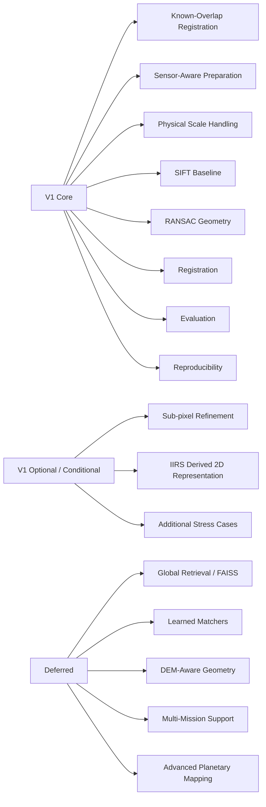
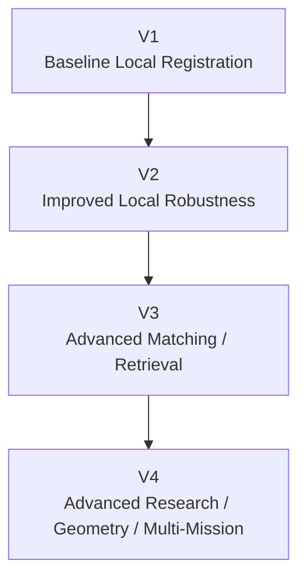
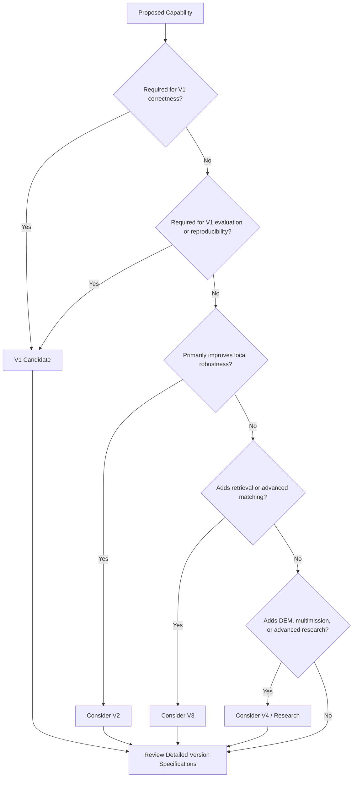

# ChandraMap V1 Scope

> **Document role:** Authoritative V1 scope boundary
> **Version:** V1
> **Version role:** Classical Baseline / Local Registration Foundation
> **Primary task:** Known-overlap local lunar image registration

This document defines the inclusion and exclusion boundary for **ChandraMap V1**. It determines what belongs in the first benchmarkable version, what is optional or conditional, and what must remain outside the V1 baseline until later versions or research stages.

V1 is deliberately narrower than the complete ChandraMap research vision.

> **V1 is intentionally small: it exists to establish a trustworthy classical registration baseline before ChandraMap adds more complex methods.**

> **What is the minimum scientifically defensible capability ChandraMap needs in order to establish a reproducible lunar image-registration baseline?**

That question governs this scope.

> **If a feature is not necessary to establish, evaluate, or reproduce the V1 classical registration baseline, it should not automatically be added to V1.**

> **V1 should solve local registration before ChandraMap expands into global retrieval, advanced learned matching, terrain-aware geometry, or multi-mission research.**

> **Scientific evaluation and reproducibility are part of V1 scope, not later documentation extras.**

> **Scope describes what V1 is intended to contain; it does not imply that every scoped capability is already implemented.**

> **V1 must remain preserved as a benchmark baseline even after V2, V3, and V4 are introduced.**

---

## 1. Relationship to Other V1 Documents

The V1 documentation set has distinct responsibilities.

| Document                                                 | Responsibility                                                      |
| -------------------------------------------------------- | ------------------------------------------------------------------- |
| [`README.md`](./README.md)                               | V1 landing page, overview, and navigation                           |
| [`specification.md`](./specification.md)                 | Detailed normative V1 technical contract                            |
| **`scope.md`**                                           | Defines what V1 includes, permits, conditions, excludes, and defers |
| [`../../project/v1-scope.md`](../../project/v1-scope.md) | Project-level definition of V1 scope                                |

This file is intentionally more boundary-focused than [`specification.md`](./specification.md).

It does not attempt to duplicate:

- every processing-stage requirement;
- every metric definition;
- every data contract;
- every benchmark rule;
- implementation details.

### 1.1 Project-level V1 scope

[`../../project/v1-scope.md`](../../project/v1-scope.md) defines V1 at the project level.

This document organizes that same boundary for:

- implementation planning;
- benchmark design;
- issue and pull-request review;
- contribution decisions;
- version separation.

The two documents should remain consistent.

If they diverge, the discrepancy should be reconciled explicitly rather than creating a third, undocumented interpretation of V1.

---

## 2. Scope Objectives

V1 should establish six things before ChandraMap expands substantially.

### Correctness

The baseline must represent the registration problem honestly.

This includes:

- correct sensor interpretation;
- meaningful scale handling;
- correct correspondence terminology;
- defensible geometric verification;
- explicit coordinate semantics.

### Benchmarkability

V1 must produce outputs that can later be compared against V2, V3, and V4.

### Reproducibility

A result should remain attributable to:

- specific data;
- configuration;
- code;
- truth;
- metric definitions.

### Interpretability

The baseline should be simple enough to understand why it succeeds or fails.

### Failure visibility

Failed image pairs must remain part of the result record.

### Baseline comparability

V1 must remain stable enough that later versions can answer:

> Did this additional method actually improve the result?

---

## 3. Scope Classification Model

Every substantial V1 capability should be understood using one of the following scope classifications.

| Classification   | Meaning                                                                                         |
| ---------------- | ----------------------------------------------------------------------------------------------- |
| **CORE**         | Essential to V1's identity as the classical local-registration baseline                         |
| **REQUIRED**     | Required for scientific correctness, benchmarkability, or reproducibility                       |
| **OPTIONAL**     | Permitted in V1 but not necessary for the minimum scientific baseline                           |
| **CONDITIONAL**  | Applies only to particular sensors, products, data availability, or configuration               |
| **OUT OF SCOPE** | Intentionally excluded from V1                                                                  |
| **DEFERRED**     | Valid ChandraMap capability assigned to later-version development                               |
| **RESEARCH**     | Experimental work that must not redefine the stable V1 baseline without deliberate scope review |

These labels describe **scope**, not implementation status.

For example:

> **SIFT is CORE V1 scope**

does not mean:

> **the SIFT implementation is currently complete.**

Similarly:

> **Global retrieval is OUT OF CORE V1 scope**

does not mean that retrieval is unimportant.

It means that global retrieval is not necessary to establish the V1 local-registration benchmark.

---

# Core Scientific Boundary

## 4. In Scope — Known-Overlap Local Registration

The central V1 task is:

> **Local correspondence and registration between a known lunar source image and a known or constrained reference region.**

Conceptually:

```text
Known Source Image
        +
Known Reference Region
        ↓
Local Correspondence
        ↓
Geometric Verification
        ↓
Transformation
        ↓
Registration
        ↓
Evaluation
```

This is **CORE** V1 functionality.

V1 should establish whether local registration works before the project combines that problem with larger search and retrieval tasks.

### 4.1 Known location and footprint use

If valid source information already provides:

- approximate coordinates;
- footprint;
- map projection;
- reference region;
- another reliable spatial constraint;

V1 SHOULD use that information.

V1 should not intentionally discard valid location metadata merely to introduce an unnecessary retrieval problem.

---

## 5. Out of Scope — Global Retrieval

Whole-Moon image search is not required for the core V1 benchmark.

Global retrieval introduces a second independent problem:

```text
Unknown Source Region
        ↓
Retrieve Candidate Region
        ↓
Register Candidate
```

A failure in such a system could mean either:

- retrieval selected the wrong region; or
- local registration failed.

V1 intentionally avoids this ambiguity.

### 5.1 FAISS

FAISS is vector similarity-search infrastructure.

It can support:

- descriptor indexing;
- nearest-neighbor retrieval;
- Top-K candidate search.

It is not:

- local image registration;
- SIFT keypoint matching;
- RANSAC;
- transform estimation;
- independent geolocation truth.

Therefore FAISS is **DEFERRED** from the core V1 baseline unless an authoritative V1 document explicitly changes this boundary.

---

# Sensor Scope

## 6. Source Sensor Scope

ChandraMap's primary Chandrayaan-2 source family includes:

- OHRC;
- TMC-2;
- IIRS.

Their inclusion in the wider project does not mean they must all follow one V1 path.

Sensor-specific handling is part of V1 scope because the instruments do not provide equivalent information.

---

### 6.1 OHRC

**Orbiter High Resolution Camera**

Approximate project context:

- visible/panchromatic;
- approximately `~0.25–0.32 m/pixel`, depending on product/documentation.

Potential V1 responsibilities include:

- validating the source product;
- optical preprocessing;
- physical scale comparison;
- classical SIFT correspondence;
- local geometric registration;
- quantitative evaluation.

OHRC's high resolution does not make registration automatically easy.

Challenges can still include:

- illumination differences;
- shadows;
- repeated crater structure;
- reference-scale mismatch;
- viewing geometry.

Detailed product support is defined by authoritative V1 data/sensor documentation rather than this scope file.

---

### 6.2 TMC-2

**Terrain Mapping Camera-2**

Approximate project context:

- panchromatic terrain imagery;
- approximately `~5 m/pixel`.

Potential V1 responsibilities include:

- validated TMC-2 input;
- appropriate optical/structural preparation;
- physically meaningful reference-scale selection;
- classical local correspondence;
- geometric registration;
- evaluation.

Very fine reference features that do not exist at TMC-2 scale should not be treated as shared source information.

---

### 6.3 IIRS

**Imaging Infrared Spectrometer**

Approximate project context:

- hyperspectral / imaging infrared;
- approximately `~80 m/pixel`;
- approximately `~0.8–5.0 µm`;
- spectral-band count dependent on product/documentation, commonly described around `~250–256`.

IIRS is fundamentally different from an ordinary grayscale camera.

The complete hyperspectral cube should not simply be supplied to a conventional 2D matcher as though it were one grayscale image.

If IIRS participates in formal V1 registration, the in-scope matcher input should be a documented registration-friendly 2D representation, for example a configured:

- selected band;
- derived component;
- structural representation.

The exact V1 IIRS representation is **CONDITIONAL** and must be defined by the relevant data/algorithm documentation.

If such a representation is not yet defined, complete IIRS matching may remain deferred rather than forcing unsupported multimodal behavior into V1.

---

## 7. Sensor Support Matrix

| Sensor      | V1 Role                                       | Scope Classification                | Notes                                       |
| ----------- | --------------------------------------------- | ----------------------------------- | ------------------------------------------- |
| **OHRC**    | Chandrayaan-2 source                          | According to authoritative V1 scope | Very-high-resolution optical imagery        |
| **TMC-2**   | Chandrayaan-2 source                          | According to authoritative V1 scope | Medium-resolution terrain imagery           |
| **IIRS**    | Source-derived 2D registration representation | **CONDITIONAL**                     | Hyperspectral preparation required          |
| **LRO NAC** | Fine reference                                | **CORE / scope-defined**            | May require scale pyramid/downsampling      |
| **LRO WAC** | Broad/coarse reference                        | **CONDITIONAL**                     | Product-dependent; no universal GSD assumed |

This matrix describes intended scope roles, not current implementation status.

---

## 8. Sensor / Capability Matrix

| Capability               | OHRC                  | TMC-2                 | IIRS                                 | LRO NAC                        | LRO WAC               |
| ------------------------ | --------------------- | --------------------- | ------------------------------------ | ------------------------------ | --------------------- |
| Source role              | According to V1 scope | According to V1 scope | Conditional                          | Reference role                 | Reference role        |
| Reference role           | No core role          | No core role          | No core role                         | Primary/reference-defined      | Conditional           |
| Sensor-aware preparation | Required              | Required              | Required                             | Reference preparation          | Reference preparation |
| Direct 2D optical path   | Prepared image        | Prepared image        | No — derived representation required | Prepared reference             | Prepared reference    |
| Physical scale handling  | Required              | Required              | Required                             | Reference pyramid/downsampling | Context-dependent     |
| SIFT use                 | Prepared image        | Prepared image        | Only defined 2D representation       | Prepared reference             | Prepared reference    |

---

# Reference and Dataset Scope

## 9. Reference Scope

### LRO NAC

LRO NAC is the primary high-resolution reference context for V1 where defined by project scope.

NAC does not need to be used at full native resolution for every source.

For coarser sources, V1 scope includes:

- downsampling;
- scale-pyramid use;
- effective-resolution selection;
- coordinate mapping between working level and original reference.

This prevents fine reference detail from being incorrectly treated as information shared with a coarse source.

### LRO WAC

LRO WAC may be used conditionally for:

- broad reference context;
- coarse-scale comparison;
- workflows explicitly included in authoritative V1 documentation.

V1 does not define one universal WAC spatial resolution.

WAC-based global retrieval is not part of the minimum local-registration baseline.

---

## 10. Dataset Scope

V1 needs a trustworthy benchmark subset, not the complete lunar archive.

### In scope

- explicitly identified mission products;
- prepared benchmark assets;
- documented derived representations;
- frozen/versioned source-reference pair definitions;
- metadata required for scientific interpretation;
- independent truth where available;
- traceable preprocessing.

### Not required for V1

- every Chandrayaan-2 product;
- every LRO observation;
- the complete global lunar image archive;
- all lunar missions;
- a massive machine-learning training corpus.

V1 should start from a controlled dataset small enough to:

- understand;
- reproduce;
- evaluate;
- debug.

See:

- [`../../datasets/README.md`](../../datasets/README.md)
- [`../../datasets/dataset-structure.md`](../../datasets/dataset-structure.md)
- [`../../datasets/dataset-preparation.md`](../../datasets/dataset-preparation.md)

---

## 11. Pair Definition Scope

V1 requires explicit source/reference pair semantics.

A pair should preserve enough information to identify:

- source asset;
- reference asset;
- overlap context;
- pair version;
- prepared representations;
- associated evaluation truth where applicable.

See [`../../datasets/pair-definition.md`](../../datasets/pair-definition.md).

A pair should not depend on an undocumented statement such as:

> "These two images appear to be from the same place."

---

## 12. Ground-Truth Scope

Independent evaluation truth is part of V1 where available.

In-scope concerns include:

- fit/check separation;
- truth provenance;
- truth versioning;
- coordinate-space definition;
- check-point identity.

Out of scope is the assumption that:

> RANSAC inliers = ground truth.

RANSAC inliers are model-consistent correspondences.

They are not independent truth.

See:

- [`../../evaluation/ground-truth.md`](../../evaluation/ground-truth.md)
- [`../../datasets/ground-truth-preparation.md`](../../datasets/ground-truth-preparation.md)

---

# Processing Scope

## 13. Preprocessing

Sensor-aware preprocessing is **REQUIRED** V1 scope.

Potential in-scope operations include:

- input validation;
- numeric conversion;
- nodata handling;
- mask handling;
- usable-region definition;
- conservative normalization;
- coordinate bookkeeping;
- registration-representation preparation.

### Conditional preprocessing

Some behavior may depend on the sensor:

- IIRS-derived 2D representation;
- source-specific structural preparation;
- reference-level preparation.

### Out of scope

V1 should not accumulate a large experimental enhancement pipeline unrelated to establishment of the baseline.

See [`../../algorithms/preprocessing.md`](../../algorithms/preprocessing.md).

---

## 14. Illumination Handling

Limited illumination handling is permitted where it supports a scientifically defensible baseline.

Potential **OPTIONAL** or **CONDITIONAL** methods include:

- contrast normalization;
- local intensity normalization;
- gradient representation;
- simple structure-focused representations.

The following claims are outside V1 scope:

- complete Sun-angle invariance;
- complete shadow correction;
- full physical illumination reconstruction;
- terrain-aware photometric simulation.

Sun-angle variation changes shadow geometry, not just brightness.

See [`../../algorithms/illumination-handling.md`](../../algorithms/illumination-handling.md).

---

## 15. Physical Scale Handling

Physical scale handling is **CORE / REQUIRED** V1 scope.

V1 must account for the fact that:

```text
same array size
    ≠
same physical ground information
```

In-scope capabilities include:

- source/reference scale analysis;
- use of GSD/effective scale where available;
- reference pyramid creation or selection;
- reference downsampling;
- mapping coordinates between scale levels.

> **Compare information, not pixel count.**

Upsampling a coarse source may change array dimensions.

It does not create new physical lunar detail.

See [`../../algorithms/scale-pyramid.md`](../../algorithms/scale-pyramid.md).

---

# Matching and Geometry Scope

## 16. V1 Classical Matcher

SIFT is the **CORE V1 classical feature baseline**.

Its V1 role includes:

- local keypoint detection;
- local descriptor extraction;
- descriptor-based correspondence search.

SIFT is included because it provides a reproducible classical reference method.

It is not included because it is assumed to be universally optimal for lunar imagery.

---

## 17. Deferred / Later-Version Matching

Advanced matching methods may be scientifically valuable, but they are not required to establish the V1 baseline.

Generally deferred or research-oriented methods include:

- ALIKED + LightGlue;
- LoFTR;
- RIFT;
- CFOG-style approaches;
- lunar-specific learned descriptors;
- lunar-specific learned matchers.

Correct terminology:

- **ALIKED** — sparse feature detector/descriptor;
- **LightGlue** — sparse feature matcher;
- **LoFTR** — detector-free correspondence matcher.

Their outputs would still require appropriate geometric verification and evaluation.

Exact placement in V2, V3, or V4 is controlled by those versions' detailed specifications.

---

## 18. Match Filtering

Basic candidate filtering is **REQUIRED** for a defensible classical baseline.

Possible in-scope concepts include:

- descriptor ratio filtering;
- mutual/cross-check consistency;
- duplicate handling;
- one-to-one constraints;
- invalid-coordinate filtering.

Exact thresholds belong to implementation/configuration and benchmark documentation.

Filtered correspondences are still **candidates** until geometric verification.

See [`../../algorithms/match-filtering.md`](../../algorithms/match-filtering.md).

---

## 19. RANSAC and Geometric Verification

RANSAC-style robust geometric verification is **CORE** V1 scope.

In-scope responsibilities include:

- candidate verification;
- outlier rejection;
- identification of model-consistent inliers;
- initial transform estimation;
- clear failure when a valid model cannot be established.

> **Verified inliers are model-consistent correspondences, not independent ground truth.**

See [`../../algorithms/ransac.md`](../../algorithms/ransac.md).

---

## 20. Transform Models

Local transform models are in V1 scope.

Conceptually supported families may include:

- affine;
- homography.

The selected model is benchmark/configuration-defined.

V1 does not require that both models be used for every pair.

A homography is not automatically superior because it has greater flexibility.

See [`../../algorithms/transforms.md`](../../algorithms/transforms.md).

### 20.1 Local-geometry limitation

Affine and homography models are local geometric approximations.

> **The Moon is not globally planar.**

Therefore these models are not intended to represent complete physical lunar terrain geometry.

---

## 21. Advanced Geometry

The following are generally **DEFERRED** from core V1:

- piecewise geometric models;
- mesh warping;
- terrain-conditioned transforms;
- DEM-aware geometry;
- bundle adjustment;
- lunar control-network optimization;
- complete sensor-model photogrammetry.

These may become valuable after the simpler baseline has been measured.

---

## 22. Sub-Pixel Refinement

Sub-pixel refinement is **OPTIONAL / CONDITIONAL** unless the authoritative V1 scope makes it mandatory.

When enabled, its conceptual order should remain:

```text
RANSAC
   ↓
Verified Fit Points
   ↓
Sub-Pixel Refinement
   ↓
Final Transform Refit
   ↓
Evaluation
```

> **Verify first, refine second.**

Sub-pixel coordinate refinement does not increase the physical spatial resolution of the source instrument.

See [`../../algorithms/subpixel-refinement.md`](../../algorithms/subpixel-refinement.md).

---

# Output Scope

## 23. Registration Output

Registration output is part of V1 scope.

Potential outputs include:

- final transform;
- registered raster;
- registered preview;
- overlay;
- validity/overlap information.

See [`../../algorithms/registration.md`](../../algorithms/registration.md).

A registered preview is valuable for human inspection.

It is not sufficient as the only scientific output.

---

## 24. Mosaic Scope

A large lunar mosaic is **OUT OF CORE V1**.

A mosaic may exist as:

- a demonstration;
- downstream visualization;
- consumer of validated registration results.

Mosaic appearance must not define V1 scientific success.

The core remains:

```text
Correspondences
      +
Transform
      +
Evaluation
      +
Provenance
```

---

## 25. Map and UI Scope

The following are outside the core scientific V1 requirement:

- elaborate interactive lunar map;
- production GIS;
- 3D lunar globe;
- map-first application experience;
- polished planetary visualization system.

A simple interface MAY:

- select source/reference assets;
- display correspondences;
- display registration overlays;
- show metrics;
- expose execution controls.

Frontend sophistication is not a V1 benchmark metric.

---

## 26. Backend and Frontend Scope

The V1 scientific boundary is centered on:

- core registration engine;
- evaluation;
- reproducible execution.

Backend and frontend components MAY support:

- execution;
- orchestration;
- API access;
- visualization;
- artifact browsing.

They must not substitute for a functioning benchmarkable registration core.

See:

- [`../../architecture/backend-architecture.md`](../../architecture/backend-architecture.md)
- [`../../architecture/frontend-architecture.md`](../../architecture/frontend-architecture.md)

---

# Evaluation Scope

## 27. Evaluation Is Core V1 Scope

Evaluation is not a later enhancement.

It is part of V1's identity as a benchmark baseline.

Core V1 evaluation concepts include:

- candidate count;
- verified inlier count;
- inlier ratio;
- residual diagnostics;
- spatial coverage;
- held-out check error where truth exists;
- runtime;
- success/failure state.

See [`../../evaluation/metrics.md`](../../evaluation/metrics.md).

---

## 28. Candidate Count

Candidate count is **IN SCOPE** as a diagnostic.

It is not sufficient to establish registration quality.

Many candidate correspondences can still be incorrect.

---

## 29. Inlier Count and Inlier Ratio

Inlier statistics are **IN SCOPE** as geometric-support metrics.

They are not standalone measures of registration accuracy.

A high inlier ratio can still coexist with:

- too few correspondences;
- clustered correspondences;
- wrong-region consensus;
- transform overfitting.

---

## 30. Residual Analysis

Residual diagnostics are **REQUIRED** where a valid transform exists.

Potential in-scope outputs include:

- residual magnitude;
- RMSE where valid;
- directional residuals;
- spatial patterns.

Fit residuals must remain conceptually distinct from independent check residuals.

See [`../../algorithms/residual-analysis.md`](../../algorithms/residual-analysis.md).

---

## 31. Spatial Coverage

Spatial coverage is part of V1 evaluation scope.

Its purpose is to determine whether valid geometric support is distributed across the usable overlap.

A large number of inliers around one crater may not strongly constrain the complete registration.

No universal coverage threshold is defined here.

See [`../../evaluation/spatial-coverage.md`](../../evaluation/spatial-coverage.md).

---

## 32. Control / Fit Points

Control or fit points are **CONDITIONAL**, depending on the benchmark truth design.

They may be used to constrain the transformation.

They do not automatically provide independent accuracy evidence.

See [`../../evaluation/control-points.md`](../../evaluation/control-points.md).

---

## 33. Held-Out Check Points

Held-out check evaluation is **REQUIRED where suitable independent truth exists**.

A check point used for independent evaluation must not also contribute to final transform fitting for that same run.

See [`../../evaluation/checkpoint-evaluation.md`](../../evaluation/checkpoint-evaluation.md).

---

## 34. Pixel-Space and Ground-Space Error

Primary error reporting SHOULD remain tied to an explicitly defined image coordinate system, such as source-image pixels where appropriate.

Physical ground distance MAY be reported when:

- scale is valid;
- coordinate mapping is valid;
- projection/geospatial context supports the conversion.

The following shortcut is not automatically scientifically valid:

```text
pixel error × approximate sensor GSD
```

V1 scope does not include unsupported claims of ground accuracy.

---

## 35. Success-Criteria Scope

Clear success/failure semantics are **REQUIRED** V1 scope.

Exact thresholds are benchmark-defined.

This scope document intentionally does not define arbitrary values such as:

- fixed accuracy percentages;
- universal minimum match count;
- universal inlier ratio;
- universal RMSE threshold;
- universal coverage threshold.

See [`../../evaluation/success-criteria.md`](../../evaluation/success-criteria.md).

---

## 36. Failure-Case Scope

Failure reporting is **REQUIRED** V1 scope.

Potential observed failure stages include:

- input;
- preprocessing;
- representation preparation;
- scale selection;
- matching;
- filtering;
- RANSAC;
- transform estimation;
- refinement;
- registration;
- evaluation.

A reported failure stage does not automatically prove the root cause.

See [`../../evaluation/failure-cases.md`](../../evaluation/failure-cases.md).

> **A failed benchmark pair remains scientific evidence and should not be silently removed from V1 reporting.**

---

## 37. Stress-Test Scope

A limited stress suite is **OPTIONAL / benchmark-defined** for V1.

Potential cases include:

- physical scale mismatch;
- illumination differences;
- low-feature terrain;
- repetitive terrain;
- known synthetic translation;
- known rotation;
- known scale;
- controlled affine transformation.

V1 does not require a massive multi-factor robustness campaign.

See [`../../evaluation/stress-tests.md`](../../evaluation/stress-tests.md).

---

# Engineering Scope

## 38. Reproducibility Is Required

Reproducibility is **REQUIRED** V1 scope.

A formal V1 result should preserve enough context to identify:

- code revision;
- benchmark version;
- pair ID/version;
- source asset;
- reference asset;
- preprocessing configuration;
- scale selection;
- matcher configuration;
- filtering configuration;
- RANSAC configuration;
- transform model;
- optional refinement configuration;
- truth/check-point version;
- metric semantics;
- runtime;
- status;
- failure stage.

See [`../../evaluation/reproducibility.md`](../../evaluation/reproducibility.md).

---

## 39. Runtime Scope

Runtime is **IN SCOPE** as an engineering diagnostic.

Runtime should be interpreted together with relevant context such as:

- hardware;
- software environment;
- input dimensions;
- enabled stages.

A strict production latency requirement is outside the scientific V1 scope unless defined by an authoritative benchmark.

V1 does not define a runtime SLA.

---

## 40. Hardware Scope

V1 should not require specialized hardware merely to qualify as the baseline unless the actual implementation makes such hardware essential.

The classical V1 design should favor accessible and reproducible execution where practical.

Specific GPU hardware is not a scientific success criterion by default.

---

## 41. Machine-Learning Training Scope

The following are **OUT OF CORE V1**:

- neural-network training;
- learned-matcher fine-tuning;
- large lunar training-dataset construction;
- large-scale GPU training;
- deep hyperparameter optimization;
- learned confidence calibration.

Such work may belong to later or research versions.

---

## 42. Retrieval Index Scope

The following are **DEFERRED** from core V1:

- global descriptor training;
- full-Moon embedding generation;
- large reference vector database;
- FAISS index construction;
- Top-K whole-Moon retrieval.

V1 focuses on local registration after the reference region is already known or constrained.

---

## 43. Multi-Mission Scope

Full multi-mission support is **DEFERRED**.

Core V1 should first establish the Chandrayaan-2 ↔ LRO baseline.

Potential later research may involve:

- Kaguya / SELENE;
- additional lunar missions;
- cross-mission learned features;
- planetary extension.

Mars and Venus support are not required for V1.

---

## 44. DEM and Elevation Scope

The following are generally **DEFERRED**:

- DEM-aware transform estimation;
- terrain-conditioned registration;
- relief-dependent local warping;
- advanced orthorectification research;
- elevation-aware model selection.

Elevation products may still be useful as future or diagnostic data, but they do not define the minimum V1 baseline.

---

## 45. Geolocation Scope

Geolocation is **CONDITIONAL**.

If trusted map-projected reference products and valid geospatial metadata exist, V1 MAY derive or report reference-linked coordinates.

However:

```text
successful image-to-image registration
        ≠
automatically validated absolute geolocation
```

V1 should not make absolute-coordinate accuracy claims without appropriate geospatial truth.

---

## 46. Retrieval Metrics

Metrics such as `Recall@K` are **OUT OF CORE V1** if V1 contains no retrieval stage.

Recall@K measures whether the correct candidate appears in a retrieval ranking.

It is not a local image-registration metric.

---

## 47. API Scope

A sophisticated API is not required to validate V1 scientifically.

A backend MAY expose V1 processing.

API completeness is not part of registration accuracy or benchmark success.

---

## 48. Deployment Scope

Unless separately required by repository architecture, the following are outside V1 scientific completion:

- Kubernetes;
- distributed GPU inference;
- autoscaling;
- cloud-scale serving;
- large observability stacks;
- high-availability infrastructure.

V1 should prioritize a reproducible scientific pipeline over production-scale infrastructure.

---

## 49. Documentation Scope

Documentation is part of V1 readiness.

V1 should provide enough documentation for contributors to understand:

- its purpose;
- its data;
- its boundaries;
- its pipeline;
- its metrics;
- its failures;
- its reproducibility requirements.

This scope file should not duplicate detailed implementation or evaluation documents.

---

# Scope Matrices

## 50. V1 Capability Matrix

| Capability                       | V1 Classification                       | Reason                                         |
| -------------------------------- | --------------------------------------- | ---------------------------------------------- |
| Known-overlap local registration | **CORE**                                | Primary V1 task                                |
| Explicit source/reference pair   | **REQUIRED**                            | Removes retrieval ambiguity                    |
| Sensor-aware preprocessing       | **REQUIRED**                            | Sensors differ physically                      |
| Physical GSD scale handling      | **REQUIRED**                            | Enables meaningful cross-resolution comparison |
| Reference scale pyramid          | **CONDITIONAL / REQUIRED where needed** | Supports coarse-source/fine-reference matching |
| SIFT                             | **CORE**                                | Classical baseline                             |
| Descriptor matching              | **CORE**                                | Produces candidate correspondence              |
| Match filtering                  | **REQUIRED**                            | Improves candidate quality before geometry     |
| RANSAC                           | **CORE**                                | Robust geometric verification                  |
| Affine / homography              | **CONDITIONAL / CORE model family**     | Local transform models                         |
| Residual analysis                | **REQUIRED**                            | Quantitative geometric diagnostics             |
| Spatial coverage                 | **REQUIRED / benchmark-defined**        | Measures support distribution                  |
| Held-out check evaluation        | **REQUIRED where truth exists**         | Independent accuracy evidence                  |
| Sub-pixel refinement             | **OPTIONAL / CONDITIONAL**              | Precision experiment after verification        |
| Registered preview               | **RECOMMENDED**                         | Human diagnostic                               |
| Runtime measurement              | **REQUIRED / benchmark-defined**        | Engineering diagnostic                         |
| Failure reporting                | **REQUIRED**                            | Preserves benchmark integrity                  |
| Reproducibility                  | **REQUIRED**                            | Enables later comparison                       |
| Global retrieval                 | **OUT OF CORE V1**                      | Separate scientific problem                    |
| FAISS                            | **DEFERRED**                            | Retrieval infrastructure                       |
| LightGlue                        | **DEFERRED / RESEARCH**                 | Learned matcher comparison                     |
| LoFTR                            | **DEFERRED / RESEARCH**                 | Learned matcher comparison                     |
| RIFT / CFOG-style methods        | **RESEARCH**                            | Advanced multimodal matching                   |
| DEM-aware geometry               | **DEFERRED**                            | Advanced terrain modeling                      |
| Piecewise/local warping          | **DEFERRED / RESEARCH**                 | Expands geometry substantially                 |
| Multi-mission support            | **DEFERRED**                            | Later generalization research                  |
| Large lunar mosaic               | **OUT OF CORE V1**                      | Downstream product                             |
| Interactive lunar map            | **OUT OF SCIENTIFIC CORE**              | Demo/UI layer                                  |
| Large ML training pipeline       | **OUT OF CORE V1**                      | Later learned-method research                  |

---

## 51. Scope Boundary Table

| Area              | In V1                                           | Not Required in V1                   |
| ----------------- | ----------------------------------------------- | ------------------------------------ |
| Registration      | Known-overlap local registration                | Full-Moon global search              |
| Matching          | SIFT classical baseline                         | Mandatory learned matching           |
| Sensor processing | Sensor-aware preparation                        | One universal preprocessing path     |
| Scale             | GSD/effective-scale handling                    | Pretending upsampling creates detail |
| Geometry          | Local affine/homography baseline                | DEM-aware piecewise geometry         |
| Evaluation        | Residuals, coverage, independent checks         | Advanced uncertainty framework       |
| Sensors           | Chandrayaan-2 ↔ LRO baseline                    | Full multi-mission support           |
| Retrieval         | Reference already known/constrained             | FAISS/global vector search           |
| Interface         | Basic runnable/inspectable pipeline             | Production planetary GIS             |
| Output            | Transform + correspondences + metrics + preview | Mosaic-only result                   |
| Reproducibility   | Required                                        | Ad-hoc manual workflow               |
| Failure handling  | Explicit                                        | Silent fallback or dropped failures  |

---

## 52. V1 Scope Architecture



---

# Minimum V1 Boundary

## 53. Minimum Viable Scientific V1

The minimum meaningful scientific V1 is:

```text
Known Source / Reference Pair
        ↓
Prepared Images
        ↓
Physically Compatible Scale
        ↓
SIFT
        ↓
Candidate Correspondences
        ↓
Filtering
        ↓
RANSAC
        ↓
Verified Inliers
        ↓
Transform
        ↓
Registered Preview
        ↓
Residual Diagnostics
        ↓
Independent Error Where Truth Exists
        ↓
Spatial Coverage
        ↓
Reproducible Success / Failure Record
```

This is the minimum baseline required to meaningfully compare later improvements.

It is not an "MVP" in a marketing sense.

It is the **minimum scientifically defensible V1**.

---

## 54. Optional V1 Enhancements

Features that MAY improve V1 without redefining its identity include:

- simple sub-pixel refinement;
- additional residual plots;
- richer visual diagnostics;
- controlled affine-vs-homography experiments;
- additional benchmark pairs;
- limited stress cases.

These should not unnecessarily delay establishment of the core baseline.

---

## 55. Features That Must Not Block Basic V1

Unless authoritative scope explicitly requires them, the following should not block establishment of the baseline:

- global retrieval;
- FAISS;
- learned matcher integration;
- advanced multimodal learning;
- DEM-aware geometry;
- multi-mission support;
- advanced ML training;
- polished frontend;
- global lunar mosaic engine;
- complete planetary expansion.

These may be valuable.

They are simply not necessary to answer the V1 research question.

---

## 56. V1 Completion Boundary

V1 scope is sufficiently realized when the scoped system can:

- run on defined benchmark pairs;
- produce candidate correspondences;
- perform geometric verification;
- produce a valid transform on successful cases;
- fail explicitly on unsuccessful cases;
- generate metrics where scientifically meaningful;
- perform held-out evaluation where truth exists;
- preserve failures;
- preserve provenance;
- reproduce the baseline sufficiently for later comparison;
- document its limitations.

No numerical accuracy threshold is defined in this scope document.

> **V1 does not need to achieve the maximum possible accuracy. It needs to establish a trustworthy baseline that later versions can improve upon measurably.**

---

# Version Boundaries

## 57. V1 → V2 Boundary

Work should usually move toward V2 when it primarily introduces targeted improvements to **local-registration robustness** rather than corrections necessary for the classical baseline.

Possible V2-direction work may include:

- stronger preprocessing;
- more systematic illumination handling;
- improved scale strategy;
- alternative local matching approaches;
- stronger refinement;
- broader local-registration stress testing.

The actual V2 specification remains authoritative.

---

## 58. V1 → V3 Boundary

Work should usually move toward V3 when it introduces larger-search or advanced-matching capabilities such as:

- regional/global retrieval;
- FAISS/vector indexing;
- global descriptors;
- Top-K reference candidates;
- learned local matching as a major pipeline path;
- retrieval plus local geometric verification;
- WAC→NAC coarse-to-fine search;
- end-to-end retrieval-and-registration evaluation.

The actual V3 specification remains authoritative.

---

## 59. V1 → V4 Boundary

Work should usually move toward V4 or advanced research when it introduces:

- DEM-aware geometry;
- advanced multimodal registration;
- lunar-specific learned features;
- RIFT/CFOG-style research;
- terrain-conditioned transformations;
- uncertainty-aware registration;
- control-network research;
- sensor-model photogrammetry;
- multi-mission generalization.

The actual V4 specification remains authoritative.

---

## 60. Version Progression



> This diagram is a conceptual scope progression. Detailed version specifications determine the final capability boundaries.

---

# Contributor Scope Decisions

## 61. Questions Before Adding a Feature to V1

Before adding substantial functionality to V1, ask:

1. Is it necessary to make the baseline scientifically correct?
2. Is it necessary to make the baseline measurable?
3. Is it necessary to make V1 reproducible?
4. Is it necessary to support the defined source/reference baseline?
5. Can V1 remain a valid benchmark without it?
6. Does the change introduce a new scientific problem?
7. Does it make it harder to determine which component improved performance?
8. Is it already better aligned with V2, V3, V4, or research?
9. Does it require new truth, metrics, or benchmark semantics?
10. Could it break historical V1 comparability?

If the change primarily adds research complexity rather than baseline correctness, evaluation, or reproducibility, it likely belongs outside core V1.

---

## 62. Scope Decision Flow



The detailed version specifications remain authoritative.

---

# Preventing Scope Creep

## 63. Scope Creep Examples

Common V1 scope-creep patterns include:

- adding whole-Moon retrieval before local registration is stable;
- integrating several learned matchers before a SIFT baseline exists;
- building DEM processing before transform/evaluation basics work;
- creating a large vector index before a known pair can be registered;
- developing a polished map UI before metrics are trustworthy;
- expanding to Kaguya, Mars, or Venus before the Chandrayaan-2 ↔ LRO baseline is established;
- adding complex local warping before simple transform residuals are understood;
- adding ML training infrastructure before classical benchmark results exist.

These ideas may be valuable.

Their value does not require them to be in V1.

### 63.1 Scope priority

V1 should prioritize roughly:

```text
Scientific Correctness
        ↓
Evaluation + Reproducibility
        ↓
Baseline Registration
        ↓
Optional Precision Improvements
        ↓
Future Advanced Features
```

More complexity should not displace more fundamental scientific requirements.

---

## 64. Scope Change Control

A proposed change requires deliberate scope review if it materially alters:

- V1's primary task;
- baseline algorithm;
- supported sensor assumptions;
- benchmark definition;
- ground truth;
- metric semantics;
- transform family;
- evaluation rules;
- required outputs;
- completion boundary.

Scope MUST NOT expand silently because new implementation code happened to be added.

Significant changes should remain traceable through existing repository mechanisms such as:

- version documentation;
- Git history;
- [`../../../CHANGELOG.md`](../../../CHANGELOG.md) where appropriate;
- roadmap/version specifications.

No separate scope-change subsystem is required by this document.

---

## 65. Implementation Status Warning

> **This document defines V1 scope. It does not prove implementation completion.**

A capability may be:

- in scope;
- required;
- optional;
- conditional;

without being currently implemented.

Do not infer:

- completion percentage;
- benchmark readiness;
- test coverage;
- feature availability;

from this scope document alone.

---

# V1 Scope Checklist

## 66. Scope-Control Checklist

The checklist is intentionally unchecked.

- [ ] Known-overlap local registration remains the primary V1 task
- [ ] Supported source-sensor scope is explicitly documented
- [ ] Reference-sensor scope is explicitly documented
- [ ] IIRS representation scope is explicit
- [ ] Sensor-aware preprocessing remains in scope
- [ ] Physical scale handling remains in scope
- [ ] SIFT remains the classical baseline
- [ ] Candidate filtering remains in scope
- [ ] RANSAC/geometric verification remains in scope
- [ ] Transform-family assumptions remain bounded
- [ ] Residual analysis remains in scope
- [ ] Independent evaluation remains in scope where truth exists
- [ ] Spatial coverage remains in scope
- [ ] Explicit failure reporting remains in scope
- [ ] Reproducibility remains in scope
- [ ] Global retrieval remains outside core V1 unless scope is deliberately changed
- [ ] Advanced learned matching is not required for baseline completion
- [ ] DEM-aware geometry remains outside core V1
- [ ] Multi-mission expansion remains deferred
- [ ] UI and mosaic work do not redefine scientific success
- [ ] V1 remains comparable with later versions

---

# Scope Risks

## 67. Scope Risk Table

| Scope Risk                                    | Why It Matters                                        | Scope Response                           |
| --------------------------------------------- | ----------------------------------------------------- | ---------------------------------------- |
| Adding global retrieval too early             | Confounds retrieval failure with registration failure | Keep core V1 known-overlap               |
| Adding multiple matchers at once              | Makes improvement attribution unclear                 | Preserve SIFT baseline                   |
| Treating IIRS like grayscale                  | Creates invalid modality assumptions                  | Require documented 2D representation     |
| Forcing full-resolution NAC                   | Creates unrealistic physical scale mismatch           | Use scale-aware reference representation |
| Making mosaic the main deliverable            | Hides correspondence quality                          | Keep transform and metrics primary       |
| Evaluating only fit RMSE                      | Overstates evidence                                   | Use independent checks where available   |
| Hiding failed pairs                           | Inflates apparent baseline robustness                 | Preserve failures                        |
| Expanding to other missions too early         | Dilutes V1 research question                          | Defer multi-mission work                 |
| Adding DEM-aware geometry                     | Expands geometric complexity substantially            | Defer to advanced versions/research      |
| Building UI before science                    | Does not validate correspondence                      | Keep UI secondary                        |
| Adding learned methods before baseline freeze | Removes clear classical comparison point              | Preserve benchmarkable SIFT path         |
| Silently changing V1 later                    | Breaks historical comparison                          | Apply explicit scope/change control      |

---

# V1 Scope Anti-Patterns

## 68. Practices to Avoid

Do **not**:

- make V1 contain every ChandraMap idea;
- add features solely because they are technically interesting;
- treat roadmap ideas as immediate V1 requirements;
- treat scoped functionality as proof of implementation;
- add global retrieval unnecessarily to known-overlap registration;
- make FAISS a V1 registration requirement;
- make learned matchers mandatory before baseline benchmarking;
- treat IIRS as ordinary grayscale imagery;
- upsample coarse data and describe it as physically higher resolution;
- require full-resolution NAC matching for every source;
- claim simple preprocessing creates Sun-angle invariance;
- require DEM-aware geometry for baseline completion;
- require full multi-mission support;
- make lunar mosaic generation the core scientific result;
- make frontend polish a scientific success criterion;
- prioritize runtime optimization ahead of correctness;
- move independent evaluation outside V1 scope;
- remove failure reporting from V1;
- remove reproducibility from V1;
- silently redefine V1 after later versions are created;
- modify V1 merely to make V2/V3/V4 appear stronger;
- confuse research-version scope with GitHub release numbering.

---

# Claims to Avoid

## 69. Scope Does Not Justify These Claims

This document does not justify statements such as:

> "V1 is complete."

> "V1 is fully implemented."

> "V1 solves lunar image registration."

> "V1 is scale invariant."

> "V1 is illumination invariant."

> "V1 supports every Chandrayaan-2 product."

> "V1 supports every LRO image."

> "V1 achieves sub-pixel accuracy."

> "V1 achieves sub-metre ground accuracy."

> "V1 is production ready."

> "SIFT is sufficient for every lunar sensor."

> "Global retrieval is unnecessary forever."

> "Learned methods are unnecessary."

> "DEM-aware registration is unnecessary."

Scope is a deliberate version boundary.

It is not a universal judgment about technical value, current implementation status, or measured performance.

---

# Limitations of the V1 Scope

## 70. Known Limitations

V1 intentionally leaves several important challenges unresolved.

### Known-overlap limitation

V1 does not measure whole-Moon localization or global retrieval quality.

### Classical-feature limitation

SIFT may struggle under severe cross-modality and illumination differences.

### Physical-scale limitation

Large GSD differences reduce the information shared by source and reference products.

### Illumination limitation

Different Sun angles can substantially modify shadows and apparent terrain structure.

### Repetitive-terrain limitation

Similar craters and repeated lunar structures can create ambiguous correspondences.

### Low-feature limitation

Some terrain may not provide enough stable local structure for a classical baseline.

### Geometry limitation

Affine and homography models are local approximations and may not capture strong terrain-relief effects.

### IIRS limitation

IIRS provides much coarser spatial information and requires modality-specific preparation.

### Truth limitation

Independent benchmark truth may be unavailable or imperfect for some pairs.

### Ground-accuracy limitation

Pixel-space registration accuracy cannot always be converted defensibly into absolute physical ground error.

### Benchmark-generalization limitation

V1 conclusions apply to documented benchmark data and should not be generalized automatically to all lunar imagery.

Later ChandraMap versions exist specifically to investigate broader operating conditions and more advanced approaches.

---

# Related Documentation

## 71. Same-Directory V1 Documents

- [V1 README](./README.md) — landing page and V1 overview.
- [V1 Technical Specification](./specification.md) — detailed technical contract.

This file defines the inclusion/exclusion boundary.

---

## 72. Parent Version Documentation

- [ChandraMap Version Architecture](../README.md)

The parent document explains the larger V1–V4 benchmark architecture and why earlier versions remain preserved.

---

## 73. Project Documentation

- [Project Goals](../../project/goals.md)
- [Project Non-Goals](../../project/non-goals.md)
- [Project-Level V1 Scope](../../project/v1-scope.md)
- [Terminology](../../project/terminology.md)
- [Assumptions](../../project/assumptions.md)
- [Limitations](../../project/limitations.md)

[`../../project/v1-scope.md`](../../project/v1-scope.md) must remain consistent with this version-directory scope contract.

---

## 74. Architecture Documentation

- [System Overview](../../architecture/system-overview.md)
- [V1 Pipeline Architecture](../../architecture/v1-pipeline.md)
- [Core Engine Architecture](../../architecture/core-engine-architecture.md)
- [Backend Architecture](../../architecture/backend-architecture.md)
- [Frontend Architecture](../../architecture/frontend-architecture.md)
- [Module Map](../../architecture/module-map.md)
- [Data Flow](../../architecture/data-flow.md)
- [Output Flow](../../architecture/output-flow.md)

Architecture documentation describes how scoped capabilities fit together.

Scope determines whether those capabilities belong in V1.

---

## 75. Sensor Documentation

- [Sensor Overview](../../sensors/overview.md)
- [OHRC](../../sensors/ohrc.md)
- [TMC-2](../../sensors/tmc2.md)
- [IIRS](../../sensors/iirs.md)
- [LRO NAC](../../sensors/lro-nac.md)
- [LRO WAC](../../sensors/lro-wac.md)

These documents provide the detailed sensor context that constrains V1 scope.

---

## 76. Dataset Documentation

- [Dataset Overview](../../datasets/README.md)
- [Chandrayaan-2 Data](../../datasets/chandrayaan-2.md)
- [LRO Data](../../datasets/lro.md)
- [Metadata](../../datasets/metadata.md)
- [Data Format](../../datasets/data-format.md)
- [Dataset Structure](../../datasets/dataset-structure.md)
- [Dataset Preparation](../../datasets/dataset-preparation.md)
- [Pair Definition](../../datasets/pair-definition.md)
- [Ground-Truth Preparation](../../datasets/ground-truth-preparation.md)

V1 does not redefine data semantics already established by these documents.

---

## 77. Algorithm Documentation

Known algorithm documentation includes:

- [Algorithm Overview](../../algorithms/overview.md)
- [Sensor Routing](../../algorithms/sensor-routing.md)
- [Preprocessing](../../algorithms/preprocessing.md)
- [Illumination Handling](../../algorithms/illumination-handling.md)
- [Scale Pyramid](../../algorithms/scale-pyramid.md)
- [Matching](../../algorithms/matching.md)
- [Match Filtering](../../algorithms/match-filtering.md)
- [RANSAC](../../algorithms/ransac.md)
- [Transforms](../../algorithms/transforms.md)
- [Residual Analysis](../../algorithms/residual-analysis.md)
- [Sub-Pixel Refinement](../../algorithms/subpixel-refinement.md)
- [Registration](../../algorithms/registration.md)

A dedicated SIFT document, if present, provides method-level detail but is not required for understanding this scope boundary.

---

## 78. Evaluation Documentation

- [Evaluation Overview](../../evaluation/README.md)
- [Benchmark Protocol](../../evaluation/benchmark-protocol.md)
- [Benchmark Categories](../../evaluation/benchmark-categories.md)
- [Metrics](../../evaluation/metrics.md)
- [Ground Truth](../../evaluation/ground-truth.md)
- [Control Points](../../evaluation/control-points.md)
- [Check-Point Evaluation](../../evaluation/checkpoint-evaluation.md)
- [Spatial Coverage](../../evaluation/spatial-coverage.md)
- [Stress Tests](../../evaluation/stress-tests.md)
- [Success Criteria](../../evaluation/success-criteria.md)
- [Failure Cases](../../evaluation/failure-cases.md)
- [Reproducibility](../../evaluation/reproducibility.md)

Evaluation and reproducibility are explicitly **inside** V1 scope.

They are not downstream extras.

---

## 79. Data Licensing

- [Data Licenses](../../data-licenses.md)

Licensing and redistribution rules do not change the V1 scientific problem, but they determine how mission data may be stored, referenced, reproduced, or distributed.

---

## 80. Root Repository Documentation

Relevant repository-level documents include:

- [Repository README](../../../README.md)
- [Roadmap](../../../ROADMAP.md)
- [Changelog](../../../CHANGELOG.md)
- [Contributing Guide](../../../CONTRIBUTING.md)
- [Security Policy](../../../SECURITY.md)
- [Citation Metadata](../../../CITATION.cff)

---

## 81. Benchmark, Experiment, Result, and Artifact Directories

Where applicable:

- [`../../../benchmarks/`](../../../benchmarks/) — formal/frozen benchmark definitions;
- [`../../../experiments/`](../../../experiments/) — controlled or exploratory research experiments;
- [`../../../results/`](../../../results/) — generated metrics and result records;
- [`../../../artifacts/`](../../../artifacts/) — generated scientific or visual artifacts.

Experiments may explore ideas outside core V1 without automatically changing the V1 scope.

---

# Final Scope Boundary

## 82. V1 Responsibility

V1 is responsible for establishing:

```text
Known Lunar Pair
      ↓
Sensor-Aware Preparation
      ↓
Physical Scale Compatibility
      ↓
Classical SIFT Correspondence
      ↓
Candidate Filtering
      ↓
RANSAC Verification
      ↓
Local Transform
      ↓
Registration
      ↓
Residual + Coverage + Independent Evaluation
      ↓
Explicit Success / Failure
      ↓
Reproducible Baseline Result
```

It is not responsible for solving the complete ChandraMap research vision.

The dividing rule is:

> **If a feature is required to make the classical baseline correct, measurable, reproducible, or scientifically interpretable, it belongs in V1.**

> **If a feature primarily expands retrieval, learned matching, terrain geometry, mission coverage, or advanced research complexity, it should remain outside V1 unless the authoritative scope is deliberately changed.**

The purpose of keeping this boundary strict is not to limit ChandraMap's long-term capability.

It is to ensure that later capability can be measured against a stable reference.

> **V1 does not need to be the most capable ChandraMap version. It needs to be the version that makes every later improvement measurable.**

<!-- Source request/context: :contentReference[oaicite:0]{index=0} -->
