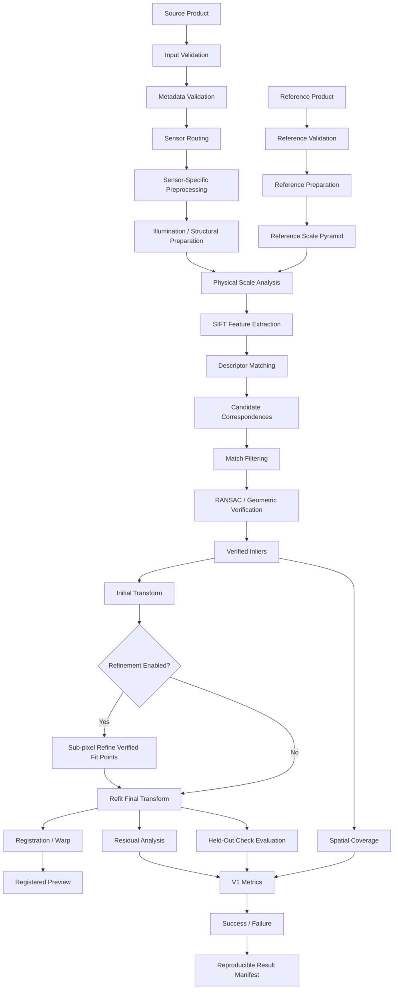
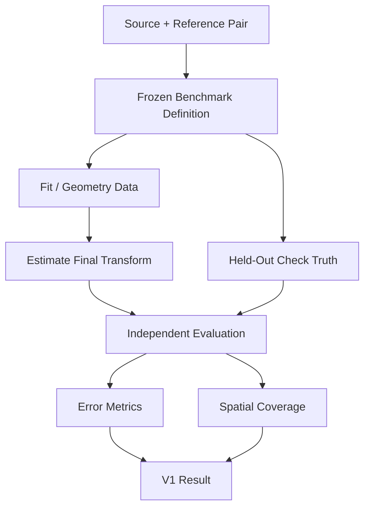
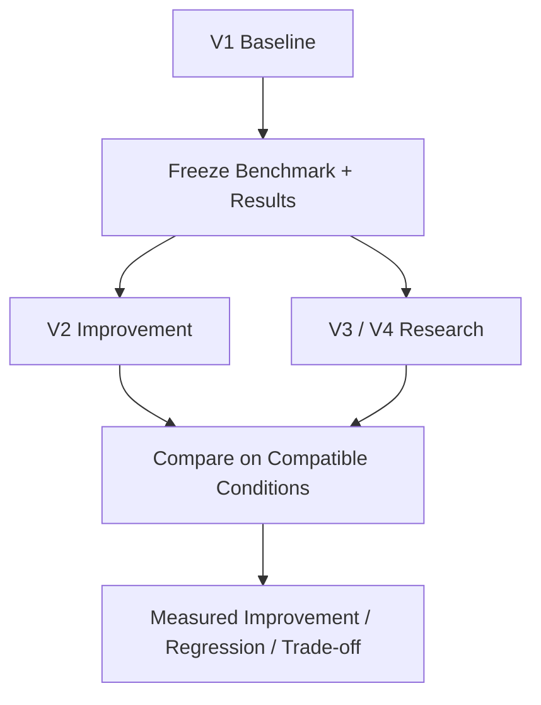

# ChandraMap V1 Technical Specification

> **Status:** Normative V1 specification
> **Version role:** Classical Baseline / Registration Foundation
> **Primary task:** Known-overlap local lunar image registration
> **Specification scope:** Scientific behavior, processing order, evaluation rules, outputs, reproducibility, and V1 completion conditions

This document is the authoritative technical specification for **ChandraMap V1**.

[`README.md`](./README.md) provides the V1 overview and navigation. This specification defines the more precise scientific and engineering contract that a V1 implementation is expected to satisfy.

Where project-wide scope documents impose narrower or more specific constraints, they remain authoritative. In particular, [`../../project/v1-scope.md`](../../project/v1-scope.md) defines the project-level V1 boundary and must not be contradicted by an implementation of this specification.

> **V1 optimizes for correctness, interpretability, measurability, and reproducibility before algorithmic complexity.**

> **V1 is the benchmark anchor against which later ChandraMap versions should be compared.**

> **A registration result is not validated merely because the overlay looks correct.**

> **Matcher output consists of candidate correspondences. Geometric verification determines which candidates are model-consistent inliers.**

> **RANSAC inliers are not independent ground truth.**

> **Compare information, not pixel count.**

> **Sun-angle changes affect shadow geometry, not only brightness.**

> **V1 should produce either a measurable registration result or an explicit reproducible failure record.**

---

## 1. Normative Language

The terms **MUST**, **SHOULD**, and **MAY** are used deliberately.

| Term       | Meaning                                                            |
| ---------- | ------------------------------------------------------------------ |
| **MUST**   | Required for V1 specification compliance or scientific correctness |
| **SHOULD** | Strong recommendation; deviation requires a defensible reason      |
| **MAY**    | Optional, configurable, or implementation-dependent behavior       |

This specification defines required behavior. It does not imply that every requirement has already been implemented in the current repository state.

---

## 2. V1 Identity

| Area                    | V1 Specification                                                    |
| ----------------------- | ------------------------------------------------------------------- |
| Version                 | V1                                                                  |
| Version role            | Classical Baseline / Registration Foundation                        |
| Primary task            | Known-overlap local lunar image registration                        |
| Baseline feature method | SIFT                                                                |
| Retrieval               | Not required for core V1                                            |
| Geometric verification  | RANSAC-style robust model estimation                                |
| Transform family        | Affine and/or homography as benchmark/configuration-defined         |
| Scale handling          | Physical GSD/effective-scale-aware reference preparation            |
| Illumination handling   | Conservative preprocessing; no invariance claim                     |
| Sub-pixel refinement    | Optional/configurable unless authoritative V1 scope requires it     |
| Evaluation              | Residuals, spatial coverage, and held-out checks where truth exists |
| Ground-distance error   | Conditional on valid geospatial mapping                             |
| Failure behavior        | Explicit and reproducible                                           |
| Reproducibility         | Required                                                            |
| Long-term role          | Baseline for later V2–V4 comparison                                 |

---

## 3. Primary Research Question

> **Can ChandraMap reliably register a known lunar source/reference pair using a classical, reproducible correspondence pipeline and measure the result independently?**

V1 exists to answer this question before ChandraMap introduces additional complexity such as:

- global lunar retrieval;
- learned local matching;
- large global-descriptor models;
- advanced multimodal architectures;
- DEM-aware geometry;
- terrain-dependent local warping;
- multi-mission correspondence;
- planetary-scale control networks.

V1 is not expected to achieve the highest possible registration accuracy.

It is expected to establish a **defensible baseline** that later methods can be measured against.

---

## 4. V1 Scientific Scope

The principal V1 scientific task is:

```text
Chandrayaan-2 Source
        +
Known / Selected LRO Reference
        ↓
Local Correspondence
        ↓
Geometric Verification
        ↓
Registration Transform
        ↓
Registered Product / Preview
        ↓
Independent Evaluation Where Truth Exists
```

### 4.1 Known-overlap assumption

V1 MUST operate primarily on a source/reference pair for which the expected reference region or overlap is already known or constrained.

If valid metadata provides:

- source footprint;
- approximate latitude/longitude;
- map projection;
- reference region;
- other usable geographic constraints;

V1 SHOULD use that information.

V1 MUST NOT require whole-Moon visual retrieval before local registration can be evaluated.

This separation is intentional:

```text
Global Retrieval Failure
        ≠
Local Registration Failure
```

V1 isolates the local correspondence and registration problem first.

---

## 5. V1 Goals

V1 is intended to establish:

1. a controlled source/reference pair definition;
2. sensor-aware data preparation;
3. physically meaningful scale compatibility;
4. reproducible SIFT feature extraction;
5. descriptor-based candidate correspondence;
6. candidate filtering;
7. robust geometric verification;
8. an explicit source-to-reference transform;
9. optional refinement of already verified fitting coordinates;
10. final transform refitting where refinement changes coordinates;
11. registration/warping output;
12. residual diagnostics;
13. spatial-support measurement;
14. held-out evaluation where valid truth exists;
15. explicit success/failure semantics;
16. complete result provenance sufficient for later comparison.

---

## 6. V1 Non-Goals

Unless an existing authoritative V1 scope document explicitly states otherwise, V1 does **not** require:

- global full-Moon visual retrieval;
- FAISS indexing;
- large global descriptor networks;
- learned local matchers as the official baseline;
- ALIKED + LightGlue as a mandatory pipeline;
- LoFTR as a mandatory pipeline;
- RIFT as a mandatory pipeline;
- CFOG as a mandatory pipeline;
- DEM-aware registration;
- terrain-dependent piecewise transforms;
- bundle adjustment;
- planetary control networks;
- complete sensor-model photogrammetry;
- multi-mission registration;
- Kaguya/SELENE integration;
- Mars or Venus registration;
- production planetary GIS;
- a large interactive mapping application;
- final global lunar mosaicking;
- learned confidence calibration;
- advanced uncertainty modeling.

The purpose of V1 is not to accumulate every useful research idea.

The purpose of V1 is to establish the **smallest trustworthy registration baseline**.

---

## 7. V1 Requirements Summary

| Requirement                               | Priority                                    | Rationale                               |
| ----------------------------------------- | ------------------------------------------- | --------------------------------------- |
| Explicit source/reference pair definition | Required                                    | Removes retrieval ambiguity             |
| Input validation                          | Required                                    | Prevents invalid data from propagating  |
| Metadata validation                       | Required where metadata drives processing   | Prevents physically incorrect decisions |
| Sensor-aware preprocessing                | Required                                    | OHRC, TMC-2, and IIRS differ physically |
| GSD/effective-scale-aware handling        | Required                                    | Prevents false resolution equivalence   |
| SIFT baseline                             | Core                                        | Establishes classical reference method  |
| Candidate/verified terminology            | Required                                    | Prevents scientific ambiguity           |
| Geometric verification                    | Required                                    | Rejects model-inconsistent candidates   |
| Explicit transform direction              | Required                                    | Prevents coordinate ambiguity           |
| Transform degeneracy checks               | Required                                    | Prevents invalid model acceptance       |
| Final refit after coordinate refinement   | Required when refinement changes fit points | Prevents stale model use                |
| Residual diagnostics                      | Required when a model exists                | Enables geometry inspection             |
| Independent evaluation                    | Required where valid truth exists           | Prevents fit-only validation            |
| Spatial coverage                          | Required or benchmark-defined               | Measures support distribution           |
| Failure reporting                         | Required                                    | Preserves unsuccessful cases            |
| Provenance and reproducibility            | Required                                    | Enables future comparison               |

---

## 8. V1 Input Contract

A V1 run consumes a controlled set of scientific inputs.

### 8.1 Source asset

The source MUST be one valid source image or registration representation.

Potential source instruments include:

- OHRC;
- TMC-2;
- an IIRS-derived 2D representation where formal V1 scope permits.

The exact supported subset is governed by the authoritative V1 scope.

The source asset SHOULD retain enough metadata or provenance to identify:

- mission;
- instrument;
- product identity;
- dimensions;
- processing state;
- physical pixel scale/GSD where available;
- projection/coordinate context where applicable;
- derived representation identity where applicable.

---

### 8.2 Reference asset

The reference MUST be one known valid reference product, region, tile, or derived representation associated with the pair.

Potential V1 references include:

- LRO NAC;
- LRO WAC where permitted by V1 scope.

Reference preparation MUST retain sufficient information to map processed coordinates back to the declared reference coordinate space.

---

### 8.3 Pair definition

The source/reference relationship MUST be explicit.

A pair definition SHOULD identify:

- source asset;
- reference asset;
- expected overlap or relationship;
- representations used;
- truth/check-point definition where applicable;
- benchmark identity/version.

See [`../../datasets/pair-definition.md`](../../datasets/pair-definition.md).

---

### 8.4 Metadata

Metadata required by a particular processing path MUST be validated before that metadata is used.

Potential metadata includes:

- mission;
- instrument;
- product ID;
- dimensions;
- GSD/effective scale;
- projection;
- coordinate system;
- footprint;
- acquisition information;
- processing state;
- representation identity.

Missing optional metadata does not automatically require run failure.

Missing metadata that is necessary for a required stage MUST result in either:

- an explicitly defined alternative path; or
- a clear failure.

Values MUST NOT be silently fabricated.

---

### 8.5 Evaluation truth

Where independent accuracy is measured, the benchmark SHOULD provide or define:

- fitting/control points where applicable;
- held-out check points;
- truth version;
- source coordinate space;
- reference coordinate space;
- mapping required to interpret truth.

See:

- [`../../evaluation/ground-truth.md`](../../evaluation/ground-truth.md)
- [`../../evaluation/control-points.md`](../../evaluation/control-points.md)
- [`../../evaluation/checkpoint-evaluation.md`](../../evaluation/checkpoint-evaluation.md)
- [`../../datasets/ground-truth-preparation.md`](../../datasets/ground-truth-preparation.md)

---

## 9. Source Sensor Definitions

Instrument-level values below are approximate planning context. Valid product metadata is authoritative for an actual run.

### 9.1 OHRC

**Orbiter High Resolution Camera**

| Property                    | V1 Context                                            |
| --------------------------- | ----------------------------------------------------- |
| Mission                     | Chandrayaan-2                                         |
| Modality                    | Visible / panchromatic                                |
| Approximate spatial context | `~0.25–0.32 m/pixel`, product/documentation dependent |

V1 MUST NOT assume that high spatial resolution makes correspondence trivial.

OHRC registration may still be affected by:

- large source/reference scale differences;
- different Sun angles;
- moved shadows;
- viewing geometry;
- repetitive crater morphology;
- processing differences;
- limited overlap.

See [`../../sensors/ohrc.md`](../../sensors/ohrc.md).

---

### 9.2 TMC-2

**Terrain Mapping Camera-2**

| Property          | V1 Context                   |
| ----------------- | ---------------------------- |
| Mission           | Chandrayaan-2                |
| Modality          | Panchromatic terrain imaging |
| Approximate scale | `~5 m/pixel`                 |

TMC-2 is substantially coarser than very-high-resolution reference products.

V1 SHOULD compare TMC-2 against a physically meaningful reference scale rather than forcing it directly against fine details unavailable in the source.

See [`../../sensors/tmc2.md`](../../sensors/tmc2.md).

---

### 9.3 IIRS

**Imaging Infrared Spectrometer**

| Property                   | V1 Context                                          |
| -------------------------- | --------------------------------------------------- |
| Mission                    | Chandrayaan-2                                       |
| Modality                   | Hyperspectral / imaging infrared                    |
| Approximate spatial scale  | `~80 m/pixel`                                       |
| Approximate spectral range | `~0.8–5.0 µm`                                       |
| Approximate band context   | Roughly `~250–256`, product/documentation dependent |

IIRS is not an ordinary grayscale camera.

If IIRS is included in the active V1 benchmark, the implementation MUST define or select a documented **2D registration representation** before conventional 2D SIFT processing.

Possible representation families include:

- selected spectral band;
- derived component;
- structural image;
- PCA/composite representation.

This specification does not mandate one universal IIRS representation.

The full hyperspectral cube MUST NOT simply be treated as a conventional single-channel grayscale image without an explicit representation design.

See [`../../sensors/iirs.md`](../../sensors/iirs.md).

---

## 10. Reference Sensor Definitions

### 10.1 LRO NAC

**LROC Narrow Angle Camera**

NAC provides high-resolution lunar imagery.

Project planning may use an approximate context of roughly `~0.5–2 m/pixel` depending on product and acquisition geometry.

Actual product metadata is authoritative.

When the source is substantially coarser, V1 SHOULD select or derive a reference representation that is physically compatible with the source information content.

See [`../../sensors/lro-nac.md`](../../sensors/lro-nac.md).

---

### 10.2 LRO WAC

**LROC Wide Angle Camera**

WAC provides broader and generally coarser lunar context.

Potential uses include:

- broader reference context;
- coarse reference selection;
- later coarse-to-fine workflows.

This specification does not define a universal WAC GSD.

If WAC is not part of the formal V1 benchmark, it SHOULD be treated as related reference context rather than a mandatory V1 input.

See [`../../sensors/lro-wac.md`](../../sensors/lro-wac.md).

---

## 11. Normative V1 Processing Order

The logical processing order for V1 is:

1. input validation;
2. metadata validation;
3. sensor routing;
4. sensor-specific preprocessing;
5. representation preparation;
6. illumination/structural preparation;
7. physical scale analysis;
8. reference pyramid/scale selection;
9. SIFT keypoint detection and description;
10. descriptor matching;
11. candidate correspondence creation;
12. candidate filtering;
13. RANSAC/geometric verification;
14. initial transformation estimation;
15. verified-inlier quality checks;
16. optional sub-pixel refinement;
17. final transformation refit;
18. registration/warping;
19. residual analysis;
20. held-out check-point evaluation where truth exists;
21. spatial coverage calculation;
22. success/failure classification;
23. reproducible result persistence.

Some implementation details MAY be configurable.

The following ordering is scientifically important and SHOULD NOT be reversed without an explicitly documented experimental reason:

```text
Candidate Correspondences
        ↓
Geometric Verification
        ↓
Verified Fit Points
        ↓
Optional Refinement
        ↓
Final Transform Refit
        ↓
Evaluation
```

> **Verify first, refine second.**

---

## 12. V1 Architectural Flow



---

# Processing Stage Specification

## 13. Stage 1 — Input Validation

Input validation MUST occur before scientific processing.

Conceptual checks include:

- raster/array can be read;
- supported dimensionality;
- valid width and height;
- non-empty usable data;
- expected numeric representation;
- required mask/nodata interpretation;
- valid source/reference identity;
- valid pair association.

If a required input is invalid, V1 MUST fail explicitly.

The implementation MUST NOT substitute:

- generated placeholder imagery;
- an identity image;
- arbitrary default metadata;
- a different pair;

and continue as though the original input were valid.

---

## 14. Stage 2 — Metadata Validation

Metadata MUST be validated before being used for scientific decisions.

Examples include:

- source sensor identity;
- reference sensor identity;
- product identity;
- GSD/effective scale;
- projection;
- coordinate space;
- derived representation;
- processing state.

Required metadata depends on the active path.

For example:

- GSD becomes required when reference-scale selection depends on it;
- projection information becomes required when converting coordinates into a geospatial frame;
- IIRS representation identity becomes required when matching a derived 2D product.

Unknown required metadata MUST NOT be replaced by an unsupported guessed value during a formal benchmark.

---

## 15. Stage 3 — Sensor Routing

See [`../../algorithms/sensor-routing.md`](../../algorithms/sensor-routing.md).

V1 MUST distinguish sensor-specific preprocessing needs before common feature matching.

Conceptually:

```text
OHRC
  → high-resolution optical route

TMC-2
  → medium-resolution terrain route

IIRS
  → hyperspectral preparation
  → documented 2D registration representation
```

Common matching SHOULD occur only after appropriate sensor preparation.

---

## 16. Stage 4 — Preprocessing

See [`../../algorithms/preprocessing.md`](../../algorithms/preprocessing.md).

Potential preprocessing operations MAY include:

- numeric conversion;
- nodata handling;
- masking;
- valid-region extraction;
- conservative normalization;
- derived representation conversion;
- coordinate bookkeeping.

There is no universal V1 preprocessing recipe in this specification.

Preprocessing SHOULD be:

- documented;
- configurable;
- reproducible;
- justified by data characteristics or benchmark evidence.

Hidden manual edits are not acceptable in formal benchmark runs.

---

## 17. Stage 5 — Illumination and Structural Preparation

See [`../../algorithms/illumination-handling.md`](../../algorithms/illumination-handling.md).

Sun-angle differences affect more than mean image brightness.

They can modify:

- crater-shadow direction;
- shadow length;
- visible ridge boundaries;
- local contrast;
- apparent feature shape.

V1 MAY use conservative approaches such as:

- contrast normalization;
- local intensity normalization;
- gradients;
- edge representations;
- other simple structural representations defined in configuration.

> **Sun-angle changes affect shadow geometry, not only brightness.**

These operations MUST NOT be described as complete Sun-angle invariance.

---

## 18. Stage 6 — Physical Scale Analysis

See [`../../algorithms/scale-pyramid.md`](../../algorithms/scale-pyramid.md).

V1 MUST distinguish image array dimensions from physical image scale.

Scale decisions SHOULD use:

- product GSD;
- known effective scale;
- projection-derived physical scale;
- documented benchmark metadata;

rather than image width/height alone.

> **Compare information, not pixel count.**

Upsampling MAY change the number of samples presented to an algorithm.

Upsampling does not create physical lunar detail that the source instrument never measured.

---

## 19. Stage 7 — Reference Pyramid and Scale Selection

Where the reference contains substantially finer information than the source, V1 SHOULD use a physically meaningful reference level.

Conceptually:

```text
Fine Reference
    |
    +-- Level 0
    |
    +-- Level 1
    |
    +-- Level 2
    |
    +-- ...
```

The selected level SHOULD be based on the source/reference scale relationship.

A V1 run SHOULD preserve:

- selected level identity;
- effective reference scale;
- mapping between pyramid coordinates and original reference coordinates.

No fixed pyramid level is specified for all pairs.

### 19.1 Coordinate preservation

If a pyramid level, crop, or tile modifies the working coordinate system, V1 MUST retain enough mapping information to recover the declared scientific reference coordinate space.

---

## 20. Stage 8 — SIFT Feature Extraction

SIFT is the official classical V1 feature baseline.

SIFT conceptually produces:

- local keypoints;
- local descriptors.

A SIFT keypoint may encode information such as:

- image position;
- characteristic scale;
- orientation.

A descriptor is a numerical representation of local appearance around that keypoint.

SIFT does **not** directly produce verified image correspondences.

V1 MUST NOT imply that a detected SIFT keypoint is automatically repeatable in the corresponding reference image.

---

## 21. Stage 9 — Descriptor Matching

See [`../../algorithms/matching.md`](../../algorithms/matching.md).

Conceptually:

```text
Source Descriptors
        +
Reference Descriptors
        ↓
Descriptor Search
        ↓
Candidate Descriptor Relationships
```

The implementation MAY use:

- nearest-neighbor search;
- k-nearest-neighbor search;
- another deterministic descriptor-search mechanism consistent with the baseline.

The exact backend, distance threshold, and matching parameters are implementation/configuration-defined.

This specification intentionally does not define a universal ratio threshold.

---

## 22. Stage 10 — Candidate Correspondence Creation and Filtering

See [`../../algorithms/match-filtering.md`](../../algorithms/match-filtering.md).

Descriptor relationships become **candidate correspondences**.

Potential filtering MAY include:

- ratio testing;
- mutual/cross-check consistency;
- duplicate removal;
- one-to-one constraints;
- invalid-coordinate rejection;
- matcher-specific distance constraints.

Filtered candidates remain unverified geometric hypotheses.

> **Candidate correspondence does not mean correct correspondence.**

The implementation MUST preserve terminology that distinguishes:

| Term                     | Meaning                                                 |
| ------------------------ | ------------------------------------------------------- |
| Keypoint                 | Detected local image feature                            |
| Descriptor               | Local numerical representation                          |
| Candidate correspondence | Matcher-proposed source/reference relationship          |
| Filtered candidate       | Candidate surviving descriptor-level filtering          |
| Verified inlier          | Candidate consistent with the selected geometric model  |
| Ground truth             | Independent benchmark reference, not produced by RANSAC |

---

## 23. Stage 11 — RANSAC and Geometric Verification

See [`../../algorithms/ransac.md`](../../algorithms/ransac.md).

RANSAC or the benchmark-defined equivalent robust estimator receives candidate correspondences and attempts to identify a geometrically consistent model.

Conceptual outputs include:

- initial model;
- verified-inlier set/mask;
- outlier set/mask;
- residual information;
- estimator status.

> **RANSAC verifies model consistency, not absolute truth.**

An inlier indicates consistency with:

- the selected transform family;
- estimator configuration;
- fitted consensus.

It does not automatically prove geographic correctness.

---

## 24. Stage 12 — Geometric Model

See [`../../algorithms/transforms.md`](../../algorithms/transforms.md).

V1 MAY support model families such as:

- affine;
- homography.

The selected model MUST be declared in the run configuration/result.

### 24.1 Transform direction

The scientific transform direction MUST be explicit.

The recommended V1 semantic convention is:

```text
source coordinates
        ↓
reference coordinates
```

Internal image-warp implementations may require inverse sampling.

That implementation detail MUST NOT obscure the scientific transform direction recorded in the result.

---

### 24.2 Affine model

An affine transform can represent combinations of:

- translation;
- rotation;
- uniform or non-uniform scale;
- shear.

It assumes an affine relationship appropriate to the chosen local approximation.

---

### 24.3 Homography

A homography provides a more flexible projective mapping.

It MAY reduce residuals when affine geometry is insufficient.

However:

> **The Moon is not a flat poster.**

A homography can be a useful local approximation without being a universal lunar geometry model.

A lower fitting residual from a homography does not automatically imply lower independent registration error.

---

## 25. Geometric Degeneracy

V1 MUST reject or fail when the correspondence geometry cannot reliably support the configured transform model.

Potential degeneracy conditions include:

- insufficient support;
- duplicate coordinates;
- nearly collinear fitting geometry;
- numerically unstable configuration;
- non-finite model parameters;
- otherwise invalid model estimation.

Exact thresholds are implementation- or benchmark-defined.

The implementation MUST NOT silently accept an invalid model only because a matrix was returned by a numerical routine.

---

## 26. Stage 13 — Initial Transform

The model supported by robust geometric verification is the **initial transform**.

The run SHOULD preserve:

- model family;
- scientific transform direction;
- source coordinate space;
- reference coordinate space;
- fitting-point identity;
- estimator configuration;
- relevant residual diagnostics.

The initial transform is not necessarily the final transform if point refinement follows.

---

## 27. Stage 14 — Optional Sub-Pixel Refinement

See [`../../algorithms/subpixel-refinement.md`](../../algorithms/subpixel-refinement.md).

Sub-pixel refinement is **optional/configurable** unless an authoritative V1 scope document makes it mandatory.

The default scientific ordering is:

```text
Candidate Correspondences
        ↓
Geometric Verification
        ↓
Verified Fit Points
        ↓
Sub-Pixel Refinement
```

V1 SHOULD refine only correspondences that have already passed geometric verification or belong to a clearly defined fitting set.

> **Verify first, refine second.**

---

### 27.1 Sub-pixel caution

> **Sub-pixel refinement improves coordinate localization; it does not increase the source sensor's physical spatial resolution.**

A refined location between pixel centers is an estimate of image-space correspondence.

It does not recover surface detail never measured by the instrument.

---

## 28. Stage 15 — Final Transform Refit

If fit-point coordinates change during refinement, V1 MUST refit the transformation using the refined fitting coordinates.

The final transform MUST NOT remain the stale model estimated from pre-refinement coordinates.

Conceptually:

```text
Initial Verified Fit Points
        ↓
Initial Model
        ↓
Refined Verified Fit Points
        ↓
Final Model Refit
```

---

## 29. Stage 16 — Registration and Warping

See [`../../algorithms/registration.md`](../../algorithms/registration.md).

The final transform MAY produce:

- registered raster;
- registered preview;
- source/reference overlay;
- validity mask;
- transformed source extent.

Image warping changes sampling coordinates.

It does not create new physical lunar information.

---

### 29.1 Scientific result vs preview

The scientific result is principally:

```text
Correspondences
    +
Verified Geometry
    +
Final Transform
    +
Evaluation
    +
Provenance
```

A registered preview is a diagnostic/communication artifact.

A visually plausible preview MUST NOT be the sole success criterion.

---

## 30. Stage 17 — Residual Analysis

See [`../../algorithms/residual-analysis.md`](../../algorithms/residual-analysis.md).

For a point \(i\), a conceptual residual can be written as:

$$
r_i = p_i^{observed} - p_i^{predicted}
$$

The implementation MUST define:

- coordinate space;
- transform direction;
- residual sign convention;
- residual units.

Possible diagnostics MAY include:

- x residual;
- y residual;
- residual magnitude;
- RMSE;
- median residual;
- percentiles;
- residual vector field.

V1 does not require every statistic listed above.

---

## 31. Fit Residual vs Check Residual

This distinction is normative.

### Fit residual

A **fit residual** is measured on a point that contributed to estimating the transformation.

It describes model fit.

### Check residual

A **check residual** is measured on a held-out point that did not contribute to fitting the final transformation for that run.

It provides independent evidence.

> **Fit residual describes model fit. Check residual provides independent evidence of registration accuracy.**

A low fit RMSE MUST NOT be reported as independent registration accuracy unless the points are genuinely independent of model fitting.

---

## 32. Stage 18 — Spatial Coverage

See [`../../evaluation/spatial-coverage.md`](../../evaluation/spatial-coverage.md).

Spatial coverage measures how broadly correspondence support is distributed across the relevant overlap.

Many inliers concentrated around one crater do not necessarily provide strong image-wide support.

V1 SHOULD use a benchmark-defined coverage measure.

A simple grid occupancy scheme MAY be used where formally defined.

This specification does not define:

- a universal grid size;
- a universal coverage threshold.

High coverage alone does not prove correctness.

---

## 33. Stage 19 — Held-Out Check-Point Evaluation

See [`../../evaluation/checkpoint-evaluation.md`](../../evaluation/checkpoint-evaluation.md).

Where independent truth exists, V1 SHOULD apply the final transform to held-out check points and measure their residuals.

> **A point used in final transform fitting is not an independent check point for that same run.**

The benchmark MUST keep fit/check roles explicit.

---

## 34. Error Coordinate Spaces

Error metrics MUST identify the coordinate space in which they are measured.

### 34.1 Source-space error

Source-image pixel error SHOULD be reported where the benchmark defines that representation correctly.

This is particularly useful because OHRC, TMC-2, and IIRS have very different physical scales.

---

### 34.2 Reference-space error

Reference-space error MAY also be reported.

If so, the result MUST identify:

- reference asset;
- working pyramid level;
- reference coordinate space;
- units.

Reference-pyramid pixels MUST NOT be mislabeled as source pixels.

---

### 34.3 Ground-distance error

Physical lunar-ground error MAY be reported only when the conversion is scientifically valid.

Relevant requirements may include:

- valid product scale;
- valid coordinate mapping;
- valid projection/geospatial context;
- appropriate truth representation.

The following shortcut is not universally valid:

```text
ground_error = pixel_error × approximate_sensor_GSD
```

The conversion MUST respect the actual error coordinate space and geospatial mapping.

---

# Output Contract

## 35. Required V1 Output Contract

A V1 run SHOULD preserve the following where applicable.

| Output                       | Required / Conditional                        | Purpose                                  |
| ---------------------------- | --------------------------------------------- | ---------------------------------------- |
| Run status                   | Required                                      | Indicates success/failure outcome        |
| Pair ID                      | Required                                      | Preserves benchmark identity             |
| Source asset identity        | Required                                      | Data provenance                          |
| Reference asset identity     | Required                                      | Data provenance                          |
| Prepared representation      | Conditional                                   | Identifies derived sensor representation |
| Selected scale/pyramid level | Conditional                                   | Records physical-scale decision          |
| Candidate correspondences    | Required for matcher path                     | Matching diagnostics                     |
| Filtered candidates          | Required when filtering exists                | Pre-geometry diagnostics                 |
| Verified inliers             | Required for successful geometry              | Geometric model support                  |
| Initial transform            | Required when geometric verification succeeds | Robust-estimation output                 |
| Final transform              | Required for successful registration          | Final coordinate mapping                 |
| Transform model/direction    | Required                                      | Removes semantic ambiguity               |
| Residual diagnostics         | Required where model exists                   | Geometry analysis                        |
| Spatial coverage             | Required/benchmark-defined                    | Support-distribution evidence            |
| Check metrics                | Conditional on independent truth              | Independent accuracy evidence            |
| Registered preview           | Recommended/conditional                       | Visual inspection                        |
| Runtime                      | Required or benchmark-required                | Engineering diagnostic                   |
| Warnings                     | Conditional                                   | Preserves non-fatal issues               |
| Failure stage                | Required on failure                           | Diagnostic evidence                      |
| Provenance                   | Required                                      | Reproducibility                          |

---

## 36. Conceptual Transform Record

The following is an **illustrative conceptual structure**, not an implemented schema:

```yaml
transform:
  model: PLACEHOLDER_MODEL
  direction: source_to_reference
  source_space: PLACEHOLDER_SOURCE_SPACE
  reference_space: PLACEHOLDER_REFERENCE_SPACE
  parameters: PLACEHOLDER_PARAMETERS
  fit_stage: PLACEHOLDER_STAGE
```

No specific serialization format is mandated by this example.

---

## 37. Conceptual Correspondence Record

The following is an **illustrative conceptual structure**, not an implemented schema:

```yaml
correspondence:
  source:
    x: PLACEHOLDER
    y: PLACEHOLDER

  reference:
    x: PLACEHOLDER
    y: PLACEHOLDER

  stage:
    candidate: PLACEHOLDER_BOOLEAN
    filtered: PLACEHOLDER_BOOLEAN
    inlier: PLACEHOLDER_BOOLEAN

  score:
    value: PLACEHOLDER
    semantics: PLACEHOLDER_MATCHER_SPECIFIC
```

Matcher scores MUST NOT be interpreted as universal probabilities of correctness unless the matcher explicitly defines and validates such semantics.

---

## 38. Conceptual V1 Result Manifest

The following is an **illustrative conceptual structure — not an implemented schema**:

```yaml
run:
  id: PLACEHOLDER_RUN_ID
  chandramap_version: v1
  status: PLACEHOLDER_STATUS

benchmark:
  version: PLACEHOLDER_BENCHMARK_VERSION
  pair_id: PLACEHOLDER_PAIR
  truth_version: PLACEHOLDER_TRUTH_VERSION

source:
  mission: Chandrayaan-2
  instrument: PLACEHOLDER_SENSOR
  asset_id: PLACEHOLDER_ASSET
  representation: PLACEHOLDER_REPRESENTATION

reference:
  mission: LRO
  instrument: PLACEHOLDER_REFERENCE_SENSOR
  asset_id: PLACEHOLDER_ASSET
  pyramid_level: PLACEHOLDER_LEVEL

pipeline:
  preprocessing: PLACEHOLDER_CONFIG
  scale_strategy: PLACEHOLDER_CONFIG
  matcher: sift
  filtering: PLACEHOLDER_CONFIG
  robust_estimator: PLACEHOLDER_CONFIG
  transform: PLACEHOLDER_MODEL
  refinement: PLACEHOLDER_OPTIONAL_CONFIG

evaluation:
  candidate_count: PLACEHOLDER
  inlier_count: PLACEHOLDER
  inlier_ratio: PLACEHOLDER
  spatial_coverage: PLACEHOLDER
  check_rmse: PLACEHOLDER_OR_UNAVAILABLE
  coordinate_space: PLACEHOLDER_SPACE
  units: PLACEHOLDER_UNITS

reproducibility:
  git_revision: PLACEHOLDER_REVISION
  config_id: PLACEHOLDER_CONFIG
  random_seed: PLACEHOLDER_OPTIONAL_SEED
```

This example deliberately avoids fake:

- benchmark values;
- thresholds;
- commit IDs;
- config keys;
- transform matrices;
- status enums.

---

# Evaluation Contract

## 39. V1 Benchmark Contract

See [`../../evaluation/benchmark-protocol.md`](../../evaluation/benchmark-protocol.md).

A formal V1 benchmark SHOULD freeze or version:

- pair set;
- benchmark version;
- truth version;
- fit/check roles;
- metric definitions;
- success criteria;
- V1 configuration;
- relevant algorithm/code revision.

Later versions SHOULD use the same definitions where scientifically compatible.

---

## 40. Benchmark Data and Evaluation Flow



---

## 41. V1 Core Metrics

See [`../../evaluation/metrics.md`](../../evaluation/metrics.md).

Core V1 measurements SHOULD conceptually include:

- candidate count;
- filtered candidate count where applicable;
- verified inlier count;
- inlier ratio;
- fit residual diagnostics;
- spatial coverage;
- held-out check RMSE where valid truth exists;
- runtime;
- success/failure state.

Metrics MUST retain distinct meanings.

---

## 42. Candidate Count

Candidate count measures tentative correspondence volume.

It is a diagnostic metric.

A high candidate count does not indicate correct registration.

---

## 43. Inlier Count

Inlier count measures model-consistent geometric support after robust verification.

It is useful but insufficient alone.

Inliers may still be:

- spatially clustered;
- associated with repeated terrain;
- geometrically consistent with the wrong region;
- insufficient for strong image-wide support.

---

## 44. Inlier Ratio

The denominator MUST be defined.

Conceptually:

$$
\text{inlier ratio}
=
\frac{\text{verified inliers}}
{\text{candidate population used for geometric verification}}
$$

An implementation MUST NOT publish an inlier ratio without making the denominator semantics recoverable.

> **Inlier ratio is not registration accuracy.**

---

## 45. RMSE

Where held-out check-point RMSE is used:

$$
RMSE =
\sqrt{
\frac{1}{N}
\sum_{i=1}^{N}
e_i^2
}
$$

where:

- \(N\) is the number of valid evaluated check points;
- \(e_i\) is the benchmark-defined check-point error magnitude.

A reported RMSE MUST identify:

- whether points are fit or check points;
- \(N\);
- coordinate space;
- units.

---

## 46. Spatial Coverage Semantics

High match count is not equivalent to high spatial coverage.

High spatial coverage is not equivalent to correct registration.

Coverage complements other geometric evidence.

It does not replace:

- residual analysis;
- transform validity;
- independent error evaluation.

---

## 47. Success Criteria

See [`../../evaluation/success-criteria.md`](../../evaluation/success-criteria.md).

This specification intentionally does not define numerical success thresholds.

Conceptually, a successful V1 registration SHOULD require:

- valid input;
- valid pair;
- required metadata or valid alternate path;
- sufficient geometric evidence;
- non-degenerate transform;
- valid final model;
- benchmark-required spatial support;
- acceptable independent error where truth exists;
- no fatal pipeline failure;
- reproducible result persistence.

Exact acceptance thresholds belong to the benchmark/evaluation specification.

---

## 48. Success Without Independent Truth

Some data may lack reliable held-out truth.

In that case V1 MAY report:

- pipeline completion;
- verified inliers;
- transform;
- fit residual diagnostics;
- spatial coverage;
- registered preview;
- provenance.

It MUST NOT describe such a run as having independently validated registration accuracy.

A scientifically accurate status is preferable to a stronger unsupported claim.

---

# Failure Contract

## 49. Failure Semantics

See [`../../evaluation/failure-cases.md`](../../evaluation/failure-cases.md).

Potential failure stages include:

- input validation;
- metadata validation;
- preprocessing;
- representation preparation;
- scale selection;
- matching;
- filtering;
- geometric verification;
- transform estimation;
- refinement;
- registration;
- evaluation.

Exact implementation enum names are not mandated here.

---

## 50. Failure Stage vs Root Cause

> **The stage where V1 fails is not automatically the root cause.**

For example:

```text
Observed Failure:
RANSAC cannot estimate a valid model

Possible Upstream Causes:
- wrong reference region
- incompatible physical scale
- weak candidate matching
- repeated terrain
- insufficient spatial distribution
- incorrect preprocessing
```

Failure reporting SHOULD distinguish observed stage from inferred diagnosis.

---

## 51. No Silent Fallback

If a required transform cannot be established, V1 MUST NOT silently:

- return an identity transform;
- generate an arbitrary warp;
- mark the run successful;
- omit the failure from benchmark results.

The run MUST report an explicit failure.

---

## 52. Optional Deterministic Fallbacks

V1 MAY eventually support predefined fallback behavior.

Any formal-benchmark fallback MUST be:

- configured;
- documented;
- versioned;
- reproducible;
- recorded in the result.

Manual pair-specific rescue after inspecting test results is incompatible with a controlled formal benchmark.

---

## 53. V1 Failure Mode Table

| Stage          | Example Symptom                 | Possible Explanation                        | Required Response                     |
| -------------- | ------------------------------- | ------------------------------------------- | ------------------------------------- |
| Input          | Raster cannot be read           | Invalid/corrupt asset                       | Fail explicitly                       |
| Metadata       | Required scale unavailable      | Incomplete metadata                         | Use documented alternate path or fail |
| Representation | No valid 2D IIRS representation | Unsupported input path                      | Record representation failure         |
| Scale          | Very few usable candidates      | Reference too fine/coarse                   | Inspect GSD and selected level        |
| Matching       | Zero candidates                 | Low shared structure or modality mismatch   | Record failure                        |
| Filtering      | Support collapses               | Filtering too aggressive or weak candidates | Preserve diagnostics                  |
| RANSAC         | No valid model                  | Outliers, degeneracy, wrong region          | Record geometric-verification failure |
| Transform      | Non-finite/invalid model        | Unstable fitting geometry                   | Reject model                          |
| Refinement     | Independent error worsens       | Refinement not beneficial                   | Preserve before/after evidence        |
| Evaluation     | Truth mapping invalid           | Coordinate/truth problem                    | Mark evaluation unavailable or failed |
| Registration   | Invalid warp/overlay            | Transform or coordinate-grid problem        | Preserve diagnostic artifacts         |

---

# Stress and Validation Testing

## 54. V1 Stress Testing

See [`../../evaluation/stress-tests.md`](../../evaluation/stress-tests.md).

V1 stress testing SHOULD remain controlled and interpretable.

Potential categories include:

- physical scale mismatch;
- illumination difference;
- low-feature terrain;
- repetitive terrain;
- synthetic geometric transformations.

The purpose is to expose baseline limitations without turning V1 into a broad advanced-research suite.

---

## 55. Synthetic V1 Tests

Useful engineering tests MAY apply known:

- translations;
- rotations;
- scale changes;
- affine transformations;
- homographies where applicable.

Synthetic geometry is valuable because exact transformation truth is known.

Synthetic transformations do **not** prove real cross-sensor lunar robustness.

---

## 56. V1 Testing Requirements

### 56.1 Unit tests

Potential unit-test targets include:

- coordinate transforms;
- transform direction;
- pyramid mappings;
- crop/tile offsets;
- metric calculations;
- residual formulas;
- mask handling;
- model serialization;
- result validation.

### 56.2 Synthetic geometry tests

Synthetic tests SHOULD verify that known transformations can be recovered or evaluated correctly within the intended numerical behavior.

### 56.3 Real pair tests

Real-data tests SHOULD use source/reference combinations actually covered by V1 scope.

### 56.4 Benchmark tests

Formal benchmark tests SHOULD use:

```text
Frozen Pair
    +
Frozen Truth
    +
Versioned Configuration
    +
Stable Metric Definitions
```

---

## 57. Coordinate Testing

Coordinate handling is a high-risk scientific area.

Tests SHOULD explicitly cover:

- source-to-reference transform direction;
- reference-to-source inversion where used;
- x/y ordering;
- row/column ordering;
- crop offsets;
- tile offsets;
- pyramid-level scaling;
- image origin convention;
- pixel-center convention;
- source/reference coordinate spaces.

A coordinate bug can generate an apparently reasonable image overlay while producing scientifically invalid geometry.

---

# Reproducibility Contract

## 58. V1 Reproducibility Requirements

See [`../../evaluation/reproducibility.md`](../../evaluation/reproducibility.md).

Every formal V1 run SHOULD preserve sufficient information to reconstruct or audit the result.

Recommended provenance includes:

- run ID;
- code revision;
- source asset/product ID;
- reference asset/product ID;
- pair version;
- benchmark version;
- truth version;
- preprocessing configuration;
- representation configuration;
- selected reference level;
- matcher configuration;
- filtering configuration;
- robust-estimation configuration;
- transform model;
- refinement configuration;
- metric definition/version;
- success-criteria version;
- random state where relevant;
- runtime environment;
- artifacts;
- final status;
- failure stage where applicable.

---

## 59. Randomness

RANSAC and other implementation components may involve randomness.

Where controllable, a formal benchmark SHOULD record a random seed or equivalent state.

A recorded seed does not guarantee bit-for-bit deterministic output across:

- hardware;
- library versions;
- numerical backends;
- operating systems.

Reproducibility documentation SHOULD distinguish configured randomness from complete computational determinism.

---

## 60. Runtime

Runtime SHOULD be recorded as an engineering metric.

Meaningful runtime comparison SHOULD identify relevant context such as:

- hardware;
- software/library environment;
- input dimensions;
- included stages;
- acceleration backend where applicable.

This specification does not impose a fixed V1 runtime limit.

---

# Risk Management

## 61. Major V1 Technical Risks

| Risk                              | Observable Symptom                                   | Diagnostic / Mitigation Direction                             |
| --------------------------------- | ---------------------------------------------------- | ------------------------------------------------------------- |
| Large physical scale mismatch     | Very few repeatable features                         | Inspect actual GSD and reference-pyramid selection            |
| Missing shared detail             | Fine reference keypoints have no source equivalent   | Match at coarser physically meaningful scale                  |
| Repetitive lunar terrain          | Plausible but wrong clusters                         | Inspect geometry, residuals, coverage, and known overlap      |
| Sun-angle difference              | Keypoints/descriptors fail around shadows            | Compare conservative structural/illumination representations  |
| Low-feature terrain               | Insufficient candidate support                       | Report failure rather than force a transform                  |
| Incorrect sensor routing          | Unstable preprocessing or poor representation        | Validate instrument/representation metadata                   |
| Wrong coordinate convention       | Systematic transform or evaluation error             | Test x/y, row/column, origin, and offset conventions          |
| Wrong pyramid mapping             | Overlay shifted/scaled despite good local matches    | Audit pyramid-to-reference coordinate conversion              |
| RANSAC false consensus            | Internally consistent but geographically wrong model | Use known overlap, coverage, residuals, and independent truth |
| Transform overfitting             | Low fit error but poor check error                   | Compare simpler models and held-out evaluation                |
| Weak independent truth            | Accuracy cannot be validated                         | Report evaluation limitation explicitly                       |
| Limited spatial coverage          | Inliers cluster in one region                        | Report coverage and avoid strong image-wide claims            |
| Reference geolocation uncertainty | Pixel alignment differs from map truth               | Separate image registration from absolute geolocation claims  |
| IIRS modality gap                 | Few reliable optical-style features                  | Use documented 2D representation and honest scope limits      |

---

# Version Boundary and Change Control

## 62. What Belongs in V1?

A component belongs in V1 when it is necessary to:

- establish the classical baseline;
- make the baseline scientifically correct;
- make evaluation reliable;
- make execution reproducible;
- expose failure honestly.

A component should generally remain outside V1 if it primarily:

- expands unknown-location search;
- introduces large learned models;
- introduces advanced terrain geometry;
- extends the project to multiple missions;
- adds research complexity before the baseline is validated.

---

## 63. Global Retrieval Exclusion

Global retrieval is not required for the core V1 benchmark because it introduces an additional scientific problem:

```text
Unknown Query
    ↓
Find Correct Region
    ↓
Then Register
```

V1 instead evaluates:

```text
Known Pair
    ↓
Register Correctly
```

The latter must be understood before the former can be evaluated end-to-end.

---

## 64. FAISS Boundary

FAISS is a vector similarity-search/indexing system.

It is not:

- local keypoint detection;
- descriptor correspondence;
- RANSAC;
- transform estimation;
- image registration;
- ground truth.

FAISS-based retrieval belongs to a later-version context unless authoritative V1 documentation explicitly changes this boundary.

---

## 65. Learned-Matcher Boundary

Potential future comparison methods include:

- ALIKED + LightGlue;
- LoFTR.

They MUST NOT silently replace the V1 classical baseline.

### ALIKED + LightGlue terminology

- **ALIKED**: sparse feature detector/descriptor.
- **LightGlue**: sparse feature matcher.

### LoFTR terminology

LoFTR is a detector-free correspondence matcher.

Its output still requires:

- geometric verification;
- transform estimation;
- evaluation.

RIFT/CFOG-style remote-sensing methods may be valuable advanced research directions, but are not defined as the mandatory V1 baseline.

---

## 66. V1 Change Control

Changes that materially alter the following can affect historical V1 comparability:

- baseline matcher;
- pair set;
- truth;
- fit/check role assignments;
- metric semantics;
- success criteria;
- transform assumptions;
- preprocessing definitions;
- scale strategy.

Such changes SHOULD be explicitly documented and versioned.

Published historical baseline results SHOULD NOT be overwritten merely because a newer configuration performs differently.

---

# V1 Scientific Validation

## 67. First Meaningful Scientific Milestone

The minimum meaningful V1 scientific demonstration is:

> **Known pair → candidate correspondences → verified inliers → final transform → registered preview → independent numerical error where truth exists → spatial coverage → reproducible result.**

This distinguishes a registration system from a pipeline diagram or visualization-only prototype.

---

## 68. Recommended V1 Development Order

The following sequence is a recommended engineering plan, not a statement of current implementation status:

1. pair/data loading;
2. input validation;
3. metadata validation;
4. sensor routing;
5. preprocessing;
6. physical scale handling;
7. SIFT feature extraction;
8. descriptor matching;
9. candidate filtering;
10. RANSAC;
11. transform estimation;
12. registration preview;
13. residual analysis;
14. ground-truth/check-point evaluation;
15. spatial coverage;
16. optional sub-pixel refinement;
17. final refit and before/after evaluation;
18. failure reporting;
19. reproducible result manifest;
20. benchmark freeze.

---

# V1 Completion

## 69. Conceptual Completion Conditions

V1 does not need to achieve maximum possible lunar registration accuracy before it is useful.

V1 is conceptually complete enough to act as a baseline when:

- V1 scope is documented;
- one or more valid benchmark pairs exist;
- input/data preparation is reproducible;
- sensor routing is defined;
- preprocessing is reproducible;
- physical scale handling is defined;
- the SIFT baseline is runnable;
- candidate matching/filtering is runnable;
- robust geometric verification is runnable;
- successful runs produce a final transform;
- registered output/preview is generated where configured;
- residual diagnostics are available;
- held-out evaluation exists where valid truth exists;
- spatial coverage is available;
- failure cases are explicitly recorded;
- result provenance is preserved;
- relevant tests pass;
- baseline outputs remain available for later comparison.

No numerical completion threshold is defined here.

---

## 70. V1 Completion Checklist

The checklist is intentionally unchecked. Specification text does not prove implementation status.

- [ ] V1 scope frozen or versioned
- [ ] V1 pair definitions frozen or versioned
- [ ] Metadata contract documented
- [ ] Source/reference coordinate spaces documented
- [ ] Sensor routing validated
- [ ] Preprocessing validated
- [ ] Physical scale handling validated
- [ ] Reference-pyramid mapping validated where used
- [ ] SIFT baseline implemented
- [ ] Candidate matching implemented
- [ ] Match filtering implemented
- [ ] RANSAC/geometric verification implemented
- [ ] Transform direction explicitly recorded
- [ ] Transform estimation implemented
- [ ] Degenerate-model rejection implemented
- [ ] Registration output implemented
- [ ] Residual analysis implemented
- [ ] Independent check-point evaluation available where truth exists
- [ ] Spatial coverage implemented
- [ ] Optional refinement correctly ordered where enabled
- [ ] Final refit performed after coordinate refinement
- [ ] Failure reporting implemented
- [ ] Reproducibility metadata preserved
- [ ] Formal benchmark run reproducible
- [ ] V1 baseline results preserved for future comparison

---

# V1 → V2 Handoff

## 71. V1 Exit Condition

V1 does not need to become the most advanced or most accurate possible pipeline before V2 work begins.

V1 should become stable enough that future changes can be measured against it.

Conceptual readiness for V2 includes:

- reproducible V1 execution;
- sufficiently stable benchmark definitions;
- preserved V1 outputs;
- documented metric semantics;
- known failure modes;
- independent evaluation for relevant cases;
- failure reporting;
- versioned provenance.

No numeric V1→V2 gate is defined here.

---

## 72. Future-Version Comparison Flow



> **V1 remains valuable after later versions exist because it provides the reference point required to measure change.**

---

# V1 Anti-Patterns

## 73. Prohibited or Misleading Practices

V1 SHOULD NOT:

- add all future research into the baseline;
- require global retrieval when the pair is already known;
- describe FAISS as a registration algorithm;
- call raw matcher output correct correspondences;
- call filtered candidates verified matches;
- call RANSAC inliers ground truth;
- judge success from match count alone;
- judge success from inlier ratio alone;
- judge success from overlay alone;
- evaluate accuracy only on fitting points;
- refine all raw unverified correspondences as the default path;
- forget to refit after coordinate refinement;
- force full-resolution NAC against a much coarser source without physical scale reasoning;
- upsample IIRS and claim newly recovered fine detail;
- describe contrast normalization as Sun-angle invariance;
- assume high-resolution OHRC is automatically easier to register;
- assume homography is always more accurate than affine;
- use one homography as a universal physical model of lunar terrain;
- silently return an identity transform when geometry fails;
- discard failed benchmark cases;
- manually tune final benchmark parameters pair by pair;
- move check points into the fit set to improve reported results;
- silently change truth;
- silently change metric definitions;
- silently change success criteria;
- overwrite historical V1 results;
- infer implementation status merely because a capability appears in documentation.

---

# Claims to Avoid

## 74. Unsupported Claims

Without actual benchmark evidence, V1 documentation and results MUST NOT claim:

> "V1 solves lunar image registration."

> "V1 is scale invariant."

> "V1 is Sun-angle invariant."

> "V1 is multimodal invariant."

> "V1 achieves 99% accuracy."

> "V1 achieves sub-pixel physical accuracy."

> "V1 achieves sub-metre geolocation."

> "SIFT always works on lunar imagery."

> "RANSAC guarantees correct matches."

> "Homography perfectly models lunar terrain."

> "High inlier ratio proves accurate registration."

> "High spatial coverage proves correctness."

> "IIRS can be registered at NAC detail level."

> "V1 is production ready."

> "All V1 requirements are already implemented."

Acceptable wording should distinguish:

- intended behavior;
- benchmarked behavior;
- measured result;
- experimental capability;
- future capability;
- implementation status.

---

# Limitations

## 75. Known V1 Limitations

V1 intentionally operates under important limitations.

### 75.1 Classical-feature limitation

SIFT may struggle under strong:

- modality differences;
- illumination changes;
- low texture;
- repeated structures.

### 75.2 Scale-information limitation

Large GSD differences reduce shared physical information between images.

No resizing strategy can reconstruct surface details never measured by the coarser sensor.

### 75.3 Illumination limitation

Different Sun angles can move or reverse shadows.

Simple normalization cannot reconstruct identical shadow geometry.

### 75.4 Terrain ambiguity

Repeated lunar terrain structures can create plausible false correspondences.

### 75.5 Low-feature terrain

Some areas may provide insufficient stable evidence for reliable local registration.

A failure result is acceptable.

### 75.6 Transform limitation

A single affine transform or homography may not model:

- strong relief;
- significant perspective variation;
- raw sensor geometry;
- large-area non-planarity.

### 75.7 IIRS limitation

IIRS contains much coarser spatial information and a different spectral modality.

Its registration path may remain more limited than optical paths.

### 75.8 Independent-truth limitation

Suitable held-out truth may not be available for every pair.

Where truth is unavailable, independent accuracy MUST NOT be fabricated.

### 75.9 Reference uncertainty

Reference imagery may itself contain geolocation or processing uncertainty.

Image-to-image alignment and absolute geospatial accuracy are not always identical claims.

### 75.10 Pixel vs ground accuracy

Pixel-space accuracy is not automatically equivalent to physical lunar-ground accuracy.

### 75.11 Known-pair limitation

V1 does not measure whole-Moon retrieval capability.

### 75.12 Generalization limitation

V1 does not prove universal performance across all:

- lunar regions;
- instruments;
- illumination states;
- scales;
- terrain types.

Conclusions apply to documented benchmark cases.

---

# Related Documentation

## 76. V1 README

- [`README.md`](./README.md)

The README provides:

- V1 overview;
- navigation;
- baseline philosophy;
- introductory pipeline context.

This specification defines the more precise V1 technical contract.

---

## 77. Parent Version Architecture

- [`../README.md`](../README.md)

The parent version README defines the high-level V1–V4 benchmark architecture.

---

## 78. Project Documentation

Relevant project-wide documentation includes:

- [Goals](../../project/goals.md)
- [Non-Goals](../../project/non-goals.md)
- [V1 Project Scope](../../project/v1-scope.md)
- [Terminology](../../project/terminology.md)
- [Assumptions](../../project/assumptions.md)
- [Limitations](../../project/limitations.md)

[`../../project/v1-scope.md`](../../project/v1-scope.md) is especially important and remains authoritative for project-level V1 boundaries.

---

## 79. Architecture Documentation

Relevant architecture documents include:

- [System Overview](../../architecture/system-overview.md)
- [V1 Pipeline Architecture](../../architecture/v1-pipeline.md)
- [Core Engine Architecture](../../architecture/core-engine-architecture.md)
- [Backend Architecture](../../architecture/backend-architecture.md)
- [Frontend Architecture](../../architecture/frontend-architecture.md)
- [Module Map](../../architecture/module-map.md)
- [Data Flow](../../architecture/data-flow.md)
- [Output Flow](../../architecture/output-flow.md)

[`../../architecture/v1-pipeline.md`](../../architecture/v1-pipeline.md) is the primary architecture-level companion for V1 execution flow.

---

## 80. Sensor Documentation

- [Sensor Overview](../../sensors/overview.md)
- [OHRC](../../sensors/ohrc.md)
- [TMC-2](../../sensors/tmc2.md)
- [IIRS](../../sensors/iirs.md)
- [LRO NAC](../../sensors/lro-nac.md)
- [LRO WAC](../../sensors/lro-wac.md)

These files define detailed sensor context. This specification only defines V1 behavior derived from that context.

---

## 81. Dataset Documentation

- [Dataset Overview](../../datasets/README.md)
- [Chandrayaan-2 Data](../../datasets/chandrayaan-2.md)
- [LRO Data](../../datasets/lro.md)
- [Metadata](../../datasets/metadata.md)
- [Data Format](../../datasets/data-format.md)
- [Dataset Structure](../../datasets/dataset-structure.md)
- [Dataset Preparation](../../datasets/dataset-preparation.md)
- [Pair Definition](../../datasets/pair-definition.md)
- [Ground-Truth Preparation](../../datasets/ground-truth-preparation.md)

Dataset semantics MUST remain consistent with benchmark and evaluation semantics.

---

## 82. Algorithm Documentation

Known algorithm documentation includes:

- [Algorithm Overview](../../algorithms/overview.md)
- [Sensor Routing](../../algorithms/sensor-routing.md)
- [Preprocessing](../../algorithms/preprocessing.md)
- [Illumination Handling](../../algorithms/illumination-handling.md)
- [Scale Pyramid](../../algorithms/scale-pyramid.md)
- [Matching](../../algorithms/matching.md)
- [Match Filtering](../../algorithms/match-filtering.md)
- [RANSAC](../../algorithms/ransac.md)
- [Transforms](../../algorithms/transforms.md)
- [Residual Analysis](../../algorithms/residual-analysis.md)
- [Sub-Pixel Refinement](../../algorithms/subpixel-refinement.md)
- [Registration](../../algorithms/registration.md)

If a dedicated `../../algorithms/sift.md` exists, it should be treated as the implementation-level companion for the SIFT baseline. This specification does not require that path to exist.

---

## 83. Evaluation Documentation

- [Evaluation Overview](../../evaluation/README.md)
- [Benchmark Protocol](../../evaluation/benchmark-protocol.md)
- [Benchmark Categories](../../evaluation/benchmark-categories.md)
- [Metrics](../../evaluation/metrics.md)
- [Ground Truth](../../evaluation/ground-truth.md)
- [Control Points](../../evaluation/control-points.md)
- [Check-Point Evaluation](../../evaluation/checkpoint-evaluation.md)
- [Spatial Coverage](../../evaluation/spatial-coverage.md)
- [Stress Tests](../../evaluation/stress-tests.md)
- [Success Criteria](../../evaluation/success-criteria.md)
- [Failure Cases](../../evaluation/failure-cases.md)
- [Reproducibility](../../evaluation/reproducibility.md)

V1 is meaningful as a baseline only if these evaluation definitions are sufficiently stable and auditable.

---

## 84. Data Licensing

- [Data Licenses](../../data-licenses.md)

Reproducibility does not require blindly committing large provider datasets into Git.

V1 SHOULD preserve:

- product IDs;
- provenance;
- checksums where appropriate;
- preparation instructions;
- retrieval information;

while respecting mission/provider data terms.

---

## 85. Repository-Level Documentation

Relevant root-level repository documents include:

- [Repository README](../../../README.md)
- [Roadmap](../../../ROADMAP.md)
- [Changelog](../../../CHANGELOG.md)
- [Contributing Guide](../../../CONTRIBUTING.md)
- [Security Policy](../../../SECURITY.md)
- [Citation Metadata](../../../CITATION.cff)

---

## 86. Research and Result Directories

Where applicable:

- [`../../../benchmarks/`](../../../benchmarks/) contains benchmark definitions;
- [`../../../experiments/`](../../../experiments/) contains controlled or exploratory experiments;
- [`../../../results/`](../../../results/) contains generated benchmark results;
- [`../../../artifacts/`](../../../artifacts/) contains generated/intermediate artifacts where repository policy permits.

An experiment is not automatically the formal V1 benchmark.

Historical V1 results SHOULD remain preserved for future comparison.

---

# Final V1 Contract

## 87. V1 Scientific Contract

A conforming V1 implementation should preserve the following logic:

```text
Known Source / Reference Pair
          ↓
Validate Inputs + Metadata
          ↓
Sensor-Specific Preparation
          ↓
Physical Scale Compatibility
          ↓
SIFT Features + Descriptors
          ↓
Descriptor Matching
          ↓
Candidate Correspondences
          ↓
Candidate Filtering
          ↓
RANSAC / Geometric Verification
          ↓
Verified Inliers
          ↓
Initial Transform
          ↓
Optional Verified-Point Refinement
          ↓
Final Transform Refit
          ↓
Registration / Warp
          ↓
Residual Analysis
      + Held-Out Evaluation
      + Spatial Coverage
          ↓
Explicit Success or Failure
          ↓
Reproducible Result Record
```

The defining V1 principles are:

> **Known-pair local registration comes before global retrieval.**

> **Sensor routing comes before common matching.**

> **Physical GSD matters more than array dimensions.**

> **Upsampling does not create information.**

> **Matcher output is candidate correspondence, not truth.**

> **RANSAC inliers are model-consistent, not independent ground truth.**

> **Transform direction must be explicit.**

> **Affine and homography models are local approximations with limits.**

> **Verify first, refine second.**

> **Refit after refinement.**

> **Fit residual is not independent accuracy.**

> **Spatial coverage complements error and match statistics.**

> **Ground-distance claims require valid geospatial support.**

> **Failure is a legitimate benchmark result.**

> **V1 must remain reproducible so later versions can be compared against it.**

The purpose of V1 is therefore not to demonstrate the most complicated ChandraMap pipeline.

Its purpose is to create a **scientifically defensible, measurable, reproducible classical baseline** against which every meaningful increase in later-version complexity can be evaluated.

<!-- Source request/context: :contentReference[oaicite:0]{index=0} -->
