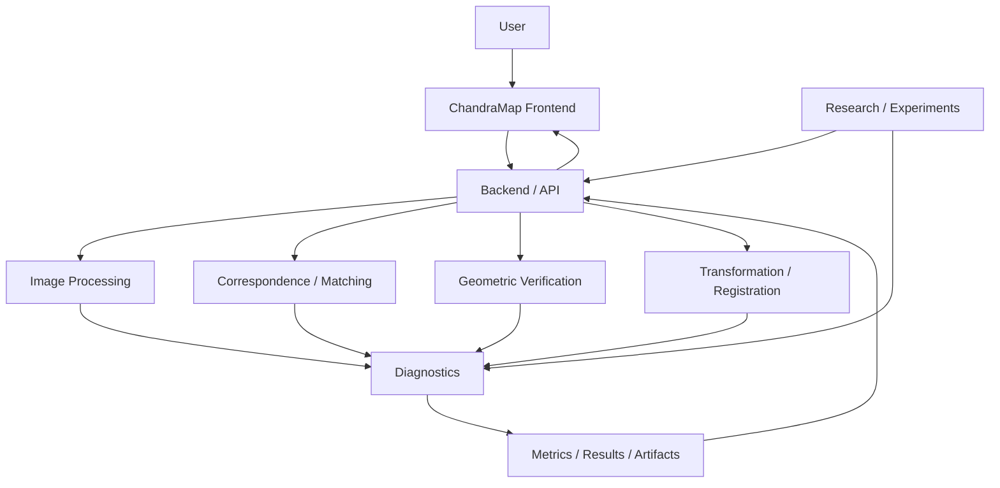
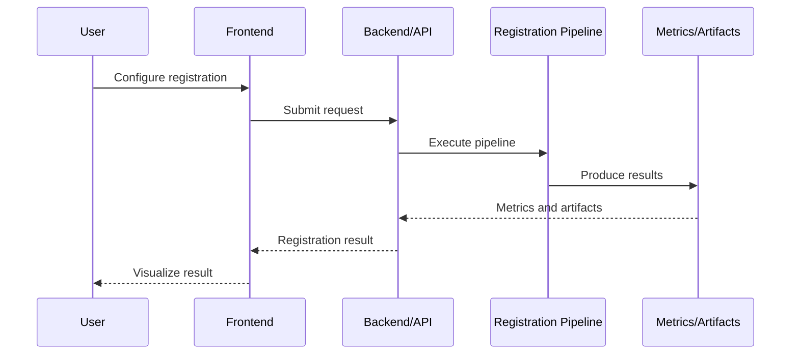
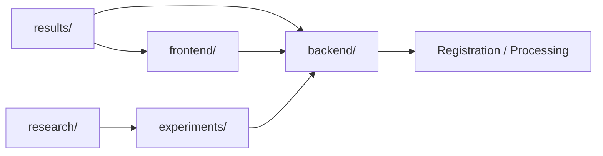

# Frontend

## Overview

The ChandraMap frontend is the user-facing layer of the ChandraMap lunar image correspondence and registration system.

It is intended to provide an interface through which users can interact with registration workflows, inspect computational results, review diagnostics, and understand experiment outputs without directly interacting with the underlying image-processing and research code.

ChandraMap focuses on aligning lunar imagery acquired under different:

- imaging conditions
- spatial resolutions
- illumination conditions
- sensing modalities
- acquisition configurations

Relevant project imagery includes:

- Chandrayaan-2 OHRC
- Chandrayaan-2 TMC-2
- Chandrayaan-2 IIRS

The frontend should expose the computational capabilities of ChandraMap without silently moving scientific registration logic into the user interface.

> **Implementation status:** The exact frontend framework, package manager, API client architecture, routes, and component inventory are **[Not provided]** in the current project source context. These details should be documented here once they are established in the repository.

---

## Role in ChandraMap

The frontend sits above the computational backend and research pipeline.

The intended architectural relationship is:



The frontend is therefore responsible primarily for:

- user interaction
- workflow configuration
- image and result presentation
- experiment visualization
- diagnostics
- status reporting
- communicating with backend services

The backend and research pipeline remain responsible for computational operations such as:

- preprocessing
- feature detection
- feature matching
- geometric verification
- transformation estimation
- registration
- metric computation
- artifact generation

---

## Architecture Boundaries

ChandraMap should maintain a clear separation between the following layers.

| Layer                     | Responsibility                                                          |
| ------------------------- | ----------------------------------------------------------------------- |
| Frontend                  | User interface, workflow interaction, visualization                     |
| Backend / API             | Service interface between UI and computational system                   |
| Image Processing          | Image preparation and transformations                                   |
| Correspondence / Matching | Finding candidate image correspondences                                 |
| Geometric Verification    | Verifying correspondences and estimating geometric relationships        |
| Registration              | Aligning images using the selected geometric model                      |
| Experiments               | Controlled research evaluation                                          |
| Research / Future         | Investigation of methods not yet established as production capabilities |
| Data / Artifacts          | Source images, outputs, metrics, logs, and generated artifacts          |

The frontend should consume the outputs of these systems rather than reimplementing their scientific logic.

---

# User Workflows

The frontend is intended to support workflows around lunar image registration and analysis.

A conceptual workflow is:

```text
Select / Provide Images
        ↓
Configure Registration
        ↓
Submit Workflow
        ↓
Backend Processing
        ↓
Registration / Verification
        ↓
Result Generation
        ↓
Inspect Registration
        ↓
Inspect Metrics
        ↓
Inspect Diagnostics
```

The exact interaction flow depends on the implemented frontend and backend APIs.

Where a workflow is not currently implemented, it should be clearly labeled as planned rather than presented as available functionality.

---

## Image Registration Workflow

A registration workflow may conceptually expose:

1. source image selection
2. reference image selection
3. preprocessing configuration
4. scale configuration
5. representation selection
6. matching configuration
7. geometric model selection
8. registration execution
9. result inspection
10. quantitative evaluation

The exact controls and supported options are:

**[TBD]**

---

# Registration Results

The frontend should make registration results understandable without requiring users to inspect backend logs or implementation code.

A result view may eventually expose information such as:

- source image
- reference image
- registered image
- correspondence visualization
- candidate matches
- verified inliers
- transformation model
- transformation parameters
- residual diagnostics
- evaluation metrics
- processing status
- runtime
- failure information

The exact result schema and UI representation are:

**[TBD]**

---

## Candidate Matches and Verified Inliers

The frontend should distinguish between proposed correspondences and geometrically verified correspondences.

Conceptually:

```text
Candidate Correspondences
        ↓
Geometric Verification
        ↓
Verified Inliers
        ↓
Transformation
```

A visualization may therefore provide separate views for:

- all candidate matches
- verified inliers
- rejected correspondences
- independent check points

This distinction is important because a high number of candidate matches does not necessarily indicate successful registration.

---

# Geometric Registration Visualization

The frontend may provide visual diagnostics for geometric registration.

Potential visualizations include:

- source/reference image overlay
- registered image overlay
- correspondence lines
- inlier points
- transformation result
- residual vectors
- checkpoint locations
- spatial coverage
- overlap regions

The exact visualization components are:

**[TBD]**

---

## Transformation Models

ChandraMap research includes investigation of geometric models such as:

- affine transformation
- homography

The frontend should present the selected model as metadata associated with a result.

For example:

```text
Transformation Model: Affine
```

or:

```text
Transformation Model: Homography
```

The frontend should not imply that one model is universally correct.

Transformation-model selection belongs to the registration and experiment layers.

---

# Registration Metrics

Where metrics are produced by the backend, the frontend should present them with their definitions and evaluation context.

Relevant project metrics include:

- candidate correspondence count
- verified inlier count
- inlier ratio
- spatial coverage
- reprojection error
- checkpoint RMSE
- ground error where scientifically justified
- runtime
- registration success/failure

A conceptual result panel may look like:

```text
Registration Result
────────────────────────────────────
Status:              [Result status]
Candidate Matches:   [Value]
Verified Inliers:    [Value]
Inlier Ratio:        [Value]
Checkpoint RMSE:     [Value]
Runtime:             [Value]
Transformation:      [Model]
────────────────────────────────────
```

The exact API fields and UI components are:

**[TBD]**

---

# Independent Check-Point Evaluation

The frontend should distinguish between points used to estimate a transformation and points used to evaluate it.

Conceptually:

```text
Control / Registration Points
        ↓
Transformation Estimation

Independent Check Points
        ↓
Accuracy Evaluation
```

This distinction is important for communicating scientifically meaningful registration accuracy.

The frontend should not label a training/control-point residual as independent validation unless the backend explicitly identifies it as such.

---

# Spatial Coverage

The number of correspondences alone is insufficient to describe registration quality.

A frontend diagnostics view should therefore be capable of showing where correspondences occur.

Potential visualization:

```text
+--------------------------------+
|                                |
|       •        •               |
|                                |
|             •                 |
|  •                       •     |
|                                |
|       •             •          |
|                                |
+--------------------------------+
```

Potential displayed information includes:

- correspondence distribution
- grid occupancy
- overlap coverage
- convex-hull coverage
- clustered regions

The exact spatial-coverage implementation is:

**[TBD]**

---

# Residual Diagnostics

Residual analysis is part of the ChandraMap V1 research direction.

The frontend can provide a useful interface for inspecting spatial error patterns produced by the backend.

Potential visualizations include:

```text
Source / Reference
        +
Residual Vectors
        ↓
Spatial Error Map
```

Residuals can help identify:

- systematic displacement
- local registration errors
- transformation-model limitations
- spatially varying distortion
- poorly constrained regions

A single aggregate metric should not replace spatial diagnostics when the underlying data support them.

---

# Image Overlays

Image overlays are particularly useful for visual registration inspection.

Possible views include:

### Side-by-Side

```text
+----------------+  +----------------+
| Source Image   |  | Reference      |
|                |  | Image          |
+----------------+  +----------------+
```

### Before / After

```text
Before Registration
        ↓
After Registration
```

### Transparency Overlay

```text
Source Image
     +
Registered Image
     ↓
Overlay
```

The exact implementation is:

**[TBD]**

---

# Experiment Visualization

ChandraMap is a benchmark-driven research project.

The frontend should therefore support inspection of experiment results where the backend exposes structured experiment data.

Potential experiment information includes:

- experiment ID
- experiment objective
- method
- dataset
- configuration
- input pair
- transformation model
- metrics
- runtime
- failure status
- generated artifacts

The established experiment structure includes:

- `experiments/v1/README.md`
- `experiments/templates/EXPERIMENT_TEMPLATE.md`
- `experiments/v1/baseline/EXP-001-sift-baseline/README.md`
- `experiments/v1/preprocessing/EXP-002-scale-pyramid/README.md`
- `experiments/v1/preprocessing/EXP-003-gradient-representation/README.md`
- `experiments/v1/geometry/EXP-004-affine-vs-homography/README.md`
- `experiments/v1/geometry/EXP-005-residual-analysis/README.md`
- `experiments/v1/refinement/EXP-006-subpixel-refinement/README.md`

The frontend should treat experiment definitions and results as research artifacts rather than silently changing experiment methodology.

---

# Experiment Comparison

Where structured results are available, the frontend may provide controlled comparisons between experiment runs.

Potential comparison dimensions include:

| Dimension      | Example                                      |
| -------------- | -------------------------------------------- |
| Representation | Grayscale / Gradient / Future representation |
| Matcher        | Selected matching method                     |
| Geometry       | Affine / Homography                          |
| Scale          | Selected scale configuration                 |
| Sensor         | OHRC / TMC-2 / IIRS-derived                  |
| Illumination   | Acquisition condition                        |
| RMSE           | Independent checkpoint error                 |
| Inliers        | Verified inlier count                        |
| Runtime        | Processing time                              |
| Status         | Success / Failure                            |

Comparisons should preserve the experimental context.

A metric should not be displayed without enough context to understand:

- dataset
- evaluation population
- method
- configuration
- metric definition

---

# Research and Future Methods

ChandraMap contains future research directions that may eventually be exposed through the frontend.

These include:

- RIFT
- CFOG
- ALIKED
- LightGlue
- LoFTR
- global retrieval
- FAISS
- IIRS-related processing
- lunar mosaicking
- DEM-aware registration

These methods should not be presented as production capabilities unless their implementation and status are established in the repository.

A future method may therefore appear as:

```text
Status: Planned
```

rather than:

```text
Available
```

when implementation has not yet been established.

---

# Frontend Status Model

The frontend should communicate workflow state explicitly.

A conceptual status model is:

```text
Idle
  ↓
Configured
  ↓
Submitted
  ↓
Processing
  ↓
Completed
```

with failure paths:

```text
Processing
   ├──→ Completed
   └──→ Failed
```

Potential research-specific statuses may include:

```text
Unavailable
Not Implemented
Insufficient Data
Registration Failed
Validation Failed
```

The exact backend status vocabulary is:

**[TBD]**

The frontend should use backend-defined status values rather than inventing a second incompatible status system.

---

# Backend Communication

The frontend communicates with the computational backend through an API boundary.

Conceptually:



The exact API technology, endpoint definitions, authentication mechanism, request schema, response schema, and transport configuration are:

**[Not provided]**

Do not assume REST, GraphQL, WebSockets, Server-Sent Events, or another protocol until the backend documentation establishes it.

---

# API Contract

The frontend should consume a documented backend contract.

At minimum, the contract should eventually define:

- request schema
- response schema
- image references
- experiment identifiers
- configuration fields
- processing status
- metrics
- error format
- artifact references
- version information

The exact contract is:

**[TBD]**

The frontend should not depend on undocumented backend implementation details.

---

# Error Handling

Errors should be presented in a way that distinguishes user configuration problems from computational failures.

Potential categories include:

### Input Error

The supplied image or configuration is invalid.

### Backend Error

The API cannot process the request.

### Registration Failure

The computational pipeline could not establish a valid registration.

### Validation Failure

The registration was generated but failed the configured validation procedure.

### Data Availability Error

Required source data or artifacts are unavailable.

### Research Method Unavailable

A requested future method is not implemented.

The exact error schema is:

**[TBD]**

---

# Loading and Long-Running Operations

Registration may involve computationally expensive processing.

The frontend should therefore avoid assuming that a request will always complete immediately.

Where supported by the backend, the UI should communicate:

- request state
- processing state
- completion
- failure
- result availability

Progress percentages should only be displayed when the backend provides meaningful progress information.

The frontend should not fabricate progress values.

---

# Configuration

Frontend configuration should be documented once the actual implementation is established.

Potential configuration categories include:

```text
Backend/API Endpoint
Environment
Application Configuration
Feature Flags
Experiment Configuration
```

The exact environment variables are:

**[Not provided]**

Do not create example variable names that are not supported by the actual frontend implementation.

---

# Local Development

## Prerequisites

The exact frontend prerequisites are:

**[Not provided]**

The repository should document the actual requirements once the frontend framework and package configuration are established.

Potential prerequisites may include a JavaScript/TypeScript runtime and package manager, but these should not be treated as confirmed project requirements until supported by the repository.

---

## Installation

The exact installation command is:

**[TBD]**

The final README should use the package manager and commands defined by the actual frontend repository.

---

## Development Server

The local development command is:

**[TBD]**

The frontend should be run against the corresponding local backend/API configuration where required.

---

## Production Build

The production build command is:

**[TBD]**

The deployment target and hosting infrastructure are:

**[Not provided]**

---

# Testing

Frontend testing should cover both user-interface behavior and integration boundaries.

Potential test categories include:

## Unit Tests

Examples:

- utility functions
- data transformation
- metric formatting
- state handling
- validation logic

## Component Tests

Examples:

- result panels
- metric displays
- image viewers
- diagnostic views
- experiment controls

## Integration Tests

Examples:

- frontend ↔ backend communication
- registration submission
- result retrieval
- error handling

## End-to-End Tests

Potential workflow:

```text
Open Application
      ↓
Select Inputs
      ↓
Configure Registration
      ↓
Submit
      ↓
Wait for Processing
      ↓
Inspect Result
      ↓
Inspect Metrics
```

The actual testing framework and commands are:

**[Not provided]**

---

# Scientific Visualization Guidelines

Because ChandraMap is a research system, frontend visualizations should preserve scientific meaning.

## Do

- display metric definitions
- identify units
- identify image/source IDs
- distinguish candidate matches from inliers
- distinguish control points from independent checkpoints
- show transformation model
- preserve failure states
- show uncertainty where available
- retain experiment context

## Do Not

- imply accuracy from visual appearance alone
- hide failed registrations
- round values so aggressively that meaningful differences disappear
- label candidate matches as ground truth
- label control-point error as independent validation
- create unsupported confidence scores
- hide sensor or acquisition differences

---

# Image Viewer Requirements

A future research-grade image viewer may need:

- zoom
- pan
- synchronized views
- opacity control
- before/after comparison
- correspondence overlays
- residual overlays
- checkpoint overlays
- image metadata
- valid-data masks

The exact viewer implementation is:

**[TBD]**

---

# Large Image Handling

Lunar imagery can be large.

The frontend should avoid assuming that every source image can be loaded into browser memory as a single unoptimized asset.

Potential future approaches include:

- tiled image access
- progressive loading
- downsampled previews
- viewport-based loading
- server-side rendering of derived visualizations

The actual image-delivery architecture is:

**[TBD]**

---

# Artifact Visualization

Backend and experiment pipelines may generate artifacts such as:

- registered images
- transformation matrices
- correspondence files
- inlier masks
- residual maps
- metric reports
- experiment logs
- mosaic outputs

The frontend may provide controlled access to these artifacts.

Artifact storage and delivery mechanisms are:

**[TBD]**

---

# Security and Input Boundaries

The frontend should treat user-provided data as untrusted input.

Where applicable, the implementation should consider:

- file validation
- request validation
- API error handling
- access control
- safe artifact handling
- resource limits
- large-file handling

The project's authentication and authorization model is:

**[Not provided]**

No security mechanism should be documented as implemented until verified in the repository.

---

# Performance

Frontend performance should be considered separately from backend registration performance.

Frontend measurements may eventually include:

- initial load time
- image-viewer responsiveness
- large-image rendering performance
- result visualization time
- API response handling
- memory usage

Backend metrics such as registration runtime should remain backend/experiment measurements.

The frontend should not present frontend rendering time as algorithm runtime.

---

# Accessibility

The frontend should aim to provide accessible interaction with research outputs.

Relevant considerations include:

- keyboard navigation
- readable labels
- meaningful status messages
- sufficient visual distinction
- accessible controls
- non-color-only indicators
- alternative descriptions for important visualizations

The current accessibility implementation status is:

**[Not provided]**

---

# Reproducibility

The frontend is part of a benchmark-driven research repository.

A displayed experiment result should be traceable to:

```text
Experiment
   ↓
Configuration
   ↓
Backend Execution
   ↓
Metrics / Artifacts
   ↓
Frontend Visualization
```

The frontend should not modify research results during visualization.

If the frontend performs client-side transformations for visualization, those transformations should be distinguishable from scientific computation.

---

# Research Result Integrity

The UI should preserve the distinction between:

```text
Raw Result
```

```text
Derived Visualization
```

and:

```text
Scientific Metric
```

For example, resizing an image for browser display must not be represented as changing the source image resolution.

Similarly, a visualization overlay should not be mistaken for a new registration result.

---

# Versioning

Frontend changes should be considered alongside the ChandraMap project version and experiment version where applicable.

A reproducible result may depend on:

```text
Frontend Version
Backend Version
Experiment Version
Dataset Version
Configuration
```

The exact versioning mechanism is:

**[TBD]**

---

# Development Principles

## 1. Keep Scientific Logic in the Appropriate Layer

The frontend should not silently implement registration algorithms that belong to the computational pipeline.

## 2. Make Research State Visible

Users should be able to distinguish:

- implemented
- running
- successful
- failed
- planned
- unavailable

## 3. Preserve Experiment Context

A result without its dataset and configuration context is difficult to interpret scientifically.

## 4. Prefer Explicit Data Contracts

Frontend/backend communication should rely on documented schemas.

## 5. Do Not Hide Failures

Failed registrations are valuable research information.

## 6. Separate Visualization from Computation

Client-side visualization should not silently alter scientific results.

## 7. Keep the UI Understandable

Research complexity should be exposed progressively rather than forcing every user to understand every backend parameter.

---

# Suggested Frontend Information Architecture

The exact application routes are **[Not provided]**, but the conceptual information architecture may include:

```text
Frontend
├── Registration
│   ├── Input Selection
│   ├── Configuration
│   ├── Execution Status
│   └── Result
│
├── Diagnostics
│   ├── Correspondences
│   ├── Inliers
│   ├── Spatial Coverage
│   ├── Residuals
│   └── Check Points
│
├── Experiments
│   ├── Experiment List
│   ├── Experiment Details
│   ├── Metrics
│   └── Comparisons
│
├── Research
│   └── Future Methods
│
└── Artifacts
    ├── Images
    ├── Reports
    └── Generated Outputs
```

This is a conceptual organization, not a claim about current implemented routes.

---

# Future Frontend Capabilities

The following capabilities may eventually be exposed through the frontend as the corresponding backend and research functionality becomes available.

## Advanced Correspondence Inspection

- feature points
- candidate matches
- verified inliers
- spatial distribution
- rejected correspondences

**Status:** [Planned]

## Registration Diagnostics

- residual vector fields
- checkpoint visualization
- transformation inspection
- spatial error maps

**Status:** [Planned / Partially dependent on backend support]\*\*

## Experiment Dashboard

- experiment metadata
- configuration
- metrics
- comparisons
- failure analysis

**Status:** [Planned]

## Global Retrieval

- image search
- candidate overlap discovery
- retrieval diagnostics

**Status:** [Planned]

## Lunar Mosaic Visualization

- multi-image registration graph
- global geometry
- mosaic preview
- seam visualization
- spatial validation

**Status:** [Planned]

## DEM-Aware Registration

- terrain-aware diagnostics
- DEM-assisted registration outputs

**Status:** [Planned]

---

# Repository Integration

The frontend should remain aligned with the wider repository structure.

Relevant areas include:

```text
frontend/
backend/
experiments/
research/
data/
results/
tests/
```

Conceptually:



The exact source-code organization within these directories should follow the actual repository.

---

# Relationship to Research Documentation

The frontend should reflect the terminology and evaluation principles established by the research documentation.

Relevant research areas include:

- lunar registration
- illumination invariance
- scale invariance
- ground-truth design
- gradient/structural representations
- RIFT/CFOG
- ALIKED
- LightGlue
- LoFTR
- global retrieval
- FAISS
- lunar mosaicking
- DEM-aware registration

The frontend should not redefine these research methods independently of the research documentation.

---

# Relationship to Experiments

The frontend can act as a visualization and interaction layer for experiment outputs.

The research flow remains:

```text
Hypothesis
   ↓
Experiment Design
   ↓
Implementation
   ↓
Execution
   ↓
Metrics
   ↓
Failure Analysis
   ↓
Research Conclusion
```

The frontend displays and facilitates interaction with this information; it does not replace the experiment methodology.

---

# Implementation Status

| Area                         | Status               |
| ---------------------------- | -------------------- |
| ChandraMap frontend role     | Defined              |
| Frontend/backend separation  | Defined conceptually |
| Registration workflow        | [Not provided]       |
| Backend API contract         | [Not provided]       |
| Image viewer                 | [Not provided]       |
| Correspondence visualization | [Not provided]       |
| Registration diagnostics     | [Not provided]       |
| Experiment dashboard         | [Not provided]       |
| Research-method selector     | [Not provided]       |
| Global retrieval UI          | [Planned]            |
| Lunar mosaic UI              | [Planned]            |
| DEM-aware UI                 | [Planned]            |
| Frontend framework           | [Not provided]       |
| Package manager              | [Not provided]       |
| Testing framework            | [Not provided]       |
| Deployment infrastructure    | [Not provided]       |

This table should be updated as the actual frontend implementation becomes established.

---

# Contribution Guidelines

Contributors working on the frontend should:

1. Understand the frontend/backend boundary before changing application behavior.
2. Follow the actual repository coding conventions.
3. Avoid introducing undocumented API assumptions.
4. Keep scientific computation in the appropriate backend/research layer.
5. Preserve experiment and metric terminology.
6. Add tests for meaningful UI behavior.
7. Document new configuration requirements.
8. Document new API dependencies.
9. Avoid hiding failure states.
10. Update this README when the frontend architecture materially changes.

---

# Adding a New Research Visualization

When adding a visualization for a new research result, document:

```text
Research Method
      ↓
Backend Output
      ↓
Data Schema
      ↓
Frontend Visualization
      ↓
Interpretation
```

The visualization should state what is being displayed.

For example:

```text
Verified Inliers
```

should not simply be labeled:

```text
Matches
```

if the backend distinguishes those concepts.

---

# Adding a New API Dependency

Before introducing a new frontend/backend dependency, verify:

- API endpoint exists
- request schema is documented
- response schema is documented
- error behavior is understood
- loading behavior is understood
- failure behavior is understood
- version compatibility is defined

Do not build a frontend feature around an assumed API.

---

# Local Development Checklist

Before starting frontend development:

- [ ] Confirm the frontend framework.
- [ ] Confirm the package manager.
- [ ] Confirm the required runtime version.
- [ ] Confirm backend/API requirements.
- [ ] Confirm required environment variables.
- [ ] Install dependencies.
- [ ] Start the backend if required.
- [ ] Start the frontend.
- [ ] Verify API connectivity.
- [ ] Run frontend tests.
- [ ] Verify the relevant registration workflow.

Exact commands should be added once they are established in the repository.

---

# Maintainer Checklist

When modifying the frontend:

- [ ] Preserve frontend/backend separation.
- [ ] Do not invent API behavior.
- [ ] Keep scientific terminology consistent.
- [ ] Preserve failure states.
- [ ] Add or update tests.
- [ ] Update configuration documentation.
- [ ] Update API documentation when contracts change.
- [ ] Check large-image behavior where relevant.
- [ ] Check visualization accuracy.
- [ ] Verify that displayed metrics retain their correct definitions.
- [ ] Update this README for architectural changes.

---

# Known Documentation Gaps

The following information is not established in the currently supplied project context and should be filled from the actual frontend implementation rather than guessed:

- frontend framework
- frontend language
- package manager
- runtime version
- directory structure inside `frontend/`
- application entry point
- route definitions
- component architecture
- state-management approach
- API client implementation
- API endpoint list
- API schemas
- authentication
- authorization
- environment variables
- local development commands
- production build commands
- test commands
- linting commands
- formatting commands
- deployment platform
- image-serving mechanism
- artifact-serving mechanism
- browser support policy

Use `[TBD]` or `[Not provided]` until these are verified.

---

# Definition of Done for the Frontend

A production-quality ChandraMap frontend should eventually provide:

- [ ] Clear user workflows.
- [ ] Stable frontend/backend API boundaries.
- [ ] Documented configuration.
- [ ] Reproducible local setup.
- [ ] Automated tests.
- [ ] Clear loading and failure states.
- [ ] Registration result visualization.
- [ ] Correspondence visualization.
- [ ] Geometric diagnostics.
- [ ] Experiment-result visualization.
- [ ] Explicit metric definitions.
- [ ] Large-image handling appropriate to the project data.
- [ ] Accessible interaction.
- [ ] Documented deployment process.
- [ ] Versioned dependencies.
- [ ] Clear distinction between implemented and planned research capabilities.

---

# Summary

The ChandraMap frontend is the user-facing layer for interacting with the project's lunar image correspondence and registration capabilities.

Its intended role is:

```text
User
  ↓
Frontend
  ↓
Backend / API
  ↓
Registration Pipeline
  ↓
Correspondence
  ↓
Geometric Verification
  ↓
Metrics / Diagnostics / Artifacts
  ↓
Frontend Visualization
```

The frontend should make complex registration workflows understandable while preserving the scientific meaning of the underlying results.

In particular, it should help users inspect:

- which images were processed
- which correspondences were generated
- which correspondences survived geometric verification
- which transformation was estimated
- how spatially distributed the correspondences are
- how accurately the registration performed on independent evaluation points
- whether the registration succeeded or failed
- which experiment and configuration produced the result

Future research directions such as RIFT/CFOG, ALIKED, LightGlue, LoFTR, global retrieval, FAISS, lunar mosaicking, IIRS processing, and DEM-aware registration should be exposed only as their corresponding computational capabilities become implemented and validated.

The frontend is therefore not merely a visualization layer. It is the interface through which users can interact with, inspect, and understand the computational and experimental outputs of ChandraMap while maintaining a clear separation between **user interaction, scientific computation, experiment methodology, and research results**.
