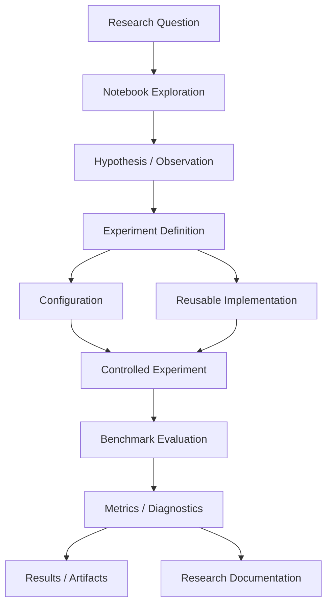
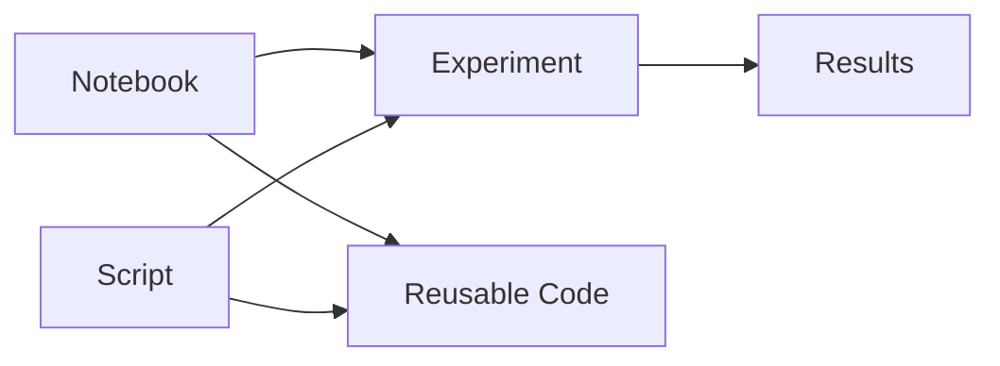

# Notebooks

## Overview

The `notebooks/` directory provides an exploratory and interactive environment for developing, inspecting, visualizing, and communicating ChandraMap research workflows.

ChandraMap is a lunar image correspondence and registration research system focused on aligning images of the same lunar region captured by different instruments and/or under different imaging conditions.

Notebooks are useful when a researcher needs to:

- Inspect lunar image pairs.
- Explore preprocessing choices.
- Visualize feature correspondences.
- Investigate scale variation.
- Examine illumination and shadow differences.
- Prototype registration ideas.
- Inspect geometric verification.
- Visualize residuals and errors.
- Explore evaluation metrics.
- Debug research implementations.
- Develop hypotheses before formalizing an experiment.
- Communicate intermediate research findings.

The notebook environment is intentionally separate from reusable application code, controlled experiment definitions, benchmark infrastructure, and production interfaces.

> **Core principle:** notebooks are for exploration and scientific investigation; validated functionality should move into reusable project code and controlled experiments.

---

## Role in ChandraMap

Notebooks occupy an exploratory layer between research questions and reusable implementations.



The notebook should help answer:

> **“What should we investigate, and does the idea appear worth formalizing?”**

The experiment infrastructure should answer:

> **“Under a controlled and documented protocol, does the method actually improve the measured result?”**

The reusable implementation should answer:

> **“How can this functionality be executed consistently outside an exploratory notebook?”**

---

# What Notebooks Are For

## Exploration

Notebooks are well suited to rapid investigation of ideas before they become formal project functionality.

Examples include:

- Inspecting image pairs.
- Testing preprocessing hypotheses.
- Visualizing feature points.
- Inspecting descriptor matches.
- Comparing raw grayscale against structural representations.
- Examining image pyramids.
- Investigating registration failures.
- Plotting residual distributions.
- Inspecting spatial correspondence coverage.

Exploration is valuable even when the final result is negative.

A notebook can establish that an approach is unsuitable for further experimentation.

---

## Visualization

Lunar registration is highly visual.

Notebooks can be used to inspect:

- Source and reference images.
- Image overlays.
- Feature locations.
- Candidate correspondences.
- Geometrically verified inliers.
- Transformation overlays.
- Residual vectors.
- Check-point errors.
- Spatial coverage.
- Image pyramids.
- Gradient or edge representations.
- Illumination differences.
- Shadow differences.

Visualizations should support quantitative analysis rather than replace it.

A visually convincing alignment is not, by itself, evidence of accurate registration.

---

## Rapid Prototyping

A notebook may be the fastest way to determine whether a proposed workflow is worth implementing.

For example:

```text
Idea
 ↓
Notebook Prototype
 ↓
Inspect Behavior
 ↓
Measure Initial Effect
 ↓
Keep / Reject / Refine
```

This is especially useful during early research.

Once the workflow becomes scientifically important, the validated logic should be moved into reusable project code.

---

## Dataset Inspection

Notebooks may be used to inspect:

- Image dimensions.
- Spatial resolution differences.
- Image appearance.
- Image coverage.
- Illumination conditions.
- Shadow structure.
- Candidate image pairs.
- Metadata where available.
- Dataset quality.

Relevant lunar imagery may include instruments such as:

- Chandrayaan-2 OHRC
- TMC-2
- IIRS

The exact datasets available in the repository should be verified from the actual dataset configuration and documentation.

---

# What Does Not Belong in `notebooks/`

The notebook directory should not become a second source-code tree.

The following should generally not live permanently inside notebooks.

## Reusable Production Logic

Core functionality should live in reusable project modules.

Examples include:

- Registration implementations.
- Feature extraction implementations.
- Matching implementations.
- Geometric estimation.
- Evaluation utilities.
- Service logic.

A notebook may call these components, but should not become their permanent implementation location.

---

## Critical Benchmark Logic

Notebooks should not be the sole implementation of a benchmark.

A benchmark needs:

- Controlled inputs.
- Defined methodology.
- Explicit configuration.
- Reproducible execution.
- Standardized metrics.
- Failure accounting.
- Documented evaluation.

Those requirements belong in the benchmark and experiment infrastructure.

A notebook may help develop or inspect the benchmark workflow.

It should not silently redefine it.

---

## Backend APIs

Backend service functionality does not belong in notebooks.

A notebook may interact with a backend where the repository explicitly supports such a workflow, but notebook code should not become the backend implementation.

---

## Frontend Functionality

Interactive notebook visualizations are not a replacement for the ChandraMap frontend.

The frontend remains the user-facing application layer.

---

## Large Generated Datasets

Notebooks should not contain or generate permanent large datasets inside the repository without an explicitly documented reason.

Generated data should follow the repository's established data and artifact conventions.

Exact storage conventions are:

`[Not provided]`

---

## Model Weights

Model weights should not be committed to notebooks.

If future learned methods require model weights, their storage and retrieval mechanism should be explicitly documented.

Current model-weight management is:

`[Not provided]`

---

## Secrets and Credentials

Never place the following in notebooks:

- API keys
- Access tokens
- Passwords
- Private credentials
- Authentication information
- Sensitive configuration

Notebook outputs can preserve sensitive values even after the corresponding code cell is removed, so notebook review should include outputs as well as source cells.

---

## Uncontrolled Binary Artifacts

Avoid committing:

- Large generated images
- Temporary exports
- Uncontrolled datasets
- Cache files
- Runtime dumps
- Large experiment outputs

unless explicitly required and documented.

---

# Notebook ↔ Experiment Relationship

The relationship between notebooks and experiments must remain explicit.

```text
Research Question
      ↓
Notebook Exploration
      ↓
Hypothesis / Observation
      ↓
Experiment Definition
      ↓
Reusable Implementation
      ↓
Controlled Experiment
      ↓
Benchmark Metrics
      ↓
Documented Result
```

### Notebook

Answers:

> What happens if we try this?

### Experiment

Answers:

> Under a defined and controlled procedure, what happens?

### Benchmark

Answers:

> How does the method perform under the standardized evaluation protocol?

### Research documentation

Records:

> What was learned, what evidence supports it, and what remains uncertain?

---

# Notebook Work Should Graduate

A useful ChandraMap development pattern is:

```text
Exploration
   ↓
Prototype
   ↓
Validation
   ↓
Reusable Implementation
   ↓
Controlled Experiment
   ↓
Benchmark
```

Not every notebook needs to graduate into production code.

A notebook may legitimately conclude:

- The hypothesis was unsupported.
- The method was unstable.
- The representation did not improve registration.
- The computational cost was not justified.
- The approach requires further investigation.

Negative results are valuable research information.

---

# Relationship with Research

The `research/` directory and `notebooks/` directory serve different purposes.

| Area                   | Primary purpose                                                  |
| ---------------------- | ---------------------------------------------------------------- |
| `notebooks/`           | Interactive exploration and investigation                        |
| `research/`            | Research documentation, literature, notes, and future directions |
| `experiments/`         | Controlled experiment definitions and records                    |
| `benchmarks/`          | Standardized evaluation                                          |
| `src/` / reusable code | Reusable implementation                                          |
| `scripts/`             | Automation and orchestration                                     |
| `tests/`               | Software/scientific validation                                   |

A notebook may inform a research note.

A research note may motivate a notebook.

Neither should silently replace the other.

---

# Relationship with Scripts

Scripts and notebooks can support the same research workflow while serving different purposes.



### Notebooks

Best suited to:

- Interactive exploration
- Visualization
- Hypothesis testing
- Debugging
- Rapid prototyping

### Scripts

Best suited to:

- Repeatable execution
- Automation
- Batch processing
- Dataset preparation
- Benchmark execution
- Result collection
- Reproducibility workflows

A notebook should not be converted into a script merely by changing the file extension or removing visualizations.

The underlying workflow should first be made explicit and reusable.

---

# Relationship with Backend and Frontend

The broader architecture can be understood as:

```text
Researcher
    ↓
Notebook / Script
    ↓
Reusable Pipeline
    ↓
Backend / Application Layer
    ↓
Registration / Matching Workflow
    ↓
Evaluation
    ↓
Results / Diagnostics
    ↓
Frontend / Research Visualization
```

The exact interfaces between these components depend on the implemented repository architecture.

Current notebook-specific backend APIs and frontend integration points are:

`[Not provided]`

No undocumented API routes, service endpoints, or framework dependencies should be assumed.

---

# Supporting Lunar Registration Research

Notebook workflows should reflect the actual scientific problems addressed by ChandraMap.

These include:

- Scale variation.
- Illumination variation.
- Sun-angle differences.
- Shadow variation.
- Spatial-resolution differences.
- Cross-instrument imagery.
- Feature correspondence.
- Geometric verification.
- Registration error.
- Spatial correspondence coverage.
- Sub-pixel localization.

A notebook should make these factors visible when they are relevant to the research question.

---

# V1 Research Workflow

The V1 direction provides a useful progression for notebook-based exploration:

```text
Known Source / Reference Pair
        ↓
SIFT Baseline
        ↓
Scale-Pyramid Investigation
        ↓
Structure-Focused Preprocessing
        ↓
Stronger Local Matching
        ↓
Sub-Pixel Refinement
```

Notebooks can support exploration at each stage.

However, the notebook is not the benchmark specification.

The corresponding experiment documentation should remain the authoritative definition of:

- Research question
- Experimental conditions
- Variables
- Evaluation protocol
- Metrics
- Acceptance criteria where defined
- Failure handling

---

# SIFT Baseline Exploration

A notebook may be used to inspect the baseline workflow:

```text
Image Pair
   ↓
Preprocessing
   ↓
SIFT Features
   ↓
Descriptor Matching
   ↓
Candidate Correspondences
   ↓
RANSAC / Geometric Verification
   ↓
Verified Inliers
   ↓
Transformation
   ↓
Independent Evaluation
```

The notebook can visualize each stage.

It should not silently alter the baseline methodology when presenting an experimental result as a baseline comparison.

---

# Scale Experiments

Scale differences should be investigated explicitly.

Notebook exploration may include:

- Image pyramid inspection.
- Different image scales.
- Feature distribution at different scales.
- Match quality under scale changes.
- Geometric verification behavior.
- Registration residuals.

Upsampling should not be interpreted as recovering spatial information that was not present in the original image.

A notebook should distinguish:

- Changed pixel dimensions
- Actual spatial resolution
- Feature detectability
- Registration accuracy

---

# Illumination and Shadow Experiments

Illumination is not simply a brightness-normalization problem.

Changes in lunar Sun angle can alter:

- Shadow location.
- Shadow extent.
- Visible structural boundaries.
- Local gradients.
- Apparent feature structure.

Therefore, notebook analysis should distinguish between:

```text
Photometric Difference
```

and:

```text
Physical / Geometric Appearance Difference
```

Contrast normalization may change intensity statistics, but it cannot physically move a shadow boundary back to its previous location.

Notebook visualizations should make this distinction clear.

---

# Structural Representations

Notebook experiments may compare representations such as:

- Raw grayscale.
- Edge representations.
- Gradient representations.
- Other structural representations documented by the project.

The scientific question is not:

> Does the processed image look better?

The relevant question is:

> Does the representation improve the measured registration or correspondence outcome under the defined evaluation protocol?

Every preprocessing step should therefore demonstrate measurable benefit or be removed from the controlled workflow.

---

# Candidate Matches vs Verified Inliers

Notebooks must clearly distinguish candidate correspondences from geometrically verified correspondences.

```text
Feature / Descriptor Matching
          ↓
Candidate Correspondences
          ↓
Geometric Verification
          ↓
Verified Inliers
```

A candidate match means:

> The matching procedure proposed this correspondence.

A verified inlier means:

> The correspondence is consistent with the estimated geometric model under the verification procedure.

These quantities must not be presented interchangeably.

---

# Spatial Distribution Matters

A large number of matches does not necessarily indicate good registration.

Notebook visualizations should inspect whether correspondences are:

- Well distributed.
- Clustered in one region.
- Concentrated around a single feature.
- Spread across the useful overlap.
- Sufficient for the selected geometric model.

For example:

```text
Many clustered matches
        ≠
Reliable global registration
```

Spatial coverage should therefore be evaluated alongside match counts.

---

# RANSAC and Geometric Verification

Where appropriate, notebooks should visualize:

- Candidate correspondences.
- RANSAC-selected inliers.
- Transformation model.
- Reprojection residuals.
- Spatial distribution.
- Failed or rejected correspondences.

RANSAC should be treated as geometric verification rather than simply a mechanism for increasing the number of matches.

---

# Transformation Models

Notebook experiments may investigate models such as:

- Affine transformation.
- Homography.

For appropriate local map-projected image pairs, these can be useful initial geometric models.

However:

> Lunar terrain is not necessarily planar.

Neither affine transformation nor homography automatically models:

- Arbitrary 3D terrain relief.
- Orthorectification errors.
- Complex sensor geometry.
- All cross-instrument geometric differences.

Notebook exploration should therefore avoid presenting a more flexible transformation as automatically more physically correct.

---

# Residual Analysis

Notebook visualizations should help inspect registration errors rather than only reporting one aggregate number.

Useful visualizations can include:

- Residual vectors.
- Residual histograms.
- Spatial residual maps.
- Error distributions.
- Check-point locations.
- Transformation overlays.

Where independent check points are available, they should be clearly distinguished from points used to estimate the transformation.

---

# Independent Check Points

A scientifically stronger notebook workflow separates fitting points from evaluation points.

Conceptually:

```text
Control / Training Points
        ↓
Transformation Estimation
        ↓
Independent Check Points
        ↓
Registration Error
```

Do not present fitting residuals as though they were independent validation.

When available, independent check points should be used to assess generalization of the estimated transformation.

---

# Metrics

Notebook analysis may inspect metrics such as:

### Geometric accuracy

- Reprojection error.
- Check-point RMSE.
- Check-point MAE.
- Residual percentiles where defined.

### Correspondence quality

- Candidate match count.
- Inlier count.
- Inlier ratio.
- Spatial coverage.

### Operational behavior

- Runtime.
- Registration success/failure.
- Failure rate.

### Geospatial accuracy

Ground error may be reported where:

- GSD is meaningful.
- Projection information is appropriate.
- Reference truth is available.
- The conversion is scientifically justified.

Otherwise, image-space error should remain the primary representation.

---

# Pixel-Space Error First

Notebook analysis should generally report registration error in source-image pixels first.

Conversion to metres should only be performed when the required geospatial information makes the conversion meaningful.

Do not imply that:

```text
1 pixel = fixed physical distance
```

unless the image geometry and GSD justify that assumption.

---

# Notebook Organization

The exact existing notebook inventory has not been provided.

Therefore, the following is a recommended organization rather than a claim about the current repository.

A growing notebook directory could be organized conceptually as:

```text
notebooks/
├── README.md
├── exploration/
├── preprocessing/
├── matching/
├── geometry/
├── evaluation/
└── visualization/
```

The repository should introduce subdirectories only when the number of notebooks makes them useful.

Do not create directory depth merely for appearance.

---

# Recommended Notebook Naming

Notebook names should communicate purpose.

Avoid vague names such as:

```text
test.ipynb
experiment.ipynb
final.ipynb
new.ipynb
demo.ipynb
temp.ipynb
```

Prefer descriptive names based on the research task.

A conceptual convention could be:

```text
<topic>_<purpose>.ipynb
```

Examples of conceptual purposes include:

- inspection
- visualization
- comparison
- exploration
- analysis
- debugging

These are naming examples, not existing ChandraMap notebook filenames.

The repository's currently implemented notebook naming convention is:

`[Not provided]`

---

# Notebook Structure

A research notebook should preferably have a predictable internal structure.

A useful convention is:

```text
1. Title / Purpose
2. Research Question
3. Context
4. Inputs
5. Configuration
6. Imports / Dependencies
7. Data Inspection
8. Method
9. Visualization
10. Evaluation
11. Results
12. Interpretation
13. Limitations
14. Reproducibility Information
15. Next Steps
```

Not every exploratory notebook needs every section.

However, notebooks intended to support an experiment should become progressively more structured.

---

# Notebook Metadata

Where practical, a notebook should make its execution context clear.

Useful information can include:

- Notebook purpose.
- Dataset or image-pair identity.
- Experiment identifier.
- Configuration used.
- Relevant method version.
- Date/time where appropriate.
- Repository/code version where available.
- Output/artifact locations.

The exact metadata mechanism is:

`[Not provided]`

Do not claim that automated environment capture currently exists unless implemented.

---

# Reproducibility

Notebook reproducibility requires more than saving an `.ipynb` file.

A reproducible notebook should make clear:

- What data it reads.
- What configuration it uses.
- What code it depends on.
- What assumptions it makes.
- What outputs it generates.
- Which cells need to be executed.
- Whether execution depends on hidden state.
- Whether randomness is involved.
- Whether external resources are required.

---

# Avoid Hidden Notebook State

A notebook can appear to work while depending on:

- Cells executed out of order.
- Variables from previous sessions.
- Modified files.
- Hidden configuration.
- Cached objects.
- Manual preprocessing.
- Undocumented downloads.

This makes results difficult to reproduce.

A notebook intended for research communication should be restartable and executable from a clean environment where practical.

---

# Execution Order

Avoid notebooks where:

```text
Cell 15
```

must be executed before:

```text
Cell 4
```

for the notebook to work.

When possible:

```text
Restart
  ↓
Run All
  ↓
Complete Result
```

should produce the documented outcome.

If that is not possible, document the dependency explicitly.

---

# Randomness

If a notebook uses stochastic operations, randomness should be explicit where supported.

Potential sources include:

- RANSAC sampling.
- Random dataset selection.
- Learned model inference.
- Data ordering.
- Parallel processing.

Do not claim exact reproducibility unless the relevant sources of nondeterminism have been controlled.

---

# Notebook Dependencies

Notebooks should rely on project-supported dependencies whenever possible.

Do not install arbitrary packages inside individual notebooks without documenting the requirement.

Avoid cells that silently modify the environment.

For example, notebook cells that install packages at runtime should be used only when that behavior is intentionally supported and documented.

The repository's exact dependency-management workflow is:

`[Not provided]`

---

# Configuration

Important experiment parameters should not be buried inside arbitrary notebook cells.

Where the project provides configuration files, notebooks should use the appropriate configuration mechanism.

Potential configuration areas include:

- Dataset selection.
- Image-pair selection.
- Preprocessing.
- Scale handling.
- Matching parameters.
- RANSAC/geometric verification.
- Transformation model.
- Evaluation settings.

Exact configuration keys and file names are:

`[Not provided]`

---

# Hard-Coded Paths

Avoid machine-specific paths such as:

```text
/home/<user>/...
C:\Users\<user>\...
/Users/<user>/...
```

inside committed notebooks.

Use the repository's supported path/configuration mechanism.

If the repository does not yet define one, document the limitation rather than inventing a path convention.

---

# Data Access

Notebook data access should be explicit.

A notebook should make clear:

- Which data it expects.
- Whether the data is repository-local.
- Whether it is generated.
- Whether it is external.
- Whether metadata is required.

Do not assume that a dataset exists simply because the project discusses it.

---

# Output Handling

Notebook outputs should be treated as generated artifacts unless they are intentionally part of the documented source.

Potential generated outputs include:

- Plots.
- Match visualizations.
- Registration overlays.
- Residual plots.
- Tables.
- Diagnostic images.
- Experiment summaries.

The exact repository artifact policy is:

`[Not provided]`

---

# Notebook Output Hygiene

Large or irrelevant notebook outputs should be avoided.

Before committing a notebook, inspect:

- Cell outputs.
- Large embedded images.
- Binary data.
- Logs.
- Tracebacks.
- Temporary paths.
- Sensitive information.

A notebook should not preserve accidental debugging output as though it were a research result.

---

# Generated Visualizations

Visualizations are useful evidence, but should be reproducible.

Where a figure supports a scientific conclusion, the notebook should make it possible to determine:

- Which input produced it.
- Which method produced it.
- Which configuration was used.
- Which points were plotted.
- Whether the visualization represents candidates or verified inliers.
- Whether the values are measured or illustrative.

---

# Results vs Artifacts

A distinction should be maintained between:

### Result

A measured scientific outcome documented according to the experiment or benchmark protocol.

### Artifact

A generated file that supports analysis or inspection.

For example:

```text
Check-point RMSE
```

may be a result.

A:

```text
Residual visualization
```

may be an artifact supporting interpretation of that result.

A notebook should not turn an illustrative visualization into a benchmark result.

---

# Notebook Results Must Be Reproducible

Do not report a number in a notebook as a definitive project result merely because it appeared in one interactive run.

Before promoting a notebook observation to an experiment or benchmark result, verify:

- Dataset identity.
- Configuration.
- Method.
- Evaluation protocol.
- Independent validation.
- Failure accounting.
- Repeatability.
- Relevant experiment documentation.

---

# V1 Benchmarking

Notebooks can support V1 benchmarking by helping researchers:

- Inspect baseline behavior.
- Debug experiment inputs.
- Visualize correspondences.
- Analyze failures.
- Explore parameter sensitivity.
- Inspect residuals.
- Validate visualization methods.
- Understand metric behavior.

However:

> **The notebook is not the benchmark.**

The benchmark should remain defined by the documented benchmark/experiment infrastructure.

---

# Notebook-to-Benchmark Promotion

A useful promotion workflow is:

```text
Notebook Observation
        ↓
Reproduce Observation
        ↓
Define Controlled Experiment
        ↓
Move Logic to Reusable Code
        ↓
Create Repeatable Execution Path
        ↓
Run Standardized Evaluation
        ↓
Record Benchmark Result
```

This prevents notebook-specific behavior from becoming an undocumented benchmark condition.

---

# Example: Preprocessing Investigation

A notebook may investigate:

```text
Raw Grayscale
      │
      ├──> Feature Detection
      ├──> Matching
      └──> Geometric Verification
```

and compare it against:

```text
Structural Representation
      │
      ├──> Feature Detection
      ├──> Matching
      └──> Geometric Verification
```

The notebook can visualize differences.

The controlled experiment must then establish:

- Same input pairs.
- Defined preprocessing variants.
- Same evaluation protocol.
- Appropriate geometric verification.
- Independent evaluation where available.
- Comparable metrics.

The conclusion should come from measured results rather than visual preference.

---

# Example: Match Visualization

A notebook may display:

```text
Candidate Matches
        ↓
Geometric Verification
        ↓
Verified Inliers
```

A useful visualization should make these categories visually distinguishable.

The notebook should not imply that every displayed candidate is correct.

---

# Example: Residual Visualization

A notebook may display:

```text
Reference Image
      +
Predicted Point Locations
      +
Independent Check Points
      ↓
Residual Vectors
```

This can reveal:

- Local error concentration.
- Spatially varying error.
- Model mismatch.
- Poor coverage.
- Possible systematic distortion.

Residual visualization should complement numerical evaluation.

---

# Debugging

Notebooks are particularly useful for debugging scientific workflows.

Examples include:

- Inspecting failed feature detection.
- Checking image scaling.
- Inspecting descriptor distributions.
- Examining rejected correspondences.
- Checking RANSAC inliers.
- Investigating transformation failures.
- Inspecting residual outliers.
- Verifying checkpoint locations.

Debugging results should not automatically become production logic.

Once a bug is understood, the correction should be made in the appropriate reusable implementation and covered by tests where applicable.

---

# From Notebook to Reusable Code

When notebook code becomes stable and reusable:

### Step 1 — Identify reusable logic

Separate algorithmic functionality from visualization and exploration.

### Step 2 — Move implementation

Place reusable functionality in the appropriate project module.

### Step 3 — Add tests

Test expected behavior.

### Step 4 — Update the notebook

Make the notebook call the reusable implementation.

### Step 5 — Formalize the experiment

If the work supports a scientific claim, create or update the appropriate experiment documentation.

### Step 6 — Benchmark

Run the controlled benchmark or experiment using the standardized workflow.

This produces a cleaner architecture:

```text
Notebook
   ↓
Reusable Implementation
   ↓
Experiment
   ↓
Benchmark
```

rather than:

```text
Notebook
   ↓
Undocumented Research Code
   ↓
"Final Result"
```

---

# Notebook Review Checklist

Before committing a notebook, check:

## Scientific

- [ ] Research question is clear.
- [ ] Input images/datasets are identified.
- [ ] Candidate matches are distinguished from verified inliers.
- [ ] Evaluation points are distinguished from fitting points.
- [ ] Metrics are defined elsewhere or explained.
- [ ] Claims are supported by measurements.
- [ ] Failed cases are not hidden.
- [ ] Spatial coverage is considered where relevant.
- [ ] Illumination and shadow effects are interpreted carefully.
- [ ] Scale effects are measured rather than assumed.

## Engineering

- [ ] Notebook executes in the intended environment.
- [ ] Hidden state has been minimized.
- [ ] Configuration is explicit.
- [ ] Paths are not machine-specific.
- [ ] Dependencies are documented.
- [ ] Generated artifacts are handled correctly.
- [ ] No secrets are present.
- [ ] No unnecessary environment modification occurs.

## Reproducibility

- [ ] Inputs are documented.
- [ ] Configuration is identifiable.
- [ ] Relevant code version is traceable where supported.
- [ ] Randomness is controlled or documented.
- [ ] External resources are identified.
- [ ] Execution order is clear.
- [ ] Results can be regenerated.

---

# Notebook Review Before Pull Request

Maintainers should inspect both the notebook source and its outputs.

Check:

- [ ] No credentials or sensitive values.
- [ ] No accidental local paths.
- [ ] No temporary debugging output.
- [ ] No unsupported scientific claims.
- [ ] No unexplained preprocessing.
- [ ] No hidden benchmark modifications.
- [ ] No unnecessary large embedded artifacts.
- [ ] No duplicated reusable implementation that belongs elsewhere.
- [ ] Research conclusions are appropriately qualified.
- [ ] Experiment documentation is updated when required.

---

# Common Notebook Anti-Patterns

## The Giant Notebook

One notebook contains the entire ChandraMap implementation.

**Problem:** difficult to test, reuse, maintain, and execute reproducibly.

**Preferred approach:** use notebooks for exploration and reusable project modules for implementation.

---

## Hidden Preprocessing

A notebook silently performs image transformations before evaluation.

**Problem:** results cannot be compared fairly.

**Preferred approach:** make preprocessing explicit and controlled.

---

## Manual Data Preparation

A researcher manually edits images before running the notebook.

**Problem:** the reported result cannot be reproduced.

**Preferred approach:** automate documented preprocessing where it affects the experiment.

---

## Notebook as Benchmark

A benchmark result exists only inside a notebook.

**Problem:** the evaluation cannot be independently reproduced or audited.

**Preferred approach:** formalize the workflow in experiment/benchmark infrastructure.

---

## Visual Success as Scientific Success

An overlay looks aligned, so the notebook reports successful registration.

**Problem:** visual appearance alone does not establish geometric accuracy.

**Preferred approach:** combine visualization with quantitative evaluation.

---

## Match Count as Accuracy

A notebook reports a large number of matches as evidence of successful registration.

**Problem:** candidate matches may contain incorrect or spatially clustered correspondences.

**Preferred approach:** inspect verified inliers, spatial coverage, and independent geometric error.

---

## Fitting Error as Independent Validation

A notebook evaluates the same points used to estimate the transformation.

**Problem:** the evaluation can overstate generalization.

**Preferred approach:** use independent check points when available.

---

## Hidden State

Cells depend on previous interactive execution.

**Problem:** another researcher cannot reproduce the result.

**Preferred approach:** support clean, ordered execution.

---

## Environment Mutation

A notebook silently installs or changes dependencies.

**Problem:** execution becomes environment-dependent.

**Preferred approach:** use the repository's documented environment and dependency management.

---

## Permanent Notebook Copy of Core Code

A notebook contains a frozen copy of a pipeline implementation while the real implementation changes elsewhere.

**Problem:** the notebook can silently diverge from the project.

**Preferred approach:** import and call reusable project code.

---

# Future Research Directions

Notebook exploration may support future ChandraMap research directions such as:

- Stronger local feature methods.
- Learned local features.
- Learned matching.
- Detector-free correspondence.
- Cross-instrument matching.
- RIFT/CFOG-style structural representations.
- IIRS-related investigations.
- Global retrieval.
- DEM-aware registration.
- Multi-image registration.
- Lunar mosaicking.

Examples discussed in the project include methods or directions such as:

- ALIKED
- LightGlue
- LoFTR
- RIFT
- CFOG
- FAISS-based retrieval
- DEM-aware registration

These should remain research/future directions unless the repository contains verified implementations and measurements.

A notebook should never imply that a future method is part of the current benchmark merely because it has been explored conceptually.

---

# Notebook Reproducibility Contract

A notebook intended for serious research use should answer the following questions:

| Question                      | Required information               |
| ----------------------------- | ---------------------------------- |
| What is being investigated?   | Research question                  |
| What data is used?            | Dataset/image-pair identity        |
| What configuration is used?   | Relevant settings                  |
| What method is used?          | Implementation/method identity     |
| What preprocessing occurs?    | Explicit preprocessing             |
| What is measured?             | Defined metrics                    |
| How is correctness evaluated? | Evaluation protocol                |
| Are points independent?       | Control vs check-point distinction |
| What was produced?            | Results/artifacts                  |
| Can it be rerun?              | Reproducibility procedure          |
| What remains uncertain?       | Limitations                        |

If these questions cannot be answered, the notebook should be treated as exploratory rather than a reproducible experiment record.

---

# Documentation Conventions

Use explicit status markers when notebook functionality is not yet implemented:

| Marker              | Meaning                                                      |
| ------------------- | ------------------------------------------------------------ |
| `[Implemented]`     | Verified repository implementation                           |
| `[Experimental]`    | Existing exploratory/research implementation                 |
| `[Planned]`         | Intended future work                                         |
| `[Not implemented]` | Explicitly known not to exist                                |
| `[Not provided]`    | Information unavailable from the supplied repository context |
| `[TBD]`             | Requires a future decision                                   |

Do not convert a conceptual research direction into an `[Implemented]` status without repository evidence.

---

# Current Notebook Status

The supplied project information establishes the role of notebooks but does not provide a verified inventory of concrete notebook files.

Therefore:

| Item                               | Status           |
| ---------------------------------- | ---------------- |
| Notebook directory purpose         | Defined          |
| Exploratory research role          | Defined          |
| Visualization role                 | Defined          |
| Experiment-development role        | Defined          |
| V1 benchmarking support            | Defined          |
| Reusable implementation boundary   | Defined          |
| Exact notebook filenames           | `[Not provided]` |
| Exact notebook subdirectories      | `[Not provided]` |
| Notebook execution commands        | `[Not provided]` |
| Notebook environment specification | `[Not provided]` |
| Notebook dependency list           | `[Not provided]` |
| Notebook-to-backend API            | `[Not provided]` |
| Automated notebook execution       | `[Not provided]` |
| Notebook-specific CI               | `[Not provided]` |
| Notebook artifact directory        | `[Not provided]` |

This avoids presenting a recommended structure as though it were already implemented.

---

# Recommended Notebook Lifecycle

A maintainable notebook lifecycle is:

```text
Research Question
      ↓
Exploration
      ↓
Visualization
      ↓
Hypothesis
      ↓
Prototype
      ↓
Validation
      ↓
Reusable Implementation
      ↓
Experiment
      ↓
Benchmark
      ↓
Research Documentation
```

Not every notebook needs to proceed through every stage.

Exploratory work can end after establishing that an idea is not promising.

That is a valid research outcome.

---

# Contribution Guidelines

When adding a notebook:

1. Define its purpose.
2. Identify whether it is exploratory, debugging, visualization, or experiment-development work.
3. Avoid duplicating reusable project code.
4. Identify the input data.
5. Make configuration explicit.
6. Avoid machine-specific paths.
7. Avoid hidden state.
8. Document important assumptions.
9. Keep scientific claims proportional to the evidence.
10. Keep outputs manageable.
11. Remove secrets and sensitive information.
12. Test clean execution where practical.
13. Move validated reusable logic into project modules.
14. Update experiment documentation when notebook work becomes a controlled experiment.
15. Do not present exploratory observations as benchmark results.

---

# Pull Request Checklist

Before merging a notebook change:

- [ ] The notebook has a clear purpose.
- [ ] It belongs in `notebooks/`.
- [ ] Reusable logic has not been unnecessarily duplicated.
- [ ] Inputs are documented.
- [ ] Configuration is identifiable.
- [ ] Dataset assumptions are explicit.
- [ ] Paths are portable.
- [ ] Outputs contain no secrets.
- [ ] Scientific claims are supported.
- [ ] Candidate and verified correspondences are distinguished.
- [ ] Independent check points are distinguished from fitting points where applicable.
- [ ] Relevant metrics are clearly identified.
- [ ] Failed cases are not silently removed.
- [ ] The notebook can be reproduced to the extent claimed.
- [ ] Generated artifacts are handled according to repository conventions.
- [ ] Relevant experiment/research documentation is updated.

---

# Definition of Done

A professional ChandraMap notebook should:

- [ ] Have a clearly defined purpose.
- [ ] Be appropriately scoped as exploration, analysis, visualization, or experiment development.
- [ ] Use explicit inputs and configuration.
- [ ] Avoid hidden state.
- [ ] Avoid machine-specific paths.
- [ ] Avoid embedding secrets.
- [ ] Avoid becoming the permanent home of reusable implementation.
- [ ] Distinguish candidate matches from verified inliers.
- [ ] Treat spatial correspondence distribution as relevant.
- [ ] Use independent check points where available and appropriate.
- [ ] Report meaningful geometric metrics.
- [ ] Treat illumination and shadow changes scientifically.
- [ ] Evaluate scale variation explicitly.
- [ ] Preserve failed observations rather than silently filtering them.
- [ ] Avoid unsupported scientific conclusions.
- [ ] Provide a path toward reproducible experiment execution when the work becomes mature.
- [ ] Keep generated artifacts under the repository's documented artifact policy.

---

# Repository Integration

The `notebooks/` directory should work with the broader ChandraMap architecture:

```text
ChandraMap/
├── backend/
├── frontend/
├── configs/
├── data/
├── experiments/
├── research/
├── benchmarks/
├── notebooks/
├── scripts/
├── src/
├── tests/
└── results/
```

The exact repository tree should remain governed by the actual project.

The important architectural distinction is:

```text
notebooks/
    ↓
Exploration / Visualization / Prototyping

experiments/
    ↓
Controlled Scientific Procedures

benchmarks/
    ↓
Standardized Evaluation

scripts/
    ↓
Automation / Orchestration

src/ or reusable modules
    ↓
Reusable Implementation

tests/
    ↓
Validation

research/
    ↓
Research Knowledge and Documentation

backend/
    ↓
Application / Service Layer

frontend/
    ↓
User-Facing Presentation
```

---

# Maintaining This README

Update this README when:

- Notebook organization changes.
- A repository-standard notebook workflow is introduced.
- Notebook execution becomes automated.
- Notebook testing is added.
- Artifact conventions change.
- Notebook-to-experiment promotion changes.
- New research workflows require dedicated notebook conventions.
- Reproducibility requirements change.

This README should document the directory-level contract.

Individual notebooks should document their own research-specific purpose and methodology.

---

# Summary

The `notebooks/` directory is ChandraMap's **interactive research and exploration layer**.

It exists to make difficult lunar image correspondence and registration problems easier to inspect, visualize, prototype, debug, and understand.

Its role is complementary to the rest of the repository:

```text
Notebook
   ↓
Explore
   ↓
Understand
   ↓
Prototype
   ↓
Validate
   ↓
Reusable Code
   ↓
Controlled Experiment
   ↓
Benchmark
   ↓
Documented Result
```

The most important boundary is:

> **A notebook may discover and demonstrate an idea, but a notebook should not silently become the project's application, experiment specification, or benchmark implementation.**

For ChandraMap, this means notebooks can be used to investigate SIFT-based correspondence, scale pyramids, structure-focused preprocessing, geometric verification, affine/homography behavior, residuals, sub-pixel refinement, illumination and shadow variation, and future matching approaches.

The scientific standard remains unchanged:

> **Explore interactively, implement reusable logic cleanly, evaluate under controlled conditions, and report only what the evidence supports.**
