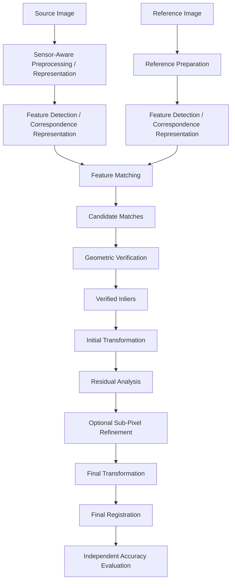

# Lunar Image Registration

> **Research Note**
> **Project:** ChandraMap
> **Path:** `research/notes/lunar-registration.md`
> **Scope:** Fundamentals, methodology, assumptions, challenges, and evaluation of lunar image registration
> **Status:** Foundational technical reference
> **Last Updated:** `[TBD]`

---

## 1. Purpose

This research note defines the scientific and engineering concepts required to understand **lunar image correspondence and registration in ChandraMap**.

It is intended as a durable technical reference for contributors, researchers, and engineers working on the project.

The note focuses specifically on the ChandraMap problem:

> Establish reliable correspondence between observations of the same lunar region, estimate a meaningful geometric relationship between those observations, and measure the resulting registration accuracy.

The problem is therefore broader than simply determining whether two images "look similar."

A useful ChandraMap output consists of:

- reliable corresponding points or regions
- geometrically verified correspondences
- an estimated transformation
- a registered image or registration product
- measurable registration error
- spatial coverage information
- reproducibility metadata

The project feedback emphasizes that the correspondence task should remain the primary technical deliverable, while a final mosaic or visualization should be treated as a downstream demonstration.

---

# 2. ChandraMap Context

ChandraMap is a lunar image correspondence and registration system intended to align observations of the same lunar region under potentially different:

- spatial resolutions
- scales
- illumination conditions
- Sun angles
- viewing geometries
- sensors
- spectral characteristics
- image representations
- local surface appearances

Relevant Chandrayaan-2 instruments include:

- **OHRC**
- **TMC-2**
- **IIRS**

The project materials also identify lunar reference data such as:

- LRO NAC
- LRO WAC
- potentially other explicitly supported lunar products

as possible reference or auxiliary datasets.

The exact benchmark inputs, reference products, and supplied metadata remain dataset-dependent and must be taken from the project's actual data definition.

---

# 3. What Lunar Image Registration Means

## 3.1 Definition

**Lunar image registration** is the process of estimating a spatial relationship between two observations of overlapping lunar terrain so that corresponding physical surface locations are brought into alignment.

Let:

- \(I_s\) be the source image
- \(I_r\) be the reference image
- \(p_s\) be a source-image coordinate
- \(p_r\) be the corresponding reference-image coordinate

Registration seeks a transformation \(T\) such that:

$$
p_r \approx T(p_s)
$$

for physically corresponding locations.

The transformation may be represented by an affine model, homography, or another model appropriate to the image geometry.

The correct model is dependent on:

- product geometry
- projection
- viewing conditions
- terrain relief
- image extent
- sensor characteristics
- available geometric metadata

A single global transformation should therefore not automatically be assumed to explain every lunar image pair.

---

# 4. Matching, Correspondence, Registration, and Verification

These concepts must remain distinct.

## 4.1 Image Matching

**Image matching** searches for visually or structurally similar locations between two images.

The output is generally a set of candidate matches.

Matching alone does not prove geometric correctness.

---

## 4.2 Correspondence

A **correspondence** is a pair of image locations believed to represent the same physical lunar surface feature.

For example:

$$
p_s \leftrightarrow p_r
$$

A correspondence may represent:

- a crater rim
- a ridge
- a stable terrain edge
- another repeatable surface structure

The quality of a correspondence depends on whether the two observations actually refer to the same physical location.

---

## 4.3 Candidate Match

A **candidate match** is a proposed correspondence produced by a matching method.

Candidate matches can include incorrect pairs.

Therefore:

> Candidate matches are not equivalent to verified inliers.

The project feedback explicitly recommends using the term **Candidate Matches** rather than treating matcher confidence as proof of geometric correctness.

---

## 4.4 Geometric Verification

Geometric verification tests whether candidate correspondences are consistent with a spatial transformation.

A typical V1 approach is:

```text
Candidate Matches
        ↓
RANSAC
        ↓
Initial Geometric Model
        ↓
Verified Inliers
```

RANSAC can identify a subset of correspondences that are consistent with the selected transformation model while rejecting outliers.

---

## 4.5 Geometric Registration

Registration estimates the transformation that maps coordinates between the image coordinate systems.

Conceptually:

$$
p_r = T(p_s)
$$

The transformation may then be used to warp or otherwise align one image with another.

---

## 4.6 Accuracy Evaluation

Accuracy evaluation measures how well the final transformation performs on appropriate reference information.

This should preferably use **independent check points** rather than only the points used to fit the transformation.

---

# 5. Why Lunar Registration Is Difficult

Lunar registration is difficult because observations of the same physical terrain are not necessarily visually identical.

The major sources of difficulty in ChandraMap include:

1. scale differences
2. spatial-resolution differences
3. illumination differences
4. Sun-angle variation
5. shadow changes
6. sensor differences
7. spectral differences
8. geometric differences
9. terrain relief
10. local appearance changes
11. weak or repetitive texture
12. correspondence uncertainty
13. transformation-model limitations

The project feedback specifically identifies sensor handling, scale logic, lunar illumination, geometry checks, and evaluation design as major areas that must be demonstrated with real data.

---

# 6. Conceptual ChandraMap Registration Pipeline

A general ChandraMap registration flow is:



This represents the conceptual research pipeline rather than claiming that every stage is currently implemented.

Where a stage is not implemented:

`[Not implemented]`

Where the exact implementation is unknown:

`[TBD]`

---

# 7. Sensor-Aware Registration

The three primary Chandrayaan-2 inputs should not automatically be treated as equivalent images.

The project feedback explicitly states that OHRC, TMC-2, and IIRS require different preprocessing paths.

## 7.1 OHRC

OHRC provides high-detail visible panchromatic imagery.

The supplied technical feedback cites approximately `0.25–0.32 m/pixel` depending on documentation/product, while emphasizing that the **challenge product metadata should be treated as the final authority** for an actual experiment.

Registration implications include:

- fine terrain structure may be available
- small surface features can potentially provide useful correspondence
- high-resolution reference imagery may require scale adjustment
- pixel-level error represents a relatively small physical distance compared with coarse sensors

The actual product GSD must always be taken from the dataset metadata.

---

## 7.2 TMC-2

TMC-2 is panchromatic terrain imagery with project feedback describing approximately `5 m/pixel` as a contextual scale.

Registration implications include:

- terrain-scale structures can provide useful correspondence
- scale differences with high-resolution imagery can be substantial
- map projection and terrain/DEM information may assist geometric interpretation

Again, the actual product metadata is authoritative.

---

## 7.3 IIRS

IIRS is fundamentally different from an ordinary panchromatic camera image.

The project feedback describes it as an imaging infrared hyperspectral spectrometer with approximately `80 m/pixel` contextual scale and many contiguous spectral bands.

Therefore, IIRS should not automatically be passed into a conventional 2D feature matcher as if it were an ordinary grayscale image.

A registration-friendly representation may involve:

- a selected band
- a PCA/composite representation
- a structural representation
- another explicitly documented 2D representation

The actual representation used by ChandraMap must be experimentally established.

The project guidance is:

> First determine which 2D representation preserves stable terrain structure for registration.

---

# 8. Common Structural Representation

Sensor-specific preparation should happen before attempting to create a common matching representation.

Conceptually:

```text
OHRC ────────────────┐
                     │
TMC-2 ───────────────┼──→ Sensor-Specific Preparation
                     │              ↓
IIRS ────────────────┘      Registration Representation
                                   ↓
                            Correspondence
```

This does **not** mean forcing all sensors through identical preprocessing.

The project feedback recommends sensor-specific preparation followed by a common structural representation where appropriate.

---

# 9. Scale and Spatial Resolution

Scale is one of the central challenges in ChandraMap.

Two images can cover the same lunar terrain while having very different:

- GSD
- pixel dimensions
- resolved feature sizes
- effective spatial information

A useful distinction is:

> **Pixel count is not equivalent to physical spatial information.**

---

## 9.1 Upsampling Does Not Recover Detail

Suppose a coarse source image is resized from:

```text
100 × 100 pixels
```

to:

```text
1000 × 1000 pixels
```

The image now contains more numerical pixels, but the original sensor did not measure ten times as much spatial detail.

Therefore:

> **Upsampling changes pixel count, not the physical information measured by the source sensor.**

The project materials explicitly prohibit treating enlarged IIRS imagery as though it contains NAC/OHRC-level terrain detail.

---

# 10. Physically Meaningful Scale Comparison

ChandraMap should compare imagery at physically meaningful effective scales before attempting fine correspondence.

A useful conceptual strategy is:

```text
High-Resolution Reference
          ↓
Reference Scale Pyramid
          ↓
Comparable Effective GSD
          ↓
Coarse Correspondence
          ↓
Fine Matching / Refinement
```

This is the basis of the V1 scale-pyramid work.

The guiding principle is:

> **Compare information at physically meaningful scales before asking the matcher to solve fine alignment.**

The finer image may be downsampled or represented through a scale pyramid so that the correspondence stage operates at a scale appropriate to the source sensor.

---

# 11. Scale Is Not Only Image Resizing

A meaningful scale strategy should consider:

- source GSD
- reference GSD
- scale ratio
- pyramid level
- image dimensions
- interpolation
- projection
- product geometry
- available spatial information

The actual scale relationship should not be inferred solely from image dimensions.

For example:

$$
\text{Scale Ratio}
\approx
\frac{GSD_{reference}}{GSD_{source}}
$$

may provide a useful initial relationship, but the exact registration interpretation depends on the actual products and geometry.

---

# 12. Illumination and Sun Angle

The Moon presents a special challenge because Sun angle can substantially change surface appearance.

A different Sun angle can alter:

- shadow location
- shadow length
- visible crater-wall structure
- local brightness
- contrast
- apparent edge structure

The same crater can therefore appear substantially different under different illumination.

---

## 12.1 Brightness Normalization Is Not Enough

Brightness or contrast normalization can alter radiometric appearance.

It cannot reconstruct a shadow that moved because the illumination geometry changed.

Therefore:

> **Normalized brightness does not imply identical terrain appearance.**

The project feedback explicitly warns that Sun-angle changes affect shadow geometry and that contrast normalization cannot undo those geometric changes.

---

# 13. Structure-Based Correspondence

Under difficult illumination, stable structural information may be more useful than raw intensity.

Potential representations include:

- gradients
- edges
- crater rims
- ridge lines
- relative geometry between nearby features
- phase/structural representations
- carefully designed shadow information

The project recommends comparing raw grayscale with gradient/edge or other structure-focused representations under strong illumination differences.

This motivates the V1 **EXP-003 — Gradient Representation** experiment.

---

# 14. Illumination Stress Testing

Illumination robustness should be measured rather than assumed.

A useful conceptual test is:

| Condition                         | Purpose                                  |
| --------------------------------- | ---------------------------------------- |
| Similar illumination              | Establish normal correspondence behavior |
| Moderately different illumination | Measure degradation                      |
| Strongly different illumination   | Measure stress behavior                  |

The same lunar region should be compared where possible.

The important output is not a claim of illumination invariance but the **measured performance change**.

---

# 15. Feature Detection

Feature detection identifies locations that may be useful for correspondence.

Potential local features include:

- corners
- textured regions
- strong gradients
- stable structural points
- learned local features

For the V1 baseline, SIFT is the primary classical starting point identified by the project materials.

SIFT provides:

- keypoint detection
- local descriptors
- scale awareness
- orientation information

However, SIFT is not assumed to be universally robust to lunar modality and illumination changes.

The project feedback specifically describes SIFT as a simple, explainable baseline while noting possible difficulty under strong modality and illumination changes.

---

# 16. Local Matching Methods

The project distinguishes different matching architectures rather than placing every algorithm into one generic "feature extraction" stage.

Potential paths include:

```text
Path A
SIFT → Descriptor Matching

Path B
ALIKED → LightGlue

Path C
LoFTR
```

Research directions may also include:

- RIFT
- CFOG

These should be treated as alternatives or experiments rather than assumed improvements.

The project guidance emphasizes testing methods on the same image pairs and retaining methods based on measured behavior rather than algorithm names.

---

# 17. Candidate Matches

A local matcher produces candidate correspondences.

For each candidate, useful information may include:

- source coordinate
- reference coordinate
- descriptor distance
- matcher score
- image scale
- feature identity
- local representation

However:

> **Matcher confidence is not geometric proof.**

A candidate becomes a verified inlier only after geometric verification.

Conceptually:

```text
Candidate Matches
        ↓
Geometric Verification
        ↓
Verified Inliers
```

---

# 18. Geometric Verification

Geometric verification determines whether proposed correspondences can be explained by a common transformation.

RANSAC is the principal V1 mechanism for this purpose.

Conceptually:

```text
Candidate Correspondences
          ↓
       RANSAC
          ↓
Initial Geometric Model
          ↓
   ┌──────┴──────┐
   ↓             ↓
Inliers        Outliers
```

The project specifically recommends:

> Candidate matches → RANSAC + initial model → sub-pixel refinement of inliers → refit final transform.

---

# 19. Inlier Count and Inlier Ratio

Two useful local-matching metrics are:

### Inlier Count

Number of candidate correspondences retained as geometrically consistent.

### Inlier Ratio

$$
\text{Inlier Ratio}
=
\frac{\text{Verified Inliers}}
{\text{Candidate Matches}}
$$

These describe correspondence quality but are not sufficient to establish registration accuracy.

A high inlier count can still be misleading if:

- points are spatially clustered
- the transformation model is inappropriate
- the check points show large independent error

---

# 20. Spatial Distribution of Correspondences

Good correspondences should not all lie inside one small lunar feature.

For example:

```text
Poor spatial distribution

+-----------------------+
|                       |
|       ● ● ● ●         |
|       ● ● ● ●         |
|                       |
|                       |
+-----------------------+
```

A better distribution may cover the overlap:

```text
+-----------------------+
| ●                 ●   |
|                       |
|       ●       ●       |
|                       |
| ●                 ●   |
+-----------------------+
```

Possible metrics include:

- grid coverage
- convex-hull coverage
- bounding-box coverage
- spatial density
- clustering statistics

The project feedback specifically recommends spatial coverage to determine whether good points are distributed across the overlap rather than concentrated around one crater.

---

# 21. Transformation Models

A transformation model defines how coordinates in one image are related to coordinates in another.

Potential models include:

- affine transformation
- homography
- local/piecewise transformations
- sensor/geometric models
- DEM-supported geometry

The appropriate model depends on the data.

---

## 21.1 Affine Transformation

An affine transformation can be expressed as:

$$
\begin{bmatrix}
x'\\
y'
\end{bmatrix}
=
\begin{bmatrix}
a & b\\
c & d
\end{bmatrix}
\begin{bmatrix}
x\\
y
\end{bmatrix}
+
\begin{bmatrix}
t_x\\
t_y
\end{bmatrix}
$$

It can represent combinations of:

- translation
- rotation
- scaling
- shear

It may be appropriate for sufficiently local image regions where the geometry is approximately affine.

---

## 21.2 Homography

A homography represents a projective relationship:

$$
\lambda
\begin{bmatrix}
x'\\
y'\\
1
\end{bmatrix}
=
H
\begin{bmatrix}
x\\
y\\
1
\end{bmatrix}
$$

where \(H\) is a \(3\times3\) projective transformation matrix.

Homography can be a useful first model for a local, already map-projected image pair.

It should not automatically be interpreted as a physically complete lunar surface model.

---

# 22. Why One Global Transformation May Fail

The Moon is not a flat planar surface.

Residuals can arise from:

- terrain relief
- different viewing geometry
- sensor geometry
- projection differences
- local surface shape
- incomplete orthorectification

The project feedback explicitly recommends inspecting residual vectors across the image rather than assuming one global transform is always sufficient.

If residuals vary systematically across the image, possible next directions include:

- local/piecewise transformations
- sensor geometry
- DEM-supported correction
- improved orthorectification

However, flexible warping should not be used to conceal weak correspondences.

---

# 23. Flexible Warping

A flexible warp can produce a visually attractive overlay even when the underlying control points are poor.

Therefore:

> **A visually good registration does not necessarily imply scientifically accurate correspondence.**

Flexible warping should only be considered after:

1. reliable correspondences exist
2. points are geometrically verified
3. control points are spatially distributed
4. residual behavior is understood

The project feedback specifically warns that variable warping works best when control points are accurate and well distributed.

---

# 24. Residuals

A residual measures the difference between an observed/reference coordinate and the coordinate predicted by the transformation.

For a check point:

$$
r_i =
p_{reference,i}
-
T(p_{source,i})
$$

The residual components are:

$$
r_i =
(\Delta x_i,\Delta y_i)
$$

and its magnitude is:

$$
|r_i|
=
\sqrt{
\Delta x_i^2+\Delta y_i^2
}
$$

---

# 25. Residual Vectors

Residuals should be analyzed spatially.

A residual vector field can reveal:

- systematic translation
- rotation
- scale mismatch
- spatial deformation
- edge effects
- terrain-related error
- model mismatch

For example:

```text
→ → →
 → → →
  → → →
```

may indicate a systematic directional bias.

A spatially changing pattern may indicate that a single global model is not adequately describing the geometry.

---

# 26. Residual Statistics

Important residual statistics include:

- RMSE
- mean error
- median error
- P90
- P95
- maximum error
- standard deviation
- mean Δx
- mean Δy

The project specifically emphasizes actual numerical measurements rather than decorative confidence ratings.

---

# 27. Independent Check Points

This is one of the most important evaluation principles in ChandraMap.

Suppose transformation estimation uses:

```text
Control / Inlier Points
```

The resulting transformation should then be evaluated using:

```text
Independent Check Points
```

rather than only the same points used for fitting.

The reason is straightforward:

> A transformation can fit its training/control points well while still performing poorly on independent points.

The project feedback explicitly requires this separation.

---

# 28. Registration Accuracy

The primary registration accuracy measure for V1 is:

> **Check-point RMSE in source-image pixels**

This is especially important because the SIH problem emphasizes source-image sub-pixel accuracy.

For \(N\) independent check points:

$$
RMSE =
\sqrt{
\frac{1}{N}
\sum_{i=1}^{N}
\left(
\Delta x_i^2+\Delta y_i^2
\right)
}
$$

The exact implementation should follow the benchmark definition.

---

# 29. Why Pixel Error Comes First

Registration error should be reported in source-image pixels before any conversion to physical distance.

For example:

```text
RMSE = 0.4 source pixels
```

is an image-space statement.

It should not automatically become a ground-distance claim.

The same pixel error represents different physical distances for different sensors.

The project feedback explicitly notes that `0.2` pixel on TMC-2 and `0.2` pixel on IIRS do not correspond to the same ground distance.

---

# 30. Ground Error

Ground error may be useful when:

- GSD is known
- projection is known
- coordinate systems are understood
- the local scale is meaningful
- reference/check-point truth supports the conversion

A simplified relationship may be expressed conceptually as:

$$
E_{ground}
\approx
E_{pixel}\times GSD
$$

but this is not universally valid without considering projection and local geometry.

Therefore:

> Ground error should only be reported when the underlying geometric assumptions make the conversion meaningful.

---

# 31. Sub-Pixel Localization

A pixel-level coordinate can be written as:

$$
p=(x,y)
$$

A sub-pixel coordinate can be written as:

$$
p'=(x+\delta_x,y+\delta_y)
$$

where:

$$
\delta_x,\delta_y\in\mathbb{R}
$$

This represents an estimated coordinate between discrete pixels.

Sub-pixel refinement may involve:

- local intensity interpolation
- patch correlation
- gradient-based optimization
- phase/correlation methods
- feature localization
- template alignment
- other explicitly documented refinement methods

The actual ChandraMap implementation is experiment-dependent.

---

# 32. Sub-Pixel Accuracy Is Not Automatically Physical Accuracy

A numerical coordinate such as:

```text
x = 120.37
y = 84.62
```

does not automatically establish `0.37` or `0.62` pixel physical accuracy.

The quality of the estimate depends on:

- image information
- local texture
- signal quality
- interpolation
- initialization
- illumination
- sensor characteristics
- geometric model
- check-point accuracy

Therefore:

> **A sub-pixel estimate is a numerical localization result; sub-pixel physical accuracy must be demonstrated through independent evaluation.**

---

# 33. Recommended Geometry and Refinement Flow

The V1 geometry logic is:

```text
Candidate Matches
        ↓
RANSAC + Initial Model
        ↓
Verified Inliers
        ↓
Sub-Pixel Tie-Point Refinement
        ↓
Final Transformation Refit
        ↓
Registered Image
        ↓
Independent Check-Point Evaluation
```

This ordering is explicitly established in the project feedback.

The important distinction is that sub-pixel refinement is applied to **verified inliers**, not indiscriminately to all candidate matches.

---

# 34. Registration and Image Representation

The choice of image representation affects correspondence quality.

Potential representations include:

- raw grayscale
- normalized intensity
- gradients
- edges
- structural maps
- selected hyperspectral bands
- PCA/composite representations

The representation should be selected according to the sensor and stress condition.

For example:

```text
OHRC/TMC-2
    ↓
Calibrated/standard representation
    ↓
Intensity / Structural representation
```

while:

```text
IIRS
    ↓
Spectral data
    ↓
Selected band / PCA / composite / structural representation
    ↓
2D registration representation
```

The actual selected representation must be experimentally validated.

---

# 35. Preprocessing Principles

Preprocessing should make the observations more comparable without pretending that unavailable information exists.

For OHRC/TMC-2, project guidance includes:

- use calibrated or standard products where possible
- preserve footprint metadata
- preserve pixel scale
- preserve map projection
- preserve viewing/lighting metadata
- denoise lightly
- avoid removing crater edges
- test local contrast normalization
- compare intensity and structural representations

For IIRS:

- inspect the supplied data representation first
- determine whether the input is a full cube, band product, browse product, or derived image
- select a sensible 2D representation
- focus on stable terrain structure

These principles are directly reflected in the supplied technical feedback.

---

# 36. Metadata as a Registration Resource

Metadata should be treated as part of the registration problem.

Potentially useful metadata includes:

- latitude
- longitude
- footprint
- pixel scale/GSD
- map projection
- viewing geometry
- lighting geometry
- acquisition information
- sensor/product identity

Metadata can constrain the search problem and reduce unnecessary computation.

The project guidance explicitly recommends using metadata when available rather than treating its use as invalid assistance.

---

# 37. Global Retrieval vs Local Registration

Global retrieval and local registration are separate problems.

## Global Retrieval

Determine which reference region is likely to correspond to the source.

Potential metrics:

- Recall@1
- Recall@5

## Local Registration

Once an overlapping candidate region is available:

- detect/match local features
- verify correspondences
- estimate geometry
- refine
- evaluate accuracy

Conceptually:

```text
Source Image
     ↓
Global Search / Metadata Restriction
     ↓
Candidate Reference Region
     ↓
Local Correspondence
     ↓
Geometric Registration
```

Global retrieval should be conditional.

If reliable geographic metadata already constrains the search, retrieval may not be necessary.

The project feedback explicitly recommends making global retrieval conditional rather than mandatory.

---

# 38. Reference Indexing

If global retrieval is implemented using a vector index such as FAISS, the index is an **offline reference-side component**.

Conceptually:

```text
Reference Images
      ↓
Reference Tiles
      ↓
Scales
      ↓
Global Descriptors
      ↓
FAISS Index + Metadata
```

At runtime:

```text
Source Image
      ↓
Global Descriptor
      ↓
FAISS Search
      ↓
Top-K Candidate Regions
      ↓
Local Matching
```

Global descriptors and local matching features serve different purposes.

A retrieval descriptor identifies likely regions; local correspondences perform alignment.

---

# 39. Terrain Structure

Stable lunar terrain structures may include:

- crater rims
- ridge lines
- boundaries
- relative geometry between neighboring features
- persistent terrain patterns

The most useful structure depends on:

- resolution
- illumination
- sensor
- spectral representation
- terrain morphology

No feature type should be assumed to work equally well across all sensors.

---

# 40. Low-Feature and Repetitive Terrain

Some lunar regions may provide weak correspondence evidence.

Examples include:

- smooth plains
- repetitive terrain
- low-gradient regions
- regions dominated by ambiguous shadows

Potential consequences include:

- fewer reliable keypoints
- ambiguous descriptor matches
- clustered candidate matches
- unstable RANSAC models
- large registration residuals

These conditions should be retained as meaningful stress cases rather than removed from evaluation.

---

# 41. More Matches Are Not Necessarily Better

A larger number of matches does not automatically mean better registration.

A system can produce many matches that are:

- incorrect
- geometrically inconsistent
- spatially clustered
- concentrated on one feature

Therefore ChandraMap should evaluate:

```text
Candidate Matches
+
Verified Inliers
+
Inlier Ratio
+
Spatial Coverage
+
Independent RMSE
```

rather than relying on raw match count alone.

The project feedback explicitly warns that more matches are not necessarily better when they are wrong or clustered.

---

# 42. Registration Evaluation Framework

A useful evaluation hierarchy is:

| Stage                  | Metric                    | What It Measures                         |
| ---------------------- | ------------------------- | ---------------------------------------- |
| Global retrieval       | Recall@1 / Recall@5       | Whether the correct region was retrieved |
| Local matching         | Candidate matches         | Proposed correspondences                 |
| Geometric verification | Inliers / inlier ratio    | Geometric consistency                    |
| Distribution           | Grid/convex-hull coverage | Spatial spread of reliable points        |
| Registration           | Check-point RMSE          | Independent registration accuracy        |
| Geospatial             | Ground error              | Physical accuracy when meaningful        |
| System                 | Runtime / failure rate    | Operational behavior                     |

This hierarchy follows the evaluation structure established in the project feedback.

---

# 43. Stress-Test Framework

ChandraMap should not be evaluated only on easy image pairs.

The project defines a useful stress-test structure:

## Easy Pair

Known overlap with:

- similar illumination
- moderate scale difference
- sufficient terrain structure

Purpose:

> Demonstrate an end-to-end working pipeline.

---

## Sun-Angle Stress

Same region under significantly different illumination.

Purpose:

> Measure sensitivity to shadow and appearance changes.

---

## Scale Stress

Large GSD or effective-scale difference.

Purpose:

> Measure the benefit of physically meaningful multi-scale handling.

---

## Modality Stress

Example:

```text
IIRS-derived 2D representation
            ↕
Visible reference imagery
```

Purpose:

> Evaluate sensor-aware representation.

---

## Geometry Stress

Examples:

- relief-rich terrain
- stronger viewpoint difference
- residual structure across the image

Purpose:

> Test transformation-model robustness.

---

## Low-Feature Terrain

Examples:

- smooth regions
- repetitive terrain
- weak gradients

Purpose:

> Expose correspondence failures honestly.

These categories are explicitly recommended in the project evaluation guidance.

---

# 44. Failure Analysis

Failures should be preserved as research evidence.

Potential failure categories include:

- scale mismatch
- illumination mismatch
- modality mismatch
- insufficient texture
- repetitive terrain
- poor candidate matches
- clustered inliers
- incorrect transformation model
- terrain relief
- projection mismatch
- GSD/metadata error
- interpolation artifacts
- refinement non-convergence
- registration failure

A failure should be documented using:

| Field           | Description                      |
| --------------- | -------------------------------- |
| Condition       | What input/stress case occurred  |
| Observation     | What the system produced         |
| Evidence        | Quantitative/visual evidence     |
| Suspected cause | Hypothesis supported by evidence |
| Impact          | Effect on registration           |
| Follow-up       | Next experiment or investigation |

Causes should not be stated as facts unless the evidence supports them.

---

# 45. Reproducibility

A registration result should be reproducible from documented:

- source image
- reference image
- dataset version
- sensor/product metadata
- preprocessing
- image representation
- scale strategy
- feature configuration
- matching configuration
- RANSAC configuration
- transformation model
- refinement configuration
- check-point set
- random seed
- software versions
- hardware environment

At minimum:

| Item                 | Value   |
| -------------------- | ------- |
| Dataset version      | `[TBD]` |
| Source image         | `[TBD]` |
| Reference image      | `[TBD]` |
| Source GSD           | `[TBD]` |
| Reference GSD        | `[TBD]` |
| Representation       | `[TBD]` |
| Scale strategy       | `[TBD]` |
| Feature method       | `[TBD]` |
| Matcher              | `[TBD]` |
| RANSAC configuration | `[TBD]` |
| Transformation model | `[TBD]` |
| Refinement method    | `[TBD]` |
| Check-point set      | `[TBD]` |
| Random seed          | `[TBD]` |
| Software environment | `[TBD]` |

---

# 46. Scientific Assumptions

The following assumptions may be made only when supported by the actual dataset.

## Assumption 1 — Overlap

The source and reference images contain overlapping lunar terrain.

**Status:** `[To be verified per dataset]`

## Assumption 2 — Corresponding Surface

A sufficient number of identifiable physical surface structures exist.

**Status:** `[To be verified per image pair]`

## Assumption 3 — Geometric Model

The selected transformation adequately approximates the relevant local geometry.

**Status:** `[To be verified experimentally]`

## Assumption 4 — Check-Point Quality

Independent check points accurately represent the corresponding physical locations.

**Status:** `[To be verified]`

## Assumption 5 — Metadata

GSD/projection/geometry metadata are sufficiently reliable for any physical interpretation.

**Status:** `[To be verified]`

---

# 47. Important Non-Assumptions

ChandraMap should **not** assume that:

- resizing creates missing spatial detail
- brightness normalization removes Sun-angle effects
- high resolution always means easier matching
- more matches automatically mean better registration
- matcher confidence proves geometric correctness
- one homography always explains lunar geometry
- a visually good overlay proves accurate registration
- a numerical sub-pixel coordinate proves physical sub-pixel accuracy
- pretrained terrestrial models are automatically lunar-invariant
- all sensors can use identical preprocessing

These principles are repeatedly emphasized by the supplied technical feedback.

---

# 48. Relationship to ChandraMap V1 Experiments

The V1 experiments form a progressive investigation of the registration problem.

```text
EXP-001
SIFT Baseline
       ↓
EXP-002
Scale Pyramid
       ↓
EXP-003
Gradient Representation
       ↓
EXP-004
Affine vs Homography
       ↓
EXP-005
Residual Analysis
       ↓
EXP-006
Sub-Pixel Refinement
```

---

## 48.1 EXP-001 — SIFT Baseline

Purpose:

> Establish a simple, measurable classical correspondence baseline.

Conceptual pipeline:

```text
Source + Reference
        ↓
SIFT
        ↓
Descriptor Matching
        ↓
RANSAC
        ↓
Transformation
        ↓
Registration
        ↓
Metrics
```

---

## 48.2 EXP-002 — Scale Pyramid

Purpose:

> Investigate whether physically meaningful multi-scale comparison improves correspondence under GSD differences.

Core principle:

```text
Compare physical information scale
rather than merely pixel dimensions.
```

---

## 48.3 EXP-003 — Gradient Representation

Purpose:

> Investigate whether structural/gradient information provides more stable correspondence under difficult appearance or illumination conditions.

This follows the project recommendation to compare intensity against structure-focused representations.

---

## 48.4 EXP-004 — Affine vs Homography

Purpose:

> Investigate which tested transformation model adequately represents the observed local registration geometry.

The result should be based on measured residual behavior.

---

## 48.5 EXP-005 — Residual Analysis

Purpose:

> Determine how registration errors are distributed spatially and statistically.

Residual analysis helps identify whether remaining errors are consistent with:

- transformation mismatch
- terrain geometry
- sensor geometry
- local correspondence errors
- other factors

---

## 48.6 EXP-006 — Sub-Pixel Refinement

Purpose:

> Determine whether refinement of verified correspondence coordinates can improve independent registration accuracy.

The conceptual flow is:

```text
Verified Inliers
      ↓
Sub-Pixel Tie-Point Refinement
      ↓
Final Transformation
      ↓
Independent Check-Point Evaluation
```

Sub-pixel refinement is therefore the **precision stage**, not the foundation of the registration system.

---

# 49. V1 Scientific Logic

The V1 sequence can be interpreted as a controlled progression:

| Stage          | Question                                                           |
| -------------- | ------------------------------------------------------------------ |
| Baseline       | Can reliable correspondence be established?                        |
| Scale          | Are the observations being compared at compatible physical scales? |
| Representation | Which image structure is most stable under difficult appearance?   |
| Geometry       | Does the transformation model explain the correspondence?          |
| Residuals      | Where and why does the model fail?                                 |
| Refinement     | Can verified coordinates be localized more precisely?              |

This progression is intentionally incremental.

The project feedback recommends building a simple measurable version first and adding complexity only after quantitative evidence is available.

---

# 50. Recommended Evidence Chain

A scientifically defensible registration result should form an evidence chain:

```text
Input Data
    ↓
Metadata / Sensor Context
    ↓
Preprocessing
    ↓
Scale / Representation
    ↓
Candidate Correspondences
    ↓
Geometric Verification
    ↓
Verified Inliers
    ↓
Transformation
    ↓
Residual Analysis
    ↓
Optional Refinement
    ↓
Final Transformation
    ↓
Independent Check Points
    ↓
Quantitative Accuracy
```

Each stage should produce evidence that supports the next stage.

---

# 51. Visual Results vs Quantitative Results

Visualization is useful for diagnosis but is not sufficient as the primary accuracy measure.

Useful visual outputs include:

- candidate-match plots
- rejected outliers
- verified inliers
- registered overlays
- residual vectors
- spatial coverage maps
- before/after refinement patches
- error distributions

However, these should accompany numerical metrics.

The project feedback explicitly requests actual:

- inlier count
- coverage
- RMSE/check-point error
- runtime

rather than relying on visual quality or decorative confidence scores.

---

# 52. Accuracy vs Confidence

A matcher may provide a confidence score.

A model may also produce an internal optimization score.

Neither should automatically be interpreted as registration accuracy.

The primary accuracy evidence should come from appropriate independent evaluation.

A useful distinction is:

```text
Matcher Confidence
        ≠
Geometric Correctness
        ≠
Registration Accuracy
```

Each represents a different stage of the system.

---

# 53. Ground Truth and Check Information

Where benchmark ground truth is available, it should be used according to the project's ground-truth protocol.

Where formal ground truth is unavailable, independent check points may provide an alternative evaluation mechanism.

The essential principle remains:

```text
Fit points
    ≠
Evaluation points
```

This prevents the evaluation from simply measuring how well the transformation reproduces the points it was explicitly fitted to.

---

# 54. Geometry Metadata and Orthorectification

If source products are already:

- map-projected
- orthorectified
- geometrically corrected

that information should be used rather than forcing image-matching algorithms to rediscover geometry that the product already provides.

If raw imagery is used, additional sensor/viewing geometry may need to be considered.

The actual product processing state is:

`[TBD per dataset]`

The project feedback explicitly identifies the question of whether products are already map-projected or orthorectified as an important data-definition issue.

---

# 55. Terrain Relief

Lunar terrain is three-dimensional.

Relief can affect apparent image coordinates when observations differ in:

- viewing geometry
- incidence angle
- spacecraft position
- camera geometry
- projection

Consequently, a planar transformation can produce spatially structured residuals even when correspondences are correct.

This is one reason residual-vector inspection is important.

---

# 56. Sensor Geometry

Sensor differences can include:

- spatial resolution
- spectral response
- viewing geometry
- detector characteristics
- acquisition geometry
- product projection
- preprocessing level

Therefore, a registration pipeline should preserve sensor identity and metadata throughout the experiment.

Sensor-specific processing should not be hidden inside a single averaged result.

---

# 57. IIRS Registration Considerations

IIRS requires special treatment because the input is hyperspectral/infrared rather than a conventional panchromatic image.

The registration question becomes:

> Which 2D representation of the IIRS data preserves stable lunar terrain structure sufficiently well for correspondence?

Possible candidates include:

```text
IIRS cube
   ├── Selected band
   ├── PCA/composite
   └── Structural representation
```

Each should be treated as an experimental representation.

The project guidance explicitly recommends starting with a simple representation rather than immediately developing a complex hyperspectral network.

---

# 58. Reference Imagery

Potential reference imagery identified in the project materials includes LRO products.

The exact reference sensor/product used in a particular benchmark must be documented rather than assumed.

For example, the feedback describes LRO NAC reference imagery as potentially much finer than IIRS and suggests downsampling the finer reference to a comparable effective scale for coarse matching.

---

# 59. Coarse-to-Fine Registration

A useful conceptual strategy for ChandraMap is:

```text
Coarse Search
     ↓
Candidate Region
     ↓
Comparable Effective Scale
     ↓
Local Correspondence
     ↓
Geometric Verification
     ↓
Fine Alignment
     ↓
Sub-Pixel Refinement
```

This separates:

- finding the correct region
- establishing reliable local correspondence
- achieving precise registration

The project feedback describes multi-scale search and fine matching as separate stages for large differences in ground resolution.

---

# 60. Limitations

Lunar registration in ChandraMap has several fundamental limitations.

## 60.1 Missing Spatial Information

No preprocessing step can reconstruct spatial detail that the sensor did not measure.

## 60.2 Illumination Variation

Different Sun geometry can change shadows and local appearance.

## 60.3 Modality Differences

Visible, panchromatic, and hyperspectral/infrared observations may not share the same intensity structure.

## 60.4 Geometric Model Limitations

A single affine or homography model may not capture terrain-dependent geometry.

## 60.5 Ground-Truth Accuracy

Measured registration accuracy cannot exceed the quality of the reference/check information used to evaluate it.

## 60.6 Local Minima

Patch-based or optimization-based refinement can converge to an incorrect local solution.

## 60.7 Weak Texture

Smooth or repetitive terrain can produce ambiguous correspondence.

## 60.8 Spatial Clustering

A large number of matches in one region may provide insufficient geometric coverage.

---

# 61. Practical Research Rules

The following rules summarize the project-specific research philosophy.

### Rule 1

**Start with a real measurable image pair.**

The project feedback recommends establishing one complete end-to-end result before expanding to the whole Moon.

### Rule 2

**Keep sensor physics honest.**

Do not represent interpolation or resizing as recovered information.

### Rule 3

**Separate candidate matches from verified inliers.**

Matcher confidence does not establish geometric correctness.

### Rule 4

**Use independent evaluation points.**

Do not fit and evaluate on exactly the same points.

### Rule 5

**Inspect residuals spatially.**

A single global number can hide systematic geometric error.

### Rule 6

**Measure before claiming improvement.**

Use RMSE, inlier statistics, spatial coverage, runtime, and failure rate.

### Rule 7

**Keep failures.**

Failure cases reveal where the method needs improvement.

### Rule 8

**Treat sensors separately when their physics differ.**

OHRC, TMC-2, and IIRS should not automatically share one identical processing path.

### Rule 9

**Use advanced methods only after the baseline is measurable.**

SIFT provides a useful baseline before testing more complex correspondence methods.

### Rule 10

**Keep the mosaic downstream.**

The central scientific output is reliable correspondence and measurable registration accuracy.

---

# 62. Current Knowledge Gaps

The following project-specific questions require verification from the actual dataset or implementation:

| Question                              | Status             |
| ------------------------------------- | ------------------ |
| Exact benchmark source products       | `[To be verified]` |
| Exact reference product               | `[To be verified]` |
| Exact source/reference GSDs           | `[To be verified]` |
| Projection state of products          | `[To be verified]` |
| Orthorectification state              | `[To be verified]` |
| Exact ground-truth construction       | `[To be verified]` |
| Exact check-point protocol            | `[To be verified]` |
| Exact V1 transformation configuration | `[To be verified]` |
| Exact sub-pixel method                | `[To be verified]` |
| Exact runtime environment             | `[To be verified]` |
| Global retrieval requirement          | `[To be verified]` |
| IIRS supplied representation          | `[To be verified]` |

These gaps should be resolved from authoritative project data rather than filled with assumptions.

---

# 63. Research-to-Implementation Boundary

This note defines concepts and scientific principles.

It does **not** define:

- implementation APIs
- source-code architecture
- exact function signatures
- exact configuration schemas
- exact runtime commands
- unsupported parameter values
- unverified benchmark results

Those details belong in the appropriate experiment, benchmark, implementation, or reproducibility documentation.

---

# 64. Summary Model

The ChandraMap registration problem can be summarized as:

```text
Different Lunar Observations
            ↓
Sensor-Aware Preparation
            ↓
Physically Meaningful Scale
            ↓
Stable Structural Representation
            ↓
Candidate Correspondence
            ↓
Geometric Verification
            ↓
Reliable Inliers
            ↓
Transformation Estimation
            ↓
Residual Diagnosis
            ↓
Optional Sub-Pixel Refinement
            ↓
Final Registration
            ↓
Independent Accuracy Evaluation
```

The key scientific idea is:

> **ChandraMap is not simply trying to find visually similar pixels. It is trying to establish reliable correspondence between observations of lunar terrain and quantify how accurately those correspondences support geometric registration.**

---

# 65. Key Takeaways

1. **Lunar image registration is a geometric correspondence problem, not merely an image-similarity problem.**
2. **Candidate matches must be separated from geometrically verified inliers.**
3. **RANSAC provides geometric verification but does not guarantee physically perfect registration.**
4. **Transformation models must be selected according to the actual image geometry.**
5. **The Moon's relief means a single global transformation may not always be sufficient.**
6. **Scale should be handled using physically meaningful information rather than pixel-count manipulation.**
7. **Upsampling does not recover spatial information absent from the original sensor.**
8. **Sun-angle differences affect shadows and geometry, not merely brightness.**
9. **OHRC, TMC-2, and IIRS require sensor-aware treatment.**
10. **IIRS should be represented as spectral data before selecting a suitable 2D registration representation.**
11. **Spatial distribution of verified correspondences matters in addition to match count.**
12. **Residual vectors can reveal systematic geometric problems hidden by a single RMSE value.**
13. **Independent check points are essential for credible registration evaluation.**
14. **Source-image pixels should be the primary registration-error unit.**
15. **Ground error should only be reported when GSD, projection, and reference information support it.**
16. **Sub-pixel coordinates do not automatically establish sub-pixel physical accuracy.**
17. **Sub-pixel refinement should operate on verified correspondences rather than replace geometric verification.**
18. **Visual overlays are supporting evidence, not sufficient accuracy evidence.**
19. **Failures are scientifically useful and should be preserved.**
20. **ChandraMap V1 should progress from a simple measurable baseline toward increasingly specialized registration methods.**

---

# 66. Authoritative Project Sources Used for This Note

The technical framing of this note is grounded in the project materials supplied for ChandraMap, particularly:

- `SIH26166 Silarlar PS.pdf`
- `Aryan_SIH_26166_Lunar_Image_Correspondence_Feedback.pptx`
- `Aryan_Lunar_Image_Registration_Feedback.pdf`

The supplied materials establish the project's core direction around:

- sensor-aware processing
- physically meaningful scale handling
- illumination-aware correspondence
- RANSAC-based geometric verification
- spatial coverage
- independent check-point evaluation
- source-pixel accuracy
- sub-pixel refinement
- measurable runtime and failure behavior
- controlled V1 experimentation

For example, the feedback identifies the practical end-to-end milestone as:

> source/reference pair → candidate matches → verified inliers → final transform → registered overlay → numerical error on independent check points.

The same material recommends building the system incrementally, starting from a small measurable dataset and expanding only after the baseline is demonstrated.

---

# 67. Research Note Status

| Field                 | Status                                                             |
| --------------------- | ------------------------------------------------------------------ |
| Document              | `research/notes/lunar-registration.md`                             |
| Purpose               | Foundational lunar registration research note                      |
| Project               | ChandraMap                                                         |
| Version               | `[TBD]`                                                            |
| Scientific status     | Foundational reference                                             |
| Implementation status | Not defined by this note                                           |
| Benchmark status      | Not defined by this note                                           |
| Experimental results  | Not reported here                                                  |
| Unsupported values    | Explicitly marked `[TBD]`, `[Not provided]`, or `[To be verified]` |

> **Core principle:** Build small, measure honestly, preserve failures, and treat correspondence quality and independent registration accuracy as the primary evidence of a working lunar registration system.
