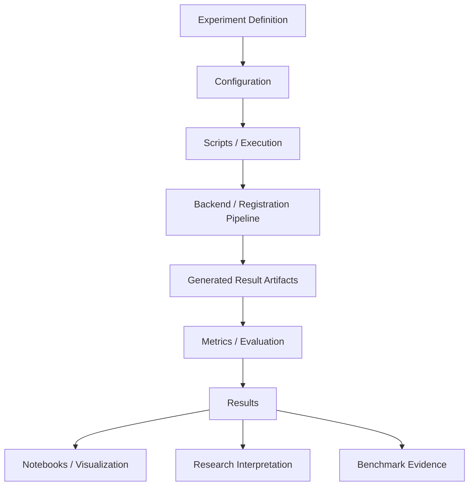

# Results

## Overview

The `results/` directory contains generated or curated outputs produced by ChandraMap experiments, benchmarks, evaluation runs, and related research workflows.

For ChandraMap, a result is not simply an image that "looks aligned." Results should provide traceable, measurable evidence of how a lunar image correspondence or registration workflow behaved.

A useful distinction is:

```text
experiments/
    Defines what is being tested.

configs/
    Defines controlled execution parameters.

scripts/
    Provides reusable execution / automation logic.

notebooks/
    Supports exploration, analysis, and visualization.

results/
    Stores what was measured or generated.

research/
    Explains scientific context, interpretation, and conclusions.
```

The exact current `results/` child structure is repository-dependent. Where the repository has not explicitly established a structure, the organization described below is **recommended**, not a claim about an existing implementation.

---

## Why `results/` Exists

ChandraMap is an experimental lunar image correspondence and registration system.

Its outputs need to support scientific comparison, debugging, benchmarking, and reproducibility.

The `results/` directory therefore provides a controlled location for outputs such as:

- Registration metrics
- Correspondence statistics
- Geometric verification outputs
- Transformation estimates
- Residual measurements
- Check-point evaluation
- Spatial coverage measurements
- Runtime measurements
- Success/failure records
- Registration visualizations
- Match visualizations
- Benchmark summaries
- Experiment-generated artifacts
- Other documented evaluation outputs

The purpose is not merely to collect files.

A result should be traceable to:

```text
Experiment
    ↓
Configuration
    ↓
Input Dataset / Image Pair
    ↓
Pipeline Execution
    ↓
Generated Result
    ↓
Metrics / Evaluation
```

The exact provenance mechanism is `[TBD]` where not already implemented.

---

# Results in the ChandraMap Architecture



The result layer sits downstream of execution.

It should preserve evidence about what happened rather than redefining the experiment itself.

---

## Relationship to Other Directories

### `experiments/`

Defines **what is being tested**.

Experiment documentation should describe:

- Research question
- Hypothesis
- Experimental variables
- Dataset
- Procedure
- Evaluation methodology
- Expected evidence
- Acceptance criteria where applicable

Results should contain the evidence produced by that experiment.

---

### `configs/`

Defines controlled execution parameters.

A result should be associated with the configuration used to produce it whenever the repository supports such provenance.

Configuration is therefore part of result traceability.

```text
Experiment
    +
Configuration
    +
Input
    =
Execution Conditions
```

---

### `research/`

Provides scientific context and interpretation.

Research documentation can explain:

- Why a method matters
- What previous work suggests
- Why a result may be significant
- Limitations
- Future research directions

Results should not silently become scientific conclusions.

For example:

```text
results/
    RMSE = measured value

research/
    Interpretation of why the measured value may matter
```

---

### `notebooks/`

Supports exploratory analysis and visualization.

A notebook may read result artifacts and generate:

- Plots
- Tables
- Residual visualizations
- Match visualizations
- Comparisons
- Diagnostic figures

The notebook should not become the only place where the underlying result exists.

Important measurements should remain represented in reproducible result artifacts or experiment records.

---

### `scripts/`

Contains reusable execution or automation logic.

Scripts generate or process results.

A result should not require manually modifying a script to determine what was executed.

The relationship is:

```text
scripts/
    Executes workflow

results/
    Stores workflow outputs
```

---

### `benchmarks/`

Defines benchmark methodology and acceptance/evaluation requirements.

Results provide evidence for benchmark evaluation.

A benchmark result should identify the benchmark or experiment context that produced it.

---

### `tests/`

Tests verify software behavior.

Test outputs and logs should not automatically be treated as scientific experiment results.

The exact boundary between persistent test artifacts and `results/` is `[TBD]` where not explicitly defined.

---

# What Belongs in `results/`

Results should contain generated or curated artifacts that provide evidence about an executed ChandraMap workflow.

## Registration Results

Registration outputs may include:

- Estimated transformation
- Registered image
- Registration preview
- Alignment visualization
- Residual measurements
- Check-point errors
- Transformation diagnostics

The exact artifact formats are `[TBD]`.

---

## Correspondence Results

Correspondence outputs may include:

- Candidate correspondences
- Verified inliers
- Match statistics
- Spatial distribution of matches
- Feature/matcher diagnostics
- Correspondence failure information

The distinction between candidate matches and verified inliers is important.

A large number of candidate matches does not establish successful registration.

Conceptually:

```text
Candidate Matches
        ↓
Geometric Verification
        ↓
Verified Inliers
        ↓
Transformation
        ↓
Independent Evaluation
```

Results should preserve these stages where the experiment records them.

---

## Geometric Results

Relevant geometric outputs can include:

- Transformation parameters
- Transformation model
- Reprojection error
- Residual vectors
- Residual magnitudes
- Inlier statistics
- Spatial coverage
- Check-point errors

A transformation should not be judged solely by how many correspondences were produced.

---

## Evaluation Results

Evaluation outputs should contain measurable evidence.

Important ChandraMap metrics include:

| Metric             | Meaning                                                                       |
| ------------------ | ----------------------------------------------------------------------------- |
| Inlier count       | Number of correspondences accepted after geometric verification               |
| Inlier ratio       | Proportion of candidate correspondences retained as inliers                   |
| Spatial coverage   | Distribution of reliable correspondences across the overlap                   |
| Check-point RMSE   | Error measured on independent evaluation/check points                         |
| Reprojection error | Geometric discrepancy under the fitted transformation                         |
| Ground error       | Physical error where GSD/projection/reference information makes it meaningful |
| Runtime            | Execution time                                                                |
| Success/failure    | Whether the registration workflow completed successfully                      |

The exact fields and schemas are `[TBD]` unless already defined elsewhere.

---

# Registration Accuracy Must Be Measurable

A visual overlay is useful, but it is not sufficient evidence of registration quality.

Likewise, a decorative percentage or confidence score should not replace measured registration metrics.

ChandraMap should prefer measurable quantities such as:

- Check-point RMSE
- Reprojection error
- Inlier ratio
- Spatial coverage
- Runtime
- Failure rate
- Ground error where scientifically meaningful

The project feedback specifically emphasizes reporting actual measurements rather than unmeasured percentage ratings.

---

## Independent Check-Point Evaluation

One of the most important principles for ChandraMap results is the separation between:

```text
Points used for fitting
```

and

```text
Points used for evaluation
```

A transformation fitted on a set of correspondences should not be judged only on those same correspondences.

The intended conceptual flow is:

```text
Candidate Correspondences
        ↓
RANSAC / Initial Model
        ↓
Verified Inliers
        ↓
Transformation
        ↓
Independent Check Points
        ↓
Check-Point Error / RMSE
```

This makes the reported accuracy more meaningful.

The exact ground-truth/check-point storage mechanism is defined elsewhere in the repository and should be referenced rather than duplicated inside `results/`.

---

# Residual Results

Residual analysis is an important diagnostic tool for ChandraMap.

For a transformation mapping source coordinates to reference coordinates:

```text
T : source coordinates → reference coordinates
```

the residual vector for point `i` can be represented conceptually as:

```text
r_i = p_i^r - T(p_i^s)
```

and residual magnitude as:

```text
e_i = ||r_i||
```

The corresponding RMSE is:

```text
RMSE = sqrt((1/N) * Σ e_i²)
```

The exact implementation and reporting schema are `[TBD]`.

Residuals should not be reduced to a single number when spatial structure is scientifically relevant.

Useful result artifacts may include:

- Residual magnitude
- Residual direction
- Residual vector plots
- Spatial residual distribution
- Residual statistics
- Residual patterns by terrain or image region

Systematic spatial residuals may indicate that a simple transformation model is insufficient.

---

# Transformation Results

A result should identify the geometric model used to produce it.

Relevant models in the current project context include:

- Affine transformation
- Homography

Future research may investigate more complex models.

Results should not imply that a more flexible model is automatically better.

A flexible transformation can reduce measured residuals while overfitting correspondences.

Therefore, transformation results should be interpreted together with:

- Independent check-point error
- Spatial coverage
- Residual structure
- Inlier quality
- Failure behavior

---

# Sub-Pixel Refinement Results

ChandraMap distinguishes sub-pixel refinement from initial correspondence generation and geometric verification.

The conceptual pipeline is:

```text
Candidate Matches
        ↓
RANSAC + Initial Model
        ↓
Verified Inliers
        ↓
Sub-Pixel Refinement
        ↓
Refit Final Transform
        ↓
Independent Evaluation
```

Where sub-pixel refinement is implemented and evaluated, results should make it possible to distinguish:

- Initial correspondence location
- Refined correspondence location
- Refinement displacement
- Final transformation
- Independent evaluation error

Numerical sub-pixel precision should not automatically be presented as evidence of physical sub-pixel accuracy.

Physical accuracy depends on the imaging system, ground truth, geometry, sampling, and evaluation methodology.

---

# Sensor-Aware Results

ChandraMap works with imagery from different instruments, including:

- Chandrayaan-2 OHRC
- TMC-2
- IIRS

Results should preserve sensor identity.

Results from different sensors should not automatically be merged into one aggregate number when sensor characteristics materially affect the registration problem.

Relevant differences may include:

- Spatial sampling
- Spectral/radiometric characteristics
- Image representation
- Resolution
- Illumination response
- Viewing geometry
- Product characteristics
- Preprocessing

The exact sensor metadata recorded with each result is `[TBD]`.

---

## OHRC Results

OHRC is relevant to the high-detail visible-imagery registration problem.

Results should preserve the image/product metadata required to interpret the achieved registration accuracy.

The authoritative pixel scale for a specific benchmark should come from the corresponding dataset/product metadata rather than being invented in the results documentation.

---

## TMC-2 Results

TMC-2 should be evaluated according to its actual product characteristics.

Results should not assume that physical ground-scale behavior is identical to OHRC.

Where ground error is reported, the underlying GSD, projection, and reference information must make that interpretation meaningful.

---

## IIRS Results

IIRS introduces additional modality considerations.

Hyperspectral/IR data cannot automatically be treated as an ordinary single-band image without documenting how a 2D representation was constructed.

A result involving IIRS should therefore preserve the relevant representation choice where applicable.

Examples of possible representations discussed by the project include:

- Selected band
- PCA/composite representation
- Structural representation

The exact implemented representation is `[TBD]`.

---

# Illumination-Related Results

Lunar illumination can change:

- Shadow boundaries
- Local brightness
- Contrast
- Terrain appearance
- Feature visibility

A result should therefore preserve the conditions under which the registration was measured when such metadata is available.

A visual change caused by illumination should not automatically be interpreted as geometric displacement.

Likewise:

> Contrast normalization cannot move a shadow back to where it appeared under another illumination geometry.

Results should distinguish photometric differences from geometric registration error wherever possible.

---

# Scale-Related Results

Results should preserve the scale conditions under which registration was evaluated.

Important distinctions include:

- Native image resolution
- Physical ground sampling
- Image resizing
- Effective matching scale
- Multi-scale processing
- Reference pyramid level

Upsampling does not recover missing spatial detail.

Therefore, a result should not claim improved physical registration simply because an image was resized to contain more pixels.

Where scale-stress experiments are performed, results should allow comparison under controlled conditions.

---

# Ground Error

Ground error can be useful when the required information is available and scientifically meaningful.

It should not be reported merely because a result contains pixel coordinates.

A meaningful physical ground-error calculation may depend on:

- GSD
- Projection
- Image geometry
- Reference frame
- Ground truth
- Sensor/product metadata

If these conditions are not available or sufficiently defined, ground error should be marked `[Not available]` or `[Not applicable]` rather than invented.

Source/reference pixel error remains the primary registration accuracy unit where appropriate to the benchmark.

---

# Spatial Coverage

Registration quality should not be judged only by the number of inliers.

Correspondences can be:

- Numerous but incorrect
- Numerous but spatially clustered
- Correct but concentrated in one region

Results should therefore report spatial coverage where the evaluation supports it.

A useful conceptual distinction is:

```text
Many matches
    ≠
Many correct matches
    ≠
Well-distributed correct matches
```

Spatial coverage should therefore be treated as an independent result dimension.

The exact coverage metric is `[TBD]` unless defined elsewhere.

---

# Runtime Results

Runtime is a system-level result.

Where runtime is measured, the result should preserve enough execution context to make comparisons meaningful.

Relevant context can include, where available:

- Algorithm/configuration
- Input size
- Hardware/runtime environment
- Execution mode
- Number of images/pairs
- Processing stage

A runtime comparison without equivalent execution conditions should be interpreted cautiously.

The exact runtime reporting schema is `[TBD]`.

---

# Success and Failure Results

A registration system should report failures explicitly.

Do not omit failed cases from result summaries merely because they make aggregate metrics less favorable.

Useful failure information can include:

- Registration failed
- Insufficient correspondences
- Geometric verification failed
- Transformation estimation failed
- Refinement failed
- Evaluation unavailable
- Invalid input
- Runtime failure

The exact failure taxonomy is `[TBD]`.

A failed registration is still experimental evidence.

---

# Recommended Results Organization

If the repository does not already define a different structure, the following organization is recommended conceptually:

```text
results/
├── README.md
├── experiments/
├── benchmarks/
├── metrics/
├── visualizations/
└── [TBD]
```

This is a **recommended structure**, not a claim that all of these directories currently exist.

The exact organization should follow the actual repository implementation.

---

## Experiment Results

Experiment-specific outputs can be grouped according to the experiment that produced them.

Conceptually:

```text
results/
└── experiments/
    └── [experiment-id]/
        ├── metrics
        ├── artifacts
        └── visualizations
```

The exact experiment-result layout is `[TBD]`.

The important principle is that the result should be traceable back to the experiment definition.

---

## Benchmark Results

Benchmark results should be distinguishable from exploratory outputs.

A benchmark result should preserve:

- Benchmark identity
- Dataset/image pairs
- Evaluation protocol
- Configuration
- Metrics
- Failures
- Relevant artifacts
- Execution context

The exact benchmark-result schema is `[TBD]`.

---

# Result Naming

Result names should communicate what they represent.

The exact naming convention is `[TBD]`.

Avoid ambiguous names such as:

```text
final.png
result.csv
output.json
best_result.png
latest.csv
test_final_final.png
```

unless the repository explicitly defines those names.

Where a naming convention is established, it should allow contributors to understand at least the relevant:

- Experiment
- Method/configuration
- Dataset or case
- Result type
- Version where required

The exact fields should follow the repository's actual convention.

---

# Result Metadata

A useful result should preserve enough metadata to answer:

### What?

What was measured or generated?

### Why?

Which experiment or benchmark produced it?

### With what?

Which method/configuration was used?

### On what?

Which dataset, image pair, sensor, or benchmark case was used?

### When?

When was the result generated, where timestamps are relevant?

### How?

Which execution/software context produced it?

### Where?

Where are the associated input, configuration, and artifacts?

The exact metadata schema is `[TBD]`.

---

# Result Provenance

A result should ideally be traceable through the following chain:

```text
Result
  ↓
Experiment ID
  ↓
Configuration
  ↓
Dataset / Image Pair
  ↓
Software Version
  ↓
Execution
  ↓
Metrics
  ↓
Artifacts
```

If a result cannot be traced to its experimental conditions, its scientific value is reduced.

For benchmark-quality results, provenance should be treated as a required part of the result rather than optional metadata.

---

# Reproducibility

A result should be reproducible to the extent supported by the repository.

Reproducibility depends on more than storing a final image.

Relevant components include:

- Exact input identity
- Configuration
- Experiment definition
- Software version
- Dependency versions
- Algorithm implementation
- Random seed where applicable
- Runtime/hardware context where relevant
- Ground-truth version
- Evaluation protocol
- Generated artifacts

A useful conceptual record is:

```text
Input
+
Code
+
Dependencies
+
Configuration
+
Experiment
+
Evaluation Protocol
=
Reproducible Result Context
```

No result should be described as fully reproducible merely because the output file has been committed.

---

# Results and Ground Truth

Ground truth is central to reliable registration evaluation.

Results should distinguish between:

```text
Training / fitting correspondences
```

and:

```text
Independent check points
```

where the benchmark requires independent evaluation.

Results should reference the applicable ground-truth definition rather than duplicating or silently modifying it.

Relevant project documentation includes:

```text
data/ground_truth/README.md
data/ground_truth/CONTROL_POINTS.md
benchmarks/v1/GROUND_TRUTH_PROTOCOL.md
```

The exact relationship between a particular result and ground-truth artifact should be recorded according to the repository's established schema.

---

# Results and Benchmark Acceptance

A result should not be interpreted independently of the benchmark acceptance criteria.

The benchmark may require evidence covering multiple dimensions:

```text
Accuracy
+
Coverage
+
Robustness
+
Runtime
+
Failure Rate
+
Reproducibility
```

A single strong metric does not automatically establish successful registration.

For example:

- More inliers do not necessarily mean better registration.
- Lower training-point residuals do not necessarily mean better independent accuracy.
- A visually attractive overlay does not prove geometric correctness.
- A low runtime does not establish scientific validity.
- A flexible transformation with low residuals may overfit.

Results should therefore preserve the complete evaluation context.

---

# Stress-Test Results

The project identifies several important stress categories:

- Easy pair
- Sun-angle stress
- Scale stress
- Modality stress
- Geometry stress
- Low-feature terrain

Stress-test results should preserve the condition under which each result was obtained.

A useful conceptual representation is:

```text
Baseline Condition
      ↓
Controlled Stress
      ↓
Same Evaluation Protocol
      ↓
Measured Change
```

This allows degradation or improvement to be interpreted as a response to a defined condition rather than an unexplained difference.

---

# Baseline Comparisons

Baseline comparison is a central part of scientific evaluation.

The project feedback recommends comparing approaches under the same test conditions.

A conceptual comparison may include:

```text
SIFT Baseline
      ↓
Stronger Matcher
      ↓
Sensor-Aware / Multi-Scale Pipeline
```

The exact methods included in a benchmark must come from the corresponding experiment.

Results should not combine incomparable experiments into a single ranking.

A fair comparison should preserve:

- Same test pairs
- Same ground truth
- Same evaluation protocol
- Same metric definitions
- Same reporting conventions
- Controlled configuration differences

---

# Visual Result Artifacts

Visualizations are valuable for understanding registration behavior.

Potential artifacts include:

- Image overlays
- Match visualizations
- Verified-inlier visualizations
- Residual vector fields
- Registration previews
- Difference images
- Coverage visualizations

However:

> Visual evidence supports quantitative evaluation; it does not replace it.

A mosaic or overlay can look convincing while containing systematic geometric errors.

Visual artifacts should therefore be accompanied by the relevant quantitative result whenever possible.

---

# Tables and Machine-Readable Results

Where practical, results should be stored in formats that support both human inspection and automated analysis.

Potential representations include:

- Tabular metrics
- Structured metadata
- Machine-readable evaluation records
- Image artifacts
- Diagnostic plots

The exact formats are `[TBD]`.

Machine-readable results are particularly useful for:

- Benchmark aggregation
- Regression testing
- Experiment comparison
- Plot generation
- Statistical analysis
- Reproducibility

The repository should not introduce a format merely for convention; the format should follow actual tooling requirements.

---

# Large Artifacts

Large generated artifacts require careful management.

Examples include:

- High-resolution registration images
- Large correspondence files
- Large intermediate datasets
- Generated visualizations
- Benchmark outputs

The repository's policy for large files is `[TBD]`.

Contributors should not commit large generated artifacts merely because they were produced locally.

Before committing a large result, verify:

- Whether it is required for reproducibility
- Whether it is required for review
- Whether it is already stored elsewhere
- Whether repository size constraints permit it
- Whether the artifact can be regenerated deterministically

---

# Generated vs Curated Results

Not every generated file should be permanently retained.

### Generated results

Produced automatically by an execution.

Examples:

- Metrics
- Match files
- Transformations
- Plots
- Registration previews

### Curated results

Selected and retained because they are needed for:

- Benchmark evidence
- Scientific reporting
- Reproducibility
- Documentation
- Regression tracking

The repository should clearly distinguish generated working artifacts from intentionally retained evidence where the implementation supports such a distinction.

---

# Result Integrity

Results should not be manually edited in ways that change their scientific meaning without recording the modification.

For example, do not:

- Change measured metrics by hand
- Remove failed cases from a benchmark without documenting the exclusion
- Replace a result with a better-looking visualization
- Alter metadata to make a result appear reproducible
- Rename an experiment result so that its origin becomes unclear

If a result is regenerated, the new execution should remain traceable.

---

# Avoiding Misleading Results

ChandraMap results should avoid unsupported claims.

Do not report:

- Unmeasured accuracy percentages
- Decorative confidence scores
- Unsupported physical accuracy
- Ground error without meaningful geospatial reference
- "Perfect alignment" based only on visual inspection
- Algorithm superiority without controlled comparison
- Generalized conclusions from a single image pair
- Learned-method performance without actual evaluation
- Sensor-invariant behavior without cross-sensor evidence

The project feedback emphasizes evidence-based reporting.

A result should say what was actually measured.

---

# Result Interpretation

The `results/` directory should preserve evidence.

Interpretation belongs primarily in experiment and research documentation.

For example:

```text
Result:
Check-point RMSE = measured value

Experiment:
Comparison against the defined baseline

Research:
Interpretation of the observed behavior and limitations
```

This separation prevents raw measurements from being confused with conclusions.

---

# Notebooks and Results

Notebooks may consume results for:

- Visualization
- Error analysis
- Statistical analysis
- Comparison
- Presentation

A notebook should ideally operate on reproducible result artifacts rather than relying exclusively on manually entered values.

The exact notebook-to-results interface is `[TBD]`.

A notebook-generated figure should preserve enough context to identify:

- Input result
- Experiment
- Configuration
- Metric
- Analysis operation

where applicable.

---

# Scripts and Results

Scripts may:

- Execute experiments
- Generate benchmark outputs
- Compute metrics
- Generate visualizations
- Aggregate result files

The result directory should contain the resulting evidence, not become a copy of the scripts themselves.

The exact script-to-results workflow is documented in the relevant project documentation where available.

---

# Research and Results

Research documents should be able to reference results without embedding every generated artifact inside `research/`.

For example:

```text
research/
    Explains the scientific question.

experiments/
    Defines the experiment.

results/
    Contains the measurements.

research/
    Interprets the measurements.
```

This structure keeps scientific reasoning separate from generated outputs.

---

# Recommended Result Record

Where the repository eventually defines a machine-readable result schema, a result record should conceptually provide enough information to establish provenance.

A conceptual record may include:

```text
Result Identity
Experiment Identity
Configuration Identity
Dataset Identity
Sensor
Image Pair
Method
Transformation Model
Evaluation Protocol
Metrics
Success / Failure
Runtime
Artifact References
Execution Context
```

This is a **conceptual model**, not an implemented schema.

Exact field names and formats are `[TBD]`.

---

# Result Quality Checklist

Before considering a result suitable for benchmark or research use:

- [ ] The originating experiment is identified.
- [ ] The configuration is identified.
- [ ] The input dataset/image pair is identified.
- [ ] Sensor identity is preserved where relevant.
- [ ] Ground truth/check-point information is identified where applicable.
- [ ] The method is identified.
- [ ] The geometric model is identified.
- [ ] Candidate matches and verified inliers are distinguished where applicable.
- [ ] Independent evaluation is used where required.
- [ ] Metrics are measured rather than estimated.
- [ ] Pixel error is reported in the appropriate coordinate system.
- [ ] Ground error is reported only when meaningful.
- [ ] Spatial coverage is considered.
- [ ] Runtime is reported when relevant.
- [ ] Failures are not silently removed.
- [ ] Visualizations do not replace quantitative evaluation.
- [ ] The result is reproducible or its reproducibility limitations are documented.
- [ ] Large artifacts follow repository policy.
- [ ] No unsupported conclusions are encoded as facts.

---

# Recommended Result Naming Checklist

Before adding a result artifact:

- [ ] The name identifies its purpose.
- [ ] The experiment relationship is clear.
- [ ] The method/configuration relationship is clear where necessary.
- [ ] The result type is identifiable.
- [ ] Ambiguous names such as `final`, `best`, or `latest` are avoided unless formally defined.
- [ ] The naming scheme is consistent with existing repository conventions.
- [ ] The artifact can be traced back to its generating execution.

The exact naming convention remains `[TBD]` unless already defined by the repository.

---

# Reproducibility Checklist

A benchmark-quality result should ideally allow a future contributor to reconstruct:

```text
Which experiment?
Which configuration?
Which input?
Which sensor?
Which method?
Which transformation?
Which ground truth?
Which evaluation protocol?
Which software version?
Which runtime context?
Which output artifacts?
```

If any required element is unavailable, document the limitation rather than inventing the missing information.

---

# Current / Planned Status

The exact implementation status of the `results/` infrastructure depends on the repository.

| Capability                             | Status            |
| -------------------------------------- | ----------------- |
| `results/README.md` documentation      | Current           |
| Formal result schema                   | `[TBD]`           |
| Formal result naming convention        | `[TBD]`           |
| Automated result provenance            | `[TBD]`           |
| Machine-readable result format         | `[TBD]`           |
| Automated metric aggregation           | `[TBD]`           |
| Benchmark result registry              | `[TBD]`           |
| Automated result validation            | `[TBD]`           |
| Result-to-configuration linkage        | `[TBD]`           |
| Result-to-experiment linkage           | `[TBD]`           |
| Standard visualization artifact format | `[TBD]`           |
| Large-artifact storage policy          | `[TBD]`           |
| DEM-aware result reporting             | `[Planned]`       |
| Global retrieval result reporting      | `[Planned]`       |
| Learned matcher result reporting       | `[Planned / TBD]` |
| Lunar mosaic result reporting          | `[Planned]`       |

This status table intentionally does not claim implementation where the supplied repository information does not establish it.

---

# Contributor Guidelines

When adding a new result:

1. Identify the experiment or benchmark that generated it.
2. Identify the configuration used.
3. Identify the input data.
4. Preserve sensor and relevant metadata.
5. Preserve the evaluation protocol.
6. Store quantitative measurements.
7. Store relevant diagnostic artifacts.
8. Preserve failure information.
9. Avoid unsupported interpretation.
10. Ensure the result can be traced back to its execution.
11. Follow the repository's established artifact-storage policy.
12. Update the associated experiment documentation when required.

---

# Maintainer Guidelines

Maintainers should verify that committed results:

- Have a documented origin.
- Are scientifically interpretable.
- Use the correct evaluation protocol.
- Do not hide failures.
- Do not contain fabricated or manually altered measurements.
- Do not mix incompatible sensor results without explanation.
- Do not confuse candidate matches with verified inliers.
- Do not confuse fitting error with independent check-point error.
- Do not confuse visual alignment with measured registration accuracy.
- Do not claim physical ground accuracy without appropriate geospatial support.
- Remain traceable to the relevant configuration and experiment.

---

# ChandraMap Result Philosophy

The central principle of the `results/` directory is:

> **Store evidence, not impressions.**

For ChandraMap, a useful registration result should answer more than:

> "Do these images look aligned?"

It should help answer:

- How many correspondences were found?
- How many survived geometric verification?
- Are the verified points spatially distributed?
- What transformation was estimated?
- How large are the residuals?
- What is the independent check-point error?
- Does the result remain valid under the relevant stress condition?
- How long did the workflow take?
- Did the registration fail?
- Can another contributor determine exactly how the result was produced?

A strong result is therefore multi-dimensional:

```text
Correspondence Quality
        +
Geometric Verification
        +
Transformation Quality
        +
Independent Accuracy
        +
Spatial Coverage
        +
Robustness
        +
Runtime
        +
Reproducibility
```

No single metric should silently replace the others.

---

# Summary

`results/` is the evidence layer of ChandraMap.

It connects experiment definitions and executable workflows to measurable scientific outputs.

```text
experiments/
    What are we testing?

configs/
    Under which controlled settings?

scripts/
    How is it executed?

backend/
    How is the pipeline implemented?

results/
    What was measured/generated?

notebooks/
    How is it explored or visualized?

research/
    What does it mean scientifically?
```

For lunar image registration, results should preserve quantitative evidence about:

- Correspondences
- Verified inliers
- Transformation models
- Residuals
- Check-point accuracy
- Spatial coverage
- Ground error where meaningful
- Runtime
- Success/failure
- Sensor-specific behavior
- Stress-test behavior
- Reproducibility

The goal of `results/` is not to accumulate output files.

The goal is to preserve **traceable, measurable, reproducible evidence** for ChandraMap's experiments and benchmarks.
