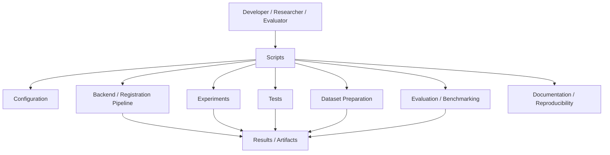
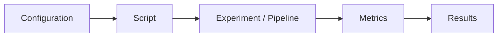
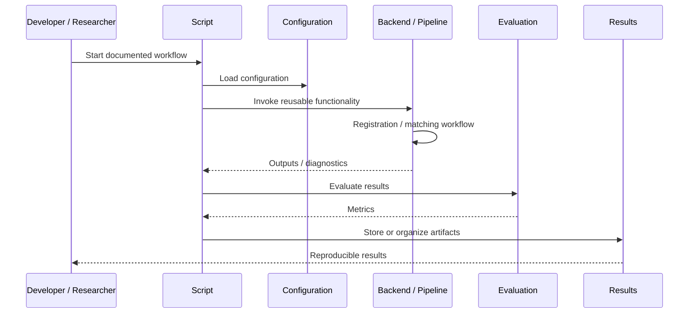

# Scripts

## Overview

The `scripts/` directory contains automation and operational tooling used to support ChandraMap development, research, experimentation, benchmarking, testing, data preparation, evaluation, and reproducibility workflows.

Scripts provide a controlled entry-point layer around the repository. They should make repeatable workflows easier to execute without moving core scientific or application logic out of the reusable project modules where that logic belongs.

ChandraMap is a lunar image correspondence and registration system involving workflows such as:

- Lunar image preparation
- Image registration
- Feature detection and matching
- Geometric verification
- RANSAC-based verification
- Scale handling
- Illumination and shadow stress testing
- Experiment execution
- Benchmark execution
- Evaluation and metric collection
- Result and artifact organization
- Reproducibility workflows
- Testing and validation
- Future research workflows

The `scripts/` directory exists to automate these workflows while keeping the repository's application code, research implementations, configuration, and tests clearly separated.

---

## Role in ChandraMap

Scripts sit between human operators and the reusable project infrastructure.



The exact implementation of these relationships depends on the scripts that are actually present in the repository.

Where a workflow has not yet been implemented, it should be documented as `[Planned]` rather than represented as an existing capability.

---

## Engineering Philosophy

Scripts are **automation and orchestration infrastructure**, not a miscellaneous collection of helper files.

A good script should:

- Have one clearly defined responsibility.
- Be repeatable.
- Be understandable by another contributor.
- Respect repository configuration.
- Reuse project modules instead of duplicating their logic.
- Produce predictable outputs.
- Fail clearly when required inputs are missing or invalid.
- Preserve reproducibility information where appropriate.
- Avoid modifying source data unexpectedly.
- Avoid hidden state.
- Be documented sufficiently for independent execution.
- Be safe to run in development and research environments.
- Make important assumptions explicit.

Scripts should reduce operational complexity without creating a second, undocumented implementation of the project.

---

## Scripts vs Other Repository Layers

The separation between scripts and other repository areas is important.

| Repository layer    | Primary responsibility                                               |
| ------------------- | -------------------------------------------------------------------- |
| Application code    | Reusable application and service functionality                       |
| Research code       | Algorithms, experimental methods, and scientific implementations     |
| Configuration       | Parameters, experiment settings, and configurable behavior           |
| Scripts             | Automation, orchestration, and workflow entry points                 |
| Tests               | Validation of expected software and scientific behavior              |
| Experiments         | Controlled research questions, methodology, and experiment records   |
| Benchmarks          | Standardized evaluation procedures and benchmark definitions         |
| Results / artifacts | Generated outputs, measurements, logs, and evaluation artifacts      |
| Documentation       | Explanation of architecture, usage, methodology, and reproducibility |

### Core rule

> If functionality needs to be reused by multiple workflows, it generally belongs in reusable project code rather than being duplicated inside a script.

A script should coordinate existing functionality where possible.

---

# What Belongs in `scripts/`

Scripts may be appropriate for workflows such as:

### Dataset preparation

Examples of responsibilities include:

- Preparing input datasets.
- Validating dataset structure.
- Preparing experiment inputs.
- Converting or organizing data when explicitly required by a workflow.
- Checking required input files.
- Preparing derived data for controlled experiments.

Exact dataset-preparation scripts are:

`[Not provided]`

---

### Experiment execution

Scripts may provide repeatable entry points for:

- Running documented experiments.
- Applying a known configuration.
- Executing controlled experiment variants.
- Collecting experiment outputs.
- Organizing generated artifacts.
- Repeating benchmark runs under controlled conditions.

Experiment definitions should remain in the appropriate `experiments/` documentation and infrastructure rather than being encoded only in an opaque script.

---

### Benchmark execution

Scripts may support:

- Running benchmark cases.
- Preparing benchmark inputs.
- Executing standardized evaluation workflows.
- Collecting metrics.
- Organizing benchmark artifacts.
- Repeating benchmark runs consistently.

Exact benchmark execution commands and script names are:

`[Not provided]`

---

### Evaluation

Scripts may orchestrate calculation or collection of metrics such as:

- Inlier count
- Inlier ratio
- Spatial coverage
- Reprojection error
- Check-point RMSE
- Ground error where scientifically meaningful
- Runtime
- Registration success/failure
- Retrieval metrics where applicable

The scientific definitions of these metrics should remain documented in the relevant experiment and benchmark specifications.

A script should not silently redefine a metric.

---

### Testing support

Scripts may automate repeatable test workflows such as:

- Running a selected test suite.
- Preparing test inputs.
- Running validation checks.
- Collecting test artifacts.
- Performing reproducibility checks.

However, scripts should not replace the test suite itself.

The actual testing framework and commands are:

`[Not provided]`

---

### Reproducibility

Scripts can help reproduce a documented workflow by coordinating:

1. Configuration selection
2. Input preparation
3. Experiment execution
4. Evaluation
5. Artifact collection
6. Result organization

A reproducibility script should make it clear what inputs and configuration were used.

It should not hide important parameters inside the script.

---

### Documentation support

Scripts may also support documentation workflows where appropriate, for example:

- Generating structured documentation artifacts.
- Validating repository documentation conventions.
- Checking required documentation files.
- Preparing reproducibility records.

Specific documentation automation is:

`[Not provided]`

---

# What Does Not Belong in `scripts/`

The following should generally not be placed in `scripts/` merely for convenience.

### Core application logic

Large reusable backend or application functionality should live in the appropriate application modules.

Do not duplicate core registration or service logic inside scripts.

---

### Research algorithms

Scientific implementations such as feature detectors, descriptors, matchers, geometric estimators, or refinement algorithms should live in the appropriate research/application modules.

For example, a script may **invoke** an SIFT-based experiment, but it should not become the permanent home of the SIFT implementation.

---

### Experiment specifications

The research question, hypothesis, methodology, controlled variables, evaluation protocol, and interpretation of an experiment belong in the appropriate experiment documentation.

A script can execute the experiment.

It should not be the only record of what the experiment means.

---

### Configuration

Experiment and application parameters should be represented through the repository's configuration system where applicable.

Do not create undocumented hard-coded configuration inside individual scripts.

---

### Tests

Tests belong in `tests/`.

A script may invoke or prepare a test workflow, but should not replace assertions and test cases with informal checks.

---

### Permanent generated artifacts

Generated outputs should not be committed into `scripts/` simply because a script produced them.

Artifact locations should follow the repository's established results and data conventions.

Exact artifact paths are:

`[Not provided]`

---

### Secrets and credentials

Scripts must never contain:

- API keys
- Access tokens
- Passwords
- Private credentials
- Hard-coded authentication information
- Sensitive user data

Secrets must be handled through the project's approved configuration and environment mechanisms once those mechanisms are defined.

Exact secret-management conventions are:

`[Not provided]`

---

# Script Responsibilities

A script should generally perform one or more of the following roles:

```text
Input
  ↓
Validation
  ↓
Configuration
  ↓
Orchestration
  ↓
Reusable Project Logic
  ↓
Evaluation
  ↓
Artifact / Result Collection
```

The script should remain thin where possible.

For example:

```text
Script
  ├── reads configuration
  ├── validates inputs
  ├── invokes reusable pipeline
  ├── invokes evaluation
  └── records outputs
```

rather than:

```text
Script
  ├── implements registration
  ├── implements feature extraction
  ├── implements matching
  ├── implements RANSAC
  ├── implements evaluation
  └── implements artifact handling
```

The second structure creates duplicated logic and makes scientific reproducibility harder.

---

# Relationship with Configuration

Scripts should consume configuration rather than silently replacing it.

Conceptually:



Configuration may control aspects such as:

- Dataset selection
- Experiment parameters
- Scale settings
- Preprocessing options
- Matching settings
- Geometric verification settings
- Evaluation settings
- Output behavior

The exact configuration schema and supported parameters are documented elsewhere in the repository.

Exact configuration file names, keys, and loading mechanisms are:

`[Not provided]`

---

## Configuration Principles

Scripts should:

- Prefer repository configuration over hidden constants.
- Avoid modifying configuration files unexpectedly.
- Make configuration-dependent behavior visible.
- Record relevant configuration with research results where appropriate.
- Fail clearly when required configuration is missing.
- Avoid silently falling back to scientifically different defaults.

For benchmark and experiment execution, the configuration used should be traceable.

---

# Relationship with Experiments

Scripts are execution infrastructure for experiments, not replacements for experiment documentation.

A documented experiment should establish:

- Research question
- Hypothesis where applicable
- Inputs
- Controlled variables
- Independent variables
- Method
- Metrics
- Evaluation protocol
- Expected artifacts
- Reproducibility requirements
- Failure analysis

A script can then provide a repeatable way to execute that procedure.

The relationship is therefore:

```text
Experiment Specification
        ↓
Configuration
        ↓
Script / Entry Point
        ↓
Research Pipeline
        ↓
Evaluation
        ↓
Results
```

For ChandraMap V1, this is particularly important because experiments cover controlled changes such as:

- SIFT baseline behavior
- Scale handling
- Gradient/structural representations
- Affine vs homography
- Residual analysis
- Sub-pixel refinement

Scripts should execute these workflows consistently without changing the scientific definition of the experiment.

---

# Relationship with the Backend

The backend represents application/service functionality, while scripts provide operational entry points around that functionality where required.

Conceptually:



The exact backend interface, API routes, modules, and invocation mechanisms are:

`[Not provided]`

Scripts must not assume undocumented backend interfaces.

---

# Relationship with the Frontend

The frontend is the user-facing presentation layer.

Scripts may support the workflows that ultimately produce data consumed or displayed by the frontend, but scripts should not become an alternative frontend.

Conceptually:

```text
Scripts
   ↓
Backend / Research Pipeline
   ↓
Results / Diagnostics
   ↓
Frontend
   ↓
User
```

The frontend may visualize outputs such as:

- Registration status
- Correspondences
- Verified inliers
- Transformation results
- Residual diagnostics
- Check-point errors
- Experiment metrics
- Benchmark results

The exact data contract between scripts, backend, and frontend is:

`[Not provided]`

---

# Dataset Preparation

Dataset preparation is one of the areas where scripts can provide significant value.

A dataset-preparation workflow should make clear:

- Input data source
- Expected input format
- Processing performed
- Output format
- Destination
- Whether data is copied, transformed, or generated
- Whether metadata is preserved
- Whether processing is deterministic
- How the resulting dataset can be reproduced

For lunar registration experiments, dataset preparation may involve organizing image pairs or collections that differ in:

- Scale
- Illumination
- Sun angle
- Shadow configuration
- Instrument
- Spatial resolution
- Imaging conditions

However, a script must not imply that two images are scientifically comparable merely because they can be processed together.

Dataset suitability remains part of experiment design.

---

# Safe Data Handling

Scripts operating on research data should distinguish between:

- Source data
- Derived data
- Temporary data
- Experimental artifacts
- Evaluation results

A safe workflow should avoid destructive modification of source imagery unless explicitly required and documented.

Prefer workflows that conceptually follow:

```text
Source Data
    ↓
Validated Input
    ↓
Derived / Temporary Processing
    ↓
Experiment
    ↓
Results
```

rather than modifying the original source dataset in place.

Exact repository-specific data paths are:

`[Not provided]`

---

# Benchmark Execution

Benchmark scripts should support standardized execution rather than ad-hoc experimentation.

A benchmark workflow should make it possible to determine:

- Which benchmark was executed
- Which inputs were used
- Which configuration was used
- Which method was evaluated
- Which evaluation protocol was applied
- Which metrics were produced
- Which failures occurred
- Where artifacts were stored

For ChandraMap, benchmark execution may eventually involve comparisons across:

- Baseline methods
- Preprocessing strategies
- Feature representations
- Matching approaches
- Geometric models
- Refinement methods
- Sensor or instrument combinations

Exact benchmark runner implementation is:

`[Not implemented]`

unless an implementation is explicitly added to the repository.

---

# Research Workflow Automation

Scripts may support research workflows involving:

```text
Dataset
   ↓
Preprocessing
   ↓
Scale Handling
   ↓
Representation
   ↓
Feature Detection / Matching
   ↓
Candidate Correspondences
   ↓
Geometric Verification
   ↓
Verified Inliers
   ↓
Transformation
   ↓
Independent Check-Point Evaluation
   ↓
Metrics / Diagnostics
```

The distinction between candidate correspondences and verified correspondences must remain explicit.

A script should not report all descriptor matches as geometrically valid registration points.

---

# Reproducibility

Reproducibility is a first-class requirement for research scripts.

Where practical, scripts should make the following traceable:

| Reproducibility element | Requirement                                               |
| ----------------------- | --------------------------------------------------------- |
| Input dataset           | Identify the input used                                   |
| Configuration           | Record relevant settings                                  |
| Method                  | Identify the method or experiment                         |
| Code version            | Preserve repository/version context where supported       |
| Execution               | Record meaningful execution information                   |
| Output                  | Identify generated artifacts                              |
| Metrics                 | Preserve evaluation results                               |
| Failure                 | Preserve failed runs rather than silently discarding them |

The exact implementation for recording repository versions, timestamps, hardware information, or dependency versions is:

`[Not provided]`

These should not be invented as existing functionality.

---

# Determinism and Randomness

Research workflows may involve stochastic operations.

When a script invokes stochastic processing, the workflow should make randomness explicit where supported.

Potential sources of nondeterminism may include:

- Random sampling
- RANSAC sampling
- Learned models
- Parallel execution
- Hardware-dependent computation
- External data ordering

Scripts should not claim deterministic results unless determinism has been established.

Where a seed or deterministic execution mechanism exists, it should be documented.

The repository's current deterministic execution policy is:

`[Not provided]`

---

# Naming Conventions

Script names should communicate their purpose.

Prefer descriptive names based on the workflow rather than vague names such as:

```text
run.py
test.py
helper.py
misc.py
temp.py
new.py
final.py
```

unless the repository establishes a specific convention for such names.

A useful conceptual pattern is:

```text
<action>_<scope>
```

or another repository-approved naming convention.

Examples of conceptual actions include:

- prepare
- validate
- run
- evaluate
- benchmark
- collect
- generate

These examples describe naming principles only; they do not establish actual filenames.

Existing script naming conventions are:

`[Not provided]`

---

# Organization

The `scripts/` directory should remain easy to navigate as the project grows.

If the number of scripts increases, organization may be based on workflow responsibility, for example:

```text
scripts/
├── README.md
├── <dataset-related scripts>
├── <experiment-related scripts>
├── <benchmark-related scripts>
├── <evaluation-related scripts>
├── <testing-related scripts>
└── <reproducibility-related scripts>
```

The entries above are conceptual categories, not currently confirmed filenames.

Avoid creating deep directory structures before there is a demonstrated need.

---

# Script Interface Design

A script should have a clear interface.

At minimum, documentation should make clear:

- What the script does
- What inputs it requires
- What configuration it uses
- What it produces
- What assumptions it makes
- What can cause it to fail
- Whether it modifies files
- Whether it is safe to rerun

If a script exposes CLI arguments, those arguments should be documented alongside the script.

The current CLI interface for repository scripts is:

`[Not provided]`

---

# Input Validation

Scripts should validate important inputs before starting expensive operations.

Validation may include:

- Required files exist.
- Input formats are supported.
- Configuration is valid.
- Dataset structure is correct.
- Required metadata is available.
- Output locations are usable.
- Experiment prerequisites are satisfied.

For computationally expensive lunar registration experiments, early validation is especially useful because failures discovered after feature extraction or geometric processing waste significant resources.

---

# Error Handling

Scripts should fail clearly and diagnostically.

A useful failure should communicate:

- What operation failed
- Which input was involved
- Why the operation could not continue
- Whether partial output was produced
- What the user should inspect next

Avoid:

- Silent failure
- Silent fallback to unrelated configuration
- Suppression of important errors
- Returning success after an incomplete workflow
- Overwriting valid artifacts without warning

For scientific workflows, a failed experiment is information.

It should not be silently converted into a successful result.

---

# Failure and Partial Results

A script should distinguish between:

- Successful execution
- Valid execution with unsuccessful registration
- Invalid input
- Software failure
- Evaluation failure
- Incomplete execution

For example, a registration algorithm failing to establish sufficient geometric correspondence is not necessarily the same as the script crashing.

The distinction matters for benchmarking.

A benchmark should preserve registration failures rather than treating only successful cases as the dataset.

---

# Logging

Scripts should provide enough information to understand what happened during execution.

Useful logging information may include:

- Workflow identifier
- Input identifier
- Configuration context
- Major processing stages
- Warnings
- Errors
- Evaluation status
- Output location

Exact logging framework and format are:

`[Not provided]`

Do not document a specific logging library unless it is actually part of the repository.

---

# Output and Artifact Management

Scripts should make output handling predictable.

Outputs may include:

- Registration results
- Correspondence data
- Transformation parameters
- Diagnostic data
- Evaluation metrics
- Benchmark summaries
- Logs
- Visualization artifacts
- Intermediate data

Generated artifacts should be stored according to the repository's established artifact conventions.

Do not place generated experiment outputs inside `scripts/` merely because the generating script resides there.

Exact artifact directory conventions are:

`[Not provided]`

---

# Scientific Integrity

Scripts that execute scientific workflows must preserve the distinction between:

- Candidate matches
- Verified inliers
- Control points
- Refined tie points
- Ground-truth points
- Independent check points

This distinction is particularly important for lunar image registration.

For example:

```text
Feature Matching
      ↓
Candidate Correspondences
      ↓
Geometric Verification / RANSAC
      ↓
Verified Inliers
      ↓
Transformation Estimation
      ↓
Independent Check Points
      ↓
Registration Error
```

A script must not accidentally use the same points for fitting and independent evaluation when the experiment requires withheld check points.

---

# Metrics and Evaluation

Scripts may automate the collection of project metrics, but metric definitions belong to the relevant benchmark or experiment specification.

Potential measurements include:

### Correspondence metrics

- Candidate correspondence count
- Verified inlier count
- Inlier ratio
- Spatial coverage

### Geometric metrics

- Reprojection error
- Residual statistics
- Check-point RMSE
- Check-point MAE
- Percentile errors where defined

### Geospatial metrics

- Ground error where ground sampling distance, projection, and reference truth make such a measurement meaningful

### Operational metrics

- Runtime
- Failure rate
- Resource usage where explicitly measured

### Retrieval metrics

Where global retrieval is evaluated:

- Recall@1
- Recall@5
- Other documented retrieval metrics

Scripts must not introduce undocumented metric definitions.

---

# Registration and Geometric Verification

ChandraMap's registration workflow includes geometric verification.

Scripts may orchestrate workflows involving:

- Feature extraction
- Descriptor matching
- Candidate correspondence generation
- RANSAC
- Affine transformation estimation
- Homography estimation
- Residual analysis
- Independent checkpoint evaluation
- Sub-pixel refinement

The exact implementation belongs to the appropriate pipeline/research modules.

The script's responsibility is to execute and coordinate the workflow rather than silently implement a separate geometric system.

---

# Scale and Illumination Workflows

Scripts may support controlled experiments involving:

- Different image scales
- Image pyramids
- Resolution differences
- Illumination changes
- Sun-angle changes
- Shadow changes
- Gradient or structural representations

These workflows should preserve experimental control.

In particular, illumination variation should not be treated only as a brightness-normalization problem.

Changing Sun angle can alter shadow geometry and visible structural boundaries, meaning that a script must not describe an illumination experiment as successful merely because image intensity distributions became more similar.

---

# Cross-Instrument Workflows

ChandraMap may evaluate correspondence across different lunar imaging instruments.

Potential workflows can involve differences in:

- Spatial resolution
- Image appearance
- Illumination
- Sensor characteristics
- Representation
- Geometric properties

Scripts supporting cross-instrument experiments should preserve the instrument identity and relevant experimental configuration.

The exact set of currently implemented cross-instrument datasets and scripts is:

`[Not provided]`

---

# Benchmark Fairness

Automation should make controlled comparisons easier.

When comparing methods, scripts should avoid unintentionally changing multiple variables at once.

For example, a fair comparison may require keeping constant:

- Input image pairs
- Ground-truth/check-point data
- Evaluation metrics
- Geometric verification policy
- Reporting conventions
- Relevant preprocessing

while changing the method being evaluated.

The exact benchmark protocol is defined by the applicable benchmark documentation.

Scripts should execute that protocol rather than invent a different one.

---

# Experiment Repetition

A script intended for repeated experimentation should support the same documented workflow consistently.

Conceptually:

```text
Experiment Definition
        +
Configuration
        +
Fixed Dataset
        ↓
Repeatable Script Execution
        ↓
Comparable Results
```

If a script changes behavior between runs because of hidden state, undocumented defaults, or uncontrolled data changes, comparison becomes unreliable.

---

# Idempotency and Safe Reruns

Where practical, scripts should be safe to rerun.

Before overwriting existing outputs, a script should follow the repository's documented policy for:

- Existing artifacts
- Temporary files
- Result directories
- Cached data
- Generated reports

The repository's current overwrite policy is:

`[Not provided]`

Do not assume that all scripts are idempotent.

If a script is not safe to rerun, that limitation should be documented.

---

# Resource Management

Lunar image processing and registration can involve large images and computationally expensive workflows.

Scripts should therefore avoid unnecessary duplication of:

- Large image data
- Intermediate representations
- Feature data
- Match data
- Derived artifacts

Where resource requirements are important, scripts should document them.

Current script-specific resource requirements are:

`[Not provided]`

---

# Long-Running Workflows

Benchmark and research workflows may take significantly longer than ordinary development commands.

Long-running scripts should, where appropriate:

- Clearly identify the active workflow.
- Provide meaningful progress information.
- Preserve partial diagnostic information where safe.
- Fail without corrupting existing results.
- Make expensive stages identifiable.
- Avoid silently restarting expensive work.

Exact progress and checkpointing mechanisms are:

`[Not provided]`

---

# Testing Scripts

Scripts themselves should be treated as software.

Where appropriate, test:

- Input validation
- Configuration handling
- Output structure
- Failure handling
- Reproducibility behavior
- Integration with the invoked modules

Do not rely exclusively on manually running a script once.

The exact automated test strategy for scripts is:

`[Not provided]`

---

# Script Testing Pyramid

A useful testing structure is:

```text
                 End-to-End Workflow
                        ▲
                       / \
                      /   \
             Integration Tests
                    ▲
                   / \
                  /   \
             Unit / Validation Tests
```

Not every script requires a dedicated unit-test module, but important behavior should be testable.

Particularly important workflows should have integration or end-to-end coverage.

---

# Development Workflow

When adding or modifying a script:

1. Identify the workflow it supports.
2. Determine whether the functionality already exists elsewhere.
3. Reuse existing project modules where possible.
4. Identify required configuration.
5. Define expected inputs and outputs.
6. Define failure behavior.
7. Add documentation.
8. Add or update tests where appropriate.
9. Verify reproducibility.
10. Run the relevant workflow.
11. Inspect generated artifacts.
12. Confirm that unrelated repository behavior was not changed.

---

# Adding a New Script

Before creating a new script, ask:

### 1. Does this logic already exist?

If yes, reuse it instead of duplicating it.

### 2. Is this actually reusable application logic?

If yes, it likely belongs in the application or research code.

### 3. Is this an experiment definition?

If yes, document it in the appropriate experiment location.

### 4. Is this configuration?

If yes, use the configuration system.

### 5. Is this validation?

If yes, consider whether it belongs in `tests/`.

### 6. Is this orchestration?

If yes, `scripts/` may be appropriate.

---

# Script Documentation Template

Each non-trivial script should document enough information for another contributor to understand it.

A suitable documentation structure is:

```text
Purpose
Inputs
Configuration
Workflow
Outputs
Failure modes
Safety considerations
Reproducibility notes
Testing
Usage
```

Exact usage syntax should only be documented once the actual script interface exists.

---

# Documentation Example

The following is a documentation pattern rather than an existing ChandraMap command:

```text
Script: [script name]

Purpose:
[What the script automates]

Inputs:
[Required inputs]

Configuration:
[Configuration source]

Workflow:
[Major stages]

Outputs:
[Generated artifacts]

Failure modes:
[Known failure conditions]

Reproducibility:
[Relevant reproducibility requirements]

Testing:
[How the script is validated]

Usage:
[TBD]
```

Do not copy placeholder values into production documentation without replacing them with repository-verified information.

---

# Security and Safety

Scripts are executable code and should be reviewed accordingly.

Do not add scripts that:

- Execute untrusted input without validation.
- Delete arbitrary files.
- Overwrite source datasets without explicit safeguards.
- Expose secrets.
- Download or execute unknown code without documented justification.
- Modify unrelated repository files unexpectedly.
- Depend on undeclared external state.

Scripts handling external data should clearly define what they read and write.

---

# Dependency Management

Scripts should use dependencies already supported by the project where possible.

Do not introduce a dependency solely for a small convenience unless its maintenance and reproducibility implications are understood.

The current approved dependency policy for scripts is:

`[Not provided]`

Specific dependency names should not be documented here until confirmed from the repository.

---

# Environment Management

Scripts may depend on:

- Runtime versions
- Installed packages
- Configuration
- Dataset availability
- Hardware capabilities
- External services

However, the exact environment requirements must be documented based on actual repository configuration.

Current script environment requirements are:

`[Not provided]`

No environment variable names should be assumed.

---

# External Services

Scripts should explicitly document any external service they require.

Possible categories include:

- Remote datasets
- External APIs
- Storage services
- Model repositories
- Cloud infrastructure

ChandraMap's currently implemented external-service dependencies are:

`[Not provided]`

Do not assume that external services exist merely because they could be useful.

---

# Continuous Integration

Scripts may eventually be used by CI workflows for tasks such as:

- Validation
- Testing
- Documentation checks
- Reproducibility checks
- Benchmark smoke tests

However, no CI integration should be assumed.

Current CI usage of `scripts/` is:

`[Not provided]`

---

# Automation Policy

Automation should be explicit.

A script should not silently:

- Change datasets
- Modify configuration
- Delete outputs
- Download large resources
- Start services
- Change system state
- Publish results

unless that behavior is documented and intentionally part of the workflow.

---

# Research vs Production Boundaries

ChandraMap contains both engineering and research workflows.

Scripts must preserve that distinction.

### Research workflow

May be:

- Experimental
- Iterative
- Method-specific
- Benchmark-oriented
- Subject to scientific change

### Production/application workflow

Should be:

- Stable
- Explicitly supported
- Validated
- Maintainable
- Predictable

A research script should not automatically be treated as production infrastructure.

Likewise, production application behavior should not depend on an undocumented experimental script.

---

# Implemented vs Planned Scripts

This README deliberately does not invent a list of implemented scripts.

The current repository-backed status is:

| Area                           | Status           |
| ------------------------------ | ---------------- |
| Script directory purpose       | Defined          |
| Script engineering conventions | Defined          |
| Dataset preparation automation | `[Not provided]` |
| Experiment execution scripts   | `[Not provided]` |
| Benchmark execution scripts    | `[Not provided]` |
| Evaluation automation          | `[Not provided]` |
| Testing automation             | `[Not provided]` |
| Reproducibility automation     | `[Not provided]` |
| Documentation automation       | `[Not provided]` |
| CI integration                 | `[Not provided]` |
| Deployment automation          | `[Not provided]` |
| External-service automation    | `[Not provided]` |

This status table should be updated as scripts are actually implemented.

---

# Planned Script Categories

The following categories are suitable for future expansion where the repository requires them:

| Category                 | Purpose                                                | Status      |
| ------------------------ | ------------------------------------------------------ | ----------- |
| Dataset preparation      | Validate and prepare experiment inputs                 | `[Planned]` |
| Experiment runners       | Execute documented experiments consistently            | `[Planned]` |
| Benchmark runners        | Execute standardized benchmark workflows               | `[Planned]` |
| Evaluation               | Collect and summarize documented metrics               | `[Planned]` |
| Result collection        | Organize experiment artifacts                          | `[Planned]` |
| Reproducibility          | Recreate documented workflows                          | `[Planned]` |
| Validation               | Perform repository/data checks                         | `[Planned]` |
| Documentation automation | Validate or generate supported documentation artifacts | `[Planned]` |

These are roadmap categories, not claims that the corresponding scripts currently exist.

---

# Recommended Script Lifecycle

A maintainable script should follow a lifecycle similar to:

```text
Identify Need
     ↓
Define Responsibility
     ↓
Check Existing Functionality
     ↓
Design Interface
     ↓
Implement Thin Orchestration
     ↓
Validate Inputs
     ↓
Execute Reusable Logic
     ↓
Validate Outputs
     ↓
Record Results
     ↓
Test
     ↓
Document
     ↓
Maintain
```

This prevents `scripts/` from becoming an unmanaged collection of one-off utilities.

---

# Common Anti-Patterns

## The Giant Script

A single script contains the entire research pipeline.

**Problem:** difficult to test, reuse, debug, and maintain.

**Preferred approach:** keep algorithms in reusable modules and use scripts as orchestration layers.

---

## Hidden Configuration

A script contains undocumented constants controlling important scientific behavior.

**Problem:** experiments become difficult to reproduce.

**Preferred approach:** use the repository's configuration mechanism and document important parameters.

---

## Silent Defaults

A missing parameter silently changes the experiment.

**Problem:** benchmark comparisons become unreliable.

**Preferred approach:** make important defaults explicit and documented.

---

## Script-Only Research

The scientific methodology exists only inside executable code.

**Problem:** researchers cannot understand the experiment without reading implementation details.

**Preferred approach:** maintain experiment documentation separately.

---

## Copy-Pasted Pipeline Logic

Multiple scripts independently implement registration or evaluation logic.

**Problem:** different scripts gradually produce different results.

**Preferred approach:** centralize reusable functionality.

---

## Destructive Data Processing

A preparation script modifies source imagery in place.

**Problem:** original inputs may be lost or become difficult to reproduce.

**Preferred approach:** produce derived data according to documented data-management rules.

---

## Successful Exit After Scientific Failure

A registration attempt fails, but the script exits as though the benchmark case succeeded.

**Problem:** benchmark statistics become misleading.

**Preferred approach:** distinguish execution status from scientific registration success/failure.

---

## Ignoring Failed Cases

A script records only successful registrations.

**Problem:** failure rates and robustness cannot be measured correctly.

**Preferred approach:** preserve and report failures according to the benchmark protocol.

---

## Mixing Candidate and Verified Matches

A script counts all descriptor matches as successful correspondences.

**Problem:** geometric correctness is overstated.

**Preferred approach:** keep candidate correspondences and geometrically verified inliers distinct.

---

## Fitting and Evaluating on the Same Points

A script reports the transformation residual on the exact points used for fitting as its only accuracy measurement.

**Problem:** this does not provide independent validation.

**Preferred approach:** use independent check points where required by the experiment.

---

# Maintainer Guidelines

Maintainers reviewing a script should ask:

### Correctness

- Does it perform the documented workflow?
- Are inputs validated?
- Are failures represented correctly?

### Architecture

- Is reusable logic located in the correct module?
- Is the script actually orchestration?

### Reproducibility

- Can another contributor determine how the result was produced?
- Are important configuration choices visible?

### Scientific integrity

- Are candidate and verified correspondences distinguished?
- Are independent evaluation points respected?
- Are failures preserved?

### Safety

- Does it modify data?
- Does it overwrite artifacts?
- Does it require external resources?
- Does it expose sensitive information?

### Maintainability

- Is the responsibility clear?
- Is the script documented?
- Is it tested where appropriate?
- Does it introduce unnecessary dependencies?

---

# Pull Request Checklist

When submitting a change to `scripts/`, verify:

- [ ] The script has one clear responsibility.
- [ ] Existing reusable functionality was considered.
- [ ] No unnecessary research/application logic was duplicated.
- [ ] Inputs are documented.
- [ ] Outputs are documented.
- [ ] Configuration dependencies are documented.
- [ ] Failure behavior is documented.
- [ ] Destructive behavior is avoided or explicitly documented.
- [ ] Secrets are not included.
- [ ] Tests were added or updated where appropriate.
- [ ] Reproducibility implications were considered.
- [ ] Experiment/benchmark documentation was updated if necessary.
- [ ] Generated artifacts are not accidentally committed.
- [ ] The script does not silently alter scientific evaluation rules.
- [ ] The script follows repository conventions.

---

# Contribution Guidelines

Contributors adding a script should:

1. Identify the problem the script solves.
2. Confirm that the functionality does not already exist.
3. Define the script's responsibility.
4. Decide whether the functionality belongs in `scripts/` rather than application or research code.
5. Reuse existing modules.
6. Keep configuration explicit.
7. Validate inputs.
8. Handle failures clearly.
9. Document outputs.
10. Add appropriate tests.
11. Update experiment or benchmark documentation when the workflow affects scientific methodology.
12. Keep generated artifacts outside the source directory unless explicitly required.
13. Verify that the workflow is reproducible.
14. Document any repository-specific assumptions.

---

# Relationship to Experiments and Benchmarks

The three layers should remain distinct:

```text
Experiment / Benchmark Specification
                ↓
        Configuration
                ↓
             Script
                ↓
     Reusable Pipeline Code
                ↓
          Evaluation
                ↓
      Results / Diagnostics
```

This separation provides three different forms of traceability:

- **Why was this run performed?** → Experiment/benchmark documentation
- **How was it configured?** → Configuration
- **How was it executed?** → Script
- **How was the algorithm implemented?** → Reusable code
- **How was it evaluated?** → Evaluation/benchmark specification
- **What happened?** → Results/artifacts

---

# Relationship to Reproducible Research

A professional ChandraMap research workflow should allow a future contributor to understand the relationship between:

```text
Dataset
   +
Configuration
   +
Code Version
   +
Experiment Definition
   +
Execution Procedure
   ↓
Result
```

Scripts are responsible primarily for the **execution procedure**.

They should not be the only source of scientific truth.

---

# Future Automation Opportunities

As the repository matures, automation may eventually support:

- Standardized experiment execution
- Batch benchmark execution
- Dataset validation
- Dataset manifest generation
- Result aggregation
- Experiment comparison
- Reproducibility checks
- Regression testing
- Artifact validation
- Research report generation
- Benchmark report generation
- Cross-instrument evaluation
- Scale-stress evaluation
- Illumination-stress evaluation
- Registration failure analysis
- Multi-image registration workflows
- Lunar mosaicking experiments
- Global retrieval evaluation

Each capability should be introduced only when there is a documented requirement and an agreed implementation.

---

# Script Status Convention

Use explicit status labels when documenting scripts or planned automation:

| Status              | Meaning                                            |
| ------------------- | -------------------------------------------------- |
| `[Implemented]`     | Exists and is currently supported                  |
| `[Experimental]`    | Exists but is research/experimental infrastructure |
| `[Planned]`         | Intended future work                               |
| `[Not implemented]` | Explicitly known not to exist                      |
| `[Not provided]`    | Repository information has not been supplied       |
| `[TBD]`             | Requires a future decision or specification        |

Do not mark a script as implemented until its implementation exists in the repository.

---

# Repository Integration

The `scripts/` directory should integrate with the wider ChandraMap structure:

```text
ChandraMap/
├── backend/
├── frontend/
├── configs/
├── data/
├── experiments/
├── research/
├── benchmarks/
├── scripts/
├── src/
├── tests/
└── results/
```

The exact repository structure should remain governed by the actual project tree.

The role of `scripts/` is specifically to provide operational automation around these components, not to replace them.

---

# Maintenance

Scripts require maintenance just like application code.

When project architecture changes, maintainers should check whether scripts still reference:

- Valid configuration structures
- Valid experiment definitions
- Valid module interfaces
- Valid dataset conventions
- Valid output locations
- Valid evaluation procedures

A script that silently depends on an obsolete interface is technical debt and should not remain undocumented.

---

# Documentation Maintenance

Update this README when:

- A new script category is introduced.
- Script organization changes.
- Execution conventions change.
- Configuration conventions change.
- Benchmark automation changes.
- Reproducibility procedures change.
- Testing conventions change.
- CI integration is introduced.
- Artifact conventions change.

Individual scripts should contain their own specific documentation where necessary.

This README should describe the **directory-level contract**, not duplicate every script's implementation details.

---

# Definition of Done

The `scripts/` directory is considered professionally maintained when:

- [ ] Every script has a clearly defined responsibility.
- [ ] Scripts are separated from reusable application/research logic.
- [ ] Important inputs and outputs are documented.
- [ ] Configuration dependencies are explicit.
- [ ] Experiment and benchmark workflows remain scientifically traceable.
- [ ] Failed executions are not silently treated as successful results.
- [ ] Generated artifacts follow repository conventions.
- [ ] Sensitive information is not stored in scripts.
- [ ] Important workflows are tested appropriately.
- [ ] Reproducibility requirements are documented.
- [ ] Implemented and planned automation are clearly distinguished.
- [ ] The directory does not become a collection of undocumented one-off utilities.

---

# Current Implementation Status

The repository information supplied for this documentation does not provide a verified inventory of concrete files inside `scripts/`.

Therefore:

- Specific script filenames: `[Not provided]`
- Script CLI commands: `[Not provided]`
- Script dependencies: `[Not provided]`
- Script environment variables: `[Not provided]`
- Benchmark runner implementation: `[Not provided]`
- Dataset preparation implementation: `[Not provided]`
- CI integration: `[Not provided]`
- Deployment automation: `[Not provided]`
- Scheduled automation: `[Not provided]`

These fields should be replaced with repository-verified information as the corresponding infrastructure is implemented.

---

# Summary

The `scripts/` directory is ChandraMap's **automation and workflow orchestration layer**.

Its purpose is to make repeatable engineering and research workflows easier to execute while preserving a clean separation between:

```text
Application Code
Research Code
Configuration
Scripts
Tests
Experiments
Benchmarks
Results
Documentation
```

The core principle is:

> **Scripts should automate the project without becoming the project.**

For ChandraMap, this means scripts can coordinate dataset preparation, experiments, registration pipelines, geometric verification, evaluation, benchmarking, testing, artifact collection, and reproducibility workflows while leaving reusable scientific and application logic in the appropriate repository layers.

A professional `scripts/` directory should be:

- Explicit
- Reproducible
- Testable
- Maintainable
- Safe
- Scientifically traceable
- Easy for contributors to understand
- Clearly separated from core implementation and research methodology

As ChandraMap evolves from controlled V1 experiments toward broader cross-instrument registration, stronger matching methods, global retrieval, DEM-aware registration, and lunar mosaicking, the scripting layer should grow only where automation provides a clear and reproducible engineering benefit.
