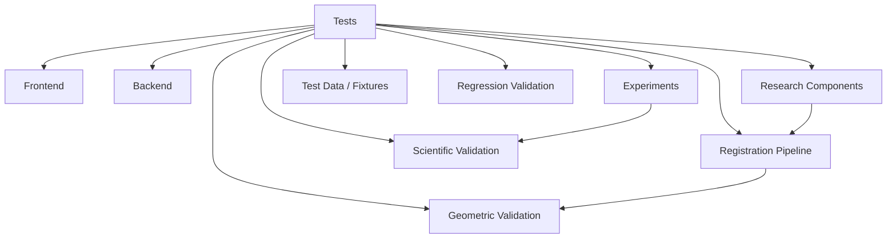
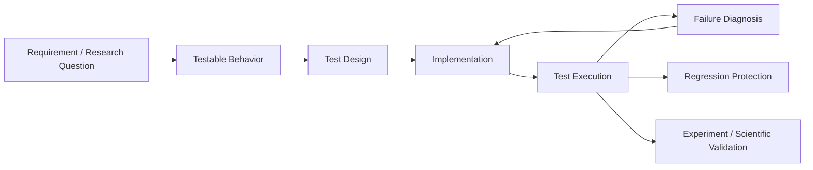

# Tests

## Overview

The `tests/` directory is the validation layer of ChandraMap.

It is responsible for verifying that software components, image-processing operations, geometric operations, registration pipelines, and research-supporting code behave as intended.

ChandraMap is not only a software system; it is also a computer-vision and scientific research project. Therefore, testing has two related but distinct goals:

1. **Software correctness** — determine whether the implementation behaves according to its defined interface and expected computational behavior.
2. **Scientific validation** — determine whether an implemented registration or correspondence method produces reliable, reproducible measurements under defined experimental conditions.

A passing software test does **not** automatically establish that a registration method is scientifically accurate.

The `tests/` directory should therefore provide a controlled validation layer between implementation, experiments, research development, and reproducible results.

---

## Role in ChandraMap

Testing sits across the software and research pipeline rather than belonging exclusively to the backend or frontend.



The testing layer should help answer questions such as:

- Does an individual component behave correctly?
- Does a preprocessing operation preserve the expected image properties?
- Does feature matching return valid data structures?
- Are geometric transformations applied correctly?
- Are correspondences separated correctly from verified inliers?
- Does RANSAC-based verification behave correctly on controlled inputs?
- Does registration fail safely when correspondence quality is insufficient?
- Are evaluation metrics computed correctly?
- Does a change unintentionally alter previously validated behavior?
- Can an experiment be reproduced under the same configuration and data?
- Does a scientifically meaningful result remain valid after implementation changes?

---

## Testing Principles

ChandraMap testing should follow several principles.

### 1. Test behavior, not implementation details

Tests should primarily verify observable behavior and defined contracts rather than unnecessarily coupling themselves to internal implementation details.

### 2. Keep software correctness separate from scientific validity

A function can produce the correct numerical output for its implementation while the underlying scientific method remains unsuitable for a particular lunar-registration scenario.

Both levels require separate validation.

### 3. Prefer deterministic tests where possible

Synthetic inputs, fixed parameters, controlled transformations, and known expected outputs should be used whenever practical.

### 4. Preserve difficult cases

Registration failures are valuable research information.

Tests should not be designed only around easy image pairs. Where difficult cases are intentionally represented, they should remain identifiable rather than being silently removed.

### 5. Make assumptions explicit

A test should make clear:

- what it assumes,
- what input it uses,
- what behavior it validates,
- what tolerance is acceptable,
- whether the result is deterministic,
- and what constitutes failure.

### 6. Do not confuse clustering with registration

Spatially clustered matches are not automatically a valid global registration.

Tests involving correspondence quality should distinguish:

- candidate matches,
- verified inliers,
- spatial coverage,
- transformation validity,
- and independent registration accuracy.

### 7. Do not use fitted residuals as independent accuracy

Residuals produced by the same points used to estimate a transformation should not automatically be described as independent registration accuracy.

Independent check points should be used when the scientific evaluation requires independent accuracy.

### 8. Reproducibility is part of correctness

Research-oriented tests should record enough configuration and data information to reproduce the observed behavior.

### 9. Tests should fail clearly

A failing test should help identify:

- what failed,
- which input caused the failure,
- what was expected,
- what was observed,
- and whether the failure is software, data, numerical, or scientific.

### 10. Never hide failures

Tests should not be weakened simply to make the repository appear stable.

If an expected behavior changes, the corresponding test and documentation should be intentionally updated.

---

## Testing Scope

The `tests/` directory may cover several validation levels.

The exact implementation status of each level must remain aligned with the repository.

| Test level            | Purpose                                             | Status                                        |
| --------------------- | --------------------------------------------------- | --------------------------------------------- |
| Unit tests            | Validate isolated functions and deterministic logic | `[Planned / To be verified]`                  |
| Component tests       | Validate related computer-vision components         | `[Planned / To be verified]`                  |
| Integration tests     | Validate interaction between components             | `[Planned / To be verified]`                  |
| API tests             | Validate documented backend interfaces              | `[Planned / Not implemented unless provided]` |
| Pipeline tests        | Validate registration-stage interactions            | `[Planned / To be verified]`                  |
| Geometry tests        | Validate transformation and geometric operations    | `[Planned / To be verified]`                  |
| Regression tests      | Protect previously validated behavior               | `[Planned / To be verified]`                  |
| End-to-end tests      | Validate complete workflows                         | `[Planned / To be verified]`                  |
| Scientific validation | Validate measured research behavior                 | `[Planned / To be verified]`                  |
| Reproducibility tests | Verify repeatability under controlled conditions    | `[Planned / To be verified]`                  |
| Performance tests     | Track runtime or computational behavior             | `[Planned / To be verified]`                  |
| Failure-case tests    | Explicitly validate known failure modes             | `[Planned / To be verified]`                  |

The table is intentionally conservative. No framework, command, coverage value, or test implementation should be inferred from this README alone.

---

## Relationship to the Backend

The backend provides the application-level interface around ChandraMap's processing capabilities.

Tests should validate backend behavior at the appropriate boundary without duplicating every underlying research experiment.

Conceptually:

```text
Frontend
   │
   ▼
Backend Interface
   │
   ├── Input Validation
   ├── Configuration
   ├── Processing Request
   │
   ▼
Registration Pipeline
   │
   ├── Preprocessing
   ├── Feature Detection
   ├── Feature Description
   ├── Feature Matching
   ├── Geometric Verification
   ├── Transformation Estimation
   ├── Refinement
   └── Evaluation
   │
   ▼
Registration Result
   │
   ▼
Tests
```

Backend tests should focus on defined backend contracts such as:

- accepted inputs,
- validation behavior,
- configuration handling,
- returned structures,
- error handling,
- processing orchestration,
- and integration boundaries.

The exact backend framework, endpoints, services, database layer, and execution commands are **not specified by the supplied project information** and must not be invented here.

---

## Relationship to the Frontend

Frontend testing and backend testing have different responsibilities.

The frontend should validate presentation and interaction behavior.

The backend and pipeline tests should validate processing behavior.

The tests directory may therefore support frontend-related validation where the repository implements such tests, but frontend behavior should not be duplicated unnecessarily in scientific pipeline tests.

Conceptually:

```text
Frontend Tests
      │
      ▼
User Interface / Interaction
      │
      ▼
Backend Interface Tests
      │
      ▼
Processing / Registration Tests
      │
      ▼
Scientific Validation
```

The exact frontend testing framework and current frontend test coverage are `[Not provided]`.

---

## Relationship to Experiments

Experiments and tests serve different purposes.

### Tests

Tests answer:

> "Does this implementation behave correctly according to a defined expectation?"

### Experiments

Experiments answer:

> "What happens when this research method is evaluated under a defined experimental condition?"

For example:

```text
Test:
    Does homography estimation return the expected transformation
    for a controlled synthetic transformation?

Experiment:
    Does homography improve lunar registration performance compared
    with affine transformation on the defined benchmark cases?
```

A research experiment should not automatically be treated as a software test.

Likewise, a unit test should not automatically be treated as scientific evidence.

---

## Relationship to Research Code

Research code may contain:

- experimental preprocessing,
- alternative representations,
- feature detectors,
- feature descriptors,
- matchers,
- geometric models,
- refinement methods,
- evaluation procedures,
- learned models,
- retrieval systems,
- and future research components.

Tests should protect reusable and defined computational behavior.

Research experiments should remain documented under the appropriate `research/` and `experiments/` structures.

Conceptually:

```text
Research Question
       │
       ▼
Research Documentation
       │
       ▼
Experiment Definition
       │
       ▼
Implementation
       │
       ├──────────────► Tests
       │
       ▼
Experiment Results
       │
       ▼
Scientific Interpretation
```

A test passing does not establish the research hypothesis.

---

# Test Organization

The exact current contents of `tests/` should be kept synchronized with the repository.

A recommended conceptual organization is:

```text
tests/
├── README.md
├── unit/                    # [Planned / To be verified]
├── component/               # [Planned / To be verified]
├── integration/             # [Planned / To be verified]
├── pipeline/                # [Planned / To be verified]
├── geometry/                # [Planned / To be verified]
├── regression/              # [Planned / To be verified]
├── scientific/              # [Planned / To be verified]
├── reproducibility/         # [Planned / To be verified]
├── performance/             # [Planned / To be verified]
├── fixtures/                # [Planned / To be verified]
└── data/                    # [Planned / To be verified]
```

**Important:** This structure is a documentation-level recommendation, not a declaration that these directories already exist.

Only directories actually implemented in the repository should be treated as current.

---

# What Belongs in `tests/`

Tests should contain validation logic that can be executed against defined implementation behavior.

Examples include:

### Software behavior

- input validation,
- parameter validation,
- output structure validation,
- error handling,
- deterministic utility functions,
- configuration behavior,
- serialization/deserialization behavior where implemented.

### Image-processing behavior

- image loading behavior,
- image shape handling,
- datatype handling,
- normalization,
- preprocessing transformations,
- image pyramid construction,
- gradient or structural representations.

### Feature-processing behavior

Where implemented:

- feature detection outputs,
- descriptor dimensions,
- descriptor validity,
- matching output structure,
- match filtering,
- correspondence formatting.

### Geometric behavior

Where implemented:

- affine transformations,
- homographies,
- coordinate transformations,
- point projection,
- reprojection calculations,
- RANSAC-related validation,
- inlier classification,
- geometric degeneracy handling.

### Registration behavior

Where implemented:

- source/reference coordinate handling,
- registration output structure,
- transformation application,
- registration failure behavior,
- independent check-point evaluation.

### Scientific metric behavior

Where implemented:

- reprojection error,
- RMSE,
- median error,
- percentile error,
- inlier count,
- inlier ratio,
- spatial coverage,
- success/failure classification,
- runtime measurements.

The numerical definition of every scientific metric should be documented clearly enough that its implementation can be independently checked.

---

# What Does Not Belong in `tests/`

The following should not be placed in `tests/` merely because they are related to validation.

### Research literature

Literature reviews belong under:

```text
research/literature/
```

### Research notes

Scientific background and methodological notes belong under:

```text
research/notes/
```

### Future research specifications

Future methods such as:

- ALIKED,
- LightGlue,
- LoFTR,
- RIFT/CFOG,
- global retrieval,
- FAISS,
- IIRS-specific representations,

belong under the appropriate future-research documentation unless they are actually implemented.

### Experiment definitions

Experiment protocols belong under:

```text
experiments/
```

### Experiment results

Measured experimental results should remain under the repository's experiment/result organization rather than being embedded into generic tests.

### Large datasets

Large lunar image datasets should not be committed to `tests/` unless the repository explicitly defines them as appropriate test assets.

### Temporary debugging scripts

One-off debugging scripts should not become permanent tests without a defined validation purpose.

### Benchmark rankings

Benchmark results should not be converted into tests merely to encode a preferred method.

Tests should verify defined behavior rather than establish a subjective ranking between research methods.

---

# Software Correctness vs Scientific Validation

This distinction is fundamental to ChandraMap.

## Software correctness

Software correctness asks whether an implementation behaves as specified.

Examples:

```text
Input coordinates
       │
       ▼
Transformation function
       │
       ▼
Expected projected coordinates
```

A test can verify that the output matches a known expected result within a defined numerical tolerance.

## Scientific validity

Scientific validation asks whether the method provides meaningful evidence for the research problem.

For lunar image registration, this can involve:

- independent check points,
- registration error,
- spatial coverage,
- inlier quality,
- robustness to scale changes,
- illumination variation,
- shadow variation,
- cross-instrument differences,
- failure cases,
- reproducibility,
- and other experiment-specific criteria.

These questions require more than unit tests.

---

# Testing the Registration Pipeline

The registration pipeline should be treated as a sequence of separately testable stages.

A conceptual pipeline is:

```text
Input Images
    │
    ▼
Preprocessing
    │
    ▼
Representation
    │
    ▼
Feature Detection / Correspondence
    │
    ▼
Matching
    │
    ▼
Geometric Verification
    │
    ▼
Transformation Estimation
    │
    ▼
Refinement
    │
    ▼
Evaluation
    │
    ▼
Registration Result
```

Tests should isolate stages wherever practical.

This makes failures easier to diagnose.

For example:

```text
Registration failed
       │
       ├── Image loading?
       ├── Preprocessing?
       ├── Feature extraction?
       ├── Matching?
       ├── Geometric verification?
       ├── Transformation estimation?
       ├── Refinement?
       └── Evaluation?
```

A single end-to-end failure should not be the only mechanism for identifying where a regression occurred.

---

# Candidate Matches vs Verified Correspondences

Testing must distinguish between candidate matches and geometrically verified correspondences.

Conceptually:

```text
Feature Matching
      │
      ▼
Candidate Matches
      │
      ▼
Geometric Verification
      │
      ▼
Verified Inliers
```

A test should not treat the number of raw matches as equivalent to registration quality.

Where appropriate, validation should separately inspect:

- candidate match count,
- verified inlier count,
- inlier ratio,
- spatial distribution,
- transformation validity,
- independent check-point error.

This distinction is particularly important for repetitive lunar terrain.

---

# Geometric Testing

Geometric tests should validate the mathematical behavior of registration operations independently from the quality of real lunar imagery whenever possible.

Potential controlled cases include:

- identity transformation,
- translation,
- rotation,
- scale change,
- affine transformation,
- projective transformation,
- controlled perturbation,
- known point correspondences,
- known outliers,
- insufficient correspondences,
- degenerate configurations.

The exact implemented test cases are `[Not provided]`.

## Numerical tolerances

Computer-vision calculations may involve floating-point operations.

Tests should therefore distinguish between:

- exact equality where appropriate,
- numerical equality within tolerance,
- structural equality,
- and scientifically meaningful tolerance.

Tolerance values must be justified by the operation being tested.

Avoid arbitrary tolerances chosen only to make tests pass.

---

# RANSAC and Geometric Verification

Where RANSAC or another robust estimator is implemented, tests should verify both successful and failure conditions.

Examples of controlled validation include:

```text
Known inliers + controlled outliers
              │
              ▼
       Robust estimator
              │
              ▼
     Expected inlier behavior
```

Tests should consider:

- insufficient correspondences,
- excessive outliers,
- degenerate point configurations,
- invalid coordinates,
- numerical instability,
- transformation estimation failure.

Randomized algorithms require special handling for reproducibility.

---

# Deterministic and Non-Deterministic Testing

Not every computer-vision operation is necessarily deterministic.

Sources of variation may include:

- randomized sampling,
- RANSAC,
- parallel computation,
- hardware-dependent numerical behavior,
- floating-point differences,
- learned models,
- external dependencies,
- image-processing implementation differences.

## Deterministic tests

Prefer deterministic tests for:

- mathematical functions,
- coordinate transformations,
- metric calculations,
- fixed preprocessing operations,
- controlled synthetic inputs.

## Controlled stochastic tests

For randomized algorithms:

- fix a seed where supported,
- record relevant parameters,
- use tolerances rather than exact floating-point equality where necessary,
- avoid assuming a single random execution represents all behavior.

If deterministic behavior cannot be guaranteed, the test should define what behavior remains invariant.

---

# Image and Test Data Management

Test data should be treated as part of the validation specification.

The repository must distinguish between:

1. **Small deterministic fixtures**
2. **Synthetic images/data**
3. **Representative lunar samples**
4. **Large research datasets**
5. **Benchmark datasets**

The exact current test-data organization is `[Not provided]`.

## Preferred test-data properties

Where possible, test inputs should be:

- small enough for routine execution,
- deterministic,
- versioned or otherwise identifiable,
- legally distributable,
- reproducible,
- representative of the behavior being tested.

Large datasets should not be duplicated inside the test suite unnecessarily.

---

# Synthetic Test Cases

Synthetic data can be especially valuable for geometric validation.

For example:

```text
Known Image / Points
        │
        ▼
Known Transformation
        │
        ▼
Synthetic Correspondences
        │
        ▼
Implementation Under Test
        │
        ▼
Comparison Against Known Result
```

Synthetic tests can isolate:

- transformation estimation,
- coordinate conversion,
- projection,
- error calculation,
- outlier handling,
- numerical behavior.

Synthetic validation does not replace validation on real lunar imagery.

It complements it.

---

# Lunar Image Test Cases

Real lunar imagery introduces additional complexity, including:

- weak texture,
- repetitive terrain,
- illumination differences,
- shadow differences,
- scale differences,
- resolution differences,
- cross-instrument appearance changes,
- sensor-specific characteristics.

Tests using lunar imagery should therefore document:

- image/source identity,
- instrument,
- preprocessing,
- expected behavior,
- tolerance,
- evaluation criteria,
- and whether the case is intended to represent a success or failure condition.

Exact test-image identifiers and datasets are `[Not provided]`.

---

# Cross-Instrument Testing

ChandraMap is intended to work with imagery associated with different lunar instruments.

Relevant project context includes:

- Chandrayaan-2 OHRC,
- TMC-2,
- IIRS.

Testing should not assume that behavior validated on one instrument automatically transfers to another.

Cross-instrument validation should explicitly consider:

```text
Instrument A
    │
    ├── Resolution
    ├── Illumination
    ├── Appearance
    └── Sensor characteristics
    │
    ▼
Correspondence / Registration
    ▲
    │
    ├── Resolution
    ├── Illumination
    ├── Appearance
    └── Sensor characteristics
    │
Instrument B
```

IIRS data introduces additional representation considerations because hyperspectral information should not automatically be treated as a conventional single-channel 2D image.

Representation selection is itself a research consideration and should be validated separately.

---

# Scale Variation Testing

Scale variation is a central consideration in lunar image registration.

Testing should distinguish between:

- whether an implementation technically handles different image sizes,
- whether a method remains geometrically valid,
- and whether registration accuracy remains acceptable.

The repository's V1 research direction includes a reference-image scale-pyramid investigation.

Where implemented, tests can verify:

- pyramid construction,
- expected image dimensions,
- scale relationships,
- coordinate consistency,
- transformation consistency across scales.

Scientific performance across scale conditions should remain part of experiments and benchmark evaluation rather than being reduced to a single unit test.

---

# Illumination and Shadow Testing

Lunar imagery can vary substantially because of illumination and shadow conditions.

Tests may use controlled transformations or representative image pairs to validate expected behavior.

However:

```text
Software test passes
        ≠
Algorithm is illumination invariant
```

Illumination robustness is a scientific property that requires appropriate experimental evaluation.

The test suite should verify implementation behavior without claiming broader scientific invariance unless the evidence supports it.

---

# Subpixel Refinement Testing

Subpixel refinement should be tested at two levels.

### Computational correctness

Verify:

- coordinate handling,
- refinement output format,
- numerical stability,
- behavior on valid inputs,
- behavior on invalid or insufficient inputs.

### Scientific benefit

Determine through experiments whether refinement improves independent registration accuracy.

A test should not encode the assumption that subpixel refinement always improves registration.

---

# Evaluation Metric Testing

Evaluation functions are particularly important because an incorrect metric implementation can produce misleading scientific conclusions.

Where implemented, tests should verify:

### Reprojection error

Given known source points, transformation, and reference points, verify that the calculated error follows the documented definition.

### RMSE

Verify:

- zero error for identical points,
- known values for controlled errors,
- expected behavior when points are missing or invalid.

### Inlier count

Verify that inlier classification follows the defined threshold and geometric model.

### Inlier ratio

Verify that the denominator and handling of zero candidate matches are explicitly defined.

### Spatial coverage

Verify that the implementation follows its documented coverage definition.

### Success/failure classification

Verify that success criteria are explicit and not silently inferred from a single metric.

### Ground error

Ground error should only be calculated when the required ground sampling distance, projection, reference information, and coordinate assumptions are valid.

The exact implemented metric definitions are `[To be verified]`.

---

# Independent Check-Point Validation

Scientific evaluation should distinguish between points used to estimate a transformation and independent points used to evaluate it.

Conceptually:

```text
Correspondences
      │
      ├───────────────┐
      │               │
      ▼               ▼
Control / Fit      Independent
Points             Check Points
      │               │
      ▼               ▼
Transformation     Accuracy
Estimation         Evaluation
```

A transformation's fit residual on the same points used to estimate it should not automatically be reported as independent accuracy.

Where scientific validation requires independent check points, the test or validation procedure should preserve that distinction.

---

# Regression Testing

Regression testing protects previously validated behavior against unintended changes.

A regression test should be added when a behavior is important enough that future changes must preserve it.

Examples include:

- a previously corrected numerical bug,
- a coordinate-system bug,
- an image-dimension handling issue,
- a transformation estimation issue,
- an evaluation-metric calculation error,
- a previously reproducible failure case.

A regression test should document the original failure sufficiently to explain why the test exists.

Example conceptual format:

```text
Historical Failure
      │
      ▼
Regression Test
      │
      ▼
Implementation Change
      │
      ▼
Expected Behavior Preserved
```

Do not create regression tests merely because a particular implementation detail happened to exist.

---

# Failure-Case Testing

Failure cases are first-class validation targets.

A registration system should not be considered robust merely because it succeeds on easy inputs.

Potential failure conditions include:

- invalid image input,
- missing data,
- insufficient features,
- insufficient correspondences,
- poor spatial distribution,
- excessive outliers,
- degenerate geometry,
- transformation estimation failure,
- refinement failure,
- incompatible image representations,
- numerical instability,
- unsupported sensor combinations.

The exact supported failure cases are `[To be verified]`.

---

# Testing Research Methods

Research methods should be tested according to their implementation status.

## SIFT

SIFT serves as the V1 classical baseline in the project's research structure.

Tests should validate the implementation behavior of the SIFT pipeline where that implementation exists.

Scientific comparisons against alternative methods belong in experiments.

## Scale Pyramid

Tests can validate:

- pyramid construction,
- scale ordering,
- dimensions,
- coordinate handling.

Scientific scale robustness belongs in experiments.

## Gradient / Structural Representations

Tests should verify that representations are constructed consistently.

Whether such representations improve registration is an experimental question.

## Affine and Homography

Tests can validate mathematical and implementation behavior.

Comparative performance between affine and homography should be evaluated experimentally.

## Subpixel Refinement

Tests can verify computational behavior.

Its contribution to independent accuracy requires scientific evaluation.

## Future Learned Methods

Future research methods such as:

- ALIKED,
- LightGlue,
- LoFTR,
- RIFT/CFOG,

should not be represented as implemented test targets unless the corresponding implementation exists.

Their test requirements should be introduced when the methods are actually integrated.

---

# Testing Future Retrieval Systems

ChandraMap's future research direction includes global retrieval and FAISS-based similarity search.

If implemented, retrieval testing should be separate from registration testing.

Conceptually:

```text
Image / Tile
    │
    ▼
Global Representation
    │
    ▼
Similarity Search
    │
    ▼
Top-K Candidates
    │
    ▼
Local Correspondence
    │
    ▼
Geometric Verification
    │
    ▼
Registration
```

Retrieval tests should validate retrieval behavior.

Registration tests should validate registration behavior.

End-to-end evaluation can later determine whether improved retrieval improves the complete registration workflow.

---

# Test Fixtures

Fixtures should provide controlled inputs for tests.

Good fixtures should be:

- minimal,
- deterministic,
- documented,
- reusable,
- easy to understand,
- stable across implementation changes.

A fixture should not contain hidden assumptions.

Each important fixture should document:

```text
Fixture
├── Purpose
├── Source
├── Format
├── Expected properties
├── Known limitations
└── Reproducibility information
```

The exact fixture implementation is `[Not provided]`.

---

# Test Configuration

Tests should use explicit configuration rather than relying on undocumented environment state.

Relevant configuration may include:

- image paths,
- model parameters,
- geometric thresholds,
- random seeds,
- preprocessing options,
- scale settings,
- evaluation thresholds.

The exact configuration system is `[Not provided]`.

Where configuration affects scientific results, it should be recorded with the corresponding experiment.

---

# Reproducibility

A reproducible test should make it possible for another contributor to understand why it passes or fails.

Where applicable, record:

- input identity,
- configuration,
- software version,
- algorithm parameters,
- random seed,
- preprocessing,
- expected tolerance,
- evaluation definition.

For research-oriented validation, reproducibility should extend beyond merely rerunning the same function.

The complete computational context may matter.

---

# Test Isolation

Tests should avoid depending unnecessarily on:

- another test's execution order,
- mutable global state,
- local machine-specific paths,
- undocumented environment variables,
- temporary files from another test,
- external services,
- unavailable research datasets.

When external dependencies are unavoidable, their role should be explicit.

The exact dependency strategy for ChandraMap is `[Not provided]`.

---

# Test Naming

Test names should communicate the behavior being validated.

Prefer:

```text
test_homography_projection_preserves_known_points
```

over:

```text
test_homography_1
```

Prefer names that identify:

1. operation,
2. condition,
3. expected behavior.

For example:

```text
<operation>_<condition>_<expected_behavior>
```

The exact naming convention should follow the repository's selected test framework once established.

---

# Test Failure Diagnosis

When a test fails, diagnose the failure systematically.

## Step 1 — Identify the layer

Determine whether the failure is:

- test infrastructure,
- input/data,
- preprocessing,
- feature processing,
- matching,
- geometry,
- evaluation,
- backend,
- frontend,
- or scientific validation.

## Step 2 — Reproduce

Determine whether the failure is:

- deterministic,
- intermittent,
- environment-specific,
- data-specific,
- parameter-specific.

## Step 3 — Inspect inputs

Verify:

- image identity,
- dimensions,
- datatype,
- coordinate conventions,
- preprocessing,
- configuration.

## Step 4 — Inspect intermediate results

For registration:

```text
Input
  ↓
Preprocessing
  ↓
Features
  ↓
Matches
  ↓
Verified Inliers
  ↓
Transformation
  ↓
Residuals
  ↓
Check-Point Evaluation
```

Identify the first stage where behavior deviates from expectation.

## Step 5 — Determine the category

Classify the failure as one of:

- implementation bug,
- incorrect test,
- changed specification,
- numerical tolerance issue,
- data issue,
- environment issue,
- expected research failure,
- unsupported scenario.

Do not immediately modify the test simply because it fails.

---

# Test Data and Repository Hygiene

Tests should not create unnecessary repository pollution.

Avoid committing:

- generated logs,
- temporary images,
- large intermediate files,
- model caches,
- local environment files,
- machine-specific paths,
- experiment outputs that belong elsewhere.

Generated test artifacts should follow the repository's `.gitignore` and artifact-management policy.

The exact `.gitignore` configuration should be treated as the repository source of truth.

---

# Performance Testing

Performance testing is different from correctness testing.

A function can be correct but computationally expensive.

Relevant performance dimensions for ChandraMap may include:

- runtime,
- memory use,
- image size,
- number of features,
- number of candidate matches,
- geometric verification cost,
- preprocessing cost.

However, no performance threshold should be documented here unless it has been established by the project.

Current performance targets are `[Not provided]`.

---

# Scientific Reproducibility vs Exact Numerical Reproduction

Scientific software may not always produce bit-for-bit identical results.

This can occur because of:

- floating-point operations,
- randomized algorithms,
- hardware,
- parallelism,
- dependency versions,
- learned model implementations.

Therefore, reproducibility should distinguish between:

### Exact reproducibility

The same inputs produce exactly the same outputs.

### Numerical reproducibility

Outputs may differ slightly but remain within a documented tolerance.

### Scientific reproducibility

The same experimental procedure reproduces the reported scientific conclusion within an appropriate range.

These are different claims and should not be conflated.

---

# Continuous Integration

Continuous integration should execute the tests that the repository actually supports.

The exact CI provider, workflow files, commands, and required checks are `[Not provided]`.

When CI is implemented, the repository should clearly distinguish between:

- fast tests suitable for every change,
- slower integration tests,
- expensive scientific validation,
- benchmark workloads,
- optional hardware-dependent tests.

Large research benchmarks should not automatically become mandatory per-commit tests if their computational cost makes normal development impractical.

---

# Test Categories by Execution Cost

As the test infrastructure matures, tests may be categorized conceptually as:

```text
Fast
 │
 ├── Unit tests
 ├── Deterministic geometry tests
 └── Metric tests
 │
 ▼
Moderate
 │
 ├── Component tests
 ├── Integration tests
 └── Pipeline tests
 │
 ▼
Expensive
 │
 ├── Real lunar image validation
 ├── End-to-end registration
 ├── Reproducibility checks
 └── Scientific benchmark validation
```

This categorization is `[Planned]` unless already implemented.

---

# Test-to-Experiment Relationship

Tests should provide confidence that the experiment implementation is functioning correctly.

Experiments should provide evidence about scientific behavior.

A useful separation is:

```text
Tests
  │
  ├── Is the implementation correct?
  │
  └── Is the metric calculated correctly?
             │
             ▼
Experiments
  │
  ├── How well does the method perform?
  ├── Under what conditions does it fail?
  └── Does the hypothesis receive evidence?
             │
             ▼
Research Conclusions
```

Neither layer should be substituted for the other.

---

# Benchmark Validation

Benchmarking should use a stable and explicitly defined protocol.

Where benchmark data exists, tests can verify:

- benchmark input validity,
- expected metadata,
- metric calculation,
- result schema,
- reproducibility metadata.

Benchmark performance itself belongs to the benchmark and experiment documentation.

A test should not encode a preferred algorithm merely because it produced a better historical result.

---

# Versioning and Regression

As ChandraMap evolves through research versions, the test suite should evolve with the corresponding contracts.

For example:

```text
V1
 │
 ├── SIFT baseline
 ├── Scale experiments
 ├── Gradient representation
 ├── Geometry comparison
 ├── Residual analysis
 └── Subpixel refinement
```

Future versions may introduce additional methods or pipelines.

Tests should be updated when:

- interfaces change intentionally,
- scientific definitions change intentionally,
- numerical behavior changes for a documented reason,
- a new failure mode is discovered,
- a previously fixed defect reappears.

Historical results should not be silently overwritten.

---

# Adding a New Test

Before adding a test, identify what the test is intended to protect.

Use the following process:

### 1. Define the behavior

Write down:

> What exact behavior should remain true?

### 2. Define the input

Specify:

- synthetic data,
- fixture,
- lunar image,
- configuration,
- or other controlled input.

### 3. Define the expected result

Specify:

- exact result,
- numerical tolerance,
- structural expectation,
- failure condition,
- or scientific validation criterion.

### 4. Determine the appropriate level

Choose between:

- unit,
- component,
- integration,
- pipeline,
- regression,
- scientific validation,
- or another documented level.

### 5. Make the test reproducible

Record the required configuration and assumptions.

### 6. Verify that it is not an experiment

If the test is actually asking a scientific research question, move that work into `experiments/`.

### 7. Document unusual assumptions

A future contributor should be able to understand why the test exists.

---

# Adding a Regression Test

When fixing a bug:

```text
Bug discovered
     │
     ▼
Reproduce failure
     │
     ▼
Create regression test
     │
     ▼
Fix implementation
     │
     ▼
Run regression test
     │
     ▼
Verify related tests
```

The regression test should fail before the fix when practical and pass after the fix.

The test should capture the behavior that was broken, not merely reproduce the implementation that happened to cause the bug.

---

# Test Review Checklist

Before merging a new test, reviewers should consider:

### Correctness

- [ ] Does the test validate a clearly defined behavior?
- [ ] Is the expected result correct?
- [ ] Are numerical tolerances justified?

### Isolation

- [ ] Is the test independent of unrelated tests?
- [ ] Does it avoid unnecessary external state?
- [ ] Does it clean up generated resources?

### Reproducibility

- [ ] Are inputs controlled?
- [ ] Are relevant parameters documented?
- [ ] Is randomness controlled where appropriate?

### Scientific validity

- [ ] Does the test distinguish software correctness from scientific validity?
- [ ] Does it avoid treating raw matches as verified correspondences?
- [ ] Does it avoid treating fit residuals as independent accuracy?
- [ ] Are assumptions explicit?

### Maintainability

- [ ] Is the test name descriptive?
- [ ] Is the purpose understandable?
- [ ] Does the test avoid unnecessary implementation coupling?

### Repository organization

- [ ] Does the test belong in `tests/`?
- [ ] Should the work instead belong under `experiments/` or `research/`?
- [ ] Does it introduce unnecessary large test data?

---

# Current vs Planned Testing

The repository should clearly distinguish implemented validation from future testing infrastructure.

## Current

Only tests that are actually present and maintained in the repository should be documented here as implemented.

The exact current test inventory, framework, commands, coverage, fixtures, and CI configuration are `[Not provided]`.

## Planned

Potential future additions include:

- expanded unit coverage,
- deterministic geometry tests,
- registration pipeline integration tests,
- API contract tests,
- regression suites,
- real lunar-image validation fixtures,
- cross-instrument validation,
- scientific metric validation,
- reproducibility tests,
- performance tests,
- end-to-end registration tests,
- benchmark-integrity checks,
- failure-case suites.

These remain `[Planned]` until implemented.

---

# Limitations

The test suite cannot establish every property of ChandraMap.

In particular:

- A passing test suite does not prove that a registration method is scientifically superior.
- Unit tests cannot establish general illumination invariance.
- Synthetic transformations cannot fully represent lunar imaging conditions.
- A successful registration on one image pair does not establish generalization.
- A high inlier count does not by itself establish accurate registration.
- A high inlier ratio does not guarantee spatially distributed correspondences.
- Fit residuals do not automatically represent independent accuracy.
- A software regression test does not replace a scientific benchmark.
- Benchmark performance does not replace implementation correctness tests.
- Future research methods should not be treated as validated before implementation and measurement.

---

# Maintenance Guidelines

The `tests/` directory should evolve alongside the implementation.

Maintainers should:

1. Keep tests synchronized with supported interfaces.
2. Add regression tests for meaningful defects.
3. Remove obsolete tests only when the behavior they protect is intentionally removed.
4. Keep scientific metric definitions explicit.
5. Preserve important failure cases.
6. Avoid hard-coding undocumented assumptions.
7. Keep expensive research workloads separate from routine software tests.
8. Review test data for reproducibility and licensing.
9. Avoid allowing tests to become a hidden source of scientific methodology.
10. Keep this README aligned with the actual repository structure.

---

# Recommended Testing Lifecycle



This lifecycle separates implementation verification from scientific investigation while allowing both to inform each other.

---

# Definition of Done for a Test

A test should generally be considered complete when:

- its purpose is clear,
- its input is defined,
- its expected behavior is defined,
- its assumptions are documented,
- its execution is reproducible,
- its failure message is useful,
- its location is appropriate,
- and it does not claim scientific evidence beyond what it actually validates.

For scientific validation, additional requirements may include:

- documented evaluation criteria,
- independent check points where appropriate,
- explicit ground-truth assumptions,
- controlled configuration,
- preserved failure cases,
- and reproducible result metadata.

---

# Testing Philosophy Summary

ChandraMap testing should protect both the **software system** and the **scientific workflow**.

The fundamental distinction is:

```text
                    CHANDRAMAP VALIDATION
                           │
              ┌────────────┴────────────┐
              │                         │
              ▼                         ▼
      SOFTWARE CORRECTNESS       SCIENTIFIC VALIDITY
              │                         │
              ├── Functions             ├── Registration accuracy
              ├── Interfaces            ├── Independent check points
              ├── Geometry              ├── Robustness
              ├── Data handling         ├── Failure analysis
              ├── Metrics               ├── Cross-instrument behavior
              └── Error handling        └── Reproducibility
```

A reliable ChandraMap repository therefore needs both:

> **Tests that establish that the software behaves as specified.**

and

> **Experiments and scientific validation that establish what the implemented methods actually do on the lunar-registration problem.**

These responsibilities should remain connected, but they should not be confused.

---

# Related Documentation

- [`../README.md`](../README.md) — ChandraMap repository overview
- [`../backend/README.md`](../backend/README.md) — Backend architecture and responsibilities
- [`../frontend/README.md`](../frontend/README.md) — Frontend architecture and responsibilities
- [`../configs/README.md`](../configs/README.md) — Configuration documentation
- [`../experiments/README.md`](../experiments/README.md) — Experiment organization
- [`../experiments/templates/EXPERIMENT_TEMPLATE.md`](../experiments/templates/EXPERIMENT_TEMPLATE.md) — Experiment documentation template
- [`../experiments/v1/README.md`](../experiments/v1/README.md) — V1 experimental roadmap
- [`../research/README.md`](../research/README.md) — Research documentation
- [`../research/literature/README.md`](../research/literature/README.md) — Research literature
- [`../research/notes/lunar-registration.md`](../research/notes/lunar-registration.md) — Lunar registration research notes
- [`../research/notes/illumination-invariance.md`](../research/notes/illumination-invariance.md) — Illumination-related research notes
- [`../research/notes/scale-invariance.md`](../research/notes/scale-invariance.md) — Scale-related research notes
- [`../research/notes/ground-truth-design.md`](../research/notes/ground-truth-design.md) — Ground-truth and evaluation design
- [`../research/future/README.md`](../research/future/README.md) — Future research directions

---

# Status

| Area                             | Status                         |
| -------------------------------- | ------------------------------ |
| Test directory documentation     | **Documented**                 |
| Testing philosophy               | **Documented**                 |
| Software correctness strategy    | **Documented**                 |
| Scientific validation strategy   | **Documented**                 |
| Registration testing strategy    | **Documented**                 |
| Regression strategy              | **Documented**                 |
| Reproducibility strategy         | **Documented**                 |
| Exact test framework             | **[Not provided]**             |
| Exact test commands              | **[Not provided]**             |
| Exact test inventory             | **[To be verified]**           |
| Exact fixtures                   | **[Not provided]**             |
| CI test workflow                 | **[Not provided]**             |
| Coverage target                  | **[Not provided]**             |
| Performance thresholds           | **[Not provided]**             |
| Full scientific validation suite | **[Planned / To be verified]** |

> **Maintenance rule:** This document must describe the repository as it actually exists. When test frameworks, test files, fixtures, CI workflows, or scientific validation procedures are implemented, update this README to replace the corresponding `[TBD]`, `[Not provided]`, `[Not implemented]`, or `[Planned]` markers with verified repository information.
